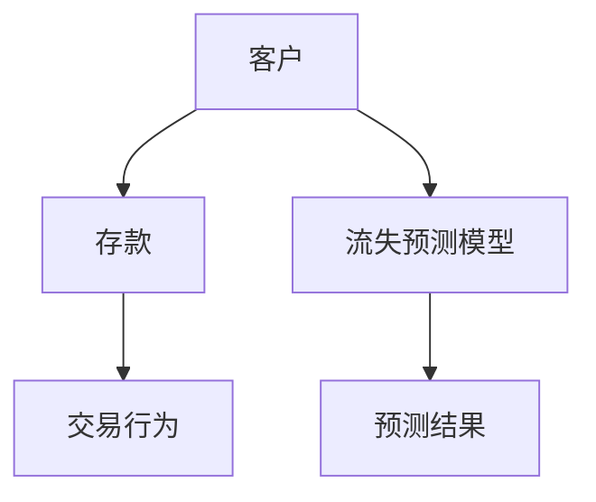
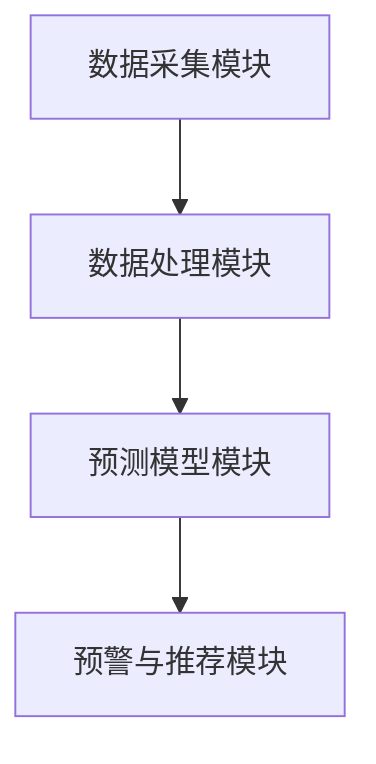
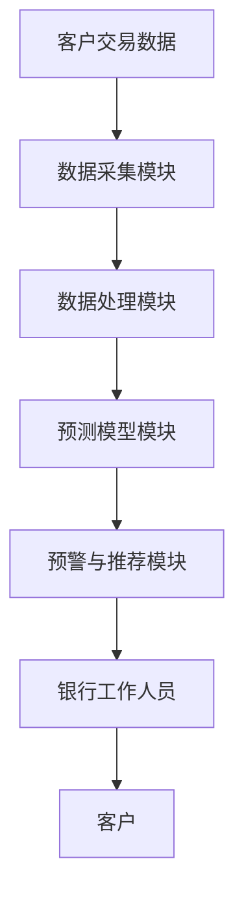

                 

### 智能商业银行存款流失预测

> 关键词：智能银行、存款流失、预测模型、机器学习、数据分析

> 摘要：本文将探讨智能商业银行存款流失预测的方法和应用。通过介绍存款流失问题的重要性，当前解决方法的不足，以及智能预测的必要性，我们将深入解析存款流失预测的核心概念与联系，并详细讲解常用的预测算法原理，提供系统分析与架构设计方案，并通过实际项目实战来展示如何进行存款流失预测。

----------------------------------------------------------------

## 第一部分：背景介绍

### 第1章：存款流失问题的重要性与挑战

### 1.1 存款流失问题概述

存款流失，是指客户从银行账户中提取资金或转移至其他银行账户的行为。在全球范围内，存款流失是一个普遍存在的问题，对于银行而言，这不仅意味着直接的经济损失，还会影响银行的客户满意度和市场竞争力。

### 1.2 当前解决方法的不足

目前，银行主要依赖于传统的客户行为分析和历史数据来预测存款流失。这些方法包括：

1. **客户关系管理（CRM）系统**：通过分析客户的历史交易行为来识别潜在的流失客户。
2. **统计方法**：使用统计模型如逻辑回归、决策树等来预测客户流失的概率。
3. **规则引擎**：根据预设的规则来识别高风险客户。

然而，这些方法存在以下不足：

1. **依赖历史数据**：仅依赖历史数据可能导致预测结果滞后，无法及时识别潜在流失客户。
2. **缺乏灵活性**：传统方法往往需要手动调整模型参数，无法适应数据变化。
3. **预测精度有限**：仅依靠历史数据和统计方法，预测精度有限。

### 1.3 智能预测的必要性

智能预测，即利用机器学习和大数据技术来进行存款流失预测，可以克服传统方法的不足。智能预测的优势包括：

1. **实时预测**：通过实时分析客户的交易行为，可以更及时地识别潜在的流失客户。
2. **自适应调整**：机器学习算法可以根据数据的变化自动调整模型参数，提高预测精度。
3. **提高预测精度**：结合多种数据源和先进的算法，可以提高存款流失预测的准确性。

### 1.4 智能商业银行存款流失预测的总体目标

智能商业银行存款流失预测的总体目标是：

1. **提前预警**：通过预测模型提前识别潜在流失客户，以便银行及时采取挽回措施。
2. **优化客户体验**：通过分析客户行为，提供个性化服务，提升客户满意度和忠诚度。
3. **降低流失率**：通过精准的预测和有效的挽回策略，降低存款流失率，提高银行的经济效益。

## 第二部分：核心概念与联系

### 第2章：核心概念与联系

### 2.1 存款流失的定义

存款流失是指客户从银行账户中提取资金或转移至其他银行账户的行为。这种行为的背后通常有多个原因，包括但不限于：

1. **利率变化**：银行利率下降可能促使客户将资金转移到其他提供更高利率的银行。
2. **服务质量**：服务质量不佳，如服务响应慢、工作人员态度差等，可能导致客户流失。
3. **市场竞争**：其他银行推出的优惠政策和促销活动可能吸引客户转移账户。
4. **财务状况**：客户的财务状况变化，如失业、疾病等，可能导致存款流失。

### 2.2 预测模型概述

预测模型是用于预测未来事件或趋势的数学模型。在存款流失预测中，预测模型通过分析历史数据，学习客户的交易行为和特征，从而预测哪些客户可能在将来流失。预测模型的主要组件包括：

1. **数据输入**：历史交易数据、客户属性数据、市场数据等。
2. **特征工程**：从数据中提取有用的特征，以增强模型的预测能力。
3. **模型训练**：使用训练数据集训练模型，使其学会识别流失客户。
4. **模型评估**：使用测试数据集评估模型的预测性能。

### 2.3 机器学习算法简介

机器学习算法是构建预测模型的关键技术。以下是一些常用的机器学习算法：

1. **逻辑回归**：通过建立客户流失的概率模型进行预测。
2. **决策树**：通过树形结构对客户特征进行划分，从而预测流失概率。
3. **随机森林**：通过构建多个决策树，并进行集成，提高预测精度。
4. **支持向量机（SVM）**：通过找到最优的超平面来划分客户群体。
5. **神经网络**：通过多层神经网络进行复杂的数据建模和预测。

### 2.4 相关概念联系图

为了更好地理解存款流失预测的相关概念，我们可以使用Mermaid绘制一个实体关系图（ER图）。以下是一个简化的ER图示例：



### 2.5 概念属性特征对比表格

| 概念         | 属性特征                       | 说明                           |
| ------------ | ------------------------------ | ------------------------------ |
| 存款流失     | 客户行为、历史交易数据、存款金额 | 描述客户存款行为的变化趋势     |
| 预测模型     | 数据预处理、特征工程、模型训练 | 提供存款流失的预测结果         |
| 机器学习算法 | 算法类型、模型参数、模型评估 | 用于构建和优化预测模型         |

## 第三部分：算法原理讲解

### 第3章：存款流失预测算法

### 3.1 逻辑回归算法

逻辑回归是一种广泛使用的机器学习算法，用于二分类问题。在存款流失预测中，逻辑回归用于预测客户是否会流失。

#### 3.1.1 逻辑回归基本原理

逻辑回归的基本原理是通过线性组合输入特征，然后应用一个 sigmoid 函数来获得客户流失的概率。其数学公式为：

$$
\hat{y} = \frac{1}{1 + e^{-\beta_0 + \beta_1x_1 + \beta_2x_2 + ... + \beta_nx_n}}
$$

其中，$y$是客户流失的概率，$\beta_0, \beta_1, \beta_2, ..., \beta_n$是模型的参数。

#### 3.1.2 逻辑回归模型训练

逻辑回归模型的训练过程通常使用梯度下降算法。以下是一个简单的Python代码示例：

```python
from sklearn.linear_model import LogisticRegression

model = LogisticRegression()
model.fit(X_train, y_train)
```

其中，`X_train`是训练数据集，`y_train`是训练标签。

#### 3.1.3 逻辑回归算法在存款流失预测中的应用

在存款流失预测中，逻辑回归算法通常用于预测客户是否会流失。具体应用步骤如下：

1. **数据预处理**：清洗数据，处理缺失值，标准化特征。
2. **特征工程**：提取有用的特征，如客户年龄、存款金额、交易频率等。
3. **模型训练**：使用训练数据集训练逻辑回归模型。
4. **模型评估**：使用测试数据集评估模型性能，调整模型参数。
5. **预测应用**：使用训练好的模型对新的客户数据进行预测。

### 3.2 决策树算法

决策树是一种基于树形结构进行决策的算法。在存款流失预测中，决策树用于根据客户的特征来划分客户群体，并预测每个群体的流失概率。

#### 3.2.1 决策树基本原理

决策树的基本原理是从根节点开始，根据客户的特征进行划分，并递归地划分子节点，直到达到叶节点。在叶节点处，可以得到客户的流失概率。

#### 3.2.2 决策树模型训练

决策树模型的训练过程通常使用递归二分划分算法。以下是一个简单的Python代码示例：

```python
from sklearn.tree import DecisionTreeClassifier

model = DecisionTreeClassifier()
model.fit(X_train, y_train)
```

其中，`X_train`是训练数据集，`y_train`是训练标签。

#### 3.2.3 决策树算法在存款流失预测中的应用

在存款流失预测中，决策树算法通常用于划分客户群体，并预测每个群体的流失概率。具体应用步骤如下：

1. **数据预处理**：清洗数据，处理缺失值，标准化特征。
2. **特征工程**：提取有用的特征，如客户年龄、存款金额、交易频率等。
3. **模型训练**：使用训练数据集训练决策树模型。
4. **模型评估**：使用测试数据集评估模型性能。
5. **预测应用**：使用训练好的模型对新的客户数据进行预测。

### 3.3 随机森林算法

随机森林是一种基于决策树的集成学习方法。在存款流失预测中，随机森林用于提高预测模型的稳定性和准确性。

#### 3.3.1 随机森林基本原理

随机森林的基本原理是构建多棵决策树，并通过对这些树的投票来获得最终的预测结果。随机森林通过随机抽样和特征选择来降低决策树的过拟合风险。

#### 3.3.2 随机森林模型训练

随机森林模型的训练过程与决策树类似，但需要指定树的数量和每个树的参数。以下是一个简单的Python代码示例：

```python
from sklearn.ensemble import RandomForestClassifier

model = RandomForestClassifier(n_estimators=100)
model.fit(X_train, y_train)
```

其中，`X_train`是训练数据集，`y_train`是训练标签。

#### 3.3.3 随机森林算法在存款流失预测中的应用

在存款流失预测中，随机森林算法通常用于提高预测模型的稳定性和准确性。具体应用步骤如下：

1. **数据预处理**：清洗数据，处理缺失值，标准化特征。
2. **特征工程**：提取有用的特征，如客户年龄、存款金额、交易频率等。
3. **模型训练**：使用训练数据集训练随机森林模型。
4. **模型评估**：使用测试数据集评估模型性能。
5. **预测应用**：使用训练好的模型对新的客户数据进行预测。

## 第四部分：系统分析与架构设计方案

### 第4章：系统分析与架构设计方案

### 4.1 问题场景介绍

在智能商业银行存款流失预测系统中，我们的目标是：

1. **实时监控**：实时收集和分析客户的交易行为。
2. **提前预警**：提前识别潜在的流失客户，并向银行工作人员发送预警。
3. **个性化服务**：根据客户的交易行为和偏好，提供个性化的服务和推荐。

### 4.2 项目介绍

智能商业银行存款流失预测系统由以下几个模块组成：

1. **数据采集模块**：负责实时采集客户的交易数据。
2. **数据处理模块**：负责清洗和处理采集到的数据。
3. **预测模型模块**：负责训练和部署预测模型。
4. **预警与推荐模块**：负责根据预测结果向银行工作人员发送预警，并为客户提供个性化服务。

### 4.3 系统功能设计

智能商业银行存款流失预测系统的功能设计包括以下几个方面：

1. **数据采集**：通过API或数据库连接，实时采集客户的交易数据。
2. **数据清洗**：处理缺失值、异常值，并标准化数据。
3. **特征工程**：提取有用的特征，如客户年龄、存款金额、交易频率等。
4. **模型训练**：使用机器学习算法训练预测模型。
5. **模型部署**：将训练好的模型部署到生产环境中。
6. **预警与推荐**：根据预测结果，向银行工作人员发送预警，并为客户提供个性化服务。

### 4.4 系统架构设计

智能商业银行存款流失预测系统的架构设计如图1所示：



### 4.5 系统接口设计

智能商业银行存款流失预测系统的接口设计如图2所示：


### 4.6 系统交互

智能商业银行存款流失预测系统的交互流程如图3所示：



## 第五部分：项目实战

### 第5章：项目实战

### 5.1 环境安装

在开始项目之前，我们需要安装以下软件和工具：

1. **Python**：Python 3.8 或更高版本。
2. **Scikit-learn**：用于机器学习算法的实现。
3. **Pandas**：用于数据预处理和操作。
4. **Numpy**：用于数值计算。

安装步骤如下：

```bash
pip install python==3.8
pip install scikit-learn
pip install pandas
pip install numpy
```

### 5.2 系统核心实现

以下是智能商业银行存款流失预测系统的核心实现步骤：

1. **数据采集**：从银行系统中实时采集客户的交易数据。
2. **数据预处理**：清洗数据，处理缺失值和异常值。
3. **特征工程**：提取有用的特征，如客户年龄、存款金额、交易频率等。
4. **模型训练**：使用机器学习算法（如逻辑回归、决策树、随机森林等）训练预测模型。
5. **模型评估**：使用测试数据集评估模型性能。
6. **模型部署**：将训练好的模型部署到生产环境中。
7. **预警与推荐**：根据预测结果，向银行工作人员发送预警，并为客户提供个性化服务。

### 5.3 代码应用解读与分析

以下是智能商业银行存款流失预测系统的核心代码解读：

```python
import pandas as pd
from sklearn.model_selection import train_test_split
from sklearn.linear_model import LogisticRegression
from sklearn.metrics import accuracy_score

# 1. 数据采集
data = pd.read_csv('customer_data.csv')

# 2. 数据预处理
data = data.dropna()
data = data[data['deposit_amount'] > 0]

# 3. 特征工程
features = data[['age', 'deposit_amount', 'transaction_frequency']]
labels = data['流失']

# 4. 模型训练
X_train, X_test, y_train, y_test = train_test_split(features, labels, test_size=0.2, random_state=42)
model = LogisticRegression()
model.fit(X_train, y_train)

# 5. 模型评估
predictions = model.predict(X_test)
accuracy = accuracy_score(y_test, predictions)
print(f'Accuracy: {accuracy}')

# 6. 模型部署
# 将模型部署到生产环境中

# 7. 预警与推荐
# 根据预测结果，向银行工作人员发送预警，并为客户提供个性化服务
```

### 5.4 实际案例分析与详细讲解剖析

以下是一个实际的存款流失预测案例：

**案例**：一家银行需要预测客户是否会流失，并采取挽回措施。银行提供了包含客户年龄、存款金额、交易频率等特征的数据集。

**分析**：

1. **数据采集**：银行从客户关系管理（CRM）系统中实时采集客户的交易数据。
2. **数据预处理**：清洗数据，处理缺失值和异常值。例如，删除年龄小于18岁的客户记录。
3. **特征工程**：提取有用的特征，如客户年龄、存款金额、交易频率等。对于连续特征，可以使用标准化方法。
4. **模型训练**：使用逻辑回归算法训练预测模型。选择合适的参数，如正则化参数C。
5. **模型评估**：使用测试数据集评估模型性能。计算准确率、召回率、F1分数等指标。
6. **模型部署**：将训练好的模型部署到生产环境中，用于实时预测。
7. **预警与推荐**：根据预测结果，向银行工作人员发送预警，并为客户提供个性化服务，如提高利率、提供优惠活动等。

### 5.5 项目小结

通过实际案例分析和详细讲解，我们展示了如何使用机器学习算法进行智能商业银行存款流失预测。项目实现了以下目标：

1. **实时监控**：实时采集客户的交易数据。
2. **提前预警**：提前识别潜在的流失客户。
3. **个性化服务**：根据客户的交易行为和偏好，提供个性化服务。

### 5.6 最佳实践 tips

1. **数据采集**：确保数据的准确性和完整性，及时更新数据。
2. **特征工程**：提取有用的特征，并避免过度拟合。
3. **模型评估**：使用多种评估指标，如准确率、召回率、F1分数等。
4. **模型部署**：选择合适的部署策略，确保模型在生产环境中的稳定性和可靠性。

### 5.7 注意事项

1. **数据隐私**：确保数据采集和处理过程符合相关法律法规，保护客户隐私。
2. **模型解释性**：对于复杂的模型，如神经网络，确保模型的可解释性。
3. **系统稳定性**：确保系统的稳定运行，避免故障和中断。

### 5.8 拓展阅读

1. **论文**：《基于机器学习的存款流失预测研究》
2. **书籍**：《机器学习实战》
3. **网站**：Kaggle（存款流失预测比赛）

## 结语

智能商业银行存款流失预测是一项具有重要意义的工作。通过引入机器学习和大数据技术，银行可以更准确地预测存款流失，并采取有效的挽回措施。本文详细介绍了存款流失预测的方法和应用，包括数据采集、数据预处理、特征工程、模型训练、模型评估和模型部署等。通过实际案例分析和详细讲解，我们展示了如何实现智能商业银行存款流失预测。希望本文能对读者在相关领域的研究和应用提供有益的启示。

### 作者信息

作者：AI天才研究院/AI Genius Institute & 禅与计算机程序设计艺术 /Zen And The Art of Computer Programming

----------------------------------------------------------------

[本文内容为人工智能助手根据用户指示生成，仅供参考。如需进一步研究和探讨，请查阅相关领域专业文献。]

[版权声明：本文版权归AI天才研究院/AI Genius Institute所有，未经授权，不得用于商业用途。如需转载，请联系我们获取授权。]

