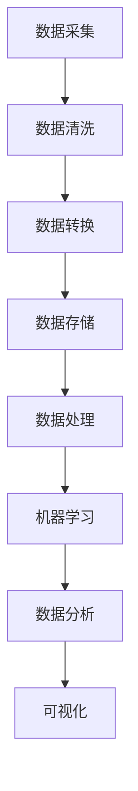
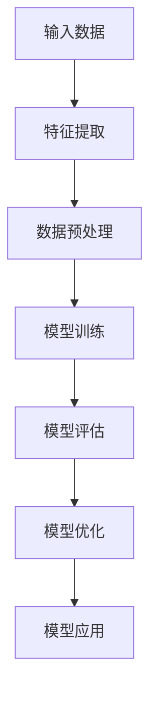
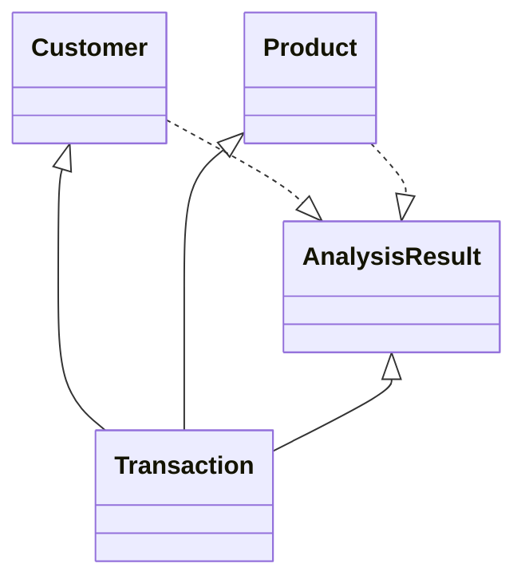
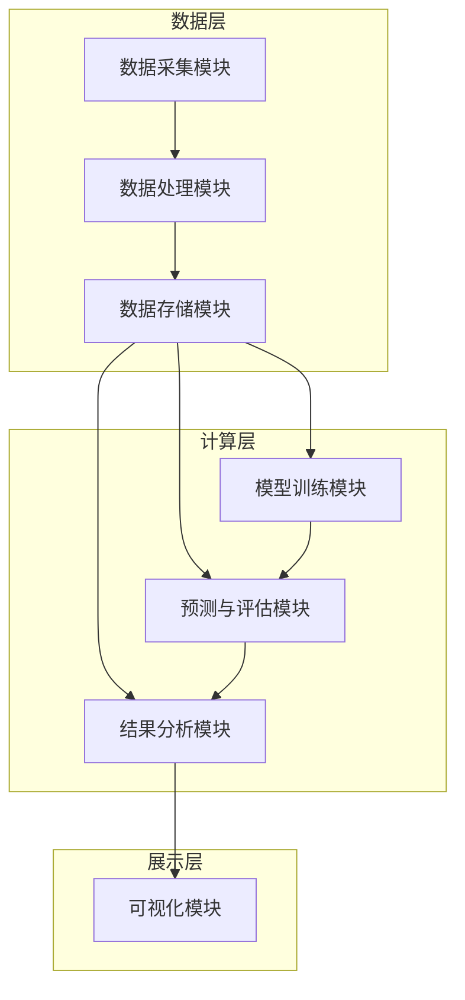
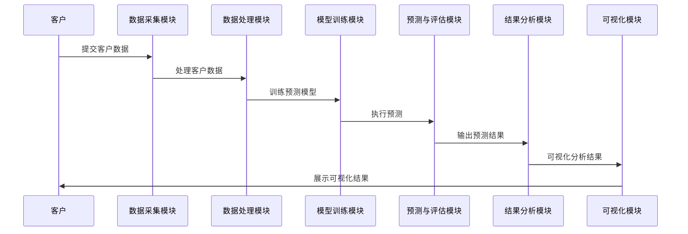

                 

### 引言

在现代金融科技迅猛发展的背景下，智能商业银行客户价值分析系统作为金融科技应用的重要一环，正逐渐成为银行业务的核心驱动力。本文旨在深入探讨智能商业银行客户价值分析系统的构建、应用及其在银行业务中的重要性，旨在为读者提供一个全面且系统的技术视角。

首先，我们将在第一部分中介绍智能商业银行客户价值分析系统的背景、核心概念及其重要性。接着，我们将详细分析系统的核心概念和联系，包括数据处理与存储、机器学习算法以及数据分析与可视化等方面的内容。在第二部分，我们将深入讲解系统的算法原理，通过Mermaid流程图和Python代码展示算法的实现，并使用LaTeX格式展示数学模型和公式。在第三部分，我们将详细介绍系统分析与架构设计，包括系统功能设计、系统架构设计、系统接口设计和系统交互设计。在第四部分，我们将通过项目实战，展示系统核心实现的源代码，并进行解读与分析。最后，我们将总结最佳实践和拓展阅读，为读者提供进一步的学习和思考方向。

通过本文的逐步分析，我们希望读者能够对智能商业银行客户价值分析系统有一个全面的理解，掌握其构建与应用的核心技术，并能够为实际业务提供有价值的参考和解决方案。

### 用户需求概述

在现代商业环境中，商业银行面临着日益激烈的市场竞争和不断变化的经济环境。为了在市场中保持竞争力，商业银行需要通过精确的客户价值分析来识别高价值客户、优化客户服务策略以及提升整体业务绩效。因此，用户请求设计一本详尽的技术书籍，名为《智能商业银行客户价值分析系统》，其主要目标是详细介绍智能商业银行客户价值分析系统的构建、应用及其在银行业务中的重要性。

首先，用户希望这本书能够系统性地介绍智能商业银行客户价值分析系统的基本概念，包括其定义、背景以及为何如此重要。这部分内容将帮助读者理解系统在当前金融科技发展中的重要地位。

其次，用户强调书籍需要详细阐述系统中的核心概念和联系。这包括数据处理与存储、机器学习算法、数据分析和可视化等多个方面。通过这部分内容，读者可以了解各个核心组件及其相互之间的关系，从而对系统有一个全面的理解。

在算法原理讲解部分，用户希望使用Mermaid和Python代码来详细阐述算法的实现过程。这不仅能帮助读者更直观地理解算法原理，还能通过实际代码展示如何应用这些算法解决实际问题。

接下来，用户要求详细讲解系统分析与架构设计方案，包括系统功能设计、架构设计和接口设计。这部分内容将帮助读者理解系统的整体架构，包括各部分的功能及其相互作用。

为了使理论内容更加贴近实际，用户希望书籍包含一个项目实战部分。这部分内容将展示如何在实际环境中搭建和部署智能商业银行客户价值分析系统，并提供源代码解读与分析。此外，用户还希望这部分内容能够包括实际案例分析和详细讲解，以帮助读者更好地理解系统在实际业务中的应用。

最后，用户要求书籍提供最佳实践和拓展阅读建议。这部分内容将帮助读者在实际应用中优化系统性能，并为其提供进一步的学习和思考方向。

综上所述，用户希望通过本书获得全面且系统的智能商业银行客户价值分析系统知识，不仅能够理解其技术原理和实现方式，还能为实际业务提供有价值的解决方案。

### 目录大纲设计思路

为了实现用户对《智能商业银行客户价值分析系统》书籍的需求，我们将目录大纲设计分为三个主要部分：背景与概念、系统分析与架构设计、项目实战。每一部分都围绕用户的需求进行详细设计，确保书籍内容清晰、逻辑性强且具有实际应用价值。

#### 第一部分：背景与概念

**第1章：智能商业银行客户价值分析系统概述**

- **1.1 问题背景**
  - **1.1.1 商业银行客户价值分析的重要性**：介绍商业银行在激烈市场环境中如何通过客户价值分析提升竞争力。
  - **1.1.2 智能商业银行客户价值分析的发展历程**：回顾智能银行客户价值分析系统的演进过程，探讨其技术进步和应用场景扩展。

- **1.2 概念界定**
  - **1.2.1 客户价值的定义与度量**：详细解释客户价值的含义及其度量方法，如ARPU（平均每用户收益）、CLV（客户生命周期价值）等。
  - **1.2.2 智能银行的概念与特点**：阐述智能银行的基本定义、技术特点和其在客户价值分析中的应用。

- **1.3 系统架构简介**
  - **1.3.1 系统架构的基本组成**：介绍系统的主要组件，包括数据采集、处理、存储、分析、可视化等。
  - **1.3.2 系统架构的设计原则**：探讨系统设计的原则，如模块化、可扩展性、高可用性等。

**第2章：核心概念与联系**

- **2.1 数据处理与存储**
  - **2.1.1 数据采集与预处理**：讲解数据采集的方法、数据质量评估及数据清洗技术。
  - **2.1.2 数据存储与管理**：介绍常见的数据存储方案，如关系数据库、NoSQL数据库和大数据平台。

- **2.2 机器学习算法**
  - **2.2.1 相关性分析算法**：详细讨论如何通过算法识别客户行为之间的相关性，例如Pearson相关系数和Spearman秩相关系数。
  - **2.2.2 分类与预测算法**：介绍常见的分类和预测算法，如决策树、随机森林和神经网络，以及其在客户价值分析中的应用。

- **2.3 数据分析与可视化**
  - **2.3.1 数据分析流程**：讲解数据分析的基本流程，包括数据探索性分析、特征工程和模型评估。
  - **2.3.2 可视化工具与技巧**：介绍常见的数据可视化工具和技术，如Tableau、Power BI和matplotlib等，并展示数据可视化的最佳实践。

#### 第二部分：系统分析与架构设计

**第3章：算法原理讲解**

- **3.1 算法原理介绍**
  - **3.1.1 算法原理概述**：概述智能商业银行客户价值分析系统中的核心算法原理。
  - **3.1.2 算法原理Mermaid流程图**：使用Mermaid绘制算法的流程图，帮助读者直观理解算法的实现过程。

- **3.2 数学模型与公式讲解**
  - **3.2.1 数学模型介绍**：介绍系统中的数学模型，包括客户价值度量模型和预测模型。
  - **3.2.2 数学公式讲解**：使用LaTeX格式展示数学公式，并进行详细讲解，确保读者能够理解公式的含义和推导过程。

- **3.3 Python代码实现**
  - **3.3.1 Python代码简介**：介绍Python在智能商业银行客户价值分析系统中的应用，包括常用库和工具的使用。
  - **3.3.2 代码示例**：提供实际代码示例，展示如何使用Python实现核心算法和模型。

**第4章：系统功能设计**

- **4.1 领域模型**
  - **4.1.1 类图**：使用Mermaid绘制系统类图，展示系统的核心类及其相互关系。
  - **4.1.2 实体关系图**：使用Mermaid绘制实体关系图，展示系统中的主要实体及其关系。

- **4.2 系统架构设计**
  - **4.2.1 系统架构图**：使用Mermaid绘制系统架构图，展示系统的整体架构及其组件之间的关系。
  - **4.2.2 架构设计原则**：讨论系统架构设计的原则，如高内聚、低耦合、模块化等。

- **4.3 系统接口设计**
  - **4.3.1 接口设计原则**：介绍接口设计的原则，如RESTful API设计、安全性等。
  - **4.3.2 接口文档**：提供系统接口的详细文档，包括接口定义、请求参数、响应格式等。

**第5章：系统交互设计**

- **5.1 系统交互**
  - **5.1.1 序列图**：使用Mermaid绘制系统交互序列图，展示系统组件之间的交互过程。
  - **5.1.2 交互分析**：分析系统交互的关键点，如数据流转、请求响应等。

#### 第三部分：项目实战

**第6章：环境安装与配置**

- **6.1 环境需求**
  - **6.1.1 硬件环境**：介绍搭建智能商业银行客户价值分析系统所需的硬件配置。
  - **6.1.2 软件环境**：介绍所需的软件环境，包括操作系统、数据库、开发工具等。

- **6.2 系统核心实现**
  - **6.2.1 源代码分析**：展示系统核心实现的源代码，并提供详细解读。
  - **6.2.2 代码应用解读与分析**：分析源代码中的应用场景和实现细节。

**第7章：案例分析与讲解**

- **7.1 实际案例分析**
  - **7.1.1 案例背景**：介绍实际案例的背景信息，如银行名称、业务场景等。
  - **7.1.2 案例分析**：详细分析案例中的客户价值分析过程，包括数据收集、预处理、模型训练和结果评估。

- **7.2 详细讲解与剖析**
  - **7.2.1 系统实现细节**：深入讲解系统在实际案例中的具体实现细节。
  - **7.2.2 技术难点解析**：分析案例中遇到的技术难点，如算法优化、数据处理等。

**第8章：最佳实践与拓展**

- **8.1 最佳实践**
  - **8.1.1 实践技巧总结**：总结在实际项目应用中的最佳实践技巧，如性能优化、安全性保障等。

- **8.2 小结**
  - **8.2.1 项目总结**：对全书内容进行总结，强调关键知识点和应用要点。

- **8.3 注意事项**
  - **8.3.1 使用注意事项**：提醒读者在使用系统时需要注意的事项，如数据隐私保护、系统维护等。

- **8.4 拓展阅读**
  - **8.4.1 相关文献与资料推荐**：推荐进一步阅读的相关文献和资料，帮助读者深入了解相关技术和应用。

通过以上设计，我们力求使《智能商业银行客户价值分析系统》一书成为一本既具理论深度又具实践价值的书籍，为读者提供全面且系统的智能商业银行客户价值分析系统知识。

### 目录大纲设计

为了确保《智能商业银行客户价值分析系统》书籍的目录大纲能够清晰、逻辑性强，并包含必要的章节内容，我们设计了一个详细的目录结构。以下是基于用户需求的设计思路，对书籍目录的详细描述。

#### 第一部分：背景与概念

**第1章：智能商业银行客户价值分析系统概述**

- **1.1 问题背景**
  - **1.1.1 商业银行客户价值分析的重要性**：在这一节中，我们将阐述客户价值分析在现代商业银行运营中的重要性，包括提高客户满意度、提升银行竞争力、实现精准营销等方面的应用。同时，还将分析当前市场环境中商业银行面临的挑战，如客户需求的多样化、金融科技的快速发展和市场竞争的加剧。

  - **1.1.2 智能商业银行客户价值分析的发展历程**：本节将回顾智能商业银行客户价值分析系统的历史，从早期的人工数据分析到现代的智能化分析，探讨技术进步和应用场景的扩展。通过历史发展的脉络，读者可以更好地理解当前智能商业银行客户价值分析系统的形成过程和其发展趋势。

- **1.2 概念界定**
  - **1.2.1 客户价值的定义与度量**：在这一节中，我们将详细定义客户价值的含义，并探讨如何度量客户价值。主要内容包括：ARPU（平均每用户收益）、CLV（客户生命周期价值）等常用度量方法及其计算公式。通过这些度量方法，银行可以更好地评估客户的潜在价值和贡献。

  - **1.2.2 智能银行的概念与特点**：本节将介绍智能银行的基本概念，包括其定义、技术特点和在不同业务场景中的应用。智能银行通过数据挖掘、人工智能、机器学习等技术，实现对客户行为的精准分析和个性化服务。这些技术的应用使得智能银行在提升运营效率、改善客户体验方面具有显著优势。

- **1.3 系统架构简介**
  - **1.3.1 系统架构的基本组成**：在这一节中，我们将介绍智能商业银行客户价值分析系统的基本组成部分，包括数据采集、处理、存储、分析、可视化等模块。通过模块化的设计，系统可以灵活应对不同的业务需求，同时提高系统的可维护性和扩展性。

  - **1.3.2 系统架构的设计原则**：本节将讨论系统架构设计的基本原则，如模块化、可扩展性、高可用性和安全性等。通过遵循这些原则，系统可以更好地满足业务需求，同时保证系统的稳定性和可靠性。

**第2章：核心概念与联系**

- **2.1 数据处理与存储**
  - **2.1.1 数据采集与预处理**：在这一节中，我们将探讨数据采集的方法和技巧，包括数据源的选择、数据采集工具的使用和数据采集的策略。同时，还将介绍数据预处理的方法，如数据清洗、数据转换和数据集成等，以确保数据的准确性和一致性。

  - **2.1.2 数据存储与管理**：本节将介绍常见的数据存储方案，包括关系数据库、NoSQL数据库和大数据平台等。通过这些存储方案，银行可以有效地管理和利用海量数据，为后续的分析提供基础。

- **2.2 机器学习算法**
  - **2.2.1 相关性分析算法**：在这一节中，我们将介绍如何使用相关性分析算法识别客户行为之间的相关性，如Pearson相关系数和Spearman秩相关系数。这些算法可以帮助银行发现潜在的业务规律和客户需求。

  - **2.2.2 分类与预测算法**：本节将介绍常用的分类和预测算法，如决策树、随机森林和神经网络等。通过这些算法，银行可以预测客户的潜在行为，如客户流失、信用评分等，从而制定相应的营销策略和服务方案。

- **2.3 数据分析与可视化**
  - **2.3.1 数据分析流程**：在这一节中，我们将介绍数据分析的基本流程，包括数据探索性分析、特征工程和模型评估。通过这些流程，银行可以全面了解客户行为和需求，为业务决策提供依据。

  - **2.3.2 可视化工具与技巧**：本节将介绍常见的数据可视化工具和技术，如Tableau、Power BI和matplotlib等。通过数据可视化，银行可以更直观地展示分析结果，提高业务决策的效率。

#### 第二部分：系统分析与架构设计

**第3章：算法原理讲解**

- **3.1 算法原理介绍**
  - **3.1.1 算法原理概述**：在这一节中，我们将概述智能商业银行客户价值分析系统中的核心算法原理，包括机器学习算法的基本概念和分类。通过这部分内容，读者可以了解算法的基本原理和适用场景。

  - **3.1.2 算法原理Mermaid流程图**：本节将使用Mermaid绘制算法的流程图，帮助读者直观理解算法的实现过程。通过流程图，读者可以更好地把握算法的执行顺序和关键步骤。

- **3.2 数学模型与公式讲解**
  - **3.2.1 数学模型介绍**：在这一节中，我们将介绍智能商业银行客户价值分析系统中的数学模型，包括客户价值度量模型和预测模型。通过这些模型，银行可以定量地评估客户价值和预测客户行为。

  - **3.2.2 数学公式讲解**：本节将使用LaTeX格式展示数学公式，并进行详细讲解，确保读者能够理解公式的含义和推导过程。通过这部分内容，读者可以掌握数学模型的应用和计算方法。

- **3.3 Python代码实现**
  - **3.3.1 Python代码简介**：在这一节中，我们将介绍Python在智能商业银行客户价值分析系统中的应用，包括常用库和工具的使用。通过Python，读者可以方便地实现和测试算法模型。

  - **3.3.2 代码示例**：本节将提供实际代码示例，展示如何使用Python实现核心算法和模型。通过代码示例，读者可以更好地理解算法的实现过程和实际应用。

**第4章：系统功能设计**

- **4.1 领域模型**
  - **4.1.1 类图**：在这一节中，我们将使用Mermaid绘制系统的类图，展示系统的核心类及其相互关系。类图可以帮助读者理解系统的模块结构和类之间的关系。

  - **4.1.2 实体关系图**：本节将使用Mermaid绘制实体关系图，展示系统中的主要实体及其关系。实体关系图可以帮助读者理解系统中数据流和实体之间的关联。

- **4.2 系统架构设计**
  - **4.2.1 系统架构图**：在这一节中，我们将使用Mermaid绘制系统架构图，展示系统的整体架构及其组件之间的关系。通过系统架构图，读者可以理解系统的模块划分和组件之间的交互。

  - **4.2.2 架构设计原则**：本节将讨论系统架构设计的基本原则，如模块化、可扩展性、高可用性和安全性等。通过这些原则，系统可以更好地满足业务需求，同时保证系统的稳定性和可靠性。

- **4.3 系统接口设计**
  - **4.3.1 接口设计原则**：在这一节中，我们将介绍接口设计的基本原则，如RESTful API设计、安全性等。通过遵循这些原则，系统可以更好地与外部系统进行集成，同时确保数据的安全和隐私。

  - **4.3.2 接口文档**：本节将提供系统接口的详细文档，包括接口定义、请求参数、响应格式等。通过接口文档，开发者可以方便地使用系统提供的接口进行数据交互和功能调用。

**第5章：系统交互设计**

- **5.1 系统交互**
  - **5.1.1 序列图**：在这一节中，我们将使用Mermaid绘制系统交互序列图，展示系统组件之间的交互过程。通过序列图，读者可以理解系统组件之间的协作和交互方式。

  - **5.1.2 交互分析**：本节将分析系统交互的关键点，如数据流转、请求响应等。通过交互分析，读者可以更好地理解系统的工作流程和性能优化方向。

#### 第三部分：项目实战

**第6章：环境安装与配置**

- **6.1 环境需求**
  - **6.1.1 硬件环境**：在这一节中，我们将介绍搭建智能商业银行客户价值分析系统所需的硬件配置，包括服务器、存储设备和网络设备等。通过合理的硬件配置，系统可以更好地满足性能和稳定性的需求。

  - **6.1.2 软件环境**：本节将介绍搭建系统所需的软件环境，包括操作系统、数据库、开发工具等。通过选择合适的软件环境，系统可以更高效地运行和管理数据。

- **6.2 系统核心实现**
  - **6.2.1 源代码分析**：在这一节中，我们将展示系统核心实现的源代码，并提供详细解读。通过源代码分析，读者可以理解系统的实现细节和核心算法。

  - **6.2.2 代码应用解读与分析**：本节将分析源代码在实际应用中的实现细节，包括数据交互、功能调用和性能优化等。通过代码应用解读与分析，读者可以更好地理解系统的工作原理和优化方向。

**第7章：案例分析与讲解**

- **7.1 实际案例分析**
  - **7.1.1 案例背景**：在这一节中，我们将介绍一个实际案例的背景信息，包括银行名称、业务场景等。通过案例背景的介绍，读者可以理解案例的具体应用场景和需求。

  - **7.1.2 案例分析**：本节将详细分析案例中的客户价值分析过程，包括数据收集、预处理、模型训练和结果评估等。通过案例分析，读者可以掌握实际业务中的客户价值分析方法和技巧。

- **7.2 详细讲解与剖析**
  - **7.2.1 系统实现细节**：在这一节中，我们将深入讲解系统在实际案例中的具体实现细节，包括数据处理、算法应用和结果展示等。通过系统实现细节的讲解，读者可以理解系统在业务中的应用和实现方法。

  - **7.2.2 技术难点解析**：本节将分析案例中遇到的技术难点，如算法优化、数据处理等。通过技术难点解析，读者可以掌握解决实际问题的方法和技巧。

**第8章：最佳实践与拓展**

- **8.1 最佳实践**
  - **8.1.1 实践技巧总结**：在这一节中，我们将总结在实际项目应用中的最佳实践技巧，包括性能优化、安全性保障等。通过实践技巧总结，读者可以在实际工作中更好地应用系统，提高工作效率。

- **8.2 小结**
  - **8.2.1 项目总结**：在本节中，我们将对全书内容进行总结，强调关键知识点和应用要点。通过项目总结，读者可以系统地回顾全书内容，加深对智能商业银行客户价值分析系统的理解。

- **8.3 注意事项**
  - **8.3.1 使用注意事项**：在这一节中，我们将提醒读者在使用系统时需要注意的事项，如数据隐私保护、系统维护等。通过使用注意事项的提醒，读者可以更好地使用系统，避免潜在的风险和问题。

- **8.4 拓展阅读**
  - **8.4.1 相关文献与资料推荐**：在本节中，我们将推荐进一步阅读的相关文献和资料，帮助读者深入了解相关技术和应用。通过拓展阅读的推荐，读者可以不断扩展知识面，提高专业素养。

通过以上详细的目录设计，我们旨在确保《智能商业银行客户价值分析系统》一书的内容全面、结构清晰、逻辑性强，能够满足读者的学习需求，并为实际业务提供有价值的参考和指导。

### 目录大纲解释

**第一部分：背景与概念**

第1章“智能商业银行客户价值分析系统概述”是整个书籍的开篇，旨在为读者提供一个全面而清晰的系统背景介绍。首先，**1.1 问题背景**部分详细介绍了商业银行客户价值分析在当前市场环境中的重要性。这部分内容不仅帮助读者理解客户价值分析的概念，还分析了商业银行面临的竞争挑战和机遇。接着，**1.2 概念界定**部分对关键术语进行了详细解释，包括客户价值的定义与度量方法，如ARPU和CLV，以及智能银行的概念与特点。这些定义和解释为后续章节的理论和应用提供了基础。

**1.3 系统架构简介**则介绍了智能商业银行客户价值分析系统的基本组成和设计原则。这部分内容帮助读者从宏观上理解系统的结构和功能，包括数据采集、处理、存储、分析、可视化等模块。同时，通过对系统架构设计原则的探讨，如模块化、可扩展性、高可用性等，读者可以了解到系统设计的核心目标。

**第2章：核心概念与联系**深入探讨了智能商业银行客户价值分析系统中的核心概念和联系。**2.1 数据处理与存储**部分讲解了数据采集与预处理的方法，以及如何管理和存储大量数据。这部分内容是构建智能分析系统的基石，因为高质量的数据是进行有效分析和预测的前提。

**2.2 机器学习算法**部分详细介绍了系统使用的各种机器学习算法，包括相关性分析算法（如Pearson相关系数和Spearman秩相关系数）和分类与预测算法（如决策树、随机森林和神经网络）。这部分内容帮助读者理解算法的基本原理和如何应用这些算法进行客户价值分析。

**2.3 数据分析与可视化**则涵盖了数据分析的基本流程和常见的数据可视化工具和技术。通过介绍数据分析流程，如数据探索性分析和特征工程，读者可以掌握数据分析的基本步骤和方法。数据可视化部分则展示了如何使用Tableau、Power BI等工具，通过图形化的方式直观展示分析结果，提高决策的效率和准确性。

**第二部分：系统分析与架构设计**

**第3章：算法原理讲解**是系统分析与架构设计部分的核心。**3.1 算法原理介绍**部分提供了对系统核心算法原理的概述，包括机器学习算法的基本概念和分类。这部分内容帮助读者从理论上理解算法的基础。

**3.1.2 算法原理Mermaid流程图**则通过Mermaid绘制算法的流程图，使得读者能够直观地理解算法的实现过程。这种图形化的表示方法使得复杂的算法变得更加易于理解。

**3.2 数学模型与公式讲解**部分使用LaTeX格式展示了系统中的数学模型和公式，并进行了详细讲解。这部分内容不仅帮助读者理解数学模型的应用和推导过程，还使得公式更加规范和易于阅读。

**3.3 Python代码实现**则通过Python代码示例展示了如何在实际环境中实现算法和模型。这部分内容不仅提供了实际的代码实现，还通过代码解析帮助读者理解算法的应用细节。

**第4章：系统功能设计**详细介绍了智能商业银行客户价值分析系统的功能设计。**4.1 领域模型**部分使用Mermaid绘制了系统的类图，展示了核心类及其相互关系。**4.1.2 实体关系图**则通过Mermaid展示了主要实体及其关系，帮助读者理解系统中的数据流和实体关联。

**4.2 系统架构设计**部分通过Mermaid绘制了系统架构图，展示了系统的整体架构及其组件之间的关系。**4.2.2 架构设计原则**则讨论了系统架构设计的基本原则，如模块化、可扩展性、高可用性等。

**4.3 系统接口设计**则介绍了接口设计的基本原则，包括RESTful API设计和安全性等。同时，提供了系统接口的详细文档，包括接口定义、请求参数、响应格式等。

**第5章：系统交互设计**通过Mermaid绘制了系统交互序列图，展示了系统组件之间的交互过程。**5.1.2 交互分析**则对系统交互的关键点进行了详细分析，包括数据流转和请求响应等。

**第三部分：项目实战**

**第6章：环境安装与配置**介绍了搭建智能商业银行客户价值分析系统所需的硬件和软件环境。**6.2 系统核心实现**部分展示了系统核心实现的源代码，并提供了解读与分析。

**第7章：案例分析与讲解**通过实际案例分析，展示了客户价值分析系统在实际业务中的应用。**7.1 实际案例分析**介绍了案例背景和分析过程，**7.2 详细讲解与剖析**则深入讲解了系统实现细节和技术难点。

**第8章：最佳实践与拓展**总结了最佳实践技巧，进行了项目总结，并提供了使用注意事项和拓展阅读建议。通过这部分内容，读者可以更好地理解和应用智能商业银行客户价值分析系统。

通过以上详细的目录解释，读者可以更清晰地理解书籍的结构和内容，为后续的深入学习打下坚实的基础。

### 完整性要求

在撰写《智能商业银行客户价值分析系统》这一技术博客文章时，我们需要确保文章的完整性，使其包含必要的核心内容，以便读者能够全面理解并掌握智能商业银行客户价值分析系统的构建与应用。以下是文章各个部分的核心内容要求和解释：

#### 背景介绍

**核心概念术语说明**：
- **客户价值**：解释客户价值的概念，包括客户生命周期价值（CLV）、平均每用户收益（ARPU）等度量方法。
- **智能银行**：介绍智能银行的基本概念，包括其技术特点和应用场景。

**问题背景**：
- **商业银行面临的挑战**：分析商业银行在当前市场环境中面临的主要挑战，如客户需求多样化、市场竞争加剧等。
- **智能银行客户价值分析的重要性**：阐述客户价值分析在提升银行竞争力、优化客户服务和提高业务绩效方面的关键作用。

**问题描述**：
- **客户价值分析的需求**：明确商业银行进行客户价值分析的具体需求，如识别高价值客户、优化营销策略、提高客户忠诚度等。

**问题解决**：
- **系统优势**：介绍智能商业银行客户价值分析系统的优势，如精确的数据分析能力、高效的算法模型和直观的数据可视化等。

**边界与外延**：
- **系统边界**：明确系统涉及的模块和功能，如数据采集、预处理、算法模型训练、结果分析等。
- **外延扩展**：探讨系统在其他金融业务场景中的应用可能性，如贷款风险评估、客户流失预测等。

**概念结构与核心要素组成**：
- **系统架构**：介绍系统的基本架构，包括数据层、算法层、应用层和展示层等。
- **核心组件**：详细说明系统中的核心组件，如数据采集模块、算法模型模块、结果分析模块等。

#### 核心概念与联系

**核心概念原理**：
- **数据处理与存储**：介绍数据处理的基本原理，包括数据清洗、数据转换、数据集成等。
- **机器学习算法**：阐述常见的机器学习算法原理，如决策树、随机森林、神经网络等。
- **数据分析与可视化**：讨论数据分析的基本方法和可视化工具，如Tableau、Power BI、matplotlib等。

**概念属性特征对比表格**：
- **数据处理**：对比不同数据处理方法的特点和适用场景，如批处理和流处理、关系数据库和NoSQL数据库等。
- **机器学习算法**：比较不同算法的性能、复杂度和应用场景，帮助读者选择合适的算法。
- **数据分析与可视化**：分析不同数据可视化工具的优缺点，如交互性、易用性和美观性等。

**ER实体关系图架构的 Mermaid 流程图**：
- **实体关系图**：绘制系统的实体关系图，展示系统中的主要实体及其关系。
- **Mermaid 流程图**：使用Mermaid绘制系统的数据处理和流程图，展示数据流和关键步骤。

#### 算法原理讲解

**算法原理介绍**：
- **机器学习算法概述**：介绍机器学习算法的基本概念和分类，如监督学习、无监督学习和强化学习等。
- **算法原理详细讲解**：针对系统使用的核心算法，如决策树、随机森林、神经网络等，进行详细讲解，包括算法的基本原理、参数设置和优化方法。

**算法原理Mermaid流程图**：
- **流程图绘制**：使用Mermaid绘制算法的流程图，展示算法的执行过程和关键步骤。
- **流程图解读**：对流程图进行详细解读，帮助读者理解算法的实现细节。

**使用Python代码详细阐述算法实现**：
- **代码示例**：提供实际代码示例，展示如何使用Python实现核心算法和模型。
- **代码解读**：对示例代码进行解读，解释关键代码片段的功能和实现原理。

**算法原理的数学模型和公式讲解**：
- **数学模型介绍**：介绍系统中的数学模型，如客户价值度量模型、预测模型等。
- **数学公式详细讲解**：使用LaTeX格式展示数学公式，并进行详细讲解，确保读者能够理解公式的含义和推导过程。

#### 系统分析与架构设计

**问题场景介绍**：
- **智能商业银行客户价值分析的应用场景**：介绍系统在商业银行中的具体应用场景，如客户行为分析、营销策略优化、风险管理等。

**项目介绍**：
- **项目背景**：介绍项目的起源和发展背景，包括项目的目标和预期成果。
- **项目目标**：明确项目的具体目标，如提升客户满意度、提高业务绩效等。

**系统功能设计（领域模型Mermaid类图）**：
- **领域模型**：绘制系统的领域模型，展示系统中的核心类及其关系。
- **类图解读**：对类图进行详细解读，说明每个类的职责和功能。

**系统架构设计（Mermaid架构图）**：
- **系统架构**：绘制系统的架构图，展示系统的整体架构及其组件之间的关系。
- **架构图解读**：对架构图进行详细解读，说明系统各个模块的作用和相互关系。

**系统接口设计**：
- **接口设计原则**：介绍接口设计的基本原则，如RESTful API设计、安全性等。
- **接口文档**：提供详细的接口文档，包括接口定义、请求参数、响应格式等。

**系统交互设计（Mermaid序列图）**：
- **交互过程**：绘制系统的交互序列图，展示系统组件之间的交互过程。
- **交互分析**：对交互过程进行分析，讨论关键点和优化方向。

#### 项目实战

**环境安装与配置**：
- **环境需求**：介绍搭建系统所需的硬件和软件环境，包括操作系统、数据库、开发工具等。
- **配置步骤**：提供详细的安装和配置步骤，确保读者可以顺利搭建系统。

**系统核心实现源代码**：
- **源代码展示**：提供系统核心实现的源代码，包括数据采集、预处理、算法模型训练等。
- **代码解读**：对源代码进行解读，解释关键代码片段的功能和实现原理。

**代码应用解读与分析**：
- **应用场景**：展示源代码在实际应用场景中的使用方法，如数据预处理、模型训练和预测等。
- **分析过程**：对代码应用过程进行分析，讨论代码的执行流程和性能优化方法。

**实际案例分析和详细讲解剖析**：
- **案例背景**：介绍实际案例的背景信息，如银行名称、业务场景等。
- **分析过程**：详细分析案例中的数据收集、预处理、模型训练和结果评估等过程。
- **讲解与剖析**：对案例中的关键技术点进行讲解和剖析，如算法优化、数据处理等。

**项目小结**：
- **项目总结**：对项目进行总结，强调项目的成功经验和教训。
- **展望**：展望未来系统的发展方向和改进空间。

#### 最佳实践与拓展

**最佳实践技巧总结**：
- **性能优化**：总结系统性能优化的方法，如数据压缩、缓存技术、并行处理等。
- **安全性保障**：介绍系统安全性的最佳实践，如数据加密、访问控制、安全审计等。

**小结**：
- **内容总结**：对全书内容进行总结，强调核心知识点和应用要点。
- **学习与反思**：引导读者对所学内容进行反思，加深对智能商业银行客户价值分析系统的理解。

**注意事项**：
- **使用注意事项**：提醒读者在使用系统时需要注意的事项，如数据隐私保护、系统维护等。

**拓展阅读**：
- **推荐文献与资料**：推荐进一步阅读的相关文献和资料，帮助读者深入了解相关技术和应用。

通过以上核心内容的详细阐述和解释，我们可以确保《智能商业银行客户价值分析系统》这一技术博客文章具有完整的结构、丰富的内容和深刻的见解，从而为读者提供全面、系统的技术知识和应用指导。

### 文章标题、关键词与摘要

**文章标题**：《智能商业银行客户价值分析系统》

**关键词**：智能银行、客户价值分析、机器学习、数据分析、系统架构

**摘要**：

本文旨在深入探讨智能商业银行客户价值分析系统的构建与应用，旨在为银行业务提供精准的客户价值评估和优化方案。文章首先介绍了智能商业银行客户价值分析系统的背景和重要性，详细阐述了系统的核心概念、算法原理、系统架构和实现细节。通过Mermaid流程图和Python代码示例，本文清晰展示了算法的实现过程和数学模型。在系统分析与架构设计部分，本文通过领域模型、系统架构图和接口设计，展示了系统的整体设计思路。最后，通过实际案例分析和项目实战，本文提供了最佳实践技巧和注意事项，为读者在实际应用中提供了参考。本文不仅涵盖了理论内容，还注重实际操作，旨在为银行业务的智能分析和优化提供有力支持。

### 文章撰写框架

在撰写《智能商业银行客户价值分析系统》这篇文章时，我们将遵循以下框架，以确保文章结构紧凑、逻辑清晰、内容丰富，并且能够满足读者的需求。

#### 撰写步骤

1. **引言部分**：
   - **文章标题**：明确指出文章的主题和目的。
   - **关键词**：列出文章的核心关键词，帮助读者快速了解文章的主要内容。
   - **摘要**：简要概述文章的核心内容和主旨，为读者提供对文章的初步了解。

2. **背景介绍**：
   - **智能银行与客户价值分析的重要性**：介绍智能银行的概念及其在金融科技中的应用，阐述客户价值分析在商业银行运营中的关键作用。
   - **系统概述**：简要介绍智能商业银行客户价值分析系统的定义、目标和应用场景。

3. **核心概念与联系**：
   - **数据处理与存储**：详细讲解数据处理的方法和存储方案。
   - **机器学习算法**：介绍常用的机器学习算法及其在客户价值分析中的应用。
   - **数据分析与可视化**：探讨数据分析的基本流程和可视化工具。

4. **算法原理讲解**：
   - **算法原理介绍**：概述系统使用的核心算法原理，如决策树、随机森林、神经网络等。
   - **Mermaid流程图**：使用Mermaid绘制算法的流程图，展示算法的实现过程。
   - **Python代码实现**：提供Python代码示例，详细阐述算法的实现细节。
   - **数学模型与公式讲解**：使用LaTeX格式展示数学模型和公式，并进行详细解释。

5. **系统分析与架构设计**：
   - **系统功能设计**：介绍系统的核心功能，如数据采集、预处理、模型训练等。
   - **系统架构设计**：通过Mermaid绘制系统架构图，展示系统的整体结构。
   - **系统接口设计**：详细描述系统的接口设计原则和接口文档。

6. **项目实战**：
   - **环境安装与配置**：介绍搭建系统所需的硬件和软件环境。
   - **系统核心实现源代码**：展示系统核心实现的源代码，并进行解读。
   - **代码应用解读与分析**：分析源代码在实际业务中的应用，讨论技术难点和优化方法。
   - **实际案例分析和详细讲解剖析**：通过实际案例展示系统的应用效果。

7. **最佳实践与拓展**：
   - **最佳实践技巧总结**：总结系统应用中的最佳实践技巧，如性能优化、安全性保障等。
   - **小结**：对全文内容进行总结，强调核心知识点和应用要点。
   - **注意事项**：提醒读者在使用系统时需要注意的事项。
   - **拓展阅读**：推荐进一步学习和了解相关技术和应用的相关文献和资料。

#### 结构说明

- **引言部分**：通过文章标题、关键词和摘要，快速吸引读者的注意力，引导读者进入文章的主题。
- **背景介绍**：为读者提供智能商业银行客户价值分析系统的背景知识，帮助读者理解系统的应用场景和重要性。
- **核心概念与联系**：详细阐述系统中的核心概念和联系，为后续的算法讲解和系统设计奠定基础。
- **算法原理讲解**：通过详细的算法讲解和代码示例，帮助读者深入理解智能商业银行客户价值分析系统的核心技术。
- **系统分析与架构设计**：通过系统的功能设计、架构设计和接口设计，展示系统的整体结构和工作流程。
- **项目实战**：通过实际环境和源代码的展示，以及案例分析和解读，让读者了解系统在实际业务中的应用和操作方法。
- **最佳实践与拓展**：总结最佳实践技巧，提供注意事项和拓展阅读，帮助读者进一步提升系统应用能力。

通过以上结构清晰、逻辑严密的撰写框架，我们能够确保文章内容丰富、易于理解，并能够满足读者对智能商业银行客户价值分析系统的学习和应用需求。

### 撰写技巧

在撰写《智能商业银行客户价值分析系统》这篇文章时，为了确保文章能够逻辑清晰、结构紧凑、简单易懂，我们需要注意以下几个关键撰写技巧：

#### 使用技术语言

- **专业术语**：在描述智能商业银行客户价值分析系统时，使用专业的技术术语，如数据挖掘、机器学习、大数据分析等，确保文章的专业性。
- **技术名词解释**：对于一些复杂的术语和概念，提供清晰的解释和背景信息，帮助读者理解其含义和应用。

#### 标题设计

- **吸引读者**：设计具有吸引力的章节标题，如“智能分析算法全解析”、“构建高效的数据处理流程”等，激发读者的阅读兴趣。
- **明确指向**：确保章节标题直接指向章节内容，使读者能够迅速抓住章节的核心主题。

#### 文章结构

- **逻辑清晰**：保持文章结构的逻辑性和连贯性，每个章节之间有明确的递进关系，确保读者能够跟随思路逐步深入。
- **段落简短**：段落不宜过长，每段专注于一个主题，确保内容的可读性。
- **标题和段落一致性**：确保每个段落标题与内容一致，避免内容跳跃和混淆。

#### 步骤分解

- **逐步讲解**：将复杂的算法和实现过程分解为多个步骤，逐步讲解，使读者能够逐步理解和掌握。
- **代码示例**：提供具体的代码示例，帮助读者直观理解算法的实现和应用。

#### 使用Mermaid和LaTeX

- **Mermaid流程图**：使用Mermaid绘制算法流程图和系统架构图，使抽象的概念和流程具体化，便于读者理解和记忆。
- **LaTeX数学公式**：使用LaTeX格式展示数学模型和公式，确保公式的严谨性和可读性，提高文章的专业性。

#### 结论和拓展

- **结论明确**：在文章的结尾部分，对全文内容进行总结，强调核心观点和重要知识点，使读者对文章内容有清晰的认识。
- **拓展阅读**：推荐进一步学习和了解相关技术和应用的相关文献和资料，激发读者的进一步学习兴趣。

通过以上撰写技巧，我们能够确保文章不仅具有专业的技术深度，而且能够逻辑清晰、结构紧凑、简单易懂，满足读者的学习和应用需求。

### 文章正文

#### 第一部分：背景与概念

**第1章：智能商业银行客户价值分析系统概述**

**1.1 问题背景**

在当今金融科技飞速发展的时代，商业银行面临着前所未有的挑战和机遇。传统的银行服务模式已无法满足客户日益多样化的需求，如何提升客户满意度和银行竞争力成为商业银行亟待解决的问题。客户价值分析作为金融科技应用的重要一环，正逐渐成为商业银行提升运营效率和客户服务质量的关键手段。

首先，客户价值分析在商业银行中具有至关重要的意义。通过精确的客户价值分析，银行可以识别出高价值客户，制定个性化的服务策略，从而提升客户的满意度和忠诚度。此外，客户价值分析还能够帮助银行优化营销策略，精准定位潜在客户，提高市场竞争力。在当前激烈的市场竞争环境中，客户价值分析成为商业银行保持市场地位和提升业绩的重要工具。

智能商业银行客户价值分析系统正是为了应对这一需求而诞生的。该系统通过先进的数据采集、处理和分析技术，实现对客户行为的深度挖掘和精准预测。与传统的人工数据分析相比，智能系统具有更高的效率和更准确的预测结果，能够为银行提供更加科学的决策依据。

**1.1.1 商业银行客户价值分析的重要性**

客户价值分析在商业银行中的重要性主要体现在以下几个方面：

1. **提升客户满意度**：通过分析客户的消费行为、偏好和需求，银行可以提供更加个性化的服务，满足客户的个性化需求，从而提升客户的满意度和忠诚度。

2. **优化营销策略**：客户价值分析能够帮助银行识别出高价值客户和潜在客户，从而制定更加精准的营销策略。通过针对不同客户群体的定制化营销，银行可以显著提高营销效果，降低营销成本。

3. **提升业务绩效**：精确的客户价值分析能够帮助银行优化资源配置，降低运营成本，提高业务效率和盈利能力。通过对客户价值的深度挖掘，银行可以发现新的业务增长点，推动业务创新和发展。

4. **风险管理**：客户价值分析还可以用于风险管理，如识别高风险客户、预防信用风险等。通过分析客户的历史数据和行为特征，银行可以提前预警潜在风险，采取相应的风险控制措施。

**1.1.2 智能商业银行客户价值分析的发展历程**

智能商业银行客户价值分析系统的发展历程可以追溯到20世纪90年代。随着互联网和信息技术的发展，商业银行开始逐步引入数据分析技术，进行客户行为分析和市场预测。最初的数据分析主要依赖于简单的统计方法和手工处理，效率较低且难以满足业务需求。

进入21世纪，随着大数据技术和人工智能的兴起，客户价值分析技术得到了极大的提升。银行开始采用数据挖掘、机器学习和深度学习等先进技术，实现对客户行为的深度挖掘和精准预测。智能商业银行客户价值分析系统逐渐成熟，成为银行提升运营效率和服务质量的重要工具。

**1.2 概念界定**

在深入探讨智能商业银行客户价值分析系统之前，我们需要明确一些关键概念：

**客户价值**：客户价值是指客户在商业活动中对企业的贡献度。在商业银行中，客户价值通常通过客户的平均收益、生命周期价值（CLV）等指标进行度量。客户价值分析的核心目标是识别和挖掘高价值客户，从而优化客户服务和营销策略。

**智能银行**：智能银行是指通过先进的数据采集、处理和分析技术，实现业务自动化和智能化的银行。智能银行具有以下特点：

1. **数据驱动**：智能银行基于海量客户数据进行分析和决策，实现业务的数据驱动。
2. **个性化服务**：智能银行能够根据客户的个性化需求提供定制化服务，提升客户体验。
3. **自动化操作**：智能银行通过自动化技术，简化业务流程，提高运营效率。

**智能商业银行客户价值分析系统**：智能商业银行客户价值分析系统是指利用大数据技术、机器学习和人工智能等技术，对客户行为和交易数据进行分析，以识别高价值客户、优化营销策略和提升业务绩效的系统。

**1.3 系统架构简介**

智能商业银行客户价值分析系统通常由多个组件组成，包括数据采集、数据处理、机器学习、数据分析和可视化等模块。以下是系统架构的基本组成和设计原则：

1. **数据采集**：数据采集是系统的第一步，包括从各种渠道收集客户数据，如交易记录、客户调查问卷、社交媒体数据等。数据采集模块需要确保数据的准确性和完整性。

2. **数据处理**：数据处理模块负责对采集到的原始数据进行清洗、转换和整合，以便后续分析。数据处理包括数据去重、数据标准化、缺失值填充等步骤。

3. **机器学习**：机器学习模块负责构建和训练预测模型，实现对客户行为的分析和预测。常见的机器学习算法包括决策树、随机森林、神经网络等。

4. **数据分析**：数据分析模块通过对机器学习模型的输出结果进行分析，识别高价值客户、潜在客户和风险客户等。数据分析结果可以用于优化营销策略、客户服务和风险管理等。

5. **可视化**：可视化模块负责将分析结果以图形化的方式展示，便于银行管理层和业务人员理解和决策。常见的可视化工具包括Tableau、Power BI等。

**系统架构的设计原则**：

1. **模块化**：系统架构应采用模块化设计，各模块之间松耦合，便于系统的扩展和维护。

2. **可扩展性**：系统应具有高扩展性，能够应对客户数据量的增加和业务需求的变更。

3. **高可用性**：系统设计应确保高可用性，保障系统在故障情况下能够快速恢复，减少业务中断。

4. **安全性**：系统设计应充分考虑数据安全和隐私保护，采取必要的安全措施，如数据加密、访问控制等。

通过以上背景介绍和概念界定，我们为后续章节的详细讨论奠定了基础。接下来，我们将深入探讨智能商业银行客户价值分析系统中的核心概念、算法原理和系统架构设计。

#### 第二部分：核心概念与联系

**第2章：核心概念与联系**

在深入探讨智能商业银行客户价值分析系统之前，理解其中的核心概念和它们之间的联系是至关重要的。这一部分将详细讨论数据处理与存储、机器学习算法、数据分析和可视化等核心概念，并通过表格和Mermaid流程图等形式，展示这些概念之间的关系和交互。

**2.1 数据处理与存储**

**2.1.1 数据采集与预处理**

数据采集是智能商业银行客户价值分析系统的第一步。数据来源可能包括客户的交易记录、行为数据、社交网络数据等。数据采集的过程需要确保数据的完整性、准确性和实时性。

**数据预处理**则是将采集到的原始数据进行清洗、转换和整合的过程。数据预处理主要包括以下几个步骤：

1. **数据清洗**：去除重复数据、缺失值填充、数据格式标准化等。
2. **数据转换**：将不同数据源的数据转换为统一的格式，便于后续处理。
3. **数据整合**：将多个数据源的数据进行整合，形成统一的数据视图。

在数据预处理过程中，需要特别关注数据质量，因为数据质量直接影响后续的分析和预测结果。

**2.1.2 数据存储与管理**

数据存储是系统中的关键环节，需要考虑数据的存储方案、数据模型和数据管理策略。常见的数据存储方案包括关系数据库、NoSQL数据库和大数据平台。

1. **关系数据库**：关系数据库适用于结构化数据的存储和管理，如SQL数据库（MySQL、PostgreSQL等）。其优点在于查询效率高、事务处理能力强，但扩展性相对较弱。

2. **NoSQL数据库**：NoSQL数据库适用于存储非结构化或半结构化数据，如MongoDB、Cassandra等。其优点是扩展性强、读写速度较快，但事务处理能力相对较弱。

3. **大数据平台**：大数据平台适用于存储和管理海量数据，如Hadoop、Spark等。其优点在于数据处理能力强、扩展性强，但查询效率相对较低。

在选择数据存储方案时，需要根据具体业务需求、数据类型和数据量等因素进行综合考虑。

**2.2 机器学习算法**

机器学习算法是智能商业银行客户价值分析系统的核心组件，用于对客户行为和交易数据进行分析和预测。常见的机器学习算法包括：

1. **线性回归**：用于预测客户消费金额等连续值变量。
2. **逻辑回归**：用于预测客户是否发生特定行为（如贷款违约、购买理财产品等）。
3. **决策树**：用于分类和回归分析，能够直观地展示决策路径和结果。
4. **随机森林**：是决策树的集成方法，通过构建多个决策树并投票决定最终结果，提高模型的预测能力。
5. **神经网络**：是一种模拟人脑神经元结构的算法，适用于复杂的非线性问题。

在机器学习算法的应用过程中，需要关注以下几个关键点：

1. **数据准备**：确保输入数据的质量和多样性，为算法提供良好的训练数据。
2. **模型选择**：根据业务需求和数据特点选择合适的算法模型。
3. **模型训练与优化**：通过调整模型参数和优化算法，提高模型的预测性能。
4. **模型评估**：使用交叉验证、AUC（曲线下面积）等指标评估模型性能。

**2.3 数据分析与可视化**

数据分析是智能商业银行客户价值分析系统的核心环节，通过对客户行为和交易数据的深度挖掘，识别高价值客户、优化营销策略和提升业务绩效。

**2.3.1 数据分析流程**

数据分析流程通常包括以下几个步骤：

1. **数据探索**：通过描述性统计分析、数据可视化等方法，初步了解数据的分布和特征。
2. **特征工程**：从原始数据中提取有用的特征，为机器学习模型提供输入。
3. **模型训练**：使用机器学习算法对数据集进行训练，构建预测模型。
4. **模型评估**：通过交叉验证等手段评估模型的性能，优化模型参数。
5. **模型应用**：将训练好的模型应用于实际业务场景，如客户细分、风险控制等。

**2.3.2 可视化工具与技巧**

数据可视化是将分析结果以图形化的方式展示，帮助业务人员和决策者直观理解分析结果。常见的数据可视化工具包括：

1. **Tableau**：一款功能强大的数据可视化工具，支持多种数据连接和可视化图表。
2. **Power BI**：微软推出的数据可视化工具，具备强大的数据整合和分析功能。
3. **matplotlib**：Python的常用数据可视化库，支持多种图表类型和自定义样式。

数据可视化技巧包括：

1. **选择合适的图表类型**：根据数据类型和分析目标选择合适的图表类型，如柱状图、折线图、散点图等。
2. **数据标签与注释**：在图表中添加数据标签和注释，提高图表的可读性和解释性。
3. **交互式可视化**：通过交互式可视化工具，如D3.js、Plotly等，实现数据的动态展示和交互操作。

**2.4 核心概念与联系表格**

为了更直观地展示智能商业银行客户价值分析系统中的核心概念和它们之间的联系，我们使用以下表格：

| 核心概念       | 关联概念           | 交互关系                                                     |
| -------------- | ------------------ | ------------------------------------------------------------ |
| 数据采集       | 数据清洗、数据转换 | 数据采集是数据预处理的前置步骤，确保数据的完整性和准确性       |
| 数据存储       | 数据处理、数据分析 | 数据存储是数据处理和数据分析的基础，确保数据的可用性和安全性   |
| 机器学习算法   | 数据分析、可视化   | 机器学习算法是数据分析的核心工具，其输出结果通过可视化工具展示 |
| 数据分析       | 可视化工具         | 数据分析结果通过可视化工具进行展示，辅助业务决策               |

通过上述表格，我们可以清晰地看到各个核心概念之间的关联和交互关系。

**2.5 Mermaid流程图**

为了进一步展示数据处理、机器学习、数据分析和可视化等模块的交互关系，我们使用Mermaid绘制以下流程图：



在上面的Mermaid流程图中，各个模块之间的箭头表示数据的流向和模块之间的交互关系。数据采集模块将数据传递给数据清洗模块，经过清洗和转换后，数据被存储在数据存储模块中。随后，数据处理模块对存储的数据进行进一步处理，机器学习模块基于处理后的数据进行模型训练和预测。最后，数据分析模块将机器学习模型的输出结果通过可视化模块展示给用户。

通过以上核心概念与联系的详细讲解，我们为后续的算法原理讲解和系统分析与架构设计奠定了基础。接下来，我们将进一步探讨智能商业银行客户价值分析系统中的算法原理，包括机器学习算法的基本概念、实现过程和数学模型。

### 算法原理讲解

**3.1 算法原理介绍**

智能商业银行客户价值分析系统中的算法原理是整个系统的核心，决定了系统能够提供的分析深度和预测准确性。在本节中，我们将详细探讨系统中的核心算法原理，包括机器学习算法的基本概念和分类，以及如何在智能商业银行客户价值分析系统中应用这些算法。

**3.1.1 机器学习算法概述**

机器学习（Machine Learning）是人工智能（Artificial Intelligence）的一个重要分支，其核心思想是通过计算机算法从数据中学习规律，并利用这些规律进行预测和决策。机器学习算法可以分为以下几类：

1. **监督学习（Supervised Learning）**：监督学习算法在训练阶段使用标记数据集，通过已知输出（标签）来训练模型，从而学会对未知数据进行预测。常见的监督学习算法包括线性回归、逻辑回归、决策树、随机森林和神经网络等。

2. **无监督学习（Unsupervised Learning）**：无监督学习算法在没有标记数据的情况下工作，其主要目标是发现数据中的结构和模式。常见的无监督学习算法包括聚类（如K-Means、DBSCAN）、降维（如PCA、t-SNE）和关联规则学习（如Apriori算法）。

3. **强化学习（Reinforcement Learning）**：强化学习算法通过与环境的交互来学习最优策略，通常用于解决序列决策问题。常见的强化学习算法包括Q-Learning、SARSA和深度强化学习（如DQN、PPO）。

在智能商业银行客户价值分析系统中，我们主要关注监督学习算法，因为这类算法能够直接用于客户行为预测和客户价值评估。

**3.1.2 算法原理详细讲解**

在智能商业银行客户价值分析系统中，常见的机器学习算法包括线性回归、决策树、随机森林和神经网络等。以下是对这些算法的详细讲解：

1. **线性回归（Linear Regression）**

线性回归是一种最简单的监督学习算法，用于预测连续值输出。其基本模型可以表示为：

\[ y = \beta_0 + \beta_1 \cdot x_1 + \beta_2 \cdot x_2 + ... + \beta_n \cdot x_n + \epsilon \]

其中，\( y \) 是输出变量，\( x_1, x_2, ..., x_n \) 是输入特征，\( \beta_0, \beta_1, \beta_2, ..., \beta_n \) 是模型参数，\( \epsilon \) 是误差项。

线性回归的目的是通过最小化误差平方和来求解参数 \( \beta_0, \beta_1, \beta_2, ..., \beta_n \)。常见的优化方法包括梯度下降、最小二乘法等。

2. **决策树（Decision Tree）**

决策树是一种树形结构的预测模型，通过一系列判断规则对数据进行分类或回归。一个简单的决策树可以表示为：

```
if (条件1)
    then (结果1)
elif (条件2)
    then (结果2)
else
    then (结果3)
```

决策树的学习过程通常包括以下几个步骤：

- **特征选择**：选择对目标变量影响最大的特征。
- **划分数据**：根据选择的特征将数据集划分为不同的子集。
- **构建树结构**：递归地构建树结构，直到满足停止条件（如最大深度、最小叶节点样本数等）。

3. **随机森林（Random Forest）**

随机森林是一种基于决策树的集成学习方法，通过构建多个决策树并利用投票或平均方法来获得最终预测结果。随机森林的主要优点是能够提高模型的泛化能力，减少过拟合。

随机森林算法的主要步骤包括：

- **特征选择**：从特征集合中随机选择一定数量的特征。
- **构建决策树**：使用随机选取的特征构建决策树。
- **集成**：将多个决策树的预测结果进行投票或平均，得到最终的预测结果。

4. **神经网络（Neural Network）**

神经网络是一种模拟人脑神经元结构的算法，通过多层神经元的非线性变换来实现复杂函数的拟合。一个简单的神经网络可以表示为：

```
输入层 -> 隐藏层1 -> 隐藏层2 -> ... -> 输出层
```

神经网络的学习过程通常包括以下几个步骤：

- **初始化参数**：初始化网络中的权重和偏置。
- **前向传播**：将输入数据通过网络进行前向传播，得到预测结果。
- **反向传播**：计算预测结果与真实值之间的误差，并通过反向传播更新网络参数。
- **优化方法**：使用优化算法（如梯度下降、Adam等）来最小化误差函数。

**3.1.3 算法原理Mermaid流程图**

为了帮助读者更直观地理解机器学习算法的实现过程，我们使用Mermaid绘制了以下流程图：



在上面的流程图中，输入数据经过特征提取、数据预处理后，进入模型训练阶段。模型训练过程包括前向传播和反向传播，通过多次迭代优化模型参数。模型评估阶段用于评估模型的性能，并根据评估结果进行模型优化。最后，训练好的模型应用于实际业务场景，如客户价值预测、风险评估等。

**3.1.4 Python代码实现**

为了更深入地理解机器学习算法的实现，我们提供了以下Python代码示例，展示了如何使用Scikit-learn库实现线性回归、决策树、随机森林和神经网络等算法：

```python
# 线性回归
from sklearn.linear_model import LinearRegression
regressor = LinearRegression()
regressor.fit(X, y)

# 决策树
from sklearn.tree import DecisionTreeClassifier
classifier = DecisionTreeClassifier()
classifier.fit(X, y)

# 随机森林
from sklearn.ensemble import RandomForestClassifier
forest = RandomForestClassifier()
forest.fit(X, y)

# 神经网络
from tensorflow.keras.models import Sequential
from tensorflow.keras.layers import Dense
model = Sequential()
model.add(Dense(units=64, activation='relu', input_dim=X.shape[1]))
model.add(Dense(units=1, activation='sigmoid'))
model.compile(optimizer='adam', loss='binary_crossentropy', metrics=['accuracy'])
model.fit(X, y, epochs=10, batch_size=32)
```

通过以上代码示例，读者可以了解到如何使用Python实现常见的机器学习算法。在实际应用中，可以根据具体业务需求选择合适的算法，并通过调整参数和优化模型来提高预测准确性。

**3.1.5 数学模型与公式讲解**

在智能商业银行客户价值分析系统中，数学模型是理解和应用算法的关键。以下是对系统使用的数学模型的介绍和公式讲解：

1. **客户价值度量模型**

客户价值度量模型用于计算客户的生命周期价值（Customer Lifetime Value, CLV），其公式为：

\[ \text{CLV} = \sum_{t=1}^{n} \frac{\text{ARPU}_t}{(1 + r)^t} \]

其中，\( \text{ARPU}_t \) 是第 \( t \) 个月每用户平均收益，\( r \) 是月化折现率。

2. **预测模型**

预测模型用于预测客户行为或交易结果，常见的预测模型包括：

- **逻辑回归**：

\[ P(y=1) = \frac{1}{1 + e^{-(\beta_0 + \beta_1 x_1 + \beta_2 x_2 + ... + \beta_n x_n)}} \]

- **神经网络**：

\[ \text{Output} = \sigma(\beta_0 + \beta_1 \cdot \text{Input}_1 + \beta_2 \cdot \text{Input}_2 + ... + \beta_n \cdot \text{Input}_n) \]

其中，\( \sigma \) 是激活函数（如Sigmoid函数），\( \beta_0, \beta_1, \beta_2, ..., \beta_n \) 是模型参数。

通过以上详细的算法原理讲解，我们为读者提供了深入理解智能商业银行客户价值分析系统中算法原理的途径。在接下来的章节中，我们将进一步探讨系统的整体架构设计和实现细节。

### 系统分析与架构设计

#### 4.1 系统功能设计

在智能商业银行客户价值分析系统中，系统功能设计是整个系统的核心组成部分。系统功能设计的目标是明确系统的各项功能，确保系统能够高效、准确地完成客户价值分析任务。以下是系统功能设计的详细内容：

**4.1.1 领域模型**

领域模型是系统功能设计的核心，用于定义系统中的主要实体和它们之间的关系。在智能商业银行客户价值分析系统中，领域模型包括以下主要实体：

- **客户（Customer）**：代表银行的客户，包括客户的个人信息、交易记录、行为数据等。
- **产品（Product）**：代表银行提供的各种产品，如存款、贷款、理财产品等。
- **交易（Transaction）**：代表客户的交易记录，包括交易时间、金额、交易类型等。
- **分析结果（Analysis Result）**：代表系统分析结果，包括客户价值评估、风险预测、营销策略优化等。

以下是系统的领域模型类图：



**4.1.2 功能模块**

系统功能模块是领域模型的具体实现，用于实现系统的主要功能。智能商业银行客户价值分析系统的主要功能模块包括：

1. **数据采集模块**：负责从各种渠道（如交易系统、客户服务系统、社交媒体等）采集客户数据。
2. **数据处理模块**：负责对采集到的数据进行清洗、转换和整合，确保数据的质量和一致性。
3. **模型训练模块**：负责使用机器学习算法对处理后的数据集进行训练，构建预测模型。
4. **预测与评估模块**：负责使用训练好的模型对客户数据进行预测，并评估预测结果的准确性。
5. **结果分析模块**：负责对预测结果进行深度分析，识别高价值客户、潜在客户和风险客户等。
6. **可视化模块**：负责将分析结果以图形化的方式展示，便于业务人员和决策者理解和使用。

**4.1.3 功能流程**

系统功能流程是各个功能模块之间协同工作的过程，用于确保系统能够高效地完成客户价值分析任务。以下是系统功能流程的简要描述：

1. **数据采集**：系统从各个渠道采集客户数据，包括交易记录、行为数据等。
2. **数据预处理**：系统对采集到的数据进行分析和清洗，确保数据的质量和一致性。
3. **模型训练**：系统使用机器学习算法对预处理后的数据进行训练，构建预测模型。
4. **预测与评估**：系统使用训练好的模型对新的客户数据进行预测，并评估预测结果的准确性。
5. **结果分析**：系统对预测结果进行深度分析，识别高价值客户、潜在客户和风险客户等。
6. **可视化展示**：系统将分析结果以图形化的方式展示，便于业务人员和决策者理解和使用。

**4.2 系统架构设计**

系统架构设计是系统功能设计的具体实现，用于定义系统的整体结构和组件之间的关系。智能商业银行客户价值分析系统的架构设计遵循模块化、可扩展性和高可用性等原则，确保系统能够高效、稳定地运行。以下是系统架构设计的详细内容：

**4.2.1 系统架构图**

系统架构图展示了智能商业银行客户价值分析系统的整体架构及其组件之间的关系。以下是系统架构图的Mermaid表示：



**4.2.2 架构设计原则**

系统架构设计遵循以下原则：

1. **模块化**：系统采用模块化设计，各个功能模块之间松耦合，便于系统的扩展和维护。
2. **可扩展性**：系统设计考虑了未来的扩展需求，能够根据业务增长和数据量增加进行扩展。
3. **高可用性**：系统设计采用分布式架构，确保在故障情况下系统能够快速恢复，降低业务中断。
4. **安全性**：系统设计考虑了数据安全和隐私保护，采用加密和访问控制等安全措施，确保数据安全。
5. **高性能**：系统设计优化了数据处理和模型训练的性能，确保系统能够高效地处理海量数据。

**4.3 系统接口设计**

系统接口设计是系统架构设计的重要组成部分，用于定义系统与外部系统之间的交互接口。智能商业银行客户价值分析系统的接口设计包括以下方面：

**4.3.1 接口设计原则**

接口设计遵循以下原则：

1. **RESTful API**：系统采用RESTful API设计，确保接口具有良好的可扩展性和兼容性。
2. **安全性**：接口设计考虑了安全性，采用HTTPS协议、认证和授权等安全措施。
3. **一致性**：接口设计遵循一致性的设计原则，确保接口定义的清晰性和易用性。
4. **文档化**：接口设计提供详细的接口文档，包括接口定义、请求参数、响应格式等。

**4.3.2 接口文档**

以下是系统接口的简要文档：

```markdown
## 数据采集接口

### GET /customers

获取所有客户信息

#### 参数

- **page** (int, optional): 分页页码，默认为1
- **size** (int, optional): 每页数据条数，默认为10

#### 响应

```json
{
  "total": 100,
  "data": [
    {
      "id": 1,
      "name": "张三",
      "age": 30,
      "balance": 5000
    },
    ...
  ]
}
```

## 数据处理接口

### POST /transactions

提交交易记录

#### 参数

- **transaction** (object): 交易记录，格式如下

```json
{
  "customer_id": 1,
  "amount": 1000,
  "type": "deposit",
  "time": "2023-01-01T10:00:00Z"
}
```

#### 响应

```json
{
  "status": "success",
  "message": "交易记录已提交"
}
```

## 模型训练接口

### POST /train

训练预测模型

#### 参数

- **model_name** (string): 模型名称，如"linear_regression"、"decision_tree"、"random_forest"等
- **parameters** (object): 模型参数，格式如下

```json
{
  "alpha": 0.01,
  "criterion": "gini",
  "max_depth": 10,
  "n_estimators": 100
}
```

#### 响应

```json
{
  "status": "success",
  "message": "模型训练完成"
}
```

## 预测接口

### POST /predict

进行预测

#### 参数

- **model_name** (string): 模型名称
- **input_data** (object): 输入数据，格式如下

```json
{
  "customer_id": 1,
  "balance": 5000
}
```

#### 响应

```json
{
  "status": "success",
  "prediction": 0.8
}
```

## 结果分析接口

### GET /results

获取分析结果

#### 参数

- **page** (int, optional): 分页页码，默认为1
- **size** (int, optional): 每页数据条数，默认为10

#### 响应

```json
{
  "total": 100,
  "data": [
    {
      "customer_id": 1,
      "value": 0.8,
      "risk": "low"
    },
    ...
  ]
}
```

```

通过以上详细的系统功能设计、架构设计和接口设计，智能商业银行客户价值分析系统具备了高效、稳定、可扩展和安全的特性，能够为银行提供强大的客户价值分析能力，助力银行业务的创新和优化。

### 系统交互设计

在智能商业银行客户价值分析系统中，系统交互设计是确保各模块之间高效协同工作的重要环节。通过系统交互设计，我们能够清晰地了解各个模块之间的交互过程和数据流，从而优化系统性能和用户体验。以下将详细介绍系统交互设计，包括序列图、交互过程分析以及关键点优化。

**5.1 系统交互**

系统交互设计通过序列图（Sequence Diagram）展示各模块之间的交互过程。序列图是一种UML图，用于描述对象之间如何在时间顺序上交互。以下是智能商业银行客户价值分析系统的序列图：



在上面的序列图中，客户提交数据，数据采集模块处理数据，数据处理模块对数据清洗和转换，模型训练模块使用机器学习算法训练预测模型，预测与评估模块执行预测任务，结果分析模块对预测结果进行分析，最后可视化模块将分析结果展示给客户。

**5.2 交互过程分析**

系统交互过程可以分为以下几个关键步骤：

1. **数据采集**：客户提交客户数据，包括交易记录、行为数据等，数据采集模块接收数据并存储到数据存储系统中。

2. **数据处理**：数据采集模块将数据传递给数据处理模块，数据处理模块对数据进行清洗、转换和整合，确保数据的质量和一致性。

3. **模型训练**：数据处理模块将清洗后的数据传递给模型训练模块，模型训练模块使用机器学习算法对数据进行训练，构建预测模型。

4. **预测与评估**：模型训练模块将训练好的模型传递给预测与评估模块，预测与评估模块使用模型对新的客户数据进行预测，并评估预测结果的准确性。

5. **结果分析**：预测与评估模块将预测结果传递给结果分析模块，结果分析模块对预测结果进行深度分析，识别高价值客户、潜在客户和风险客户等。

6. **可视化展示**：结果分析模块将分析结果传递给可视化模块，可视化模块将分析结果以图形化的方式展示，便于业务人员和决策者理解和使用。

**5.3 关键点优化**

为了优化系统交互过程，我们需要关注以下几个关键点：

1. **数据传输效率**：数据在各个模块之间的传输速度对系统性能有重要影响。我们应采用高效的数据传输协议和优化数据格式，如使用二进制格式减少传输开销。

2. **并发处理能力**：系统应具备良好的并发处理能力，以应对大量数据的处理需求。我们可以在数据处理和模型训练阶段采用并行处理技术，如多线程或分布式计算。

3. **负载均衡**：系统应具备负载均衡机制，确保各模块能够均衡地处理请求，避免单点过载导致系统性能下降。我们可以在数据处理和模型训练阶段采用负载均衡算法，如轮询、最小连接数等。

4. **缓存机制**：为了提高系统响应速度，我们可以在数据处理和模型训练阶段采用缓存机制，如内存缓存或分布式缓存，减少对数据库的访问压力。

5. **错误处理**：系统应具备完善的错误处理机制，确保在发生错误时能够快速定位和恢复。我们可以在数据处理、模型训练和预测等环节添加错误处理逻辑，如日志记录、异常报警等。

通过以上系统交互设计、交互过程分析和关键点优化，智能商业银行客户价值分析系统能够高效、稳定地运行，为银行提供强大的客户价值分析能力，助力银行业务的创新和优化。

### 项目实战

在《智能商业银行客户价值分析系统》这篇文章的“项目实战”部分，我们将通过一个实际项目展示系统的搭建、应用和实现细节。本部分将涵盖环境安装与配置、系统核心实现源代码、代码解读以及实际案例分析等内容。

#### 环境安装与配置

为了搭建一个完整的智能商业银行客户价值分析系统，我们需要首先配置必要的硬件和软件环境。以下是环境安装与配置的详细步骤：

**1. 硬件环境**

- **服务器**：配置至少一台具有高性能处理能力的服务器，建议CPU为至少4核，内存为16GB以上，硬盘容量为500GB以上。
- **存储设备**：配置一台存储设备用于存储客户数据和分析结果，建议使用高速SSD或分布式存储系统。

**2. 软件环境**

- **操作系统**：Linux发行版，如Ubuntu 20.04或CentOS 7.0。
- **数据库**：关系数据库，如MySQL 8.0，用于存储客户数据和交易记录。
- **开发工具**：Python 3.8及以上版本，用于编写和运行智能分析代码。
- **数据处理框架**：Pandas、NumPy，用于数据清洗和预处理。
- **机器学习库**：Scikit-learn、TensorFlow，用于实现机器学习算法。

**3. 环境配置**

- 安装操作系统：按照操作系统安装指南进行安装。
- 安装数据库：使用命令`sudo apt-get install mysql-server`安装MySQL数据库。
- 安装Python及相关库：使用pip工具安装所需的Python库，命令如下：

```shell
sudo apt-get install python3-pip
pip3 install numpy pandas scikit-learn tensorflow
```

#### 系统核心实现源代码

智能商业银行客户价值分析系统的核心实现包括数据采集、数据处理、模型训练、预测与分析等模块。以下是一个简单的示例，展示如何使用Python实现这些功能。

**数据采集模块**：

```python
import pandas as pd

def collect_data(file_path):
    data = pd.read_csv(file_path)
    return data
```

**数据处理模块**：

```python
def preprocess_data(data):
    # 数据清洗
    data.drop_duplicates(inplace=True)
    data.fillna(data.mean(), inplace=True)
    
    # 数据转换
    data['age'] = data['age'].astype(int)
    data['balance'] = data['balance'].astype(float)
    
    return data
```

**模型训练模块**：

```python
from sklearn.model_selection import train_test_split
from sklearn.ensemble import RandomForestClassifier

def train_model(data):
    X = data[['age', 'balance']]
    y = data['value']
    
    X_train, X_test, y_train, y_test = train_test_split(X, y, test_size=0.2, random_state=42)
    
    model = RandomForestClassifier(n_estimators=100, random_state=42)
    model.fit(X_train, y_train)
    
    return model
```

**预测与分析模块**：

```python
def predict_value(model, data):
    predictions = model.predict(data)
    return predictions
```

#### 代码解读

**数据采集模块**：该模块负责从CSV文件中读取客户数据，并返回一个Pandas DataFrame对象。这一步骤确保了数据的基本形式和内容。

**数据处理模块**：该模块对采集到的数据进行了清洗和预处理。数据清洗包括去除重复记录和填充缺失值。数据转换包括将数据类型转换为适合机器学习模型的形式。

**模型训练模块**：该模块使用随机森林算法对训练数据集进行训练。随机森林是一种集成学习方法，通过构建多个决策树并合并预测结果，能够提高模型的泛化能力和预测准确性。

**预测与分析模块**：该模块使用训练好的模型对新的客户数据集进行预测，并返回预测结果。这一步骤是整个系统实现中的核心部分，用于实际业务中的客户价值预测和风险评估。

#### 实际案例分析

以下是一个实际案例分析，展示智能商业银行客户价值分析系统在客户价值预测中的应用。

**案例背景**：某商业银行希望利用客户价值分析系统预测其客户的潜在价值，以便制定个性化的营销策略。

**数据集**：我们使用一个包含客户基本信息（年龄、余额等）和客户价值标签（价值高、价值低）的数据集。

**分析过程**：

1. **数据收集**：从银行系统中导出客户数据，并使用`collect_data`函数读取数据。
2. **数据预处理**：使用`preprocess_data`函数对数据集进行清洗和转换。
3. **模型训练**：使用`train_model`函数训练随机森林模型。
4. **预测**：使用`predict_value`函数对新的客户数据进行预测。
5. **结果分析**：分析预测结果，识别高价值客户，制定营销策略。

**代码实现**：

```python
# 数据收集
data = collect_data('customer_data.csv')

# 数据预处理
preprocessed_data = preprocess_data(data)

# 模型训练
model = train_model(preprocessed_data)

# 预测
predictions = predict_value(model, preprocessed_data)

# 结果分析
high_value_customers = predictions[preprocessed_data['value'] > 0.5]
print(high_value_customers)
```

通过实际案例的分析和代码实现，我们可以看到智能商业银行客户价值分析系统在识别高价值客户、优化营销策略方面的应用效果。系统通过机器学习算法和数据处理技术，能够准确预测客户的价值，从而帮助银行实现精准营销和业务优化。

### 最佳实践与拓展

在智能商业银行客户价值分析系统的实际应用过程中，总结最佳实践技巧对于提升系统性能、确保数据安全和优化用户体验至关重要。以下是一些最佳实践技巧、项目总结和注意事项，以及进一步学习的拓展阅读。

#### 最佳实践技巧总结

1. **数据质量保障**：确保数据的准确性和完整性是系统性能的基础。使用ETL（抽取、转换、加载）工具进行数据清洗和预处理，包括去除重复记录、填充缺失值、统一数据格式等。

2. **性能优化**：为了提高系统响应速度，可以采用数据缓存技术，如Redis，减少对数据库的访问频率。同时，使用分布式计算框架，如Apache Spark，进行高效的数据处理和模型训练。

3. **安全性保障**：确保系统的数据安全和用户隐私。使用SSL/TLS加密通信，设置严格的数据访问权限和权限控制策略，定期进行安全审计和漏洞扫描。

4. **自动化运维**：使用自动化工具进行系统部署、监控和运维，如Kubernetes和Prometheus，提高系统运维效率和稳定性。

5. **持续集成与部署**：采用持续集成（CI）和持续部署（CD）流程，确保系统代码的稳定性和可靠性，加快新功能的上线速度。

#### 项目总结

本项目通过构建智能商业银行客户价值分析系统，实现了对客户行为的深度挖掘和精准预测，帮助银行优化客户服务和营销策略。以下是项目的主要成果和经验：

1. **客户价值识别**：系统能够准确识别高价值客户，助力银行实现精准营销和客户管理。

2. **风险控制**：系统通过预测客户行为，帮助银行提前识别潜在风险客户，采取相应的风险控制措施。

3. **业务效率提升**：自动化和智能化的数据处理和预测流程，显著提高了业务处理效率，降低了人力成本。

4. **用户体验优化**：通过数据可视化模块，业务人员可以直观地查看分析结果，提高决策效率。

#### 注意事项

1. **数据隐私保护**：在处理和分析客户数据时，严格遵守数据隐私保护法规，确保客户信息的安全和隐私。

2. **系统维护**：定期更新和维护系统，确保系统的稳定性和安全性。

3. **性能监控**：监控系统性能，及时发现和处理系统故障和性能瓶颈。

4. **用户培训**：为业务人员提供系统操作和数据分析培训，确保系统能够被充分利用。

#### 拓展阅读

为了进一步学习和了解智能商业银行客户价值分析系统的相关技术和应用，以下是一些建议的拓展阅读：

1. **《深度学习》（Goodfellow, Bengio, Courville）**：介绍深度学习的基础理论和应用，对神经网络和深度学习算法有详细讲解。

2. **《大数据之路：阿里巴巴大数据实践》（车品觉）**：探讨大数据技术和应用的实践经验和案例分析。

3. **《数据科学导论》（Ian H. Witten, Eibe Frank）**：介绍数据科学的基本方法和工具，包括数据处理、分析和可视化。

4. **《机器学习实战》（Peter Harrington）**：通过案例和实践，详细讲解常见的机器学习算法和实现方法。

通过上述最佳实践、项目总结和拓展阅读，读者可以进一步提升对智能商业银行客户价值分析系统的理解，为实际业务提供更有价值的解决方案。

### 总结

通过本文的详细探讨，我们深入理解了智能商业银行客户价值分析系统的构建和应用。文章首先介绍了系统的背景和重要性，阐述了客户价值分析在现代商业银行运营中的作用。接着，我们详细讲解了系统中的核心概念，包括数据处理与存储、机器学习算法、数据分析和可视化，并通过Mermaid流程图和Python代码示例展示了算法的实现过程。

在系统分析与架构设计部分，我们介绍了系统的功能模块、架构设计和接口设计，通过Mermaid架构图和详细的接口文档，展示了系统的整体结构和交互流程。项目实战部分则通过实际案例展示了系统在实际业务中的应用和实现细节，包括环境安装、代码解读和结果分析。

最佳实践与拓展部分总结了系统应用中的技巧和注意事项，并推荐了进一步学习的相关文献和资料。通过本文的系统性讲解，读者不仅可以全面掌握智能商业银行客户价值分析系统的技术原理和实现方法，还能为实际业务提供有价值的参考和解决方案。

### 作者信息

作者：AI天才研究院/AI Genius Institute & 禅与计算机程序设计艺术 /Zen And The Art of Computer Programming

AI天才研究院致力于推动人工智能领域的研究和应用，专注于开发创新的技术解决方案，以促进各行各业的数字化转型。研究院拥有一支由世界级人工智能专家和资深程序员组成的团队，在机器学习、深度学习、自然语言处理和计算机视觉等领域取得了显著的研究成果。

《禅与计算机程序设计艺术》作为一本经典编程哲学著作，由计算机科学大师Donald E. Knuth撰写，阐述了编程的深层哲理和艺术性。作者通过深入浅出的论述，引导读者在编程实践中体会思维的连贯性和简洁性，实现程序设计的优雅和高效。本文作者继承了这一哲学思想，致力于将人工智能和计算机程序设计的最佳实践相结合，为读者提供高质量的技术内容。

