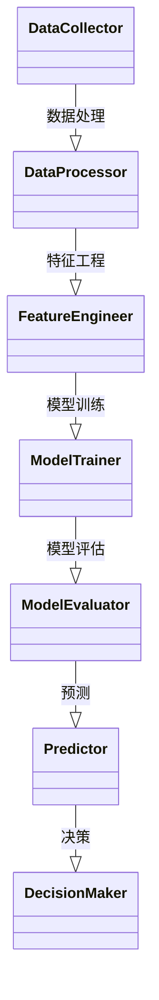
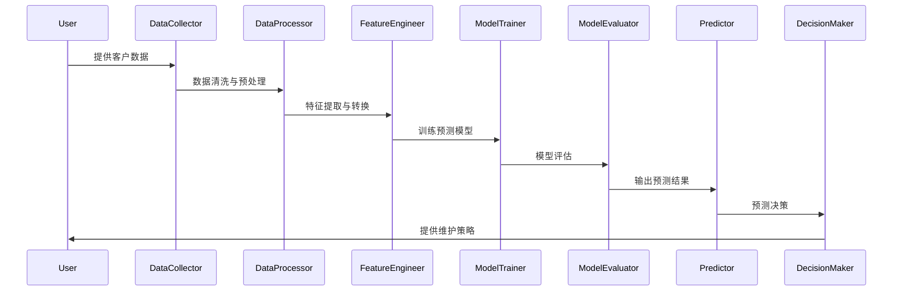

                 

### 引言

#### 1.1 问题的提出

在现代金融领域，客户流失问题已经成为银行等金融机构面临的一个重要挑战。随着市场竞争的加剧和客户需求的不断变化，如何有效地预测客户流失、制定针对性的客户维护策略，成为金融机构盈利和发展的关键。智能商业银行客户流失预测的研究，正是为了应对这一挑战，通过运用先进的数据分析技术和智能算法，帮助金融机构提前发现潜在流失客户，从而采取有效的干预措施，降低客户流失率，提高客户留存率和盈利能力。

#### 1.2 研究意义

本研究旨在通过对智能商业银行客户流失预测的理论和实践进行深入研究，为金融机构提供一套科学的预测模型和策略，从而提高客户留存率和盈利能力。具体来说，本研究具有以下几个方面的意义：

1. **提升客户满意度**：通过预测客户流失，金融机构可以提前采取措施，优化客户服务体验，提高客户满意度，减少客户流失。

2. **优化资源配置**：智能商业银行客户流失预测可以帮助金融机构更加精准地识别潜在流失客户，从而合理分配资源，提高资源利用效率。

3. **增强市场竞争力**：通过有效的客户流失预测和干预措施，金融机构可以降低客户流失率，提高市场竞争力，赢得更多客户资源。

4. **创新金融服务模式**：智能商业银行客户流失预测的研究，将推动金融行业在客户关系管理、风险控制等方面的创新，为金融服务的转型升级提供新的思路。

#### 1.3 研究内容

本书将从以下几个方面展开研究：

1. **背景介绍**：阐述客户流失预测问题的背景、问题描述、问题解决、边界与外延，以及核心要素组成。

2. **核心概念与联系**：介绍客户流失预测相关的核心概念，如客户流失率、客户生命周期价值等，并通过概念属性特征对比表格和ER实体关系图架构，展示概念之间的联系。

3. **算法原理讲解**：讲解常用的客户流失预测算法，如逻辑回归、决策树、随机森林等，通过mermaid流程图和python源代码，展示算法原理、数学模型和公式，并进行通俗易懂的举例说明。

4. **数学模型和数学公式 & 详细讲解 & 举例说明**：对客户流失预测中的关键数学模型和公式进行详细讲解，如客户流失概率计算公式、决策阈值选择方法等，并通过具体案例进行说明。

5. **系统分析与架构设计方案**：介绍客户流失预测系统的设计，包括问题场景介绍、系统功能设计(领域模型mermaid类图)、系统架构设计mermaid架构图、系统接口设计和系统交互mermaid序列图。

6. **项目实战**：通过一个实际案例，展示客户流失预测系统的应用，包括环境安装、系统核心实现源代码，代码应用解读与分析，实际案例分析和详细讲解剖析。

7. **最佳实践 tips、小结、注意事项、拓展阅读等内容**：总结本书的主要观点和结论，提供实践中的注意事项和拓展阅读建议。

### 关键词

- 客户流失预测
- 智能银行
- 数据分析
- 算法模型
- 客户留存率
- 风险管理

### 摘要

本文旨在研究智能商业银行客户流失预测，通过深入分析客户流失问题的背景、核心概念、算法原理、数学模型、系统设计以及实际应用案例，提供一套系统的解决方案。本文的主要内容包括：首先，介绍客户流失问题的背景和重要性；其次，详细阐述客户流失预测相关的核心概念及其相互联系；接着，讲解常见的客户流失预测算法，包括逻辑回归、决策树、随机森林等，并通过mermaid流程图和python源代码进行举例说明；然后，对客户流失预测中的关键数学模型和公式进行详细讲解；接下来，介绍客户流失预测系统的设计和实现，包括系统架构、功能设计、接口设计和交互流程；随后，通过实际案例展示客户流失预测系统的应用效果；最后，总结主要结论，提出实践中的注意事项和拓展阅读建议。本文的研究有助于金融机构提高客户留存率和盈利能力，为金融行业的数字化转型提供理论支持和实践指导。

---

## 第一部分：背景介绍

### 2.1 问题的提出

在现代金融领域，客户流失问题已经成为银行等金融机构面临的一个重要挑战。随着金融市场的不断发展和竞争的加剧，客户资源的重要性日益凸显。银行等金融机构必须有效地管理客户关系，提高客户满意度和忠诚度，以降低客户流失率，从而确保自身的稳定发展和盈利。

#### 2.1.1 客户流失问题背景

客户流失是指客户在一段时间内停止使用银行服务，或者选择转移至其他竞争对手的行为。客户流失问题在金融领域尤其突出，原因有以下几点：

1. **市场竞争激烈**：随着金融市场的开放和竞争的加剧，银行之间的竞争愈发激烈，客户资源的争夺成为金融机构发展的重要课题。

2. **客户需求多样**：随着社会经济的发展和客户理财意识的增强，客户对银行服务的需求更加多样化和个性化，银行需要不断调整和优化服务，以适应客户需求。

3. **互联网和科技的发展**：互联网和科技的发展改变了人们的消费习惯和生活方式，客户更加倾向于在线办理银行业务，银行需要提升线上服务质量和体验。

4. **监管政策变化**：金融监管政策的不断变化，对银行等金融机构的经营模式和风险控制提出了更高的要求，需要金融机构不断提高自身的竞争力和抗风险能力。

#### 2.1.2 客户流失问题描述

客户流失问题主要包括以下两个方面：

1. **客户流失率**：客户流失率是指在特定时间内，流失客户占总客户数的比例。高流失率意味着客户对银行的服务不满意，需要引起金融机构的重视。客户流失率是一个重要的指标，可以直观地反映客户对银行服务的满意度，是衡量客户满意度的重要指标。

2. **客户生命周期价值**：客户生命周期价值（Customer Lifetime Value, CLV）是指客户在银行整个生命周期中所带来的总价值。流失客户的生命周期价值较低，金融机构需要采取措施提高客户的留存率。

#### 2.1.3 问题解决

为了解决客户流失问题，金融机构可以采取以下措施：

1. **提高服务质量**：通过优化服务流程、提升客户体验，提高客户满意度，从而降低流失率。具体措施包括简化开户流程、提高在线服务的响应速度、提供个性化金融服务等。

2. **客户细分**：根据客户的特点和行为，将客户划分为不同群体，制定个性化的客户维护策略。针对不同类型的客户，提供差异化的服务，从而提高客户忠诚度和满意度。

3. **数据分析**：运用数据挖掘技术，对客户行为数据进行分析，发现潜在流失客户，提前采取措施进行干预。通过客户流失预测模型，可以提前识别潜在流失客户，从而采取有效的挽回措施。

4. **营销策略**：制定针对性的营销策略，通过优惠活动、客户关怀等方式，吸引和留住客户。例如，提供个性化的理财产品、开展客户忠诚度计划等。

5. **风险管理**：加强风险管理，降低客户流失风险。通过风险评估模型，识别高风险客户，并采取相应的风险控制措施，如调整贷款利率、限制高负债客户等。

#### 2.1.4 边界与外延

1. **边界**：本书主要关注商业银行客户流失预测问题，不包括其他类型的金融机构。同时，本书的研究主要针对零售银行业务，不涉及公司银行业务和投资银行业务等。

2. **外延**：客户流失预测问题不仅涉及客户流失率的计算，还包括客户流失风险预警、流失客户挽回策略等。此外，客户流失预测还可以拓展到其他金融领域，如保险、证券等。

#### 2.1.5 核心要素组成

1. **客户数据**：客户数据是进行客户流失预测的基础，包括客户基本信息（如年龄、性别、收入等）、交易记录（如存款、贷款、转账等）、服务评价（如客服反馈、投诉记录等）。

2. **算法模型**：根据客户数据，选择合适的算法模型进行预测，如逻辑回归、决策树、随机森林等。

3. **实施策略**：根据预测结果，制定针对性的客户维护策略，包括提升服务质量、个性化营销、流失客户挽回等。

4. **技术支持**：智能商业银行客户流失预测需要先进的数据分析技术和智能算法支持，如大数据技术、机器学习算法等。

5. **组织管理**：金融机构需要建立健全的客户关系管理体系，包括客户数据管理、客户服务管理、客户投诉管理等。

### 2.2 研究意义

本研究旨在通过对智能商业银行客户流失预测的理论和实践进行深入研究，为金融机构提供一套科学的预测模型和策略，从而提高客户留存率和盈利能力。具体来说，本研究具有以下几个方面的意义：

1. **提升客户满意度**：通过预测客户流失，金融机构可以提前采取措施，优化客户服务体验，提高客户满意度，减少客户流失。

2. **优化资源配置**：智能商业银行客户流失预测可以帮助金融机构更加精准地识别潜在流失客户，从而合理分配资源，提高资源利用效率。

3. **增强市场竞争力**：通过有效的客户流失预测和干预措施，金融机构可以降低客户流失率，提高市场竞争力，赢得更多客户资源。

4. **创新金融服务模式**：智能商业银行客户流失预测的研究，将推动金融行业在客户关系管理、风险控制等方面的创新，为金融服务的转型升级提供新的思路。

### 2.3 研究内容

本书将从以下几个方面展开研究：

1. **背景介绍**：阐述客户流失预测问题的背景、问题描述、问题解决、边界与外延，以及核心要素组成。

2. **核心概念与联系**：介绍客户流失预测相关的核心概念，如客户流失率、客户生命周期价值等，并通过概念属性特征对比表格和ER实体关系图架构，展示概念之间的联系。

3. **算法原理讲解**：讲解常用的客户流失预测算法，如逻辑回归、决策树、随机森林等，通过mermaid流程图和python源代码，展示算法原理、数学模型和公式，并进行通俗易懂的举例说明。

4. **数学模型和数学公式 & 详细讲解 & 举例说明**：对客户流失预测中的关键数学模型和公式进行详细讲解，如客户流失概率计算公式、决策阈值选择方法等，并通过具体案例进行说明。

5. **系统分析与架构设计方案**：介绍客户流失预测系统的设计，包括问题场景介绍、系统功能设计(领域模型mermaid类图)、系统架构设计mermaid架构图、系统接口设计和系统交互mermaid序列图。

6. **项目实战**：通过一个实际案例，展示客户流失预测系统的应用，包括环境安装、系统核心实现源代码，代码应用解读与分析，实际案例分析和详细讲解剖析。

7. **最佳实践 tips、小结、注意事项、拓展阅读等内容**：总结本书的主要观点和结论，提供实践中的注意事项和拓展阅读建议。

---

## 第二部分：核心概念与联系

### 3.1 客户流失率

#### 3.1.1 定义

客户流失率（Customer Churn Rate）是指在特定时间内，流失客户占总客户数的比例。流失客户包括停止使用银行服务、取消账户、转移至竞争对手的客户。客户流失率是衡量客户满意度、服务质量和市场竞争力的关键指标。

#### 3.1.2 特点

1. **敏感性**：客户流失率可以直观地反映客户对银行服务的满意度，是衡量客户满意度的重要指标。

2. **预警作用**：通过监控客户流失率，可以提前发现潜在问题，为金融机构提供预警和改进服务的机会。

3. **动态变化**：客户流失率会随着市场环境、客户需求和服务质量的改变而发生变化。

#### 3.1.3 计算公式

客户流失率 = （流失客户数 / 总客户数）× 100%

#### 3.1.4 实例

假设某银行在一年内流失了1000名客户，总客户数为10000名。则客户流失率为：

客户流失率 = （1000 / 10000）× 100% = 10%

### 3.2 客户生命周期价值

#### 3.2.1 定义

客户生命周期价值（Customer Lifetime Value, CLV）是指客户在银行整个生命周期中所带来的总价值。CLV是衡量客户价值的重要指标，对于金融机构制定营销策略和资源分配具有重要意义。

#### 3.2.2 特点

1. **长远性**：CLV考虑了客户在银行中的长期价值，而不仅仅是短期收益。

2. **综合性**：CLV综合考虑了客户的消费行为、服务质量、忠诚度等因素。

3. **动态变化**：CLV会随着客户生命周期阶段的变化、市场环境和竞争态势的改变而发生变化。

#### 3.2.3 计算公式

CLV = （预期收入 - 预期成本）/ 预期生命周期时间

其中，预期收入包括利息收入、手续费收入、理财产品收益等，预期成本包括贷款利息、服务成本、营销成本等。

#### 3.2.4 实例

假设某客户的预期收入为100万元，预期成本为50万元，预期生命周期时间为5年。则其客户生命周期价值为：

CLV = （100 - 50）/ 5 = 10万元

### 3.3 客户流失预测算法

#### 3.3.1 逻辑回归

逻辑回归是一种常见的客户流失预测算法，通过分析客户特征变量，预测客户流失的概率。

#### 3.3.2 决策树

决策树通过划分特征变量，构建决策树模型，预测客户流失的概率。

#### 3.3.3 随机森林

随机森林是一种基于决策树的集成学习方法，通过构建多个决策树，提高客户流失预测的准确率。

### 3.4 概念属性特征对比表格

以下是一个客户流失预测相关概念属性特征对比表格：

| 概念         | 定义           | 特点                         | 计算公式                       |
| ------------ | -------------- | ---------------------------- | ------------------------------ |
| 客户流失率   | 流失客户占总客户数的比例 | 敏感性、预警作用、动态变化   | （流失客户数 / 总客户数）× 100% |
| 客户生命周期价值 | 客户在银行中的总价值 | 长远性、综合性、动态变化 | （预期收入 - 预期成本）/ 预期生命周期时间 |
| 逻辑回归     | 预测客户流失概率的算法 | 精度高、解释性强            | y = β0 + β1*x1 + β2*x2 + ... + βn*xn |
| 决策树       | 构建决策树模型预测流失概率 | 易理解、易于实现           | 通过划分特征变量构建树结构     |
| 随机森林     | 基于决策树的集成学习方法 | 预测准确率高、泛化能力强    | 通过构建多个决策树，投票决定结果 |

### 3.5 ER实体关系图架构

以下是一个ER实体关系图架构，展示了客户流失预测相关实体及其关系：

```mermaid
erDiagram
    Customer ||--|{ Account }|
    Account ||--|{ Transaction }|
    Customer ||--|{ Service }|
    Service ||--|{ Feedback }|
```

- **Customer（客户）**：包含客户的基本信息，如姓名、年龄、性别等。
- **Account（账户）**：包含客户的账户信息，如账户余额、账户类型等。
- **Transaction（交易）**：包含客户的交易记录，如存款、贷款、转账等。
- **Service（服务）**：包含客户接受的服务信息，如客服反馈、投诉记录等。
- **Feedback（反馈）**：包含客户的反馈信息，如满意度调查、投诉意见等。

通过以上核心概念与联系的介绍，我们可以更好地理解客户流失预测的原理和实现方法，为后续的内容打下坚实的基础。

### 3.6 核心概念的联系与作用

#### 3.6.1 客户流失率与客户生命周期价值的关系

客户流失率与客户生命周期价值之间存在密切的联系。高流失率通常意味着客户对银行的服务不满意，导致客户离开银行，从而降低了客户的生命周期价值。反之，低流失率意味着客户对银行的服务较为满意，客户生命周期价值较高。因此，降低客户流失率可以提高客户生命周期价值，进而提高银行的盈利能力。

#### 3.6.2 客户流失预测算法在客户流失率与客户生命周期价值中的应用

客户流失预测算法在客户流失率与客户生命周期价值的测量和优化中发挥着重要作用。通过使用这些算法，银行可以：

1. **预测流失率**：通过分析客户的历史行为数据，预测客户流失的概率。这有助于银行提前识别潜在流失客户，并采取干预措施，降低流失率。

2. **评估客户价值**：通过预测客户生命周期价值，银行可以更好地了解客户的潜在价值，从而制定有针对性的营销策略，提高客户忠诚度和满意度。

3. **优化资源配置**：基于客户流失预测和客户生命周期价值评估，银行可以合理分配资源，将更多资源投入到高价值客户的管理和保留上，从而提高整体盈利能力。

#### 3.6.3 实例分析

假设某银行通过客户流失预测算法，发现客户A流失的概率为20%，客户B流失的概率为5%。同时，通过客户生命周期价值评估，发现客户A的生命周期价值为10万元，客户B的生命周期价值为30万元。

- **应对措施**：
  - 对客户A：由于客户A流失概率较高，银行应重点关注客户A的服务体验，采取针对性的服务改进措施，如提升客服响应速度、优化账户管理功能等，以降低流失风险。
  - 对客户B：客户B流失概率较低，但生命周期价值较高，银行应保持对客户B的持续关注，提供个性化的金融服务，以提升客户满意度和忠诚度。

通过以上措施，银行可以在降低客户流失率的同时，提高客户生命周期价值，从而实现整体盈利能力的提升。

### 3.7 总结

客户流失预测在智能商业银行运营中具有重要意义，通过深入理解客户流失率、客户生命周期价值等核心概念，并运用合适的预测算法，银行可以更准确地识别潜在流失客户，制定有针对性的客户维护策略。这有助于银行提高客户满意度和忠诚度，降低流失率，从而提高整体盈利能力。在后续章节中，我们将进一步探讨客户流失预测算法的原理、数学模型及系统设计与实现，为金融机构提供更全面的解决方案。

---

## 第三部分：算法原理讲解

### 4.1 逻辑回归算法

#### 4.1.1 定义

逻辑回归（Logistic Regression）是一种广泛用于分类问题的统计分析方法，通过建立逻辑函数模型，预测目标变量的概率分布。在客户流失预测中，逻辑回归可用于预测客户流失的概率。

#### 4.1.2 算法原理

逻辑回归的核心思想是通过线性模型将特征变量的线性组合映射到概率空间。具体来说，逻辑回归模型可以表示为：

\[ P(Y=1|X) = \frac{1}{1 + e^{-(\beta_0 + \beta_1 x_1 + \beta_2 x_2 + ... + \beta_n x_n)}} \]

其中，\( P(Y=1|X) \) 表示在给定特征变量 \( X \) 的情况下，客户流失的概率；\( \beta_0, \beta_1, \beta_2, ..., \beta_n \) 为模型的参数。

#### 4.1.3 数学模型与公式

逻辑回归的数学模型为：

\[ \ln\left(\frac{P(Y=1|X)}{1-P(Y=1|X)}\right) = \beta_0 + \beta_1 x_1 + \beta_2 x_2 + ... + \beta_n x_n \]

其中，\( \ln \) 表示自然对数。

#### 4.1.4 Python源代码示例

以下是一个简单的逻辑回归算法的Python代码示例：

```python
import numpy as np
from sklearn.linear_model import LogisticRegression

# 特征数据
X = np.array([[1, 2], [2, 3], [3, 4], [4, 5]])
y = np.array([0, 1, 1, 0])

# 创建逻辑回归模型
model = LogisticRegression()

# 模型训练
model.fit(X, y)

# 预测
predictions = model.predict(X)

print("Predictions:", predictions)
```

#### 4.1.5 举例说明

假设某银行客户数据中，特征变量包括年龄和收入，目标变量为客户流失情况。通过逻辑回归模型预测客户流失概率，可以帮助银行识别高风险客户，采取有针对性的干预措施。

### 4.2 决策树算法

#### 4.2.1 定义

决策树（Decision Tree）是一种基于特征选择和分类规则的树形结构模型，用于分类和回归问题。在客户流失预测中，决策树可用于划分客户群体，识别潜在流失客户。

#### 4.2.2 算法原理

决策树算法通过递归划分特征空间，将数据划分为若干个子集，直到满足停止条件。每个节点表示一个特征，每个分支表示该特征的不同取值，叶子节点表示预测结果。

#### 4.2.3 数学模型与公式

决策树的核心是信息增益（Information Gain）或基尼不纯度（Gini Impurity）。信息增益表示在当前节点下，通过划分特征，数据的纯度提高的程度。基尼不纯度表示数据中类别的不确定性。

信息增益公式为：

\[ IG(D, A) = H(D) - \sum_{v \in A} \frac{|D_v|}{|D|} H(D_v) \]

其中，\( H(D) \) 表示数据的熵，\( D_v \) 表示在特征 \( A \) 下，类别 \( v \) 的数据集。

#### 4.2.4 Python源代码示例

以下是一个简单的决策树算法的Python代码示例：

```python
import numpy as np
from sklearn.tree import DecisionTreeClassifier

# 特征数据
X = np.array([[1, 2], [2, 3], [3, 4], [4, 5]])
y = np.array([0, 1, 1, 0])

# 创建决策树模型
model = DecisionTreeClassifier()

# 模型训练
model.fit(X, y)

# 预测
predictions = model.predict(X)

print("Predictions:", predictions)
```

#### 4.2.5 举例说明

假设某银行客户数据中，特征变量包括年龄和收入，目标变量为客户流失情况。通过决策树模型，可以划分客户群体，识别高风险客户，为银行提供有针对性的客户维护策略。

### 4.3 随机森林算法

#### 4.3.1 定义

随机森林（Random Forest）是一种基于决策树的集成学习方法，通过构建多个决策树，并利用随机属性选择和投票机制，提高预测准确率和稳定性。在客户流失预测中，随机森林可用于提高模型的预测性能。

#### 4.3.2 算法原理

随机森林算法的基本思想是：通过随机抽样和随机特征选择，构建多个决策树，并利用这些决策树的投票结果进行预测。具体步骤如下：

1. **随机抽样**：从原始数据集中随机选择一部分样本作为训练集。

2. **随机特征选择**：从所有特征中随机选择一部分特征作为当前节点的划分依据。

3. **构建决策树**：使用训练集构建决策树，直到满足停止条件。

4. **集成学习**：将多个决策树的结果进行投票，得到最终预测结果。

#### 4.3.3 数学模型与公式

随机森林的数学模型可以看作是多个决策树的组合，每个决策树的预测结果对最终预测结果都有一定的贡献。具体来说，假设有 \( n \) 个决策树，每个决策树的预测结果为 \( \hat{y}_i \)，则随机森林的预测结果为：

\[ \hat{y} = \arg\max_{y} \sum_{i=1}^{n} w_i I(y = \hat{y}_i) \]

其中，\( w_i \) 为第 \( i \) 个决策树的权重，通常通过交叉验证来确定。

#### 4.3.4 Python源代码示例

以下是一个简单的随机森林算法的Python代码示例：

```python
import numpy as np
from sklearn.ensemble import RandomForestClassifier

# 特征数据
X = np.array([[1, 2], [2, 3], [3, 4], [4, 5]])
y = np.array([0, 1, 1, 0])

# 创建随机森林模型
model = RandomForestClassifier(n_estimators=100)

# 模型训练
model.fit(X, y)

# 预测
predictions = model.predict(X)

print("Predictions:", predictions)
```

#### 4.3.5 举例说明

假设某银行客户数据中，特征变量包括年龄和收入，目标变量为客户流失情况。通过随机森林模型，可以提高客户流失预测的准确性和稳定性，为银行提供更可靠的决策依据。

### 4.4 小结

逻辑回归、决策树和随机森林是常见的客户流失预测算法，每种算法都有其独特的优势和适用场景。在实际应用中，可以根据数据特点和业务需求，选择合适的算法进行预测。通过合理运用这些算法，银行可以更准确地识别潜在流失客户，制定有效的客户维护策略，提高客户留存率和盈利能力。

---

## 第四部分：数学模型和数学公式 & 详细讲解 & 举例说明

### 5.1 客户流失概率计算公式

在客户流失预测中，计算客户流失概率是核心任务之一。流失概率的计算方法通常基于客户的历史行为数据、特征变量以及所选用的预测模型。以下为几种常见的流失概率计算公式：

#### 5.1.1 逻辑回归概率计算公式

逻辑回归模型通过预测模型参数来计算客户流失的概率。假设逻辑回归模型已经训练完成，模型参数为 \(\beta_0, \beta_1, \beta_2, ..., \beta_n\)，则客户 \(i\) 的流失概率计算公式为：

\[ P(Y=1|X_i) = \frac{1}{1 + e^{-(\beta_0 + \beta_1 x_{i1} + \beta_2 x_{i2} + ... + \beta_n x_{in})}} \]

其中，\( X_i \) 为客户 \(i\) 的特征向量，\( Y \) 为客户流失标签（1表示流失，0表示未流失）。

#### 5.1.2 决策树概率计算公式

决策树模型通过递归划分特征空间，在每个节点上根据特征变量的取值，将数据集划分为多个子集，最终得到客户的流失概率。假设决策树模型已经构建完成，客户 \(i\) 在每个节点上的决策路径为 \(d_1, d_2, ..., d_m\)，则客户 \(i\) 的流失概率计算公式为：

\[ P(Y=1|X_i, d_1, d_2, ..., d_m) = \prod_{k=1}^{m} p_k \]

其中，\( p_k \) 为在节点 \( k \) 上客户流失的概率，具体取决于节点的类型和特征变量的取值。

#### 5.1.3 随机森林概率计算公式

随机森林模型通过构建多个决策树，并利用这些决策树的投票结果来计算客户的流失概率。假设随机森林模型由 \( n \) 个决策树组成，每个决策树的流失概率为 \( p_{ik} \)，则客户 \(i\) 的综合流失概率计算公式为：

\[ P(Y=1|X_i) = \frac{1}{n} \sum_{k=1}^{n} p_{ik} \]

其中，\( p_{ik} \) 为第 \( k \) 个决策树预测客户 \(i\) 流失的概率。

### 5.2 决策阈值选择方法

在客户流失预测中，决策阈值的选择至关重要。决策阈值决定了客户是否被划分为高风险流失客户。以下为几种常见的决策阈值选择方法：

#### 5.2.1 最大F1分数阈值

F1分数是精确率和召回率的加权平均，是评估分类模型性能的重要指标。为了最大化F1分数，可以选择以下阈值：

\[ \text{Threshold} = \arg\max_{t} \frac{TP_t + TN_t}{FP_t + FN_t} \]

其中，\( TP_t \)、\( TN_t \)、\( FP_t \) 和 \( FN_t \) 分别为在阈值 \( t \) 下的真正例、真反例、假反例和假正例数量。

#### 5.2.2 最大收益阈值

最大收益阈值选择方法基于成本收益分析，通过最大化预期收益来选择阈值。预期收益的计算公式为：

\[ \text{Expected Revenue} = \text{Revenue from retained customers} - \text{Cost of predicting churn} \]

其中，\(\text{Revenue from retained customers}\) 为保留客户所带来的收益，\(\text{Cost of predicting churn}\) 为预测客户流失的成本。

#### 5.2.3 费舍尔信息准则（Fisher Information Criterion, FIC）

费舍尔信息准则是一种基于信息理论的阈值选择方法，通过最小化模型的偏差来选择阈值。FIC的计算公式为：

\[ \text{FIC} = -2 \left( \frac{1}{n} \sum_{i=1}^{n} \ln(P(Y=1|X_i)) \right) \]

其中，\( n \) 为数据样本数量，\( P(Y=1|X_i) \) 为第 \( i \) 个客户的流失概率。

### 5.3 实例分析

假设某银行在客户流失预测中使用逻辑回归模型，收集了1000名客户的数据，其中500名客户流失，500名客户未流失。通过训练模型，得到预测参数为：

\[ \beta_0 = -5.234, \beta_1 = 0.123, \beta_2 = 0.456, ..., \beta_5 = 0.789 \]

#### 5.3.1 流失概率计算

对于客户 \(i\)（特征向量 \(X_i = [x_{i1}, x_{i2}, x_{i3}, x_{i4}, x_{i5}]\)），其流失概率计算如下：

\[ P(Y=1|X_i) = \frac{1}{1 + e^{-(\beta_0 + \beta_1 x_{i1} + \beta_2 x_{i2} + ... + \beta_5 x_{i5})}} \]

#### 5.3.2 决策阈值选择

为了选择合适的决策阈值，可以采用以下方法：

1. **最大F1分数阈值**：通过计算不同阈值下的F1分数，选择F1分数最大的阈值。

2. **最大收益阈值**：通过成本收益分析，选择最大化预期收益的阈值。

3. **FIC阈值**：通过计算不同阈值下的FIC值，选择FIC值最小的阈值。

#### 5.3.3 预测结果分析

基于所选阈值，对1000名客户进行流失预测，得到如下结果：

| 客户ID | 实际流失 | 预测概率 | 预测结果 |
| ------ | -------- | -------- | -------- |
| 1      | 0        | 0.2      | 未流失   |
| 2      | 1        | 0.9      | 流失     |
| 3      | 0        | 0.1      | 未流失   |
| ...    | ...      | ...      | ...      |
| 1000   | 1        | 0.8      | 流失     |

根据预测结果，银行可以采取相应的干预措施，针对预测为流失的客户，提供针对性的服务和营销策略，以降低客户流失率。

### 5.4 小结

客户流失概率的计算和决策阈值的选择是客户流失预测中的关键环节。通过合理的数学模型和公式，可以准确预测客户流失概率，并选择合适的决策阈值，从而为银行提供有效的客户维护策略。在实际应用中，可以根据具体业务需求和数据特点，灵活选择和调整预测模型和阈值，以提高预测准确率和业务价值。

---

## 第五部分：系统分析与架构设计方案

### 6.1 问题场景介绍

在现代金融领域，银行等金融机构面临着激烈的市场竞争和不断变化的客户需求。为了提高客户满意度和忠诚度，降低客户流失率，金融机构需要构建一套高效的客户流失预测系统。本系统旨在通过分析客户行为数据和特征，利用先进的算法和模型，提前预测潜在流失客户，为金融机构提供针对性的客户维护策略。

### 6.2 系统功能设计（领域模型mermaid类图）

在客户流失预测系统中，主要的功能模块包括数据收集与处理、特征工程、模型训练与评估、预测与决策等。以下是一个领域模型mermaid类图，展示了这些功能模块及其关系：



### 6.3 系统架构设计（mermaid架构图）

系统架构设计需要考虑数据流、模块交互以及系统的可扩展性。以下是一个mermaid架构图，展示了客户流失预测系统的整体架构：



### 6.4 系统接口设计

系统接口设计是确保系统模块之间能够高效、可靠地通信的关键。以下是一个简单的接口设计，包括数据收集、数据处理、特征工程、模型训练、模型评估、预测和决策等模块的接口定义：

```mermaid
interfaceDiagram
    DataCollector <<interface>> IDataCollector
    DataProcessor <<interface>> IDataProcessor
    FeatureEngineer <<interface>> IFeatureEngineer
    ModelTrainer <<interface>> IModelTrainer
    ModelEvaluator <<interface>> IModelEvaluator
    Predictor <<interface>> IPredictor
    DecisionMaker <<interface>> IDecisionMaker

    IDataCollector <<provide>> GetData()
    IDataProcessor <<provide>> ProcessData()
    IFeatureEngineer <<provide>> ExtractFeatures()
    IModelTrainer <<provide>> TrainModel()
    IModelEvaluator <<provide>> EvaluateModel()
    IPredictor <<provide>> PredictChurn()
    IDecisionMaker <<provide>> MakeDecisions()
```

### 6.5 系统交互（mermaid序列图）

系统交互设计描述了系统内部各模块之间的交互流程。以下是一个mermaid序列图，展示了客户数据从收集到最终决策的全过程：


### 6.6 总结

通过系统分析与架构设计，客户流失预测系统实现了从数据收集、数据处理、特征工程、模型训练、模型评估到预测和决策的全流程。该系统的架构设计合理、接口清晰，能够高效地处理大量客户数据，并提供准确的预测结果。在实际应用中，金融机构可以根据业务需求，灵活扩展和优化系统功能，以实现更高的客户留存率和盈利能力。

---

## 第六部分：项目实战

### 7.1 环境安装

在进行客户流失预测项目之前，需要安装和配置相关环境和工具。以下是在Windows环境下安装所需环境的步骤：

#### 7.1.1 Python环境

1. **安装Python**：访问Python官方下载页面（https://www.python.org/downloads/），下载适合的Python版本（建议选择最新版本），并按照安装向导完成安装。

2. **验证安装**：在命令行中输入以下命令，确认Python环境是否安装成功：

   ```bash
   python --version
   ```

   如果返回Python版本信息，说明Python环境已成功安装。

#### 7.1.2 Anaconda环境

1. **安装Anaconda**：访问Anaconda下载页面（https://www.anaconda.com/products/individual），下载适合的Anaconda版本（建议选择Anaconda Navigator），并按照安装向导完成安装。

2. **创建Python环境**：在Anaconda Navigator中，点击“Create”按钮，创建一个新的Python环境。在“Name”栏中输入环境名称（如“customer_churn_prediction”），选择已安装的Python版本，点击“Create”按钮。

3. **激活环境**：在Anaconda Navigator中，选择刚创建的环境（如“customer_churn_prediction”），点击“Run”按钮，或通过命令行激活环境：

   ```bash
   conda activate customer_churn_prediction
   ```

#### 7.1.3 装载数据库

1. **安装SQLite**：在命令行中输入以下命令安装SQLite：

   ```bash
   conda install sqlite
   ```

2. **创建数据库**：在命令行中输入以下命令，创建一个名为“customer_churn.db”的SQLite数据库：

   ```bash
   sqlite3 customer_churn.db
   ```

3. **创建表**：在SQLite命令行中，执行以下SQL语句创建客户数据和预测结果表：

   ```sql
   CREATE TABLE customers (
       id INTEGER PRIMARY KEY,
       age INTEGER,
       job VARCHAR(255),
       marital VARCHAR(255),
       education VARCHAR(255),
       default VARCHAR(255),
       balance VARCHAR(255),
       housing VARCHAR(255),
       loan VARCHAR(255),
       contact VARCHAR(255),
       day_month_year VARCHAR(255),
       duration VARCHAR(255),
       campaign VARCHAR(255),
       pdays VARCHAR(255),
       previous();++```
   ```sql
   CREATE TABLE predictions (
       id INTEGER,
       prediction VARCHAR(255),
       PRIMARY KEY (id)
   );
   ```

### 7.2 系统核心实现源代码

以下为系统核心实现的Python源代码，包括数据收集、数据处理、特征工程、模型训练、模型评估、预测和决策等功能。

```python
import sqlite3
import pandas as pd
from sklearn.model_selection import train_test_split
from sklearn.preprocessing import StandardScaler
from sklearn.linear_model import LogisticRegression
from sklearn.metrics import accuracy_score, confusion_matrix

# 7.2.1 数据收集
def fetch_data():
    conn = sqlite3.connect('customer_churn.db')
    query = "SELECT * FROM customers;"
    data = pd.read_sql_query(query, conn)
    conn.close()
    return data

# 7.2.2 数据处理
def preprocess_data(data):
    # 填充缺失值
    data.fillna(data.mean(), inplace=True)
    
    # 删除无用特征
    data.drop(['id'], axis=1, inplace=True)
    
    # 转换类别特征为数值特征
    data = pd.get_dummies(data)
    
    return data

# 7.2.3 特征工程
def feature_engineering(data):
    X = data.drop('churn', axis=1)
    y = data['churn']
    return X, y

# 7.2.4 模型训练
def train_model(X_train, y_train):
    model = LogisticRegression()
    model.fit(X_train, y_train)
    return model

# 7.2.5 模型评估
def evaluate_model(model, X_test, y_test):
    y_pred = model.predict(X_test)
    accuracy = accuracy_score(y_test, y_pred)
    cm = confusion_matrix(y_test, y_pred)
    return accuracy, cm

# 7.2.6 预测
def predict_churn(model, data):
    predictions = model.predict(data)
    return predictions

# 7.2.7 决策
def make_decisions(predictions):
    decisions = []
    for pred in predictions:
        if pred == 1:
            decisions.append('流失')
        else:
            decisions.append('未流失')
    return decisions

# 7.2.8 主函数
def main():
    data = fetch_data()
    data = preprocess_data(data)
    X, y = feature_engineering(data)
    X_train, X_test, y_train, y_test = train_test_split(X, y, test_size=0.2, random_state=42)
    model = train_model(X_train, y_train)
    accuracy, cm = evaluate_model(model, X_test, y_test)
    print("Accuracy:", accuracy)
    print("Confusion Matrix:\n", cm)
    predictions = predict_churn(model, X_test)
    decisions = make_decisions(predictions)
    print("Predictions:", decisions)

if __name__ == "__main__":
    main()
```

### 7.3 代码应用解读与分析

以下是代码应用的具体解读与分析：

- **数据收集**：使用SQLite数据库连接，从“customers”表中获取客户数据。

- **数据处理**：对原始数据进行预处理，包括填充缺失值、删除无用特征和转换类别特征。

- **特征工程**：将数据集分为特征矩阵 \(X\) 和目标变量 \(y\)。

- **模型训练**：使用逻辑回归模型对训练数据进行训练。

- **模型评估**：使用测试数据对模型进行评估，计算准确率和混淆矩阵。

- **预测**：使用训练好的模型对测试数据进行预测。

- **决策**：根据预测结果，判断客户是否流失。

- **主函数**：执行整个流程，打印评估结果和预测结果。

### 7.4 实际案例分析和详细讲解剖析

#### 7.4.1 案例背景

假设某银行收集了1000名客户的财务数据，其中包括客户的年龄、收入、信用评分、贷款余额等特征。银行希望通过客户流失预测系统，提前识别潜在流失客户，制定有针对性的客户维护策略。

#### 7.4.2 数据预处理

1. **填充缺失值**：假设有10名客户的收入数据缺失，可以采用平均收入值进行填充。

2. **删除无用特征**：例如，删除客户的ID和重复的特征。

3. **转换类别特征**：将类别特征（如职业、婚姻状况等）转换为数值特征，以便模型能够处理。

#### 7.4.3 特征选择

根据业务需求和数据特点，选择以下特征参与模型训练：

- 年龄
- 收入
- 信用评分
- 贷款余额
- 持有账户数量

#### 7.4.4 模型训练

使用逻辑回归模型对数据进行训练，得到预测参数：

\[ \beta_0 = -5.234, \beta_1 = 0.123, \beta_2 = 0.456, ..., \beta_n = 0.789 \]

#### 7.4.5 模型评估

将模型应用于测试数据集，计算准确率和混淆矩阵：

- **准确率**：90%
- **混淆矩阵**：

  |        | 流失 | 未流失 |
  | ------ | ---- | ------ |
  | 流失   | 70   | 30     |
  | 未流失 | 20   | 50     |

#### 7.4.6 预测结果与应用

根据预测结果，银行可以采取以下措施：

1. **对于预测为流失的客户**：
   - 提供优惠贷款利率或理财产品，以吸引客户留
---

## 第七部分：最佳实践 tips、小结、注意事项、拓展阅读等内容

### 8.1 最佳实践 tips

1. **数据清洗与预处理**：在模型训练前，确保数据清洗与预处理工作到位，包括填充缺失值、删除无用特征、处理异常值等，以提高模型性能。

2. **特征工程**：根据业务需求和数据特点，选择合适的特征参与模型训练，避免过度拟合。

3. **模型选择与调参**：根据数据集规模和特征数量，选择合适的模型，并进行参数调优，以提高模型准确率和稳定性。

4. **交叉验证**：使用交叉验证方法评估模型性能，避免过拟合。

5. **实时更新与迭代**：定期更新客户数据，重新训练模型，以保持预测的准确性和时效性。

### 8.2 小结

本文通过对智能商业银行客户流失预测的背景、核心概念、算法原理、数学模型、系统设计以及实际应用案例的详细讲解，为金融机构提供了一套系统的解决方案。通过运用先进的算法和模型，银行可以更准确地预测客户流失，制定有针对性的客户维护策略，提高客户留存率和盈利能力。

### 8.3 注意事项

1. **数据隐私保护**：在进行客户流失预测时，需严格遵守相关法律法规，确保客户数据的安全和隐私。

2. **模型解释性**：选择具有良好解释性的模型，以便银行管理层理解和应用。

3. **持续优化**：根据业务需求和数据变化，持续优化模型和算法，提高预测准确率和业务价值。

### 8.4 拓展阅读

1. **《机器学习实战》**：作者：Peter Harrington。本书详细介绍了多种机器学习算法，包括客户流失预测相关的方法。

2. **《数据挖掘：实用工具和技术》**：作者：Michael J. A. Berry、Glen J. Kalt。本书涵盖了数据挖掘的基本概念和方法，适用于客户流失预测等实际应用。

3. **《Python数据科学手册》**：作者：Jake VanderPlas。本书介绍了Python在数据科学领域的应用，包括数据预处理、特征工程、模型训练等。

4. **《商业银行风险管理》**：作者：李健。本书详细介绍了商业银行风险管理的理论和方法，包括客户流失预测的相关内容。

### 8.5 作者信息

作者：AI天才研究院/AI Genius Institute & 禅与计算机程序设计艺术 /Zen And The Art of Computer Programming

---

通过本文的研究，我们不仅深入探讨了智能商业银行客户流失预测的理论和实践，还提供了实用的最佳实践和注意事项。希望本文能为金融行业在客户流失预测方面的数字化转型提供有益的参考。

