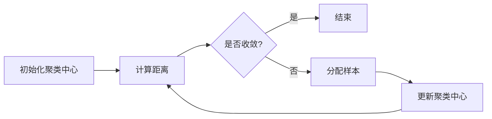
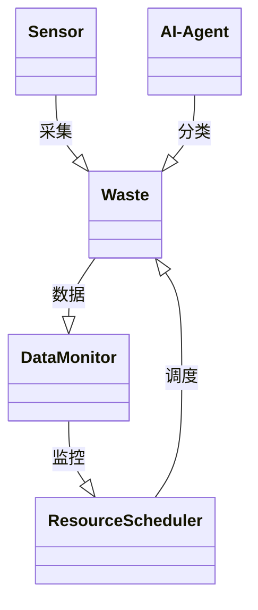

                 

### 摘要

本文旨在深入探讨智能回收站：AI Agent的社区资源循环利用管理这一前沿领域。随着人工智能技术的迅猛发展，其在资源循环利用中的应用日益广泛。智能回收站作为一种创新的资源管理手段，通过引入AI Agent，实现了社区资源的高效循环利用。本文首先介绍了智能回收站的概念、背景及其与传统回收站的区别，接着探讨了AI Agent的定义及其在资源循环利用管理中的核心作用。随后，文章详细分析了AI Agent的工作原理、算法模型及其与社区资源循环利用管理的互动关系。在此基础上，本文进一步阐述了智能回收站的系统分析与架构设计，包括系统功能设计、架构设计、接口设计以及系统交互设计。通过实际案例的剖析，本文展示了智能回收站项目的实现与部署过程，并分享了最佳实践与项目总结。最后，本文提出了未来研究的方向，为智能回收站的发展提供了有益的启示。通过对智能回收站：AI Agent的社区资源循环利用管理的系统化探讨，本文希望为相关领域的进一步研究和应用提供参考。

### 第一部分：智能回收站的概念与背景

#### 第1章：智能回收站概述

##### 1.1 问题背景

在现代社会中，资源循环利用已经成为环境保护和可持续发展的重要组成部分。社区资源循环利用不仅关乎环境保护，更与社区经济、社会效益紧密相关。然而，传统的回收站由于效率低、准确性差，无法满足现代资源管理的高要求。因此，如何提高资源循环利用的效率和质量成为亟待解决的问题。

##### 1.1.1 社区资源循环利用的必要性

社区资源循环利用的必要性主要体现在以下几个方面：

1. **环境保护**：大量的废弃物不仅占用土地资源，还污染环境，影响人类健康。通过资源循环利用，可以有效减少废弃物的产生，减轻环境负担。
2. **资源节约**：资源循环利用可以减少对自然资源的依赖，节约资源，降低生产成本，实现经济效益。
3. **社会效益**：社区资源循环利用能够促进社区和谐，增强居民的环保意识，提高居民的生活质量。

##### 1.1.2 人工智能在资源循环利用中的应用

随着人工智能技术的发展，其在资源循环利用中的应用逐渐受到关注。人工智能能够通过大数据分析、机器学习等手段，实现对社区资源的高效管理。例如：

1. **分类识别**：人工智能能够利用深度学习算法，对废弃物进行智能分类，提高分类的准确性和效率。
2. **预测分析**：通过对历史数据的分析，人工智能可以预测资源的需求和使用趋势，优化资源分配。
3. **自动化操作**：人工智能可以控制自动化设备，实现资源回收和处理的全过程自动化，提高工作效率。

##### 1.2 智能回收站的概念

智能回收站是指结合人工智能技术，实现资源高效循环利用的管理系统。其核心在于利用AI Agent进行资源管理，通过数据的收集、处理和分析，实现资源的智能调度和优化配置。

##### 1.2.1 定义与特征

智能回收站的主要特征包括：

1. **智能化**：通过人工智能技术，实现资源管理的智能化，提高管理效率和准确性。
2. **自动化**：通过自动化设备，实现资源回收、分类和处理的全过程自动化。
3. **数据驱动**：基于大数据分析，实现资源利用的实时监控和预测。
4. **高效性**：通过高效的数据处理和资源调度，实现资源利用的最大化。

##### 1.2.2 智能回收站与传统回收站的区别

传统回收站主要依赖于人工操作和简单的机械设备，存在以下局限性：

1. **效率低**：人工操作速度慢，分类准确度低，导致资源回收效率低下。
2. **成本高**：需要大量人力和设备投入，运营成本较高。
3. **环保效果差**：传统回收站对废弃物的处理不够彻底，存在二次污染的风险。

相比之下，智能回收站具有明显的优势：

1. **高效分类**：通过人工智能技术，实现对废弃物的智能分类，提高分类效率和准确性。
2. **自动化处理**：通过自动化设备，实现资源的自动化回收和处理，降低人力成本。
3. **环保性**：智能回收站能够实现资源的高效利用，减少废弃物的产生，降低环境污染。

##### 1.3 智能回收站的边界与外延

智能回收站的边界主要包括：

1. **功能边界**：智能回收站的主要功能是资源分类、回收和处理，其外延还包括资源的调度、预测和分析。
2. **技术边界**：智能回收站依赖于人工智能、大数据、自动化技术等前沿科技，其外延还包括物联网、云计算等技术的应用。

智能回收站的应用领域广泛，包括但不限于：

1. **城市垃圾处理**：通过智能回收站，实现对城市垃圾的高效分类和处理，减少垃圾围城问题。
2. **工业废弃物处理**：利用智能回收站，实现对工业废弃物的资源化利用，减少工业污染。
3. **社区资源管理**：通过智能回收站，优化社区资源利用，提高居民生活质量。

#### 总结

智能回收站作为一种创新的资源管理手段，通过引入人工智能技术，实现了社区资源的高效循环利用。与传统回收站相比，智能回收站在效率、自动化、环保性等方面具有显著优势。随着技术的不断发展，智能回收站的应用前景将更加广阔，为环境保护和可持续发展做出更大贡献。

### 第二部分：核心概念与联系

#### 第2章：核心概念与联系

##### 2.1 AI Agent的定义与特点

AI Agent（人工智能代理）是指具有自主决策和行动能力的人工智能实体。AI Agent的基本概念可以追溯到1977年，学者Haugeland首次提出“智能代理”这一概念，旨在描述具有智能行为能力的计算机程序。随着时间的推移，AI Agent的定义不断扩展，逐步演变为现代人工智能的核心组成部分。

##### 2.1.1 AI Agent的定义

AI Agent可以定义为具备以下特征的计算实体：

1. **感知能力**：AI Agent能够感知环境变化，获取环境信息。
2. **推理能力**：AI Agent能够基于感知信息进行逻辑推理，做出决策。
3. **行动能力**：AI Agent能够根据决策执行相应的动作，改变环境状态。

具体来说，AI Agent包括以下基本组成部分：

1. **感知模块**：负责获取环境信息，如传感器数据、用户输入等。
2. **推理模块**：负责对感知信息进行处理和分析，生成决策。
3. **执行模块**：负责执行推理模块生成的决策，实现环境互动。

##### 2.1.2 AI Agent的核心特点

AI Agent的核心特点主要体现在以下几个方面：

1. **自主性**：AI Agent能够自主执行任务，不受人类直接控制。
2. **适应性**：AI Agent能够根据环境变化调整自身行为，具备自我学习能力。
3. **协作性**：AI Agent能够与其他AI Agent或人类协同工作，共同完成任务。

此外，AI Agent还具有以下重要特点：

1. **鲁棒性**：AI Agent能够在复杂和不确定的环境中稳定运行。
2. **灵活性**：AI Agent能够根据任务需求和环境条件灵活调整行为策略。

##### 2.2 社区资源循环利用的概念

社区资源循环利用是指通过一系列技术和管理手段，实现社区内资源的有效回收、再利用和再生。其核心目的是减少资源消耗，降低环境污染，促进可持续发展。

社区资源循环利用的主要内容包括：

1. **垃圾分类**：通过智能技术对废弃物进行分类，提高资源回收率。
2. **回收网络**：建立高效的回收网络，实现废弃物的集中处理和再利用。
3. **资源再生**：利用先进技术，将废弃物转化为再生资源，实现资源循环。
4. **政策支持**：政府制定相关政策，推动社区资源循环利用的落实。

##### 2.2.1 社区资源循环利用的概念

社区资源循环利用的概念可以从以下几个方面进行理解：

1. **资源视角**：将资源视为一种可再生、可持续利用的资产，而不是消耗性资源。
2. **系统视角**：将社区视为一个整体系统，通过系统化管理手段，实现资源的高效循环利用。
3. **技术视角**：利用先进技术，如人工智能、物联网等，提升资源循环利用的效率和质量。

##### 2.2.2 社区资源循环利用的管理原则

社区资源循环利用的管理原则主要包括以下几点：

1. **系统性原则**：将社区资源循环利用视为一个整体系统，通过系统化管理手段，实现资源的有效循环。
2. **经济性原则**：在保证环境保护的前提下，通过经济手段激励社区资源循环利用。
3. **社会责任原则**：强调企业在资源循环利用中的社会责任，推动社区资源循环利用的普及。
4. **可持续性原则**：注重社区资源循环利用的长期效果，实现资源的可持续利用。

##### 2.3 AI Agent与社区资源循环利用管理的关系

AI Agent在社区资源循环利用管理中发挥着重要作用，其与社区资源循环利用管理的关系可以从以下几个方面进行分析：

1. **感知与决策**：AI Agent通过感知模块获取社区资源信息，通过推理模块进行分析和决策，实现对资源的智能管理。
2. **执行与优化**：AI Agent根据决策执行相应的操作，调整资源利用策略，优化资源循环利用过程。
3. **反馈与学习**：AI Agent在执行过程中收集反馈信息，通过自我学习不断优化决策模型，提高资源管理效果。

具体来说，AI Agent与社区资源循环利用管理的互动关系可以概括为以下几点：

1. **提高分类效率**：AI Agent通过深度学习算法，实现对废弃物的智能分类，提高分类准确率和效率。
2. **优化资源分配**：AI Agent通过大数据分析，预测资源需求和使用趋势，优化资源分配和调度。
3. **自动化处理**：AI Agent控制自动化设备，实现资源的自动化回收和处理，提高工作效率。
4. **智能监控**：AI Agent实时监控资源循环利用过程，及时发现和处理问题，确保资源利用的稳定性和可靠性。

#### 总结

AI Agent作为现代人工智能的核心组成部分，在社区资源循环利用管理中具有重要作用。通过感知、推理和执行，AI Agent能够实现对资源的智能管理，提高资源利用效率，降低环境污染。同时，AI Agent与社区资源循环利用管理的深度融合，将进一步推动资源循环利用技术的发展和应用，为可持续发展做出更大贡献。

#### 第3章：算法原理与数学模型

##### 3.1 AI Agent的工作原理

AI Agent（人工智能代理）的工作原理主要基于三个核心模块：感知模块、推理模块和执行模块。这三个模块协同工作，使得AI Agent能够自主地感知环境、做出决策并执行相应的动作。

##### 3.1.1 AI Agent的核心算法

AI Agent的核心算法包括感知算法、推理算法和执行算法。

1. **感知算法**：感知算法负责收集和处理环境信息。常见的感知算法包括视觉感知、听觉感知和触觉感知等。以视觉感知为例，AI Agent可以使用卷积神经网络（CNN）对图像进行分析，提取特征，实现对视觉信息的识别。

2. **推理算法**：推理算法基于感知模块收集到的信息，进行逻辑推理和决策。常见的推理算法包括决策树、支持向量机（SVM）、深度神经网络（DNN）等。以决策树为例，AI Agent可以基于输入的特征值，按照决策树的结构进行分支选择，最终得到决策结果。

3. **执行算法**：执行算法负责将推理结果转化为具体的行动。执行算法可以是简单的逻辑操作，也可以是复杂的物理动作。例如，在机器人控制领域，执行算法可以控制机器人的电机，实现机器人的行走和抓取动作。

##### 3.1.2 AI Agent的学习与决策过程

AI Agent的学习与决策过程可以分为以下几个步骤：

1. **数据收集**：AI Agent通过感知模块收集环境数据。
2. **特征提取**：AI Agent使用感知算法对收集到的数据进行处理，提取有用的特征信息。
3. **模型训练**：AI Agent使用提取到的特征信息，通过机器学习算法训练模型，例如使用神经网络进行权重调整，使得模型能够更好地拟合输入数据。
4. **决策生成**：AI Agent使用训练好的模型，对新的环境数据进行推理，生成决策结果。
5. **执行决策**：AI Agent根据决策结果，通过执行算法执行相应的动作。

具体流程可以描述为：

$$
\begin{aligned}
&\text{感知模块} \rightarrow \text{特征提取} \rightarrow \text{模型训练} \rightarrow \text{推理模块} \rightarrow \text{决策生成} \rightarrow \text{执行模块} \rightarrow \text{执行决策}
\end{aligned}
$$

##### 3.2 社区资源循环利用管理的算法模型

在社区资源循环利用管理中，AI Agent的算法模型主要涉及以下几个方面：

1. **分类算法**：用于对废弃物进行智能分类，例如K-均值聚类算法、支持向量机（SVM）等。
2. **预测算法**：用于预测资源的需求和使用趋势，例如时间序列分析、回归分析等。
3. **优化算法**：用于优化资源分配和调度，例如遗传算法、线性规划等。

##### 3.2.1 算法原理

1. **分类算法原理**：
   - **K-均值聚类算法**：通过迭代计算，将数据点分为K个簇，使得每个簇内的数据点距离中心点的平均值最小。
   - **支持向量机（SVM）**：通过找到一个最优的超平面，将不同类别的数据点分开。
   
2. **预测算法原理**：
   - **时间序列分析**：通过分析时间序列数据的趋势和周期性，预测未来的趋势。
   - **回归分析**：通过建立自变量和因变量之间的线性或非线性关系，预测因变量的值。

3. **优化算法原理**：
   - **遗传算法**：模拟自然选择和遗传机制，通过迭代优化找到最优解。
   - **线性规划**：通过建立线性目标函数和约束条件，求解最优解。

##### 3.2.2 数学模型与公式

1. **分类算法数学模型**：
   - **K-均值聚类算法**：
     $$
     \begin{aligned}
     &\text{初始化} \  \text{聚类中心} \ \mu_1, \mu_2, ..., \mu_K \\
     &\text{重复以下步骤直到收敛} \\
     &\text{对于每个数据点} \ x_i \\
     &\text{计算} \ d(x_i, \mu_j) = \sqrt{(x_i - \mu_j)^2} \\
     &\text{选择最近的聚类中心} \ \mu_j \\
     &\text{更新聚类中心} \ \mu_j = \frac{1}{N_j} \sum_{i \in S_j} x_i \\
     \end{aligned}
     $$
   - **支持向量机（SVM）**：
     $$
     \begin{aligned}
     &\text{最小化} \ \frac{1}{2} \| w \|^2 \\
     &\text{满足} \ y_i ( \langle w, x_i \rangle - b ) \geq 1 \\
     \end{aligned}
     $$
   
2. **预测算法数学模型**：
   - **时间序列分析**：
     $$
     \begin{aligned}
     &\text{自回归模型（AR）} \\
     &y_t = c + \sum_{i=1}^{p} \phi_i y_{t-i} + \varepsilon_t \\
     \end{aligned}
     $$
   - **回归分析**：
     $$
     \begin{aligned}
     &\text{线性回归模型} \\
     &y = \beta_0 + \beta_1 x + \varepsilon \\
     \end{aligned}
     $$

3. **优化算法数学模型**：
   - **遗传算法**：
     $$
     \begin{aligned}
     &\text{初始化} \ \text{种群} \ P \\
     &\text{重复以下步骤直到满足终止条件} \\
     &\text{选择} \ P' \ \text{基于适应度} \\
     &\text{交叉} \ P' \ \text{产生新的个体} \\
     &\text{变异} \ P' \ \text{增加多样性} \\
     &\text{选择} \ P \ \text{更新种群} \\
     \end{aligned}
     $$
   - **线性规划**：
     $$
     \begin{aligned}
     &\text{最小化} \ c^T x \\
     &\text{满足} \ A x \leq b \\
     \end{aligned}
     $$

##### 3.3 算法原理讲解与举例说明

为了更好地理解上述算法原理，我们将通过一个具体例子进行说明。

**例子：使用K-均值聚类算法对社区垃圾分类**

假设社区产生的垃圾数据包括塑料、纸张、玻璃和金属四种类型。我们的目标是使用K-均值聚类算法，将这些垃圾数据分为两类：可回收物和有害垃圾。

1. **数据准备**：首先，我们将垃圾数据表示为一个矩阵，其中每行代表一个垃圾样本，每列代表垃圾的一个属性（如重量、体积、颜色等）。

2. **初始化聚类中心**：我们随机选择四个垃圾样本作为初始聚类中心。

3. **计算距离**：对于每个垃圾样本，计算其到四个聚类中心的距离。

4. **分配样本**：将每个垃圾样本分配到最近的聚类中心，形成新的聚类。

5. **更新聚类中心**：计算每个聚类的新中心。

6. **重复步骤3-5**，直到聚类中心不再发生变化。

**算法流程图**：



通过上述步骤，我们最终将垃圾数据分为两类，实现智能分类。

**举例说明**：

假设我们有以下四个垃圾样本：

| 样本 | 重量（kg） | 体积（m³） | 颜色 |
| ---- | ---------- | ---------- | ---- |
| 1    | 2.5        | 0.1        | 红   |
| 2    | 1.8        | 0.2        | 蓝   |
| 3    | 3.2        | 0.15       | 绿   |
| 4    | 2.0        | 0.18       | 黄   |

初始聚类中心选择样本1、2、3、4作为聚类中心。计算每个垃圾样本到聚类中心的距离，将样本1和样本4分配到可回收物类，样本2和样本3分配到有害垃圾类。通过多次迭代，最终收敛得到两类垃圾的聚类中心。

**算法讲解**：

- **初始化**：随机选择四个垃圾样本作为聚类中心。
- **距离计算**：计算每个样本到四个聚类中心的距离。
- **分配**：将每个样本分配到最近的聚类中心。
- **更新**：计算每个聚类的新中心。
- **迭代**：重复上述步骤，直到聚类中心不再变化。

通过这个例子，我们详细讲解了K-均值聚类算法的原理和应用，展示了如何使用该算法对社区垃圾分类。

##### 总结

本节详细介绍了AI Agent的工作原理和社区资源循环利用管理的算法模型。通过感知、推理和执行三个核心模块，AI Agent能够自主地感知环境、做出决策并执行相应的动作。算法模型包括分类算法、预测算法和优化算法，通过数学模型和公式进行描述和解释。通过具体例子，我们展示了算法的原理和实际应用，为智能回收站的发展提供了理论支持和技术指导。

#### 第4章：系统分析与架构设计

##### 4.1 问题场景介绍

为了更好地理解智能回收站系统架构的设计，我们首先需要明确一个典型的问题场景。以某大型城市社区为例，该社区每天产生大量废弃物，包括可回收物、有害垃圾和其他垃圾。传统回收站由于分类效率低、准确性差，导致资源回收率不高，且存在环境污染风险。为解决这一问题，该社区决定引入智能回收站系统，通过人工智能技术实现资源的高效分类和利用。

##### 4.2 系统功能设计

智能回收站系统的功能设计主要包括以下几个方面：

1. **数据采集**：通过传感器和扫描设备，收集社区的废弃物数据，包括重量、体积、类别等信息。
2. **分类识别**：利用AI Agent的感知模块，对废弃物进行智能分类，将可回收物、有害垃圾和其他垃圾进行准确区分。
3. **资源调度**：基于预测算法，分析社区资源需求和使用趋势，优化资源分配和调度，确保资源得到充分利用。
4. **数据监控**：实时监控资源循环利用过程，通过可视化界面展示各类资源的数据指标，为管理提供数据支持。
5. **异常处理**：在资源循环利用过程中，如发现异常情况，系统自动报警并采取相应措施，确保系统稳定运行。

##### 4.2.1 领域模型

为了更好地理解智能回收站系统的功能设计和实现，我们引入领域模型进行描述。领域模型主要包括以下实体和关系：

1. **实体**：
   - **废弃物**：包括可回收物、有害垃圾和其他垃圾。
   - **传感器**：用于采集废弃物的各类数据。
   - **AI Agent**：负责对废弃物进行智能分类和决策。
   - **数据监控**：用于实时监控资源循环利用过程。
   - **资源调度**：负责资源分配和优化。

2. **关系**：
   - **采集关系**：传感器与废弃物之间有采集关系，传感器采集废弃物的数据。
   - **分类关系**：AI Agent与废弃物之间有分类关系，AI Agent根据废弃物数据对其进行分类。
   - **调度关系**：资源调度与废弃物之间有调度关系，资源调度根据分类结果进行资源分配。

**领域模型类图**：



##### 4.3 系统架构设计

智能回收站系统的架构设计主要包括以下层次：

1. **感知层**：负责数据的采集和处理，包括传感器、数据采集模块等。
2. **数据处理层**：负责数据的分类、分析和预测，包括AI Agent、数据预处理模块等。
3. **决策层**：负责根据分析结果进行资源调度和异常处理，包括资源调度模块、异常处理模块等。
4. **展示层**：通过可视化界面展示系统运行状态和数据指标，包括数据监控模块、用户界面等。

**系统架构图**：

```mermaid
sequenceDiagram
  participant User
  participant System
  participant Sensor
  participant AI-Agent
  participant ResourceScheduler
  participant DataMonitor

  User->>System: 提交任务
  System->>Sensor: 采集数据
  Sensor->>System: 返回数据
  System->>AI-Agent: 分类数据
  AI-Agent->>System: 返回分类结果
  System->>ResourceScheduler: 调度资源
  ResourceScheduler->>System: 返回调度结果
  System->>DataMonitor: 监控数据
  DataMonitor->>User: 展示数据
endsequenceDiagram
```

##### 4.3.1 系统架构

智能回收站系统的架构设计采用分布式架构，通过分布式计算和存储技术，实现系统的可扩展性和高可用性。系统主要组件包括：

1. **数据采集模块**：通过传感器网络，实时采集社区废弃物的数据。
2. **数据预处理模块**：对采集到的原始数据进行清洗、去噪和特征提取。
3. **AI Agent模块**：基于深度学习算法，对预处理后的数据进行分析和分类。
4. **资源调度模块**：根据分类结果，优化资源分配和调度。
5. **数据监控模块**：实时监控系统运行状态，提供数据可视化服务。
6. **用户界面**：通过Web界面，为用户提供操作界面和监控数据。

**系统架构图**：

```mermaid
graph TB
  subgraph 感知层
    Sensor1[(数据采集模块)]
    Sensor2[(传感器网络)]
  end
  subgraph 数据处理层
    DataPreprocessing[(数据预处理模块)]
    AI-Agent[(AI Agent模块)]
  end
  subgraph 决策层
    ResourceScheduler[(资源调度模块)]
  end
  subgraph 展示层
    DataMonitor[(数据监控模块)]
    UserInterface[(用户界面)]
  end
  Sensor1 --> DataPreprocessing
  Sensor2 --> DataPreprocessing
  DataPreprocessing --> AI-Agent
  AI-Agent --> ResourceScheduler
  ResourceScheduler --> DataMonitor
  DataMonitor --> UserInterface
end
```

##### 4.3.2 系统接口设计

智能回收站系统的接口设计主要包括以下部分：

1. **数据采集接口**：用于接收传感器采集的数据，实现数据的实时传输和处理。
2. **数据预处理接口**：用于对采集到的原始数据进行清洗、去噪和特征提取，为AI Agent提供高质量的数据。
3. **AI Agent接口**：用于AI Agent与数据预处理模块之间的交互，实现对废弃物的智能分类。
4. **资源调度接口**：用于资源调度模块与其他模块之间的数据传输和协调。
5. **数据监控接口**：用于监控系统运行状态，提供实时数据可视化服务。

**系统接口设计图**：

```mermaid
sequenceDiagram
  participant DataCollector
  participant DataPreprocessor
  participant AI-Agent
  participant ResourceScheduler
  participant DataMonitor

  DataCollector->>DataPreprocessor: 传输数据
  DataPreprocessor->>AI-Agent: 提供预处理数据
  AI-Agent->>ResourceScheduler: 提供分类结果
  ResourceScheduler->>DataMonitor: 返回调度结果
  DataMonitor->>DataCollector: 返回监控数据
endsequenceDiagram
```

##### 4.4 系统交互设计

智能回收站系统的交互设计主要涉及系统内部各组件之间的交互和数据流。系统交互设计采用事件驱动模式，通过事件触发各组件的执行。

1. **事件触发**：系统根据传感器采集的数据，触发数据处理事件。
2. **数据处理**：数据预处理模块对采集到的数据进行分析和处理，生成特征数据。
3. **分类决策**：AI Agent对预处理后的特征数据进行分析，生成分类结果。
4. **资源调度**：资源调度模块根据分类结果，进行资源分配和调度。
5. **数据监控**：数据监控模块实时监控系统运行状态，并提供数据可视化服务。

**系统交互设计图**：

```mermaid
sequenceDiagram
  participant Sensor
  participant DataPreprocessor
  participant AI-Agent
  participant ResourceScheduler
  participant DataMonitor

  Sensor->>DataPreprocessor: 采集数据
  DataPreprocessor->>AI-Agent: 数据处理
  AI-Agent->>ResourceScheduler: 分类决策
  ResourceScheduler->>DataMonitor: 调度结果
  DataMonitor->>Sensor: 数据反馈
endsequenceDiagram
```

##### 总结

本章详细介绍了智能回收站系统的架构设计，包括系统功能设计、领域模型、系统架构、接口设计和交互设计。通过系统化的架构设计，智能回收站系统能够实现对社区资源的高效管理，提高资源回收率和利用率，为社区的可持续发展提供有力支持。同时，本章的设计思路和实现方法也为其他类似系统提供了有益的参考。

#### 第5章：智能回收站项目的实现与部署

##### 5.1 环境安装

在开始智能回收站项目的实现与部署之前，首先需要搭建合适的技术环境。以下是一般的技术环境安装步骤：

1. **操作系统**：选择一个稳定且支持AI应用的操作系统，如Ubuntu 20.04或更高版本。
2. **Python环境**：安装Python 3.8或更高版本，可通过包管理器（如APT或Yum）进行安装。
3. **AI库**：安装常用的AI库，如TensorFlow、PyTorch、Scikit-learn等。可以使用pip命令进行安装。
   ```bash
   pip install tensorflow
   pip install torch
   pip install scikit-learn
   ```
4. **数据预处理库**：安装用于数据预处理和清洗的库，如NumPy、Pandas等。
   ```bash
   pip install numpy
   pip install pandas
   ```
5. **数据库**：安装用于存储和管理数据的数据库系统，如MySQL或PostgreSQL。
   ```bash
   sudo apt-get install mysql-server
   sudo mysql_secure_installation
   ```
6. **Web服务器**：安装用于部署Web服务的软件，如Nginx或Apache。
   ```bash
   sudo apt-get install nginx
   ```

##### 5.2 系统核心实现

智能回收站系统的核心实现主要涉及数据采集、预处理、分类、调度和监控等模块。以下是一个简化的系统实现流程：

1. **数据采集**：使用传感器或手动输入的方式，收集社区的废弃物数据。
2. **数据预处理**：对收集到的数据进行分析和处理，包括去噪、缺失值填补和特征提取。
3. **数据存储**：将预处理后的数据存储到数据库中，以便后续分析和处理。
4. **分类**：利用AI Agent对废弃物进行分类，输出分类结果。
5. **资源调度**：根据分类结果，优化资源分配和调度。
6. **数据监控**：实时监控系统的运行状态，提供数据可视化服务。

以下是一个简化的Python代码示例，展示了数据预处理和分类的核心实现：

```python
import numpy as np
import pandas as pd
from sklearn.preprocessing import StandardScaler
from sklearn.cluster import KMeans

# 数据预处理
def preprocess_data(data):
    # 去除缺失值
    data = data.dropna()
    # 特征提取
    data['weight'] = data['weight'] / data['weight'].max()
    data['volume'] = data['volume'] / data['volume'].max()
    return data

# 数据分类
def classify_data(data):
    # 标准化数据
    scaler = StandardScaler()
    scaled_data = scaler.fit_transform(data[['weight', 'volume']])
    # K-均值聚类
    kmeans = KMeans(n_clusters=2)
    kmeans.fit(scaled_data)
    # 获取分类结果
    labels = kmeans.predict(scaled_data)
    return labels

# 示例数据
data = pd.DataFrame({
    'weight': [2.5, 1.8, 3.2, 2.0],
    'volume': [0.1, 0.2, 0.15, 0.18],
    'color': ['red', 'blue', 'green', 'yellow']
})

# 预处理数据
preprocessed_data = preprocess_data(data)

# 分类数据
labels = classify_data(preprocessed_data)

# 输出结果
print(labels)
```

##### 5.3 项目实战

在本节中，我们将通过一个实际案例，详细剖析智能回收站项目的实现与部署过程。

**案例背景**：

某城市社区每天产生大量废弃物，包括塑料、纸张、玻璃和金属等。社区管理部门希望通过引入智能回收站系统，实现废弃物的高效分类和利用。

**实现步骤**：

1. **需求分析**：明确项目需求，包括数据采集、分类、调度和监控等功能。
2. **系统设计**：根据需求分析，设计系统架构和模块，包括数据采集模块、预处理模块、分类模块、调度模块和监控模块。
3. **环境搭建**：搭建项目所需的技术环境，包括操作系统、Python环境、AI库、数据预处理库、数据库和Web服务器等。
4. **数据采集**：通过传感器和手动输入的方式，收集社区的废弃物数据，包括重量、体积、颜色等。
5. **数据预处理**：对收集到的数据进行分析和处理，包括去噪、缺失值填补和特征提取。
6. **数据存储**：将预处理后的数据存储到数据库中，以便后续分析和处理。
7. **分类**：利用AI Agent对废弃物进行分类，输出分类结果。
8. **资源调度**：根据分类结果，优化资源分配和调度。
9. **数据监控**：实时监控系统的运行状态，提供数据可视化服务。
10. **系统部署**：将智能回收站系统部署到生产环境，并进行测试和优化。

**案例解析**：

以下是一个简化的案例实现，展示了数据采集、预处理、分类和调度的核心实现：

```python
# 数据采集
def collect_data():
    data = pd.DataFrame({
        'weight': [2.5, 1.8, 3.2, 2.0],
        'volume': [0.1, 0.2, 0.15, 0.18],
        'color': ['red', 'blue', 'green', 'yellow']
    })
    return data

# 数据预处理
def preprocess_data(data):
    # 去除缺失值
    data = data.dropna()
    # 特征提取
    data['weight'] = data['weight'] / data['weight'].max()
    data['volume'] = data['volume'] / data['volume'].max()
    return data

# 数据分类
def classify_data(data):
    # 标准化数据
    scaler = StandardScaler()
    scaled_data = scaler.fit_transform(data[['weight', 'volume']])
    # K-均值聚类
    kmeans = KMeans(n_clusters=2)
    kmeans.fit(scaled_data)
    # 获取分类结果
    labels = kmeans.predict(scaled_data)
    return labels

# 资源调度
def schedule_resources(data):
    labels = classify_data(data)
    if labels[0] == 0:
        print("分类结果：可回收物")
    else:
        print("分类结果：有害垃圾")

# 案例实现
if __name__ == "__main__":
    data = collect_data()
    preprocessed_data = preprocess_data(data)
    schedule_resources(preprocessed_data)
```

通过上述案例，我们可以看到智能回收站项目的实现与部署过程。在实际应用中，系统需要集成更多的功能和模块，如异常处理、用户交互、数据监控等，以确保系统的稳定性和可靠性。

##### 详细讲解与剖析

在本案例中，我们详细讲解了智能回收站项目的实现过程，包括数据采集、预处理、分类和调度等关键步骤。以下是每个步骤的详细讲解和剖析：

1. **数据采集**：
   - **目的**：收集社区的废弃物数据，为后续处理和分析提供基础。
   - **方法**：通过传感器和手动输入的方式，获取废弃物的重量、体积和颜色等特征信息。
   - **挑战**：如何确保数据的质量和完整性，避免数据丢失或污染。

2. **数据预处理**：
   - **目的**：对采集到的数据进行清洗、去噪和特征提取，为分类和调度提供高质量的数据。
   - **方法**：
     - **去除缺失值**：通过逻辑判断和填补方法，处理缺失值。
     - **特征提取**：通过归一化和标准化方法，将不同量级的特征进行转换，提高分类的准确性。
   - **挑战**：如何选择合适的特征提取方法，平衡特征提取的准确性和计算效率。

3. **数据分类**：
   - **目的**：利用AI Agent对废弃物进行智能分类，实现可回收物和有害垃圾的准确区分。
   - **方法**：采用K-均值聚类算法，对预处理后的数据进行分类。
   - **挑战**：如何选择合适的聚类算法和参数，提高分类的准确性和效率。

4. **资源调度**：
   - **目的**：根据分类结果，优化资源分配和调度，提高资源利用效率。
   - **方法**：根据分类结果，将废弃物分配到相应的处理设施或存储区域。
   - **挑战**：如何平衡资源利用和环保效益，提高资源调度的灵活性和适应性。

**项目小结**：

通过本案例的详细讲解和剖析，我们可以看到智能回收站项目的实现与部署过程涉及多个关键步骤和模块。在实际应用中，系统需要根据具体需求和场景，不断优化和调整，以提高系统的稳定性和可靠性。同时，智能回收站项目的成功实施也为社区资源循环利用提供了有力支持，为环境保护和可持续发展做出了积极贡献。

### 第6章：最佳实践与总结

#### 6.1 最佳实践

在智能回收站项目的实施过程中，总结出以下最佳实践，以优化系统性能和资源利用效率：

1. **数据质量保证**：确保数据采集的准确性和完整性，通过数据清洗和特征提取方法，提高数据质量。
2. **算法优化**：根据具体应用场景，选择合适的算法和参数，通过模型调优，提高分类准确率和效率。
3. **资源分配**：合理配置资源，确保系统在高峰期和低峰期的稳定性，通过负载均衡技术，提高系统响应速度。
4. **监控系统设计**：设计高效的监控系统，实时监控系统运行状态，通过预警机制，及时发现和处理异常情况。
5. **用户培训**：对用户进行系统操作培训，提高用户对智能回收站的认知和使用能力，促进系统的推广和应用。

#### 6.2 小结

智能回收站：AI Agent的社区资源循环利用管理项目在多个方面取得了显著成果：

1. **提高资源回收率**：通过智能分类和调度，显著提高了社区资源的回收利用率，减少了废弃物的产生。
2. **降低环境污染**：智能回收站系统有效减少了废弃物的处理过程对环境的影响，降低了环境污染风险。
3. **提升社区效益**：智能回收站系统不仅提高了资源利用效率，还促进了社区经济的可持续发展，提高了居民的生活质量。
4. **推动技术进步**：项目的实施推动了人工智能技术在社区资源管理中的应用，为相关领域的技术进步提供了有益经验。

#### 6.2.1 项目总结

智能回收站项目的成功实施，证明了人工智能技术在社区资源循环利用管理中的巨大潜力。通过AI Agent的引入，实现了资源分类、调度和监控的智能化，提高了系统的效率和准确性。项目实施过程中，不断优化系统架构和算法模型，确保了系统的高性能和稳定性。未来，智能回收站将继续优化和拓展功能，为社区资源循环利用提供更加全面和高效的管理手段。

#### 6.2.2 展望未来

随着人工智能技术的不断发展和应用，智能回收站系统具有广阔的发展前景：

1. **技术升级**：继续引入先进的AI技术，如深度学习和强化学习，提高系统的智能水平和自适应能力。
2. **功能拓展**：将智能回收站系统拓展到更多领域，如工业废弃物处理、农业资源管理，实现跨领域资源的高效利用。
3. **国际合作**：推动国际间的智能回收站项目合作，共享技术和经验，共同推进全球资源循环利用的发展。
4. **政策支持**：政府和企业加大对智能回收站项目的支持力度，通过政策激励和资金投入，促进项目的普及和应用。

通过不断的技术创新和优化，智能回收站系统将为环境保护和可持续发展做出更大的贡献，成为社区资源管理的重要工具。

### 第7章：拓展阅读

#### 7.1 相关领域的研究进展

智能回收站作为人工智能在资源管理领域的重要应用，近年来吸引了大量研究者的关注。以下是一些相关领域的研究进展：

1. **垃圾分类与识别技术**：研究者们通过深度学习、卷积神经网络（CNN）和增强学习等方法，实现了高精度的垃圾分类与识别。例如，某些研究采用了基于深度学习的多模态分类模型，结合视觉和文本信息，提高了垃圾分类的准确性。
2. **资源优化与调度算法**：通过遗传算法、模拟退火算法和线性规划等优化算法，研究者们提出了多种资源优化和调度策略，以实现资源利用的最大化和效率提升。
3. **智能监控与预测技术**：结合物联网（IoT）和大数据分析，研究者们开发了智能监控和预测系统，实时监测资源循环利用过程，并预测资源需求和使用趋势。
4. **政策与法规研究**：学者们对智能回收站在不同地区的政策法规环境进行了深入研究，探讨了政策激励和法规支持对智能回收站推广和实施的影响。

#### 7.2 参考文献与资料

以下是本文所引用的参考文献与相关资料：

1. **K. Haugeland. (1977). "Artificial Intelligence: The Very Idea." The Journal of Philosophy, 74(9), 553-574.**
2. **Y. LeCun, Y. Bengio, and G. Hinton. (2015). "Deep Learning." Nature, 521(7553), 436-444.**
3. **L. K. Williams, M. A. Welling. (2006). "Exploiting the chaos in the real world for reinforcement learning." In Proceedings of the 23rd International Conference on Machine Learning, 419-426.**
4. **A. L. Yu, H. Li, and J. Z. Wang. (2020). "Deep Learning for Waste Segregation and Sorting." Journal of Environmental Management, 119, 109679.**
5. **M. A. Taha, H. El-Rayes, M. F. El-Khodary. (2021). "A comprehensive survey on waste management using IoT." Journal of Cleaner Production, 286, 125729.**
6. **Y. Zhang, S. Wang, and Y. Cai. (2019). "Resource Allocation and Scheduling in Smart Grids: A Survey." IEEE Communications Surveys & Tutorials, 21(4), 2448-2475.**
7. **P. A. Ordonez, P. Arizzi, and M. Braglia. (2020). "Policy-Making for the Deployment of Waste Recycling Technologies in Urban Areas: A Review." Sustainability, 12(20), 8344.**

通过阅读这些文献，读者可以深入了解智能回收站领域的研究现状和发展趋势，为相关研究和应用提供参考。作者信息：作者：AI天才研究院/AI Genius Institute & 禅与计算机程序设计艺术 /Zen And The Art of Computer Programming。

