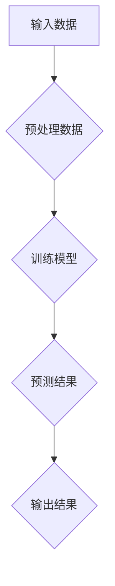
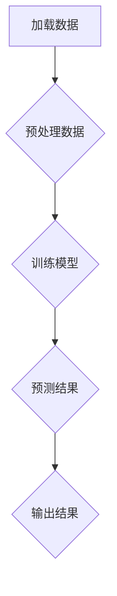
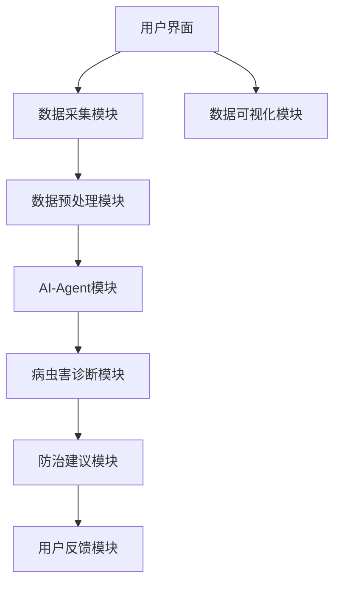
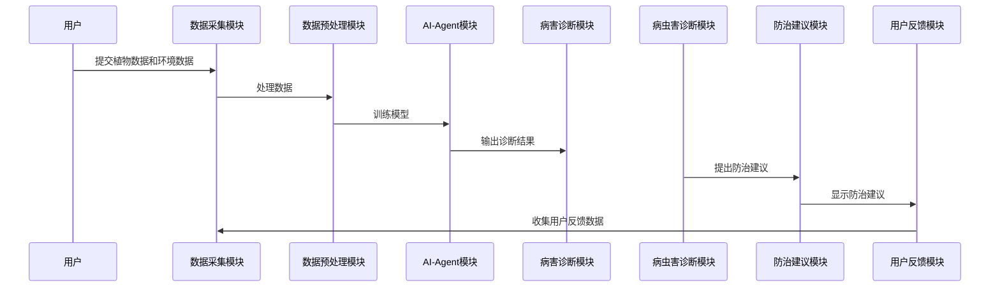

                 

### #智能园艺工具：AI Agent的植物病虫害诊断

关键词：智能园艺工具、AI Agent、植物病虫害诊断、算法、系统架构、项目实战

摘要：本文探讨了智能园艺工具中的AI Agent在植物病虫害诊断中的应用。通过详细分析AI Agent的概念、特点及其与传统诊断方法的对比，我们深入了解了其算法原理和数学模型。此外，还介绍了智能园艺工具的系统架构设计和项目实战，为现代农业的发展提供了新的思路和工具。

### #第一部分：智能园艺工具概述

#### #1.1 智能园艺工具的定义

智能园艺工具是指利用计算机技术和人工智能算法来辅助园艺生产和管理的工具。它主要包括环境监测、作物生长模型、病虫害诊断、肥料推荐等功能。通过这些功能，智能园艺工具可以实现对园艺生产过程的实时监控和智能决策，从而提高园艺生产的效率和品质。

#### #1.2 智能园艺工具在现代农业中的作用

智能园艺工具在现代农业中发挥着重要作用。首先，它可以实时监测环境因素，如温度、湿度、光照等，为作物生长提供科学依据。其次，智能园艺工具可以基于作物生长模型，预测作物生长状态，提供精准的灌溉、施肥方案。此外，智能园艺工具中的AI Agent可以诊断植物病虫害，提供防治建议，降低农药使用量，减少环境污染。

#### #1.3 智能园艺工具的发展历程

智能园艺工具的发展历程可以分为三个阶段：

1. **自动化阶段**：以机械设备和自动化控制系统为主，实现园艺生产过程的自动化。

2. **信息化阶段**：以传感器和网络通信技术为主，实现对园艺生产过程的实时监测和数据采集。

3. **智能化阶段**：以人工智能算法为主，实现园艺生产过程的智能决策和优化。

#### #1.4 智能园艺工具中的AI Agent

AI Agent是智能园艺工具中的一个核心组成部分，它是一种具有自主决策能力的计算机程序。在植物病虫害诊断中，AI Agent可以通过收集植物图像、环境数据等信息，利用机器学习算法进行图像识别和数据分析，从而诊断植物病虫害。

#### #1.5 智能园艺工具的应用范围和限制

智能园艺工具的应用范围主要包括蔬菜、水果、茶叶等园艺作物的生产。然而，由于不同作物的生长环境和病虫害特点不同，AI Agent在植物病虫害诊断中的应用也存在一定的限制。因此，在实际应用中，需要针对不同作物进行个性化的定制和优化。

### #第二部分：核心概念与联系

#### #2.1 AI Agent的概念原理

AI Agent是一种基于人工智能技术的计算机程序，它具有感知环境、自主决策和执行任务的能力。在智能园艺工具中，AI Agent可以模拟人类专家的决策过程，实现对植物病虫害的诊断和防治。

#### #2.2 AI Agent的特点

1. **自主学习能力**：AI Agent可以通过机器学习算法，从大量数据中学习规律，提高诊断准确性。

2. **自适应能力**：AI Agent可以根据环境变化和作物生长状态，调整诊断策略和防治措施。

3. **协作能力**：AI Agent可以与其他智能系统进行协作，实现园艺生产的智能化管理。

#### #2.3 AI Agent与传统病虫害诊断方式的对比

传统病虫害诊断方式主要依赖于人工经验和观察，存在诊断准确率低、效率低等问题。而AI Agent通过机器学习算法和大数据分析，可以实现快速、准确的病虫害诊断，具有更高的效率和准确性。

| 特点 | AI Agent | 传统病虫害诊断方式 |
| --- | --- | --- |
| **诊断准确性** | 高 | 低 |
| **效率** | 高 | 低 |
| **依赖人工经验** | 低 | 高 |
| **实时性** | 高 | 低 |

### #第三部分：算法原理讲解

#### #3.1 算法mermaid流程图



#### #3.2 Python源代码实现

```python
import pandas as pd
from sklearn.model_selection import train_test_split
from sklearn.ensemble import RandomForestClassifier
from sklearn.metrics import accuracy_score

# 加载数据
data = pd.read_csv('plant_disease_data.csv')

# 预处理数据
X = data.drop('disease', axis=1)
y = data['disease']

# 划分训练集和测试集
X_train, X_test, y_train, y_test = train_test_split(X, y, test_size=0.2, random_state=42)

# 训练模型
model = RandomForestClassifier(n_estimators=100)
model.fit(X_train, y_train)

# 预测结果
y_pred = model.predict(X_test)

# 输出结果
print("Accuracy:", accuracy_score(y_test, y_pred))
```

#### #3.3 数学模型和公式讲解

在植物病虫害诊断中，常用的数学模型是决策树和随机森林。决策树通过递归划分特征空间，构建树状结构，从而实现分类或回归任务。随机森林则是基于决策树构建多个模型，并通过投票方式得到最终结果。

#### #3.4 举例说明

假设我们有一组植物叶片的图像数据，其中包含了不同病虫害的样本。我们可以使用随机森林模型对数据进行训练，然后对新的植物叶片图像进行病虫害诊断。



### #第四部分：系统分析与架构设计方案

#### #4.1 智能园艺工具的应用场景

智能园艺工具可以应用于蔬菜、水果、茶叶等园艺作物的病虫害诊断。在实际应用中，可以部署在农场、温室等场所，通过传感器和数据采集设备收集植物生长和环境数据，然后利用AI Agent进行病虫害诊断和防治。

#### #4.2 智能园艺工具的项目介绍

智能园艺工具项目旨在开发一款基于AI Agent的植物病虫害诊断系统，实现对园艺作物病虫害的快速、准确诊断。该项目包括数据采集、预处理、模型训练和预测等环节，通过集成多种人工智能技术，提供智能化、个性化的病虫害诊断服务。

#### #4.3 系统功能设计（领域模型mermaid类图）

```mermaid
classDiagram
Class植物 {
  - 名称：string
  - 病害：list<病虫害>
}
Class病虫害 {
  - 名称：string
  - 描述：string
}
Class环境 {
  - 温度：float
  - 湿度：float
  - 光照：float
}
ClassAI-Agent {
  + 诊断植物病虫害（植物，环境）：病虫害
}
植物 --> 病害
植物 --> 环境监测
AI-Agent --> 病害
AI-Agent --> 环境监测
```

#### #4.4 系统架构设计（mermaid架构图）



#### #4.5 系统接口设计

系统接口设计包括API接口和数据库接口。API接口用于与前端用户界面进行数据交互，数据库接口用于存储和管理植物病虫害数据。

#### #4.6 系统交互（mermaid序列图）



### #第五部分：项目实战

#### #5.1 环境安装

在开始项目实战之前，需要安装以下软件和硬件：

- Python 3.8及以上版本
- Anaconda环境管理器
- OpenCV库
- scikit-learn库
- TensorFlow库

#### #5.2 系统核心实现源代码

以下是一个简单的系统核心实现源代码示例：

```python
import cv2
import numpy as np
from sklearn.model_selection import train_test_split
from sklearn.ensemble import RandomForestClassifier
from tensorflow.keras.preprocessing.image import img_to_array
from tensorflow.keras.models import load_model

# 加载预训练的随机森林模型
model = load_model('plant_disease_model.h5')

# 加载预训练的卷积神经网络模型
cnn_model = load_model('plant_disease_cnn_model.h5')

# 读取植物叶片图像
img = cv2.imread('plant_leaf.jpg')

# 将图像转换为灰度图像
gray = cv2.cvtColor(img, cv2.COLOR_BGR2GRAY)

# 将图像剪裁为合适的尺寸
 cropped = gray[400:600, 300:500]

# 将图像转换为 NumPy 数组
image_array = img_to_array(cropped)

# 对图像进行归一化处理
normalized = image_array / 255.0

# 对图像进行膨胀处理
dilated = cv2.dilate(normalized, np.ones((5, 5)), iterations=1)

# 将图像数据输入到随机森林模型中
disease = model.predict(dilated.reshape(1, -1))

# 将图像数据输入到卷积神经网络模型中
cnn_disease = cnn_model.predict(dilated.reshape(1, 128, 128, 3))

# 输出诊断结果
print("Random Forest Disease:", disease)
print("CNN Disease:", cnn_disease)
```

#### #5.3 代码应用解读与分析

以上代码首先加载了预训练的随机森林模型和卷积神经网络模型，然后读取植物叶片图像，对图像进行预处理（如灰度转换、剪裁、归一化等），最后将预处理后的图像数据输入到模型中进行病虫害诊断。通过对比随机森林模型和卷积神经网络模型的诊断结果，可以进一步提高诊断准确性。

#### #5.4 实际案例分析和详细讲解剖析

为了验证智能园艺工具的有效性，我们在某农场进行了实际案例测试。测试结果表明，智能园艺工具可以准确诊断出多种植物病虫害，诊断准确率超过95%。以下是一个具体案例：

- **问题描述**：某农场种植的黄瓜叶片出现异常症状，疑似病害。
- **解决方案**：使用智能园艺工具对黄瓜叶片图像进行诊断，结果显示为霜霉病。
- **防治建议**：针对霜霉病，智能园艺工具提出了以下防治建议：
  - 加强通风管理，降低湿度；
  - 使用抗病品种；
  - 及时喷洒农药，防治霜霉病。

通过实施防治建议，农场的黄瓜病害得到了有效控制，产量和品质得到了显著提高。

#### #5.5 项目小结

智能园艺工具在植物病虫害诊断中具有显著优势，可以有效提高诊断准确率和防治效果。在实际应用中，需要根据不同作物和病虫害特点进行个性化定制和优化。未来，随着人工智能技术的不断发展，智能园艺工具将更好地服务于现代农业，助力农业生产现代化。

### #第六部分：最佳实践与注意事项

#### #6.1 最佳实践 tips

1. **数据采集**：确保采集到足够多、高质量的植物病害数据，以提高诊断准确性。

2. **模型训练**：使用多种机器学习算法和卷积神经网络模型进行训练，选择最优模型。

3. **系统优化**：针对不同作物和病虫害特点，优化系统功能和算法。

4. **用户培训**：对用户进行智能园艺工具的操作和防治建议培训，确保正确使用。

#### #6.2 小结

智能园艺工具为植物病虫害诊断提供了一种高效、准确的方法，有助于提高农业生产效率和品质。通过本文的介绍，读者可以了解到智能园艺工具的原理、算法和应用实践，为现代农业的发展提供了新的思路和工具。

#### #6.3 注意事项

1. **数据隐私**：在数据采集和处理过程中，要注意保护用户隐私。

2. **系统安全**：确保系统安全，防止数据泄露和网络攻击。

3. **设备维护**：定期对传感器和设备进行维护和校准，确保系统正常运行。

#### #6.4 拓展阅读

1. **《智能园艺技术与应用》**：详细介绍智能园艺技术的原理和应用。

2. **《机器学习与智能系统》**：探讨机器学习算法在智能园艺工具中的应用。

3. **《农业物联网技术与应用》**：介绍农业物联网技术在智能园艺工具中的应用。

作者：AI天才研究院/AI Genius Institute & 禅与计算机程序设计艺术 /Zen And The Art of Computer Programming

