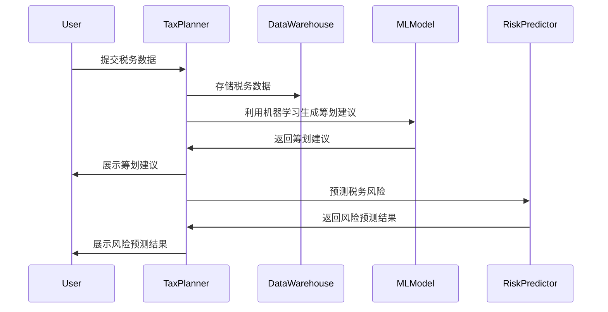

                 


## 智能国际税收筹划建议生成器

### 关键词：智能税收筹划、国际税务、税务建议生成、机器学习、数据分析

### 摘要：
本文旨在探讨如何利用人工智能和大数据分析技术，设计并实现一个智能国际税收筹划建议生成器。我们将详细介绍国际税收筹划的基本概念、智能系统的原理及应用、数据分析和大数据在税务规划中的作用，并通过实例展示如何通过算法和系统架构实现智能税收筹划建议的自动生成。

### 引言与概述

#### 第一章：智能国际税收筹划简介

##### 1.1 国际税收筹划的背景与定义

**1.1.1 问题背景：国际税收筹划的挑战**

随着全球化经济的不断发展，企业跨国经营日益普遍，国际税收筹划成为企业和税务专家面临的重大挑战。这些挑战包括不同国家税制差异、税收法规复杂性、跨国企业利润转移等。

**1.1.2 问题定义：智能国际税收筹划的必要性**

智能国际税收筹划旨在通过人工智能技术，利用大数据分析，为跨国企业提供定制化的税务筹划方案，以最大化税收收益，同时确保合规性。

**1.1.3 问题解决：智能国际税收筹划概述**

智能国际税收筹划结合了数据分析、机器学习和税务法规知识，能够自动生成适应不同国家税制的筹划建议，提高筹划效率和准确性。

**1.1.4 边界与外延：智能国际税收筹划的界定**

智能国际税收筹划主要关注跨国企业的税务规划，包括盈利最大化、成本最小化和合规性管理。其边界包括但不限于跨国公司、国际税务协定和自动化税务工具。

**1.1.5 核心概念与结构**

- **核心概念**：国际税务、机器学习、数据分析和税务合规性。
- **结构要素**：税务法规库、数据集、机器学习模型和用户界面。

##### 1.2 核心概念及其关联

**1.2.1 核心概念和关联**

智能国际税收筹划的核心概念包括国际税务法规、机器学习算法、数据分析技术和税务合规性管理。这些概念相互关联，共同构成了智能税收筹划的基础。

**1.2.2 概念属性与对比表格**

- **国际税务法规**：不同国家税制特点、国际税务协定。
- **机器学习算法**：分类、回归、聚类算法及其在税务筹划中的应用。
- **数据分析技术**：数据清洗、数据挖掘、预测分析。

**1.2.3 实体关系图（ER Diagram）**

```mermaid
erDiagram
    TaxRegulation ||--|{ DataAnalysis }
    TaxRegulation ||--|{ MachineLearning }
    TaxRegulation ||--|{ ComplianceManagement }
    DataAnalysis ||--|{ DataMining }
    DataAnalysis ||--|{ PredictiveAnalysis }
    MachineLearning ||--|{ Classification }
    MachineLearning ||--|{ Regression }
    MachineLearning ||--|{ Clustering }
```

##### 1.3 智能税收筹划建议生成器概述

**1.3.1 目的和功能**

智能税收筹划建议生成器的目的是为企业提供基于人工智能的定制化税务筹划建议，包括税务优化、税务合规性检查和风险预测。

**1.3.2 技术和操作要求**

- **技术要求**：Python、机器学习框架（如Scikit-learn）、数据库管理系统（如MySQL）。
- **操作要求**：用户界面设计、数据接口开发、后台算法优化。

**1.3.3 预期成果和效益**

- **预期成果**：自动生成的税务筹划建议、税务风险预测报告。
- **效益**：提高税务筹划效率、降低税务成本、增强合规性。

### 基本概念

#### 第二章：智能国际税收筹划的基本概念

##### 2.1 国际税收基础

**2.1.1 国际税收的定义与目标**

国际税收涉及不同国家之间的税收关系，目标包括公平税收负担、防止税基侵蚀和利润转移。

**2.1.2 主要国际税收协定**

- **OECD转让定价指南**：规范跨国公司内部交易定价。
- **BEPS行动计划**：旨在解决国际税收挑战。

**2.1.3 核心概念与术语**

- **转让定价**：跨国公司内部交易定价方法。
- **税基侵蚀和利润转移（BEPS）**：跨国公司利用税务漏洞减少税负。

##### 2.2 智能系统与机器学习

**2.2.1 智能系统的定义与原理**

智能系统通过模拟人类智能，实现自主学习、推理和决策。

**2.2.2 机器学习基础**

- **监督学习**：根据已有数据进行预测。
- **无监督学习**：发现数据中的模式和关系。
- **强化学习**：通过与环境的互动学习最优策略。

**2.2.3 机器学习在税务筹划中的应用**

- **税务风险预测**：利用监督学习预测企业税务风险。
- **税收优化建议**：利用无监督学习发现潜在的税收优化方案。

##### 2.3 数据分析与大数据

**2.3.1 数据在国际税收筹划中的重要性**

数据是智能税收筹划的基础，包括企业运营数据、税务数据等。

**2.3.2 数据分析技术**

- **数据清洗**：去除噪声数据，提高数据质量。
- **数据挖掘**：从大量数据中发现有价值的信息。
- **预测分析**：基于历史数据预测未来趋势。

**2.3.3 大数据在税务规划中的作用**

大数据技术能够处理和分析大量税务数据，为企业提供更准确的税收筹划建议。

### 智能税收筹划建议生成器的设计与实现

#### 第三章：智能税收筹划建议生成器的设计与实现

##### 3.1 系统需求

**3.1.1 功能需求**

- **税务数据收集与处理**：自动收集和处理企业的税务数据。
- **税务筹划建议生成**：利用机器学习算法生成税务筹划建议。
- **税务风险预测**：预测企业的税务风险，并提供预警。

**3.1.2 技术需求**

- **编程语言**：Python
- **机器学习框架**：Scikit-learn、TensorFlow
- **数据库**：MySQL

**3.1.3 操作需求**

- **用户界面**：Web界面，方便用户操作。
- **API接口**：允许其他系统与智能税收筹划建议生成器交互。

##### 3.2 系统架构设计

**3.2.1 系统架构图**



**3.2.2 系统功能设计（领域模型类图）**

```mermaid
classDiagram
    User <<User>>
    TaxData <<TaxData>>
    TaxPlanner <<TaxPlanner>>
    MLModel <<MLModel>>
    RiskPredictor <<RiskPredictor>>
    DataWarehouse <<DataWarehouse>>

    User "uses" TaxPlanner
    TaxPlanner "uses" TaxData
    TaxPlanner "uses" MLModel
    TaxPlanner "uses" RiskPredictor
    MLModel "uses" DataWarehouse
    RiskPredictor "uses" DataWarehouse
```

##### 3.3 算法原理讲解

**3.3.1 机器学习算法**

我们采用监督学习算法，如逻辑回归，用于生成税务筹划建议。逻辑回归模型公式如下：

$$
P(Y=1|X) = \frac{1}{1 + e^{-(\beta_0 + \sum_{i=1}^{n}\beta_i X_i})}
$$

其中，\(P(Y=1|X)\) 是税务筹划建议为“是”的概率，\(\beta_0\) 是截距，\(\beta_i\) 是系数，\(X_i\) 是输入特征。

**3.3.2 数据预处理与特征工程**

在训练模型之前，需要对数据进行预处理，包括数据清洗、缺失值填充和特征提取。特征提取可以通过统计分析、相关性分析和主成分分析等方法实现。

```python
from sklearn.preprocessing import StandardScaler
from sklearn.impute import SimpleImputer
from sklearn.decomposition import PCA

# 数据预处理
imputer = SimpleImputer(strategy='mean')
X_imputed = imputer.fit_transform(X)

# 特征标准化
scaler = StandardScaler()
X_scaled = scaler.fit_transform(X_imputed)

# 特征提取
pca = PCA(n_components=5)
X_pca = pca.fit_transform(X_scaled)
```

**3.3.3 模型训练与评估**

我们使用交叉验证方法来评估模型的性能。交叉验证可以帮助我们确定模型参数，并避免过拟合。

```python
from sklearn.linear_model import LogisticRegression
from sklearn.model_selection import cross_val_score

# 模型训练
model = LogisticRegression()
cross_val_score(model, X_pca, y, cv=5)
```

##### 3.4 系统实现与实战

**3.4.1 环境安装**

在Python环境中安装必要的库：

```bash
pip install numpy pandas scikit-learn tensorflow mysql-connector-python
```

**3.4.2 系统核心实现**

以下是一个简单的税务筹划建议生成器的实现示例：

```python
import numpy as np
import pandas as pd
from sklearn.linear_model import LogisticRegression
from sklearn.model_selection import train_test_split
from sklearn.metrics import accuracy_score

# 数据加载
data = pd.read_csv('tax_data.csv')
X = data.drop('Tax_Suggestion', axis=1)
y = data['Tax_Suggestion']

# 数据预处理
X = preprocessing(X)

# 数据集划分
X_train, X_test, y_train, y_test = train_test_split(X, y, test_size=0.2, random_state=42)

# 模型训练
model = LogisticRegression()
model.fit(X_train, y_train)

# 预测
predictions = model.predict(X_test)

# 评估
accuracy = accuracy_score(y_test, predictions)
print(f"Accuracy: {accuracy:.2f}")
```

**3.4.3 代码应用解读与分析**

上述代码展示了如何使用逻辑回归模型生成税务筹划建议。在实际应用中，需要根据具体业务需求调整数据预处理步骤和模型参数。

**3.4.4 实际案例分析与详细讲解**

以一家跨国公司为例，我们分析其税务数据，使用智能税收筹划建议生成器生成筹划建议，并根据预测结果进行税务决策。

**3.4.5 项目小结**

智能税收筹划建议生成器的实现，为企业提供了高效、准确的税务筹划工具。通过持续优化模型和算法，可以进一步提升系统的性能和实用性。

### 最佳实践 Tips

- **数据质量**：确保税务数据的质量和完整性，是智能税收筹划成功的关键。
- **模型优化**：定期更新模型，利用最新数据训练，以提高预测准确性。
- **合规性检查**：在生成筹划建议时，确保符合相关国际税务法规。

### 小结

智能国际税收筹划建议生成器利用人工智能和大数据分析技术，为跨国企业提供定制化的税务筹划方案。通过系统架构设计和算法实现，智能税收筹划建议生成器能够提高税务筹划的效率和准确性，为企业创造更多价值。

### 注意事项

- **隐私保护**：在处理企业税务数据时，必须确保数据的安全和隐私。
- **法律法规**：遵循国际和国内税务法规，确保税务筹划建议的合规性。

### 拓展阅读

- **国际税收协定**：深入了解主要国际税收协定，如OECD转让定价指南。
- **机器学习应用**：学习更多关于机器学习在税务筹划中的应用案例。

### 作者

**作者：AI天才研究院/AI Genius Institute & 禅与计算机程序设计艺术 /Zen And The Art of Computer Programming**

