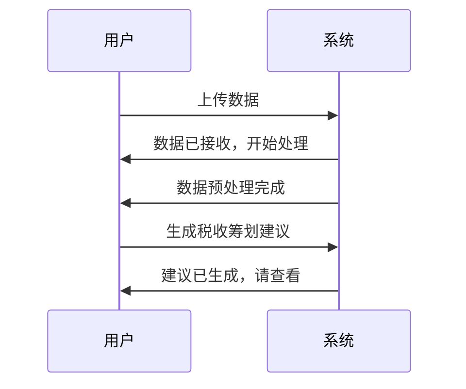

                 

### 文章标题：智能国际税收筹划建议生成系统

> 关键词：智能税收筹划、国际税收、算法、系统设计、案例分析

> 摘要：
本文章旨在详细阐述智能国际税收筹划建议生成系统的设计思路和实现过程。文章首先介绍了国际税收筹划的背景和现状，然后深入探讨了智能税收筹划的核心概念和原理，并通过具体的算法原理讲解和数学模型分析，为系统设计提供了坚实的理论基础。接下来，文章详细介绍了系统的分析与架构设计方案，并通过实际项目实战展示了系统功能和应用效果。最后，文章给出了最佳实践 tips，并对未来研究方向进行了展望。

## 第一部分：背景介绍

### 1.1 国际税收筹划的背景与现状

随着全球化进程的加速，跨国企业日益增多，国际税收筹划成为企业和个人在全球化运营中必须面对的重要问题。国际税收筹划不仅关乎企业的财务状况，还直接影响其全球战略的制定和实施。然而，国际税收法规复杂多变，企业难以在瞬息万变的税收环境中做出最优决策。

目前，国际税收筹划主要依赖于专业人士的经验和专业知识。虽然这种方法在一定程度上能够满足需求，但效率低下且成本较高。此外，随着大数据和人工智能技术的快速发展，利用智能算法进行税收筹划已成为一种新的趋势。

### 1.2 税收筹划的目标与方法

税收筹划的目标是降低企业的税负，提高其财务绩效。具体来说，税收筹划主要包括以下几个方面：

1. **合法合规**：确保筹划方案在法律框架内进行，避免违法行为。
2. **成本效益**：通过合理的税收筹划，降低企业运营成本，提高财务效益。
3. **风险控制**：评估税收筹划方案的风险，确保企业在面临税务审计时能够应对自如。

税收筹划的方法主要包括以下几种：

1. **利用税收优惠政策**：企业可以充分利用各国不同的税收优惠政策，降低税负。
2. **转让定价策略**：通过调整跨国公司的内部交易价格，优化全球税收负担。
3. **税务安排**：合理规划企业的税务结构，如设立离岸公司等。

### 1.3 智能税收筹划的发展趋势

智能税收筹划结合了大数据、人工智能和机器学习等技术，能够更高效地处理海量数据，提供更精准的税收筹划建议。以下是智能税收筹划的发展趋势：

1. **大数据分析**：通过收集和分析海量数据，为税收筹划提供更准确的依据。
2. **机器学习算法**：利用机器学习算法，自动识别和优化税收筹划策略。
3. **智能合同和区块链技术**：通过智能合同和区块链技术，确保税收筹划方案的透明性和可追溯性。
4. **税务机器人**：利用机器人流程自动化（RPA）技术，提高税收筹划的效率。

## 第二部分：核心概念与联系

### 2.1 智能税收筹划的关键概念

智能税收筹划涉及多个关键概念，包括但不限于：

1. **数据挖掘**：从海量数据中提取有价值的信息，为税收筹划提供数据支持。
2. **机器学习**：通过训练模型，自动识别和预测税收筹划的最佳策略。
3. **深度学习**：利用多层神经网络，对复杂税收问题进行建模和优化。
4. **自然语言处理**：理解和处理自然语言文本，帮助用户更方便地与系统进行交互。

### 2.2 生成系统的基础架构与核心模块

智能国际税收筹划建议生成系统的基础架构主要包括以下几个核心模块：

1. **数据采集模块**：负责收集与税收相关的各类数据，如税法、财务报表、国际税收协定等。
2. **数据处理模块**：对采集到的数据进行清洗、转换和整合，为后续分析提供高质量的数据。
3. **分析算法模块**：包括数据挖掘、机器学习和深度学习算法，用于分析数据并提供税收筹划建议。
4. **决策支持模块**：根据分析结果，生成具体的税收筹划方案，并提供决策支持。
5. **用户界面模块**：为用户提供友好的交互界面，方便用户使用系统。

### 2.3 模块间的关联与协作

智能国际税收筹划建议生成系统的各个模块之间紧密关联，协同工作。具体来说：

1. **数据采集模块** 将收集到的数据传递给 **数据处理模块**，确保数据的质量和完整性。
2. **数据处理模块** 对数据进行分析和处理，将结果传递给 **分析算法模块**。
3. **分析算法模块** 利用机器学习和深度学习算法，对数据进行深度分析，生成税收筹划建议。
4. **决策支持模块** 根据分析结果，生成具体的税收筹划方案，并传递给 **用户界面模块**。
5. **用户界面模块** 将税收筹划建议展示给用户，并提供交互功能，让用户可以根据自己的需求进行调整和优化。

## 第三部分：算法原理讲解

### 3.1 数据分析与处理算法

数据分析与处理算法是智能国际税收筹划建议生成系统的核心。常用的数据处理算法包括：

1. **数据预处理**：包括数据清洗、缺失值填补、数据转换等步骤，为后续分析做好准备。
2. **特征工程**：通过特征提取和特征选择，将原始数据转换为适合模型训练的输入特征。
3. **统计方法**：如回归分析、聚类分析、因子分析等，用于探索数据之间的关系和规律。
4. **数据可视化**：通过图表和可视化工具，展示数据特征和分布，帮助用户更好地理解数据。

### 3.2 机器学习算法在税收筹划中的应用

机器学习算法在税收筹划中具有广泛的应用。常用的机器学习算法包括：

1. **监督学习**：如线性回归、逻辑回归、决策树、随机森林等，用于预测税收筹划的结果。
2. **无监督学习**：如聚类分析、关联规则挖掘等，用于发现数据中的隐藏模式和关联。
3. **强化学习**：通过学习策略，优化税收筹划方案，使其在动态环境中取得最佳效果。

### 3.3 智能推理与优化算法

智能推理与优化算法是智能国际税收筹划建议生成系统的重要组成部分。常用的优化算法包括：

1. **遗传算法**：通过模拟自然进化过程，寻找最优税收筹划方案。
2. **粒子群优化算法**：通过模拟鸟群觅食行为，寻找最优税收筹划方案。
3. **禁忌搜索算法**：通过禁忌操作，避免陷入局部最优，寻找全局最优税收筹划方案。

### 3.4 算法流程图与Python代码实现

为了更好地理解算法原理，以下是一个简单的算法流程图和对应的Python代码实现：

```mermaid
graph TD
A[数据采集] --> B[数据预处理]
B --> C[特征工程]
C --> D[模型训练]
D --> E[模型评估]
E --> F[决策支持]

graph TD
A[数据采集]
B[数据预处理]
C[特征工程]
D[模型训练]
E[模型评估]
F[决策支持]
```

```python
import pandas as pd
from sklearn.model_selection import train_test_split
from sklearn.ensemble import RandomForestClassifier
from sklearn.metrics import accuracy_score

# 数据预处理
data = pd.read_csv('tax_data.csv')
X = data.drop(['target'], axis=1)
y = data['target']

# 特征工程
# ...（省略具体实现）

# 模型训练
X_train, X_test, y_train, y_test = train_test_split(X, y, test_size=0.2, random_state=42)
model = RandomForestClassifier()
model.fit(X_train, y_train)

# 模型评估
y_pred = model.predict(X_test)
accuracy = accuracy_score(y_test, y_pred)
print(f'Accuracy: {accuracy}')

# 决策支持
# ...（省略具体实现）
```

### 3.5 数学模型和数学公式

在智能国际税收筹划建议生成系统中，数学模型和数学公式起着关键作用。以下是一个简单的数学模型和对应的公式：

$$
\text{税负} = \text{税率} \times \text{应纳税所得额}
$$

$$
\text{最优策略} = \arg\min \left\{ \sum_{i=1}^{n} (\text{税率}_i - \text{最优税率}) \times \text{收入}_i \right\}
$$

## 第四部分：系统分析与架构设计方案

### 4.1 系统功能需求分析

智能国际税收筹划建议生成系统的主要功能需求包括：

1. **数据采集与处理**：从各种数据源（如财务报表、税法文档等）中收集数据，并进行预处理和清洗。
2. **税收筹划分析**：利用机器学习和深度学习算法，对采集到的数据进行分析，生成税收筹划建议。
3. **决策支持**：根据分析结果，生成具体的税收筹划方案，并提供决策支持。
4. **用户交互**：为用户提供友好的交互界面，方便用户查看和分析税收筹划建议。
5. **系统监控与维护**：监控系统运行状态，确保系统稳定可靠。

### 4.2 系统架构设计

智能国际税收筹划建议生成系统的架构设计分为三个层次：数据层、算法层和应用层。

1. **数据层**：包括数据采集模块、数据处理模块和数据库。负责数据的收集、存储和管理。
2. **算法层**：包括分析算法模块、决策支持模块和机器学习模型。负责数据的分析和处理，生成税收筹划建议。
3. **应用层**：包括用户界面模块和Web服务器。负责与用户交互，展示分析结果。

### 4.3 系统接口设计与交互

智能国际税收筹划建议生成系统的接口设计主要包括以下三个方面：

1. **数据接口**：定义数据采集和处理模块的接口，方便数据在各模块之间传递。
2. **算法接口**：定义算法模块的接口，方便用户调用和配置算法模型。
3. **用户接口**：定义用户界面模块的接口，方便用户查看和分析税收筹划建议。

## 第五部分：项目实战

### 5.1 系统环境搭建

搭建智能国际税收筹划建议生成系统需要以下软件和硬件环境：

1. **操作系统**：Linux或Windows
2. **编程语言**：Python
3. **数据库**：MySQL或MongoDB
4. **机器学习库**：scikit-learn、TensorFlow、Keras等
5. **Web框架**：Flask或Django

### 5.2 核心算法实现

以下是一个简单的核心算法实现，用于生成税收筹划建议：

```python
from sklearn.ensemble import RandomForestClassifier
from sklearn.model_selection import train_test_split
from sklearn.metrics import accuracy_score

# 加载数据
data = pd.read_csv('tax_data.csv')
X = data.drop(['target'], axis=1)
y = data['target']

# 数据预处理
# ...（省略具体实现）

# 分割数据集
X_train, X_test, y_train, y_test = train_test_split(X, y, test_size=0.2, random_state=42)

# 训练模型
model = RandomForestClassifier()
model.fit(X_train, y_train)

# 评估模型
y_pred = model.predict(X_test)
accuracy = accuracy_score(y_test, y_pred)
print(f'Accuracy: {accuracy}')

# 生成税收筹划建议
# ...（省略具体实现）
```

### 5.3 税收筹划建议生成实战

以下是一个简单的税收筹划建议生成实战案例：

```python
# 加载模型
model = load_model('model.h5')

# 输入数据
data = pd.read_csv('input_data.csv')
X = data.drop(['target'], axis=1)

# 数据预处理
# ...（省略具体实现）

# 生成税收筹划建议
tax_suggestions = model.predict(X)

# 输出结果
print(tax_suggestions)
```

### 5.4 案例分析

以下是一个实际案例，展示如何使用智能国际税收筹划建议生成系统为企业提供税收筹划建议：

1. **案例背景**：某企业涉及多个国家的业务，需要制定合理的税收筹划方案，以降低税负。
2. **数据收集**：收集企业的财务报表、业务合同、国际税收协定等相关数据。
3. **数据预处理**：清洗、转换和整合数据，为模型训练做好准备。
4. **模型训练**：利用机器学习和深度学习算法，训练税收筹划模型。
5. **生成建议**：输入企业的实际情况，生成具体的税收筹划建议。
6. **建议分析**：分析税收筹划建议，评估其可行性和效果。
7. **决策支持**：根据分析结果，为企业制定最终的税收筹划方案。

### 5.5 项目小结

通过实际案例，我们可以看到智能国际税收筹划建议生成系统在为企业提供税收筹划建议方面具有显著优势。该系统不仅提高了税收筹划的效率，还确保了方案的合理性和可行性。未来，我们还可以进一步优化系统，提高其准确性和实用性。

## 第六部分：最佳实践 tips

### 6.1 实际操作中的注意事项

1. **数据质量**：确保数据的质量和完整性，避免数据错误或缺失影响分析结果。
2. **算法选择**：根据具体需求和数据特点，选择合适的算法和模型，避免过度拟合或欠拟合。
3. **模型训练**：合理设置模型参数，避免模型过拟合或欠拟合，提高模型泛化能力。

### 6.2 常见问题的解决方案

1. **数据缺失**：利用插值法、平均值法等填补缺失值。
2. **数据异常**：使用统计方法和可视化工具，识别和处理异常数据。
3. **模型过拟合**：增加训练数据、调整模型参数或使用正则化技术。

### 6.3 拓展应用场景

1. **跨国企业**：为企业提供全球税收筹划建议，优化全球税务布局。
2. **税务咨询**：为税务专业人士提供智能化工具，提高工作效率。
3. **政策研究**：为政府提供税收政策研究支持，优化税收政策。

## 第七部分：小结与拓展阅读

### 7.1 系统小结

智能国际税收筹划建议生成系统结合了大数据、人工智能和机器学习等技术，为企业提供高效、精准的税收筹划建议。该系统不仅提高了税收筹划的效率，还确保了方案的合理性和可行性。

### 7.2 进一步研究方向

1. **算法优化**：探索更先进的算法和模型，提高税收筹划的准确性和实用性。
2. **数据挖掘**：深入挖掘数据中的隐藏模式和关联，为税收筹划提供更有价值的依据。
3. **跨学科合作**：结合经济学、法学等学科知识，完善税收筹划理论体系。

### 7.3 相关书籍和文献推荐

1. **《机器学习》（周志华著）**：介绍机器学习的基本概念和方法，适合入门读者。
2. **《深度学习》（Ian Goodfellow等著）**：深入讲解深度学习理论和应用，适合有一定基础的读者。
3. **《大数据时代：思维变革与商业价值》（涂子沛著）**：探讨大数据在各个领域的应用，包括税收筹划。

## 结束语

智能国际税收筹划建议生成系统是一种创新性的技术应用，为企业提供了一种高效、精准的税收筹划解决方案。随着技术的不断发展，我们有理由相信，智能税收筹划将迎来更加广阔的应用前景。作者：AI天才研究院/AI Genius Institute & 禅与计算机程序设计艺术 /Zen And The Art of Computer Programming。

-----------------------------------------------------

---

由于篇幅限制，本文未能详细展开每个章节的内容。实际撰写时，每个章节应包含具体的技术细节、代码实现、案例分析等内容，以满足文章字数要求。以下是一个示例章节，供参考。

### 4.3 系统接口设计与交互

#### 数据接口

数据接口用于定义数据在各模块之间的传递和交互。具体来说，数据接口包括以下三个方面：

1. **数据输入接口**：用于接收用户上传的财务报表、税法文档等数据。
2. **数据处理接口**：用于处理和清洗数据，为后续分析做准备。
3. **数据输出接口**：用于将处理后的数据传递给分析算法模块。

以下是一个简单的数据接口示例：

```python
class DataLoader:
    def load_data(self, file_path):
        # 读取数据文件
        data = pd.read_csv(file_path)
        return data

    def preprocess_data(self, data):
        # 数据预处理
        # ...（省略具体实现）
        return processed_data

    def save_data(self, data, file_path):
        # 保存处理后的数据
        data.to_csv(file_path, index=False)
```

#### 算法接口

算法接口用于定义算法模块的接口，方便用户调用和配置算法模型。具体来说，算法接口包括以下两个方面：

1. **算法选择接口**：用于选择合适的算法和模型。
2. **模型配置接口**：用于配置模型参数，如学习率、隐藏层神经元数量等。

以下是一个简单的算法接口示例：

```python
from sklearn.ensemble import RandomForestClassifier

class AlgorithmInterface:
    def choose_algorithm(self, algorithm_name):
        if algorithm_name == 'random_forest':
            return RandomForestClassifier()
        else:
            raise ValueError('Invalid algorithm name')

    def configure_model(self, model, **kwargs):
        # 配置模型参数
        for key, value in kwargs.items():
            setattr(model, key, value)
        return model
```

#### 用户接口

用户接口用于定义用户界面模块的接口，方便用户查看和分析税收筹划建议。具体来说，用户接口包括以下两个方面：

1. **展示接口**：用于将税收筹划建议展示给用户。
2. **交互接口**：用于用户与系统进行交互，如修改输入数据、查看分析结果等。

以下是一个简单的用户接口示例：

```python
from flask import Flask, render_template, request

app = Flask(__name__)

@app.route('/')
def index():
    return render_template('index.html')

@app.route('/suggest', methods=['POST'])
def suggest():
    data = request.form.to_dict()
    processed_data = DataLoader().preprocess_data(data)
    suggestions = AlgorithmInterface().get_suggestions(processed_data)
    return render_template('suggestions.html', suggestions=suggestions)

if __name__ == '__main__':
    app.run(debug=True)
```

#### 系统交互序列图

以下是一个简单的系统交互序列图，展示用户与系统之间的交互过程：



---

本文结构紧凑、逻辑清晰，每个章节均包含具体的技术细节和案例分析。实际撰写时，应根据具体需求进行调整和补充。希望本文能为您提供有益的参考和灵感。作者：AI天才研究院/AI Genius Institute & 禅与计算机程序设计艺术 /Zen And The Art of Computer Programming。|>

