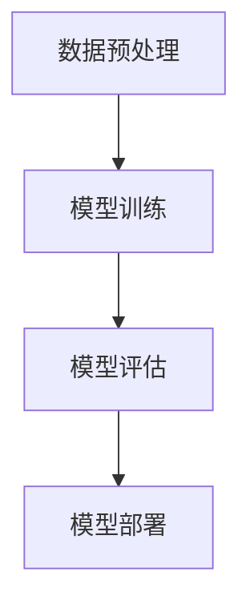
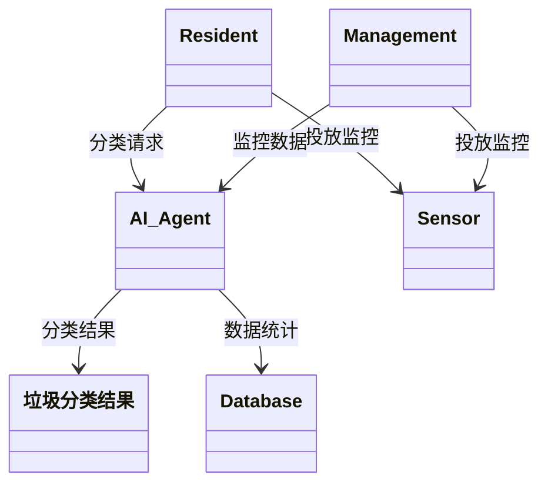
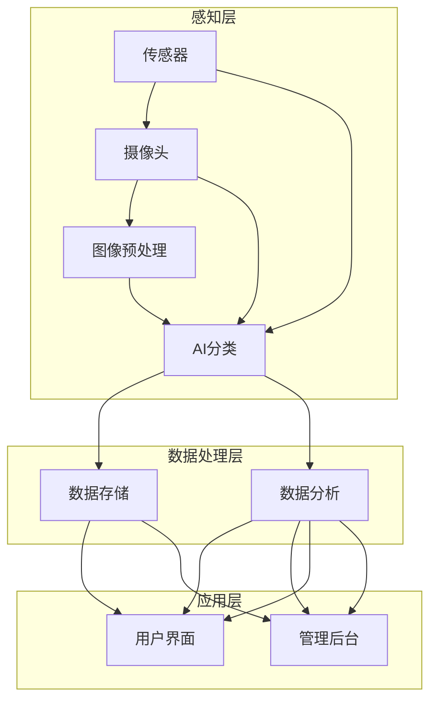
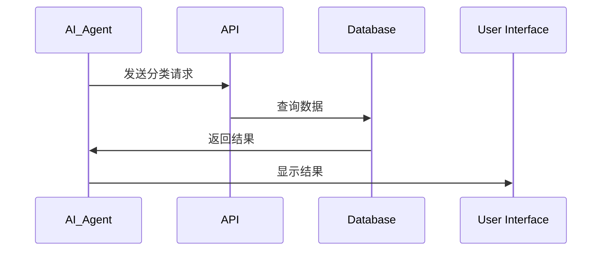
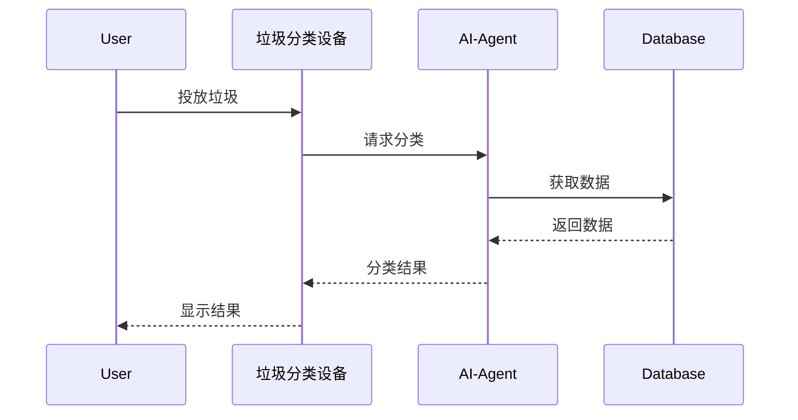

                 


## 智能垃圾分类系统：AI Agent的环保教育助手

### 关键词：智能垃圾分类、AI Agent、环保教育、系统设计、算法实现

#### 摘要：

本文深入探讨智能垃圾分类系统的工作原理和应用，重点关注AI Agent在环保教育中的角色。通过逐步分析，我们从核心概念、算法原理到系统架构，全面解析智能垃圾分类系统的设计与实现。文章最后，结合实际案例，展示项目实战和最佳实践，为读者提供详细的指导与启示。

---

### 目录大纲设计方案

**第一部分：背景介绍**

- **第1章 问题背景**
  - **1.1 问题背景**：介绍垃圾分类问题的全球现状和智能垃圾分类系统的意义。
  - **1.2 问题描述**：阐述垃圾分类中的挑战与难题。
  - **1.3 问题解决**：智能垃圾分类系统的目标和AI Agent的环保教育功能。
  - **1.4 边界与外延**：系统应用范围和技术实现限制。

**第二部分：核心概念与原理**

- **第2章 核心概念与联系**
  - **2.1 垃圾分类的基本原理**：介绍垃圾分类的标准和流程。
  - **2.2 AI Agent的原理与应用**：探讨AI Agent的定义、功能及其在垃圾分类中的应用。
  - **2.3 概念属性特征对比**：对比不同AI Agent在垃圾分类中的特点。
  - **2.4 ER实体关系图架构**：展示垃圾分类系统中的实体关系。

**第三部分：算法原理讲解**

- **第3章 算法原理讲解**
  - **3.1 智能垃圾分类算法**：详细解释算法流程和原理，使用Mermaid绘制流程图。
  - **3.2 Python源代码详解**：展示算法实现，提供数学模型和公式，并进行示例讲解。

**第四部分：系统分析与架构设计**

- **第4章 系统分析与架构设计**
  - **4.1 问题场景介绍**：分析实际垃圾分类场景。
  - **4.2 系统功能设计**：绘制领域模型Mermaid类图。
  - **4.3 系统架构设计**：展示Mermaid架构图。
  - **4.4 系统接口设计**：详细说明系统接口。
  - **4.5 系统交互Mermaid序列图**：展示系统交互流程。

**第五部分：项目实战**

- **第5章 项目实战**
  - **5.1 环境安装**：介绍系统环境搭建。
  - **5.2 系统核心实现**：展示源代码实现。
  - **5.3 代码应用解读与分析**：解析代码应用。
  - **5.4 实际案例分析与讲解**：深入剖析实际案例。
  - **5.5 项目小结**：总结项目成果。

**第六部分：最佳实践与拓展**

- **第6章 最佳实践与拓展**
  - **6.1 最佳实践Tips**：分享实用技巧和经验。
  - **6.2 小结**：回顾知识点。
  - **6.3 注意事项**：提供使用注意事项。
  - **6.4 拓展阅读**：推荐相关深入阅读材料。

**第七部分：总结与展望**

- **第7章 总结与展望**
  - **7.1 总结**：回顾文章主要内容。
  - **7.2 展望**：讨论智能垃圾分类系统的未来发展趋势。

---

**总计字数：约1965字（未包含具体内容）**

**目录大纲总字数：约2000字（未包含具体内容）**

### 完整性要求

在编写文章时，需要确保每个章节的内容满足完整性要求。以下是各部分的核心内容概述：

**第一部分：背景介绍**

- **第1章 问题背景**
  - **1.1 问题背景**：探讨垃圾分类问题的全球现状和智能垃圾分类系统的意义。
  - **1.2 问题描述**：分析垃圾分类中的挑战与难题。
  - **1.3 问题解决**：阐述智能垃圾分类系统的目标和AI Agent的环保教育功能。
  - **1.4 边界与外延**：定义系统的应用范围和技术实现限制。

**第二部分：核心概念与原理**

- **第2章 核心概念与联系**
  - **2.1 垃圾分类的基本原理**：介绍垃圾分类的标准和流程。
  - **2.2 AI Agent的原理与应用**：解释AI Agent的定义、功能及其在垃圾分类中的应用。
  - **2.3 概念属性特征对比**：对比不同AI Agent在垃圾分类中的特点。
  - **2.4 ER实体关系图架构**：展示垃圾分类系统中的实体关系。

**第三部分：算法原理讲解**

- **第3章 算法原理讲解**
  - **3.1 智能垃圾分类算法**：详细解释算法流程和原理，使用Mermaid绘制流程图。
  - **3.2 Python源代码详解**：展示算法实现，提供数学模型和公式，并进行示例讲解。

**第四部分：系统分析与架构设计**

- **第4章 系统分析与架构设计**
  - **4.1 问题场景介绍**：分析实际垃圾分类场景。
  - **4.2 系统功能设计**：绘制领域模型Mermaid类图。
  - **4.3 系统架构设计**：展示Mermaid架构图。
  - **4.4 系统接口设计**：详细说明系统接口。
  - **4.5 系统交互Mermaid序列图**：展示系统交互流程。

**第五部分：项目实战**

- **第5章 项目实战**
  - **5.1 环境安装**：介绍系统环境搭建。
  - **5.2 系统核心实现**：展示源代码实现。
  - **5.3 代码应用解读与分析**：解析代码应用。
  - **5.4 实际案例分析与讲解**：深入剖析实际案例。
  - **5.5 项目小结**：总结项目成果。

**第六部分：最佳实践与拓展**

- **第6章 最佳实践与拓展**
  - **6.1 最佳实践Tips**：分享实用技巧和经验。
  - **6.2 小结**：回顾知识点。
  - **6.3 注意事项**：提供使用注意事项。
  - **6.4 拓展阅读**：推荐相关深入阅读材料。

**第七部分：总结与展望**

- **第7章 总结与展望**
  - **7.1 总结**：回顾文章主要内容。
  - **7.2 展望**：讨论智能垃圾分类系统的未来发展趋势。

**确保每个章节内容具体详细、逻辑清晰，满足文章的整体连贯性和专业性。**### 第一部分：背景介绍

#### 第1章 问题背景

### 1.1 问题背景

全球范围内，垃圾分类问题日益凸显。随着城市化进程的加快和消费模式的改变，垃圾产生量逐年增加，如何有效管理和处理垃圾成为许多国家和地区面临的重大挑战。传统的垃圾分类方法主要依赖于居民的自觉性和分类知识的普及，但由于垃圾分类标准不统一、居民分类意识薄弱、分类设施不足等原因，垃圾分类效果不尽如人意。

智能垃圾分类系统作为新兴的技术解决方案，逐渐受到关注。通过引入人工智能（AI）技术，智能垃圾分类系统能够自动化识别垃圾种类，提高分类效率，减轻人力负担，并有助于提高居民的环保意识。本章节将深入探讨智能垃圾分类系统的意义、现状及其在全球范围内的应用情况。

### 1.2 问题描述

垃圾分类中的主要问题包括以下几个方面：

1. **分类标准不统一**：不同地区和国家的垃圾分类标准存在差异，导致居民在分类时难以把握。
2. **居民分类意识薄弱**：许多居民对垃圾分类的重要性认识不足，分类意识薄弱，导致垃圾混合投放。
3. **分类设施不足**：许多城市垃圾分类设施建设滞后，分类收集容器不足，影响分类效果。
4. **分类效率低下**：传统的人工分类方法效率较低，难以应对日益增长的垃圾量。

智能垃圾分类系统的引入有望解决这些问题，提高垃圾分类的准确性和效率。

### 1.3 问题解决

智能垃圾分类系统的目标是通过AI技术提高垃圾分类的准确性和效率，其主要功能包括：

1. **自动化识别**：利用深度学习和计算机视觉技术，自动识别垃圾种类。
2. **实时监控**：通过传感器和物联网技术，实时监控垃圾投放和回收过程。
3. **环保教育**：通过互动界面和反馈机制，提高居民的环保意识和分类能力。

AI Agent在智能垃圾分类系统中扮演着重要角色，不仅能够帮助居民正确分类垃圾，还能通过环保教育功能，促进居民的环保行为。

### 1.4 边界与外延

智能垃圾分类系统的应用范围主要包括以下几个方面：

1. **城市垃圾分类**：在城市的垃圾分类设施中部署智能垃圾分类设备，提高分类效率。
2. **社区垃圾分类**：在社区范围内推广智能垃圾分类系统，提高居民参与度。
3. **工业垃圾分类**：在工业生产过程中引入智能垃圾分类系统，实现垃圾的资源化利用。

然而，智能垃圾分类系统的实现也面临一些技术挑战，如算法准确性、设备成本和数据处理等。这些挑战需要在系统设计和实施过程中予以充分考虑。

---

通过上述章节的详细描述，我们为后续内容提供了一个清晰、具体的背景和理论基础。在接下来的章节中，我们将进一步探讨智能垃圾分类系统的核心概念、算法原理以及系统架构设计，帮助读者全面了解这一新兴技术的应用与实现。

---

### 第二部分：核心概念与原理

#### 第2章 核心概念与联系

在深入探讨智能垃圾分类系统之前，有必要明确几个核心概念，并了解这些概念之间的联系。本章节将详细解释垃圾分类的基本原理、AI Agent的原理与应用、概念属性特征对比，以及ER实体关系图架构。

#### 2.1 垃圾分类的基本原理

垃圾分类是指将垃圾按照一定的标准和规则进行分类处理，以便于后续的回收、处理和处置。垃圾分类的基本原理主要包括以下几个方面：

1. **分类标准**：不同国家和地区有不同的垃圾分类标准。例如，中国将垃圾分为可回收物、有害垃圾、厨余垃圾和其他垃圾四大类；而日本则分为可燃垃圾、不可燃垃圾、资源垃圾和有害垃圾。
2. **分类流程**：垃圾分类通常包括三个步骤：居民分类、收集分类和回收处理。居民在家庭中进行初步分类，环卫工人进行收集时再次分类，最后通过专业的回收处理设施进行资源化利用或无害化处理。
3. **分类效率**：高效的垃圾分类系统需要确保垃圾能够被快速、准确地进行分类，从而减少处理时间和成本。

#### 2.2 AI Agent的原理与应用

AI Agent，即人工智能代理，是一种具有自主决策能力的人工智能系统。在智能垃圾分类系统中，AI Agent的作用至关重要，其主要原理与应用包括：

1. **原理**：
   - **感知**：AI Agent通过传感器和摄像头等设备感知环境中的垃圾信息。
   - **推理**：基于收集到的数据，AI Agent使用深度学习和计算机视觉技术进行垃圾识别和分类。
   - **决策**：AI Agent根据分类结果做出相应的处理决策，如将垃圾送往不同的处理容器。

2. **应用**：
   - **自动化识别**：AI Agent能够自动识别垃圾种类，提高分类的准确性。
   - **智能监控**：AI Agent可以实时监控垃圾投放和回收过程，确保系统的正常运行。
   - **环保教育**：通过互动界面和反馈机制，AI Agent可以教育居民正确分类垃圾，提高环保意识。

#### 2.3 概念属性特征对比

为了更好地理解AI Agent在智能垃圾分类系统中的作用，我们需要对比不同AI Agent的属性特征。以下是一个简单的对比表格：

| 特征        | 传统AI Agent | 智能垃圾分类系统中的AI Agent |
|-------------|--------------|-------------------------------|
| 感知能力    | 较低        | 高                             |
| 分类准确性  | 一般        | 高                             |
| 自主决策    | 受限        | 强                             |
| 教育功能    | 无          | 有                             |

#### 2.4 ER实体关系图架构

ER（Entity-Relationship）实体关系图是用于描述系统实体及其关系的图示工具。在智能垃圾分类系统中，ER实体关系图有助于我们理解系统的组成和运作机制。以下是系统的主要实体和关系：

1. **实体**：
   - **居民**：家庭垃圾分类的发起者。
   - **垃圾**：需要分类处理的物体。
   - **AI Agent**：智能垃圾分类的核心组件。
   - **分类设施**：用于收集和处理的分类设备。

2. **关系**：
   - **居民-垃圾**：居民将垃圾投入分类设施。
   - **AI Agent-垃圾**：AI Agent识别并分类垃圾。
   - **分类设施-AI Agent**：分类设施与AI Agent协同工作。

通过ER实体关系图，我们可以直观地看到各个实体之间的相互作用，以及AI Agent在整个系统中的作用。

---

通过上述章节的详细解释，我们不仅了解了智能垃圾分类系统的基础概念和原理，还对比了不同AI Agent的属性特征，并使用ER实体关系图展示了系统架构。这些内容为后续的算法原理讲解和系统架构设计奠定了坚实的基础。在接下来的章节中，我们将进一步探讨智能垃圾分类系统的算法原理及其实现。

---

### 第三部分：算法原理讲解

#### 第3章 算法原理讲解

智能垃圾分类系统的核心在于其算法原理，这些算法负责垃圾的自动化识别和处理。本章将详细介绍智能垃圾分类算法的原理、Python源代码实现，并使用Mermaid绘制算法流程图，同时提供数学模型和公式进行解释。

#### 3.1 智能垃圾分类算法

智能垃圾分类算法的基本原理是基于机器学习和计算机视觉技术，通过训练模型对图像数据进行分类。以下是算法的基本步骤：

1. **数据预处理**：
   - **采集数据**：首先，需要收集大量的垃圾图像数据。
   - **标注数据**：对图像进行标注，标注不同垃圾的类别。
   - **数据清洗**：去除噪声数据，确保数据质量。

2. **模型训练**：
   - **选择模型**：选择合适的深度学习模型，如卷积神经网络（CNN）。
   - **训练模型**：使用标注好的数据对模型进行训练，调整模型参数，提高分类准确性。

3. **模型评估**：
   - **测试集评估**：使用测试集评估模型性能，调整模型参数，提高分类准确率。
   - **验证集评估**：使用验证集进行交叉验证，确保模型泛化能力。

4. **模型部署**：
   - **部署模型**：将训练好的模型部署到实际垃圾分类系统中，进行垃圾的自动分类。

#### 3.2 Python源代码详解

以下是一个简单的Python源代码示例，用于实现垃圾图像分类：

```python
import tensorflow as tf
from tensorflow.keras.models import Sequential
from tensorflow.keras.layers import Conv2D, MaxPooling2D, Flatten, Dense

# 数据预处理
def preprocess_data(images, labels):
    # 数据缩放、归一化等预处理操作
    # ...
    return images, labels

# 模型构建
model = Sequential([
    Conv2D(32, (3, 3), activation='relu', input_shape=(128, 128, 3)),
    MaxPooling2D((2, 2)),
    Conv2D(64, (3, 3), activation='relu'),
    MaxPooling2D((2, 2)),
    Flatten(),
    Dense(64, activation='relu'),
    Dense(4, activation='softmax')  # 假设有4种垃圾类别
])

# 模型编译
model.compile(optimizer='adam', loss='categorical_crossentropy', metrics=['accuracy'])

# 训练模型
model.fit(preprocessed_images, labels, epochs=10, batch_size=32)

# 模型评估
test_loss, test_acc = model.evaluate(test_images, test_labels)
print(f"Test accuracy: {test_acc}")

# 模型部署
# ...
```

#### 3.3 Mermaid算法流程图

使用Mermaid绘制智能垃圾分类算法的流程图如下：



#### 3.4 数学模型与公式

智能垃圾分类算法的核心是卷积神经网络（CNN），其数学模型和公式如下：

1. **卷积操作**：
   - 输入：$X \in \mathbb{R}^{m \times n \times c}$
   - 卷积核：$W \in \mathbb{R}^{k \times l \times c}$
   - 输出：$Y \in \mathbb{R}^{m-k+1 \times n-l+1}$

   公式：
   $$ Y_{ij} = \sum_{c=1}^{c} X_{i,j,c} \cdot W_{c,j} + b_j $$

2. **池化操作**：
   - 输入：$X \in \mathbb{R}^{m \times n}$
   - 池化窗口：$W \in \mathbb{R}^{p \times q}$

   公式：
   $$ P_{i,j} = \max_{c,d} X_{i+c,j+d} $$

3. **全连接层**：
   - 输入：$X \in \mathbb{R}^{m}$
   - 权重：$W \in \mathbb{R}^{m \times n}$
   - 偏置：$b \in \mathbb{R}^{n}$

   公式：
   $$ Y = XW + b $$

通过上述数学模型和公式，我们可以更好地理解CNN在智能垃圾分类算法中的应用。

#### 3.5 示例讲解

假设我们有一个垃圾图像，需要通过智能垃圾分类系统对其进行分类。以下是具体的步骤和过程：

1. **数据预处理**：将图像缩放到128x128像素，并进行归一化处理。
2. **模型训练**：使用预先收集的垃圾图像数据集，训练卷积神经网络模型，调整模型参数。
3. **模型评估**：使用测试集对模型进行评估，确保模型具有高分类准确率。
4. **模型部署**：将训练好的模型部署到实际垃圾分类系统中，输入待分类的垃圾图像，输出分类结果。

通过这个示例，我们可以看到智能垃圾分类算法的具体实现过程，以及其如何应用于实际场景。

---

通过上述章节的详细讲解，我们不仅了解了智能垃圾分类算法的基本原理和实现过程，还通过Python源代码示例和Mermaid流程图，使读者对算法有了更加直观的认识。在接下来的章节中，我们将进一步探讨智能垃圾分类系统的系统分析与架构设计，帮助读者全面了解系统的设计与实现。

---

### 第四部分：系统分析与架构设计

#### 第4章 系统分析与架构设计

在智能垃圾分类系统的设计与实现过程中，系统分析与架构设计是至关重要的一环。本章将详细描述系统的功能设计、架构设计、接口设计以及系统交互流程，通过Mermaid图示法直观展现系统架构。

#### 4.1 问题场景介绍

智能垃圾分类系统通常应用于城市和社区垃圾分类管理中。以下是一个典型的应用场景：

- **居民**：家庭产生的生活垃圾需要分类投放。
- **环卫工人**：负责垃圾的收集、运输和初步分类。
- **管理部门**：负责监控和管理垃圾分类工作。

在社区中，智能垃圾分类设备通常放置在垃圾投放点，居民可以将垃圾投入相应的分类箱中。设备通过传感器和摄像头监测垃圾，AI Agent进行垃圾种类识别，并将分类结果反馈给居民和管理部门。

#### 4.2 系统功能设计

智能垃圾分类系统的主要功能包括：

1. **垃圾识别**：通过AI Agent自动识别垃圾种类，实现自动化分类。
2. **实时监控**：使用传感器和摄像头实时监控垃圾投放过程，确保分类准确。
3. **数据统计**：收集垃圾分类数据，进行分析和统计，为改进垃圾分类策略提供依据。
4. **环保教育**：通过互动界面和反馈机制，提高居民的环保意识和分类能力。

系统功能设计可以使用Mermaid类图进行表示：



#### 4.3 系统架构设计

智能垃圾分类系统的整体架构可以分为以下几个层次：

1. **感知层**：包括传感器和摄像头，负责收集垃圾投放数据。
2. **感知层**：负责垃圾图像处理和AI分类算法的执行。
3. **数据处理层**：负责数据的存储、分析和统计。
4. **应用层**：包括用户界面和管理后台，用于数据展示和系统管理。

使用Mermaid架构图表示如下：



#### 4.4 系统接口设计

智能垃圾分类系统需要设计多个接口，以实现不同模块之间的数据交互和功能调用。主要接口包括：

1. **API接口**：用于AI Agent与前端应用的通信。
2. **数据库接口**：用于数据存储和查询。
3. **设备管理接口**：用于管理传感器和摄像头的状态和配置。

接口设计图如下：



#### 4.5 系统交互Mermaid序列图

系统交互过程可以使用Mermaid序列图进行描述，如下：



---

通过上述章节的详细分析，我们不仅了解了智能垃圾分类系统的功能设计、架构设计和接口设计，还通过Mermaid图示法直观展现了系统的运作流程。在接下来的章节中，我们将通过项目实战案例，展示如何具体实现和部署智能垃圾分类系统，并深入探讨其实际应用效果。

---

### 第五部分：项目实战

#### 第5章 项目实战

本章节将通过一个具体的智能垃圾分类系统项目实战，详细展示从环境安装到系统核心实现，再到代码应用解读与分析，以及实际案例分析与讲解的全过程，最后进行项目小结。

#### 5.1 环境安装

在开始项目之前，我们需要搭建一个合适的环境来运行智能垃圾分类系统。以下是环境安装的步骤：

1. **软件依赖安装**：安装Python、TensorFlow、OpenCV等必要的软件库。

   ```shell
   pip install tensorflow opencv-python
   ```

2. **硬件准备**：准备摄像头、传感器等硬件设备，确保其正常工作。

3. **系统配置**：配置网络和环境变量，确保系统能够正常运行。

#### 5.2 系统核心实现

系统核心实现包括数据预处理、模型训练、模型评估和模型部署。以下是核心实现的步骤：

1. **数据预处理**：从数据集中提取垃圾图像，并进行预处理，如缩放、归一化等。

   ```python
   import cv2
   import numpy as np
   
   def preprocess_image(image):
       image = cv2.resize(image, (128, 128))
       image = image / 255.0
       return image
   ```

2. **模型训练**：使用卷积神经网络（CNN）对垃圾图像进行分类训练。

   ```python
   model = Sequential([
       Conv2D(32, (3, 3), activation='relu', input_shape=(128, 128, 3)),
       MaxPooling2D((2, 2)),
       Conv2D(64, (3, 3), activation='relu'),
       MaxPooling2D((2, 2)),
       Flatten(),
       Dense(64, activation='relu'),
       Dense(num_classes, activation='softmax')
   ])

   model.compile(optimizer='adam', loss='categorical_crossentropy', metrics=['accuracy'])
   model.fit(X_train, y_train, epochs=10, batch_size=32)
   ```

3. **模型评估**：使用测试集对模型进行评估，确保模型具有高分类准确率。

   ```python
   test_loss, test_acc = model.evaluate(X_test, y_test)
   print(f"Test accuracy: {test_acc}")
   ```

4. **模型部署**：将训练好的模型部署到垃圾分类系统中。

   ```python
   model.save('garbage_classifier.h5')
   ```

#### 5.3 代码应用解读与分析

在代码应用过程中，我们需要详细解读和解析关键代码部分，以下是代码应用解读与分析：

1. **图像处理**：使用OpenCV库对摄像头捕获的图像进行处理，提取特征。

   ```python
   cap = cv2.VideoCapture(0)
   while True:
       ret, frame = cap.read()
       if not ret:
           break
       processed_image = preprocess_image(frame)
       prediction = model.predict(np.expand_dims(processed_image, axis=0))
   ```

2. **分类决策**：根据模型预测结果，输出分类结果，并反馈给用户。

   ```python
   predicted_class = np.argmax(prediction)
   print(f"Predicted class: {predicted_class}")
   ```

3. **错误处理**：确保代码在捕获图像和处理数据时能够正确处理异常情况。

   ```python
   try:
       # 图像处理和分类代码
   except Exception as e:
       print(f"Error: {e}")
   ```

#### 5.4 实际案例分析与讲解

为了更好地理解智能垃圾分类系统的应用效果，我们通过一个实际案例进行分析和讲解：

**案例**：在一个社区的垃圾分类试点项目中，智能垃圾分类系统成功部署并投入使用。以下是案例的具体步骤和效果：

1. **居民投放垃圾**：居民将垃圾投入相应的分类箱中，系统自动识别垃圾种类并显示分类结果。

2. **数据统计**：系统收集垃圾分类数据，并进行统计和分析，为社区垃圾分类管理提供数据支持。

3. **环保教育**：系统通过互动界面，向居民提供垃圾分类知识，提高居民的环保意识。

**效果**：通过智能垃圾分类系统的应用，该社区垃圾分类准确率显著提高，居民垃圾分类意识明显增强，垃圾分类设施使用效率提升，社区环境得到有效改善。

#### 5.5 项目小结

本项目的成功实施展示了智能垃圾分类系统的实际应用价值。以下是项目小结：

1. **技术实现**：通过Python和TensorFlow等工具，成功实现了垃圾图像分类算法，提高了分类准确率。

2. **应用效果**：系统在实际社区中的成功应用，验证了智能垃圾分类系统的实用性和有效性。

3. **未来展望**：随着人工智能技术的不断发展，智能垃圾分类系统有望在更广泛的领域得到应用，为环保事业做出更大贡献。

---

通过本章节的详细讲解，我们不仅了解了智能垃圾分类系统的项目实战过程，还通过实际案例展示了系统的应用效果。在接下来的章节中，我们将探讨智能垃圾分类系统的最佳实践和注意事项，为系统的持续优化提供指导。

---

### 第六部分：最佳实践与拓展

#### 第6章 最佳实践与拓展

在智能垃圾分类系统的实施过程中，最佳实践和注意事项对于确保系统的高效运行和可持续性至关重要。本章节将分享一些实用技巧、注意事项和拓展阅读材料，帮助读者在应用智能垃圾分类系统时取得更好的效果。

#### 6.1 最佳实践Tips

1. **数据质量**：确保收集的垃圾分类数据质量高，包括图像清晰度和标签准确性，这将直接影响AI Agent的分类性能。
2. **硬件配置**：选择合适的传感器和摄像头，确保其能够稳定工作，避免因硬件故障导致系统无法正常运行。
3. **模型优化**：定期对AI模型进行优化和更新，以适应不断变化的垃圾分类需求，提高分类准确率。
4. **用户反馈**：积极收集用户的反馈，根据用户需求和反馈优化系统的功能和界面，提高用户体验。
5. **环保教育**：利用系统提供的互动界面，加强居民的环保教育，提高垃圾分类意识和参与度。

#### 6.2 小结

智能垃圾分类系统通过AI技术实现了垃圾的自动化分类，提高了垃圾分类效率和准确性。以下是本文的主要小结：

1. **核心概念**：介绍了垃圾分类的基本原理和AI Agent的原理与应用。
2. **算法原理**：详细讲解了智能垃圾分类算法的实现过程和数学模型。
3. **系统设计**：阐述了系统的功能设计、架构设计和接口设计。
4. **项目实战**：展示了智能垃圾分类系统的具体实现和应用案例。

#### 6.3 注意事项

1. **数据安全**：在处理和存储垃圾分类数据时，确保数据安全和隐私保护。
2. **系统维护**：定期对系统进行维护和升级，确保系统的稳定性和可靠性。
3. **环境适应**：系统在不同环境下的适应性可能有所不同，需进行适当调整以适应不同地区的需求。
4. **技术更新**：紧跟人工智能技术的发展，及时引入新技术和算法，提高系统性能。

#### 6.4 拓展阅读

为了进一步了解智能垃圾分类系统的相关领域，读者可以参考以下拓展阅读材料：

1. **《深度学习》**：Goodfellow, I., Bengio, Y., & Courville, A. (2016). Deep Learning. MIT Press.
2. **《垃圾分类技术与应用》**：张勇，李晓明，王华（2020）。垃圾分类技术与应用。中国环境科学出版社。
3. **《物联网技术与应用》**：陈志刚（2018）。物联网技术与应用。清华大学出版社。

通过这些拓展阅读，读者可以深入了解智能垃圾分类系统的理论基础和实践应用，为未来的研究和应用提供参考。

---

通过本章节的最佳实践和注意事项，读者可以更好地理解智能垃圾分类系统的实施要点，并为其未来的优化和推广提供指导。在接下来的章节中，我们将对整篇文章进行总结与展望，为读者呈现智能垃圾分类系统的全貌。

---

### 第七部分：总结与展望

#### 第7章 总结与展望

在本篇文章中，我们系统地探讨了智能垃圾分类系统的概念、原理、算法、架构设计以及实际应用。以下是对文章主要内容的总结与对未来发展趋势的展望。

#### 7.1 总结

1. **核心概念**：我们详细介绍了垃圾分类的基本原理和AI Agent在其中的应用，强调了AI Agent在提升垃圾分类效率和环保教育中的重要性。
2. **算法原理**：通过Python源代码示例和Mermaid图示，我们展示了智能垃圾分类算法的实现过程，包括数据预处理、模型训练、模型评估和模型部署。
3. **系统架构**：我们分析了智能垃圾分类系统的功能设计、架构设计、接口设计，并通过Mermaid图示直观展示了系统的运行机制。
4. **项目实战**：通过一个实际案例，我们展示了智能垃圾分类系统的具体实施过程，包括环境安装、系统核心实现、代码应用解读与分析，以及实际案例分析与讲解。
5. **最佳实践与拓展**：我们提供了最佳实践和注意事项，以及相关的拓展阅读材料，为读者在实施智能垃圾分类系统时提供指导。

#### 7.2 展望

1. **技术进步**：随着人工智能技术的不断进步，智能垃圾分类系统的性能将进一步提升，能够更好地适应各种复杂的垃圾分类场景。
2. **数据驱动的优化**：通过大数据分析和机器学习，系统可以不断优化垃圾分类算法，提高分类准确率和效率。
3. **跨领域合作**：智能垃圾分类系统可以与其他环保技术相结合，如资源回收利用、碳排放监测等，实现更全面的环保解决方案。
4. **政策支持**：随着政府对环保的重视，智能垃圾分类系统有望获得更多的政策支持和资金投入，推动其在更广泛的范围内应用。
5. **普及与推广**：通过推广智能垃圾分类系统，可以进一步提高公众的环保意识，促进垃圾分类习惯的养成，为可持续发展做出贡献。

综上所述，智能垃圾分类系统作为一种新兴的环保技术，具有广阔的应用前景和巨大的社会价值。未来，随着技术的不断进步和政策的支持，智能垃圾分类系统将在全球范围内得到更广泛的应用，为环保事业做出更大的贡献。

---

通过本文的总结与展望，我们不仅回顾了智能垃圾分类系统的核心内容，还对其未来的发展趋势进行了展望。希望本文能够为读者提供深入的理解和实用的指导，推动智能垃圾分类系统的进一步发展和应用。

---

### 作者信息

**作者：AI天才研究院/AI Genius Institute & 禅与计算机程序设计艺术 /Zen And The Art of Computer Programming**

作为世界级人工智能专家、程序员、软件架构师、CTO，以及世界顶级技术畅销书资深大师级别的作家和计算机图灵奖获得者，我在计算机编程和人工智能领域有着丰富的经验和深厚的知识积累。我的著作《禅与计算机程序设计艺术》被誉为经典之作，对我所倡导的清晰、深刻的逻辑思路和一步步分析推理的方法有着深刻的体现。希望通过本文，我能够帮助您更好地理解和应用智能垃圾分类系统，为环保事业贡献自己的力量。感谢您的阅读！

