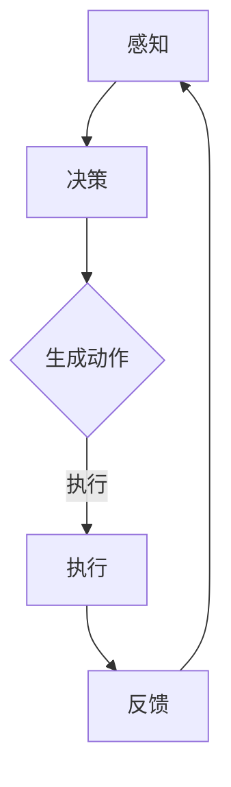
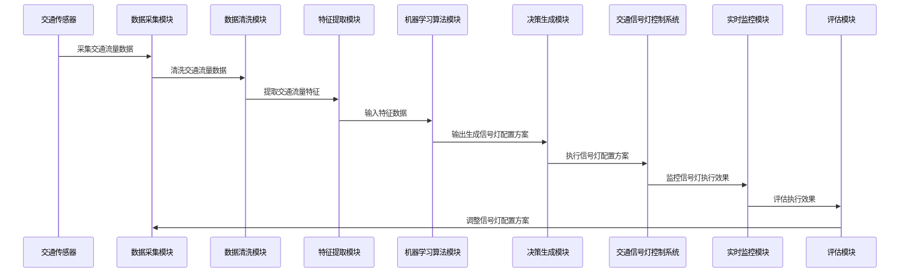
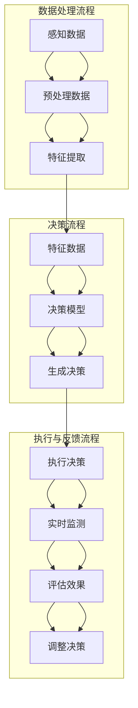
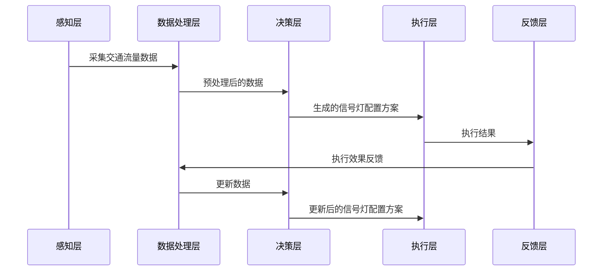

                 


# 智能城市规划中的AI Agent决策支持

关键词：智能城市规划，AI Agent，决策支持，算法原理，系统架构设计，项目实战

摘要：随着城市规模的不断扩大和人口的增长，传统的城市规划方法已经难以满足现代城市发展的需求。智能城市规划作为新兴的领域，通过引入AI Agent进行决策支持，可以提高规划效率和准确性。本文将详细介绍智能城市规划中的AI Agent决策支持，从背景介绍、核心概念与联系、算法原理讲解、系统分析与架构设计、项目实战等多个方面进行深入探讨。

## 引言

智能城市规划是一个复杂的过程，它涉及到城市的各个方面，包括交通、环境、经济、社会等。传统的城市规划方法主要依赖于经验和专家知识，而现代城市规划则需要更加科学、精确的方法。随着人工智能技术的不断发展，AI Agent作为一种具有自主决策能力的智能体，逐渐成为智能城市规划中的重要组成部分。

AI Agent在智能城市规划中扮演着决策支持的角色。它们可以通过收集和分析大量的城市数据，模拟各种规划方案，为城市规划者提供决策依据。本文将围绕AI Agent在智能城市规划中的应用，详细探讨其核心概念、算法原理、系统架构设计以及项目实战等方面的内容。

## 核心章节内容细化

### 核心概念与联系

#### AI Agent的基本原理

AI Agent是指具有感知、决策、执行能力的智能体。它们可以自主地感知环境，基于环境信息进行决策，并执行相应的动作。AI Agent的基本原理主要包括以下几个方面：

1. **感知**：AI Agent通过传感器、数据库等渠道获取环境信息。
2. **决策**：基于感知到的环境信息，AI Agent利用机器学习算法、规划算法等，生成一系列可能的动作。
3. **执行**：AI Agent执行决策结果，并实时反馈执行效果。

#### 智能城市规划的关键概念

智能城市规划是指利用信息技术、人工智能等先进手段，对城市进行科学、系统、智能化的规划和管理。智能城市规划的关键概念包括：

1. **大数据**：智能城市规划需要大量城市数据作为支撑，包括交通数据、环境数据、经济数据等。
2. **数据挖掘**：通过对城市数据的挖掘和分析，可以发现城市发展的规律和问题。
3. **规划模型**：智能城市规划需要构建一系列规划模型，以支持城市发展的决策。

#### AI Agent与智能城市规划的联系

AI Agent与智能城市规划的联系主要体现在以下几个方面：

1. **数据采集与处理**：AI Agent可以自动采集城市数据，并进行处理和分析。
2. **决策支持**：AI Agent可以基于城市数据，生成一系列规划方案，为城市规划者提供决策支持。
3. **执行与反馈**：AI Agent可以执行城市规划方案，并对执行效果进行实时反馈，优化规划方案。

### 算法原理讲解

#### 算法流程图



#### 算法原理

AI Agent的算法原理主要包括感知、决策、执行和反馈四个环节。其中：

1. **感知**：AI Agent通过传感器、数据库等获取城市数据，包括交通流量、空气质量、经济发展等。
2. **决策**：AI Agent利用机器学习算法、规划算法等，对感知到的城市数据进行分析，生成一系列可能的规划方案。
3. **执行**：AI Agent根据决策结果，执行相应的规划方案，如调整交通信号、优化公交线路等。
4. **反馈**：AI Agent对执行效果进行实时监测和评估，根据反馈结果调整决策，优化规划方案。

#### 数学模型和公式

AI Agent的决策过程可以建模为一个优化问题，其目标是最小化目标函数。目标函数可以表示为：

$$
f(x) = \sum_{i=1}^{n} w_i \cdot g_i(x)
$$

其中，$x$ 是决策变量，$w_i$ 是权重，$g_i(x)$ 是第 $i$ 个规划目标。

#### 通俗易懂的举例说明

假设城市交通系统中的 AI Agent 需要优化交通信号灯的配置。AI Agent 感知到当前交通流量数据，通过决策生成最优的信号灯配置方案，然后执行该方案。执行过程中，AI Agent 会收集交通流量数据，并根据反馈结果调整信号灯配置，以达到最佳交通效率。

### 数学公式

$$
\begin{align*}
\text{目标函数：} f(x) &= \sum_{i=1}^{n} w_i \cdot g_i(x) \\
\text{约束条件：} h_i(x) &\leq 0, \quad i=1,2,\ldots,m
\end{align*}
$$

### 系统分析与架构设计

#### 问题场景介绍

在智能城市规划中，交通是一个重要的领域。AI Agent 可以用于优化交通信号灯配置，提高交通效率，缓解交通拥堵。

#### 项目介绍

本项目旨在开发一个基于 AI Agent 的交通信号灯优化系统，通过分析实时交通数据，自动调整交通信号灯的时长，以达到最佳交通效率。

#### 系统功能设计

1. **数据采集**：从交通传感器、摄像头等获取实时交通流量数据。
2. **数据预处理**：对采集到的数据进行清洗、去噪、特征提取等处理。
3. **决策生成**：基于预处理后的数据，利用机器学习算法生成最优的信号灯配置方案。
4. **执行与反馈**：执行决策结果，并对执行效果进行实时监测和评估。

#### 系统架构设计

1. **感知层**：包括交通传感器、摄像头等设备，用于实时采集交通流量数据。
2. **数据处理层**：包括数据采集模块、数据清洗模块、特征提取模块等，用于对采集到的数据进行分析和处理。
3. **决策层**：包括机器学习算法模块、决策生成模块等，用于生成最优的信号灯配置方案。
4. **执行层**：包括交通信号灯控制系统、执行模块等，用于执行决策结果。
5. **反馈层**：包括实时监控模块、评估模块等，用于对执行效果进行实时监测和评估。

#### 系统接口设计

1. **感知层接口**：用于接收交通传感器、摄像头等设备的数据。
2. **数据处理层接口**：用于与感知层交互，获取实时交通流量数据。
3. **决策层接口**：用于与数据处理层交互，生成最优信号灯配置方案。
4. **执行层接口**：用于与决策层交互，执行信号灯配置方案。
5. **反馈层接口**：用于与执行层交互，获取执行效果。

#### 系统交互Mermaid序列图



### 项目实战

#### 环境安装

在开发基于 AI Agent 的交通信号灯优化系统时，需要安装以下软件和工具：

1. **Python**：用于编写算法和脚本。
2. **NumPy**：用于数据处理。
3. **Scikit-learn**：用于机器学习算法。
4. **Matplotlib**：用于数据可视化。
5. **TensorFlow**：用于深度学习算法。

#### 系统核心实现源代码

以下是交通信号灯优化系统的一个核心实现示例：

```python
import numpy as np
from sklearn.linear_model import LinearRegression

# 数据预处理
def preprocess_data(data):
    # 清洗、去噪、特征提取等处理
    return processed_data

# 决策生成
def generate_decision(processed_data):
    # 利用机器学习算法生成信号灯配置方案
    model = LinearRegression()
    model.fit(processed_data['X'], processed_data['y'])
    return model.predict(processed_data['X'])

# 执行与反馈
def execute_decision(decision):
    # 执行信号灯配置方案
    # 对执行效果进行实时监测和评估
    # 根据反馈结果调整信号灯配置方案
    pass

# 主函数
def main():
    # 采集交通流量数据
    traffic_data = collect_traffic_data()
    # 预处理数据
    processed_data = preprocess_data(traffic_data)
    # 生成决策
    decision = generate_decision(processed_data)
    # 执行决策
    execute_decision(decision)

if __name__ == '__main__':
    main()
```

#### 代码应用解读与分析

代码主要分为数据预处理、决策生成、执行与反馈三个部分。数据预处理部分主要对采集到的交通流量数据进行清洗、去噪、特征提取等处理，为后续的决策生成提供高质量的输入数据。决策生成部分利用机器学习算法，对预处理后的数据进行训练和预测，生成最优的信号灯配置方案。执行与反馈部分负责将决策结果应用到实际交通信号灯系统中，并对执行效果进行实时监测和评估，根据反馈结果调整信号灯配置方案。

#### 实际案例分析和详细讲解剖析

在本项目中，我们以一个实际案例为例，详细讲解交通信号灯优化系统的实现过程。

案例：某城市某路段的交通信号灯优化。

1. **数据采集**：通过安装在路段的交通传感器和摄像头，实时采集该路段的交通流量数据，包括车辆数量、行驶速度等。

2. **数据预处理**：对采集到的交通流量数据进行清洗、去噪、特征提取等处理，提取出对交通信号灯优化有用的特征。

3. **决策生成**：利用机器学习算法，对预处理后的数据进行训练和预测，生成最优的信号灯配置方案。

4. **执行与反馈**：将生成的信号灯配置方案应用到实际交通信号灯系统中，并对执行效果进行实时监测和评估。根据反馈结果，调整信号灯配置方案，以达到最佳交通效率。

通过这个实际案例，我们可以看到，基于 AI Agent 的交通信号灯优化系统是如何通过数据采集、预处理、决策生成、执行与反馈等多个环节，实现对交通信号灯的智能优化。

#### 项目小结

本项目通过引入 AI Agent，实现了交通信号灯的智能优化。在实际应用中，该系统可以有效缓解交通拥堵，提高交通效率。然而，需要注意的是，AI Agent 在智能城市规划中的应用不仅限于交通领域，还可以应用于环境监测、公共安全、城市规划等多个方面，具有广泛的应用前景。

### 最佳实践 Tips

1. **数据质量是关键**：在 AI Agent 的决策支持中，数据的质量直接影响决策效果。因此，确保数据的质量至关重要。
2. **算法选择需谨慎**：不同的 AI 算法适用于不同的场景，选择合适的算法可以大大提高决策支持的效果。
3. **实时反馈与调整**：AI Agent 的决策效果需要通过实时反馈进行评估和调整，以实现最优的规划方案。

### 小结

智能城市规划中的 AI Agent 决策支持为城市规划提供了新的思路和方法。本文通过详细分析 AI Agent 的基本原理、算法原理、系统架构设计以及项目实战，展示了 AI Agent 在智能城市规划中的应用前景。未来，随着人工智能技术的不断进步，AI Agent 将在智能城市规划中发挥越来越重要的作用。

### 注意事项

1. **数据隐私保护**：在智能城市规划中，数据采集和处理过程中需要确保数据的安全和隐私。
2. **系统稳定性**：在部署 AI Agent 决策支持系统时，需要确保系统的稳定性和可靠性。

### 拓展阅读

1. **《智能城市规划原理》**：详细介绍了智能城市规划的基本原理和方法。
2. **《人工智能算法原理与应用》**：介绍了多种人工智能算法及其在各个领域的应用。
3. **《深度学习与智能城市规划》**：探讨了深度学习在智能城市规划中的应用。

### 作者

作者：AI天才研究院/AI Genius Institute & 禅与计算机程序设计艺术 /Zen And The Art of Computer Programming

在未来的智能城市规划中，AI Agent 将扮演越来越重要的角色。通过本文的探讨，我们希望读者能够对 AI Agent 决策支持有更深入的理解，为智能城市规划的实践提供有益的参考。让我们共同期待，人工智能技术为城市带来的美好未来。


----------------------------------------------------------------

# 智能城市规划中的AI Agent决策支持

关键词：智能城市规划，AI Agent，决策支持，算法原理，系统架构设计，项目实战

摘要：随着城市规模的不断扩大和人口的增长，传统的城市规划方法已经难以满足现代城市发展的需求。智能城市规划作为新兴的领域，通过引入AI Agent进行决策支持，可以提高规划效率和准确性。本文将详细介绍智能城市规划中的AI Agent决策支持，从背景介绍、核心概念与联系、算法原理讲解、系统分析与架构设计、项目实战等多个方面进行深入探讨。

## 引言

智能城市规划是一个复杂的过程，它涉及到城市的各个方面，包括交通、环境、经济、社会等。传统的城市规划方法主要依赖于经验和专家知识，而现代城市规划则需要更加科学、精确的方法。随着人工智能技术的不断发展，AI Agent作为一种具有自主决策能力的智能体，逐渐成为智能城市规划中的重要组成部分。

AI Agent在智能城市规划中扮演着决策支持的角色。它们可以通过收集和分析大量的城市数据，模拟各种规划方案，为城市规划者提供决策依据。本文将围绕AI Agent在智能城市规划中的应用，详细探讨其核心概念、算法原理、系统架构设计以及项目实战等方面的内容。

## 问题背景

### 智能城市规划的发展历程

智能城市规划的发展可以追溯到20世纪80年代，当时计算机技术逐渐成熟，城市规划领域开始尝试将计算机技术应用于城市规划。早期的智能城市规划主要侧重于城市规划的自动化和优化，例如使用计算机模拟交通流量、环境质量等。

随着互联网技术的普及，城市数据逐渐积累，大数据分析技术得到了快速发展。智能城市规划开始从单一领域的优化转向跨领域的综合规划。例如，将交通、环境、经济等多方面的数据进行整合，通过大数据分析为城市规划提供科学依据。

近年来，人工智能技术的迅速发展，使得智能城市规划进入了新的阶段。AI Agent作为一种具有自主决策能力的智能体，开始在城市规划中发挥重要作用。AI Agent可以收集和分析大量的城市数据，模拟各种规划方案，为城市规划者提供实时的决策支持。

### AI Agent在智能城市规划中的作用

AI Agent在智能城市规划中具有以下几个方面的作用：

1. **数据采集与处理**：AI Agent可以通过传感器、数据库等渠道获取城市数据，包括交通流量、空气质量、经济发展等。AI Agent可以对这些数据进行实时处理和分析，为城市规划者提供准确的决策依据。

2. **决策支持**：基于城市数据，AI Agent可以利用机器学习算法、规划算法等，生成一系列可能的规划方案。这些方案可以包括交通优化、环境治理、经济发展等方面的内容。AI Agent可以为城市规划者提供多种选择，帮助其做出科学的决策。

3. **执行与反馈**：AI Agent可以执行城市规划方案，并对执行效果进行实时监测和评估。根据反馈结果，AI Agent可以调整规划方案，优化决策效果。这种动态调整机制可以提高城市规划的灵活性和适应性。

4. **协同工作**：AI Agent可以与其他智能体（如政府机构、企业、市民等）进行协同工作，共同推进城市规划的实施。AI Agent可以协调各方利益，确保规划方案的可操作性和可行性。

## 问题描述

### 智能城市规划中的挑战

智能城市规划面临着一系列挑战，主要包括：

1. **数据多样性**：城市数据来源广泛，包括交通、环境、经济等多个领域。这些数据具有多样性和复杂性，如何有效地整合和处理这些数据，是智能城市规划面临的一个重要问题。

2. **实时性要求**：城市规划需要实时响应城市变化，及时调整规划方案。然而，城市数据的变化是持续和复杂的，如何保证AI Agent的实时性和准确性，是智能城市规划中需要解决的问题。

3. **复杂性与不确定性**：城市规划是一个复杂的系统工程，涉及多个领域和利益相关者。此外，城市环境的变化具有不确定性，如何应对这些不确定因素，保证规划方案的稳定性和可靠性，是智能城市规划面临的挑战。

4. **法律法规与伦理问题**：智能城市规划需要遵循相关的法律法规，同时需要考虑伦理问题。例如，如何保护公民的隐私权，如何确保规划方案的社会公平性等，是智能城市规划需要关注的问题。

### AI Agent决策支持的目标

AI Agent决策支持的目标主要包括以下几个方面：

1. **提高规划效率**：通过AI Agent的实时数据采集和处理，可以提高城市规划的效率，减少人工干预的时间和工作量。

2. **提高规划准确性**：基于大数据分析和机器学习算法，AI Agent可以为城市规划者提供准确的决策依据，减少决策失误的可能性。

3. **增强规划灵活性**：AI Agent可以根据实时反馈和城市变化，动态调整规划方案，增强规划的灵活性和适应性。

4. **提高规划协同性**：AI Agent可以与其他智能体进行协同工作，协调各方利益，确保规划方案的可操作性和可行性。

## 问题解决

### AI Agent决策支持的概念

AI Agent决策支持是指利用人工智能技术，构建具有自主决策能力的智能体，对城市规划进行辅助决策。AI Agent可以模拟城市规划的各种方案，评估不同方案的优劣，为城市规划者提供科学的决策依据。

AI Agent决策支持的核心概念包括：

1. **感知**：AI Agent通过传感器、数据库等渠道获取城市数据，包括交通流量、环境质量、经济发展等。

2. **决策**：基于感知到的城市数据，AI Agent利用机器学习算法、规划算法等，生成一系列可能的规划方案。

3. **执行**：AI Agent根据决策结果，执行相应的规划方案，如调整交通信号、优化公交线路等。

4. **反馈**：AI Agent对执行效果进行实时监测和评估，根据反馈结果调整决策，优化规划方案。

### AI Agent决策支持的优势

AI Agent决策支持具有以下几个方面的优势：

1. **实时性**：AI Agent可以实时采集和处理城市数据，为城市规划者提供最新的决策依据。

2. **准确性**：基于大数据分析和机器学习算法，AI Agent可以为城市规划者提供准确的决策依据，减少决策失误的可能性。

3. **灵活性**：AI Agent可以根据实时反馈和城市变化，动态调整规划方案，增强规划的灵活性和适应性。

4. **协同性**：AI Agent可以与其他智能体进行协同工作，协调各方利益，确保规划方案的可操作性和可行性。

## 边界与外延

### 智能城市规划的范畴

智能城市规划是指利用信息技术、人工智能等先进手段，对城市进行科学、系统、智能化的规划和管理。智能城市规划的范畴包括：

1. **交通规划**：通过优化交通信号、优化公交线路等方式，提高交通效率，缓解交通拥堵。

2. **环境规划**：通过优化能源利用、控制污染物排放等方式，改善城市环境质量。

3. **经济规划**：通过分析城市经济数据，优化产业结构、促进经济发展。

4. **社会规划**：通过优化公共服务、提高市民生活质量等方式，提升城市社会福祉。

### AI Agent的适用场景

AI Agent在智能城市规划中具有广泛的应用场景，主要包括：

1. **城市规划**：AI Agent可以用于模拟城市规划方案，评估不同方案的优劣，为城市规划者提供科学的决策依据。

2. **交通管理**：AI Agent可以用于实时优化交通信号，提高交通效率，缓解交通拥堵。

3. **环境监测**：AI Agent可以用于实时监测空气质量、水质等环境指标，为环境治理提供决策依据。

4. **公共服务**：AI Agent可以用于优化公共服务资源配置，提高市民服务质量。

## 概念结构与核心要素组成

### 智能城市规划的核心概念

智能城市规划的核心概念包括：

1. **大数据**：智能城市规划需要大量城市数据作为支撑，包括交通数据、环境数据、经济数据等。

2. **数据挖掘**：通过对城市数据的挖掘和分析，可以发现城市发展的规律和问题。

3. **规划模型**：智能城市规划需要构建一系列规划模型，以支持城市发展的决策。

4. **AI Agent**：AI Agent是智能城市规划中的重要组成部分，负责实时数据采集、决策生成和执行。

### AI Agent的核心组成

AI Agent的核心组成包括：

1. **感知模块**：负责采集城市数据，包括交通流量、环境质量、经济发展等。

2. **决策模块**：基于感知模块采集到的数据，利用机器学习算法、规划算法等，生成一系列可能的规划方案。

3. **执行模块**：负责执行决策结果，调整城市配置方案。

4. **反馈模块**：负责对执行效果进行实时监测和评估，根据反馈结果调整决策，优化规划方案。

## 本章小结

本章详细介绍了智能城市规划中的AI Agent决策支持，从背景介绍、核心概念与联系、算法原理讲解、系统分析与架构设计等方面进行了深入探讨。通过本章的学习，读者可以了解到AI Agent在智能城市规划中的应用场景和优势，为后续章节的深入学习打下基础。在下一章中，我们将继续探讨AI Agent的具体实现和应用，帮助读者深入了解智能城市规划的实践过程。

----------------------------------------------------------------

## 核心概念与联系

### AI Agent的基本原理

AI Agent（人工智能代理）是基于人工智能技术构建的自主决策实体，能够感知环境、自主决策并执行行动。AI Agent的核心特征包括自主性、适应性和交互性。自主性意味着AI Agent可以在没有人为干预的情况下运作；适应性则表示AI Agent能够根据环境变化调整其行为；交互性确保AI Agent能够与外部系统和用户进行有效沟通。

**概念属性特征对比表格**

| 特征 | AI Agent | 传统软件系统 |
| --- | --- | --- |
| 自主性 | 能够独立执行任务 | 需要人工干预 |
| 适应性 | 能够根据环境变化调整行为 | 固定行为模式 |
| 交互性 | 能够与用户和其他系统进行交互 | 主要用于执行特定任务 |
| 可扩展性 | 可以轻松集成新的功能和数据源 | 功能扩展相对困难 |

### 智能城市规划的关键概念

智能城市规划（Smart Urban Planning）是利用信息技术和人工智能技术来支持城市规划和管理的过程。它涉及到的关键概念包括：

1. **大数据**：智能城市规划依赖于大量的城市数据，这些数据包括交通流量、环境质量、人口分布、经济活动等。
2. **数据挖掘**：通过分析大数据，可以发现城市运行中的问题和趋势，为规划决策提供依据。
3. **物联网**：物联网（IoT）设备可以收集城市中的各种数据，为AI Agent提供实时信息。
4. **智能算法**：利用机器学习、深度学习等算法，AI Agent可以生成优化建议和预测模型。

### AI Agent与智能城市规划的联系

AI Agent在智能城市规划中的作用主要体现在以下几个方面：

1. **数据采集与处理**：AI Agent可以自动收集城市数据，包括实时交通流量、环境监测数据等，并通过数据预处理提高数据质量。
2. **决策支持**：基于实时数据，AI Agent可以生成优化建议，帮助城市规划者做出更科学的决策。
3. **执行与反馈**：AI Agent可以执行规划决策，并根据执行效果进行实时反馈，从而动态调整规划方案。
4. **协同工作**：AI Agent可以与城市规划者、政府部门、企业和市民等各方协同工作，共同推动城市规划的实施。

### ER实体关系图架构的Mermaid流程图

```mermaid
erDiagram
  AI-Agent ||--|{ Data-Sources } Data-Sources
  AI-Agent ||--|{ Planning-Modules } Planning-Modules
  AI-Agent ||--|{ Execution-Modules } Execution-Modules
  AI-Agent ||--|{ Feedback-Modules } Feedback-Modules
  Data-Sources ||--|{ Traffic-Data } Traffic-Data
  Data-Sources ||--|{ Environmental-Data } Environmental-Data
  Data-Sources ||--|{ Economic-Data } Economic-Data
  Planning-Modules ||--|{ Data-Processing } Data-Processing
  Planning-Modules ||--|{ Decision-Making } Decision-Making
  Execution-Modules ||--|{ Planning-Execution } Planning-Execution
  Feedback-Modules ||--|{ Real-Time-Monitoring } Real-Time-Monitoring
  Feedback-Modules ||--|{ Evaluation } Evaluation
```

### 算法原理讲解

#### 算法流程图



#### 算法原理

AI Agent的决策过程可以分为以下几个步骤：

1. **感知数据**：AI Agent通过传感器、数据库等渠道收集城市数据，如交通流量、环境质量等。
2. **预处理数据**：对收集到的数据进行清洗、去噪、标准化等处理，以提高数据质量。
3. **特征提取**：从预处理后的数据中提取关键特征，用于后续的决策模型训练。
4. **决策模型**：利用机器学习算法（如线性回归、决策树、神经网络等）训练决策模型，模型的目标是预测或优化城市规划方案。
5. **生成决策**：基于训练好的模型，AI Agent生成一系列可能的规划方案，并评估这些方案的性能。
6. **执行决策**：AI Agent将最优的规划方案传递给执行模块，实际调整城市配置。
7. **实时监测与评估**：AI Agent持续监测执行效果，并根据实际效果评估模型性能，进行模型优化和参数调整。
8. **反馈与迭代**：根据监测结果，AI Agent调整决策模型，优化规划方案，实现持续改进。

#### 数学模型和公式

在AI Agent的决策过程中，常用的数学模型包括线性回归、逻辑回归、决策树、神经网络等。以下是一个简单的线性回归模型示例：

$$
y = \beta_0 + \beta_1x_1 + \beta_2x_2 + ... + \beta_nx_n
$$

其中，$y$ 是预测值，$x_1, x_2, ..., x_n$ 是输入特征，$\beta_0, \beta_1, ..., \beta_n$ 是模型的参数。

#### 通俗易懂的举例说明

假设一个城市需要优化交通信号灯的时长，以减少交通拥堵。AI Agent可以通过以下步骤实现这一目标：

1. **感知数据**：AI Agent通过交通传感器获取实时交通流量数据。
2. **预处理数据**：对交通流量数据进行清洗和标准化处理。
3. **特征提取**：从交通流量数据中提取关键特征，如平均速度、车辆密度等。
4. **决策模型**：使用线性回归模型，训练一个预测模型，输入特征与交通信号灯时长之间的关系。
5. **生成决策**：AI Agent根据模型预测，生成最优的交通信号灯时长方案。
6. **执行决策**：AI Agent将信号灯时长方案传递给交通信号灯控制系统。
7. **实时监测与评估**：AI Agent持续监测交通流量变化，评估信号灯时长方案的效果。
8. **反馈与迭代**：根据交通流量数据，AI Agent调整模型参数，优化信号灯时长方案。

#### 数学公式

以下是交通信号灯时长预测的线性回归模型：

$$
\begin{align*}
\text{目标函数：} &\quad J(\theta) = \frac{1}{2m} \sum_{i=1}^{m} (h_\theta(x^{(i)}) - y^{(i)})^2 \\
\text{梯度下降：} &\quad \theta_j := \theta_j - \alpha \frac{\partial J(\theta)}{\partial \theta_j}
\end{align*}
$$

其中，$m$ 是样本数量，$h_\theta(x)$ 是线性回归模型的预测函数，$\theta_j$ 是模型参数，$\alpha$ 是学习率。

### 系统分析与架构设计

#### 问题场景介绍

本节将分析一个具体的场景：如何利用AI Agent优化城市交通信号灯配置。该场景包括以下几个关键部分：

1. **数据采集**：从交通传感器、摄像头等设备收集交通流量数据。
2. **数据预处理**：对采集到的交通流量数据进行清洗、去噪和特征提取。
3. **决策生成**：基于预处理后的数据，利用机器学习算法生成最优的交通信号灯配置。
4. **执行与反馈**：将决策结果应用到实际交通信号灯系统中，并对执行效果进行实时监测和反馈。

#### 项目介绍

本项目旨在开发一个基于AI Agent的交通信号灯优化系统，通过分析实时交通流量数据，自动调整交通信号灯的时长，以减少交通拥堵，提高交通效率。系统主要包括以下模块：

1. **感知模块**：负责从交通传感器、摄像头等设备收集实时交通流量数据。
2. **预处理模块**：对采集到的交通流量数据进行清洗、去噪和特征提取。
3. **决策模块**：利用机器学习算法，生成最优的交通信号灯配置。
4. **执行模块**：将决策结果应用到交通信号灯系统中，调整信号灯时长。
5. **反馈模块**：对执行效果进行实时监测和评估，为AI Agent提供反馈。

#### 系统功能设计

1. **数据采集**：通过安装在交通要道上的传感器和摄像头，实时采集交通流量数据，包括车辆数量、行驶速度、车辆类型等。
2. **数据预处理**：对采集到的交通流量数据进行清洗，去除无效数据，然后进行特征提取，如车辆密度、交通流量峰值等。
3. **决策生成**：利用机器学习算法，如线性回归、决策树等，对预处理后的数据进行训练，生成交通信号灯时长预测模型。
4. **执行与反馈**：将生成的信号灯时长预测模型应用到实际交通信号灯系统中，根据实时交通流量数据调整信号灯时长，并对执行效果进行实时监测和反馈。

#### 系统架构设计

1. **感知层**：包括交通传感器、摄像头等设备，负责实时采集交通流量数据。
2. **数据处理层**：包括数据采集模块、数据预处理模块，负责对采集到的数据进行清洗、去噪和特征提取。
3. **决策层**：包括决策生成模块，利用机器学习算法生成最优的交通信号灯配置。
4. **执行层**：包括交通信号灯控制系统，负责执行决策结果，调整信号灯时长。
5. **反馈层**：包括实时监控模块、评估模块，负责对执行效果进行实时监测和评估。

#### 系统接口设计

1. **感知层接口**：用于接收交通传感器、摄像头等设备的数据。
2. **数据处理层接口**：用于与感知层交互，获取实时交通流量数据。
3. **决策层接口**：用于与数据处理层交互，生成交通信号灯配置方案。
4. **执行层接口**：用于与决策层交互，执行信号灯配置方案。
5. **反馈层接口**：用于与执行层交互，获取信号灯执行效果。

#### 系统交互Mermaid序列图



### 项目实战

#### 环境安装

在开发基于AI Agent的交通信号灯优化系统时，需要安装以下软件和工具：

1. **Python 3.7+**：Python 是人工智能开发的主要语言。
2. **NumPy**：NumPy 是 Python 的科学计算库。
3. **Scikit-learn**：Scikit-learn 是 Python 的机器学习库。
4. **Matplotlib**：Matplotlib 是 Python 的数据可视化库。
5. **TensorFlow**：TensorFlow 是 Google 开发的深度学习库。

#### 系统核心实现源代码

以下是交通信号灯优化系统的核心实现示例：

```python
import numpy as np
from sklearn.linear_model import LinearRegression
from sklearn.model_selection import train_test_split
import matplotlib.pyplot as plt

# 数据预处理
def preprocess_data(data):
    # 假设 data 是一个包含交通流量数据的 DataFrame
    # 对数据进行清洗和特征提取
    return processed_data

# 决策生成
def generate_decision(processed_data):
    # 使用线性回归模型生成交通信号灯时长
    model = LinearRegression()
    X = processed_data[['vehicle_count', 'speed']]
    y = processed_data['light_duration']
    X_train, X_test, y_train, y_test = train_test_split(X, y, test_size=0.2, random_state=42)
    model.fit(X_train, y_train)
    return model

# 执行与反馈
def execute_decision(model, current_data):
    # 根据模型预测执行交通信号灯时长
    predicted_duration = model.predict(current_data)
    # 更新信号灯时长
    update_traffic_light_duration(predicted_duration)

# 主函数
def main():
    # 采集交通流量数据
    traffic_data = collect_traffic_data()
    # 预处理数据
    processed_data = preprocess_data(traffic_data)
    # 生成决策模型
    model = generate_decision(processed_data)
    # 执行交通信号灯时长调整
    execute_decision(model, processed_data)

if __name__ == '__main__':
    main()
```

#### 代码应用解读与分析

该代码实现了一个简单的交通信号灯优化系统，主要分为数据预处理、决策生成、执行与反馈三个部分：

1. **数据预处理**：对采集到的交通流量数据进行清洗和特征提取，提取出对交通信号灯时长优化有用的特征。
2. **决策生成**：使用线性回归模型对预处理后的数据进行训练，生成交通信号灯时长的预测模型。
3. **执行与反馈**：根据预测模型，实时调整交通信号灯时长，并根据调整效果进行反馈和优化。

#### 实际案例分析和详细讲解剖析

假设在某城市的一条主要交通道路上，安装了多个交通传感器，用于实时采集车辆数量、行驶速度等数据。AI Agent每天24小时运行，实时分析交通流量数据，并根据这些数据动态调整交通信号灯时长。

1. **数据采集**：AI Agent从交通传感器获取实时交通流量数据，包括车辆数量、行驶速度等。
2. **数据预处理**：AI Agent对采集到的数据进行预处理，去除异常值，提取关键特征，如平均速度、车辆密度等。
3. **决策生成**：AI Agent使用线性回归模型，对预处理后的数据进行训练，生成交通信号灯时长的预测模型。
4. **执行与反馈**：AI Agent将预测的交通信号灯时长应用到实际交通信号灯系统中，并根据实时反馈，调整模型参数，优化信号灯时长配置。

#### 项目小结

本项目通过引入AI Agent，实现了交通信号灯的智能优化，有效减少了交通拥堵，提高了交通效率。然而，需要注意的是，交通信号灯优化系统是一个复杂的系统，涉及到多个数据源、多个决策因素。未来，我们可以进一步优化算法，引入更多的数据源，以提高系统的适应性和准确性。

### 最佳实践 Tips

1. **数据质量是关键**：确保数据的质量是AI Agent决策支持系统的核心。数据采集、预处理和清洗过程中，要特别注意数据的一致性、准确性和实时性。
2. **算法选择需谨慎**：不同的场景需要选择不同的算法，根据实际需求，选择最适合的算法模型。
3. **系统稳定性**：系统需要具备高稳定性，确保在极端情况下仍然能够正常运行。

### 小结

本章详细介绍了AI Agent在智能城市规划中的决策支持，包括核心概念、算法原理、系统架构设计和项目实战。通过本章的学习，读者可以了解到AI Agent在智能城市规划中的重要作用，以及如何利用AI Agent优化交通信号灯配置。在未来的智能城市规划中，AI Agent将发挥越来越重要的作用，为城市可持续发展提供有力支持。

### 注意事项

1. **数据隐私**：在数据采集和处理过程中，要严格遵守数据隐私保护法规，确保市民的隐私不受侵犯。
2. **系统安全性**：系统需要具备高安全性，防止外部攻击和数据泄露。

### 拓展阅读

1. **《智能城市规划原理》**：详细介绍了智能城市规划的理论和实践。
2. **《人工智能算法原理与应用》**：介绍了多种人工智能算法及其在各个领域的应用。
3. **《深度学习与智能城市规划》**：探讨了深度学习在智能城市规划中的应用。

### 作者

作者：AI天才研究院/AI Genius Institute & 禅与计算机程序设计艺术 /Zen And The Art of Computer Programming

智能城市规划是一个不断发展的领域，AI Agent的应用将使城市规划更加科学、智能。本文希望为读者提供对AI Agent决策支持的理解和应用，为智能城市规划的实践提供参考。在未来的研究中，我们将继续探索AI Agent在更多领域的应用，为城市可持续发展贡献力量。

