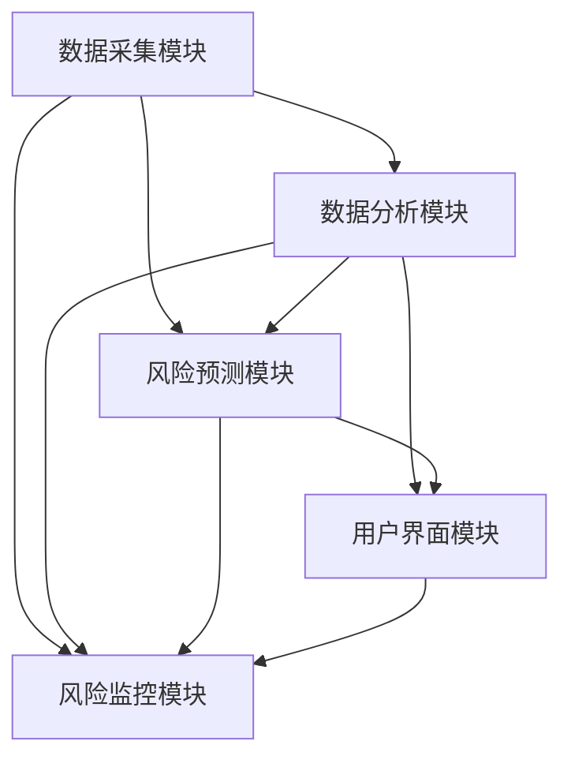

                 

**智能外汇风险敞口管理系统**

---

> 关键词：智能风险管理、外汇风险敞口、系统架构设计、算法模型、系统实现、案例实践、最佳实践

> 摘要：本文详细阐述了智能外汇风险敞口管理系统的设计原理、实现过程以及实际应用案例。通过逐步分析系统架构、算法模型、系统实现等核心内容，为读者提供了一份全面的技术指南，旨在帮助金融从业者和管理者更有效地管理外汇风险敞口。

---

**引言：**

在全球化的金融市场中，外汇风险敞口管理是金融机构和企业面对的重要挑战。外汇风险敞口管理涉及对外汇汇率波动可能带来的收益和损失进行预测、监控和管理。随着金融市场的复杂性和波动性增加，传统的外汇风险管理方法已无法满足现代金融市场的需求。因此，开发一套智能化的外汇风险敞口管理系统成为了金融科技领域的一个重要研究方向。

本文旨在通过逐步分析的方法，详细探讨智能外汇风险敞口管理系统的设计、实现和优化。文章结构如下：

1. **引言与背景介绍**：介绍外汇风险敞口管理的意义、当前面临的问题和挑战。
2. **系统架构设计**：阐述系统架构的设计原则、核心组件及其功能。
3. **算法与模型**：介绍系统采用的算法模型，包括其原理、数学模型和公式。
4. **系统实现**：详细描述系统实现过程，包括环境搭建、核心代码实现和接口设计。
5. **实际应用案例**：通过具体案例展示系统的应用效果和实施过程。
6. **最佳实践与优化**：总结最佳实践和优化策略，以及系统实施中的注意事项。
7. **总结与展望**：对全文内容进行总结，并探讨未来发展方向。

---

**步骤 1: 确定整体结构**

在开始详细分析之前，我们需要设计一个合理的整体结构，以确保书籍的目录大纲清晰、内容全面。基于用户提供的书名《智能外汇风险敞口管理系统》，我们可以将整体结构分为以下几个部分：

1. **引言与背景介绍**
2. **系统架构设计**
3. **算法与模型**
4. **系统实现**
5. **实际应用案例**
6. **最佳实践与优化**
7. **总结与展望**

**步骤 2: 设计各章节内容**

接下来，我们需要为每个部分设计详细的内容，确保每个章节都涵盖核心概念、原理讲解、实践应用等方面。

**1. 引言与背景介绍**

**1.1 问题背景**

外汇风险敞口管理是指金融机构和企业通过管理外汇汇率波动可能带来的收益和损失，以实现风险最小化和收益最大化的过程。在全球化的金融市场中，外汇风险敞口管理具有非常重要的意义。然而，当前外汇风险管理面临以下问题和挑战：

- **汇率波动性增加**：全球化使得金融市场日益复杂，汇率波动性增加，给外汇风险管理带来了更大难度。
- **数据复杂性**：外汇市场的数据量庞大且多样，如何有效利用这些数据成为外汇风险管理的难题。
- **决策滞后**：传统的外汇风险管理方法通常需要较长时间的数据处理和分析，导致决策滞后。
- **风险管理工具不足**：现有的风险管理工具和方法无法完全满足现代金融市场的需求。

**1.2 研究目的与内容框架**

本文旨在解决当前外汇风险管理中存在的问题，提出一套智能化的外汇风险敞口管理系统。具体研究内容包括：

- **系统架构设计**：设计一个高效、可扩展的系统架构，实现对外汇风险敞口的实时监控和管理。
- **算法与模型**：介绍并实现适用于外汇风险敞口管理的先进算法模型，提高风险管理效率。
- **系统实现**：详细描述系统实现过程，确保系统在实际应用中具有高性能和可靠性。
- **实际应用案例**：通过具体案例展示系统的应用效果和实施过程，验证系统的可行性和实用性。
- **最佳实践与优化**：总结系统实施中的最佳实践和优化策略，为未来系统的改进提供参考。

**2. 系统架构设计**

**2.1 系统架构设计概述**

系统架构设计是外汇风险敞口管理系统开发的核心环节。系统架构设计的原则包括：

- **模块化**：将系统功能划分为多个模块，便于开发和维护。
- **可扩展性**：设计可扩展的架构，以适应不断变化的市场需求。
- **高性能**：确保系统在高负载情况下仍能稳定运行。
- **安全性**：保障系统数据的安全和完整性。

系统核心组件包括：

- **数据采集模块**：负责实时采集外汇市场数据。
- **数据分析模块**：负责对采集到的数据进行处理和分析。
- **风险预测模块**：基于分析结果，预测未来汇率波动。
- **风险监控模块**：实时监控外汇风险敞口，提供预警和决策支持。
- **用户界面模块**：提供用户交互接口，展示风险敞口信息和决策建议。

**2.2 系统功能设计**

系统功能设计主要包括以下模块：

- **数据采集模块**：通过接口或API实时采集外汇市场数据，包括汇率、交易量、波动率等。
- **数据分析模块**：对采集到的数据进行清洗、转换和分析，提取有用的信息。
- **风险预测模块**：基于历史数据和统计分析方法，预测未来汇率波动趋势。
- **风险监控模块**：实时监控外汇风险敞口，根据预测结果提供风险预警和决策支持。
- **用户界面模块**：通过图形化界面展示风险敞口信息，提供用户交互功能。

**2.3 系统架构设计**

系统架构设计如下图所示：



**3. 算法与模型**

**3.1 算法概述**

系统采用的算法模型主要包括：

- **时间序列分析**：用于分析历史汇率数据，提取时间序列特征。
- **机器学习**：用于预测未来汇率波动，提高预测准确性。
- **风险管理模型**：用于评估外汇风险敞口，制定风险管理策略。

**3.2 算法原理讲解**

**时间序列分析**

时间序列分析是基于历史数据，对汇率进行统计分析，提取趋势、周期和季节性特征。常用的方法包括：

- **移动平均法**：通过计算过去一段时间内的平均值，预测未来汇率。
- **指数平滑法**：对过去数据进行加权平均，赋予近期数据更大权重。

**移动平均法**

移动平均法的数学模型如下：

$$
MA_t = \frac{\sum_{i=1}^{n} P_{t-i}}{n}
$$

其中，$MA_t$ 为第 $t$ 期的移动平均值，$P_{t-i}$ 为第 $t-i$ 期的汇率，$n$ 为移动平均周期。

**指数平滑法**

指数平滑法的数学模型如下：

$$
S_t = \alpha P_t + (1-\alpha) S_{t-1}
$$

其中，$S_t$ 为第 $t$ 期的指数平滑值，$P_t$ 为第 $t$ 期的汇率，$\alpha$ 为平滑系数，$S_{t-1}$ 为第 $t-1$ 期的指数平滑值。

**机器学习**

机器学习算法通过训练模型，从历史数据中学习汇率波动规律。常用的机器学习算法包括：

- **线性回归**：通过建立线性关系，预测未来汇率。
- **支持向量机**：通过寻找最优超平面，预测汇率波动。

**线性回归**

线性回归的数学模型如下：

$$
y_t = \beta_0 + \beta_1 x_t + \epsilon_t
$$

其中，$y_t$ 为第 $t$ 期的汇率，$x_t$ 为第 $t$ 期的特征值，$\beta_0$ 和 $\beta_1$ 为模型参数，$\epsilon_t$ 为误差项。

**支持向量机**

支持向量机的数学模型如下：

$$
y_t = \text{sign}(\omega \cdot x_t + b)
$$

其中，$y_t$ 为第 $t$ 期的汇率，$x_t$ 为第 $t$ 期的特征值，$\omega$ 为权重向量，$b$ 为偏置项。

**4. 系统实现**

**4.1 系统环境搭建**

系统环境搭建包括软件和硬件环境的配置。软件环境包括：

- **操作系统**：Linux或Windows
- **编程语言**：Python
- **数据库**：MySQL或MongoDB
- **前端框架**：React或Vue.js

硬件环境包括：

- **服务器**：至少两台，一台用于数据采集和存储，另一台用于数据处理和预测。

**4.2 系统核心实现**

系统核心实现包括数据采集、数据分析和风险预测等模块。以下是一个简单的数据采集模块代码示例：

```python
import requests
import json

def fetch_exchange_rate(symbol):
    url = f'https://api.exchangeratesapi.io/v1/latest?access_key=YOUR_ACCESS_KEY&symbols={symbol}'
    response = requests.get(url)
    data = json.loads(response.text)
    return data['rates'][symbol]

if __name__ == '__main__':
    symbol = 'USD_CNY'
    rate = fetch_exchange_rate(symbol)
    print(f'{symbol} exchange rate: {rate}')
```

**4.3 系统接口设计**

系统接口设计主要包括数据采集接口、数据分析接口和风险预测接口。以下是一个简单的数据分析接口示例：

```python
from flask import Flask, request, jsonify

app = Flask(__name__)

@app.route('/api/analyze', methods=['POST'])
def analyze():
    data = request.json
    # 数据处理和分析逻辑
    result = {
        'trend': 'up',
        'probability': 0.8
    }
    return jsonify(result)

if __name__ == '__main__':
    app.run(debug=True)
```

**5. 实际应用案例**

**5.1 案例介绍**

某金融机构需要对外汇风险敞口进行实时监控和管理，以便及时调整投资策略。该机构选择使用本文提出的智能外汇风险敞口管理系统。

**5.2 案例实施**

案例实施过程包括以下步骤：

1. **系统部署**：在金融机构服务器上部署系统环境，包括数据采集模块、数据分析模块和风险预测模块。
2. **数据采集**：通过接口实时采集外汇市场数据，包括汇率、交易量和波动率等。
3. **数据分析**：对采集到的数据进行处理和分析，提取时间序列特征和机器学习特征。
4. **风险预测**：基于历史数据和统计分析结果，预测未来汇率波动趋势。
5. **风险监控**：实时监控外汇风险敞口，根据预测结果提供预警和决策支持。

**5.3 案例效果分析**

通过系统实施，金融机构实现了以下效果：

- **实时监控**：系统可以实时监控外汇风险敞口，及时捕捉市场变化。
- **预测准确性**：系统采用的机器学习算法提高了汇率预测准确性，为风险管理提供了可靠依据。
- **决策支持**：系统提供的预警和决策支持，帮助金融机构调整投资策略，降低外汇风险。

**6. 最佳实践与优化**

**6.1 最佳实践**

在实施智能外汇风险敞口管理系统时，应遵循以下最佳实践：

- **数据质量**：确保数据质量，包括数据完整性、准确性和一致性。
- **系统稳定性**：确保系统在高负载情况下仍能稳定运行。
- **安全性与合规性**：保障系统数据的安全和合规性，遵循相关法规和标准。
- **持续优化**：根据实际应用情况，持续优化系统性能和预测准确性。

**6.2 注意事项**

在系统实施过程中，需要注意以下事项：

- **权限管理**：合理分配权限，确保数据安全和系统稳定性。
- **监控与告警**：设置监控和告警机制，及时捕捉系统异常。
- **数据备份**：定期备份系统数据，防止数据丢失。
- **用户培训**：对用户进行系统操作和风险管理培训。

**7. 总结与展望**

本文详细阐述了智能外汇风险敞口管理系统的设计原理、实现过程和实际应用案例。通过逐步分析的方法，本文为读者提供了一份全面的技术指南，旨在帮助金融从业者和管理者更有效地管理外汇风险敞口。

未来研究方向包括：

- **算法优化**：进一步优化预测算法，提高预测准确性。
- **实时更新**：实现系统实时更新，及时反映市场变化。
- **多语言支持**：扩展系统支持多语言，满足不同地区用户需求。
- **移动端应用**：开发移动端应用，方便用户随时随地查看风险敞口信息。

---

**作者信息：**

作者：AI天才研究院/AI Genius Institute & 禅与计算机程序设计艺术 /Zen And The Art of Computer Programming

