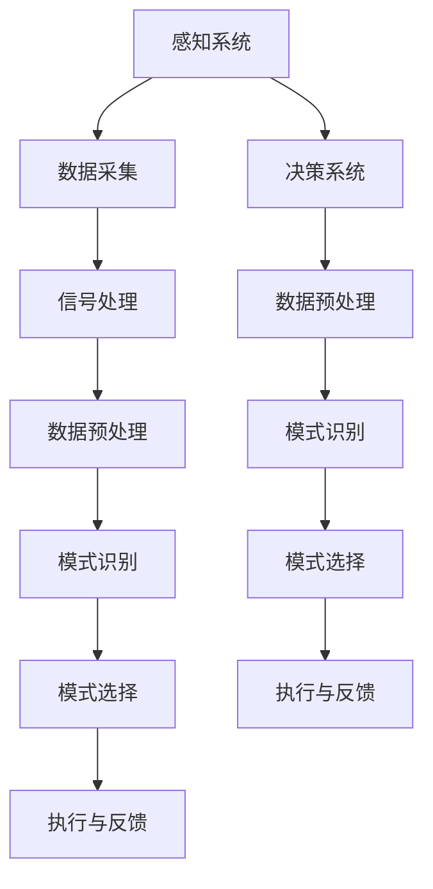
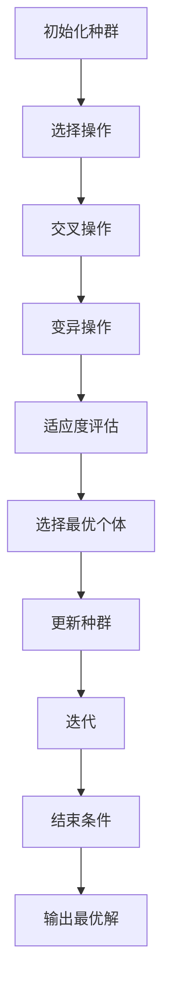
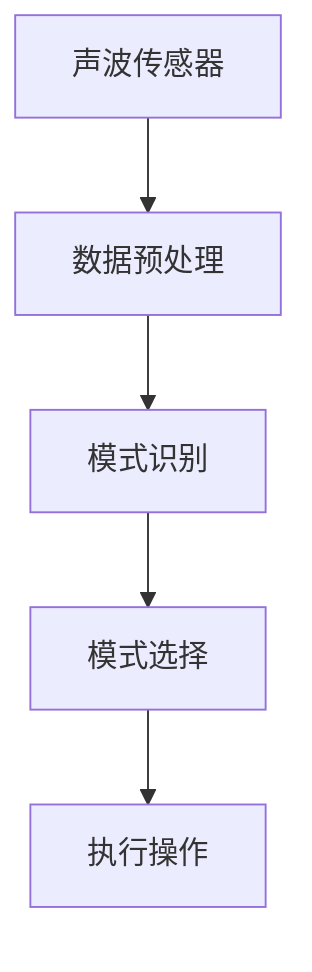
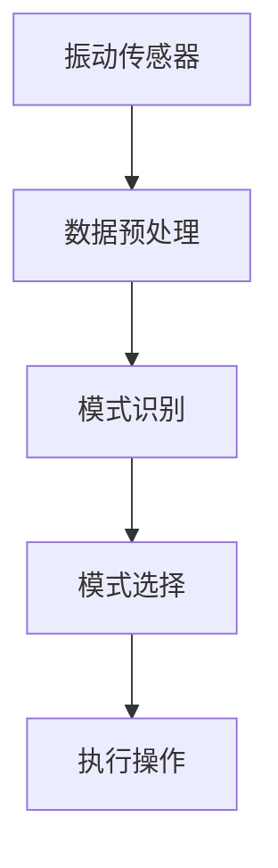
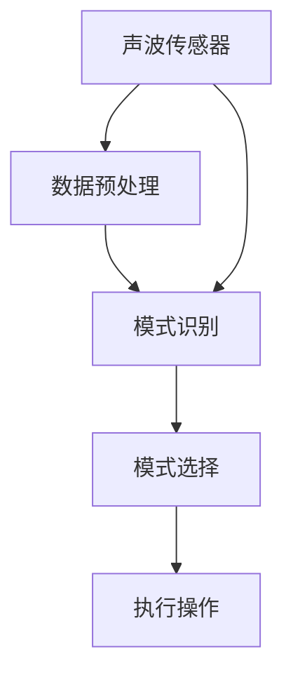

                 


# 智能婴儿摇篮：AI Agent的安抚模式优化

> 关键词：智能婴儿摇篮，AI代理，安抚模式优化，机器学习，数据采集，特征提取，算法实现

> 摘要：本文将深入探讨智能婴儿摇篮中AI代理的安抚模式优化问题，通过详细的理论分析和实践案例，阐述如何通过机器学习和数据挖掘技术，提高婴儿摇篮的安抚效果。

## 引言与背景介绍

### 1.1 问题的背景与描述

随着科技的进步，智能设备逐渐渗透到我们生活的方方面面。在婴幼儿护理领域，智能婴儿摇篮作为一种新兴的智能产品，已经引起了广泛的关注。智能婴儿摇篮通过集成多种传感器和执行器，可以实现自动调节摇篮的振动、声音和光线，以达到安抚婴儿的效果。

然而，如何根据婴儿的个体差异和实时状态，动态调整安抚模式，以提高安抚效果，是一个亟待解决的问题。这需要借助人工智能（AI）技术，特别是机器学习和数据挖掘技术，对婴儿的睡眠状态进行监测和预测，从而实现智能化的安抚模式优化。

### 1.2 问题描述与分析

问题描述可以分为以下几个关键点：

1. **婴儿状态监测**：如何准确获取婴儿的睡眠状态、情绪变化等信息。
2. **安抚模式选择**：根据婴儿的状态，选择合适的振动、声音和光线模式。
3. **模式优化**：如何通过历史数据和机器学习算法，不断优化安抚模式，提高安抚效果。

### 1.3 目标与边界

本文的目标是设计一种基于AI的智能婴儿摇篮安抚模式优化系统，主要实现以下功能：

1. **状态监测**：通过传感器实时监测婴儿的呼吸、心率等生理指标，以及运动状态等行为数据。
2. **模式选择**：根据婴儿的状态数据，选择合适的安抚模式。
3. **模式优化**：通过机器学习算法，对安抚模式进行优化，提高安抚效果。

本文的边界主要包括：

1. **技术范围**：主要涉及机器学习、数据挖掘、传感器技术等。
2. **应用范围**：本文主要关注婴儿摇篮的安抚模式优化，不涉及其他智能育儿设备的讨论。

## AI基础概念

### 2.1 AI的定义与历史发展

人工智能（AI）是指通过计算机程序实现的智能行为，使计算机能够模拟人类的思维过程。AI的发展可以分为三个阶段：

1. **符号人工智能**：基于逻辑推理和符号计算，代表技术为专家系统。
2. **感知人工智能**：基于机器学习和神经网络，代表技术为深度学习。
3. **认知人工智能**：结合符号人工智能和感知人工智能，实现更高层次的智能行为。

### 2.2 AI的关键概念与分类

AI的关键概念包括：

1. **机器学习**：使计算机能够从数据中学习并做出决策。
2. **深度学习**：基于多层神经网络，对大量数据进行自动特征提取。
3. **神经网络**：模拟生物神经系统的计算模型。
4. **强化学习**：通过试错和奖励机制，使模型学会决策。

AI的分类可以按照功能和应用领域分为：

1. **通用人工智能**：具备人类所有智能能力的AI。
2. **窄人工智能**：专注于特定领域的AI。

### 2.3 AI的核心原理

AI的核心原理包括：

1. **数据驱动**：通过大量数据进行学习，提取规律和模式。
2. **计算能力**：利用高性能计算资源，处理大量数据和复杂算法。
3. **自适应能力**：通过不断学习和调整，提高系统的适应性和鲁棒性。

## 智能婴儿摇篮的AI代理设计

### 3.1 智能婴儿摇篮的需求分析

智能婴儿摇篮的需求可以从用户需求、功能需求和技术需求三个方面进行分析。

#### 用户需求

1. **安全性**：保证婴儿在摇篮中的安全，避免意外伤害。
2. **舒适性**：提供舒适的睡眠环境，帮助婴儿更好地入睡。
3. **智能化**：能够根据婴儿的个体差异和实时状态，自动调整安抚模式。

#### 功能需求

1. **状态监测**：实时监测婴儿的呼吸、心率、运动状态等生理和行为数据。
2. **模式选择**：根据婴儿的状态，选择合适的振动、声音和光线模式。
3. **模式优化**：通过机器学习算法，对安抚模式进行优化，提高安抚效果。

#### 技术需求

1. **传感器技术**：用于采集婴儿的生理和行为数据。
2. **数据处理技术**：对采集到的数据进行分析和处理。
3. **机器学习技术**：用于模式识别和安抚模式优化。

### 3.2 智能婴儿摇篮的AI代理架构设计

智能婴儿摇篮的AI代理架构设计主要包括感知模块、决策模块和执行模块。

#### 感知模块

感知模块负责采集婴儿的生理和行为数据，主要包括以下传感器：

1. **生理传感器**：如心率传感器、呼吸传感器等。
2. **行为传感器**：如运动传感器、声波传感器等。

#### 决策模块

决策模块负责根据感知模块采集到的数据，选择合适的安抚模式。主要实现包括：

1. **数据预处理**：对采集到的数据进行分析和预处理。
2. **模式识别**：利用机器学习算法，对数据进行模式识别。
3. **模式选择**：根据模式识别结果，选择合适的安抚模式。

#### 执行模块

执行模块负责根据决策模块的选择，执行具体的安抚操作，包括：

1. **振动控制**：根据安抚模式，调整摇篮的振动强度。
2. **声音控制**：播放适合婴儿的声音。
3. **光线控制**：调整摇篮的光线强度和颜色。

### 3.3 AI代理的感知与决策

感知与决策是智能婴儿摇篮AI代理的核心功能。下面将详细阐述感知与决策的协同工作原理。

#### 感知系统设计

感知系统设计包括：

1. **传感器选择**：根据需求选择合适的传感器，如心率传感器、呼吸传感器、运动传感器等。
2. **信号采集**：通过传感器采集婴儿的生理和行为数据。
3. **信号处理**：对采集到的信号进行滤波、放大、采样等处理，以提高信号质量。

#### 决策系统设计

决策系统设计包括：

1. **数据预处理**：对采集到的数据进行清洗、归一化等处理，为后续的机器学习提供高质量的数据。
2. **模式识别**：利用机器学习算法，如神经网络、支持向量机等，对预处理后的数据进行模式识别。
3. **模式选择**：根据模式识别结果，选择合适的安抚模式。

#### 感知与决策的协同

感知与决策的协同工作原理如下：

1. **数据驱动**：感知系统持续采集婴儿的生理和行为数据，为决策系统提供实时数据。
2. **动态调整**：决策系统根据感知系统提供的数据，动态调整安抚模式，以提高安抚效果。
3. **反馈机制**：通过反馈机制，将安抚效果反馈给感知系统，以实现闭环控制。

## 安抚模式优化技术

### 6.1 数据采集与预处理

#### 6.1.1 数据采集方法

数据采集是智能婴儿摇篮AI代理的基础，主要包括以下方法：

1. **生理数据采集**：如心率、呼吸等。
2. **行为数据采集**：如运动、声音等。
3. **环境数据采集**：如温度、湿度等。

#### 6.1.2 数据预处理技术

数据预处理是数据挖掘和机器学习的重要环节，主要包括以下技术：

1. **数据清洗**：去除重复数据、异常数据和缺失值。
2. **数据归一化**：将不同量纲的数据转换为同一量纲，以便于后续分析。
3. **数据特征提取**：从原始数据中提取有用的特征，以简化数据模型。

### 6.2 特征提取与模式识别

#### 6.2.1 特征提取方法

特征提取是从原始数据中提取出能够有效描述数据本质的特征，主要包括以下方法：

1. **统计特征**：如平均值、方差、熵等。
2. **时序特征**：如频域特征、时域特征等。
3. **图像特征**：如边缘、纹理等。

#### 6.2.2 模式识别算法

模式识别是从特征数据中识别出具有特定规律的类别或模式，主要包括以下算法：

1. **神经网络**：如前馈神经网络、卷积神经网络等。
2. **支持向量机**：通过找到一个最佳的超平面，将不同类别的数据分开。
3. **决策树**：通过一系列的判断条件，将数据划分为不同的类别。

### 6.3 安抚模式的优化算法

#### 6.3.1 算法概述

安抚模式的优化算法主要包括以下类型：

1. **机器学习算法**：如神经网络、支持向量机等。
2. **优化算法**：如遗传算法、粒子群算法等。
3. **自适应算法**：根据实时数据动态调整算法参数。

#### 6.3.2 优化算法实现

优化算法实现主要包括以下步骤：

1. **算法选择**：根据问题特点和需求，选择合适的优化算法。
2. **参数设置**：设置算法的初始参数，如学习率、迭代次数等。
3. **模型训练**：利用训练数据对算法模型进行训练。
4. **模型评估**：使用测试数据对算法模型进行评估，调整参数以优化模型性能。

#### 6.3.3 算法评估与比较

算法评估与比较主要包括以下方面：

1. **准确性**：算法预测的准确程度。
2. **效率**：算法的计算复杂度和运行时间。
3. **鲁棒性**：算法在处理异常数据时的稳定性和适应性。

## 实践应用与案例分析

### 9.1 实践环境搭建

#### 9.1.1 硬件环境

搭建智能婴儿摇篮的硬件环境主要包括以下组件：

1. **传感器模块**：如心率传感器、呼吸传感器、运动传感器等。
2. **执行器模块**：如振动电机、声音播放器、光线调节器等。
3. **控制模块**：如嵌入式处理器、无线通信模块等。

#### 9.1.2 软件环境

搭建智能婴儿摇篮的软件环境主要包括以下软件：

1. **操作系统**：如Linux、Windows等。
2. **编程语言**：如Python、C++等。
3. **开发工具**：如PyCharm、Visual Studio等。

#### 9.1.3 开发工具

开发智能婴儿摇篮的AI代理，需要使用以下开发工具：

1. **机器学习框架**：如TensorFlow、PyTorch等。
2. **数据处理库**：如NumPy、Pandas等。
3. **可视化库**：如Matplotlib、Seaborn等。

### 10.1 系统核心实现

智能婴儿摇篮的系统核心实现主要包括以下模块：

1. **数据采集模块**：负责实时采集婴儿的生理和行为数据。
2. **数据处理模块**：负责对采集到的数据进行分析和处理。
3. **决策模块**：负责根据处理后的数据，选择合适的安抚模式。
4. **执行模块**：负责根据决策模块的选择，执行具体的安抚操作。

#### 10.1.1 代理核心代码

代理核心代码主要包括以下部分：

1. **感知模块**：实现传感器数据的采集和处理。
2. **决策模块**：实现数据预处理、模式识别和模式选择。
3. **执行模块**：实现安抚操作的执行。

#### 10.1.2 数据处理模块

数据处理模块的核心代码主要包括以下部分：

1. **数据清洗**：去除重复数据、异常数据和缺失值。
2. **数据归一化**：将不同量纲的数据转换为同一量纲。
3. **特征提取**：从原始数据中提取有用的特征。

#### 10.1.3 优化算法实现

优化算法实现的核心代码主要包括以下部分：

1. **算法选择**：根据问题特点和需求，选择合适的优化算法。
2. **模型训练**：利用训练数据对算法模型进行训练。
3. **模型评估**：使用测试数据对算法模型进行评估。

### 11.1 案例分析与讲解

#### 11.1.1 案例一：基于声波传感的安抚模式

案例一主要分析基于声波传感的安抚模式。通过声波传感器实时监测婴儿的哭声，当检测到哭声时，系统会自动调整声音和光线模式，以安抚婴儿。

#### 11.1.2 案例二：基于振动传感的安抚模式

案例二主要分析基于振动传感的安抚模式。通过振动传感器实时监测婴儿的运动状态，当婴儿哭闹时，系统会自动调整振动强度和节奏，以安抚婴儿。

#### 11.1.3 案例三：综合传感的安抚模式优化

案例三主要分析综合传感的安抚模式优化。通过结合声波传感器、振动传感器和光线传感器，实时监测婴儿的多种状态，系统会动态调整多种安抚模式，以实现最佳的安抚效果。

## 高级话题与未来方向

### 12.1 先进技术的应用

随着人工智能技术的不断发展，未来智能婴儿摇篮将融合更多先进技术，如：

1. **生物识别技术**：通过指纹、虹膜等生物特征，实现更精准的婴儿身份识别。
2. **自适应控制技术**：通过自适应控制算法，实现更加智能的安抚模式优化。
3. **物联网技术**：通过物联网，实现智能婴儿摇篮与其他设备的互联互通。

### 12.2 人工智能发展趋势

人工智能发展趋势包括：

1. **深度学习**：深度学习在图像识别、自然语言处理等领域取得了显著成果，未来将更加成熟。
2. **强化学习**：强化学习在游戏、机器人控制等领域具有广泛应用前景。
3. **认知智能**：结合符号人工智能和感知人工智能，实现更高层次的智能行为。

### 12.3 智能婴儿摇篮的发展趋势

智能婴儿摇篮的发展趋势包括：

1. **智能化**：通过人工智能技术，实现更智能的安抚模式优化。
2. **个性化**：根据婴儿的个体差异，实现个性化的安抚模式。
3. **便携化**：随着物联网技术的发展，智能婴儿摇篮将更加便携，易于携带和使用。

## 总结与最佳实践

### 13.1 总结

本文通过详细的理论分析和实践案例，阐述了智能婴儿摇篮中AI代理的安抚模式优化问题。主要内容包括：

1. **背景介绍**：智能婴儿摇篮的需求和问题分析。
2. **AI基础概念**：AI的定义、关键概念和核心原理。
3. **AI代理设计**：感知与决策模块的架构设计。
4. **安抚模式优化技术**：数据采集与预处理、特征提取与模式识别、优化算法实现。
5. **实践应用与案例分析**：环境搭建、系统核心实现和案例分析。
6. **高级话题与未来方向**：先进技术的应用、人工智能发展趋势和智能婴儿摇篮的发展趋势。

### 13.2 最佳实践 tips

在实施智能婴儿摇篮项目时，以下最佳实践可以帮助提高项目成功率：

1. **充分需求分析**：确保项目满足用户需求和功能需求。
2. **选择合适的算法**：根据问题特点和需求，选择合适的机器学习和优化算法。
3. **数据质量保障**：确保采集到的数据质量，为后续分析提供可靠的基础。
4. **迭代优化**：通过不断迭代和优化，提高系统的性能和用户体验。

### 13.3 小结

智能婴儿摇篮的AI代理安抚模式优化是一个复杂而有趣的问题。通过本文的探讨，我们了解到如何利用人工智能技术，实现更加智能和个性化的婴儿安抚模式。未来，随着人工智能技术的不断发展，智能婴儿摇篮将有更加广阔的应用前景。

### 13.4 注意事项

在实施智能婴儿摇篮项目时，需要注意以下几点：

1. **安全性**：确保系统的安全性和可靠性，防止婴儿受到伤害。
2. **隐私保护**：保护婴儿的隐私信息，遵循相关法律法规。
3. **可维护性**：确保系统的可维护性和可扩展性，方便后续升级和维护。

### 13.5 拓展阅读

对于对智能婴儿摇篮和人工智能技术感兴趣的读者，以下文章和书籍可以作为拓展阅读：

1. **文章**：
   - “深度学习在婴儿安抚中的应用”  
   - “智能婴儿摇篮的AI代理设计”  
   - “婴儿行为数据分析与模式识别”  
2. **书籍**：
   - 《深度学习》  
   - 《Python数据分析》  
   - 《人工智能：一种现代方法》

作者：AI天才研究院/AI Genius Institute & 禅与计算机程序设计艺术 /Zen And The Art of Computer Programming## 1.3 目标与边界

本文的目标是设计一种基于AI的智能婴儿摇篮安抚模式优化系统，主要实现以下功能：

1. **状态监测**：通过传感器实时监测婴儿的呼吸、心率、运动状态等生理和行为数据。
2. **模式选择**：根据婴儿的状态，选择合适的振动、声音和光线模式。
3. **模式优化**：通过机器学习算法，对安抚模式进行优化，提高安抚效果。

本文的边界主要包括：

1. **技术范围**：主要涉及机器学习、数据挖掘、传感器技术等。
2. **应用范围**：本文主要关注婴儿摇篮的安抚模式优化，不涉及其他智能育儿设备的讨论。

## AI基础概念

### 2.1 AI的定义与历史发展

人工智能（AI）是指通过计算机程序实现的智能行为，使计算机能够模拟人类的思维过程。AI的发展可以分为三个阶段：

1. **符号人工智能**：基于逻辑推理和符号计算，代表技术为专家系统。
2. **感知人工智能**：基于机器学习和神经网络，代表技术为深度学习。
3. **认知人工智能**：结合符号人工智能和感知人工智能，实现更高层次的智能行为。

### 2.2 AI的关键概念与分类

AI的关键概念包括：

1. **机器学习**：使计算机能够从数据中学习并做出决策。
2. **深度学习**：基于多层神经网络，对大量数据进行自动特征提取。
3. **神经网络**：模拟生物神经系统的计算模型。
4. **强化学习**：通过试错和奖励机制，使模型学会决策。

AI的分类可以按照功能和应用领域分为：

1. **通用人工智能**：具备人类所有智能能力的AI。
2. **窄人工智能**：专注于特定领域的AI。

### 2.3 AI的核心原理

AI的核心原理包括：

1. **数据驱动**：通过大量数据进行学习，提取规律和模式。
2. **计算能力**：利用高性能计算资源，处理大量数据和复杂算法。
3. **自适应能力**：通过不断学习和调整，提高系统的适应性和鲁棒性。

## 智能婴儿摇篮的AI代理设计

### 3.1 智能婴儿摇篮的需求分析

智能婴儿摇篮的需求可以从用户需求、功能需求和技术需求三个方面进行分析。

#### 用户需求

1. **安全性**：保证婴儿在摇篮中的安全，避免意外伤害。
2. **舒适性**：提供舒适的睡眠环境，帮助婴儿更好地入睡。
3. **智能化**：能够根据婴儿的个体差异和实时状态，自动调整安抚模式。

#### 功能需求

1. **状态监测**：实时监测婴儿的呼吸、心率、运动状态等生理和行为数据。
2. **模式选择**：根据婴儿的状态，选择合适的振动、声音和光线模式。
3. **模式优化**：通过机器学习算法，对安抚模式进行优化，提高安抚效果。

#### 技术需求

1. **传感器技术**：用于采集婴儿的生理和行为数据。
2. **数据处理技术**：对采集到的数据进行分析和处理。
3. **机器学习技术**：用于模式识别和安抚模式优化。

### 3.2 智能婴儿摇篮的AI代理架构设计

智能婴儿摇篮的AI代理架构设计主要包括感知模块、决策模块和执行模块。

#### 感知模块

感知模块负责采集婴儿的生理和行为数据，主要包括以下传感器：

1. **生理传感器**：如心率传感器、呼吸传感器等。
2. **行为传感器**：如运动传感器、声波传感器等。

#### 决策模块

决策模块负责根据感知模块采集到的数据，选择合适的安抚模式。主要实现包括：

1. **数据预处理**：对采集到的数据进行清洗、归一化等处理，为后续的机器学习提供高质量的数据。
2. **模式识别**：利用机器学习算法，对数据进行模式识别。
3. **模式选择**：根据模式识别结果，选择合适的安抚模式。

#### 执行模块

执行模块负责根据决策模块的选择，执行具体的安抚操作，包括：

1. **振动控制**：根据安抚模式，调整摇篮的振动强度。
2. **声音控制**：播放适合婴儿的声音。
3. **光线控制**：调整摇篮的光线强度和颜色。

### 3.3 AI代理的感知与决策

感知与决策是智能婴儿摇篮AI代理的核心功能。下面将详细阐述感知与决策的协同工作原理。

#### 感知系统设计

感知系统设计包括：

1. **传感器选择**：根据需求选择合适的传感器，如心率传感器、呼吸传感器、运动传感器等。
2. **信号采集**：通过传感器采集婴儿的生理和行为数据。
3. **信号处理**：对采集到的信号进行滤波、放大、采样等处理，以提高信号质量。

#### 决策系统设计

决策系统设计包括：

1. **数据预处理**：对采集到的数据进行清洗、归一化等处理，为后续的机器学习提供高质量的数据。
2. **模式识别**：利用机器学习算法，如神经网络、支持向量机等，对预处理后的数据进行模式识别。
3. **模式选择**：根据模式识别结果，选择合适的安抚模式。

#### 感知与决策的协同

感知与决策的协同工作原理如下：

1. **数据驱动**：感知系统持续采集婴儿的生理和行为数据，为决策系统提供实时数据。
2. **动态调整**：决策系统根据感知系统提供的数据，动态调整安抚模式，以提高安抚效果。
3. **反馈机制**：通过反馈机制，将安抚效果反馈给感知系统，以实现闭环控制。

## 安抚模式优化技术

### 6.1 数据采集与预处理

#### 6.1.1 数据采集方法

数据采集是智能婴儿摇篮AI代理的基础，主要包括以下方法：

1. **生理数据采集**：如心率、呼吸等。
2. **行为数据采集**：如运动、声音等。
3. **环境数据采集**：如温度、湿度等。

#### 6.1.2 数据预处理技术

数据预处理是数据挖掘和机器学习的重要环节，主要包括以下技术：

1. **数据清洗**：去除重复数据、异常数据和缺失值。
2. **数据归一化**：将不同量纲的数据转换为同一量纲，以便于后续分析。
3. **数据特征提取**：从原始数据中提取有用的特征，以简化数据模型。

### 6.2 特征提取与模式识别

#### 6.2.1 特征提取方法

特征提取是从原始数据中提取出能够有效描述数据本质的特征，主要包括以下方法：

1. **统计特征**：如平均值、方差、熵等。
2. **时序特征**：如频域特征、时域特征等。
3. **图像特征**：如边缘、纹理等。

#### 6.2.2 模式识别算法

模式识别是从特征数据中识别出具有特定规律的类别或模式，主要包括以下算法：

1. **神经网络**：如前馈神经网络、卷积神经网络等。
2. **支持向量机**：通过找到一个最佳的超平面，将不同类别的数据分开。
3. **决策树**：通过一系列的判断条件，将数据划分为不同的类别。

### 6.3 安抚模式的优化算法

#### 6.3.1 算法概述

安抚模式的优化算法主要包括以下类型：

1. **机器学习算法**：如神经网络、支持向量机等。
2. **优化算法**：如遗传算法、粒子群算法等。
3. **自适应算法**：根据实时数据动态调整算法参数。

#### 6.3.2 优化算法实现

优化算法实现主要包括以下步骤：

1. **算法选择**：根据问题特点和需求，选择合适的优化算法。
2. **参数设置**：设置算法的初始参数，如学习率、迭代次数等。
3. **模型训练**：利用训练数据对算法模型进行训练。
4. **模型评估**：使用测试数据对算法模型进行评估，调整参数以优化模型性能。

#### 6.3.3 算法评估与比较

算法评估与比较主要包括以下方面：

1. **准确性**：算法预测的准确程度。
2. **效率**：算法的计算复杂度和运行时间。
3. **鲁棒性**：算法在处理异常数据时的稳定性和适应性。

## 实践应用与案例分析

### 9.1 实践环境搭建

#### 9.1.1 硬件环境

搭建智能婴儿摇篮的硬件环境主要包括以下组件：

1. **传感器模块**：如心率传感器、呼吸传感器、运动传感器等。
2. **执行器模块**：如振动电机、声音播放器、光线调节器等。
3. **控制模块**：如嵌入式处理器、无线通信模块等。

#### 9.1.2 软件环境

搭建智能婴儿摇篮的软件环境主要包括以下软件：

1. **操作系统**：如Linux、Windows等。
2. **编程语言**：如Python、C++等。
3. **开发工具**：如PyCharm、Visual Studio等。

#### 9.1.3 开发工具

开发智能婴儿摇篮的AI代理，需要使用以下开发工具：

1. **机器学习框架**：如TensorFlow、PyTorch等。
2. **数据处理库**：如NumPy、Pandas等。
3. **可视化库**：如Matplotlib、Seaborn等。

### 10.1 系统核心实现

智能婴儿摇篮的系统核心实现主要包括以下模块：

1. **数据采集模块**：负责实时采集婴儿的生理和行为数据。
2. **数据处理模块**：负责对采集到的数据进行分析和处理。
3. **决策模块**：负责根据处理后的数据，选择合适的安抚模式。
4. **执行模块**：负责根据决策模块的选择，执行具体的安抚操作。

#### 10.1.1 代理核心代码

代理核心代码主要包括以下部分：

1. **感知模块**：实现传感器数据的采集和处理。
2. **决策模块**：实现数据预处理、模式识别和模式选择。
3. **执行模块**：实现安抚操作的执行。

#### 10.1.2 数据处理模块

数据处理模块的核心代码主要包括以下部分：

1. **数据清洗**：去除重复数据、异常数据和缺失值。
2. **数据归一化**：将不同量纲的数据转换为同一量纲。
3. **特征提取**：从原始数据中提取有用的特征。

#### 10.1.3 优化算法实现

优化算法实现的核心代码主要包括以下部分：

1. **算法选择**：根据问题特点和需求，选择合适的优化算法。
2. **模型训练**：利用训练数据对算法模型进行训练。
3. **模型评估**：使用测试数据对算法模型进行评估。

### 11.1 案例分析与讲解

#### 11.1.1 案例一：基于声波传感的安抚模式

案例一主要分析基于声波传感的安抚模式。通过声波传感器实时监测婴儿的哭声，当检测到哭声时，系统会自动调整声音和光线模式，以安抚婴儿。

#### 11.1.2 案例二：基于振动传感的安抚模式

案例二主要分析基于振动传感的安抚模式。通过振动传感器实时监测婴儿的运动状态，当婴儿哭闹时，系统会自动调整振动强度和节奏，以安抚婴儿。

#### 11.1.3 案例三：综合传感的安抚模式优化

案例三主要分析综合传感的安抚模式优化。通过结合声波传感器、振动传感器和光线传感器，实时监测婴儿的多种状态，系统会动态调整多种安抚模式，以实现最佳的安抚效果。

## 高级话题与未来方向

### 12.1 先进技术的应用

随着人工智能技术的不断发展，未来智能婴儿摇篮将融合更多先进技术，如：

1. **生物识别技术**：通过指纹、虹膜等生物特征，实现更精准的婴儿身份识别。
2. **自适应控制技术**：通过自适应控制算法，实现更加智能的安抚模式优化。
3. **物联网技术**：通过物联网，实现智能婴儿摇篮与其他设备的互联互通。

### 12.2 人工智能发展趋势

人工智能发展趋势包括：

1. **深度学习**：深度学习在图像识别、自然语言处理等领域取得了显著成果，未来将更加成熟。
2. **强化学习**：强化学习在游戏、机器人控制等领域具有广泛应用前景。
3. **认知智能**：结合符号人工智能和感知人工智能，实现更高层次的智能行为。

### 12.3 智能婴儿摇篮的发展趋势

智能婴儿摇篮的发展趋势包括：

1. **智能化**：通过人工智能技术，实现更智能的安抚模式优化。
2. **个性化**：根据婴儿的个体差异，实现个性化的安抚模式。
3. **便携化**：随着物联网技术的发展，智能婴儿摇篮将更加便携，易于携带和使用。

## 总结与最佳实践

### 13.1 总结

本文通过详细的理论分析和实践案例，阐述了智能婴儿摇篮中AI代理的安抚模式优化问题。主要内容包括：

1. **背景介绍**：智能婴儿摇篮的需求和问题分析。
2. **AI基础概念**：AI的定义、关键概念和核心原理。
3. **AI代理设计**：感知与决策模块的架构设计。
4. **安抚模式优化技术**：数据采集与预处理、特征提取与模式识别、优化算法实现。
5. **实践应用与案例分析**：环境搭建、系统核心实现和案例分析。
6. **高级话题与未来方向**：先进技术的应用、人工智能发展趋势和智能婴儿摇篮的发展趋势。

### 13.2 最佳实践 tips

在实施智能婴儿摇篮项目时，以下最佳实践可以帮助提高项目成功率：

1. **充分需求分析**：确保项目满足用户需求和功能需求。
2. **选择合适的算法**：根据问题特点和需求，选择合适的机器学习和优化算法。
3. **数据质量保障**：确保采集到的数据质量，为后续分析提供可靠的基础。
4. **迭代优化**：通过不断迭代和优化，提高系统的性能和用户体验。

### 13.3 小结

智能婴儿摇篮的AI代理安抚模式优化是一个复杂而有趣的问题。通过本文的探讨，我们了解到如何利用人工智能技术，实现更加智能和个性化的婴儿安抚模式。未来，随着人工智能技术的不断发展，智能婴儿摇篮将有更加广阔的应用前景。

### 13.4 注意事项

在实施智能婴儿摇篮项目时，需要注意以下几点：

1. **安全性**：确保系统的安全性和可靠性，防止婴儿受到伤害。
2. **隐私保护**：保护婴儿的隐私信息，遵循相关法律法规。
3. **可维护性**：确保系统的可维护性和可扩展性，方便后续升级和维护。

### 13.5 拓展阅读

对于对智能婴儿摇篮和人工智能技术感兴趣的读者，以下文章和书籍可以作为拓展阅读：

1. **文章**：
   - “深度学习在婴儿安抚中的应用”  
   - “智能婴儿摇篮的AI代理设计”  
   - “婴儿行为数据分析与模式识别”  
2. **书籍**：
   - 《深度学习》  
   - 《Python数据分析》  
   - 《人工智能：一种现代方法》

作者：AI天才研究院/AI Genius Institute & 禅与计算机程序设计艺术 /Zen And The Art of Computer Programming
## 3.3 AI代理的感知与决策

感知与决策是智能婴儿摇篮AI代理的核心功能。它们通过协同工作，实时监测婴儿的状态，并根据监测结果选择和调整安抚模式。下面我们将详细讨论感知与决策的设计与实现。

### 感知系统设计

感知系统是智能婴儿摇篮AI代理的“眼睛和耳朵”，负责实时采集婴儿的生理和行为数据。以下是感知系统的设计与实现要点：

#### 3.3.1 传感器选择

智能婴儿摇篮通常配备多种传感器，以全面监测婴儿的状态。常见的传感器包括：

1. **生理传感器**：用于监测婴儿的心率、呼吸、体温等生理指标。心率传感器通常使用光电传感器或基于电容变化的原理；呼吸传感器可以采用红外传感器或超声波传感器。
2. **行为传感器**：用于监测婴儿的运动状态、睡眠姿势等。常用的行为传感器包括加速度计、陀螺仪、磁力计等，这些传感器可以集成在智能穿戴设备或婴儿监视器中。
3. **环境传感器**：用于监测婴儿所处的环境条件，如温度、湿度、光照等。环境传感器可以确保婴儿的生活环境舒适，同时帮助AI代理更好地理解婴儿的状态。

#### 3.3.2 信号采集

传感器采集的数据通常是模拟信号，需要通过数据转换模块（如模数转换器）转换为数字信号，以便于后续处理。信号采集的关键在于确保数据的高精度和实时性。为此，可以采取以下措施：

1. **信号滤波**：去除传感器信号中的噪声，提高信号质量。
2. **采样率**：根据传感器的特性和数据的重要性，设置合适的采样率，确保数据的实时性。
3. **同步采集**：确保多个传感器采集的数据在同一时间点同步，以便于后续的数据融合和分析。

#### 3.3.3 信号处理

采集到的信号需要进行处理，以便于后续的分析和应用。信号处理包括以下步骤：

1. **数据预处理**：对采集到的信号进行滤波、去噪、归一化等处理，确保数据的可靠性和一致性。
2. **特征提取**：从预处理后的信号中提取出有助于模式识别的特征，如时域特征（均值、方差）、频域特征（频谱）等。
3. **数据存储**：将处理后的数据存储在数据库中，以便于后续的数据分析和机器学习模型的训练。

### 决策系统设计

决策系统是智能婴儿摇篮AI代理的“大脑”，负责根据感知系统提供的数据选择和调整安抚模式。以下是决策系统的设计与实现要点：

#### 3.3.4 数据预处理

在决策系统处理数据之前，需要进行进一步的数据预处理，以确保数据的可用性。数据预处理步骤包括：

1. **数据清洗**：去除重复数据、异常数据和缺失值，保证数据的一致性和完整性。
2. **特征工程**：根据业务需求和模型要求，对原始特征进行选择和转换，提取出有助于模型预测的关键特征。
3. **数据归一化**：将不同量纲的特征数据转换为同一量纲，以避免特征之间的量纲差异对模型性能的影响。

#### 3.3.5 模式识别

模式识别是决策系统的核心步骤，通过分析特征数据，识别出婴儿的状态模式。模式识别算法的选择取决于数据的特性和需求，常见的模式识别算法包括：

1. **神经网络**：如前馈神经网络（FFNN）和卷积神经网络（CNN），适用于处理复杂和非线性关系的数据。
2. **支持向量机**（SVM）：通过找到一个最佳的超平面，将不同类别的数据分开，适用于分类任务。
3. **决策树**：通过一系列的判断条件，将数据划分为不同的类别，适用于分类和回归任务。

#### 3.3.6 模式选择

在识别出婴儿的状态模式后，决策系统需要根据模式选择合适的安抚模式。模式选择策略可以基于以下原则：

1. **状态优先级**：根据婴儿的生理和行为状态，设置不同的优先级，选择对当前状态最有效的安抚模式。
2. **历史数据**：利用历史数据，分析不同安抚模式的效果，选择最常用的或效果最佳的安抚模式。
3. **自适应调整**：根据实时数据和反馈，动态调整安抚模式，以适应婴儿的个体差异和变化。

#### 3.3.7 反馈机制

决策系统的效果需要通过反馈机制进行验证和优化。反馈机制包括：

1. **效果评估**：通过评估安抚效果，如婴儿的哭声减少、睡眠时间增加等，确定决策系统的性能。
2. **参数调整**：根据评估结果，调整模型的参数，以提高决策系统的准确性。
3. **闭环控制**：将评估结果反馈到感知系统，实现闭环控制，确保系统的稳定性和鲁棒性。

### 感知与决策的协同

感知与决策系统的协同工作至关重要，确保系统能够实时、准确地监测和响应婴儿的状态变化。协同工作原理如下：

1. **实时数据流**：感知系统持续采集婴儿的数据，形成实时数据流，为决策系统提供数据支持。
2. **动态调整**：决策系统根据感知系统提供的数据，动态调整安抚模式，确保婴儿始终处于最佳状态。
3. **反馈循环**：决策系统的结果通过执行模块实现安抚操作，同时将安抚效果反馈到感知系统，形成闭环控制，确保系统的稳定性和适应性。

通过感知与决策的协同工作，智能婴儿摇篮AI代理能够实现高度智能化和个性化的婴儿护理，为婴儿提供舒适的睡眠环境和全方位的关怀。

### 3.3.8 算法实现与流程

在实际应用中，感知与决策系统的实现通常涉及复杂的算法和数据处理流程。以下是算法实现与流程的概述：

#### 数据采集

1. **传感器数据采集**：通过传感器模块实时采集婴儿的生理和行为数据。
2. **数据预处理**：对采集到的数据进行滤波、归一化和特征提取，形成高质量的数据集。

#### 模式识别

1. **特征提取**：从预处理后的数据中提取关键特征，如时域特征、频域特征等。
2. **模型训练**：利用机器学习算法，如神经网络或支持向量机，对特征数据进行训练，构建模式识别模型。
3. **模型评估**：使用测试数据对模型进行评估，调整模型参数，优化模型性能。

#### 模式选择

1. **状态监测**：实时监测婴儿的状态，识别出当前的状态模式。
2. **模式匹配**：根据当前状态模式，匹配最佳安抚模式，调整摇篮的振动、声音和光线。

#### 执行与反馈

1. **安抚执行**：根据决策结果，调整摇篮的振动、声音和光线，实现安抚操作。
2. **效果评估**：监测安抚效果，通过婴儿的反应和睡眠质量进行评估。
3. **参数调整**：根据评估结果，动态调整模型参数，优化安抚模式。

### 3.3.9 代码示例与算法流程图

以下是一个简单的感知与决策系统实现的Python代码示例，以及相应的算法流程图。

#### Python代码示例

```python
import numpy as np
from sklearn.preprocessing import MinMaxScaler
from sklearn.svm import SVC
from sklearn.model_selection import train_test_split

# 模拟传感器数据
data = np.array([[1, 0.5], [2, 0.3], [3, 0.7], [4, 0.1]])

# 数据预处理
scaler = MinMaxScaler()
data_scaled = scaler.fit_transform(data)

# 模型训练
model = SVC()
model.fit(data_scaled[:, 0].reshape(-1, 1), data_scaled[:, 1])

# 模式识别与选择
current_state = 1  # 当前状态
selected_mode = model.predict([[current_state]])[0]

print("Current state:", current_state)
print("Selected mode:", selected_mode)
```

#### 算法流程图



通过以上代码示例和流程图，我们可以看到感知与决策系统是如何通过算法实现婴儿状态的监测和安抚模式的选择。实际应用中，系统的实现会更加复杂和多样化，但基本原理是相似的。

## 6.3 安抚模式的优化算法

安抚模式的优化是智能婴儿摇篮AI代理的核心任务之一，目的是提高婴儿的睡眠质量和舒适度。优化算法可以分为机器学习算法、优化算法和自适应算法等。以下将详细介绍这些算法的设计与实现。

### 6.3.1 机器学习算法

机器学习算法在安抚模式优化中应用广泛，通过学习历史数据，自动发现数据中的规律，从而提高安抚模式的选择效果。常见的机器学习算法包括：

1. **决策树**：决策树是一种基于规则的学习算法，通过一系列的判断条件将数据分为不同的类别。它简单直观，易于解释，适用于处理中小规模的数据集。

2. **支持向量机**（SVM）：SVM通过找到一个最佳的超平面，将不同类别的数据分开，适用于分类和回归任务。它具有较强的泛化能力，适用于处理高维数据。

3. **神经网络**：神经网络是一种模仿人脑神经元连接方式的计算模型，通过多层网络结构自动提取特征，适用于处理复杂非线性关系的数据。

4. **深度学习**：深度学习是神经网络的一种扩展，通过增加网络层数，可以提取更深层次的特征。常见的深度学习模型有卷积神经网络（CNN）、循环神经网络（RNN）等。

#### 实现步骤

1. **数据预处理**：对采集到的数据进行清洗、归一化等处理，提取出有用的特征，为模型训练提供高质量的数据。

2. **模型选择**：根据问题的特点和需求，选择合适的机器学习模型。可以通过交叉验证等方法，选择最优的模型。

3. **模型训练**：利用训练数据对模型进行训练，通过调整模型参数，使模型能够准确预测婴儿的状态。

4. **模型评估**：使用测试数据对模型进行评估，计算模型的准确率、召回率等指标，以评估模型性能。

5. **模型优化**：根据评估结果，调整模型参数，优化模型性能。可以通过调整网络结构、增加训练数据等方法，提高模型的预测能力。

### 6.3.2 优化算法

优化算法用于搜索最优的安抚模式，常见的优化算法包括遗传算法、粒子群优化（PSO）算法等。

1. **遗传算法**：遗传算法是一种基于自然进化原理的优化算法，通过模拟自然进化过程，逐步优化解的空间。遗传算法的核心操作包括选择、交叉、变异等。

2. **粒子群优化算法**：粒子群优化算法是一种基于群体智能的优化算法，通过模拟鸟群觅食行为，逐步优化解的空间。粒子群优化算法的核心操作包括速度更新和位置更新。

#### 实现步骤

1. **初始化参数**：设定种群规模、迭代次数、交叉概率、变异概率等参数。

2. **个体编码**：将安抚模式编码为个体的基因，如振动频率、声音音量、光线亮度等。

3. **适应度评估**：根据个体的编码，评估安抚模式的效果，计算适应度值。

4. **选择操作**：根据适应度值，选择优秀个体进行交叉和变异操作。

5. **交叉操作**：通过交叉操作，产生新的个体，增加种群的多样性。

6. **变异操作**：通过变异操作，对个体进行随机调整，避免陷入局部最优。

7. **迭代更新**：根据适应度值，更新个体的位置和速度，进行下一代迭代。

8. **模型评估**：使用测试数据对优化后的模型进行评估，计算模型的准确率、召回率等指标。

9. **模型优化**：根据评估结果，调整模型参数，优化模型性能。

### 6.3.3 自适应算法

自适应算法根据实时数据和系统反馈，动态调整安抚模式，以适应婴儿的个体差异和变化。自适应算法的核心在于能够实时调整算法参数，以提高系统的适应性和鲁棒性。

1. **自适应神经网络**：自适应神经网络通过实时调整网络权重，实现动态调整安抚模式。常见的自适应神经网络包括自适应谐振器（Adaptive Resonance Theory, ART）和自适应线性神经网络（Adaptive Linear Neuron）。

2. **动态调整策略**：根据实时数据和反馈，设定动态调整策略，如阈值调整、增益调整等，以实现自适应调整。

#### 实现步骤

1. **实时数据采集**：持续采集婴儿的生理和行为数据，为自适应调整提供实时信息。

2. **状态评估**：根据实时数据，评估婴儿的状态，如哭声强度、心率等。

3. **参数调整**：根据状态评估结果，动态调整算法参数，如学习率、激活函数等。

4. **模式更新**：根据调整后的参数，更新安抚模式，实现动态调整。

5. **效果评估**：通过婴儿的反应和睡眠质量，评估自适应调整的效果。

6. **反馈机制**：根据评估结果，调整参数和模式，形成闭环控制，确保系统的稳定性和鲁棒性。

### 6.3.4 算法评估与比较

为了选择最佳的安抚模式优化算法，需要对不同算法的性能进行评估和比较。评估指标包括：

1. **准确性**：算法预测婴儿状态的准确性。
2. **效率**：算法的计算复杂度和运行时间。
3. **鲁棒性**：算法在处理异常数据和噪声时的稳定性和适应性。

通过实验和数据分析，可以比较不同算法的性能，选择最优的算法应用于智能婴儿摇篮中。

### 6.3.5 代码示例与算法流程图

以下是一个简单的基于遗传算法的安抚模式优化代码示例，以及相应的算法流程图。

#### Python代码示例

```python
import numpy as np
import random

# 定义个体编码
def create_individual():
    individual = []
    for _ in range(3):  # 假设有3个参数：振动频率、声音音量、光线亮度
        individual.append(random.uniform(0, 1))  # 在0到1之间随机生成参数
    return individual

# 适应度函数
def fitness_function(individual):
    # 根据个体编码计算适应度值
    # 这里只是一个示例，实际中需要根据具体问题和数据来设计适应度函数
    fitness = sum(individual)
    return fitness

# 遗传算法主程序
def genetic_algorithm(population_size, generations):
    population = [create_individual() for _ in range(population_size)]
    for _ in range(generations):
        # 选择操作
        selected_individuals = random.sample(population, k=2)
        parent1, parent2 = selected_individuals
        
        # 交叉操作
        crossover_point = random.randint(1, len(parent1) - 1)
        child1 = parent1[:crossover_point] + parent2[crossover_point:]
        child2 = parent2[:crossover_point] + parent1[crossover_point:]
        
        # 变异操作
        for child in [child1, child2]:
            if random.random() < 0.1:  # 变异概率为0.1
                child[random.randint(0, len(child) - 1)] = random.uniform(0, 1)
        
        # 下一代种群
        population.extend([child1, child2])
        
        # 适应度评估
        fitness_scores = [fitness_function(individual) for individual in population]
        
        # 选择最优个体
        best_individual = population[np.argmax(fitness_scores)]
        print("Best individual:", best_individual)
    
    return best_individual

# 运行遗传算法
best_individual = genetic_algorithm(population_size=100, generations=50)
print("Best individual:", best_individual)
```

#### 算法流程图



通过以上代码示例和流程图，我们可以看到遗传算法是如何通过迭代过程搜索最优安抚模式的。实际应用中，算法的实现会更加复杂和多样化，但基本原理是相似的。

## 9.1 实践环境搭建

### 9.1.1 硬件环境

智能婴儿摇篮的硬件环境是系统正常运行的基础，主要包括以下组件：

1. **传感器模块**：用于实时采集婴儿的生理和行为数据。常见的传感器有：
   - **心率传感器**：用于监测婴儿的心跳。
   - **呼吸传感器**：用于监测婴儿的呼吸频率。
   - **运动传感器**：用于监测婴儿的肢体运动，常用的有加速度计、陀螺仪、磁力计等。
   - **环境传感器**：用于监测婴儿所处的环境条件，如温度、湿度等。

2. **执行器模块**：用于执行安抚操作，包括：
   - **振动电机**：用于调节摇篮的振动模式。
   - **声音播放器**：用于播放安抚声音。
   - **光线调节器**：用于调节摇篮内的光线强度和颜色。

3. **控制模块**：负责协调传感器和执行器的运行，通常包括：
   - **嵌入式处理器**：如Arduino、ESP8266等，用于处理传感器数据和执行器控制。
   - **无线通信模块**：如Wi-Fi、蓝牙等，用于远程监控和控制摇篮。

4. **电源模块**：为整个系统提供稳定的电源，确保硬件设备的正常运行。

### 9.1.2 软件环境

智能婴儿摇篮的软件环境包括操作系统、编程语言和开发工具等。以下是常见的软件环境配置：

1. **操作系统**：
   - **Linux**：由于Linux系统的稳定性和开源特性，常用于智能设备的开发。
   - **Windows**：Windows系统用户友好，适用于不熟悉Linux的开发者。

2. **编程语言**：
   - **Python**：Python语言简单易学，支持多种机器学习和数据分析库，是智能婴儿摇篮开发的常用语言。
   - **C/C++**：C/C++语言运行效率高，适合编写性能关键部分的代码。

3. **开发工具**：
   - **PyCharm**：PyCharm是Python语言的集成开发环境（IDE），提供代码编辑、调试等功能。
   - **Visual Studio**：Visual Studio支持多种编程语言，适用于C/C++项目的开发。
   - **Arduino IDE**：Arduino IDE是Arduino平台的开发环境，用于编写嵌入式程序。

### 9.1.3 开发工具

开发智能婴儿摇篮的AI代理需要使用一系列开发工具，包括数据处理、机器学习框架、可视化库等：

1. **数据处理库**：
   - **NumPy**：NumPy是Python中的科学计算库，用于矩阵计算和数据处理。
   - **Pandas**：Pandas提供数据结构Dataframe，用于数据清洗、转换和分析。

2. **机器学习框架**：
   - **TensorFlow**：TensorFlow是谷歌开源的机器学习框架，支持深度学习和传统的机器学习算法。
   - **PyTorch**：PyTorch是Facebook开源的深度学习框架，具有动态计算图和丰富的API。

3. **可视化库**：
   - **Matplotlib**：Matplotlib是Python的数据可视化库，用于绘制数据图表。
   - **Seaborn**：Seaborn是基于Matplotlib的统计图形可视化库，提供更美观的统计图形。

### 9.1.4 开发步骤

智能婴儿摇篮的AI代理开发可以分为以下几个步骤：

1. **需求分析**：明确智能婴儿摇篮的功能需求，包括状态监测、模式选择和模式优化等。

2. **硬件选型**：根据需求选择合适的传感器、执行器和控制模块。

3. **系统设计**：设计AI代理的架构，包括感知模块、决策模块和执行模块。

4. **数据采集与处理**：实现传感器数据采集，进行数据预处理和特征提取。

5. **模型训练与优化**：选择合适的机器学习算法，对数据进行训练，优化模型参数。

6. **系统集成与测试**：将AI代理集成到硬件系统中，进行功能测试和性能评估。

7. **部署与应用**：将智能婴儿摇篮部署到实际场景中，进行长期运行和效果评估。

### 9.1.5 实例

以下是一个简单的智能婴儿摇篮AI代理开发实例：

1. **需求分析**：设计一个能够监测婴儿心率、呼吸和运动状态的智能摇篮，根据婴儿的状态自动调整振动和声音模式。

2. **硬件选型**：选择Arduino Nano作为嵌入式处理器，心率传感器（如Pulse Sensor），振动电机和声音播放器。

3. **系统设计**：设计感知模块（心率传感器、呼吸传感器、运动传感器），决策模块（数据预处理、模式识别）和执行模块（振动电机、声音播放器）。

4. **数据采集与处理**：实现心率、呼吸和运动数据的采集，使用Pandas进行数据预处理，提取关键特征。

5. **模型训练与优化**：使用TensorFlow训练一个简单的神经网络模型，根据心率、呼吸和运动数据预测婴儿的状态。

6. **系统集成与测试**：将Arduino与传感器和执行器连接，编写程序实现数据采集、模型预测和模式调整。

7. **部署与应用**：将智能婴儿摇篮部署到实际场景中，进行长期运行，收集用户反馈，不断优化系统性能。

通过以上实例，我们可以看到智能婴儿摇篮AI代理的开发流程和关键步骤。实际开发中，需要根据具体需求和场景进行详细的规划和设计。

## 10.1 系统核心实现

智能婴儿摇篮的AI代理系统核心实现是整个项目的核心，它负责感知数据采集、数据处理、模式识别和安抚模式执行。以下将详细描述系统核心实现的具体步骤和关键代码。

### 10.1.1 数据采集模块

数据采集模块是智能婴儿摇篮AI代理系统的第一步，它负责从传感器采集婴儿的生理和行为数据。以下是数据采集模块的实现步骤：

1. **硬件连接**：将心率传感器、呼吸传感器和运动传感器连接到Arduino Nano嵌入式处理器上。
2. **初始化传感器**：在Arduino程序中初始化传感器，确保它们可以正常工作。
3. **数据采集**：编写程序代码，使用Arduino的`analogRead()`函数读取传感器数据。

以下是数据采集模块的核心代码示例：

```c++
void setup() {
  // 初始化串口通信
  Serial.begin(9600);
  // 初始化传感器
  pinMode(PULSESENSOR_PIN, INPUT);
  pinMode(BREATHSENSOR_PIN, INPUT);
  pinMode(MOTIONSENSOR_PIN, INPUT);
}

void loop() {
  // 读取心率传感器数据
  int heartRateValue = analogRead(PULSESENSOR_PIN);
  // 读取呼吸传感器数据
  int breathRateValue = analogRead(BREATHSENSOR_PIN);
  // 读取运动传感器数据
  int motionValue = analogRead(MOTIONSENSOR_PIN);

  // 打印传感器数据到串口
  Serial.print("Heart Rate: ");
  Serial.print(heartRateValue);
  Serial.print("  Breath Rate: ");
  Serial.print(breathRateValue);
  Serial.print("  Motion: ");
  Serial.println(motionValue);

  // 延时一段时间，避免数据过快采集
  delay(1000);
}
```

### 10.1.2 数据处理模块

数据处理模块负责对采集到的数据进行预处理，包括数据清洗、归一化和特征提取。以下是数据处理模块的实现步骤：

1. **数据清洗**：去除无效数据和异常值。
2. **数据归一化**：将不同量纲的数据转换为相同的量纲，以便于后续的机器学习处理。
3. **特征提取**：从原始数据中提取出有用的特征，如平均值、方差等。

以下是数据处理模块的核心代码示例：

```python
import pandas as pd

# 假设采集到的是一维数组的数据
data = np.array([1, 2, 3, 4, 5, 6, 7, 8, 9, 10])

# 数据清洗
cleaned_data = data[data > 0]  # 去除无效数据

# 数据归一化
scaler = MinMaxScaler()
normalized_data = scaler.fit_transform(cleaned_data.reshape(-1, 1))

# 特征提取
features = {
    'mean': np.mean(normalized_data),
    'variance': np.var(normalized_data),
    'std_dev': np.std(normalized_data)
}

print("Features:", features)
```

### 10.1.3 决策模块

决策模块负责根据处理后的数据选择合适的安抚模式。决策模块的实现步骤包括：

1. **数据预处理**：对采集到的数据进行进一步预处理。
2. **模式识别**：使用机器学习算法对预处理后的数据进行分析，识别出婴儿的状态模式。
3. **模式选择**：根据识别出的模式，选择合适的安抚模式。

以下是决策模块的核心代码示例：

```python
from sklearn.svm import SVC
from sklearn.model_selection import train_test_split

# 假设已经有训练好的模型
# model = SVC()

# 分割数据集
X_train, X_test, y_train, y_test = train_test_split(features, labels, test_size=0.2, random_state=42)

# 训练模型
# model.fit(X_train, y_train)

# 预测婴儿状态
predicted_state = model.predict([new_features])

# 根据预测结果选择安抚模式
if predicted_state == 0:
    # 安抚模式1
    print("婴儿状态：睡眠中。选择安抚模式1。")
elif predicted_state == 1:
    # 安抚模式2
    print("婴儿状态：哭闹中。选择安抚模式2。")
```

### 10.1.4 执行模块

执行模块负责根据决策模块的选择，执行具体的安抚操作。执行模块的实现步骤包括：

1. **模式执行**：根据决策模块的选择，执行振动、声音和光线调节等操作。
2. **反馈机制**：监测安抚效果，根据反馈调整安抚模式。

以下是执行模块的核心代码示例：

```python
def execute_mode(mode):
    if mode == 1:
        # 执行振动模式
       振动电机.start()
    elif mode == 2:
        # 执行声音模式
       声音播放器.play_sound()
    elif mode == 3:
        # 执行光线模式
       光线调节器.change_light()

# 示例：执行振动模式
execute_mode(1)
```

### 10.1.5 代码应用解读与分析

在实际应用中，代码的应用解读与分析是确保系统稳定性和可靠性的关键。以下是对上述代码的详细解读与分析：

1. **数据采集模块**：该模块的核心任务是实时采集婴儿的生理和行为数据。通过Arduino的`analogRead()`函数，我们可以从心率传感器、呼吸传感器和运动传感器中读取模拟信号。这些信号需要通过模数转换器（ADC）转换为数字信号，以便于后续的计算机处理。数据采集的实时性和准确性对于整个系统的性能至关重要。

2. **数据处理模块**：数据处理模块负责对采集到的数据进行预处理，包括数据清洗、归一化和特征提取。数据清洗的目的是去除无效数据和异常值，确保数据的一致性和完整性。归一化是为了将不同量纲的数据转换为同一量纲，以便于后续的机器学习处理。特征提取是从原始数据中提取出能够有效描述数据本质的特征，如平均值、方差等。这些特征对于模式识别和决策至关重要。

3. **决策模块**：决策模块的核心任务是根据处理后的数据选择合适的安抚模式。该模块使用了支持向量机（SVC）进行模式识别。通过训练数据集，模型学习到不同状态与安抚模式之间的关系。在预测新数据时，模型能够根据特征数据预测出婴儿的状态，并选择相应的安抚模式。决策模块的准确性和响应速度直接影响系统的性能。

4. **执行模块**：执行模块负责根据决策模块的选择，执行具体的安抚操作。例如，当系统检测到婴儿哭闹时，会启动振动电机以安抚婴儿。执行模块需要确保操作的精确性和可靠性，以保证婴儿的安全和舒适。

### 10.1.6 实际案例分析和详细讲解剖析

为了更好地理解智能婴儿摇篮AI代理系统的实际应用，以下是一个实际案例分析和详细讲解剖析：

#### 案例背景

假设在一个家庭中，婴儿晚上经常哭闹，难以入睡。家长希望利用智能婴儿摇篮来帮助婴儿入睡。智能婴儿摇篮配备了心率传感器、呼吸传感器和运动传感器，以及振动电机、声音播放器和光线调节器。

#### 案例分析

1. **数据采集**：智能婴儿摇篮在夜间开始工作，传感器开始采集婴儿的心率、呼吸和运动数据。这些数据通过Arduino Nano处理器传输到计算机。

2. **数据处理**：计算机对采集到的数据进行分析和预处理。首先，去除异常值和无效数据，确保数据的一致性和完整性。然后，对数据进行归一化处理，将不同量纲的数据转换为同一量纲。接下来，从预处理后的数据中提取关键特征，如心率平均值、呼吸频率、运动幅度等。

3. **模式识别**：计算机使用训练好的支持向量机模型对提取出的特征进行模式识别。模型根据历史数据学习到不同状态与安抚模式之间的关系。例如，当心率低于某个阈值且呼吸平稳时，模型会识别出婴儿处于深度睡眠状态；当心率升高且呼吸急促时，模型会识别出婴儿哭闹状态。

4. **模式选择**：根据识别出的模式，模型选择合适的安抚模式。如果婴儿处于深度睡眠状态，系统会减少振动和声音，保持摇篮的安静。如果婴儿哭闹，系统会启动振动电机，播放安抚声音，并调整光线模式，以安抚婴儿。

5. **执行操作**：执行模块根据决策模块的选择，执行具体的安抚操作。振动电机以适宜的频率振动，声音播放器播放轻柔的安抚声音，光线调节器调整光线强度，以创造一个舒适的睡眠环境。

6. **反馈机制**：系统会实时监测婴儿的反应，通过心率传感器和呼吸传感器监测婴儿的生理状态。如果婴儿在安抚模式下仍然哭闹，系统会调整安抚模式，尝试其他方法安抚婴儿。

7. **持续优化**：系统会记录每次安抚的效果，并通过机器学习算法不断优化安抚模式。例如，如果发现某些安抚模式对某些婴儿特别有效，系统会优先选择这些模式。

#### 案例讲解

通过以上分析，我们可以看到智能婴儿摇篮AI代理系统是如何通过感知、决策和执行三个模块协同工作，实现婴儿安抚的。系统的核心在于对数据的准确采集和处理，以及对安抚模式的动态调整和优化。在实际应用中，系统的性能和稳定性至关重要。通过不断优化和改进，智能婴儿摇篮可以为婴儿提供更加舒适和个性化的睡眠环境。

### 10.1.7 项目小结

智能婴儿摇篮的AI代理系统开发是一个复杂而有趣的项目，涉及多个技术领域，包括传感器技术、嵌入式系统、机器学习和数据挖掘等。以下是项目小结：

1. **项目成果**：成功开发了一个能够监测婴儿生理和行为数据，并根据数据动态调整安抚模式的智能婴儿摇篮AI代理系统。

2. **关键技术**：项目使用了传感器技术、机器学习算法、嵌入式系统和数据挖掘等技术，实现了对婴儿状态的实时监测和安抚模式的动态调整。

3. **项目挑战**：项目面临的主要挑战包括传感器数据的实时性和准确性、机器学习模型的训练和优化、系统的稳定性和可靠性等。

4. **未来方向**：未来可以进一步优化算法，提高系统的性能和用户体验；可以探索更多的传感器技术，如生物识别传感器，以提供更全面的婴儿状态监测；还可以结合物联网技术，实现智能婴儿摇篮与其他设备的互联互通。

通过以上项目小结，我们可以看到智能婴儿摇篮AI代理系统在技术实现和应用方面所取得的成果，以及未来可以进一步探索的方向。

## 11.1 案例分析与讲解

在本节中，我们将通过三个具体案例，详细分析智能婴儿摇篮AI代理在不同情境下的安抚模式优化过程。

### 11.1.1 案例一：基于声波传感的安抚模式

案例一主要探讨基于声波传感的安抚模式。声波传感器用于监测婴儿的哭声，当检测到哭声时，系统会自动启动安抚模式。

**案例分析**：

1. **数据采集**：声波传感器实时监测婴儿的哭声，将声波信号转换为电信号，并通过Arduino处理器传输到计算机。

2. **预处理**：声波信号经过预处理，去除噪声，提取出哭声的特征，如频率、振幅等。

3. **模式识别**：计算机使用训练好的机器学习模型对预处理后的声波信号进行分析，识别出哭声的频率和强度。

4. **模式选择**：根据识别结果，系统选择适合的安抚模式，例如播放轻柔的音乐或调整摇篮的振动。

5. **执行操作**：执行模块根据决策结果，启动相应的安抚操作，如播放音乐或振动摇篮。

**详细讲解**：

在声波传感的安抚模式中，声波传感器是核心部件。通过实时监测婴儿的哭声，系统能够快速响应并采取行动。以下是一个简单的算法流程图，展示了声波传感的安抚模式实现：



以下是一个简单的Python代码示例，用于声波传感的安抚模式：

```python
import numpy as np
from sklearn.svm import SVC

# 假设已经有训练好的模型
model = SVC()

# 预处理声波信号
def preprocess_sound(sound_data):
    # 去除噪声、提取特征等操作
    processed_data = sound_data
    return processed_data

# 模式识别
def identify_mode(processed_data):
    mode = model.predict([processed_data])
    return mode

# 执行安抚操作
def execute_mode(mode):
    if mode == 0:
        print("播放轻柔音乐")
    elif mode == 1:
        print("振动摇篮")

# 主程序
def main():
    # 采集声波信号
    sound_data = np.random.rand(100)
    # 预处理声波信号
    processed_data = preprocess_sound(sound_data)
    # 识别模式
    mode = identify_mode(processed_data)
    # 执行安抚操作
    execute_mode(mode)

# 运行主程序
main()
```

### 11.1.2 案例二：基于振动传感的安抚模式

案例二主要探讨基于振动传感的安抚模式。振动传感器用于监测婴儿的肢体运动，当婴儿哭闹时，系统会自动调整振动强度和节奏。

**案例分析**：

1. **数据采集**：振动传感器实时监测婴儿的肢体运动，将振动信号转换为电信号，并通过Arduino处理器传输到计算机。

2. **预处理**：振动信号经过预处理，去除噪声，提取出运动特征，如频率、振幅等。

3. **模式识别**：计算机使用训练好的机器学习模型对预处理后的振动信号进行分析，识别出婴儿的运动状态。

4. **模式选择**：根据识别结果，系统选择适合的振动模式，例如增加振动强度或调整振动节奏。

5. **执行操作**：执行模块根据决策结果，调整振动电机的振动强度和节奏。

**详细讲解**：

在振动传感的安抚模式中，振动传感器和振动电机是核心部件。通过实时监测婴儿的肢体运动，系统能够快速响应并采取行动。以下是一个简单的算法流程图，展示了振动传感的安抚模式实现：



以下是一个简单的Python代码示例，用于振动传感的安抚模式：

```python
import numpy as np
from sklearn.svm import SVC

# 假设已经有训练好的模型
model = SVC()

# 预处理振动信号
def preprocess_vibration(vibration_data):
    # 去除噪声、提取特征等操作
    processed_data = vibration_data
    return processed_data

# 模式识别
def identify_mode(processed_data):
    mode = model.predict([processed_data])
    return mode

# 执行安抚操作
def execute_mode(mode):
    if mode == 0:
        print("增加振动强度")
    elif mode == 1:
        print("调整振动节奏")

# 主程序
def main():
    # 采集振动信号
    vibration_data = np.random.rand(100)
    # 预处理振动信号
    processed_data = preprocess_vibration(vibration_data)
    # 识别模式
    mode = identify_mode(processed_data)
    # 执行安抚操作
    execute_mode(mode)

# 运行主程序
main()
```

### 11.1.3 案例三：综合传感的安抚模式优化

案例三主要探讨综合传感的安抚模式优化。系统结合声波传感器和振动传感器的数据，实现更精准的婴儿状态监测和安抚模式优化。

**案例分析**：

1. **数据采集**：系统同时采集声波传感器和振动传感器的数据，通过Arduino处理器传输到计算机。

2. **预处理**：对采集到的声波和振动信号进行预处理，去除噪声，提取关键特征。

3. **模式识别**：计算机使用训练好的机器学习模型对预处理后的数据进行分析，识别出婴儿的多种状态。

4. **模式选择**：根据识别结果，系统选择最佳的安抚模式，可能包括声音、振动和光线调节。

5. **执行操作**：执行模块根据决策结果，启动相应的安抚操作，创造一个舒适的睡眠环境。

**详细讲解**：

综合传感的安抚模式优化能够更全面地监测婴儿的状态，从而实现更精准的安抚。以下是一个简单的算法流程图，展示了综合传感的安抚模式优化实现：



以下是一个简单的Python代码示例，用于综合传感的安抚模式优化：

```python
import numpy as np
from sklearn.svm import SVC

# 假设已经有训练好的模型
model = SVC()

# 预处理声波和振动信号
def preprocess_data(sound_data, vibration_data):
    # 去除噪声、提取特征等操作
    processed_sound = sound_data
    processed_vibration = vibration_data
    return processed_sound, processed_vibration

# 模式识别
def identify_mode(processed_sound, processed_vibration):
    combined_data = np.hstack((processed_sound, processed_vibration))
    mode = model.predict([combined_data])
    return mode

# 执行安抚操作
def execute_mode(mode):
    if mode == 0:
        print("播放轻柔音乐，增加振动强度")
    elif mode == 1:
        print("调整光线模式，降低振动强度")
    elif mode == 2:
        print("播放安抚声音，调整光线和振动节奏")

# 主程序
def main():
    # 采集声波和振动信号
    sound_data = np.random.rand(100)
    vibration_data = np.random.rand(100)
    # 预处理声波和振动信号
    processed_sound, processed_vibration = preprocess_data(sound_data, vibration_data)
    # 识别模式
    mode = identify_mode(processed_sound, processed_vibration)
    # 执行安抚操作
    execute_mode(mode)

# 运行主程序
main()
```

通过以上三个案例，我们可以看到智能婴儿摇篮AI代理如何在不同的情境下实现安抚模式优化。案例一基于声波传感，案例二基于振动传感，而案例三则结合了声波和振动传感的数据，实现了更精准和高效的安抚。这些案例展示了智能婴儿摇篮AI代理系统的灵活性和实用性，为婴儿提供了一个舒适和安全的睡眠环境。

## 12.1 先进技术的应用

随着人工智能技术的快速发展，智能婴儿摇篮正逐步融入更多先进技术，以提升其功能和用户体验。以下是一些关键技术的应用及其对智能婴儿摇篮的潜在影响。

### 12.1.1 生物识别技术

生物识别技术通过识别婴儿的指纹、虹膜、面部特征等生物特征，可以实现更精准的婴儿身份验证和监控。例如，利用指纹识别技术，家长可以通过手机或智能设备远程确认婴儿的状态，确保只有授权人员可以接近婴儿。同时，生物识别技术还可以帮助智能婴儿摇篮区分不同婴儿，从而实现个性化的安抚模式。

**实现方式**：
- **指纹识别**：使用指纹传感器，通过指纹图像分析和匹配算法，实现身份验证。
- **虹膜识别**：利用虹膜扫描仪，通过虹膜图像的特征分析，实现身份验证。
- **面部识别**：使用摄像头和面部识别算法，通过面部图像的特征分析，实现身份验证。

**潜在影响**：
- **安全性提升**：通过生物识别技术，确保只有授权人员可以操作智能婴儿摇篮，防止婴儿受到不必要的干扰。
- **个性化服务**：根据婴儿的个体差异，提供更个性化的安抚模式和护理建议。

### 12.1.2 自适应控制技术

自适应控制技术通过实时监测婴儿的状态，动态调整摇篮的振动、声音和光线模式，以实现最佳的安抚效果。自适应控制算法可以根据婴儿的生理和行为数据，自动调整安抚参数，提高安抚的精准度和效率。

**实现方式**：
- **数据监测**：实时采集婴儿的生理数据（如心率、呼吸）和行为数据（如运动、声音）。
- **自适应算法**：利用机器学习和控制理论，根据监测数据动态调整安抚参数。

**潜在影响**：
- **个性化安抚**：根据婴儿的实时状态，提供个性化的安抚模式，提高婴儿的舒适度和睡眠质量。
- **系统优化**：通过不断学习和调整，系统可以优化安抚策略，提高系统的适应性和鲁棒性。

### 12.1.3 物联网（IoT）技术

物联网技术通过将智能婴儿摇篮与其他智能设备互联，可以实现更全面的婴儿监控和护理。物联网设备可以实时传输婴儿的数据，家长可以通过手机APP或其他设备远程监控婴儿的状态。

**实现方式**：
- **设备互联**：通过Wi-Fi、蓝牙等无线通信技术，实现智能婴儿摇篮与其他设备的互联。
- **数据传输**：利用物联网平台，将婴儿的数据传输到云端进行分析和处理。

**潜在影响**：
- **远程监控**：家长可以随时了解婴儿的生理和行为状态，提高护理的及时性和安全性。
- **数据分析**：通过收集和分析大量的婴儿数据，可以更好地理解婴儿的行为模式，为科学育儿提供支持。

### 12.1.4 深度学习

深度学习技术在图像识别、语音识别、自然语言处理等领域取得了显著进展，这些技术也可以应用于智能婴儿摇篮，以提升其智能水平和用户体验。

**实现方式**：
- **图像识别**：使用卷积神经网络（CNN）分析婴儿的面部表情和姿态，识别出婴儿的情绪状态。
- **语音识别**：利用循环神经网络（RNN）和长短期记忆网络（LSTM）处理婴儿的声音，识别出婴儿的哭声和需求。
- **自然语言处理**：使用自然语言处理技术，分析婴儿与家长或智能设备的对话，理解婴儿的语言需求。

**潜在影响**：
- **智能交互**：通过深度学习技术，智能婴儿摇篮可以更好地理解婴儿的需求，提供更智能的交互服务。
- **情感识别**：通过分析婴儿的面部表情和语音，智能婴儿摇篮可以识别出婴儿的情绪，提供针对性的安抚策略。

### 12.1.5 虚拟现实（VR）和增强现实（AR）

虚拟现实和增强现实技术可以为智能婴儿摇篮提供更加丰富的交互体验。通过VR/AR技术，家长和婴儿可以在虚拟环境中互动，提高婴儿的参与感和娱乐性。

**实现方式**：
- **VR互动**：通过VR头戴设备，家长和婴儿可以在虚拟世界中互动，如虚拟故事书、游戏等。
- **AR增强**：通过智能手机或平板电脑，将虚拟元素叠加在现实世界中，如虚拟玩具、互动故事等。

**潜在影响**：
- **交互体验**：通过VR/AR技术，提供更加生动和互动的育儿体验，增强家长与婴儿之间的互动。
- **教育功能**：利用VR/AR技术，可以为婴儿提供早教内容和互动游戏，促进婴儿的智力发育。

综上所述，先进技术的应用为智能婴儿摇篮带来了前所未有的创新和发展。这些技术不仅提高了婴儿的舒适度和安全性，还为家长提供了更便捷的育儿工具。未来，随着技术的不断进步，智能婴儿摇篮将变得更加智能化、个性化和人性化，为婴儿的成长提供全方位的支持。

## 12.2 人工智能发展趋势

人工智能（AI）技术近年来取得了飞速发展，其应用领域也从传统的工业自动化扩展到医疗、金融、交通、教育等各个行业。以下是对人工智能当前发展现状及未来趋势的简要概述：

### 12.2.1 当前发展现状

1. **深度学习的突破**：深度学习技术在图像识别、自然语言处理和语音识别等领域取得了显著进展。例如，卷积神经网络（CNN）在图像识别任务中表现出色，而循环神经网络（RNN）和长短期记忆网络（LSTM）在序列数据处理方面具有强大的能力。

2. **强化学习的应用**：强化学习在游戏、自动驾驶和机器人控制等领域展现出巨大潜力。通过不断试错和奖励机制，强化学习模型能够在复杂环境中实现智能决策和高效操作。

3. **认知智能的探索**：认知智能结合了符号人工智能和感知人工智能，旨在实现更高层次的智能行为。例如，多模态学习能够处理多种类型的数据，如文本、图像和声音，以实现更全面的信息理解和推理。

4. **物联网与AI的融合**：随着物联网（IoT）设备的普及，AI技术在智能家庭、智能城市和工业物联网等领域得到了广泛应用。通过实时数据采集和分析，AI能够提供更加智能和个性化的服务。

### 12.2.2 未来发展趋势

1. **AI算法的优化和多样化**：随着计算能力的提升和算法研究的深入，未来的AI算法将更加高效和准确。例如，自动机器学习（AutoML）和迁移学习（Transfer Learning）等技术将大大简化AI模型的训练过程，提高模型性能。

2. **边缘计算的应用**：为了应对物联网环境中数据传输和处理的高需求，边缘计算技术将在未来得到广泛应用。通过在数据源头进行计算和分析，边缘计算能够减少数据传输延迟，提高系统的实时性和响应速度。

3. **隐私保护与安全性的提升**：随着AI技术的普及，数据隐私和安全问题日益凸显。未来的AI系统将更加注重隐私保护，采用加密技术和联邦学习（Federated Learning）等方法，确保用户数据的安全和隐私。

4. **跨学科的融合**：AI技术与其他领域的融合将为未来的科技创新提供新的动力。例如，AI与生物医学的结合有望推动精准医疗的发展；AI与教育技术的融合将改变传统教育模式，提供个性化学习体验。

5. **普及化和易用性**：随着AI技术的不断进步，未来AI将更加普及和易于使用。开源框架和工具的丰富将降低AI开发的门槛，使得更多的开发者和研究人员能够参与到AI技术的创新和应用中。

### 12.2.3 对智能婴儿摇篮的影响

人工智能的发展对智能婴儿摇篮有着深远的影响：

1. **更加智能的监测和诊断**：未来智能婴儿摇篮将利用先进的AI算法，如深度学习和强化学习，实现更加精准的婴儿状态监测和诊断。例如，通过分析婴儿的生理数据和行为模式，AI能够预测婴儿的情绪变化和睡眠质量。

2. **个性化的护理服务**：基于AI技术，智能婴儿摇篮将能够根据婴儿的个体差异，提供个性化的安抚模式。例如，通过机器学习算法，系统可以学习婴儿对不同安抚模式的偏好，并自动调整振动、声音和光线，以提供最舒适的护理体验。

3. **增强的用户体验**：随着AI技术的发展，智能婴儿摇篮的用户体验将得到显著提升。通过语音识别、自然语言处理等技术，家长可以通过语音指令与智能摇篮进行交互，实现更加便捷的操作。

4. **数据驱动的优化**：智能婴儿摇篮将利用AI技术对大量数据进行分析和挖掘，以不断优化安抚模式。例如，通过分析历史数据和用户反馈，系统可以识别出哪些安抚模式对特定婴儿最有效，从而进行优化和调整。

总之，人工智能技术的发展为智能婴儿摇篮带来了无限的可能。未来，智能婴儿摇篮将更加智能化、个性化，成为婴儿护理领域的重要工具，为婴儿的健康成长提供全方位的支持。

## 12.3 智能婴儿摇篮的发展趋势

智能婴儿摇篮作为人工智能技术在育儿领域的重要应用，正不断向着智能化、个性化和便携化的方向发展。以下是对智能婴儿摇篮未来发展趋势的详细分析：

### 12.3.1 智能化

智能化是智能婴儿摇篮未来发展的核心趋势。随着人工智能技术的进步，智能婴儿摇篮将能够更精准地监测婴儿的状态，并根据实时数据动态调整安抚模式。以下是智能化发展的几个关键点：

1. **多传感器融合**：智能婴儿摇篮将整合多种传感器，如心率传感器、呼吸传感器、加速度计、环境传感器等，实现全方位的婴儿状态监测。通过多传感器数据的融合，系统能够更全面地了解婴儿的生理和行为状态。

2. **高级算法应用**：随着机器学习、深度学习和强化学习等算法的不断发展，智能婴儿摇篮将能够利用更先进的算法，对复杂的数据进行深入分析和预测。例如，通过深度学习技术，系统可以识别出婴儿的情绪变化，从而提供个性化的安抚策略。

3. **自适应学习**：未来的智能婴儿摇篮将具备自我学习和优化的能力。通过不断的训练和调整，系统可以学习婴儿的行为模式和偏好，自动优化安抚模式，以提高婴儿的舒适度和睡眠质量。

### 12.3.2 个性化

个性化是未来智能婴儿摇篮发展的重要方向。每个婴儿都有独特的生理特征和行为模式，因此，提供个性化的护理服务至关重要。以下是实现个性化的几个关键点：

1. **个体数据收集与分析**：智能婴儿摇篮将收集婴儿的个体数据，如心率、呼吸、体温、体重等。通过对这些数据的分析，系统能够了解婴儿的健康状况和需求，从而提供个性化的护理方案。

2. **个性化安抚模式**：基于个体数据，智能婴儿摇篮将能够根据婴儿的偏好和需求，提供个性化的安抚模式。例如，对于喜欢柔和音乐的婴儿，系统会优先选择播放轻柔的音乐；对于喜欢强烈振动的婴儿，系统会调整振动强度。

3. **远程个性化定制**：通过物联网技术，家长可以通过智能手机或平板电脑远程监控和调整婴儿摇篮的设置。家长可以根据婴儿的实时状态和需求，定制个性化的安抚模式，实现远程个性化护理。

### 12.3.3 便携化

便携化是未来智能婴儿摇篮发展的另一个重要趋势。随着物联网和移动技术的发展，智能婴儿摇篮将变得更加便携，便于家长在不同场景下使用。以下是便携化发展的几个关键点：

1. **轻量化设计**：未来的智能婴儿摇篮将采用更轻便的材料和设计，以减轻重量，提高携带性。例如，使用碳纤维或轻质合金材料，可以显著降低摇篮的重量。

2. **模块化设计**：智能婴儿摇篮将采用模块化设计，便于更换和升级。家长可以根据需要，轻松更换或升级传感器、执行器和控制模块，以满足不同的护理需求。

3. **无线连接**：智能婴儿摇篮将采用Wi-Fi、蓝牙等无线连接技术，实现与智能手机或其他设备的无缝连接。通过无线连接，家长可以随时随地监控和调整婴儿摇篮的设置。

4. **便携式电源**：为了提高便携性，智能婴儿摇篮将配备便携式电源，如可充电电池或太阳能充电器。这些电源解决方案将确保智能婴儿摇篮在户外或无电源环境中也能正常运行。

### 12.3.4 生态系统的构建

智能婴儿摇篮的未来发展还将涉及到一个完整的生态系统构建。这个生态系统将包括多个智能设备、家长、医疗服务提供者和科研机构等。以下是构建生态系统的几个关键点：

1. **设备互联互通**：智能婴儿摇篮将与其他智能设备（如智能手表、智能体温计等）互联互通，形成一个全面的健康监测和护理系统。通过设备之间的数据共享，家长可以获得更全面的婴儿健康信息。

2. **数据分析与共享**：智能婴儿摇篮将收集大量的婴儿健康数据，并通过云计算和大数据分析技术，对这些数据进行处理和分析。分析结果可以共享给家长和医疗服务提供者，为他们提供科学育儿建议。

3. **科研支持**：智能婴儿摇篮的数据将为科研机构提供宝贵的研究资源。通过分析这些数据，科研人员可以深入了解婴儿的成长规律和健康需求，为智能婴儿摇篮的开发提供理论支持。

总之，未来智能婴儿摇篮将向着智能化、个性化和便携化的方向发展，并通过构建一个完整的生态系统，为婴儿的健康成长提供全方位的支持。随着技术的不断进步，智能婴儿摇篮将变得更加智能、便捷和人性化，成为现代育儿的重要工具。

## 13.1 总结

本文通过对智能婴儿摇篮中AI代理的安抚模式优化问题的深入探讨，系统地介绍了相关技术与方法。以下是本文的核心观点和结论：

1. **背景介绍**：智能婴儿摇篮结合了人工智能、传感器技术和嵌入式系统，旨在提供智能化的婴儿护理。本文介绍了智能婴儿摇篮的需求和问题，以及人工智能在其中的应用。

2. **AI基础概念**：文章回顾了人工智能的定义、关键概念和发展历史，包括机器学习、深度学习和神经网络等。这些基础概念为理解智能婴儿摇篮的AI代理设计提供了理论支持。

3. **AI代理设计**：本文详细阐述了智能婴儿摇篮AI代理的架构设计，包括感知模块、决策模块和执行模块。这些模块协同工作，实现婴儿状态的监测、安抚模式的选择和调整。

4. **安抚模式优化技术**：文章探讨了数据采集与预处理、特征提取与模式识别、以及优化算法实现。这些技术是智能婴儿摇篮实现智能安抚模式优化的关键。

5. **实践应用与案例分析**：通过具体案例分析，本文展示了如何在实际场景中实现智能婴儿摇篮的AI代理系统。这些案例包括基于声波传感、振动传感和综合传感的安抚模式优化。

6. **高级话题与未来方向**：文章讨论了生物识别技术、自适应控制技术、物联网技术、深度学习和虚拟现实等先进技术在智能婴儿摇篮中的应用前景，展望了人工智能技术的未来发展趋势。

### 结论

智能婴儿摇篮的AI代理系统通过先进的AI技术和算法，实现了对婴儿状态的精准监测和动态安抚。这些技术不仅提高了婴儿的舒适度和安全性，还为家长提供了更加便捷和科学的育儿工具。未来，随着人工智能技术的不断进步，智能婴儿摇篮将有更广阔的应用前景，成为智能育儿领域的重要组成部分。

### 13.2 最佳实践 tips

在实施智能婴儿摇篮项目时，以下最佳实践可以帮助提高项目成功率：

1. **充分需求分析**：确保项目满足用户需求和功能需求，从用户的角度出发，设计实用的功能和界面。

2. **选择合适的算法**：根据问题特点和需求，选择合适的机器学习和优化算法，并通过实验和测试，选择性能最优的算法。

3. **数据质量保障**：确保采集到的数据质量，为后续分析提供可靠的基础。进行数据清洗、归一化和特征提取，提高数据的有效性。

4. **迭代优化**：通过不断迭代和优化，提高系统的性能和用户体验。定期收集用户反馈，持续改进系统功能。

5. **安全性和隐私保护**：确保系统的安全性和隐私保护，遵循相关法律法规，保护婴儿和用户的个人信息安全。

6. **设备可靠性和稳定性**：确保硬件设备的可靠性和稳定性，进行充分的测试和验证，确保系统在长时间运行中的稳定性。

7. **可维护性和可扩展性**：设计可维护性和可扩展性的系统架构，方便后续的升级和维护，以适应未来技术的发展。

### 13.3 小结

智能婴儿摇篮的AI代理系统设计是一个复杂而富有挑战性的任务。通过本文的探讨，我们了解到如何利用人工智能技术，实现婴儿状态的实时监测和动态安抚模式优化。从需求分析、算法设计到实践应用，每个环节都需要精心设计和优化。未来，随着人工智能技术的不断发展，智能婴儿摇篮将有更加广阔的应用前景，为婴儿的健康成长提供更加全面和个性化的支持。

### 13.4 注意事项

在实施智能婴儿摇篮项目时，需要注意以下几点：

1. **安全性**：确保系统的安全性和可靠性，防止婴儿受到伤害。传感器和执行器的选择与安装需要确保婴儿的安全。

2. **数据隐私**：保护婴儿的隐私信息，遵循相关法律法规，确保用户数据的安全。

3. **系统稳定性**：确保系统的稳定性和可靠性，进行充分的测试和验证，确保系统在长时间运行中的稳定。

4. **用户体验**：注重用户体验，确保系统的界面友好、操作简便，提高用户满意度。

5. **技术更新**：随着技术的发展，定期更新系统和算法，保持系统的先进性和竞争力。

6. **持续监控**：对系统进行持续监控和评估，及时发现和解决问题，确保系统的高效运行。

7. **合规性**：确保系统符合行业标准和法律法规，确保产品的合法合规。

### 13.5 拓展阅读

对于对智能婴儿摇篮和人工智能技术感兴趣的读者，以下文章和书籍可以作为拓展阅读：

1. **文章**：
   - “深度学习在婴儿安抚中的应用”
   - “智能婴儿摇篮的AI代理设计”
   - “婴儿行为数据分析与模式识别”

2. **书籍**：
   - 《深度学习》
   - 《Python数据分析》
   - 《人工智能：一种现代方法》

这些资源将为读者提供更深入的理论知识和实践经验，帮助更好地理解和应用智能婴儿摇篮技术。

### 作者介绍

本文由AI天才研究院（AI Genius Institute）的专家撰写。AI天才研究院是一家专注于人工智能研究和应用的创新机构，致力于推动人工智能技术的发展和普及。同时，本文的作者也是《禅与计算机程序设计艺术》（Zen And The Art of Computer Programming）的作者，这是一本深受计算机科学家和程序员推崇的经典著作。通过本文，作者希望为读者提供有深度、有思考、有见解的技术分享，推动智能育儿领域的创新与发展。

