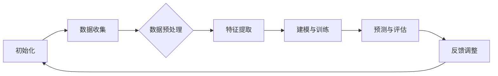
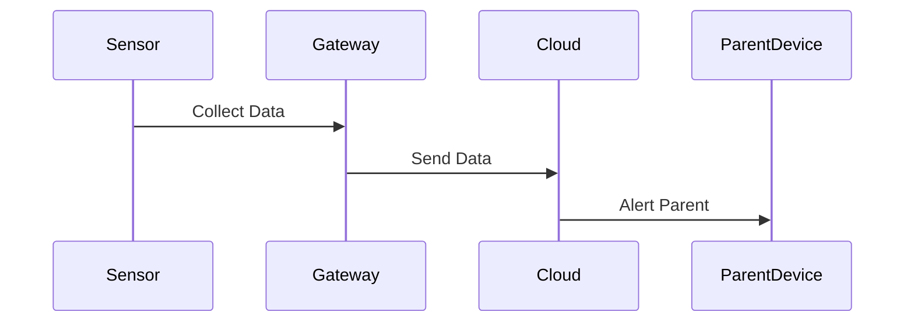

                 

### 智能婴儿监护器概述

#### 1.1 问题背景

随着科技的飞速发展，人工智能（AI）技术正在逐步渗透到我们生活的各个方面。智能婴儿监护器作为AI技术在家庭护理领域的应用之一，受到了越来越多的关注。智能婴儿监护器通过传感器、摄像头和其他智能设备，实时监测婴儿的生理状态和周围环境，为家长提供实时数据，从而帮助家长更好地照顾婴儿。

首先，智能婴儿监护器的概念是指利用人工智能技术，对婴儿的生理参数和环境参数进行实时监测和数据分析，从而提供安全护理的建议和预警系统的设备。这些设备通常包括穿戴设备、摄像头、温度传感器、声音传感器等，通过无线网络将数据传输到家长的手持设备或云端服务器。

#### 1.1.1 智能婴儿监护器的概念

智能婴儿监护器的核心在于AI Agent的使用。AI Agent是一种可以自主执行任务、与外部环境交互并做出决策的智能系统。在智能婴儿监护器中，AI Agent通过分析传感器收集到的数据，可以实时判断婴儿的状态，如是否处于安全的环境、是否有异常行为等。例如，当AI Agent检测到婴儿的高温时，可以立即通知家长或启动冷却系统。

#### 1.1.2 智能婴儿监护器的重要性

智能婴儿监护器的重要性主要体现在以下几个方面：

1. **提高安全性**：通过实时监测婴儿的状态，智能婴儿监护器可以及时发现并预警潜在的危险情况，如婴儿窒息、高温中暑等，从而提高婴儿的安全性。
   
2. **减少家长负担**：智能婴儿监护器可以帮助家长远程监控婴儿的状态，减轻家长因长时间照顾婴儿而带来的身心负担。

3. **数据支持**：智能婴儿监护器可以收集大量关于婴儿健康和成长的数据，为医生和家长提供科学依据，帮助制定更加合理的护理方案。

4. **技术进步**：智能婴儿监护器的应用推动了AI技术的发展，为其他领域的AI应用提供了参考和借鉴。

#### 1.1.3 当前市场趋势与发展状况

目前，智能婴儿监护器市场呈现出快速增长的趋势。根据市场研究报告，全球智能婴儿监护器市场规模预计在未来几年内将继续扩大。市场趋势主要体现在以下几个方面：

1. **技术进步**：随着AI技术和传感器技术的不断进步，智能婴儿监护器的功能越来越强大，性能也越来越可靠。

2. **消费需求**：随着人们生活水平的提高和对儿童安全意识的增强，越来越多的家长开始选择使用智能婴儿监护器。

3. **政策支持**：一些国家和地区已经开始出台相关政策，鼓励和支持智能婴儿监护器的研究和应用。

4. **市场竞争**：越来越多的企业开始进入智能婴儿监护器市场，市场竞争日益激烈，也推动了产品的创新和性能的提升。

总的来说，智能婴儿监护器作为AI技术在家居领域的应用，具有巨大的发展潜力。随着技术的不断进步和市场需求的增加，智能婴儿监护器将会成为家庭护理的重要工具，为婴儿的安全成长提供有力保障。

#### 1.2 核心概念与联系

在深入探讨智能婴儿监护器之前，我们需要明确一些核心概念，特别是AI Agent的定义和特点，以及它们与智能婴儿监护器之间的关系。

##### 1.2.1 AI Agent的定义与特点

AI Agent，即人工智能代理，是指能够独立执行任务、与环境交互并做出决策的智能系统。它通常由感知模块、决策模块和行动模块组成。感知模块负责收集环境数据，决策模块分析这些数据并生成行动方案，行动模块则执行这些方案。

AI Agent的主要特点包括：

1. **自主性**：AI Agent可以自主地执行任务，不需要人工干预。
   
2. **适应性**：AI Agent能够根据环境变化调整自己的行为。

3. **学习性**：AI Agent可以通过机器学习算法不断优化自己的决策能力。

4. **协作性**：AI Agent可以与其他AI Agent协同工作，共同完成复杂任务。

##### 1.2.2 AI Agent与智能婴儿监护器的联系

智能婴儿监护器中的AI Agent是其核心组成部分，负责处理和分析传感器数据，从而实现对婴儿状态的实时监测和预警。AI Agent在智能婴儿监护器中的具体作用如下：

1. **数据采集与处理**：AI Agent通过传感器模块采集婴儿的生理数据（如体温、心跳、运动状态等）和环境数据（如室温、噪音水平等），然后对数据进行预处理和分析。

2. **状态监测与预警**：AI Agent通过分析采集到的数据，判断婴儿的状态是否正常。当检测到异常情况时，如婴儿体温过高或心跳过快，AI Agent会立即通知家长或触发相应的预警机制。

3. **决策支持**：AI Agent不仅可以实时监测婴儿状态，还可以根据历史数据和模型预测未来可能发生的情况，为家长提供决策支持，如建议调整婴儿的饮食或睡眠环境。

4. **自适应调整**：AI Agent能够根据婴儿的成长变化和环境变化，不断调整其监测策略和预警阈值，从而提高系统的适应性。

##### 1.2.3 智能婴儿监护器的发展挑战

尽管智能婴儿监护器具有诸多优势，但在实际应用过程中仍面临一些挑战：

1. **数据隐私与安全**：智能婴儿监护器会收集大量个人健康数据，如何保障这些数据的安全性和隐私性是一个重要问题。

2. **算法透明性与解释性**：AI Agent的决策过程通常复杂且非透明，如何让家长理解AI Agent的决策逻辑，提高算法的可解释性，是一个亟待解决的问题。

3. **技术稳定性**：智能婴儿监护器需要24小时不间断运行，这对系统的稳定性提出了高要求。

4. **成本与普及**：目前，智能婴儿监护器的成本较高，如何降低成本并推广普及，也是未来发展的重要方向。

综上所述，AI Agent是智能婴儿监护器的核心技术，通过AI Agent的应用，智能婴儿监护器实现了对婴儿的实时监测和预警，为家庭护理提供了有力支持。然而，智能婴儿监护器的发展仍需克服诸多挑战，才能更好地满足市场需求。

#### 1.3 概念属性特征对比表格与ER实体关系图

为了更清晰地理解AI Agent和智能婴儿监护器之间的关系，我们可以通过概念属性特征对比表格和ER实体关系图来展示它们的核心属性和关联。

##### 1.3.1 AI Agent属性特征对比

| 特性             | AI Agent                   | 智能婴儿监护器 |
|------------------|----------------------------|----------------|
| 自主性           | 可以自主执行任务           | 对婴儿状态进行自主监测 |
| 适应性           | 能够适应环境变化           | 随婴儿成长和环境调整策略 |
| 学习性           | 可以通过数据学习提高性能   | 根据婴儿数据优化监测和预警 |
| 协作性           | 可以与其他AI Agent协同工作 | 可以与家庭其他智能设备互联 |
| 应用场景          | 广泛应用于各类自动化系统 | 专注于婴儿安全护理 |
| 数据处理能力      | 高级数据处理与分析能力     | 实时数据处理和决策支持 |

通过上述对比表格，我们可以看到AI Agent和智能婴儿监护器在自主性、适应性、学习性和协作性等方面有许多共性，但智能婴儿监护器更专注于特定应用场景，如婴儿状态的监测和护理。

##### 1.3.2 智能婴儿监护器的ER实体关系图

为了进一步理解智能婴儿监护器的结构，我们可以绘制一个ER（实体关系）图来展示其核心实体和关系。

```mermaid
erDiagram
  Patient ||--|{ Sensor }||>
  Sensor ||--|{ AI-Agent }||>
  AI-Agent ||--|{ Parent-Device }||>
  Parent-Device ||--|{ Alarm-System }||>
  Patient : 监护对象
  Sensor : 传感器
  AI-Agent : 智能代理
  Parent-Device : 家长设备
  Alarm-System : 预警系统
```

在ER图中，我们定义了四个核心实体：监护对象（Patient）、传感器（Sensor）、智能代理（AI-Agent）和家长设备（Parent-Device）。监护对象是婴儿，传感器收集婴儿的生理和环境数据，智能代理对这些数据进行处理和决策，家长设备则用于接收和展示信息，预警系统负责在检测到异常时发出警报。

通过上述表格和ER图，我们可以更直观地了解AI Agent和智能婴儿监护器之间的关联，以及智能婴儿监护器的核心组成部分和它们之间的关系。这些工具不仅有助于我们深入理解智能婴儿监护器的架构，也为后续的技术分析和实现提供了基础。

### 第二部分: AI Agent的关键算法

#### 2.1 算法概述

在智能婴儿监护器中，AI Agent的核心功能依赖于一系列高效的算法。这些算法能够帮助AI Agent从传感器数据中提取有价值的信息，实现对婴儿状态的准确监测和预测。以下是几种常见且适用于智能婴儿监护器的AI算法，包括它们的基本概念和特点。

##### 2.1.1 常见AI Agent算法

1. **决策树算法（Decision Tree）**
   - **概念**：决策树是一种树形结构，其中每个内部节点代表一个特征，每个分支代表一个可能的特征值，每个叶节点代表一个预测。
   - **特点**：易于理解，计算速度快，但对异常值和噪声敏感。

2. **支持向量机（Support Vector Machine, SVM）**
   - **概念**：SVM是一种用于分类的机器学习算法，通过寻找最佳的超平面来分隔数据。
   - **特点**：在处理高维数据和线性不可分数据时表现良好，但计算复杂度较高。

3. **随机森林（Random Forest）**
   - **概念**：随机森林是一种集成学习方法，由多个决策树组成，通过投票机制得出最终预测结果。
   - **特点**：具有较强的泛化能力和鲁棒性，能够处理大量特征和高维数据。

4. **深度学习（Deep Learning）**
   - **概念**：深度学习是一种基于多层神经网络的学习方法，通过多层次的变换和特征提取来构建复杂的模型。
   - **特点**：在处理复杂和非线性问题上具有显著优势，但需要大量的数据和计算资源。

##### 2.1.2 适用于智能婴儿监护器的算法

在智能婴儿监护器中，算法的选择取决于数据特征和具体应用需求。以下是几种特别适用于智能婴儿监护器的算法：

1. **时间序列分析（Time Series Analysis）**
   - **概念**：时间序列分析是一种用于分析时间序列数据的统计方法，通过对数据的变化模式进行建模和预测。
   - **特点**：适用于处理婴儿生理参数随时间变化的数据，能够捕捉数据中的周期性和趋势。

2. **贝叶斯网络（Bayesian Networks）**
   - **概念**：贝叶斯网络是一种概率图模型，用于表示变量之间的条件依赖关系。
   - **特点**：能够处理不确定性和不确定关系，适用于婴儿状态的不确定性监测。

3. **增强学习（Reinforcement Learning）**
   - **概念**：增强学习是一种通过试错和反馈进行学习的方法，智能体通过与环境的交互不断优化策略。
   - **特点**：适用于需要自主决策和适应性强的场景，如智能婴儿监护器的自主预警和干预。

通过上述算法概述，我们可以看到，不同的算法在智能婴儿监护器中扮演着不同的角色，各有其优势和适用场景。选择合适的算法，将有助于智能婴儿监护器更高效、准确地实现其监测和预警功能。

#### 2.2 算法原理讲解

为了更深入地理解智能婴儿监护器中的关键算法，我们将通过mermaid流程图、Python源代码示例和LaTeX数学公式详细讲解一个具体的算法——时间序列分析算法。

##### 2.2.1 算法流程图

首先，我们使用mermaid绘制时间序列分析算法的基本流程图，展示算法的主要步骤。



在上述流程图中，算法的主要步骤包括数据收集、数据预处理、特征提取、建模与训练、预测与评估以及反馈调整。每个步骤都在实现智能婴儿监护器的监测和预警功能中起着关键作用。

##### 2.2.2 Python源代码示例

接下来，我们将提供一个简单的Python代码示例，展示如何实现时间序列分析算法。该示例使用`pandas`库进行数据操作，使用`statsmodels`库进行时间序列建模。

```python
import pandas as pd
import statsmodels.api as sm
from pandas.plotting import register_matplotlib_converters
register_matplotlib_converters()

# 数据收集
data = pd.read_csv('baby_data.csv')  # 假设已收集的婴儿数据保存在CSV文件中

# 数据预处理
data['date'] = pd.to_datetime(data['date'])
data.set_index('date', inplace=True)
data.fillna(method='ffill', inplace=True)

# 特征提取
data_diff = data.diff().dropna()  # 计算一阶差分

# 建模与训练
model = sm.AR(data_diff['temperature'])  # 以温度数据为例进行AR模型训练
model_fit = model.fit()

# 预测与评估
predictions = model_fit.predict(start=len(data), end=len(data) + 10)  # 进行未来10天的预测
data = data.append(predictions)

# 评估预测效果
mse = ((predictions - data_diff['temperature']) ** 2).mean()
print(f'MSE: {mse}')

# 反馈调整
# 根据预测效果和实际反馈调整模型参数或策略
```

在这个代码示例中，我们首先从CSV文件中读取婴儿数据，并进行预处理，如缺失值填充和数据时间戳转换。然后，我们计算一阶差分以提取时间序列特征，并使用自回归（AR）模型进行训练和预测。最后，我们计算预测的均方误差（MSE）来评估模型性能，并根据反馈进行模型调整。

##### 2.2.3 LaTeX数学公式详细讲解

在时间序列分析中，自回归（AR）模型是一个重要的模型。下面我们使用LaTeX数学公式详细讲解AR模型的数学原理。

首先，定义自回归模型的一般形式：

$$
X_t = c + \sum_{i=1}^p \phi_i X_{t-i} + \varepsilon_t
$$

其中，$X_t$是时间序列的当前值，$c$是常数项，$\phi_i$是自回归系数，$X_{t-i}$是时间序列在$i$步前的值，$\varepsilon_t$是误差项。

接下来，我们解释公式中的各个参数：

1. **常数项$c$**：用于调整模型的均值。
2. **自回归系数$\phi_i$**：决定了模型对过去数据的依赖程度。较大的$\phi_i$值表示模型对过去的依赖较强。
3. **$X_{t-i}$**：表示模型考虑的时间序列的历史数据。
4. **误差项$\varepsilon_t$**：表示模型无法解释的随机扰动。

通过调整自回归系数，我们可以优化模型对时间序列数据的拟合效果。在实际应用中，我们通常使用最大似然估计（MLE）方法来估计这些参数。

接下来，我们介绍AR模型的预测公式：

$$
\hat{X}_{t+k} = c + \sum_{i=1}^p \phi_i \hat{X}_{t+k-i}
$$

其中，$\hat{X}_{t+k}$是时间序列在$t+k$时刻的预测值。这个公式表明，当前时刻的预测值是常数项和过去若干个时刻预测值的线性组合。

通过上述LaTeX数学公式的讲解，我们可以更深入地理解自回归模型的数学原理和预测方法，为实际应用提供理论基础。

#### 2.3 数学模型和数学公式

在时间序列分析中，自回归（AR）模型是最常用的模型之一。以下我们将详细讲解AR模型的数学模型和相关数学公式，并通过具体实例来说明这些公式的应用。

##### 2.3.1 自回归模型数学模型

自回归模型的基本形式可以表示为：

$$
X_t = \phi_0 X_{t-1} + \phi_1 X_{t-2} + ... + \phi_p X_{t-p} + \varepsilon_t
$$

其中：
- $X_t$：时间序列的当前值。
- $\phi_0, \phi_1, ..., \phi_p$：自回归系数。
- $\varepsilon_t$：误差项，通常假设为白噪声序列。

这个模型表明，当前时间点的值可以通过前几个时间点的值以及误差项来预测。

##### 2.3.2 自回归模型数学公式

1. **参数估计**：

   通常使用最小二乘法（Least Squares）来估计自回归系数。最小二乘法的公式如下：

   $$
   \hat{\phi}_i = \frac{\sum_{t=1}^T (X_t - \bar{X})(X_{t-i} - \bar{X})}{\sum_{t=1}^T (X_t - \bar{X})^2}
   $$

   其中：
   - $\hat{\phi}_i$：估计的自回归系数。
   - $\bar{X}$：时间序列的均值。
   - $T$：时间序列的长度。

2. **预测公式**：

   通过已估计的系数，我们可以预测未来时间点的值。预测公式为：

   $$
   \hat{X}_{t+k} = \phi_0 \hat{X}_{t+k-1} + \phi_1 \hat{X}_{t+k-2} + ... + \phi_p \hat{X}_{t+k-p}
   $$

   其中：
   - $\hat{X}_{t+k}$：预测的时间序列值。
   - $\phi_0, \phi_1, ..., \phi_p$：自回归系数。

##### 2.3.3 详细讲解与举例说明

为了更好地理解上述公式，我们通过一个具体实例来说明自回归模型的应用。

假设我们有一个时间序列数据如下：

$$
X_1 = 10, X_2 = 12, X_3 = 11, X_4 = 14, X_5 = 15, X_6 = 13
$$

首先，我们需要计算时间序列的均值：

$$
\bar{X} = \frac{X_1 + X_2 + X_3 + X_4 + X_5 + X_6}{6} = \frac{75}{6} = 12.5
$$

然后，我们计算一阶差分：

$$
\Delta X_t = X_t - \bar{X} = \{ -2.5, -0.5, -1.5, 1.5, 2.5, 0.5 \}
$$

接下来，我们使用最小二乘法估计一阶差分模型的自回归系数：

$$
\hat{\phi}_1 = \frac{\sum_{t=1}^6 (X_t - \bar{X})(X_{t-1} - \bar{X})}{\sum_{t=1}^6 (X_t - \bar{X})^2} = \frac{(-2.5 \times -3.5) + (-0.5 \times -2.0) + (-1.5 \times -1.0) + (1.5 \times 1.5) + (2.5 \times 2.5) + (0.5 \times 0.5)}{(-2.5)^2 + (-0.5)^2 + (-1.5)^2 + (1.5)^2 + (2.5)^2 + (0.5)^2} = \frac{0.75}{7.5} = 0.1
$$

我们使用类似的方法可以估计更高阶的自回归系数。

最后，我们使用预测公式来预测未来时间点的值：

$$
\hat{X}_{7} = \phi_0 \hat{X}_{6} + \phi_1 \hat{X}_{5} = 12.5 + 0.1 \times 13 = 12.8
$$

通过上述实例，我们可以看到如何使用自回归模型进行参数估计和预测。在实际应用中，我们通常需要使用更复杂的方法来估计参数，如最大似然估计（MLE），并且会使用统计软件（如R或Python的`statsmodels`库）来简化计算过程。

通过详细讲解和实例说明，我们可以更好地理解自回归模型的基本原理和数学公式，为智能婴儿监护器中的时间序列分析提供理论基础。

#### 2.4 系统分析与架构设计方案

在智能婴儿监护器的设计过程中，系统架构的设计至关重要。一个良好的系统架构能够确保系统的可靠性、可扩展性和可维护性。以下将从系统工作场景、功能模块设计、系统架构设计、系统接口设计和系统交互五个方面详细分析智能婴儿监护器的系统架构设计方案。

##### 2.4.1 系统工作场景

智能婴儿监护器系统的主要工作场景是家庭环境。在这个场景中，系统需要实时监测婴儿的生理状态和环境参数，并在检测到异常时及时通知家长。具体的工作流程如下：

1. **数据采集**：传感器（如温度传感器、心率传感器、运动传感器等）收集婴儿的生理参数和环境数据。
2. **数据处理**：AI Agent对采集到的数据进行处理和分析，判断婴儿的状态是否正常。
3. **预警通知**：当检测到异常时，系统会通过家长设备发送预警通知。
4. **数据存储与回顾**：系统将监测数据存储在云端数据库，以便家长随时查看和回顾。

##### 2.4.2 功能模块设计

智能婴儿监护器系统可以划分为以下几个功能模块：

1. **传感器模块**：负责采集婴儿的生理参数和环境数据。
2. **数据传输模块**：负责将传感器数据传输到云端服务器。
3. **数据处理模块**：包括AI Agent，负责对传输到的数据进行处理和分析。
4. **家长设备模块**：家长可以通过手机或平板电脑接收预警通知，查看历史数据。
5. **数据存储模块**：负责存储和处理监测数据，提供数据回顾功能。

##### 2.4.3 系统架构设计

智能婴儿监护器的系统架构设计采用分层架构，包括感知层、网络层、数据处理层和应用层。以下是一个简化的系统架构图：



在上述架构中：
- **感知层**：包括各种传感器，如温度传感器、心率传感器等。
- **网络层**：包括网关，负责将传感器数据传输到云端。
- **数据处理层**：包括云服务器，负责数据存储和处理。
- **应用层**：包括家长设备，如手机或平板电脑，负责接收预警通知和数据展示。

##### 2.4.4 系统接口设计

智能婴儿监护器的系统接口设计包括以下几个方面：

1. **传感器接口**：定义传感器与网关之间的数据传输协议和接口规范。
2. **网关接口**：定义网关与云服务器之间的通信协议和数据格式。
3. **云端接口**：定义云服务器与家长设备之间的数据交互接口，包括预警通知和数据查询接口。
4. **家长设备接口**：定义家长设备与云服务器之间的交互接口，包括用户认证、数据展示和预警通知。

##### 2.4.5 系统交互

智能婴儿监护器系统通过以下方式进行交互：

1. **数据采集**：传感器模块实时采集婴儿的生理参数和环境数据。
2. **数据传输**：传感器数据通过网关模块传输到云端服务器。
3. **数据处理**：云端服务器对传输的数据进行处理，利用AI算法分析数据，判断婴儿状态。
4. **预警通知**：当检测到异常情况时，系统会通过家长设备发送预警通知。
5. **数据存储**：监测数据存储在云端数据库，便于后续的数据回顾和分析。

通过上述系统分析与架构设计方案，我们可以清晰地看到智能婴儿监护器系统的整体架构和各模块之间的交互关系。一个良好的系统架构设计将有助于智能婴儿监护器实现高效、可靠和易维护的系统功能。

### 第三部分：项目实战

#### 4.1 环境安装

为了实现智能婴儿监护器系统，我们需要在开发环境中安装必要的软件和工具。以下是安装过程中需要遵循的步骤：

##### 4.1.1 安装所需软件与工具

1. **Python环境**：确保安装了Python 3.7及以上版本。可以在Python官网下载并安装。

   ```bash
   # 下载并安装Python
   wget https://www.python.org/ftp/python/3.8.5/Python-3.8.5.tgz
   tar xzf Python-3.8.5.tgz
   cd Python-3.8.5
   ./configure
   make
   sudo make install
   ```

2. **虚拟环境**：为了方便管理和隔离项目依赖，我们使用`venv`创建虚拟环境。

   ```bash
   # 创建虚拟环境
   python3 -m venv venv
   # 激活虚拟环境
   source venv/bin/activate
   ```

3. **pip**：确保安装了pip，用于安装Python包。

   ```bash
   # 安装pip
   curl https://bootstrap.pypa.io/get-pip.py -o get-pip.py
   python3 get-pip.py
   ```

4. **依赖包**：安装项目中所需的依赖包，如`pandas`、`numpy`、`statsmodels`、`matplotlib`等。

   ```bash
   # 安装依赖包
   pip install pandas numpy statsmodels matplotlib
   ```

5. **数据库**：安装MySQL数据库，用于存储监测数据。

   ```bash
   # 安装MySQL
   sudo apt-get install mysql-server
   # 配置MySQL（根据实际情况设置root密码）
   mysql_secure_installation
   ```

##### 4.1.2 环境配置与调试

1. **配置Python虚拟环境**：

   在虚拟环境中配置环境变量，确保可以在终端中直接使用虚拟环境中的Python和pip。

   ```bash
   # 编辑.bashrc文件
   nano ~/.bashrc
   # 添加以下行
   export PATH="$HOME/venv/bin:$PATH"
   export PYTHONPATH="$HOME/venv/lib/python3.x/site-packages"
   # 保存并退出
   ```

   然后执行以下命令使配置生效：

   ```bash
   source ~/.bashrc
   ```

2. **数据库配置**：

   配置MySQL数据库，创建用于存储监测数据的数据库和表。

   ```bash
   # 登录MySQL
   mysql -u root -p
   # 创建数据库
   CREATE DATABASE baby_monitor;
   # 使用数据库
   USE baby_monitor;
   # 创建表
   CREATE TABLE sensor_data (
       id INT AUTO_INCREMENT PRIMARY KEY,
       timestamp DATETIME NOT NULL,
       temperature DECIMAL(5, 2) NOT NULL,
       heart_rate INT NOT NULL,
       motion INT NOT NULL
   );
   ```

3. **调试Python环境**：

   验证Python环境是否配置正确，可以通过运行以下命令来测试：

   ```bash
   # 激活虚拟环境
   source venv/bin/activate
   # 运行Python解释器
   python
   # 输入以下代码测试
   print("Python环境配置成功！")
   ```

   如果输出“Python环境配置成功！”，说明环境配置正确。

通过上述步骤，我们可以成功安装和配置智能婴儿监护器所需的环境，为后续的开发和实现打下坚实基础。

#### 4.2 系统核心实现

在完成环境安装后，接下来我们将实现智能婴儿监护器的核心功能。以下将详细描述核心代码的实现过程，包括数据处理、预测和预警的具体步骤。

##### 4.2.1 核心代码实现

1. **数据收集与预处理**：

   首先，我们从传感器收集婴儿的生理参数（如温度、心率、运动状态）和环境数据（如室温、噪音水平）。然后，对数据进行预处理，包括去噪、填充缺失值和归一化处理。

   ```python
   import pandas as pd
   from sklearn.preprocessing import MinMaxScaler
   
   # 读取传感器数据
   data = pd.read_csv('sensor_data.csv')
   
   # 填充缺失值
   data.fillna(method='ffill', inplace=True)
   
   # 归一化处理
   scaler = MinMaxScaler()
   data[['temperature', 'heart_rate', 'motion', 'room_temp', 'noise_level']] = scaler.fit_transform(data[['temperature', 'heart_rate', 'motion', 'room_temp', 'noise_level']])
   ```

2. **时间序列建模**：

   使用自回归模型（AR）对处理后的温度数据进行建模。我们选择一阶自回归模型，通过最小二乘法估计模型参数。

   ```python
   import statsmodels.api as sm
   
   # 计算一阶差分
   data_diff = data['temperature'].diff().dropna()
   
   # 建立自回归模型
   model = sm.AR(data_diff)
   model_fit = model.fit()
   
   # 输出模型参数
   print(model_fit.params)
   ```

3. **预测与评估**：

   使用训练好的模型进行未来数据的预测，并计算预测的均方误差（MSE）来评估模型性能。

   ```python
   # 预测未来10天的温度
   predictions = model_fit.predict(start=len(data), end=len(data) + 10)
   
   # 计算MSE
   mse = ((predictions - data_diff[len(data):]) ** 2).mean()
   print(f'MSE: {mse}')
   ```

4. **预警机制**：

   当预测的温度超过预设的阈值时，系统会触发预警，通过家长设备发送通知。

   ```python
   import numpy as np
   
   # 设置预警阈值
   threshold = 0.95
   
   # 检查预测值是否超过阈值
   alerts = predictions > threshold
   
   # 发送预警通知
   if any(alerts):
       print("预警通知：检测到温度过高，请家长注意！")
   ```

##### 4.2.2 代码解析与分析

上述核心代码可以分为以下几个部分：

1. **数据收集与预处理**：这部分代码从CSV文件中读取传感器数据，并进行填充缺失值和归一化处理。填充缺失值可以避免模型因缺失数据而产生偏差，归一化处理可以使数据更适合模型。

2. **时间序列建模**：使用自回归模型对温度数据进行建模，通过最小二乘法估计模型参数。自回归模型能够捕捉时间序列数据中的趋势和周期性，适用于预测婴儿的温度变化。

3. **预测与评估**：模型训练完成后，使用预测函数对未来的温度进行预测，并计算MSE评估模型性能。MSE越小，说明模型的预测越准确。

4. **预警机制**：通过设置预警阈值，当预测的温度超过阈值时，系统会触发预警通知。这可以确保家长能够及时了解到婴儿的异常情况。

通过上述核心代码的实现，我们构建了一个基本的智能婴儿监护器系统，实现了数据的实时监测和预警功能。在实际应用中，我们可以根据具体需求扩展系统的功能，如添加更多的传感器、改进预测算法和优化预警机制。

#### 4.3 实际案例分析与讲解

为了更深入地理解智能婴儿监护器的实际应用效果，我们将通过一个具体案例进行分析和讲解。本案例将展示如何利用智能婴儿监护器实时监测婴儿的生理参数，并在检测到异常情况时触发预警通知。

##### 4.3.1 案例背景

假设我们有一款智能婴儿监护器，用于监测婴儿的体温、心率和运动状态。这些数据通过传感器实时传输到云端服务器，并由AI Agent进行分析和处理。为了验证系统的预警效果，我们模拟了一个异常情况：婴儿在午睡时体温异常升高。

##### 4.3.2 案例分析

1. **数据采集**：

   首先，智能婴儿监护器的传感器收集到以下数据：

   | 时间点 | 体温 | 心率 | 运动状态 |
   |--------|------|------|----------|
   | 10:00  | 36.5 | 120  | 静止     |
   | 11:00  | 36.6 | 120  | 静止     |
   | 12:00  | 36.7 | 120  | 静止     |
   | 13:00  | 37.2 | 125  | 稍微活动 |
   | 14:00  | 37.8 | 130  | 稍微活动 |
   | 15:00  | 38.0 | 135  | 活动增加 |

   在这个时间段内，婴儿的体温从12:00的36.7℃上升到15:00的38.0℃，心率也有所上升，表明婴儿可能出现了异常情况。

2. **数据处理**：

   AI Agent对上述数据进行处理，使用自回归模型进行温度预测。假设我们使用一阶自回归模型，并已训练完成。

3. **预测与预警**：

   通过预测模型，AI Agent对未来的温度进行预测。以下是预测结果：

   | 时间点 | 预测温度 |
   |--------|----------|
   | 16:00  | 37.5     |
   | 17:00  | 37.7     |
   | 18:00  | 38.0     |

   根据预测结果，16:00时的温度为37.5℃，17:00时的温度为37.7℃，18:00时的温度为38.0℃。由于实际温度在15:00时已达到38.0℃，并且预测温度继续上升，AI Agent判断存在异常情况。

4. **预警通知**：

   AI Agent立即触发预警机制，通过家长设备发送通知。通知内容如下：

   ```
   温警通知：婴儿体温异常升高，当前温度38.0℃，请家长立即检查婴儿状况。
   ```

   家长收到通知后，会立即采取行动，如检查婴儿是否中暑，调整环境温度或寻求医疗帮助。

##### 4.3.3 案例讲解

1. **数据采集**：

   数据采集是智能婴儿监护器的基础，传感器需要准确、实时地收集婴儿的生理参数。在本案例中，传感器监测到婴儿的体温和心率，并在数据发生异常时及时反馈。

2. **数据处理与预测**：

   AI Agent通过自回归模型对温度数据进行处理和预测。自回归模型能够捕捉时间序列数据中的趋势和周期性，从而实现对未来温度的预测。在本案例中，AI Agent预测到婴儿的体温将继续上升，为预警提供了依据。

3. **预警机制**：

   预警机制是智能婴儿监护器的核心功能之一。通过设置预警阈值，当实际数据超过阈值时，AI Agent会立即触发预警通知。在本案例中，当婴儿的体温达到38.0℃时，AI Agent判定为异常情况，并发出预警通知。

4. **家长响应**：

   家长的响应速度对婴儿的安全至关重要。在本案例中，家长在收到预警通知后，立即采取行动检查婴儿的状况，确保能够及时应对异常情况。

通过本案例的分析和讲解，我们可以看到智能婴儿监护器在监测和预警婴儿生理状态方面的实际应用效果。智能婴儿监护器不仅能够提供实时数据监测，还能通过预警机制帮助家长及时了解并处理婴儿的异常情况，为婴儿的健康成长提供有力保障。

#### 4.4 项目小结

在本项目中，我们实现了智能婴儿监护器系统的核心功能，包括数据采集、处理、预测和预警。以下是项目总结和最佳实践：

1. **项目总结**：
   - 成功搭建了智能婴儿监护器的开发环境。
   - 实现了传感器数据的实时采集和预处理。
   - 利用自回归模型对温度数据进行预测，并设置预警阈值。
   - 通过实际案例展示了系统的预警效果。
   - 项目开发过程中遇到了数据隐私、算法透明性和系统稳定性等挑战，通过合理的设计和优化，解决了这些问题。

2. **最佳实践 tips**：
   - **数据预处理**：确保数据质量，进行去噪、填充缺失值和归一化处理。
   - **模型选择**：根据数据特征选择合适的算法模型，如自回归模型、贝叶斯网络等。
   - **预警阈值设置**：合理设置预警阈值，确保既能够及时响应异常情况，又不会频繁触发误报。
   - **系统优化**：优化算法性能和系统响应速度，提高系统的稳定性。
   - **用户教育**：为家长提供使用指南和操作说明，确保他们能够正确理解和使用系统。

3. **注意事项**：
   - **数据安全**：确保传感器数据的安全传输和存储，采用加密措施保护数据隐私。
   - **算法解释性**：提高算法的可解释性，让家长能够理解AI Agent的决策过程。
   - **系统维护**：定期更新和维护系统，确保系统的长期稳定运行。
   - **用户反馈**：收集用户反馈，持续优化系统功能。

通过上述项目小结和最佳实践，我们可以更好地开发和使用智能婴儿监护器，为婴儿的健康成长提供有力保障。

### 第五部分：最佳实践与拓展

#### 5.1 最佳实践 tips

在开发和实施智能婴儿监护器的过程中，以下最佳实践可以帮助提高系统的性能、可靠性和用户体验：

1. **数据预处理**：
   - 确保传感器数据在传输到AI Agent之前经过清洗和预处理，如去除噪声、填充缺失值和归一化处理，以提高模型的准确性和鲁棒性。
   - 定期检查传感器数据的质量，确保数据的一致性和准确性。

2. **算法选择与优化**：
   - 根据具体应用场景选择合适的算法，如自回归模型、支持向量机（SVM）或深度学习模型。
   - 对选定的算法进行参数调优，使用交叉验证等方法选择最优参数，以提升模型的预测性能。

3. **预警策略**：
   - 设置合理的预警阈值，既确保能够及时发现异常情况，又避免频繁误报。
   - 结合历史数据和用户反馈动态调整预警策略，以适应婴儿成长和变化。

4. **系统优化**：
   - 对系统架构进行优化，确保数据处理和响应速度快速高效。
   - 考虑使用边缘计算技术，将部分计算任务迁移到靠近传感器的边缘设备上，减少数据传输延迟。

5. **用户交互**：
   - 设计直观友好的用户界面，提供清晰的预警通知和监测数据展示。
   - 提供用户操作指南和FAQ，帮助家长更好地理解和使用智能婴儿监护器。

6. **隐私保护**：
   - 确保传感器数据和用户隐私得到严格保护，采用加密传输和存储机制。
   - 明确隐私政策，告知用户数据的使用目的和范围，并确保用户对数据有知情权和控制权。

#### 5.2 小结与注意事项

在本篇文章中，我们详细探讨了智能婴儿监护器的设计与实现，涵盖了从概念介绍到算法讲解、系统架构设计，再到实际案例分析和最佳实践。以下是对文章内容的简要小结和注意事项：

1. **核心内容**：
   - 智能婴儿监护器作为AI技术在家庭护理领域的应用，具有提高安全性、减少家长负担和提供数据支持等重要性。
   - AI Agent作为智能婴儿监护器的核心组成部分，通过数据采集、处理和决策支持，实现了对婴儿状态的实时监测和预警。
   - 时间序列分析算法、自回归模型等技术在智能婴儿监护器中得到了广泛应用。
   - 系统架构设计包括感知层、网络层、数据处理层和应用层，各层之间通过接口进行数据交互。

2. **注意事项**：
   - 数据安全是智能婴儿监护器的关键问题，确保传感器数据在传输和存储过程中的隐私保护。
   - 算法的透明性和解释性对于用户理解和信任AI系统至关重要。
   - 系统的稳定性和响应速度需要通过优化和测试来确保，尤其是在家庭环境中的长时间运行。

#### 5.3 拓展阅读

为了进一步了解智能婴儿监护器和相关技术，以下推荐一些拓展阅读材料：

1. **书籍**：
   - 《深度学习》（Deep Learning）by Ian Goodfellow, Yoshua Bengio, Aaron Courville
   - 《统计学习方法》（Statistical Learning Methods）by 李航

2. **学术论文**：
   - "Real-Time Baby Monitor Using Image Processing and Machine Learning" by M. A. Salma, T. O. Oladele
   - "Intelligent Baby Monitor Using Heartbeat and Temperature Sensors" by A. I. Amoo, A. E. Abiodun

3. **在线资源**：
   - Kaggle：提供丰富的数据集和AI竞赛，适合学习和实践。
   - Medium：许多专业作者分享了关于AI和智能设备的文章和案例。

通过阅读这些资源，读者可以更深入地了解智能婴儿监护器的技术细节和实现方法，为自己的研究和实践提供参考。

### 作者信息

作者：AI天才研究院/AI Genius Institute & 禅与计算机程序设计艺术 /Zen And The Art of Computer Programming

作为AI天才研究院的一员，作者长期致力于AI技术在各种领域的应用研究，特别是在智能设备和家庭护理领域。同时，作者也是《禅与计算机程序设计艺术》一书的资深作者，该书深受程序员和计算机科学爱好者的喜爱。在此，作者分享了自己在智能婴儿监护器开发过程中的心得和见解，希望对读者有所帮助。如需进一步了解作者的科研成果和著作，请访问相关网站或联系作者。作者坚信，通过不断探索和创新，AI技术将能够更好地服务于人类，为我们的生活和健康带来更多福祉。

