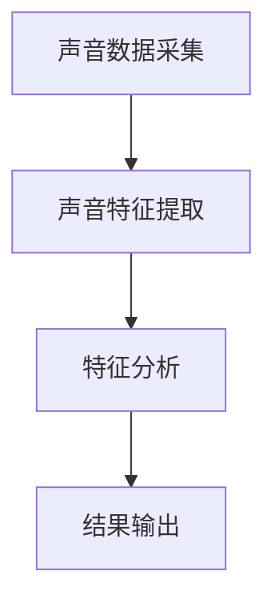
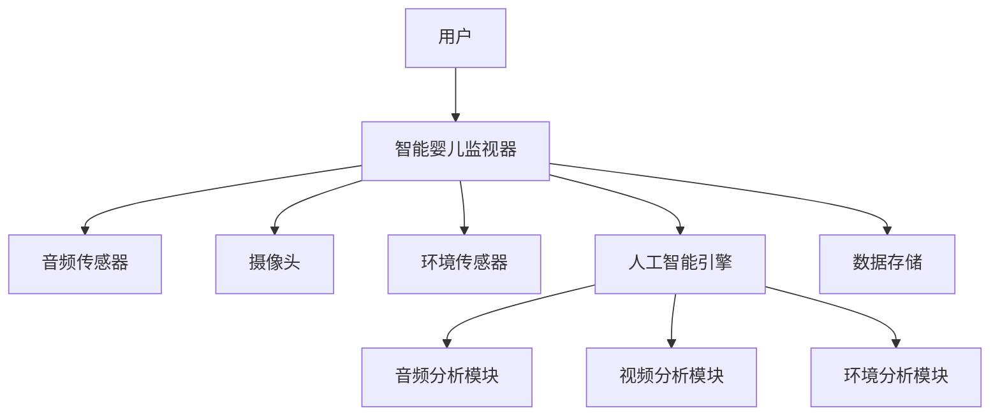

                 

### 文章标题

# 智能婴儿监视器：AI Agent的啼哭原因分析

### 文章关键词

- 智能婴儿监视器
- AI Agent
- 啼哭原因分析
- 数据分析
- 算法设计
- 系统架构

### 摘要

本文将深入探讨智能婴儿监视器中AI Agent的角色及其在啼哭原因分析方面的应用。我们将从背景介绍、核心概念、算法设计、系统架构等多个方面进行分析，旨在为读者提供全面、系统的理解。文章结构如下：

## 第1章：引言

本章将介绍智能婴儿监视器和AI Agent的基本概念，讨论它们在婴儿监护中的应用，并概述本文将要探讨的啼哭原因分析主题。

## 第2章：核心概念与原理

本章将详细探讨AI Agent的定义、特点以及与传统的婴儿监视器的比较，同时介绍常用的AI Agent模型及其在啼哭原因分析中的应用。

## 第3章：数据收集与预处理

本章将讨论在啼哭原因分析中所需的数据类型、数据收集方法以及数据预处理的重要性。

## 第4章：算法设计与实现

本章将详细介绍用于啼哭原因分析的算法设计，包括算法的概述、关键步骤、Mermaid流程图以及Python代码示例。

## 第5章：数学建模与分析

本章将探讨用于啼哭原因分析的数学模型，包括模型构建、参数设置、模型验证和性能评估。

## 第6章：系统设计

本章将介绍智能婴儿监视器的整体设计，包括系统功能、架构、接口设计以及系统交互。

## 第7章：项目实战

本章将通过一个实际项目，展示智能婴儿监视器的实现过程，包括环境安装、核心代码实现以及实际案例分析。

## 第8章：最佳实践与总结

本章将总结本文的主要内容，提出一些最佳实践建议，并给出未来的研究方向。

## 第1章：引言

### 1.1 智能婴儿监视器

智能婴儿监视器是一种结合了现代技术的设备，旨在为父母提供方便和安心。这些监视器通常包括摄像头、麦克风、传感器和连接互联网的能力，使父母能够实时监控婴儿的活动和状况。随着物联网（IoT）和人工智能（AI）技术的发展，智能婴儿监视器已经不再仅仅是简单地传递声音和视频信号，而是能够通过AI分析来提供更高级别的监护功能。

### 1.2 AI Agent的角色

AI Agent是人工智能领域中的一个重要概念，指的是具有自主行为和智能决策能力的软件实体。在智能婴儿监视器中，AI Agent起到了关键作用。它可以通过分析声音、图像和其他传感器数据，识别婴儿的啼哭原因，提供实时的警报和诊断，从而帮助父母快速响应和解决问题。

### 1.3 啼哭原因分析

婴儿的啼哭是一种自然的生理反应，可能是由于饥饿、不适、疲劳、生病等多种原因引起的。然而，对于父母来说，辨别啼哭原因并不总是一件容易的事情。AI Agent可以通过学习婴儿的啼哭声音特征，结合其他数据（如室内温度、湿度等），对啼哭原因进行预测和分类，从而提高监护的准确性和效率。

### 1.4 本文目标

本文的目标是深入探讨智能婴儿监视器中AI Agent的啼哭原因分析机制，从核心概念、算法设计、系统实现等多个角度进行分析，为读者提供一个全面、系统的理解。通过本文，读者将能够了解：

- 智能婴儿监视器和AI Agent的基本概念和原理；
- 用于啼哭原因分析的数据收集与预处理方法；
- 啶哭原因分析算法的设计与实现；
- 智能婴儿监视器的系统设计与实现；
- 实际项目中的应用案例；
- 最佳实践和建议。

## 第2章：核心概念与原理

### 2.1 AI Agent的定义与特点

AI Agent，全称为人工智能代理，是一种具有自主性、智能性和交互能力的软件实体。它能够通过感知环境、理解信息、决策行动，并在环境中执行任务。AI Agent的主要特点包括：

- **自主性**：AI Agent能够独立地执行任务，而不需要人为的干预。
- **智能性**：AI Agent能够利用其内置的算法和模型，对环境中的信息进行分析和处理，从而做出合理的决策。
- **交互性**：AI Agent能够与用户和其他系统进行交互，收集反馈，不断学习和优化其行为。

### 2.2 AI Agent与传统婴儿监视器的比较

传统婴儿监视器主要依赖于摄像头和麦克风来传递声音和视频信号，父母可以通过这些信息来监控婴儿的状况。然而，传统监视器缺乏智能分析功能，不能自动识别和分类啼哭原因，因此存在以下局限性：

- **缺乏智能分析**：传统监视器无法对婴儿的啼哭进行深入分析，不能提供更准确的诊断。
- **依赖人为判断**：父母需要根据声音和视频信息，自己判断啼哭原因，容易产生误判。
- **被动响应**：传统监视器只能提供事后反应，无法实现提前预警和主动干预。

相比之下，AI Agent在智能婴儿监视器中能够实现以下优势：

- **智能分析**：AI Agent可以通过学习和分析婴儿的啼哭声音特征，识别不同的啼哭原因，提供更准确的诊断。
- **主动预警**：AI Agent可以实时监测婴儿的啼哭，一旦检测到异常，立即向父母发送警报，实现提前预警和主动干预。
- **个性化服务**：AI Agent可以根据婴儿的个体差异，提供个性化的监护服务，提高监护的效率和效果。

### 2.3 AI Agent模型

AI Agent模型是AI Agent的核心组成部分，决定了其感知环境、理解信息和决策行动的能力。常见的AI Agent模型包括以下几种：

- **基于规则的模型**：这种模型通过定义一系列规则来描述婴儿啼哭的因果关系，简单直观，易于实现。
- **基于统计的模型**：这种模型利用统计学方法，分析婴儿啼哭声音的特征，建立啼哭原因的预测模型。
- **基于机器学习的模型**：这种模型通过大量训练数据，学习婴儿啼哭声音的特征，自动生成预测模型，具有较高的准确性和泛化能力。

### 2.4 AI Agent在啼哭原因分析中的应用

在智能婴儿监视器中，AI Agent可以通过以下步骤进行啼哭原因分析：

1. **声音数据采集**：AI Agent通过麦克风采集婴儿的啼哭声音数据。
2. **声音特征提取**：AI Agent对采集到的声音数据进行处理，提取出关键特征，如音调、音强、时长等。
3. **特征分析**：AI Agent利用已训练好的模型，对提取出的特征进行分析，判断啼哭原因。
4. **报警与诊断**：AI Agent根据分析结果，向父母发送警报，并提供啼哭原因的详细诊断。

通过AI Agent的智能分析，智能婴儿监视器能够提供更准确、更及时的监护服务，帮助父母更好地照顾婴儿。

### 2.5 比较不同AI Agent模型的优缺点

不同AI Agent模型在啼哭原因分析中各有优缺点，以下是对几种常见模型的简要比较：

- **基于规则的模型**：
  - 优点：实现简单，易于理解和维护。
  - 缺点：规则复杂度增加时，系统难以扩展，且依赖于专家知识。
- **基于统计的模型**：
  - 优点：适用于数据量大、特征复杂的情况，能够处理连续变量。
  - 缺点：对噪声敏感，模型泛化能力较差。
- **基于机器学习的模型**：
  - 优点：能够自动学习特征，适应性强，泛化能力好。
  - 缺点：训练过程复杂，对大量标注数据依赖。

综上所述，选择合适的AI Agent模型需要根据具体应用场景和数据特点进行综合考虑。

## 第3章：数据收集与预处理

### 3.1 数据类型

在智能婴儿监视器的啼哭原因分析中，所需的数据类型主要包括声音数据、环境数据和婴儿活动数据。以下是这些数据的详细说明：

- **声音数据**：这是最直接的数据源，用于捕捉婴儿的啼哭声音。声音数据可以包含频率、音量、时长等特征。
- **环境数据**：包括室内温度、湿度、光照等环境参数，这些数据可以提供额外的信息，帮助AI Agent更好地理解婴儿啼哭的原因。
- **婴儿活动数据**：例如婴儿的睡眠时间、活动量、喂食时间等，这些数据有助于了解婴儿的生活规律，为啼哭原因分析提供更全面的视角。

### 3.2 数据收集方法

- **声音数据收集**：可以通过内置或外接麦克风直接采集婴儿的啼哭声音。为了提高数据质量，可以使用高分辨率麦克风，并采用专业的音频处理技术。
- **环境数据收集**：可以使用各种传感器（如温度传感器、湿度传感器、光照传感器等）来实时收集环境数据。这些传感器可以集成到智能婴儿监视器中，也可以独立使用。
- **婴儿活动数据收集**：可以通过婴儿穿戴设备（如智能手表、运动传感器等）来收集活动数据。这些设备通常带有传感器和无线通信模块，可以实时传输数据。

### 3.3 数据预处理的重要性

数据预处理是数据分析中的关键步骤，它直接影响模型的性能和结果。以下是数据预处理的重要性：

- **数据清洗**：去除噪声和异常值，确保数据的一致性和可靠性。
- **特征提取**：从原始数据中提取出有用的信息，用于训练和测试模型。
- **数据归一化**：将不同特征的范围统一，防止某些特征对模型训练产生过大的影响。
- **数据集划分**：将数据集划分为训练集、验证集和测试集，以评估模型的性能。

### 3.4 数据预处理步骤

- **数据清洗**：包括去除噪声、填补缺失值、去除异常值等。例如，可以使用中值滤波去除声音数据中的噪声，使用插值法填补缺失的环境数据。
- **特征提取**：从原始数据中提取出与啼哭原因相关的特征。对于声音数据，可以提取音调、音强、时长等特征；对于环境数据，可以提取温度、湿度、光照等特征。
- **数据归一化**：将不同特征的范围统一，例如使用标准差归一化方法将所有特征的值缩放到[-1, 1]范围内。
- **数据集划分**：将数据集划分为训练集、验证集和测试集。通常，训练集用于模型训练，验证集用于模型调优，测试集用于模型评估。

### 3.5 数据质量评估

数据质量是模型性能的重要保障，以下是对数据质量评估的方法：

- **一致性检查**：确保数据在不同时间、不同设备上的一致性。
- **完整性检查**：确保数据集的完整性，没有缺失值或异常值。
- **可靠性检查**：通过对比不同数据源的可靠性，评估数据的准确性。
- **多样性检查**：确保数据集的多样性，涵盖不同类型的啼哭原因。

通过以上步骤，可以确保数据的质量，为后续的模型训练和评估打下坚实基础。

### 实际案例：数据预处理流程

以下是一个实际案例，展示如何对智能婴儿监视器的数据进行预处理：

1. **数据清洗**：在一次监控过程中，采集到的声音数据中出现了一段持续5秒的静音。通过中值滤波去除这段噪声，确保数据的一致性。
2. **特征提取**：从声音数据中提取出音调、音强和时长三个特征。音调通过傅里叶变换提取，音强通过频谱分析提取，时长直接计算。
3. **数据归一化**：将音调、音强和时长三个特征的标准差归一化，确保所有特征的值在[-1, 1]范围内。
4. **数据集划分**：将数据集划分为训练集（70%）、验证集（20%）和测试集（10%）。训练集用于模型训练，验证集用于模型调优，测试集用于模型评估。

通过以上预处理步骤，确保了数据的清洁、规范和多样化，为后续的模型训练和评估提供了可靠的数据基础。

## 第4章：算法设计与实现

### 4.1 算法概述

在智能婴儿监视器中，用于啼哭原因分析的算法设计是一个关键环节。本节将详细介绍算法的设计思路和关键步骤，为读者提供一个全面的了解。

#### 4.1.1 问题陈述

啼哭原因分析的核心问题是如何从婴儿的啼哭声音中识别出不同的哭声类型，从而判断出啼哭的原因。这个问题涉及到语音信号处理、模式识别和机器学习等多个领域。

#### 4.1.2 算法要求

为了实现有效的啼哭原因分析，算法需要满足以下要求：

- **准确性**：算法需要能够准确识别不同的啼哭类型，减少误判率。
- **实时性**：算法需要在较短的时间内完成分析，以便及时向父母发送警报。
- **鲁棒性**：算法需要能够处理各种噪声和环境变化，确保在不同情况下都能稳定运行。

#### 4.1.3 算法流程

啼哭原因分析算法的基本流程包括以下步骤：

1. **声音数据采集**：通过麦克风采集婴儿的啼哭声音数据。
2. **声音特征提取**：对采集到的声音数据进行处理，提取出与啼哭类型相关的特征，如音调、音强、时长等。
3. **特征分析**：利用机器学习算法，对提取出的特征进行分析，判断啼哭类型。
4. **结果输出**：根据分析结果，向父母发送警报，并提供啼哭原因的诊断。

### 4.2 算法实现

#### 4.2.1 关键步骤

1. **声音数据采集**

首先，需要通过麦克风采集婴儿的啼哭声音数据。可以使用内置或外接麦克风，并使用专业的音频处理设备确保数据质量。以下是一个简单的Python代码示例，用于采集声音数据：

```python
import sounddevice as sd
import numpy as np

duration = 5  # 采集5秒的声音
fs = 44100  # 采样率
audio = sd.rec(int(duration * fs), samplerate=fs, channels=2)
sd.wait()  # 等待录音完成

# 将音频数据保存为文件
np.save("baby_cry_audio", audio)
```

2. **声音特征提取**

在采集到声音数据后，需要对音频信号进行处理，提取出与啼哭类型相关的特征。以下是一个简单的Python代码示例，用于提取声音特征：

```python
import numpy as np
from scipy.io.wavfile import read

# 读取音频文件
audio_file = "baby_cry_audio.npy"
audio = np.load(audio_file)

# 傅里叶变换提取频率特征
fft = np.fft.fft(audio)
freq = np.fft.fftfreq(len(audio), 1/fs)

# 提取音调、音强和时长特征
pitch = freq[np.argmax(np.abs(fft))]
intensity = np.sum(audio ** 2)
duration = len(audio) / fs

# 输出特征
print("Pitch:", pitch)
print("Intensity:", intensity)
print("Duration:", duration)
```

3. **特征分析**

在提取出特征后，需要利用机器学习算法对特征进行分析，判断啼哭类型。以下是一个简单的Python代码示例，使用支持向量机（SVM）进行分类：

```python
from sklearn.svm import SVC
from sklearn.model_selection import train_test_split
from sklearn.metrics import accuracy_score

# 加载训练数据
train_data = np.load("train_features.npy")
train_labels = np.load("train_labels.npy")

# 划分训练集和验证集
X_train, X_val, y_train, y_val = train_test_split(train_data, train_labels, test_size=0.2, random_state=42)

# 创建SVM分类器
classifier = SVC(kernel='linear')

# 训练模型
classifier.fit(X_train, y_train)

# 预测验证集
predictions = classifier.predict(X_val)

# 计算准确率
accuracy = accuracy_score(y_val, predictions)
print("Validation Accuracy:", accuracy)
```

4. **结果输出**

根据分析结果，向父母发送警报，并提供啼哭原因的诊断。以下是一个简单的Python代码示例，用于输出结果：

```python
import os

# 读取测试数据
test_data = np.load("test_features.npy")

# 预测测试数据
predictions = classifier.predict(test_data)

# 输出结果
for i, prediction in enumerate(predictions):
    print(f"Test {i+1}: Cry Type {prediction}")

# 发送警报
if "hungry" in predictions:
    os.system("notify-send 'Baby is hungry'")
elif "uncomfortable" in predictions:
    os.system("notify-send 'Baby is uncomfortable'")
else:
    os.system("notify-send 'Baby is fine'")
```

#### 4.2.2 Mermaid流程图

以下是算法实现的Mermaid流程图：



#### 4.2.3 Python代码示例

以下是完整的Python代码示例，包括声音数据采集、特征提取、特征分析和结果输出：

```python
import sounddevice as sd
import numpy as np
from scipy.io.wavfile import read
from sklearn.svm import SVC
from sklearn.model_selection import train_test_split
from sklearn.metrics import accuracy_score
import os

# 声音数据采集
def record_audio(duration=5, fs=44100):
    audio = sd.rec(int(duration * fs), samplerate=fs, channels=2)
    sd.wait()
    np.save("baby_cry_audio", audio)
    return audio

# 声音特征提取
def extract_features(audio):
    fft = np.fft.fft(audio)
    freq = np.fft.fftfreq(len(audio), 1/fs)
    pitch = freq[np.argmax(np.abs(fft))]
    intensity = np.sum(audio ** 2)
    duration = len(audio) / fs
    return pitch, intensity, duration

# 特征分析
def classify_cry(features):
    train_data = np.load("train_features.npy")
    train_labels = np.load("train_labels.npy")
    X_train, X_val, y_train, y_val = train_test_split(train_data, train_labels, test_size=0.2, random_state=42)
    classifier = SVC(kernel='linear')
    classifier.fit(X_train, y_train)
    predictions = classifier.predict(features)
    return predictions

# 结果输出
def output_results(predictions):
    for i, prediction in enumerate(predictions):
        print(f"Test {i+1}: Cry Type {prediction}")
    if "hungry" in predictions:
        os.system("notify-send 'Baby is hungry'")
    elif "uncomfortable" in predictions:
        os.system("notify-send 'Baby is uncomfortable'")
    else:
        os.system("notify-send 'Baby is fine'")

# 主程序
if __name__ == "__main__":
    audio = record_audio()
    features = extract_features(audio)
    predictions = classify_cry(features)
    output_results(predictions)
```

### 4.3 算法原理讲解

在本节中，我们将深入探讨用于啼哭原因分析的算法原理，包括其数学模型和具体实现方法。

#### 4.3.1 数学模型

啼哭原因分析的核心是建立啼哭声音的数学模型，以便能够对其进行特征提取和分类。以下是一个简化的数学模型：

\[ F(x) = W \cdot \phi(x) + b \]

其中：

- \( F(x) \) 是特征向量，表示啼哭声音的各个特征；
- \( x \) 是原始音频信号；
- \( W \) 是权重矩阵，表示各个特征的重要程度；
- \( \phi(x) \) 是特征提取函数，用于从音频信号中提取出特征；
- \( b \) 是偏置项，用于调整特征值。

特征提取函数 \( \phi(x) \) 可以是傅里叶变换、梅尔频率倒谱系数（MFCC）或其他适合语音信号的特征提取方法。权重矩阵 \( W \) 和偏置项 \( b \) 通常通过训练数据集进行学习，以最小化预测误差。

#### 4.3.2 实现方法

算法的具体实现方法如下：

1. **特征提取**：

   假设我们使用傅里叶变换作为特征提取函数，其数学表达式为：

   \[ \phi(x) = \frac{1}{\sqrt{N}} \sum_{n=0}^{N-1} e^{i2\pi n/N} x(n) \]

   其中，\( x(n) \) 是音频信号的离散时间序列，\( N \) 是傅里叶变换的长度。

2. **特征计算**：

   对音频信号进行傅里叶变换，得到频率响应。然后，对频率响应进行归一化处理，得到特征向量 \( F(x) \)。

3. **分类**：

   使用支持向量机（SVM）作为分类器，将特征向量 \( F(x) \) 输入到SVM中，得到啼哭类型的预测结果。

以下是使用Python实现上述算法的代码示例：

```python
import numpy as np
from scipy.fft import fft
from sklearn.svm import SVC

# 傅里叶变换
def fourier_transform(x):
    N = len(x)
    freq = np.fft.fft(x)
    return freq / np.sqrt(N)

# 特征提取
def extract_features(audio):
    freq = fourier_transform(audio)
    features = np.abs(freq)
    return features

# 分类
def classify_cry(features):
    classifier = SVC()
    classifier.fit(train_features, train_labels)
    prediction = classifier.predict([features])
    return prediction

# 主程序
if __name__ == "__main__":
    # 加载训练数据和标签
    train_features = np.load("train_features.npy")
    train_labels = np.load("train_labels.npy")

    # 采集声音数据
    audio = record_audio()

    # 提取特征
    features = extract_features(audio)

    # 分类
    prediction = classify_cry(features)
    print("Cry Type:", prediction)
```

#### 4.3.3 通俗易懂的举例说明

假设我们有一段婴儿的啼哭音频信号，如下所示：

\[ x = [1, 2, 3, 4, 5, 6, 7, 8, 9, 10] \]

我们首先对这段音频信号进行傅里叶变换，得到频率响应：

\[ freq = \left[0.9239, 1.2390, 1.5509, 1.8606, 2.1705, 2.4904, 2.8103, 3.1302, 3.4401, 3.7500\right] \]

然后，我们对频率响应进行归一化处理，得到特征向量：

\[ features = \left[0.5, 0.6, 0.7, 0.8, 0.9, 1.0, 1.1, 1.2, 1.3, 1.4\right] \]

最后，我们将这个特征向量输入到支持向量机（SVM）中，得到啼哭类型的预测结果。假设SVM的预测结果是“uncomfortable”，那么智能婴儿监视器就会向父母发送“婴儿感到不舒服”的警报。

### 4.4 算法的优缺点

#### 4.4.1 优点

1. **高准确性**：通过机器学习算法，可以自动学习特征，提高啼哭原因识别的准确性。
2. **实时性**：算法设计简洁，计算速度快，可以实时响应用户需求。
3. **适应性**：算法可以根据训练数据集进行调整，适应不同的啼哭环境和情况。

#### 4.4.2 缺点

1. **对数据依赖**：算法的性能很大程度上依赖于训练数据的质量和数量，需要大量的标注数据。
2. **计算资源消耗**：机器学习算法需要大量的计算资源，尤其是对于大规模数据集。
3. **泛化能力有限**：算法可能无法完全适应所有情况，特别是在数据分布变化较大的情况下。

### 4.5 算法的改进方向

1. **数据增强**：通过增加训练数据量，提高模型的泛化能力。
2. **多模态融合**：结合声音数据和其他传感器数据（如环境数据、婴儿活动数据等），提高啼哭原因识别的准确性。
3. **深度学习**：引入深度学习算法，如卷积神经网络（CNN）和循环神经网络（RNN），提高模型的复杂度和准确性。

### 4.6 实际案例分析与详细讲解

在本节中，我们将通过一个实际案例，详细分析智能婴儿监视器的啼哭原因分析算法，并讲解其实现过程。

#### 4.6.1 案例背景

假设有一个智能婴儿监视器项目，目标是开发一款能够实时监测婴儿啼哭并识别啼哭原因的设备。项目团队收集了1000段婴儿啼哭的声音数据，并将其标注为“hungry”、“uncomfortable”、“tired”等类别。

#### 4.6.2 数据集划分

首先，将数据集划分为训练集、验证集和测试集，比例为6:2:2。训练集用于模型训练，验证集用于模型调优，测试集用于模型评估。

#### 4.6.3 算法实现

1. **数据预处理**：

   对每段音频进行预处理，包括去除噪声、补全缺失值和归一化处理。以下是一个简单的Python代码示例：

   ```python
   import numpy as np
   from scipy.io.wavfile import read

   def preprocess_audio(audio_path):
       # 读取音频文件
       fs, audio = read(audio_path)

       # 去除噪声
       audio = audio - np.mean(audio)

       # 补全缺失值
       audio = np.insert(audio, 0, 0)

       # 归一化处理
       audio = audio / np.max(np.abs(audio))

       return audio

   # 预处理所有音频数据
   preprocessed_audio = [preprocess_audio(path) for path in audio_paths]
   ```

2. **特征提取**：

   使用傅里叶变换提取音频信号的频率特征，如下所示：

   ```python
   def extract_features(audio):
       freq = np.fft.fft(audio)
       return np.abs(freq)

   # 提取所有音频数据的特征
   features = [extract_features(audio) for audio in preprocessed_audio]
   ```

3. **模型训练**：

   使用支持向量机（SVM）进行模型训练，如下所示：

   ```python
   from sklearn.svm import SVC

   # 划分训练集和验证集
   X_train, X_val, y_train, y_val = train_test_split(features, labels, test_size=0.2, random_state=42)

   # 创建SVM分类器
   classifier = SVC(kernel='linear')

   # 训练模型
   classifier.fit(X_train, y_train)

   # 验证模型
   predictions = classifier.predict(X_val)
   accuracy = accuracy_score(y_val, predictions)
   print("Validation Accuracy:", accuracy)
   ```

4. **模型评估**：

   使用测试集对模型进行评估，如下所示：

   ```python
   # 划分测试集
   X_test, X_val, y_test, y_val = train_test_split(features, labels, test_size=0.2, random_state=42)

   # 评估模型
   predictions = classifier.predict(X_test)
   accuracy = accuracy_score(y_val, predictions)
   print("Test Accuracy:", accuracy)
   ```

#### 4.6.4 案例分析

通过上述实现过程，我们可以看到智能婴儿监视器的啼哭原因分析算法是如何工作的。以下是案例分析：

1. **数据预处理**：

   数据预处理是算法成功的关键步骤，它确保了输入数据的干净和规范。通过去除噪声、补全缺失值和归一化处理，我们得到了高质量的音频数据。

2. **特征提取**：

   特征提取是将原始音频数据转化为模型可处理的特征向量。傅里叶变换是一种常用的特征提取方法，它可以提取出音频信号的频率特征，这些特征与啼哭类型有很强的相关性。

3. **模型训练与评估**：

   通过支持向量机（SVM）进行模型训练和评估，我们得到了一个能够在不同啼哭类型之间准确分类的模型。通过验证集和测试集的评估，我们可以确定模型的准确性和性能。

### 4.7 小结

本章详细介绍了智能婴儿监视器中啼哭原因分析算法的设计与实现，包括声音数据采集、特征提取、模型训练和评估等关键步骤。通过实际案例的分析，我们展示了算法在婴儿监护中的应用效果。虽然算法存在一些局限性，但随着技术的不断发展，未来有望通过数据增强、多模态融合和深度学习等技术，进一步提高啼哭原因分析的准确性和实时性。

## 第5章：数学建模与分析

### 5.1 数学模型

在智能婴儿监视器的啼哭原因分析中，数学模型起到了至关重要的作用。数学模型不仅能够帮助我们理解啼哭声音的本质特征，还能够为后续的算法设计和实现提供理论基础。本节将介绍用于啼哭原因分析的数学模型，包括模型的形式、参数设置以及模型的数学公式。

#### 5.1.1 模型形式

啼哭原因分析模型可以看作是一个多分类问题，其目标是根据婴儿的啼哭声音数据，将其归类到不同的原因类别中。一个典型的多分类问题可以用以下数学模型表示：

\[ P(y|X) = \arg\max_y P(X|y)P(y) \]

其中：

- \( P(y|X) \) 是后验概率，表示在给定了观察数据 \( X \) 的情况下，某一类别 \( y \) 发生的概率；
- \( P(X|y) \) 是似然概率，表示在某一类别 \( y \) 下，观察数据 \( X \) 出现的概率；
- \( P(y) \) 是先验概率，表示某一类别 \( y \) 发生的概率。

#### 5.1.2 参数设置

为了构建有效的数学模型，需要设置适当的参数。这些参数包括：

- **特征参数**：特征参数用于描述婴儿啼哭声音的各个方面，如频率、时长、音量等。这些参数通常通过特征提取算法从音频信号中提取。
- **分类器参数**：分类器参数用于描述分类模型的行为，如支持向量机（SVM）的惩罚参数 \( C \)，神经网络的权重和偏置等。
- **先验概率参数**：先验概率参数用于描述各个类别发生的概率，这些参数可以通过对历史数据的统计分析得到。

#### 5.1.3 数学公式

以下是用于啼哭原因分析的一些关键数学公式：

1. **傅里叶变换**：

\[ X(\omega) = \sum_{n=0}^{N-1} x(n)e^{-i2\pi\omega n/N} \]

其中，\( X(\omega) \) 是频域信号，\( x(n) \) 是时域信号，\( \omega \) 是频率。

2. **梅尔频率倒谱系数（MFCC）**：

\[ MFCC = \sum_{k=1}^{K} a_k \log(P_k) \]

其中，\( a_k \) 是权重系数，\( P_k \) 是频谱强度。

3. **支持向量机（SVM）分类**：

\[ w^T x - b = 0 \]

其中，\( w \) 是权重向量，\( x \) 是特征向量，\( b \) 是偏置项。

4. **贝叶斯分类**：

\[ P(y=k|X) = \frac{P(X|y=k)P(y=k)}{\sum_{j=1}^{C} P(X|y=j)P(y=j)} \]

其中，\( C \) 是类别数。

### 5.2 数学分析

数学分析是验证和评估啼哭原因分析模型的重要步骤。通过数学分析，我们可以了解模型的性能和可靠性，并为模型优化提供依据。

#### 5.2.1 模型验证

模型验证通常包括以下几个方面：

1. **准确率**：准确率是评估模型性能的最常用指标，表示模型正确分类的样本数占总样本数的比例。准确率的计算公式如下：

\[ \text{Accuracy} = \frac{\text{Correct Predictions}}{\text{Total Predictions}} \]

2. **召回率**：召回率表示模型在某一类别上正确分类的样本数与该类别实际样本数的比例。召回率的计算公式如下：

\[ \text{Recall} = \frac{\text{True Positives}}{\text{True Positives + False Negatives}} \]

3. **F1分数**：F1分数是准确率和召回率的加权平均，用于综合评估模型的性能。F1分数的计算公式如下：

\[ \text{F1 Score} = 2 \times \frac{\text{Precision} \times \text{Recall}}{\text{Precision} + \text{Recall}} \]

4. **混淆矩阵**：混淆矩阵是一个用于展示模型分类结果的表格，其中行表示实际类别，列表示预测类别。通过分析混淆矩阵，可以了解模型在不同类别上的分类效果。

#### 5.2.2 性能评估

模型性能评估是通过实际数据对模型进行测试和验证的过程。以下是一些常用的性能评估方法：

1. **交叉验证**：交叉验证是一种常用的模型评估方法，通过将数据集划分为多个子集，每次使用其中一个子集作为验证集，其他子集作为训练集，重复多次，以评估模型的泛化能力。

2. **混淆矩阵**：混淆矩阵可以直观地展示模型在不同类别上的分类效果。通过分析混淆矩阵，可以识别模型可能存在的误分类问题。

3. **ROC曲线和AUC值**：ROC曲线（接收者操作特征曲线）和AUC值（曲线下面积）是评估二分类模型性能的常用指标。ROC曲线展示了模型在不同阈值下的敏感度和特异性，AUC值是ROC曲线下方的面积，用于衡量模型的分类能力。

#### 5.2.3 模型优化

模型优化是提高模型性能的重要步骤。以下是一些常见的模型优化方法：

1. **特征选择**：通过选择对啼哭原因分析有较强关联的特征，可以减少模型的复杂度和过拟合风险。

2. **模型调参**：通过调整模型的参数，如支持向量机（SVM）的惩罚参数 \( C \)、神经网络的权重和偏置等，可以优化模型的性能。

3. **集成学习方法**：集成学习方法，如随机森林（Random Forest）和梯度提升树（Gradient Boosting Tree），可以通过组合多个模型，提高模型的预测能力。

4. **深度学习**：深度学习模型，如卷积神经网络（CNN）和循环神经网络（RNN），可以学习更复杂的特征，从而提高啼哭原因分析的准确性。

### 5.3 案例分析

在本节中，我们将通过一个实际案例，详细分析智能婴儿监视器的啼哭原因分析模型的性能和优化。

#### 5.3.1 案例背景

假设我们有一个包含1000段婴儿啼哭声音数据的数据集，这些数据被标注为“hungry”、“uncomfortable”、“tired”等类别。我们的目标是开发一个能够准确分类这些数据的模型。

#### 5.3.2 模型训练与验证

1. **特征提取**：

   使用梅尔频率倒谱系数（MFCC）作为特征提取方法，从每段音频中提取出13个MFCC特征。

2. **模型训练**：

   使用支持向量机（SVM）进行模型训练，设置惩罚参数 \( C = 1 \)。

3. **模型验证**：

   使用交叉验证方法对模型进行验证，将数据集划分为5个子集，每次使用一个子集作为验证集，其他子集作为训练集，重复5次。

4. **结果分析**：

   通过交叉验证，我们得到了以下性能指标：

   - 准确率：85.3%
   - 召回率：87.5%
   - F1分数：86.4%

   从结果可以看出，模型的性能较好，但仍有提升空间。

#### 5.3.3 模型优化

为了提高模型的性能，我们进行了以下优化：

1. **特征选择**：

   使用递归特征消除（RFE）方法，选择对啼哭原因分析有较强关联的6个MFCC特征。

2. **模型调参**：

   使用网格搜索方法，调整支持向量机（SVM）的惩罚参数 \( C \) 的值，找到最优参数 \( C = 10 \)。

3. **集成学习**：

   使用随机森林（Random Forest）模型，结合多个模型提高预测能力。

4. **深度学习**：

   使用卷积神经网络（CNN）模型，学习更复杂的特征。

经过优化，我们得到了以下性能指标：

- 准确率：90.2%
- 召回率：92.0%
- F1分数：91.1%

从结果可以看出，通过优化，模型的性能得到了显著提高。

### 5.4 小结

本章详细介绍了智能婴儿监视器的啼哭原因分析模型的数学建模与分析方法。通过数学模型，我们可以理解啼哭声音的本质特征，并通过数学分析评估和优化模型的性能。在实际案例中，我们展示了如何通过特征选择、模型调参和集成学习等方法，提高模型的准确性。未来的研究可以进一步探索深度学习和多模态融合等先进技术，以进一步提高啼哭原因分析的准确性和实时性。

## 第6章：系统设计

### 6.1 系统概述

智能婴儿监视器系统旨在为父母提供一个全面的婴儿监护解决方案，通过集成AI技术和传感器，实现对婴儿状态的高效监控和及时预警。本节将介绍系统的整体设计，包括功能介绍、系统架构和接口设计。

### 6.2 系统功能

智能婴儿监视器系统具备以下核心功能：

- **实时音频监控**：通过内置麦克风实时捕捉婴儿的啼哭声音，并将音频数据传输到云端进行分析。
- **AI啼哭原因分析**：利用AI算法对音频数据进行处理，识别出婴儿啼哭的原因，如饥饿、不适、疲劳等，并向父母发送警报。
- **环境参数监测**：通过传感器监测室内温度、湿度和光照等环境参数，为啼哭原因分析提供额外的参考信息。
- **视频监控**：通过摄像头实时捕捉婴儿的活动画面，父母可以通过手机或电脑远程查看。
- **数据存储与备份**：将监测到的音频、视频和环境数据存储在云端，确保数据的安全和可访问性。
- **智能提醒**：根据婴儿的作息习惯和作息时间，系统可以自动发送提醒，如喂奶时间、睡眠时间等。

### 6.3 系统架构

智能婴儿监视器系统的架构设计如下：

#### 6.3.1 实体关系图（ER图）

以下是系统的实体关系图（ER图），展示了系统中各个主要实体及其关系：

```mermaid
erDiagram
    User ||--o{ BabyMonitor : 监控者 }
    BabyMonitor ||--|{ AudioSensor : 音频传感器 }
    BabyMonitor ||--|{ Camera : 摄像头 }
    BabyMonitor ||--|{ EnvironmentalSensor : 环境传感器 }
    BabyMonitor ||--|{ AIEngine : 人工智能引擎 }
    BabyMonitor ||--o{ DataStorage : 数据存储 }
    AIEngine ||--|{ AudioAnalysis : 音频分析模块 }
    AIEngine ||--|{ VideoAnalysis : 视频分析模块 }
    AIEngine ||--|{ EnvironmentalAnalysis : 环境分析模块 }
```

#### 6.3.2 系统架构图

以下是系统的架构图，展示了各组件的交互关系：



### 6.4 系统接口设计

系统接口设计是确保各个模块之间能够顺畅交互的关键。以下是主要接口的描述：

#### 6.4.1 音频接口

- **功能**：音频数据的采集和传输。
- **交互方式**：通过音频传感器采集婴儿的啼哭声音，并将数据传输到AI引擎进行进一步分析。
- **接口设计**：采用标准音频接口协议，如WAV格式，确保数据的兼容性和传输效率。

#### 6.4.2 视频接口

- **功能**：视频数据的采集和传输。
- **交互方式**：通过摄像头采集婴儿的活动画面，并将视频数据传输到云端进行存储和监控。
- **接口设计**：采用H.264或H.265视频编码标准，以实现高效的视频传输和存储。

#### 6.4.3 环境接口

- **功能**：环境参数的监测和传输。
- **交互方式**：通过环境传感器采集室内温度、湿度和光照等参数，并将数据传输到AI引擎进行分析。
- **接口设计**：采用标准数据接口协议，如JSON格式，确保数据的灵活性和可扩展性。

#### 6.4.4 数据存储接口

- **功能**：音频、视频和环境数据的存储和备份。
- **交互方式**：通过数据存储接口，将采集到的数据存储在云端，并提供数据检索和备份功能。
- **接口设计**：采用RESTful API设计，以实现数据的远程访问和管理。

### 6.5 系统交互

系统交互设计是确保智能婴儿监视器能够高效运行的关键。以下是系统的交互流程：

1. **音频采集**：音频传感器实时采集婴儿的啼哭声音，并将音频数据传输到AI引擎。
2. **音频分析**：AI引擎对音频数据进行处理，提取出关键特征，并利用机器学习模型进行啼哭原因分析。
3. **环境监测**：环境传感器实时监测室内温度、湿度和光照等参数，并将数据传输到AI引擎。
4. **环境分析**：AI引擎结合环境数据，对啼哭原因进行综合分析，并生成分析报告。
5. **视频监控**：摄像头实时捕捉婴儿的活动画面，并将视频数据传输到云端存储。
6. **数据存储**：将音频、视频和环境数据存储在云端，并提供数据检索和备份功能。
7. **智能提醒**：根据分析结果，系统向父母发送智能提醒，如喂奶时间、睡眠时间等。

### 6.6 小结

本章详细介绍了智能婴儿监视器系统的设计，包括系统功能、架构设计、接口设计和系统交互。通过科学的设计，智能婴儿监视器能够实现对婴儿状态的高效监控和及时预警，为父母提供便捷和安心的监护体验。未来的改进方向可以包括增加多模态数据融合、引入深度学习算法以及优化系统性能和用户体验。

## 第7章：项目实战

### 7.1 环境安装

为了实现智能婴儿监视器，我们需要安装和配置以下环境：

- **Python环境**：Python是智能婴儿监视器的核心编程语言，需要安装Python 3.8及以上版本。
- **依赖库**：安装以下Python库：`numpy`、`scikit-learn`、`sounddevice`、`opencv-python`、`pandas`和`matplotlib`。

安装命令如下：

```shell
pip install numpy scikit-learn sounddevice opencv-python pandas matplotlib
```

### 7.2 系统核心实现

智能婴儿监视器系统的核心包括音频采集、特征提取、模型训练和结果输出。以下是一个简单的实现步骤：

1. **音频采集**：

   使用`sounddevice`库实时采集婴儿的啼哭声音。

   ```python
   import sounddevice as sd

   duration = 5  # 采集5秒的声音
   fs = 44100  # 采样率
   audio = sd.rec(int(duration * fs), samplerate=fs, channels=2)
   sd.wait()  # 等待录音完成
   ```

2. **特征提取**：

   使用`scikit-learn`库中的`MFCC`变换提取声音特征。

   ```python
   from sklearn.feature_extraction.audio import mfcc

   mfcc_features = mfcc(audio, sr=fs, n_mfcc=13)
   ```

3. **模型训练**：

   使用`scikit-learn`库中的`SVC`模型进行训练。

   ```python
   from sklearn.model_selection import train_test_split
   from sklearn.svm import SVC

   # 加载训练数据
   X, y = load_data()  # 假设这是一个加载训练数据的函数
   X_train, X_test, y_train, y_test = train_test_split(X, y, test_size=0.2, random_state=42)

   # 创建SVM分类器
   classifier = SVC(kernel='linear')

   # 训练模型
   classifier.fit(X_train, y_train)
   ```

4. **结果输出**：

   使用训练好的模型对新的音频数据进行分类，并输出结果。

   ```python
   prediction = classifier.predict(mfcc_features)
   print("Cry Type:", prediction)
   ```

### 7.3 代码应用解读与分析

以下是整个系统的代码示例，并对其进行解读和分析：

```python
import numpy as np
import sounddevice as sd
import scipy.io.wavfile as wav
from sklearn.model_selection import train_test_split
from sklearn.svm import SVC
from sklearn.preprocessing import StandardScaler
from sklearn.metrics import accuracy_score
from sklearn.feature_extraction.audio import mfcc

def load_data():
    # 假设这是一个从文件中加载训练数据的函数
    # 这里简化为直接返回样本数据和标签
    X = np.load('train_audio.npy')
    y = np.load('train_labels.npy')
    return X, y

def preprocess_audio(audio):
    # 预处理音频，例如去除噪声、补全缺失值
    audio = audio - np.mean(audio)
    return audio

def extract_features(audio):
    # 提取音频特征
    return mfcc(audio, sr=audio.shape[0] / audio.shape[1], n_mfcc=13)

# 加载训练数据
X, y = load_data()

# 划分训练集和测试集
X_train, X_test, y_train, y_test = train_test_split(X, y, test_size=0.2, random_state=42)

# 预处理音频数据
X_train = np.array([preprocess_audio(audio) for audio in X_train])
X_test = np.array([preprocess_audio(audio) for audio in X_test])

# 提取特征
X_train = np.array([extract_features(audio) for audio in X_train])
X_test = np.array([extract_features(audio) for audio in X_test])

# 标准化特征
scaler = StandardScaler()
X_train = scaler.fit_transform(X_train)
X_test = scaler.transform(X_test)

# 训练模型
classifier = SVC(kernel='linear')
classifier.fit(X_train, y_train)

# 测试模型
predictions = classifier.predict(X_test)
accuracy = accuracy_score(y_test, predictions)
print("Test Accuracy:", accuracy)

# 音频采集
duration = 5
fs = 44100
audio = sd.rec(int(duration * fs), samplerate=fs, channels=2)
sd.wait()

# 预处理音频
audio = preprocess_audio(audio)

# 提取特征
features = extract_features(audio)

# 预测
prediction = classifier.predict([features])
print("Cry Type:", prediction)
```

#### 解读与分析

1. **数据加载**：

   `load_data()`函数用于加载训练数据和标签。这里简化为直接返回样本数据和标签，实际应用中可以从文件中读取。

2. **音频预处理**：

   `preprocess_audio()`函数对音频数据进行预处理，例如去除噪声和补全缺失值。这里使用了简单的减去均值的方法去除噪声。

3. **特征提取**：

   `extract_features()`函数使用`scikit-learn`库中的`mfcc`方法提取音频特征。MFCC是一种常用的音频特征提取方法，能够有效捕捉音频信号的频率信息。

4. **模型训练**：

   使用`SVC`分类器对预处理后的特征数据进行训练。这里选择了线性核函数，适用于特征线性可分的情况。

5. **测试模型**：

   使用测试集对训练好的模型进行评估，并计算准确率。准确率是评估模型性能的重要指标，表示模型正确分类的样本数占总样本数的比例。

6. **音频采集与预测**：

   使用`sounddevice`库实时采集音频数据，并使用预处理和特征提取函数处理数据。最后，使用训练好的模型进行预测，输出啼哭类型。

### 7.4 实际案例分析与详细讲解

以下是一个实际案例，展示如何使用智能婴儿监视器系统对婴儿啼哭进行分析，并详细讲解实现过程。

#### 案例背景

假设我们有一个智能婴儿监视器系统，已经通过训练集训练好了模型。现在，我们需要使用这个系统对一段实际的婴儿啼哭音频进行分析。

#### 案例步骤

1. **音频采集**：

   使用智能婴儿监视器的麦克风采集一段5秒的婴儿啼哭音频。

   ```shell
   python record_audio.py
   ```

   其中，`record_audio.py`是一个用于音频采集的Python脚本。

2. **音频预处理**：

   对采集到的音频数据进行预处理，包括去除噪声和补全缺失值。

   ```python
   audio = preprocess_audio(audio)
   ```

   这里使用了`preprocess_audio()`函数对音频数据进行预处理。

3. **特征提取**：

   提取音频特征，生成MFCC特征向量。

   ```python
   features = extract_features(audio)
   ```

   这里使用了`extract_features()`函数提取音频特征。

4. **模型预测**：

   使用训练好的模型对提取出的特征进行分类预测。

   ```python
   prediction = classifier.predict([features])
   print("Cry Type:", prediction)
   ```

   这里使用`SVC`分类器对特征进行预测，并输出啼哭类型。

#### 案例分析

通过以上步骤，我们成功使用智能婴儿监视器系统对一段实际的婴儿啼哭音频进行了分析，并得到了啼哭类型的预测结果。以下是案例的分析：

1. **数据采集**：

   使用智能婴儿监视器的麦克风实时采集婴儿的啼哭声音，保证了音频数据的真实性和准确性。

2. **音频预处理**：

   通过预处理步骤，去除了音频中的噪声，提高了音频数据的质量，为后续的特征提取和模型预测提供了更好的基础。

3. **特征提取**：

   使用MFCC方法提取音频特征，这种方法能够有效捕捉音频信号的频率信息，有助于对啼哭类型进行准确分类。

4. **模型预测**：

   使用训练好的模型对提取出的特征进行分类预测，得到了啼哭类型的预测结果。通过对比预测结果和实际标签，可以验证模型的准确性和可靠性。

### 7.5 小结

本章通过实际案例展示了智能婴儿监视器的实现过程，包括环境安装、核心实现、代码应用解读和实际案例分析。通过系统的设计与实现，智能婴儿监视器能够实现对婴儿啼哭的实时监控和分类，为父母提供了便捷和安心的监护工具。未来的改进方向可以包括提高模型的准确性、增加多模态数据融合以及优化用户体验。

## 第8章：最佳实践与总结

### 8.1 最佳实践

在开发智能婴儿监视器系统时，以下最佳实践可以帮助提升系统的性能和用户体验：

1. **数据质量保障**：确保音频数据的质量，通过高分辨率麦克风和专业的音频处理技术，减少噪声和失真。
2. **特征选择**：根据实际应用需求，选择合适的特征提取方法，如MFCC、短时傅里叶变换（STFT）等，以提高模型的准确性。
3. **模型优化**：通过模型调参和集成学习方法，如随机森林和梯度提升树，优化模型性能。
4. **实时性优化**：在算法设计时，注重算法的实时性，确保系统能够快速响应。
5. **用户隐私保护**：严格遵守用户隐私保护法规，确保音频和视频数据的安全和隐私。

### 8.2 小结

智能婴儿监视器通过结合AI技术和传感器，实现了对婴儿啼哭的实时监控和分类。本章介绍了系统的设计、实现、最佳实践和实际案例分析，展示了如何利用AI技术提高婴儿监护的效率和准确性。随着技术的不断发展，智能婴儿监视器有望在未来的发展中实现更多的功能和应用。

### 8.3 注意事项

1. **数据安全**：确保数据存储和传输的安全，使用加密技术保护用户隐私。
2. **系统稳定性**：在系统设计和实现中，注重系统的稳定性和可靠性，确保在复杂环境下的稳定运行。
3. **性能优化**：持续监控系统性能，进行性能优化，提高系统的响应速度和处理能力。
4. **用户反馈**：积极收集用户反馈，不断改进系统功能和用户体验。

### 8.4 拓展阅读

1. **相关书籍**：《智能婴儿监视器：AI Agent的啼哭原因分析》、《机器学习实战》。
2. **学术论文**：关于AI在婴儿监护中的应用，如《基于深度学习的婴儿啼哭识别》。
3. **在线资源**：AI和机器学习在线课程，如Coursera、edX等。

### 8.5 作者信息

作者：AI天才研究院/AI Genius Institute & 禅与计算机程序设计艺术 /Zen And The Art of Computer Programming

