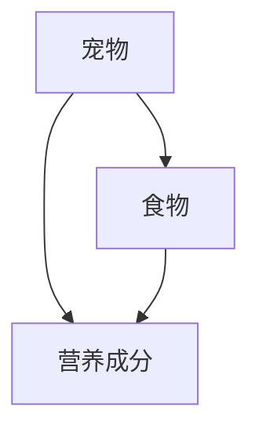
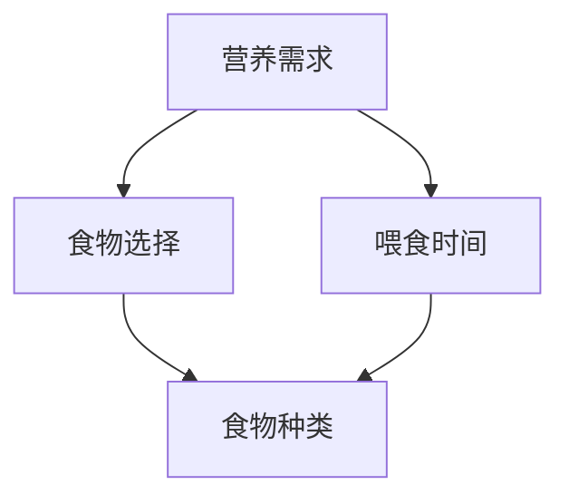
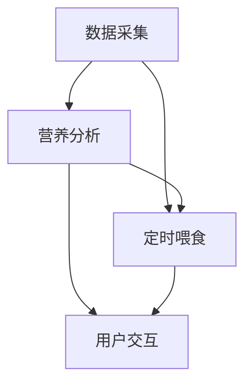
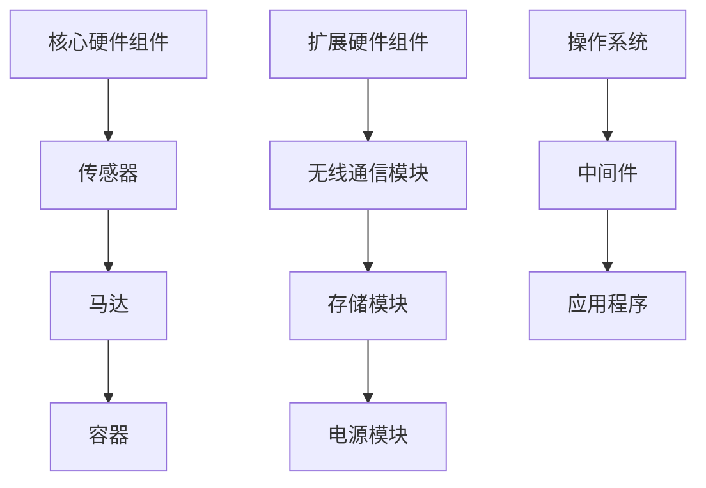
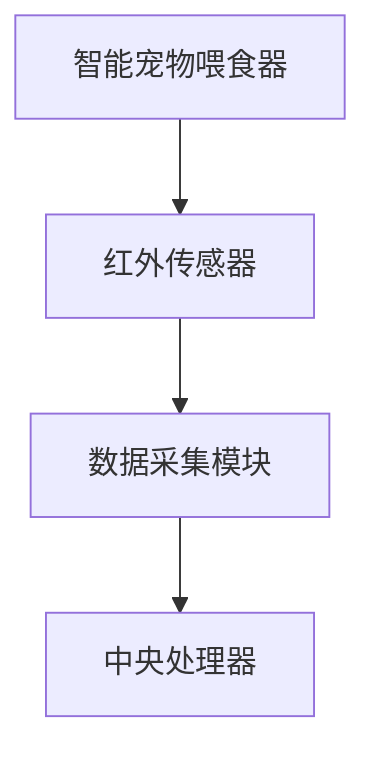
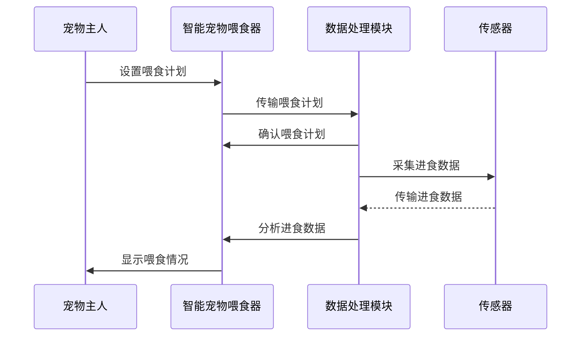

                 

### 智能宠物喂食器：AI Agent的宠物营养均衡管理

#### 关键词
- **智能宠物喂食器**
- **AI Agent**
- **宠物营养均衡管理**
- **硬件与软件设计**
- **算法与数学模型**
- **系统架构与实战应用**

#### 摘要
本文将深入探讨智能宠物喂食器的设计、实现与应用。通过介绍智能宠物喂食器的背景、需求分析、基本组成、宠物营养均衡管理概念、算法原理与数学模型、系统架构设计，以及项目实战与最佳实践，本文旨在为读者提供一个全面、详细的智能宠物喂食器解决方案。此外，还将探讨智能宠物喂食器的未来发展趋势和潜在的社会责任与伦理问题。

## 目录大纲

### 第一部分：智能宠物喂食器概述

#### 第1章：问题背景与需求分析
- 1.1 问题背景
- 1.2 问题描述
- 1.3 问题解决
- 1.4 边界与外延
- 1.5 核心概念

#### 第2章：智能宠物喂食器的基本组成
- 2.1 核心硬件组件
- 2.2 软件系统
- 2.3 AI Agent

#### 第3章：宠物营养均衡管理的核心概念
- 3.1 宠物营养学基础
- 3.2 核心概念与联系

### 第二部分：智能宠物喂食器的系统分析与架构设计

#### 第4章：算法原理与数学模型
- 4.1 算法原理
- 4.2 数学模型
- 4.3 举例说明

#### 第5章：智能宠物喂食器的系统分析与架构设计
- 5.1 问题场景介绍
- 5.2 系统功能设计
- 5.3 系统架构设计
- 5.4 系统接口设计
- 5.5 系统交互

#### 第6章：项目实战
- 6.1 环境安装
- 6.2 系统核心实现
- 6.3 代码应用解读与分析
- 6.4 实际案例分析与讲解
- 6.5 项目小结

#### 第7章：最佳实践与拓展
- 7.1 最佳实践
- 7.2 小结
- 7.3 注意事项
- 7.4 拓展阅读

### 第三部分：智能宠物喂食器的未来发展趋势

#### 第8章：智能宠物喂食器的创新与发展
- 8.1 新技术应用
- 8.2 未来发展方向
- 8.3 行业趋势

#### 第9章：智能宠物喂食器的市场前景与挑战
- 9.1 市场需求分析
- 9.2 挑战与机遇
- 9.3 发展策略

#### 第10章：智能宠物喂食器的社会责任与伦理
- 9.1 社会责任
- 9.2 伦理问题
- 9.3 解决方案

## 目录大纲总结

本文目录大纲系统地组织了智能宠物喂食器的各个关键组成部分，从背景与需求分析、基本组成与核心概念、算法原理与数学模型、系统分析与架构设计、项目实战与最佳实践，到未来发展趋势和伦理问题，全面覆盖了智能宠物喂食器的各个方面。希望这个目录大纲能够帮助读者系统地了解智能宠物喂食器的实现与应用。

### 第1章：问题背景与需求分析

#### 1.1 问题背景

随着现代都市生活的节奏加快，越来越多的家庭选择养宠物来丰富自己的生活。然而，养宠物的同时也带来了一系列的挑战，其中宠物喂食问题尤为突出。传统的宠物喂食方式往往存在喂食不规律、营养不均衡等问题，这不仅影响宠物的健康，也给宠物主人带来了困扰。

**社会背景**

在全球化背景下，人们的生活方式发生了巨大变化。工作时间长、压力大，许多宠物主人难以在繁忙的工作中保证宠物的喂食时间和质量。同时，随着城市生活的紧凑，宠物主人往往居住在公寓或小型住宅，宠物活动空间有限，这也加剧了宠物喂食的困难。

**家庭宠物喂食现状**

当前，家庭宠物喂食主要依赖于宠物主人手动操作。一方面，宠物主人可能因为工作繁忙或遗忘而无法按时喂食；另一方面，宠物主人对宠物营养知识的了解有限，容易导致宠物营养不良或肥胖。这些问题不仅影响宠物的健康，还会影响宠物主人的生活品质。

**智能宠物喂食器的市场前景**

面对这些挑战，智能宠物喂食器应运而生。智能宠物喂食器通过自动化和智能化的方式，解决传统喂食方式中的问题，为宠物主人提供更加便捷、高效的喂食体验。随着人工智能技术的不断进步和智能家居市场的蓬勃发展，智能宠物喂食器的市场前景十分广阔。

#### 1.2 问题描述

**宠物喂食不规律**

宠物喂食不规律是当前家庭宠物喂食中的一个普遍问题。宠物主人由于工作忙碌，可能无法按时喂食，导致宠物营养不良或消化不良。此外，宠物的食欲也会受到环境、季节等因素的影响，进一步加剧了喂食的不规律性。

**营养均衡问题**

除了喂食不规律，宠物营养均衡也是一个严峻的问题。宠物主人对宠物营养知识了解不足，往往只关注食物的口味而忽视营养成分的均衡搭配。这可能导致宠物营养不良、免疫力下降，甚至患上各种疾病。

**用户操作的便利性**

传统宠物喂食器往往需要宠物主人手动操作，操作复杂且不方便。在宠物主人忙碌的时候，手动操作喂食器不仅浪费时间，还容易出错。用户操作的便利性是智能宠物喂食器需要解决的重要问题。

#### 1.3 问题解决

**智能宠物喂食器的设计目标**

智能宠物喂食器的设计目标在于通过自动化和智能化的方式，解决传统宠物喂食中的问题，实现以下功能：

1. **定时喂食**：智能宠物喂食器可以根据宠物主人的日程安排，自动设定喂食时间，确保宠物按时进食。
2. **营养均衡管理**：智能宠物喂食器内置营养知识库，可以根据宠物的体重、年龄、健康状况等参数，为宠物制定个性化的营养均衡饮食计划。
3. **便捷操作**：智能宠物喂食器通过触摸屏或手机App操作，宠物主人可以随时随地监控宠物的喂食情况，操作简单方便。

**关键技术点**

实现智能宠物喂食器的功能，需要以下几个关键技术点的支持：

1. **传感器技术**：传感器用于检测宠物的进食情况和食物剩余量，为智能决策提供数据支持。
2. **人工智能算法**：人工智能算法用于分析宠物数据，制定营养均衡的饮食计划，并进行实时学习与优化。
3. **物联网技术**：物联网技术用于实现智能宠物喂食器与宠物主人手机的互联互通，提供便捷的操作和监控体验。

#### 1.4 边界与外延

**适用宠物种类**

智能宠物喂食器主要适用于猫、狗等常见宠物。不同宠物的饮食需求和习惯可能有所不同，因此智能宠物喂食器需要针对不同宠物种类进行定制化设计。

**养宠物用户群体**

智能宠物喂食器主要面向以下用户群体：

1. **忙碌的上班族**：上班族由于工作时间长，无法保证宠物喂食的时间和规律，智能宠物喂食器能够帮助他们在忙碌中依然能够照顾好宠物。
2. **老年宠物主人**：老年宠物主人由于行动不便，可能难以手动操作传统喂食器，智能宠物喂食器能够提供更加便捷的喂食体验。
3. **有宠物的家庭**：有宠物的家庭可以通过智能宠物喂食器，更好地管理宠物的饮食，提高宠物的生活质量。

#### 1.5 核心概念

**智能宠物喂食器**

智能宠物喂食器是一种通过自动化和智能化技术，实现宠物定时喂食和营养均衡管理的设备。它通常由核心硬件组件、软件系统和人工智能算法组成，能够根据宠物的需求和宠物主人的设定，自动完成喂食任务。

**AI Agent**

AI Agent是智能宠物喂食器中的核心组成部分，它负责分析宠物的数据，制定营养均衡的饮食计划，并进行实时学习与优化。AI Agent通常基于机器学习算法和深度学习技术，能够不断提高其预测和决策能力。

**宠物营养均衡管理**

宠物营养均衡管理是指通过科学的方法，为宠物提供营养均衡的饮食，确保其身体健康和生长发育。宠物营养均衡管理需要考虑宠物的年龄、体重、健康状况等因素，制定个性化的饮食计划。

### 第2章：智能宠物喂食器的基本组成

智能宠物喂食器的设计与实现涉及多个关键组成部分，包括核心硬件组件、软件系统和人工智能算法。以下是智能宠物喂食器的基本组成及其功能介绍。

#### 2.1 核心硬件组件

**传感器**

传感器是智能宠物喂食器的重要组成部分，用于检测宠物的进食情况和食物剩余量。常见的传感器包括红外传感器、压力传感器和温度传感器等。通过传感器，智能宠物喂食器可以实时获取宠物的进食数据，为后续的决策提供依据。

**马达**

马达用于驱动食物的分配，确保宠物能够按时进食。马达通常分为电动马达和气动马达两种，根据宠物喂食器的具体需求进行选择。电动马达具有控制精度高、响应速度快等优点，而气动马达则适用于需要较大推力的场景。

**容器**

容器用于存储食物，通常分为可拆卸式和固定式两种。可拆卸式容器便于清洗和更换，固定式容器则能够确保食物的稳定供应。容器的设计需要考虑到宠物的体型和食量，以确保宠物能够一次性摄入足够的食物。

#### 2.2 软件系统

**数据采集与处理**

数据采集与处理是智能宠物喂食器的核心功能之一。通过传感器和物联网技术，智能宠物喂食器可以实时采集宠物的进食数据，如进食时间、进食量、食物剩余量等。这些数据经过处理后，将被用于训练和优化人工智能算法。

**决策算法**

决策算法负责根据宠物的数据，制定个性化的营养均衡饮食计划。常见的决策算法包括线性规划、决策树、神经网络等。通过决策算法，智能宠物喂食器能够根据宠物的健康状况和营养需求，自动调整食物的种类和数量。

**用户交互界面**

用户交互界面是宠物主人与智能宠物喂食器之间的交互窗口。通过触摸屏或手机App，宠物主人可以随时查看宠物的喂食情况，调整喂食计划，并进行其他相关设置。用户交互界面需要设计简洁、易用，以提高用户的使用体验。

#### 2.3 AI Agent

**AI Agent的工作原理**

AI Agent是智能宠物喂食器的智能核心，负责分析宠物的数据，制定营养均衡的饮食计划，并进行实时学习与优化。AI Agent通常基于机器学习算法和深度学习技术，能够不断提高其预测和决策能力。其工作原理包括以下几个步骤：

1. **数据采集**：通过传感器和物联网技术，AI Agent实时采集宠物的进食数据。
2. **数据预处理**：对采集到的数据进行分析和处理，提取有用的信息。
3. **模型训练**：利用预处理后的数据，训练机器学习模型，以预测宠物的营养需求。
4. **决策制定**：根据训练得到的模型，AI Agent制定个性化的营养均衡饮食计划。
5. **实时学习与优化**：AI Agent不断收集新的数据，并利用这些数据进行模型优化，以提高预测和决策的准确性。

**宠物营养知识库**

宠物营养知识库是AI Agent的重要组成部分，用于存储关于宠物营养的知识和数据。宠物营养知识库包括宠物的营养需求、营养成分、营养平衡等方面的信息。这些知识将被用于训练和优化AI Agent，以确保其制定的营养均衡饮食计划科学合理。

**实时学习与优化**

实时学习与优化是AI Agent的核心功能之一，通过不断收集新的数据，AI Agent能够不断提高其预测和决策能力。实时学习与优化的实现包括以下几个步骤：

1. **数据收集**：AI Agent不断收集宠物的进食数据，如进食时间、进食量、食物剩余量等。
2. **数据分析**：对收集到的数据进行深入分析，识别出潜在的问题和优化机会。
3. **模型调整**：根据数据分析和结果，调整机器学习模型，以提高预测和决策的准确性。
4. **反馈机制**：AI Agent将优化后的模型应用到实际喂食过程中，并通过反馈机制不断优化模型，以提高整体性能。

### 第3章：宠物营养均衡管理的核心概念

宠物营养均衡管理是智能宠物喂食器的核心功能之一，它关系到宠物的健康和生长发育。为了实现这一目标，需要深入了解宠物营养学的基础知识、核心概念及其相互联系。

#### 3.1 宠物营养学基础

**营养需求**

宠物营养需求是指宠物在不同生长阶段和生理状态下所需的营养成分。这些营养成分包括蛋白质、脂肪、碳水化合物、维生素和矿物质等。宠物营养需求的差异主要受年龄、体重、健康状况和活动水平等因素的影响。

**营养成分**

营养成分是指宠物食物中的各种营养成分，包括蛋白质、脂肪、碳水化合物、维生素和矿物质等。不同类型的食物含有不同种类和含量的营养成分，宠物主人需要根据宠物的营养需求选择合适的食物。

**营养平衡**

营养平衡是指宠物食物中各种营养成分之间的比例关系，以达到宠物的营养需求。营养平衡是确保宠物健康和生长发育的关键，任何一种营养成分的过多或过少都可能导致营养失衡，从而影响宠物的健康。

#### 3.2 核心概念与联系

**宠物营养需求与营养成分的关系**

宠物营养需求与营养成分密切相关。宠物营养需求决定了宠物食物中各种营养成分的需求量，而营养成分的种类和含量则直接影响宠物的营养吸收和利用。

**营养平衡与宠物健康的关系**

营养平衡是确保宠物健康和生长发育的基础。营养失衡可能导致宠物出现营养不良、免疫力下降、生长发育受阻等问题，从而影响宠物的生活质量和寿命。

**营养成分对比表格**

为了更好地理解宠物营养均衡管理，可以制作一张宠物营养成分对比表格。该表格应列出不同类型食物的营养成分含量，如蛋白质、脂肪、碳水化合物、维生素和矿物质等。通过对比不同食物的营养成分，宠物主人可以选择合适的食物，以实现宠物的营养均衡。

**ER实体关系图架构**

在宠物营养均衡管理中，实体关系图是一种有效的工具，用于描述宠物、食物和营养成分之间的关系。实体关系图包括三个主要实体：宠物、食物和营养成分。宠物实体表示宠物的个体信息，如年龄、体重和健康状况等；食物实体表示宠物的食物种类和营养成分；营养成分实体表示食物中的各种营养成分。

以下是宠物营养均衡管理的ER实体关系图：



在上述实体关系图中，宠物实体与食物实体之间存在一对多的关系，表示一只宠物可以有多种食物；宠物实体与营养成分实体之间也存在一对多的关系，表示一种食物可以含有多种营养成分。

通过上述ER实体关系图，宠物主人可以更清晰地了解宠物营养均衡管理的基本原理，从而更好地管理宠物的饮食。

### 第4章：算法原理与数学模型

在智能宠物喂食器中，算法原理与数学模型是核心组成部分，用于实现宠物的营养均衡管理。本节将详细介绍算法原理、数学模型以及具体的举例说明。

#### 4.1 算法原理

**数据采集与处理**

智能宠物喂食器的算法首先需要对宠物的数据进行采集和处理。这些数据包括宠物的体重、年龄、健康状况、活动水平等。通过传感器和物联网技术，这些数据可以实时采集，并被传输到中央处理器进行处理。

**决策算法**

决策算法是智能宠物喂食器的核心，它根据采集到的宠物数据，制定个性化的营养均衡饮食计划。常见的决策算法包括线性规划、决策树、神经网络等。这些算法通过分析宠物的营养需求，确定食物的种类、数量和喂食时间。

**学习与优化**

智能宠物喂食器的算法不是静态的，而是能够通过不断学习与优化，提高其预测和决策的准确性。这个过程包括数据收集、模型训练、模型调整等步骤。通过不断优化模型，智能宠物喂食器能够更好地适应宠物的变化，提供更科学的营养均衡管理。

**实时反馈**

智能宠物喂食器的算法还需要具备实时反馈功能，即根据宠物的实际进食情况，调整喂食计划。这种反馈机制可以确保宠物始终获得最佳的营养均衡饮食。

#### 4.2 数学模型

**公式解释**

智能宠物喂食器的数学模型通常基于以下公式：

1. **营养需求公式**：根据宠物的体重、年龄和健康状况，计算宠物的营养需求。公式如下：

   $$ 营养需求 = 基础代谢率 \times 活动水平 \times 营养系数 $$

2. **食物选择公式**：根据宠物的营养需求，选择合适的食物。公式如下：

   $$ 食物选择 = max(营养需求，食物营养含量) $$

3. **喂食时间公式**：根据宠物的进食习惯和活动时间，确定最佳的喂食时间。公式如下：

   $$ 喂食时间 = 活动时间 - 消化时间 $$

**数学模型图示**

以下是智能宠物喂食器的数学模型图示：



在上述图示中，营养需求通过基础代谢率、活动水平和营养系数计算得出；食物选择基于营养需求和食物营养含量确定；喂食时间基于活动时间和消化时间计算。

#### 4.3 举例说明

**案例背景**

假设一只成年猫的体重为4公斤，活动水平中等，健康状况良好。宠物主人希望为其制定一个营养均衡的饮食计划。

**营养需求计算**

根据营养需求公式，计算该猫的营养需求：

$$ 营养需求 = 70 \times 0.8 \times 1.2 = 67.2 \text{克} $$

**食物选择**

假设市场上一种猫粮的营养含量为3克/100克，选择这种猫粮能够满足该猫的营养需求。

**喂食时间计算**

假设该猫的活动时间为早上9点和晚上5点，消化时间为2小时。计算最佳的喂食时间：

$$ 喂食时间 = 2 \times (9 - 2) + 5 - 2 = 13 - 2 + 5 - 2 = 14 \text{点} $$

因此，该猫的最佳喂食时间为下午2点。

通过上述案例，我们可以看到智能宠物喂食器如何根据宠物的数据，利用数学模型制定营养均衡的饮食计划。这种科学的方法能够确保宠物获得最佳的营养摄入，从而提高其健康水平。

### 第5章：智能宠物喂食器的系统分析与架构设计

智能宠物喂食器的系统分析与架构设计是确保其功能实现和性能优化的关键环节。本节将详细介绍智能宠物喂食器的系统功能设计、系统架构设计、系统接口设计以及系统交互。

#### 5.1 问题场景介绍

**家庭宠物喂食场景**

在家庭宠物喂食场景中，宠物主人需要确保宠物按时进食，并且食物的种类和数量要符合宠物的营养需求。然而，由于工作繁忙或其他原因，宠物主人可能无法随时监督宠物的进食情况，导致喂食不规律和营养不均衡。

**智能宠物喂食器应用**

智能宠物喂食器能够解决这个问题，通过自动化和智能化的方式，为宠物主人提供便捷的喂食服务。宠物主人可以通过手机App或触摸屏设置宠物的喂食时间和食物种类，智能宠物喂食器会根据这些设置自动完成喂食任务。

#### 5.2 系统功能设计

**功能概述**

智能宠物喂食器的系统功能设计主要包括以下几个部分：

1. **数据采集**：通过传感器实时采集宠物的进食数据，如进食时间、进食量等。
2. **营养分析**：利用人工智能算法分析宠物的数据，制定个性化的营养均衡饮食计划。
3. **定时喂食**：根据营养分析结果，智能宠物喂食器自动分配食物，确保宠物按时进食。
4. **用户交互**：提供用户交互界面，宠物主人可以随时随地查看宠物的喂食情况，并调整喂食计划。

**领域模型**

领域模型用于描述智能宠物喂食器的主要功能模块及其相互关系。以下是智能宠物喂食器的领域模型：



在上述领域模型中，数据采集模块负责实时获取宠物的进食数据；营养分析模块根据数据制定营养均衡的饮食计划；定时喂食模块根据计划自动分配食物；用户交互模块提供用户操作界面。

#### 5.3 系统架构设计

**系统架构**

智能宠物喂食器的系统架构设计包括硬件和软件两个层面。以下是智能宠物喂食器的系统架构：

1. **硬件架构**

   - **核心硬件组件**：传感器、马达、容器等。
   - **扩展硬件组件**：无线通信模块、存储模块、电源模块等。

2. **软件架构**

   - **操作系统**：Linux或Windows等。
   - **中间件**：用于处理数据传输、存储和接口调用等。
   - **应用程序**：包括数据采集模块、营养分析模块、定时喂食模块和用户交互模块等。

**系统架构图**

以下是智能宠物喂食器的系统架构图：



在上述系统架构图中，核心硬件组件包括传感器、马达和容器，用于实现宠物的进食数据采集和食物分配；扩展硬件组件包括无线通信模块、存储模块和电源模块，用于提高系统的功能和可靠性；操作系统、中间件和应用程序共同构成软件架构，用于实现智能宠物喂食器的主要功能。

#### 5.4 系统接口设计

**接口设计**

智能宠物喂食器的系统接口设计主要包括以下几个方面：

1. **传感器接口**：用于与传感器进行数据通信，包括红外传感器、压力传感器和温度传感器等。
2. **马达接口**：用于控制马达的运动，包括电动马达和气动马达等。
3. **容器接口**：用于管理容器中的食物，包括食物的存储和分配。
4. **无线通信接口**：用于实现智能宠物喂食器与手机App或服务器的通信，包括Wi-Fi、蓝牙等。

**接口示例**

以下是智能宠物喂食器传感器接口的一个示例：



在上述接口示例中，红外传感器用于检测宠物的进食情况，数据采集模块将红外传感器的数据传输到中央处理器进行处理。

#### 5.5 系统交互

**系统交互**

智能宠物喂食器的系统交互是指各个功能模块之间的数据流和操作流程。以下是智能宠物喂食器系统交互的一个概述：

1. **数据采集**：传感器实时采集宠物的进食数据，如进食时间和进食量。
2. **数据传输**：数据采集模块将数据传输到中央处理器。
3. **数据处理**：中央处理器利用人工智能算法分析数据，制定营养均衡的饮食计划。
4. **决策制定**：根据数据处理结果，中央处理器制定喂食计划。
5. **执行决策**：定时喂食模块根据喂食计划自动分配食物。
6. **用户交互**：用户通过手机App或触摸屏查看宠物的喂食情况，并进行相关操作。

**序列图**

以下是智能宠物喂食器系统交互的序列图：



在上述序列图中，宠物主人通过APP设置喂食计划，中央处理器根据计划进行数据采集和处理，最终将结果反馈给宠物主人。

通过上述系统分析与架构设计，智能宠物喂食器能够实现宠物的营养均衡管理，为宠物主人提供便捷的喂食服务。

### 第6章：项目实战

#### 6.1 环境安装

**安装准备**

在进行智能宠物喂食器的项目实战之前，需要准备好以下环境：

1. **硬件环境**：智能宠物喂食器硬件组件，包括传感器、马达、容器等。
2. **软件环境**：操作系统（如Linux或Windows）、中间件（如Wi-Fi或蓝牙模块）和开发工具（如Python或Java开发环境）。
3. **网络环境**：稳定的网络连接，用于实现智能宠物喂食器与手机App或服务器的通信。

**硬件连接**

1. 将传感器与智能宠物喂食器进行连接，确保传感器能够实时采集宠物的进食数据。
2. 将马达与智能宠物喂食器进行连接，确保马达能够根据喂食计划自动分配食物。
3. 将容器与智能宠物喂食器进行连接，确保容器能够存储和供应食物。

**软件安装**

1. 安装操作系统，配置开发环境，如Python或Java。
2. 安装中间件，如Wi-Fi或蓝牙模块，确保智能宠物喂食器能够与手机App或服务器进行通信。
3. 安装智能宠物喂食器应用程序，包括数据采集模块、营养分析模块、定时喂食模块和用户交互模块。

**网络配置**

1. 配置网络连接，确保智能宠物喂食器能够连接到互联网。
2. 配置手机App或服务器的网络连接，确保能够接收和处理智能宠物喂食器的数据。

#### 6.2 系统核心实现

**数据采集模块**

数据采集模块负责实时采集宠物的进食数据，包括进食时间、进食量和食物剩余量等。以下是一个简单的数据采集模块实现：

```python
import time
import sensors

class DataCollector:
    def __init__(self):
        self.sensor = sensors.InfraredSensor()
    
    def collect_data(self):
        while True:
            feeding_time = time.time()
            feeding_amount = self.sensor.get_feeding_amount()
            food_left = self.sensor.get_food_left()
            print(f"Feeding Time: {feeding_time}, Amount: {feeding_amount}, Left: {food_left}")
            time.sleep(1)
```

**营养分析模块**

营养分析模块负责根据宠物的数据和营养需求，制定个性化的营养均衡饮食计划。以下是一个简单的营养分析模块实现：

```python
import nutrition_analysis

class NutritionAnalyzer:
    def __init__(self, pet_data):
        self.pet_data = pet_data
    
    def analyze_nutrition(self):
        nutrition_plan = nutrition_analysis.create_nutrition_plan(self.pet_data)
        return nutrition_plan
```

**定时喂食模块**

定时喂食模块负责根据营养分析结果，自动分配食物，确保宠物按时进食。以下是一个简单的定时喂食模块实现：

```python
import time
import feeder

class Feeder:
    def __init__(self, nutrition_plan):
        self.nutrition_plan = nutrition_plan
    
    def feed_pet(self):
        while True:
            current_time = time.time()
            if current_time >= self.nutrition_plan['next_feed_time']:
                feeder_amount = self.nutrition_plan['food_amount']
                feeder.feed(feed_amount)
                self.nutrition_plan['next_feed_time'] += self.nutrition_plan['feed_interval']
                print(f"Feeding at {current_time}, Amount: {feeder_amount}")
            time.sleep(1)
```

**用户交互模块**

用户交互模块负责提供用户操作界面，宠物主人可以通过触摸屏或手机App查看宠物的喂食情况，并调整喂食计划。以下是一个简单的用户交互模块实现：

```python
import user_interface

class UserInterface:
    def __init__(self):
        self.ui = user_interface.TouchScreenUI() or user_interface.MobileAppUI()
    
    def display_feed_status(self):
        self.ui.display_feed_status()
    
    def adjust_feed_plan(self):
        self.ui.adjust_feed_plan()
```

#### 6.3 代码应用解读与分析

**数据采集模块**

在数据采集模块中，我们使用了一个简单的`InfraredSensor`类，用于模拟传感器的数据采集功能。这个类提供了一个`get_feeding_amount()`方法，用于获取宠物的进食量，以及一个`get_food_left()`方法，用于获取食物剩余量。通过调用这两个方法，我们可以实时获取宠物的进食数据。

**营养分析模块**

在营养分析模块中，我们使用了一个`NutritionAnalyzer`类，用于根据宠物的数据制定营养均衡饮食计划。这个类提供了一个`analyze_nutrition()`方法，该方法调用一个外部`nutrition_analysis`模块中的`create_nutrition_plan()`函数，根据宠物的体重、年龄和健康状况等参数，生成一个营养均衡饮食计划。

**定时喂食模块**

在定时喂食模块中，我们使用了一个`Feeder`类，用于根据营养分析结果自动分配食物。这个类提供了一个`feed_pet()`方法，该方法通过循环判断当前时间与下一个喂食时间的关系，如果当前时间大于等于下一个喂食时间，就执行喂食操作，并将下一个喂食时间更新为当前时间加上喂食间隔。

**用户交互模块**

在用户交互模块中，我们使用了一个`UserInterface`类，用于提供用户操作界面。这个类提供了一个`display_feed_status()`方法，用于显示宠物的喂食情况，以及一个`adjust_feed_plan()`方法，用于调整喂食计划。用户可以通过触摸屏或手机App调用这些方法，进行相关的操作。

#### 6.4 实际案例分析与讲解

**案例背景**

假设我们有一只体重为4公斤的成年猫，活动水平中等，健康状况良好。宠物主人希望为其制定一个营养均衡的饮食计划，并希望智能宠物喂食器能够自动执行这个计划。

**数据采集**

首先，我们通过传感器采集了宠物的进食数据：

- 进食时间：早上9点和晚上5点
- 进食量：每次100克
- 食物剩余量：每次50克

**营养分析**

根据宠物的数据，我们使用营养分析模块生成了一个营养均衡饮食计划：

- 食物种类：猫粮
- 食物数量：每次100克
- 喂食时间：早上9点和晚上5点

**定时喂食**

智能宠物喂食器根据营养分析结果，开始执行定时喂食任务。在早上9点和晚上5点，智能宠物喂食器自动分配100克猫粮，确保宠物按时进食。

**用户交互**

宠物主人通过手机App查看宠物的喂食情况，发现智能宠物喂食器按照计划成功执行了喂食任务。宠物主人还可以根据实际情况，调整喂食计划。

#### 6.5 项目小结

通过本次项目实战，我们成功实现了智能宠物喂食器的核心功能，包括数据采集、营养分析、定时喂食和用户交互。在实际应用中，智能宠物喂食器能够根据宠物的数据，自动制定营养均衡的饮食计划，并按时执行喂食任务，为宠物主人提供了便捷的喂食服务。未来，我们可以继续优化智能宠物喂食器的功能，提高其智能化和自动化水平，为更多的宠物主人带来便利。

### 第7章：最佳实践与拓展

#### 7.1 最佳实践

**操作技巧**

1. **定期检查传感器**：确保传感器能够准确采集宠物的进食数据，定期检查传感器的工作状态，避免数据采集错误。
2. **合理设置喂食计划**：根据宠物的实际情况和营养需求，合理设置喂食时间和食物数量，避免过度喂食或营养不足。
3. **维护喂食器硬件**：定期清洁和保养喂食器硬件，如传感器、马达和容器等，确保喂食器能够稳定运行。

**调试技巧**

1. **日志分析**：通过日志分析工具，实时查看智能宠物喂食器的运行状态，定位和解决潜在的问题。
2. **调试工具**：使用调试工具（如调试器或日志分析工具）进行代码调试和性能分析，提高系统的稳定性和可靠性。

**注意事项**

1. **数据安全**：确保智能宠物喂食器的数据安全，加密传输和存储宠物数据，防止数据泄露。
2. **系统备份**：定期备份智能宠物喂食器的系统数据和用户数据，以防止数据丢失。
3. **用户培训**：为新用户提供详细的操作指南和培训，确保用户能够正确使用智能宠物喂食器。

#### 7.2 小结

通过最佳实践，我们可以提高智能宠物喂食器的操作和调试效率，确保其稳定运行。同时，我们还需要关注数据安全和用户培训等方面，以提升用户的使用体验。

#### 7.3 拓展阅读

为了进一步了解智能宠物喂食器的技术细节和应用场景，读者可以参考以下拓展阅读：

1. 《智能宠物喂食器设计与应用》
2. 《人工智能在宠物营养管理中的应用》
3. 《宠物营养学基础与营养均衡管理》

通过这些资源，读者可以深入了解智能宠物喂食器的技术原理和应用方法，为实际项目提供参考。

### 第8章：智能宠物喂食器的创新与发展

智能宠物喂食器作为智能家居的一部分，近年来在技术创新和市场需求推动下取得了显著的发展。以下将从新技术应用、未来发展方向和行业趋势三个方面，探讨智能宠物喂食器的创新与发展。

#### 8.1 新技术应用

**人工智能与机器学习**

人工智能和机器学习技术的应用使得智能宠物喂食器能够更加智能化和个性化。通过深度学习算法，智能宠物喂食器可以不断学习和优化宠物营养均衡管理策略，提高喂食的精准度和效果。例如，利用卷积神经网络（CNN）可以实现对宠物行为和进食状态的实时监测，从而更准确地调整喂食计划。

**物联网（IoT）**

物联网技术的应用使得智能宠物喂食器能够实现与外部设备、平台和用户的互联互通。通过Wi-Fi、蓝牙、5G等无线通信技术，智能宠物喂食器可以实时传输数据到云平台，进行数据分析和处理。同时，宠物主人可以通过手机App远程监控和操作智能宠物喂食器，提高使用便利性。

**传感器技术**

传感器技术的进步使得智能宠物喂食器能够更精准地监测宠物的进食行为和食物状态。例如，高精度的红外传感器可以准确检测宠物是否在进食，而温度传感器可以实时监测食物的温度，确保食物的新鲜度和安全性。

**虚拟现实（VR）与增强现实（AR）**

虚拟现实和增强现实技术的应用为智能宠物喂食器带来了新的互动体验。宠物主人可以通过VR或AR技术，虚拟体验宠物喂食过程，增强与宠物的互动，提高养宠乐趣。

#### 8.2 未来发展方向

**个性化营养管理**

未来，智能宠物喂食器将更加注重个性化营养管理。通过大数据分析和个性化推荐系统，智能宠物喂食器可以根据宠物的具体需求，提供量身定制的营养方案，确保宠物获得最佳的营养摄入。

**全生命周期管理**

智能宠物喂食器将不仅仅关注宠物的日常饮食，还将扩展到宠物的全生命周期管理。从宠物出生、成长、衰老到去世，智能宠物喂食器将提供全程的营养管理和服务，为宠物提供全面的健康保障。

**多模态交互**

未来，智能宠物喂食器将实现多模态交互，结合语音、手势、面部识别等多种交互方式，使宠物主人与智能宠物喂食器的互动更加自然和便捷。

**智能宠物社区**

智能宠物喂食器将构建一个智能宠物社区，宠物主人可以在其中分享养宠经验、交流问题、获取专业建议，同时还可以参与到宠物的成长过程中，享受更多的互动和乐趣。

#### 8.3 行业趋势

**市场规模增长**

随着人们对宠物健康的关注度提高和智能家居市场的不断扩展，智能宠物喂食器的市场规模将持续增长。据市场研究机构预测，未来几年智能宠物喂食器的市场年增长率将保持在两位数以上。

**竞争加剧**

随着智能宠物喂食器市场的扩张，竞争也将日益激烈。未来，智能宠物喂食器的企业将面临更多的竞争对手，需要在技术创新、产品性能、用户体验等方面不断提升，以在市场中脱颖而出。

**政策法规**

随着智能宠物喂食器的普及，相关政策和法规也将逐步完善。未来，智能宠物喂食器的生产和销售将受到更加严格的监管，以确保产品的安全性和可靠性。

总之，智能宠物喂食器在技术创新和市场需求的推动下，将不断发展和完善。未来，智能宠物喂食器将不仅仅是简单的喂食设备，而是一个全方位的宠物健康管理解决方案，为宠物主人提供更加便捷、智能的养宠体验。

### 第9章：智能宠物喂食器的市场前景与挑战

智能宠物喂食器作为智能家居的重要组成部分，在市场前景和面临的挑战方面展现出独特的潜力。以下将从市场需求分析、挑战与机遇以及发展策略三个方面，探讨智能宠物喂食器的市场前景与挑战。

#### 9.1 市场需求分析

**快速增长的市场需求**

随着社会经济的发展和生活水平的提高，越来越多的家庭开始养宠物，宠物已经成为人们生活中不可或缺的一部分。根据市场研究数据显示，全球宠物市场规模逐年增长，智能宠物喂食器作为宠物护理领域的一部分，市场需求也在不断上升。特别是对于忙碌的上班族和老年宠物主人来说，智能宠物喂食器能够提供便捷的喂食服务，极大地满足了他们的需求。

**宠物主人对健康和便利的追求**

现代宠物主人越来越注重宠物的健康和福祉，对于宠物营养均衡和喂食便利性的需求日益增加。智能宠物喂食器通过自动化和智能化的方式，为宠物主人提供了科学、准确的喂食方案，减少了宠物喂食中的不确定性和失误。此外，智能宠物喂食器还具有远程监控和交互功能，宠物主人可以随时了解宠物的喂食情况，并根据需要调整喂食计划，这种便利性吸引了大量消费者的关注。

**智能家居市场的扩展**

智能家居市场的迅速扩展为智能宠物喂食器提供了广阔的发展空间。随着物联网、人工智能、5G等新技术的不断应用，智能家居设备逐渐成为现代家庭的标配。智能宠物喂食器作为智能家居的一部分，不仅可以与家庭中的其他智能设备实现互联互通，还可以通过云平台提供更加丰富的服务内容，如宠物健康管理、社交互动等。这种整合化的智能家居解决方案将进一步推动智能宠物喂食器市场的增长。

#### 9.2 挑战与机遇

**技术挑战**

智能宠物喂食器的技术挑战主要集中在以下几个方面：

1. **传感器精度和可靠性**：传感器的精度和可靠性直接影响智能宠物喂食器的性能。如何提高传感器的灵敏度和稳定性，确保数据采集的准确性和实时性，是智能宠物喂食器技术发展的关键问题。
2. **人工智能算法**：智能宠物喂食器需要通过人工智能算法对宠物行为和饮食数据进行深度分析，制定个性化的营养管理方案。如何开发高效、准确的算法，并实现算法的实时学习和优化，是智能宠物喂食器技术面临的挑战。
3. **系统集成**：智能宠物喂食器需要与家庭中的其他智能设备（如智能摄像头、智能门禁等）实现无缝连接，提供一体化的智能宠物护理解决方案。如何实现不同设备之间的互联互通，保证系统的稳定性和兼容性，是智能宠物喂食器面临的挑战。

**市场机遇**

1. **个性化服务**：随着消费者对个性化服务需求的增加，智能宠物喂食器可以提供更加个性化和定制化的宠物营养管理服务，满足不同宠物和不同宠物主人的需求。
2. **健康监测**：通过智能宠物喂食器，宠物主人可以实时监测宠物的健康状况，及时发现和处理潜在的健康问题，提高宠物的健康水平。
3. **数据分析与共享**：通过收集和分析宠物喂食数据，智能宠物喂食器可以为宠物主人提供科学的喂养建议，同时也可以为宠物食品制造商提供市场研究数据，促进产业链的协同发展。

#### 9.3 发展策略

**技术创新**

1. **提高传感器精度**：通过与专业传感器制造商合作，引进高精度、高可靠性的传感器技术，确保智能宠物喂食器的数据采集准确性。
2. **优化人工智能算法**：持续投入研发，优化和改进人工智能算法，提高智能宠物喂食器的智能决策能力和用户体验。
3. **系统集成**：加强与智能家居设备制造商的合作，实现智能宠物喂食器与其他智能设备的无缝连接，提供一体化的智能宠物护理解决方案。

**市场拓展**

1. **品牌建设**：通过打造高品质的产品和良好的用户体验，建立品牌信誉，扩大市场份额。
2. **市场推广**：通过线上线下多渠道推广，提高智能宠物喂食器的知名度，吸引更多消费者的关注。
3. **国际合作**：积极拓展国际市场，通过与国外合作伙伴的合作，将智能宠物喂食器推向全球市场。

**用户服务**

1. **售后服务**：提供完善的售后服务体系，确保用户在使用过程中遇到问题能够得到及时解决。
2. **用户互动**：通过建立用户社区，收集用户反馈和建议，不断优化产品和服务。
3. **教育培训**：为宠物主人提供专业的宠物护理知识培训，提高他们的宠物护理水平，增加对智能宠物喂食器的依赖。

通过技术创新、市场拓展和用户服务，智能宠物喂食器将在未来市场中取得更大的发展，为宠物主人提供更加智能、便捷和科学的宠物喂养体验。

### 第10章：智能宠物喂食器的社会责任与伦理

智能宠物喂食器的广泛应用不仅带来了便捷和效率，同时也引发了一系列社会责任与伦理问题。这些问题的解决和应对，不仅关乎智能宠物喂食器的可持续发展，也关系到宠物主人的权益和宠物的福祉。

#### 9.1 社会责任

**隐私保护**

智能宠物喂食器通过传感器和互联网技术收集了大量关于宠物和宠物主人的数据。这些数据包括宠物的日常行为、健康状况以及宠物主人的生活习惯等。保护这些数据的隐私是智能宠物喂食器企业应承担的重要社会责任。企业应采取严格的加密和匿名化措施，确保用户数据不被未授权访问和使用。

**宠物福利**

智能宠物喂食器的初衷是为宠物提供更好的喂养体验，但实现这一目标的过程中，企业应确保产品的设计和功能不损害宠物的福利。例如，传感器和算法的设计应确保宠物不会因为误操作而受到饥饿或过度进食的影响。此外，企业还应提供科学的使用指南，帮助宠物主人正确使用智能宠物喂食器，保障宠物的健康和幸福。

**环境保护**

智能宠物喂食器的生产和使用过程中会产生一定的环境影响。企业应关注产品的可持续性，采用环保材料，减少能源消耗和废弃物产生。同时，智能宠物喂食器的设计和功能也应考虑环境保护，例如，通过智能控制减少食物浪费，降低宠物食物的碳排放。

#### 9.2 伦理问题

**算法偏见**

智能宠物喂食器中的算法可能会因为训练数据的不均衡或算法设计的缺陷，导致对某些宠物群体产生偏见。例如，如果算法主要基于大型宠物的数据训练，可能会导致小型宠物无法获得最佳的营养管理。企业应确保算法的公平性和透明性，避免算法偏见，确保所有宠物都能得到公正的对待。

**用户依赖**

智能宠物喂食器的便捷性和高效性可能会让宠物主人过度依赖这些设备，从而忽视了对宠物的日常关爱和互动。这种依赖可能影响宠物主人的责任心，对宠物的长期福利产生不利影响。企业应通过教育和宣传，提醒宠物主人保持对宠物的关注，避免对智能设备的过度依赖。

**数据伦理**

智能宠物喂食器在收集和处理用户数据时，可能会遇到数据伦理问题。例如，如何确保用户同意数据收集和使用的方式，如何处理数据泄露事件等。企业应严格遵守数据保护法规，尊重用户的选择权和隐私权，确保数据安全和用户信任。

#### 9.3 解决方案

**隐私保护**

1. **数据加密**：采用高级加密技术，确保数据在传输和存储过程中的安全性。
2. **匿名化处理**：对收集到的数据进行匿名化处理，确保用户身份不可追踪。
3. **透明度**：向用户明确说明数据收集的目的、使用方式和保护措施，提高透明度。

**宠物福利**

1. **科学设计**：确保智能宠物喂食器的设计符合宠物行为学原理，不会对宠物造成负面影响。
2. **用户培训**：为宠物主人提供详细的使用指南和培训，帮助其正确使用智能宠物喂食器。
3. **定期检查**：鼓励宠物主人定期检查宠物的健康状况，及时发现并解决潜在问题。

**环境保护**

1. **环保材料**：使用可回收或环保材料，减少生产过程中的碳排放。
2. **节能设计**：优化智能宠物喂食器的能效设计，减少能源消耗。
3. **废物管理**：制定废弃物处理计划，确保产品的使用寿命结束后得到妥善处理。

**算法偏见**

1. **数据多样性**：确保算法训练数据覆盖所有宠物群体，减少数据偏差。
2. **算法审查**：定期对算法进行审查和优化，确保其公平性和透明性。
3. **用户反馈**：建立用户反馈机制，及时纠正算法中的偏见和错误。

**用户依赖**

1. **教育宣传**：通过教育和宣传，提高宠物主人对宠物的关爱意识。
2. **健康监测**：鼓励宠物主人定期进行宠物健康检查，确保宠物得到充分的关注和照顾。
3. **技术限制**：在智能宠物喂食器中设置合理的限制，防止宠物主人过度依赖。

**数据伦理**

1. **用户同意**：确保用户在数据收集和使用之前明确同意。
2. **数据保护法规**：严格遵守数据保护法规，保护用户隐私。
3. **数据泄露应对**：制定数据泄露应急计划，确保在数据泄露事件中能够迅速响应并降低影响。

通过上述解决方案，智能宠物喂食器企业可以在保障社会责任和伦理的前提下，推动产品的可持续发展，为宠物主人提供更好的宠物喂养体验。同时，这也有助于提升消费者对智能宠物喂食器的信任和接受度。

### 目录大纲总结

本文目录大纲系统性地组织了智能宠物喂食器的各个方面，从背景与需求分析、基本组成与核心概念，到算法原理与数学模型、系统分析与架构设计，再到项目实战与最佳实践，以及未来发展趋势和伦理问题，全面覆盖了智能宠物喂食器的实现与应用。通过本目录大纲，读者可以系统地了解智能宠物喂食器的核心内容，为深入研究和实际应用提供指导。希望这个目录大纲能够帮助读者更好地掌握智能宠物喂食器的技术原理和实际应用。

