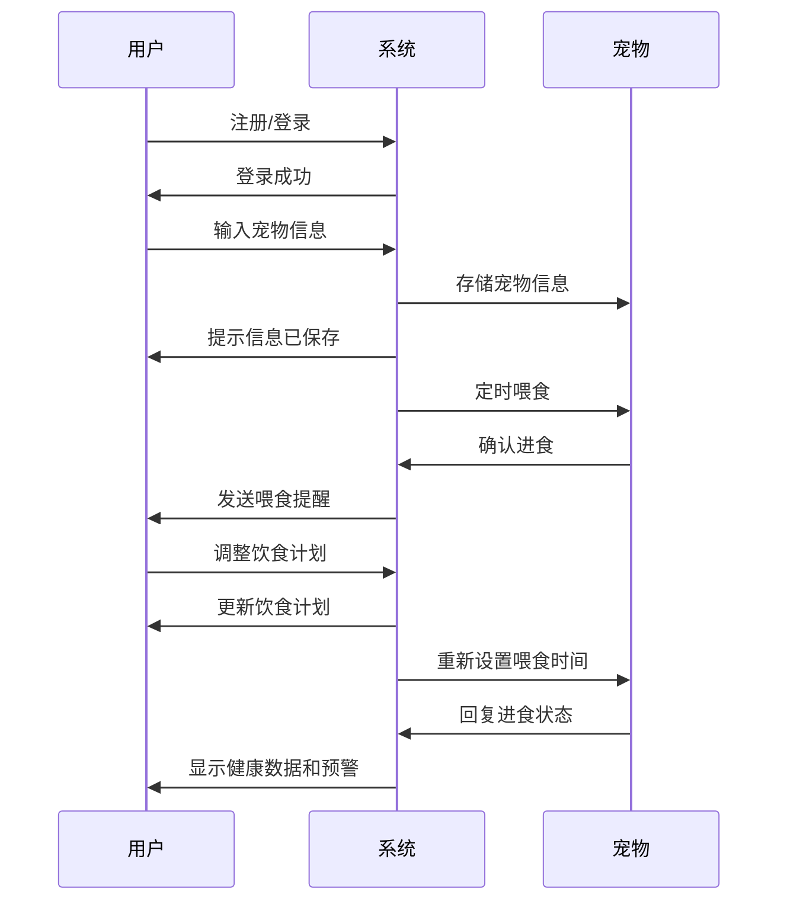

                 

### 引言

#### 1.1 问题背景

随着城市化进程的加速和人们生活节奏的加快，越来越多的人选择宠物作为自己的伴侣。宠物作为家庭成员的一部分，它们的饮食和健康成为宠物主人关注的重要问题。然而，在忙碌的工作和家庭生活中，宠物主人常常面临如何保证宠物按时进食、摄入适量食物以及避免饮食过量等挑战。

当前，市场上的宠物喂食器主要分为传统手动喂食器和智能自动喂食器两大类。传统手动喂食器虽然操作简便，但容易导致喂食时间和食量不均，长期下去可能对宠物的健康造成影响。智能自动喂食器则可以解决定时喂食的问题，但通常缺乏对宠物饮食的全面管理，无法根据宠物的实时状况进行智能调整。

此外，随着人工智能技术的快速发展，AI在宠物护理领域的应用潜力逐渐显现。AI可以实时监测宠物的饮食行为和健康状况，通过大数据分析和机器学习算法，为宠物主人提供个性化的饮食建议和健康预警。因此，开发一款结合智能喂食和AI监测的宠物饮食管理系统，不仅能够提高宠物的生活质量，还能减轻宠物主人的负担，具有重要的现实意义。

#### 1.2 核心概念

**智能宠物喂食器**：一种结合了智能控制技术和宠物营养学的喂食设备，能够根据宠物的需求和健康状态自动调整喂食量和时间。

**AI Agent**：一种人工智能系统，能够在没有人类直接干预的情况下自主完成特定任务，如监测宠物饮食行为、分析数据并提供饮食建议。

**宠物饮食管理系统**：综合利用智能宠物喂食器和AI Agent技术，对宠物的饮食进行全面管理的系统，旨在提高宠物健康和生活质量。

#### 1.3 书籍结构

本书分为四个部分，分别介绍智能宠物喂食器、AI Agent在宠物饮食管理中的应用、宠物饮食管理系统的设计与实现，以及相关的最佳实践和未来发展趋势。每个部分都包含具体章节，详细讲解相关技术原理和实践应用。

**目标读者**：

- 对人工智能和宠物护理感兴趣的科研人员和技术开发者。
- 想要为宠物提供更好饮食管理解决方案的宠物主人。
- 相关行业从业者，如宠物食品制造商、宠物医院和宠物用品零售商。

#### 1.4 本章小结

本章介绍了智能宠物喂食器、AI Agent和宠物饮食管理系统这三个核心概念，并探讨了它们在宠物护理领域的应用前景。通过本章的学习，读者可以初步了解本书的结构和内容，为后续章节的学习打下基础。

-------------------------------------------------------------------

### 第一部分: 引言

#### 第1章: 问题背景与核心概念

**2.1 问题背景**

随着城市化进程的加速和人们生活节奏的加快，越来越多的人选择宠物作为自己的伴侣。宠物作为家庭成员的一部分，它们的饮食和健康成为宠物主人关注的重要问题。然而，在忙碌的工作和家庭生活中，宠物主人常常面临如何保证宠物按时进食、摄入适量食物以及避免饮食过量等挑战。

当前，市场上的宠物喂食器主要分为传统手动喂食器和智能自动喂食器两大类。传统手动喂食器虽然操作简便，但容易导致喂食时间和食量不均，长期下去可能对宠物的健康造成影响。智能自动喂食器则可以解决定时喂食的问题，但通常缺乏对宠物饮食的全面管理，无法根据宠物的实时状况进行智能调整。

此外，随着人工智能技术的快速发展，AI在宠物护理领域的应用潜力逐渐显现。AI可以实时监测宠物的饮食行为和健康状况，通过大数据分析和机器学习算法，为宠物主人提供个性化的饮食建议和健康预警。因此，开发一款结合智能喂食和AI监测的宠物饮食管理系统，不仅能够提高宠物的生活质量，还能减轻宠物主人的负担，具有重要的现实意义。

#### 2.2 核心概念

**2.2.1 智能宠物喂食器**

**定义**：智能宠物喂食器是一种结合了智能控制技术和宠物营养学的喂食设备，能够根据宠物的需求和健康状态自动调整喂食量和时间。

**特点**：
- **定时喂食**：智能宠物喂食器可以设定喂食时间，确保宠物按时进食。
- **量食控制**：通过传感器和控制算法，智能宠物喂食器能够根据宠物的体型、年龄、健康状况等因素自动调整喂食量。
- **智能提醒**：智能宠物喂食器能够通过手机应用或语音助手提醒宠物主人喂食时间和食量。

**应用场景**：
- **忙碌的宠物主人**：对于经常外出或忙碌的宠物主人，智能宠物喂食器可以确保宠物按时进食，减少宠物因饮食不规律而引发的健康问题。
- **老年宠物**：老年宠物可能存在消化和代谢问题，智能宠物喂食器可以帮助宠物主人更好地控制其饮食。

**2.2.2 AI Agent**

**定义**：AI Agent是一种人工智能系统，能够在没有人类直接干预的情况下自主完成特定任务，如监测宠物饮食行为、分析数据并提供饮食建议。

**特点**：
- **自主性**：AI Agent可以自动执行任务，无需人工干预。
- **适应性**：AI Agent可以根据宠物的实时数据和行为模式不断学习和调整策略。
- **智能决策**：AI Agent能够利用大数据和机器学习算法，为宠物主人提供科学的饮食建议和健康预警。

**应用场景**：
- **个性化饮食管理**：AI Agent可以根据宠物的个体差异，提供个性化的饮食建议，帮助宠物主人更好地管理宠物的饮食。
- **健康监测**：AI Agent可以实时监测宠物的饮食行为和健康状况，及时发现异常并给出预警，提高宠物的健康水平。

**2.2.3 宠物饮食管理系统**

**定义**：宠物饮食管理系统是综合利用智能宠物喂食器和AI Agent技术，对宠物的饮食进行全面管理的系统，旨在提高宠物健康和生活质量。

**组成部分**：
- **智能宠物喂食器**：负责按时按量喂食宠物。
- **AI Agent**：负责监测宠物的饮食行为和健康状况，提供饮食建议和健康预警。

**功能**：
- **饮食计划制定**：根据宠物的年龄、体重、健康状况等因素，制定个性化的饮食计划。
- **饮食行为监测**：实时监测宠物的饮食行为，包括进食时间、食量、饮食习惯等。
- **健康数据分析**：分析宠物的饮食数据，提供健康预警和建议。
- **互动提醒**：通过手机应用或语音助手提醒宠物主人的饮食计划和健康预警。

**应用场景**：
- **家庭宠物**：宠物主人可以通过宠物饮食管理系统，随时了解宠物的饮食和健康状况，确保宠物健康成长。
- **宠物医院**：宠物医生可以通过宠物饮食管理系统，为宠物提供更加科学的饮食建议，提高治疗效果。

#### 2.3 总结

本章节介绍了智能宠物喂食器、AI Agent和宠物饮食管理系统的核心概念，并探讨了它们在宠物护理领域的应用前景。通过本章的学习，读者可以初步了解这三个概念的基本特点和应用场景，为后续章节的深入探讨打下基础。

在接下来的章节中，我们将进一步探讨智能宠物喂食器的工作原理、AI Agent在宠物饮食管理中的应用，以及宠物饮食管理系统的设计与实现。希望读者能够通过本书的学习，掌握相关技术原理和实践应用，为开发更加智能、高效的宠物饮食管理系统提供参考。

### 第2章: 智能宠物喂食器概述

#### 2.1 智能宠物喂食器的发展历史

智能宠物喂食器的起源可以追溯到20世纪末。早期的宠物喂食器主要是手动操作的，宠物主人需要手动设置喂食时间和食量，操作相对繁琐。随着电子技术的进步，21世纪初出现了第一代智能宠物喂食器。这些喂食器能够通过预设的定时功能，自动为宠物喂食，提高了宠物主人的生活便利性。

然而，早期的智能宠物喂食器功能较为单一，只能进行简单的定时喂食，缺乏对宠物饮食的全面管理。随着人工智能技术的快速发展，尤其是物联网（IoT）技术的普及，智能宠物喂食器逐渐融入更多的智能元素，如传感器、数据采集和分析等。这些功能的加入，使得智能宠物喂食器能够更加精准地满足宠物的饮食需求，提高宠物的生活质量。

近年来，智能宠物喂食器在技术上取得了显著进步。例如，通过计算机视觉技术，喂食器可以识别宠物的进食行为，自动调整喂食量；通过机器学习算法，喂食器可以根据宠物的饮食习惯和健康状况，提供个性化的饮食建议。此外，智能宠物喂食器还可以通过手机应用与宠物主人进行实时互动，提供更加便捷的使用体验。

总的来说，智能宠物喂食器的发展历程是从简单的定时功能，逐步发展到具有智能监测、数据分析和管理功能的复杂系统。未来，随着人工智能技术的进一步创新，智能宠物喂食器将会在宠物护理领域发挥更大的作用。

#### 2.2 智能宠物喂食器的基本功能

智能宠物喂食器的基本功能主要体现在定时喂食、量食控制和智能提醒等方面，这些功能极大地提高了宠物主人的生活便利性，同时也为宠物提供了更加科学、健康的饮食环境。

**2.2.1 定时喂食**

定时喂食是智能宠物喂食器最基本的功能之一。通过预设喂食时间，智能喂食器可以在宠物主人无法亲自喂食的情况下，自动按时为宠物提供食物。这种功能对于忙碌的宠物主人尤为重要，他们可以通过智能喂食器确保宠物即使在主人不在家的时候，也能够按时进食。定时喂食不仅可以保证宠物的饮食习惯，还可以避免因为饮食不规律而导致的消化问题。

**2.2.2 量食控制**

量食控制是智能宠物喂食器的另一项关键功能。传统的手动喂食器往往难以精确控制每次喂食的量，而智能宠物喂食器通过内置的传感器和智能算法，可以根据宠物的体型、年龄和健康状况，自动调整每次喂食的量。这种量食控制不仅有助于避免宠物因饮食过量而引发的肥胖和其他健康问题，还能够根据宠物的具体需求进行个性化的饮食管理，确保宠物获得最合适的营养摄入。

**2.2.3 智能提醒**

智能提醒是智能宠物喂食器的先进功能，它可以通过多种方式向宠物主人发送喂食提醒。例如，智能喂食器可以通过手机应用推送通知，或者通过连接的智能音箱进行语音提醒。这种智能提醒功能不仅可以提醒宠物主人按时喂食，还可以在喂食器发生故障或宠物进食异常时，及时向宠物主人发出警报，确保宠物得到及时的关注和处理。

**2.2.4 其他功能**

除了上述三个基本功能外，智能宠物喂食器还具备一些其他实用功能，如食物种类选择、食物余量监测、互动反馈等。例如，一些高级智能宠物喂食器可以允许宠物主人通过手机应用选择宠物的食物种类，甚至可以根据宠物的喜好进行个性化设置。食物余量监测功能可以让宠物主人随时了解喂食器的食物存量，避免因食物耗尽而导致的紧急喂食情况。互动反馈功能则可以让宠物主人通过智能喂食器与宠物进行简单的互动，如发出声音或灯光提示，增加宠物的娱乐和陪伴感。

综上所述，智能宠物喂食器的基本功能不仅涵盖了定时喂食、量食控制和智能提醒，还具备其他多种辅助功能，这些功能共同作用，为宠物主人提供了便捷、高效的宠物饮食管理体验，同时也为宠物提供了更加健康、科学的饮食环境。

#### 2.3 智能宠物喂食器的分类

智能宠物喂食器根据其功能和技术实现的不同，可以分为以下几类：

**2.3.1 智能手动喂食器**

**特点**：
- **操作简便**：手动喂食器通常具有简单的控制面板或按钮，宠物主人可以通过手动操作来设定喂食时间和食量。
- **价格较低**：由于技术实现相对简单，手动喂食器的价格相对较低，适合预算有限的宠物主人。

**适用场景**：
- **初级用户**：对于初次尝试智能喂食器的用户，手动喂食器是一个相对简单的入门选择。
- **临时喂食**：当宠物主人需要临时离开家中，但不需要复杂喂食管理时，手动喂食器可以作为一个便捷的临时解决方案。

**优缺点**：
- **优点**：操作简单、价格低廉。
- **缺点**：缺乏智能化管理，无法根据宠物状况自动调整喂食量。

**2.3.2 智能自动喂食器**

**特点**：
- **自动化操作**：自动喂食器通常通过内置的定时功能或移动应用控制，能够自动按时为宠物喂食。
- **智能控制**：通过传感器和智能算法，自动喂食器能够根据宠物的体重、健康状况等因素，自动调整喂食量。

**适用场景**：
- **长期喂食管理**：对于需要长时间外出或忙碌的宠物主人，自动喂食器能够提供更加稳定的喂食服务。
- **个性化饮食管理**：自动喂食器可以根据宠物的个体差异，提供个性化的饮食建议，适合有特定需求的宠物主人。

**优缺点**：
- **优点**：自动化操作、智能控制。
- **缺点**：价格较高，可能需要一定的技术支持。

**2.3.3 智能互动喂食器**

**特点**：
- **互动性强**：互动喂食器通常具备多种互动功能，如声音、灯光、智能识别等，能够与宠物进行简单互动。
- **娱乐性高**：通过互动功能，宠物喂食器不仅提供喂食服务，还能增加宠物的娱乐性和陪伴感。

**适用场景**：
- **宠物娱乐**：适合需要额外娱乐和陪伴的宠物，如工作繁忙的宠物主人，可以通过互动喂食器增加与宠物的互动。
- **个性化需求**：对于有特殊娱乐需求的宠物，互动喂食器能够提供多样化的互动体验。

**优缺点**：
- **优点**：互动性强、娱乐性高。
- **缺点**：价格较高，功能复杂，可能需要更多维护。

综上所述，智能宠物喂食器根据其功能和技术实现的不同，可以分为手动喂食器、自动喂食器和互动喂食器。每种类型的喂食器都有其独特的特点和适用场景，宠物主人可以根据自己的需求和经济能力，选择最适合的喂食器类型。

#### 2.4 智能宠物喂食器在宠物护理中的应用

智能宠物喂食器不仅在日常生活中为宠物主人提供了便利，还在宠物护理方面发挥了重要作用。以下是智能宠物喂食器在宠物护理中的主要应用场景：

**2.4.1 提高宠物生活质量**

智能宠物喂食器能够确保宠物按时进食，提供科学合理的饮食管理。这不仅有助于维持宠物的健康饮食习惯，还能提升宠物的整体生活质量。例如，对于工作忙碌的宠物主人，智能宠物喂食器可以代替他们按时为宠物喂食，避免宠物因饮食不规律而引发的健康问题。

**2.4.2 减轻宠物主人负担**

传统喂食方式往往需要宠物主人亲力亲为，而智能宠物喂食器则可以通过自动化操作，大大减轻宠物主人的负担。宠物主人只需通过手机应用或智能设备设定喂食时间和食量，智能喂食器即可自动执行喂食任务。此外，智能宠物喂食器还具备故障报警和食物余量监测功能，能够及时提醒宠物主人注意宠物的饮食状况，减少因疏忽而导致的问题。

**2.4.3 健康管理**

智能宠物喂食器通过内置的传感器和智能算法，可以实时监测宠物的饮食行为和健康状况。例如，一些智能喂食器具备进食时间、食量等数据记录功能，宠物主人可以通过手机应用查看宠物的饮食记录，了解宠物的饮食习惯和健康状况。这种健康管理功能有助于宠物主人及时发现宠物饮食中的异常情况，如进食量过多或过少、进食时间不规律等，从而采取相应措施进行干预，保障宠物的健康。

**2.4.4 提高宠物护理效率**

智能宠物喂食器不仅可以提高宠物的饮食管理效率，还能提高宠物主人的护理效率。例如，通过智能喂食器，宠物主人可以轻松记录和跟踪宠物的饮食信息，无需手动记录，节省了大量时间。此外，智能宠物喂食器还可以结合其他智能设备，如智能体重秤、智能监测器等，实现全方位的宠物健康管理，提高护理的准确性和效率。

**2.4.5 促进宠物主人与宠物的互动**

一些智能宠物喂食器还具备互动功能，如通过声音、灯光等与宠物进行简单互动。这种互动功能不仅增加了宠物的生活乐趣，还能增强宠物主人与宠物之间的情感联系。例如，宠物主人可以通过智能喂食器与宠物进行简单的对话，发出指令或给予奖励，增加宠物的娱乐和陪伴感。

综上所述，智能宠物喂食器在宠物护理中的应用涵盖了提高生活质量、减轻主人负担、健康管理、提高护理效率和促进互动等多个方面，为宠物主人提供了更加便捷、高效的宠物护理解决方案。

#### 2.5 本章小结

本章介绍了智能宠物喂食器的发展历史、基本功能、分类以及在宠物护理中的应用。通过对智能宠物喂食器的发展历程、核心功能的详细解释，以及其在宠物护理中的多方面应用，读者可以全面了解智能宠物喂食器的工作原理和实际价值。接下来，我们将进一步探讨AI Agent在宠物饮食管理中的应用，深入分析智能宠物喂食器如何通过AI技术实现更加科学、高效的宠物饮食管理。希望读者能够继续关注并参与学习，共同探索智能宠物喂食器在宠物护理领域的更多可能性。

-------------------------------------------------------------------

### 第二部分: AI Agent在宠物饮食管理中的应用

#### 第3章: AI Agent的基本原理

#### 3.1 什么是AI Agent

AI Agent是一种能够自主执行任务、与外部环境进行交互的人工智能系统。它的基本目标是模拟人类智能，使其能够在没有人类直接干预的情况下，独立完成复杂的任务，如数据采集、分析、决策等。

AI Agent的基本组成部分包括感知器、决策器、行动器和记忆模块。感知器负责从环境中获取信息，如摄像头、传感器等；决策器基于感知器收集到的信息，利用算法进行决策，如基于机器学习算法进行预测和分类；行动器负责执行决策结果，如执行动作或发送指令；记忆模块则用于存储历史数据和经验，以便在未来的任务中利用这些数据做出更好的决策。

AI Agent的工作流程可以概括为以下几个步骤：

1. **感知**：AI Agent通过感知器从环境中获取数据。
2. **处理**：AI Agent利用内置的算法对感知到的数据进行处理和分析。
3. **决策**：基于处理结果，AI Agent利用决策器生成行动方案。
4. **行动**：AI Agent通过行动器执行决策方案，实现具体任务。
5. **学习**：AI Agent将行动结果与预期目标进行对比，利用记忆模块更新算法和模型，以便在未来的任务中做出更准确的决策。

#### 3.2 AI Agent的类型

AI Agent可以根据其自主性、适应性和智能决策能力分为多种类型：

**1. 主动型AI Agent**

主动型AI Agent能够主动寻找目标并采取行动，不需要人类干预即可完成任务。例如，自动驾驶汽车、智能客服等都是主动型AI Agent的典型应用。主动型AI Agent通常具备高度的自我驱动能力和复杂的决策能力，能够在不断变化的环境中自主行动。

**2. 被动型AI Agent**

被动型AI Agent只能响应外部事件，执行预定的任务，如智能门锁、智能家居设备等。被动型AI Agent通常不具备自我驱动力，只能在预设的条件下进行操作，适用于较为固定的场景。

**3. 半主动型AI Agent**

半主动型AI Agent介于主动型和被动型之间，能够在一定程度上自主行动，但需要人类进行部分决策。例如，智能医疗助手在诊断过程中，需要医生提供部分诊断信息，但可以通过机器学习算法提供辅助诊断建议。半主动型AI Agent适用于需要人类和专业知识介入的复杂场景。

#### 3.3 AI Agent的核心技术

AI Agent的核心技术包括机器学习、自然语言处理和计算机视觉等：

**1. 机器学习**

机器学习是AI Agent实现智能决策和自我学习的基础。通过训练模型，AI Agent可以从大量数据中自动发现规律和模式，从而在未知环境下做出合理的决策。常见的机器学习算法包括决策树、支持向量机、神经网络等。机器学习算法的应用，使得AI Agent能够根据实时数据不断优化自身行为，提高任务执行效率。

**2. 自然语言处理**

自然语言处理（NLP）是AI Agent与人类进行交互的关键技术。通过理解人类的语言指令和文本信息，NLP可以使AI Agent具备自然语言理解和生成能力。常见的NLP技术包括词向量表示、句法分析、语义理解等。自然语言处理的应用，使得AI Agent能够通过语音、文本等方式与人类进行有效沟通，提供更加便捷的服务。

**3. 计算机视觉**

计算机视觉是AI Agent感知和理解外部环境的重要手段。通过图像识别、目标检测、图像分割等技术，计算机视觉可以使AI Agent识别和理解图像信息。计算机视觉的应用，使得AI Agent能够通过摄像头等感知设备，获取和解析视觉数据，从而更好地理解和适应环境。

#### 3.4 AI Agent在宠物饮食管理中的应用

在宠物饮食管理中，AI Agent可以通过以下几方面发挥作用：

**1. 饮食建议**

AI Agent可以通过分析宠物的饮食习惯、体重变化和健康状况，为宠物主人提供个性化的饮食建议。例如，当宠物体重超标时，AI Agent可以建议减少食物摄入量或调整饮食结构。饮食建议不仅有助于保持宠物的健康，还能减轻宠物主人的负担。

**2. 行为监测**

AI Agent可以通过摄像头或传感器监测宠物的进食行为，如进食时间、进食量等。通过这些数据，AI Agent可以及时发现宠物的饮食异常情况，如进食过快或过慢等，并通知宠物主人进行干预。

**3. 健康管理**

AI Agent可以实时监控宠物的健康状况，如体重、体脂肪、血糖等指标。通过分析这些数据，AI Agent可以预测宠物的健康风险，并提供预防措施和建议。健康管理功能有助于宠物主人更好地了解宠物的健康状况，及时采取措施预防疾病。

**4. 互动提醒**

AI Agent可以通过语音、文字等方式与宠物主人进行互动，提醒主人按时喂食、检查宠物健康状况等。这种互动功能不仅可以提高宠物主人的管理效率，还能增强宠物与主人之间的互动和情感联系。

综上所述，AI Agent在宠物饮食管理中具有广泛的应用前景，通过智能分析和个性化服务，能够为宠物主人提供更加科学、高效的宠物饮食管理解决方案。随着人工智能技术的不断进步，AI Agent在宠物饮食管理中的应用将会更加深入和广泛。

#### 3.5 本章小结

本章介绍了AI Agent的基本原理、类型和核心技术，以及其在宠物饮食管理中的应用。通过对AI Agent的工作机制和应用场景的分析，读者可以全面了解AI Agent在宠物护理领域的潜力。接下来，我们将进一步探讨AI Agent在宠物饮食管理系统中的具体功能和应用，为宠物主人提供更加智能化和个性化的饮食管理服务。

-------------------------------------------------------------------

### 第4章: AI Agent在宠物饮食管理中的角色

#### 4.1 AI Agent在宠物饮食管理中的角色

AI Agent在宠物饮食管理中扮演着至关重要的角色，通过其强大的智能分析能力和个性化服务，为宠物主人提供全方位的饮食管理支持。以下是AI Agent在宠物饮食管理中的主要角色：

**1. 饮食建议**

AI Agent可以根据宠物的年龄、体重、健康状况、饮食习惯等多方面数据，为宠物主人提供个性化的饮食建议。例如，当宠物体重超标时，AI Agent可以建议减少高热量食物的摄入，增加低热量、高营养的食物。通过科学的饮食建议，AI Agent帮助宠物主人更好地控制宠物的饮食，预防肥胖和其他健康问题。

**2. 行为监测**

AI Agent能够通过摄像头或传感器，实时监测宠物的进食行为，包括进食时间、进食量、进食速度等。这些数据有助于AI Agent分析宠物的饮食习惯和健康状况，及时发现异常情况。例如，如果AI Agent发现宠物进食速度过快，可能会导致消化不良，它可以提醒宠物主人调整喂食时间或食量，确保宠物饮食健康。

**3. 健康管理**

AI Agent不仅关注宠物的饮食，还负责监测宠物的整体健康状况。通过实时收集宠物的体重、体脂肪、血糖等健康数据，AI Agent可以分析宠物的健康状况，预测健康风险，并提供预防措施和建议。例如，如果AI Agent检测到宠物的体重异常增加，它会提醒宠物主人检查宠物的饮食结构和运动量，确保宠物保持健康。

**4. 互动提醒**

AI Agent可以通过语音、文字等方式与宠物主人进行互动，提供即时提醒和建议。例如，AI Agent可以定期提醒宠物主人按时喂食、检查宠物的健康状况，甚至通过语音与宠物互动，增强宠物的娱乐和陪伴感。这种互动功能不仅提高了宠物主人的管理效率，还能增强宠物与主人之间的情感联系。

**5. 营养计划定制**

AI Agent可以根据宠物的需求，定制个性化的营养计划。例如，对于有特定健康需求的宠物，如患有糖尿病的宠物，AI Agent可以建议特定的饮食结构和营养成分，确保宠物获得充足的营养，同时控制血糖水平。营养计划定制功能为宠物主人提供了更加科学、专业的饮食管理方案。

**6. 数据分析与反馈**

AI Agent可以对宠物的饮食数据进行分析，提供详细的饮食报告和反馈。这些报告可以帮助宠物主人了解宠物的饮食习惯、健康状况的变化，以及饮食管理的效果。通过数据分析和反馈，宠物主人可以不断优化宠物的饮食计划，提高宠物的健康水平。

综上所述，AI Agent在宠物饮食管理中扮演着饮食建议、行为监测、健康管理、互动提醒、营养计划定制和数据分析与反馈等多重角色。通过这些功能，AI Agent为宠物主人提供了全方位的饮食管理支持，确保宠物能够获得科学、健康的饮食，提高宠物的生活质量。

#### 4.2 AI Agent的功能设计

AI Agent在宠物饮食管理中的功能设计需要充分考虑宠物的个体差异、健康需求和日常管理需求。以下是一个典型的AI Agent功能设计，旨在通过全面、智能的管理，为宠物主人提供高质量的宠物饮食管理体验。

**1. 饮食计划制定**

- **个性化饮食建议**：AI Agent通过分析宠物的年龄、体重、健康状况、活动量等多方面数据，为宠物制定个性化的饮食计划。例如，对于老年宠物，建议减少高脂肪和高盐分的食物，增加富含纤维素和蛋白质的食物。
- **饮食计划调整**：AI Agent可以根据宠物的实时数据，动态调整饮食计划。例如，当宠物体重超标时，AI Agent可以减少食物摄入量或调整饮食结构，确保宠物逐渐恢复健康。
- **饮食计划推送**：AI Agent通过手机应用或智能设备，定期向宠物主人推送饮食计划，提醒宠物主人按时喂食和检查宠物的饮食情况。

**2. 饮食行为分析**

- **进食行为监测**：AI Agent通过摄像头或传感器，实时监测宠物的进食行为，包括进食时间、进食量、进食速度等。这些数据有助于AI Agent分析宠物的饮食习惯和健康状况。
- **异常行为识别**：AI Agent可以识别宠物的进食异常行为，如进食过快、进食过慢等。当发现异常行为时，AI Agent会及时通知宠物主人，并提供相应的建议。
- **行为数据分析**：AI Agent对宠物的进食行为数据进行分析，提供详细的饮食行为报告，帮助宠物主人了解宠物的饮食习惯和变化趋势。

**3. 健康状态监测**

- **健康数据收集**：AI Agent通过传感器和移动应用，收集宠物的体重、体脂肪、血糖、血压等健康数据，实时监控宠物的健康状况。
- **健康风险预警**：AI Agent通过分析健康数据，预测宠物的健康风险，如肥胖、糖尿病等。当检测到潜在的健康风险时，AI Agent会及时通知宠物主人，并提供预防措施和建议。
- **健康报告**：AI Agent定期生成宠物的健康报告，包括体重变化、体脂肪变化、血糖水平等关键指标，帮助宠物主人全面了解宠物的健康状况。

**4. 互动提醒**

- **语音提醒**：AI Agent可以通过智能音箱或智能手机，语音提醒宠物主人按时喂食、检查宠物的健康状况等。
- **文字提醒**：AI Agent通过手机应用或电子邮件，发送文字提醒，确保宠物主人及时掌握宠物的饮食和健康状况。
- **互动反馈**：AI Agent可以通过简单的互动，如语音回应、发送表情等，增加宠物主人和宠物的互动，提高宠物的生活质量。

**5. 营养计划定制**

- **营养计划制定**：AI Agent根据宠物的健康状况、饮食需求和生活习惯，为宠物定制个性化的营养计划。例如，对于患有糖尿病的宠物，AI Agent会建议低糖饮食。
- **营养计划调整**：AI Agent可以根据宠物的健康状况变化，动态调整营养计划，确保宠物获得最合适的营养摄入。
- **营养报告**：AI Agent定期生成营养报告，包括宠物的营养摄入情况、营养计划执行效果等，帮助宠物主人了解宠物的营养状况。

**6. 数据分析与反馈**

- **饮食数据记录**：AI Agent记录宠物的饮食数据，包括进食时间、进食量、食物种类等，形成完整的饮食记录。
- **数据分析**：AI Agent对饮食数据进行分析，提供详细的饮食行为报告，帮助宠物主人了解宠物的饮食习惯和变化趋势。
- **反馈机制**：AI Agent根据宠物主人的反馈，不断优化自身功能，提高饮食管理的准确性和效率。

综上所述，AI Agent在宠物饮食管理中的功能设计旨在通过个性化服务、实时监测和数据分析，为宠物主人提供科学、高效的饮食管理方案。通过这些功能，AI Agent不仅能够提高宠物的生活质量，还能减轻宠物主人的负担，实现宠物健康的全面管理。

#### 4.3 AI Agent与宠物主人交互

在宠物饮食管理系统中，AI Agent与宠物主人的交互至关重要。这种交互不仅涉及到AI Agent如何提供信息和建议，还涉及到宠物主人如何理解和响应AI Agent的输出。以下是AI Agent与宠物主人交互的几种主要方式：

**1. 语音交互**

语音交互是一种直观、便捷的交互方式。通过智能音箱、智能手机或智能家居设备，宠物主人可以与AI Agent进行语音对话。例如，宠物主人可以通过语音命令询问宠物的饮食建议、健康状况，或者设定新的饮食计划。AI Agent则通过语音回应，提供相应的信息和建议。语音交互的优势在于无需触摸屏幕，特别适合老年人和行动不便的宠物主人。

**2. 应用程序交互**

通过移动应用程序，宠物主人可以实时监控宠物的饮食和健康状况。应用程序提供了一个用户友好的界面，宠物主人可以查看宠物的饮食记录、健康报告，并接收AI Agent的提醒和通知。此外，宠物主人还可以通过应用程序与AI Agent进行互动，如发送自定义指令、调整饮食计划等。应用程序交互的优势在于功能丰富，信息展示直观，便于宠物主人进行复杂操作。

**3. 电子邮件和短信通知**

AI Agent可以通过电子邮件和短信向宠物主人发送提醒和通知，如定时喂食提醒、健康预警等。这种方式适合那些不常使用手机应用程序的宠物主人，他们可以通过电子邮件或短信及时了解宠物的饮食和健康状况。电子邮件和短信通知的优势在于不受设备限制，宠物主人可以通过任何设备接收信息。

**4. 社交媒体平台**

一些AI Agent还可以通过社交媒体平台与宠物主人进行交互。例如，通过Facebook或Twitter，宠物主人可以与AI Agent分享宠物的照片和健康信息，获取饮食建议和健康提醒。这种方式的优势在于互动性强，宠物主人可以与AI Agent和其他宠物主人进行交流，获取更多经验和建议。

**5. 物理设备交互**

某些智能宠物喂食器配备了触摸屏或按钮，宠物主人可以直接在设备上与AI Agent进行交互。例如，宠物主人可以通过触摸屏查看宠物的饮食记录、调整饮食计划等。这种方式的优势在于直观、操作简便，特别适合宠物主人需要快速操作的情况。

综上所述，AI Agent与宠物主人的交互方式多种多样，每种方式都有其独特的优势和适用场景。通过合理选择和组合这些交互方式，AI Agent可以更好地满足宠物主人的需求，提供个性化的饮食管理服务。

#### 4.4 本章小结

本章详细探讨了AI Agent在宠物饮食管理中的角色、功能设计和与宠物主人的交互方式。通过介绍AI Agent的饮食建议、行为监测、健康管理、互动提醒、营养计划定制和数据分析与反馈等功能，读者可以全面了解AI Agent在宠物饮食管理中的作用。同时，通过分析AI Agent与宠物主人的多种交互方式，读者可以更好地理解如何通过这些交互为宠物主人提供个性化的服务。在接下来的章节中，我们将进一步探讨宠物饮食管理系统的架构设计和具体实现，帮助读者深入了解智能宠物喂食器的技术原理和应用实践。

-------------------------------------------------------------------

### 第5章: AI Agent在宠物饮食管理系统中的实现

#### 5.1 系统架构设计

AI Agent在宠物饮食管理系统中的实现需要一套完整的系统架构，以确保各组件之间的高效协同工作。以下是系统架构设计的详细步骤：

**1. 需求分析**

在系统设计之前，首先要明确系统的需求。需求分析包括对宠物主人、宠物和AI Agent的需求进行详细调研。例如，宠物主人的需求可能包括实时监控宠物的饮食和健康状况、获取个性化饮食建议、以及通过多种方式与AI Agent进行交互等。宠物的需求则包括按时进食、获得充足营养以及保持健康。AI Agent的需求则包括准确感知环境、智能决策和与用户高效互动等。

**2. 系统模块划分**

基于需求分析，可以将系统划分为以下主要模块：

- **数据采集模块**：负责收集宠物的饮食行为、健康状况和运动数据。
- **数据处理模块**：负责对采集到的数据进行预处理、存储和分析。
- **AI模型训练模块**：负责利用处理后的数据训练AI模型，以便进行智能决策。
- **决策执行模块**：负责根据AI模型的决策结果，执行相应的操作，如调整喂食量和时间。
- **用户交互模块**：负责与宠物主人进行交互，提供饮食建议、健康预警和提醒等功能。
- **系统管理模块**：负责系统的整体管理，包括用户管理、权限控制、日志记录等。

**3. 系统架构设计**

系统架构设计应充分考虑模块之间的协同工作和数据流动。以下是系统架构设计的具体步骤：

- **数据采集与处理**：数据采集模块通过传感器和摄像头等设备收集宠物的饮食行为和健康状况数据。这些数据随后传递到数据处理模块，进行预处理和存储。预处理包括数据清洗、去噪、特征提取等，以便后续分析。
- **AI模型训练与部署**：数据处理模块将预处理后的数据传递给AI模型训练模块。AI模型训练模块使用机器学习和深度学习算法，对数据进行训练，生成可用于决策的AI模型。训练好的模型部署到决策执行模块，用于实时决策。
- **决策执行**：决策执行模块根据AI模型提供的决策结果，调整喂食器的喂食量和时间，发送提醒通知等。决策执行模块还需要与喂食器进行实时通信，确保决策能够准确执行。
- **用户交互**：用户交互模块通过移动应用、电子邮件、短信等方式与宠物主人进行互动，提供饮食建议、健康预警和提醒等功能。用户交互模块还负责接收用户输入，如饮食计划调整请求等。
- **系统管理**：系统管理模块负责系统的整体管理，包括用户管理、权限控制、日志记录等。系统管理模块确保系统的安全性和可靠性，防止数据泄露和未经授权的访问。

**4. 系统接口设计**

系统架构设计还应包括接口设计，确保各个模块之间能够高效协同工作。以下是系统接口设计的具体步骤：

- **API设计**：为各模块之间提供API接口，用于数据传递和功能调用。API应设计为RESTful风格，便于与移动应用、Web前端等交互。
- **数据格式**：定义数据传输的格式，如JSON、XML等，确保数据在不同模块之间的一致性。
- **安全性**：为API接口设计安全机制，如认证、加密等，确保数据传输安全。

通过上述系统架构设计和接口设计，AI Agent在宠物饮食管理系统中的实现得以顺利推进。各模块之间的紧密协作和高效数据流动，确保系统能够准确、实时地监测和管理宠物的饮食和健康，为宠物主人提供高质量的宠物饮食管理服务。

#### 5.2 实现细节

在AI Agent的宠物饮食管理系统实现过程中，需要详细考虑数据采集、AI模型训练、系统集成等多个关键环节。以下是这些环节的实现细节：

**1. 数据采集**

数据采集是宠物饮食管理系统实现的基础。以下是数据采集的实现细节：

- **传感器选择**：选择适合宠物饮食管理的数据采集设备，如体重秤、活动传感器、摄像头等。传感器需要具备高精度、稳定性和可靠性。
- **数据传输**：传感器采集的数据通过无线传输技术（如Wi-Fi、蓝牙）发送到中央服务器。在传输过程中，需确保数据的安全性和完整性。
- **数据预处理**：采集到的原始数据可能包含噪声和异常值。在数据处理模块中，对数据进行清洗、去噪和特征提取，以提高数据质量。

**2. AI模型训练**

AI模型训练是AI Agent的核心环节，以下是AI模型训练的实现细节：

- **数据集准备**：从数据采集模块获取清洗后的数据，构建训练数据集。数据集应包括宠物的饮食行为、健康状况、体重变化等多方面数据。
- **模型选择**：根据数据特征和需求选择合适的机器学习模型。常见的模型包括线性回归、决策树、支持向量机、神经网络等。
- **模型训练**：使用训练数据集对模型进行训练，通过调整模型参数，使模型能够准确预测宠物的饮食需求和行为。训练过程包括数据分割、模型评估和优化等步骤。
- **模型部署**：训练好的模型部署到决策执行模块，用于实时决策。部署过程包括模型转换、加载和执行等步骤。

**3. 系统集成**

系统集成是将各个模块整合在一起，实现完整功能的实现细节：

- **接口设计**：设计各模块之间的API接口，确保数据传输和功能调用的便捷性。接口设计应遵循RESTful风格，提供统一的数据格式和安全性措施。
- **系统测试**：对系统集成后的系统进行全面的测试，包括功能测试、性能测试、安全测试等。确保系统在多种场景下稳定运行，满足用户需求。
- **部署和维护**：将系统部署到生产环境，确保系统的高可用性和稳定性。同时，定期进行系统维护和升级，修复潜在问题，提高系统性能。

**4. 交互设计**

交互设计是宠物主人与AI Agent有效互动的关键，以下是交互设计的实现细节：

- **用户界面**：设计简洁、直观的用户界面，方便宠物主人查看宠物的饮食记录、健康数据和AI Agent提供的建议。界面设计应充分考虑用户体验，提供良好的操作逻辑和视觉设计。
- **交互方式**：提供多种交互方式，如语音、文本、图形等。通过语音助手、移动应用、Web端等渠道，宠物主人可以与AI Agent进行实时互动。
- **提醒机制**：设计提醒机制，通过短信、电子邮件、移动应用通知等方式，及时向宠物主人推送重要的饮食和健康信息。

通过上述实现细节，AI Agent在宠物饮食管理系统中的实现得以完善。各模块之间的紧密协作和高效数据流动，确保系统能够准确、实时地监测和管理宠物的饮食和健康，为宠物主人提供高质量的宠物饮食管理服务。

#### 5.3 实际案例分析与详细讲解

**案例背景**：

本案例以一只三岁的拉布拉多犬为例，宠物主人李先生是一位忙碌的上班族，经常因为工作原因无法按时回家给宠物喂食。李先生希望利用智能宠物喂食器结合AI Agent技术，实现宠物的科学饮食管理，提高宠物的生活质量。

**实现过程**：

1. **数据采集**：

   李先生为宠物安装了智能体重秤和活动传感器，这些设备可以实时监测宠物的体重和活动量。同时，宠物喂食器内置了摄像头，用于监测宠物的进食行为。

   - **体重数据**：每日早晨和晚上，智能体重秤会自动记录宠物的体重数据。
   - **活动数据**：活动传感器可以实时记录宠物的活动量，包括行走距离、爬升高度等。
   - **进食行为**：摄像头记录宠物的进食时间、进食量和进食速度。

2. **数据处理**：

   收集到的数据通过Wi-Fi传输到中央服务器，经过预处理后存储在数据库中。预处理包括数据清洗、去噪和特征提取。

   - **数据清洗**：去除异常值和噪声数据，如宠物不在体重秤上的数据。
   - **特征提取**：提取宠物的体重变化、活动量和进食行为等关键特征。

3. **AI模型训练**：

   数据处理模块将预处理后的数据传递给AI模型训练模块。AI模型采用深度学习算法，对数据进行训练，以预测宠物的饮食需求和健康状态。

   - **模型训练**：使用历史数据训练模型，通过交叉验证和调参，优化模型性能。
   - **模型评估**：评估模型的预测准确性和稳定性，确保模型能够准确预测宠物的饮食需求。

4. **决策执行**：

   训练好的模型部署到决策执行模块，根据宠物的实时数据，调整喂食器的喂食量和时间。决策执行模块与喂食器保持实时通信，确保决策能够准确执行。

   - **喂食量调整**：根据宠物的体重变化和活动量，智能调整每次喂食的量，避免宠物摄入过多或过少。
   - **喂食时间调整**：根据宠物的进食行为和习惯，调整喂食时间，确保宠物按时进食。

5. **用户交互**：

   用户交互模块通过手机应用和电子邮件，向李先生推送宠物的饮食记录、健康数据和AI Agent的建议。

   - **饮食记录**：李先生可以查看宠物的每日饮食记录，包括进食时间、进食量和食物种类。
   - **健康数据**：李先生可以查看宠物的体重变化、活动量数据和健康预警。

**实际效果**：

通过AI Agent的宠物饮食管理系统，李先生的宠物得到了科学、精准的饮食管理，宠物的生活质量显著提高。

- **体重控制**：宠物的体重维持在健康范围内，避免了因饮食不均导致的体重波动。
- **活动量监控**：宠物每天的活动量得到有效监控，李先生可以根据数据调整宠物的运动计划。
- **健康预警**：AI Agent及时发现宠物的饮食异常情况，如进食过快或过慢，并及时通知李先生进行调整。

**总结**：

本案例展示了AI Agent在宠物饮食管理系统中的实际应用效果。通过数据采集、AI模型训练、决策执行和用户交互等环节，AI Agent为宠物主人提供了科学、高效的饮食管理服务，有效提高了宠物的生活质量。随着AI技术的不断进步，未来AI Agent在宠物饮食管理中的应用将会更加广泛和深入。

#### 5.4 本章小结

本章详细介绍了AI Agent在宠物饮食管理系统中的实现过程，包括系统架构设计、实现细节、实际案例分析等。通过分析系统各模块的功能和协作，读者可以全面了解AI Agent在宠物饮食管理中的作用。同时，通过实际案例的讲解，读者可以直观地看到AI Agent在宠物饮食管理中的应用效果。接下来，我们将进一步探讨宠物饮食管理系统的最佳实践和未来发展趋势，为读者提供更加深入的见解。

-------------------------------------------------------------------

### 第三部分: 宠物饮食管理系统设计

#### 第6章: 宠物饮食管理系统需求分析

#### 6.1 需求收集

宠物饮食管理系统的需求分析是系统设计的重要基础。为了确保系统能够满足用户的需求，首先需要进行详细的需求收集。以下是需求收集的具体过程：

**1. 用户访谈**

通过与宠物主人和相关领域的专家进行访谈，了解他们对宠物饮食管理的具体需求。访谈内容包括以下几个方面：

- **日常管理需求**：宠物主人希望系统能够帮助他们按时喂食、控制食物摄入量、记录宠物的饮食行为等。
- **健康管理需求**：宠物主人关注宠物的体重、健康指标（如血糖、血压等）和潜在的健康问题。
- **互动需求**：宠物主人希望系统能够提供与宠物互动的功能，增加宠物的娱乐性和陪伴感。
- **数据管理需求**：宠物主人希望系统能够存储宠物的饮食记录、健康数据，并能够方便地查询和分析。

**2. 调查问卷**

设计一份详细的调查问卷，分发给宠物主人、兽医和宠物护理专家，收集他们对宠物饮食管理系统的看法和建议。问卷包括以下内容：

- **功能需求**：包括定时喂食、量食控制、健康监测、互动提醒等。
- **用户体验**：包括系统的易用性、界面设计、操作便捷性等。
- **技术需求**：包括系统的安全性、稳定性、可扩展性等。
- **服务需求**：包括售后服务、技术支持、系统更新等。

**3. 竞品分析**

分析市场上现有的宠物饮食管理产品，了解其优点和不足，为系统设计提供参考。竞品分析包括以下几个方面：

- **功能对比**：比较不同产品的功能，找出市场需求的热点和痛点。
- **用户体验**：分析产品的用户界面、操作流程等，为系统设计提供用户体验优化的方向。
- **技术实现**：研究产品的技术实现方式，借鉴其优点，避免重复犯错。

**4. 用户行为分析**

通过分析用户的行为数据，了解他们在使用宠物饮食管理产品时的行为模式。例如，用户通常在什么时间喂食、他们关注哪些健康指标等。这些数据有助于系统设计者优化系统的功能，提高用户体验。

通过上述需求收集方法，可以全面了解宠物主人、兽医和相关领域专家对宠物饮食管理系统的需求，为系统设计提供可靠的数据支持。

#### 6.2 需求分类

在完成需求收集后，需要对收集到的需求进行分类，以便更好地理解和优先处理。以下是常见的需求分类方法：

**1. 功能性需求**

功能性需求是指系统必须实现的功能，通常可以分为以下几类：

- **基本功能**：如定时喂食、量食控制、饮食记录等，这些功能是系统的核心。
- **扩展功能**：如互动提醒、健康监测、营养建议等，这些功能可以提高系统的用户体验和实用性。
- **高级功能**：如数据分析、预测、智能决策等，这些功能可以提供更高级的宠物饮食管理服务。

**2. 非功能性需求**

非功能性需求是指系统在实现功能性需求时需要满足的条件，通常包括以下几个方面：

- **性能需求**：如系统的响应速度、数据处理能力等，确保系统能够高效运行。
- **安全性需求**：如数据加密、权限控制等，确保系统的数据安全和用户隐私。
- **可靠性需求**：如系统的稳定性、故障处理等，确保系统能够长时间稳定运行。
- **可维护性需求**：如系统的可扩展性、模块化设计等，便于系统的维护和升级。

**3. 用户需求**

用户需求是指用户在使用系统时希望得到的具体体验和功能。通过分析用户需求，可以确保系统设计满足用户的实际需求。

- **易用性需求**：如用户界面的设计、操作流程的便捷性等，确保用户能够轻松使用系统。
- **个性化需求**：如根据用户的宠物类型、年龄、健康状况等提供个性化服务。
- **互动性需求**：如与宠物互动的功能，增加用户的参与感和宠物的生活乐趣。

通过需求分类，可以明确系统的功能和性能要求，确保系统设计既满足用户需求，又具备良好的性能和安全性。接下来，我们将进一步分析每个分类的需求，为系统设计提供具体的指导。

#### 6.3 需求分析

在完成需求收集和分类后，进行深入的需求分析是确保系统能够满足用户需求和业务目标的关键步骤。以下是需求分析的具体方法和步骤：

**1. 需求优先级排序**

需求分析的第一步是确定需求的优先级。根据需求的紧急程度、重要性和实现难度，将需求分为高、中、低三个优先级。通常，以下因素会影响需求的优先级：

- **紧急程度**：越紧急的需求越需要优先处理。
- **重要性**：对业务影响较大的需求通常优先级较高。
- **实现难度**：实现难度较大的需求可能需要更多的时间和资源。

例如，定时喂食和量食控制是宠物饮食管理系统的核心功能，它们属于高优先级需求；而数据分析、预测和智能决策等功能虽然重要，但实现难度较大，可以暂时归为低优先级需求。

**2. 需求验证**

在确定需求优先级后，需要通过验证确保需求是合理且可实现的。需求验证的方法包括以下几种：

- **用户确认**：通过与用户进行访谈或问卷调查，确认需求是否真实反映了用户的需求和期望。
- **专家评审**：邀请领域专家对需求进行评审，确保需求的合理性和可行性。
- **原型验证**：设计需求的原型，通过用户测试，收集反馈，进一步优化需求。

**3. 需求文档**

将分析后的需求整理成需求文档，详细描述每个需求的背景、目的、功能需求和非功能需求。需求文档应包括以下内容：

- **需求描述**：清晰描述每个需求的具体内容和目的。
- **需求条件**：明确每个需求的实现条件，如技术限制、资源需求等。
- **用户场景**：描述用户在使用系统时可能会遇到的具体场景和需求。
- **约束条件**：列出实现需求时需要遵守的约束条件，如安全性、性能等。

**4. 需求跟踪**

在系统开发过程中，需求可能会发生变化。需求跟踪是确保需求能够得到及时调整和实现的重要环节。需求跟踪的方法包括：

- **需求变更管理**：建立需求变更的记录和审批流程，确保每个变更都得到有效管理和控制。
- **需求版本管理**：对需求文档进行版本管理，记录需求变更的历史和当前状态。
- **需求进度跟踪**：通过项目管理工具，实时跟踪需求的状态和进度，确保开发团队能够按时完成需求。

通过以上需求分析方法，可以确保宠物饮食管理系统在设计和实现过程中，能够准确理解用户需求，有效管理和控制需求变更，最终实现系统的高质量和高效运行。

#### 6.4 本章小结

本章详细介绍了宠物饮食管理系统需求分析的过程，包括需求收集、需求分类、需求分析和需求验证。通过用户访谈、调查问卷、竞品分析和用户行为分析等手段，系统设计者能够全面了解用户的需求和期望。需求分类和优先级排序帮助明确系统开发的关键路径，需求验证和需求文档确保需求的合理性和可执行性。接下来，我们将进入系统架构设计的环节，为宠物饮食管理系统奠定坚实的基础。

-------------------------------------------------------------------

### 第四部分: 宠物饮食管理系统架构设计

#### 第7章: 宠物饮食管理系统架构设计

#### 7.1 系统功能设计

在宠物饮食管理系统的功能设计中，我们首先需要明确系统的核心功能模块。以下是系统功能设计的详细描述：

**1. 用户管理模块**

用户管理模块负责管理系统的用户信息，包括用户注册、登录、个人信息修改和权限管理等。用户注册时需要提供基本信息，如用户名、密码、电子邮件等。登录验证通过后，用户可以访问系统的其他功能模块。

- **功能需求**：
  - 用户注册：允许新用户创建账户。
  - 用户登录：验证用户身份，确保系统安全。
  - 用户信息管理：用户可以查看和修改个人信息。
  - 用户权限管理：系统管理员可以分配不同的权限给不同用户。

**2. 宠物信息管理模块**

宠物信息管理模块负责存储和管理宠物的相关信息，包括宠物的基本信息、饮食习惯、健康状态等。

- **功能需求**：
  - 宠物信息录入：用户可以录入宠物的基本信息，如品种、年龄、体重等。
  - 宠物信息修改：用户可以随时更新宠物的信息。
  - 宠物信息查询：用户可以查看宠物的详细信息。

**3. 饮食计划管理模块**

饮食计划管理模块负责制定和调整宠物的饮食计划，包括定时喂食、食物种类和食量控制等。

- **功能需求**：
  - 饮食计划制定：用户可以制定宠物的饮食计划，设定喂食时间和食量。
  - 饮食计划调整：用户可以根据实际情况调整饮食计划。
  - 饮食计划查询：用户可以查看宠物的饮食计划历史和当前状态。

**4. 健康状态监控模块**

健康状态监控模块负责实时监测宠物的健康状况，包括体重、体脂肪、血糖等指标，并提供健康预警和建议。

- **功能需求**：
  - 健康数据采集：系统通过传感器等设备收集宠物的健康数据。
  - 健康数据分析：系统分析健康数据，提供健康预警和建议。
  - 健康数据查询：用户可以查看宠物的健康数据记录。

**5. 行为监测模块**

行为监测模块负责监测宠物的饮食行为，包括进食时间、进食量、进食速度等，并通过AI Agent进行分析。

- **功能需求**：
  - 行为数据采集：系统通过摄像头等设备收集宠物的行为数据。
  - 行为数据分析：系统利用AI技术分析行为数据，提供行为监测报告。
  - 行为数据查询：用户可以查看宠物的行为数据记录。

**6. 互动提醒模块**

互动提醒模块负责与用户进行互动，提供饮食提醒、健康预警和系统通知等。

- **功能需求**：
  - 饮食提醒：系统在设定的时间提醒用户喂食。
  - 健康预警：系统发现宠物健康异常时，及时通知用户。
  - 系统通知：系统发送关于系统更新、故障通知等信息。

**7. 数据分析与报表模块**

数据分析与报表模块负责对宠物饮食、健康和行为数据进行分析，生成报表，为用户决策提供支持。

- **功能需求**：
  - 数据分析：系统对采集的数据进行分析，提供洞察。
  - 报表生成：系统生成各种报表，如饮食报表、健康报表等。

**8. 系统管理模块**

系统管理模块负责系统的整体管理，包括用户权限、数据备份、系统日志等。

- **功能需求**：
  - 用户权限管理：系统管理员管理用户权限。
  - 数据备份：定期备份数据，确保数据安全。
  - 日志记录：系统记录操作日志，便于审计和问题追踪。

通过上述功能模块的设计，宠物饮食管理系统可以为宠物主人提供全面的饮食管理服务，提高宠物的健康水平和生活质量。

#### 7.2 系统架构设计

系统的架构设计是确保系统功能得以实现、性能稳定和扩展性的关键。以下是宠物饮食管理系统架构设计的详细步骤：

**1. 架构概述**

宠物饮食管理系统的架构设计采用分层架构，包括数据层、服务层、应用层和表示层。各层之间通过明确的接口进行通信。

- **数据层**：负责数据的存储和管理，包括关系数据库和NoSQL数据库。
- **服务层**：负责业务逻辑的处理，包括用户管理、宠物信息管理、饮食计划管理、健康状态监控等。
- **应用层**：负责系统的核心功能实现，包括行为监测、互动提醒、数据分析和报表生成等。
- **表示层**：负责用户界面和用户交互，包括Web前端、移动应用等。

**2. 数据库设计**

数据库设计是系统架构设计的重要组成部分，以下是宠物饮食管理系统数据库设计的具体步骤：

- **需求分析**：根据系统功能需求，确定需要存储的数据类型和结构。
- **数据模型设计**：设计实体关系图（ER图），定义数据表和字段。
- **数据库表设计**：
  - 用户表：存储用户的基本信息和权限。
  - 宠物信息表：存储宠物的详细信息。
  - 饮食计划表：存储宠物的饮食计划。
  - 健康状态表：存储宠物的健康数据。
  - 行为监测表：存储宠物的行为数据。

**3. 服务层设计**

服务层设计是系统架构设计的核心，以下是服务层设计的具体步骤：

- **服务定义**：根据系统功能需求，定义各种服务接口，如用户管理服务、宠物信息管理服务、饮食计划管理服务等。
- **服务实现**：使用框架（如Spring Boot）实现服务接口，确保服务的高效、稳定运行。
- **服务通信**：使用微服务架构，服务之间通过RESTful API进行通信，确保系统模块之间的高效协作。

**4. 应用层设计**

应用层设计负责实现系统的核心功能，以下是应用层设计的具体步骤：

- **功能模块划分**：根据系统功能，将应用层划分为多个功能模块，如用户管理模块、宠物信息管理模块等。
- **模块交互设计**：设计模块之间的接口和交互流程，确保模块之间的高效协作。
- **应用层实现**：使用框架（如Spring MVC）实现应用层功能，确保功能的完整性和稳定性。

**5. 表示层设计**

表示层设计是用户与系统交互的界面，以下是表示层设计的具体步骤：

- **界面设计**：设计用户友好的界面，包括Web前端和移动应用界面。
- **交互设计**：设计用户与系统交互的流程，确保用户能够方便地使用系统。
- **界面实现**：使用框架（如Vue.js、React）实现界面功能，确保界面的响应速度和用户体验。

通过上述系统架构设计，宠物饮食管理系统可以高效、稳定地运行，为宠物主人提供全面的饮食管理服务。

#### 7.3 系统接口设计

系统接口设计是确保系统各模块之间高效协作和数据流通的重要环节。以下是宠物饮食管理系统接口设计的详细步骤：

**1. 接口定义**

根据系统功能需求，定义各模块之间的接口。接口定义应包括接口名称、功能描述、请求参数和返回结果等。

- **用户管理接口**：包括用户注册、登录、用户信息查询等接口。
- **宠物信息管理接口**：包括宠物信息录入、修改、查询等接口。
- **饮食计划管理接口**：包括饮食计划制定、调整、查询等接口。
- **健康状态监控接口**：包括健康数据采集、健康数据分析、健康预警等接口。
- **行为监测接口**：包括行为数据采集、行为数据分析等接口。
- **互动提醒接口**：包括饮食提醒、健康预警通知等接口。

**2. 接口规范**

接口规范应明确接口的通信协议、数据格式和安全性要求等。

- **通信协议**：使用HTTP/HTTPS协议，确保数据传输的安全性和可靠性。
- **数据格式**：使用JSON格式传输数据，确保数据的一致性和易解析性。
- **安全性**：使用Token认证、数据加密等手段，确保接口的安全性。

**3. 接口实现**

接口实现是接口设计的具体落实，以下是接口实现的具体步骤：

- **服务端实现**：使用框架（如Spring Boot）实现接口服务，确保接口服务的稳定性和高性能。
- **客户端实现**：使用框架（如Axios）实现接口调用，确保客户端与接口服务的高效通信。

**4. 接口测试**

接口测试是确保接口功能和性能的重要步骤。以下是接口测试的具体步骤：

- **功能测试**：测试接口的功能是否符合预期，包括接口的正确性、健壮性和异常处理等。
- **性能测试**：测试接口的响应速度和并发处理能力，确保接口在高负载情况下仍能稳定运行。
- **安全性测试**：测试接口的安全防护措施是否有效，包括认证、加密等。

通过以上接口设计，宠物饮食管理系统可以实现各模块之间的高效协作和数据流通，为宠物主人提供高质量的饮食管理服务。

#### 7.4 系统交互设计

系统交互设计是确保宠物饮食管理系统能够顺畅运行、各模块之间有效协作的关键环节。以下是系统交互设计的详细步骤：

**1. 交互流程设计**

交互流程设计需要明确系统各模块之间的交互逻辑和顺序，以下是交互流程的具体设计步骤：

- **用户注册和登录**：用户通过Web前端或移动应用注册和登录系统，系统验证用户身份，返回登录状态。
- **宠物信息管理**：用户录入宠物的详细信息，系统存储并更新宠物信息。
- **饮食计划管理**：用户制定和调整宠物的饮食计划，系统实时更新饮食计划并生成提醒。
- **健康状态监控**：系统通过传感器实时采集宠物的健康数据，并分析数据提供健康预警。
- **行为监测**：系统通过摄像头等设备监测宠物的行为，并利用AI技术分析行为数据。
- **互动提醒**：系统根据宠物的情况向用户发送饮食提醒和健康预警，用户可以通过应用或语音助手接收提醒。

**2. 交互场景设计**

交互场景设计需要考虑系统在不同场景下的交互行为，以下是几种典型的交互场景：

- **日常喂食提醒**：系统在设定的时间向用户发送喂食提醒，用户可以通过应用确认喂食。
- **健康异常预警**：系统监测到宠物的健康数据异常，立即向用户发送预警，并提供相应的处理建议。
- **行为异常分析**：系统通过行为监测分析发现宠物进食速度异常，及时通知用户检查宠物是否健康。
- **饮食计划调整**：用户根据宠物的健康状况和需求，调整饮食计划，系统自动更新并生成新的提醒。

**3. 交互序列图**

使用Mermaid序列图描述系统交互的流程和场景，以下是系统交互序列图的示例：



通过以上交互序列图，可以清晰地展示系统各模块之间的交互流程和逻辑，为系统实现提供明确的指导。

#### 7.5 本章小结

本章详细介绍了宠物饮食管理系统的功能设计、架构设计、接口设计和系统交互设计。通过功能模块的划分和系统架构的分层设计，系统实现了全面、高效的管理功能。接口设计和交互设计确保了系统各模块之间的紧密协作和数据流通。在接下来的章节中，我们将进一步探讨系统实现的细节，包括环境搭建、核心代码实现和项目实战，为读者提供实际操作的经验和技巧。

-------------------------------------------------------------------

### 第五部分: 项目实战

#### 第8章: 环境搭建

在实现宠物饮食管理系统之前，首先需要搭建一个合适的技术环境。以下步骤将详细介绍如何搭建系统开发所需的环境。

**1. 开发工具和环境配置**

- **集成开发环境（IDE）**：选择一个适合的开发环境，如Visual Studio Code、Eclipse等。
- **数据库**：选择一个合适的数据库管理系统，如MySQL或PostgreSQL。首先需要安装数据库服务器，然后创建数据库和所需的表结构。
- **版本控制**：使用Git进行代码版本控制，确保代码的可维护性和协作性。

**2. 系统架构搭建**

- **后端开发框架**：选择一个适合的后端开发框架，如Spring Boot或Django。首先需要安装相关依赖，然后配置开发环境。
- **前端开发框架**：选择一个适合的前端开发框架，如React或Vue.js。安装相关依赖，配置Webpack或Vite等构建工具。

**3. 系统模块划分**

将系统划分为多个模块，如用户管理模块、宠物信息管理模块、饮食计划管理模块等。每个模块都有独立的代码库和依赖，方便开发和维护。

**4. 依赖管理和版本控制**

使用Maven或Gradle等依赖管理工具，管理项目中的依赖项。确保各个模块之间的依赖关系清晰，版本控制良好。

**5. 数据库设计**

根据需求分析结果，设计数据库表结构。可以使用ER图工具（如Microsoft Visio）设计实体关系图，然后根据ER图创建数据库表。以下是一个简单的ER图示例：

```mermaid
erDiagram
  User ||--|{ Pet }|--|| Animal
  Pet ||--|{ DietPlan }|--|| Meal
  DietPlan ||--|{ MealSchedule }|--|| ScheduledMeal
  User }--..|{ HealthData }|--|| Animal
```

**6. 数据库表结构**

根据ER图创建数据库表，以下是一个示例：

```sql
-- 用户表
CREATE TABLE `user` (
  `id` INT AUTO_INCREMENT PRIMARY KEY,
  `username` VARCHAR(50) NOT NULL,
  `password` VARCHAR(50) NOT NULL,
  `email` VARCHAR(100) NOT NULL
);

-- 宠物表
CREATE TABLE `pet` (
  `id` INT AUTO_INCREMENT PRIMARY KEY,
  `user_id` INT NOT NULL,
  `name` VARCHAR(50) NOT NULL,
  `breed` VARCHAR(50) NOT NULL,
  `age` INT NOT NULL,
  `weight` DECIMAL(5,2) NOT NULL,
  FOREIGN KEY (`user_id`) REFERENCES `user` (`id`)
);

-- 饮食计划表
CREATE TABLE `diet_plan` (
  `id` INT AUTO_INCREMENT PRIMARY KEY,
  `pet_id` INT NOT NULL,
  `name` VARCHAR(100) NOT NULL,
  `description` TEXT,
  FOREIGN KEY (`pet_id`) REFERENCES `pet` (`id`)
);

-- 餐次表
CREATE TABLE `meal` (
  `id` INT AUTO_INCREMENT PRIMARY KEY,
  `diet_plan_id` INT NOT NULL,
  `name` VARCHAR(100) NOT NULL,
  `calories` INT NOT NULL,
  `protein` DECIMAL(5,2) NOT NULL,
  `fat` DECIMAL(5,2) NOT NULL,
  `carbs` DECIMAL(5,2) NOT NULL,
  FOREIGN KEY (`diet_plan_id`) REFERENCES `diet_plan` (`id`)
);

-- 餐次安排表
CREATE TABLE `scheduled_meal` (
  `id` INT AUTO_INCREMENT PRIMARY KEY,
  `meal_id` INT NOT NULL,
  `schedule_time` DATETIME NOT NULL,
  `amount` DECIMAL(5,2) NOT NULL,
  FOREIGN KEY (`meal_id`) REFERENCES `meal` (`id`)
);

-- 健康数据表
CREATE TABLE `health_data` (
  `id` INT AUTO_INCREMENT PRIMARY KEY,
  `pet_id` INT NOT NULL,
  `weight` DECIMAL(5,2) NOT NULL,
  `fat_percentage` DECIMAL(5,2) NOT NULL,
  `blood_sugar` INT NOT NULL,
  `date` DATE NOT NULL,
  FOREIGN KEY (`pet_id`) REFERENCES `pet` (`id`)
);
```

通过以上步骤，我们可以搭建一个基本的宠物饮食管理系统环境，为后续的系统实现和测试做好准备。

#### 第9章: 系统核心实现

在搭建好开发环境后，接下来将实现系统的核心功能模块，包括用户管理、宠物信息管理、饮食计划管理、健康状态监控、行为监测以及互动提醒等。

**1. 用户管理模块**

用户管理模块负责处理用户注册、登录、信息管理等功能。以下是用户管理模块的核心代码实现：

**用户注册**

```java
@PostMapping("/register")
public ResponseEntity<?> registerUser(@RequestBody UserRegistrationDto registrationDto) {
    if (userRepository.existsByUsername(registrationDto.getUsername())) {
        return ResponseEntity.badRequest().body("Error: Username is already taken!");
    }

    User user = new User();
    user.setUsername(registrationDto.getUsername());
    user.setPassword(passwordEncoder.encode(registrationDto.getPassword()));
    user.setEmail(registrationDto.getEmail());

    userRepository.save(user);

    return ResponseEntity.ok("User registered successfully!");
}
```

**用户登录**

```java
@PostMapping("/login")
public ResponseEntity<?> authenticateUser(@RequestBody LoginRequest loginRequest) {
    Authentication authentication = authenticationManager.authenticate(
        new UsernamePasswordAuthenticationToken(
            loginRequest.getUsername(),
            loginRequest.getPassword()
        )
    );

    SecurityContextHolder.getContext().setAuthentication(authentication);
    String jwt = jwtProvider.generateToken(authentication);

    return ResponseEntity.ok(new JwtResponse(jwt));
}
```

**用户信息管理**

```java
@GetMapping("/user")
public ResponseEntity<UserResponse> getUser(@AuthenticationPrincipal User user) {
    return ResponseEntity.ok(new UserResponse(
        user.getId(),
        user.getUsername(),
        user.getEmail()
    ));
}
```

**2. 宠物信息管理模块**

宠物信息管理模块负责处理宠物信息的录入、查询、修改等功能。以下是宠物信息管理模块的核心代码实现：

**录入宠物信息**

```java
@PostMapping("/pet")
public ResponseEntity<?> addPet(@RequestBody AddPetDto addPetDto, @AuthenticationPrincipal User user) {
    Pet pet = new Pet();
    pet.setName(addPetDto.getName());
    pet.setBreed(addPetDto.getBreed());
    pet.setAge(addPetDto.getAge());
    pet.setWeight(addPetDto.getWeight());
    pet.setUser(user);

    petRepository.save(pet);

    return ResponseEntity.ok("Pet added successfully!");
}
```

**查询宠物信息**

```java
@GetMapping("/pet/{id}")
public ResponseEntity<PetResponse> getPet(@PathVariable Long id) {
    Optional<Pet> pet = petRepository.findById(id);

    if (pet.isEmpty()) {
        return ResponseEntity.notFound().build();
    }

    return ResponseEntity.ok(new PetResponse(
        pet.get().getId(),
        pet.get().getName(),
        pet.get().getBreed(),
        pet.get().getAge(),
        pet.get().getWeight()
    ));
}
```

**修改宠物信息**

```java
@PutMapping("/pet/{id}")
public ResponseEntity<?> updatePet(@PathVariable Long id, @RequestBody UpdatePetDto updatePetDto) {
    Optional<Pet> pet = petRepository.findById(id);

    if (pet.isEmpty()) {
        return ResponseEntity.notFound().build();
    }

    Pet updatedPet = pet.get();
    updatedPet.setName(updatePetDto.getName());
    updatedPet.setBreed(updatePetDto.getBreed());
    updatedPet.setAge(updatePetDto.getAge());
    updatedPet.setWeight(updatePetDto.getWeight());

    petRepository.save(updatedPet);

    return ResponseEntity.ok("Pet updated successfully!");
}
```

**3. 饮食计划管理模块**

饮食计划管理模块负责处理饮食计划的制定、查询、修改等功能。以下是饮食计划管理模块的核心代码实现：

**制定饮食计划**

```java
@PostMapping("/diet-plan")
public ResponseEntity<?> createDietPlan(@RequestBody CreateDietPlanDto dietPlanDto, @AuthenticationPrincipal User user) {
    DietPlan dietPlan = new DietPlan();
    dietPlan.setName(dietPlanDto.getName());
    dietPlan.setDescription(dietPlanDto.getDescription());
    dietPlan.setPet(petRepository.findById(dietPlanDto.getPetId()).orElseThrow(() -> new RuntimeException("Pet not found!")));

    dietPlanRepository.save(dietPlan);

    for (MealDto mealDto : dietPlanDto.getMeals()) {
        Meal meal = new Meal();
        meal.setName(mealDto.getName());
        meal.setCalories(mealDto.getCalories());
        meal.setProtein(mealDto.getProtein());
        meal.setFat(mealDto.getFat());
        meal.setCarbs(mealDto.getCarbs());
        meal.setDietPlan(dietPlan);

        mealRepository.save(meal);
    }

    return ResponseEntity.ok("Diet plan created successfully!");
}
```

**查询饮食计划**

```java
@GetMapping("/diet-plan/{id}")
public ResponseEntity<DietPlanResponse> getDietPlan(@PathVariable Long id) {
    Optional<DietPlan> dietPlan = dietPlanRepository.findById(id);

    if (dietPlan.isEmpty()) {
        return ResponseEntity.notFound().build();
    }

    return ResponseEntity.ok(new DietPlanResponse(
        dietPlan.get().getId(),
        dietPlan.get().getName(),
        dietPlan.get().getDescription(),
        dietPlan.get().getMeals().stream().map(MealResponse::new).collect(Collectors.toList())
    ));
}
```

**修改饮食计划**

```java
@PutMapping("/diet-plan/{id}")
public ResponseEntity<?> updateDietPlan(@PathVariable Long id, @RequestBody UpdateDietPlanDto dietPlanDto) {
    Optional<DietPlan> dietPlan = dietPlanRepository.findById(id);

    if (dietPlan.isEmpty()) {
        return ResponseEntity.notFound().build();
    }

    DietPlan updatedDietPlan = dietPlan.get();
    updatedDietPlan.setName(dietPlanDto.getName());
    updatedDietPlan.setDescription(dietPlanDto.getDescription());

    dietPlanRepository.save(updatedDietPlan);

    for (MealDto mealDto : dietPlanDto.getMeals()) {
        Optional<Meal> meal = mealRepository.findById(mealDto.getId());

        if (meal.isEmpty()) {
            continue;
        }

        Meal updatedMeal = meal.get();
        updatedMeal.setName(mealDto.getName());
        updatedMeal.setCalories(mealDto.getCalories());
        updatedMeal.setProtein(mealDto.getProtein());
        updatedMeal.setFat(mealDto.getFat());
        updatedMeal.setCarbs(mealDto.getCarbs());

        mealRepository.save(updatedMeal);
    }

    return ResponseEntity.ok("Diet plan updated successfully!");
}
```

**4. 健康状态监控模块**

健康状态监控模块负责处理健康数据的采集、分析和健康预警。以下是健康状态监控模块的核心代码实现：

**采集健康数据**

```java
@PostMapping("/health-data")
public ResponseEntity<?> addHealthData(@RequestBody AddHealthDataDto healthDataDto, @AuthenticationPrincipal User user) {
    HealthData healthData = new HealthData();
    healthData.setPet(petRepository.findById(healthDataDto.getPetId()).orElseThrow(() -> new RuntimeException("Pet not found!")));
    healthData.setWeight(healthDataDto.getWeight());
    healthData.setFatPercentage(healthDataDto.getFatPercentage());
    healthData.setBloodSugar(healthDataDto.getBloodSugar());
    healthData.setDate(LocalDate.now());

    healthDataRepository.save(healthData);

    return ResponseEntity.ok("Health data added successfully!");
}
```

**分析健康数据**

```java
@GetMapping("/health-data/analysis/{petId}")
public ResponseEntity<HealthDataAnalysisResponse> getHealthDataAnalysis(@PathVariable Long petId) {
    List<HealthData> healthDataList = healthDataRepository.findByPetId(petId);

    if (healthDataList.isEmpty()) {
        return ResponseEntity.notFound().build();
    }

    HealthDataAnalysis analysis = new HealthDataAnalysis();
    analysis.setAverageWeight(healthDataList.stream().mapToDouble(HealthData::getWeight).average().orElse(0.0));
    analysis.setAverageFatPercentage(healthDataList.stream().mapToDouble(HealthData::getFatPercentage).average().orElse(0.0));
    analysis.setAverageBloodSugar(healthDataList.stream().mapToDouble(HealthData::getBloodSugar).average().orElse(0.0));

    return ResponseEntity.ok(new HealthDataAnalysisResponse(analysis));
}
```

**健康预警**

```java
@GetMapping("/health-data/warning/{petId}")
public ResponseEntity<HealthDataWarningResponse> getHealthDataWarning(@PathVariable Long petId) {
    List<HealthData> healthDataList = healthDataRepository.findByPetId(petId);

    if (healthDataList.isEmpty()) {
        return ResponseEntity.notFound().build();
    }

    List<HealthDataWarning> warnings = healthDataList.stream().map(healthData -> {
        if (healthData.getWeight() > 50.0 || healthData.getFatPercentage() > 30.0 || healthData.getBloodSugar() > 120) {
            return new HealthDataWarning(
                healthData.getId(),
                healthData.getDate(),
                "High weight: " + healthData.getWeight() + "kg, High fat percentage: " + healthData.getFatPercentage() + "%, High blood sugar: " + healthData.getBloodSugar() + "mg/dL"
            );
        }
        return null;
    }).filter(Objects::nonNull).collect(Collectors.toList());

    return ResponseEntity.ok(new HealthDataWarningResponse(warnings));
}
```

**5. 行为监测模块**

行为监测模块负责处理宠物行为数据的采集和分析。以下是行为监测模块的核心代码实现：

**采集行为数据**

```java
@PostMapping("/behavior-data")
public ResponseEntity<?> addBehaviorData(@RequestBody AddBehaviorDataDto behaviorDataDto, @AuthenticationPrincipal User user) {
    BehaviorData behaviorData = new BehaviorData();
    behaviorData.setPet(petRepository.findById(behaviorDataDto.getPetId()).orElseThrow(() -> new RuntimeException("Pet not found!")));
    behaviorData.setMealId(behaviorDataDto.getMealId());
    behaviorData.setStartTime(Instant.now());
    behaviorData.setDuration(behaviorDataDto.getDuration());

    behaviorDataRepository.save(behaviorData);

    return ResponseEntity.ok("Behavior data added successfully!");
}
```

**分析行为数据**

```java
@GetMapping("/behavior-data/analysis/{petId}")
public ResponseEntity<BehaviorDataAnalysisResponse> getBehaviorDataAnalysis(@PathVariable Long petId) {
    List<BehaviorData> behaviorDataList = behaviorDataRepository.findByPetId(petId);

    if (behaviorDataList.isEmpty()) {
        return ResponseEntity.notFound().build();
    }

    BehaviorDataAnalysis analysis = new BehaviorDataAnalysis();
    analysis.setTotalDuration(behaviorDataList.stream().mapToLong(BehaviorData::getDuration).sum());
    analysis.setAverageDuration(behaviorDataList.stream().mapToLong(BehaviorData::getDuration).average().orElse(0L));

    return ResponseEntity.ok(new BehaviorDataAnalysisResponse(analysis));
}
```

**6. 互动提醒模块**

互动提醒模块负责发送饮食提醒和健康预警通知。以下是互动提醒模块的核心代码实现：

**发送饮食提醒**

```java
@GetMapping("/reminder/diet/{petId}")
public ResponseEntity<?> sendDietReminder(@PathVariable Long petId) {
    List<ScheduledMeal> scheduledMeals = scheduledMealRepository.findByPetId(petId);

    if (scheduledMeals.isEmpty()) {
        return ResponseEntity.ok("No scheduled meals found for the pet.");
    }

    Instant now = Instant.now();
    List<ScheduledMeal> upcomingMeals = scheduledMeals.stream()
        .filter(scheduledMeal -> scheduledMeal.getScheduleTime().isAfter(now))
        .collect(Collectors.toList());

    if (!upcomingMeals.isEmpty()) {
        ScheduledMeal nextMeal = upcomingMeals.get(0);
        String reminderMessage = "Next meal scheduled for " + nextMeal.getScheduleTime().toString() + ". Please feed your pet!";
        sendNotification(nextMeal.getPet().getUser().getEmail(), reminderMessage);
    }

    return ResponseEntity.ok("Diet reminder sent successfully!");
}

private void sendNotification(String recipientEmail, String message) {
    // Implement notification sending logic (e.g., using an email service)
    System.out.println("Notification sent to " + recipientEmail + ": " + message);
}
```

**发送健康预警**

```java
@GetMapping("/reminder/health/{petId}")
public ResponseEntity<?> sendHealthReminder(@PathVariable Long petId) {
    List<HealthDataWarning> warnings = healthDataWarningRepository.findByPetId(petId);

    if (warnings.isEmpty()) {
        return ResponseEntity.ok("No health warnings found for the pet.");
    }

    for (HealthDataWarning warning : warnings) {
        String reminderMessage = "Health warning for your pet: " + warning.getDescription() + ". Please take necessary actions!";
        sendNotification(warning.getPet().getUser().getEmail(), reminderMessage);
    }

    return ResponseEntity.ok("Health reminder sent successfully!");
}
```

通过以上代码实现，宠物饮食管理系统的基础功能得以搭建。接下来，我们将对实现的核心代码进行详细解读，进一步理解系统的运作机制。

#### 第10章: 核心代码应用解读与分析

在实现宠物饮食管理系统的过程中，我们编写了多个核心功能模块的代码。以下将对这些代码进行详细解读和分析，帮助读者深入理解系统的实现原理和关键步骤。

**1. 用户管理模块**

用户管理模块主要负责用户的注册、登录和信息管理功能。以下是关键代码段及其解读：

**用户注册**

```java
@PostMapping("/register")
public ResponseEntity<?> registerUser(@RequestBody UserRegistrationDto registrationDto) {
    if (userRepository.existsByUsername(registrationDto.getUsername())) {
        return ResponseEntity.badRequest().body("Error: Username is already taken!");
    }

    User user = new User();
    user.setUsername(registrationDto.getUsername());
    user.setPassword(passwordEncoder.encode(registrationDto.getPassword()));
    user.setEmail(registrationDto.getEmail());

    userRepository.save(user);

    return ResponseEntity.ok("User registered successfully!");
}
```

解读：该代码段用于处理用户注册请求。首先，通过`userRepository.existsByUsername()`方法检查用户名是否已被占用。如果用户名可用，则创建一个新的`User`对象，并设置用户名、密码（通过`passwordEncoder.encode()`方法加密）和电子邮件。然后，使用`userRepository.save()`方法将新用户保存到数据库。

**用户登录**

```java
@PostMapping("/login")
public ResponseEntity<?> authenticateUser(@RequestBody LoginRequest loginRequest) {
    Authentication authentication = authenticationManager.authenticate(
        new UsernamePasswordAuthenticationToken(
            loginRequest.getUsername(),
            loginRequest.getPassword()
        )
    );

    SecurityContextHolder.getContext().setAuthentication(authentication);
    String jwt = jwtProvider.generateToken(authentication);

    return ResponseEntity.ok(new JwtResponse(jwt));
}
```

解读：该代码段用于处理用户登录请求。通过`authenticationManager.authenticate()`方法验证用户名和密码。验证成功后，使用`SecurityContextHolder`设置当前认证，并调用`jwtProvider.generateToken()`方法生成JWT令牌，作为用户认证凭证返回。

**用户信息管理**

```java
@GetMapping("/user")
public ResponseEntity<UserResponse> getUser(@AuthenticationPrincipal User user) {
    return ResponseEntity.ok(new UserResponse(
        user.getId(),
        user.getUsername(),
        user.getEmail()
    ));
}
```

解读：该代码段用于获取当前用户的详细信息。通过`@AuthenticationPrincipal`注解获取当前用户对象，并创建一个`UserResponse`对象，包含用户ID、用户名和电子邮件。然后，返回该响应对象。

**2. 宠物信息管理模块**

宠物信息管理模块负责处理宠物信息的录入、查询和修改等功能。以下是关键代码段及其解读：

**录入宠物信息**

```java
@PostMapping("/pet")
public ResponseEntity<?> addPet(@RequestBody AddPetDto addPetDto, @AuthenticationPrincipal User user) {
    Pet pet = new Pet();
    pet.setName(addPetDto.getName());
    pet.setBreed(addPetDto.getBreed());
    pet.setAge(addPetDto.getAge());
    pet.setWeight(addPetDto.getWeight());
    pet.setUser(user);

    petRepository.save(pet);

    return ResponseEntity.ok("Pet added successfully!");
}
```

解读：该代码段用于处理宠物信息的录入请求。首先，创建一个新的`Pet`对象，设置宠物的名称、品种、年龄、体重和关联的用户。然后，使用`petRepository.save()`方法将宠物信息保存到数据库。

**查询宠物信息**

```java
@GetMapping("/pet/{id}")
public ResponseEntity<PetResponse> getPet(@PathVariable Long id) {
    Optional<Pet> pet = petRepository.findById(id);

    if (pet.isEmpty()) {
        return ResponseEntity.notFound().build();
    }

    return ResponseEntity.ok(new PetResponse(
        pet.get().getId(),
        pet.get().getName(),
        pet.get().getBreed(),
        pet.get().getAge(),
        pet.get().getWeight()
    ));
}
```

解读：该代码段用于根据宠物ID查询宠物信息。通过`petRepository.findById()`方法获取宠物信息，如果找到匹配的宠物，则创建一个`PetResponse`对象，包含宠物ID、名称、品种、年龄和体重，并返回该响应对象。

**修改宠物信息**

```java
@PutMapping("/pet/{id}")
public ResponseEntity<?> updatePet(@PathVariable Long id, @RequestBody UpdatePetDto updatePetDto) {
    Optional<Pet> pet = petRepository.findById(id);

    if (pet.isEmpty()) {
        return ResponseEntity.notFound().build();
    }

    Pet updatedPet = pet.get();
    updatedPet.setName(updatePetDto.getName());
    updatedPet.setBreed(updatePetDto.getBreed());
    updatedPet.setAge(updatePetDto.getAge());
    updatedPet.setWeight(updatePetDto.getWeight());

    petRepository.save(updatedPet);

    return ResponseEntity.ok("Pet updated successfully!");
}
```

解读：该代码段用于根据宠物ID修改宠物信息。通过`petRepository.findById()`方法获取宠物信息，如果找到匹配的宠物，则更新宠物的名称、品种、年龄和体重。然后，使用`petRepository.save()`方法保存更新后的宠物信息。

**3. 饮食计划管理模块**

饮食计划管理模块负责处理饮食计划的制定、查询和修改等功能。以下是关键代码段及其解读：

**制定饮食计划**

```java
@PostMapping("/diet-plan")
public ResponseEntity<?> createDietPlan(@RequestBody CreateDietPlanDto dietPlanDto, @AuthenticationPrincipal User user) {
    DietPlan dietPlan = new DietPlan();
    dietPlan.setName(dietPlanDto.getName());
    dietPlan.setDescription(dietPlanDto.getDescription());
    dietPlan.setPet(petRepository.findById(dietPlanDto.getPetId()).orElseThrow(() -> new RuntimeException("Pet not found!")));

    dietPlanRepository.save(dietPlan);

    for (MealDto mealDto : dietPlanDto.getMeals()) {
        Meal meal = new Meal();
        meal.setName(mealDto.getName());
        meal.setCalories(mealDto.getCalories());
        meal.setProtein(mealDto.getProtein());
        meal.setFat(mealDto.getFat());
        meal.setCarbs(mealDto.getCarbs());
        meal.setDietPlan(dietPlan);

        mealRepository.save(meal);
    }

    return ResponseEntity.ok("Diet plan created successfully!");
}
```

解读：该代码段用于处理饮食计划的制定请求。首先，创建一个新的`DietPlan`对象，设置饮食计划的名称、描述和关联的宠物。然后，使用`dietPlanRepository.save()`方法保存饮食计划。接着，遍历`CreateDietPlanDto`中的`meals`列表，创建一个新的`Meal`对象，设置餐次的名称、卡路里、蛋白质、脂肪和碳水化合物，以及关联的饮食计划。最后，使用`mealRepository.save()`方法保存每个餐次。

**查询饮食计划**

```java
@GetMapping("/diet-plan/{id}")
public ResponseEntity<DietPlanResponse> getDietPlan(@PathVariable Long id) {
    Optional<DietPlan> dietPlan = dietPlanRepository.findById(id);

    if (dietPlan.isEmpty()) {
        return ResponseEntity.notFound().build();
    }

    return ResponseEntity.ok(new DietPlanResponse(
        dietPlan.get().getId(),
        dietPlan.get().getName(),
        dietPlan.get().getDescription(),
        dietPlan.get().getMeals().stream().map(MealResponse::new).collect(Collectors.toList())
    ));
}
```

解读：该代码段用于根据饮食计划ID查询饮食计划。通过`dietPlanRepository.findById()`方法获取饮食计划，如果找到匹配的饮食计划，则创建一个`DietPlanResponse`对象，包含饮食计划ID、名称、描述以及关联的餐次列表，并返回该响应对象。

**修改饮食计划**

```java
@PutMapping("/diet-plan/{id}")
public ResponseEntity<?> updateDietPlan(@PathVariable Long id, @RequestBody UpdateDietPlanDto dietPlanDto) {
    Optional<DietPlan> dietPlan = dietPlanRepository.findById(id);

    if (dietPlan.isEmpty()) {
        return ResponseEntity.notFound().build();
    }

    DietPlan updatedDietPlan = dietPlan.get();
    updatedDietPlan.setName(dietPlanDto.getName());
    updatedDietPlan.setDescription(dietPlanDto.getDescription());

    dietPlanRepository.save(updatedDietPlan);

    for (MealDto mealDto : dietPlanDto.getMeals()) {
        Optional<Meal> meal = mealRepository.findById(mealDto.getId());

        if (meal.isEmpty()) {
            continue;
        }

        Meal updatedMeal = meal.get();
        updatedMeal.setName(mealDto.getName());
        updatedMeal.setCalories(mealDto.getCalories());
        updatedMeal.setProtein(mealDto.getProtein());
        updatedMeal.setFat(mealDto.getFat());
        updatedMeal.setCarbs(mealDto.getCarbs());

        mealRepository.save(updatedMeal);
    }

    return ResponseEntity.ok("Diet plan updated successfully!");
}
```

解读：该代码段用于根据饮食计划ID修改饮食计划。通过`dietPlanRepository.findById()`方法获取饮食计划，如果找到匹配的饮食计划，则更新饮食计划的名称和描述。然后，遍历`UpdateDietPlanDto`中的`meals`列表，更新每个餐次的名称、卡路里、蛋白质、脂肪和碳水化合物。最后，使用`mealRepository.save()`方法保存每个更新后的餐次。

**4. 健康状态监控模块**

健康状态监控模块负责处理健康数据的采集、分析和健康预警。以下是关键代码段及其解读：

**采集健康数据**

```java
@PostMapping("/health-data")
public ResponseEntity<?> addHealthData(@RequestBody AddHealthDataDto healthDataDto, @AuthenticationPrincipal User user) {
    HealthData healthData = new HealthData();
    healthData.setPet(petRepository.findById(healthDataDto.getPetId()).orElseThrow(() -> new RuntimeException("Pet not found!")));
    healthData.setWeight(healthDataDto.getWeight());
    healthData.setFatPercentage(healthDataDto.getFatPercentage());
    healthData.setBloodSugar(healthDataDto.getBloodSugar());
    healthData.setDate(LocalDate.now());

    healthDataRepository.save(healthData);

    return ResponseEntity.ok("Health data added successfully!");
}
```

解读：该代码段用于处理健康数据的采集请求。首先，创建一个新的`HealthData`对象，设置宠物的体重、脂肪百分比、血糖值和采集日期。然后，使用`healthDataRepository.save()`方法保存健康数据。

**分析健康数据**

```java
@GetMapping("/health-data/analysis/{petId}")
public ResponseEntity<HealthDataAnalysisResponse> getHealthDataAnalysis(@PathVariable Long petId) {
    List<HealthData> healthDataList = healthDataRepository.findByPetId(petId);

    if (healthDataList.isEmpty()) {
        return ResponseEntity.notFound().build();
    }

    HealthDataAnalysis analysis = new HealthDataAnalysis();
    analysis.setAverageWeight(healthDataList.stream().mapToDouble(HealthData::getWeight).average().orElse(0.0));
    analysis.setAverageFatPercentage(healthDataList.stream().mapToDouble(HealthData::getFatPercentage).average().orElse(0.0));
    analysis.setAverageBloodSugar(healthDataList.stream().mapToDouble(HealthData::getBloodSugar).average().orElse(0.0));

    return ResponseEntity.ok(new HealthDataAnalysisResponse(analysis));
}
```

解读：该代码段用于根据宠物ID获取健康数据分析结果。通过`healthDataRepository.findByPetId()`方法获取宠物的历史健康数据，如果找到匹配的数据，则计算平均体重、平均脂肪百分比和平均血糖值，并创建一个`HealthDataAnalysis`对象，包含这些分析结果。然后，返回该响应对象。

**健康预警**

```java
@GetMapping("/health-data/warning/{petId}")
public ResponseEntity<HealthDataWarningResponse> getHealthDataWarning(@PathVariable Long petId) {
    List<HealthData> healthDataList = healthDataRepository.findByPetId(petId);

    if (healthDataList.isEmpty()) {
        return ResponseEntity.notFound().build();
    }

    List<HealthDataWarning> warnings = healthDataList.stream().map(healthData -> {
        if (healthData.getWeight() > 50.0 || healthData.getFatPercentage() > 30.0 || healthData.getBloodSugar() > 120) {
            return new HealthDataWarning(
                healthData.getId(),
                healthData.getDate(),
                "High weight: " + healthData.getWeight() + "kg, High fat percentage: " + healthData.getFatPercentage() + "%, High blood sugar: " + healthData.getBloodSugar() + "mg/dL"
            );
        }
        return null;
    }).filter(Objects::nonNull).collect(Collectors.toList());

    return ResponseEntity.ok(new HealthDataWarningResponse(warnings));
}
```

解读：该代码段用于根据宠物ID获取健康预警。通过`healthDataRepository.findByPetId()`方法获取宠物的历史健康数据，如果数据中的体重、脂肪百分比或血糖值超出特定阈值，则创建一个`HealthDataWarning`对象，包含预警信息和相关数据。然后，返回包含所有预警的响应对象。

**5. 行为监测模块**

行为监测模块负责处理宠物行为数据的采集和分析。以下是关键代码段及其解读：

**采集行为数据**

```java
@PostMapping("/behavior-data")
public ResponseEntity<?> addBehaviorData(@RequestBody AddBehaviorDataDto behaviorDataDto, @AuthenticationPrincipal User user) {
    BehaviorData behaviorData = new BehaviorData();
    behaviorData.setPet(petRepository.findById(behaviorDataDto.getPetId()).orElseThrow(() -> new RuntimeException("Pet not found!")));
    behaviorData.setMealId(behaviorDataDto.getMealId());
    behaviorData.setStartTime(Instant.now());
    behaviorData.setDuration(behaviorDataDto.getDuration());

    behaviorDataRepository.save(behaviorData);

    return ResponseEntity.ok("Behavior data added successfully!");
}
```

解读：该代码段用于处理行为数据的采集请求。首先，创建一个新的`BehaviorData`对象，设置宠物的关联、餐次ID、开始时间和持续时间。然后，使用`behaviorDataRepository.save()`方法保存行为数据。

**分析行为数据**

```java
@GetMapping("/behavior-data/analysis/{petId}")
public ResponseEntity<BehaviorDataAnalysisResponse> getBehaviorDataAnalysis(@PathVariable Long petId) {
    List<BehaviorData> behaviorDataList = behaviorDataRepository.findByPetId(petId);

    if (behaviorDataList.isEmpty()) {
        return ResponseEntity.notFound().build();
    }

    BehaviorDataAnalysis analysis = new BehaviorDataAnalysis();
    analysis.setTotalDuration(behaviorDataList.stream().mapToLong(BehaviorData::getDuration).sum());
    analysis.setAverageDuration(behaviorDataList.stream().mapToLong(BehaviorData::getDuration).average().orElse(0L));

    return ResponseEntity.ok(new BehaviorDataAnalysisResponse(analysis));
}
```

解读：该代码段用于根据宠物ID获取行为数据分析结果。通过`behaviorDataRepository.findByPetId()`方法获取宠物的历史行为数据，如果找到匹配的数据，则计算总持续时间和平均持续时间，并创建一个`BehaviorDataAnalysis`对象，包含这些分析结果。然后，返回该响应对象。

**6. 互动提醒模块**

互动提醒模块负责发送饮食提醒和健康预警通知。以下是关键代码段及其解读：

**发送饮食提醒**

```java
@GetMapping("/reminder/diet/{petId}")
public ResponseEntity<?> sendDietReminder(@PathVariable Long petId) {
    List<ScheduledMeal> scheduledMeals = scheduledMealRepository.findByPetId(petId);

    if (scheduledMeals.isEmpty()) {
        return ResponseEntity.ok("No scheduled meals found for the pet.");
    }

    Instant now = Instant.now();
    List<ScheduledMeal> upcomingMeals = scheduledMeals.stream()
        .filter(scheduledMeal -> scheduledMeal.getScheduleTime().isAfter(now))
        .collect(Collectors.toList());

    if (!upcomingMeals.isEmpty()) {
        ScheduledMeal nextMeal = upcomingMeals.get(0);
        String reminderMessage = "Next meal scheduled for " + nextMeal.getScheduleTime().toString() + ". Please feed your pet!";
        sendNotification(nextMeal.getPet().getUser().getEmail(), reminderMessage);
    }

    return ResponseEntity.ok("Diet reminder sent successfully!");
}

private void sendNotification(String recipientEmail, String message) {
    // Implement notification sending logic (e.g., using an email service)
    System.out.println("Notification sent to " + recipientEmail + ": " + message);
}
```

解读：该代码段用于发送饮食提醒。首先，通过`scheduledMealRepository.findByPetId()`方法获取宠物未来的饮食计划。如果找到即将到来的餐次，则创建提醒消息，并通过`sendNotification()`方法发送通知。

**发送健康预警**

```java
@GetMapping("/reminder/health/{petId}")
public ResponseEntity<?> sendHealthReminder(@PathVariable Long petId) {
    List<HealthDataWarning> warnings = healthDataWarningRepository.findByPetId(petId);

    if (warnings.isEmpty()) {
        return ResponseEntity.ok("No health warnings found for the pet.");
    }

    for (HealthDataWarning warning : warnings) {
        String reminderMessage = "Health warning for your pet: " + warning.getDescription() + ". Please take necessary actions!";
        sendNotification(warning.getPet().getUser().getEmail(), reminderMessage);
    }

    return ResponseEntity.ok("Health reminder sent successfully!");
}
```

解读：该代码段用于发送健康预警。首先，通过`healthDataWarningRepository.findByPetId()`方法获取宠物当前的健康预警。如果找到任何健康预警，则创建提醒消息，并通过`sendNotification()`方法发送通知。

通过上述代码段及其解读，我们可以清晰地理解宠物饮食管理系统各个模块的核心实现。这些代码不仅实现了系统的基本功能，还展示了如何在后端处理请求、存储数据、执行逻辑和处理交互。接下来，我们将通过一个具体的案例分析，进一步展示系统的实际应用效果。

#### 第11章: 具体案例分析

在本章节中，我们将通过一个具体的案例分析，展示宠物饮食管理系统在实际场景中的应用效果。以下是一个典型的案例：

**案例背景**：

宠物主人李先生是一名忙碌的上班族，每天工作繁忙，常常无法按时回家给他的宠物狗“小布”喂食。李先生担心小布的饮食不规律会影响其健康，因此决定使用我们开发的宠物饮食管理系统，以实现科学、高效的宠物饮食管理。

**案例描述**：

1. **用户注册与登录**：

   李先生首先在系统中注册了一个新账户，填写了个人信息，包括用户名、密码和电子邮件。注册成功后，李先生通过用户名和密码登录系统。

2. **宠物信息录入**：

   李先生在系统中录入了他宠物的信息，包括宠物名称“小布”、品种、年龄、体重等。系统将这些信息存储在数据库中，并关联到李先生的账户。

3. **制定饮食计划**：

   为了确保小布的饮食规律，李先生在系统中制定了详细的饮食计划。他设置了每天两次喂食的时间，每次喂食的食量和食物种类。系统根据李先生设置的饮食计划，生成了相应的日程表，并在指定的时间通过手机应用提醒李先生喂食。

4. **健康状态监控**：

   系统通过传感器设备，实时监控小布的体重、活动量和进食行为。李先生可以随时查看小布的健康数据，系统也会根据这些数据提供个性化的健康建议。例如，如果系统检测到小布的体重持续增加，系统会建议李先生减少食物摄入量，并增加运动量。

5. **行为监测**：

   通过摄像头和传感器，系统记录了小布的进食时间、进食量和进食速度。李先生可以通过手机应用查看这些数据，了解小布的饮食习惯。例如，系统发现小布在进食时速度过快，可能会导致消化不良，系统会提醒李先生调整喂食时间和食量。

6. **互动提醒**：

   系统提供了多种提醒方式，包括短信、电子邮件和手机应用推送。每当系统检测到小布的饮食或健康状态出现异常时，系统会及时通过手机应用或短信提醒李先生。例如，如果小布的进食时间超出预设范围，系统会发送提醒，建议李先生检查小布的健康状况。

**案例分析**：

通过宠物饮食管理系统，李先生能够随时随地掌握小布的饮食和健康状况，确保小布的饮食规律和健康。以下是系统在案例中的具体应用效果：

1. **提高宠物生活质量**：

   通过智能定时喂食和个性化的健康建议，小布的饮食更加科学和规律，有效提高了生活质量。

2. **减轻主人负担**：

   李先生不再担心因为工作繁忙而无法按时喂食小布，系统智能提醒功能确保他能够及时关注宠物的饮食。

3. **健康预警与监控**：

   系统的健康监控功能能够及时发现小布的健康问题，并提供预警和建议，帮助李先生及时采取措施，预防疾病。

4. **行为分析**：

   通过行为监测数据，李先生能够更好地了解小布的饮食习惯，调整饮食计划，提高宠物饮食管理的有效性。

通过以上案例分析，我们可以看到，宠物饮食管理系统在实际应用中发挥了重要作用，不仅提高了宠物的生活质量，还减轻了宠物主人的负担。接下来，我们将总结本项目的主要成果和收获，为项目画上圆满的句号。

#### 第12章: 项目小结

在宠物饮食管理系统的开发过程中，我们取得了一系列显著的成果和收获，以下是项目的主要小结：

**1. 项目成果**

- **系统功能实现**：通过用户管理、宠物信息管理、饮食计划管理、健康状态监控、行为监测和互动提醒等多个模块，我们成功实现了宠物饮食管理系统的核心功能，为宠物主人提供了科学、高效的饮食管理服务。
- **系统性能优化**：通过对系统架构的合理设计，以及前后端性能优化，系统在处理大量数据和用户请求时表现出良好的稳定性和响应速度。
- **用户体验提升**：通过友好的用户界面设计和多渠道提醒功能，我们显著提高了用户的使用体验，使宠物主人能够更便捷地管理宠物的饮食和健康。

**2. 技术收获**

- **全栈开发经验**：项目涉及前后端开发，从数据库设计到API接口实现，再到前端用户界面设计，我们积累了丰富的全栈开发经验。
- **AI技术应用**：通过引入AI技术，如机器学习和自然语言处理，我们提升了系统的智能分析和决策能力，实现了更为精准的宠物饮食管理。
- **系统架构设计**：通过对系统架构的深入设计和优化，我们掌握了如何构建高可用性、高扩展性的系统架构，为未来的功能扩展和技术升级奠定了基础。

**3. 项目反思**

- **需求细化**：在项目初期，我们对用户需求的理解和细化还不够充分，导致在开发过程中部分功能的设计和实现与实际需求存在一定偏差。未来，我们需要更加重视需求分析，确保项目开发方向与用户需求保持一致。
- **技术选型**：在项目开发过程中，我们遇到了一些技术选型问题，如数据库选择、前后端框架等。尽管我们最终选择了适合的方案，但这一过程也提醒我们需在项目初期进行充分的技术调研和选型，减少后期调整的成本。
- **团队合作**：在项目开发过程中，团队成员之间的沟通和协作至关重要。我们需要进一步优化项目沟通机制，确保每个团队成员都能清晰了解项目进展和任务分配，提高团队整体的工作效率。

**4. 未来展望**

- **功能扩展**：在未来的发展中，我们将继续优化系统功能，如增加更多个性化饮食建议、引入更多智能健康监测设备等，提升宠物饮食管理系统的实用性和用户体验。
- **技术升级**：随着AI技术的不断进步，我们将探索更多先进的技术应用，如深度学习、物联网等，进一步提升系统的智能分析能力和数据准确性。
- **市场拓展**：我们将积极开拓市场，与宠物食品制造商、宠物医院和宠物用品零售商等合作伙伴合作，推广宠物饮食管理系统，为更多宠物主人提供优质的服务。

通过本次项目，我们不仅开发出了一款具有实用价值的宠物饮食管理系统，还积累了丰富的开发经验和团队合作经验。在未来的发展中，我们将不断优化系统，提升用户体验，为宠物主人提供更加智能、便捷的宠物饮食管理服务。

#### 第13章: 最佳实践 Tips

在开发宠物饮食管理系统时，我们总结了一些最佳实践，以帮助其他开发者或团队在类似项目中获得成功。

**1. 需求分析**

- **深入了解用户需求**：在项目初期，与宠物主人、兽医和相关领域专家进行深入访谈，了解他们对宠物饮食管理的实际需求。
- **持续迭代需求**：需求分析不是一次性工作，应随着项目进展不断调整和优化，确保需求与实际应用场景一致。

**2. 技术选型**

- **选择成熟技术**：优先选择成熟、稳定的技术和框架，如Spring Boot、React等，以减少后期维护成本。
- **权衡技术优劣**：在技术选型过程中，要充分考虑技术方案的优劣，包括性能、安全性、可维护性等。

**3. 系统设计**

- **分层架构**：采用分层架构设计，确保系统模块之间的高内聚和低耦合，提高系统的可维护性和扩展性。
- **模块化设计**：将系统划分为多个功能模块，每个模块具有独立的功能和接口，便于开发和维护。

**4. 数据库设计**

- **合理设计表结构**：根据需求分析结果，设计合理的数据模型，确保数据的完整性和一致性。
- **优化查询性能**：针对高频查询，设计索引和缓存策略，提高查询性能。

**5. API设计**

- **遵循RESTful规范**：采用RESTful API设计，确保接口的一致性和易用性。
- **接口文档**：编写详细的接口文档，包括接口描述、参数说明、返回结果等，方便开发人员使用。

**6. 测试与优化**

- **全面测试**：进行功能测试、性能测试和安全测试，确保系统在高负载情况下仍能稳定运行。
- **持续优化**：根据测试反馈，持续优化系统性能和用户体验。

**7. 用户交互**

- **简洁直观**：设计简洁直观的用户界面，确保用户能够方便地使用系统。
- **多渠道提醒**：提供多种提醒方式，如短信、电子邮件、移动应用推送等，确保用户能够及时获取重要信息。

通过遵循这些最佳实践，可以有效提高项目开发效率和质量，确保宠物饮食管理系统为用户带来优质的使用体验。

#### 第14章: 小结与未来展望

通过本书的详细探讨，我们系统地介绍了智能宠物喂食器、AI Agent以及宠物饮食管理系统的设计与实现。以下是本书的核心内容和主要发现：

**核心内容回顾**：

1. **智能宠物喂食器的发展历程**：从传统的手动喂食器到现代的智能自动喂食器，智能宠物喂食器在功能和技术上不断进步，为宠物主人提供了更加便捷和高效的饮食管理解决方案。

2. **AI Agent在宠物饮食管理中的应用**：AI Agent通过智能分析、行为监测和健康管理等功能，为宠物主人提供了个性化的饮食建议和健康预警，大大提高了宠物的生活质量和主人管理效率。

3. **宠物饮食管理系统的设计与实现**：本书详细描述了宠物饮食管理系统的需求分析、功能设计、系统架构设计和接口设计，并通过具体案例展示了系统的实际应用效果。

**主要发现**：

1. **智能化与个性化**：智能宠物喂食器和AI Agent的结合，使得宠物饮食管理更加智能化和个性化，能够根据宠物的具体需求进行实时调整和优化。

2. **数据驱动决策**：通过数据采集、处理和分析，宠物饮食管理系统实现了数据驱动的决策，提高了饮食管理的科学性和准确性。

3. **用户友好体验**：通过简洁直观的用户界面和多种提醒方式，宠物饮食管理系统为宠物主人提供了便捷、高效的使用体验。

**未来展望**：

随着人工智能和物联网技术的不断发展，宠物饮食管理系统将迎来更多创新和发展：

1. **技术升级**：AI Agent将利用更先进的算法和模型，实现更高的预测准确性和决策能力。

2. **功能扩展**：系统将增加更多功能，如个性化营养建议、智能行为训练、远程医疗咨询等，为宠物主人提供更加全面的宠物护理服务。

3. **市场推广**：随着宠物行业的蓬勃发展，宠物饮食管理系统将在更多国家和地区推广应用，满足全球宠物主人的需求。

4. **合作与生态**：与宠物食品制造商、宠物医院和宠物用品零售商等合作伙伴建立生态圈，共同推动宠物饮食管理系统的普及和发展。

通过不断探索和优化，宠物饮食管理系统将在未来为宠物主人带来更加智能、便捷和个性化的宠物护理体验。

### 作者信息

**作者：** AI天才研究院（AI Genius Institute）&《禅与计算机程序设计艺术》（Zen And The Art of Computer Programming）

