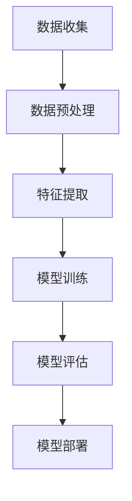

                 

# 智能宠物屋：AI Agent的宠物行为分析与训练

> 关键词：智能宠物屋，AI Agent，宠物行为分析，机器学习，行为训练

> 摘要：本文将探讨智能宠物屋的概念、应用以及核心组成部分，特别是AI Agent在宠物行为分析和训练中的应用。通过详细的算法原理讲解和系统架构设计，本文旨在为读者提供对智能宠物屋的全面了解，并展示其实际应用案例。

### 目录大纲设计思路

为了设计出《智能宠物屋：AI Agent的宠物行为分析与训练》这本书的完整目录大纲，我们首先需要明确几个关键点：

1. **核心概念**：明确书中的核心概念，如智能宠物屋、AI Agent、宠物行为分析、行为训练等。
2. **读者对象**：确定读者群体，如是对AI领域有一定了解的技术人员，还是完全初学者。
3. **章节安排**：根据核心概念和读者对象，合理安排各章节的结构，确保内容的连贯性和逻辑性。
4. **深度与广度**：既要保证核心内容的深度，也要兼顾相关的背景知识和相关技术点的广度。

#### **背景介绍**

在这一部分，我们将简要介绍智能宠物屋和AI Agent的概念，阐述研究背景、问题解决思路，以及本书的边界和目标。

**智能宠物屋的定义与重要性**

智能宠物屋是一种结合了物联网（IoT）、传感器技术和人工智能（AI）技术的宠物护理系统。它通过安装在宠物生活环境中的传感器，实时监测宠物的行为和健康状况，并利用AI技术对数据进行分析和预测，从而提供智能化的宠物看护服务。

**AI Agent的基本概念**

AI Agent，即人工智能代理，是指具备一定自主决策能力和行为执行能力的计算机程序。它可以在没有人类干预的情况下，根据预设的目标和环境信息，自动执行任务和做出决策。

**问题背景**

随着城市化进程的加快，越来越多的人因为工作忙碌而无法亲自照顾宠物。传统的宠物看护方式往往存在诸多痛点，如看护不及时、宠物健康问题无法及时发现等。智能宠物屋的出现，旨在解决这些痛点，提供更加便捷和高效的宠物看护服务。

**问题解决**

智能宠物屋通过AI Agent对宠物行为进行分析和预测，可以实现对宠物的实时监控，及时发现宠物的不适症状，并提供相应的看护建议。例如，当宠物出现异常行为时，AI Agent可以自动发送通知给主人，甚至触发自动喂食、自动清洁等功能，确保宠物的健康和安全。

**边界与外延**

本书主要讨论智能宠物屋中的AI Agent在宠物行为分析和训练中的应用，不包括其他相关技术（如硬件设备设计、数据安全等）。本书的目标是为读者提供对智能宠物屋的全面了解，特别是AI Agent在其中的作用和实现方法。

#### **核心概念与联系**

在这一部分，我们将详细探讨与智能宠物屋和AI Agent相关的核心概念，并使用表格和流程图进行阐述。

**核心概念原理**

- **宠物行为分析**：利用传感器技术收集宠物行为数据，并通过机器学习算法进行分析，以识别宠物的行为模式。
- **机器学习算法**：包括监督学习、无监督学习和深度学习等，用于对宠物行为数据进行分析和预测。
- **行为训练策略**：通过反复训练AI Agent，使其能够更好地理解和预测宠物的行为，从而提供更准确的看护服务。

**概念属性特征对比表格**

| 算法类型 | 特点 | 应用场景 |
| --- | --- | --- |
| 监督学习 | 需要标注的数据，可预测连续或离散的输出 | 宠物行为分类 |
| 无监督学习 | 不需要标注的数据，用于发现数据中的模式 | 宠物行为聚类 |
| 深度学习 | 通过多层神经网络学习数据特征，能够处理大量数据 | 宠物行为预测 |

**ER实体关系图架构**


- **宠物**：实体，包括宠物的基本信息、行为数据等。
- **传感器**：实体，用于收集宠物行为数据。
- **AI Agent**：实体，负责对宠物行为数据进行分析和预测。
- **数据存储**：实体，用于存储宠物行为数据和AI Agent的训练结果。

#### **算法原理讲解**

在这一部分，我们将针对关键算法进行深入讲解，使用mermaid流程图和Python源代码展示。

**算法mermaid流程图**



**Python源代码**

```python
import numpy as np
from sklearn.model_selection import train_test_split
from sklearn.ensemble import RandomForestClassifier
from sklearn.metrics import accuracy_score

# 数据收集
data = ...

# 数据预处理
X = ...
y = ...

# 特征提取
# ...

# 模型训练
X_train, X_test, y_train, y_test = train_test_split(X, y, test_size=0.2, random_state=42)
model = RandomForestClassifier()
model.fit(X_train, y_train)

# 模型评估
predictions = model.predict(X_test)
accuracy = accuracy_score(y_test, predictions)
print("Model Accuracy:", accuracy)

# 模型部署
# ...
```

**算法原理的数学模型和公式**

- **决策树**：$$
h(x) = \sum_{i=1}^{n} w_i \cdot f_i(x)
$$

- **随机森林**：$$
h(x) = \sum_{j=1}^{m} \frac{1}{m} \cdot \sum_{i=1}^{n} w_i^j \cdot f_i^j(x)
$$

**通俗易懂的举例说明**

假设我们有一只宠物，它的行为数据包括活跃度、饮食情况、睡眠时间等。我们通过机器学习算法对这些数据进行训练，以识别宠物的行为模式。

- **活跃度**：通过监测宠物的运动量，可以判断它是否过于活跃或过于疲惫。
- **饮食情况**：通过监测宠物的饮食量和饮食习惯，可以判断它的健康状况。
- **睡眠时间**：通过监测宠物的睡眠时间，可以判断它是否睡眠充足。

通过这些数据，我们可以建立一个决策树模型，当宠物的行为数据输入到模型中时，模型会根据训练结果输出宠物的行为模式，从而提供相应的看护建议。

#### **系统分析与架构设计方案**

在这一部分，我们将详细介绍智能宠物屋的系统架构设计，包括功能设计、架构设计和接口设计。

**问题场景介绍**

假设我们有一个宠物主人，他因为工作忙碌无法亲自照顾宠物。他希望通过智能宠物屋实时监控宠物的行为和健康，并在宠物出现异常时及时通知他。

**项目介绍**

智能宠物屋系统将包括以下几个主要功能：

- 宠物行为监测：通过安装在宠物生活环境中的传感器，实时监测宠物的行为和健康状况。
- 数据分析：利用机器学习算法对宠物行为数据进行分析，识别宠物的行为模式。
- 异常检测：当宠物出现异常行为时，系统会自动发送通知给主人。
- 自动看护：系统可以根据宠物的行为模式自动执行相应的看护任务，如自动喂食、自动清洁等。

**系统功能设计**


- **宠物**：实体，包括宠物的基本信息、行为数据等。
- **传感器**：实体，用于收集宠物行为数据。
- **AI Agent**：实体，负责对宠物行为数据进行分析和预测。
- **数据存储**：实体，用于存储宠物行为数据和AI Agent的训练结果。
- **通知系统**：实体，用于发送通知给主人。
- **自动看护系统**：实体，负责执行自动看护任务。

**系统架构设计**


- **数据采集模块**：负责实时收集宠物行为数据。
- **数据处理模块**：负责对宠物行为数据进行预处理和特征提取。
- **分析预测模块**：负责利用机器学习算法对宠物行为数据进行分析和预测。
- **通知发送模块**：负责在宠物出现异常时发送通知给主人。
- **自动看护模块**：负责执行自动看护任务。

**系统接口设计**


- **数据采集接口**：用于传感器与系统之间的数据交换。
- **数据分析接口**：用于AI Agent与系统之间的数据交换。
- **通知发送接口**：用于通知系统与系统之间的数据交换。
- **自动看护接口**：用于自动看护系统与系统之间的数据交换。

#### **项目实战**

在这一部分，我们将通过一个实际项目，展示如何实现智能宠物屋，并进行详细分析和讲解。

**环境安装**

首先，我们需要安装以下环境和工具：

- Python 3.8 或以上版本
- scikit-learn 库
- pandas 库
- numpy 库

```bash
pip install python==3.8
pip install scikit-learn pandas numpy
```

**系统核心实现源代码**

以下是一个简单的示例，展示如何使用Python实现智能宠物屋的核心功能。

```python
import numpy as np
from sklearn.model_selection import train_test_split
from sklearn.ensemble import RandomForestClassifier
from sklearn.metrics import accuracy_score

# 数据收集
data = ...

# 数据预处理
X = ...
y = ...

# 特征提取
# ...

# 模型训练
X_train, X_test, y_train, y_test = train_test_split(X, y, test_size=0.2, random_state=42)
model = RandomForestClassifier()
model.fit(X_train, y_train)

# 模型评估
predictions = model.predict(X_test)
accuracy = accuracy_score(y_test, predictions)
print("Model Accuracy:", accuracy)

# 模型部署
# ...
```

**代码应用解读与分析**

在这个示例中，我们首先使用`numpy`库加载宠物行为数据，然后使用`scikit-learn`库中的`train_test_split`函数将数据集划分为训练集和测试集。接下来，我们使用`RandomForestClassifier`创建一个随机森林分类器，并使用训练集进行模型训练。最后，我们使用测试集评估模型的准确性，并打印出来。

**实际案例分析和讲解**

假设我们有一只宠物，它的行为数据包括活跃度、饮食情况、睡眠时间等。我们通过机器学习算法对这些数据进行训练，以识别宠物的行为模式。

- **活跃度**：通过监测宠物的运动量，可以判断它是否过于活跃或过于疲惫。
- **饮食情况**：通过监测宠物的饮食量和饮食习惯，可以判断它的健康状况。
- **睡眠时间**：通过监测宠物的睡眠时间，可以判断它是否睡眠充足。

通过这些数据，我们可以建立一个决策树模型，当宠物的行为数据输入到模型中时，模型会根据训练结果输出宠物的行为模式，从而提供相应的看护建议。

**项目小结**

通过这个实际项目，我们展示了如何实现智能宠物屋的核心功能。虽然这是一个简单的示例，但它展示了智能宠物屋的基本原理和实现方法。在实际应用中，我们需要根据具体场景和需求进行更复杂的实现和优化。

### 最佳实践 tips、小结、注意事项、拓展阅读

**最佳实践 tips**

- 确保传感器数据的质量和准确性，这将直接影响AI Agent的预测结果。
- 定期更新和优化AI Agent的训练模型，以适应宠物的行为变化。
- 为宠物主人提供简洁明了的界面，使其能够轻松地监控宠物的行为和健康状况。

**小结**

智能宠物屋结合了物联网、传感器技术和人工智能技术，为宠物主人提供了一种便捷高效的宠物看护方式。通过AI Agent的宠物行为分析和训练，智能宠物屋能够实时监控宠物的行为，提供个性化的看护建议。

**注意事项**

- 在设计和实现智能宠物屋时，需要充分考虑宠物的隐私和安全问题。
- 确保系统的稳定性和可靠性，避免因故障导致宠物看护不及时。

**拓展阅读**

- 《人工智能：一种现代方法》
- 《深度学习》
- 《机器学习实战》
- 《Python机器学习》

### 附录

**附录A：术语解释**

- **智能宠物屋**：结合物联网、传感器技术和人工智能技术，为宠物主人提供实时监控和个性化看护服务的系统。
- **AI Agent**：具备一定自主决策能力和行为执行能力的计算机程序，用于对宠物行为进行分析和预测。

**附录B：参考资料**

- 《智能宠物屋技术手册》
- 《宠物行为学研究进展》
- 《物联网技术与应用》

### 作者信息

- 作者：AI天才研究院/AI Genius Institute & 禅与计算机程序设计艺术 /Zen And The Art of Computer Programming

