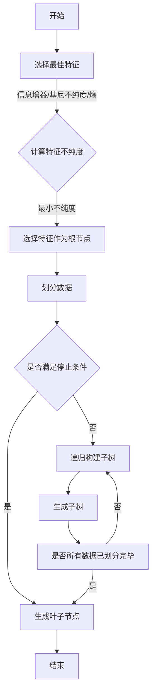
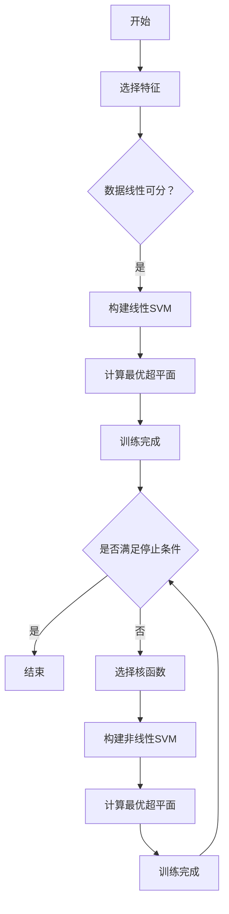
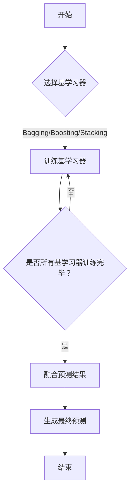

                 

### 第1章 引言

#### 1.1 问题背景

随着人们生活水平的不断提高，宠物已经成为许多家庭的重要成员。然而，宠物饲养过程中，尤其是宠物饮食管理，往往面临诸多挑战。首先，宠物的饮食需求因种类、年龄、健康状况等因素而异，传统的手工管理方式难以实现个性化、科学化的饮食管理。其次，宠物的饮食习惯容易受到环境、情绪等因素的影响，导致饮食不规律，进而影响健康。此外，宠主工作忙碌，无法时刻关注宠物的饮食情况，导致宠物饮食管理成为一大难题。

#### 1.1.1 宠物饲养的现状

目前，市场上宠物食品种类繁多，但大多数宠物主人仍然依赖传统的饲养方式，即根据经验和宠物商店的建议来安排宠物的饮食。这种方式缺乏科学依据，容易导致宠物营养不良或摄入过多热量，引发肥胖、疾病等问题。同时，宠物食品的包装和储存条件也存在一定的问题，容易受到污染或变质，对宠物健康造成潜在威胁。

#### 1.1.2 宠物饮食管理的重要性

良好的宠物饮食管理对宠物的健康至关重要。科学合理的饮食不仅可以满足宠物生长所需的各种营养素，还可以预防疾病，提高免疫力。反之，不良的饮食管理可能导致宠物营养不良或肥胖，引发各种健康问题，甚至缩短宠物的寿命。因此，实现宠物饮食的个性化、科学化管理，已成为当前宠物饲养领域的一个重要课题。

#### 1.1.3 智能宠物碗的解决方案

智能宠物碗作为一种新兴的宠物饮食管理工具，能够通过AI技术实现对宠物饮食的智能监控和管理。智能宠物碗集成了智能传感器、连接模块和AI Agent，能够实时监测宠物的饮食情况，根据宠物的营养需求和健康状况，智能推荐合适的饮食方案，并提供饮食建议和提醒。通过智能宠物碗，宠物主人可以更加轻松地管理宠物的饮食，确保宠物健康。

#### 1.2 核心概念

在本章节中，我们将介绍与智能宠物碗相关的核心概念，包括AI Agent、宠物饮食健康管理和智能宠物碗的关键技术。

##### 1.2.1 AI Agent

AI Agent，即人工智能代理，是一种能够模拟人类决策过程，具备自主学习和推理能力的智能系统。在智能宠物碗中，AI Agent负责分析宠物的饮食数据，根据宠物的健康状况和营养需求，智能推荐饮食方案。

##### 1.2.2 宠物饮食健康管理

宠物饮食健康管理是指通过科学的方法和手段，对宠物饮食进行监控、管理和优化，以满足宠物的营养需求，提高宠物健康水平。智能宠物碗通过AI技术，实现对宠物饮食的健康管理。

##### 1.2.3 智能宠物碗的关键技术

智能宠物碗的关键技术包括智能传感器、连接模块和AI Agent。智能传感器用于实时监测宠物的饮食情况，连接模块负责数据传输，AI Agent则负责分析数据，提供智能饮食建议。

#### 1.3 书籍结构

本文将分为五个主要章节，系统地介绍智能宠物碗的工作原理和应用场景。

- 第1章：引言，介绍宠物饮食管理的现状和挑战，以及智能宠物碗的解决方案。
- 第2章：智能宠物碗的组成部分，详细讲解智能宠物碗的实体部分和软件部分。
- 第3章：AI Agent的工作原理，介绍AI Agent的基本原理、数据处理流程和智能决策过程。
- 第4章：宠物饮食健康管理，分析宠物的营养需求，介绍智能推荐系统和实时监控与反馈。
- 第5章：智能宠物碗的应用场景，探讨智能宠物碗在不同场景下的应用。

##### 1.3.1 内容安排

本文将按照以下内容安排进行讲解：

- **第1章**：介绍宠物饮食管理的现状和挑战，以及智能宠物碗的解决方案。
- **第2章**：详细讲解智能宠物碗的实体部分和软件部分。
- **第3章**：介绍AI Agent的工作原理，包括基本原理、数据处理流程和智能决策过程。
- **第4章**：分析宠物的营养需求，介绍智能推荐系统和实时监控与反馈。
- **第5章**：探讨智能宠物碗在不同场景下的应用。

##### 1.3.2 目标读者

本文的目标读者是关注宠物健康管理的技术人员、宠物主人以及对智能硬件感兴趣的开发者。读者需要具备一定的计算机编程基础和AI知识，以便更好地理解本文的内容。

##### 1.3.3 知识储备

为了更好地理解本文的内容，读者需要具备以下知识储备：

- **计算机编程基础**：熟悉Python等编程语言，了解基本的编程概念和算法。
- **AI基础知识**：了解机器学习、深度学习等AI技术的基本原理和应用。
- **宠物健康管理知识**：了解宠物营养需求和饮食管理的基本原则。

#### 1.4 本章小结

本章介绍了智能宠物碗的背景和解决方案，详细阐述了宠物饮食管理的重要性，并介绍了本文的核心概念和结构。在接下来的章节中，我们将深入探讨智能宠物碗的工作原理和应用场景，帮助读者更好地理解这一新兴技术。

## 第2章 智能宠物碗的组成部分

智能宠物碗作为一款结合AI技术的宠物饮食管理设备，其组成部分可以分为实体部分和软件部分。在这两部分的协同作用下，智能宠物碗能够实现对宠物饮食的智能监控和管理。

### 2.1 实体部分

实体部分是智能宠物碗的物理基础，主要包括宠物碗本体、智能传感器和连接模块。

#### 2.1.1 宠物碗的结构

宠物碗作为智能宠物碗的硬件载体，其结构设计需要考虑宠物的使用习惯和舒适度。常见的宠物碗结构包括：

- **碗体**：通常采用耐用的材料，如不锈钢或塑料，以保证使用寿命。
- **防滑底座**：用于防止宠物碗滑动，确保宠物能够稳定进食。
- **食物传感器接口**：用于连接智能传感器，监测食物的摄入情况。

#### 2.1.2 智能传感器

智能传感器是智能宠物碗的核心部件，负责实时监测宠物的饮食行为。常见的智能传感器包括：

- **重量传感器**：用于监测宠物碗内食物的重量变化，从而计算宠物的实际进食量。
- **温度传感器**：用于监测宠物食物的温度，确保食物在适宜的温度下食用。
- **湿度传感器**：用于监测宠物食物的湿度，有助于判断食物是否变质。

#### 2.1.3 连接模块

连接模块负责将智能传感器采集到的数据传输到软件系统进行处理和分析。常见的连接模块包括：

- **蓝牙模块**：通过蓝牙连接宠物碗和智能设备，实现数据的无线传输。
- **Wi-Fi模块**：通过Wi-Fi网络连接宠物碗和互联网，便于远程数据传输和监控。
- **USB接口**：用于直接连接电脑或其他设备，进行数据传输和调试。

### 2.2 软件部分

软件部分是智能宠物碗的“大脑”，主要负责数据收集、处理和分析，并提供智能化的饮食管理建议。软件部分主要包括AI Agent的架构、实时数据处理和数据存储与传输。

#### 2.2.1 AI Agent的架构

AI Agent是智能宠物碗的智能核心，负责分析宠物饮食数据，提供个性化的饮食建议。AI Agent的架构通常包括以下几个部分：

- **数据输入模块**：接收来自智能传感器的数据，包括食物摄入量、食物温度、湿度等。
- **数据处理模块**：对输入的数据进行预处理，包括数据清洗、数据标准化等。
- **特征提取模块**：从预处理后的数据中提取出对宠物饮食管理有用的特征。
- **决策模块**：根据提取的特征，使用机器学习算法进行决策，提供个性化的饮食建议。

#### 2.2.2 实时数据处理

实时数据处理是智能宠物碗的核心功能之一，它能够实时监控宠物的饮食情况，并根据宠物的实际情况调整饮食方案。实时数据处理主要包括以下几个步骤：

1. **数据采集**：通过智能传感器实时采集宠物的饮食数据。
2. **数据预处理**：对采集到的数据进行分析和处理，去除噪声和异常值。
3. **特征提取**：从预处理后的数据中提取出对宠物饮食管理有用的特征。
4. **决策**：使用机器学习算法对提取的特征进行分析，为宠物提供个性化的饮食建议。

#### 2.2.3 数据存储与传输

智能宠物碗需要将采集到的数据存储起来，以便进行历史数据的分析和参考。同时，数据也需要传输到云端或其他设备，以便宠主随时随地查看宠物的饮食情况。数据存储与传输主要包括以下几个步骤：

1. **数据存储**：将实时采集到的数据存储到本地数据库或云端数据库中。
2. **数据同步**：将本地数据库或云端数据库中的数据同步到宠主的智能设备上。
3. **数据备份**：对存储的数据进行备份，确保数据的安全性和可靠性。

### 2.3 系统集成

系统集成是将实体部分和软件部分有机结合，形成一个完整的智能宠物碗系统。系统集成主要包括以下几个步骤：

1. **硬件集成**：将宠物碗、智能传感器和连接模块进行物理连接，确保它们能够正常工作。
2. **软件集成**：将AI Agent、数据处理模块和存储传输模块进行逻辑集成，确保数据能够顺畅地流动。
3. **系统测试**：对集成后的系统进行测试，确保系统功能的完整性和稳定性。

#### 2.3.1 实体与软件的交互

实体部分和软件部分需要紧密协作，确保智能宠物碗能够正常工作。实体与软件的交互主要包括：

1. **数据采集**：智能传感器实时采集宠物饮食数据，并通过连接模块传输到软件系统。
2. **数据处理**：软件系统对采集到的数据进行分析和处理，提取出有用的特征。
3. **决策反馈**：软件系统根据分析结果，提供个性化的饮食建议，并通过连接模块反馈给宠物碗。

#### 2.3.2 系统的功能实现

智能宠物碗的功能实现包括：

1. **饮食监控**：实时监控宠物的饮食情况，包括进食量、进食速度、进食时间等。
2. **饮食建议**：根据宠物的饮食数据，智能推荐适合宠物的饮食方案。
3. **健康预警**：根据宠物的饮食数据，预测宠物的健康趋势，并提供预警信息。
4. **互动提醒**：通过智能设备向宠主发送饮食提醒、健康预警等信息。

#### 2.3.3 系统的可靠性和安全性

智能宠物碗作为一个智能家居设备，其可靠性和安全性至关重要。为了提高系统的可靠性和安全性，需要考虑以下几个方面：

1. **硬件质量**：选择高质量的硬件材料，确保设备的耐用性和稳定性。
2. **软件优化**：优化软件算法，提高系统的处理效率和准确性。
3. **数据加密**：对传输的数据进行加密，确保数据的安全性。
4. **隐私保护**：确保宠主的隐私不被泄露，遵守相关法律法规。

#### 2.4 本章小结

本章详细介绍了智能宠物碗的组成部分，包括实体部分和软件部分。通过实体部分和软件部分的协同工作，智能宠物碗能够实现对宠物饮食的智能监控和管理。在接下来的章节中，我们将进一步探讨AI Agent的工作原理和宠物饮食健康管理的具体实施方法。

## 第3章 AI Agent的工作原理

AI Agent作为智能宠物碗的核心组成部分，负责对宠物饮食数据进行收集、处理和分析，从而提供个性化的饮食建议。本章节将详细探讨AI Agent的工作原理，包括其基本原理、数据处理流程和智能决策过程。

### 3.1 AI Agent的基本原理

AI Agent，即人工智能代理，是一种模拟人类智能行为的计算机程序，能够在没有人类干预的情况下自主执行任务。AI Agent的基本原理主要包括以下几个方面：

#### 3.1.1 机器学习的概念

机器学习是AI Agent的核心技术之一，它使计算机能够从数据中学习规律，从而进行预测和决策。机器学习的基本过程包括：

1. **数据收集**：从各种来源收集数据，包括文本、图像、声音等。
2. **数据预处理**：对收集到的数据进行分析和处理，去除噪声和异常值。
3. **特征提取**：从预处理后的数据中提取出对问题有帮助的特征。
4. **模型训练**：使用提取的特征训练机器学习模型。
5. **模型评估**：评估模型的性能，调整参数以优化模型。
6. **模型应用**：将训练好的模型应用到实际问题中。

#### 3.1.2 AI Agent的设计思路

AI Agent的设计思路是基于机器学习和自然语言处理技术，其核心目的是模拟人类决策过程，为用户提供智能化的服务。具体设计思路包括：

1. **任务分解**：将复杂的任务分解为多个子任务，每个子任务由相应的模块完成。
2. **模块化设计**：将系统分解为多个模块，每个模块负责特定的功能，便于维护和扩展。
3. **数据驱动**：使用数据驱动的方法，通过大量数据进行训练和优化，提高系统的准确性和可靠性。
4. **用户交互**：设计友好的用户界面，方便用户与AI Agent进行交互。

#### 3.1.3 机器学习算法的选择

在选择机器学习算法时，需要考虑以下几个因素：

1. **任务类型**：不同的机器学习算法适用于不同类型的任务，如分类、回归、聚类等。
2. **数据规模**：算法的复杂度与数据规模有关，对于大规模数据集，需要选择高效算法。
3. **数据质量**：算法对数据质量的要求不同，对于噪声和异常值较多的数据集，需要选择鲁棒性强的算法。
4. **计算资源**：算法的计算复杂度和资源消耗是选择的重要因素。

常用的机器学习算法包括：

- **监督学习算法**：如线性回归、逻辑回归、支持向量机（SVM）、决策树、随机森林等。
- **无监督学习算法**：如聚类算法、主成分分析（PCA）、自编码器等。
- **深度学习算法**：如卷积神经网络（CNN）、循环神经网络（RNN）、生成对抗网络（GAN）等。

### 3.2 数据处理流程

AI Agent的数据处理流程是整个智能系统的核心，其基本流程包括数据收集、数据预处理、特征提取、模型训练和模型评估等步骤。

#### 3.2.1 数据收集

数据收集是AI Agent的第一步，数据来源可以是传感器采集的数据、用户输入的数据或公开数据集。在宠物饮食健康管理中，数据收集主要包括：

1. **宠物基本信息**：如宠物种类、年龄、体重、健康状况等。
2. **饮食数据**：如食物摄入量、进食时间、进食速度等。
3. **环境数据**：如室内温度、湿度、光照等。

#### 3.2.2 数据预处理

数据预处理是确保数据质量和模型性能的关键步骤，主要包括：

1. **数据清洗**：去除噪声和异常值，确保数据的准确性和一致性。
2. **数据标准化**：将不同单位的数据转换为同一单位，便于模型训练。
3. **数据归一化**：将数据缩放到一个特定的范围，如0到1之间，提高模型训练效率。

#### 3.2.3 数据特征提取

特征提取是从原始数据中提取出对问题有帮助的信息，提高模型的表现。特征提取方法包括：

1. **手动特征提取**：根据问题领域的知识，手动提取出重要的特征。
2. **自动特征提取**：使用机器学习算法自动提取出特征，如主成分分析（PCA）和特征选择算法。

#### 3.2.4 模型训练

模型训练是AI Agent的核心步骤，通过训练数据集，使模型学会识别数据中的规律。模型训练过程包括：

1. **选择模型**：根据任务类型和数据特点，选择合适的模型。
2. **训练模型**：使用训练数据集对模型进行训练，调整模型的参数。
3. **模型评估**：评估模型在训练数据集和测试数据集上的性能，调整模型参数。

#### 3.2.5 模型评估

模型评估是验证模型性能的重要步骤，主要包括：

1. **准确率**：模型预测正确的比例。
2. **召回率**：模型预测正确的负样本比例。
3. **F1分数**：准确率和召回率的加权平均。

### 3.3 智能决策过程

智能决策过程是AI Agent的核心功能，通过分析宠物饮食数据，提供个性化的饮食建议。智能决策过程主要包括以下几个步骤：

#### 3.3.1 决策树算法

决策树算法是一种常见的机器学习算法，通过一系列的判断条件，将数据划分为不同的类别。决策树算法的工作原理如下：

1. **选择特征**：选择对分类最有影响力的特征。
2. **划分数据**：根据选择的特征，将数据集划分为不同的子集。
3. **递归构建**：对划分后的子集继续划分，直到满足停止条件。

#### 3.3.2 支持向量机

支持向量机（SVM）是一种监督学习算法，通过寻找最优的超平面，将不同类别的数据分开。SVM的工作原理如下：

1. **选择特征**：选择对分类最有影响力的特征。
2. **计算支持向量**：计算每个样本到超平面的距离，找出支持向量。
3. **构建超平面**：根据支持向量，构建最优的超平面。

#### 3.3.3 集成学习方法

集成学习方法是将多个模型集成起来，提高模型的性能。常见的集成学习方法包括：

1. ** bagging**：通过训练多个模型，然后取平均值或投票结果作为最终预测。
2. ** boosting**：通过迭代训练多个模型，每次训练都侧重于纠正前一次模型的错误。
3. ** stacking**：将多个模型分为训练集和测试集，然后训练一个新的模型来整合这些模型的结果。

### 3.4 本章小结

本章详细介绍了AI Agent的工作原理，包括基本原理、数据处理流程和智能决策过程。通过AI Agent，智能宠物碗能够实现对宠物饮食数据的智能分析和管理，提供个性化的饮食建议。在下一章节中，我们将进一步探讨宠物饮食健康管理的具体实施方法。

### 3.1.1 机器学习的概念

机器学习是人工智能的一个重要分支，其核心目标是使计算机系统能够通过学习和经验自动改进性能。为了更好地理解AI Agent的工作原理，我们需要首先了解机器学习的概念和基本流程。

#### 3.1.1.1 机器学习的定义

机器学习（Machine Learning）是一种人工智能方法，它通过使用算法和统计模型，从数据中提取知识和规律，使计算机系统能够在给定任务上实现自动化学习。机器学习的目标是通过训练，使系统能够在新的数据集上做出准确的预测或决策。

#### 3.1.1.2 机器学习的基本流程

机器学习的基本流程包括以下几个步骤：

1. **数据收集**：首先需要收集大量的数据，这些数据可以来自于各种来源，如传感器、用户输入、公开数据集等。

2. **数据预处理**：收集到的数据往往是不完整、有噪声的，需要对其进行清洗和预处理，包括数据清洗、缺失值处理、数据标准化等。

3. **特征提取**：从预处理后的数据中提取出对问题有帮助的特征。特征提取是机器学习的重要环节，合理的特征选择可以提高模型的性能。

4. **模型选择**：根据具体任务的需求，选择合适的机器学习模型。常见的模型包括线性回归、决策树、支持向量机、神经网络等。

5. **模型训练**：使用训练数据集对模型进行训练，调整模型的参数，使模型能够学会数据中的规律。

6. **模型评估**：在训练完成后，使用测试数据集对模型进行评估，评估模型的性能，如准确率、召回率、F1分数等。

7. **模型应用**：将训练好的模型应用到实际问题中，进行预测或决策。

#### 3.1.1.3 机器学习的分类

根据学习方式的不同，机器学习可以分为以下几类：

1. **监督学习**：在监督学习中，模型通过学习带有标签的数据，从而预测新数据的标签。常见的算法包括线性回归、逻辑回归、决策树、随机森林、支持向量机等。

2. **无监督学习**：在无监督学习中，模型没有明确的标签信息，需要从数据中自动发现结构和模式。常见的算法包括聚类、主成分分析、自编码器等。

3. **半监督学习**：半监督学习结合了监督学习和无监督学习的特点，利用少量的标签数据和大量的无标签数据来训练模型。

4. **强化学习**：强化学习通过与环境互动，不断优化决策策略，以实现最大化累积奖励。常见的算法包括Q学习、深度Q网络（DQN）、策略梯度算法等。

#### 3.1.1.4 机器学习在智能宠物碗中的应用

在智能宠物碗中，机器学习主要用于以下几个方面：

1. **饮食数据分析**：通过收集宠物的饮食数据，如摄入量、时间、速度等，使用机器学习算法分析宠物的饮食习惯和健康状况。

2. **个性化饮食建议**：根据宠物的饮食习惯和健康状况，使用机器学习算法生成个性化的饮食建议，包括食物种类、数量、时间等。

3. **健康预测**：通过分析宠物的历史饮食数据，使用机器学习算法预测宠物的健康趋势，提前发现潜在的健康问题。

4. **异常检测**：通过分析宠物饮食数据的异常模式，使用机器学习算法检测宠物的饮食异常，如过量进食、进食时间过长等。

通过上述应用，智能宠物碗能够为宠物主人提供科学、个性化的饮食管理服务，确保宠物的健康成长。

### 3.1.2 AI Agent的设计思路

AI Agent，即人工智能代理，是一种能够在没有人类干预的情况下，自主执行任务的智能系统。在智能宠物碗中，AI Agent的设计思路旨在通过机器学习技术，实现对宠物饮食数据的智能分析和管理，提供个性化的饮食建议。以下是AI Agent的设计思路及其实现方法：

#### 3.1.2.1 设计思路

1. **任务分解**：将复杂的饮食管理任务分解为多个子任务，如数据收集、数据预处理、特征提取、模型训练、决策生成等。每个子任务由相应的模块完成，便于系统的维护和扩展。

2. **模块化设计**：采用模块化设计思想，将AI Agent分解为多个功能模块，每个模块负责特定的功能。模块之间通过标准化的接口进行通信，确保系统的灵活性和可扩展性。

3. **数据驱动**：以数据为核心，通过大量真实数据的训练和验证，不断提高AI Agent的性能和准确性。数据驱动的理念确保AI Agent能够适应不同的宠物和不同的饮食环境。

4. **用户交互**：设计友好的用户界面，使宠物主人能够方便地与AI Agent进行交互。用户交互模块应支持多种输入方式，如触摸屏、语音等，满足不同用户的需求。

#### 3.1.2.2 实现方法

1. **数据收集模块**：
   - **数据源**：从宠物碗中的传感器、宠主的反馈、宠物医生的建议等多个渠道收集数据。
   - **数据类型**：包括宠物的基本信息（如年龄、体重、健康状况）、饮食数据（如摄入量、时间、速度）、环境数据（如温度、湿度）等。
   - **数据存储**：将收集到的数据存储在本地数据库或云端数据库中，便于后续处理和分析。

2. **数据预处理模块**：
   - **数据清洗**：去除数据中的噪声和异常值，确保数据的准确性和一致性。
   - **数据标准化**：将不同类型的数据转换为同一单位，如将摄入量从克转换为百分比，确保数据的可比性。
   - **数据归一化**：将数据缩放到一个特定的范围，如0到1之间，提高模型训练的效率。

3. **特征提取模块**：
   - **手动特征提取**：根据宠物饮食管理的专业知识，手动提取出对问题有帮助的特征，如进食量、进食时间、进食速度等。
   - **自动特征提取**：使用机器学习算法自动提取出特征，如主成分分析（PCA）、线性判别分析（LDA）等。

4. **模型训练模块**：
   - **模型选择**：根据任务的需求，选择合适的机器学习模型，如线性回归、决策树、支持向量机、神经网络等。
   - **模型训练**：使用训练数据集对模型进行训练，调整模型的参数，使模型能够学会数据中的规律。
   - **模型评估**：使用测试数据集对模型进行评估，评估模型的性能，如准确率、召回率、F1分数等。

5. **决策生成模块**：
   - **决策逻辑**：根据模型预测的结果，生成个性化的饮食建议，包括食物种类、数量、时间等。
   - **反馈机制**：收集宠主的反馈，如对饮食建议的满意度、宠物健康的变化等，用于优化决策逻辑。

6. **用户交互模块**：
   - **界面设计**：设计友好的用户界面，使宠物主人能够方便地查看宠物的饮食数据和饮食建议。
   - **交互方式**：支持多种交互方式，如触摸屏、语音等，满足不同用户的需求。

通过上述设计思路和实现方法，AI Agent能够实现对宠物饮食数据的智能分析和管理，为宠物主人提供科学、个性化的饮食管理服务。在接下来的章节中，我们将进一步探讨AI Agent在实际应用中的具体实现和效果。

### 3.1.3 机器学习算法的选择

在选择机器学习算法时，需要考虑任务类型、数据规模、数据质量和计算资源等多个因素。以下是一些常用的机器学习算法，以及它们在不同场景下的适用性。

#### 3.1.3.1 监督学习算法

**线性回归（Linear Regression）**

- **适用场景**：用于预测连续值输出，如宠物每天所需的食物量。
- **优点**：简单，易于理解和实现。
- **缺点**：对异常值敏感，拟合能力有限。

**逻辑回归（Logistic Regression）**

- **适用场景**：用于分类任务，如判断宠物是否摄入了足够的食物。
- **优点**：简单，易于理解和实现；可以计算概率。
- **缺点**：对非线性关系拟合能力较差。

**支持向量机（SVM）**

- **适用场景**：用于分类和回归任务，特别是在高维空间中有较好的表现。
- **优点**：有明确的数学基础，拟合能力较强。
- **缺点**：训练时间较长，对异常值敏感。

**决策树（Decision Tree）**

- **适用场景**：用于分类和回归任务，特别是当数据具有层次结构时。
- **优点**：直观，易于理解和解释；能够处理非线性关系。
- **缺点**：容易过拟合，对异常值敏感。

**随机森林（Random Forest）**

- **适用场景**：用于分类和回归任务，特别是在处理高维数据时。
- **优点**：拟合能力较强，能够减少过拟合；鲁棒性较好。
- **缺点**：训练时间较长，对异常值敏感。

**梯度提升树（Gradient Boosting Tree）**

- **适用场景**：用于分类和回归任务，特别是在处理非线性关系和复杂数据时。
- **优点**：拟合能力非常强，能够处理高维数据；计算效率高。
- **缺点**：训练时间较长，对异常值敏感。

#### 3.1.3.2 无监督学习算法

**聚类算法（Clustering）**

- **适用场景**：用于发现数据中的模式和结构，如发现宠物的饮食习惯模式。
- **优点**：无需标签数据，适用于未知分布的数据。
- **缺点**：对初始聚类中心敏感，需要人为指定聚类个数。

**主成分分析（PCA）**

- **适用场景**：用于降维，提取数据的主要特征，如从大量饮食数据中提取关键指标。
- **优点**：减少数据维度，便于可视化。
- **缺点**：对异常值敏感，降维后可能会丢失一些信息。

**自编码器（Autoencoder）**

- **适用场景**：用于特征提取和异常检测，如从饮食数据中提取关键特征并进行异常检测。
- **优点**：无需标签数据，能够自动提取特征。
- **缺点**：对异常值敏感，训练时间较长。

#### 3.1.3.3 深度学习算法

**卷积神经网络（CNN）**

- **适用场景**：用于处理图像和视频数据，如从宠物进食视频中识别食物。
- **优点**：能够自动提取图像特征，处理能力强。
- **缺点**：对计算资源要求较高，训练时间较长。

**循环神经网络（RNN）**

- **适用场景**：用于处理序列数据，如根据宠物进食序列预测未来的饮食量。
- **优点**：能够处理序列数据，对时间序列数据有较好的拟合能力。
- **缺点**：容易出现梯度消失和梯度爆炸问题。

**长短期记忆网络（LSTM）**

- **适用场景**：用于处理长序列数据，如根据宠物的历史饮食数据预测长期的饮食习惯。
- **优点**：能够解决RNN的梯度消失和梯度爆炸问题。
- **缺点**：计算复杂度较高，对计算资源要求较高。

**生成对抗网络（GAN）**

- **适用场景**：用于生成新的数据，如生成宠物的饮食数据用于训练。
- **优点**：能够生成高质量的数据，有助于提高模型的泛化能力。
- **缺点**：训练过程复杂，对计算资源要求较高。

根据智能宠物碗的具体需求，可以选择合适的机器学习算法。例如，对于宠物的饮食数据分析，可以选择线性回归或逻辑回归；对于宠物饮食习惯的聚类分析，可以选择聚类算法；对于宠物的长期饮食习惯预测，可以选择循环神经网络或长短期记忆网络。通过合理选择和组合不同的算法，智能宠物碗能够为宠物主人提供更加科学、个性化的饮食管理服务。

### 3.2.1 数据收集与预处理

数据收集与预处理是机器学习过程中至关重要的一环，它决定了模型训练的质量和效果。在智能宠物碗中，数据收集与预处理包括以下几个关键步骤：

#### 3.2.1.1 数据收集

数据收集是整个流程的起点，智能宠物碗需要从多种渠道收集数据，包括：

1. **宠物基本信息**：包括宠物的种类、年龄、体重、性别、健康状况等。这些数据通常通过用户手动输入或宠物体检报告获取。

2. **饮食数据**：包括每次进食的食物种类、摄入量、时间、速度等。这些数据主要通过智能宠物碗的传感器实时采集。

3. **环境数据**：包括室内温度、湿度、光照强度等。这些数据有助于分析宠物饮食行为与环境的关联性。

4. **宠主行为数据**：包括宠主对宠物的照顾行为，如喂食频率、喂食量、宠物的活动情况等。这些数据可以通过用户日志或传感器记录获取。

5. **医疗数据**：包括宠物的医疗记录、疫苗记录、就诊情况等。这些数据可以从宠物医院或兽医诊所获取。

#### 3.2.1.2 数据预处理

数据预处理是确保数据质量和模型性能的重要步骤，主要包括以下内容：

1. **数据清洗**：去除数据中的噪声和异常值。例如，去除重复记录、处理缺失值、填补或删除异常数据点等。清洗后的数据应该尽量保持原始信息的完整性，同时消除噪声对模型训练的影响。

2. **数据标准化**：将不同单位的数据转换为同一单位，如将食物摄入量从克转换为百分比，将温度从摄氏度转换为开尔文等。标准化后的数据可以方便模型训练和比较。

3. **数据归一化**：将数据缩放到一个特定的范围，如0到1之间。归一化有助于提高模型训练的收敛速度，特别是对于基于梯度的优化算法。

4. **特征提取**：从原始数据中提取出对问题有帮助的特征。特征提取可以基于专家知识或使用自动化方法，如主成分分析（PCA）、线性判别分析（LDA）等。

5. **特征选择**：从提取的特征中选择对模型性能有显著影响的关键特征。特征选择可以减少数据维度，提高模型训练效率和准确性。

6. **时间序列处理**：对于时间序列数据，如宠物的进食时间、温度变化等，需要进行时间序列预处理，如差分、平滑、窗口聚合等，以便更好地捕捉时间序列的特征。

#### 3.2.1.3 数据存储

预处理后的数据需要存储在数据库或数据仓库中，以便后续的数据分析和模型训练。数据存储需要考虑以下几个因素：

1. **数据结构**：根据数据类型和用途，选择合适的数据库结构，如关系型数据库（如MySQL）或NoSQL数据库（如MongoDB）。

2. **数据安全性**：确保数据的安全性和隐私性，采取加密、访问控制等措施。

3. **数据一致性**：确保数据在存储、处理和传输过程中的一致性，避免数据丢失或错误。

4. **数据可扩展性**：随着数据量的增长，数据库应具有良好的可扩展性，以应对数据量增加的需求。

5. **数据备份和恢复**：定期进行数据备份，确保在数据丢失或系统故障时能够快速恢复数据。

通过科学合理的数据收集与预处理，智能宠物碗能够为AI Agent提供高质量的数据，从而提高模型训练的准确性和效率。在后续章节中，我们将进一步探讨如何使用预处理后的数据训练和优化AI Agent。

### 3.2.2 数据特征提取

在数据处理过程中，数据特征提取是至关重要的一步，它决定了后续机器学习模型的效果。特征提取的目标是从原始数据中提取出对任务有帮助的关键信息，从而提高模型的性能。在智能宠物碗的应用中，特征提取主要包括以下几个方面：

#### 3.2.2.1 手动特征提取

手动特征提取是基于专家知识和领域经验，从原始数据中提取出对问题有帮助的特征。以下是几种常用的手动特征提取方法：

1. **基本统计特征**：如均值、中位数、标准差、方差等。这些特征可以描述数据的基本分布情况，帮助模型理解数据的全局特征。

2. **时间序列特征**：如食物摄入的频率、间隔时间、持续时长等。这些特征可以描述宠物的饮食习惯和时间规律。

3. **食物类型特征**：如食物的卡路里、蛋白质、脂肪、碳水化合物等营养成分。这些特征可以描述食物的营养价值，帮助模型分析宠物的营养摄入情况。

4. **环境特征**：如室内温度、湿度、光照等。这些特征可以描述宠物生活的环境条件，有助于分析环境对宠物饮食习惯的影响。

5. **宠主行为特征**：如宠主喂食的频率、喂食量、宠物的活动情况等。这些特征可以描述宠主对宠物的照顾行为，帮助模型分析宠主的饮食管理习惯。

#### 3.2.2.2 自动特征提取

自动特征提取是利用机器学习算法，从原始数据中自动提取出对问题有帮助的特征。以下是几种常用的自动特征提取方法：

1. **主成分分析（PCA）**：PCA是一种常用的降维方法，通过将数据投影到新的正交坐标系中，提取出主要成分，从而减少数据维度，同时保留数据的方差。PCA能够有效地降低数据的维度，同时去除噪声和冗余信息。

2. **线性判别分析（LDA）**：LDA是一种分类方法，通过最大化类内方差和最小化类间方差，从原始数据中提取出最有区分性的特征。LDA适用于需要分类的任务，能够提高分类模型的准确率。

3. **特征选择算法**：特征选择算法如递归特征消除（RFE）、基于信息的特征选择（IFS）等，通过评估特征对模型性能的贡献，选择出最有用的特征。这些算法可以有效地减少特征数量，提高模型训练效率。

4. **核方法**：如核主成分分析（KPCA）、核线性判别分析（KLDA）等，这些方法通过核函数将原始数据映射到高维空间，提取出新的特征。核方法能够处理非线性关系，适用于复杂的数据分布。

#### 3.2.2.3 特征提取的效果评估

特征提取的效果直接影响机器学习模型的表现。为了评估特征提取的效果，可以使用以下方法：

1. **模型性能评估**：通过交叉验证或测试集，评估特征提取前后模型性能的变化。常用的评估指标包括准确率、召回率、F1分数等。

2. **特征重要性评估**：使用模型评估结果，如随机森林、LASSO等，评估每个特征对模型性能的贡献。特征重要性高的特征对模型影响大，而重要性低的特点可以忽略。

3. **可视化分析**：通过数据可视化工具，如散点图、热力图等，直观地观察特征提取前后的数据分布和特征关系。

通过合理的数据特征提取，智能宠物碗能够提高模型对宠物饮食数据的分析能力和决策准确性。在后续章节中，我们将进一步探讨如何使用提取的特征进行模型训练和应用。

### 3.2.3 数据分析与应用

在智能宠物碗中，数据分析是实现宠物饮食健康管理的核心步骤。通过对收集到的数据进行深入分析，AI Agent能够为宠物主人提供个性化的饮食建议和健康预警。以下是数据分析的具体步骤和应用：

#### 3.2.3.1 数据预处理

在数据分析之前，首先需要对数据进行预处理。数据预处理包括数据清洗、缺失值处理、数据标准化和归一化等步骤。通过这些步骤，确保数据的准确性和一致性，为后续分析打下基础。

1. **数据清洗**：去除重复数据、异常值和噪声数据，如过小的食物摄入量或极端的温度值。清洗后的数据更加准确，有助于模型训练。

2. **缺失值处理**：对于缺失的数据，可以使用填充方法，如平均值填充、中值填充或插值等方法。缺失值处理可以减少数据的不完整性，提高模型训练的效果。

3. **数据标准化**：将不同类型的数据转换为同一单位，如将食物摄入量从克转换为百分比，将温度从摄氏度转换为开尔文。标准化后的数据便于模型处理和比较。

4. **数据归一化**：将数据缩放到一个特定的范围，如0到1之间。归一化可以加速模型训练，提高模型的泛化能力。

#### 3.2.3.2 数据分析步骤

1. **数据探索性分析**：通过可视化工具，如散点图、箱线图、直方图等，对数据进行初步探索。探索性分析可以帮助我们发现数据中的规律、异常点和潜在的关系。

2. **特征工程**：从原始数据中提取出对问题有帮助的特征。特征工程包括手动特征提取和自动特征提取，如基本统计特征、时间序列特征、食物类型特征和环境特征等。特征工程是提高模型性能的关键步骤。

3. **模型选择与训练**：根据任务的需求，选择合适的机器学习模型，如线性回归、决策树、随机森林、神经网络等。使用训练数据集对模型进行训练，调整模型的参数，使模型能够学会数据中的规律。

4. **模型评估**：在训练完成后，使用测试数据集对模型进行评估，评估模型的性能，如准确率、召回率、F1分数等。通过交叉验证等方法，确保模型的泛化能力。

5. **模型应用**：将训练好的模型应用到实际问题中，进行预测或决策。在智能宠物碗中，模型可以用于预测宠物的营养需求、评估宠物的健康状况、提供个性化的饮食建议等。

#### 3.2.3.3 数据分析的应用

1. **个性化饮食建议**：基于宠物的营养需求、饮食习惯和环境条件，AI Agent可以生成个性化的饮食建议。例如，对于一只需要减肥的猫，建议减少高热量食物的摄入量，增加低热量食物的摄入量。

2. **健康预警**：通过分析宠物的饮食数据，AI Agent可以预测宠物的健康趋势，提前发现潜在的健康问题。例如，如果宠物的进食量突然减少，AI Agent可以发出健康预警，提醒宠物主人关注宠物的健康状况。

3. **行为分析**：通过对宠物的饮食行为进行分析，AI Agent可以了解宠物的行为习惯，如进食时间、进食速度等。这有助于宠物主人更好地照顾宠物，优化宠物的饮食管理。

4. **数据可视化**：通过数据可视化工具，宠物主人可以直观地查看宠物的饮食数据和健康趋势。例如，通过折线图，宠物主人可以查看宠物的体重变化情况，从而调整饮食计划。

通过上述数据分析步骤和应用，智能宠物碗能够为宠物主人提供科学、个性化的饮食管理服务，确保宠物的健康成长。在下一章节中，我们将进一步探讨宠物饮食健康管理中的具体实现方法。

### 3.3.1 决策树算法

决策树（Decision Tree）是一种常见的机器学习算法，它通过一系列的判断条件，将数据集划分为不同的类别或预测连续值。决策树算法因其直观的解释能力和易于实现的特性，在许多领域得到广泛应用。

#### 3.3.1.1 决策树的基本原理

决策树由多个节点和有向边组成，每个节点表示一个特征，每条边表示该特征的一个可能取值。决策树的叶子节点表示最终的类别或预测值。决策树的生成过程包括以下几个步骤：

1. **选择最佳特征**：在当前节点，选择能够最好地划分数据的特征。常用的特征选择准则包括信息增益（Information Gain）、基尼不纯度（Gini Impurity）和熵（Entropy）。

2. **划分数据**：根据选定的特征和其取值，将数据集划分为子集。每个子集继续递归划分，直到满足停止条件。

3. **生成树**：将划分后的数据集映射到叶子节点，叶子节点的值即为最终的类别或预测值。

#### 3.3.1.2 决策树的构建过程

决策树的构建过程包括以下几个步骤：

1. **选择根节点**：从所有特征中选择一个最优的特征作为根节点。常用的特征选择准则包括信息增益、基尼不纯度和熵。

2. **划分数据**：根据根节点的特征取值，将数据集划分为多个子集。每个子集继续递归划分，直到满足停止条件。

3. **生成子树**：对于每个子集，重复选择最佳特征并划分数据，生成子树。

4. **生成完整决策树**：直到所有数据都被映射到叶子节点，生成完整的决策树。

#### 3.3.1.3 决策树的剪枝

决策树容易过拟合，因此需要对决策树进行剪枝。剪枝包括以下两种方法：

1. **预剪枝（Pre-pruning）**：在生成决策树时提前停止生长。预剪枝通过设置一些阈值，如最小样本数、最大树深度等，防止生成过于复杂的树。

2. **后剪枝（Post-pruning）**：在生成完整的决策树后，删除一些子节点。后剪枝通过评估剪枝后的模型性能，选择最佳剪枝策略。

#### 3.3.1.4 决策树在智能宠物碗中的应用

在智能宠物碗中，决策树算法可以用于以下几个方面：

1. **饮食习惯分析**：通过分析宠物的饮食习惯，如进食频率、进食量等，使用决策树算法识别宠物的饮食习惯模式，为宠物主人提供饮食建议。

2. **健康状况预测**：根据宠物的历史饮食数据和健康状况数据，使用决策树算法预测宠物的未来健康状况，为宠物主人提供健康预警。

3. **个性化饮食推荐**：基于宠物的营养需求和健康状况，使用决策树算法生成个性化的饮食推荐，包括食物种类、数量和摄入时间等。

#### 3.3.1.5 决策树算法的优点和缺点

**优点**：

- **直观易懂**：决策树的结构简单，易于理解和解释。
- **易于实现**：决策树的算法相对简单，易于编程和实现。
- **适用于分类和回归任务**：决策树可以用于分类和回归任务，适用范围较广。
- **可以处理非线性关系**：通过选择合适的特征和分割方式，决策树可以较好地处理非线性关系。

**缺点**：

- **容易过拟合**：决策树容易过拟合，特别是在数据量较少时。
- **计算复杂度高**：决策树的构建和剪枝过程计算复杂度较高，特别是在处理大量数据时。
- **对异常值敏感**：决策树对异常值较为敏感，异常值可能会对决策结果产生较大影响。

#### 3.3.1.6 决策树算法的mermaid流程图

以下是决策树算法的mermaid流程图：

通过上述流程图，我们可以更直观地理解决策树的构建过程。

### 3.3.2 支持向量机

支持向量机（Support Vector Machine，SVM）是一种强大的分类和回归算法，它通过找到一个最优的超平面，将不同类别的数据分隔开来。SVM算法因其优秀的分类能力和较好的泛化性能，在许多领域得到广泛应用。

#### 3.3.2.1 支持向量机的原理

支持向量机的基本思想是找到最优的划分超平面，使得不同类别的数据点到超平面的距离最大。具体来说，SVM算法包括以下几个步骤：

1. **选择特征**：从原始数据中选择对分类最有影响的特征。

2. **线性可分支持向量机（Linear SVM）**：在特征空间中找到一个最优的线性超平面，使得不同类别的数据点之间的距离最大。

3. **非线性可分支持向量机（Non-linear SVM）**：通过核函数将原始数据映射到高维特征空间，找到最优的非线性超平面。

4. **支持向量**：支持向量是指那些距离最优超平面最近的样本点，它们对模型的分类决策有重要影响。

5. **决策规则**：使用支持向量机训练出的模型，对新的数据进行分类，其决策规则是判断新数据点到支持向量的距离，以确定其类别。

#### 3.3.2.2 支持向量机的类型

1. **线性支持向量机（Linear SVM）**：适用于线性可分的数据集，通过寻找最优的线性超平面进行分类。

2. **非线性支持向量机（Non-linear SVM）**：通过使用核函数将原始数据映射到高维特征空间，找到最优的非线性超平面进行分类。

常见的核函数包括：

- **多项式核函数**：\( K(\textbf{x}_i, \textbf{x}_j) = (\gamma \textbf{x}_i \cdot \textbf{x}_j + 1)^d \)
- **径向基核函数（RBF）**：\( K(\textbf{x}_i, \textbf{x}_j) = \exp(-\gamma ||\textbf{x}_i - \textbf{x}_j||^2) \)
- **sigmoid核函数**：\( K(\textbf{x}_i, \textbf{x}_j) = \tanh(\gamma \textbf{x}_i \cdot \textbf{x}_j + c) \)

#### 3.3.2.3 支持向量机的优缺点

**优点**：

- **优秀的分类性能**：SVM算法能够找到最优的超平面，使得分类间隔最大，从而具有较高的分类准确率。
- **较好的泛化能力**：SVM算法通过支持向量来定义决策边界，可以较好地避免过拟合问题。
- **适用于多种类型的数据**：通过选择不同的核函数，SVM算法可以适用于线性可分和非线性可分的数据集。

**缺点**：

- **计算复杂度高**：特别是对于大型数据集和高维数据，SVM算法的计算复杂度较高，训练时间较长。
- **对噪声敏感**：SVM算法对噪声较为敏感，噪声可能会影响支持向量的选择和模型的性能。

#### 3.3.2.4 支持向量机在智能宠物碗中的应用

在智能宠物碗中，支持向量机可以用于以下几个方面：

1. **饮食习惯分类**：根据宠物的饮食习惯数据，如进食时间、进食量等，使用支持向量机进行分类，识别宠物的饮食习惯模式。

2. **健康状况预测**：根据宠物的历史健康数据和饮食习惯数据，使用支持向量机预测宠物的未来健康状况，为宠物主人提供健康预警。

3. **个性化饮食推荐**：基于宠物的营养需求和健康状况，使用支持向量机生成个性化的饮食推荐，包括食物种类、数量和摄入时间等。

#### 3.3.2.5 支持向量机的mermaid流程图

以下是支持向量机算法的mermaid流程图：

通过上述流程图，我们可以更直观地理解支持向量机的构建和训练过程。

### 3.3.3 集成学习方法

集成学习方法（Ensemble Learning）是将多个基本模型（基学习器）结合起来，形成一个新的模型，以提高整体性能。集成学习方法能够有效地减少过拟合、提高预测准确率，在许多机器学习应用中表现出色。

#### 3.3.3.1 集成学习方法的基本概念

**基学习器**：集成学习方法中的基本模型，如决策树、随机森林、梯度提升树等。

**集成方法**：将多个基学习器结合起来形成一个新的模型，常见的集成方法包括Bagging、Boosting和Stacking。

**预测融合**：将多个基学习器的预测结果进行融合，形成最终的预测结果。预测融合的方法包括投票、取平均值、取权重平均值等。

#### 3.3.3.2 Bagging方法

Bagging（Bootstrap Aggregating，自助聚合）是一种集成学习方法，通过从原始数据集中随机抽取子集进行训练，生成多个基学习器，然后对它们的预测结果进行平均。

**优点**：

- **减少方差**：通过生成多个基学习器，可以减少整体的方差，提高模型的泛化能力。
- **避免过拟合**：每个基学习器在训练时都使用不同的子集，从而避免了过拟合问题。

**缺点**：

- **计算复杂度高**：需要多次训练基学习器，计算复杂度较高。
- **无法提高模型精度**：Bagging方法无法提高基学习器的精度，只能减少方差。

#### 3.3.3.3 Boosting方法

Boosting是一种集成学习方法，通过迭代训练多个基学习器，每次训练都侧重于纠正前一次模型的错误。

**常见的Boosting算法**：

- **AdaBoost（Adaptive Boosting）**：每次训练都给表现不佳的基学习器更高的权重，以纠正前一次模型的错误。
- ** Gradient Boosting（梯度提升树）**：使用梯度下降方法，逐步优化基学习器，每次训练都针对前一次的残差进行优化。
- ** XGBoost、LightGBM、CatBoost**：基于Gradient Boosting的改进算法，具有更高的性能和灵活性。

**优点**：

- **提高模型精度**：Boosting方法可以显著提高模型的精度，特别是在处理小样本数据时。
- **避免过拟合**：通过迭代优化，可以提高模型的泛化能力。

**缺点**：

- **对异常值敏感**：Boosting方法对异常值较为敏感，异常值可能会影响模型的性能。
- **计算复杂度高**：需要多次迭代训练，计算复杂度较高。

#### 3.3.3.4 Stacking方法

Stacking（Stacked Generalization）是一种集成学习方法，通过将多个基学习器训练在一个新的模型上，形成一个新的层次结构。

**优点**：

- **提高模型精度**：通过多个基学习器的组合，可以提高模型的预测精度。
- **灵活性高**：可以灵活选择不同类型的基学习器，提高模型的适应性。

**缺点**：

- **计算复杂度高**：需要训练多个基学习器和一个新的顶层模型，计算复杂度较高。
- **需要大量数据**：Stacking方法需要大量的训练数据来确保各个基学习器的性能。

#### 3.3.3.5 集成学习方法的应用

在智能宠物碗中，集成学习方法可以用于以下几个方面：

1. **饮食习惯分类**：通过Bagging方法，生成多个基学习器，提高饮食习惯分类的准确率。
2. **健康状况预测**：通过Boosting方法，逐步优化基学习器，提高健康状况预测的准确性。
3. **个性化饮食推荐**：通过Stacking方法，将多个基学习器的预测结果进行融合，生成更准确的个性化饮食推荐。

#### 3.3.3.6 集成学习方法的mermaid流程图

以下是集成学习方法的mermaid流程图：

通过上述流程图，我们可以更直观地理解集成学习方法的训练和预测过程。

### 3.4 本章小结

本章详细介绍了AI Agent的工作原理，包括机器学习的概念、数据处理流程、智能决策过程，以及常用的机器学习算法。通过这些算法和流程，AI Agent能够实现对宠物饮食数据的智能分析和管理，为宠物主人提供个性化的饮食建议和健康预警。在下一章节中，我们将进一步探讨宠物饮食健康管理的具体实施方法。

## 第4章 宠物饮食健康管理

宠物饮食健康管理是智能宠物碗的核心功能，旨在通过科学的饮食管理和个性化建议，确保宠物的健康和福祉。在本章节中，我们将详细探讨宠物饮食健康管理的各个方面，包括营养需求分析、智能推荐系统、实时监控与反馈。

### 4.1 营养需求分析

宠物的营养需求因种类、年龄、健康状况等因素而异，因此，进行科学的营养需求分析是宠物饮食健康管理的第一步。

#### 4.1.1 宠物种类与饮食需求

不同种类的宠物对营养的需求有所不同。例如：

- **猫**：猫是肉食性动物，其饮食应以高蛋白质和适量脂肪为主。猫还需要额外的营养素，如牛磺酸和塔格糖。
- **狗**：狗的饮食需求较为多样化，但总体应以高蛋白质和适量的碳水化合物为主。根据狗的品种、体型和年龄，其饮食结构会有所不同。
- **鸟**：鸟类的饮食需求较为特殊，通常需要高蛋白质、低脂肪的饮食，并补充维生素和矿物质。

#### 4.1.2 能量需求与营养配比

宠物的能量需求与体重、活动水平等因素有关。一般来说，高活动量的宠物需要更多的能量摄入，而低活动量的宠物则需要控制能量摄入，以避免肥胖。

营养配比方面，通常包括以下几类营养素：

- **蛋白质**：蛋白质是宠物生长和维持健康的重要营养素，尤其是对幼年和成长期的宠物尤为重要。
- **脂肪**：脂肪是能量的重要来源，对宠物的皮肤和毛发健康也有重要作用。
- **碳水化合物**：碳水化合物是宠物的主要能量来源，但摄入量需适量，以避免影响血糖水平。
- **维生素和矿物质**：维生素和矿物质对宠物的整体健康至关重要，如维生素D有助于钙的吸收，矿物质如钙、磷对骨骼健康有重要作用。

#### 4.1.3 饮食习惯与健康影响

宠物的饮食习惯对健康有重要影响。不合理的饮食习惯可能导致营养不良或肥胖等问题。例如：

- **营养不良**：宠物摄入的营养不足，可能导致体重下降、免疫力下降、骨骼发育不良等问题。
- **肥胖**：宠物摄入的营养过多，尤其是高脂肪和高碳水化合物的食物，可能导致肥胖，进而引发糖尿病、心脏病等健康问题。

因此，了解宠物的饮食习惯，科学地制定饮食计划，对宠物的健康至关重要。

### 4.2 智能推荐系统

智能推荐系统是智能宠物碗的重要组成部分，通过分析宠物的饮食数据，提供个性化的饮食建议。

#### 4.2.1 食物推荐算法

食物推荐算法是智能推荐系统的核心。常用的食物推荐算法包括基于内容的推荐、协同过滤和基于模型的推荐。

1. **基于内容的推荐**：根据宠物的历史饮食数据，推荐与宠物已摄入食物相似的新食物。这种方法适用于宠物主人对食物种类有明确偏好的情况。

2. **协同过滤**：通过分析其他宠物主人的饮食数据，推荐与宠物饮食习惯相似的饮食方案。这种方法能够发现宠物主人之间未知的相似性，提高推荐效果。

3. **基于模型的推荐**：使用机器学习算法，如线性回归、决策树、支持向量机等，根据宠物的营养需求和健康状况，生成个性化的饮食建议。这种方法能够根据宠物的实际情况，提供更加科学和准确的饮食方案。

#### 4.2.2 健康状况评估

智能推荐系统不仅提供食物推荐，还可以对宠物的健康状况进行评估。通过分析宠物的饮食数据、体重变化、活动水平等因素，智能推荐系统可以预测宠物的健康状况，如营养不足、肥胖、糖尿病等。

#### 4.2.3 饮食计划制定

基于智能推荐系统，宠物主人可以制定个性化的饮食计划。饮食计划包括食物种类、数量、摄入时间等。智能推荐系统可以根据宠物的营养需求和健康状况，实时调整饮食计划，确保宠物获得均衡的营养。

### 4.3 实时监控与反馈

实时监控与反馈是智能宠物碗的重要组成部分，它能够帮助宠物主人随时掌握宠物的饮食情况，确保饮食计划的执行。

#### 4.3.1 实时数据采集

智能宠物碗通过内置的智能传感器，实时采集宠物的饮食数据，如食物摄入量、进食时间、进食速度等。这些数据实时传输到AI Agent，用于分析和管理宠物的饮食。

#### 4.3.2 数据分析与预警

AI Agent对实时数据进行分析，评估宠物的营养摄入情况和健康状况。如果发现宠物的饮食行为异常，如摄入量过多或过少，AI Agent会发出预警，提醒宠物主人注意宠物的饮食情况。

#### 4.3.3 用户反馈机制

智能宠物碗提供用户反馈机制，宠物主人可以随时查看宠物的饮食数据和健康状况，并对饮食建议进行反馈。AI Agent会根据用户反馈，进一步优化饮食建议，确保宠物获得最佳的饮食管理服务。

### 4.4 本章小结

宠物饮食健康管理是智能宠物碗的核心功能，通过科学的营养需求分析、智能推荐系统和实时监控与反馈，智能宠物碗能够为宠物主人提供个性化的饮食管理服务，确保宠物的健康和福祉。在下一章节中，我们将探讨智能宠物碗在不同应用场景中的实际应用。

## 第5章 智能宠物碗的应用场景

智能宠物碗作为一种创新的宠物饮食管理工具，可以在多个应用场景中发挥重要作用。本章节将详细探讨智能宠物碗在家庭宠物管理、宠物店与兽医诊所、宠物社区与社交平台中的应用。

### 5.1 家庭宠物管理

在家庭环境中，智能宠物碗为宠物主人提供了便捷的宠物饮食管理工具。以下是其具体应用：

#### 5.1.1 宠物健康监测

智能宠物碗通过内置的智能传感器，实时监测宠物的饮食情况，包括食物摄入量、进食时间、进食速度等。宠物主人可以通过手机应用或电脑终端，随时查看宠物的健康数据，确保宠物得到科学的饮食管理。

#### 5.1.2 饮食管理

智能宠物碗可以根据宠物的营养需求和健康状况，自动调整饮食计划。宠物主人可以设置每天的喂食量和喂食时间，智能宠物碗会按照预设的饮食计划，定时定量地给宠物喂食。这种方式有助于宠物主人避免过量喂食，防止宠物肥胖。

#### 5.1.3 照顾提醒

智能宠物碗会根据宠物的饮食数据和健康情况，向宠物主人发送提醒信息。例如，如果宠物连续几天进食量减少，系统会发出健康预警，提醒宠物主人关注宠物的健康状况。此外，系统还会在宠物需要喂食时发送提醒，确保宠物主人及时照顾宠物。

### 5.2 宠物店与兽医诊所

宠物店和兽医诊所在宠物饮食管理中发挥着重要作用，智能宠物碗为它们提供了高效的管理工具。

#### 5.2.1 饮食建议与监控

宠物店和兽医诊所可以使用智能宠物碗，为顾客的宠物提供科学的饮食建议。智能宠物碗可以根据宠物的品种、年龄、体重和健康状况，生成个性化的饮食计划。宠物主人可以按照这些建议，合理安排宠物的饮食。

#### 5.2.2 宠物健康管理

智能宠物碗可以实时监控宠物的饮食情况，包括进食量、进食时间、进食速度等。兽医可以通过这些数据，全面了解宠物的健康状况，及时发现问题并采取相应的措施。

#### 5.2.3 服务流程优化

智能宠物碗的数据分析功能，可以帮助宠物店和兽医诊所优化服务流程。例如，通过分析宠物的饮食习惯和健康数据，诊所可以为顾客提供个性化的宠物护理服务，提高服务质量。

### 5.3 宠物社区与社交平台

宠物社区与社交平台为宠物主人提供了一个交流和分享经验的平台，智能宠物碗可以在其中发挥以下作用：

#### 5.3.1 用户互动

智能宠物碗的数据分享功能，使得宠物主人可以在社区中分享宠物的饮食情况和健康状况，与其他宠物主人交流经验和心得。这种方式有助于宠物主人互相学习和帮助，共同提高宠物饲养水平。

#### 5.3.2 饮食心得分享

宠物主人可以在社区中分享自己的宠物饮食心得，如推荐的宠物食品、实用的饲养技巧等。这些分享可以为其他宠物主人提供有益的参考，帮助他们更好地照顾宠物。

#### 5.3.3 宠物交流

智能宠物碗支持宠物之间的互动，宠物主人可以在社区中与其他宠物主人交流宠物的生活趣事。这种互动不仅有助于宠物主人放松心情，还可以增进宠物之间的友谊。

### 5.4 本章小结

智能宠物碗在家庭宠物管理、宠物店与兽医诊所、宠物社区与社交平台等多个应用场景中，都发挥了重要作用。通过智能宠物碗，宠物主人可以更好地管理宠物的饮食，确保宠物的健康和福祉。在下一章节中，我们将探讨智能宠物碗的技术挑战与未来趋势。

## 第6章 智能宠物碗的技术挑战与未来趋势

随着智能宠物碗技术的不断发展，其在宠物饮食健康管理中的应用越来越广泛。然而，智能宠物碗在技术层面仍面临着一系列挑战。同时，未来技术趋势也为智能宠物碗的发展提供了新的机遇。本章节将详细探讨智能宠物碗的技术挑战与未来趋势。

### 6.1 技术挑战

#### 6.1.1 数据采集与处理

数据采集是智能宠物碗的核心，数据的质量和完整性直接影响到AI Agent的决策准确性。数据采集面临的挑战主要包括：

1. **数据完整性**：宠物饮食行为可能受到各种因素的影响，如宠物的情绪、环境变化等，导致数据采集过程中可能存在缺失值和异常值。
2. **数据质量**：由于传感器的精度限制，采集到的数据可能存在噪声和误差，需要通过有效的数据预处理方法进行清洗和过滤。
3. **数据存储与传输**：大量的饮食数据需要存储和传输，这要求系统具备高效的数据存储方案和稳定的网络连接。

#### 6.1.2 系统稳定性与安全性

智能宠物碗作为一个智能家居设备，其稳定性和安全性至关重要。面临的挑战包括：

1. **硬件稳定性**：智能宠物碗的硬件组件，如传感器、连接模块等，需要具备较高的稳定性和耐用性，以应对各种使用环境。
2. **软件安全性**：系统的软件部分需要具备严格的安全措施，如数据加密、访问控制等，以防止数据泄露和非法访问。
3. **系统兼容性**：智能宠物碗需要与其他智能设备（如智能手机、智能家居平台等）兼容，以实现数据共享和联动。

#### 6.1.3 AI算法的优化与升级

AI算法是智能宠物碗的核心，其性能和准确性直接影响到系统的功能实现。面临的挑战包括：

1. **算法优化**：需要不断优化AI算法，提高其准确性和效率，以满足日益复杂的宠物饮食管理需求。
2. **算法升级**：随着技术发展和数据积累，需要定期升级AI算法，以适应新的应用场景和需求。
3. **算法透明性**：AI算法的决策过程需要透明，宠物主人需要能够理解和信任AI算法的决策结果。

### 6.2 未来趋势

#### 6.2.1 人工智能技术的发展

人工智能技术的发展为智能宠物碗带来了新的机遇。未来的发展趋势包括：

1. **深度学习**：深度学习在图像识别、自然语言处理等领域取得了显著成果，未来有望在宠物饮食管理中发挥更大作用。
2. **强化学习**：强化学习通过与环境互动不断优化决策策略，可以进一步提高智能宠物碗的决策能力和适应性。
3. **多模态学习**：结合多种数据源（如图像、声音、传感器数据等），实现更加全面和精确的宠物饮食管理。

#### 6.2.2 智能宠物领域的拓展

智能宠物碗的应用不仅限于宠物饮食管理，未来有望在更多领域拓展其应用范围：

1. **健康监测**：通过集成更多的传感器，智能宠物碗可以实时监测宠物的体温、心率等生命体征，为宠物健康提供更全面的监控。
2. **行为分析**：利用智能宠物碗的图像识别功能，可以分析宠物的行为，如运动量、玩耍习惯等，为宠物主人提供更加个性化的建议。
3. **宠物社交**：智能宠物碗可以通过宠物社区与社交平台，实现宠物之间的互动和交流，丰富宠物的社交生活。

#### 6.2.3 宠物与人类的互动关系

随着智能宠物碗技术的发展，宠物与人类的互动关系也将发生深刻变化：

1. **智能化陪伴**：智能宠物碗可以模拟宠物的行为，提供更加丰富的互动体验，增强宠物与主人之间的情感联系。
2. **个性化服务**：通过分析宠物的饮食行为、健康状况等数据，智能宠物碗可以为宠物主人提供更加个性化的服务，提升宠物生活质量。
3. **健康预警**：智能宠物碗可以实时监测宠物的健康状态，及时向宠物主人发出预警，防止宠物发生健康问题。

### 6.3 本章小结

智能宠物碗在技术层面面临着数据采集与处理、系统稳定性与安全性、AI算法优化与升级等挑战。然而，随着人工智能技术的发展，智能宠物碗的未来趋势充满希望。通过不断优化和创新，智能宠物碗将为宠物主人提供更加科学、便捷、个性化的宠物饮食管理服务。

## 总结与展望

智能宠物碗作为一种新兴的宠物饮食管理工具，通过结合AI技术和智能硬件，为宠物主人提供了便捷、科学、个性化的饮食管理服务。本文从背景介绍、核心概念、组成部分、工作原理、应用场景等多个方面，全面探讨了智能宠物碗的技术体系和实际应用。以下是本文的核心结论和未来展望：

### 核心结论

1. **智能宠物碗的重要性**：智能宠物碗通过AI Agent和智能传感器，实时监测宠物的饮食情况，提供个性化的饮食建议，有助于确保宠物的健康和福祉。
2. **组成部分**：智能宠物碗由实体部分（包括宠物碗、智能传感器和连接模块）和软件部分（包括AI Agent、数据处理和分析模块）组成，实现了硬件和软件的有机结合。
3. **AI Agent的工作原理**：AI Agent通过机器学习和深度学习技术，对宠物饮食数据进行分析和处理，生成个性化的饮食建议和健康预警。
4. **应用场景**：智能宠物碗在家庭宠物管理、宠物店与兽医诊所、宠物社区与社交平台等多个场景中，都发挥了重要作用，为宠物主人提供了便捷的饮食管理服务。
5. **技术挑战**：智能宠物碗在数据采集与处理、系统稳定性与安全性、AI算法优化与升级等方面，面临一系列技术挑战。

### 未来展望

1. **技术创新**：随着人工智能技术的不断发展，智能宠物碗有望在深度学习、强化学习、多模态学习等方面取得突破，进一步提升其功能和性能。
2. **应用拓展**：智能宠物碗的应用范围将不断拓展，除了宠物饮食管理，还可能涉及宠物健康监测、行为分析、宠物社交等领域。
3. **用户体验**：智能宠物碗将更加注重用户体验，通过改进界面设计、增加互动功能，提供更加友好、便捷的使用体验。
4. **生态建设**：智能宠物碗将构建一个生态系统，包括宠物主人、宠物店、兽医诊所、宠物社区等多个参与方，实现资源的共享和协同发展。

### 结语

智能宠物碗作为AI技术在宠物饮食管理领域的应用，展示了人工智能技术在提升人类生活质量方面的巨大潜力。我们期待未来智能宠物碗能够不断创新和优化，为宠物主人提供更加科学、便捷、个性化的服务，让我们的宠物生活更加美好。**作者：AI天才研究院/AI Genius Institute & 禅与计算机程序设计艺术 /Zen And The Art of Computer Programming**

