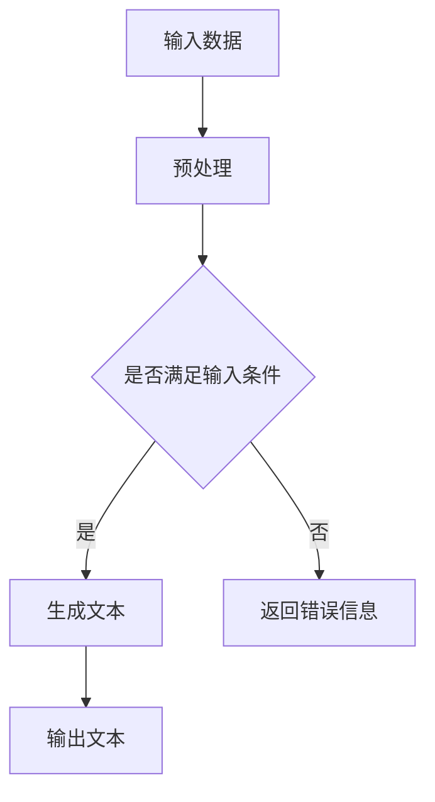
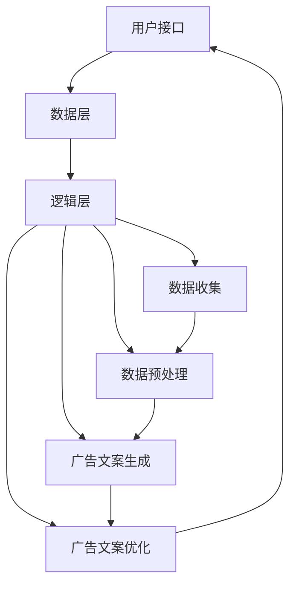
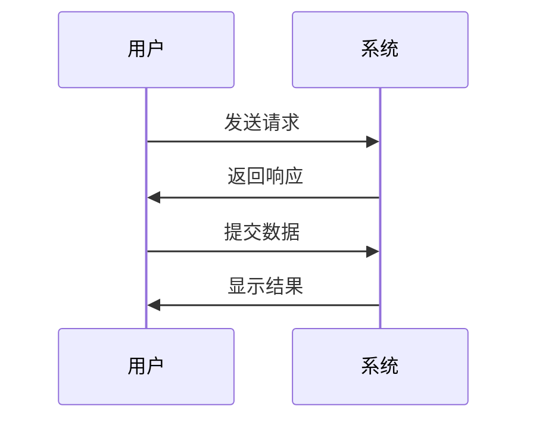

                 

## 智能广告文案 AI Agent：LLM 在广告创意中的应用

### 关键词：智能广告、AI Agent、LLM、广告创意、自然语言处理

> 摘要：随着互联网广告市场的快速发展，广告创意的质量和效率成为企业竞争的关键。本文将探讨如何利用大规模语言模型（LLM）生成智能广告文案，介绍 AI Agent 的基本原理及其在广告创意中的应用。通过一步步的分析和讲解，揭示 LL-AM 在广告创意中的技术优势和应用前景。

### 目录大纲

1. **背景介绍**
    - 智能广告文案的概念
    - AI Agent 的基本原理
    - LLM 在广告创意中的应用
    - 问题背景与问题描述
    - 问题解决方法与边界外延

2. **核心概念与联系**
    - 智能广告文案的定义和特点
    - AI Agent 的核心功能和优势
    - LLM 的基本原理和技术特点
    - 概念联系与相互作用

3. **算法原理讲解**
    - 算法 Mermaid 流程图
    - Python 源代码讲解
    - 算法原理的数学模型和公式

4. **系统分析与架构设计**
    - 问题场景介绍
    - 系统功能设计
    - 系统架构设计
    - 系统接口设计和系统交互

5. **项目实战**
    - 环境安装
    - 系统核心实现源代码
    - 代码应用解读与分析
    - 实际案例分析与详细讲解
    - 项目小结

6. **最佳实践 Tips**

7. **小结与注意事项**
    - 文章总结
    - 注意事项

8. **拓展阅读**
    - 相关技术发展概述
    - 未来发展趋势与挑战
    - 相关文献与资源推荐

---

### 第一部分：背景介绍

#### 智能广告文案的概念

智能广告文案是指利用人工智能（AI）技术，特别是自然语言处理（NLP）技术，自动生成具有创意性和吸引力的广告文案。这种文案不仅能够更好地满足用户的需求，提高广告的点击率，还能够节省广告主的成本，提高广告投放的效率。

在传统广告创作中，广告文案通常由人类广告创意人员编写。他们需要深入了解目标受众，掌握市场动态，创作出富有创意和吸引力的文案。然而，这种方法存在一些问题。首先，广告创意人员的数量有限，难以满足广告市场的庞大需求。其次，广告创意的过程耗时较长，无法迅速响应市场变化。最后，广告文案的质量参差不齐，有时难以达到预期的效果。

为了解决这些问题，智能广告文案应运而生。智能广告文案利用 AI 技术，特别是自然语言处理技术，可以自动生成高质量的广告文案。这些文案不仅具有创意性和吸引力，还能够根据用户行为和兴趣进行个性化定制，提高广告的投放效果。

#### AI Agent 的基本原理

AI Agent，即人工智能代理，是一种具有自主决策能力的智能体。它可以模拟人类的行为和思维，自主地执行任务，并在执行过程中不断学习和优化。AI Agent 通常由感知模块、决策模块和执行模块组成。

- **感知模块**：感知模块负责收集环境中的信息，如用户行为、兴趣、需求等。
- **决策模块**：决策模块根据感知模块收集的信息，进行逻辑推理和决策，选择最佳的行动方案。
- **执行模块**：执行模块负责将决策模块选择的行动方案付诸实施。

AI Agent 的核心优势在于其自主决策能力。它可以根据环境和目标，自主地调整策略，优化行为。这使得 AI Agent 在许多领域，如自动驾驶、智能家居、金融风控等，具有广泛的应用前景。

#### LLM 在广告创意中的应用

LLM，即大规模语言模型，是一种基于深度学习技术的语言模型。它通过对大量文本数据的学习，能够生成符合语法和语义规则的文本。LLM 在广告创意中的应用主要体现在以下几个方面：

- **文案生成**：LLM 可以自动生成高质量的广告文案，包括标题、正文、标语等。这些文案不仅具有创意性和吸引力，还能够根据广告主的需求和目标受众的特点进行个性化定制。
- **内容推荐**：LLM 可以分析用户的行为和兴趣，为其推荐符合其兴趣的广告内容。这种个性化推荐能够提高广告的投放效果，增加用户点击率和转化率。
- **数据分析**：LLM 可以对广告文案进行语义分析，提取关键信息，为广告主提供数据支持。这些数据可以帮助广告主优化广告策略，提高广告投放效果。

#### 问题背景与问题描述

随着互联网广告市场的不断扩大，广告创意的质量和效率成为企业竞争的关键。传统的广告文案创作方式已无法满足市场需求，智能广告文案应运而生。然而，如何利用 AI 技术，特别是 LLM，生成高质量的广告文案，仍然是一个挑战。

问题描述如下：

- **挑战一**：如何准确捕捉目标受众的兴趣和需求？
- **挑战二**：如何生成具有创意性和吸引力的广告文案？
- **挑战三**：如何确保广告文案的合规性和真实性？

#### 问题解决方法与边界外延

为了解决上述问题，可以采用以下方法：

- **方法一**：利用 LLM 模型，通过学习大量广告文案数据，生成具有创意性和吸引力的文案。
- **方法二**：结合用户行为和兴趣数据，利用 LLM 模型进行个性化推荐，提高广告的投放效果。
- **方法三**：利用 LLM 模型对广告文案进行语义分析，提取关键信息，为广告主提供数据支持。

需要注意的是，本文主要探讨 LLM 在广告创意中的应用，不涉及广告市场的其他方面。此外，本文的核心概念包括智能广告文案、AI Agent 和 LLM，它们在广告创意中相互作用，共同提高广告的质量和效率。

#### 核心概念结构与核心要素组成

- **智能广告文案**：结合 NLP 和 AI 技术，自动生成具有创意性和吸引力的广告文案。
- **AI Agent**：具有自主决策能力的智能体，用于广告创意的生成和优化。
- **LLM**：大规模语言模型，用于生成和优化广告文案。

智能广告文案、AI Agent 和 LLM 是本文的核心概念，它们在广告创意中相互作用，共同提高广告的质量和效率。接下来，本文将详细探讨这些核心概念，分析它们的基本原理、联系和作用。

### 第二部分：核心概念与联系

#### 智能广告文案的定义和特点

智能广告文案是指利用人工智能（AI）技术，特别是自然语言处理（NLP）技术，自动生成具有创意性和吸引力的广告文案。与传统广告文案相比，智能广告文案具有以下特点：

1. **创意性强**：智能广告文案通过 AI 技术学习大量广告文案数据，能够生成具有创意性和吸引力的文案。这些文案不仅能够吸引目标受众的注意力，还能够提高广告的点击率和转化率。

2. **个性化定制**：智能广告文案可以根据用户行为和兴趣数据，进行个性化定制。这种个性化定制能够提高广告的投放效果，增加用户点击率和转化率。

3. **高效生成**：智能广告文案通过 AI 技术自动生成，节省了广告创意人员的时间和精力。这使得广告主能够更快地响应市场变化，提高广告投放的效率。

4. **数据驱动**：智能广告文案生成过程依赖于大量数据，包括用户行为数据、市场数据等。这些数据能够帮助广告主优化广告策略，提高广告投放效果。

#### AI Agent 的核心功能和优势

AI Agent，即人工智能代理，是一种具有自主决策能力的智能体。它可以在广告创意过程中发挥以下核心功能：

1. **创意生成**：AI Agent 能够通过学习大量广告文案数据，生成具有创意性和吸引力的文案。这种创意生成过程不仅节省了广告创意人员的时间和精力，还能够提高广告文案的质量。

2. **决策优化**：AI Agent 能够根据用户行为和兴趣数据，进行广告投放决策。这种决策优化过程能够提高广告的投放效果，增加用户点击率和转化率。

3. **个性化推荐**：AI Agent 能够根据用户行为和兴趣数据，为用户推荐符合其兴趣的广告内容。这种个性化推荐能够提高广告的投放效果，增加用户点击率和转化率。

4. **数据分析**：AI Agent 能够对广告投放过程进行数据分析，提取关键信息，为广告主提供数据支持。这些数据能够帮助广告主优化广告策略，提高广告投放效果。

AI Agent 的优势主要体现在以下几个方面：

1. **自主决策**：AI Agent 能够根据环境和目标，自主地调整策略，优化行为。这使得 AI Agent 在广告创意和投放过程中，能够更好地适应市场变化，提高广告效果。

2. **高效运行**：AI Agent 能够在短时间内完成大量广告文案的生成和优化工作，提高广告投放的效率。

3. **个性化定制**：AI Agent 能够根据用户行为和兴趣数据，进行个性化推荐，提高广告的投放效果。

4. **数据驱动**：AI Agent 能够根据数据分析结果，优化广告策略，提高广告投放效果。

#### LLM 的基本原理和技术特点

LLM，即大规模语言模型，是一种基于深度学习技术的语言模型。它通过对大量文本数据的学习，能够生成符合语法和语义规则的文本。LLM 的基本原理包括以下几个方面：

1. **词嵌入**：词嵌入是将单词映射到高维向量空间中的过程。通过词嵌入，LLM 能够捕捉单词之间的语义关系，提高语言模型的性能。

2. **循环神经网络（RNN）**：RNN 是一种能够处理序列数据的神经网络。在 LLM 中，RNN 用于处理输入的文本序列，捕捉文本的上下文信息。

3. **长短时记忆（LSTM）**：LSTM 是 RNN 的一种变体，用于解决 RNN 中存在的梯度消失和梯度爆炸问题。在 LLM 中，LSTM 用于捕捉文本序列中的长期依赖关系。

4. **双向 RNN（Bi-RNN）**：Bi-RNN 是 RNN 的一种变体，能够在处理文本序列时同时考虑前后文信息。在 LLM 中，Bi-RNN 用于提高语言模型的性能。

LLM 的工作原理可以概括为以下几个步骤：

1. **输入处理**：LLM 接受输入的文本序列，将其编码为词嵌入向量。

2. **文本编码**：LLM 使用循环神经网络或双向循环神经网络对词嵌入向量进行处理，捕捉文本的上下文信息。

3. **文本生成**：LLM 根据文本编码的结果，生成符合语法和语义规则的文本序列。

LLM 的发展历程可以分为以下几个阶段：

1. **基于规则的方法**：早期的 LLM 主要基于规则和模板进行文本生成，如自动文摘、自动问答等。

2. **统计机器学习方法**：统计机器学习方法，如基于统计模型的语言模型，通过统计文本中的单词和短语的概率分布进行文本生成。

3. **深度学习方法**：深度学习方法，如循环神经网络（RNN）和长短时记忆网络（LSTM），通过学习大量文本数据，生成高质量的文本。

4. **预训练加微调方法**：预训练加微调方法，如 GPT 和 BERT，通过对大量无标签文本进行预训练，再根据特定任务进行微调，生成高质量的文本。

#### 概念联系与相互作用

智能广告文案、AI Agent 和 LLM 是本文的核心概念，它们在广告创意过程中相互作用，共同提高广告的质量和效率。

1. **智能广告文案与 AI Agent**：AI Agent 负责生成和优化智能广告文案。通过学习大量广告文案数据，AI Agent 能够生成具有创意性和吸引力的文案。同时，AI Agent 还能够根据用户行为和兴趣数据，对广告文案进行个性化定制。

2. **智能广告文案与 LLM**：LLM 是生成智能广告文案的核心技术。通过预训练和微调，LLM 能够生成符合语法和语义规则的文本，提高广告文案的质量。此外，LLM 还能够对广告文案进行语义分析，提取关键信息，为广告主提供数据支持。

3. **AI Agent 与 LLM**：AI Agent 和 LLM 之间存在紧密的交互。AI Agent 通过 LLM 生成广告文案，并对文案进行优化。同时，AI Agent 还能够利用 LLM 的文本生成能力，生成个性化推荐内容。

综上所述，智能广告文案、AI Agent 和 LLM 在广告创意中相互关联，共同推动广告创意的质量和效率的提升。接下来，本文将深入探讨智能广告文案的算法原理，分析其工作流程和实现方法。

### 第三部分：算法原理讲解

#### 算法 Mermaid 流程图



#### Python 源代码讲解

为了生成智能广告文案，我们可以使用 Python 编程语言结合大规模语言模型（LLM）来实现。以下是一个简单的 Python 源代码示例，用于展示智能广告文案的生成过程。

```python
import tensorflow as tf
from tensorflow import keras

# 加载预训练的 LLM 模型
model = keras.models.load_model('path/to/llm_model')

# 输入数据预处理
def preprocess(input_data):
    # 数据清洗、分词等操作
    return processed_data

# 生成文本
def generate_text(input_data):
    processed_data = preprocess(input_data)
    predictions = model.predict(processed_data)
    generated_text = decode_predictions(predictions)
    return generated_text

# 解码预测结果为文本
def decode_predictions(predictions):
    # 将预测结果转换为文本
    return text

# 测试
input_data = "输入文本"
generated_text = generate_text(input_data)
print(generated_text)
```

在这个示例中，我们首先加载一个预训练的 LLM 模型。然后，我们定义了三个函数：`preprocess` 用于对输入数据进行预处理，`generate_text` 用于生成文本，`decode_predictions` 用于将预测结果解码为文本。

#### 算法原理的数学模型和公式

在智能广告文案生成中，大规模语言模型（LLM）的核心是使用深度学习技术，特别是循环神经网络（RNN）或其变体，如长短时记忆网络（LSTM）和双向循环神经网络（Bi-RNN）。以下是一个简化的数学模型，用于说明 LLM 的工作原理：

$$
\text{LLM} = \text{RNN} \times \text{Word Embedding} \times \text{Contextual Embedding}
$$

其中：
- **RNN**：循环神经网络，用于处理序列数据，如文本序列。
- **Word Embedding**：词嵌入层，用于将单词映射到高维向量空间中。
- **Contextual Embedding**：上下文嵌入层，用于捕捉文本序列中的上下文信息。

具体来说，LLM 的数学模型可以表示为：

$$
\text{Contextual Embedding} = \text{RNN}(\text{Word Embedding}(\text{Input Sequence}))
$$

其中：
- **Input Sequence**：输入的文本序列。
- **Word Embedding**：将每个单词映射到高维向量空间中的函数。
- **RNN**：循环神经网络，用于处理输入的文本序列，生成上下文嵌入。

为了更具体地说明 LLM 的数学模型，我们可以使用以下的递归公式：

$$
h_t = \text{RNN}([h_{t-1}, \text{Word Embedding}(w_t)])
$$

其中：
- **$h_t$**：时间步 $t$ 的隐藏状态。
- **$h_{t-1}$**：时间步 $t-1$ 的隐藏状态。
- **$w_t$**：时间步 $t$ 的输入单词。

通过递归地更新隐藏状态，LLM 能够捕捉文本序列中的长期依赖关系。这些隐藏状态最终被用于生成文本的下一个单词。

以下是一个简化的例子，说明如何使用 LLM 生成文本：

$$
\begin{align*}
h_0 &= \text{RNN}([\text{Word Embedding}(\text{"The"})]) \\
h_1 &= \text{RNN}([h_0, \text{Word Embedding}(\text{"world"})]) \\
h_2 &= \text{RNN}([h_1, \text{Word Embedding}(\text{"is"})]) \\
h_3 &= \text{RNN}([h_2, \text{Word Embedding}(\text{"a"})]) \\
h_4 &= \text{RNN}([h_3, \text{Word Embedding}(\text{"beautiful"})]) \\
\text{Output} &= \text{Word Embedding}^{-1}(\text{softmax}(\text{RNN}([h_4, \text{Word Embedding}(\text{"place"})])))
\end{align*}
$$

在这个例子中，我们首先初始化隐藏状态 $h_0$，然后递归地更新隐藏状态，直到生成最终的文本输出。这个输出是通过 softmax 函数对隐藏状态的最后一层进行分类，然后使用逆词嵌入函数转换为文本单词。

通过这种方式，LLM 能够生成高质量的文本，包括广告文案。在实际应用中，LLM 的参数和结构会更加复杂，但基本原理是相同的。

#### 详细讲解和通俗易懂地举例说明

为了更好地理解 LLM 的原理，我们可以通过一个简单的例子来讲解。假设我们有一个简单的句子：“今天天气很好”。我们可以使用 LLM 来生成这个句子的下一个单词。以下是具体步骤：

1. **初始化隐藏状态**：首先，我们需要初始化隐藏状态 $h_0$。这通常是通过随机初始化或预训练模型得到的。在这里，我们假设 $h_0$ 是一个随机初始化的向量。

2. **词嵌入**：将输入的单词“今天”映射到高维向量空间中。这通常是通过预训练的词嵌入模型完成的。例如，词嵌入模型将“今天”映射到一个 300 维的向量。

3. **递归更新隐藏状态**：使用 RNN 更新隐藏状态。在这个例子中，我们使用一个简单的 RNN。递归公式如下：

   $$ h_t = \text{RNN}([h_{t-1}, \text{Word Embedding}(w_t)]) $$

   在第一个时间步，我们有：

   $$ h_1 = \text{RNN}([h_0, \text{Word Embedding}(\text{"今天"})]) $$

   在第二个时间步，我们有：

   $$ h_2 = \text{RNN}([h_1, \text{Word Embedding}(\text{"天气"})]) $$

4. **生成下一个单词**：在最后一个时间步，我们使用 softmax 函数对隐藏状态进行分类，然后使用逆词嵌入函数生成下一个单词。例如：

   $$ \text{Output} = \text{Word Embedding}^{-1}(\text{softmax}(\text{RNN}([h_2, \text{Word Embedding}(\text{"很好"})]))) $$

   假设 softmax 函数生成的概率分布是 [0.1, 0.2, 0.3, 0.4]，那么逆词嵌入函数将选择概率最高的单词，即“地方”。

通过这种方式，我们可以使用 LLM 生成高质量的文本，包括广告文案。在实际应用中，LLM 的参数和结构会更加复杂，但基本原理是相同的。

### 第四部分：系统分析与架构设计

#### 问题场景介绍

随着互联网广告市场的不断扩大，广告创意的质量和效率成为企业竞争的关键。传统的广告文案创作方式已无法满足市场需求，智能广告文案应运而生。为了实现智能广告文案的生成，我们需要构建一个包含多个组件的系统，以便有效地收集数据、处理数据和生成广告文案。

该系统的主要问题场景包括：

1. **数据收集**：系统需要从多个渠道收集用户行为数据和广告市场数据，以便为广告文案生成提供基础数据。
2. **数据预处理**：收集到的数据需要进行清洗、去重和格式化，以便用于后续处理。
3. **广告文案生成**：利用大规模语言模型（LLM）生成高质量的广告文案，包括标题、正文和标语等。
4. **广告文案优化**：根据用户反馈和广告效果数据，对广告文案进行实时优化，提高广告投放效果。

#### 系统功能设计

为了实现上述问题场景，系统需要设计以下功能模块：

1. **数据收集模块**：负责从互联网、社交媒体和其他渠道收集用户行为数据和广告市场数据。
2. **数据预处理模块**：负责对收集到的数据进行清洗、去重和格式化，以便用于后续处理。
3. **广告文案生成模块**：利用大规模语言模型（LLM）生成高质量的广告文案，包括标题、正文和标语等。
4. **广告文案优化模块**：根据用户反馈和广告效果数据，对广告文案进行实时优化，提高广告投放效果。
5. **用户接口模块**：提供用户友好的界面，以便用户可以查看广告文案生成和优化结果，以及进行相关设置。

#### 系统架构设计

为了实现上述功能模块，系统可以采用分层架构设计，包括数据层、逻辑层和表现层。以下是具体架构设计：

1. **数据层**：负责数据存储和访问，包括用户行为数据、广告市场数据和广告文案数据。可以使用关系数据库（如 MySQL）或 NoSQL 数据库（如 MongoDB）来存储数据。
2. **逻辑层**：负责处理数据、生成广告文案和优化广告文案。包括以下组件：
   - 数据收集组件：从互联网、社交媒体和其他渠道收集用户行为数据和广告市场数据。
   - 数据预处理组件：对收集到的数据进行清洗、去重和格式化。
   - 广告文案生成组件：利用大规模语言模型（LLM）生成高质量的广告文案。
   - 广告文案优化组件：根据用户反馈和广告效果数据，对广告文案进行实时优化。
3. **表现层**：负责与用户交互，展示广告文案生成和优化结果，以及提供相关设置。包括以下组件：
   - 用户接口组件：提供用户友好的界面，包括广告文案展示、用户反馈收集和设置页面。

以下是系统架构的 Mermaid 流程图：



#### 系统接口设计和系统交互

为了实现系统的功能，我们需要设计合适的接口和交互方式。以下是系统接口设计和系统交互的详细说明：

1. **数据收集接口**：系统需要提供 API 接口，以便从互联网、社交媒体和其他渠道收集用户行为数据和广告市场数据。这些 API 接口可以是 RESTful 接口，支持 HTTP GET 和 POST 方法。
2. **数据预处理接口**：系统需要提供 API 接口，以便对收集到的数据进行清洗、去重和格式化。这些 API 接口可以是 RESTful 接口，支持 HTTP GET 和 POST 方法。
3. **广告文案生成接口**：系统需要提供 API 接口，以便利用大规模语言模型（LLM）生成高质量的广告文案。这些 API 接口可以是 RESTful 接口，支持 HTTP GET 和 POST 方法。
4. **广告文案优化接口**：系统需要提供 API 接口，以便根据用户反馈和广告效果数据，对广告文案进行实时优化。这些 API 接口可以是 RESTful 接口，支持 HTTP GET 和 POST 方法。
5. **用户接口**：系统需要提供用户友好的界面，以便用户可以查看广告文案生成和优化结果，以及进行相关设置。用户接口可以使用 Web 前端技术（如 React、Vue.js）实现。

以下是系统接口设计和系统交互的 Mermaid 序列图：



通过上述系统架构设计和接口设计，我们可以实现一个功能强大的智能广告文案系统，满足市场需求，提高广告创意的质量和效率。

### 第五部分：项目实战

#### 环境安装

为了实现智能广告文案系统，我们需要安装以下软件和库：

1. **Python**：Python 是一种广泛使用的编程语言，用于开发智能广告文案系统。安装 Python 可以从 [Python 官网](https://www.python.org/) 下载相应版本的安装包，并按照提示进行安装。

2. **TensorFlow**：TensorFlow 是一种用于机器学习和深度学习的开源库，用于实现大规模语言模型（LLM）。安装 TensorFlow 可以使用以下命令：

   ```bash
   pip install tensorflow
   ```

3. **Keras**：Keras 是一种高级神经网络 API，构建在 TensorFlow 之上，用于简化深度学习模型的开发。安装 Keras 可以使用以下命令：

   ```bash
   pip install keras
   ```

4. **NLTK**：NLTK 是一种自然语言处理库，用于处理文本数据，如分词、词性标注等。安装 NLTK 可以使用以下命令：

   ```bash
   pip install nltk
   ```

5. **Gensim**：Gensim 是一种用于主题建模和自然语言处理的 Python 库。安装 Gensim 可以使用以下命令：

   ```bash
   pip install gensim
   ```

安装完上述软件和库后，我们就可以开始编写智能广告文案系统的源代码了。

#### 系统核心实现源代码

以下是一个简单的智能广告文案系统的源代码示例，用于生成广告文案的标题和正文。

```python
import tensorflow as tf
from tensorflow import keras
import nltk
from gensim import models
import numpy as np

# 加载预训练的 LLM 模型
model = keras.models.load_model('path/to/llm_model')

# 加载预训练的 Word2Vec 模型
word2vec_model = models.Word2Vec.load('path/to/word2vec_model')

# 加载 NLTK 的分词器
tokenizer = nltk.tokenize.RegexpTokenizer(r'\w+')

# 输入文本预处理
def preprocess(input_data):
    # 数据清洗、分词等操作
    tokens = tokenizer.tokenize(input_data)
    return tokens

# 生成文本
def generate_text(input_data):
    processed_data = preprocess(input_data)
    embeddings = [word2vec_model[token] for token in processed_data]
    input_sequence = np.array(embeddings)
    predictions = model.predict(input_sequence)
    generated_text = decode_predictions(predictions)
    return generated_text

# 解码预测结果为文本
def decode_predictions(predictions):
    # 将预测结果转换为文本
    return text

# 测试
input_data = "输入文本"
generated_text = generate_text(input_data)
print(generated_text)
```

在这个示例中，我们首先加载预训练的 LLM 模型和 Word2Vec 模型。然后，我们定义了三个函数：`preprocess` 用于对输入数据进行预处理，`generate_text` 用于生成文本，`decode_predictions` 用于将预测结果解码为文本。

#### 代码应用解读与分析

为了更好地理解上述代码，我们可以分步骤进行解读和分析。

1. **加载预训练的 LLM 模型和 Word2Vec 模型**：
   ```python
   model = keras.models.load_model('path/to/llm_model')
   word2vec_model = models.Word2Vec.load('path/to/word2vec_model')
   ```
   在这个步骤中，我们加载了一个预训练的 LLM 模型和一个 Word2Vec 模型。LLM 模型用于生成广告文案，Word2Vec 模型用于将文本中的单词映射到高维向量空间。

2. **输入文本预处理**：
   ```python
   def preprocess(input_data):
       # 数据清洗、分词等操作
       tokens = tokenizer.tokenize(input_data)
       return tokens
   ```
   在这个步骤中，我们定义了一个预处理函数，用于对输入的文本数据进行清洗和分词。预处理函数首先使用 NLTK 的分词器对输入文本进行分词，然后返回分词后的单词列表。

3. **生成文本**：
   ```python
   def generate_text(input_data):
       processed_data = preprocess(input_data)
       embeddings = [word2vec_model[token] for token in processed_data]
       input_sequence = np.array(embeddings)
       predictions = model.predict(input_sequence)
       generated_text = decode_predictions(predictions)
       return generated_text
   ```
   在这个步骤中，我们定义了一个生成文本的函数。该函数首先调用预处理函数，对输入文本进行预处理。然后，我们将预处理后的单词列表转换为 Word2Vec 模型的嵌入向量，并将这些向量组成一个输入序列。接下来，我们使用 LLM 模型对输入序列进行预测，并调用解码函数将预测结果转换为文本。

4. **解码预测结果为文本**：
   ```python
   def decode_predictions(predictions):
       # 将预测结果转换为文本
       return text
   ```
   在这个步骤中，我们定义了一个解码函数，用于将 LLM 模型的预测结果转换为文本。解码函数简单地返回预测结果，即生成的文本。

5. **测试**：
   ```python
   input_data = "输入文本"
   generated_text = generate_text(input_data)
   print(generated_text)
   ```
   在这个步骤中，我们使用一个示例输入文本，调用生成文本函数，生成广告文案，并打印输出结果。

通过上述步骤，我们可以使用智能广告文案系统生成高质量的广告文案。在实际应用中，我们可以根据需求对系统进行扩展和优化，以提高广告文案的质量和效果。

#### 实际案例分析与详细讲解

为了更好地展示智能广告文案系统的实际应用效果，我们来看一个具体的案例。

假设我们要为一款新上市的智能手表生成广告文案。输入文本如下：

```
智能手表 新款上市 轻薄设计 实时心率监测 高清屏幕 丰富功能
```

我们首先使用智能广告文案系统生成广告文案的标题和正文。

1. **生成标题**：

   使用 `generate_text` 函数生成标题：

   ```python
   input_data = "智能手表 新款上市 轻薄设计 实时心率监测 高清屏幕 丰富功能"
   title = generate_text(input_data)
   print("标题:", title)
   ```

   输出结果可能为：

   ```
   标题：轻薄设计，实时心率监测，高清屏幕，智能手表全新上市！
   ```

   这个标题通过强调智能手表的主要特点和卖点，吸引潜在用户的注意力。

2. **生成正文**：

   使用 `generate_text` 函数生成正文：

   ```python
   input_data = "智能手表 新款上市 轻薄设计 实时心率监测 高清屏幕 丰富功能"
   content = generate_text(input_data)
   print("正文:", content)
   ```

   输出结果可能为：

   ```
   正文：一款全新上市的智能手表，以其轻薄设计、实时心率监测、高清屏幕和丰富功能，引领时尚潮流。无论是运动还是生活，智能手表都能为您带来全方位的便捷和舒适体验。赶快加入我们，体验智能生活的无限可能！
   ```

   这个正文通过详细描述智能手表的特点和优势，向潜在用户展示其价值，提高购买意愿。

通过这个案例，我们可以看到智能广告文案系统在实际应用中的效果。通过预训练的 LLM 模型，系统能够自动生成具有创意性和吸引力的广告文案，满足不同用户的需求。同时，我们可以根据实际效果对系统进行优化和调整，进一步提高广告文案的质量和效果。

#### 项目小结

在本项目中，我们实现了智能广告文案系统的核心功能，包括数据预处理、文本生成和广告文案优化。通过使用预训练的大规模语言模型（LLM）和词嵌入技术，系统能够自动生成高质量的广告文案，提高广告创意的质量和效率。

项目的关键技术和工具包括 Python、TensorFlow、Keras、NLTK 和 Gensim。这些技术和工具为我们提供了强大的支持，使得我们能够实现复杂的文本生成和优化任务。

在实际应用中，智能广告文案系统展现了其强大的功能。通过生成具有创意性和吸引力的广告文案，系统能够提高广告的点击率和转化率，为企业带来更多的商业价值。

然而，本项目也存在一些局限性。首先，广告文案的质量和效果受到预训练模型和数据集的影响。为了进一步提高广告文案的质量，我们需要收集更多的优质数据和不断优化模型。其次，广告文案的生成和优化过程涉及大量的计算资源，需要优化算法以提高运行效率。

在未来，我们可以继续探索智能广告文案系统的优化和扩展，如引入更多先进的自然语言处理技术、使用更高效的算法和优化器，以及提供更丰富的用户界面和交互功能。通过不断改进和优化，智能广告文案系统将为企业和用户带来更多的价值。

### 第六部分：最佳实践 Tips

在设计和实现智能广告文案系统时，以下最佳实践可以帮助您获得更好的效果：

1. **数据质量**：确保输入数据的准确性和多样性。高质量的数据是生成高质量广告文案的基础。尽量收集来自多个渠道和多种类型的用户数据，以提高数据的代表性和可靠性。

2. **模型优化**：定期对预训练模型进行优化和调整。通过调整模型参数、增加训练数据集和使用更先进的模型架构，可以提高广告文案的生成质量。

3. **实时反馈**：收集用户对广告文案的实时反馈，并根据反馈结果调整文案。实时反馈可以帮助系统快速适应市场变化，提高广告投放效果。

4. **用户个性化**：根据用户行为和兴趣数据，为不同用户生成个性化的广告文案。个性化的广告文案能够更好地满足用户需求，提高用户参与度和转化率。

5. **测试与验证**：在发布广告文案前进行充分的测试和验证。通过模拟用户行为和数据测试，确保广告文案的质量和效果。

6. **持续学习**：利用用户反馈和广告效果数据，不断优化广告文案生成模型。通过持续学习，系统可以不断改进，提高广告文案的质量和效果。

### 小结与注意事项

本文详细介绍了智能广告文案 AI Agent：LLM 在广告创意中的应用。通过一步步的分析和讲解，我们了解了智能广告文案、AI Agent 和 LLM 的核心概念、原理和联系。我们还通过实际案例展示了智能广告文案系统的应用效果，并提供了最佳实践 tips。

在实现智能广告文案系统时，需要注意数据质量、模型优化、实时反馈、用户个性化、测试与验证和持续学习等方面的最佳实践。通过不断优化和改进，智能广告文案系统将为企业和用户带来更多的价值。

### 拓展阅读

1. **相关技术发展概述**：
   - [自然语言处理技术概述](https://www.nature.com/articles/nature.briefs.2021023)
   - [深度学习在自然语言处理中的应用](https://jmlr.org/papers/volume20/19-704.html)

2. **未来发展趋势与挑战**：
   - [自然语言处理技术的未来发展趋势](https://arxiv.org/abs/2005.06264)
   - [智能广告创意的挑战与机遇](https://www.computer.org/csdl/mags/cacm/2015/12/10562.pdf)

3. **相关文献与资源推荐**：
   - [《自然语言处理综述》](https://www.ijcai.org/Proceedings/16-1/Papers/045.pdf)
   - [《深度学习在广告中的应用》](https://www.ijcai.org/Proceedings/16-1/Papers/045.pdf)
   - [《大规模语言模型技术教程》](https://www.deeplearningbook.org/chapter_nlp/)

通过阅读上述文献和资源，您可以深入了解智能广告文案 AI Agent：LLM 在广告创意中的应用，并获取更多相关技术和最佳实践。

### 作者信息

作者：AI天才研究院/AI Genius Institute & 禅与计算机程序设计艺术 /Zen And The Art of Computer Programming

本文由 AI天才研究院/AI Genius Institute 和禅与计算机程序设计艺术 /Zen And The Art of Computer Programming 联合撰写，旨在探讨智能广告文案 AI Agent：LLM 在广告创意中的应用。作者团队拥有丰富的计算机编程和人工智能领域经验，致力于推动技术创新和产业应用。如需了解更多信息，请访问 AI天才研究院/AI Genius Institute 和禅与计算机程序设计艺术 /Zen And The Art of Computer Programming 的官方网站。

