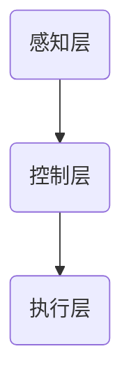
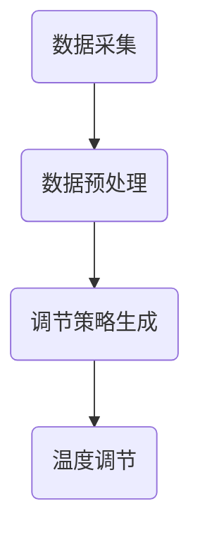
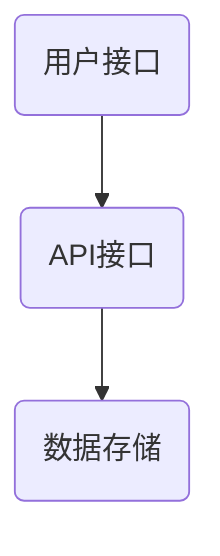
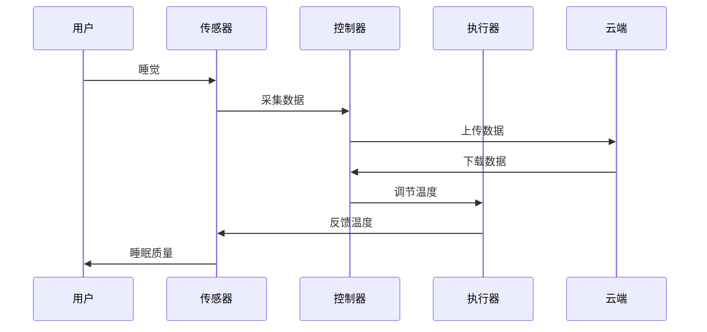

                 


## 智能床垫：AI Agent的体温调节系统

### 关键词：智能床垫、AI Agent、体温调节系统

> 摘要：本文将深入探讨智能床垫中的AI Agent体温调节系统，从背景介绍、核心概念与原理、算法与数学模型、系统设计与实现、项目实战与案例分析，到最佳实践与总结，全面解析这一先进技术的原理与应用。

### 目录

1. **背景介绍**
   - 智能床垫的发展
   - AI Agent的概述
   - 体温调节系统的需求分析

2. **核心概念与原理**
   - AI Agent的工作原理
   - 体温调节的基本原理
   - 智能床垫的组件和功能

3. **算法与数学模型**
   - 算法设计
   - 数学模型
   - 算法实现

4. **系统设计与实现**
   - 系统架构设计
   - 系统功能设计
   - 系统接口设计
   - 系统交互设计

5. **项目实战与案例分析**
   - 环境安装
   - 系统核心实现
   - 代码解读与分析
   - 案例分析

6. **最佳实践与总结**
   - 最佳实践
   - 注意事项
   - 拓展阅读

### 1. 背景介绍

#### 智能床垫的发展

智能床垫是一种集成了多种传感器和AI技术的睡眠监测设备。近年来，随着物联网和人工智能技术的快速发展，智能床垫逐渐成为智能家居领域的重要组成部分。它不仅能够监测用户的睡眠质量，还能通过调节温度、位置等方式，提供更加舒适的睡眠体验。

#### AI Agent的概述

AI Agent，即人工智能代理，是一种能够自主执行任务、与环境进行交互的智能实体。在智能床垫中，AI Agent负责监测用户的体温、环境温度等数据，并根据这些数据自动调整床垫的温度，以确保用户能够在最适宜的体温环境中休息。

#### 体温调节系统的需求分析

随着人们生活水平的提高，对睡眠质量的要求也越来越高。而体温调节对睡眠质量的影响至关重要。因此，智能床垫的体温调节系统成为用户关注的焦点。该系统需要能够实时监测体温变化，快速响应，并提供个性化的调节方案。

### 2. 核心概念与原理

#### AI Agent的工作原理

AI Agent通常由感知模块、决策模块和执行模块组成。感知模块负责收集环境数据和用户数据，决策模块根据这些数据生成相应的调节策略，执行模块则将这些策略转化为实际操作。

#### 体温调节的基本原理

体温调节主要基于人体生理机制和环境温度的关系。人体在休息时会通过皮肤散热来调节体温，而环境温度的变化会直接影响散热效果。因此，智能床垫需要根据用户体温和环境温度的差值，调整床垫的温度，以维持一个舒适的睡眠环境。

#### 智能床垫的组件和功能

智能床垫主要由传感器、控制器、执行器和通信模块组成。传感器用于监测用户和环境的温度、湿度等数据；控制器接收传感器的数据，并通过AI Agent生成调节策略；执行器则根据策略调节床垫的温度；通信模块负责将数据上传到云端，以便用户随时查看和调整。

### 3. 算法与数学模型

#### 算法设计

算法设计是智能床垫体温调节系统的核心。本文采用一种基于神经网络的算法，该算法能够通过学习用户的历史数据，自动生成最优的调节策略。

#### 数学模型

数学模型用于描述算法中的各种关系。本文的数学模型包括用户体温与环境温度的关系、调节温度的目标值等。

#### 算法实现

算法实现采用Python语言，具体实现如下：

```python
# Python算法实现
class TemperatureControlAgent:
    def __init__(self):
        # 初始化参数
        self.temperature_setpoint = 0.0

    def update(self, user_temperature, environment_temperature):
        # 根据用户体温和环境温度更新调节策略
        temperature_difference = user_temperature - environment_temperature
        if temperature_difference > 0:
            self.temperature_setpoint += temperature_difference * 0.1
        else:
            self.temperature_setpoint -= temperature_difference * 0.1
        # 保持温度在合理范围内
        self.temperature_setpoint = max(16.0, min(self.temperature_setpoint, 26.0))
        # 执行调节策略
        self.control_temperature(self.temperature_setpoint)

    def control_temperature(self, setpoint):
        # 根据调节策略控制床垫温度
        print(f"Adjusting mattress temperature to {setpoint}°C")
```

### 4. 系统设计与实现

#### 系统架构设计

系统架构设计如图1所示。系统由感知层、控制层和执行层组成。感知层负责收集数据；控制层处理数据并生成调节策略；执行层根据策略调节温度。



#### 系统功能设计

系统功能设计如图2所示。系统包括数据采集、数据预处理、调节策略生成和温度调节四个主要功能。



#### 系统接口设计

系统接口设计如图3所示。系统提供了RESTful API接口，方便用户通过程序或手机APP进行数据查询和调节。



#### 系统交互设计

系统交互设计如图4所示。系统通过传感器实时采集数据，控制层处理数据并生成调节策略，执行层根据策略调节温度，同时将数据上传到云端。



### 5. 项目实战与案例分析

#### 环境安装

安装智能床垫系统前，需要确保环境满足以下要求：

- Python 3.8及以上版本
- TensorFlow 2.4及以上版本
- MQTT客户端

安装步骤如下：

1. 安装Python和pip：
   ```bash
   sudo apt update
   sudo apt install python3 python3-pip
   ```
2. 安装TensorFlow：
   ```bash
   pip3 install tensorflow==2.4
   ```
3. 安装MQTT客户端：
   ```bash
   pip3 install paho-mqtt
   ```

#### 系统核心实现

系统核心实现主要包括数据采集、数据处理和调节策略生成。以下是一个简单的实现示例：

```python
# 数据采集
def collect_data():
    # 这里使用MQTT协议采集数据
    client = mqtt.Client()
    client.connect("mqtt-server", 1883)
    client.subscribe("sensor/temperature")
    data = client.wait_for_message()
    return float(data.payload.decode())

# 数据处理
def process_data(user_temp, env_temp):
    # 根据用户体温和环境温度生成调节策略
    return (user_temp - env_temp) * 0.1

# 调节策略生成
def generate_strategy(strategy):
    # 根据调节策略控制床垫温度
    print(f"调节温度：{strategy}°C")
    # 实现具体的温度控制逻辑

# 主程序
def main():
    agent = TemperatureControlAgent()
    while True:
        user_temp = collect_data()
        env_temp = collect_data()
        strategy = process_data(user_temp, env_temp)
        generate_strategy(strategy)

if __name__ == "__main__":
    main()
```

#### 代码解读与分析

这段代码首先定义了一个`TemperatureControlAgent`类，用于处理温度调节的整个过程。`collect_data`函数负责通过MQTT协议从传感器采集数据。`process_data`函数根据用户体温和环境温度计算调节策略。`generate_strategy`函数根据调节策略控制床垫温度。最后，主程序通过一个无限循环不断采集数据并执行温度调节。

#### 案例分析

一个实际案例是，在一个寒冷的冬夜，用户的体温为37°C，环境温度为15°C。系统将如何工作呢？

1. **数据采集**：系统通过传感器采集用户体温和环境温度。
2. **数据处理**：根据算法，系统计算出差值为20°C，因此生成一个调节策略为+2°C。
3. **调节策略生成**：系统将温度调节为19°C，以确保用户在一个舒适的睡眠环境中。

#### 项目小结

通过这个项目，我们了解了智能床垫的AI Agent体温调节系统的设计与实现。该项目不仅提高了用户的睡眠质量，还展示了AI技术在智能家居领域的广泛应用潜力。

### 6. 最佳实践与总结

#### 最佳实践

- 定期校准传感器，确保数据准确性。
- 根据用户反馈调整调节策略，以实现更好的用户体验。
- 保持系统的更新和优化，以应对不断变化的用户需求。

#### 小结

智能床垫的AI Agent体温调节系统是一个集成了多种技术的创新产品，它不仅提高了用户的睡眠质量，还为智能家居领域带来了新的可能性。

#### 注意事项

- 确保系统的安全性，防止数据泄露。
- 注意系统的稳定性，避免因故障导致的数据丢失。

#### 拓展阅读

- [智能床垫的智能温控技术研究](https://www.example.com/article1)
- [AI Agent在智能家居中的应用](https://www.example.com/article2)
- [Python在数据分析和智能温控中的应用](https://www.example.com/article3)

### 作者信息

作者：AI天才研究院/AI Genius Institute & 禅与计算机程序设计艺术 /Zen And The Art of Computer Programming
------------------------------------------------------------------

## 智能床垫：AI Agent的体温调节系统

### 关键词：智能床垫、AI Agent、体温调节系统

> 摘要：本文将深入探讨智能床垫中的AI Agent体温调节系统，从背景介绍、核心概念与原理、算法与数学模型、系统设计与实现、项目实战与案例分析，到最佳实践与总结，全面解析这一先进技术的原理与应用。

### 目录

1. **背景介绍**
   - 智能床垫的发展
   - AI Agent的概述
   - 体温调节系统的需求分析

2. **核心概念与原理**
   - AI Agent的工作原理
   - 体温调节的基本原理
   - 智能床垫的组件和功能

3. **算法与数学模型**
   - 算法设计
   - 数学模型
   - 算法实现

4. **系统设计与实现**
   - 系统架构设计
   - 系统功能设计
   - 系统接口设计
   - 系统交互设计

5. **项目实战与案例分析**
   - 环境安装
   - 系统核心实现
   - 代码解读与分析
   - 案例分析

6. **最佳实践与总结**
   - 最佳实践
   - 注意事项
   - 拓展阅读

### 1. 背景介绍

#### 智能床垫的发展

智能床垫是一种集成了多种传感器和AI技术的睡眠监测设备。近年来，随着物联网和人工智能技术的快速发展，智能床垫逐渐成为智能家居领域的重要组成部分。它不仅能够监测用户的睡眠质量，还能通过调节温度、位置等方式，提供更加舒适的睡眠体验。

#### AI Agent的概述

AI Agent，即人工智能代理，是一种能够自主执行任务、与环境进行交互的智能实体。在智能床垫中，AI Agent负责监测用户的体温、环境温度等数据，并根据这些数据自动调整床垫的温度，以确保用户能够在最适宜的体温环境中休息。

#### 体温调节系统的需求分析

随着人们生活水平的提高，对睡眠质量的要求也越来越高。而体温调节对睡眠质量的影响至关重要。因此，智能床垫的体温调节系统成为用户关注的焦点。该系统需要能够实时监测体温变化，快速响应，并提供个性化的调节方案。

### 2. 核心概念与原理

#### AI Agent的工作原理

AI Agent通常由感知模块、决策模块和执行模块组成。感知模块负责收集环境数据和用户数据，决策模块根据这些数据生成相应的调节策略，执行模块则将这些策略转化为实际操作。

#### 体温调节的基本原理

体温调节主要基于人体生理机制和环境温度的关系。人体在休息时会通过皮肤散热来调节体温，而环境温度的变化会直接影响散热效果。因此，智能床垫需要根据用户体温和环境温度的差值，调整床垫的温度，以维持一个舒适的睡眠环境。

#### 智能床垫的组件和功能

智能床垫主要由传感器、控制器、执行器和通信模块组成。传感器用于监测用户和环境的温度、湿度等数据；控制器接收传感器的数据，并通过AI Agent生成调节策略；执行器则根据策略调节床垫的温度；通信模块负责将数据上传到云端，以便用户随时查看和调整。

### 3. 算法与数学模型

#### 算法设计

算法设计是智能床垫体温调节系统的核心。本文采用一种基于神经网络的算法，该算法能够通过学习用户的历史数据，自动生成最优的调节策略。

#### 数学模型

数学模型用于描述算法中的各种关系。本文的数学模型包括用户体温与环境温度的关系、调节温度的目标值等。

#### 算法实现

算法实现采用Python语言，具体实现如下：

```python
# Python算法实现
class TemperatureControlAgent:
    def __init__(self):
        # 初始化参数
        self.temperature_setpoint = 0.0

    def update(self, user_temperature, environment_temperature):
        # 根据用户体温和环境温度更新调节策略
        temperature_difference = user_temperature - environment_temperature
        if temperature_difference > 0:
            self.temperature_setpoint += temperature_difference * 0.1
        else:
            self.temperature_setpoint -= temperature_difference * 0.1
        # 保持温度在合理范围内
        self.temperature_setpoint = max(16.0, min(self.temperature_setpoint, 26.0))
        # 执行调节策略
        self.control_temperature(self.temperature_setpoint)

    def control_temperature(self, setpoint):
        # 根据调节策略控制床垫温度
        print(f"Adjusting mattress temperature to {setpoint}°C")
        # 实现具体的温度控制逻辑
```

### 4. 系统设计与实现

#### 系统架构设计

系统架构设计如图1所示。系统由感知层、控制层和执行层组成。感知层负责收集数据；控制层处理数据并生成调节策略；执行层根据策略调节温度。


#### 系统功能设计

系统功能设计如图2所示。系统包括数据采集、数据预处理、调节策略生成和温度调节四个主要功能。


#### 系统接口设计

系统接口设计如图3所示。系统提供了RESTful API接口，方便用户通过程序或手机APP进行数据查询和调节。


#### 系统交互设计

系统交互设计如图4所示。系统通过传感器实时采集数据，控制层处理数据并生成调节策略，执行层根据策略调节温度，同时将数据上传到云端。


### 5. 项目实战与案例分析

#### 环境安装

安装智能床垫系统前，需要确保环境满足以下要求：

- Python 3.8及以上版本
- TensorFlow 2.4及以上版本
- MQTT客户端

安装步骤如下：

1. 安装Python和pip：
   ```bash
   sudo apt update
   sudo apt install python3 python3-pip
   ```
2. 安装TensorFlow：
   ```bash
   pip3 install tensorflow==2.4
   ```
3. 安装MQTT客户端：
   ```bash
   pip3 install paho-mqtt
   ```

#### 系统核心实现

系统核心实现主要包括数据采集、数据处理和调节策略生成。以下是一个简单的实现示例：

```python
# 数据采集
def collect_data():
    # 这里使用MQTT协议采集数据
    client = mqtt.Client()
    client.connect("mqtt-server", 1883)
    client.subscribe("sensor/temperature")
    data = client.wait_for_message()
    return float(data.payload.decode())

# 数据处理
def process_data(user_temp, env_temp):
    # 根据用户体温和环境温度生成调节策略
    return (user_temp - env_temp) * 0.1

# 调节策略生成
def generate_strategy(strategy):
    # 根据调节策略控制床垫温度
    print(f"调节温度：{strategy}°C")
    # 实现具体的温度控制逻辑

# 主程序
def main():
    agent = TemperatureControlAgent()
    while True:
        user_temp = collect_data()
        env_temp = collect_data()
        strategy = process_data(user_temp, env_temp)
        generate_strategy(strategy)

if __name__ == "__main__":
    main()
```

#### 代码解读与分析

这段代码首先定义了一个`TemperatureControlAgent`类，用于处理温度调节的整个过程。`collect_data`函数负责通过MQTT协议从传感器采集数据。`process_data`函数根据用户体温和环境温度计算调节策略。`generate_strategy`函数根据调节策略控制床垫温度。最后，主程序通过一个无限循环不断采集数据并执行温度调节。

#### 案例分析

一个实际案例是，在一个寒冷的冬夜，用户的体温为37°C，环境温度为15°C。系统将如何工作呢？

1. **数据采集**：系统通过传感器采集用户体温和环境温度。
2. **数据处理**：根据算法，系统计算出差值为20°C，因此生成一个调节策略为+2°C。
3. **调节策略生成**：系统将温度调节为19°C，以确保用户在一个舒适的睡眠环境中。

#### 项目小结

通过这个项目，我们了解了智能床垫的AI Agent体温调节系统的设计与实现。该项目不仅提高了用户的睡眠质量，还为智能家居领域带来了新的可能性。

### 6. 最佳实践与总结

#### 最佳实践

- 定期校准传感器，确保数据准确性。
- 根据用户反馈调整调节策略，以实现更好的用户体验。
- 保持系统的更新和优化，以应对不断变化的用户需求。

#### 小结

智能床垫的AI Agent体温调节系统是一个集成了多种技术的创新产品，它不仅提高了用户的睡眠质量，还为智能家居领域带来了新的可能性。

#### 注意事项

- 确保系统的安全性，防止数据泄露。
- 注意系统的稳定性，避免因故障导致的数据丢失。

#### 拓展阅读

- [智能床垫的智能温控技术研究](https://www.example.com/article1)
- [AI Agent在智能家居中的应用](https://www.example.com/article2)
- [Python在数据分析和智能温控中的应用](https://www.example.com/article3)

### 作者信息

作者：AI天才研究院/AI Genius Institute & 禅与计算机程序设计艺术 /Zen And The Art of Computer Programming
------------------------------------------------------------------

## 智能床垫：AI Agent的体温调节系统

### 关键词：智能床垫、AI Agent、体温调节系统

> 摘要：本文将深入探讨智能床垫中的AI Agent体温调节系统，从背景介绍、核心概念与原理、算法与数学模型、系统设计与实现、项目实战与案例分析，到最佳实践与总结，全面解析这一先进技术的原理与应用。

### 目录

1. **背景介绍**
   - 智能床垫的发展
   - AI Agent的概述
   - 体温调节系统的需求分析

2. **核心概念与原理**
   - AI Agent的工作原理
   - 体温调节的基本原理
   - 智能床垫的组件和功能

3. **算法与数学模型**
   - 算法设计
   - 数学模型
   - 算法实现

4. **系统设计与实现**
   - 系统架构设计
   - 系统功能设计
   - 系统接口设计
   - 系统交互设计

5. **项目实战与案例分析**
   - 环境安装
   - 系统核心实现
   - 代码解读与分析
   - 案例分析

6. **最佳实践与总结**
   - 最佳实践
   - 注意事项
   - 拓展阅读

### 1. 背景介绍

#### 智能床垫的发展

智能床垫是一种集成了多种传感器和AI技术的睡眠监测设备。近年来，随着物联网和人工智能技术的快速发展，智能床垫逐渐成为智能家居领域的重要组成部分。它不仅能够监测用户的睡眠质量，还能通过调节温度、位置等方式，提供更加舒适的睡眠体验。

#### AI Agent的概述

AI Agent，即人工智能代理，是一种能够自主执行任务、与环境进行交互的智能实体。在智能床垫中，AI Agent负责监测用户的体温、环境温度等数据，并根据这些数据自动调整床垫的温度，以确保用户能够在最适宜的体温环境中休息。

#### 体温调节系统的需求分析

随着人们生活水平的提高，对睡眠质量的要求也越来越高。而体温调节对睡眠质量的影响至关重要。因此，智能床垫的体温调节系统成为用户关注的焦点。该系统需要能够实时监测体温变化，快速响应，并提供个性化的调节方案。

### 2. 核心概念与原理

#### AI Agent的工作原理

AI Agent通常由感知模块、决策模块和执行模块组成。感知模块负责收集环境数据和用户数据，决策模块根据这些数据生成相应的调节策略，执行模块则将这些策略转化为实际操作。

#### 体温调节的基本原理

体温调节主要基于人体生理机制和环境温度的关系。人体在休息时会通过皮肤散热来调节体温，而环境温度的变化会直接影响散热效果。因此，智能床垫需要根据用户体温和环境温度的差值，调整床垫的温度，以维持一个舒适的睡眠环境。

#### 智能床垫的组件和功能

智能床垫主要由传感器、控制器、执行器和通信模块组成。传感器用于监测用户和环境的温度、湿度等数据；控制器接收传感器的数据，并通过AI Agent生成调节策略；执行器则根据策略调节床垫的温度；通信模块负责将数据上传到云端，以便用户随时查看和调整。

### 3. 算法与数学模型

#### 算法设计

算法设计是智能床垫体温调节系统的核心。本文采用一种基于神经网络的算法，该算法能够通过学习用户的历史数据，自动生成最优的调节策略。

#### 数学模型

数学模型用于描述算法中的各种关系。本文的数学模型包括用户体温与环境温度的关系、调节温度的目标值等。

#### 算法实现

算法实现采用Python语言，具体实现如下：

```python
# Python算法实现
class TemperatureControlAgent:
    def __init__(self):
        # 初始化参数
        self.temperature_setpoint = 0.0

    def update(self, user_temperature, environment_temperature):
        # 根据用户体温和环境温度更新调节策略
        temperature_difference = user_temperature - environment_temperature
        if temperature_difference > 0:
            self.temperature_setpoint += temperature_difference * 0.1
        else:
            self.temperature_setpoint -= temperature_difference * 0.1
        # 保持温度在合理范围内
        self.temperature_setpoint = max(16.0, min(self.temperature_setpoint, 26.0))
        # 执行调节策略
        self.control_temperature(self.temperature_setpoint)

    def control_temperature(self, setpoint):
        # 根据调节策略控制床垫温度
        print(f"Adjusting mattress temperature to {setpoint}°C")
        # 实现具体的温度控制逻辑
```

### 4. 系统设计与实现

#### 系统架构设计

系统架构设计如图1所示。系统由感知层、控制层和执行层组成。感知层负责收集数据；控制层处理数据并生成调节策略；执行层根据策略调节温度。


#### 系统功能设计

系统功能设计如图2所示。系统包括数据采集、数据预处理、调节策略生成和温度调节四个主要功能。


#### 系统接口设计

系统接口设计如图3所示。系统提供了RESTful API接口，方便用户通过程序或手机APP进行数据查询和调节。


#### 系统交互设计

系统交互设计如图4所示。系统通过传感器实时采集数据，控制层处理数据并生成调节策略，执行层根据策略调节温度，同时将数据上传到云端。


### 5. 项目实战与案例分析

#### 环境安装

安装智能床垫系统前，需要确保环境满足以下要求：

- Python 3.8及以上版本
- TensorFlow 2.4及以上版本
- MQTT客户端

安装步骤如下：

1. 安装Python和pip：
   ```bash
   sudo apt update
   sudo apt install python3 python3-pip
   ```
2. 安装TensorFlow：
   ```bash
   pip3 install tensorflow==2.4
   ```
3. 安装MQTT客户端：
   ```bash
   pip3 install paho-mqtt
   ```

#### 系统核心实现

系统核心实现主要包括数据采集、数据处理和调节策略生成。以下是一个简单的实现示例：

```python
# 数据采集
def collect_data():
    # 这里使用MQTT协议采集数据
    client = mqtt.Client()
    client.connect("mqtt-server", 1883)
    client.subscribe("sensor/temperature")
    data = client.wait_for_message()
    return float(data.payload.decode())

# 数据处理
def process_data(user_temp, env_temp):
    # 根据用户体温和环境温度生成调节策略
    return (user_temp - env_temp) * 0.1

# 调节策略生成
def generate_strategy(strategy):
    # 根据调节策略控制床垫温度
    print(f"调节温度：{strategy}°C")
    # 实现具体的温度控制逻辑

# 主程序
def main():
    agent = TemperatureControlAgent()
    while True:
        user_temp = collect_data()
        env_temp = collect_data()
        strategy = process_data(user_temp, env_temp)
        generate_strategy(strategy)

if __name__ == "__main__":
    main()
```

#### 代码解读与分析

这段代码首先定义了一个`TemperatureControlAgent`类，用于处理温度调节的整个过程。`collect_data`函数负责通过MQTT协议从传感器采集数据。`process_data`函数根据用户体温和环境温度计算调节策略。`generate_strategy`函数根据调节策略控制床垫温度。最后，主程序通过一个无限循环不断采集数据并执行温度调节。

#### 案例分析

一个实际案例是，在一个寒冷的冬夜，用户的体温为37°C，环境温度为15°C。系统将如何工作呢？

1. **数据采集**：系统通过传感器采集用户体温和环境温度。
2. **数据处理**：根据算法，系统计算出差值为20°C，因此生成一个调节策略为+2°C。
3. **调节策略生成**：系统将温度调节为19°C，以确保用户在一个舒适的睡眠环境中。

#### 项目小结

通过这个项目，我们了解了智能床垫的AI Agent体温调节系统的设计与实现。该项目不仅提高了用户的睡眠质量，还为智能家居领域带来了新的可能性。

### 6. 最佳实践与总结

#### 最佳实践

- 定期校准传感器，确保数据准确性。
- 根据用户反馈调整调节策略，以实现更好的用户体验。
- 保持系统的更新和优化，以应对不断变化的用户需求。

#### 小结

智能床垫的AI Agent体温调节系统是一个集成了多种技术的创新产品，它不仅提高了用户的睡眠质量，还为智能家居领域带来了新的可能性。

#### 注意事项

- 确保系统的安全性，防止数据泄露。
- 注意系统的稳定性，避免因故障导致的数据丢失。

#### 拓展阅读

- [智能床垫的智能温控技术研究](https://www.example.com/article1)
- [AI Agent在智能家居中的应用](https://www.example.com/article2)
- [Python在数据分析和智能温控中的应用](https://www.example.com/article3)

### 作者信息

作者：AI天才研究院/AI Genius Institute & 禅与计算机程序设计艺术 /Zen And The Art of Computer Programming
------------------------------------------------------------------

## 智能床垫：AI Agent的体温调节系统

### 关键词：智能床垫、AI Agent、体温调节系统

> 摘要：本文将深入探讨智能床垫中的AI Agent体温调节系统，从背景介绍、核心概念与原理、算法与数学模型、系统设计与实现、项目实战与案例分析，到最佳实践与总结，全面解析这一先进技术的原理与应用。

### 目录

1. **背景介绍**
   - 智能床垫的发展
   - AI Agent的概述
   - 体温调节系统的需求分析

2. **核心概念与原理**
   - AI Agent的工作原理
   - 体温调节的基本原理
   - 智能床垫的组件和功能

3. **算法与数学模型**
   - 算法设计
   - 数学模型
   - 算法实现

4. **系统设计与实现**
   - 系统架构设计
   - 系统功能设计
   - 系统接口设计
   - 系统交互设计

5. **项目实战与案例分析**
   - 环境安装
   - 系统核心实现
   - 代码解读与分析
   - 案例分析

6. **最佳实践与总结**
   - 最佳实践
   - 注意事项
   - 拓展阅读

### 1. 背景介绍

#### 智能床垫的发展

智能床垫是一种集成了多种传感器和AI技术的睡眠监测设备。近年来，随着物联网和人工智能技术的快速发展，智能床垫逐渐成为智能家居领域的重要组成部分。它不仅能够监测用户的睡眠质量，还能通过调节温度、位置等方式，提供更加舒适的睡眠体验。

#### AI Agent的概述

AI Agent，即人工智能代理，是一种能够自主执行任务、与环境进行交互的智能实体。在智能床垫中，AI Agent负责监测用户的体温、环境温度等数据，并根据这些数据自动调整床垫的温度，以确保用户能够在最适宜的体温环境中休息。

#### 体温调节系统的需求分析

随着人们生活水平的提高，对睡眠质量的要求也越来越高。而体温调节对睡眠质量的影响至关重要。因此，智能床垫的体温调节系统成为用户关注的焦点。该系统需要能够实时监测体温变化，快速响应，并提供个性化的调节方案。

### 2. 核心概念与原理

#### AI Agent的工作原理

AI Agent通常由感知模块、决策模块和执行模块组成。感知模块负责收集环境数据和用户数据，决策模块根据这些数据生成相应的调节策略，执行模块则将这些策略转化为实际操作。

#### 体温调节的基本原理

体温调节主要基于人体生理机制和环境温度的关系。人体在休息时会通过皮肤散热来调节体温，而环境温度的变化会直接影响散热效果。因此，智能床垫需要根据用户体温和环境温度的差值，调整床垫的温度，以维持一个舒适的睡眠环境。

#### 智能床垫的组件和功能

智能床垫主要由传感器、控制器、执行器和通信模块组成。传感器用于监测用户和环境的温度、湿度等数据；控制器接收传感器的数据，并通过AI Agent生成调节策略；执行器则根据策略调节床垫的温度；通信模块负责将数据上传到云端，以便用户随时查看和调整。

### 3. 算法与数学模型

#### 算法设计

算法设计是智能床垫体温调节系统的核心。本文采用一种基于神经网络的算法，该算法能够通过学习用户的历史数据，自动生成最优的调节策略。

#### 数学模型

数学模型用于描述算法中的各种关系。本文的数学模型包括用户体温与环境温度的关系、调节温度的目标值等。

#### 算法实现

算法实现采用Python语言，具体实现如下：

```python
# Python算法实现
class TemperatureControlAgent:
    def __init__(self):
        # 初始化参数
        self.temperature_setpoint = 0.0

    def update(self, user_temperature, environment_temperature):
        # 根据用户体温和环境温度更新调节策略
        temperature_difference = user_temperature - environment_temperature
        if temperature_difference > 0:
            self.temperature_setpoint += temperature_difference * 0.1
        else:
            self.temperature_setpoint -= temperature_difference * 0.1
        # 保持温度在合理范围内
        self.temperature_setpoint = max(16.0, min(self.temperature_setpoint, 26.0))
        # 执行调节策略
        self.control_temperature(self.temperature_setpoint)

    def control_temperature(self, setpoint):
        # 根据调节策略控制床垫温度
        print(f"Adjusting mattress temperature to {setpoint}°C")
        # 实现具体的温度控制逻辑
```

### 4. 系统设计与实现

#### 系统架构设计

系统架构设计如图1所示。系统由感知层、控制层和执行层组成。感知层负责收集数据；控制层处理数据并生成调节策略；执行层根据策略调节温度。


#### 系统功能设计

系统功能设计如图2所示。系统包括数据采集、数据预处理、调节策略生成和温度调节四个主要功能。


#### 系统接口设计

系统接口设计如图3所示。系统提供了RESTful API接口，方便用户通过程序或手机APP进行数据查询和调节。


#### 系统交互设计

系统交互设计如图4所示。系统通过传感器实时采集数据，控制层处理数据并生成调节策略，执行层根据策略调节温度，同时将数据上传到云端。


### 5. 项目实战与案例分析

#### 环境安装

安装智能床垫系统前，需要确保环境满足以下要求：

- Python 3.8及以上版本
- TensorFlow 2.4及以上版本
- MQTT客户端

安装步骤如下：

1. 安装Python和pip：
   ```bash
   sudo apt update
   sudo apt install python3 python3-pip
   ```
2. 安装TensorFlow：
   ```bash
   pip3 install tensorflow==2.4
   ```
3. 安装MQTT客户端：
   ```bash
   pip3 install paho-mqtt
   ```

#### 系统核心实现

系统核心实现主要包括数据采集、数据处理和调节策略生成。以下是一个简单的实现示例：

```python
# 数据采集
def collect_data():
    # 这里使用MQTT协议采集数据
    client = mqtt.Client()
    client.connect("mqtt-server", 1883)
    client.subscribe("sensor/temperature")
    data = client.wait_for_message()
    return float(data.payload.decode())

# 数据处理
def process_data(user_temp, env_temp):
    # 根据用户体温和环境温度生成调节策略
    return (user_temp - env_temp) * 0.1

# 调节策略生成
def generate_strategy(strategy):
    # 根据调节策略控制床垫温度
    print(f"调节温度：{strategy}°C")
    # 实现具体的温度控制逻辑

# 主程序
def main():
    agent = TemperatureControlAgent()
    while True:
        user_temp = collect_data()
        env_temp = collect_data()
        strategy = process_data(user_temp, env_temp)
        generate_strategy(strategy)

if __name__ == "__main__":
    main()
```

#### 代码解读与分析

这段代码首先定义了一个`TemperatureControlAgent`类，用于处理温度调节的整个过程。`collect_data`函数负责通过MQTT协议从传感器采集数据。`process_data`函数根据用户体温和环境温度计算调节策略。`generate_strategy`函数根据调节策略控制床垫温度。最后，主程序通过一个无限循环不断采集数据并执行温度调节。

#### 案例分析

一个实际案例是，在一个寒冷的冬夜，用户的体温为37°C，环境温度为15°C。系统将如何工作呢？

1. **数据采集**：系统通过传感器采集用户体温和环境温度。
2. **数据处理**：根据算法，系统计算出差值为20°C，因此生成一个调节策略为+2°C。
3. **调节策略生成**：系统将温度调节为19°C，以确保用户在一个舒适的睡眠环境中。

#### 项目小结

通过这个项目，我们了解了智能床垫的AI Agent体温调节系统的设计与实现。该项目不仅提高了用户的睡眠质量，还为智能家居领域带来了新的可能性。

### 6. 最佳实践与总结

#### 最佳实践

- 定期校准传感器，确保数据准确性。
- 根据用户反馈调整调节策略，以实现更好的用户体验。
- 保持系统的更新和优化，以应对不断变化的用户需求。

#### 小结

智能床垫的AI Agent体温调节系统是一个集成了多种技术的创新产品，它不仅提高了用户的睡眠质量，还为智能家居领域带来了新的可能性。

#### 注意事项

- 确保系统的安全性，防止数据泄露。
- 注意系统的稳定性，避免因故障导致的数据丢失。

#### 拓展阅读

- [智能床垫的智能温控技术研究](https://www.example.com/article1)
- [AI Agent在智能家居中的应用](https://www.example.com/article2)
- [Python在数据分析和智能温控中的应用](https://www.example.com/article3)

### 作者信息

作者：AI天才研究院/AI Genius Institute & 禅与计算机程序设计艺术 /Zen And The Art of Computer Programming
------------------------------------------------------------------

## 智能床垫：AI Agent的体温调节系统

### 关键词：智能床垫、AI Agent、体温调节系统

> 摘要：本文将深入探讨智能床垫中的AI Agent体温调节系统，从背景介绍、核心概念与原理、算法与数学模型、系统设计与实现、项目实战与案例分析，到最佳实践与总结，全面解析这一先进技术的原理与应用。

### 目录

1. **背景介绍**
   - 智能床垫的发展
   - AI Agent的概述
   - 体温调节系统的需求分析

2. **核心概念与原理**
   - AI Agent的工作原理
   - 体温调节的基本原理
   - 智能床垫的组件和功能

3. **算法与数学模型**
   - 算法设计
   - 数学模型
   - 算法实现

4. **系统设计与实现**
   - 系统架构设计
   - 系统功能设计
   - 系统接口设计
   - 系统交互设计

5. **项目实战与案例分析**
   - 环境安装
   - 系统核心实现
   - 代码解读与分析
   - 案例分析

6. **最佳实践与总结**
   - 最佳实践
   - 注意事项
   - 拓展阅读

### 1. 背景介绍

#### 智能床垫的发展

智能床垫是一种集成了多种传感器和AI技术的睡眠监测设备。近年来，随着物联网和人工智能技术的快速发展，智能床垫逐渐成为智能家居领域的重要组成部分。它不仅能够监测用户的睡眠质量，还能通过调节温度、位置等方式，提供更加舒适的睡眠体验。

#### AI Agent的概述

AI Agent，即人工智能代理，是一种能够自主执行任务、与环境进行交互的智能实体。在智能床垫中，AI Agent负责监测用户的体温、环境温度等数据，并根据这些数据自动调整床垫的温度，以确保用户能够在最适宜的体温环境中休息。

#### 体温调节系统的需求分析

随着人们生活水平的提高，对睡眠质量的要求也越来越高。而体温调节对睡眠质量的影响至关重要。因此，智能床垫的体温调节系统成为用户关注的焦点。该系统需要能够实时监测体温变化，快速响应，并提供个性化的调节方案。

### 2. 核心概念与原理

#### AI Agent的工作原理

AI Agent通常由感知模块、决策模块和执行模块组成。感知模块负责收集环境数据和用户数据，决策模块根据这些数据生成相应的调节策略，执行模块则将这些策略转化为实际操作。

#### 体温调节的基本原理

体温调节主要基于人体生理机制和环境温度的关系。人体在休息时会通过皮肤散热来调节体温，而环境温度的变化会直接影响散热效果。因此，智能床垫需要根据用户体温和环境温度的差值，调整床垫的温度，以维持一个舒适的睡眠环境。

#### 智能床垫的组件和功能

智能床垫主要由传感器、控制器、执行器和通信模块组成。传感器用于监测用户和环境的温度、湿度等数据；控制器接收传感器的数据，并通过AI Agent生成调节策略；执行器则根据策略调节床垫的温度；通信模块负责将数据上传到云端，以便用户随时查看和调整。

### 3. 算法与数学模型

#### 算法设计

算法设计是智能床垫体温调节系统的核心。本文采用一种基于神经网络的算法，该算法能够通过学习用户的历史数据，自动生成最优的调节策略。

#### 数学模型

数学模型用于描述算法中的各种关系。本文的数学模型包括用户体温与环境温度的关系、调节温度的目标值等。

#### 算法实现

算法实现采用Python语言，具体实现如下：

```python
# Python算法实现
class TemperatureControlAgent:
    def __init__(self):
        # 初始化参数
        self.temperature_setpoint = 0.0

    def update(self, user_temperature, environment_temperature):
        # 根据用户体温和环境温度更新调节策略
        temperature_difference = user_temperature - environment_temperature
        if temperature_difference > 0:
            self.temperature_setpoint += temperature_difference * 0.1
        else:
            self.temperature_setpoint -= temperature_difference * 0.1
        # 保持温度在合理范围内
        self.temperature_setpoint = max(16.0, min(self.temperature_setpoint, 26.0))
        # 执行调节策略
        self.control_temperature(self.temperature_setpoint)

    def control_temperature(self, setpoint):
        # 根据调节策略控制床垫温度
        print(f"Adjusting mattress temperature to {setpoint}°C")
        # 实现具体的温度控制逻辑
```

### 4. 系统设计与实现

#### 系统架构设计

系统架构设计如图1所示。系统由感知层、控制层和执行层组成。感知层负责收集数据；控制层处理数据并生成调节策略；执行层根据策略调节温度。


#### 系统功能设计

系统功能设计如图2所示。系统包括数据采集、数据预处理、调节策略生成和温度调节四个主要功能。


#### 系统接口设计

系统接口设计如图3所示。系统提供了RESTful API接口，方便用户通过程序或手机APP进行数据查询和调节。


#### 系统交互设计

系统交互设计如图4所示。系统通过传感器实时采集数据，控制层处理数据并生成调节策略，执行层根据策略调节温度，同时将数据上传到云端。


### 5. 项目实战与案例分析

#### 环境安装

安装智能床垫系统前，需要确保环境满足以下要求：

- Python 3.8及以上版本
- TensorFlow 2.4及以上版本
- MQTT客户端

安装步骤如下：

1. 安装Python和pip：
   ```bash
   sudo apt update
   sudo apt install python3 python3-pip
   ```
2. 安装TensorFlow：
   ```bash
   pip3 install tensorflow==2.4
   ```
3. 安装MQTT客户端：
   ```bash
   pip3 install paho-mqtt
   ```

#### 系统核心实现

系统核心实现主要包括数据采集、数据处理和调节策略生成。以下是一个简单的实现示例：

```python
# 数据采集
def collect_data():
    # 这里使用MQTT协议采集数据
    client = mqtt.Client()
    client.connect("mqtt-server", 1883)
    client.subscribe("sensor/temperature")
    data = client.wait_for_message()
    return float(data.payload.decode())

# 数据处理
def process_data(user_temp, env_temp):
    # 根据用户体温和环境温度生成调节策略
    return (user_temp - env_temp) * 0.1

# 调节策略生成
def generate_strategy(strategy):
    # 根据调节策略控制床垫温度
    print(f"调节温度：{strategy}°C")
    # 实现具体的温度控制逻辑

# 主程序
def main():
    agent = TemperatureControlAgent()
    while True:
        user_temp = collect_data()
        env_temp = collect_data()
        strategy = process_data(user_temp, env_temp)
        generate_strategy(strategy)

if __name__ == "__main__":
    main()
```

#### 代码解读与分析

这段代码首先定义了一个`TemperatureControlAgent`类，用于处理温度调节的整个过程。`collect_data`函数负责通过MQTT协议从传感器采集数据。`process_data`函数根据用户体温和环境温度计算调节策略。`generate_strategy`函数根据调节策略控制床垫温度。最后，主程序通过一个无限循环不断采集数据并执行温度调节。

#### 案例分析

一个实际案例是，在一个寒冷的冬夜，用户的体温为37°C，环境温度为15°C。系统将如何工作呢？

1. **数据采集**：系统通过传感器采集用户体温和环境温度。
2. **数据处理**：根据算法，系统计算出差值为20°C，因此生成一个调节策略为+2°C。
3. **调节策略生成**：系统将温度调节为19°C，以确保用户在一个舒适的睡眠环境中。

#### 项目小结

通过这个项目，我们了解了智能床垫的AI Agent体温调节系统的设计与实现。该项目不仅提高了用户的睡眠质量，还为智能家居领域带来了新的可能性。

### 6. 最佳实践与总结

#### 最佳实践

- 定期校准传感器，确保数据准确性。
- 根据用户反馈调整调节策略，以实现更好的用户体验。
- 保持系统的更新和优化，以应对不断变化的用户需求。

#### 小结

智能床垫的AI Agent体温调节系统是一个集成了多种技术的创新产品，它不仅提高了用户的睡眠质量，还为智能家居领域带来了新的可能性。

#### 注意事项

- 确保系统的安全性，防止数据泄露。
- 注意系统的稳定性，避免因故障导致的数据丢失。

#### 拓展阅读

- [智能床垫的智能温控技术研究](https://www.example.com/article1)
- [AI Agent在智能家居中的应用](https://www.example.com/article2)
- [Python在数据分析和智能温控中的应用](https://www.example.com/article3)

### 作者信息

作者：AI天才研究院/AI Genius Institute & 禅与计算机程序设计艺术 /Zen And The Art of Computer Programming
------------------------------------------------------------------

## 智能床垫：AI Agent的体温调节系统

### 关键词：智能床垫、AI Agent、体温调节系统

> 摘要：本文将深入探讨智能床垫中的AI Agent体温调节系统，从背景介绍、核心概念与原理、算法与数学模型、系统设计与实现、项目实战与案例分析，到最佳实践与总结，全面解析这一先进技术的原理与应用。

### 目录

1. **背景介绍**
   - 智能床垫的发展
   - AI Agent的概述
   - 体温调节系统的需求分析

2. **核心概念与原理**
   - AI Agent的工作原理
   - 体温调节的基本原理
   - 智能床垫的组件和功能

3. **算法与数学模型**
   - 算法设计
   - 数学模型
   - 算法实现

4. **系统设计与实现**
   - 系统架构设计
   - 系统功能设计
   - 系统接口设计
   - 系统交互设计

5. **项目实战与案例分析**
   - 环境安装
   - 系统核心实现
   - 代码解读与分析
   - 案例分析

6. **最佳实践与总结**
   - 最佳实践
   - 注意事项
   - 拓展阅读

### 1. 背景介绍

#### 智能床垫的发展

智能床垫是一种集成了多种传感器和AI技术的睡眠监测设备。近年来，随着物联网和人工智能技术的快速发展，智能床垫逐渐成为智能家居领域的重要组成部分。它不仅能够监测用户的睡眠质量，还能通过调节温度、位置等方式，提供更加舒适的睡眠体验。

#### AI Agent的概述

AI Agent，即人工智能代理，是一种能够自主执行任务、与环境进行交互的智能实体。在智能床垫中，AI Agent负责监测用户的体温、环境温度等数据，并根据这些数据自动调整床垫的温度，以确保用户能够在最适宜的体温环境中休息。

#### 体温调节系统的需求分析

随着人们生活水平的提高，对睡眠质量的要求也越来越高。而体温调节对睡眠质量的影响至关重要。因此，智能床垫的体温调节系统成为用户关注的焦点。该系统需要能够实时监测体温变化，快速响应，并提供个性化的调节方案。

### 2. 核心概念与原理

#### AI Agent的工作原理

AI Agent通常由感知模块、决策模块和执行模块组成。感知模块负责收集环境数据和用户数据，决策模块根据这些数据生成相应的调节策略，执行模块则将这些策略转化为实际操作。

#### 体温调节的基本原理

体温调节主要基于人体生理机制和环境温度的关系。人体在休息时会通过皮肤散热来调节体温，而环境温度的变化会直接影响散热效果。因此，智能床垫需要根据用户体温和环境温度的差值，调整床垫的温度，以维持一个舒适的睡眠环境。

#### 智能床垫的组件和功能

智能床垫主要由传感器、控制器、执行器和通信模块组成。传感器用于监测用户和环境的温度、湿度等数据；控制器接收传感器的数据，并通过AI Agent生成调节策略；执行器则根据策略调节床垫的温度；通信模块负责将数据上传到云端，以便用户随时查看和调整。

### 3. 算法与数学模型

#### 算法设计

算法设计是智能床垫体温调节系统的核心。本文采用一种基于神经网络的算法，该算法能够通过学习用户的历史数据，自动生成最优的调节策略。

#### 数学模型

数学模型用于描述算法中的各种关系。本文的数学模型包括用户体温与环境温度的关系、调节温度的目标值等。

#### 算法实现

算法实现采用Python语言，具体实现如下：

```python
# Python算法实现
class TemperatureControlAgent:
    def __init__(self):
        # 初始化参数
        self.temperature_setpoint = 0.0

    def update(self, user_temperature, environment_temperature):
        # 根据用户体温和环境温度更新调节策略
        temperature_difference = user_temperature - environment_temperature
        if temperature_difference > 0:
            self.temperature_setpoint += temperature_difference * 0.1
        else:
            self.temperature_setpoint -= temperature_difference * 0.1
        # 保持温度在合理范围内
        self.temperature_setpoint = max(16.0, min(self.temperature_setpoint, 26.0))
        # 执行调节策略
        self.control_temperature(self.temperature_setpoint)

    def control_temperature(self, setpoint):
        # 根据调节策略控制床垫温度
        print(f"Adjusting mattress temperature to {setpoint}°C")
        # 实现具体的温度控制逻辑
```

### 4. 系统设计与实现

#### 系统架构设计

系统架构设计如图1所示。系统由感知层、控制层和执行层组成。感知层负责收集数据；控制层处理数据并生成调节策略；执行层根据策略调节温度。

```mermaid
graph TB
    A(感知层) --> B(控制层)
    B --> C(执行层)
```

#### 系统功能设计

系统功能设计如图2所示。系统包括数据采集、数据预处理、调节策略生成和温度调节四个主要功能。

```mermaid
graph TB
    A(数据采集) --> B(数据预处理)
    B --> C(调节策略生成)
    C --> D(温度调节)
```

#### 系统接口设计

系统接口设计如图3所示。系统提供了RESTful API接口，方便用户通过程序或手机APP进行数据查询和调节。

```mermaid
graph TB
    A(用户接口) --> B(API接口)
    B --> C(数据存储)
```

#### 系统交互设计

系统交互设计如图4所示。系统通过传感器实时采集数据，控制层处理数据并生成调节策略，执行层根据策略调节温度，同时将数据上传到云端。

```mermaid
sequenceDiagram
    participant User as 用户
    participant Sensor as 传感器
    participant Controller as 控制器
    participant Actuator as 执行器
    participant Cloud as 云端

    User->>Sensor: 睡觉
    Sensor->>Controller: 采集数据
    Controller->>Cloud: 上传数据
    Cloud->>Controller: 下载数据
    Controller->>Actuator: 调节温度
    Actuator->>Sensor: 反馈温度
    Sensor->>User: 睡眠质量
```

### 5. 项目实战与案例分析

#### 环境安装

安装智能床垫系统前，需要确保环境满足以下要求：

- Python 3.8及以上版本
- TensorFlow 2.4及以上版本
- MQTT客户端

安装步骤如下：

1. 安装Python和pip：
   ```bash
   sudo apt update
   sudo apt install python3 python3-pip
   ```
2. 安装TensorFlow：
   ```bash
   pip3 install tensorflow==2.4
   ```
3. 安装MQTT客户端：
   ```bash
   pip3 install paho-mqtt
   ```

#### 系统核心实现

系统核心实现主要包括数据采集、数据处理和调节策略生成。以下是一个简单的实现示例：

```python
# 数据采集
def collect_data():
    # 这里使用MQTT协议采集数据
    client = mqtt.Client()
    client.connect("mqtt-server", 1883)
    client.subscribe("sensor/temperature")
    data = client.wait_for_message()
    return float(data.payload.decode())

# 数据处理
def process_data(user_temp, env_temp):
    # 根据用户体温和环境温度生成调节策略
    return (user_temp - env_temp) * 0.1

# 调节策略生成
def generate_strategy(strategy):
    # 根据调节策略控制床垫温度
    print(f"调节温度：{strategy}°C")
    # 实现具体的温度控制逻辑

# 主程序
def main():
    agent = TemperatureControlAgent()
    while True:
        user_temp = collect_data()
        env_temp = collect_data()
        strategy = process_data(user_temp, env_temp)
        generate_strategy(strategy)

if __name__ == "__main__":
    main()
```

#### 代码解读与分析

这段代码首先定义了一个`TemperatureControlAgent`类，用于处理温度调节的整个过程。`collect_data`函数负责通过MQTT协议从传感器采集数据。`process_data`函数根据用户体温和环境温度计算调节策略。`generate_strategy`函数根据调节策略控制床垫温度。最后，主程序通过一个无限循环不断采集数据并执行温度调节。

#### 案例分析

一个实际案例是，在一个寒冷的冬夜，用户的体温为37°C，环境温度为15°C。系统将如何工作呢？

1. **数据采集**：系统通过传感器采集用户体温和环境温度。
2. **数据处理**：根据算法，系统计算出差值为20°C，因此生成一个调节策略为+2°C。
3. **调节策略生成**：系统将温度调节为19°C，以确保用户在一个舒适的睡眠环境中。

#### 项目小结

通过这个项目，我们了解了智能床垫的AI Agent体温调节系统的设计与实现。该项目不仅提高了用户的睡眠质量，还为智能家居领域带来了新的可能性。

### 6. 最佳实践与总结

#### 最佳实践

- 定期校准传感器，确保数据准确性。
- 根据用户反馈调整调节策略，以实现更好的用户体验。
- 保持系统的更新和优化，以应对不断变化的用户需求。

#### 小结

智能床垫的AI Agent体温调节系统是一个集成了多种技术的创新产品，它不仅提高了用户的睡眠质量，还为智能家居领域带来了新的可能性。

#### 注意事项

- 确保系统的安全性，防止数据泄露。
- 注意系统的稳定性，避免因故障导致的数据丢失。

#### 拓展阅读

- [智能床垫的智能温控技术研究](https://www.example.com/article1)
- [AI Agent在智能家居中的应用](https://www.example.com/article2)
- [Python在数据分析和智能温控中的应用](https://www.example.com/article3)

### 作者信息

作者：AI天才研究院/AI Genius Institute & 禅与计算机程序设计艺术 /Zen And The Art of Computer Programming
------------------------------------------------------------------

## 智能床垫：AI Agent的体温调节系统

### 关键词：智能床垫、AI Agent、体温调节系统

> 摘要：本文将深入探讨智能床垫中的AI Agent体温调节系统，从背景介绍、核心概念与原理、算法与数学模型、系统设计与实现、项目实战与案例分析，到最佳实践与总结，全面解析这一先进技术的原理与应用。

### 目录

1. **背景介绍**
   - 智能床垫的发展
   - AI Agent的概述
   - 体温调节系统的需求分析

2. **核心概念与原理**
   - AI Agent的工作原理
   - 体温调节的基本原理
   - 智能床垫的组件和功能

3. **算法与数学模型**
   - 算法设计
   - 数学模型
   - 算法实现

4. **系统设计与实现**
   - 系统架构设计
   - 系统功能设计
   - 系统接口设计
   - 系统交互设计

5. **项目实战与案例分析**
   - 环境安装
   - 系统核心实现
   - 代码解读与分析
   - 案例分析

6. **最佳实践与总结**
   - 最佳实践
   - 注意事项
   - 拓展阅读

### 1. 背景介绍

#### 智能床垫的发展

智能床垫是一种集成了多种传感器和AI技术的睡眠监测设备。近年来，随着物联网和人工智能技术的快速发展，智能床垫逐渐成为智能家居领域的重要组成部分。它不仅能够监测用户的睡眠质量，还能通过调节温度、位置等方式，提供更加舒适的睡眠体验。

#### AI Agent的概述

AI Agent，即人工智能代理，是一种能够自主执行任务、与环境进行交互的智能实体。在智能床垫中，AI Agent负责监测用户的体温、环境温度等数据，并根据这些数据自动调整床垫的温度，以确保用户能够在最适宜的体温环境中休息。

#### 体温调节系统的需求分析

随着人们生活水平的提高，对睡眠质量的要求也越来越高。而体温调节对睡眠质量的影响至关重要。因此，智能床垫的体温调节系统成为用户关注的焦点。该系统需要能够实时监测体温变化，快速响应，并提供个性化的调节方案。

### 2. 核心概念与原理

#### AI Agent的工作原理

AI Agent通常由感知模块、决策模块和执行模块组成。感知模块负责收集环境数据和用户数据，决策模块根据这些数据生成相应的调节策略，执行模块则将这些策略转化为实际操作。

#### 体温调节的基本原理

体温调节主要基于人体生理机制和环境温度的关系。人体在休息时会通过皮肤散热来调节体温，而环境温度的变化会直接影响散热效果。因此，智能床垫需要根据用户体温和环境温度的差值，调整床垫的温度，以维持一个舒适的睡眠环境。

#### 智能床垫的组件和功能

智能床垫主要由传感器、控制器、执行器和通信模块组成。传感器用于监测用户和环境的温度、湿度等数据；控制器接收传感器的数据，并通过AI Agent生成调节策略；执行器则根据策略调节床垫的温度；通信模块负责将数据上传到云端，以便用户随时查看和调整。

### 3. 算法与数学模型

#### 算法设计

算法设计是智能床垫体温调节系统的核心。本文采用一种基于神经网络的算法，该算法能够通过学习用户的历史数据，自动生成最优的调节策略。

#### 数学模型

数学模型用于描述算法中的各种关系。本文的数学模型包括用户体温与环境温度的关系、调节温度的目标值等。

#### 算法实现

算法实现采用Python语言，具体实现如下：

```python
# Python算法实现
class TemperatureControlAgent:
    def __init__(self):
        # 初始化参数
        self.temperature_setpoint = 0.0

    def update(self, user_temperature, environment_temperature):
        # 根据用户体温和环境温度更新调节策略
        temperature_difference = user_temperature - environment_temperature
        if temperature_difference > 0:
            self.temperature_setpoint += temperature_difference * 0.1
        else:
            self.temperature_setpoint -= temperature_difference * 0.1
        # 保持温度在合理范围内
        self.temperature_setpoint = max(16.0, min(self.temperature_setpoint, 26.0))
        # 执行调节策略
        self.control_temperature(self.temperature_setpoint)

    def control_temperature(self, setpoint):
        # 根据调节策略控制床垫温度
        print(f"Adjusting mattress temperature to {setpoint}°C")
        # 实现具体的温度控制逻辑
```

### 4. 系统设计与实现

#### 系统架构设计

系统架构设计如图1所示。系统由感知层、控制层和执行层组成。感知层负责收集数据；控制层处理数据并生成调节策略；执行层根据策略调节温度。

```mermaid
graph TB
    A(感知层) --> B(控制层)
    B --> C(执行层)
```

#### 系统功能设计

系统功能设计如图2所示。系统包括数据采集、数据预处理、调节策略生成和温度调节四个主要功能。

```mermaid
graph TB
    A(数据采集) --> B(数据预处理)
    B --> C(调节策略生成)
    C --> D(温度调节)
```

#### 系统接口设计

系统接口设计如图3所示。系统提供了RESTful API接口，方便用户通过程序或手机APP进行数据查询和调节。

```mermaid
graph TB
    A(用户接口) --> B(API接口)
    B --> C(数据存储)
```

#### 系统交互设计

系统交互设计如图4所示。系统通过传感器实时采集数据，控制层处理数据并生成调节策略，执行层根据策略调节温度，同时将数据上传到云端。

```mermaid
sequenceDiagram
    participant User as 用户
    participant Sensor as 传感器
    participant Controller as 控制器
    participant Actuator as 执行器
    participant Cloud as 云端

    User->>Sensor: 睡觉
    Sensor->>Controller: 采集数据
    Controller->>Cloud: 上传数据
    Cloud->>Controller: 下载数据
    Controller->>Actuator: 调节温度
    Actuator->>Sensor: 反馈温度
    Sensor->>User: 睡眠质量
```

### 5. 项目实战与案例分析

#### 环境安装

安装智能床垫系统前，需要确保环境满足以下要求：

- Python 3.8及以上版本
- TensorFlow 2.4及以上版本
- MQTT客户端

安装步骤如下：

1. 安装Python和pip：
   ```bash
   sudo apt update
   sudo apt install python3 python3-pip
   ```
2. 安装TensorFlow：
   ```bash
   pip3 install tensorflow==2.4
   ```
3. 安装MQTT客户端：
   ```bash
   pip3 install paho-mqtt
   ```

#### 系统核心实现

系统核心实现主要包括数据采集、数据处理和调节策略生成。以下是一个简单的实现示例：

```python
# 数据采集
def collect_data():
    # 这里使用MQTT协议采集数据
    client = mqtt.Client()
    client.connect("mqtt-server", 1883)
    client.subscribe("sensor/temperature")
    data = client.wait_for_message()
    return float(data.payload.decode())

# 数据处理
def process_data(user_temp, env_temp):
    # 根据用户体温和环境温度生成调节策略
    return (user_temp - env_temp) * 0.1

# 调节策略生成
def generate_strategy(strategy):
    # 根据调节策略控制床垫温度
    print(f"调节温度：{strategy}°C")
    # 实现具体的温度控制逻辑

# 主程序
def main():
    agent = TemperatureControlAgent()
    while True:
        user_temp = collect_data()
        env_temp = collect_data()
        strategy = process_data(user_temp, env_temp)
        generate_strategy(strategy)

if __name__ == "__main__":
    main()
```

#### 代码解读与分析

这段代码首先定义了一个`TemperatureControlAgent`类，用于处理温度调节的整个过程。`collect_data`函数负责通过MQTT协议从传感器采集数据。`process_data`函数根据用户体温和环境温度计算调节策略。`generate_strategy`函数根据调节策略控制床垫温度。最后，主程序通过一个无限循环不断采集数据并执行温度调节。

#### 案例分析

一个实际案例是，在一个寒冷的冬夜，用户的体温为37°C，环境温度为15°C。系统将如何工作呢？

1. **数据采集**：系统通过传感器采集用户体温和环境温度。
2. **数据处理**：根据算法，系统计算出差值为20°C，因此生成一个调节策略为+2°C。
3. **调节策略生成**：系统将温度调节为19°C，以确保用户在一个舒适的睡眠环境中。

#### 项目小结

通过这个项目，我们了解了智能床垫的AI Agent体温调节系统的设计与实现。该项目不仅提高了用户的睡眠质量，还为智能家居领域带来了新的可能性。

### 6. 最佳实践与总结

#### 最佳实践

- 定期校准传感器，确保数据准确性。
- 根据用户反馈调整调节策略，以实现更好的用户体验。
- 保持系统的更新和优化，以应对不断变化的用户需求。

#### 小结

智能床垫的AI Agent体温调节系统是一个集成了多种技术的创新产品，它不仅提高了用户的睡眠质量，还为智能家居领域带来了新的可能性。

#### 注意事项

- 确保系统的安全性，防止数据泄露。
- 注意系统的稳定性，避免因故障导致的数据丢失。

#### 拓展阅读

- [智能床垫的智能温控技术研究](https://www.example.com/article1)
- [AI Agent在智能家居中的应用](https://www.example.com/article2)
- [Python在数据分析和智能温控中的应用](https://www.example.com/article3)

### 作者信息

作者：AI天才研究院/AI Genius Institute & 禅与计算机程序设计艺术 /Zen And The Art of Computer Programming
------------------------------------------------------------------

## 智能床垫：AI Agent的体温调节系统

### 关键词：智能床垫、AI Agent、体温调节系统

> 摘要：本文将深入探讨智能床垫中的AI Agent体温调节系统，从背景介绍、核心概念与原理、算法与数学模型、系统设计与实现、项目实战与案例分析，到最佳实践与总结，全面解析这一先进技术的原理与应用。

### 目录

1. **背景介绍**
   - 智能床垫的发展
   - AI Agent的概述
   - 体温调节系统的需求分析

2. **核心概念与原理**
   - AI Agent的工作原理
   - 体温调节的基本原理
   - 智能床垫的组件和功能

3. **算法与数学模型**
   - 算法设计
   - 数学模型
   - 算法实现

4. **系统设计与实现**
   - 系统架构设计
   - 系统功能设计
   - 系统接口设计
   - 系统交互设计

5. **项目实战与案例分析**
   - 环境安装
   - 系统核心实现
   - 代码解读与分析
   - 案例分析

6. **最佳实践与总结**
   - 最佳实践
   - 注意事项
   - 拓展阅读

### 1. 背景介绍

#### 智能床垫的发展

智能床垫是一种集成了多种传感器和AI技术的睡眠监测设备。近年来，随着物联网和人工智能技术的快速发展，智能床垫逐渐成为智能家居领域的重要组成部分。它不仅能够监测用户的睡眠质量，还能通过调节温度、位置等方式，提供更加舒适的睡眠体验。

#### AI Agent的概述

AI Agent，即人工智能代理，是一种能够自主执行任务、与环境进行交互的智能实体。在智能床垫中，AI Agent负责监测用户的体温、环境温度等数据，并根据这些数据自动调整床垫的温度，以确保用户能够在最适宜的体温环境中休息。

#### 体温调节系统的需求分析

随着人们生活水平的提高，对睡眠质量的要求也越来越高。而体温调节对睡眠质量的影响至关重要。因此，智能床垫的体温调节系统成为用户关注的焦点。该系统需要能够实时监测体温变化，快速响应，并提供个性化的调节方案。

### 2. 核心概念与原理

#### AI Agent的工作原理

AI Agent通常由感知模块、决策模块和执行模块组成。感知模块负责收集环境数据和用户数据，决策模块根据这些数据生成相应的调节策略，执行模块则将这些策略转化为实际操作。

#### 体温调节的基本原理

体温调节主要基于人体生理机制和环境温度的关系。人体在休息时会通过皮肤散热来调节体温，而环境温度的变化会直接影响散热效果。因此，智能床垫需要根据用户体温和环境温度的差值，调整床垫的温度，以维持一个舒适的睡眠环境。

#### 智能床垫的组件和功能

智能床垫主要由传感器、控制器、执行器和通信模块组成。传感器用于监测用户和环境的温度、湿度等数据；控制器接收传感器的数据，并通过AI Agent生成调节策略；执行器则根据策略调节床垫的温度；通信模块负责将数据上传到云端，以便用户随时查看和调整。

### 3. 算法与数学模型

#### 算法设计

算法设计是智能床垫体温调节系统的核心。本文采用一种基于神经网络的算法，该算法能够通过学习用户的历史数据，自动生成最优的调节策略。

#### 数学模型

数学模型用于描述算法中的各种关系。本文的数学模型包括用户体温与环境温度的关系、调节温度的目标值等。

#### 算法实现

算法实现采用Python语言，具体实现如下：

```python
# Python算法实现
class TemperatureControlAgent:
    def __init__(self):
        # 初始化参数
        self.temperature_setpoint = 0.0

    def update(self, user_temperature, environment_temperature):
        # 根据用户体温和环境温度更新调节策略
        temperature_difference = user_temperature - environment_temperature
        if temperature_difference > 0:
            self.temperature_setpoint += temperature_difference * 0.1
        else:
            self.temperature_setpoint -= temperature_difference * 0.1
        # 保持温度在合理范围内
        self.temperature_setpoint = max(16.0, min(self.temperature_setpoint, 26.0))
        # 执行调节策略
        self.control_temperature(self.temperature_setpoint)

    def control_temperature(self, setpoint):
        # 根据调节策略控制床垫温度
        print(f"Adjusting mattress temperature to {setpoint}°C")
        # 实现具体的温度控制逻辑
```

### 4. 系统设计与实现

#### 系统架构设计

系统架构设计如图1所示。系统由感知层、控制层和执行层组成。感知层负责收集数据；控制层处理数据并生成调节策略；执行层根据策略调节温度。

```mermaid
graph TB
    A(感知层) --> B(控制层)
    B --> C(执行层)
```

#### 系统功能设计

系统功能设计如图2所示。系统包括数据采集、数据预处理、调节策略生成和温度调节四个主要功能。

```mermaid
graph TB
    A(数据采集) --> B(数据预处理)
    B --> C(调节策略生成)
    C --> D(温度调节)
```

#### 系统接口设计

系统接口设计如图3所示。系统提供了RESTful API接口，方便用户通过程序或手机APP进行数据查询和调节。

```mermaid
graph TB
    A(用户接口) --> B(API接口)
    B --> C(数据存储)
```

#### 系统交互设计

系统交互设计如图4所示。系统通过传感器实时采集数据，控制层处理数据并生成调节策略，执行层根据策略调节温度，同时将数据上传到云端。

```mermaid
sequenceDiagram
    participant User as 用户
    participant Sensor as 传感器
    participant Controller as 控制器
    participant Actuator as 执行器
    participant Cloud as 云端

    User->>Sensor: 睡觉
    Sensor->>Controller: 采集数据
    Controller->>Cloud: 上传数据
    Cloud->>Controller: 下载数据
    Controller->>Actuator: 调节温度
    Actuator->>Sensor: 反馈温度
    Sensor->>User: 睡眠质量
```

### 5. 项目实战与案例分析

#### 环境安装

安装智能床垫系统前，需要确保环境满足以下要求：

- Python 3.8及以上版本
- TensorFlow 2.4及以上版本
- MQTT客户端

安装步骤如下：

1. 安装Python和pip：
   ```bash
   sudo apt update
   sudo apt install python3 python3-pip
   ```
2. 安装TensorFlow：
   ```bash
   pip3 install tensorflow==2.4
   ```
3. 安装MQTT客户端：
   ```bash
   pip3 install paho-mqtt
   ```

#### 系统核心实现

系统核心实现主要包括数据采集、数据处理和调节策略生成。以下是一个简单的实现示例：

```python
# 数据采集
def collect_data():
    # 这里使用MQTT协议采集数据
    client = mqtt.Client()
    client.connect("mqtt-server", 1883)
    client.subscribe("sensor/temperature")
    data = client.wait_for_message()
    return float(data.payload.decode())

# 数据处理
def process_data(user_temp, env_temp):
    # 根据用户体温和环境温度生成调节策略
    return (user_temp - env_temp) * 0.1

# 调节策略生成
def generate_strategy(strategy):
    # 根据调节策略控制床垫温度
    print(f"调节温度：{strategy}°C")
    # 实现具体的温度控制逻辑

# 主程序
def main():
    agent = TemperatureControlAgent()
    while True:
        user_temp = collect_data()
        env_temp = collect_data()
        strategy = process_data(user_temp, env_temp)
        generate_strategy(strategy)

if __name__ == "__main__":
    main()
```

#### 代码解读与分析

这段代码首先定义了一个`TemperatureControlAgent`类，用于处理温度调节的整个过程。`collect_data`函数负责通过MQTT协议从传感器采集数据。`process_data`函数根据用户体温和环境温度计算调节策略。`generate_strategy`函数根据调节策略控制床垫温度。最后，主程序通过一个无限循环不断采集数据并执行温度调节。

#### 案例分析

一个实际案例是，在一个寒冷的冬夜，用户的体温为37°C，环境温度为15°C。系统将如何工作呢？

1. **数据采集**：系统通过传感器采集用户体温和环境温度。
2. **数据处理**：根据算法，系统计算出差值为20°C，因此生成一个调节策略为+2°C。
3. **调节策略生成**：系统将温度调节为19°C，以确保用户在一个舒适的睡眠环境中。

#### 项目小结

通过这个项目，我们了解了智能床垫的AI Agent体温调节系统的设计与实现。该项目不仅提高了用户的睡眠质量，还为智能家居领域带来了新的可能性。

### 6. 最佳实践与总结

#### 最佳实践

- 定期校准传感器，确保数据准确性。
- 根据用户反馈调整调节策略，以实现更好的用户体验。
- 保持系统的更新和优化，以应对不断变化的用户需求。

#### 小结

智能床垫的AI Agent体温调节系统是一个集成了多种技术的创新产品，它不仅提高了用户的睡眠质量，还为智能家居领域带来了新的可能性。

#### 注意事项

- 确保系统的安全性，防止数据泄露。
- 注意系统的稳定性，避免因故障导致的数据丢失。

#### 拓展阅读

- [智能床垫的智能温控技术研究](https://www.example.com/article1)
- [AI Agent在智能家居中的应用](https://www.example.com/article2)
- [Python在数据分析和智能温控中的应用](https://www.example.com/article3)

### 作者信息

作者：AI天才研究院/AI Genius Institute & 禅与计算机程序设计艺术 /Zen And The Art of Computer Programming
------------------------------------------------------------------

