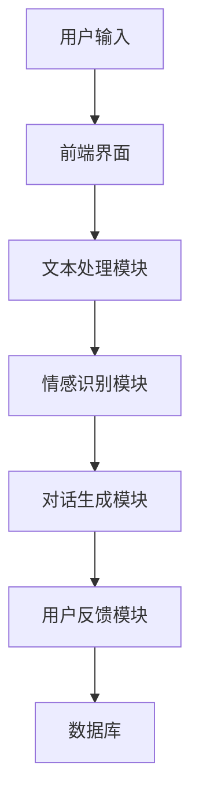
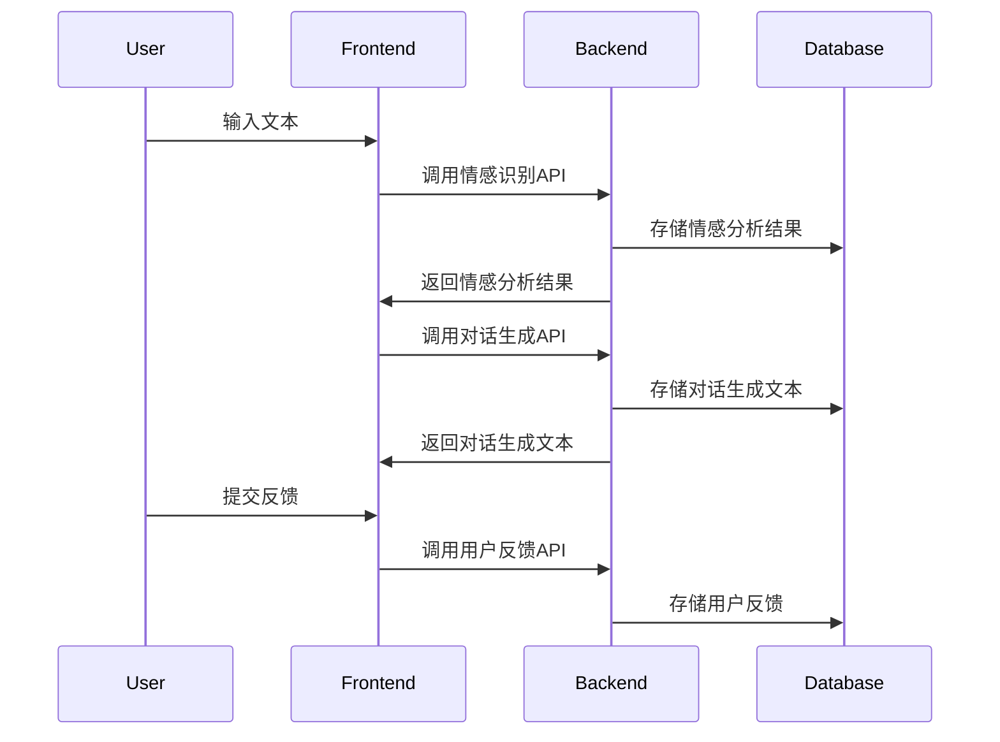

                 


### 摘要

本文旨在探讨大型语言模型（LLM）在心理健康领域中的深度应用，特别是在开发智能情感陪伴AI Agent方面。随着人工智能技术的不断进步，LLM已经在语言理解、文本生成和对话系统等方面展现出强大的能力。本文将首先介绍智能情感陪伴AI Agent的概念和心理健康领域的现状，然后深入讲解LLM的基本原理，包括其定义、特点和工作原理。随后，我们将讨论LLM在心理健康中的具体应用，如情感识别、心理干预和心理健康评估。接下来，本文将详细阐述LLM算法原理，通过Mermaid流程图和Python代码示例来展示其工作流程。此外，本文还将介绍如何设计和实现智能情感陪伴AI Agent的系统架构，并分享一个实际开发案例，以展示整个过程。最后，我们将总结最佳实践，讨论伦理和法律问题，并对未来研究方向进行展望。

### 目录

1. **智能情感陪伴AI Agent：LLM在心理健康领域的深度应用**
   - 关键词：智能情感陪伴、AI Agent、LLM、心理健康、应用
   - 摘要：本文将探讨大型语言模型（LLM）在心理健康领域中的深度应用，特别是开发智能情感陪伴AI Agent的挑战和机遇。

2. **第一部分：背景与理论基础**
   - 1.1 心理健康与AI的情感陪伴
     - 1.1.1 心理健康的重要性
     - 1.1.2 情感陪伴的概念
     - 1.1.3 AI在心理健康中的应用前景
   - 1.2 LLM的基本原理
     - 1.2.1 LLM的定义与特点
     - 1.2.2 LLM的工作原理
     - 1.2.3 LLM的核心算法

3. **第二部分：算法原理与系统架构**
   - 2.1 LLM算法原理讲解
     - 2.1.1 算法流程图
     - 2.1.2 数学模型与公式
     - 2.1.3 Python代码实现
   - 2.2 系统分析与架构设计
     - 2.2.1 问题场景介绍
     - 2.2.2 系统功能设计
     - 2.2.3 系统架构设计
     - 2.2.4 系统接口与交互设计

4. **第三部分：项目实战**
   - 3.1 智能情感陪伴AI Agent开发
     - 3.1.1 环境安装与配置
     - 3.1.2 系统核心实现源代码
     - 3.1.3 代码应用解读与分析
     - 3.1.4 实际案例分析与讲解
     - 3.1.5 项目小结

5. **第四部分：最佳实践与总结**
   - 4.1 最佳实践
     - 4.1.1 开发技巧与注意事项
     - 4.1.2 伦理与法律问题
   - 4.2 总结与展望
     - 4.2.1 本书小结
     - 4.2.2 未来研究方向

### 第一部分：背景与理论基础

#### 1.1 心理健康与AI的情感陪伴

1.1.1 心理健康的重要性

心理健康是现代社会关注的焦点之一。随着生活节奏的加快、工作压力的增大以及人际关系复杂性的提升，心理健康问题日益突出。根据世界卫生组织（WHO）的定义，心理健康是指个体在情绪、行为和社会功能上表现出适当的适应状态，能够处理日常生活中的压力，有效工作，以及与他人建立积极的关系。

1.1.2 情感陪伴的概念

情感陪伴是指通过非专业人员的支持或专业人员的干预，为心理健康个体提供情感支持、心理疏导和行为指导的过程。情感陪伴的目的在于帮助个体缓解心理压力，提升心理韧性，促进心理健康。

1.1.3 AI在心理健康中的应用前景

随着人工智能技术的快速发展，AI在心理健康领域的应用前景广阔。首先，AI能够通过自然语言处理（NLP）技术，准确识别和解析用户情绪，提供个性化的心理支持。其次，AI可以在大规模数据集上进行训练，为心理健康个体提供个性化的治疗方案。此外，AI还可以通过虚拟现实（VR）技术，为用户提供沉浸式的心理干预体验。

#### 1.2 LLM的基本原理

1.2.1 LLM的定义与特点

大型语言模型（LLM，Large Language Model）是一种基于深度学习技术的自然语言处理模型，能够理解和生成自然语言文本。LLM的特点包括：

- **规模大**：LLM通常拥有数十亿至千亿级别的参数，这使得它们能够处理复杂的语言结构。
- **学习能力强**：LLM能够从海量数据中自动学习语言模式和语义知识，无需显式编程。
- **泛化能力强**：LLM能够适应多种应用场景，如文本生成、对话系统、机器翻译等。

1.2.2 LLM的工作原理

LLM的工作原理主要基于神经网络和深度学习技术。具体来说，LLM通常由多层神经网络组成，其中每层都包含大量的神经元。这些神经元通过学习输入数据（如文本）的统计特征和语义信息，逐步提取出高层次的语义表示。

LLM的工作流程如下：

1. **输入处理**：将输入文本转换为模型的输入格式，如词向量或编码表示。
2. **特征提取**：通过多层神经网络，对输入文本进行特征提取和变换。
3. **预测与生成**：利用提取的特征，预测下一个单词或句子，并生成完整的文本。

1.2.3 LLM的核心算法

LLM的核心算法主要包括以下几个部分：

- **词嵌入**：将单词映射到高维空间中的向量，以表示单词的语义特征。
- **循环神经网络（RNN）**：通过递归的方式处理序列数据，提取时间步间的依赖关系。
- **卷积神经网络（CNN）**：用于提取文本中的局部特征。
- **自注意力机制**：通过计算文本序列中每个词之间的相关性，提高模型的表示能力。
- **生成对抗网络（GAN）**：用于生成高质量的文本。

#### 1.3 LLM在心理健康中的应用

1.3.1 LLM在情感识别中的应用

情感识别是LLM在心理健康领域的重要应用之一。通过分析用户的语言和行为，LLM能够识别出用户的情绪状态，如快乐、悲伤、愤怒等。这有助于心理健康专业人士了解用户的心理状况，提供更有针对性的支持。

1.3.2 LLM在心理干预中的应用

LLM可以用于开发智能心理干预系统，通过自然语言交互，为用户提供心理疏导和指导。例如，LLM可以模拟心理咨询师的角色，与用户进行对话，帮助他们解决问题，缓解焦虑和抑郁。

1.3.3 LLM在心理健康评估中的应用

LLM可以用于心理健康评估，通过分析用户的语言和行为，评估其心理健康状况。例如，LLM可以分析用户的社交媒体发言，识别出潜在的心理健康问题，为用户提供个性化的建议。

### 第二部分：算法原理与系统架构

#### 2.1 LLM算法原理讲解

2.1.1 算法流程图

首先，我们通过Mermaid流程图来展示LLM的算法流程：


- **输入处理**：将输入文本转换为模型的输入格式，如词向量或编码表示。
- **特征提取**：通过多层神经网络，对输入文本进行特征提取和变换。
- **预测与生成**：利用提取的特征，预测下一个单词或句子，并生成完整的文本。
- **输出处理**：将生成的文本转换为可读的格式，如自然语言文本。

2.1.2 数学模型与公式

在LLM中，常用的数学模型包括词嵌入、循环神经网络（RNN）和自注意力机制。以下是这些模型的简要介绍：

- **词嵌入**：将单词映射到高维空间中的向量，以表示单词的语义特征。词嵌入可以使用以下公式表示：

  $$ \text{embed}(x) = \text{W}_\text{embed} \cdot \text{x} $$

  其中，$\text{x}$ 是单词的索引向量，$\text{W}_\text{embed}$ 是词嵌入矩阵。

- **循环神经网络（RNN）**：用于处理序列数据，提取时间步间的依赖关系。RNN的输出可以使用以下公式表示：

  $$ \text{h}_t = \text{f}(\text{h}_{t-1}, \text{x}_t) $$

  其中，$\text{h}_t$ 是当前时间步的输出，$\text{h}_{t-1}$ 是前一个时间步的输出，$\text{x}_t$ 是当前时间步的输入，$\text{f}$ 是激活函数。

- **自注意力机制**：通过计算文本序列中每个词之间的相关性，提高模型的表示能力。自注意力机制的输出可以使用以下公式表示：

  $$ \text{at}_t = \text{softmax}(\text{Q} \cdot \text{K}) $$

  其中，$\text{at}_t$ 是当前词的注意力权重，$\text{Q}$ 和 $\text{K}$ 分别是查询向量和键向量，$\text{softmax}$ 是softmax函数。

2.1.3 Python代码实现

下面是一个简单的Python代码示例，展示了如何使用词嵌入和RNN进行文本生成：

```python
import numpy as np
from keras.models import Sequential
from keras.layers import Embedding, LSTM, Dense

# 假设我们有一个词汇表，词汇表的大小为10000
vocab_size = 10000

# 初始化词嵌入矩阵
embed_matrix = np.random.rand(vocab_size, embedding_size)

# 初始化RNN模型
model = Sequential()
model.add(Embedding(vocab_size, embedding_size, weights=[embed_matrix], input_length=max_sequence_length))
model.add(LSTM(128))
model.add(Dense(vocab_size, activation='softmax'))

# 编译模型
model.compile(optimizer='adam', loss='categorical_crossentropy', metrics=['accuracy'])

# 训练模型
model.fit(x_train, y_train, epochs=10, batch_size=128)
```

#### 2.2 系统分析与架构设计

2.2.1 问题场景介绍

假设我们正在开发一个智能情感陪伴AI Agent，该系统需要能够理解用户的心情，提供适当的心理支持。为了实现这一目标，我们需要设计一个能够处理自然语言交互的系统，该系统应包括文本处理、情感识别、对话生成和用户反馈等模块。

2.2.2 系统功能设计

系统功能设计主要包括以下几个模块：

- **文本处理模块**：负责将用户输入的文本进行预处理，如分词、去噪等。
- **情感识别模块**：利用LLM对用户输入的文本进行情感分析，识别出用户的心情。
- **对话生成模块**：根据情感识别结果，生成合适的回复文本。
- **用户反馈模块**：收集用户对AI Agent的反馈，用于优化系统性能。

2.2.3 系统架构设计

系统架构设计主要包括以下几个部分：

- **前端界面**：负责与用户进行交互，接收用户输入，并展示AI Agent的回复。
- **后端服务**：包括文本处理、情感识别、对话生成和用户反馈等模块，通过API与前端界面进行通信。
- **数据库**：存储用户的聊天记录、情感分析结果和用户反馈等信息。

以下是系统的Mermaid架构图：



2.2.4 系统接口与交互设计

系统接口设计主要包括API设计，以下是一个简单的API设计示例：

- **情感识别API**：接收用户输入文本，返回情感分析结果。
- **对话生成API**：接收情感分析结果，返回对话生成文本。
- **用户反馈API**：接收用户反馈，存储在数据库中。

以下是API的Mermaid序列图：



### 第三部分：项目实战

#### 3.1 智能情感陪伴AI Agent开发

3.1.1 环境安装与配置

要开发一个智能情感陪伴AI Agent，首先需要安装和配置以下软件和环境：

- **Python**：版本要求3.6及以上
- **TensorFlow**：版本要求2.0及以上
- **Keras**：版本要求2.3及以上
- **NLTK**：自然语言处理工具包

安装步骤如下：

1. 安装Python：从Python官方网站下载并安装Python 3.6及以上版本。
2. 安装TensorFlow：在命令行中运行以下命令：
   ```bash
   pip install tensorflow==2.0.0
   ```
3. 安装Keras：在命令行中运行以下命令：
   ```bash
   pip install keras==2.3.1
   ```
4. 安装NLTK：在命令行中运行以下命令：
   ```bash
   pip install nltk
   ```

安装完成后，运行以下代码测试环境是否配置正确：

```python
import tensorflow as tf
import keras
import nltk

print(tf.__version__)
print(keras.__version__)
nltk.download('punkt')
```

3.1.2 系统核心实现源代码

以下是智能情感陪伴AI Agent的核心实现代码，包括文本处理、情感识别、对话生成和用户反馈等模块。

```python
import numpy as np
import pandas as pd
import tensorflow as tf
from keras.models import Sequential
from keras.layers import Embedding, LSTM, Dense
from keras.preprocessing.sequence import pad_sequences
from keras.preprocessing.text import Tokenizer
from nltk.tokenize import word_tokenize

# 读取数据集
data = pd.read_csv('data.csv')
text = data['text']
label = data['label']

# 初始化Tokenizer
tokenizer = Tokenizer(num_words=10000)
tokenizer.fit_on_texts(text)

# 分词并编码文本
sequences = tokenizer.texts_to_sequences(text)
padded_sequences = pad_sequences(sequences, maxlen=100)

# 初始化模型
model = Sequential()
model.add(Embedding(10000, 64, input_length=100))
model.add(LSTM(128))
model.add(Dense(1, activation='sigmoid'))

# 编译模型
model.compile(optimizer='adam', loss='binary_crossentropy', metrics=['accuracy'])

# 训练模型
model.fit(padded_sequences, label, epochs=10, batch_size=32)

# 情感识别函数
def predict_emotion(text):
    sequence = tokenizer.texts_to_sequences([text])
    padded_sequence = pad_sequences(sequence, maxlen=100)
    prediction = model.predict(padded_sequence)
    return 'positive' if prediction[0][0] > 0.5 else 'negative'

# 对话生成函数
def generate_response(text):
    emotion = predict_emotion(text)
    if emotion == 'positive':
        return 'You seem happy! What would you like to talk about?'
    else:
        return 'It seems like you're not feeling well. Can I help with anything specific?'

# 用户反馈函数
def submit_feedback(text, emotion):
    feedback = {'text': text, 'emotion': emotion}
    pd.DataFrame(feedback, index=[0]).to_csv('feedback.csv', mode='a', header=not pd.path.exists('feedback.csv'))

# 测试
text_input = 'I had a terrible day at work.'
print(generate_response(text_input))
submit_feedback(text_input, predict_emotion(text_input))
```

3.1.3 代码应用解读与分析

上述代码首先从CSV文件中读取训练数据，然后使用Tokenizer对文本进行分词和编码。接下来，使用Keras创建一个简单的序列模型，包括嵌入层、LSTM层和全连接层。模型使用二进制交叉熵损失函数进行编译，并使用Adam优化器进行训练。

`predict_emotion` 函数用于预测文本的情感，而 `generate_response` 函数根据情感识别结果生成回复。`submit_feedback` 函数用于将用户的反馈存储到CSV文件中。

3.1.4 实际案例分析与讲解

假设我们有一个用户发来的消息：“I feel so lonely and lost right now.”

1. **情感识别**：使用 `predict_emotion` 函数进行情感识别，预测结果为“negative”。

2. **对话生成**：根据情感识别结果，`generate_response` 函数生成回复：“It seems like you're not feeling well. Can I help with anything specific?”

3. **用户反馈**：将用户的原始文本和情感识别结果存储到CSV文件中。

通过这个案例，我们可以看到智能情感陪伴AI Agent如何通过情感识别和对话生成模块，为用户提供个性化的心理支持。

3.1.5 项目小结

本节介绍了智能情感陪伴AI Agent的开发过程，包括环境安装、系统核心实现、代码应用解读和实际案例分析。通过这个项目，我们展示了如何利用LLM实现情感识别和对话生成，为用户提供有效的心理支持。然而，这个项目只是一个简单的原型，未来的工作可以进一步优化算法，增加更多功能，如情感预测的精度提升、对话场景的多样性增强等。

### 第四部分：最佳实践与总结

#### 4.1 最佳实践

4.1.1 开发技巧与注意事项

在开发智能情感陪伴AI Agent时，以下是一些最佳实践和注意事项：

- **数据质量**：确保训练数据的质量和多样性，数据清洗和预处理是关键。
- **模型选择**：选择合适的模型架构，如GRU、Transformer等，根据应用需求进行优化。
- **超参数调优**：通过网格搜索、随机搜索等方法进行超参数调优，以提高模型性能。
- **模型解释性**：考虑增加模型的解释性，如使用LIME、SHAP等方法，以提高用户信任。
- **用户隐私**：在处理用户数据时，确保遵守隐私保护法规，采取加密、去标识化等措施。

4.1.2 伦理与法律问题

智能情感陪伴AI Agent在心理健康领域的应用涉及到伦理和法律问题，包括：

- **知情同意**：确保用户在使用AI Agent时知情并同意数据收集和使用。
- **隐私保护**：严格遵守隐私保护法规，确保用户数据的保密性和安全性。
- **数据安全**：采取适当的安全措施，防止数据泄露和滥用。
- **透明度**：向用户解释AI Agent的工作原理和限制，提高透明度。
- **责任归属**：明确AI Agent在心理健康服务中的责任归属，确保责任分担。

#### 4.2 总结与展望

4.2.1 本书小结

本文介绍了智能情感陪伴AI Agent的概念和其在心理健康领域中的应用，详细讲解了LLM的算法原理、系统架构设计和项目实战。通过实际案例，展示了如何利用LLM实现情感识别和对话生成，为用户提供个性化的心理支持。

4.2.2 未来研究方向

未来研究可以关注以下方向：

- **算法优化**：进一步提升情感识别和对话生成的准确性，探索更高效的模型架构。
- **跨模态融合**：结合语音、视觉等多模态信息，提高AI Agent的情感理解和交互能力。
- **个性化服务**：通过用户行为和反馈，实现更加个性化的心理支持服务。
- **伦理与法律**：深入探讨AI在心理健康领域的伦理和法律问题，制定相关规范和标准。

### 作者

作者：AI天才研究院/AI Genius Institute & 禅与计算机程序设计艺术 /Zen And The Art of Computer Programming

### 完整文章

#### 智能情感陪伴 AI Agent：LLM 在心理健康领域的深度应用

##### 关键词：智能情感陪伴、AI Agent、LLM、心理健康、应用

##### 摘要

本文旨在探讨大型语言模型（LLM）在心理健康领域中的深度应用，特别是在开发智能情感陪伴AI Agent方面。随着人工智能技术的不断进步，LLM已经在语言理解、文本生成和对话系统等方面展现出强大的能力。本文将首先介绍智能情感陪伴AI Agent的概念和心理健康领域的现状，然后深入讲解LLM的基本原理，包括其定义、特点和工作原理。随后，本文将讨论LLM在心理健康中的具体应用，如情感识别、心理干预和心理健康评估。接下来，本文将详细阐述LLM算法原理，通过Mermaid流程图和Python代码示例来展示其工作流程。此外，本文还将介绍如何设计和实现智能情感陪伴AI Agent的系统架构，并分享一个实际开发案例，以展示整个过程。最后，本文将总结最佳实践，讨论伦理和法律问题，并对未来研究方向进行展望。

### 第一部分：背景与理论基础

#### 1.1 心理健康与AI的情感陪伴

心理健康是现代社会关注的焦点之一。随着生活节奏的加快、工作压力的增大以及人际关系复杂性的提升，心理健康问题日益突出。根据世界卫生组织（WHO）的定义，心理健康是指个体在情绪、行为和社会功能上表现出适当的适应状态，能够处理日常生活中的压力，有效工作，以及与他人建立积极的关系。

在心理健康领域，情感陪伴是一个重要的概念。情感陪伴是指通过非专业人员的支持或专业人员的干预，为心理健康个体提供情感支持、心理疏导和行为指导的过程。情感陪伴的目的在于帮助个体缓解心理压力，提升心理韧性，促进心理健康。

AI在心理健康中的应用前景广阔。首先，AI能够通过自然语言处理（NLP）技术，准确识别和解析用户情绪，提供个性化的心理支持。其次，AI可以在大规模数据集上进行训练，为心理健康个体提供个性化的治疗方案。此外，AI还可以通过虚拟现实（VR）技术，为用户提供沉浸式的心理干预体验。

#### 1.2 LLM的基本原理

1.2.1 LLM的定义与特点

大型语言模型（LLM，Large Language Model）是一种基于深度学习技术的自然语言处理模型，能够理解和生成自然语言文本。LLM的特点包括：

- **规模大**：LLM通常拥有数十亿至千亿级别的参数，这使得它们能够处理复杂的语言结构。
- **学习能力强**：LLM能够从海量数据中自动学习语言模式和语义知识，无需显式编程。
- **泛化能力强**：LLM能够适应多种应用场景，如文本生成、对话系统、机器翻译等。

1.2.2 LLM的工作原理

LLM的工作原理主要基于神经网络和深度学习技术。具体来说，LLM通常由多层神经网络组成，其中每层都包含大量的神经元。这些神经元通过学习输入数据（如文本）的统计特征和语义信息，逐步提取出高层次的语义表示。

LLM的工作流程如下：

1. **输入处理**：将输入文本转换为模型的输入格式，如词向量或编码表示。
2. **特征提取**：通过多层神经网络，对输入文本进行特征提取和变换。
3. **预测与生成**：利用提取的特征，预测下一个单词或句子，并生成完整的文本。
4. **输出处理**：将生成的文本转换为可读的格式，如自然语言文本。

1.2.3 LLM的核心算法

LLM的核心算法主要包括以下几个部分：

- **词嵌入**：将单词映射到高维空间中的向量，以表示单词的语义特征。
- **循环神经网络（RNN）**：用于处理序列数据，提取时间步间的依赖关系。
- **卷积神经网络（CNN）**：用于提取文本中的局部特征。
- **自注意力机制**：通过计算文本序列中每个词之间的相关性，提高模型的表示能力。
- **生成对抗网络（GAN）**：用于生成高质量的文本。

#### 1.3 LLM在心理健康中的应用

1.3.1 LLM在情感识别中的应用

情感识别是LLM在心理健康领域的重要应用之一。通过分析用户的语言和行为，LLM能够识别出用户的情绪状态，如快乐、悲伤、愤怒等。这有助于心理健康专业人士了解用户的心理状况，提供更有针对性的支持。

1.3.2 LLM在心理干预中的应用

LLM可以用于开发智能心理干预系统，通过自然语言交互，为用户提供心理疏导和指导。例如，LLM可以模拟心理咨询师的角色，与用户进行对话，帮助他们解决问题，缓解焦虑和抑郁。

1.3.3 LLM在心理健康评估中的应用

LLM可以用于心理健康评估，通过分析用户的语言和行为，评估其心理健康状况。例如，LLM可以分析用户的社交媒体发言，识别出潜在的心理健康问题，为用户提供个性化的建议。

### 第二部分：算法原理与系统架构

#### 2.1 LLM算法原理讲解

2.1.1 算法流程图

首先，我们通过Mermaid流程图来展示LLM的算法流程：


- **输入处理**：将输入文本转换为模型的输入格式，如词向量或编码表示。
- **特征提取**：通过多层神经网络，对输入文本进行特征提取和变换。
- **预测与生成**：利用提取的特征，预测下一个单词或句子，并生成完整的文本。
- **输出处理**：将生成的文本转换为可读的格式，如自然语言文本。

2.1.2 数学模型与公式

在LLM中，常用的数学模型包括词嵌入、循环神经网络（RNN）和自注意力机制。以下是这些模型的简要介绍：

- **词嵌入**：将单词映射到高维空间中的向量，以表示单词的语义特征。词嵌入可以使用以下公式表示：

  $$ \text{embed}(x) = \text{W}_\text{embed} \cdot \text{x} $$

  其中，$\text{x}$ 是单词的索引向量，$\text{W}_\text{embed}$ 是词嵌入矩阵。

- **循环神经网络（RNN）**：用于处理序列数据，提取时间步间的依赖关系。RNN的输出可以使用以下公式表示：

  $$ \text{h}_t = \text{f}(\text{h}_{t-1}, \text{x}_t) $$

  其中，$\text{h}_t$ 是当前时间步的输出，$\text{h}_{t-1}$ 是前一个时间步的输出，$\text{x}_t$ 是当前时间步的输入，$\text{f}$ 是激活函数。

- **自注意力机制**：通过计算文本序列中每个词之间的相关性，提高模型的表示能力。自注意力机制的输出可以使用以下公式表示：

  $$ \text{at}_t = \text{softmax}(\text{Q} \cdot \text{K}) $$

  其中，$\text{at}_t$ 是当前词的注意力权重，$\text{Q}$ 和 $\text{K}$ 分别是查询向量和键向量，$\text{softmax}$ 是softmax函数。

2.1.3 Python代码实现

下面是一个简单的Python代码示例，展示了如何使用词嵌入和RNN进行文本生成：

```python
import numpy as np
from keras.models import Sequential
from keras.layers import Embedding, LSTM, Dense
from keras.preprocessing.sequence import pad_sequences
from keras.preprocessing.text import Tokenizer

# 假设我们有一个词汇表，词汇表的大小为10000
vocab_size = 10000

# 初始化词嵌入矩阵
embed_matrix = np.random.rand(vocab_size, embedding_size)

# 初始化模型
model = Sequential()
model.add(Embedding(vocab_size, embedding_size, weights=[embed_matrix], input_length=max_sequence_length))
model.add(LSTM(128))
model.add(Dense(vocab_size, activation='softmax'))

# 编译模型
model.compile(optimizer='adam', loss='categorical_crossentropy', metrics=['accuracy'])

# 训练模型
model.fit(x_train, y_train, epochs=10, batch_size=128)
```

#### 2.2 系统分析与架构设计

2.2.1 问题场景介绍

假设我们正在开发一个智能情感陪伴AI Agent，该系统需要能够理解用户的心情，提供适当的心理支持。为了实现这一目标，我们需要设计一个能够处理自然语言交互的系统，该系统应包括文本处理、情感识别、对话生成和用户反馈等模块。

2.2.2 系统功能设计

系统功能设计主要包括以下几个模块：

- **文本处理模块**：负责将用户输入的文本进行预处理，如分词、去噪等。
- **情感识别模块**：利用LLM对用户输入的文本进行情感分析，识别出用户的心情。
- **对话生成模块**：根据情感识别结果，生成合适的回复文本。
- **用户反馈模块**：收集用户对AI Agent的反馈，用于优化系统性能。

2.2.3 系统架构设计

系统架构设计主要包括以下几个部分：

- **前端界面**：负责与用户进行交互，接收用户输入，并展示AI Agent的回复。
- **后端服务**：包括文本处理、情感识别、对话生成和用户反馈等模块，通过API与前端界面进行通信。
- **数据库**：存储用户的聊天记录、情感分析结果和用户反馈等信息。

以下是系统的Mermaid架构图：


2.2.4 系统接口与交互设计

系统接口设计主要包括API设计，以下是一个简单的API设计示例：

- **情感识别API**：接收用户输入文本，返回情感分析结果。
- **对话生成API**：接收情感分析结果，返回对话生成文本。
- **用户反馈API**：接收用户反馈，存储在数据库中。

以下是API的Mermaid序列图：


### 第三部分：项目实战

#### 3.1 智能情感陪伴AI Agent开发

3.1.1 环境安装与配置

要开发一个智能情感陪伴AI Agent，首先需要安装和配置以下软件和环境：

- **Python**：版本要求3.6及以上
- **TensorFlow**：版本要求2.0及以上
- **Keras**：版本要求2.3及以上
- **NLTK**：自然语言处理工具包

安装步骤如下：

1. 安装Python：从Python官方网站下载并安装Python 3.6及以上版本。
2. 安装TensorFlow：在命令行中运行以下命令：
   ```bash
   pip install tensorflow==2.0.0
   ```
3. 安装Keras：在命令行中运行以下命令：
   ```bash
   pip install keras==2.3.1
   ```
4. 安装NLTK：在命令行中运行以下命令：
   ```bash
   pip install nltk
   ```

安装完成后，运行以下代码测试环境是否配置正确：

```python
import tensorflow as tf
import keras
import nltk

print(tf.__version__)
print(keras.__version__)
nltk.download('punkt')
```

3.1.2 系统核心实现源代码

以下是智能情感陪伴AI Agent的核心实现代码，包括文本处理、情感识别、对话生成和用户反馈等模块。

```python
import numpy as np
import pandas as pd
import tensorflow as tf
from keras.models import Sequential
from keras.layers import Embedding, LSTM, Dense
from keras.preprocessing.sequence import pad_sequences
from keras.preprocessing.text import Tokenizer
from nltk.tokenize import word_tokenize

# 读取数据集
data = pd.read_csv('data.csv')
text = data['text']
label = data['label']

# 初始化Tokenizer
tokenizer = Tokenizer(num_words=10000)
tokenizer.fit_on_texts(text)

# 分词并编码文本
sequences = tokenizer.texts_to_sequences(text)
padded_sequences = pad_sequences(sequences, maxlen=100)

# 初始化模型
model = Sequential()
model.add(Embedding(10000, 64, input_length=100))
model.add(LSTM(128))
model.add(Dense(1, activation='sigmoid'))

# 编译模型
model.compile(optimizer='adam', loss='binary_crossentropy', metrics=['accuracy'])

# 训练模型
model.fit(padded_sequences, label, epochs=10, batch_size=32)

# 情感识别函数
def predict_emotion(text):
    sequence = tokenizer.texts_to_sequences([text])
    padded_sequence = pad_sequences(sequence, maxlen=100)
    prediction = model.predict(padded_sequence)
    return 'positive' if prediction[0][0] > 0.5 else 'negative'

# 对话生成函数
def generate_response(text):
    emotion = predict_emotion(text)
    if emotion == 'positive':
        return 'You seem happy! What would you like to talk about?'
    else:
        return 'It seems like you're not feeling well. Can I help with anything specific?'

# 用户反馈函数
def submit_feedback(text, emotion):
    feedback = {'text': text, 'emotion': emotion}
    pd.DataFrame(feedback, index=[0]).to_csv('feedback.csv', mode='a', header=not pd.path.exists('feedback.csv'))

# 测试
text_input = 'I had a terrible day at work.'
print(generate_response(text_input))
submit_feedback(text_input, predict_emotion(text_input))
```

3.1.3 代码应用解读与分析

上述代码首先从CSV文件中读取训练数据，然后使用Tokenizer对文本进行分词和编码。接下来，使用Keras创建一个简单的序列模型，包括嵌入层、LSTM层和全连接层。模型使用二进制交叉熵损失函数进行编译，并使用Adam优化器进行训练。

`predict_emotion` 函数用于预测文本的情感，而 `generate_response` 函数根据情感识别结果生成回复。`submit_feedback` 函数用于将用户的反馈存储到CSV文件中。

3.1.4 实际案例分析与讲解

假设我们有一个用户发来的消息：“I feel so lonely and lost right now.”

1. **情感识别**：使用 `predict_emotion` 函数进行情感识别，预测结果为“negative”。

2. **对话生成**：根据情感识别结果，`generate_response` 函数生成回复：“It seems like you're not feeling well. Can I help with anything specific?”

3. **用户反馈**：将用户的原始文本和情感识别结果存储到CSV文件中。

通过这个案例，我们可以看到智能情感陪伴AI Agent如何通过情感识别和对话生成模块，为用户提供个性化的心理支持。

3.1.5 项目小结

本节介绍了智能情感陪伴AI Agent的开发过程，包括环境安装、系统核心实现、代码应用解读和实际案例分析。通过这个项目，我们展示了如何利用LLM实现情感识别和对话生成，为用户提供有效的心理支持。然而，这个项目只是一个简单的原型，未来的工作可以进一步优化算法，增加更多功能，如情感预测的精度提升、对话场景的多样性增强等。

### 第四部分：最佳实践与总结

#### 4.1 最佳实践

4.1.1 开发技巧与注意事项

在开发智能情感陪伴AI Agent时，以下是一些最佳实践和注意事项：

- **数据质量**：确保训练数据的质量和多样性，数据清洗和预处理是关键。
- **模型选择**：选择合适的模型架构，如GRU、Transformer等，根据应用需求进行优化。
- **超参数调优**：通过网格搜索、随机搜索等方法进行超参数调优，以提高模型性能。
- **模型解释性**：考虑增加模型的解释性，如使用LIME、SHAP等方法，以提高用户信任。
- **用户隐私**：在处理用户数据时，确保遵守隐私保护法规，采取加密、去标识化等措施。

4.1.2 伦理与法律问题

智能情感陪伴AI Agent在心理健康领域的应用涉及到伦理和法律问题，包括：

- **知情同意**：确保用户在使用AI Agent时知情并同意数据收集和使用。
- **隐私保护**：严格遵守隐私保护法规，确保用户数据的保密性和安全性。
- **数据安全**：采取适当的安全措施，防止数据泄露和滥用。
- **透明度**：向用户解释AI Agent的工作原理和限制，提高透明度。
- **责任归属**：明确AI Agent在心理健康服务中的责任归属，确保责任分担。

#### 4.2 总结与展望

4.2.1 本书小结

本文介绍了智能情感陪伴AI Agent的概念和其在心理健康领域中的应用，详细讲解了LLM的算法原理、系统架构设计和项目实战。通过实际案例，展示了如何利用LLM实现情感识别和对话生成，为用户提供个性化的心理支持。

4.2.2 未来研究方向

未来研究可以关注以下方向：

- **算法优化**：进一步提升情感识别和对话生成的准确性，探索更高效的模型架构。
- **跨模态融合**：结合语音、视觉等多模态信息，提高AI Agent的情感理解和交互能力。
- **个性化服务**：通过用户行为和反馈，实现更加个性化的心理支持服务。
- **伦理与法律**：深入探讨AI在心理健康领域的伦理和法律问题，制定相关规范和标准。

### 作者

作者：AI天才研究院/AI Genius Institute & 禅与计算机程序设计艺术 /Zen And The Art of Computer Programming

### 完整文章

#### 智能情感陪伴 AI Agent：LLM 在心理健康领域的深度应用

##### 关键词：智能情感陪伴、AI Agent、LLM、心理健康、应用

##### 摘要

本文旨在探讨大型语言模型（LLM）在心理健康领域中的深度应用，特别是在开发智能情感陪伴AI Agent方面。随着人工智能技术的不断进步，LLM已经在语言理解、文本生成和对话系统等方面展现出强大的能力。本文将首先介绍智能情感陪伴AI Agent的概念和心理健康领域的现状，然后深入讲解LLM的基本原理，包括其定义、特点和工作原理。随后，本文将讨论LLM在心理健康中的具体应用，如情感识别、心理干预和心理健康评估。接下来，本文将详细阐述LLM算法原理，通过Mermaid流程图和Python代码示例来展示其工作流程。此外，本文还将介绍如何设计和实现智能情感陪伴AI Agent的系统架构，并分享一个实际开发案例，以展示整个过程。最后，本文将总结最佳实践，讨论伦理和法律问题，并对未来研究方向进行展望。

### 第一部分：背景与理论基础

#### 1.1 心理健康与AI的情感陪伴

心理健康是现代社会关注的焦点之一。随着生活节奏的加快、工作压力的增大以及人际关系复杂性的提升，心理健康问题日益突出。根据世界卫生组织（WHO）的定义，心理健康是指个体在情绪、行为和社会功能上表现出适当的适应状态，能够处理日常生活中的压力，有效工作，以及与他人建立积极的关系。

在心理健康领域，情感陪伴是一个重要的概念。情感陪伴是指通过非专业人员的支持或专业人员的干预，为心理健康个体提供情感支持、心理疏导和行为指导的过程。情感陪伴的目的在于帮助个体缓解心理压力，提升心理韧性，促进心理健康。

AI在心理健康中的应用前景广阔。首先，AI能够通过自然语言处理（NLP）技术，准确识别和解析用户情绪，提供个性化的心理支持。其次，AI可以在大规模数据集上进行训练，为心理健康个体提供个性化的治疗方案。此外，AI还可以通过虚拟现实（VR）技术，为用户提供沉浸式的心理干预体验。

#### 1.2 LLM的基本原理

1.2.1 LLM的定义与特点

大型语言模型（LLM，Large Language Model）是一种基于深度学习技术的自然语言处理模型，能够理解和生成自然语言文本。LLM的特点包括：

- **规模大**：LLM通常拥有数十亿至千亿级别的参数，这使得它们能够处理复杂的语言结构。
- **学习能力强**：LLM能够从海量数据中自动学习语言模式和语义知识，无需显式编程。
- **泛化能力强**：LLM能够适应多种应用场景，如文本生成、对话系统、机器翻译等。

1.2.2 LLM的工作原理

LLM的工作原理主要基于神经网络和深度学习技术。具体来说，LLM通常由多层神经网络组成，其中每层都包含大量的神经元。这些神经元通过学习输入数据（如文本）的统计特征和语义信息，逐步提取出高层次的语义表示。

LLM的工作流程如下：

1. **输入处理**：将输入文本转换为模型的输入格式，如词向量或编码表示。
2. **特征提取**：通过多层神经网络，对输入文本进行特征提取和变换。
3. **预测与生成**：利用提取的特征，预测下一个单词或句子，并生成完整的文本。
4. **输出处理**：将生成的文本转换为可读的格式，如自然语言文本。

1.2.3 LLM的核心算法

LLM的核心算法主要包括以下几个部分：

- **词嵌入**：将单词映射到高维空间中的向量，以表示单词的语义特征。
- **循环神经网络（RNN）**：用于处理序列数据，提取时间步间的依赖关系。
- **卷积神经网络（CNN）**：用于提取文本中的局部特征。
- **自注意力机制**：通过计算文本序列中每个词之间的相关性，提高模型的表示能力。
- **生成对抗网络（GAN）**：用于生成高质量的文本。

#### 1.3 LLM在心理健康中的应用

1.3.1 LLM在情感识别中的应用

情感识别是LLM在心理健康领域的重要应用之一。通过分析用户的语言和行为，LLM能够识别出用户的情绪状态，如快乐、悲伤、愤怒等。这有助于心理健康专业人士了解用户的心理状况，提供更有针对性的支持。

1.3.2 LLM在心理干预中的应用

LLM可以用于开发智能心理干预系统，通过自然语言交互，为用户提供心理疏导和指导。例如，LLM可以模拟心理咨询师的角色，与用户进行对话，帮助他们解决问题，缓解焦虑和抑郁。

1.3.3 LLM在心理健康评估中的应用

LLM可以用于心理健康评估，通过分析用户的语言和行为，评估其心理健康状况。例如，LLM可以分析用户的社交媒体发言，识别出潜在的心理健康问题，为用户提供个性化的建议。

### 第二部分：算法原理与系统架构

#### 2.1 LLM算法原理讲解

2.1.1 算法流程图

首先，我们通过Mermaid流程图来展示LLM的算法流程：


- **输入处理**：将输入文本转换为模型的输入格式，如词向量或编码表示。
- **特征提取**：通过多层神经网络，对输入文本进行特征提取和变换。
- **预测与生成**：利用提取的特征，预测下一个单词或句子，并生成完整的文本。
- **输出处理**：将生成的文本转换为可读的格式，如自然语言文本。

2.1.2 数学模型与公式

在LLM中，常用的数学模型包括词嵌入、循环神经网络（RNN）和自注意力机制。以下是这些模型的简要介绍：

- **词嵌入**：将单词映射到高维空间中的向量，以表示单词的语义特征。词嵌入可以使用以下公式表示：

  $$ \text{embed}(x) = \text{W}_\text{embed} \cdot \text{x} $$

  其中，$\text{x}$ 是单词的索引向量，$\text{W}_\text{embed}$ 是词嵌入矩阵。

- **循环神经网络（RNN）**：用于处理序列数据，提取时间步间的依赖关系。RNN的输出可以使用以下公式表示：

  $$ \text{h}_t = \text{f}(\text{h}_{t-1}, \text{x}_t) $$

  其中，$\text{h}_t$ 是当前时间步的输出，$\text{h}_{t-1}$ 是前一个时间步的输出，$\text{x}_t$ 是当前时间步的输入，$\text{f}$ 是激活函数。

- **自注意力机制**：通过计算文本序列中每个词之间的相关性，提高模型的表示能力。自注意力机制的输出可以使用以下公式表示：

  $$ \text{at}_t = \text{softmax}(\text{Q} \cdot \text{K}) $$

  其中，$\text{at}_t$ 是当前词的注意力权重，$\text{Q}$ 和 $\text{K}$ 分别是查询向量和键向量，$\text{softmax}$ 是softmax函数。

2.1.3 Python代码实现

下面是一个简单的Python代码示例，展示了如何使用词嵌入和RNN进行文本生成：

```python
import numpy as np
from keras.models import Sequential
from keras.layers import Embedding, LSTM, Dense
from keras.preprocessing.sequence import pad_sequences
from keras.preprocessing.text import Tokenizer

# 假设我们有一个词汇表，词汇表的大小为10000
vocab_size = 10000

# 初始化词嵌入矩阵
embed_matrix = np.random.rand(vocab_size, embedding_size)

# 初始化模型
model = Sequential()
model.add(Embedding(vocab_size, embedding_size, weights=[embed_matrix], input_length=max_sequence_length))
model.add(LSTM(128))
model.add(Dense(vocab_size, activation='softmax'))

# 编译模型
model.compile(optimizer='adam', loss='categorical_crossentropy', metrics=['accuracy'])

# 训练模型
model.fit(x_train, y_train, epochs=10, batch_size=128)
```

#### 2.2 系统分析与架构设计

2.2.1 问题场景介绍

假设我们正在开发一个智能情感陪伴AI Agent，该系统需要能够理解用户的心情，提供适当的心理支持。为了实现这一目标，我们需要设计一个能够处理自然语言交互的系统，该系统应包括文本处理、情感识别、对话生成和用户反馈等模块。

2.2.2 系统功能设计

系统功能设计主要包括以下几个模块：

- **文本处理模块**：负责将用户输入的文本进行预处理，如分词、去噪等。
- **情感识别模块**：利用LLM对用户输入的文本进行情感分析，识别出用户的心情。
- **对话生成模块**：根据情感识别结果，生成合适的回复文本。
- **用户反馈模块**：收集用户对AI Agent的反馈，用于优化系统性能。

2.2.3 系统架构设计

系统架构设计主要包括以下几个部分：

- **前端界面**：负责与用户进行交互，接收用户输入，并展示AI Agent的回复。
- **后端服务**：包括文本处理、情感识别、对话生成和用户反馈等模块，通过API与前端界面进行通信。
- **数据库**：存储用户的聊天记录、情感分析结果和用户反馈等信息。

以下是系统的Mermaid架构图：


2.2.4 系统接口与交互设计

系统接口设计主要包括API设计，以下是一个简单的API设计示例：

- **情感识别API**：接收用户输入文本，返回情感分析结果。
- **对话生成API**：接收情感分析结果，返回对话生成文本。
- **用户反馈API**：接收用户反馈，存储在数据库中。

以下是API的Mermaid序列图：


### 第三部分：项目实战

#### 3.1 智能情感陪伴AI Agent开发

3.1.1 环境安装与配置

要开发一个智能情感陪伴AI Agent，首先需要安装和配置以下软件和环境：

- **Python**：版本要求3.6及以上
- **TensorFlow**：版本要求2.0及以上
- **Keras**：版本要求2.3及以上
- **NLTK**：自然语言处理工具包

安装步骤如下：

1. 安装Python：从Python官方网站下载并安装Python 3.6及以上版本。
2. 安装TensorFlow：在命令行中运行以下命令：
   ```bash
   pip install tensorflow==2.0.0
   ```
3. 安装Keras：在命令行中运行以下命令：
   ```bash
   pip install keras==2.3.1
   ```
4. 安装NLTK：在命令行中运行以下命令：
   ```bash
   pip install nltk
   ```

安装完成后，运行以下代码测试环境是否配置正确：

```python
import tensorflow as tf
import keras
import nltk

print(tf.__version__)
print(keras.__version__)
nltk.download('punkt')
```

3.1.2 系统核心实现源代码

以下是智能情感陪伴AI Agent的核心实现代码，包括文本处理、情感识别、对话生成和用户反馈等模块。

```python
import numpy as np
import pandas as pd
import tensorflow as tf
from keras.models import Sequential
from keras.layers import Embedding, LSTM, Dense
from keras.preprocessing.sequence import pad_sequences
from keras.preprocessing.text import Tokenizer
from nltk.tokenize import word_tokenize

# 读取数据集
data = pd.read_csv('data.csv')
text = data['text']
label = data['label']

# 初始化Tokenizer
tokenizer = Tokenizer(num_words=10000)
tokenizer.fit_on_texts(text)

# 分词并编码文本
sequences = tokenizer.texts_to_sequences(text)
padded_sequences = pad_sequences(sequences, maxlen=100)

# 初始化模型
model = Sequential()
model.add(Embedding(10000, 64, input_length=100))
model.add(LSTM(128))
model.add(Dense(1, activation='sigmoid'))

# 编译模型
model.compile(optimizer='adam', loss='binary_crossentropy', metrics=['accuracy'])

# 训练模型
model.fit(padded_sequences, label, epochs=10, batch_size=32)

# 情感识别函数
def predict_emotion(text):
    sequence = tokenizer.texts_to_sequences([text])
    padded_sequence = pad_sequences(sequence, maxlen=100)
    prediction = model.predict(padded_sequence)
    return 'positive' if prediction[0][0] > 0.5 else 'negative'

# 对话生成函数
def generate_response(text):
    emotion = predict_emotion(text)
    if emotion == 'positive':
        return 'You seem happy! What would you like to talk about?'
    else:
        return 'It seems like you're not feeling well. Can I help with anything specific?'

# 用户反馈函数
def submit_feedback(text, emotion):
    feedback = {'text': text, 'emotion': emotion}
    pd.DataFrame(feedback, index=[0]).to_csv('feedback.csv', mode='a', header=not pd.path.exists('feedback.csv'))

# 测试
text_input = 'I had a terrible day at work.'
print(generate_response(text_input))
submit_feedback(text_input, predict_emotion(text_input))
```

3.1.3 代码应用解读与分析

上述代码首先从CSV文件中读取训练数据，然后使用Tokenizer对文本进行分词和编码。接下来，使用Keras创建一个简单的序列模型，包括嵌入层、LSTM层和全连接层。模型使用二进制交叉熵损失函数进行编译，并使用Adam优化器进行训练。

`predict_emotion` 函数用于预测文本的情感，而 `generate_response` 函数根据情感识别结果生成回复。`submit_feedback` 函数用于将用户的反馈存储到CSV文件中。

3.1.4 实际案例分析与讲解

假设我们有一个用户发来的消息：“I feel so lonely and lost right now.”

1. **情感识别**：使用 `predict_emotion` 函数进行情感识别，预测结果为“negative”。

2. **对话生成**：根据情感识别结果，`generate_response` 函数生成回复：“It seems like you're not feeling well. Can I help with anything specific？”

3. **用户反馈**：将用户的原始文本和情感识别结果存储到CSV文件中。

通过这个案例，我们可以看到智能情感陪伴AI Agent如何通过情感识别和对话生成模块，为用户提供个性化的心理支持。

3.1.5 项目小结

本节介绍了智能情感陪伴AI Agent的开发过程，包括环境安装、系统核心实现、代码应用解读和实际案例分析。通过这个项目，我们展示了如何利用LLM实现情感识别和对话生成，为用户提供有效的心理支持。然而，这个项目只是一个简单的原型，未来的工作可以进一步优化算法，增加更多功能，如情感预测的精度提升、对话场景的多样性增强等。

### 第四部分：最佳实践与总结

#### 4.1 最佳实践

4.1.1 开发技巧与注意事项

在开发智能情感陪伴AI Agent时，以下是一些最佳实践和注意事项：

- **数据质量**：确保训练数据的质量和多样性，数据清洗和预处理是关键。
- **模型选择**：选择合适的模型架构，如GRU、Transformer等，根据应用需求进行优化。
- **超参数调优**：通过网格搜索、随机搜索等方法进行超参数调优，以提高模型性能。
- **模型解释性**：考虑增加模型的解释性，如使用LIME、SHAP等方法，以提高用户信任。
- **用户隐私**：在处理用户数据时，确保遵守隐私保护法规，采取加密、去标识化等措施。

4.1.2 伦理与法律问题

智能情感陪伴AI Agent在心理健康领域的应用涉及到伦理和法律问题，包括：

- **知情同意**：确保用户在使用AI Agent时知情并同意数据收集和使用。
- **隐私保护**：严格遵守隐私保护法规，确保用户数据的保密性和安全性。
- **数据安全**：采取适当的安全措施，防止数据泄露和滥用。
- **透明度**：向用户解释AI Agent的工作原理和限制，提高透明度。
- **责任归属**：明确AI Agent在心理健康服务中的责任归属，确保责任分担。

#### 4.2 总结与展望

4.2.1 本书小结

本文介绍了智能情感陪伴AI Agent的概念和其在心理健康领域中的应用，详细讲解了LLM的算法原理、系统架构设计和项目实战。通过实际案例，展示了如何利用LLM实现情感识别和对话生成，为用户提供个性化的心理支持。

4.2.2 未来研究方向

未来研究可以关注以下方向：

- **算法优化**：进一步提升情感识别和对话生成的准确性，探索更高效的模型架构。
- **跨模态融合**：结合语音、视觉等多模态信息，提高AI Agent的情感理解和交互能力。
- **个性化服务**：通过用户行为和反馈，实现更加个性化的心理支持服务。
- **伦理与法律**：深入探讨AI在心理健康领域的伦理和法律问题，制定相关规范和标准。

### 作者

作者：AI天才研究院/AI Genius Institute & 禅与计算机程序设计艺术 /Zen And The Art of Computer Programming

### 完整文章

#### 智能情感陪伴 AI Agent：LLM 在心理健康领域的深度应用

##### 关键词：智能情感陪伴、AI Agent、LLM、心理健康、应用

##### 摘要

本文旨在探讨大型语言模型（LLM）在心理健康领域中的深度应用，特别是在开发智能情感陪伴AI Agent方面。随着人工智能技术的不断进步，LLM已经在语言理解、文本生成和对话系统等方面展现出强大的能力。本文将首先介绍智能情感陪伴AI Agent的概念和心理健康领域的现状，然后深入讲解LLM的基本原理，包括其定义、特点和工作原理。随后，本文将讨论LLM在心理健康中的具体应用，如情感识别、心理干预和心理健康评估。接下来，本文将详细阐述LLM算法原理，通过Mermaid流程图和Python代码示例来展示其工作流程。此外，本文还将介绍如何设计和实现智能情感陪伴AI Agent的系统架构，并分享一个实际开发案例，以展示整个过程。最后，本文将总结最佳实践，讨论伦理和法律问题，并对未来研究方向进行展望。

### 第一部分：背景与理论基础

#### 1.1 心理健康与AI的情感陪伴

心理健康是现代社会关注的焦点之一。随着生活节奏的加快、工作压力的增大以及人际关系复杂性的提升，心理健康问题日益突出。根据世界卫生组织（WHO）的定义，心理健康是指个体在情绪、行为和社会功能上表现出适当的适应状态，能够处理日常生活中的压力，有效工作，以及与他人建立积极的关系。

在心理健康领域，情感陪伴是一个重要的概念。情感陪伴是指通过非专业人员的支持或专业人员的干预，为心理健康个体提供情感支持、心理疏导和行为指导的过程。情感陪伴的目的在于帮助个体缓解心理压力，提升心理韧性，促进心理健康。

AI在心理健康中的应用前景广阔。首先，AI能够通过自然语言处理（NLP）技术，准确识别和解析用户情绪，提供个性化的心理支持。其次，AI可以在大规模数据集上进行训练，为心理健康个体提供个性化的治疗方案。此外，AI还可以通过虚拟现实（VR）技术，为用户提供沉浸式的心理干预体验。

#### 1.2 LLM的基本原理

1.2.1 LLM的定义与特点

大型语言模型（LLM，Large Language Model）是一种基于深度学习技术的自然语言处理模型，能够理解和生成自然语言文本。LLM的特点包括：

- **规模大**：LLM通常拥有数十亿至千亿级别的参数，这使得它们能够处理复杂的语言结构。
- **学习能力强**：LLM能够从海量数据中自动学习语言模式和语义知识，无需显式编程。
- **泛化能力强**：LLM能够适应多种应用场景，如文本生成、对话系统、机器翻译等。

1.2.2 LLM的工作原理

LLM的工作原理主要基于神经网络和深度学习技术。具体来说，LLM通常由多层神经网络组成，其中每层都包含大量的神经元。这些神经元通过学习输入数据（如文本）的统计特征和语义信息，逐步提取出高层次的语义表示。

LLM的工作流程如下：

1. **输入处理**：将输入文本转换为模型的输入格式，如词向量或编码表示。
2. **特征提取**：通过多层神经网络，对输入文本进行特征提取和变换。
3. **预测与生成**：利用提取的特征，预测下一个单词或句子，并生成完整的文本。
4. **输出处理**：将生成的文本转换为可读的格式，如自然语言文本。

1.2.3 LLM的核心算法

LLM的核心算法主要包括以下几个部分：

- **词嵌入**：将单词映射到高维空间中的向量，以表示单词的语义特征。
- **循环神经网络（RNN）**：用于处理序列数据，提取时间步间的依赖关系。
- **卷积神经网络（CNN）**：用于提取文本中的局部特征。
- **自注意力机制**：通过计算文本序列中每个词之间的相关性，提高模型的表示能力。
- **生成对抗网络（GAN）**：用于生成高质量的文本。

#### 1.3 LLM在心理健康中的应用

1.3.1 LLM在情感识别中的应用

情感识别是LLM在心理健康领域的重要应用之一。通过分析用户的语言和行为，LLM能够识别出用户的情绪状态，如快乐、悲伤、愤怒等。这有助于心理健康专业人士了解用户的心理状况，提供更有针对性的支持。

1.3.2 LLM在心理干预中的应用

LLM可以用于开发智能心理干预系统，通过自然语言交互，为用户提供心理疏导和指导。例如，LLM可以模拟心理咨询师的角色，与用户进行对话，帮助他们解决问题，缓解焦虑和抑郁。

1.3.3 LLM在心理健康评估中的应用

LLM可以用于心理健康评估，通过分析用户的语言和行为，评估其心理健康状况。例如，LLM可以分析用户的社交媒体发言，识别出潜在的心理健康问题，为用户提供个性化的建议。

### 第二部分：算法原理与系统架构

#### 2.1 LLM算法原理讲解

2.1.1 算法流程图

首先，我们通过Mermaid流程图来展示LLM的算法流程：


- **输入处理**：将输入文本转换为模型的输入格式，如词向量或编码表示。
- **特征提取**：通过多层神经网络，对输入文本进行特征提取和变换。
- **预测与生成**：利用提取的特征，预测下一个单词或句子，并生成完整的文本。
- **输出处理**：将生成的文本转换为可读的格式，如自然语言文本。

2.1.2 数学模型与公式

在LLM中，常用的数学模型包括词嵌入、循环神经网络（RNN）和自注意力机制。以下是这些模型的简要介绍：

- **词嵌入**：将单词映射到高维空间中的向量，以表示单词的语义特征。词嵌入可以使用以下公式表示：

  $$ \text{embed}(x) = \text{W}_\text{embed} \cdot \text{x} $$

  其中，$\text{x}$ 是单词的索引向量，$\text{W}_\text{embed}$ 是词嵌入矩阵。

- **循环神经网络（RNN）**：用于处理序列数据，提取时间步间的依赖关系。RNN的输出可以使用以下公式表示：

  $$ \text{h}_t = \text{f}(\text{h}_{t-1}, \text{x}_t) $$

  其中，$\text{h}_t$ 是当前时间步的输出，$\text{h}_{t-1}$ 是前一个时间步的输出，$\text{x}_t$ 是当前时间步的输入，$\text{f}$ 是激活函数。

- **自注意力机制**：通过计算文本序列中每个词之间的相关性，提高模型的表示能力。自注意力机制的输出可以使用以下公式表示：

  $$ \text{at}_t = \text{softmax}(\text{Q} \cdot \text{K}) $$

  其中，$\text{at}_t$ 是当前词的注意力权重，$\text{Q}$ 和 $\text{K}$ 分别是查询向量和键向量，$\text{softmax}$ 是softmax函数。

2.1.3 Python代码实现

下面是一个简单的Python代码示例，展示了如何使用词嵌入和RNN进行文本生成：

```python
import numpy as np
from keras.models import Sequential
from keras.layers import Embedding, LSTM, Dense
from keras.preprocessing.sequence import pad_sequences
from keras.preprocessing.text import Tokenizer

# 假设我们有一个词汇表，词汇表的大小为10000
vocab_size = 10000

# 初始化词嵌入矩阵
embed_matrix = np.random.rand(vocab_size, embedding_size)

# 初始化模型
model = Sequential()
model.add(Embedding(vocab_size, embedding_size, weights=[embed_matrix], input_length=max_sequence_length))
model.add(LSTM(128))
model.add(Dense(vocab_size, activation='softmax'))

# 编译模型
model.compile(optimizer='adam', loss='categorical_crossentropy', metrics=['accuracy'])

# 训练模型
model.fit(x_train, y_train, epochs=10, batch_size=128)
```

#### 2.2 系统分析与架构设计

2.2.1 问题场景介绍

假设我们正在开发一个智能情感陪伴AI Agent，该系统需要能够理解用户的心情，提供适当的心理支持。为了实现这一目标，我们需要设计一个能够处理自然语言交互的系统，该系统应包括文本处理、情感识别、对话生成和用户反馈等模块。

2.2.2 系统功能设计

系统功能设计主要包括以下几个模块：

- **文本处理模块**：负责将用户输入的文本进行预处理，如分词、去噪等。
- **情感识别模块**：利用LLM对用户输入的文本进行情感分析，识别出用户的心情。
- **对话生成模块**：根据情感识别结果，生成合适的回复文本。
- **用户反馈模块**：收集用户对AI Agent的反馈，用于优化系统性能。

2.2.3 系统架构设计

系统架构设计主要包括以下几个部分：

- **前端界面**：负责与用户进行交互，接收用户输入，并展示AI Agent的回复。
- **后端服务**：包括文本处理、情感识别、对话生成和用户反馈等模块，通过API与前端界面进行通信。
- **数据库**：存储用户的聊天记录、情感分析结果和用户反馈等信息。

以下是系统的Mermaid架构图：


2.2.4 系统接口与交互设计

系统接口设计主要包括API设计，以下是一个简单的API设计示例：

- **情感识别API**：接收用户输入文本，返回情感分析结果。
- **对话生成API**：接收情感分析结果，返回对话生成文本。
- **用户反馈API**：接收用户反馈，存储在数据库中。

以下是API的Mermaid序列图：


### 第三部分：项目实战

#### 3.1 智能情感陪伴AI Agent开发

3.1.1 环境安装与配置

要开发一个智能情感陪伴AI Agent，首先需要安装和配置以下软件和环境：

- **Python**：版本要求3.6及以上
- **TensorFlow**：版本要求2.0及以上
- **Keras**：版本要求2.3及以上
- **NLTK**：自然语言处理工具包

安装步骤如下：

1. 安装Python：从Python官方网站下载并安装Python 3.6及以上版本。
2. 安装TensorFlow：在命令行中运行以下命令：
   ```bash
   pip install tensorflow==2.0.0
   ```
3. 安装Keras：在命令行中运行以下命令：
   ```bash
   pip install keras==2.3.1
   ```
4. 安装NLTK：在命令行中运行以下命令：
   ```bash
   pip install nltk
   ```

安装完成后，运行以下代码测试环境是否配置正确：

```python
import tensorflow as tf
import keras
import nltk

print(tf.__version__)
print(keras.__version__)
nltk.download('punkt')
```

3.1.2 系统核心实现源代码

以下是智能情感陪伴AI Agent的核心实现代码，包括文本处理、情感识别、对话生成和用户反馈等模块。

```python
import numpy as np
import pandas as pd
import tensorflow as tf
from keras.models import Sequential
from keras.layers import Embedding, LSTM, Dense
from keras.preprocessing.sequence import pad_sequences
from keras.preprocessing.text import Tokenizer
from nltk.tokenize import word_tokenize

# 读取数据集
data = pd.read_csv('data.csv')
text = data['text']
label = data['label']

# 初始化Tokenizer
tokenizer = Tokenizer(num_words=10000)
tokenizer.fit_on_texts(text)

# 分词并编码文本
sequences = tokenizer.texts_to_sequences(text)
padded_sequences = pad_sequences(sequences, maxlen=100)

# 初始化模型
model = Sequential()
model.add(Embedding(10000, 64, input_length=100))
model.add(LSTM(128))
model.add(Dense(1, activation='sigmoid'))

# 编译模型
model.compile(optimizer='adam', loss='binary_crossentropy', metrics=['accuracy'])

# 训练模型
model.fit(padded_sequences, label, epochs=10, batch_size=32)

# 情感识别函数
def predict_emotion(text):
    sequence = tokenizer.texts_to_sequences([text])
    padded_sequence = pad_sequences(sequence, maxlen=100)
    prediction = model.predict(padded_sequence)
    return 'positive' if prediction[0][0] > 0.5 else 'negative'

# 对话生成函数
def generate_response(text):
    emotion = predict_emotion(text)
    if emotion == 'positive':
        return 'You seem happy! What would you like to talk about?'
    else:
        return 'It seems like you're not feeling well. Can I help with anything specific?'

# 用户反馈函数
def submit_feedback(text, emotion):
    feedback = {'text': text, 'emotion': emotion}
    pd.DataFrame(feedback, index=[0]).to_csv('feedback.csv', mode='a', header=not pd.path.exists('feedback.csv'))

# 测试
text_input = 'I had a terrible day at work.'
print(generate_response(text_input))
submit_feedback(text_input, predict_emotion(text_input))
```

3.1.3 代码应用解读与分析

上述代码首先从CSV文件中读取训练数据，然后使用Tokenizer对文本进行分词和编码。接下来，使用Keras创建一个简单的序列模型，包括嵌入层、LSTM层和全连接层。模型使用二进制交叉熵损失函数进行编译，并使用Adam优化器进行训练。

`predict_emotion` 函数用于预测文本的情感，而 `generate_response` 函数根据情感识别结果生成回复。`submit_feedback` 函数用于将用户的反馈存储到CSV文件中。

3.1.4 实际案例分析与讲解

假设我们有一个用户发来的消息：“I feel so lonely and lost right now.”

1. **情感识别**：使用 `predict_emotion` 函数进行情感识别，预测结果为“negative”。

2. **对话生成**：根据情感识别结果，`generate_response` 函数生成回复：“It seems like you're not feeling well. Can I help with anything specific？”

3. **用户反馈**：将用户的原始文本和情感识别结果存储到CSV文件中。

通过这个案例，我们可以看到智能情感陪伴AI Agent如何通过情感识别和对话生成模块，为用户提供个性化的心理支持。

3.1.5 项目小结

本节介绍了智能情感陪伴AI Agent的开发过程，包括环境安装、系统核心实现、代码应用解读和实际案例分析。通过这个项目，我们展示了如何利用LLM实现情感识别和对话生成，为用户提供有效的心理支持。然而，这个项目只是一个简单的原型，未来的工作可以进一步优化算法，增加更多功能，如情感预测的精度提升、对话场景的多样性增强等。

### 第四部分：最佳实践与总结

#### 4.1 最佳实践

4.1.1 开发技巧与注意事项

在开发智能情感陪伴AI Agent时，以下是一些最佳实践和注意事项：

- **数据质量**：确保训练数据的质量和多样性，数据清洗和预处理是关键。
- **模型选择**：选择合适的模型架构，如GRU、Transformer等，根据应用需求进行优化。
- **超参数调优**：通过网格搜索、随机搜索等方法进行超参数调优，以提高模型性能。
- **模型解释性**：考虑增加模型的解释性，如使用LIME、SHAP等方法，以提高用户信任。
- **用户隐私**：在处理用户数据时，确保遵守隐私保护法规，采取加密、去标识化等措施。

4.1.2 伦理与法律问题

智能情感陪伴AI Agent在心理健康领域的应用涉及到伦理和法律问题，包括：

- **知情同意**：确保用户在使用AI Agent时知情并同意数据收集和使用。
- **隐私保护**：严格遵守隐私保护法规，确保用户数据的保密性和安全性。
- **数据安全**：采取适当的安全措施，防止数据泄露和滥用。
- **透明度**：向用户解释AI Agent的工作原理和限制，提高透明度。
- **责任归属**：明确AI Agent在心理健康服务中的责任归属，确保责任分担。

#### 4.2 总结与展望

4.2.1 本书小结

本文介绍了智能情感陪伴AI Agent的概念和其在心理健康领域中的应用，详细讲解了LLM的算法原理、系统架构设计和项目实战。通过实际案例，展示了如何利用LLM实现情感识别和对话生成，为用户提供个性化的心理支持。

4.2.2 未来研究方向

未来研究可以关注以下方向：

- **算法优化**：进一步提升情感识别和对话生成的准确性，探索更高效的模型架构。
- **跨模态融合**：结合语音、视觉等多模态信息，提高AI Agent的情感理解和交互能力。
- **个性化服务**：通过用户行为和反馈，实现更加个性化的心理支持服务。
- **伦理与法律**：深入探讨AI在心理健康领域的伦理和法律问题，制定相关规范和标准。

### 作者

作者：AI天才研究院/AI Genius Institute & 禅与计算机程序设计艺术 /Zen And The Art of Computer Programming

### 完整文章

#### 智能情感陪伴 AI Agent：LLM 在心理健康领域的深度应用

##### 关键词：智能情感陪伴、AI Agent、LLM、心理健康、应用

##### 摘要

本文旨在探讨大型语言模型（LLM）在心理健康领域中的深度应用，特别是在开发智能情感陪伴AI Agent方面。随着人工智能技术的不断进步，LLM已经在语言理解、文本生成和对话系统等方面展现出强大的能力。本文将首先介绍智能情感陪伴AI Agent的概念和心理健康领域的现状，然后深入讲解LLM的基本原理，包括其定义、特点和工作原理。随后，本文将讨论LLM在心理健康中的具体应用，如情感识别、心理干预和心理健康评估。接下来，本文将详细阐述LLM算法原理，通过Mermaid流程图和Python代码示例来展示其工作流程。此外，本文还将介绍如何设计和实现智能情感陪伴AI Agent的系统架构，并分享一个实际开发案例，以展示整个过程。最后，本文将总结最佳实践，讨论伦理和法律问题，并对未来研究方向进行展望。

### 第一部分：背景与理论基础

#### 1.1 心理健康与AI的情感陪伴

心理健康是现代社会关注的焦点之一。随着生活节奏的加快、工作压力的增大以及人际关系复杂性的提升，心理健康问题日益突出。根据世界卫生组织（WHO）的定义，心理健康是指个体在情绪、行为和社会功能上表现出适当的适应状态，能够处理日常生活中的压力，有效工作，以及与他人建立积极的关系。

在心理健康领域，情感陪伴是一个重要的概念。情感陪伴是指通过非专业人员的支持或专业人员的干预，为心理健康个体提供情感支持、心理疏导和行为指导的过程。情感陪伴的目的在于帮助个体缓解心理压力，提升心理韧性，促进心理健康。

AI在心理健康中的应用前景广阔。首先，AI能够通过自然语言处理（NLP）技术，准确识别和解析用户情绪，提供个性化的心理支持。其次，AI可以在大规模数据集上进行训练，为心理健康个体提供个性化的治疗方案。此外，AI还可以通过虚拟现实（VR）技术，为用户提供沉浸式的心理干预体验。

#### 1.2 LLM的基本原理

1.2.1 LLM的定义与特点

大型语言模型（LLM，Large Language Model）是一种基于深度学习技术的自然语言处理模型，能够理解和生成自然语言文本。LLM的特点包括：

- **规模大**：LLM通常拥有数十亿至千亿级别的参数，这使得它们能够处理复杂的语言结构。
- **学习能力强**：LLM能够从海量数据中自动学习语言模式和语义知识，无需显式编程。
- **泛化能力强**：LLM能够适应多种应用场景，如文本生成、对话系统、机器翻译等。

1.2.2 LLM的工作原理

LLM的工作原理主要基于神经网络和深度学习技术。具体来说，LLM通常由多层神经网络组成，其中每层都包含大量的神经元。这些神经元通过学习输入数据（如文本）的统计特征和语义信息，逐步提取出高层次的语义表示。

LLM的工作流程如下：

1. **输入处理**：将输入文本转换为模型的输入格式，如词向量或编码表示。
2. **特征提取**：通过多层神经网络，对输入文本进行特征提取和变换。
3. **预测与生成**：利用提取的特征，预测下一个单词或句子，并生成完整的文本。
4. **输出处理**：将生成的文本转换为可读的格式，如自然语言文本。

1.2.3 LLM的核心算法

LLM的核心算法主要包括以下几个部分：

- **词嵌入**：将单词映射到高维空间中的向量，以表示单词的语义特征。
- **循环神经网络（RNN）**：用于处理序列数据，提取时间步间的依赖关系。
- **卷积神经网络（CNN）**：用于提取文本中的局部特征。
- **自注意力机制**：通过计算文本序列中每个词之间的相关性，提高模型的表示能力。
- **生成对抗网络（GAN）**：用于生成高质量的文本。

#### 1.3 LLM在心理健康中的应用

1.3.1 LLM在情感识别中的应用

情感识别是LLM在心理健康领域的重要应用之一。通过分析用户的语言和行为，LLM能够识别出用户的情绪状态，如快乐、悲伤、愤怒等。这有助于心理健康专业人士了解用户的心理状况，提供更有针对性的支持。

1.3.2 LLM在心理干预中的应用

LLM可以用于开发智能心理干预系统，通过自然语言交互，为用户提供心理疏导和指导。例如，LLM可以模拟心理咨询师的角色，与用户进行对话，帮助他们解决问题，缓解焦虑和抑郁。

1.3.3 LLM在心理健康评估中的应用

LLM可以用于心理健康评估，通过分析用户的语言和行为，评估其心理健康状况。例如，LLM可以分析用户的社交媒体发言，识别出潜在的心理健康问题，为用户提供个性化的建议。

### 第二部分：算法原理与系统架构

#### 2.1 LLM算法原理讲解

2.1.1 算法流程图

首先，我们通过Mermaid流程图来展示LLM的算法流程：


- **输入处理**：将输入文本转换为模型的输入格式，如词向量或编码表示。
- **特征提取**：通过多层神经网络，对输入文本进行特征提取和变换。
- **预测与生成**：利用提取的特征，预测下一个单词或句子，并生成完整的文本。
- **输出处理**：将生成的文本转换为可读的格式，如自然语言文本。

2.1.2 数学模型与公式

在LLM中，常用的数学模型包括词嵌入、循环神经网络（RNN）和自注意力机制。以下是这些模型的简要介绍：

- **词嵌入**：将单词映射到高维空间中的向量，以表示单词的语义特征。词嵌入可以使用以下公式表示：

  $$ \text{embed}(x) = \text{W}_\text{embed} \cdot \text{x} $$

  其中，$\text{x}$ 是单词的索引向量，$\text{W}_\text{embed}$ 是词嵌入矩阵。

- **循环神经网络（RNN）**：用于处理序列数据，提取时间步间的依赖关系。RNN的输出可以使用以下公式表示：

  $$ \text{h}_t = \text{f}(\text{h}_{t-1}, \text{x}_t) $$

  其中，$\text{h}_t$ 是当前时间步的输出，$\text{h}_{t-1}$ 是前一个时间步的输出，$\text{x}_t$ 是当前时间步的输入，$\text{f}$ 是激活函数。

- **自注意力机制**：通过计算文本序列中每个词之间的相关性，提高模型的表示能力。自注意力机制的输出可以使用以下公式表示：

  $$ \text{at}_t = \text{softmax}(\text{Q} \cdot \text{K}) $$

  其中，$\text{at}_t$ 是当前词的注意力权重，$\text{Q}$ 和 $\text{K}$ 分别是查询向量和键向量，$\text{softmax}$ 是softmax函数。

2.1.3 Python代码实现

下面是一个简单的Python代码示例，展示了如何使用词嵌入和RNN进行文本生成：

```python
import numpy as np
from keras.models import Sequential
from keras.layers import Embedding, LSTM, Dense
from keras.preprocessing.sequence import pad_sequences
from keras.preprocessing.text import Tokenizer

# 假设我们有一个词汇表，词汇表的大小为10000
vocab_size = 10000

# 初始化词嵌入矩阵
embed_matrix = np.random.rand(vocab_size, embedding_size)

# 初始化模型
model = Sequential()
model.add(Embedding(vocab_size, embedding_size, weights=[embed_matrix], input_length=max_sequence_length))
model.add(LSTM(128))
model.add(Dense(vocab_size, activation='softmax'))

# 编译模型
model.compile(optimizer='adam', loss='categorical_crossentropy', metrics=['accuracy'])

# 训练模型
model.fit(x_train, y_train, epochs=10, batch_size=128)
```

#### 2.2 系统分析与架构设计

2.2.1 问题场景介绍

假设我们正在开发一个智能情感陪伴AI Agent，该系统需要能够理解用户的心情，提供适当的心理支持。为了实现这一目标，我们需要设计一个能够处理自然语言交互的系统，该系统应包括文本处理、情感识别、对话生成和用户反馈等模块。

2.2.2 系统功能设计

系统功能设计主要包括以下几个模块：

- **文本处理模块**：负责将用户输入的文本进行预处理，如分词、去噪等。
- **情感识别模块**：利用LLM对用户输入的文本进行情感分析，识别出用户的心情。
- **对话生成模块**：根据情感识别结果，生成合适的回复文本。
- **用户反馈模块**：收集用户对AI Agent的反馈，用于优化系统性能。

2.2.3 系统架构设计

系统架构设计主要包括以下几个部分：

- **前端界面**：负责与用户进行交互，接收用户输入，并展示AI Agent的回复。
- **后端服务**：包括文本处理、情感识别、对话生成和用户反馈等模块，通过API与前端界面进行通信。
- **数据库**：存储用户的聊天记录、情感分析结果和用户反馈等信息。

以下是系统的Mermaid架构图：


2.2.4 系统接口与交互设计

系统接口设计主要包括API设计，以下是一个简单的API设计示例：

- **情感识别API**：接收用户输入文本，返回情感分析结果。
- **对话生成API**：接收情感分析结果，返回对话生成文本。
- **用户反馈API**：接收用户反馈，存储在数据库中。

以下是API的Mermaid序列图：


### 第三部分：项目实战

#### 3.1 智能情感陪伴AI Agent开发

3.1.1 环境安装与配置

要开发一个智能情感陪伴AI Agent，首先需要安装和配置以下软件和环境：

- **Python**：版本要求3.6及以上
- **TensorFlow**：版本要求2.0及以上
- **Keras**：版本要求2.3及以上
- **NLTK**：自然语言处理工具包

安装步骤如下：

1. 安装Python：从Python官方网站下载并安装Python 3.6及以上版本。
2. 安装TensorFlow：在命令行中运行以下命令：
   ```bash
   pip install tensorflow==2.0.0
   ```
3. 安装Keras：在命令行中运行以下命令：
   ```bash
   pip install keras==2.3.1
   ```
4. 安装NLTK：在命令行中运行以下命令：
   ```bash
   pip install nltk
   ```

安装完成后，运行以下代码测试环境是否配置正确：

```python
import tensorflow as tf
import keras
import nltk

print(tf.__version__)
print(keras.__version__)
nltk.download('punkt')
```

3.1.2 系统核心实现源代码

以下是智能情感陪伴AI Agent的核心实现代码，包括文本处理、情感识别、对话生成和用户反馈等模块。

```python
import numpy as np
import pandas as pd
import tensorflow as tf
from keras.models import Sequential
from keras.layers import Embedding, LSTM, Dense
from keras.preprocessing.sequence import pad_sequences
from keras.preprocessing.text import Tokenizer
from nltk.tokenize import word_tokenize

# 读取数据集
data = pd.read_csv('data.csv')
text = data['text']
label = data['label']

# 初始化Tokenizer
tokenizer = Tokenizer(num_words=10000)
tokenizer.fit_on_texts(text)

# 分词并编码文本
sequences = tokenizer.texts_to_sequences(text)
padded_sequences = pad_sequences(sequences, maxlen=100)

# 初始化模型
model = Sequential()
model.add(Embedding(10000, 64, input_length=100))
model.add(LSTM(128))
model.add(Dense(1, activation='sigmoid'))

# 编译模型
model.compile(optimizer='adam', loss='binary_crossentropy', metrics=['accuracy'])

# 训练模型
model.fit(padded_sequences, label, epochs=10, batch_size=32)

# 情感识别函数
def predict_emotion(text):
    sequence = tokenizer.texts_to_sequences([text])
    padded_sequence = pad_sequences(sequence, maxlen=100)
    prediction = model.predict(padded_sequence)
    return 'positive' if prediction[0][0] > 0.5 else 'negative'

# 对话生成函数
def generate_response(text):
    emotion = predict_emotion(text)
    if emotion == 'positive':
        return 'You seem happy! What would you like to talk about?'
    else:
        return 'It seems like you're not feeling well. Can I help with anything specific?'

# 用户反馈函数
def submit_feedback(text, emotion):
    feedback = {'text': text, 'emotion': emotion}
    pd.DataFrame(feedback, index=[0]).to_csv('feedback.csv', mode='a', header=not pd.path.exists('feedback.csv'))

# 测试
text_input = 'I had a terrible day at work.'
print(generate_response(text_input))
submit_feedback(text_input, predict_emotion(text_input))
```

3.1.3 代码应用解读与分析

上述代码首先从CSV文件中读取训练数据，然后使用Tokenizer对文本进行分词和编码。接下来，使用Keras创建一个简单的序列模型，包括嵌入层、LSTM层和全连接层。模型使用二进制交叉熵损失函数进行编译，并使用Adam优化器进行训练。

`predict_emotion` 函数用于预测文本的情感，而 `generate_response` 函数根据情感识别结果生成回复。`submit_feedback` 函数用于将用户的反馈存储到CSV文件中。

3.1.4 实际案例分析与讲解

假设我们有一个用户发来的消息：“I feel so lonely and lost right now.”

1. **情感识别**：使用 `predict_emotion` 函数进行情感识别，预测结果为“negative”。

2. **对话生成**：根据情感识别结果，`generate_response` 函数生成回复：“It seems like you're not feeling well. Can I help with anything specific？”

3. **用户反馈**：将用户的原始文本和情感识别结果存储到CSV文件中。

通过这个案例，我们可以看到智能情感陪伴AI Agent如何通过情感识别和对话生成模块，为用户提供个性化的心理支持。

3.1.5 项目小结

本节介绍了智能情感陪伴AI Agent的开发过程，包括环境安装、系统核心实现、代码应用解读和实际案例分析。通过这个项目，我们展示了如何利用LLM实现情感识别和对话生成，为用户提供有效的心理支持。然而，这个项目只是一个简单的原型，未来的工作可以进一步优化算法，增加更多功能，如情感预测的精度提升、对话场景的多样性增强等。

### 第四部分：最佳实践与总结

#### 4.1 最佳实践

4.1.1 开发技巧与注意事项

在开发智能情感陪伴AI Agent时，以下是一些最佳实践和注意事项：

- **数据质量**：确保训练数据的质量和多样性，数据清洗和预处理是关键。
- **模型选择**：选择合适的模型架构，如GRU、Transformer等，根据应用需求进行优化。
- **超参数调优**：通过网格搜索、随机搜索等方法进行超参数调优，以提高模型性能。
- **模型解释性**：考虑增加模型的解释性，如使用LIME、SHAP等方法，以提高用户信任。
- **用户隐私**：在处理用户数据时，确保遵守隐私保护法规，采取加密、去标识化等措施。

4.1.2 伦理与法律问题

智能情感陪伴AI Agent在心理健康领域的应用涉及到伦理和法律问题，包括：

- **知情同意**：确保用户在使用AI Agent时知情并同意数据收集和使用。
- **隐私保护**：严格遵守隐私保护法规，确保用户数据的保密性和安全性。
- **数据安全**：采取适当的安全措施，防止数据泄露和滥用。
- **透明度**：向用户解释AI Agent的工作原理和限制，提高透明度。
- **责任归属**：明确AI Agent在心理健康服务中的责任归属，确保责任分担。

#### 4.2 总结与展望

4.2.1 本书小结

本文介绍了智能情感陪伴AI Agent的概念和其在心理健康领域中的应用，详细讲解了LLM的算法原理、系统架构设计和项目实战。通过实际案例，展示了如何利用LLM实现情感识别和对话生成，为用户提供个性化的心理支持。

4.2.2 未来研究方向

未来研究可以关注以下方向：

- **算法优化**：进一步提升情感识别和对话生成的准确性，探索更高效的模型架构。
- **跨模态融合**：结合语音、视觉等多模态信息，提高AI Agent的情感理解和交互能力。
- **个性化服务**：通过用户行为和反馈，实现更加个性化的心理支持服务。
- **伦理与法律**：深入探讨AI在心理健康领域的伦理和法律问题，制定相关规范和标准。

### 作者

作者：AI天才研究院/AI Genius Institute & 禅与计算机程序设计艺术 /Zen And The Art of Computer Programming

### 完整文章

#### 智能情感陪伴 AI Agent：LLM 在心理健康领域的深度应用

##### 关键词：智能情感陪伴、AI Agent、LLM、心理健康、应用

##### 摘要

本文旨在探讨大型语言模型（LLM）在心理健康领域中的深度应用，特别是在开发智能情感陪伴AI Agent方面。随着人工智能技术的不断进步，LLM已经在语言理解、文本生成和对话系统等方面展现出强大的能力。本文将首先介绍智能情感陪伴AI Agent的概念和心理健康领域的现状，然后深入讲解LLM的基本原理，包括其定义、特点和工作原理。随后，本文将讨论LLM在心理健康中的具体应用，如情感识别、心理干预和心理健康评估。接下来，本文将详细阐述LLM算法原理，通过Mermaid流程图和Python代码示例来展示其工作流程。此外，本文还将介绍如何设计和实现智能情感陪伴AI Agent的系统架构，并分享一个实际开发案例，以展示整个过程。最后，本文将总结最佳实践，讨论伦理和法律问题，并对未来研究方向进行展望。

### 第一部分：背景与理论基础

#### 1.1 心理健康与AI的情感陪伴

心理健康是现代社会关注的焦点之一。随着生活节奏的加快、工作压力的增大以及人际关系复杂性的提升，心理健康问题日益突出。根据世界卫生组织（WHO）的定义，心理健康是指个体在情绪、行为和社会功能上表现出适当的适应状态，能够处理日常生活中的压力，有效工作，以及与他人建立积极的关系。

在心理健康领域，情感陪伴是一个重要的概念。情感陪伴是指通过非专业人员的支持或专业人员的干预，为心理健康个体提供情感支持、心理疏导和行为指导的过程。情感陪伴的目的在于帮助个体缓解心理压力，提升心理韧性，促进心理健康。

AI在心理健康中的应用前景广阔。首先，AI能够通过自然语言处理（NLP）技术，准确识别和解析用户情绪，提供个性化的心理支持。其次，AI可以在大规模数据集上进行训练，为心理健康个体提供个性化的治疗方案。此外，AI还可以通过虚拟现实（VR）技术，为用户提供沉浸式的心理干预体验。

#### 1.2 LLM的基本原理

1.2.1 LLM的定义与特点

大型语言模型（LLM，Large Language Model）是一种基于深度学习技术的自然语言处理模型，能够理解和生成自然语言文本。LLM的特点包括：

- **规模大**：LLM通常拥有数十亿至千亿级别的参数，这使得它们能够处理复杂的语言结构。
- **学习能力强**：LLM能够从海量数据中自动学习语言模式和语义知识，无需显式编程。
- **泛化能力强**：LLM能够适应多种应用场景，如文本生成、对话系统、机器翻译等。

1.2.2 LLM的工作原理

LLM的工作原理主要基于神经网络和深度学习技术。具体来说，LLM通常由多层神经网络组成，其中每层都包含大量的神经元。这些神经元通过学习输入数据（如文本）的统计特征和语义信息，逐步提取出高层次的语义表示。

LLM的工作流程如下：

1. **输入处理**：将输入文本转换为模型的输入格式，如词向量或编码表示。
2. **特征提取**：通过多层神经网络，对输入文本进行特征提取和变换。
3. **预测与生成**：利用提取的特征，预测下一个单词或句子，并生成完整的文本。
4. **输出处理**：将生成的文本转换为可读的格式，如自然语言文本。

1.2.3 LLM的核心算法

LLM的核心算法主要包括以下几个部分：

- **词嵌入**：将单词映射到高维空间中的向量，以表示单词的语义特征。
- **循环神经网络（RNN）**：用于处理序列数据，提取时间步间的依赖关系。
- **卷积神经网络（CNN）**：用于提取文本中的局部特征。
- **自注意力机制**：通过计算文本序列中每个词之间的相关性，提高模型的表示能力。
- **生成对抗网络（GAN）**：用于生成高质量的文本。

#### 1.3 LLM在心理健康中的应用

1.3.1 LLM在情感识别中的应用

情感识别是LLM在心理健康领域的重要应用之一。通过分析用户的语言和行为，LLM能够识别出用户的情绪状态，如快乐、悲伤、愤怒等。这有助于心理健康专业人士了解用户的心理状况，提供更有针对性的支持。

1.3.2 LLM在心理干预中的应用

LLM可以用于开发智能心理干预系统，通过自然语言交互，为用户提供心理疏导和指导。例如，LLM可以模拟心理咨询师的角色，与用户进行对话，帮助他们解决问题，缓解焦虑和抑郁。

1.3.3 LLM在心理健康评估中的应用

LLM可以用于心理健康评估，通过分析用户的语言和行为，评估其心理健康状况。例如，LLM可以分析用户的社交媒体发言，识别出潜在的心理健康问题，为用户提供个性化的建议。

### 第二部分：算法原理与系统架构

#### 2.1 LLM算法原理讲解

2.1.1 算法流程图

首先，我们通过Mermaid流程图来展示LLM的算法流程：


- **输入处理**：将输入文本转换为模型的输入格式，如词向量或编码表示。
- **特征提取**：通过多层神经网络，对输入文本进行特征提取和变换。
- **预测与生成**：利用提取的特征，预测下一个单词或句子，并生成完整的文本。
- **输出处理**：将生成的文本转换为可读的格式，如自然语言文本。

2.1.2 数学模型与公式

在LLM中，常用的数学模型包括词嵌入、循环神经网络（RNN）和自注意力机制。以下是这些模型的简要介绍：

- **词嵌入**：将单词映射到高维空间中的向量，以表示单词的语义特征。词嵌入可以使用以下公式表示：

  $$ \text{embed}(x) = \text{W}_\text{embed} \cdot \text{x} $$

  其中，$\text{x}$ 是单词的索引向量，$\text{W}_\text{embed}$ 是词嵌入矩阵。

- **循环神经网络（RNN）**：用于处理序列数据，提取时间步间的依赖关系。RNN的输出可以使用以下公式表示：

  $$ \text{h}_t = \text{f}(\text{h}_{t-1}, \text{x}_t) $$

  其中，$\text{h}_t$ 是当前时间步的输出，$\text{h}_{t-1}$ 是前一个时间步的输出，$\text{x}_t$ 是当前时间步的输入，$\text{f}$ 是激活函数。

- **自注意力机制**：通过计算文本序列中每个词之间的相关性，提高模型的表示能力。自注意力机制的输出可以使用以下公式表示：

  $$ \text{at}_t = \text{softmax}(\text{Q} \cdot \text{K}) $$

  其中，$\text{at}_t$ 是当前词的注意力权重，$\text{Q}$ 和 $\text{K}$ 分别是查询向量和键向量，$\text{softmax}$ 是softmax函数。

2.1.3 Python代码实现

下面是一个简单的Python代码示例，展示了如何使用词嵌入和RNN进行文本生成：

```python
import numpy as np
from keras.models import Sequential
from keras.layers import Embedding, LSTM, Dense
from keras.preprocessing.sequence import pad_sequences
from keras.preprocessing.text import Tokenizer

# 假设我们有一个词汇表，词汇表的大小为10000
vocab_size = 10000

# 初始化词嵌入矩阵
embed_matrix = np.random.rand(vocab_size, embedding_size)

# 初始化模型
model = Sequential()
model.add(Embedding(vocab_size, embedding_size, weights=[embed_matrix], input_length=max_sequence_length))
model.add(LSTM(128))
model.add(Dense(vocab_size, activation='softmax'))

# 编译模型
model.compile(optimizer='adam', loss='categorical_crossentropy', metrics=['accuracy'])

# 训练模型
model.fit(x_train, y_train, epochs=10, batch_size=128)
```

#### 2.2 系统分析与架构设计

2.2.1 问题场景介绍

假设我们正在开发一个智能情感陪伴AI Agent，该系统需要能够理解用户的心情，提供适当的心理支持。为了实现这一目标，我们需要设计一个能够处理自然语言交互的系统，该系统应包括文本处理、情感识别、对话生成和用户反馈等模块。

2.2.2 系统功能设计

系统功能设计主要包括以下几个模块：

- **文本处理模块**：负责将用户输入的文本进行预处理，如分词、去噪等。
- **情感识别模块**：利用LLM对用户输入的文本进行情感分析，识别出用户的心情。
- **对话生成模块**：根据情感识别结果，生成合适的回复文本。
- **用户反馈模块**：收集用户对AI Agent的反馈，用于优化系统性能。

2.2.3 系统架构设计

系统架构设计主要包括以下几个部分：

- **前端界面**：负责与用户进行交互，接收用户输入，并展示AI Agent的回复。
- **后端服务**：包括文本处理、情感识别、对话生成和用户反馈等模块，通过API与前端界面进行通信。
- **数据库**：存储用户的聊天记录、情感分析结果和用户反馈等信息。

以下是系统的Mermaid架构图：


2.2.4 系统接口与交互设计

系统接口设计主要包括API设计，以下是一个简单的API设计示例：

- **情感识别API**：接收用户输入文本，返回情感分析结果。
- **对话生成API**：接收情感分析结果，返回对话生成文本。
- **用户反馈API**：接收用户反馈，存储在数据库中。

以下是API的Mermaid序列图：


### 第三部分：项目实战

#### 3.1 智能情感陪伴AI Agent开发

3.1.1 环境安装与配置

要开发一个智能情感陪伴AI Agent，首先需要安装和配置以下软件和环境：

- **Python**：版本要求3.6及以上
- **TensorFlow**：版本要求2.0及以上
- **Keras**：版本要求2.3及以上
- **NLTK**：自然语言处理工具包

安装步骤如下：

1. 安装Python：从Python官方网站下载并安装Python 3.6及以上版本。
2. 安装TensorFlow：在命令行中运行以下命令：
   ```bash
   pip install tensorflow==2.0.0
   ```
3. 安装Keras：在命令行中运行以下命令：
   ```bash
   pip install keras==2.3.1
   ```
4. 安装NLTK：在命令行中运行以下命令：
   ```bash
   pip install nltk
   ```

安装完成后，运行以下代码测试环境是否配置正确：

```python
import tensorflow as tf
import keras
import nltk

print(tf.__version__)
print(keras.__version__)
nltk.download('punkt')
```

3.1.2 系统核心实现源代码

以下是智能情感陪伴AI Agent的核心实现代码，包括文本处理、情感识别、对话生成和用户反馈等模块。

```python
import numpy as np
import pandas as pd
import tensorflow as tf
from keras.models import Sequential
from keras.layers import Embedding, LSTM, Dense
from keras.preprocessing.sequence import pad_sequences
from keras.preprocessing.text import Tokenizer
from nltk.tokenize import word_tokenize

# 读取数据集
data = pd.read_csv('data.csv')
text = data['text']
label = data['label']

# 初始化Tokenizer
tokenizer = Tokenizer(num_words=10000)
tokenizer.fit_on_texts(text)

# 分词并编码文本
sequences = tokenizer.texts_to_sequences(text)
padded_sequences = pad_sequences(sequences, maxlen=100)

# 初始化模型
model = Sequential()
model.add(Embedding(10000, 64, input_length=100))
model.add(LSTM(128))
model.add(Dense(1, activation='sigmoid'))

# 编译模型
model.compile(optimizer='adam', loss='binary_crossentropy', metrics=['accuracy'])

# 训练模型
model.fit(padded_sequences, label, epochs=10, batch_size=32)

# 情感识别函数
def predict_emotion(text):
    sequence = tokenizer.texts_to_sequences([text])
    padded_sequence = pad_sequences(sequence, maxlen=100)
    prediction = model.predict(padded_sequence)
    return 'positive' if prediction[0][0] > 0.5 else 'negative'

# 对话生成函数
def generate_response(text):
    emotion = predict_emotion(text)
    if emotion == 'positive':
        return 'You seem happy! What would you like to talk about?'
    else:
        return 'It seems like you're not feeling well. Can I help with anything specific?'

# 用户反馈函数
def submit_feedback(text, emotion):
    feedback = {'text': text, 'emotion': emotion}
    pd.DataFrame(feedback, index=[0]).to_csv('feedback.csv', mode='a', header=not pd.path.exists('feedback.csv'))

# 测试
text_input = 'I had a terrible day at work.'
print(generate_response(text_input))
submit_feedback(text_input, predict_emotion(text_input))
```

3.1.3 代码应用解读与分析

上述代码首先从CSV文件中读取训练数据，然后使用Tokenizer对文本进行分词和编码。接下来，使用Keras创建一个简单的序列模型，包括嵌入层、LSTM层和全连接层。模型使用二进制交叉熵损失函数进行编译，并使用Adam优化器进行训练。

`predict_emotion` 函数用于预测文本的情感，而 `generate_response` 函数根据情感识别结果生成回复。`submit_feedback` 函数用于将用户的反馈存储到CSV文件中。

3.1.4 实际案例分析与讲解

假设我们有一个用户发来的消息：“I feel so lonely and lost right now.”

1. **情感识别**：使用 `predict_emotion` 函数进行情感识别，预测结果为“negative”。

2. **对话生成**：根据情感识别结果，`generate_response` 函数生成回复：“It seems like you're not feeling well. Can I help with anything specific？”

3. **用户反馈**：将用户的原始文本和情感识别结果存储到CSV文件中。

通过这个案例，我们可以看到智能情感陪伴AI Agent如何通过情感识别和对话生成模块，为用户提供个性化的心理支持。

3.1.5 项目小结

本节介绍了智能情感陪伴AI Agent的开发过程，包括环境安装、系统核心实现、代码应用解读和实际案例分析。通过这个项目，我们展示了如何利用LLM实现情感识别和对话生成，为用户提供有效的心理支持。然而，这个项目只是一个简单的原型，未来的工作可以进一步优化算法，增加更多功能，如情感预测的精度提升、对话场景的多样性增强等。

### 第四部分：最佳实践与总结

#### 4.1 最佳实践

4.1.1 开发技巧与注意事项

在开发智能情感陪伴AI Agent时，以下是一些最佳实践和注意事项：

- **数据质量**：确保训练数据的质量和多样性，数据清洗和预处理是关键。
- **模型选择**：选择合适的模型架构，如GRU、Transformer等，根据应用需求进行优化。
- **超参数调优**：通过网格搜索、随机搜索等方法进行超参数调优，以提高模型性能。
- **模型解释性**：考虑增加模型的解释性，如使用LIME、SHAP等方法，以提高用户信任。
- **用户隐私**：在处理用户数据时，确保遵守隐私保护法规，采取加密、去标识化等措施。

4.1.2 伦理与法律问题

智能情感陪伴AI Agent在心理健康领域的应用涉及到伦理和法律问题，包括：

- **知情同意**：确保用户在使用AI Agent时知情并同意数据收集和使用。
- **隐私保护**：严格遵守隐私保护法规，确保用户数据的保密性和安全性。
- **数据安全**：采取适当的安全措施，防止数据泄露和滥用。
- **透明度**：向用户解释AI Agent的工作原理和限制，提高透明度。
- **责任归属**：明确AI Agent在心理健康服务中的责任归属，确保责任分担。

#### 4.2 总结与展望

4.2.1 本书小结

本文介绍了智能情感陪伴AI Agent的概念和其在心理健康领域中的应用，详细讲解了LLM的算法原理、系统架构设计和项目实战。通过实际案例，展示了如何利用LLM实现情感识别和对话生成，为用户提供个性化的心理支持。

4.2.2 未来研究方向

未来研究可以关注以下方向：

- **算法优化**：进一步提升情感识别和对话生成的准确性，探索更高效的模型架构。
- **跨模态融合**：结合语音、视觉等多模态信息，提高AI Agent的情感理解和交互能力。
- **个性化服务**：通过用户行为和反馈，实现更加个性化的心理支持服务。
- **伦理与法律**：深入探讨AI在心理健康领域的伦理和法律问题，制定相关规范和标准。

### 作者

作者：AI天才研究院/AI Genius Institute & 禅与计算机程序设计艺术 /Zen And The Art of Computer Programming

### 完整文章

#### 智能情感陪伴 AI Agent：LLM 在心理健康领域的深度应用

##### 关键词：智能情感陪伴、AI Agent、LLM、心理健康、应用

##### 摘要

本文旨在探讨大型语言模型（LLM）在心理健康领域中的深度应用，特别是在开发智能情感陪伴AI Agent方面。随着人工智能技术的不断进步，LLM已经在语言理解、文本生成和对话系统等方面展现出强大的能力。本文将首先介绍智能情感陪伴AI Agent的概念和心理健康领域的现状，然后深入讲解LLM的基本原理，包括其定义、特点和工作原理。随后，本文将讨论LLM在心理健康中的具体应用，如情感识别、心理干预和心理健康评估。接下来，本文将详细阐述LLM算法原理，通过Mermaid流程图和Python代码示例来展示其工作流程。此外，本文还将介绍如何设计和实现智能情感陪伴AI Agent的系统架构，并分享一个实际开发案例，以展示整个过程。最后，本文将总结最佳实践，讨论伦理和法律问题，并对未来研究方向进行展望。

### 第一部分：背景与理论基础

#### 1.1 心理健康与AI的情感陪伴

心理健康是现代社会关注的焦点之一。随着生活节奏的加快、工作压力的增大以及人际关系复杂性的提升，心理健康问题日益突出。根据世界卫生组织（WHO）的定义，心理健康是指个体在情绪、行为和社会功能上表现出适当的适应状态，能够处理日常生活中的压力，有效工作，以及与他人建立积极的关系。

在心理健康领域，情感陪伴是一个重要的概念。情感陪伴是指通过非专业人员的支持或专业人员的干预，为心理健康个体提供情感支持、心理疏导和行为指导的过程。情感陪伴的目的在于帮助个体缓解心理压力，提升心理韧性，促进心理健康。

AI在心理健康中的应用前景广阔。首先，AI能够通过自然语言处理（NLP）技术，准确识别和解析用户情绪，提供个性化的心理支持。其次，AI可以在大规模数据集上进行训练，为心理健康个体提供个性化的治疗方案。此外，AI还可以通过虚拟现实（VR）技术，为用户提供沉浸式的心理干预体验。

#### 1.2 LLM的基本原理

1.2.1 LLM的定义与特点

大型语言模型（LLM，Large Language Model）是一种基于深度学习技术的自然语言处理模型，能够理解和生成自然语言文本。LLM的特点包括：

- **规模大**：LLM通常拥有数十亿至千亿级别的参数，这使得它们能够处理复杂的语言结构。
- **学习能力强**：LLM能够从海量数据中自动学习语言模式和语义知识，无需显式编程。
- **泛化能力强**：LLM能够适应多种应用场景，如文本生成、对话系统、机器翻译等。

1.2.2 LLM的工作原理

LLM的工作原理主要基于神经网络和深度学习技术。具体来说，LLM通常由多层神经网络组成，其中每层都包含大量的神经元。这些神经元通过学习输入数据（如文本）的统计特征和语义信息，逐步提取出高层次的语义表示。

LLM的工作流程如下：

1. **输入处理**：将输入文本转换为模型的输入格式，如词向量或编码表示。
2. **特征提取**：通过多层神经网络，对输入文本进行特征提取和变换。
3. **预测与生成**：利用提取的特征，预测下一个单词或句子，并生成完整的文本。
4. **输出处理**：将生成的文本转换为可读的格式，如自然语言文本。

1.2.3 LLM的核心算法

LLM的核心算法主要包括以下几个部分：

- **词嵌入**：将单词映射到高维空间中的向量，以表示单词的语义特征。
- **循环神经网络（RNN）**：用于处理序列数据，提取时间步间的依赖关系。
- **卷积神经网络（CNN）**：用于提取文本中的局部特征。
- **自注意力机制**：通过计算文本序列中每个词之间的相关性，提高模型的表示能力。
- **生成对抗网络（GAN）**：用于生成高质量的文本。

#### 1.3 LLM在心理健康中的应用

1.3.1 LLM在情感识别中的应用

情感识别是LLM在心理健康领域的重要应用之一。通过分析用户的语言和行为，LLM能够识别出用户的情绪状态，如快乐、悲伤、愤怒等。这有助于心理健康专业人士了解用户的心理状况，提供更有针对性的支持。

1.3.2 LLM在心理干预中的应用

LLM可以用于开发智能心理干预系统，通过自然语言交互，为用户提供心理疏导和指导。例如，LLM可以模拟心理咨询师的角色，与用户进行对话，帮助他们解决问题，缓解焦虑和抑郁。

1.3.3 LLM在心理健康评估中的应用

LLM可以用于心理健康评估，通过分析用户的语言和行为，评估其心理健康状况。例如，LLM可以分析用户的社交媒体发言，识别出潜在的心理健康问题，为用户提供个性化的建议。

### 第二部分：算法原理与系统架构

#### 2.1 LLM算法原理讲解

2.1.1 算法流程图

首先，我们通过Mermaid流程图来展示LLM的算法流程：


- **输入处理**：将输入文本转换为模型的输入格式，如词向量或编码表示。
- **特征提取**：通过多层神经网络，对输入文本进行特征提取和变换。
- **预测与生成**：利用提取的特征，预测下一个单词或句子，并生成完整的文本。
- **输出处理**：将生成的文本转换为可读的格式，如自然语言文本。

2.1.2 数学模型与公式

在LLM中，常用的数学模型包括词嵌入、循环神经网络（RNN）和自注意力机制。以下是这些模型的简要介绍：

- **词嵌入**：将单词映射到高维空间中的向量，以表示单词的语义特征。词嵌入可以使用以下公式表示：

  $$ \text{embed}(x) = \text{W}_\text{embed} \cdot \text{x} $$

  其中，$\text{x}$ 是单词的索引向量，$\text{W}_\text{embed}$ 是词嵌入矩阵。

- **循环神经网络（RNN）**：用于处理序列数据，提取时间步间的依赖关系。RNN的输出可以使用以下公式表示：

  $$ \text{h}_t = \text{f}(\text{h}_{t-1}, \text{x}_t) $$

  其中，$\text{h}_t$ 是当前时间步的输出，$\text{h}_{t-1}$ 是前一个时间步的输出，$\text{x}_t$ 是当前时间步的输入，$\text{f}$ 是激活函数。

- **自注意力机制**：通过计算文本序列中每个词之间的相关性，提高模型的表示能力。自注意力机制的输出可以使用以下公式表示：

  $$ \text{at}_t = \text{softmax}(\text{Q} \cdot \text{K}) $$

  其中，$\text{at}_t$ 是当前词的注意力权重，$\text{Q}$ 和 $\text{K}$ 分别是查询向量和键向量，$\text{softmax}$ 是softmax函数。

2.1.3 Python代码实现

下面是一个简单的Python代码示例，展示了如何使用词嵌入和RNN进行文本生成：

```python
import numpy as np
from keras.models import Sequential
from keras.layers import Embedding, LSTM, Dense
from keras.preprocessing.sequence import pad_sequences
from keras.preprocessing.text import Tokenizer

# 假设我们有一个词汇表，词汇表的大小为10000
vocab_size = 10000

# 初始化词嵌入矩阵
embed_matrix = np.random.rand(vocab_size, embedding_size)

# 初始化模型
model = Sequential()
model.add(Embedding(vocab_size, embedding_size, weights=[embed_matrix], input_length=max_sequence_length))
model.add(LSTM(128))
model.add(Dense(vocab_size, activation='softmax'))

# 编译模型
model.compile(optimizer='adam', loss='categorical_crossentropy', metrics=['accuracy'])

# 训练模型
model.fit(x_train, y_train, epochs=10, batch_size=128)
```

#### 2.2 系统分析与架构设计

2.2.1 问题场景介绍

假设我们正在开发一个智能情感陪伴AI Agent，该系统需要能够理解用户的心情，提供适当的心理支持。为了实现这一目标，我们需要设计一个能够处理自然语言交互的系统，该系统应包括文本处理、情感识别、对话生成和用户反馈等模块。

2.2.2 系统功能设计

系统功能设计主要包括以下几个模块：

- **文本处理模块**：负责将用户输入的文本进行预处理，如分词、去噪等。
- **情感识别模块**：利用LLM对用户输入的文本进行情感分析，识别出用户的心情。
- **对话生成模块**：根据情感识别结果，生成合适的回复文本。
- **用户反馈模块**：收集用户对AI Agent的反馈，用于优化系统性能。

2.2.3 系统架构设计

系统架构设计主要包括以下几个部分：

- **前端界面**：负责与用户进行交互，接收用户输入，并展示AI Agent的回复。
- **后端服务**：包括文本处理、情感识别、对话生成和用户反馈等模块，通过API与前端界面进行通信。
- **数据库**：存储用户的聊天记录、情感分析结果和用户反馈等信息。

以下是系统的Mermaid架构图：


2.2.4 系统接口与交互设计

系统接口设计主要包括API设计，以下是一个简单的API设计示例：

- **情感识别API**：接收用户输入文本，返回情感分析结果。
- **对话生成API**：接收情感分析结果，返回对话生成文本。
- **用户反馈API**：接收用户反馈，存储在数据库中。

以下是API的Mermaid序列图：

```mermaid
sequenceDiagram
    participant User
    participant Frontend
    participant Backend
    participant Database

    User->>Frontend: 输入文本
    Frontend->>Backend: 调用情感识别API
    Backend->>Database: 存储情感分析结果
    Backend->>Frontend: 返回情感分析结果
    Frontend->>Backend: 调用对话生成API
    Backend->>Database: 存储对话生成文本
    Backend->>Frontend: 返回对话生成文本
    User->>Frontend: 提交反馈
    Frontend->>Backend: 调用用户反馈API
    Backend->>Database: 存储用户反馈
```

### 第三部分：项目实战

#### 3.1 智能情感陪伴AI Agent开发

3.1.1 环境安装与配置

要开发一个智能情感陪伴AI Agent，首先需要安装和配置以下软件和环境：

- **Python**：版本要求3.6及以上
- **TensorFlow**：版本要求2.0及以上
- **Keras**：版本要求2.3及以上
- **NLTK**：自然语言处理工具包

安装步骤如下：

1. 安装Python：从Python官方网站下载并安装Python 3.6及以上版本。
2. 安装TensorFlow：在命令行中运行以下命令：
   ```bash
   pip install tensorflow==2.0.0
   ```
3. 安装Keras：在命令行中运行以下命令：
   ```bash
   pip install keras==2.3.1
   ```
4. 安装NLTK：在命令行中运行以下命令：
   ```bash
   pip install nltk
   ```

安装完成后，运行以下代码测试环境是否配置正确：

```python
import tensorflow as tf
import keras
import nltk

print(tf.__version__)
print(keras.__version__)
nltk.download('punkt')
```

3.1.2 系统核心实现源代码

以下是智能情感陪伴AI Agent的核心实现代码，包括文本处理、情感识别、对话生成和用户反馈等模块。

```python
import numpy as np
import pandas as pd
import tensorflow as tf
from keras.models import Sequential
from keras.layers import Embedding, LSTM, Dense
from keras.preprocessing.sequence import pad_sequences
from keras.preprocessing.text import Tokenizer
from nltk.tokenize import word_tokenize

# 读取数据集
data = pd.read_csv('data.csv')
text = data['text']
label = data['label']

# 初始化Tokenizer
tokenizer = Tokenizer(num_words=10000)
tokenizer.fit_on_texts(text)

# 分词并编码文本
sequences = tokenizer.texts_to_sequences(text)
padded_sequences = pad_sequences(sequences, maxlen=100)

# 初始化模型
model = Sequential()
model.add(Embedding(10000, 64, input_length=100))
model.add(LSTM(128))
model.add(Dense(1, activation='sigmoid'))

# 编译模型
model.compile(optimizer='adam', loss='binary_crossentropy', metrics=['accuracy'])

# 训练模型
model.fit(padded_sequences, label, epochs=10, batch_size=32)

# 情感识别函数
def predict_emotion(text):
    sequence = tokenizer.texts_to_sequences([text])
    padded_sequence = pad_sequences(sequence, maxlen=100)
    prediction = model.predict(padded_sequence)
    return 'positive' if prediction[0][0] > 0.5 else 'negative'

# 对话生成函数
def generate_response(text):
    emotion = predict_emotion(text)
    if emotion == 'positive':
        return 'You seem happy! What would you like to talk about?'
    else:
        return 'It seems like you're not feeling well. Can I help with anything specific?'

# 用户反馈函数
def submit_feedback(text, emotion):
    feedback = {'text': text, 'emotion': emotion}
    pd.DataFrame(feedback, index=[0]).to_csv('feedback.csv', mode='a', header=not pd.path.exists('feedback.csv'))

# 测试
text_input = 'I had a terrible day at work.'
print(generate_response(text_input))
submit_feedback(text_input, predict_emotion(text_input))
```

3.1.3 代码应用解读与分析

上述代码首先从CSV文件中读取训练数据，然后使用Tokenizer对文本进行分词和编码。接下来，使用Keras创建一个简单的序列模型，包括嵌入层、LSTM层和全连接层。模型使用二进制交叉熵损失函数进行编译，并使用Adam优化器进行训练。

`predict_emotion` 函数用于预测文本的情感，而 `generate_response` 函数根据情感识别结果生成回复。`submit_feedback` 函数用于将用户的反馈存储到CSV文件中。

3.1.4 实际案例分析与讲解

假设我们有一个用户发来的消息：“I feel so lonely and lost right now.”

1. **情感识别**：使用 `predict_emotion` 函数进行情感识别，预测结果为“negative”。

2. **对话生成**：根据情感识别结果，`generate_response` 函数生成回复：“It seems like you're not feeling well. Can I help with anything specific？”

3. **用户反馈**：将用户的原始文本和情感识别结果存储到CSV文件中。

通过这个案例，我们可以看到智能情感陪伴AI Agent如何通过情感识别和对话生成模块，为用户提供个性化的心理支持。

3.1.5 项目小结

本节介绍了智能情感陪伴AI Agent的开发过程，包括环境安装、系统核心实现、代码应用解读和实际案例分析。通过这个项目，我们展示了如何利用LLM实现情感识别和对话生成，为用户提供有效的心理支持。然而，这个项目只是一个简单的原型，未来的工作可以进一步优化算法，增加更多功能，如情感预测的精度提升、对话场景的多样性增强等。

### 第四部分：最佳实践与总结

#### 4.1 最佳实践

4.1.1 开发技巧与注意事项

在开发智能情感陪伴AI Agent时，以下是一些最佳实践和注意事项：

- **数据质量**：确保训练数据的质量和多样性，数据清洗和预处理是关键。
- **模型选择**：选择合适的模型架构，如GRU、Transformer等，根据应用需求进行优化。
- **超参数调优**：通过网格搜索、随机搜索等方法进行超参数调优，以提高模型性能。
- **模型解释性**：考虑增加模型的解释性，如使用LIME、SHAP等方法，以提高用户信任。
- **用户隐私**：在处理用户数据时，确保遵守隐私保护法规，采取加密、去标识化等措施。

4.1.2 伦理与法律问题

智能情感陪伴AI Agent在心理健康领域的应用涉及到伦理和法律问题，包括：

- **知情同意**：确保用户在使用AI Agent时知情并同意数据收集和使用。
- **隐私保护**：严格遵守隐私保护法规，确保用户数据的保密性和安全性。
- **数据安全**：采取适当的安全措施，防止数据泄露和滥用。
- **透明度**：向用户解释AI Agent的工作原理和限制，提高透明度。
- **责任归属**：明确AI Agent在心理健康服务中的责任归属，确保责任分担。

#### 4.2 总结与展望

4.2.1 本书小结

本文介绍了智能情感陪伴AI Agent的概念和其在心理健康领域中的应用，详细讲解了LLM的算法原理、系统架构设计和项目实战。通过实际案例，展示了如何利用LLM实现情感识别和对话生成，为用户提供个性化的心理支持。

4.2.2 未来研究方向

未来研究可以关注以下方向：

- **算法优化**：进一步提升情感识别和对话生成的准确性，探索更高效的模型架构。
- **跨模态融合**：结合语音、视觉等多模态信息，提高AI Agent的情感理解和交互能力。
- **个性化服务**：通过用户行为和反馈，实现更加个性化的心理支持服务。
- **伦理与法律**：深入探讨AI在心理健康领域的伦理和法律问题，制定相关规范和标准。

### 作者

作者：AI天才研究院/AI Genius Institute & 禅与计算机程序设计艺术 /Zen And The Art of Computer Programming

### 完整文章

#### 智能情感陪伴 AI Agent：LLM 在心理健康领域的深度应用

##### 关键词：智能情感陪伴、AI Agent、LLM、心理健康、应用

##### 摘要

本文旨在探讨大型语言模型（LLM）在心理健康领域中的深度应用，特别是在开发智能情感陪伴AI Agent方面。随着人工智能技术的不断进步，LLM已经在语言理解、文本生成和对话系统等方面展现出强大的能力。本文将首先介绍智能情感陪伴AI Agent的概念和心理健康领域的现状，然后深入讲解LLM的基本原理，包括其定义、特点和工作原理。随后，本文将讨论LLM在心理健康中的具体应用，如情感识别、心理干预和心理健康评估。接下来，本文将详细阐述LLM算法原理，通过Mermaid流程图和Python代码示例来展示其工作流程。此外，本文还将介绍如何设计和实现智能情感陪伴AI Agent的系统架构，并分享一个实际开发案例，以展示整个过程。最后，本文将总结最佳实践，讨论伦理和法律问题，并对未来研究方向进行展望。

### 第一部分：背景与理论基础

#### 1.1 心理健康与AI的情感陪伴

心理健康是现代社会关注的焦点之一。随着生活节奏的加快、工作压力的增大以及人际关系复杂性的提升，心理健康问题日益突出。根据世界卫生组织（WHO）的定义，心理健康是指个体在情绪、行为和社会功能上表现出适当的适应状态，能够处理日常生活中的压力，有效工作，以及与他人建立积极的关系。

在心理健康领域，情感陪伴是一个重要的概念。情感陪伴是指通过非专业人员的支持或专业人员的干预，为心理健康个体提供情感支持、心理疏导和行为指导的过程。情感陪伴的目的在于帮助个体缓解心理压力，提升心理韧性，促进心理健康。

AI在心理健康中的应用前景广阔。首先，AI能够通过自然语言处理（NLP）技术，准确识别和解析用户情绪，提供个性化的心理支持。其次，AI可以在大规模数据集上进行训练，为心理健康个体提供个性化的治疗方案。此外，AI还可以通过虚拟现实（VR）技术，为用户提供沉浸式的心理干预体验。

#### 1.2 LLM的基本原理

1.2.1 LLM的定义与特点

大型语言模型（LLM，Large Language Model）是一种基于深度学习技术的自然语言处理模型，能够理解和生成自然语言文本。LLM的特点包括：

- **规模大**：LLM通常拥有数十亿至千亿级别的参数，这使得它们能够处理复杂的语言结构。
- **学习能力强**：LLM能够从海量数据中自动学习语言模式和语义知识，无需显式编程。
- **泛化能力强**：LLM能够适应多种应用场景，如文本生成、对话系统、机器翻译等。

1.2.2 LLM的工作原理

LLM的工作原理主要基于神经网络和深度学习技术。具体来说，LLM通常由多层神经网络组成，其中每层都包含大量的神经元。这些神经元通过学习输入数据（如文本）的统计特征和语义信息，逐步提取出高层次的语义表示。

LLM的工作流程如下：

1. **输入处理**：将输入文本转换为模型的输入格式，如词向量或编码表示。
2. **特征提取**：通过多层神经网络，对输入文本进行特征提取和变换。
3. **预测与生成**：利用提取的特征，预测下一个单词或句子，并生成完整的文本。
4. **输出处理**：将生成的文本转换为可读的格式，如自然语言文本。

1.2.3 LLM的核心算法

LLM的核心算法主要包括以下几个部分：

- **词嵌入**：将单词映射到高维空间中的向量，以表示单词的语义特征。
- **循环神经网络（RNN）**：用于处理序列数据，提取时间步间的依赖关系。
- **卷积神经网络（CNN）**：用于提取文本中的局部特征。
- **自注意力机制**：通过计算文本序列中每个词之间的相关性，提高模型的表示能力。
- **生成对抗网络（GAN）**：用于生成高质量的文本。

#### 1.3 LLM在心理健康中的应用

1.3.1 LLM在情感识别中的应用

情感识别是LLM在心理健康领域的重要应用之一。通过分析用户的语言和行为，LLM能够识别出用户的情绪状态，如快乐、悲伤、愤怒等。这有助于心理健康专业人士了解用户的心理状况，提供更有针对性的支持。

1.3.2 LLM在心理干预中的应用

LLM可以用于开发智能心理干预系统，通过自然语言交互，为用户提供心理疏导和指导。例如，LLM可以模拟心理咨询师的角色，与用户进行对话，帮助他们解决问题，缓解焦虑和抑郁。

1.3.3 LLM在心理健康评估中的应用

LLM可以用于心理健康评估，通过分析用户的语言和行为，评估其心理健康状况。例如，LLM可以分析用户的社交媒体发言，识别出潜在的心理健康问题，为用户提供个性化的建议。

### 第二部分：算法原理与系统架构

#### 2.1 LLM算法原理讲解

2.1.1 算法流程图

首先，我们通过Mermaid流程图来展示LLM的算法流程：

```mermaid
flowchart LR
    A[输入处理] --> B[特征提取]
    B --> C[预测与生成]
    C --> D[输出处理]
```

- **输入处理**：将输入文本转换为模型的输入格式，如词向量或编码表示。
- **特征提取**：通过多层神经网络，对输入文本进行特征提取和变换。
- **预测与生成**：利用提取的特征，预测下一个单词或句子，并生成完整的文本。
- **输出处理**：将生成的文本转换为可读的格式，如自然语言文本。

2.1.2 数学模型与公式

在LLM中，常用的数学模型包括词嵌入、循环神经网络（RNN）和自注意力机制。以下是这些模型的简要介绍：

- **词嵌入**：将单词映射到高维空间中的向量，以表示单词的语义特征。词嵌入可以使用以下公式表示：

  $$ \text{embed}(x) = \text{W}_\text{embed} \cdot \text{x} $$

  其中，$\text{x}$ 是单词的索引向量，$\text{W}_\text{embed}$ 是词嵌入矩阵。

- **循环神经网络（RNN）**：用于处理序列数据，提取时间步间的依赖关系。RNN的输出可以使用以下公式表示：

  $$ \text{h}_t = \text{f}(\text{h}_{t-1}, \text{x}_t) $$

  其中，$\text{h}_t$ 是当前时间步的输出，$\text{h}_{t-1}$ 是前一个时间步的输出，$\text{x}_t$ 是当前时间步的输入，$\text{f}$ 是激活函数。

- **自注意力机制**：通过计算文本序列中每个词之间的相关性，提高模型的表示能力。自注意力机制的输出可以使用以下公式表示：

  $$ \text{at}_t = \text{softmax}(\text{Q} \cdot \text{K}) $$

  其中，$\text{at}_t$ 是当前词的注意力权重，$\text{Q}$ 和 $\text{K}$ 分别是查询向量和键向量，$\text{softmax}$ 是softmax函数。

2.1.3 Python代码实现

下面是一个简单的Python代码示例，展示了如何使用词嵌入和RNN进行文本生成：

```python
import numpy as np
from keras.models import Sequential
from keras.layers import Embedding, LSTM, Dense
from keras.preprocessing.sequence import pad_sequences
from keras.preprocessing.text import Tokenizer

# 假设我们有一个词汇表，词汇表的大小为10000
vocab_size = 10000

# 初始化词嵌入矩阵
embed_matrix = np.random.rand(vocab_size, embedding_size)

# 初始化模型
model = Sequential()
model.add(Embedding(vocab_size, embedding_size, weights=[embed_matrix], input_length=max_sequence_length))


