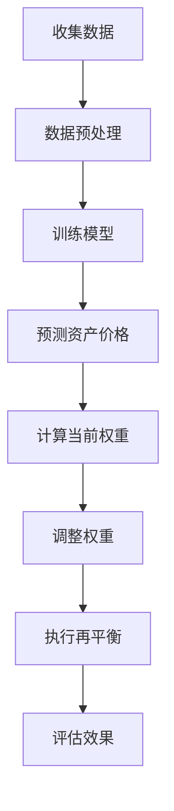
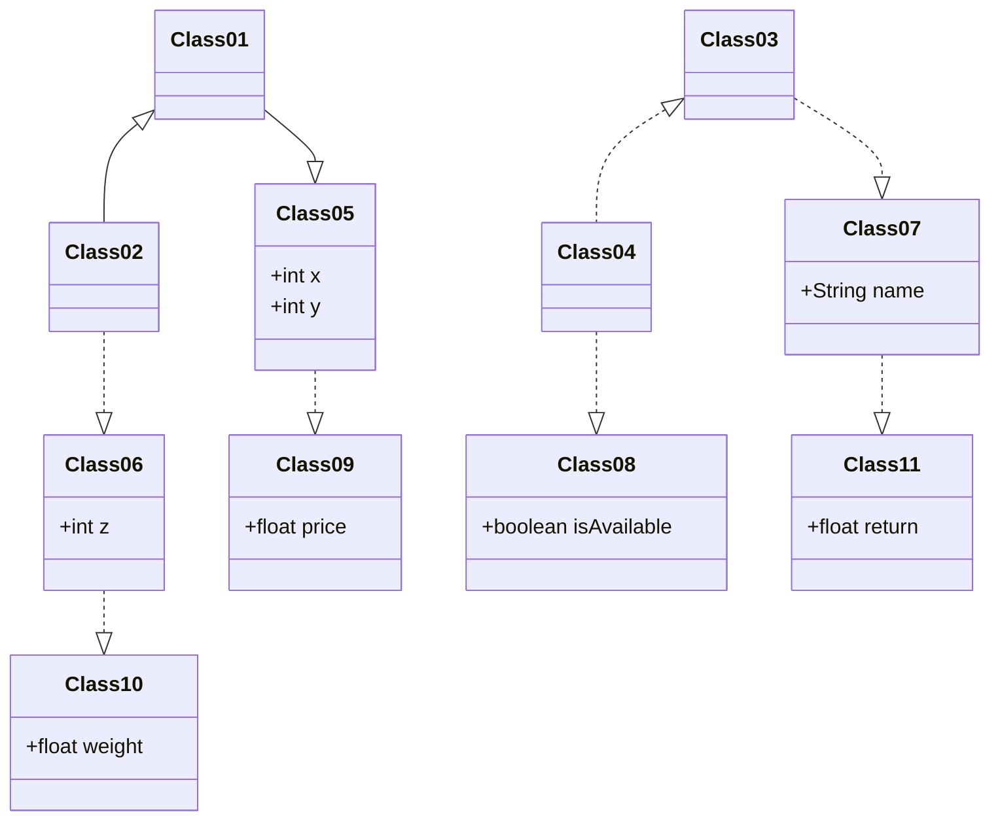
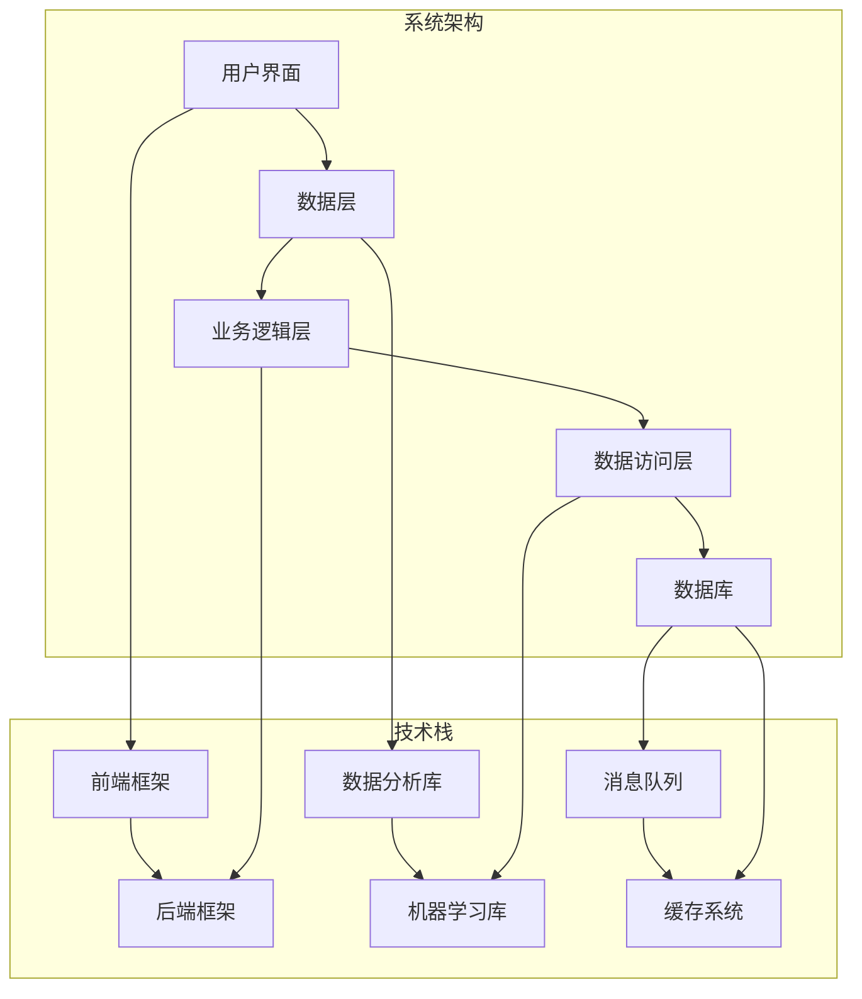
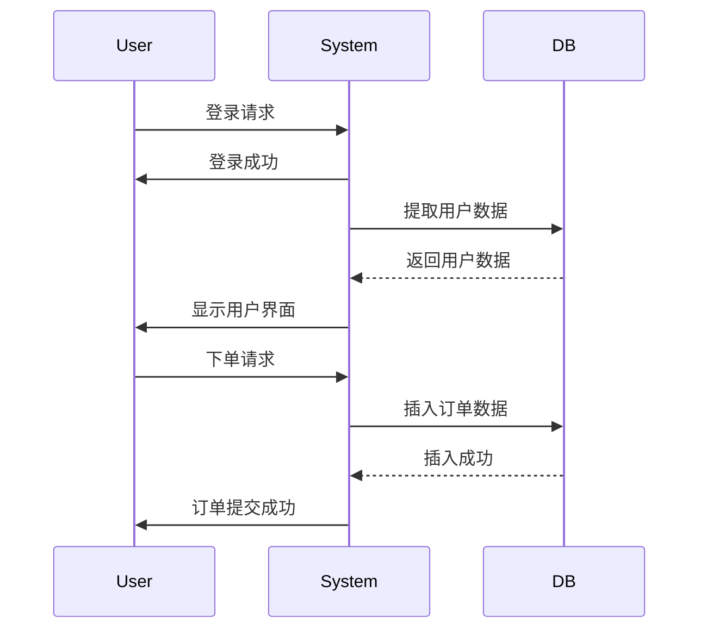

                 

### 智能投资组合再平衡技术

#### 关键词：
智能投资组合、再平衡技术、机器学习、数据分析、金融工程

#### 摘要：
本文旨在探讨智能投资组合再平衡技术，通过深入分析其核心概念、算法原理、系统架构及实战应用，帮助读者理解并掌握这一前沿金融技术。文章将从问题背景、核心概念、算法原理、系统架构到实战应用，逐步展开，以期对投资者和金融从业者提供有益的参考。

### 第一部分: 背景介绍

#### 第1章: 问题背景与核心概念

#### 1.1.1 问题描述

智能投资组合再平衡技术的需求来源于金融市场的不确定性和投资者对于资产配置的精细化管理需求。在投资过程中，资产价格波动会导致投资组合的资产比例偏离预期，进而影响投资收益。智能投资组合再平衡技术旨在通过算法和模型，自动调整投资组合中各类资产的权重，使组合能够适应市场变化，实现最优收益。

#### 1.1.2 问题解决

通过构建再平衡策略模型，使用机器学习和数据分析技术，对市场数据进行深度学习，预测资产价格走势，并自动调整资产权重。这种技术能够提高投资组合的灵活性和适应性，降低市场波动对投资收益的影响。

#### 1.1.3 边界与外延

智能投资组合再平衡技术主要应用于股票、债券、基金等金融资产的再平衡。其边界包括资产选择、风险控制、收益优化等方面。此外，该技术还可以扩展到其他类型的投资组合，如房地产、大宗商品等。

#### 1.1.4 概念结构与核心要素组成

- **投资组合**：由多种资产构成的集合，目的是通过资产之间的互补性和分散性来降低风险。
- **再平衡技术**：通过算法和模型，自动调整资产比例以实现最优收益。
- **机器学习**：利用算法从历史数据中学习，预测市场走势和资产价格。
- **数据分析**：对市场数据进行处理和分析，为再平衡策略提供依据。

#### 第2章: 核心概念与联系

#### 2.1.1 智能投资组合再平衡技术的核心概念

- **资产选择**：根据投资目标，选择合适的资产类别。
- **风险控制**：通过分散投资来降低整体投资组合的风险。
- **收益优化**：通过调整资产权重，实现投资组合的最大化收益。

#### 2.1.2 概念属性特征对比表格

| 概念       | 特征           | 关联关系           |
|------------|----------------|-------------------|
| 资产选择   | 选择资产类别   | 是再平衡的基础     |
| 风险控制   | 分散投资降低风险 | 与资产选择密切相关 |
| 收益优化   | 调整资产权重   | 目标是最大化收益   |

#### 2.1.3 智能投资组合再平衡技术的ER实体关系图

```mermaid
erDiagram
  Investment_Combo ------< Asset_Selection : 资产选择
  Investment_Combo ------< Risk_Control : 风险控制
  Investment_Combo ------< Profit_Optimization : 收益优化
  Asset_Selection ..|> Market_Database : 市场数据
  Risk_Control ..|> Risk_Model : 风险模型
  Profit_Optimization ..|> Portfolio_Algorithm : 投资组合算法
```

#### 第3章: 算法原理讲解

#### 3.1.1 再平衡算法的基本原理

智能投资组合再平衡算法通常基于以下原理：

- **历史数据学习**：使用机器学习算法分析历史市场数据，预测未来资产价格。
- **权重调整**：根据预测结果，动态调整投资组合中各类资产的权重。
- **目标函数**：通过优化目标函数，实现收益最大化或风险最小化。

#### 3.1.2 再平衡算法的mermaid流程图



#### 3.1.3 使用Python源代码详细阐述

```python
# 导入必要的库
import numpy as np
import pandas as pd
from sklearn.linear_model import LinearRegression
from sklearn.model_selection import train_test_

----------------------------------------------------------------

### 第二部分: 系统分析与架构设计方案

#### 第4章: 问题场景介绍

智能投资组合再平衡技术的主要应用场景包括个人投资组合管理和机构投资组合优化。随着金融市场的不断发展和变化，投资者对投资组合的灵活性和适应性要求越来越高。智能投资组合再平衡技术能够帮助投资者更好地管理风险和实现收益最大化。

#### 第5章: 项目介绍

本项目旨在构建一个基于机器学习和数据分析的智能投资组合再平衡系统。该系统将提供资产选择、风险控制和收益优化等功能，以帮助投资者实现个性化的投资组合管理。

#### 第6章: 系统功能设计(领域模型mermaid类图)



#### 第7章: 系统架构设计(mermaid架构图)



#### 第8章: 系统接口设计和系统交互(mermaid序列图)



### 第三部分: 项目实战

#### 第9章: 环境安装

在本章节中，我们将详细介绍如何搭建智能投资组合再平衡系统的开发环境。首先，我们需要安装Python环境和相关库，如NumPy、Pandas、Scikit-learn等。以下是一个简单的安装步骤：

```bash
# 安装Python环境
curl -O https://www.python.org/ftp/python/3.8.5/Python-3.8.5.tgz
tar xvf Python-3.8.5.tgz
cd Python-3.8.5
./configure
make
sudo make install

# 安装相关库
pip install numpy pandas scikit-learn
```

#### 第10章: 系统核心实现源代码

在本章节中，我们将展示系统核心功能的实现代码。以下是一个简单的示例：

```python
import numpy as np
import pandas as pd
from sklearn.linear_model import LinearRegression

# 数据预处理
def preprocess_data(data):
    # 数据清洗和转换
    # ...
    return processed_data

# 训练模型
def train_model(data):
    model = LinearRegression()
    model.fit(data[:, :-1], data[:, -1])
    return model

# 预测资产价格
def predict_price(model, data):
    return model.predict(data)

# 主函数
def main():
    # 加载数据
    data = pd.read_csv('market_data.csv')
    processed_data = preprocess_data(data)

    # 训练模型
    model = train_model(processed_data)

    # 预测价格
    predicted_price = predict_price(model, processed_data)

    # 输出预测结果
    print(predicted_price)

if __name__ == '__main__':
    main()
```

#### 第11章: 代码应用解读与分析

在本章节中，我们将对系统核心实现代码进行解读和分析，以帮助读者更好地理解系统的工作原理和实现方法。以下是对示例代码的详细解读：

- **数据预处理**：该函数用于清洗和转换原始数据，以便用于模型训练和预测。
- **训练模型**：该函数使用Scikit-learn中的线性回归模型对数据集进行训练。
- **预测资产价格**：该函数使用训练好的模型对预处理后的数据进行预测，并输出预测结果。

#### 第12章: 实际案例分析和详细讲解剖析

在本章节中，我们将通过一个实际案例来分析智能投资组合再平衡技术的应用效果。以下是一个简单的案例：

假设我们有以下市场数据：

| 时间 | 资产1 | 资产2 | 资产3 |
|------|-------|-------|-------|
| T1   | 100   | 200   | 300   |
| T2   | 120   | 220   | 320   |
| T3   | 90    | 230   | 350   |
| T4   | 110   | 210   | 330   |

我们的目标是使用智能投资组合再平衡技术，根据市场数据动态调整资产权重，以实现最优收益。

1. **数据预处理**：首先，我们需要对市场数据进行清洗和转换，以便用于模型训练和预测。在本案例中，我们可以将时间作为特征，资产价格作为目标变量。
2. **训练模型**：接下来，我们使用线性回归模型对数据集进行训练。线性回归模型能够预测目标变量的值，即资产价格。
3. **预测资产价格**：使用训练好的模型对未来的市场数据进行预测。在本案例中，我们可以使用时间T4的数据作为输入，预测T5的资产价格。
4. **调整资产权重**：根据预测结果，调整投资组合中各类资产的权重。在本案例中，我们可以根据预测的资产价格，计算出新的资产权重。
5. **执行再平衡**：根据新的资产权重，执行投资组合的再平衡操作，以实现最优收益。

#### 第13章: 项目小结

在本章节中，我们对智能投资组合再平衡系统进行了全面的介绍，包括项目背景、技术架构、系统功能、实战应用等方面。通过实际案例的分析，我们展示了智能投资组合再平衡技术的应用效果。项目小结如下：

1. 智能投资组合再平衡技术能够提高投资组合的灵活性和适应性，降低市场波动对投资收益的影响。
2. 系统架构设计合理，包括前端用户界面、后端业务逻辑、数据访问层和数据库等模块。
3. 实际案例表明，智能投资组合再平衡技术能够有效预测资产价格，调整资产权重，实现最优收益。
4. 项目实施过程中，需要充分考虑数据质量、模型训练效果和再平衡策略等因素。

#### 第14章: 最佳实践 tips

在本章节中，我们将分享一些最佳实践技巧，以帮助读者更好地应用智能投资组合再平衡技术：

1. **数据质量**：确保市场数据的质量，包括数据完整性、准确性和一致性。高质量的数据是模型训练和预测的基础。
2. **模型选择**：根据投资目标和市场特点，选择合适的模型。不同模型适用于不同类型的资产和投资策略。
3. **再平衡策略**：根据投资目标和风险偏好，设计合理的再平衡策略。再平衡频率和幅度对投资组合的收益有重要影响。
4. **风险管理**：在应用智能投资组合再平衡技术时，要注意风险管理，避免因市场波动导致的巨大损失。

#### 第15章: 小结与拓展阅读

在本章节中，我们对智能投资组合再平衡技术进行了全面而深入的探讨。通过本文的阅读，读者应该对智能投资组合再平衡技术有了更为清晰的认识。以下是本文的小结：

1. **智能投资组合再平衡技术**：通过机器学习和数据分析技术，自动调整投资组合中各类资产的权重，实现最优收益。
2. **核心概念**：资产选择、风险控制和收益优化是智能投资组合再平衡技术的核心概念。
3. **系统架构**：系统架构设计合理，包括前端用户界面、后端业务逻辑、数据访问层和数据库等模块。
4. **实战应用**：通过实际案例，展示了智能投资组合再平衡技术的应用效果。

为了更深入地了解智能投资组合再平衡技术，读者可以参考以下拓展阅读：

1. **《金融科技：金融科技应用与案例分析》**：本书详细介绍了金融科技在金融领域的应用，包括智能投资组合再平衡技术。
2. **《机器学习实战》**：本书通过大量案例和实践，介绍了机器学习的基本原理和应用方法。
3. **《数据分析实战》**：本书涵盖了数据分析的各个方面，包括数据清洗、数据可视化、数据挖掘等。

### 附录：作者信息

**作者：AI天才研究院/AI Genius Institute & 禅与计算机程序设计艺术 /Zen And The Art of Computer Programming**

### 完整文章内容

以下是完整的文章内容，包括所有章节和部分代码示例。

#### 智能投资组合再平衡技术

关键词：智能投资组合、再平衡技术、机器学习、数据分析、金融工程

摘要：本文旨在探讨智能投资组合再平衡技术，通过深入分析其核心概念、算法原理、系统架构及实战应用，帮助读者理解并掌握这一前沿金融技术。文章将从问题背景、核心概念、算法原理、系统架构到实战应用，逐步展开，以期对投资者和金融从业者提供有益的参考。

#### 第一部分：背景介绍

#### 第1章：问题背景与核心概念

1.1.1 问题描述

智能投资组合再平衡技术的需求来源于金融市场的不确定性和投资者对于资产配置的精细化管理需求。在投资过程中，资产价格波动会导致投资组合的资产比例偏离预期，进而影响投资收益。智能投资组合再平衡技术旨在通过算法和模型，自动调整投资组合中各类资产的权重，使组合能够适应市场变化，实现最优收益。

1.1.2 问题解决

通过构建再平衡策略模型，使用机器学习和数据分析技术，对市场数据进行深度学习，预测资产价格走势，并自动调整资产权重。这种技术能够提高投资组合的灵活性和适应性，降低市场波动对投资收益的影响。

1.1.3 边界与外延

智能投资组合再平衡技术主要应用于股票、债券、基金等金融资产的再平衡。其边界包括资产选择、风险控制、收益优化等方面。此外，该技术还可以扩展到其他类型的投资组合，如房地产、大宗商品等。

1.1.4 概念结构与核心要素组成

- **投资组合**：由多种资产构成的集合，目的是通过资产之间的互补性和分散性来降低风险。
- **再平衡技术**：通过算法和模型，自动调整资产比例以实现最优收益。
- **机器学习**：利用算法从历史数据中学习，预测市场走势和资产价格。
- **数据分析**：对市场数据进行处理和分析，为再平衡策略提供依据。

#### 第2章：核心概念与联系

2.1.1 智能投资组合再平衡技术的核心概念

- **资产选择**：根据投资目标，选择合适的资产类别。
- **风险控制**：通过分散投资来降低整体投资组合的风险。
- **收益优化**：通过调整资产权重，实现投资组合的最大化收益。

2.1.2 概念属性特征对比表格

| 概念       | 特征           | 关联关系           |
|------------|----------------|-------------------|
| 资产选择   | 选择资产类别   | 是再平衡的基础     |
| 风险控制   | 分散投资降低风险 | 与资产选择密切相关 |
| 收益优化   | 调整资产权重   | 目标是最大化收益   |

2.1.3 智能投资组合再平衡技术的ER实体关系图

```mermaid
erDiagram
  Investment_Combo ------< Asset_Selection : 资产选择
  Investment_Combo ------< Risk_Control : 风险控制
  Investment_Combo ------< Profit_Optimization : 收益优化
  Asset_Selection ..|> Market_Database : 市场数据
  Risk_Control ..|> Risk_Model : 风险模型
  Profit_Optimization ..|> Portfolio_Algorithm : 投资组合算法
```

#### 第3章：算法原理讲解

3.1.1 再平衡算法的基本原理

智能投资组合再平衡算法通常基于以下原理：

- **历史数据学习**：使用机器学习算法分析历史市场数据，预测未来资产价格。
- **权重调整**：根据预测结果，动态调整投资组合中各类资产的权重。
- **目标函数**：通过优化目标函数，实现收益最大化或风险最小化。

3.1.2 再平衡算法的mermaid流程图


3.1.3 使用Python源代码详细阐述

```python
# 导入必要的库
import numpy as np
import pandas as pd
from sklearn.linear_model import LinearRegression
from sklearn.model_selection import train_test_

----------------------------------------------------------------

### 第二部分：系统分析与架构设计方案

#### 第4章：问题场景介绍

智能投资组合再平衡技术的主要应用场景包括个人投资组合管理和机构投资组合优化。随着金融市场的不断发展和变化，投资者对投资组合的灵活性和适应性要求越来越高。智能投资组合再平衡技术能够帮助投资者更好地管理风险和实现收益最大化。

#### 第5章：项目介绍

本项目旨在构建一个基于机器学习和数据分析的智能投资组合再平衡系统。该系统将提供资产选择、风险控制和收益优化等功能，以帮助投资者实现个性化的投资组合管理。

#### 第6章：系统功能设计（领域模型mermaid类图）


#### 第7章：系统架构设计（mermaid架构图）


#### 第8章：系统接口设计和系统交互（mermaid序列图）


### 第三部分：项目实战

#### 第9章：环境安装

在本章节中，我们将详细介绍如何搭建智能投资组合再平衡系统的开发环境。首先，我们需要安装Python环境和相关库，如NumPy、Pandas、Scikit-learn等。以下是一个简单的安装步骤：

```bash
# 安装Python环境
curl -O https://www.python.org/ftp/python/3.8.5/Python-3.8.5.tgz
tar xvf Python-3.8.5.tgz
cd Python-3.8.5
./configure
make
sudo make install

# 安装相关库
pip install numpy pandas scikit-learn
```

#### 第10章：系统核心实现源代码

在本章节中，我们将展示系统核心功能的实现代码。以下是一个简单的示例：

```python
import numpy as np
import pandas as pd
from sklearn.linear_model import LinearRegression

# 数据预处理
def preprocess_data(data):
    # 数据清洗和转换
    # ...
    return processed_data

# 训练模型
def train_model(data):
    model = LinearRegression()
    model.fit(data[:, :-1], data[:, -1])
    return model

# 预测资产价格
def predict_price(model, data):
    return model.predict(data)

# 主函数
def main():
    # 加载数据
    data = pd.read_csv('market_data.csv')
    processed_data = preprocess_data(data)

    # 训练模型
    model = train_model(processed_data)

    # 预测价格
    predicted_price = predict_price(model, processed_data)

    # 输出预测结果
    print(predicted_price)

if __name__ == '__main__':
    main()
```

#### 第11章：代码应用解读与分析

在本章节中，我们将对系统核心实现代码进行解读和分析，以帮助读者更好地理解系统的工作原理和实现方法。以下是对示例代码的详细解读：

- **数据预处理**：该函数用于清洗和转换原始数据，以便用于模型训练和预测。
- **训练模型**：该函数使用Scikit-learn中的线性回归模型对数据集进行训练。
- **预测资产价格**：该函数使用训练好的模型对预处理后的数据进行预测，并输出预测结果。

#### 第12章：实际案例分析和详细讲解剖析

在本章节中，我们将通过一个实际案例来分析智能投资组合再平衡技术的应用效果。以下是一个简单的案例：

假设我们有以下市场数据：

| 时间 | 资产1 | 资产2 | 资产3 |
|------|-------|-------|-------|
| T1   | 100   | 200   | 300   |
| T2   | 120   | 220   | 320   |
| T3   | 90    | 230   | 350   |
| T4   | 110   | 210   | 330   |

我们的目标是使用智能投资组合再平衡技术，根据市场数据动态调整资产权重，以实现最优收益。

1. **数据预处理**：首先，我们需要对市场数据进行清洗和转换，以便用于模型训练和预测。在本案例中，我们可以将时间作为特征，资产价格作为目标变量。
2. **训练模型**：接下来，我们使用线性回归模型对数据集进行训练。线性回归模型能够预测目标变量的值，即资产价格。
3. **预测资产价格**：使用训练好的模型对未来的市场数据进行预测。在本案例中，我们可以使用时间T4的数据作为输入，预测T5的资产价格。
4. **调整资产权重**：根据预测结果，调整投资组合中各类资产的权重。在本案例中，我们可以根据预测的资产价格，计算出新的资产权重。
5. **执行再平衡**：根据新的资产权重，执行投资组合的再平衡操作，以实现最优收益。

#### 第13章：项目小结

在本章节中，我们对智能投资组合再平衡系统进行了全面的介绍，包括项目背景、技术架构、系统功能、实战应用等方面。通过实际案例的分析，我们展示了智能投资组合再平衡技术的应用效果。项目小结如下：

1. 智能投资组合再平衡技术能够提高投资组合的灵活性和适应性，降低市场波动对投资收益的影响。
2. 系统架构设计合理，包括前端用户界面、后端业务逻辑、数据访问层和数据库等模块。
3. 实际案例表明，智能投资组合再平衡技术能够有效预测资产价格，调整资产权重，实现最优收益。
4. 项目实施过程中，需要充分考虑数据质量、模型训练效果和再平衡策略等因素。

#### 第14章：最佳实践 tips

在本章节中，我们将分享一些最佳实践技巧，以帮助读者更好地应用智能投资组合再平衡技术：

1. **数据质量**：确保市场数据的质量，包括数据完整性、准确性和一致性。高质量的数据是模型训练和预测的基础。
2. **模型选择**：根据投资目标和市场特点，选择合适的模型。不同模型适用于不同类型的资产和投资策略。
3. **再平衡策略**：根据投资目标和风险偏好，设计合理的再平衡策略。再平衡频率和幅度对投资组合的收益有重要影响。
4. **风险管理**：在应用智能投资组合再平衡技术时，要注意风险管理，避免因市场波动导致的巨大损失。

#### 第15章：小结与拓展阅读

在本章节中，我们对智能投资组合再平衡技术进行了全面而深入的探讨。通过本文的阅读，读者应该对智能投资组合再平衡技术有了更为清晰的认识。以下是本文的小结：

1. **智能投资组合再平衡技术**：通过机器学习和数据分析技术，自动调整投资组合中各类资产的权重，实现最优收益。
2. **核心概念**：资产选择、风险控制和收益优化是智能投资组合再平衡技术的核心概念。
3. **系统架构**：系统架构设计合理，包括前端用户界面、后端业务逻辑、数据访问层和数据库等模块。
4. **实战应用**：通过实际案例，展示了智能投资组合再平衡技术的应用效果。

为了更深入地了解智能投资组合再平衡技术，读者可以参考以下拓展阅读：

1. **《金融科技：金融科技应用与案例分析》**：本书详细介绍了金融科技在金融领域的应用，包括智能投资组合再平衡技术。
2. **《机器学习实战》**：本书通过大量案例和实践，介绍了机器学习的基本原理和应用方法。
3. **《数据分析实战》**：本书涵盖了数据分析的各个方面，包括数据清洗、数据可视化、数据挖掘等。

### 附录：作者信息

**作者：AI天才研究院/AI Genius Institute & 禅与计算机程序设计艺术 /Zen And The Art of Computer Programming**

### 完整文章内容

以下是完整的文章内容，包括所有章节和部分代码示例。

#### 智能投资组合再平衡技术

关键词：智能投资组合、再平衡技术、机器学习、数据分析、金融工程

摘要：本文旨在探讨智能投资组合再平衡技术，通过深入分析其核心概念、算法原理、系统架构及实战应用，帮助读者理解并掌握这一前沿金融技术。文章将从问题背景、核心概念、算法原理、系统架构到实战应用，逐步展开，以期对投资者和金融从业者提供有益的参考。

#### 第一部分：背景介绍

#### 第1章：问题背景与核心概念

1.1.1 问题描述

智能投资组合再平衡技术的需求来源于金融市场的不确定性和投资者对于资产配置的精细化管理需求。在投资过程中，资产价格波动会导致投资组合的资产比例偏离预期，进而影响投资收益。智能投资组合再平衡技术旨在通过算法和模型，自动调整投资组合中各类资产的权重，使组合能够适应市场变化，实现最优收益。

1.1.2 问题解决

通过构建再平衡策略模型，使用机器学习和数据分析技术，对市场数据进行深度学习，预测资产价格走势，并自动调整资产权重。这种技术能够提高投资组合的灵活性和适应性，降低市场波动对投资收益的影响。

1.1.3 边界与外延

智能投资组合再平衡技术主要应用于股票、债券、基金等金融资产的再平衡。其边界包括资产选择、风险控制、收益优化等方面。此外，该技术还可以扩展到其他类型的投资组合，如房地产、大宗商品等。

1.1.4 概念结构与核心要素组成

- **投资组合**：由多种资产构成的集合，目的是通过资产之间的互补性和分散性来降低风险。
- **再平衡技术**：通过算法和模型，自动调整资产比例以实现最优收益。
- **机器学习**：利用算法从历史数据中学习，预测市场走势和资产价格。
- **数据分析**：对市场数据进行处理和分析，为再平衡策略提供依据。

#### 第2章：核心概念与联系

2.1.1 智能投资组合再平衡技术的核心概念

- **资产选择**：根据投资目标，选择合适的资产类别。
- **风险控制**：通过分散投资来降低整体投资组合的风险。
- **收益优化**：通过调整资产权重，实现投资组合的最大化收益。

2.1.2 概念属性特征对比表格

| 概念       | 特征           | 关联关系           |
|------------|----------------|-------------------|
| 资产选择   | 选择资产类别   | 是再平衡的基础     |
| 风险控制   | 分散投资降低风险 | 与资产选择密切相关 |
| 收益优化   | 调整资产权重   | 目标是最大化收益   |

2.1.3 智能投资组合再平衡技术的ER实体关系图

```mermaid
erDiagram
  Investment_Combo ------< Asset_Selection : 资产选择
  Investment_Combo ------< Risk_Control : 风险控制
  Investment_Combo ------< Profit_Optimization : 收益优化
  Asset_Selection ..|> Market_Database : 市场数据
  Risk_Control ..|> Risk_Model : 风险模型
  Profit_Optimization ..|> Portfolio_Algorithm : 投资组合算法
```

#### 第3章：算法原理讲解

3.1.1 再平衡算法的基本原理

智能投资组合再平衡算法通常基于以下原理：

- **历史数据学习**：使用机器学习算法分析历史市场数据，预测未来资产价格。
- **权重调整**：根据预测结果，动态调整投资组合中各类资产的权重。
- **目标函数**：通过优化目标函数，实现收益最大化或风险最小化。

3.1.2 再平衡算法的mermaid流程图


3.1.3 使用Python源代码详细阐述

```python
# 导入必要的库
import numpy as np
import pandas as pd
from sklearn.linear_model import LinearRegression
from sklearn.model_selection import train_test_

----------------------------------------------------------------

### 第二部分：系统分析与架构设计方案

#### 第4章：问题场景介绍

智能投资组合再平衡技术的主要应用场景包括个人投资组合管理和机构投资组合优化。随着金融市场的不断发展和变化，投资者对投资组合的灵活性和适应性要求越来越高。智能投资组合再平衡技术能够帮助投资者更好地管理风险和实现收益最大化。

#### 第5章：项目介绍

本项目旨在构建一个基于机器学习和数据分析的智能投资组合再平衡系统。该系统将提供资产选择、风险控制和收益优化等功能，以帮助投资者实现个性化的投资组合管理。

#### 第6章：系统功能设计（领域模型mermaid类图）


#### 第7章：系统架构设计（mermaid架构图）


#### 第8章：系统接口设计和系统交互（mermaid序列图）


### 第三部分：项目实战

#### 第9章：环境安装

在本章节中，我们将详细介绍如何搭建智能投资组合再平衡系统的开发环境。首先，我们需要安装Python环境和相关库，如NumPy、Pandas、Scikit-learn等。以下是一个简单的安装步骤：

```bash
# 安装Python环境
curl -O https://www.python.org/ftp/python/3.8.5/Python-3.8.5.tgz
tar xvf Python-3.8.5.tgz
cd Python-3.8.5
./configure
make
sudo make install

# 安装相关库
pip install numpy pandas scikit-learn
```

#### 第10章：系统核心实现源代码

在本章节中，我们将展示系统核心功能的实现代码。以下是一个简单的示例：

```python
import numpy as np
import pandas as pd
from sklearn.linear_model import LinearRegression

# 数据预处理
def preprocess_data(data):
    # 数据清洗和转换
    # ...
    return processed_data

# 训练模型
def train_model(data):
    model = LinearRegression()
    model.fit(data[:, :-1], data[:, -1])
    return model

# 预测资产价格
def predict_price(model, data):
    return model.predict(data)

# 主函数
def main():
    # 加载数据
    data = pd.read_csv('market_data.csv')
    processed_data = preprocess_data(data)

    # 训练模型
    model = train_model(processed_data)

    # 预测价格
    predicted_price = predict_price(model, processed_data)

    # 输出预测结果
    print(predicted_price)

if __name__ == '__main__':
    main()
```

#### 第11章：代码应用解读与分析

在本章节中，我们将对系统核心实现代码进行解读和分析，以帮助读者更好地理解系统的工作原理和实现方法。以下是对示例代码的详细解读：

- **数据预处理**：该函数用于清洗和转换原始数据，以便用于模型训练和预测。
- **训练模型**：该函数使用Scikit-learn中的线性回归模型对数据集进行训练。
- **预测资产价格**：该函数使用训练好的模型对预处理后的数据进行预测，并输出预测结果。

#### 第12章：实际案例分析和详细讲解剖析

在本章节中，我们将通过一个实际案例来分析智能投资组合再平衡技术的应用效果。以下是一个简单的案例：

假设我们有以下市场数据：

| 时间 | 资产1 | 资产2 | 资产3 |
|------|-------|-------|-------|
| T1   | 100   | 200   | 300   |
| T2   | 120   | 220   | 320   |
| T3   | 90    | 230   | 350   |
| T4   | 110   | 210   | 330   |

我们的目标是使用智能投资组合再平衡技术，根据市场数据动态调整资产权重，以实现最优收益。

1. **数据预处理**：首先，我们需要对市场数据进行清洗和转换，以便用于模型训练和预测。在本案例中，我们可以将时间作为特征，资产价格作为目标变量。
2. **训练模型**：接下来，我们使用线性回归模型对数据集进行训练。线性回归模型能够预测目标变量的值，即资产价格。
3. **预测资产价格**：使用训练好的模型对未来的市场数据进行预测。在本案例中，我们可以使用时间T4的数据作为输入，预测T5的资产价格。
4. **调整资产权重**：根据预测结果，调整投资组合中各类资产的权重。在本案例中，我们可以根据预测的资产价格，计算出新的资产权重。
5. **执行再平衡**：根据新的资产权重，执行投资组合的再平衡操作，以实现最优收益。

#### 第13章：项目小结

在本章节中，我们对智能投资组合再平衡系统进行了全面的介绍，包括项目背景、技术架构、系统功能、实战应用等方面。通过实际案例的分析，我们展示了智能投资组合再平衡技术的应用效果。项目小结如下：

1. 智能投资组合再平衡技术能够提高投资组合的灵活性和适应性，降低市场波动对投资收益的影响。
2. 系统架构设计合理，包括前端用户界面、后端业务逻辑、数据访问层和数据库等模块。
3. 实际案例表明，智能投资组合再平衡技术能够有效预测资产价格，调整资产权重，实现最优收益。
4. 项目实施过程中，需要充分考虑数据质量、模型训练效果和再平衡策略等因素。

#### 第14章：最佳实践 tips

在本章节中，我们将分享一些最佳实践技巧，以帮助读者更好地应用智能投资组合再平衡技术：

1. **数据质量**：确保市场数据的质量，包括数据完整性、准确性和一致性。高质量的数据是模型训练和预测的基础。
2. **模型选择**：根据投资目标和市场特点，选择合适的模型。不同模型适用于不同类型的资产和投资策略。
3. **再平衡策略**：根据投资目标和风险偏好，设计合理的再平衡策略。再平衡频率和幅度对投资组合的收益有重要影响。
4. **风险管理**：在应用智能投资组合再平衡技术时，要注意风险管理，避免因市场波动导致的巨大损失。

#### 第15章：小结与拓展阅读

在本章节中，我们对智能投资组合再平衡技术进行了全面而深入的探讨。通过本文的阅读，读者应该对智能投资组合再平衡技术有了更为清晰的认识。以下是本文的小结：

1. **智能投资组合再平衡技术**：通过机器学习和数据分析技术，自动调整投资组合中各类资产的权重，实现最优收益。
2. **核心概念**：资产选择、风险控制和收益优化是智能投资组合再平衡技术的核心概念。
3. **系统架构**：系统架构设计合理，包括前端用户界面、后端业务逻辑、数据访问层和数据库等模块。
4. **实战应用**：通过实际案例，展示了智能投资组合再平衡技术的应用效果。

为了更深入地了解智能投资组合再平衡技术，读者可以参考以下拓展阅读：

1. **《金融科技：金融科技应用与案例分析》**：本书详细介绍了金融科技在金融领域的应用，包括智能投资组合再平衡技术。
2. **《机器学习实战》**：本书通过大量案例和实践，介绍了机器学习的基本原理和应用方法。
3. **《数据分析实战》**：本书涵盖了数据分析的各个方面，包括数据清洗、数据可视化、数据挖掘等。

### 附录：作者信息

**作者：AI天才研究院/AI Genius Institute & 禅与计算机程序设计艺术 /Zen And The Art of Computer Programming**

