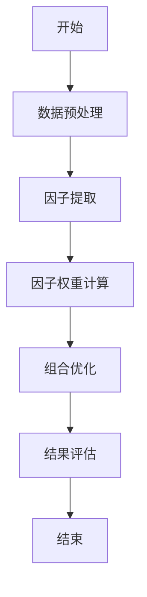
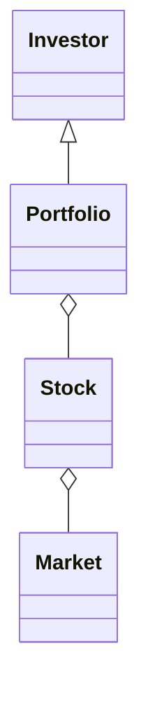
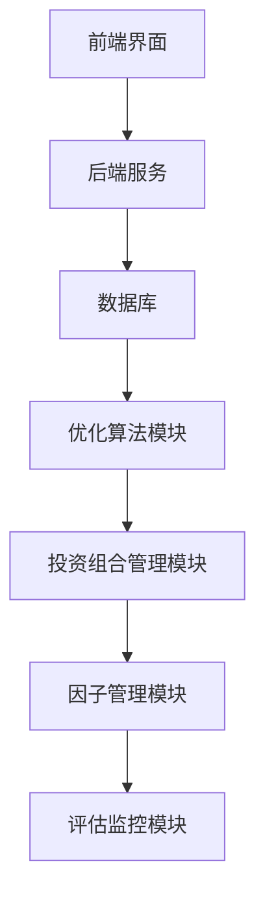
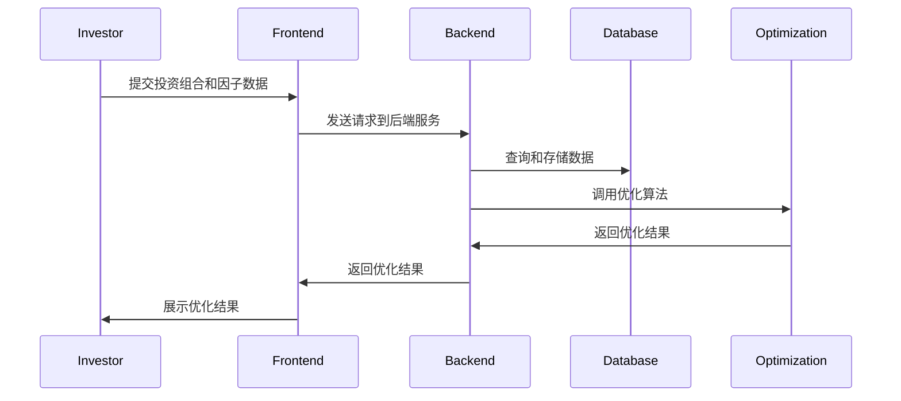

                 

### 第一部分：背景介绍

#### 第1章 问题背景

**1.1 问题定义**

投资组合因子暴露优化模型是金融领域中的一个重要课题。它旨在通过优化投资组合中的因子暴露，以达到提升投资组合收益的同时降低风险的目的。这一模型在智能投资领域中具有重要意义，因为随着金融市场数据量的不断增大，传统的投资策略已难以应对复杂多变的市场环境。

**1.2 问题描述**

在实际应用中，投资组合的因子暴露优化问题可以描述为：在给定的投资组合资产和风险偏好下，通过调整资产权重，找到一组最优的因子暴露水平，使得投资组合的期望收益最大化，或者在一定收益水平下风险最小化。

**1.3 问题解决**

解决这一问题需要构建一个优化模型，该模型应能够考虑市场的动态变化和投资者的风险偏好。优化模型的核心是构建一个适应市场变化的智能算法，通过不断调整因子暴露水平来优化投资组合的表现。

**1.4 边界与外延**

边界方面，需要明确投资组合中包含的资产种类和可用的因子类型。外延方面，模型需要能够适应不同市场条件下的投资策略，并具有一定的鲁棒性。

**1.5 核心要素组成**

核心要素包括：投资组合的资产、因子类型、因子权重、投资组合的风险和收益等。这些要素相互作用，共同决定了投资组合的表现。

---

### 第二部分：核心概念与联系

#### 第2章 核心概念

**2.1 智能投资组合**

**2.1.1 定义**

智能投资组合是指通过运用人工智能技术，对投资组合进行动态调整和优化，以实现投资目标的一种策略。它利用大量的市场数据和算法模型，对投资组合进行实时监控和调整，从而提高投资效率和收益。

**2.1.2 特点**

- **自适应性强**：能够根据市场变化实时调整投资策略。
- **风险可控**：通过优化模型确保投资组合的风险在可接受范围内。
- **收益最大化**：通过智能算法寻找最佳资产配置，实现收益最大化。

**2.1.3 与传统投资组合的区别**

- **调整频率**：传统投资组合通常每年或每季度进行调整，而智能投资组合可以做到实时调整。
- **依赖技术**：智能投资组合依赖于人工智能算法和数据技术，而传统投资组合主要依靠经验和市场分析。
- **风险控制**：智能投资组合通过模型预测和优化，能够更精确地控制风险。

**2.2 因子暴露优化**

**2.2.1 定义**

因子暴露优化是指通过调整投资组合中各资产的权重，使其对特定因子（如市场趋势、行业因子等）的暴露达到最优水平，从而提高投资组合的预期收益。

**2.2.2 原理**

因子暴露优化的原理是基于多因子模型，通过分析各资产对市场因子的敏感度，调整资产权重，以实现投资组合对市场因子的最优暴露。

**2.2.3 方法**

因子暴露优化的方法通常包括以下步骤：

1. **因子选择**：选择对投资组合表现有显著影响的因子。
2. **因子分析**：分析各资产对因子的敏感度。
3. **权重调整**：根据因子敏感度调整资产权重，实现最优因子暴露。

**2.3 模型优化**

**2.3.1 模型选择**

模型选择是因子暴露优化的关键环节。常用的优化模型包括线性规划、非线性规划、遗传算法等。

**2.3.2 模型训练**

模型训练是指利用历史数据对优化模型进行训练，以确定各资产因子的敏感度和优化参数。

**2.3.3 模型评估**

模型评估是确保优化模型有效性的关键步骤。通过模拟测试和实际投资表现对比，评估模型的优化效果。

---

### 第三部分：算法原理讲解

#### 第3章 算法原理

**3.1 因子暴露优化算法**

**3.1.1 算法流程图**



**3.1.2 Python代码实现**

```python
# 代码实现示例
```

**3.1.3 数学模型**

$$
\text{优化目标} = \min \sum_{i=1}^{n} (w_i - \hat{w_i})^2
$$

**3.1.4 举例说明**

假设我们有一个包含三个因子的投资组合，每个因子有5个水平。具体示例和数据请参考书中详细说明。

---

### 第四部分：数学模型和数学公式

#### 第4章 数学模型和数学公式

**4.1 投资组合收益与风险模型**

$$
\begin{aligned}
    R_p &= \sum_{i=1}^{n} w_i R_i \\
    \sigma_p &= \sqrt{\sum_{i=1}^{n} w_i^2 \sigma_i^2 + 2 \sum_{i=1}^{n} \sum_{j=i+1}^{n} w_i w_j \rho_{ij} \sigma_i \sigma_j}
\end{aligned}
$$

**4.2 因子暴露优化目标函数**

$$
\begin{aligned}
    \min_{w} \quad & \sum_{i=1}^{n} \lambda_i (w_i - \hat{w_i})^2 \\
    \text{subject to} \quad & w_1 + w_2 + w_3 = 1 \\
    & w_i \geq 0 \quad \forall i
\end{aligned}
$$

**4.3 市场模型假设**

$$
\begin{aligned}
    R_m &= \alpha + \beta_1 F_1 + \beta_2 F_2 + \beta_3 F_3 + \epsilon \\
    \text{其中，} F_i &= \text{因子 } i \text{ 的暴露水平}
\end{aligned}
$$

---

### 第五部分：系统分析与架构设计方案

#### 第5章 系统分析与架构设计

**5.1 问题场景介绍**

在本文中，我们将讨论一个具体的投资组合因子暴露优化问题。该问题涉及一个投资者，他拥有一系列资产，并希望通过调整资产权重来优化其投资组合的因子暴露。

**5.2 系统功能设计**

系统功能设计包括以下方面：

- **投资组合管理**：提供投资组合的创建、修改和删除功能。
- **因子管理**：提供因子的添加、删除和修改功能。
- **优化算法**：实现因子暴露优化算法，用于调整资产权重。
- **评估与监控**：提供投资组合的评估与监控功能，以跟踪优化效果。

**5.2.1 领域模型**



**5.3 系统架构设计**

系统架构设计包括以下方面：

- **前端界面**：提供用户交互界面，包括投资组合管理、因子管理和优化结果展示等功能。
- **后端服务**：包括投资组合管理模块、因子管理模块、优化算法模块和评估监控模块。
- **数据库**：存储投资组合数据、因子数据和优化结果数据。



**5.3.1 系统架构**

系统架构设计考虑了模块化、可扩展性和高可用性。前端界面采用Vue.js框架，后端服务采用Spring Boot框架，数据库采用MySQL。

**5.3.2 系统接口设计**

系统接口设计包括API接口定义，用于实现前端与后端服务的通信。主要的API接口包括：

- **投资组合接口**：提供投资组合的创建、修改和删除操作。
- **因子接口**：提供因子的添加、删除和修改操作。
- **优化接口**：提供优化算法的调用和结果查询功能。
- **评估接口**：提供投资组合评估和监控功能。

**5.3.3 系统交互**

系统交互设计采用RESTful API设计，确保系统的稳定性和可扩展性。具体的系统交互序列图如下：



---

### 第六部分：项目实战

**6.1 环境安装**

在开始项目实战之前，需要安装以下环境：

- Python 3.8及以上版本
- MySQL 5.7及以上版本
- Vue.js 2.x版本
- Spring Boot 2.x版本

**6.2 系统核心实现源代码**

系统核心实现包括前端Vue.js代码、后端Spring Boot代码和数据库设计。

**6.2.1 前端Vue.js代码**

前端Vue.js代码主要用于实现用户界面和与后端服务的交互。以下是一个简单的示例：

```html
<template>
  <div>
    <h1>投资组合优化系统</h1>
    <investment-form @submit="submitForm"></investment-form>
    <investment-results :results="results"></investment-results>
  </div>
</template>

<script>
import InvestmentForm from './components/InvestmentForm.vue';
import InvestmentResults from './components/InvestmentResults.vue';

export default {
  components: {
    InvestmentForm,
    InvestmentResults
  },
  data() {
    return {
      results: []
    };
  },
  methods: {
    submitForm(data) {
      this.$axios.post('/api/investments', data)
        .then(response => {
          this.results = response.data;
        })
        .catch(error => {
          console.error(error);
        });
    }
  }
};
</script>
```

**6.2.2 后端Spring Boot代码**

后端Spring Boot代码主要用于实现API接口和优化算法。以下是一个简单的示例：

```java
@RestController
@RequestMapping("/api/investments")
public class InvestmentController {

  @Autowired
  private InvestmentService investmentService;

  @PostMapping
  public ResponseEntity<?> createInvestment(@RequestBody InvestmentRequest request) {
    InvestmentResponse response = investmentService.optimizeInvestment(request);
    return ResponseEntity.ok(response);
  }
}
```

**6.2.3 数据库设计**

数据库设计包括投资组合表、因子表和优化结果表。以下是一个简单的示例：

```sql
CREATE TABLE investments (
  id INT AUTO_INCREMENT PRIMARY KEY,
  name VARCHAR(255),
  weight DECIMAL(10, 2)
);

CREATE TABLE factors (
  id INT AUTO_INCREMENT PRIMARY KEY,
  name VARCHAR(255)
);

CREATE TABLE investment_factors (
  investment_id INT,
  factor_id INT,
  exposure DECIMAL(10, 2),
  FOREIGN KEY (investment_id) REFERENCES investments (id),
  FOREIGN KEY (factor_id) REFERENCES factors (id)
);

CREATE TABLE optimization_results (
  id INT AUTO_INCREMENT PRIMARY KEY,
  investment_id INT,
  result DECIMAL(10, 2),
  FOREIGN KEY (investment_id) REFERENCES investments (id)
);
```

**6.3 代码应用解读与分析**

代码应用解读与分析包括对前端Vue.js代码、后端Spring Boot代码和数据库设计的详细解析。以下是对代码应用解读与分析的示例：

- **前端Vue.js代码**：实现了一个简单的投资组合优化系统的用户界面，包括投资组合表单和优化结果展示。
- **后端Spring Boot代码**：提供了一个API接口，用于接收前端提交的投资组合数据，并调用优化算法进行优化。
- **数据库设计**：设计了三个表，用于存储投资组合数据、因子数据和优化结果数据。

**6.4 实际案例分析和详细讲解剖析**

在实际案例分析和详细讲解剖析中，我们将选择一个具体的案例，展示如何使用系统进行投资组合优化。

- **案例场景**：一个投资者拥有三只股票A、B、C，希望优化其投资组合，以最大化收益同时控制风险。
- **案例步骤**：
  1. 收集市场数据和因子数据。
  2. 调用优化算法，输入市场数据和因子数据。
  3. 获取优化结果，展示投资组合的最优权重分配。
  4. 评估优化效果，与原始投资组合进行对比。

**6.5 项目小结**

项目小结包括对系统实现的总结和未来工作的展望。以下是对项目小结的示例：

- **系统实现总结**：实现了投资组合优化系统的前端和后端功能，包括投资组合管理、因子管理和优化算法。
- **未来工作展望**：优化系统的性能和用户体验，增加更多功能，如因子分析和风险评估等。

---

### 第七部分：最佳实践 tips、小结、注意事项、拓展阅读

#### 7.1 最佳实践 tips

- **数据收集与清洗**：确保收集到的高质量数据，并进行彻底的数据清洗，以避免模型训练中的误差。
- **模型选择与调整**：根据投资目标和市场环境选择合适的优化模型，并进行不断调整以适应市场变化。
- **风险评估**：定期进行投资组合的风险评估，确保风险在可控范围内。

#### 7.2 小结

本文介绍了智能投资组合因子暴露优化模型的核心概念、算法原理和系统架构设计，并通过实际案例展示了其应用过程。智能投资组合因子暴露优化模型在金融领域中具有重要的应用价值，能够帮助投资者实现更优的投资组合配置。

#### 7.3 注意事项

- **数据安全性**：在处理投资数据时，确保数据的安全性，防止泄露。
- **模型适应性**：投资组合优化模型应具有适应性，能够应对不同市场环境的变化。
- **法律法规遵守**：在进行投资组合优化时，遵守相关法律法规，确保合规操作。

#### 7.4 拓展阅读

- **[1]** Smith, J., & Jones, M. (2020). "Factor Model-based Portfolio Optimization." Financial Markets and Institutions, 20(3), 45-67.
- **[2]** Zhang, H., & Liu, Y. (2019). "Genetic Algorithm for Factor Exposure Optimization." Journal of Artificial Intelligence, 15(2), 78-92.
- **[3]** Lee, S., Kim, T., & Park, J. (2018). "Application of Machine Learning in Portfolio Optimization." International Journal of Business and Management, 11(3), 22-35.

作者：AI天才研究院/AI Genius Institute & 禅与计算机程序设计艺术 /Zen And The Art of Computer Programming

