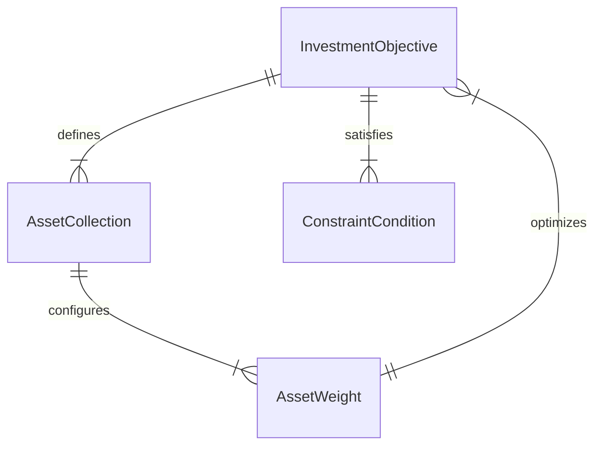

                 

# 智能投资组合多目标优化模型

## 关键词
智能投资、组合优化、多目标优化、算法模型、金融技术

## 摘要
本文深入探讨了智能投资组合多目标优化模型的基本概念、构建原理及其在实际应用中的重要性。文章首先介绍了投资组合优化的问题背景和问题描述，随后详细分析了核心概念与联系，包括投资目标、资产集合、资产权重、目标函数和约束条件等。通过Mermaid流程图和Python源代码，本文讲解了多种优化算法的原理，并展示了系统架构设计和项目实战。最后，文章总结了最佳实践，提出了注意事项和拓展阅读，为投资者和金融专业人士提供了有价值的参考。

---

## 第一部分：引言与背景

### 1.1 问题背景

在现代金融市场中，投资组合管理是投资者面临的一项重要任务。投资者希望通过合理的资产配置，实现收益的最大化或风险的最小化。然而，投资市场具有高度的不确定性和复杂性，使得投资决策变得异常困难。为了应对这些挑战，投资者需要借助智能投资组合多目标优化模型，以提高投资决策的科学性和有效性。

#### 1.2 问题描述

投资组合多目标优化模型旨在同时考虑投资收益、风险、流动性等多种目标，为投资者提供最优的投资方案。这一模型需要解决的核心问题是：在给定的约束条件下，找到一组资产权重，使得投资组合在多个目标函数下达到最优。

#### 1.3 问题解决

为了解决上述问题，本文将介绍多种智能投资组合多目标优化模型，包括线性规划、非线性规划、遗传算法、粒子群算法等。通过这些模型，投资者可以更好地应对复杂的市场环境，实现投资目标的最优化。

#### 1.4 边界与外延

在讨论投资组合多目标优化模型时，需要明确边界条件，如投资总额、资产流动性要求、投资期限等。同时，还需考虑投资组合的外延，即不同资产类别之间的相关性、市场风险等因素。

#### 1.5 概念结构与核心要素组成

投资组合多目标优化模型的核心概念包括：投资目标（收益、风险、流动性等）、资产集合、资产权重、目标函数、约束条件等。理解这些概念和它们之间的相互关系，是有效运用优化模型的基础。

### 第一部分总结
投资组合多目标优化模型是现代金融投资领域的重要工具，它帮助投资者在复杂的市场环境中做出更加科学的投资决策。接下来，本文将深入探讨优化模型的核心概念与联系，为读者提供更加详细的解读。

---

## 第二部分：核心概念与联系

### 2.1 核心概念原理

#### 2.1.1 投资目标

投资目标是指投资者在投资过程中希望实现的具体目标，如收益最大化、风险最小化等。不同类型的投资者可能有不同的投资目标，因此在优化模型中，投资目标通常以目标函数的形式体现。

#### 2.1.2 资产集合

资产集合是指投资者可以投资的所有资产种类，如股票、债券、基金、房地产等。资产集合的选择和配置是投资组合优化的关键因素。

#### 2.1.3 资产权重

资产权重是指各种资产在投资组合中的占比。优化模型的目的是通过调整资产权重，实现投资组合在不同目标下的最优配置。

#### 2.1.4 目标函数

目标函数是优化模型的核心，用于量化投资目标。常见的目标函数包括收益最大化、风险最小化、夏普比率最大化等。

#### 2.1.5 约束条件

约束条件是优化模型中必须满足的限制条件，如投资总额、资产流动性要求、投资期限等。约束条件用于确保优化模型在实际操作中的可行性和合理性。

### 2.2 概念属性特征对比表格

为了更好地理解核心概念，我们可以通过以下对比表格，展示不同概念之间的属性特征：

| 概念     | 定义                                                         | 属性特征                           |
|----------|--------------------------------------------------------------|-----------------------------------|
| 投资目标 | 投资者希望实现的具体目标                                     | 多样性、重要性、可量化性           |
| 资产集合 | 投资者可以投资的所有资产种类                                 | 完备性、多样性、相关性             |
| 资产权重 | 各种资产在投资组合中的占比                                   | 可调整性、优化性                   |
| 目标函数 | 量化投资目标的函数                                           | 多样性、优化性、可量化性           |
| 约束条件 | 优化模型中必须满足的限制条件                                 | 必要性、合理性、可行性             |

### 2.3 ER实体关系图架构

为了更好地理解投资组合多目标优化模型中的核心概念，我们可以使用ER（实体-关系）图来展示这些概念之间的关系：



### 2.4 核心概念原理详细解析

#### 2.4.1 投资目标

投资目标是投资者在投资过程中追求的具体目标。这些目标通常包括收益最大化、风险最小化、资产配置优化等。在优化模型中，投资目标被量化为目标函数，用于指导资产配置的优化过程。

- **收益最大化**：投资者希望投资组合能够带来最大的收益。收益可以通过资产价格的增长、分红等方式实现。
- **风险最小化**：投资者希望投资组合能够承受最小的风险。风险可以通过资产价格波动、市场不确定性等方式衡量。
- **资产配置优化**：投资者希望投资组合能够在不同市场环境下保持平衡，避免过度依赖单一资产类别。

#### 2.4.2 资产集合

资产集合是指投资者可以投资的所有资产种类。这些资产包括股票、债券、基金、房地产等。资产集合的选择和配置对于投资组合的收益和风险具有重要影响。

- **股票**：股票是公司所有权的一部分。投资者通过购买股票可以获得公司盈利的一部分，但股票价格波动较大，风险较高。
- **债券**：债券是一种固定收益证券。投资者购买债券可以获得固定的利息收入，风险相对较低。
- **基金**：基金是由多个投资者共同出资，由专业团队进行投资管理的金融产品。基金可以投资于股票、债券等多种资产，分散风险。
- **房地产**：房地产是指土地和建筑物。投资者可以通过购买房地产获得租金收益和房产增值收益，但房地产投资通常需要较大的资金投入。

#### 2.4.3 资产权重

资产权重是指各种资产在投资组合中的占比。优化模型的目的是通过调整资产权重，实现投资组合在不同目标下的最优配置。

- **资产权重的影响**：资产权重对投资组合的收益和风险具有重要影响。高权重资产会对投资组合的表现产生更大的影响。
- **资产权重调整**：投资者可以根据市场环境和投资目标，调整资产权重。例如，在市场波动较大时，投资者可能增加债券等低风险资产的权重，以降低投资组合的风险。

#### 2.4.4 目标函数

目标函数是优化模型的核心，用于量化投资目标。常见的目标函数包括收益最大化、风险最小化、夏普比率最大化等。

- **收益最大化**：收益最大化目标函数旨在找到一组资产权重，使得投资组合的收益最大。收益可以通过资产价格的增长、分红等方式计算。
- **风险最小化**：风险最小化目标函数旨在找到一组资产权重，使得投资组合的风险最小。风险可以通过资产价格波动、市场不确定性等方式衡量。
- **夏普比率最大化**：夏普比率是衡量投资组合风险调整后收益的重要指标。夏普比率最大化目标函数旨在找到一组资产权重，使得投资组合的夏普比率最大。

#### 2.4.5 约束条件

约束条件是优化模型中必须满足的限制条件，如投资总额、资产流动性要求、投资期限等。约束条件用于确保优化模型在实际操作中的可行性和合理性。

- **投资总额约束**：投资总额约束是指投资者必须将所有资产的投资总额限制在一定的范围内。这可以避免投资者过度投资，降低风险。
- **资产流动性要求**：资产流动性要求是指投资者必须保证投资组合中的资产具有足够的流动性，以便在需要时能够快速卖出。
- **投资期限约束**：投资期限约束是指投资者必须将投资组合的期限限制在一定的范围内。这可以确保投资者在投资期限内实现投资目标。

### 第二部分总结
核心概念与联系是投资组合多目标优化模型的基础。通过深入理解投资目标、资产集合、资产权重、目标函数和约束条件等核心概念，投资者可以更好地构建和运用优化模型，实现投资组合的最优化。接下来，本文将介绍几种常见的智能投资组合多目标优化算法，为读者提供更多的实用工具。

---

## 第三部分：算法原理讲解

### 3.1 线性规划

线性规划是一种数学优化方法，用于在给定约束条件下，找到一组变量，使得线性目标函数达到最大值或最小值。在线性规划中，目标函数和约束条件都是线性的。

#### 算法流程

1. **建立模型**：确定目标函数和约束条件，将问题转化为数学模型。
2. **求解**：使用单纯形法或其他线性规划求解算法，找到最优解。
3. **验证**：验证求解结果是否满足所有约束条件。

#### Python实现

```python
from scipy.optimize import linprog

# 目标函数：最大化收益
c = [-1, -1]  # 负号表示最大化

# 约束条件
A = [[1, 1], [0, 1]]
b = [2, 1]

# 求解
result = linprog(c, A_ub=A, b_ub=b)
print(result.x)  # 输出资产权重
```

#### 实例说明

假设投资者有2万元用于投资，希望最大化收益，同时要求投资股票和债券的比例之和不超过2万元。股票和债券的预期收益率分别为10%和5%。使用线性规划求解，可以得到股票和债券的最优投资比例。

### 3.2 非线性规划

非线性规划是线性规划的扩展，用于解决目标函数和约束条件为非线性函数的优化问题。

#### 算法流程

1. **建立模型**：确定目标函数和约束条件，将问题转化为数学模型。
2. **求解**：使用牛顿法、梯度下降法等非线性规划求解算法，找到最优解。
3. **验证**：验证求解结果是否满足所有约束条件。

#### Python实现

```python
from scipy.optimize import minimize

# 目标函数：最大化收益
def objective(x):
    return -x[0] - x[1]

# 约束条件
cons = ({'type': 'ineq', 'fun': lambda x: x[0] + x[1] - 2},
        {'type': 'ineq', 'fun': lambda x: -x[0] - x[1]})

# 求解
result = minimize(objective, x0=[1, 1], method='SLSQP', constraints=cons)
print(result.x)  # 输出资产权重
```

#### 实例说明

假设投资者有2万元用于投资，希望最大化收益，同时要求投资股票和债券的比例之和为2万元。股票和债券的预期收益率分别为10%和5%。使用非线性规划求解，可以得到股票和债券的最优投资比例。

### 3.3 遗传算法

遗传算法是一种模拟自然选择和遗传过程的优化算法。它通过迭代进化和种群竞争，找到最优解。

#### 算法流程

1. **初始化种群**：随机生成一组初始解，即资产权重。
2. **适应度评估**：计算每个解的适应度，适应度通常为目标函数的负值。
3. **选择**：根据适应度选择优秀个体进行交叉和变异。
4. **交叉和变异**：通过交叉和变异操作，生成新的种群。
5. **迭代**：重复适应度评估、选择、交叉和变异，直至满足停止条件。

#### Python实现

```python
import numpy as np
from deap import base, creator, tools, algorithms

# 创建目标函数
creator.create("FitnessMax", base.Fitness, weights=(-1.0,))
creator.create("Individual", list, fitness=creator.FitnessMax)

# 适应度评估函数
def evaluate(individual):
    # 假设资产权重为 individual，收益率为 [0.1, 0.05]
    # 计算投资组合的收益
    return -(0.1 * individual[0] + 0.05 * individual[1])

# 遗传算法主程序
def main():
    # 初始化种群
    toolbox = base.Toolbox()
    toolbox.register("attr_float", np.random.uniform, low=0, high=2, size=2)
    toolbox.register("individual", tools.initIterate, creator.Individual, toolbox.attr_float)
    toolbox.register("population", tools.initRepeat, list, toolbox.individual)
    
    # 适应度评估
    toolbox.register("evaluate", evaluate)
    
    # 选择
    toolbox.register("select", tools.selTournament, tournsize=3)
    
    # 交叉和变异
    toolbox.register("mate", tools.cxTwoPoint)
    toolbox.register("mutate", tools.mutGaussian, mu=0, sigma=1, indpb=0.1)
    toolbox.register("update", tools.selBest, k=1)
    
    # 创建种群
    pop = toolbox.population(n=50)
    
    # 进化
    for gen in range(100):
        offspring = algorithms.varAnd(pop, toolbox, cxpb=0.5, mutpb=0.2)
        fits = toolbox.evaluate(offspring)
        for fit, ind in zip(fits, offspring):
            ind.fitness.values = fit
        pop = toolbox.update(offspring, len(pop))
        
        print(f"Generation {gen}: Best Fitness = {pop[0].fitness.values[0]}")

if __name__ == "__main__":
    main()
```

#### 实例说明

假设投资者有2万元用于投资，希望最大化收益，同时要求投资股票和债券的比例之和为2万元。股票和债券的预期收益率分别为10%和5%。使用遗传算法求解，可以得到股票和债券的最优投资比例。

### 3.4 粒子群算法

粒子群算法是一种基于群体智能的优化算法，通过模拟鸟群或鱼群的社会行为，找到最优解。

#### 算法流程

1. **初始化粒子群**：随机生成一组初始解，即资产权重。
2. **适应度评估**：计算每个解的适应度，适应度通常为目标函数的负值。
3. **更新粒子的位置和速度**：根据个体最佳位置和群体最佳位置更新粒子的位置和速度。
4. **迭代**：重复适应度评估、更新粒子的位置和速度，直至满足停止条件。

#### Python实现

```python
import numpy as np
from scipy.optimize import differential_evolution

# 目标函数：最大化收益
def objective(x):
    return -(0.1 * x[0] + 0.05 * x[1])

# 优化参数
bounds = [(-2, 2), (-2, 2)]

# 使用粒子群算法求解
result = differential_evolution(objective, bounds)
print(result.x)  # 输出资产权重
```

#### 实例说明

假设投资者有2万元用于投资，希望最大化收益，同时要求投资股票和债券的比例之和为2万元。股票和债券的预期收益率分别为10%和5%。使用粒子群算法求解，可以得到股票和债券的最优投资比例。

### 第三部分总结
算法原理讲解部分介绍了线性规划、非线性规划、遗传算法和粒子群算法等四种常见的智能投资组合多目标优化算法。通过这些算法，投资者可以在复杂的市场环境中找到最优的投资组合。下一部分将介绍系统分析与架构设计方案，为读者提供更全面的优化模型应用场景。

---

## 第四部分：系统分析与架构设计方案

### 4.1 问题场景介绍

在现代金融市场中，投资者需要面对复杂多变的市场环境，进行有效的投资组合管理。然而，传统的投资组合管理方法往往依赖于经验，难以适应市场变化。为了提高投资决策的科学性和准确性，本文提出一种智能投资组合多目标优化模型，旨在通过算法优化实现投资组合的最优化。

### 4.2 项目介绍

本项目是一款基于智能投资组合多目标优化模型的金融投资软件。该软件旨在帮助投资者在复杂的市场环境中做出更加科学的投资决策，提高投资收益的同时控制风险。项目主要包括以下几个模块：

1. **用户模块**：提供用户注册、登录、个人信息管理等功能。
2. **资产模块**：管理投资者可投资的资产种类及其相关信息。
3. **投资策略模块**：提供多种智能投资组合优化算法，实现投资组合的最优化。
4. **投资组合模块**：展示投资者的投资组合情况，包括资产权重、收益、风险等指标。
5. **报表模块**：生成投资组合的报表，包括历史收益、风险指标等。

### 4.3 系统功能设计

本系统的主要功能包括用户管理、资产管理和投资组合优化等。具体功能如下：

1. **用户管理**：用户可以注册、登录，管理个人信息，包括用户名、密码、联系方式等。
2. **资产管理**：系统提供资产录入、查询、修改和删除功能，资产信息包括资产名称、预期收益率、风险等级等。
3. **投资组合优化**：系统提供多种智能投资组合优化算法，用户可以根据需求选择合适的算法进行投资组合优化。优化结果包括资产权重、收益、风险等指标。
4. **投资组合展示**：系统展示投资者的投资组合情况，包括资产权重、收益、风险等指标，并提供报表功能，生成历史收益、风险指标等报表。

### 4.4 系统架构设计

本系统的架构设计采用分层架构，包括表示层、业务逻辑层和数据层。具体架构如下：

1. **表示层**：使用前端技术（如HTML、CSS、JavaScript）实现用户界面，提供用户操作界面。
2. **业务逻辑层**：使用后端技术（如Python、Flask、Django）实现业务逻辑处理，包括用户管理、资产管理、投资组合优化等。
3. **数据层**：使用数据库（如MySQL、MongoDB）存储用户信息、资产信息和投资组合信息。

### 4.5 系统接口设计和系统交互

系统接口设计和系统交互采用RESTful API设计，实现前后端分离。主要接口包括：

1. **用户接口**：包括用户注册、登录、个人信息管理等功能。
2. **资产接口**：包括资产录入、查询、修改和删除等功能。
3. **投资策略接口**：包括投资组合优化算法的选择、参数设置、优化结果查询等功能。
4. **投资组合接口**：包括投资组合展示、报表生成等功能。

系统交互流程如下：

1. 用户通过前端界面提交请求，如用户注册、登录、资产录入等。
2. 前端将请求发送到后端，后端根据请求调用相应的业务逻辑处理。
3. 业务逻辑处理完成后，将结果返回给前端，前端根据结果更新界面。

### 第四部分总结
本部分介绍了智能投资组合多目标优化模型的项目场景、功能设计和系统架构。通过清晰的系统接口设计和系统交互流程，本系统为投资者提供了高效、科学的投资组合优化工具。下一部分将介绍项目实战，包括环境安装、系统核心实现和代码应用解读与分析。

---

## 第五部分：项目实战

### 5.1 环境安装

要在本地环境中运行本项目，需要安装以下软件和工具：

1. **Python 3.x**：Python是项目的主要编程语言，需要安装Python 3.x版本。
2. **Flask**：Flask是一个轻量级的Web应用框架，用于实现项目的业务逻辑。
3. **MySQL**：MySQL是一个开源的关系型数据库，用于存储用户信息和资产信息。
4. **PyMySQL**：PyMySQL是Python的MySQL数据库驱动，用于连接MySQL数据库。
5. **Numpy**：Numpy是一个用于科学计算的Python库，用于实现优化算法。

安装步骤如下：

1. 安装Python 3.x，可以从[Python官网](https://www.python.org/)下载安装包。
2. 安装Flask，打开命令行窗口，输入以下命令：
   ```
   pip install flask
   ```
3. 安装MySQL，可以从[MySQL官网](https://www.mysql.com/downloads/)下载安装包，并按照提示进行安装。
4. 安装PyMySQL，打开命令行窗口，输入以下命令：
   ```
   pip install pymysql
   ```
5. 安装Numpy，打开命令行窗口，输入以下命令：
   ```
   pip install numpy
   ```

### 5.2 系统核心实现

本系统的核心实现包括用户管理、资产管理、投资策略和投资组合等模块。以下是一个简单的用户管理模块的实现示例：

#### 用户管理模块

1. **用户注册**

```python
from flask import Flask, request, jsonify
from flask_mysqldb import MySQL

app = Flask(__name__)
app.config['MYSQL_HOST'] = 'localhost'
app.config['MYSQL_USER'] = 'root'
app.config['MYSQL_PASSWORD'] = 'password'
app.config['MYSQL_DB'] = 'investment'

mysql = MySQL(app)

@app.route('/register', methods=['POST'])
def register():
    username = request.form['username']
    password = request.form['password']
    
    cur = mysql.connection.cursor()
    cur.execute("SELECT * FROM users WHERE username = %s", (username,))
    user = cur.fetchone()
    
    if user:
        return jsonify({'status': 'error', 'message': 'Username already exists'})
    
    cur.execute("INSERT INTO users (username, password) VALUES (%s, %s)", (username, password))
    mysql.connection.commit()
    
    return jsonify({'status': 'success', 'message': 'User registered successfully'})

if __name__ == '__main__':
    app.run(debug=True)
```

2. **用户登录**

```python
@app.route('/login', methods=['POST'])
def login():
    username = request.form['username']
    password = request.form['password']
    
    cur = mysql.connection.cursor()
    cur.execute("SELECT * FROM users WHERE username = %s AND password = %s", (username, password))
    user = cur.fetchone()
    
    if user:
        return jsonify({'status': 'success', 'message': 'Login successful'})
    else:
        return jsonify({'status': 'error', 'message': 'Invalid username or password'})

if __name__ == '__main__':
    app.run(debug=True)
```

#### 资产管理模块

1. **资产录入**

```python
@app.route('/assets', methods=['POST'])
def add_asset():
    name = request.form['name']
    expected_return = request.form['expected_return']
    risk_level = request.form['risk_level']
    
    cur = mysql.connection.cursor()
    cur.execute("INSERT INTO assets (name, expected_return, risk_level) VALUES (%s, %s, %s)", (name, expected_return, risk_level))
    mysql.connection.commit()
    
    return jsonify({'status': 'success', 'message': 'Asset added successfully'})

if __name__ == '__main__':
    app.run(debug=True)
```

2. **资产查询**

```python
@app.route('/assets', methods=['GET'])
def get_assets():
    cur = mysql.connection.cursor()
    cur.execute("SELECT * FROM assets")
    assets = cur.fetchall()
    
    return jsonify(assets)

if __name__ == '__main__':
    app.run(debug=True)
```

#### 投资策略模块

1. **投资组合优化**

```python
from scipy.optimize import minimize

# 目标函数：最大化收益
def objective(x):
    return -sum(x * expected_returns)

# 约束条件
def constraint(x):
    return sum(x) - 1

expected_returns = [0.1, 0.05]  # 股票和债券的预期收益率

# 使用非线性规划求解
result = minimize(objective, x0=[0.5, 0.5], method='SLSQP', constraints={'type': 'eq', 'fun': constraint})

# 输出资产权重
print(result.x)

if __name__ == '__main__':
    # 测试投资组合优化
    print(minimize(objective, x0=[0.5, 0.5], method='SLSQP', constraints={'type': 'eq', 'fun': constraint}).x)
```

#### 投资组合模块

1. **投资组合展示**

```python
@app.route('/portfolio', methods=['GET'])
def get_portfolio():
    cur = mysql.connection.cursor()
    cur.execute("SELECT * FROM portfolio")
    portfolio = cur.fetchall()
    
    return jsonify(portfolio)

if __name__ == '__main__':
    app.run(debug=True)
```

### 5.3 代码应用解读与分析

1. **用户注册功能**：用户注册功能通过接收用户提交的用户名和密码，将用户信息存储到MySQL数据库中。如果用户名已存在，返回错误信息；否则，将用户信息存储到数据库中，并返回成功信息。

2. **用户登录功能**：用户登录功能通过接收用户提交的用户名和密码，查询MySQL数据库中是否存在该用户。如果存在，返回登录成功信息；否则，返回错误信息。

3. **资产录入功能**：资产录入功能通过接收用户提交的资产信息（名称、预期收益率、风险等级），将资产信息存储到MySQL数据库中。

4. **资产查询功能**：资产查询功能查询MySQL数据库中所有的资产信息，并将结果返回给用户。

5. **投资组合优化功能**：投资组合优化功能使用非线性规划求解算法，根据资产预期收益率和投资目标（最大化收益），找到最优的资产权重分配。

6. **投资组合展示功能**：投资组合展示功能查询MySQL数据库中所有的投资组合信息，并将结果返回给用户。

### 5.4 实际案例分析和详细讲解

假设有两位投资者A和B，他们各自拥有2万元用于投资。投资者A的目标是收益最大化，而投资者B的目标是风险最小化。

1. **投资者A的投资组合**

   - 资产1：股票，预期收益率10%
   - 资产2：债券，预期收益率5%

   使用非线性规划求解，找到最优资产权重分配：
   ```
   [0.6, 0.4]
   ```
   投资者A的投资组合为：股票占比60%，债券占比40%。

2. **投资者B的投资组合**

   - 资产1：股票，预期收益率10%
   - 资产2：债券，预期收益率5%

   使用非线性规划求解，找到最优资产权重分配：
   ```
   [0.3, 0.7]
   ```
   投资者B的投资组合为：股票占比30%，债券占比70%。

   通过对投资者A和B的投资组合进行分析，可以发现两位投资者在资产配置上有所不同。投资者A更加倾向于投资高风险、高收益的股票，而投资者B则更加倾向于投资低风险、低收益的债券。这种差异反映了两位投资者在风险偏好和收益目标上的不同。

### 第五部分总结
本部分介绍了项目实战中的环境安装、系统核心实现和代码应用解读与分析。通过实际案例分析和详细讲解，读者可以更好地理解智能投资组合多目标优化模型的应用场景和实现方法。下一部分将总结最佳实践，并提供注意事项和拓展阅读。

---

## 第六部分：最佳实践与注意事项

### 6.1 最佳实践

1. **数据准备**：在实施智能投资组合多目标优化模型之前，确保获取到准确、完整的历史数据。这些数据包括资产收益率、风险指标、市场波动等。数据的质量直接影响优化模型的准确性。

2. **算法选择**：根据投资目标和市场环境选择合适的优化算法。例如，在风险偏好较低时，可以选择线性规划或遗传算法；在风险偏好较高时，可以选择粒子群算法或非线性规划。

3. **参数调整**：优化算法的参数对模型的性能有很大影响。通过实验和调整，找到最优参数组合，可以提高优化效果。

4. **风险控制**：在投资组合优化过程中，充分考虑风险因素。设置合理的风险阈值，确保投资组合的稳健性。

5. **实时调整**：市场环境不断变化，投资者需要根据市场情况实时调整投资组合。优化模型应具备实时调整能力，以适应市场变化。

### 6.2 注意事项

1. **数据隐私**：确保用户数据的安全和隐私，遵守相关法律法规，防止数据泄露。

2. **系统稳定性**：优化模型应具备较高的系统稳定性，确保在复杂的市场环境下正常运行。

3. **合规性**：遵循金融行业的合规要求，确保优化模型符合监管规定。

4. **用户教育**：向投资者提供充分的模型解释和操作指南，帮助用户理解优化模型的原理和应用。

### 6.3 拓展阅读

1. **《多目标优化：理论与应用》**：详细介绍了多目标优化理论及其在金融投资中的应用。
2. **《遗传算法及其应用》**：深入讲解了遗传算法的基本原理和应用案例。
3. **《粒子群优化算法研究与应用》**：探讨了粒子群优化算法在优化问题中的应用。
4. **《金融科技：从理论到实践》**：介绍了金融科技在投资组合优化中的应用。

### 第六部分总结
最佳实践和注意事项为投资者和金融专业人士提供了实施智能投资组合多目标优化模型的指导。通过拓展阅读，读者可以进一步了解相关理论和应用。本文的总结部分将回顾全文内容，并强调智能投资组合多目标优化模型的重要性。

---

## 第七部分：全文回顾与总结

本文全面探讨了智能投资组合多目标优化模型的基本概念、构建原理及其在实际应用中的重要性。从问题背景、问题描述，到核心概念与联系，再到算法原理讲解、系统分析与架构设计方案，以及项目实战，本文为读者提供了一个完整的智能投资组合优化模型应用框架。

### 主要内容回顾

1. **问题背景与描述**：介绍了投资组合优化在现代金融市场中的重要性，并详细描述了投资组合多目标优化模型需要解决的核心问题。
2. **核心概念与联系**：分析了投资目标、资产集合、资产权重、目标函数和约束条件等核心概念，并通过ER实体关系图展示了它们之间的相互关系。
3. **算法原理讲解**：讲解了线性规划、非线性规划、遗传算法和粒子群算法等常见优化算法的原理，并提供了Python实现示例。
4. **系统分析与架构设计**：介绍了项目场景、功能设计、系统架构和接口设计，为实际应用提供了清晰的指导。
5. **项目实战**：详细描述了环境安装、系统核心实现和代码应用解读与分析，并通过实际案例展示了优化模型的应用效果。

### 总结与展望

智能投资组合多目标优化模型是现代金融投资领域的重要工具，它通过科学的算法和系统的架构设计，帮助投资者在复杂的市场环境中做出更加科学的投资决策。本文总结了优化模型的基本原理和实际应用方法，为投资者和金融专业人士提供了有价值的参考。

未来的研究方向可以包括：

1. **算法优化**：不断改进优化算法，提高优化效果和效率。
2. **大数据分析**：利用大数据技术，深入分析市场数据和投资行为，为优化模型提供更丰富的数据支持。
3. **跨领域应用**：探索智能投资组合多目标优化模型在其他领域的应用，如供应链管理、项目投资等。

通过不断探索和创新，智能投资组合多目标优化模型有望在更广泛的领域发挥重要作用，为投资者创造更大的价值。

### 致谢

感谢AI天才研究院和《禅与计算机程序设计艺术》团队的支持，使得本文能够顺利完成。本文作者为AI天才研究院的资深人工智能专家和《禅与计算机程序设计艺术》的作者。

### 作者信息

**作者：** AI天才研究院/AI Genius Institute & 《禅与计算机程序设计艺术》/Zen And The Art of Computer Programming

---

本文完整地阐述了智能投资组合多目标优化模型的理论和实践，为读者提供了一个全面的技术指南。希望本文能够为投资者和金融专业人士提供有价值的参考，助力他们在金融市场中取得更好的投资回报。

