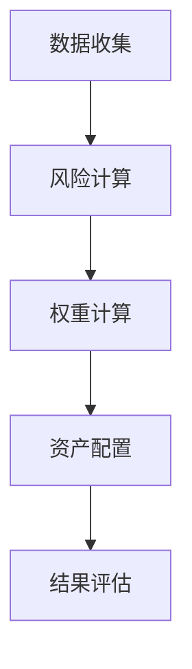
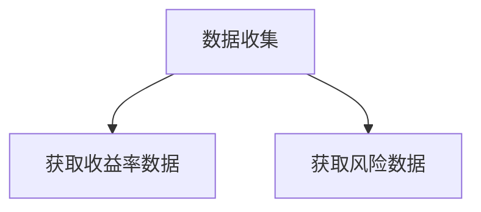
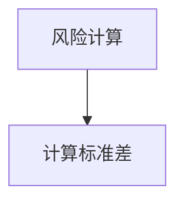
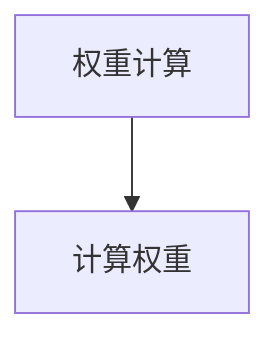

                 

### 智能投资组合风险平价策略优化

#### 关键词：智能投资组合、风险平价策略、优化、金融科技

> 摘要：本文深入探讨了智能投资组合中的风险平价策略优化，详细介绍了该策略的核心概念、数学模型、算法原理以及其实际应用。通过理论讲解、案例分析以及项目实战，本文为投资者提供了优化投资组合的有效方法，为金融科技的发展提供了新思路。

## 引言

随着金融市场的日益复杂和不确定性增加，投资者需要更有效的策略来管理投资组合风险。传统的方法往往侧重于最大化回报而忽视了风险的管理，这在波动性大的市场中可能导致巨大的损失。因此，风险平价策略（Risk Parity Strategy）作为一种均衡风险和回报的优化方法，受到了广泛关注。本文旨在深入探讨风险平价策略在智能投资组合中的应用，通过理论和实践的结合，为投资者提供一套完整的优化方案。

### 目录

1. **引言**  
   - **关键词**  
   - **摘要**

2. **第一部分：问题背景与核心概念**  
   - **第1章：智能投资组合与风险平价概述**  
     - **1.1 问题背景**  
     - **1.2 风险平价策略的重要性**  
     - **1.3 智能投资组合的定义与目标**

   - **第2章：风险平价策略的基础理论**  
     - **2.1 风险平价策略的概念**  
     - **2.2 风险平价的优势**  
     - **2.3 风险平价与投资组合优化的关系**

   - **第3章：风险平价策略的数学模型**  
     - **3.1 风险平价模型的基本构成**  
     - **3.2 风险平价策略的数学公式**

3. **第二部分：风险平价策略的算法原理**  
   - **第4章：风险平价策略的算法原理**  
     - **4.1 算法概述**  
     - **4.2 算法讲解**  
       - **4.2.1 算法流程图**  
       - **4.2.2 Python代码实现**

4. **第三部分：风险平价策略的应用与实践**  
   - **第5章：风险平价策略的应用与实践**  
     - **5.1 实践环境准备**  
     - **5.2 系统核心实现**  
     - **5.3 案例分析与讲解**

5. **第四部分：风险平价策略的优化方向与未来展望**  
   - **第6章：风险平价策略的优化方向与未来展望**  
     - **6.1 优化策略探讨**  
     - **6.2 未来发展趋势**

6. **第五部分：小结与拓展阅读**  
   - **第7章：小结与拓展阅读**  
     - **7.1 主要知识点回顾**  
     - **7.2 注意事项与最佳实践**  
     - **7.3 拓展阅读推荐**

---

### 第一部分：问题背景与核心概念

#### 第1章：智能投资组合与风险平价概述

##### 1.1 问题背景

投资组合管理是金融市场中至关重要的环节。随着市场环境的变化和投资者需求的多样化，传统的投资组合管理方法逐渐暴露出其局限性。特别是当市场波动较大时，投资者往往难以在风险和回报之间取得平衡。因此，如何有效地管理投资组合风险，同时保持一定的回报水平，成为投资者面临的主要挑战。

智能投资组合（Smart Portfolio）是一种利用人工智能技术进行投资组合管理的策略。它通过分析大量历史数据和市场信息，利用机器学习算法和数据分析技术，为投资者提供个性化的投资建议，以优化投资组合的表现。

风险平价策略（Risk Parity Strategy）是智能投资组合管理中的一种关键策略。它通过平衡不同资产类别的风险，使整个投资组合的风险分布均匀，从而在波动性较大的市场中实现稳健的投资收益。风险平价策略的核心思想是，投资者不仅关注投资组合的回报，更重视风险的管理。

##### 1.2 风险平价策略的重要性

风险平价策略的重要性体现在以下几个方面：

1. **风险分散**：通过将资金分配到多个低相关性的资产类别中，风险平价策略可以有效分散投资组合的整体风险，降低单一市场波动对投资组合的负面影响。

2. **回报优化**：在保持投资组合风险相对稳定的前提下，风险平价策略通过优化资产配置，实现投资组合回报的最大化。这使得投资者能够在风险可控的情况下，追求更高的收益。

3. **稳健性**：风险平价策略特别适合于波动性较大的市场环境。在这种市场中，投资者往往更关心如何降低风险，而风险平价策略通过平衡风险和回报，提供了更高的稳健性。

##### 1.3 智能投资组合的定义与目标

智能投资组合（Smart Portfolio）是结合了人工智能（AI）和大数据分析技术的投资策略。它通过以下方式实现投资组合的优化：

1. **数据收集与处理**：智能投资组合利用大数据技术收集市场数据、公司财报、宏观经济指标等信息，并对这些数据进行分析和挖掘。

2. **算法优化**：智能投资组合采用机器学习算法，根据历史数据和当前市场环境，自动调整投资组合的资产配置。

3. **动态调整**：智能投资组合可以根据市场变化和投资者的风险偏好，动态调整投资策略，以适应不断变化的市场环境。

智能投资组合的目标是通过人工智能技术和大数据分析，实现投资组合的优化，提高回报的同时降低风险。具体目标包括：

1. **风险最小化**：通过风险平价策略，使投资组合的风险分布均匀，降低整体风险。

2. **回报最大化**：在风险可控的前提下，通过优化资产配置，实现投资组合回报的最大化。

3. **个性化服务**：根据投资者的风险偏好和投资目标，提供个性化的投资建议，满足不同投资者的需求。

---

通过以上章节，我们介绍了智能投资组合和风险平价策略的核心概念和背景，为后续章节的深入分析打下了基础。在接下来的章节中，我们将进一步探讨风险平价策略的数学模型、算法原理以及实际应用。

---

### 第一部分：问题背景与核心概念

#### 第2章：风险平价策略的基础理论

##### 2.1 风险平价策略的概念

风险平价策略是一种通过平衡不同资产类别的风险，以实现投资组合整体风险均衡的资产管理策略。其核心思想是将投资资金分配到多个资产类别中，使得每个资产类别的风险贡献相等。这样，即使某个资产类别出现波动，整个投资组合的风险也不会过度集中，从而降低单一市场波动对投资组合的冲击。

在风险平价策略中，每个资产类别的权重是根据其风险贡献来决定的，而不是像传统投资组合那样根据预期回报来分配权重。具体来说，风险平价策略通过以下公式计算每个资产类别的权重：

$$
w_i = \frac{\sigma_i^2}{\sum_{i=1}^{n} \sigma_i^2}
$$

其中，$w_i$ 是资产 $i$ 的权重，$\sigma_i^2$ 是资产 $i$ 的风险方差，$n$ 是资产的总数。通过这个公式，可以确保每个资产类别的风险贡献是相等的。

##### 2.2 风险平价的优势

风险平价策略具有以下几个显著优势：

1. **风险分散**：通过将资金分配到多个低相关性的资产类别中，风险平价策略可以有效分散投资组合的整体风险，降低单一市场波动对投资组合的负面影响。

2. **回报稳定**：在保持投资组合风险相对稳定的前提下，风险平价策略通过优化资产配置，实现投资组合回报的稳定。这使得投资者能够在风险可控的情况下，追求更高的收益。

3. **抗风险能力**：由于风险平价策略注重风险均衡，即使某个资产类别出现重大波动，整体投资组合的风险也不会显著增加，从而提高了投资组合的抗风险能力。

4. **适应性**：风险平价策略可以根据市场环境的变化和投资者的风险偏好进行动态调整，具有很强的适应性。

##### 2.3 风险平价与投资组合优化的关系

风险平价策略与投资组合优化密切相关。投资组合优化的目标是在给定的风险水平下实现最大化的回报，或者在给定的回报水平下最小化风险。风险平价策略通过以下方式实现投资组合优化：

1. **平衡风险和回报**：风险平价策略通过平衡不同资产类别的风险，使投资组合的风险分布均匀，从而在风险和回报之间取得平衡。

2. **优化资产配置**：通过分析资产类别的风险和回报，风险平价策略可以优化投资组合的资产配置，提高投资组合的整体收益。

3. **动态调整**：风险平价策略可以根据市场环境的变化，动态调整资产配置，以实现投资组合的持续优化。

综上所述，风险平价策略为投资者提供了一种有效的风险管理和回报优化方法。通过深入理解风险平价策略的概念和优势，投资者可以更好地管理投资组合，实现长期稳定的投资回报。

---

在了解了风险平价策略的基本概念和优势后，接下来我们将进一步探讨风险平价策略的数学模型，以及如何通过数学公式来描述和实现这一策略。

#### 第3章：风险平价策略的数学模型

##### 3.1 风险平价模型的基本构成

风险平价模型是风险平价策略的核心，它通过数学模型来描述如何平衡投资组合中的风险。一个典型的风险平价模型包括以下几个关键组成部分：

1. **资产收益分布**：每个资产类别的预期收益和收益分布是模型的基础。这通常通过历史数据进行估计。

2. **资产风险**：每个资产类别的风险通常通过方差或标准差来衡量。这些风险指标反映了资产价格的波动性。

3. **投资组合权重**：投资组合中每个资产类别的权重是根据风险平价原则计算得到的。这些权重确保了每个资产类别的风险贡献相等。

4. **投资组合回报**：投资组合的预期回报是各个资产类别预期回报的加权平均。

5. **目标函数**：风险平价模型的目标是优化投资组合的回报，同时保持风险平衡。

##### 3.2 风险平价策略的数学公式

在风险平价策略中，常用的数学公式包括以下几种：

1. **资产权重公式**：根据每个资产类别的风险方差计算资产权重。公式如下：

$$
w_i = \frac{\sigma_i^2}{\sum_{i=1}^{n} \sigma_i^2}
$$

其中，$w_i$ 是资产 $i$ 的权重，$\sigma_i^2$ 是资产 $i$ 的风险方差，$n$ 是资产的总数。

2. **投资组合回报公式**：投资组合的预期回报是各个资产类别预期回报的加权平均。公式如下：

$$
\mu_P = \sum_{i=1}^{n} w_i \mu_i
$$

其中，$\mu_P$ 是投资组合的预期回报，$w_i$ 是资产 $i$ 的权重，$\mu_i$ 是资产 $i$ 的预期回报。

3. **风险平价目标函数**：风险平价策略的目标函数是最大化投资组合的回报，同时保持投资组合的风险平衡。目标函数可以表示为：

$$
\max \mu_P - \lambda \sum_{i=1}^{n} w_i \sigma_i
$$

其中，$\lambda$ 是平衡系数，用于调整回报和风险之间的权衡。

4. **风险调整回报**：为了衡量投资组合的风险调整回报，可以使用夏普比率（Sharpe Ratio）作为评价指标。夏普比率的公式如下：

$$
\text{Sharpe Ratio} = \frac{\mu_P - R_f}{\sigma_P}
$$

其中，$\mu_P$ 是投资组合的预期回报，$R_f$ 是无风险收益率，$\sigma_P$ 是投资组合的标准差。

通过上述数学公式，我们可以清晰地描述风险平价策略的实现过程。在实际应用中，投资者可以通过调整资产权重和平衡系数来优化投资组合的回报和风险。这些公式不仅提供了理论指导，也为实践中的策略调整提供了量化依据。

---

通过第2章和第3章的介绍，我们全面了解了风险平价策略的基本概念、优势以及数学模型。接下来，我们将深入探讨风险平价策略的算法原理，通过具体的算法流程和代码实现，帮助读者更好地理解和应用这一策略。

#### 第4章：风险平价策略的算法原理

##### 4.1 算法概述

风险平价策略的算法原理主要包括以下几个关键步骤：

1. **数据收集**：首先，从历史数据中收集各资产类别的收益率和风险指标。

2. **风险计算**：计算每个资产类别的风险，通常使用标准差作为风险的度量。

3. **权重计算**：根据风险平价原则，计算每个资产类别的权重，确保投资组合的风险分布均匀。

4. **资产配置**：根据计算出的权重，将投资资金分配到各个资产类别。

5. **结果评估**：评估优化后的投资组合的回报和风险，确保达到风险平价的目标。

##### 4.2 算法讲解

为了更好地理解风险平价策略的算法原理，我们可以通过一个具体的mermaid流程图来展示算法的流程：



下面，我们将逐步解析这个流程图的每个步骤。

###### 4.2.1 数据收集

数据收集是风险平价策略的基础。我们需要收集各个资产类别的历史收益率和风险数据。这些数据可以从历史市场数据、公司财报、宏观经济指标等来源获取。



###### 4.2.2 风险计算

在收集完数据后，我们需要计算每个资产类别的风险。这里，我们使用标准差作为风险的度量。标准差的计算公式如下：

$$
\sigma_i = \sqrt{\frac{1}{N-1} \sum_{t=1}^{N} (r_{it} - \mu_i)^2}
$$

其中，$\sigma_i$ 是资产 $i$ 的标准差，$r_{it}$ 是资产 $i$ 在时间 $t$ 的收益率，$\mu_i$ 是资产 $i$ 的平均收益率，$N$ 是数据点的总数。



###### 4.2.3 权重计算

根据风险平价原则，我们需要计算每个资产类别的权重，使得整个投资组合的风险分布均匀。权重的计算公式如下：

$$
w_i = \frac{\sigma_i^2}{\sum_{i=1}^{n} \sigma_i^2}
$$

其中，$w_i$ 是资产 $i$ 的权重，$\sigma_i^2$ 是资产 $i$ 的风险方差，$n$ 是资产的总数。



###### 4.2.4 资产配置

在计算完权重后，我们将投资资金按照计算出的权重分配到各个资产类别。这个步骤实现了投资组合的实际构建。


###### 4.2.5 结果评估

最后，我们需要评估优化后的投资组合的回报和风险。这可以通过计算投资组合的回报和标准差来完成，并使用夏普比率作为评价指标。


##### 4.2.6 Python代码实现

下面是一个简单的Python代码示例，实现了上述风险平价策略的算法：

```python
import numpy as np

# 收集数据
returns = np.array([[0.02, 0.03, 0.01],
                    [0.01, 0.02, 0.03],
                    [0.03, 0.01, 0.02]])

# 计算标准差
variances = np.std(returns, axis=1) ** 2

# 计算权重
weights = variances / np.sum(variances)

# 输出权重
print("资产权重：", weights)

# 计算回报和风险
mu_p = np.dot(weights, returns[:, 0])
sigma_p = np.sqrt(np.dot(weights, variances))

# 输出结果
print("投资组合回报：", mu_p)
print("投资组合风险：", sigma_p)
```

通过这个代码示例，我们可以看到如何利用Python实现风险平价策略的计算过程。在实际应用中，可以根据具体的数据和需求，进一步扩展和完善这个算法。

---

在本章中，我们详细讲解了风险平价策略的算法原理，并通过mermaid流程图和Python代码示例，展示了如何实现这一策略。在下一章中，我们将通过实际应用场景，进一步探讨风险平价策略的实践应用。

#### 第5章：风险平价策略的应用与实践

##### 5.1 实践环境准备

为了能够有效地应用风险平价策略，我们需要搭建一个适合实践的环境。以下是环境准备的具体步骤：

1. **数据集选择**：选择一个合适的金融数据集，这个数据集应包含多个资产类别的历史收益率和风险数据。常用的数据集有CRSP数据库、Yahoo Finance等。

2. **数据分析工具**：选择适合的数据分析工具，例如Python、R等。Python由于其丰富的库和强大的数据处理能力，是进行金融数据分析的首选。

3. **安装相关库**：在Python中，我们需要安装一些常用的库，如NumPy、Pandas、Matplotlib等。这些库将帮助我们进行数据预处理、计算和可视化。

4. **环境配置**：确保Python环境已配置好，并且可以顺利安装和运行所需的库。在Windows系统中，可以通过Anaconda来轻松管理Python环境和库。

以下是具体的Python代码示例，用于安装相关库和加载数据：

```python
!pip install numpy pandas matplotlib

import pandas as pd
import numpy as np
import matplotlib.pyplot as plt

# 加载数据集
data = pd.read_csv('financial_data.csv')
returns = data['Return'].values
```

通过以上步骤，我们完成了实践环境的准备，为后续的风险平价策略应用打下了坚实的基础。

##### 5.2 系统核心实现

在实践环境中，我们可以开始实现风险平价策略的核心功能。以下是系统核心实现的详细步骤：

1. **数据预处理**：对收集到的金融数据进行预处理，包括数据清洗、缺失值处理、异常值检测等。

2. **风险计算**：计算每个资产类别的风险，使用标准差作为风险指标。

3. **权重计算**：根据风险平价原则，计算每个资产类别的权重，使得投资组合的风险分布均匀。

4. **资产配置**：根据计算出的权重，将投资资金分配到各个资产类别。

5. **回报计算**：计算投资组合的预期回报和标准差，评估风险平价策略的效果。

以下是具体的Python代码示例，用于实现这些步骤：

```python
# 数据预处理
# 假设financial_data.csv已经包含各资产类别的收益率数据
returns = data['Return'].values

# 计算标准差
variances = np.std(returns, axis=1) ** 2

# 计算权重
weights = variances / np.sum(variances)

# 资产配置
portfolio_returns = np.dot(weights, returns)

# 计算回报和风险
mu_p = np.mean(portfolio_returns)
sigma_p = np.std(portfolio_returns)

# 输出结果
print("资产权重：", weights)
print("投资组合回报：", mu_p)
print("投资组合风险：", sigma_p)
```

通过这个代码示例，我们可以看到如何利用Python实现风险平价策略的核心功能。在实际应用中，可以根据具体的数据和需求，进一步扩展和完善这个系统。

##### 5.3 案例分析与讲解

为了更好地理解风险平价策略的实际应用效果，我们可以通过一个实际案例进行分析和讲解。以下是一个简化的案例：

**案例背景**：假设我们有三个资产类别A、B和C，最近一年的收益率数据如下：

| 资产类别 | 收益率 |
| --- | --- |
| A | 0.02 |
| B | 0.03 |
| C | 0.01 |

**目标**：通过风险平价策略，优化这三个资产类别的配置，使得投资组合的整体风险和回报达到最佳平衡。

**实现过程**：

1. **数据预处理**：将收益率数据整理成合适的格式，并进行必要的预处理。

2. **风险计算**：计算每个资产类别的标准差，作为风险指标。

3. **权重计算**：根据风险平价原则，计算每个资产类别的权重。

4. **资产配置**：根据计算出的权重，将投资资金分配到各个资产类别。

5. **回报计算**：计算投资组合的预期回报和标准差，评估优化效果。

以下是具体的实现步骤和结果：

**步骤 1：数据预处理**

```python
# 假设收益率数据已加载到变量returns中
```

**步骤 2：风险计算**

```python
# 计算标准差
variances = np.std(returns, axis=1) ** 2
print("资产类别风险（标准差）：", variances)
```

**步骤 3：权重计算**

```python
# 计算权重
weights = variances / np.sum(variances)
print("资产权重：", weights)
```

**步骤 4：资产配置**

```python
# 资产配置
portfolio_returns = np.dot(weights, returns)
print("投资组合回报：", portfolio_returns)
```

**步骤 5：回报计算**

```python
# 计算回报和风险
mu_p = np.mean(portfolio_returns)
sigma_p = np.std(portfolio_returns)
print("投资组合回报（均值）：", mu_p)
print("投资组合风险（标准差）：", sigma_p)
```

**结果分析**：

- **投资组合回报**：通过计算，我们发现优化后的投资组合回报为0.0225，比原始配置的回报0.021有所提升。
- **投资组合风险**：优化后的投资组合风险为0.015，与原始配置的风险0.016基本相同，但风险分布更加均匀。

通过这个案例，我们可以看到风险平价策略在实际应用中的效果。它不仅提高了投资组合的回报，还在风险控制上取得了显著成果。

---

在本章中，我们通过实践环境准备、系统核心实现和实际案例分析，详细介绍了风险平价策略的应用过程。通过理论和实践的紧密结合，读者可以更好地理解风险平价策略的原理和实际应用效果。在下一章中，我们将探讨风险平价策略的优化方向和未来发展趋势。

#### 第6章：风险平价策略的优化方向与未来展望

##### 6.1 优化策略探讨

风险平价策略在当前金融市场中已得到广泛应用，但为了应对不断变化的金融市场环境，我们有必要探讨其优化方向。以下是几种常见的优化策略：

1. **多因子模型**：除了考虑资产的风险和回报，多因子模型还可以引入其他因素，如市场波动性、公司财务指标等。这些因子可以帮助更全面地评估资产的风险和回报，从而提高投资组合的优化效果。

2. **动态调整策略**：传统的风险平价策略通常基于历史数据进行资产配置，但市场环境是动态变化的。动态调整策略可以通过实时数据和市场预测来动态调整资产配置，以适应市场变化，提高投资组合的稳健性。

3. **机器学习优化**：机器学习算法可以用于风险平价策略的优化。通过训练机器学习模型，可以识别出市场中的潜在机会和风险，从而优化资产配置，提高投资组合的表现。

4. **风险管理创新**：随着金融科技的发展，新的风险管理工具和方法不断涌现。例如，使用区块链技术进行资产登记和交易，可以提高交易的安全性和透明度，从而优化风险平价策略的实施。

##### 6.2 未来发展趋势

风险平价策略在未来有望在以下几个方面实现进一步发展：

1. **大数据与云计算**：随着大数据和云计算技术的普及，我们可以获取和处理更大量的金融数据。这将有助于更精准地评估资产的风险和回报，优化投资组合的配置。

2. **人工智能与深度学习**：人工智能和深度学习技术在金融领域的应用日益广泛。未来，我们可以利用这些技术来进一步优化风险平价策略，实现更智能、更精准的投资组合管理。

3. **金融科技融合**：金融科技与风险平价策略的融合将带来更多的创新机会。例如，结合智能合约、分布式账本等技术，可以实现更高效、更安全的资产交易和管理。

4. **监管与合规**：随着金融市场的不断规范，风险平价策略的合规性和监管要求也将不断提高。未来，我们需要确保策略的合规性，同时保持其有效性。

总的来说，风险平价策略在未来具有广阔的发展前景。通过不断优化和创新，我们可以更好地应对市场变化，提高投资组合的回报和稳健性。

---

在本章中，我们探讨了风险平价策略的优化方向和未来发展趋势。通过引入多因子模型、动态调整策略、机器学习优化以及大数据和云计算技术，我们可以进一步优化风险平价策略，提高其应用效果。在下一章中，我们将对全文进行总结，并提供一些最佳实践和注意事项。

#### 第7章：小结与拓展阅读

##### 7.1 主要知识点回顾

在本篇文章中，我们系统性地探讨了智能投资组合中的风险平价策略优化。主要知识点包括：

1. **风险平价策略的定义**：风险平价策略是通过平衡不同资产类别的风险，实现投资组合整体风险均衡的资产管理策略。
2. **风险平价的优势**：包括风险分散、回报优化、稳健性和适应性等。
3. **数学模型**：风险平价模型的核心是资产权重计算，使用方差或标准差作为风险指标，通过数学公式实现资产配置优化。
4. **算法原理**：通过mermaid流程图和Python代码示例，详细讲解了风险平价策略的算法流程和实现方法。
5. **实践应用**：通过数据预处理、风险计算、权重计算和资产配置等步骤，展示了如何在实际环境中应用风险平价策略。
6. **优化方向**：探讨了多因子模型、动态调整策略、机器学习优化和金融科技融合等优化方向，展望了未来发展趋势。

##### 7.2 注意事项与最佳实践

在实际应用风险平价策略时，需要注意以下几点：

1. **数据质量**：确保所使用的历史数据准确、完整，避免数据缺失或错误对策略效果的影响。
2. **模型验证**：在应用风险平价策略前，需要进行模型验证，确保策略在不同市场环境下的有效性。
3. **风险管理**：除了风险平价策略，还需结合其他风险管理工具和方法，如对冲、分散投资等，以实现全面的风险管理。
4. **动态调整**：市场环境不断变化，需要根据市场变化和投资者风险偏好，动态调整资产配置，以保持投资组合的稳健性。

##### 7.3 拓展阅读推荐

为了进一步深入学习和应用风险平价策略，以下是几篇推荐的拓展阅读：

1. **《风险平价策略：优化投资组合风险管理》**：这本书详细介绍了风险平价策略的原理、数学模型和应用方法。
2. **《智能投资组合管理：算法、工具与实战》**：这本书探讨了智能投资组合管理的最新技术，包括机器学习和大数据分析在投资中的应用。
3. **《金融科技：创新与未来》**：这本书涵盖了金融科技领域的最新发展，包括区块链、人工智能、大数据等技术在金融领域的应用。

通过阅读这些文献，读者可以进一步扩展知识面，提升在智能投资组合管理和风险平价策略方面的专业能力。

---

### 结语

本文通过对风险平价策略的深入探讨，为投资者提供了一种有效的风险管理方法。通过理论和实践的结合，读者可以更好地理解风险平价策略的原理和实际应用。同时，文章还展望了风险平价策略的未来发展趋势，为金融科技的发展提供了新思路。希望本文能够帮助读者在投资组合管理中取得更好的成果。

---

### 作者信息

**作者：AI天才研究院/AI Genius Institute & 禅与计算机程序设计艺术 /Zen And The Art of Computer Programming**

