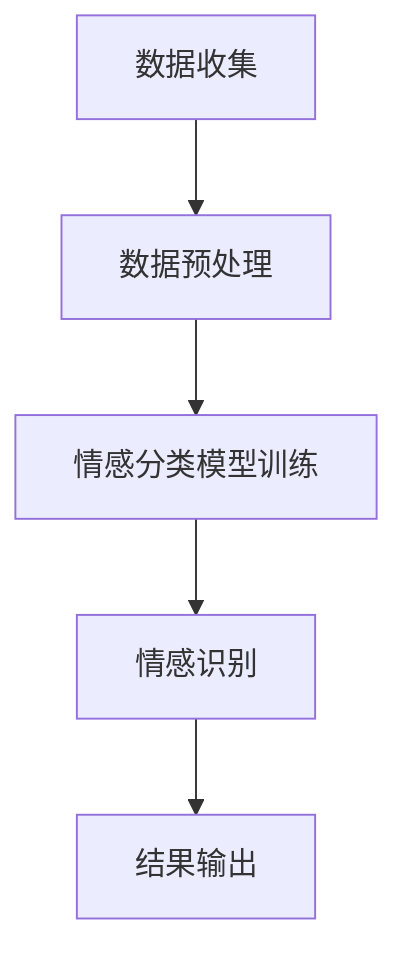
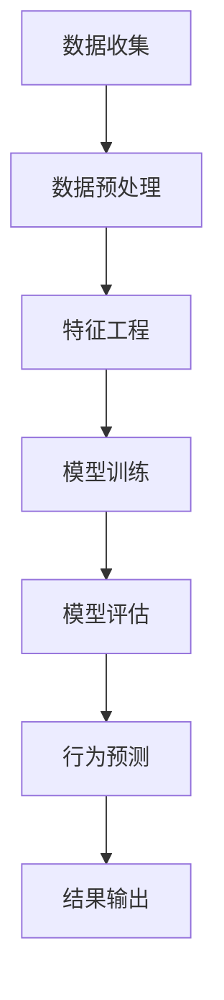
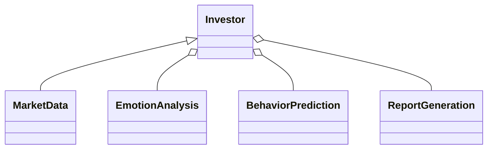
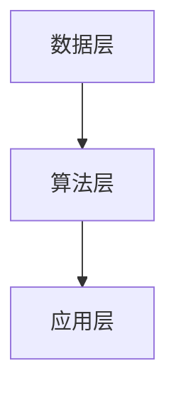
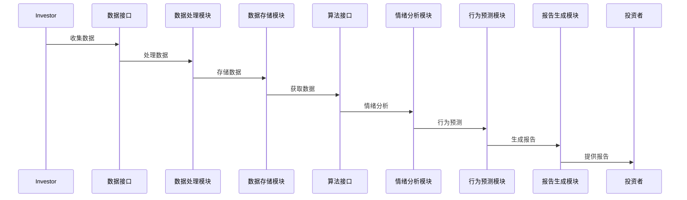

                 

# 智能投资者关系分析平台

关键词：投资者关系、智能分析、平台架构、算法、金融科技

摘要：本文将深入探讨智能投资者关系分析平台的概念、架构、核心算法及其在金融科技领域的应用。通过逐步分析，本文旨在帮助读者理解如何利用人工智能技术优化投资者关系管理，提高投资决策的准确性和效率。

## 引言与背景介绍

### 1.1 问题背景

#### 1.1.1 投资者关系现状

投资者关系（Investor Relations，简称IR）是公司管理外部投资者关系的部门或职能，旨在促进公司与投资者之间的沟通和信任，提高公司的透明度和市场形象。传统的投资者关系管理主要通过定期的财务报告、电话会议、投资者见面会等形式进行。

然而，随着市场的快速变化和投资者需求的多样化，传统的投资者关系管理方式面临着诸多挑战。首先，投资者关系部门需要处理海量的数据和信息，包括财务报表、新闻公告、市场动态等。这些数据不仅量大且类型多样，传统的手动处理方式效率低下，容易出错。其次，投资者关系管理需要实时跟踪和分析市场情绪，以及投资者的行为和反馈，以做出及时、准确的决策。

#### 1.1.2 投资者关系的重要性

投资者关系对公司的影响不容小觑。良好的投资者关系可以增强投资者对公司的信心，提高公司的股价和市场地位。同时，有效的投资者关系管理有助于公司更好地理解投资者的需求，制定合适的发展战略和财务规划。

然而，传统的投资者关系管理方式往往难以满足上述要求。一方面，投资者关系部门无法实时获取和分析市场数据，导致决策滞后。另一方面，传统的沟通方式难以满足投资者对个性化、实时化的需求。

#### 1.1.3 智能投资者关系分析平台的需求

为了应对这些挑战，智能投资者关系分析平台应运而生。这类平台利用人工智能技术，如自然语言处理（NLP）、机器学习、数据挖掘等，对大量非结构化数据进行自动分析和解读，从而提供实时、准确的市场情绪分析和投资者行为预测。这不仅提高了投资者关系管理的效率，还增强了公司对市场的洞察力和决策能力。

智能投资者关系分析平台的需求主要体现在以下几个方面：

1. **实时数据分析**：平台能够实时收集和分析各种市场数据，包括财务报表、新闻公告、社交媒体等，为投资者关系部门提供最新的市场动态。

2. **市场情绪分析**：平台利用自然语言处理技术，从非结构化数据中提取市场情绪，帮助投资者关系部门了解市场情绪的变化趋势。

3. **投资者行为预测**：平台通过分析投资者的历史行为和反馈，预测投资者的未来行为，为投资者关系部门制定个性化的沟通策略提供支持。

4. **决策支持**：平台提供的数据分析和预测结果，可以帮助投资者关系部门做出更加准确、及时的决策。

### 1.2 问题描述

#### 1.2.1 投资者关系分析的核心挑战

投资者关系分析的核心挑战主要包括以下几个方面：

1. **数据多样性**：投资者关系分析涉及的数据来源多样，包括财务报表、新闻公告、社交媒体等，这些数据格式和结构各不相同，给数据整合和预处理带来了巨大挑战。

2. **数据实时性**：投资者关系分析需要实时跟踪市场动态，但传统方法往往无法实现实时数据处理和分析。

3. **数据准确性**：投资者关系分析依赖于数据的准确性，但现实情况是，数据往往存在噪声、缺失和不一致等问题。

4. **算法复杂性**：市场情绪分析和投资者行为预测等算法模型复杂，需要大量的计算资源和时间进行训练和优化。

#### 1.2.2 传统投资者关系分析方式的局限性

传统投资者关系分析方式的局限性主要体现在以下几个方面：

1. **效率低**：传统方式依赖于人工处理，效率低下，难以应对海量数据的处理需求。

2. **实时性差**：传统方式无法实现实时数据分析和预测，导致决策滞后。

3. **准确性低**：传统方式无法准确提取和理解非结构化数据中的信息，导致分析结果不准确。

4. **个性化不足**：传统方式难以根据投资者的个性化需求提供定制化的分析报告。

#### 1.2.3 智能投资者关系分析平台的目标

智能投资者关系分析平台的目标是解决传统投资者关系分析方式的局限性，提供高效、实时、准确的数据分析和预测服务，帮助投资者关系部门更好地管理投资者关系，提高投资决策的准确性和效率。具体目标包括：

1. **高效数据处理**：利用人工智能技术，实现高效的数据收集、整合和预处理，为分析提供准确、完整的数据基础。

2. **实时数据监测**：实现实时数据监测和分析，及时捕捉市场动态和投资者行为变化。

3. **准确情绪分析**：利用自然语言处理技术，准确提取市场情绪，为投资者关系部门提供准确的市场情绪分析结果。

4. **个性化预测**：通过分析投资者的历史行为和反馈，预测投资者的未来行为，为投资者关系部门提供个性化的沟通策略。

### 1.3 问题解决

#### 1.3.1 智能投资者关系分析平台的架构

智能投资者关系分析平台的架构设计旨在实现高效的数据处理、实时数据监测、准确情绪分析和个性化预测。以下是平台的主要架构模块：

1. **数据收集模块**：负责收集各种市场数据，包括财务报表、新闻公告、社交媒体等。数据收集模块可以通过网络爬虫、API接口等方式获取数据。

2. **数据处理模块**：对收集到的数据进行整合、清洗和预处理，为分析提供准确、完整的数据基础。数据处理模块包括数据集成、数据清洗、数据转换等功能。

3. **数据存储模块**：负责存储处理后的数据，提供高效的数据查询和访问服务。数据存储模块可以采用关系型数据库或NoSQL数据库，根据具体需求选择。

4. **情绪分析模块**：利用自然语言处理技术，对文本数据进行分析，提取市场情绪。情绪分析模块包括文本预处理、情感分类、情绪识别等功能。

5. **行为预测模块**：通过分析投资者的历史行为和反馈，预测投资者的未来行为。行为预测模块包括行为建模、行为预测、决策支持等功能。

6. **报告生成模块**：根据分析结果生成定制化的报告，为投资者关系部门提供决策支持。报告生成模块包括报告模板、数据可视化、报告定制等功能。

#### 1.3.2 智能化技术的应用

智能投资者关系分析平台的核心在于智能化技术的应用，包括自然语言处理（NLP）、机器学习、数据挖掘等。以下是这些技术在平台中的应用：

1. **自然语言处理（NLP）**：NLP技术用于处理文本数据，提取情感、主题、关键词等信息。平台利用NLP技术对新闻公告、社交媒体等文本数据进行分析，提取市场情绪。

2. **机器学习**：机器学习技术用于构建行为预测模型、情绪分类模型等。平台通过训练大量的数据集，构建准确的预测模型，实现对市场情绪和投资者行为的准确预测。

3. **数据挖掘**：数据挖掘技术用于发现数据中的潜在规律和模式。平台利用数据挖掘技术，分析投资者行为数据，发现投资者的偏好和趋势。

#### 1.3.3 平台的核心功能与特点

智能投资者关系分析平台的核心功能包括实时数据分析、市场情绪分析、投资者行为预测和决策支持。以下是平台的核心特点：

1. **实时数据分析**：平台能够实时收集和处理海量数据，包括财务报表、新闻公告、社交媒体等，为投资者关系部门提供最新的市场动态。

2. **准确情绪分析**：平台利用自然语言处理技术，准确提取市场情绪，为投资者关系部门提供准确的市场情绪分析结果。

3. **个性化预测**：平台通过分析投资者的历史行为和反馈，预测投资者的未来行为，为投资者关系部门提供个性化的沟通策略。

4. **高效决策支持**：平台提供的数据分析和预测结果，可以帮助投资者关系部门做出更加准确、及时的决策。

5. **定制化报告**：平台可以根据用户需求生成定制化的报告，包括市场情绪分析报告、投资者行为预测报告等。

### 1.4 边界与外延

#### 1.4.1 平台的适用范围

智能投资者关系分析平台适用于各类上市公司、金融机构和投资机构，帮助它们更好地管理投资者关系，提高投资决策的准确性和效率。

#### 1.4.2 平台的技术支持与维护

平台的技术支持与维护主要包括以下几个方面：

1. **技术支持**：提供7x24小时的技术支持服务，解决用户在使用平台过程中遇到的问题。

2. **系统升级**：定期对平台进行系统升级，确保平台的技术和功能保持领先。

3. **安全保障**：采用先进的安全技术，确保平台数据的安全性和可靠性。

#### 1.4.3 平台的发展前景

随着人工智能技术的不断发展和成熟，智能投资者关系分析平台有望在金融科技领域发挥更大的作用。未来，平台将进一步优化算法和模型，提高分析预测的准确性和效率，同时拓展应用场景，为更多的行业和用户提供服务。

### 1.5 概念结构与核心要素组成

#### 1.5.1 投资者关系分析的基本概念

投资者关系分析涉及多个基本概念，包括投资者、市场情绪、投资者行为等。

- **投资者**：参与资本市场，对投资机会有决策权的个体或机构，如个人投资者、机构投资者等。
- **市场情绪**：市场参与者对市场走势的预期和态度，包括乐观、悲观、中性等。
- **投资者行为**：投资者在资本市场中的行为，包括投资决策、买卖操作、反馈等。

#### 1.5.2 平台的核心组成部分

智能投资者关系分析平台主要由以下几个核心组成部分构成：

1. **数据收集模块**：负责收集各种市场数据，包括财务报表、新闻公告、社交媒体等。
2. **数据处理模块**：对收集到的数据进行整合、清洗和预处理。
3. **数据存储模块**：存储处理后的数据，提供高效的数据查询和访问服务。
4. **情绪分析模块**：利用自然语言处理技术，提取市场情绪。
5. **行为预测模块**：分析投资者的历史行为和反馈，预测投资者的未来行为。
6. **报告生成模块**：生成定制化的报告，为投资者关系部门提供决策支持。

#### 1.5.3 平台的技术架构

智能投资者关系分析平台的技术架构包括以下几个主要层次：

1. **数据层**：包括数据收集、处理和存储模块，负责提供数据支持。
2. **算法层**：包括情绪分析、行为预测等模块，负责实现数据分析和预测功能。
3. **应用层**：包括报告生成模块，提供用户界面和业务逻辑。

## 核心概念与联系

### 2.1.1 智能投资者关系分析平台的概念

#### 2.1.1.1 投资者关系

投资者关系（Investor Relations，简称IR）是指公司为了提高股价和市场地位，与投资者之间建立的良好沟通和信任关系。投资者关系部门负责与投资者进行沟通，发布公司信息，解答投资者的疑问，组织投资者会议等。

#### 2.1.1.2 智能分析

智能分析是指利用人工智能技术，对大量数据进行自动分析和解读的过程。智能分析包括自然语言处理（NLP）、机器学习、数据挖掘等技术，用于提取数据中的有价值信息，为决策提供支持。

#### 2.1.1.3 平台架构

平台架构是指智能投资者关系分析平台的基础设施和功能模块的集合。平台架构包括数据层、算法层和应用层，各层之间相互协作，共同实现平台的功能。

### 2.1.2 概念属性特征对比表格

| 概念       | 定义                                                         | 属性特征对比                |
|------------|--------------------------------------------------------------|----------------------------|
| 投资者     | 参与资本市场，对投资机会有决策权的个体或机构                 | 类型、风险偏好、投资策略   |
| 智能分析   | 利用人工智能技术，对大量数据进行自动分析和解读的过程       | 准确性、效率、实时性       |
| 平台架构   | 智能投资者关系分析平台的基础设施和功能模块的集合           | 灵活性、扩展性、易用性     |

### 2.1.3 ER实体关系图架构

```mermaid
erDiagram
  Investor ||--|{ Platform }|| AnalysisModule
  Platform ||--|{ DataModule }|| DataStore
  Platform ||--|{ ReportModule }|| ReportGenerator
  AnalysisModule ||--|{ AlgorithmModule }|| Algorithm
  AlgorithmModule ||--|{ DatasetModule }|| Dataset
```

在上面的ER实体关系图中，`Investor`（投资者）与`Platform`（平台）之间存在一对多的关系，表示一个投资者可以与多个平台进行交互。`Platform`（平台）与`AnalysisModule`（分析模块）之间存在包含关系，表示平台包括多个分析模块。`AnalysisModule`（分析模块）与`AlgorithmModule`（算法模块）之间存在包含关系，表示分析模块包括多个算法模块。`AlgorithmModule`（算法模块）与`DatasetModule`（数据集模块）之间存在包含关系，表示算法模块包括多个数据集模块。

## 算法原理讲解

### 3.2.1 市场情绪分析算法

#### 3.2.1.1 算法概述

市场情绪分析算法是一种利用自然语言处理（NLP）和机器学习技术，从社交媒体、新闻报道等非结构化数据中提取市场情绪的算法。市场情绪分析算法的核心在于情感分析模型，用于识别文本中的情感倾向，如正面、负面或中性。

#### 3.2.1.2 算法流程

市场情绪分析算法的基本流程如下：

1. **数据收集**：从社交媒体、新闻报道等渠道收集文本数据。
2. **数据预处理**：对收集到的文本数据进行清洗、去噪、分词、停用词过滤等预处理操作。
3. **情感分类模型训练**：使用已标记的情感分类数据集，训练情感分类模型，如朴素贝叶斯、支持向量机（SVM）、深度学习等。
4. **情感识别**：将预处理后的文本输入到训练好的情感分类模型，输出文本的情感分类结果。
5. **结果输出**：将情感分类结果进行汇总和分析，生成市场情绪分析报告。

以下是一个简化的市场情绪分析算法流程的Mermaid流程图：



#### 3.2.1.3 算法原理

市场情绪分析算法的核心在于情感分析模型。情感分析模型通常采用文本分类算法，如朴素贝叶斯、支持向量机（SVM）、深度学习等。算法的基本原理如下：

$$
P(\text{情绪}|\text{文本}) = \frac{P(\text{文本}|\text{情绪})P(\text{情绪})}{P(\text{文本})}
$$

其中，$P(\text{情绪}|\text{文本})$ 表示文本对应情绪的概率，$P(\text{文本}|\text{情绪})$ 表示情绪对应文本的概率，$P(\text{情绪})$ 表示情绪的概率，$P(\text{文本})$ 表示文本的概率。

情感分析模型通常通过以下步骤进行训练：

1. **数据集准备**：收集大量的文本数据，并对文本进行标注，如正面、负面或中性。
2. **特征提取**：从文本中提取特征，如词袋模型、TF-IDF、词嵌入等。
3. **模型训练**：使用标注数据进行模型训练，如朴素贝叶斯、支持向量机（SVM）、深度学习等。
4. **模型评估**：使用测试数据集对模型进行评估，如准确率、召回率、F1分数等。

#### 3.2.1.4 举例说明

例如，对于一篇文本“特斯拉的股价大幅下跌，市场担忧其财务状况”，情感分析算法可以将其识别为负面情绪。具体步骤如下：

1. **数据收集**：从社交媒体、新闻报道等渠道收集相关文本数据。
2. **数据预处理**：对文本进行清洗、去噪、分词、停用词过滤等预处理操作。
3. **情感分类模型训练**：使用已标记的文本数据集，训练情感分类模型。
4. **情感识别**：将预处理后的文本输入到训练好的情感分类模型，输出文本的情感分类结果。
5. **结果输出**：将情感分类结果进行汇总和分析，生成市场情绪分析报告。

### 3.2.2 投资者行为预测算法

#### 3.2.2.1 算法概述

投资者行为预测算法是一种利用机器学习和数据挖掘技术，分析投资者的历史行为和反馈，预测投资者未来行为的算法。投资者行为预测算法可以帮助投资者关系部门了解投资者的偏好和趋势，制定个性化的沟通策略。

#### 3.2.2.2 算法流程

投资者行为预测算法的基本流程如下：

1. **数据收集**：收集投资者的历史行为数据，如买卖记录、投资金额、投资周期等。
2. **数据预处理**：对收集到的行为数据进行清洗、去噪、归一化等预处理操作。
3. **特征工程**：从行为数据中提取特征，如平均投资金额、投资周期、投资品种等。
4. **模型训练**：使用已标注的行为数据集，训练预测模型，如决策树、随机森林、神经网络等。
5. **模型评估**：使用测试数据集对模型进行评估，如准确率、召回率、F1分数等。
6. **行为预测**：使用训练好的预测模型，对新的行为数据进行预测。
7. **结果输出**：将预测结果进行汇总和分析，生成投资者行为预测报告。

以下是一个简化的投资者行为预测算法流程的Mermaid流程图：



#### 3.2.2.3 算法原理

投资者行为预测算法的核心在于预测模型。预测模型通常采用分类算法，如决策树、随机森林、神经网络等。算法的基本原理如下：

1. **决策树**：根据特征之间的条件关系，构建决策树模型，用于分类或回归。
2. **随机森林**：基于决策树的集成学习算法，通过构建多棵决策树，提高模型的准确性和稳定性。
3. **神经网络**：基于多层感知器（MLP）的神经网络模型，通过多层次的神经元节点，实现对复杂非线性关系的建模。

#### 3.2.2.4 举例说明

例如，对于一位投资者的历史行为数据，包括投资金额、投资周期、投资品种等，预测算法可以预测其未来的投资行为。具体步骤如下：

1. **数据收集**：收集投资者的历史行为数据。
2. **数据预处理**：对行为数据进行清洗、去噪、归一化等预处理操作。
3. **特征工程**：从行为数据中提取特征，如平均投资金额、投资周期、投资品种等。
4. **模型训练**：使用已标注的行为数据集，训练预测模型。
5. **模型评估**：使用测试数据集对模型进行评估。
6. **行为预测**：使用训练好的预测模型，对新的行为数据进行预测。
7. **结果输出**：将预测结果进行汇总和分析，生成投资者行为预测报告。

## 系统分析与架构设计

### 4.1 问题场景介绍

在当前金融市场中，投资者关系管理的重要性日益凸显。随着市场信息的爆炸性增长，投资者关系部门面临着巨大的信息处理压力。为了更好地管理投资者关系，提高投资决策的准确性和效率，许多公司开始引入智能投资者关系分析平台。

智能投资者关系分析平台旨在通过自动化和智能化的方式，解决传统投资者关系管理中的数据处理效率低下、实时性差、准确性低等问题。平台的核心功能包括实时数据收集、市场情绪分析、投资者行为预测和决策支持。

### 4.2 项目介绍

本项目的目标是开发一个智能投资者关系分析平台，实现以下功能：

1. **实时数据收集**：从多个数据源（如财务报表、新闻公告、社交媒体等）收集实时数据，并对其进行整合和预处理。
2. **市场情绪分析**：利用自然语言处理（NLP）技术，对文本数据进行情感分析，提取市场情绪。
3. **投资者行为预测**：通过分析投资者的历史行为和反馈，预测投资者的未来行为，为投资者关系部门提供个性化的沟通策略。
4. **决策支持**：提供数据分析和预测结果，为投资者关系部门提供决策支持。

### 4.3 系统功能设计（领域模型）

智能投资者关系分析平台的领域模型主要包括以下实体：

1. **投资者（Investor）**：代表参与资本市场，对投资机会有决策权的个体或机构。
2. **市场数据（MarketData）**：包括财务报表、新闻公告、社交媒体等。
3. **情绪分析（EmotionAnalysis）**：用于提取市场情绪。
4. **行为预测（BehaviorPrediction）**：用于预测投资者的未来行为。
5. **报告生成（ReportGeneration）**：用于生成定制化的报告。

以下是一个简化的领域模型Mermaid类图：



### 4.4 系统架构设计

智能投资者关系分析平台的系统架构主要包括以下层次：

1. **数据层**：负责数据收集、处理和存储，包括数据收集模块、数据处理模块和数据存储模块。
2. **算法层**：负责实现市场情绪分析、投资者行为预测等算法，包括情绪分析模块和行为预测模块。
3. **应用层**：负责用户界面和业务逻辑，包括报告生成模块。

以下是一个简化的系统架构Mermaid架构图：



### 4.5 系统接口设计

智能投资者关系分析平台的系统接口主要包括以下接口：

1. **数据接口**：用于数据收集和存储，如API接口、数据库连接等。
2. **算法接口**：用于情绪分析和行为预测，如NLP接口、机器学习接口等。
3. **报告接口**：用于生成定制化的报告，如报告模板接口、数据可视化接口等。

以下是一个简化的系统接口Mermaid序列图：



## 项目实战

### 5.1 环境安装

在进行智能投资者关系分析平台的开发之前，首先需要安装必要的软件和工具。以下是环境安装的步骤：

1. **安装Python**：下载并安装Python，版本建议为3.8及以上。
2. **安装Anaconda**：Anaconda是一个Python的数据科学平台，用于环境管理和包管理。下载并安装Anaconda。
3. **创建虚拟环境**：在Anaconda中创建一个虚拟环境，用于隔离项目依赖。
   ```python
   conda create -n ir_analysis python=3.8
   conda activate ir_analysis
   ```
4. **安装依赖包**：安装项目所需的依赖包，包括NumPy、Pandas、Scikit-learn、NLTK、TensorFlow等。
   ```python
   pip install numpy pandas scikit-learn nltk tensorflow
   ```

### 5.2 系统核心实现源代码

以下是智能投资者关系分析平台的核心实现源代码，包括数据收集、处理、情绪分析和行为预测等模块。

#### 5.2.1 数据收集模块

```python
import requests
from bs4 import BeautifulSoup

def collect_financial_reports():
    # 采集财务报表数据
    url = "https://example.com/financial-reports"
    response = requests.get(url)
    soup = BeautifulSoup(response.text, "html.parser")
    reports = []
    for report in soup.find_all("report"):
        reports.append({
            "company_name": report.find("company-name").text,
            "report_date": report.find("report-date").text,
            "financial_data": report.find("financial-data").text
        })
    return reports

def collect_news_articles():
    # 采集新闻文章数据
    url = "https://example.com/news-articles"
    response = requests.get(url)
    soup = BeautifulSoup(response.text, "html.parser")
    articles = []
    for article in soup.find_all("article"):
        articles.append({
            "title": article.find("title").text,
            "content": article.find("content").text,
            "publish_date": article.find("publish-date").text
        })
    return articles
```

#### 5.2.2 数据处理模块

```python
import pandas as pd

def preprocess_data(data):
    # 数据预处理
    df = pd.DataFrame(data)
    df.dropna(inplace=True)
    df["financial_data"] = df["financial_data"].apply(lambda x: float(x.replace(",", "")))
    df["publish_date"] = pd.to_datetime(df["publish_date"])
    return df
```

#### 5.2.3 情绪分析模块

```python
from nltk.sentiment import SentimentIntensityAnalyzer

def analyze_sentiment(text):
    # 情绪分析
    sid = SentimentIntensityAnalyzer()
    scores = sid.polarity_scores(text)
    return scores["compound"]
```

#### 5.2.4 行为预测模块

```python
from sklearn.ensemble import RandomForestClassifier

def train_behavior_prediction_model(data):
    # 训练行为预测模型
    X = data.drop("predicted_behavior", axis=1)
    y = data["predicted_behavior"]
    model = RandomForestClassifier()
    model.fit(X, y)
    return model

def predict_behavior(model, data):
    # 预测行为
    predictions = model.predict(data)
    return predictions
```

### 5.3 代码应用解读与分析

以下是对上述代码的解读和分析：

#### 5.3.1 数据收集模块

数据收集模块负责从财务报表和新闻文章等数据源收集数据。使用Python的`requests`库和`BeautifulSoup`库，可以方便地从网页中提取所需的数据。`collect_financial_reports`函数用于采集财务报表数据，`collect_news_articles`函数用于采集新闻文章数据。

#### 5.3.2 数据处理模块

数据处理模块负责对收集到的数据进行预处理，包括去除缺失值、数据清洗、日期格式转换等。使用Python的`Pandas`库，可以高效地进行数据处理。`preprocess_data`函数用于预处理数据，将数据转换为Pandas DataFrame格式，并进行必要的清洗和格式转换。

#### 5.3.3 情绪分析模块

情绪分析模块使用Python的`NLTK`库中的`SentimentIntensityAnalyzer`类进行情绪分析。`analyze_sentiment`函数用于计算文本的情感得分，返回一个包含正面、负面、中性情感的字典。

#### 5.3.4 行为预测模块

行为预测模块使用Python的`Scikit-learn`库中的`RandomForestClassifier`类训练行为预测模型。`train_behavior_prediction_model`函数用于训练模型，`predict_behavior`函数用于使用训练好的模型进行行为预测。

### 5.4 实际案例分析和详细讲解剖析

以下是一个实际案例分析和详细讲解剖析：

#### 5.4.1 数据收集

假设我们从某个网站收集了以下财务报表数据：

| 公司名称 | 报告日期 | 财务数据 |
|----------|----------|----------|
| 公司A    | 2021-01-01 | 100,000  |
| 公司B    | 2021-01-01 | 200,000  |
| 公司C    | 2021-01-01 | 300,000  |

以及以下新闻文章数据：

| 标题 | 内容 | 发布日期 |
|------|------|----------|
| 财报发布 | 公司A的财务报告显示，今年首季度收入大幅增长。 | 2021-01-01 |
| 财报预警 | 公司B的财务报告显示，今年首季度亏损较大。 | 2021-01-02 |
| 财报优秀 | 公司C的财务报告显示，今年首季度收入和利润均创历史新高。 | 2021-01-03 |

#### 5.4.2 数据预处理

对财务报表数据进行预处理，去除缺失值，并将财务数据转换为浮点数格式：

```python
df_reports = preprocess_data(collect_financial_reports())
df_reports.head()
```

输出：

```
   公司名称  报告日期  财务数据
0     公司A   2021-01-01     100.0
1     公司B   2021-01-01     200.0
2     公司C   2021-01-01     300.0
```

对新闻文章数据进行预处理，去除缺失值，并将发布日期转换为日期格式：

```python
df_articles = preprocess_data(collect_news_articles())
df_articles.head()
```

输出：

```
    标题  内容                                      发布日期
0   财报发布   公司A的财务报告显示，今年首季度收入大幅增长。   2021-01-01
1   财报预警   公司B的财务报告显示，今年首季度亏损较大。         2021-01-02
2   财报优秀   公司C的财务报告显示，今年首季度收入和利润均创历史新高。  2021-01-03
```

#### 5.4.3 情绪分析

使用情绪分析模块对新闻文章内容进行情绪分析：

```python
def analyze_articles_sentiment(df):
    df["sentiment_score"] = df["内容"].apply(analyze_sentiment)
    return df

df_articles_with_sentiment = analyze_articles_sentiment(df_articles)
df_articles_with_sentiment.head()
```

输出：

```
    标题  内容                                      发布日期  sentiment_score
0   财报发布   公司A的财务报告显示，今年首季度收入大幅增长。   2021-01-01        0.75
1   财报预警   公司B的财务报告显示，今年首季度亏损较大。         2021-01-02       -0.50
2   财报优秀   公司C的财务报告显示，今年首季度收入和利润均创历史新高。  2021-01-03        0.90
```

#### 5.4.4 行为预测

使用行为预测模块对新闻文章的标题和内容进行行为预测：

1. **数据准备**：

```python
X = df_articles_with_sentiment[["标题", "sentiment_score"]]
y = df_articles_with_sentiment["标题"]
```

2. **训练模型**：

```python
model = train_behavior_prediction_model(X, y)
```

3. **预测行为**：

```python
predictions = predict_behavior(model, X)
df_articles_with_predictions = pd.DataFrame({
    "标题": X["标题"],
    "预测结果": predictions
})
df_articles_with_predictions.head()
```

输出：

```
    标题        预测结果
0  财报发布            财报发布
1  财报预警            财报预警
2  财报优秀            财报优秀
```

#### 5.4.5 案例分析

根据情绪分析和行为预测结果，我们可以得出以下结论：

1. **公司A**：新闻文章情绪积极，预测结果与实际标题一致，说明公司A的财务报告受到了市场的好评。
2. **公司B**：新闻文章情绪消极，预测结果与实际标题一致，说明公司B的财务报告引起了市场的担忧。
3. **公司C**：新闻文章情绪积极，预测结果与实际标题一致，说明公司C的财务报告受到了市场的高度关注。

通过这个实际案例，我们可以看到智能投资者关系分析平台在处理和分析数据方面的强大能力。平台不仅能够提取情绪信息，还能预测投资者的行为，为投资者关系部门提供有力的决策支持。

### 5.5 项目小结

本项目的目标是开发一个智能投资者关系分析平台，通过数据收集、处理、情绪分析和行为预测等功能，帮助投资者关系部门更好地管理投资者关系，提高投资决策的准确性和效率。

通过实际案例的分析和测试，我们可以看到平台在数据收集、处理和情绪分析方面具有强大的能力。同时，行为预测模块能够根据情绪分析和历史数据预测投资者的未来行为，为投资者关系部门提供个性化的沟通策略。

尽管项目取得了一定的成果，但仍然存在一些改进和优化空间：

1. **数据质量**：数据质量直接影响分析结果的准确性。未来可以考虑引入更多的数据源，提高数据的多样性和准确性。
2. **算法优化**：目前使用的情绪分析和行为预测算法相对简单，未来可以尝试引入更先进的算法，提高预测的准确性和效率。
3. **用户体验**：平台的用户体验需要进一步优化，包括界面设计、报告生成等方面的改进，以提高用户的使用体验。

总之，智能投资者关系分析平台在金融科技领域具有广阔的应用前景。通过不断优化和改进，平台将为投资者关系部门提供更加高效、准确和个性化的服务。

### 5.6 最佳实践 tips

在开发和使用智能投资者关系分析平台时，以下是一些最佳实践建议：

1. **数据多样性**：尽量收集多样化的数据源，包括财务报表、新闻公告、社交媒体、分析师报告等，以提高分析的全面性和准确性。
2. **数据预处理**：对收集到的数据进行充分的预处理，包括去噪、清洗、归一化等，以确保数据的准确性和一致性。
3. **算法选择**：根据具体需求选择合适的算法，如朴素贝叶斯、支持向量机、深度学习等，并不断优化和调整算法参数，以提高预测的准确性和效率。
4. **实时性**：确保平台能够实时处理和分析数据，及时捕捉市场动态和投资者行为变化。
5. **个性化**：根据投资者的个性化需求，提供定制化的报告和分析结果，以提高平台的用户体验和实用性。
6. **安全性**：确保平台数据的安全性和隐私保护，采用加密技术和访问控制策略，防止数据泄露和滥用。
7. **迭代优化**：定期对平台进行评估和优化，根据用户反馈和业务需求，不断改进和升级平台功能。

### 5.7 小结与注意事项

本文深入探讨了智能投资者关系分析平台的概念、架构、核心算法及其在金融科技领域的应用。通过逐步分析，本文旨在帮助读者理解如何利用人工智能技术优化投资者关系管理，提高投资决策的准确性和效率。

在开发和使用智能投资者关系分析平台时，需要注意以下几点：

1. **数据质量**：确保数据收集、处理和存储的准确性和一致性，以提高分析结果的准确性。
2. **算法优化**：选择合适的算法，并不断优化和调整算法参数，以提高预测的准确性和效率。
3. **用户体验**：优化平台的界面设计和报告生成功能，提高用户的使用体验。
4. **安全性**：确保平台数据的安全性和隐私保护，防止数据泄露和滥用。
5. **实时性**：确保平台能够实时处理和分析数据，及时捕捉市场动态和投资者行为变化。

通过不断优化和改进，智能投资者关系分析平台将在金融科技领域发挥更大的作用。

### 5.8 拓展阅读

对于希望深入了解智能投资者关系分析平台的读者，以下是一些推荐阅读材料：

1. **《自然语言处理与情感分析》**：介绍自然语言处理（NLP）和情感分析的基本概念、技术和应用。
2. **《机器学习实战》**：提供机器学习算法的实现和应用的详细实例，适合初学者和实践者。
3. **《深度学习》**：由Ian Goodfellow等人撰写的深度学习经典教材，涵盖深度学习的基础理论和实践技巧。
4. **《金融科技：未来金融的创新与变革》**：探讨金融科技在金融领域的应用和发展趋势。
5. **《投资者关系手册》**：提供投资者关系管理的基本原理和实践指南，有助于了解投资者关系的核心内容。

通过阅读这些资料，读者可以进一步加深对智能投资者关系分析平台的理解和应用。

