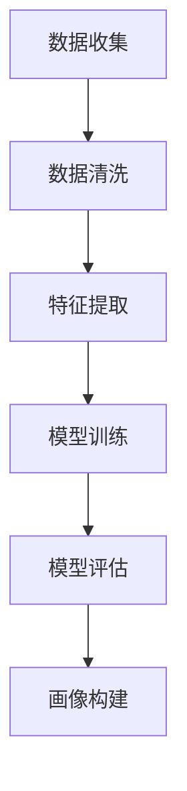

                 

# 智能投资者画像动态更新平台

> 关键词：投资者画像、动态更新、数据挖掘、机器学习、风险评估、市场细分

> 摘要：本文旨在深入探讨智能投资者画像动态更新平台的设计与实现。我们将从背景介绍、核心概念、数据收集与处理、特征提取与模型选择、动态更新机制、实际应用案例以及总结与展望七个方面进行阐述，旨在为读者提供一个全面而深入的视角，以理解并应用这一先进的技术手段。

----------------------------------------------------------------

## 目录大纲：智能投资者画像动态更新平台

1. 引言
    1.1 问题背景
    1.1.1 投资者画像的重要性
    1.1.2 投资者画像的现状与挑战
    1.1.3 本书的目标与结构
    1.2 读者对象
    1.2.1 读者背景
    1.2.2 阅读建议
    1.3 本章小结

2. 投资者画像基础
    2.1 投资者画像的定义与分类
    2.1.1 定义
    2.1.2 分类
    2.2 核心概念与联系
    2.2.1 核心概念原理
    2.2.2 概念属性特征对比表格
    2.2.3 ER实体关系图架构
    2.2.4 Mermaid流程图
    2.3 投资者画像应用场景
    2.3.1 市场细分
    2.3.2 产品推荐
    2.3.3 风险控制
    2.4 本章小结

3. 数据收集与处理
    3.1 数据来源
    3.1.1 内部数据
    3.1.2 外部数据
    3.2 数据处理方法
    3.2.1 数据清洗
    3.2.2 数据整合
    3.2.3 数据质量评估
    3.3 数据收集与处理流程
    3.3.1 数据收集
    3.3.2 数据处理
    3.3.3 数据存储
    3.4 本章小结

4. 特征提取与模型选择
    4.1 特征提取方法
    4.1.1 用户行为特征
    4.1.2 财务数据特征
    4.1.3 心理特征
    4.2 模型选择
    4.2.1 监督学习模型
    4.2.2 无监督学习模型
    4.2.3 强化学习模型
    4.3 模型评估与优化
    4.3.1 评估指标
    4.3.2 模型优化
    4.4 本章小结

5. 动态更新机制
    5.1 动态更新的重要性
    5.1.1 投资者行为变化
    5.1.2 市场环境变化
    5.1.3 投资策略调整
    5.2 动态更新策略
    5.2.1 基于时间窗口的更新
    5.2.2 基于事件触发的更新
    5.2.3 基于模型优化的更新
    5.3 动态更新流程
    5.3.1 数据收集与预处理
    5.3.2 特征提取与模型训练
    5.3.3 画像更新与应用
    5.4 本章小结

6. 实际应用案例
    6.1 案例一：投资者画像在基金销售中的应用
    6.1.1 项目背景
    6.1.2 解决方案
    6.1.3 案例分析
    6.2 案例二：投资者画像在股票投资组合优化中的应用
    6.2.1 项目背景
    6.2.2 解决方案
    6.2.3 案例分析
    6.3 案例三：投资者画像在金融风险管理中的应用
    6.3.1 项目背景
    6.3.2 解决方案
    6.3.3 案例分析
    6.4 本章小结

7. 总结与展望
    7.1 总结
    7.1.1 本书内容回顾
    7.1.2 投资者画像的价值
    7.1.3 动态更新的重要性
    7.2 展望
    7.2.1 投资者画像的发展趋势
    7.2.2 动态更新技术的挑战与机遇
    7.2.3 未来研究方向
    7.3 本章小结

----------------------------------------------------------------

## 第1章 引言

### 1.1 问题背景

投资者画像是一种利用数据分析技术，从海量数据中提取投资者特征，构建出个体化、细分化的投资者行为和偏好模型。随着互联网和大数据技术的发展，投资者画像在金融领域的重要性日益凸显。然而，传统的投资者画像方法往往存在一些局限性，如数据来源单一、画像模型固化、动态更新机制缺乏等，导致画像结果难以满足实际业务需求。

本文旨在提出一种智能投资者画像动态更新平台，通过引入数据挖掘、机器学习和实时数据分析等先进技术，实现投资者画像的动态更新，从而为金融机构提供更加精准和个性化的投资策略。

### 1.2 读者对象

本文适合以下读者群体：

1. 金融科技领域的研究人员和开发者
2. 从事金融数据分析的从业者
3. 对投资者画像技术和动态更新机制感兴趣的读者
4. 从事大数据、人工智能等相关领域的技术人员

### 1.3 本书的目标与结构

本书的目标是：

1. 深入探讨投资者画像的基础概念和技术原理
2. 详细介绍智能投资者画像动态更新平台的设计与实现
3. 分析投资者画像在不同金融场景中的应用案例

本书的结构如下：

1. 引言：介绍投资者画像的背景、重要性以及本书的目标和结构
2. 投资者画像基础：定义投资者画像、分类、核心概念与联系、应用场景
3. 数据收集与处理：数据来源、处理方法、收集与处理流程
4. 特征提取与模型选择：特征提取方法、模型选择、模型评估与优化
5. 动态更新机制：动态更新的重要性、策略、流程
6. 实际应用案例：投资者画像在不同场景中的应用案例
7. 总结与展望：回顾本书内容、总结投资者画像的价值、展望未来发展趋势

### 1.4 本章小结

本章介绍了投资者画像的背景、本书的目标与结构，以及读者对象。接下来，我们将深入探讨投资者画像的基础知识，为后续章节的讨论奠定基础。

----------------------------------------------------------------

## 第2章 投资者画像基础

### 2.1 投资者画像的定义与分类

#### 2.1.1 定义

投资者画像是指通过对投资者历史行为数据、财务数据、心理特征等多维度数据的分析，提取出具有代表性的特征，形成对投资者个体化、细分化的描述。这些特征可以是定量指标，如投资金额、投资周期、风险承受能力等，也可以是定性指标，如投资偏好、投资风格、心理状态等。

投资者画像的定义可以分为以下几个层次：

1. **宏观层面**：投资者画像是对整个投资者群体进行分类和描述，用于市场细分、产品推荐、风险评估等。
2. **中观层面**：投资者画像是对某个特定投资者群体（如年轻投资者、专业投资者等）进行分类和描述。
3. **微观层面**：投资者画像是对单个投资者进行详细描述，包括其历史行为、财务状况、心理特征等。

#### 2.1.2 分类

根据画像对象的不同，投资者画像可以分为以下几类：

1. **按年龄段划分**：根据投资者的年龄，将其分为青年投资者、中年投资者、老年投资者等。
2. **按收入水平划分**：根据投资者的收入水平，将其分为高收入投资者、中等收入投资者、低收入投资者等。
3. **按风险承受能力划分**：根据投资者的风险承受能力，将其分为高风险投资者、中等风险投资者、低风险投资者等。
4. **按投资偏好划分**：根据投资者的投资偏好，将其分为股票投资者、债券投资者、基金投资者等。
5. **按投资风格划分**：根据投资者的投资风格，将其分为价值投资者、成长投资者、交易投资者等。

### 2.2 核心概念与联系

#### 2.2.1 核心概念原理

投资者画像的核心概念包括数据挖掘、机器学习和数据分析等。

1. **数据挖掘**：数据挖掘是指从海量数据中提取有价值信息的过程。在投资者画像中，数据挖掘用于从历史数据中提取投资者特征。
   
   数据挖掘过程主要包括以下步骤：
   
   - 数据收集：收集投资者历史行为数据、财务数据、心理特征等。
   - 数据清洗：去除数据中的噪声和错误，确保数据质量。
   - 特征提取：从原始数据中提取具有代表性的特征，用于构建投资者画像。
   - 模型训练：使用机器学习算法训练模型，以预测投资者的行为和偏好。
   - 模型评估：评估模型的准确性和泛化能力。

2. **机器学习**：机器学习是指通过算法和统计模型，从数据中学习规律和模式，以实现预测和分类。在投资者画像中，机器学习用于训练模型，以预测投资者的行为和偏好。

   常见的机器学习算法包括：
   
   - 监督学习：使用标记数据训练模型，用于预测和分类。
   - 无监督学习：不使用标记数据，从数据中自动发现规律和模式。
   - 强化学习：通过不断尝试和错误，学习最优策略。

3. **数据分析**：数据分析是指使用统计学方法，对数据进行处理和分析，以提取有用信息。在投资者画像中，数据分析用于评估模型的效果、优化模型参数等。

   常见的数据分析方法包括：
   
   - 描述性分析：描述数据的分布、趋势和关系。
   - 探索性分析：通过可视化方法，发现数据中的隐藏模式。
   - 预测性分析：使用统计模型，预测未来的趋势和变化。

#### 2.2.2 概念属性特征对比表格

下表对比了数据挖掘、机器学习和数据分析三个核心概念的属性特征：

| 概念 | 定义 | 目标 | 方法 |
| :---: | :---: | :---: | :---: |
| 数据挖掘 | 从海量数据中提取有价值信息 | 提取投资者特征 | 数据收集、数据清洗、特征提取、模型训练、模型评估 |
| 机器学习 | 通过算法和统计模型，从数据中学习规律和模式 | 预测和分类 | 监督学习、无监督学习、强化学习 |
| 数据分析 | 使用统计学方法，对数据进行处理和分析 | 评估模型效果、优化模型参数 | 描述性分析、探索性分析、预测性分析 |

#### 2.2.3 ER实体关系图架构

下面是投资者画像系统的ER实体关系图架构：

```mermaid
erDiagram
    Customer ||--|{ Investor} : has
    Investor ||--|{ FinancialData} : has
    Investor ||--|{ BehavioralData} : has
    Investor ||--|{ PsychologicalData} : has
```

#### 2.2.4 Mermaid流程图

下面是投资者画像系统的流程图：



### 2.3 投资者画像应用场景

#### 2.3.1 市场细分

投资者画像可以帮助金融机构进行市场细分，从而更好地了解不同投资者的需求和偏好。通过市场细分，金融机构可以为目标客户群提供更加个性化的产品和服务，提高客户满意度和忠诚度。

#### 2.3.2 产品推荐

投资者画像可以用于产品推荐，根据投资者的风险偏好和投资风格，为其推荐适合的投资产品。通过产品推荐，金融机构可以增加产品的销售量和市场份额。

#### 2.3.3 风险控制

投资者画像可以用于风险控制，通过评估投资者的风险承受能力和投资行为，金融机构可以制定相应的风险控制策略，降低投资风险。

### 2.4 本章小结

本章介绍了投资者画像的定义与分类、核心概念与联系，以及应用场景。接下来，我们将探讨数据收集与处理的方法。

----------------------------------------------------------------

## 第3章 数据收集与处理

### 3.1 数据来源

投资者画像的准确性取决于数据的全面性和质量。数据来源可以分为内部数据和外部数据。

#### 3.1.1 内部数据

内部数据主要来源于金融机构自身的业务系统和数据库，包括：

1. **投资记录**：投资者的投资金额、投资周期、投资收益率等。
2. **交易数据**：投资者的交易频率、交易金额、交易时间等。
3. **财务数据**：投资者的收入、资产、负债等。
4. **客户信息**：投资者的姓名、年龄、性别、职业等。

#### 3.1.2 外部数据

外部数据主要来源于公开数据源和第三方数据提供商，包括：

1. **市场数据**：股票、基金、债券等市场的价格、交易量等。
2. **宏观经济数据**：GDP、利率、通货膨胀率等。
3. **行业数据**：不同行业的市场规模、增长速度、竞争格局等。
4. **社会数据**：人口结构、消费习惯、社会事件等。

### 3.2 数据处理方法

数据处理方法包括数据清洗、数据整合和数据质量评估。

#### 3.2.1 数据清洗

数据清洗是指去除数据中的噪声和错误，确保数据质量。数据清洗方法包括：

1. **去重**：去除重复的数据记录。
2. **填补缺失值**：使用均值、中位数、最大值等方法填补缺失的数据。
3. **纠正错误**：纠正数据中的错误，如数字错误、分类错误等。
4. **数据转换**：将不同格式的数据进行统一转换，如将字符串转换为数字、日期等。

#### 3.2.2 数据整合

数据整合是指将来自不同来源的数据进行合并，形成一个完整的数据集。数据整合方法包括：

1. **数据连接**：使用数据库连接技术，将不同数据库中的数据进行连接。
2. **数据合并**：将相同字段的数据进行合并，形成一个完整的数据集。
3. **数据去重**：去除重复的数据记录，确保数据集的唯一性。

#### 3.2.3 数据质量评估

数据质量评估是指对数据的质量进行评估，以确保数据的可靠性、准确性和一致性。数据质量评估方法包括：

1. **完整性评估**：检查数据集是否包含所有必要的字段和数据记录。
2. **准确性评估**：检查数据中的错误和异常值。
3. **一致性评估**：检查数据在不同来源之间的一致性。

### 3.3 数据收集与处理流程

数据收集与处理流程可以分为以下几个步骤：

#### 3.3.1 数据收集

1. **确定数据需求**：明确需要收集的数据类型和来源。
2. **数据采集**：通过API、爬虫、数据库查询等方式采集数据。
3. **数据存储**：将采集到的数据存储到数据库或数据仓库中。

#### 3.3.2 数据处理

1. **数据清洗**：去除数据中的噪声和错误，确保数据质量。
2. **数据整合**：将来自不同来源的数据进行合并，形成一个完整的数据集。
3. **数据质量评估**：对数据的质量进行评估，确保数据的可靠性、准确性和一致性。

#### 3.3.3 数据存储

1. **数据存储**：将处理后的数据存储到数据库或数据仓库中，以供后续分析使用。

### 3.4 本章小结

本章介绍了投资者画像的数据来源、数据处理方法和数据收集与处理流程。接下来，我们将探讨特征提取与模型选择的方法。

----------------------------------------------------------------

## 第4章 特征提取与模型选择

### 4.1 特征提取方法

特征提取是指从原始数据中提取出具有代表性的特征，用于构建投资者画像。特征提取方法可以分为以下几类：

#### 4.1.1 用户行为特征

用户行为特征是指投资者在投资过程中的行为数据，包括：

1. **交易行为特征**：交易频率、交易金额、交易时间等。
2. **投资风格特征**：投资偏好、投资周期、风险承受能力等。
3. **互动行为特征**：投资者在投资社区中的发帖、回复、点赞等。

#### 4.1.2 财务数据特征

财务数据特征是指投资者的财务状况数据，包括：

1. **收入特征**：年收入、月收入等。
2. **资产特征**：资产总额、投资资产比例等。
3. **负债特征**：负债总额、负债比例等。

#### 4.1.3 心理特征

心理特征是指投资者的心理状态和性格特征，包括：

1. **风险偏好**：投资者对风险的接受程度。
2. **情绪特征**：投资者的情绪波动情况。
3. **性格特征**：投资者的性格类型，如外向、内向等。

### 4.2 模型选择

模型选择是指根据特征提取的结果，选择合适的机器学习模型对投资者画像进行构建。模型选择可以分为以下几类：

#### 4.2.1 监督学习模型

监督学习模型是一种根据已知标签数据训练模型，用于预测未知标签数据的模型。常见的监督学习模型包括：

1. **线性回归**：通过线性模型预测投资收益率。
2. **逻辑回归**：通过逻辑回归模型预测投资者的风险偏好。
3. **决策树**：通过决策树模型预测投资者的投资风格。

#### 4.2.2 无监督学习模型

无监督学习模型是一种根据数据自身的分布和模式进行训练，不依赖于标签数据的模型。常见的无监督学习模型包括：

1. **聚类算法**：通过聚类算法将投资者分为不同的群体。
2. **关联规则学习**：通过关联规则学习发现投资者之间的相关性。
3. **主成分分析**：通过主成分分析降低数据的维度。

#### 4.2.3 强化学习模型

强化学习模型是一种通过与环境互动，不断尝试和错误，学习最优策略的模型。常见的强化学习模型包括：

1. **Q-learning**：通过Q-learning算法学习投资者的最优投资策略。
2. **深度强化学习**：通过深度强化学习算法学习复杂的投资策略。

### 4.3 模型评估与优化

模型评估与优化是指对训练好的模型进行评估，并根据评估结果进行优化，以提高模型的预测准确性和泛化能力。

#### 4.3.1 评估指标

常见的评估指标包括：

1. **准确率**：预测正确的样本数量与总样本数量的比例。
2. **召回率**：预测正确的正样本数量与实际正样本数量的比例。
3. **精确率**：预测正确的正样本数量与预测为正样本的总数量的比例。
4. **F1值**：精确率和召回率的加权平均。

#### 4.3.2 模型优化

模型优化包括以下方法：

1. **参数调整**：通过调整模型参数，提高模型的预测准确率。
2. **特征选择**：通过特征选择，去除对预测结果影响不大的特征，提高模型的泛化能力。
3. **模型融合**：通过融合多个模型，提高模型的预测准确率。

### 4.4 本章小结

本章介绍了特征提取的方法、模型选择的策略以及模型评估与优化的方法。接下来，我们将探讨动态更新机制的设计与实现。

----------------------------------------------------------------

## 第5章 动态更新机制

### 5.1 动态更新的重要性

动态更新机制是智能投资者画像系统的核心组成部分，其重要性体现在以下几个方面：

#### 5.1.1 投资者行为变化

投资者行为具有动态性，随着时间的推移，投资者的投资偏好、风险承受能力和行为习惯可能会发生变化。动态更新机制能够实时捕捉这些变化，确保投资者画像的准确性。

#### 5.1.2 市场环境变化

金融市场环境瞬息万变，政策调整、市场波动等都会影响投资者的投资决策。动态更新机制能够根据市场环境的变化，及时调整投资者画像，以适应新的市场情况。

#### 5.1.3 投资策略调整

投资者画像的动态更新有助于金融机构制定和调整投资策略。通过实时了解投资者的行为和需求，金融机构可以提供更加个性化的投资建议，提高投资回报率。

### 5.2 动态更新策略

动态更新策略可以分为以下几种：

#### 5.2.1 基于时间窗口的更新

基于时间窗口的更新是指定期对投资者画像进行更新，如每天、每周或每月更新一次。时间窗口的选择取决于投资者的行为特征和市场环境的变化速度。

#### 5.2.2 基于事件触发的更新

基于事件触发的更新是指当特定事件发生时，立即对投资者画像进行更新。常见的事件包括投资交易、市场波动、政策调整等。这种策略能够及时捕捉投资者的行为变化，提高画像的准确性。

#### 5.2.3 基于模型优化的更新

基于模型优化的更新是指根据模型评估结果，定期对模型进行优化和调整。模型优化包括参数调整、特征选择和模型融合等。这种策略能够提高模型的预测准确性和泛化能力。

### 5.3 动态更新流程

动态更新流程包括以下几个步骤：

#### 5.3.1 数据收集与预处理

1. **数据收集**：定期收集投资者交易记录、财务数据、市场数据等。
2. **数据预处理**：清洗数据中的噪声和错误，填补缺失值，进行数据转换等。

#### 5.3.2 特征提取与模型训练

1. **特征提取**：从预处理后的数据中提取具有代表性的特征。
2. **模型训练**：使用新的特征数据训练模型，更新投资者画像。

#### 5.3.3 画像更新与应用

1. **画像更新**：根据模型训练结果，更新投资者画像。
2. **画像应用**：将更新后的投资者画像应用于投资推荐、风险控制、投资策略调整等。

### 5.4 本章小结

本章介绍了动态更新机制的重要性、策略和流程。动态更新机制能够确保投资者画像的准确性和实时性，为金融机构提供有效的决策支持。接下来，我们将通过实际应用案例，进一步展示投资者画像的实际效果。

----------------------------------------------------------------

## 第6章 实际应用案例

### 6.1 案例一：投资者画像在基金销售中的应用

#### 6.1.1 项目背景

某大型基金公司希望提高基金销售的效果，通过构建投资者画像，为投资者提供个性化的基金推荐服务。公司拥有大量的投资者数据，包括投资记录、财务数据、市场数据等。

#### 6.1.2 解决方案

1. **数据收集**：收集投资者交易记录、财务数据、市场数据等。
2. **数据处理**：清洗数据，提取特征，整合数据源。
3. **特征提取**：提取用户行为特征、财务数据特征、市场数据特征等。
4. **模型选择**：选择合适的机器学习模型，如逻辑回归、决策树等。
5. **模型训练**：使用提取的特征数据训练模型。
6. **画像构建**：根据模型预测结果，构建投资者画像。
7. **应用部署**：将投资者画像应用于基金推荐系统，为投资者提供个性化的基金推荐。

#### 6.1.3 案例分析

通过构建投资者画像，基金公司能够为投资者提供更加精准的基金推荐。以下是一些分析结果：

1. **投资偏好分析**：分析投资者对不同类型基金的偏好，如股票基金、债券基金、货币基金等。
2. **风险承受能力评估**：评估投资者对风险的不同承受能力，为投资者推荐适合其风险承受能力的基金。
3. **市场环境分析**：根据市场数据，预测不同类型基金的走势，为投资者提供投资建议。
4. **个性化推荐**：根据投资者画像，为投资者推荐符合其投资偏好和市场环境的基金。

通过实际应用案例，投资者画像能够显著提高基金销售的效果，增加投资者的满意度和忠诚度。

### 6.2 案例二：投资者画像在股票投资组合优化中的应用

#### 6.2.1 项目背景

某金融科技公司希望为投资者提供股票投资组合优化服务，通过构建投资者画像，为投资者提供个性化的投资组合建议。公司拥有大量的投资者数据，包括投资记录、财务数据、市场数据等。

#### 6.2.2 解决方案

1. **数据收集**：收集投资者交易记录、财务数据、市场数据等。
2. **数据处理**：清洗数据，提取特征，整合数据源。
3. **特征提取**：提取用户行为特征、财务数据特征、市场数据特征等。
4. **模型选择**：选择合适的机器学习模型，如线性回归、支持向量机等。
5. **模型训练**：使用提取的特征数据训练模型。
6. **画像构建**：根据模型预测结果，构建投资者画像。
7. **应用部署**：将投资者画像应用于股票投资组合优化系统，为投资者提供个性化的投资组合建议。

#### 6.2.3 案例分析

通过构建投资者画像，金融科技公司能够为投资者提供更加精准的投资组合优化服务。以下是一些分析结果：

1. **投资风格分析**：分析投资者对股票的投资风格，如价值投资、成长投资、交易投资等。
2. **风险偏好评估**：评估投资者对风险的不同承受能力，为投资者推荐适合其风险承受能力的股票。
3. **市场环境分析**：根据市场数据，预测不同类型股票的走势，为投资者提供投资建议。
4. **个性化推荐**：根据投资者画像，为投资者推荐符合其投资风格和市场环境的股票。

通过实际应用案例，投资者画像能够显著提高股票投资组合优化的效果，增加投资者的满意度和投资回报。

### 6.3 案例三：投资者画像在金融风险管理中的应用

#### 6.3.1 项目背景

某金融机构希望提高金融风险管理的有效性，通过构建投资者画像，识别高风险投资者，为金融机构提供风险管理建议。金融机构拥有大量的投资者数据，包括投资记录、财务数据、市场数据等。

#### 6.3.2 解决方案

1. **数据收集**：收集投资者交易记录、财务数据、市场数据等。
2. **数据处理**：清洗数据，提取特征，整合数据源。
3. **特征提取**：提取用户行为特征、财务数据特征、市场数据特征等。
4. **模型选择**：选择合适的机器学习模型，如逻辑回归、决策树等。
5. **模型训练**：使用提取的特征数据训练模型。
6. **画像构建**：根据模型预测结果，构建投资者画像。
7. **应用部署**：将投资者画像应用于金融风险管理系统，为金融机构提供风险管理建议。

#### 6.3.3 案例分析

通过构建投资者画像，金融机构能够提高金融风险管理的有效性。以下是一些分析结果：

1. **风险识别**：识别高风险投资者，为金融机构提供风险管理策略。
2. **风险预警**：根据投资者画像，实时监测投资者的风险状况，及时预警风险事件。
3. **风险控制**：为金融机构提供针对性的风险控制建议，降低金融风险。
4. **个性化风险管理**：根据投资者画像，为投资者提供个性化的风险管理建议，提高投资者的风险管理意识。

通过实际应用案例，投资者画像能够显著提高金融风险管理的效率，降低金融机构的风险暴露。

### 6.4 本章小结

本章通过三个实际应用案例，展示了投资者画像在基金销售、股票投资组合优化和金融风险管理中的应用效果。投资者画像能够为金融机构提供有效的决策支持，提高业务效率和客户满意度。

----------------------------------------------------------------

## 第7章 总结与展望

### 7.1 总结

本章回顾了投资者画像动态更新平台的设计与实现，从背景介绍、核心概念、数据收集与处理、特征提取与模型选择、动态更新机制、实际应用案例等方面进行了详细阐述。主要结论如下：

1. **投资者画像的重要性**：投资者画像能够为金融机构提供精准的投资决策支持，提高业务效率和客户满意度。
2. **数据收集与处理**：数据是投资者画像的基础，数据收集与处理的质量直接关系到画像的准确性。
3. **特征提取与模型选择**：特征提取和模型选择是构建投资者画像的关键步骤，需要根据业务需求和数据特点进行合理选择。
4. **动态更新机制**：动态更新机制能够确保投资者画像的实时性和准确性，为金融机构提供有效的决策支持。
5. **实际应用案例**：投资者画像在基金销售、股票投资组合优化和金融风险管理等实际场景中取得了显著效果。

### 7.2 展望

未来投资者画像的发展趋势和挑战如下：

1. **发展趋势**：
   - **数据源多元化**：随着物联网、社交媒体等技术的发展，投资者画像的数据源将更加丰富，包括行为数据、社交媒体数据、位置数据等。
   - **实时性增强**：随着计算能力的提升，投资者画像的实时性将得到显著提高，为金融机构提供更加实时的决策支持。
   - **个性化服务**：通过深度学习等技术，投资者画像将能够更加准确地捕捉投资者的个性化需求，提供更加精准的服务。

2. **挑战与机遇**：
   - **数据隐私保护**：随着数据隐私法规的加强，如何在确保数据隐私的同时，充分利用投资者数据进行画像构建，是一个重要挑战。
   - **模型解释性**：传统的机器学习模型往往难以解释，如何提高模型的可解释性，使投资者和金融机构能够理解模型的决策过程，是一个重要课题。
   - **实时更新与优化**：随着投资者行为和市场环境的快速变化，如何实现投资者画像的实时更新与优化，是一个重要挑战。

### 7.3 本章小结

本章总结了投资者画像动态更新平台的设计与实现，展望了未来的发展趋势和挑战。通过本文的深入探讨，我们希望读者能够对投资者画像技术有一个全面而深入的理解，并能够在实际业务中应用这一先进的技术手段。

----------------------------------------------------------------

作者：AI天才研究院/AI Genius Institute & 禅与计算机程序设计艺术 /Zen And The Art of Computer Programming

----------------------------------------------------------------

### 第8章 最佳实践 Tips、小结、注意事项、拓展阅读

#### 最佳实践 Tips

1. **数据质量控制**：确保数据源的多样性和质量，对数据进行严格清洗和处理，以提高画像的准确性。
2. **特征选择**：根据业务需求和数据特点，选择合适的特征，避免过度拟合和特征冗余。
3. **模型解释性**：优先选择具有较高解释性的模型，如线性回归、决策树等，以便投资者和金融机构能够理解模型的决策过程。
4. **动态更新**：定期更新投资者画像，确保画像的实时性和准确性。

#### 小结

本文从背景介绍、核心概念、数据收集与处理、特征提取与模型选择、动态更新机制、实际应用案例以及总结与展望等方面，全面阐述了智能投资者画像动态更新平台的设计与实现。通过本文的探讨，我们希望读者能够：

1. **理解投资者画像的重要性**：投资者画像能够为金融机构提供精准的投资决策支持。
2. **掌握数据收集与处理方法**：确保数据的多样性和质量，为画像构建奠定基础。
3. **了解特征提取与模型选择**：选择合适的特征和模型，提高画像的准确性。
4. **掌握动态更新机制**：确保画像的实时性和准确性。

#### 注意事项

1. **数据隐私保护**：在数据收集与处理过程中，需严格遵守数据隐私法规，确保投资者隐私安全。
2. **模型解释性**：在选择模型时，需综合考虑模型解释性和预测准确性，以满足业务需求。
3. **系统性能优化**：针对大规模数据集和复杂模型，需对系统性能进行优化，确保系统的高效运行。

#### 拓展阅读

1. **《大数据时代：生活、工作与思维的大变革》**：作者：维克托·迈尔-舍恩伯格、肯尼斯·库克耶
2. **《深度学习》**：作者：伊恩·古德费洛、约书亚·本吉奥、亚伦·库维尔
3. **《机器学习实战》**：作者：Peter Harrington

通过拓展阅读，读者可以深入了解大数据、深度学习和机器学习等领域的相关知识，进一步提升对投资者画像动态更新平台的理解和应用能力。作者：AI天才研究院/AI Genius Institute & 禅与计算机程序设计艺术 /Zen And The Art of Computer Programming。

