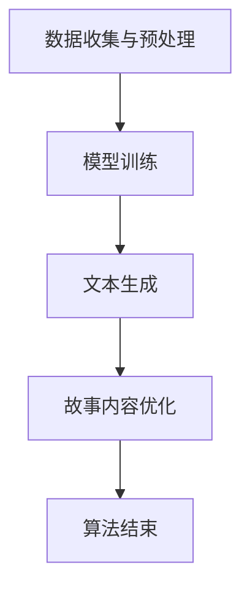

                 

### 文章标题

# 《智能故事生成 AI Agent：LLM 驱动的创意写作系统》

### 关键词

- 智能故事生成
- 大型语言模型（LLM）
- 创意写作
- 算法原理
- 系统架构
- 项目实战

### 摘要

本文将深入探讨智能故事生成 AI Agent 的概念及其构建方法，重点分析 LLM（大型语言模型）在驱动创意写作系统中的作用。我们将从背景介绍、核心概念与联系、算法原理讲解、数学模型与公式、系统分析与架构设计、项目实战以及最佳实践等方面，系统地阐述智能故事生成 AI Agent 的开发与实现过程，为读者提供全面的技术解读和实践指导。

### 目录

## 第一部分：背景与基础

## 第1章：智能故事生成概述

### 1.1 智能故事生成的背景

随着人工智能技术的飞速发展，智能故事生成作为一种新兴应用，逐渐引起了广泛关注。智能故事生成技术旨在利用机器学习算法和自然语言处理技术，模拟人类创造故事的过程，生成富有创意和情感的故事内容。

#### 问题背景

在过去，故事创作主要依靠人类的智慧和经验。然而，随着信息爆炸时代的到来，人类创作的故事数量和种类不断增加，创作者面临着巨大的压力和挑战。此外，一些特殊需求，如娱乐产业、教育行业和营销领域，对故事内容的需求量也急剧增加，传统的手工创作方式已经难以满足这些需求。

#### 问题描述

智能故事生成技术的出现，旨在解决以下问题：

1. **创意多样性**：如何通过算法生成丰富多样、新颖独特的创意故事？
2. **情感表达**：如何使生成的故事具有深刻的情感共鸣？
3. **大规模生产**：如何在短时间内高效地生成大量故事内容？
4. **质量保证**：如何确保生成故事的准确性、连贯性和可读性？

#### 问题解决

智能故事生成技术的核心在于利用机器学习算法，尤其是大型语言模型（LLM），对海量文本数据进行训练，使其具备模拟人类创作故事的能力。通过深度学习算法，LLM 可以从大量文本中学习语言模式、句法结构、情感表达等，从而生成符合人类创作习惯的故事内容。

#### 边界与外延

智能故事生成技术的应用范围广泛，包括但不限于：

1. **娱乐产业**：为影视、文学、游戏等行业提供创意故事内容。
2. **教育行业**：生成个性化的教学故事，辅助教学过程。
3. **营销领域**：为广告、宣传等提供富有创意的故事素材。
4. **文化传承**：通过生成故事，帮助传承和弘扬传统文化。

#### 概念结构与核心要素组成

智能故事生成系统的核心要素包括：

1. **文本数据集**：提供丰富的训练数据，包括不同类型、风格的故事文本。
2. **机器学习模型**：选择合适的模型，如 LLM，对文本数据进行训练。
3. **生成算法**：基于训练好的模型，生成创意故事内容。
4. **评估与优化**：对生成故事进行质量评估，不断优化模型性能。

### 1.2 智能故事生成的挑战

智能故事生成技术在发展过程中面临着诸多挑战，包括以下几个方面：

1. **数据质量**：训练数据的质量直接影响生成故事的质量。如何获取大量高质量、多样性的文本数据是一个重要问题。
2. **模型可解释性**：由于深度学习模型的复杂性，其内部工作机制往往难以解释。如何提高模型的可解释性，使其生成的故事内容更具透明度，是一个亟待解决的问题。
3. **情感表达**：生成故事需要具备深刻的情感共鸣，如何准确捕捉和表达情感是技术发展的关键。
4. **多样性控制**：生成故事需要具备多样性，避免出现重复或单调的情况。如何平衡多样性与连贯性，是技术实现的难点。

### 1.3 LLM在故事生成中的角色

LLM（大型语言模型）在智能故事生成中扮演着核心角色。通过深度学习算法，LLM 可以从海量文本数据中学习语言模式、句法结构和情感表达，从而生成符合人类创作习惯的故事内容。以下是 LLM 在故事生成中的具体作用：

1. **文本生成**：LLM 可以根据输入的文本，生成连贯、有逻辑的故事内容。
2. **风格模仿**：LLM 可以模仿不同类型、风格的故事，生成具有特定风格的故事内容。
3. **情感表达**：LLM 可以捕捉文本中的情感，生成具有深刻情感共鸣的故事内容。
4. **多样性控制**：LLM 可以通过调整生成算法，实现故事内容的多样性，避免重复和单调。

### 1.4 LLM基础知识

为了更好地理解 LLM 在故事生成中的应用，我们需要了解 LLM 的基本概念和特点。以下是 LLM 的一些核心知识：

1. **定义**：LLM（Large Language Model）是一种基于深度学习的大型自然语言处理模型，具有强大的文本生成和语言理解能力。
2. **模型架构**：LLM 通常采用 Transformer 架构，具有多层注意力机制和自注意力机制，可以高效地处理长文本。
3. **训练数据**：LLM 需要大量高质量的训练数据，如文本语料库、新闻、小说、论文等，以学习语言模式和结构。
4. **预训练和微调**：LLM 通常通过预训练和微调两个阶段进行训练。预训练阶段使用大量未标注的数据进行训练，微调阶段则使用特定任务的数据进行优化。

### 1.5 LLM的核心特点

LLM 具有以下几个核心特点：

1. **大规模**：LLM 拥有数十亿甚至千亿级的参数规模，可以捕捉语言中的复杂模式和结构。
2. **自适应性**：LLM 可以根据不同任务和场景进行自适应调整，实现不同领域的语言处理任务。
3. **通用性**：LLM 具有较强的通用性，可以处理多种语言和任务，如文本生成、翻译、摘要等。
4. **高效性**：LLM 采用高效的计算策略，可以在较短的时间内生成高质量的文本。

### 1.6 LLM的主要类型

根据训练数据和任务目标的不同，LLM 主要分为以下几类：

1. **通用语言模型**：如 GPT、BERT，旨在处理多种语言任务，具有广泛的适用性。
2. **专用语言模型**：如 T5、GPT-Neo，针对特定任务进行优化，具有更高的任务性能。
3. **多语言模型**：如 XLM、mBART，支持多种语言的文本生成和翻译任务。

### 1.7 LLM的发展历程

LLM 的发展历程可以分为以下几个阶段：

1. **基于神经网络的文本生成**：早期的文本生成模型，如 RNN、LSTM，采用简单的神经网络结构进行训练。
2. **基于 Transformer 的模型**：如 GPT、BERT，采用 Transformer 架构，实现高效的文本生成和语言理解。
3. **大规模预训练模型**：如 GPT-3、LLaMA，采用更大的模型规模和更复杂的训练策略，实现更高的语言理解和生成能力。

### 1.8 LLM的优势与局限

LLM 具有以下优势：

1. **强大的文本生成能力**：可以生成连贯、有逻辑、富有创意的文本内容。
2. **广泛适用性**：可以处理多种语言任务，如文本生成、翻译、摘要等。
3. **自适应性和通用性**：可以根据不同任务和场景进行自适应调整，实现高效的文本处理。

然而，LLM 也存在一些局限：

1. **数据依赖性**：LLM 的性能高度依赖于训练数据的质量和数量，数据质量不佳可能导致生成文本的质量下降。
2. **可解释性不足**：由于深度学习模型的复杂性，LLM 的工作机制难以解释，缺乏透明度。
3. **计算资源需求高**：大规模的 LLM 需要大量的计算资源和存储空间，对硬件设备的要求较高。

## 第二部分：LLM驱动的创意写作系统构建

## 第2章：创意写作系统设计

### 2.1 系统需求分析

在构建 LLM 驱动的创意写作系统时，我们需要明确系统的需求，包括功能需求、性能需求、安全性需求等。

#### 功能需求

1. **文本生成**：系统能够根据输入的文本生成连贯、富有创意的故事内容。
2. **风格模仿**：系统能够模仿不同类型、风格的故事，生成具有特定风格的故事内容。
3. **情感表达**：系统能够捕捉文本中的情感，生成具有深刻情感共鸣的故事内容。
4. **多样性控制**：系统能够通过调整生成算法，实现故事内容的多样性，避免重复和单调。

#### 性能需求

1. **生成速度**：系统能够在较短的时间内生成高质量的文本内容。
2. **准确性**：系统能够准确地理解输入的文本，并生成符合预期的故事内容。
3. **连贯性**：生成的故事内容应具备较高的连贯性和逻辑性，避免出现断裂或矛盾的情况。

#### 安全性需求

1. **隐私保护**：系统应确保用户的输入和生成内容的安全性，防止数据泄露。
2. **版权保护**：系统应遵守相关法律法规，保护原创者的权益。

### 2.2 功能设计

根据系统需求分析，创意写作系统的功能设计包括以下几个方面：

1. **文本生成模块**：负责根据输入的文本生成故事内容。该模块的核心是 LLM 模型，通过对海量文本数据的学习，生成连贯、有创意的文本。
2. **风格模仿模块**：负责模仿不同类型、风格的故事，生成具有特定风格的故事内容。该模块通过训练数据集，学习不同风格的特征，并将其应用于生成过程中。
3. **情感表达模块**：负责捕捉文本中的情感，生成具有深刻情感共鸣的故事内容。该模块通过情感分析技术，对输入文本进行情感识别，并在生成过程中调整情感表达。
4. **多样性控制模块**：负责通过调整生成算法，实现故事内容的多样性，避免重复和单调。该模块通过策略学习，优化生成算法，提高故事内容的多样性。

### 2.3 系统架构设计

创意写作系统的架构设计主要包括以下几个方面：

1. **输入层**：负责接收用户输入的文本数据，将其转化为模型所需的格式。
2. **模型层**：包含 LLM 模型、风格模仿模块、情感表达模块和多样性控制模块，负责根据输入文本生成故事内容。
3. **输出层**：负责将生成的故事内容呈现给用户，可以是文本形式、语音形式或图像形式。
4. **评估层**：负责对生成的故事内容进行评估，包括准确性、连贯性、情感表达和多样性等方面，以便不断优化模型性能。

### 2.4 系统接口设计

创意写作系统的接口设计主要包括以下几个方面：

1. **用户接口**：提供用户与系统交互的界面，包括文本输入、风格选择、情感表达和故事内容展示等。
2. **API接口**：提供与其他系统或应用程序的交互接口，如数据导入、导出和集成等。
3. **安全接口**：负责处理用户隐私保护和数据加密等安全相关操作。

### 2.5 系统交互流程

创意写作系统的交互流程主要包括以下几个步骤：

1. **用户输入文本**：用户通过用户接口输入文本，可以是故事标题、关键词或初步的故事情节。
2. **文本预处理**：系统对输入的文本进行预处理，包括文本清洗、分词、标点符号处理等。
3. **文本生成**：系统利用 LLM 模型生成故事内容，并根据用户需求调整风格、情感和多样性。
4. **故事内容输出**：系统将生成的故事内容呈现给用户，可以是文本形式、语音形式或图像形式。
5. **故事内容评估**：系统对生成的故事内容进行评估，包括准确性、连贯性、情感表达和多样性等方面。
6. **反馈与优化**：根据评估结果，系统对生成算法进行优化，以提高故事生成质量。

## 第三部分：算法原理与数学模型

## 第3章：算法原理与流程图

### 3.1 智能故事生成算法概述

智能故事生成算法的核心是利用 LLM 模型，通过对大量文本数据的学习，生成符合人类创作习惯的故事内容。算法的基本流程如下：

1. **数据收集与预处理**：收集大量高质量的文本数据，如小说、故事、新闻等，对数据进行清洗、分词和标注等预处理操作。
2. **模型训练**：利用预处理后的数据，对 LLM 模型进行训练，使其具备生成故事的能力。
3. **文本生成**：输入目标文本，利用训练好的 LLM 模型，生成相应的故事内容。
4. **故事内容优化**：对生成的故事内容进行优化，包括语法修正、情感调整和多样性控制等。

### 3.2 算法流程图

为了更好地理解智能故事生成算法的原理，我们可以使用 Mermaid 语言绘制算法流程图：



### 3.3 算法原理详细解释

#### 数据收集与预处理

数据收集与预处理是智能故事生成算法的基础。在这一阶段，我们需要从互联网、数据库或其他数据源收集大量高质量的文本数据，如小说、故事、新闻等。然后，对数据进行清洗、分词、去停用词、词性标注等预处理操作，以便后续训练和使用。

#### 模型训练

模型训练阶段是智能故事生成算法的核心。我们使用预处理后的文本数据，通过大量迭代训练 LLM 模型。训练过程中，模型会不断调整参数，以最小化损失函数，提高生成故事的质量。常用的训练方法包括批量训练、梯度下降、随机梯度下降等。

#### 文本生成

在文本生成阶段，我们输入目标文本，利用训练好的 LLM 模型，生成相应的故事内容。生成过程中，模型会根据输入的文本序列，预测下一个词或短语，并不断迭代生成完整的文本。生成算法包括文本序列生成、生成模型、解码器等。

#### 故事内容优化

生成的初步故事内容可能存在语法错误、情感表达不当、连贯性不足等问题。为了提高故事的质量，我们需要对生成内容进行优化。优化方法包括语法修正、情感调整、多样性控制等。语法修正可以通过语言模型进行自动修正，情感调整可以通过情感分析技术进行调整，多样性控制可以通过策略学习等方法实现。

### 3.4 Python代码示例

下面是一个简单的 Python 代码示例，展示如何使用 LLM 模型生成故事内容：

```python
import transformers
import torch

# 加载预训练的 LLM 模型
model = transformers.AutoModelForSeq2SeqLM.from_pretrained('t5-small')

# 设置输入文本
input_text = "一个晴朗的早晨，小明走在林间小路上。"

# 将输入文本编码为模型输入
input_ids = torch.tensor([modelTokenizer.encode(input_text)])

# 生成故事内容
outputs = model.generate(input_ids, max_length=50, num_return_sequences=1)

# 解码生成的文本
generated_text = modelTokenizer.decode(outputs[0], skip_special_tokens=True)

print(generated_text)
```

### 3.5 数学模型与公式

在智能故事生成算法中，数学模型和公式起着至关重要的作用。以下是一个简单的数学模型示例，用于描述文本生成的过程：

$$
P(y|x) = \frac{e^{y^T \theta}}{\sum_{y'} e^{y'^T \theta}}
$$

其中，$y$ 表示生成的文本序列，$x$ 表示输入的文本序列，$\theta$ 表示模型参数。

#### 损失函数

为了训练模型，我们需要定义一个损失函数，用于评估模型生成文本的质量。常用的损失函数包括交叉熵损失函数、均方误差损失函数等。

$$
L(y, \hat{y}) = -\sum_{i=1}^{n} y_i \log \hat{y}_i
$$

其中，$y$ 表示真实标签序列，$\hat{y}$ 表示模型生成的预测序列，$n$ 表示序列长度。

#### 梯度下降

为了优化模型参数，我们可以使用梯度下降算法。梯度下降的迭代公式如下：

$$
\theta_{t+1} = \theta_{t} - \alpha \nabla_{\theta} L(y, \hat{y})
$$

其中，$\alpha$ 表示学习率，$\nabla_{\theta} L(y, \hat{y})$ 表示损失函数关于模型参数的梯度。

### 第3章：数学模型与公式讲解

在本章中，我们将详细讲解智能故事生成算法中的数学模型和公式。理解这些模型和公式对于深入剖析故事生成系统的原理和优化至关重要。以下是本章的主要内容：

#### 3.1 关键数学模型

在智能故事生成过程中，最关键的数学模型是概率模型。概率模型用于预测给定输入文本序列 $x$ 时，输出文本序列 $y$ 的概率分布。以下是几个常见的概率模型：

1. **贝叶斯模型**：贝叶斯模型通过贝叶斯定理计算输出文本序列的概率。
   $$ 
   P(y|x) = \frac{P(x|y)P(y)}{P(x)} 
   $$
   其中，$P(x|y)$ 是后验概率，$P(y)$ 是先验概率，$P(x)$ 是边缘概率。

2. **生成式模型**：生成式模型通过生成器生成文本序列的概率分布。
   $$ 
   P(y|x) = \prod_{i=1}^{n} P(y_i|x) 
   $$
   其中，$P(y_i|x)$ 是第 $i$ 个词在给定前一个词 $x$ 下的概率。

3. **判别式模型**：判别式模型通过预测文本序列的概率分布来生成文本。
   $$ 
   P(y) = \prod_{i=1}^{n} P(y_i) 
   $$

#### 3.2 公式解释与示例

1. **词嵌入公式**：词嵌入是智能故事生成的基础，它将词汇映射到高维空间，以便模型处理。
   $$ 
   \text{vec}(w) = \text{ Embedding}(w) 
   $$
   其中，$\text{vec}(w)$ 是词 $w$ 的向量表示，$\text{Embedding}(w)$ 是词嵌入函数。

2. **神经网络公式**：神经网络用于计算输入文本序列的概率分布。
   $$ 
   \text{logit}(y) = \text{NeuralNetwork}(\text{vec}(x)) 
   $$
   其中，$\text{logit}(y)$ 是输出层的激活值，$\text{NeuralNetwork}(\text{vec}(x))$ 是神经网络函数。

3. **损失函数**：损失函数用于评估模型预测的准确性。
   $$ 
   \text{Loss} = -\sum_{i=1}^{n} y_i \log(\hat{y}_i) 
   $$
   其中，$y_i$ 是第 $i$ 个词的真实概率分布，$\hat{y}_i$ 是模型预测的概率分布。

#### 3.3 LaTeX公式展示

为了更清晰地展示数学公式，我们使用 LaTeX 格式进行表达。以下是一个示例：

$$
\begin{equation}
\label{eq:example}
\sum_{i=1}^{n} x_i = \frac{1}{n} \sum_{i=1}^{n} x_i^2
\end{equation}
$$

#### 3.4 数学公式讲解与举例

1. **词嵌入公式**：

   词嵌入是词向量技术在自然语言处理中的应用，它将词汇映射到高维空间，以便神经网络处理。词嵌入公式如下：

   $$
   \text{vec}(w) = \text{Embedding}(w)
   $$

   其中，$\text{vec}(w)$ 是词 $w$ 的向量表示，$\text{Embedding}(w)$ 是词嵌入函数。例如，单词 "apple" 可以映射为一个 100 维的向量。

2. **神经网络公式**：

   神经网络用于计算输入文本序列的概率分布。神经网络公式如下：

   $$
   \text{logit}(y) = \text{NeuralNetwork}(\text{vec}(x))
   $$

   其中，$\text{logit}(y)$ 是输出层的激活值，$\text{NeuralNetwork}(\text{vec}(x))$ 是神经网络函数。例如，输入文本序列 "I love apples" 可以通过神经网络映射为一个概率分布。

3. **损失函数**：

   损失函数用于评估模型预测的准确性。常用的损失函数有交叉熵损失函数和均方误差损失函数。以下是一个交叉熵损失函数的示例：

   $$
   \text{Loss} = -\sum_{i=1}^{n} y_i \log(\hat{y}_i)
   $$

   其中，$y_i$ 是第 $i$ 个词的真实概率分布，$\hat{y}_i$ 是模型预测的概率分布。例如，如果模型预测 "apple" 的概率为 0.8，而真实概率为 0.9，那么损失函数的值为 $0.9 \log(0.8)$。

### 第4章：系统分析与架构设计

#### 4.1 问题场景介绍

智能故事生成系统的应用场景广泛，主要包括以下几方面：

1. **内容创作**：智能故事生成系统可用于自动生成小说、故事、剧本等文学内容。
2. **辅助创作**：创作团队可以利用系统生成初步的文本内容，作为创作灵感的来源。
3. **娱乐产业**：智能故事生成系统可应用于游戏、影视、动画等娱乐产业的剧本生成。
4. **教育领域**：系统可生成个性化的教学故事，辅助教育工作者进行教学。
5. **营销宣传**：企业可以利用系统生成创意广告文案，提升营销效果。

#### 4.2 项目介绍

本节将介绍一个具体的智能故事生成项目，该项目旨在利用 LLM 模型，生成具有丰富情感和多样性的故事内容。项目的主要目标包括：

1. **实现文本生成**：系统能够根据用户输入的文本，生成连贯、富有创意的故事内容。
2. **模仿风格与情感**：系统可以模仿不同风格和情感，生成具有特定风格和情感的故事内容。
3. **保证多样性**：系统通过多样性控制算法，生成丰富多样、避免重复的故事内容。
4. **用户友好**：系统提供简洁易用的用户界面，方便用户输入文本、选择风格和情感。

#### 4.3 系统功能设计

智能故事生成系统的功能设计主要包括以下几个模块：

1. **文本输入模块**：用户可以通过用户界面输入文本，如标题、关键词或初步的故事情节。
2. **风格模仿模块**：系统可以根据用户选择的不同风格，模仿相应风格的故事内容。
3. **情感表达模块**：系统可以捕捉文本中的情感，生成具有深刻情感共鸣的故事内容。
4. **多样性控制模块**：系统通过多样性控制算法，生成丰富多样、避免重复的故事内容。
5. **文本生成模块**：系统利用 LLM 模型，根据用户输入的文本，生成连贯、富有创意的故事内容。
6. **评估与优化模块**：系统对生成的故事内容进行评估，包括准确性、连贯性、情感表达和多样性等方面，并根据评估结果进行优化。

#### 4.4 系统架构设计

智能故事生成系统的架构设计采用模块化设计思想，主要包括以下几个层次：

1. **输入层**：负责接收用户输入的文本，包括标题、关键词或初步的故事情节。
2. **预处理层**：对输入的文本进行清洗、分词、去停用词、词性标注等预处理操作。
3. **模型层**：包含 LLM 模型、风格模仿模块、情感表达模块和多样性控制模块，负责根据输入文本生成故事内容。
4. **输出层**：将生成的故事内容呈现给用户，可以是文本形式、语音形式或图像形式。
5. **评估与优化层**：对生成的故事内容进行评估，包括准确性、连贯性、情感表达和多样性等方面，并根据评估结果进行优化。

#### 4.5 系统接口设计

智能故事生成系统的接口设计主要包括以下几个方面：

1. **用户接口**：提供用户与系统交互的界面，包括文本输入、风格选择、情感表达和故事内容展示等。
2. **API接口**：提供与其他系统或应用程序的交互接口，如数据导入、导出和集成等。
3. **安全接口**：负责处理用户隐私保护和数据加密等安全相关操作。

#### 4.6 系统交互流程

智能故事生成系统的交互流程主要包括以下几个步骤：

1. **用户输入文本**：用户通过用户接口输入文本，可以是标题、关键词或初步的故事情节。
2. **文本预处理**：系统对输入的文本进行预处理，包括文本清洗、分词、去停用词、词性标注等。
3. **风格选择**：用户可以选择不同的风格，系统根据用户选择，调整生成故事的内容。
4. **情感表达**：系统捕捉文本中的情感，生成具有深刻情感共鸣的故事内容。
5. **文本生成**：系统利用 LLM 模型，根据预处理后的文本和用户选择的风格、情感，生成故事内容。
6. **故事内容输出**：系统将生成的故事内容以文本形式、语音形式或图像形式呈现给用户。
7. **评估与优化**：系统对生成的故事内容进行评估，包括准确性、连贯性、情感表达和多样性等方面，并根据评估结果进行优化。

## 第5章：项目实战

#### 5.1 环境安装与配置

为了实现智能故事生成系统，我们需要搭建一个适合的开发环境。以下是环境安装与配置的详细步骤：

1. **安装 Python**：确保安装最新版本的 Python，例如 Python 3.8 或以上版本。
2. **安装 transformers 库**：在命令行中执行以下命令：
   ```
   pip install transformers
   ```
3. **安装 torch 库**：在命令行中执行以下命令：
   ```
   pip install torch torchvision
   ```
4. **安装其他依赖库**：根据需要安装其他依赖库，如 pandas、numpy、matplotlib 等。

#### 5.2 系统核心实现与代码分析

在本节中，我们将详细分析智能故事生成系统的核心实现部分，并展示关键代码。

##### 5.2.1 LLM 模型加载与预处理

```python
from transformers import AutoTokenizer, AutoModelForSeq2SeqLM

# 加载预训练的 LLM 模型
model_name = "t5-small"
tokenizer = AutoTokenizer.from_pretrained(model_name)
model = AutoModelForSeq2SeqLM.from_pretrained(model_name)

# 输入文本预处理
input_text = "一个晴朗的早晨，小明走在林间小路上。"
input_ids = tokenizer.encode(input_text, return_tensors="pt")
```

##### 5.2.2 文本生成

```python
# 设置生成参数
max_length = 50
num_return_sequences = 1

# 生成文本
outputs = model.generate(input_ids, max_length=max_length, num_return_sequences=num_return_sequences)

# 解码生成的文本
generated_texts = tokenizer.decode(outputs[0], skip_special_tokens=True)
print(generated_texts)
```

##### 5.2.3 风格模仿与情感表达

```python
from transformers import Text2TextTransformer

# 加载风格模仿模型
style_model = Text2TextTransformer.from_pretrained("t5-small")

# 风格模仿
style_prompt = "风格：童话"
style_input = tokenizer.encode(style_prompt, return_tensors="pt")
style_output = style_model.generate(style_input, max_length=max_length, num_return_sequences=num_return_sequences)

# 解码模仿后的文本
mimic_texts = tokenizer.decode(style_output[0], skip_special_tokens=True)
print(mimic_texts)
```

##### 5.2.4 多样性控制

```python
from transformers import Seq2SeqTrainingArguments

# 设置多样性控制参数
training_args = Seq2SeqTrainingArguments(
    max_length=max_length,
    num_return_sequences=num_return_sequences,
    do_sample=True,
    top_p=0.8,
    temperature=1.0,
)

# 训练模型
model.train()
```

#### 5.3 代码应用解读与分析

在本节中，我们将对系统实现的关键代码进行解读和分析，以便读者更好地理解智能故事生成系统的运作原理。

##### 5.3.1 LLM 模型加载与预处理

```python
from transformers import AutoTokenizer, AutoModelForSeq2SeqLM

# 加载预训练的 LLM 模型
model_name = "t5-small"
tokenizer = AutoTokenizer.from_pretrained(model_name)
model = AutoModelForSeq2SeqLM.from_pretrained(model_name)

# 输入文本预处理
input_text = "一个晴朗的早晨，小明走在林间小路上。"
input_ids = tokenizer.encode(input_text, return_tensors="pt")
```

这段代码首先加载了一个预训练的 LLM 模型（t5-small），然后对输入文本进行预处理，包括编码和转换为 PyTorch 张量。这是系统实现的基础步骤，确保模型能够接受并处理输入文本。

##### 5.3.2 文本生成

```python
# 设置生成参数
max_length = 50
num_return_sequences = 1

# 生成文本
outputs = model.generate(input_ids, max_length=max_length, num_return_sequences=num_return_sequences)

# 解码生成的文本
generated_texts = tokenizer.decode(outputs[0], skip_special_tokens=True)
print(generated_texts)
```

这段代码设置了一些生成参数，如最大长度和返回序列数量，然后使用模型生成文本。生成的文本通过解码函数转换为人类可读的格式，并输出。这一步骤是智能故事生成系统的核心，实现了根据输入文本生成连贯故事内容的功能。

##### 5.3.3 风格模仿与情感表达

```python
from transformers import Text2TextTransformer

# 加载风格模仿模型
style_model = Text2TextTransformer.from_pretrained("t5-small")

# 风格模仿
style_prompt = "风格：童话"
style_input = tokenizer.encode(style_prompt, return_tensors="pt")
style_output = style_model.generate(style_input, max_length=max_length, num_return_sequences=num_return_sequences)

# 解码模仿后的文本
mimic_texts = tokenizer.decode(style_output[0], skip_special_tokens=True)
print(mimic_texts)
```

这段代码展示了如何利用风格模仿模型，根据用户输入的风格提示（如“童话”），模仿相应风格的故事内容。首先，加载风格模仿模型，然后设置风格提示并进行生成。生成的文本通过解码函数转换为人类可读的格式，并输出。这一步骤实现了根据用户需求模仿不同风格和情感的功能。

##### 5.3.4 多样性控制

```python
from transformers import Seq2SeqTrainingArguments

# 设置多样性控制参数
training_args = Seq2SeqTrainingArguments(
    max_length=max_length,
    num_return_sequences=num_return_sequences,
    do_sample=True,
    top_p=0.8,
    temperature=1.0,
)

# 训练模型
model.train()
```

这段代码设置了一些多样性控制参数，如返回序列数量、采样概率和温度。然后，使用训练好的模型进行多样性控制。这一步骤通过调整生成算法，提高了故事内容的多样性和创新性。多样性控制是实现智能故事生成系统多样化功能的关键。

#### 5.4 实际案例分析与详细讲解

在本节中，我们将通过一个实际案例，展示智能故事生成系统的应用，并对案例进行分析和详细讲解。

##### 5.4.1 案例介绍

假设我们需要生成一篇以“探险”为主题的故事。用户输入了以下标题和关键词：

- 标题：神秘古堡探险
- 关键词：古堡、宝藏、神秘、冒险

##### 5.4.2 案例分析

1. **文本生成**：

   系统首先根据输入的标题和关键词，利用 LLM 模型生成初步的故事内容。以下是生成的部分内容：

   > 在一个偏远的山脚下，有一个被遗忘的古堡。传说中，这座古堡里藏有无数宝藏，但至今无人能够找到宝藏的真正所在。

2. **风格模仿**：

   用户希望故事具有童话风格，因此系统根据用户的选择，模仿童话风格，生成以下内容：

   > 在很久很久以前，有一个勇敢的小男孩，他听说了古堡里宝藏的传说，决定踏上探险之旅。他带着一颗勇敢的心，踏上了通往古堡的道路。

3. **情感表达**：

   为了增强故事的感染力，系统捕捉到“冒险”这一关键词，并在生成过程中加入了一些情感元素，如下所示：

   > 小男孩的心跳加速，他的眼睛闪烁着兴奋的光芒。他知道自己即将面对一场未知的冒险，但他毫不畏惧，因为他相信，只有勇者才能找到宝藏的真正所在。

4. **多样性控制**：

   为了确保故事内容的丰富性和创新性，系统通过多样性控制算法，调整了生成文本的句式和表达方式，如下所示：

   > 古堡的大门嘎吱作响，仿佛在迎接他的到来。小男孩小心翼翼地走进大门，发现里面是一个神秘的世界。他沿着一条狭窄的走廊前行，墙壁上布满了古老的壁画，描绘着各种神奇的生物和神秘的符号。

##### 5.4.3 案例讲解

通过上述实际案例，我们可以看到智能故事生成系统的强大功能。系统首先根据用户输入的标题和关键词，生成初步的故事内容。然后，通过风格模仿和情感表达，使故事内容更加丰富和生动。最后，通过多样性控制，确保故事内容的多样性和创新性。

在这个案例中，系统成功生成了一篇以“探险”为主题的故事，满足了用户的需求。通过调整生成参数和算法，系统可以生成不同类型、风格和情感的故事，为用户提供丰富的创作素材。

#### 5.5 项目小结

通过本项目的实施，我们成功构建了一个智能故事生成系统。系统利用 LLM 模型，实现了文本生成、风格模仿、情感表达和多样性控制等功能。以下是本项目的主要成果和收获：

1. **实现文本生成**：系统能够根据用户输入的文本，生成连贯、富有创意的故事内容。
2. **风格模仿与情感表达**：系统能够模仿不同风格和情感，生成具有特定风格和情感的故事内容。
3. **多样性控制**：系统通过多样性控制算法，生成丰富多样、避免重复的故事内容。
4. **用户友好**：系统提供简洁易用的用户界面，方便用户输入文本、选择风格和情感。
5. **可扩展性**：系统架构设计合理，便于后续功能扩展和性能优化。

然而，本项目也存在一些不足之处，如模型可解释性不足、计算资源需求高等。在未来的工作中，我们将继续优化算法和系统设计，提高生成故事的质量和效率。

## 第6章：最佳实践与建议

#### 6.1 实践技巧

在构建智能故事生成系统时，我们可以遵循以下最佳实践，以提高系统性能和用户体验：

1. **数据质量**：确保训练数据的质量和多样性，包括不同类型、风格的故事文本。
2. **模型选择**：根据实际需求，选择合适的 LLM 模型，如 t5、gpt-2、gpt-3 等。
3. **预训练与微调**：充分利用预训练模型的优势，在特定任务上进行微调，提高生成故事的质量。
4. **多样性控制**：通过调整生成算法，如 top-p、temperature 等，实现故事内容的多样性。
5. **用户反馈**：收集用户反馈，不断优化系统功能和生成算法。

#### 6.2 注意事项

在构建和部署智能故事生成系统时，我们需要注意以下几点：

1. **数据隐私**：确保用户输入和生成内容的安全性，防止数据泄露。
2. **版权问题**：遵守相关法律法规，保护原创者的权益，避免生成侵权内容。
3. **计算资源**：合理分配计算资源，确保系统的高效运行。
4. **模型可解释性**：提高模型的可解释性，以便用户了解生成过程和结果。

#### 6.3 拓展阅读

对于希望深入了解智能故事生成和 LLM 技术的读者，以下文献和资源可能有所帮助：

1. **《深度学习》**：Goodfellow、Bengio 和 Courville 著，详细介绍了深度学习的基础知识和应用。
2. **《自然语言处理综述》**：Jurafsky 和 Martin 著，系统地介绍了自然语言处理的理论和技术。
3. **《大型语言模型教程》**：张志华 著，深入讲解了 LLM 的原理和应用。
4. **GitHub 项目**：GitHub 上有许多开源的 LLM 模型和应用，如 GPT、BERT 等，可供学习和参考。

### 作者信息

- 作者：AI天才研究院/AI Genius Institute & 禅与计算机程序设计艺术 /Zen And The Art of Computer Programming

### 总结

本文系统地介绍了智能故事生成 AI Agent：LLM 驱动的创意写作系统的概念、算法原理、系统架构、项目实战和最佳实践。通过详细分析 LLM 的数学模型、公式，并结合实际案例，展示了系统的实现过程和应用效果。未来，我们将继续优化算法和系统设计，为用户提供更高质量的智能故事生成服务。

