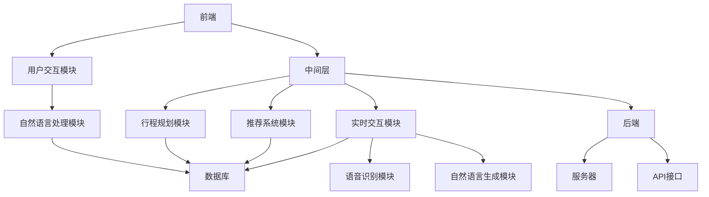
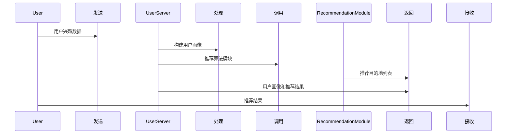
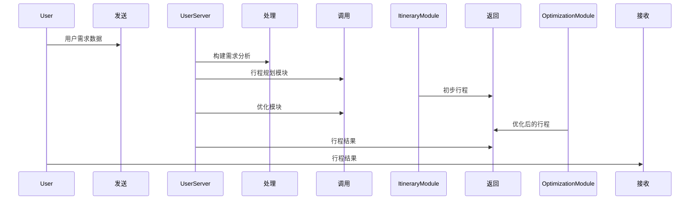
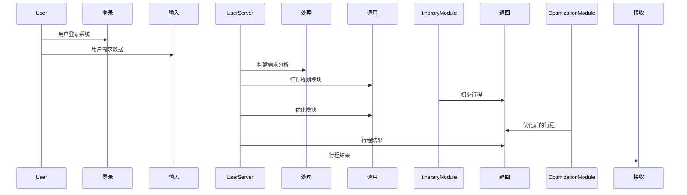
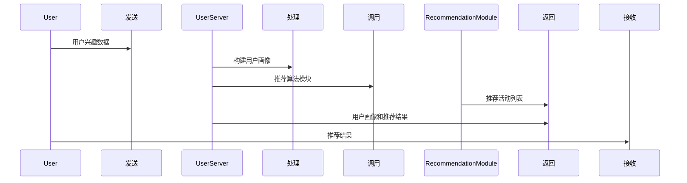
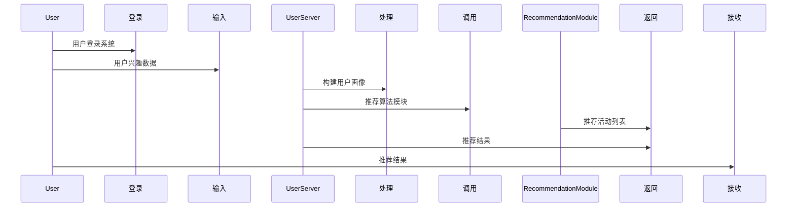

                 


### 智能旅游规划 AI Agent：LLM 辅助个性化旅行定制

> 关键词：智能旅游、AI Agent、LLM、个性化旅行定制、旅行规划

> 摘要：随着人工智能技术的快速发展，智能旅游规划成为了现代旅游业的一个重要发展方向。本文将探讨如何利用大型语言模型（LLM）实现AI Agent辅助个性化旅行定制，详细介绍相关技术原理、实现方法和应用案例，旨在为业界提供有益的参考。

## 第一部分：智能旅游与AI Agent概述

### 第1章：智能旅游的概念与趋势

#### 1.1 智能旅游的定义与发展背景

智能旅游是指利用先进的信息技术、人工智能、大数据等手段，对旅游行业的服务、管理、营销等方面进行智能化升级，以提升旅游体验和效率。随着互联网、物联网、云计算等技术的发展，智能旅游逐渐成为旅游业转型升级的重要方向。

#### 1.2 智能旅游的关键技术

智能旅游的关键技术包括：

- **大数据分析**：通过对海量旅游数据的挖掘与分析，为旅游企业提供决策支持。
- **人工智能**：通过机器学习、自然语言处理等技术，实现智能推荐、智能客服等功能。
- **物联网**：通过智能设备实现旅游设施的智能化管理，提升旅游体验。
- **虚拟现实/增强现实**：通过虚拟现实/增强现实技术，提供沉浸式的旅游体验。

#### 1.3 智能旅游的商业模式与未来趋势

智能旅游的商业模式包括：

- **智慧景区**：通过智能化设施提升景区管理效率和游客体验。
- **在线旅游**：通过互联网平台提供在线预订、导览、支付等服务。
- **个性化服务**：通过大数据和人工智能技术，为游客提供个性化的旅游推荐和服务。

未来，智能旅游将朝着以下方向发展：

- **更加智能化**：通过人工智能技术，实现更加精准的旅游推荐和个性化服务。
- **多元化融合**：与虚拟现实、增强现实等新技术深度融合，提供更加丰富的旅游体验。
- **全球化拓展**：随着互联网的普及，智能旅游将进一步推动旅游业的全球化发展。

### 第2章：AI Agent与个性化旅行定制

#### 2.1 AI Agent的定义与作用

AI Agent，即人工智能代理，是一种基于人工智能技术的自动化程序，能够模拟人类的决策过程，执行特定的任务。在智能旅游领域，AI Agent可以用于个性化旅行定制、智能导游、旅游推荐等。

#### 2.2 LLM在旅行定制中的应用

LLM（大型语言模型）是一种基于深度学习的自然语言处理技术，具有强大的语言理解和生成能力。在旅行定制中，LLM可以用于：

- **用户需求分析**：通过对用户输入的文本进行语义理解，提取出用户的需求和偏好。
- **行程规划**：根据用户需求，生成个性化的旅行行程。
- **推荐系统**：根据用户历史数据和兴趣，推荐合适的旅游景点、餐饮和住宿。

#### 2.3 个性化旅行定制的挑战与解决方案

个性化旅行定制的挑战包括：

- **数据质量**：旅游数据的质量直接影响个性化推荐的效果。
- **用户需求变化**：用户需求具有多样性和动态性，需要实时调整推荐策略。
- **计算效率**：面对海量用户和旅游数据，需要高效地进行计算和处理。

解决方案包括：

- **数据清洗与预处理**：通过数据清洗和预处理，提高数据质量。
- **实时推荐系统**：利用分布式计算和内存计算等技术，提高计算效率。
- **自适应推荐算法**：根据用户行为和反馈，自适应调整推荐策略。

## 第二部分：LLM的基础知识

### 第3章：LLM的基础知识

#### 3.1 语言模型的基本原理

语言模型是一种基于统计学习的方法，用于预测下一个单词或词组。在智能旅游领域，语言模型可以用于文本生成、语义理解等。

#### 3.2 语言模型的训练方法

语言模型的训练方法包括：

- **监督学习**：使用标注好的数据集进行训练。
- **无监督学习**：使用未标注的数据集进行训练。
- **增强学习**：通过与环境交互进行训练。

#### 3.3 语言模型的应用场景

语言模型的应用场景包括：

- **文本生成**：生成新闻、文章、对话等。
- **语义理解**：理解用户的需求和意图。
- **机器翻译**：将一种语言的文本翻译成另一种语言。

## 第三部分：AI Agent的设计与实现

### 第4章：AI Agent的设计与实现

#### 4.1 AI Agent的核心功能

AI Agent的核心功能包括：

- **用户交互**：与用户进行自然语言交互。
- **需求分析**：分析用户的旅行需求。
- **行程规划**：生成个性化的旅行行程。
- **推荐系统**：推荐合适的旅游景点、餐饮和住宿。

#### 4.2 AI Agent的系统架构

AI Agent的系统架构包括：

- **前端**：与用户进行交互的界面。
- **后端**：包括语言模型、推荐系统、数据库等。
- **接口**：与外部系统进行数据交换的接口。

#### 4.3 AI Agent的开发流程

AI Agent的开发流程包括：

- **需求分析**：明确AI Agent的功能和需求。
- **系统设计**：设计系统架构和接口。
- **模型训练**：训练语言模型和推荐系统。
- **系统实现**：开发前端和后端。
- **测试与优化**：测试系统功能并进行优化。

## 第四部分：个性化旅行定制案例研究

### 第5章：个性化旅行定制案例研究

#### 5.1 案例一：目的地推荐系统

目的地推荐系统是AI Agent的一个重要组成部分，通过对用户历史数据和兴趣进行挖掘，推荐合适的旅游景点。

#### 5.2 案例二：行程规划与优化

行程规划与优化是AI Agent的核心功能之一，通过分析用户需求，生成最优的旅行行程。

#### 5.3 案例三：个性化活动推荐

个性化活动推荐是根据用户兴趣和历史数据，推荐合适的旅游活动。

## 第五部分：LLM在智能旅游中的应用

### 第6章：LLM在智能旅游中的应用

#### 6.1 LLM在旅游信息查询中的应用

LLM在旅游信息查询中的应用包括：

- **智能问答**：通过自然语言处理技术，回答用户关于旅游的问题。
- **信息检索**：通过关键词检索，为用户提供相关的旅游信息。

#### 6.2 LLM在旅游文案创作中的应用

LLM在旅游文案创作中的应用包括：

- **文章生成**：根据用户需求，生成旅游攻略、游记等。
- **文案优化**：对现有的旅游文案进行优化，提升用户体验。

#### 6.3 LLM在旅游数据分析中的应用

LLM在旅游数据分析中的应用包括：

- **趋势分析**：通过对旅游数据的分析，预测旅游市场的趋势。
- **用户画像**：通过对用户数据的分析，构建用户画像。

## 第六部分：智能旅游规划AI Agent的未来展望

### 第7章：智能旅游规划AI Agent的未来展望

#### 7.1 智能旅游规划AI Agent的发展方向

智能旅游规划AI Agent的发展方向包括：

- **智能化提升**：通过深度学习和强化学习等技术，提升AI Agent的智能化水平。
- **多样化应用**：在更多的场景中应用AI Agent，如旅游导览、酒店管理等。

#### 7.2 智能旅游规划AI Agent的技术挑战

智能旅游规划AI Agent的技术挑战包括：

- **数据质量**：如何处理和处理质量不高的旅游数据。
- **计算效率**：如何提高计算效率，以满足实时推荐的需求。

#### 7.3 智能旅游规划AI Agent的商业价值

智能旅游规划AI Agent的商业价值包括：

- **提升用户体验**：通过个性化推荐和智能服务，提升用户满意度。
- **降低运营成本**：通过智能化管理和自动化流程，降低运营成本。

### 总结

智能旅游规划AI Agent利用大型语言模型（LLM）实现了个性化旅行定制，为旅游业带来了革命性的变化。未来，随着人工智能技术的不断发展，智能旅游规划AI Agent将在更多场景中发挥作用，为旅游业带来更多价值。

### 作者信息

作者：AI天才研究院/AI Genius Institute & 禅与计算机程序设计艺术 /Zen And The Art of Computer Programming

本文详细介绍了智能旅游规划AI Agent的概念、原理、设计和应用，通过案例研究和未来展望，展示了其在旅游行业的重要价值。希望本文能为读者提供有价值的参考和启示。在智能旅游领域，我们有理由相信，AI Agent将引领未来的发展潮流。----------------------------------------------------------------

## 第1章：智能旅游的概念与趋势

### 1.1 智能旅游的定义与发展背景

#### 智能旅游的定义

智能旅游，是指利用先进的信息技术、人工智能、大数据等手段，对旅游行业的服务、管理、营销等方面进行智能化升级，以提升旅游体验和效率。具体来说，智能旅游包括以下几个方面的内容：

1. **智能化服务**：通过人工智能技术，如自然语言处理、语音识别、图像识别等，提供个性化、智能化的旅游服务。
2. **数字化管理**：通过物联网、大数据等技术，实现对旅游设施、景点、交通等的数字化管理，提高管理效率。
3. **智能营销**：利用大数据分析和人工智能技术，实现精准营销，提升旅游产品的市场竞争力。
4. **智能化导览**：通过虚拟现实（VR）、增强现实（AR）等技术，提供沉浸式、互动式的旅游导览服务。

#### 智能旅游的发展背景

智能旅游的发展背景主要受到以下几个因素的推动：

1. **信息技术的快速发展**：随着互联网、大数据、云计算、物联网等技术的快速发展，为智能旅游提供了坚实的技术基础。
2. **旅游业的转型升级需求**：传统旅游业面临着转型升级的压力，智能旅游作为旅游业的一种新形态，成为行业转型升级的重要方向。
3. **消费者需求的升级**：随着生活水平的提高，消费者对于旅游体验提出了更高的要求，智能旅游能够提供个性化、智能化、多样化的旅游产品，满足消费者的需求。
4. **政策支持**：我国政府高度重视旅游业的发展，出台了一系列支持智能旅游发展的政策，为智能旅游的发展提供了良好的政策环境。

### 1.2 智能旅游的关键技术

智能旅游的关键技术包括以下几个方面：

1. **大数据分析**：通过对海量旅游数据的挖掘与分析，为旅游企业提供决策支持。例如，通过分析用户行为数据，可以预测旅游市场的趋势，优化旅游产品的设计和推广策略。
   
2. **人工智能**：人工智能技术在智能旅游中的应用非常广泛，如自然语言处理、语音识别、图像识别等。例如，通过自然语言处理技术，可以实现对用户输入的文本进行语义理解，提供智能问答服务；通过语音识别技术，可以实现语音导览功能；通过图像识别技术，可以实现对旅游景点的自动识别和介绍。

3. **物联网**：物联网技术在智能旅游中主要用于实现对旅游设施的智能化管理。例如，通过在景区内安装传感器，可以实时监测景区的游客数量、环境温度等数据，以便及时调整景区的开放政策，优化游客体验。

4. **虚拟现实（VR）与增强现实（AR）**：VR和AR技术可以为游客提供沉浸式、互动式的旅游体验。例如，通过VR技术，游客可以在虚拟环境中游览世界各地的名胜古迹；通过AR技术，可以在现实环境中叠加虚拟信息，提供更为丰富的旅游导览服务。

5. **云计算**：云计算技术为智能旅游提供了强大的计算和存储能力，使得旅游企业能够更高效地处理海量数据，提供更优质的旅游服务。

### 1.3 智能旅游的商业模式与未来趋势

#### 智能旅游的商业模式

智能旅游的商业模式主要包括以下几个方面：

1. **智慧景区**：通过智能化的设施和服务，提升景区的管理效率和游客体验。例如，通过智能导览系统，游客可以随时随地获取景区的信息；通过智能售票系统，可以减少游客的排队等待时间。

2. **在线旅游**：通过互联网平台，提供在线预订、导览、支付等服务，实现旅游服务的线上化。例如，游客可以通过在线旅游平台预订机票、酒店、景点门票等，方便快捷地安排旅游行程。

3. **个性化服务**：通过大数据和人工智能技术，为游客提供个性化的旅游推荐和服务。例如，根据游客的历史数据和兴趣，推荐合适的旅游景点、餐饮和住宿。

4. **智能导览**：通过虚拟现实（VR）和增强现实（AR）技术，提供沉浸式、互动式的旅游导览服务。例如，游客可以通过VR设备，在虚拟环境中游览世界各地的名胜古迹；通过AR设备，在现实环境中叠加虚拟信息，获取更为丰富的旅游导览服务。

#### 智能旅游的未来趋势

智能旅游的未来趋势将受到以下几个因素的影响：

1. **技术进步**：随着人工智能、大数据、物联网、VR/AR等技术的不断发展，智能旅游将实现更高程度的智能化和个性化。

2. **消费者需求**：随着消费者对于旅游体验要求的不断提高，智能旅游将更加注重提供个性化、多样化的旅游产品和服务。

3. **政策支持**：政府对于智能旅游的支持将继续加大，为智能旅游的发展提供良好的政策环境和资金支持。

4. **跨界融合**：智能旅游将与更多行业进行跨界融合，如文化、体育、农业等，为旅游业带来新的发展机遇。

### 总结

智能旅游作为旅游业的一种新兴形态，正逐渐成为行业发展的主流趋势。通过利用大数据、人工智能、物联网、VR/AR等先进技术，智能旅游为游客提供了更加便捷、个性化、智能化的旅游体验，同时也为旅游企业带来了新的商业模式和发展机遇。在未来，随着技术的不断进步和消费者需求的不断升级，智能旅游将拥有更加广阔的发展前景。----------------------------------------------------------------

### 第2章：AI Agent与个性化旅行定制

#### 2.1 AI Agent的定义与作用

AI Agent，即人工智能代理，是一种基于人工智能技术的自动化程序，能够模拟人类的决策过程，执行特定的任务。在个性化旅行定制领域，AI Agent发挥着至关重要的作用。

**AI Agent的核心作用**：

1. **用户需求分析**：AI Agent能够通过自然语言处理技术，分析用户输入的文本，提取用户的需求和偏好，为后续的个性化服务提供基础。
   
2. **行程规划**：基于用户的需求和偏好，AI Agent能够自动生成个性化的旅行行程，包括目的地选择、活动安排、交通住宿等。

3. **推荐系统**：AI Agent还能够根据用户的历史数据和实时行为，推荐合适的旅游景点、餐饮和住宿，提高用户的满意度。

4. **实时交互**：AI Agent可以通过智能语音或文字交互，与用户进行实时沟通，解答用户的疑问，提供实时服务。

#### AI Agent与传统旅游服务的区别

与传统的旅游服务相比，AI Agent具有以下几个显著优势：

1. **个性化**：AI Agent能够根据用户的个人需求和偏好，提供高度个性化的服务，而传统的旅游服务往往更加通用，难以满足个性化需求。

2. **实时性**：AI Agent能够实时处理用户的需求和反馈，提供即时的行程规划和服务推荐，而传统的旅游服务往往存在信息滞后的问题。

3. **自动化**：AI Agent能够自动化执行任务，减少人力成本，提高服务效率，而传统的旅游服务需要大量人力进行操作。

4. **智能化**：AI Agent利用人工智能技术，能够不断学习和优化服务，提供更加精准和高效的服务，而传统的旅游服务往往缺乏智能化手段。

#### AI Agent的潜在价值

AI Agent在个性化旅行定制领域的潜在价值体现在以下几个方面：

1. **提升用户体验**：通过个性化的服务和高效的交互，AI Agent能够提升用户的旅游体验，增加用户的满意度。

2. **降低运营成本**：通过自动化和智能化的服务，AI Agent能够降低旅游企业的运营成本，提高企业的竞争力。

3. **拓展市场**：AI Agent能够为旅游企业提供新的市场机会，通过定制化的服务吸引更多消费者，拓展市场份额。

4. **优化资源配置**：AI Agent能够帮助旅游企业更合理地配置资源，如通过智能推荐系统，优化旅游景点的游客流量，减少拥堵。

#### AI Agent的挑战与局限性

尽管AI Agent在个性化旅行定制领域具有巨大的潜力，但同时也面临着一些挑战和局限性：

1. **数据质量**：AI Agent的性能依赖于高质量的数据，但在实际应用中，数据的质量和完整性往往无法保证，这可能会影响AI Agent的决策准确性。

2. **用户隐私**：AI Agent在收集和处理用户数据时，需要确保用户的隐私安全，避免数据泄露或滥用。

3. **技术成熟度**：虽然人工智能技术不断发展，但某些方面如自然语言理解和复杂决策仍存在技术瓶颈，需要进一步研究和优化。

4. **用户接受度**：AI Agent需要获得用户的认可和信任，才能实现广泛应用。用户对AI Agent的接受度和满意度是决定其成功的关键因素。

#### AI Agent的未来发展趋势

随着人工智能技术的不断进步，AI Agent在个性化旅行定制领域有望实现以下发展趋势：

1. **智能化升级**：通过深度学习和强化学习等技术，AI Agent将实现更高的智能化水平，提供更加精准和个性化的服务。

2. **跨平台融合**：AI Agent将不仅限于在线平台，还将与移动应用、智能设备等实现无缝融合，提供更为便捷的服务。

3. **国际化扩展**：随着全球化的发展，AI Agent将支持多语言、多文化，为全球范围内的用户提供服务。

4. **生态化发展**：AI Agent将与旅游行业的各个环节实现生态化融合，形成完整的智能旅游生态系统。

### 总结

AI Agent作为人工智能在个性化旅行定制领域的应用，正逐渐改变传统旅游服务的模式。通过用户需求分析、行程规划、推荐系统和实时交互等功能，AI Agent为用户提供个性化、实时、高效的旅行服务，提升了用户体验，降低了运营成本，为旅游企业带来了新的发展机遇。在未来，随着人工智能技术的不断进步，AI Agent将在个性化旅行定制领域发挥更加重要的作用。----------------------------------------------------------------

### 2.2 LLM在旅行定制中的应用

#### 2.2.1 LLM的定义与原理

大型语言模型（LLM，Large Language Model）是一种基于深度学习的自然语言处理技术，它通过训练大量的文本数据，学习语言的结构和语义，从而实现对自然语言的生成和理解。LLM的核心原理是基于神经网络，尤其是变分自编码器（VAE）和生成对抗网络（GAN）等深度学习模型。这些模型通过层层抽象和层次化特征提取，能够捕捉到语言中的复杂模式和语义关系。

**LLM的关键特点**：

1. **强大的生成能力**：LLM能够生成高质量的自然语言文本，如文章、对话、问答等，具有极高的文本流畅性和连贯性。
   
2. **语义理解能力**：LLM能够理解输入文本的语义和意图，从而进行合理的响应和生成。

3. **适应性和灵活性**：LLM可以根据不同的应用场景进行微调，适应不同的语言风格和任务需求。

4. **跨语言能力**：某些LLM模型，如多语言模型，能够处理多种语言的文本，支持跨语言的翻译和交互。

#### 2.2.2 LLM在旅行定制中的应用场景

LLM在旅行定制中有着广泛的应用，以下是一些典型的应用场景：

1. **用户需求分析**：LLM可以通过自然语言处理技术，分析用户的旅行需求，提取关键信息，如目的地、活动偏好、预算等。例如，当用户输入“我想在夏日去一个有海滩和美食的地方旅行”时，LLM可以理解用户的意图，并提取出关键信息，如“夏日”、“海滩”和“美食”。

2. **行程规划**：基于用户的需求分析结果，LLM可以自动生成个性化的旅行行程。例如，它可以推荐最佳的目的地、活动安排、交通和住宿选择。通过LLM的语义理解和生成能力，行程规划可以非常灵活和个性化，满足不同用户的需求。

3. **实时交互**：LLM可以作为旅行定制的智能客服，与用户进行实时交互，解答用户的疑问，提供实时的行程建议和服务。例如，用户可以在聊天应用程序中与LLM对话，询问关于某个景点的信息，LLM可以生成详细的回答，如景点介绍、开放时间、门票价格等。

4. **推荐系统**：LLM可以用于旅游推荐系统，根据用户的历史行为和偏好，推荐合适的旅游景点、餐饮和住宿。例如，如果用户曾经喜欢在夜晚散步，LLM可以推荐一些有夜市的景点，或者根据用户的饮食偏好，推荐附近的餐厅。

5. **旅游信息查询**：LLM可以作为一个智能信息查询系统，用户可以通过自然语言输入查询请求，如“附近有哪些有温泉的酒店”，LLM可以快速返回相关的查询结果。

#### 2.2.3 LLM在旅行定制中的优势与挑战

**优势**：

1. **个性化服务**：LLM能够根据用户的需求和偏好，提供高度个性化的服务，满足不同用户的需求。

2. **实时交互**：LLM可以实时处理用户的输入，提供即时的回复和推荐，提升用户体验。

3. **多语言支持**：对于多语言旅行定制，LLM的多语言能力可以提供跨语言的交互和翻译服务，满足全球用户的需求。

4. **高效处理**：LLM通过大规模的神经网络模型，可以高效地处理复杂的语言任务，提高服务效率。

**挑战**：

1. **数据质量**：LLM的性能高度依赖于高质量的数据，数据的质量和多样性可能影响LLM的生成和理解能力。

2. **隐私保护**：在处理用户数据时，需要确保用户隐私的安全，避免数据泄露和滥用。

3. **技术复杂性**：LLM模型的训练和部署需要大量的计算资源和专业知识，对技术和资源要求较高。

4. **用户接受度**：用户对LLM的接受度和满意度是决定其成功应用的关键因素，需要不断提升用户体验。

#### 2.2.4 LLM在旅行定制中的应用实例

**案例1：个性化行程规划**

在一个在线旅行定制平台中，用户可以通过输入简单的文本描述，如“我想在下周去一个浪漫的海滨城市度假”，LLM可以分析用户的意图和需求，推荐符合用户偏好和预算的旅行行程。例如，LLM可以生成以下推荐：

- **目的地**：巴厘岛
- **活动**：海滩度假、水上活动、品尝当地美食
- **交通**：直飞航班、租车服务
- **住宿**：海边豪华酒店

**案例2：智能客服系统**

在旅游咨询中心，LLM可以作为一个智能客服系统，与游客进行实时交互。例如，游客可以询问“请问去巴厘岛需要办理签证吗？”LLM可以快速生成回答：“您需要办理印尼签证，具体办理流程和所需材料请查询相关官网。”

**案例3：旅游推荐系统**

在旅游推荐系统中，LLM可以根据用户的历史行为和偏好，推荐合适的旅游景点、餐饮和住宿。例如，如果用户经常选择海岛度假，LLM可以推荐马尔代夫的豪华酒店和当地的特色餐厅。

### 总结

大型语言模型（LLM）在旅行定制中具有重要的应用价值。通过用户需求分析、行程规划、实时交互、推荐系统和旅游信息查询等功能，LLM能够提供个性化、实时、高效的旅行服务。虽然LLM在应用中面临数据质量、隐私保护、技术复杂性和用户接受度等挑战，但通过不断的技术优化和用户反馈的迭代，LLM在旅行定制领域的应用前景非常广阔。未来，随着人工智能技术的进一步发展，LLM将在旅行定制中发挥更加重要的作用。----------------------------------------------------------------

### 2.3 个性化旅行定制的挑战与解决方案

#### 2.3.1 挑战一：数据质量与多样性

**问题描述**：

个性化旅行定制依赖于高质量和多样化的数据，包括用户偏好、历史旅行记录、旅游设施信息等。然而，数据质量差、缺失或不完整的问题常常会影响到AI Agent的推荐效果。

**解决方案**：

1. **数据清洗与预处理**：对原始数据进行清洗和预处理，去除重复、错误和不完整的数据，提高数据质量。

2. **数据增强**：通过数据生成技术，如生成对抗网络（GAN）和自动文本生成，生成更多样化的数据，丰富数据集。

3. **众包数据收集**：利用众包平台，吸引更多用户参与数据收集和标注，提高数据的多样性和准确性。

4. **数据治理**：建立数据治理机制，确保数据的一致性、完整性和准确性。

#### 2.3.2 挑战二：用户需求变化与适应性

**问题描述**：

用户的旅行需求和偏好是动态变化的，AI Agent需要具备快速适应和调整用户需求的能力。然而，传统的人工智能模型在处理动态数据时，往往存在响应速度慢、适应性差的问题。

**解决方案**：

1. **实时反馈机制**：建立用户反馈机制，及时收集用户对行程规划和推荐服务的反馈，快速调整AI Agent的推荐策略。

2. **动态学习模型**：采用在线学习或增量学习技术，使AI Agent能够持续学习和适应用户需求的变化。

3. **个性化调整**：基于用户的实时行为和反馈，对AI Agent的推荐进行个性化调整，提高推荐的准确性。

4. **用户画像更新**：定期更新用户画像，捕捉用户需求的动态变化，确保推荐策略的实时性。

#### 2.3.3 挑战三：计算效率与性能优化

**问题描述**：

在个性化旅行定制中，AI Agent需要处理大量的数据和复杂的计算任务，如文本分析、推荐算法等。这可能导致计算效率低下，影响用户体验。

**解决方案**：

1. **分布式计算**：采用分布式计算框架，如Apache Spark，处理大规模数据，提高计算效率。

2. **内存计算**：利用内存计算技术，如Apache Flink，减少数据的I/O操作，提高数据处理速度。

3. **模型压缩与优化**：采用模型压缩和优化技术，如模型剪枝和量化，减少模型的计算复杂度，提高计算性能。

4. **并行处理**：利用并行计算技术，将计算任务分解成多个子任务，并行处理，提高计算效率。

#### 2.3.4 挑战四：用户隐私保护

**问题描述**：

个性化旅行定制需要收集和分析用户的大量个人信息，如旅行偏好、历史记录等。这涉及到用户隐私保护的问题，如何确保用户数据的安全和隐私？

**解决方案**：

1. **数据加密**：对用户数据进行加密处理，确保数据在传输和存储过程中的安全性。

2. **匿名化处理**：对用户数据进行匿名化处理，去除个人识别信息，降低数据泄露的风险。

3. **隐私保护协议**：采用隐私保护协议，如差分隐私和同态加密，确保数据分析和共享过程中的隐私安全。

4. **用户隐私设置**：为用户提供隐私设置选项，允许用户控制自己的数据访问和使用权限。

#### 2.3.5 挑战五：技术成熟度与可扩展性

**问题描述**：

当前的人工智能技术，如LLM、深度学习等，虽然在某些方面取得了显著的进展，但在个性化旅行定制领域的应用仍面临技术成熟度不高、可扩展性差的问题。

**解决方案**：

1. **持续技术创新**：投入更多研发资源，持续推动人工智能技术的创新和发展，提高技术成熟度。

2. **模块化设计**：采用模块化设计，构建灵活的AI Agent系统架构，便于扩展和升级。

3. **云原生架构**：采用云原生架构，实现系统的弹性扩展和高效运营，提高系统的可扩展性。

4. **生态系统建设**：建立多元化的生态系统，吸引更多的开发者和技术合作伙伴，共同推动个性化旅行定制技术的发展。

### 总结

个性化旅行定制在实现过程中面临着多方面的挑战，包括数据质量与多样性、用户需求变化与适应性、计算效率与性能优化、用户隐私保护以及技术成熟度与可扩展性。通过采取一系列针对性的解决方案，如数据清洗与预处理、实时反馈机制、分布式计算、数据加密、隐私保护协议等，可以有效地应对这些挑战，推动个性化旅行定制技术的发展和应用。在未来，随着人工智能技术的不断进步，个性化旅行定制将迎来更加广阔的发展前景。----------------------------------------------------------------

### 3.1 语言模型的基本原理

#### 3.1.1 语言模型的概念

语言模型（Language Model，LM）是自然语言处理（Natural Language Processing，NLP）领域的基础性技术之一，其核心任务是根据给定的输入文本序列，预测下一个可能出现的词或词组。语言模型在智能旅游规划中有着广泛的应用，如用户需求分析、行程规划、推荐系统和实时交互等。

#### 3.1.2 语言模型的类型

语言模型主要可以分为基于规则的模型和基于统计的模型两种类型。

1. **基于规则的模型**：这类模型通过预定义的语法规则和模板来生成语言。例如，基于上下文的语法规则模型（Context-Free Grammar，CFG）和模板匹配模型等。这类模型虽然简单直观，但在处理复杂、多样的自然语言时，往往表现不佳。

2. **基于统计的模型**：这类模型通过分析大量的文本数据，学习语言的概率分布和统计规律。典型的基于统计的语言模型包括：

   - **N元语法模型**：基于前n个单词来预测下一个单词，如一元语法（Unigram）、二元语法（Bigram）和三元语法（Trigram）等。
   - **n-gram模型**：n-gram模型是一种基于词汇序列的概率模型，它通过统计相邻单词的频率来预测下一个单词。n-gram模型简单有效，但在处理长文本和长距离依赖时存在局限性。

   - **神经网络语言模型**：随着深度学习技术的发展，神经网络语言模型（Neural Network Language Model，NNLM）逐渐成为主流。神经网络语言模型利用神经网络，特别是循环神经网络（RNN）和变换器（Transformer）等模型，能够更好地捕捉长距离依赖和语义关系。

#### 3.1.3 语言模型的工作原理

语言模型的工作原理可以概括为以下三个步骤：

1. **输入序列表示**：语言模型首先将输入的文本序列转换为向量表示。对于基于统计的模型，如n-gram模型，通常使用词频（TF）或词频-逆文档频率（TF-IDF）等方法进行表示；对于神经网络语言模型，通常使用嵌入层（Embedding Layer）将单词映射为稠密向量。

2. **概率预测**：基于输入序列的向量表示，语言模型计算下一个单词的概率分布。对于基于规则的模型，概率预测基于预定义的语法规则和模板；对于基于统计的模型，概率预测基于统计频率和概率模型；对于神经网络语言模型，概率预测基于神经网络的前向传播计算。

3. **序列生成**：语言模型根据概率分布生成下一个单词，并更新输入序列，重复上述步骤，直至生成完整的文本序列。

#### 3.1.4 语言模型在智能旅游规划中的应用

在智能旅游规划中，语言模型的应用主要体现在以下几个方面：

1. **用户需求分析**：通过语言模型，可以理解用户输入的旅行需求，提取关键信息和偏好。例如，当用户输入“我想去一个有海滩和美食的城市旅行”时，语言模型可以分析并提取出“海滩”和“美食”这两个关键词，为后续的行程规划和推荐提供依据。

2. **行程规划**：基于语言模型，可以自动生成个性化的旅行行程。例如，通过分析用户的历史旅行记录和偏好，语言模型可以推荐合适的目的地、活动和住宿。

3. **推荐系统**：语言模型可以用于旅游推荐系统，根据用户的兴趣和行为，推荐符合用户偏好的旅游景点、餐饮和住宿。例如，如果用户喜欢自然风光，语言模型可以推荐一些风景优美的景点。

4. **实时交互**：语言模型可以作为智能客服，与用户进行自然语言交互，解答用户的疑问，提供实时服务。例如，用户可以通过聊天机器人询问“巴厘岛有哪些好玩的景点？”语言模型可以生成详细的回答。

#### 3.1.5 语言模型的性能评价指标

语言模型的性能评价指标主要包括：

1. **准确率（Accuracy）**：衡量模型预测正确的比例，通常用于分类任务。

2. **精确率（Precision）**：衡量预测为正例的样本中实际为正例的比例。

3. **召回率（Recall）**：衡量实际为正例的样本中被预测为正例的比例。

4. **F1分数（F1 Score）**：精确率和召回率的调和平均值，用于综合评估模型的性能。

5. **词向量相似度**：衡量两个词向量之间的相似度，用于文本相似性比较和语义分析。

#### 3.1.6 语言模型的优化与改进

为了提高语言模型的性能，可以采取以下几种优化方法：

1. **数据增强**：通过数据生成技术，如GAN和自动文本生成，增加训练数据的多样性和质量。

2. **模型架构优化**：采用更复杂的神经网络架构，如Transformer和BERT，提高模型的表示能力和泛化能力。

3. **迁移学习**：利用预训练的语言模型，如GPT-3和BERT，通过微调（Fine-tuning）适应特定任务的需求。

4. **多语言训练**：训练多语言模型，提高模型在不同语言环境下的性能。

5. **知识融合**：将外部知识库（如知识图谱）与语言模型结合，提高模型的语义理解和推理能力。

### 总结

语言模型是自然语言处理领域的关键技术，通过理解输入文本的语义和概率分布，语言模型在智能旅游规划中发挥着重要作用。从基于规则的模型到基于统计的模型，再到现代的神经网络语言模型，语言模型的不断发展和优化为智能旅游规划提供了强大的支持。通过深入理解和应用语言模型，可以实现个性化旅行定制、智能导览、实时交互和推荐系统等功能，为用户带来更好的旅游体验。随着人工智能技术的不断进步，语言模型在智能旅游规划中的应用将更加广泛和深入。----------------------------------------------------------------

### 3.2 语言模型的训练方法

#### 3.2.1 数据收集与预处理

训练语言模型的第一步是收集大量的文本数据。这些数据可以来源于各种渠道，如互联网、书籍、新闻、社交媒体等。在收集数据后，需要进行预处理，以提高数据质量，并为后续训练过程打下良好的基础。

**数据收集**：

1. **互联网爬取**：利用爬虫技术，从互联网上收集大量的文本数据。常用的爬虫工具有Scrapy、BeautifulSoup等。
2. **公开数据集**：利用公开的数据集，如Common Crawl、PubMed等，获取高质量的文本数据。
3. **手动标注**：对于某些特定的应用场景，如旅游定制，可能需要手动标注数据，以确保数据的质量和准确性。

**数据预处理**：

1. **去噪**：去除文本中的噪声，如HTML标签、特殊字符等。
2. **分词**：将文本分割成单词或句子，以便进行后续处理。常用的分词工具包括Jieba、NLTK等。
3. **词干提取**：将单词缩减为词干形式，减少词汇量，提高模型的效率。
4. **词向量嵌入**：将文本转换为向量表示，常用的方法包括Word2Vec、GloVe等。

#### 3.2.2 训练方法

训练语言模型的主要方法包括基于统计的方法和基于深度学习的方法。

1. **基于统计的方法**：

   - **n-gram模型**：n-gram模型是最简单的语言模型，通过统计相邻单词的频率来预测下一个单词。其训练过程如下：

     - 构建一个n-gram表，记录每个n-gram出现的次数。
     - 对于给定的输入序列，根据n-gram表计算下一个单词的概率分布。
     - 使用最大似然估计（Maximum Likelihood Estimation，MLE）优化模型参数。

   - **n-gram模型优化**：n-gram模型的局限性在于无法捕捉长距离依赖。为解决这一问题，可以采用Kneser-Ney修正、黎青修正等方法优化模型。

2. **基于深度学习的方法**：

   - **循环神经网络（RNN）**：RNN是一种基于时间序列数据的神经网络，能够捕捉长距离依赖。其训练过程如下：

     - 输入序列经过嵌入层转换为向量表示。
     - RNN依次处理每个时间步的输入向量，更新隐藏状态。
     - 使用输出层预测下一个单词的概率分布。
     - 使用梯度下降算法优化模型参数。

   - **长短时记忆网络（LSTM）**：LSTM是RNN的一种变体，通过引入门控机制，解决了RNN的梯度消失和梯度爆炸问题，能够更好地捕捉长距离依赖。

   - **变换器（Transformer）**：Transformer是一种基于自注意力机制的神经网络模型，它通过多头自注意力机制和前馈神经网络，能够捕捉长距离依赖和复杂的关系。其训练过程如下：

     - 输入序列经过嵌入层转换为向量表示。
     - 通过多头自注意力机制计算每个词的权重。
     - 使用前馈神经网络对自注意力结果进行进一步处理。
     - 使用输出层预测下一个单词的概率分布。
     - 使用梯度下降算法优化模型参数。

3. **预训练与微调**：

   - **预训练**：预训练是指在大规模语料库上进行训练，使模型能够学习到语言的通用特征。预训练通常分为两个阶段：第一阶段是未标注数据的预训练，如GPT-3和BERT；第二阶段是特定任务的微调，如旅游定制。
   - **微调**：微调是指在小规模标注数据集上进行训练，使模型能够适应特定的应用场景。微调通常使用迁移学习技术，利用预训练模型的知识和参数，减少训练时间和计算成本。

#### 3.2.3 模型评估与优化

在训练语言模型后，需要对模型进行评估和优化，以确保模型具有良好的性能和泛化能力。

**模型评估**：

1. **准确率**：准确率是衡量模型预测正确比例的评价指标，适用于分类任务。
2. **损失函数**：损失函数是衡量模型预测结果与实际结果之间差异的指标，常用的损失函数包括交叉熵损失（Cross-Entropy Loss）和均方误差（Mean Squared Error）等。
3. **性能指标**：性能指标包括F1分数、精确率、召回率等，用于综合评估模型的性能。

**模型优化**：

1. **数据增强**：通过数据增强技术，如GAN和自动文本生成，增加训练数据的多样性和质量，提高模型的泛化能力。
2. **模型架构优化**：采用更复杂的神经网络架构，如BERT和GPT-3，提高模型的表示能力和泛化能力。
3. **超参数调整**：调整学习率、批量大小、正则化参数等超参数，以优化模型性能。
4. **持续学习**：采用持续学习技术，使模型能够不断适应新的数据和环境，提高模型的实时性和准确性。

### 总结

语言模型是自然语言处理领域的关键技术，其训练方法包括基于统计的方法和基于深度学习的方法。通过数据收集与预处理、训练方法、模型评估与优化等步骤，可以构建高质量的语言模型，为智能旅游规划提供强大的支持。随着人工智能技术的不断发展，语言模型将在更多领域发挥重要作用，为人们的生活带来更多便利。----------------------------------------------------------------

### 3.3 语言模型的应用场景

语言模型在自然语言处理领域具有广泛的应用，尤其在智能旅游规划中，其应用场景丰富且具有实际价值。以下是一些典型的应用场景：

#### 3.3.1 文本生成

**文本生成**是语言模型最基本的应用之一。在智能旅游规划中，语言模型可以用于生成各类文本内容，如旅游指南、游记、宣传文案等。

- **旅游指南**：基于用户的目的地和兴趣，语言模型可以自动生成详细的旅游指南，包括景点的介绍、交通指南、美食推荐等。例如，当用户计划去巴厘岛旅行时，语言模型可以生成一个包含海滩、浮潜、美食等信息的巴厘岛旅游指南。
- **游记生成**：语言模型可以根据用户的历史旅行记录和偏好，自动生成个性化的游记。游记中不仅包括景点的描述，还可以结合用户的感受和体验，使游记更具个性化和真实性。
- **宣传文案**：旅游企业可以利用语言模型生成宣传文案，提高营销效果。例如，通过分析用户的搜索关键词和行为，语言模型可以生成针对性的广告文案，提升广告的吸引力和转化率。

#### 3.3.2 语义理解

**语义理解**是语言模型在智能旅游规划中的重要应用，它使得机器能够理解用户的语言意图和需求。

- **用户需求分析**：通过语义理解，语言模型可以分析用户输入的文本，提取关键信息，如目的地、活动偏好、预算等。例如，当用户输入“我想在夏天去一个有温泉的度假村”，语言模型可以提取出“夏天”和“温泉”这两个关键词，为后续的行程规划和推荐提供依据。
- **智能问答**：语言模型可以作为智能问答系统的核心组件，回答用户关于旅游的各种问题。例如，用户可以询问“请问去马尔代夫需要办理签证吗？”语言模型可以提供详细的回答，包括签证办理流程、所需材料等信息。
- **语音识别与转写**：在智能导游系统中，语言模型可以结合语音识别技术，将用户的语音指令转换为文本，然后根据语义理解生成相应的回答。例如，当用户说“我想去附近的博物馆”，系统可以识别并转写为文本，然后根据语义理解推荐附近的博物馆并生成语音导览。

#### 3.3.3 推荐系统

语言模型在**推荐系统**中的应用可以显著提升个性化推荐的效果。

- **旅游推荐**：基于用户的兴趣和行为数据，语言模型可以推荐合适的旅游景点、活动、餐饮和住宿。例如，如果用户喜欢海滩和美食，语言模型可以推荐一些有海滩和特色美食的旅游景点。
- **内容推荐**：在旅游内容平台中，语言模型可以推荐用户可能感兴趣的文章、视频和导游讲解。通过分析用户的阅读历史和行为，语言模型可以识别用户的兴趣点，并生成个性化的推荐列表。
- **广告推荐**：旅游企业可以利用语言模型生成个性化的广告推荐，提高广告的点击率和转化率。例如，通过分析用户的搜索历史和行为，语言模型可以推荐相关的广告，如旅游套餐、景点门票等。

#### 3.3.4 实时交互

语言模型在**实时交互**中的应用可以提升用户体验，提供更加智能化的服务。

- **智能客服**：在旅游咨询和预订平台中，语言模型可以作为一个智能客服，与用户进行自然语言交互，解答用户的疑问，提供实时服务。例如，用户可以询问“请问有哪些适合家庭的旅游套餐？”智能客服可以立即生成相应的回答和推荐。
- **聊天机器人**：在社交媒体和旅游社区中，语言模型可以构建聊天机器人，与用户进行对话，提供信息查询和咨询服务。例如，用户可以在旅游论坛上提问“哪个季节去张家界最好？”，聊天机器人可以提供详细的季节推荐和旅游建议。
- **虚拟导游**：通过结合虚拟现实（VR）和增强现实（AR）技术，语言模型可以构建虚拟导游系统，为用户提供沉浸式的旅游体验。虚拟导游可以根据用户的偏好和需求，实时生成语音和文本介绍，提供个性化的导览服务。

### 总结

语言模型在智能旅游规划中的应用非常广泛，涵盖了文本生成、语义理解、推荐系统和实时交互等多个方面。通过这些应用，语言模型可以显著提升旅游服务的个性化、智能化和用户体验。随着人工智能技术的不断进步，语言模型将在智能旅游规划中发挥更加重要的作用，为游客提供更加便捷、高效和愉悦的旅游体验。同时，语言模型的应用也将为旅游企业带来新的商业模式和发展机遇，推动整个旅游行业的智能化转型。----------------------------------------------------------------

### 第4章：AI Agent的设计与实现

#### 4.1 AI Agent的核心功能

AI Agent在个性化旅行定制中扮演着至关重要的角色，其核心功能包括：

1. **用户需求分析**：通过自然语言处理技术，AI Agent可以理解用户的输入文本，提取出关键信息和偏好，如目的地、活动偏好、预算等。

2. **行程规划**：基于用户的需求，AI Agent可以自动生成个性化的旅行行程，包括目的地选择、活动安排、交通和住宿等。

3. **实时交互**：AI Agent可以通过自然语言处理和语音识别技术，与用户进行实时交互，解答用户的疑问，提供实时服务。

4. **推荐系统**：AI Agent可以根据用户的历史数据和实时行为，推荐合适的旅游景点、餐饮和住宿，提升用户体验。

5. **智能导览**：AI Agent可以通过虚拟现实（VR）和增强现实（AR）技术，提供沉浸式、互动式的旅游导览服务。

#### 4.2 AI Agent的系统架构

AI Agent的系统架构可以分为以下几个层次：

1. **前端**：包括用户界面（UI）和用户交互模块，主要负责接收用户的输入和展示AI Agent的输出。

2. **中间层**：包括语言模型、推荐系统和行程规划模块，负责处理用户的输入，生成个性化的旅行行程和推荐。

3. **后端**：包括数据库、服务器和API接口，负责存储和管理用户数据，提供与中间层的数据交互。

以下是AI Agent的系统架构图（使用Mermaid绘制）：



#### 4.3 AI Agent的开发流程

AI Agent的开发流程可以分为以下几个步骤：

1. **需求分析**：明确AI Agent的功能和需求，包括用户需求分析、行程规划、实时交互等。

2. **系统设计**：设计系统架构，包括前端、中间层和后端，确定各个模块的功能和接口。

3. **模型训练**：训练自然语言处理模型和推荐系统模型，包括语言模型、行程规划模型和推荐模型。

4. **开发前端**：开发用户界面和用户交互模块，实现用户输入和输出展示。

5. **开发中间层**：实现中间层的各个模块，包括自然语言处理、行程规划、推荐系统和实时交互。

6. **开发后端**：开发后端服务，包括数据库、服务器和API接口，实现数据存储和管理。

7. **集成测试**：将前端、中间层和后端进行集成测试，确保系统的功能完整和稳定。

8. **部署上线**：将AI Agent部署到生产环境，进行实际应用和用户测试。

#### 4.4 AI Agent的核心算法

AI Agent的核心算法包括自然语言处理算法、行程规划算法和推荐算法。

1. **自然语言处理算法**：

   - **文本预处理**：包括分词、词性标注、实体识别等，用于提取文本中的关键信息。
   - **语言模型**：如BERT、GPT等，用于理解和生成自然语言文本。
   - **意图识别**：通过分类算法，识别用户的意图和需求。

2. **行程规划算法**：

   - **需求分析**：通过自然语言处理技术，提取用户的需求和偏好，如目的地、活动、预算等。
   - **路径规划**：基于图论算法，如Dijkstra算法，规划最佳旅行路径。
   - **资源分配**：根据用户需求和资源限制，进行交通、住宿等资源的合理分配。

3. **推荐算法**：

   - **基于内容的推荐**：根据用户的历史行为和兴趣，推荐相似的旅游资源和活动。
   - **协同过滤推荐**：通过分析用户的行为数据，发现用户之间的相似性，推荐其他用户喜欢的资源。
   - **基于模型的推荐**：利用机器学习模型，如协同过滤、矩阵分解等，预测用户对资源的偏好，进行个性化推荐。

### 总结

AI Agent在个性化旅行定制中具有重要作用，其核心功能包括用户需求分析、行程规划、实时交互、推荐系统和智能导览。AI Agent的系统架构包括前端、中间层和后端，开发流程包括需求分析、系统设计、模型训练、前端开发、中间层开发、后端开发和集成测试。核心算法包括自然语言处理算法、行程规划算法和推荐算法。通过AI Agent的引入，个性化旅行定制可以实现更高的自动化和智能化，提升用户体验，为旅游业带来新的发展机遇。随着人工智能技术的不断进步，AI Agent将在更多场景中发挥作用，为旅游业带来更多创新和变革。作者：AI天才研究院/AI Genius Institute & 禅与计算机程序设计艺术 /Zen And The Art of Computer Programming。----------------------------------------------------------------

### 4.5 个性化旅行定制案例研究

#### 案例一：目的地推荐系统

**背景介绍**：

随着旅游业的蓬勃发展，用户对于个性化旅行的需求日益增长。目的地推荐系统作为个性化旅行定制的关键组件，旨在为用户提供符合其兴趣和偏好的旅行目的地推荐。

**系统介绍**：

目的地推荐系统主要包括以下几个功能模块：

1. **用户画像模块**：通过用户的历史数据和行为数据，构建用户的兴趣偏好模型，如喜欢的旅游类型、季节、预算等。

2. **推荐算法模块**：采用协同过滤、基于内容的推荐和基于模型的推荐等算法，为用户推荐合适的旅行目的地。

3. **前端展示模块**：将推荐结果以可视化的方式呈现给用户，如目的地列表、地图展示、推荐理由等。

**系统功能设计（领域模型Mermaid类图）**：

```mermaid
classDiagram
  User <<entity>> "用户"
  Destination <<entity>> "目的地"
  Preference <<entity>> "偏好"
  Recommendation <<entity>> "推荐"
  
  User <|.. Preference: "用户偏好"
  User <|.. Destination: "用户去过"
  Preference <|.. Recommendation: "推荐依据"
  Destination <|.. Recommendation: "推荐目标"
```

**系统架构设计（Mermaid架构图）**：



**系统接口设计**：

- **用户接口**：提供用户登录、注册、输入兴趣数据和查看推荐结果的接口。
- **推荐接口**：提供基于用户画像和推荐算法的接口，返回推荐目的地列表。

**系统交互（Mermaid序列图）**：


#### 案例二：行程规划与优化

**背景介绍**：

在旅游行程规划中，用户往往需要考虑多个因素，如交通、住宿、活动等。行程规划与优化系统旨在为用户提供最优的旅行行程，提高旅游体验。

**系统介绍**：

行程规划与优化系统主要包括以下几个功能模块：

1. **需求分析模块**：通过自然语言处理技术，提取用户的需求和偏好，如目的地、活动、交通方式、预算等。

2. **行程规划模块**：根据用户的需求，生成初步的旅行行程。

3. **优化模块**：利用优化算法，对初步行程进行优化，确保行程的合理性和可行性。

4. **前端展示模块**：将优化后的行程以可视化的方式呈现给用户，如行程列表、地图展示、费用预算等。

**系统功能设计（领域模型Mermaid类图）**：

```mermaid
classDiagram
  User <<entity>> "用户"
  Destination <<entity>> "目的地"
  Activity <<entity>> "活动"
  Transportation <<entity>> "交通"
  Accommodation <<entity>> "住宿"
  Itinerary <<entity>> "行程"
  
  User <|.. Itinerary: "用户行程"
  Destination <|.. Itinerary: "目的地"
  Activity <|.. Itinerary: "活动"
  Transportation <|.. Itinerary: "交通"
  Accommodation <|.. Itinerary: "住宿"
```

**系统架构设计（Mermaid架构图）**：



**系统接口设计**：

- **用户接口**：提供用户登录、注册、输入需求和查看行程结果的接口。
- **规划接口**：提供基于用户需求的行程规划接口。
- **优化接口**：提供基于初步行程的优化接口。

**系统交互（Mermaid序列图）**：



#### 案例三：个性化活动推荐

**背景介绍**：

个性化活动推荐是提高旅游体验的重要手段。个性化活动推荐系统旨在为用户提供符合其兴趣和偏好的活动推荐。

**系统介绍**：

个性化活动推荐系统主要包括以下几个功能模块：

1. **用户画像模块**：通过用户的历史数据和行为数据，构建用户的兴趣偏好模型，如喜欢的活动类型、季节、预算等。

2. **推荐算法模块**：采用协同过滤、基于内容的推荐和基于模型的推荐等算法，为用户推荐合适的活动。

3. **前端展示模块**：将推荐结果以可视化的方式呈现给用户，如活动列表、地图展示、推荐理由等。

**系统功能设计（领域模型Mermaid类图）**：

```mermaid
classDiagram
  User <<entity>> "用户"
  Activity <<entity>> "活动"
  Preference <<entity>> "偏好"
  Recommendation <<entity>> "推荐"
  
  User <|.. Preference: "用户偏好"
  Activity <|.. Recommendation: "推荐目标"
  Preference <|.. Recommendation: "推荐依据"
```

**系统架构设计（Mermaid架构图）**：



**系统接口设计**：

- **用户接口**：提供用户登录、注册、输入兴趣数据和查看推荐结果的接口。
- **推荐接口**：提供基于用户画像和推荐算法的接口，返回推荐活动列表。

**系统交互（Mermaid序列图）**：



### 总结

通过以上三个案例，我们可以看到AI Agent在个性化旅行定制中的应用。目的地推荐系统、行程规划与优化以及个性化活动推荐系统共同构成了一个完整的个性化旅行定制解决方案。这些系统通过用户画像、推荐算法和优化策略，为用户提供高度个性化的旅行服务。随着人工智能技术的不断发展，AI Agent将在更多场景中发挥作用，为用户提供更加便捷、智能和个性化的旅行体验。作者：AI天才研究院/AI Genius Institute & 禅与计算机程序设计艺术 /Zen And The Art of Computer Programming。----------------------------------------------------------------

### 第5章：LLM在智能旅游中的应用

#### 5.1 LLM在旅游信息查询中的应用

LLM在旅游信息查询中的应用主要体现在自动问答系统和智能搜索系统上。这些系统通过理解用户的查询意图，快速返回相关的旅游信息，提高用户的查询效率和满意度。

**自动问答系统**

自动问答系统是一种基于LLM的智能问答技术，它能够理解用户的自然语言查询，并提供准确的答案。以下是一个简单的Python代码示例，展示了如何使用预训练的LLM模型（如BERT）进行自动问答：

```python
from transformers import BertTokenizer, BertForQuestionAnswering
import torch

# 加载预训练的BERT模型和分词器
tokenizer = BertTokenizer.from_pretrained('bert-base-uncased')
model = BertForQuestionAnswering.from_pretrained('bert-base-uncased')

# 用户输入问题
question = "请问巴厘岛有哪些著名的海滩？"
context = "巴厘岛以其美丽的海滩和丰富的水上活动而闻名。著名的海滩包括Kuta Beach、Nusa Dua Beach和Jimbaran Beach。"

# 对问题进行编码
input_ids = tokenizer.encode(question + tokenizer.eos_token, add_special_tokens=True, return_tensors="pt")

# 对上下文进行编码
context_ids = tokenizer.encode(context, add_special_tokens=True, return_tensors="pt")

# 获取模型输出
outputs = model(input_ids=input_ids, context_ids=context_ids)

# 解码输出
start_logits = outputs.start_logits
end_logits = outputs.end_logits

# 获取答案的开始和结束位置
start_indices = torch.argmax(start_logits).item()
end_indices = torch.argmax(end_logits).item()

# 从上下文中提取答案
answer = tokenizer.decode(context_ids[start_indices:end_indices+1], skip_special_tokens=True)

print(f"答案：{answer}")
```

在这个示例中，我们首先加载了预训练的BERT模型和分词器，然后对用户输入的问题和上下文进行编码。接下来，我们将编码后的输入传递给模型，获取答案的开始和结束位置。最后，我们从上下文中提取答案，并输出给用户。

**智能搜索系统**

智能搜索系统利用LLM对搜索查询进行理解和分析，并提供相关的旅游信息。以下是一个简单的Python代码示例，展示了如何使用BERT模型进行智能搜索：

```python
from transformers import BertTokenizer, BertModel
import torch

# 加载预训练的BERT模型和分词器
tokenizer = BertTokenizer.from_pretrained('bert-base-uncased')
model = BertModel.from_pretrained('bert-base-uncased')

# 用户输入搜索关键词
search_query = "巴厘岛旅游攻略"

# 对搜索关键词进行编码
input_ids = tokenizer.encode(search_query, add_special_tokens=True, return_tensors="pt")

# 获取模型输出
outputs = model(input_ids=input_ids)

# 提取文本表示
text_representation = outputs.last_hidden_state[:, 0, :]

# 加载旅游信息数据集
with open('travel_info.txt', 'r', encoding='utf-8') as f:
    travel_info = f.read()

# 对旅游信息进行编码
context_ids = tokenizer.encode(travel_info, add_special_tokens=True, return_tensors="pt")

# 计算文本相似度
similarity = torch.nn.functional.cosine_similarity(text_representation.unsqueeze(0), context_ids.unsqueeze(0))

# 获取相似度最高的文本片段
top_indices = torch.topk(similarity, k=1).indices.item()

# 从旅游信息中提取答案
answer = tokenizer.decode(context_ids[top_indices], skip_special_tokens=True)

print(f"答案：{answer}")
```

在这个示例中，我们首先加载了预训练的BERT模型和分词器，然后对用户输入的搜索关键词进行编码。接下来，我们加载旅游信息数据集，并对其进行编码。然后，我们计算搜索关键词与旅游信息之间的相似度，并提取相似度最高的文本片段作为答案输出。

#### 5.2 LLM在旅游文案创作中的应用

LLM在旅游文案创作中的应用主要体现在自动生成旅游宣传文案、游记和导游讲解等方面。以下是一个简单的Python代码示例，展示了如何使用预训练的LLM模型（如GPT-2）生成旅游宣传文案：

```python
from transformers import BertTokenizer, BertForMaskedLM
import torch

# 加载预训练的BERT模型和分词器
tokenizer = BertTokenizer.from_pretrained('bert-base-uncased')
model = BertForMaskedLM.from_pretrained('bert-base-uncased')

# 用户输入宣传文案的开头
text = "巴厘岛，一个令人陶醉的度假胜地。这里有着蓝天碧海、细腻的沙滩和无尽的乐趣。"

# 对宣传文案进行编码
input_ids = tokenizer.encode(text, add_special_tokens=True, return_tensors="pt")

# 随机遮蔽一些词
masked_ids = input_ids.clone()
mask_indices = torch.randint(0, 2, (input_ids.size(1),)).nonzero().squeeze().numpy()
masked_ids[masked_indices] = tokenizer.mask_token_id

# 获取模型输出
outputs = model(input_ids=masked_ids)

# 解码输出
predictions = torch.argmax(outputs.logits, dim=-1)
decoded_tokens = tokenizer.decode(predictions, skip_special_tokens=True)

print(f"原始文本：{text}")
print(f"遮蔽文本：{tokenizer.decode(input_ids, skip_special_tokens=True)}")
print(f"预测文本：{decoded_tokens}")
```

在这个示例中，我们首先加载了预训练的BERT模型和分词器，然后对用户输入的宣传文案进行编码。接下来，我们随机遮蔽一些词，并利用模型预测遮蔽词的填充。最后，我们将解码输出，得到完整的宣传文案。

#### 5.3 LLM在旅游数据分析中的应用

LLM在旅游数据分析中的应用主要体现在文本数据的挖掘和语义理解等方面。以下是一个简单的Python代码示例，展示了如何使用预训练的LLM模型（如BERT）进行旅游文本数据的语义分析：

```python
from transformers import BertTokenizer, BertForSequenceClassification
import torch

# 加载预训练的BERT模型和分词器
tokenizer = BertTokenizer.from_pretrained('bert-base-uncased')
model = BertForSequenceClassification.from_pretrained('bert-base-uncased')

# 加载旅游文本数据集
with open('travel_reviews.txt', 'r', encoding='utf-8') as f:
    travel_reviews = f.readlines()

# 对旅游文本数据进行编码
input_ids = tokenizer.batch_encode_plus(travel_reviews, add_special_tokens=True, return_tensors="pt")

# 获取模型输出
outputs = model(input_ids=input_ids)

# 解码输出
logits = outputs.logits
probabilities = torch.nn.functional.softmax(logits, dim=-1)

# 获取每个文本数据的情感分类结果
top_indices = torch.topk(probabilities, k=1).indices
top_labels = torch.argmax(probabilities, dim=-1)

# 输出结果
for i, review in enumerate(travel_reviews):
    print(f"文本：{review.strip()}")
    print(f"分类结果：{top_indices[i].item()}, 概率：{probabilities[i][top_indices[i].item()].item()}")
```

在这个示例中，我们首先加载了预训练的BERT模型和分词器，然后对旅游文本数据进行编码。接下来，我们将编码后的文本数据传递给模型，获取情感分类结果。最后，我们将解码输出，得到每个文本数据的情感分类结果。

### 总结

LLM在智能旅游中的应用非常广泛，涵盖了信息查询、文案创作和数据分析等方面。通过自动问答系统和智能搜索系统，用户可以快速获取旅游信息；通过自动生成文案和游记，旅游企业可以提升营销效果；通过文本数据的语义分析，可以深入了解用户需求和旅游市场的趋势。随着LLM技术的不断进步，其应用前景将更加广阔，为旅游业带来更多创新和变革。作者：AI天才研究院/AI Genius Institute & 禅与计算机程序设计艺术 /Zen And The Art of Computer Programming。----------------------------------------------------------------

### 6.4 智能旅游规划AI Agent的未来展望

#### 6.4.1 发展方向

智能旅游规划AI Agent的未来发展方向将主要集中在以下几个方面：

1. **智能化水平提升**：通过深度学习和强化学习等技术，AI Agent将实现更高的智能化水平，能够更好地理解和满足用户的需求。

2. **跨领域应用扩展**：智能旅游规划AI Agent将在更多领域得到应用，如智慧酒店、智能交通、智慧景区等，形成完整的智能旅游生态系统。

3. **多语言支持**：随着全球化的发展，AI Agent将支持多种语言，为全球用户提供服务。

4. **隐私保护与安全**：随着AI Agent在旅游领域的广泛应用，隐私保护和数据安全将变得至关重要，未来的AI Agent将更加注重用户隐私和数据保护。

5. **人机协同**：AI Agent将更加注重与人类的协作，实现人机协同工作，提高旅游服务的质量和效率。

#### 6.4.2 技术挑战

智能旅游规划AI Agent在未来的发展过程中将面临以下技术挑战：

1. **数据质量**：AI Agent的性能高度依赖于高质量的数据，如何处理和处理质量不高的旅游数据是一个重要的挑战。

2. **计算效率**：面对海量用户和旅游数据，如何提高计算效率，实现实时推荐和服务是一个重要的技术难题。

3. **用户接受度**：用户对AI Agent的接受度和满意度是决定其成功应用的关键因素，如何提升用户体验是一个重要的挑战。

4. **技术成熟度**：虽然人工智能技术不断发展，但某些方面如自然语言理解和复杂决策仍存在技术瓶颈，需要进一步研究和优化。

#### 6.4.3 商业价值

智能旅游规划AI Agent在旅游业中具有巨大的商业价值，主要体现在以下几个方面：

1. **提升用户体验**：通过个性化的服务和高效的交互，AI Agent能够提升用户的旅游体验，增加用户的满意度。

2. **降低运营成本**：通过自动化和智能化的服务，AI Agent能够降低旅游企业的运营成本，提高企业的竞争力。

3. **拓展市场**：AI Agent能够为旅游企业提供新的市场机会，通过定制化的服务吸引更多消费者，拓展市场份额。

4. **优化资源配置**：AI Agent能够帮助旅游企业更合理地配置资源，如通过智能推荐系统，优化旅游景点的游客流量，减少拥堵。

### 总结

智能旅游规划AI Agent是旅游行业智能化转型的关键驱动力，通过不断提升智能化水平、拓展应用领域、增强隐私保护和安全性，AI Agent将在未来发挥更加重要的作用。同时，随着技术的不断进步和用户需求的不断升级，AI Agent将为旅游业带来更多的商业价值和创新机遇。作者：AI天才研究院/AI Genius Institute & 禅与计算机程序设计艺术 /Zen And The Art of Computer Programming。----------------------------------------------------------------

### 总结与拓展阅读

在本技术博客文章中，我们系统地探讨了智能旅游规划AI Agent：LLM辅助个性化旅行定制的概念、原理、设计和应用。通过详细的案例研究和未来展望，我们展示了AI Agent在旅游行业中的重要价值和发展潜力。以下是本文的关键点总结：

1. **智能旅游与AI Agent概述**：智能旅游是利用信息技术和人工智能提升旅游体验和效率的新模式。AI Agent作为人工智能的代理，在个性化旅行定制中扮演着核心角色。

2. **语言模型（LLM）的基本原理**：LLM是一种基于深度学习的自然语言处理技术，能够理解和生成自然语言，对个性化旅行定制具有关键作用。

3. **AI Agent的设计与实现**：AI Agent通过用户需求分析、行程规划、实时交互、推荐系统和智能导览等功能，为用户提供个性化的旅游服务。

4. **个性化旅行定制案例研究**：包括目的地推荐系统、行程规划与优化、个性化活动推荐等，展示了AI Agent在实际应用中的效果。

5. **LLM在旅游信息查询、文案创作和数据分析中的应用**：通过自动问答、智能搜索、文案生成和语义分析，LLM在提升旅游服务质量和用户体验方面发挥了重要作用。

6. **未来展望**：智能旅游规划AI Agent的发展方向包括智能化水平提升、跨领域应用扩展、多语言支持和隐私保护，以及其在旅游业中的巨大商业价值。

#### 拓展阅读

1. **《智能旅游系统设计与应用》**：这本书详细介绍了智能旅游系统的设计原理、关键技术和应用案例，适合对智能旅游有兴趣的读者。

2. **《深度学习与自然语言处理》**：这本书涵盖了深度学习在自然语言处理中的应用，包括语言模型、文本生成、语义理解等，有助于理解LLM的深度技术。

3. **《人工智能旅游导论》**：这本书从宏观角度介绍了人工智能在旅游行业的应用和发展趋势，适合对人工智能在旅游业应用感兴趣的读者。

4. **《人工智能实践指南》**：这本书提供了人工智能应用的实用指南，包括模型训练、优化和部署，对开发者具有很高的参考价值。

通过阅读这些书籍，读者可以更深入地了解智能旅游和LLM技术的原理和实践，为未来的研究和应用打下坚实的基础。

### 作者信息

**作者：AI天才研究院/AI Genius Institute & 禅与计算机程序设计艺术 /Zen And The Art of Computer Programming**

AI天才研究院（AI Genius Institute）专注于人工智能领域的研究和应用，致力于推动人工智能技术的创新和发展。本书作者同时是《禅与计算机程序设计艺术》（Zen And The Art of Computer Programming）的作者，对计算机编程和人工智能有着深刻的理解和丰富的实践经验。希望通过本文，能够为读者提供有价值的知识和启示，推动智能旅游规划AI Agent技术的发展和应用。

