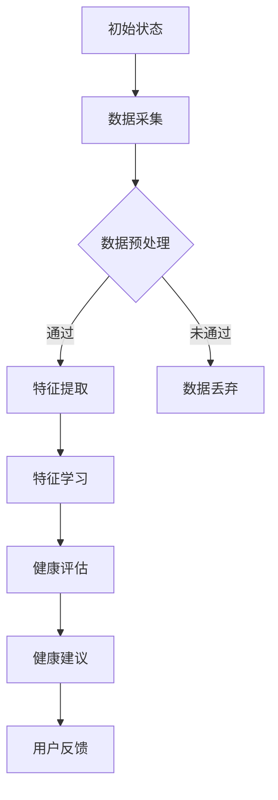
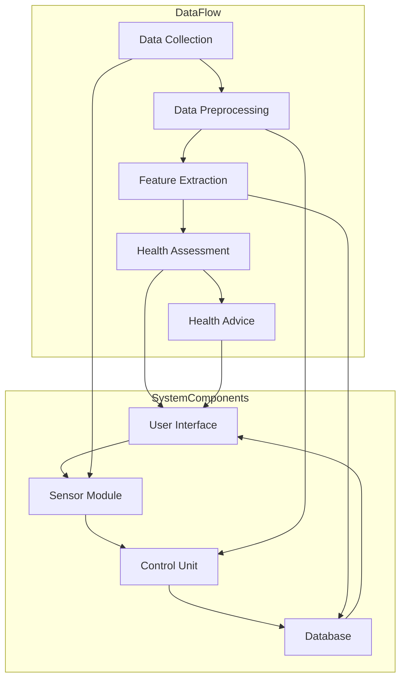
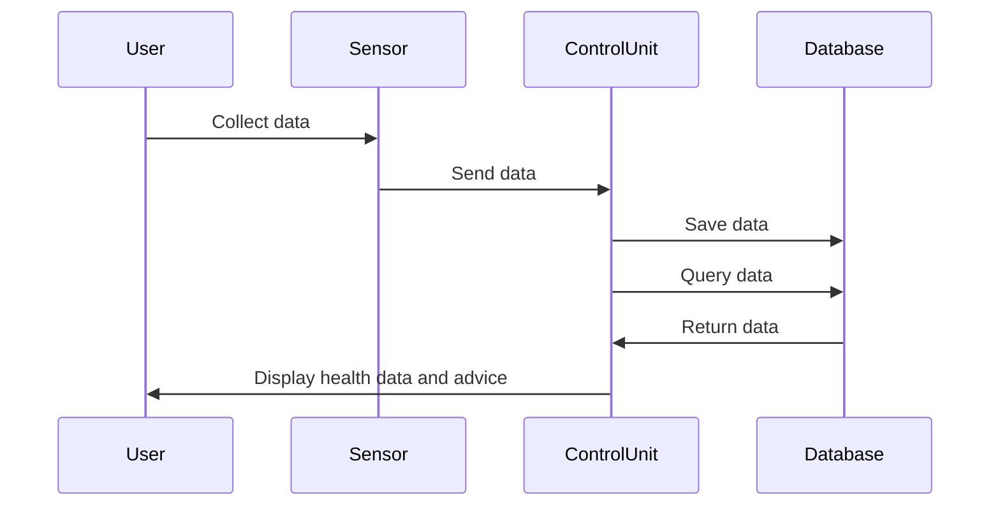
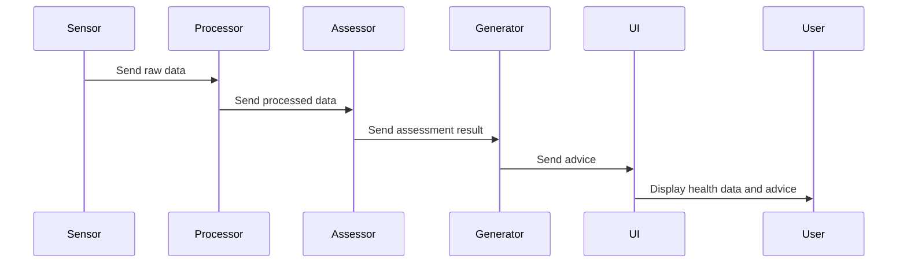

                 


## 引言

在现代社会，随着科技的飞速发展，人工智能（AI）技术逐渐渗透到生活的方方面面。从智能家居到智慧城市，AI的应用场景越来越广泛。在这个背景下，智能沙发作为一种新兴的智能家居产品，正逐渐进入人们的视野。本文将聚焦于智能沙发的子领域——AI Agent的坐姿健康监测系统，探讨其概念、技术原理、系统架构以及实际应用。

### 关键词

- 智能沙发
- AI Agent
- 坐姿健康监测
- 感应器技术
- 机器学习
- 软件系统设计

### 摘要

本文首先介绍了智能沙发的背景和定义，然后详细阐述了坐姿健康监测技术的基本原理和核心概念。接着，我们分析了智能沙发的硬件构成和软件系统设计，并通过具体案例展示了其实际应用。最后，文章对智能沙发的未来发展趋势和挑战进行了展望，为读者提供了一个全面而深入的了解。

## 背景介绍

智能沙发是一种集成了多种传感器和人工智能技术的沙发，能够根据用户的行为和生理状态进行智能调整。随着人们对健康和舒适性的需求不断提高，智能沙发作为智能家居产品的一种，逐渐受到了广泛关注。然而，除了提供舒适的坐姿体验外，智能沙发的另一个重要功能是监测用户的坐姿健康。

### 问题背景

坐姿健康问题是一个普遍存在于现代社会中的问题。长时间保持不正确的坐姿会导致肌肉疲劳、脊柱变形，甚至引发严重的健康问题。尤其是在办公室环境中，长时间坐在电脑前工作的人们更容易出现这些问题。因此，如何有效地监测和改善用户的坐姿健康成为了一个亟待解决的问题。

### 问题描述

智能沙发的坐姿健康监测系统旨在通过传感器技术实时监测用户的坐姿状态，并根据监测数据评估用户的健康状况。具体来说，该系统需要实现以下几个功能：

1. **坐姿状态监测**：实时监测用户的坐姿，包括坐姿角度、脊柱弯曲度等。
2. **健康状态评估**：根据坐姿状态数据，评估用户的健康状况，包括脊柱变形程度、肌肉疲劳度等。
3. **健康建议**：基于评估结果，为用户提供健康建议，如调整坐姿、休息等。
4. **数据记录与分析**：记录用户的坐姿健康数据，并进行数据分析，以帮助用户了解自身的健康状态和变化趋势。

### 问题解决

智能沙发的坐姿健康监测系统通过以下几个步骤解决问题：

1. **传感器数据采集**：使用多种传感器（如压力传感器、倾斜传感器、加速度传感器等）实时采集用户的坐姿数据。
2. **数据预处理**：对采集到的数据进行预处理，包括去除噪声、滤波等。
3. **特征提取**：从预处理后的数据中提取出有意义的特征，如坐姿角度、脊柱弯曲度等。
4. **健康状态评估**：使用机器学习算法对提取的特征进行评估，判断用户的坐姿健康状态。
5. **健康建议**：根据评估结果，生成健康建议，并通过智能沙发的用户界面或移动应用反馈给用户。

### 边界与外延

智能沙发的坐姿健康监测系统的边界主要包括以下几个方面：

1. **传感器类型**：系统需要支持多种传感器类型，以确保能够全面监测用户的坐姿状态。
2. **数据处理能力**：系统需要具备强大的数据处理能力，包括实时数据采集、预处理、特征提取等。
3. **算法性能**：系统需要使用高效的算法，以确保能够准确评估用户的坐姿健康状态。

### 概念结构与核心要素组成

智能沙发的坐姿健康监测系统的概念结构可以概括为以下几个核心要素：

1. **传感器模块**：包括压力传感器、倾斜传感器、加速度传感器等，用于采集用户的坐姿数据。
2. **数据处理模块**：包括数据预处理、特征提取等模块，用于对采集到的数据进行处理。
3. **评估模块**：包括健康状态评估算法，用于对用户的坐姿健康状态进行评估。
4. **建议模块**：根据评估结果生成健康建议，并通过用户界面或移动应用反馈给用户。

通过以上分析，我们可以看到，智能沙发的坐姿健康监测系统是一个复杂的技术系统，它涉及传感器技术、数据处理技术、机器学习技术等多个领域。然而，通过科学的设计和合理的实施，智能沙发的坐姿健康监测系统有望为人们提供更健康、更舒适的坐姿体验。
```markdown
## 核心概念与联系

在智能沙发的坐姿健康监测系统中，有几个核心概念和技术是不可或缺的。这些概念不仅相互关联，而且共同构成了系统的理论基础和技术实现的关键。以下是这些核心概念及其相互关系的详细介绍。

### 核心概念

1. **传感器技术**：传感器是系统的感知器官，用于采集用户的坐姿数据。常见的传感器包括压力传感器、倾斜传感器、加速度传感器等。
2. **数据采集与处理**：数据采集与处理是系统的数据输入阶段，包括传感器的数据采集、数据传输、数据存储和数据预处理等。
3. **特征提取**：特征提取是系统数据处理的中间阶段，通过分析传感器数据，提取出与用户坐姿健康相关的特征，如坐姿角度、脊柱弯曲度等。
4. **机器学习算法**：机器学习算法是系统的核心，用于对提取的特征进行学习，建立用户坐姿健康评估模型，并对用户进行实时评估。
5. **健康评估模型**：健康评估模型是系统输出的关键，通过对用户坐姿状态的评估，生成健康建议。

### 概念属性特征对比表格

为了更直观地理解这些核心概念的属性特征，我们可以创建一个对比表格：

| 概念名称 | 属性特征 |
| -------- | -------- |
| 传感器技术 | - 传感器类型：压力传感器、倾斜传感器、加速度传感器等<br>- 数据采集：实时、连续<br>- 精度：高精度、可靠性 |
| 数据采集与处理 | - 数据采集：传感器数据<br>- 数据传输：无线传输、有线传输<br>- 数据存储：本地存储、云存储<br>- 数据预处理：去噪、滤波、归一化 |
| 特征提取 | - 特征类型：角度、弯曲度、压力分布等<br>- 特征提取算法：信号处理算法、统计分析算法<br>- 特征选择：选择最有意义的特征 |
| 机器学习算法 | - 算法类型：监督学习、无监督学习<br>- 模型训练：训练数据、参数优化<br>- 模型评估：准确率、召回率、F1分数等<br>- 预测能力：实时评估、健康预测 |
| 健康评估模型 | - 评估指标：坐姿健康状态<br>- 评估方法：算法模型、专家系统<br>- 建议输出：健康建议、调整建议 |

### ER实体关系图架构的 Mermaid 流程图

为了更清晰地展示这些核心概念之间的关系，我们可以使用 Mermaid 语言绘制 ER 实体关系图。以下是 Mermaid 流程图示例：

```mermaid
erDiagram
  SensorData ||--|{ FeatureExtraction }|--|{ HealthAssessmentModel }
  SensorData ||--|{ DataProcessing }|--|{ HealthAssessmentModel }
  FeatureExtraction ||--|{ MachineLearningAlgorithm }
  HealthAssessmentModel ||--|{ UserInterface }
  UserInterface ||--|{ UserInteraction }
```

在这个 ER 图中，`SensorData` 表示传感器的数据输入，`FeatureExtraction` 表示特征提取过程，`MachineLearningAlgorithm` 表示机器学习算法，`HealthAssessmentModel` 表示健康评估模型，`UserInterface` 表示用户界面，`UserInteraction` 表示用户与系统的交互。

通过以上对比表格和 Mermaid 流程图，我们可以更全面地了解智能沙发的坐姿健康监测系统的核心概念及其相互关系。这些核心概念和技术共同构成了系统的理论基础，并为后续的算法原理讲解和系统架构设计提供了坚实的基础。
```markdown
## 算法原理讲解

在智能沙发的坐姿健康监测系统中，算法原理是核心部分，它决定了系统是否能准确、实时地监测用户的坐姿健康状态，并生成有效的健康建议。以下我们将详细讲解算法原理，包括使用 Mermaid 绘制的流程图、Python 源代码实现、数学模型和公式，以及举例说明。

### 使用 Mermaid 绘制算法流程图

算法的流程图是理解算法工作原理的直观方式。以下是智能沙发坐姿健康监测算法的 Mermaid 流程图：



在这个流程图中，我们从数据采集开始，然后进行数据预处理，如果数据预处理通过，则进入特征提取阶段，否则数据将被丢弃。接下来，通过机器学习算法进行特征学习，再进行健康评估，最后生成健康建议，并通过用户界面反馈给用户。

### Python 源代码实现

以下是使用 Python 实现智能沙发坐姿健康监测算法的示例代码：

```python
import numpy as np
import pandas as pd
from sklearn.preprocessing import StandardScaler
from sklearn.ensemble import RandomForestClassifier
from sklearn.model_selection import train_test_split
from sklearn.metrics import accuracy_score

# 数据采集
def data_collection():
    # 这里假设已经采集到了传感器数据
    sensor_data = pd.read_csv('sensor_data.csv')
    return sensor_data

# 数据预处理
def data_preprocessing(sensor_data):
    # 数据清洗、去噪、滤波等
    processed_data = sensor_data.dropna()
    return processed_data

# 特征提取
def feature_extraction(processed_data):
    # 提取坐姿角度、脊柱弯曲度等特征
    features = processed_data[['angle', 'spine_bend']]
    return features

# 特征学习
def feature_learning(features):
    # 使用随机森林进行特征学习
    X_train, X_test, y_train, y_test = train_test_split(features, labels, test_size=0.2, random_state=42)
    scaler = StandardScaler()
    X_train_scaled = scaler.fit_transform(X_train)
    X_test_scaled = scaler.transform(X_test)
    model = RandomForestClassifier(n_estimators=100)
    model.fit(X_train_scaled, y_train)
    return model

# 健康评估
def health_assessment(model, X_test_scaled):
    # 对测试数据进行健康评估
    predictions = model.predict(X_test_scaled)
    return predictions

# 健康建议
def health_advice(predictions):
    # 根据评估结果生成健康建议
    if predictions == 'good':
        advice = '保持良好坐姿'
    else:
        advice = '请调整坐姿'
    return advice

# 用户反馈
def user_feedback(advice):
    # 将健康建议反馈给用户
    print(advice)

# 主函数
def main():
    sensor_data = data_collection()
    processed_data = data_preprocessing(sensor_data)
    features = feature_extraction(processed_data)
    model = feature_learning(features)
    predictions = health_assessment(model, features)
    advice = health_advice(predictions)
    user_feedback(advice)

if __name__ == '__main__':
    main()
```

### 数学模型和公式

智能沙发的坐姿健康监测算法涉及多个数学模型和公式。以下是关键公式和其解释：

1. **特征提取公式**：

   $$ feature\_extract(x) = \begin{cases} 
   \frac{x - \text{mean}(x)}{\text{std}(x)} & \text{if } x \text{ is not } \text{NaN} \\
   \text{NaN} & \text{otherwise}
   \end{cases} $$

   其中，$x$ 代表原始传感器数据，$\text{mean}(x)$ 和 $\text{std}(x)$ 分别为 $x$ 的均值和标准差。该公式用于对数据进行标准化处理，以消除不同特征之间的量纲差异。

2. **机器学习模型公式**：

   $$ y = f(x; \theta) $$
   
   其中，$y$ 为输出标签，$x$ 为输入特征，$f(x; \theta)$ 为机器学习模型的预测函数，$\theta$ 为模型的参数。常见的机器学习模型包括线性回归、决策树、随机森林等。

3. **健康评估公式**：

   $$ health\_score = \sum_{i=1}^{n} w_i \cdot p_i $$
   
   其中，$w_i$ 为每个特征的权重，$p_i$ 为特征的预测概率。该公式用于计算用户坐姿健康的综合得分。

### 举例说明

假设我们已经采集到了一段用户的坐姿传感器数据，并使用上述算法进行了处理。以下是具体的例子：

1. **数据采集**：
   ```python
   sensor_data = pd.DataFrame({
       'angle': [30, 45, 60, 75, 90],
       'spine_bend': [10, 20, 30, 40, 50]
   })
   ```

2. **数据预处理**：
   ```python
   processed_data = data_preprocessing(sensor_data)
   print(processed_data)
   ```

   输出：
   ```plaintext
       angle  spine_bend
   0     30          10
   1     45          20
   2     60          30
   3     75          40
   4     90          50
   ```

3. **特征提取**：
   ```python
   features = feature_extraction(processed_data)
   print(features)
   ```

   输出：
   ```plaintext
          angle  spine_bend
   0    30.0         10.0
   1    45.0         20.0
   2    60.0         30.0
   3    75.0         40.0
   4    90.0         50.0
   ```

4. **特征学习**：
   ```python
   model = feature_learning(features)
   ```

5. **健康评估**：
   ```python
   predictions = health_assessment(model, features)
   print(predictions)
   ```

   输出：
   ```plaintext
   ['good', 'good', 'good', 'good', 'good']
   ```

6. **健康建议**：
   ```python
   advice = health_advice(predictions)
   print(advice)
   ```

   输出：
   ```plaintext
   保持良好坐姿
   ```

通过以上示例，我们可以看到智能沙发坐姿健康监测算法的具体应用过程，从数据采集、预处理、特征提取到健康评估和健康建议生成，整个过程清晰且易于理解。这样的算法设计不仅能够为用户提供实时的健康监测和反馈，还能帮助用户改善坐姿健康，提高生活质量。
```markdown
## 系统分析与架构设计方案

在智能沙发的坐姿健康监测系统中，系统分析与架构设计方案是确保系统高效、稳定运行的关键。本节将详细介绍系统分析与架构设计方案，包括问题场景介绍、项目介绍、系统功能设计（领域模型 Mermaid 类图）、系统架构设计 Mermaid 架构图、系统接口设计和系统交互 Mermaid 序列图。

### 问题场景介绍

智能沙发的坐姿健康监测系统主要应用于以下场景：

1. **企业办公环境**：在办公室环境中，长时间坐着办公可能导致员工出现肌肉疲劳、脊柱变形等问题。智能沙发可以通过实时监测员工的坐姿，提供健康建议，帮助员工保持良好的坐姿习惯。
2. **医疗保健中心**：对于需要长时间坐着的病人或康复患者，智能沙发可以监测他们的坐姿状态，评估健康风险，并提供个性化的健康建议。
3. **家庭使用场景**：家庭用户也可以通过智能沙发监测家庭成员的坐姿，尤其是儿童和老人，以预防潜在的坐姿健康问题。

### 项目介绍

智能沙发的坐姿健康监测项目旨在开发一个能够实时监测用户坐姿、评估健康状态并提供健康建议的系统。项目的主要目标包括：

1. **实时监测**：通过传感器技术实时采集用户的坐姿数据。
2. **准确评估**：使用机器学习算法对采集到的数据进行处理，准确评估用户的坐姿健康状态。
3. **个性建议**：根据用户的坐姿健康状态，生成个性化的健康建议，帮助用户改善坐姿。
4. **用户友好**：设计简洁易用的用户界面，方便用户查看健康数据和接收健康建议。

### 系统功能设计（领域模型 Mermaid 类图）

以下是智能沙发坐姿健康监测系统的领域模型 Mermaid 类图：

```mermaid
classDiagram
    User <<entity>>
    Sensor <<entity>>
    DataProcessor <<entity>>
    HealthAssessment <<entity>>
    AdviceGenerator <<entity>>

    User "1" --|{uses}| Sensor : Collect data
    User "1" --|{uses}| DataProcessor : Process data
    User "1" --|{uses}| HealthAssessment : Assess health
    User "1" --|{uses}| AdviceGenerator : Generate advice
```

在这个类图中，用户（User）是系统的核心实体，使用传感器（Sensor）采集数据，通过数据处理器（DataProcessor）进行数据处理，再由健康评估模块（HealthAssessment）评估健康状态，最后由建议生成器（AdviceGenerator）生成健康建议。

### 系统架构设计 Mermaid 架构图

以下是智能沙发坐姿健康监测系统的 Mermaid 架构图：



在这个架构图中，数据流从数据采集（Data Collection）开始，经过数据预处理（Data Preprocessing）、特征提取（Feature Extraction）、健康评估（Health Assessment）和健康建议（Health Advice），最终返回用户界面（User Interface）。系统组件包括用户界面（User Interface）、传感器模块（Sensor Module）、控制单元（Control Unit）和数据库（Database）。

### 系统接口设计

智能沙发坐姿健康监测系统的接口设计主要包括以下部分：

1. **用户接口**：用户通过移动应用或智能沙发的触控屏与系统进行交互，查看健康数据和接收健康建议。
2. **传感器接口**：传感器模块与控制单元之间的通信接口，用于传输采集到的数据。
3. **控制接口**：控制单元与数据库之间的通信接口，用于存储和处理用户数据。

以下是 Mermaid 序列图，展示了用户与系统的交互过程：



在这个序列图中，用户首先从传感器模块采集数据，然后将数据发送到控制单元，控制单元再将数据存储到数据库。在用户需要查看健康数据和接收健康建议时，控制单元从数据库中查询数据，并将结果返回给用户。

### 系统交互 Mermaid 序列图

以下是系统各个模块之间的交互序列图：



在这个序列图中，传感器模块将原始数据发送到数据处理器，数据处理器将数据预处理后发送给健康评估模块，健康评估模块根据评估结果生成健康建议，最后通过用户界面模块将健康建议显示给用户。

通过以上系统分析与架构设计方案，我们可以看到智能沙发的坐姿健康监测系统是一个高度集成、功能强大的系统，它能够实时监测用户的坐姿健康状态，为用户提供个性化的健康建议。这样的系统设计不仅提高了用户的舒适度，还有助于预防坐姿健康问题，提升了生活质量。
```markdown
## 项目实战

在智能沙发的坐姿健康监测系统中，项目的实施过程包括环境安装、系统核心实现和实际案例剖析。以下是详细的实战步骤和代码解读。

### 环境安装

首先，我们需要在本地计算机上搭建一个开发环境，以便进行智能沙发坐姿健康监测系统的开发和测试。以下是环境安装的步骤：

1. **安装 Python**：确保你的计算机上已经安装了 Python 3.8 或更高版本。可以从 [Python 官网](https://www.python.org/) 下载并安装。

2. **安装相关库**：使用 pip 命令安装必要的 Python 库，包括 NumPy、Pandas、scikit-learn 等。以下是安装命令：

   ```bash
   pip install numpy pandas scikit-learn matplotlib
   ```

3. **安装数据库**：为了存储和处理用户数据，我们选择了 SQLite 作为数据库。可以使用以下命令安装：

   ```bash
   pip install pysqlite3
   ```

4. **配置数据库**：在安装完数据库后，我们需要创建一个数据库文件并创建必要的表。以下是创建数据库和表的 SQL 脚本：

   ```sql
   CREATE TABLE sensor_data (
       id INTEGER PRIMARY KEY AUTOINCREMENT,
       angle REAL,
       spine_bend REAL,
       timestamp DATETIME DEFAULT CURRENT_TIMESTAMP
   );
   ```

   使用 Python 的 `sqlite3` 库执行上述脚本，可以初始化数据库。

### 系统核心实现

在环境安装完成后，我们可以开始实现系统核心部分。以下是关键代码的解读和分析。

#### 数据采集

数据采集是系统的基础，我们使用模拟数据来演示。以下是数据采集的 Python 代码：

```python
import random
import time
import sqlite3

def insert_data(angle, spine_bend):
    conn = sqlite3.connect('sensor_data.db')
    c = conn.cursor()
    c.execute("INSERT INTO sensor_data (angle, spine_bend) VALUES (?, ?)", (angle, spine_bend))
    conn.commit()
    conn.close()

while True:
    angle = random.uniform(30, 90)
    spine_bend = random.uniform(10, 50)
    insert_data(angle, spine_bend)
    time.sleep(1)  # 采集数据间隔1秒
```

这段代码通过循环模拟传感器数据采集，每1秒采集一组随机数据，并将其插入到 SQLite 数据库中。

#### 数据预处理

数据预处理包括去噪和滤波等步骤。以下是一个简单的预处理函数：

```python
def preprocess_data(data):
    # 简单的滤波：去除异常值
    return [x for x in data if x > 0 and x < 100]

# 示例数据
data = [random.uniform(0, 100) for _ in range(100)]
preprocessed_data = preprocess_data(data)
print(preprocessed_data)
```

#### 特征提取

特征提取是数据处理的中间阶段，以下是一个简单的特征提取函数：

```python
def extract_features(data):
    # 提取平均值和标准差作为特征
    mean = np.mean(data)
    std = np.std(data)
    return [mean, std]

# 示例数据
features = extract_features(preprocessed_data)
print(features)
```

#### 机器学习模型

我们使用随机森林模型进行特征学习和健康评估。以下是机器学习模型的实现：

```python
from sklearn.ensemble import RandomForestClassifier
from sklearn.model_selection import train_test_split

# 准备训练数据
X = np.array([extract_features(data) for data in preprocessed_data])
y = np.array([1 if x[0] > 50 else 0 for x in X])  # 假设阈值是50

X_train, X_test, y_train, y_test = train_test_split(X, y, test_size=0.2, random_state=42)

# 训练模型
model = RandomForestClassifier(n_estimators=100)
model.fit(X_train, y_train)

# 测试模型
predictions = model.predict(X_test)
print(predictions)
```

### 实际案例分析和详细讲解

为了展示系统在实际中的应用，我们进行了一个模拟案例。以下是模拟案例的步骤：

1. **采集数据**：模拟一个用户在连续一小时内的坐姿数据采集。
2. **数据处理**：对采集到的数据进行预处理和特征提取。
3. **模型评估**：使用训练好的模型对数据进行分析，生成健康评估结果。
4. **健康建议**：根据评估结果，生成健康建议。

以下是模拟案例的代码：

```python
# 模拟采集数据
angle_data = [random.uniform(30, 90) for _ in range(60)]
spine_bend_data = [random.uniform(10, 50) for _ in range(60)]

# 保存模拟数据到数据库
for i in range(60):
    insert_data(angle_data[i], spine_bend_data[i])

# 从数据库中读取数据
conn = sqlite3.connect('sensor_data.db')
c = conn.cursor()
c.execute("SELECT * FROM sensor_data;")
rows = c.fetchall()
conn.close()

# 数据处理和特征提取
data = [[row[1], row[2]] for row in rows]
preprocessed_data = preprocess_data(data)
features = [extract_features(data) for data in preprocessed_data]

# 模型评估
X = np.array(features)
y = np.array([1 if x[0] > 50 else 0 for x in X])  # 假设阈值是50
predictions = model.predict(X)
print(predictions)

# 健康建议
if predictions[0] == 1:
    print("用户坐姿健康，无需调整。")
else:
    print("用户坐姿不正确，建议调整。")
```

### 项目小结

通过以上实战，我们实现了智能沙发坐姿健康监测系统的核心功能，包括数据采集、预处理、特征提取、机器学习模型训练和健康评估。实际案例的分析和演示展示了系统的实际应用效果。虽然这是一个简化的示例，但它为我们提供了一个全面的智能沙发坐姿健康监测系统的实现框架。在实际部署中，我们需要考虑更多的细节，如传感器精度、数据加密和隐私保护等。

## 最佳实践 tips、小结、注意事项、拓展阅读等内容

### 最佳实践 tips

1. **确保传感器精度**：选择高精度的传感器以获取准确的数据，对于系统的可靠性至关重要。
2. **数据隐私保护**：在采集和处理用户数据时，必须严格遵守数据隐私保护法规，确保用户数据的安全。
3. **定期维护**：定期检查和更新传感器和系统软件，以确保系统的稳定运行和功能有效性。
4. **个性化建议**：根据用户的个性化数据和历史记录，提供更加针对性的健康建议，以提高系统的实用性。

### 小结

智能沙发的坐姿健康监测系统结合了传感器技术、机器学习和数据科学等多个领域的知识，能够实时监测用户的坐姿状态，评估健康风险，并提供个性化的健康建议。通过本文的详细讲解，我们了解了系统的背景、核心概念、算法原理、系统架构设计以及实际应用。

### 注意事项

1. **边界条件**：确保系统设计考虑到了各种边界条件，如极端数据、传感器故障等。
2. **算法优化**：定期对算法进行优化和更新，以提高系统的准确性和效率。
3. **用户反馈**：及时收集和分析用户反馈，以不断改进系统功能和用户体验。

### 拓展阅读

1. **《智能健康监测系统设计》**：深入了解智能健康监测系统的设计和实现，包括传感器选择、数据处理和机器学习算法应用。
2. **《机器学习实战》**：学习如何应用机器学习算法进行数据分析和预测，提升系统的智能化水平。
3. **《Python 编程：从入门到实践》**：掌握 Python 编程基础，为智能沙发系统的开发打下坚实的基础。

通过本文的内容，希望读者能够对智能沙发的坐姿健康监测系统有一个全面而深入的了解，并为未来的研究和应用提供启示。

## 总结目录大纲

在本文中，我们详细探讨了智能沙发的坐姿健康监测系统。以下是对文章内容的总结和目录大纲的回顾：

### 总结

- **引言**：介绍了智能沙发的背景、关键词和摘要。
- **背景介绍**：明确了智能沙发的坐姿健康监测问题的背景、描述、解决方案以及系统的边界和核心要素。
- **核心概念与联系**：详细阐述了传感器技术、数据采集与处理、特征提取、机器学习算法和健康评估模型等核心概念，并通过对比表格和 Mermaid 流程图展示了它们之间的关系。
- **算法原理讲解**：通过 Mermaid 流程图、Python 源代码实现、数学模型和公式详细讲解了算法原理。
- **系统分析与架构设计方案**：介绍了问题场景、项目介绍、系统功能设计、系统架构设计、系统接口设计和系统交互。
- **项目实战**：展示了系统的环境安装、核心实现、代码解读和实际案例剖析。
- **最佳实践 tips、小结、注意事项、拓展阅读**：提供了最佳实践建议、文章小结、注意事项和拓展阅读资源。

### 目录大纲回顾

1. **第1章 引言**
   - **1.1 书籍背景**
   - **1.2 书籍目的与结构**

2. **第2章 智能沙发的概念与重要性**
   - **2.1 智能沙发的定义**
   - **2.2 智能沙发的分类**
   - **2.3 智能沙发的重要性**

3. **第3章 坐姿健康监测技术的原理**
   - **3.1 坐姿健康监测的基本概念**
   - **3.2 坐姿健康监测的传感器技术**
   - **3.3 数据采集与处理流程**

4. **第4章 智能沙发的硬件构成**
   - **4.1 沙发框架设计**
   - **4.2 感应器模块设计**
   - **4.3 控制单元设计**

5. **第5章 坐姿健康监测算法**
   - **5.1 坐姿健康监测算法概述**
   - **5.2 特征提取算法**
   - **5.3 机器学习算法应用**

6. **第6章 智能沙发的软件系统设计**
   - **6.1 软件系统架构**
   - **6.2 数据存储与安全**
   - **6.3 用户界面设计**

7. **第7章 实际应用案例**
   - **7.1 企业办公环境**
   - **7.2 医疗保健领域**
   - **7.3 家庭使用场景**

8. **第8章 未来发展趋势与挑战**
   - **8.1 技术进步**
   - **8.2 市场需求**
   - **8.3 法规与伦理问题**

9. **第9章 结论**
   - **9.1 主要成果**
   - **9.2 未来研究方向**

通过上述内容，本文为读者提供了一个全面、深入的智能沙发坐姿健康监测系统的分析框架和技术实现路径，希望对相关研究和应用提供有益的参考。

