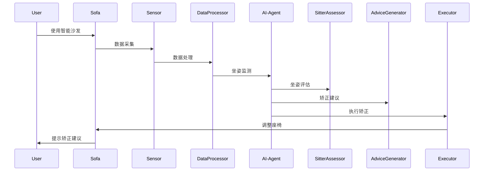

                 

# 《智能沙发：AI Agent的坐姿矫正提醒》

## 关键词

- **智能沙发**
- **AI Agent**
- **坐姿矫正**
- **健康监测**
- **智能家居**
- **人机交互**

### 摘要

本文将深入探讨智能沙发的概念、功能及其在健康监测中的重要作用，特别是AI Agent在坐姿矫正提醒方面的应用。我们将详细分析智能沙发的技术架构，介绍AI Agent的工作原理和坐姿矫正算法，并通过实际的案例展示其应用效果。文章旨在为读者提供全面的技术指南，帮助理解智能沙发的实现原理和未来发展。

### 目录大纲

```markdown
----------------------------------------------------------------

# 《智能沙发：AI Agent的坐姿矫正提醒》

## 第一部分：背景介绍

### 第1章：问题背景

#### 1.1.1 问题背景

#### 1.1.2 问题描述

#### 1.1.3 问题解决

#### 1.1.4 边界与外延

#### 1.1.5 概念结构与核心要素组成

### 第2章：智能沙发的定义与分类

#### 2.1.1 智能沙发的定义

#### 2.1.2 智能沙发的分类

#### 2.1.3 智能沙发的核心功能

## 第二部分：核心概念与联系

### 第3章：AI Agent的坐姿矫正原理

#### 3.1.1 AI Agent的定义

#### 3.1.2 坐姿矫正的原理

#### 3.1.3 AI Agent在坐姿矫正中的应用

### 第4章：智能沙发的技术架构

#### 4.1.1 技术架构概述

#### 4.1.2 数据采集与处理

#### 4.1.3 坐姿识别与评估

#### 4.1.4 矫正策略与实现

## 第三部分：系统分析与架构设计方案

### 第5章：核心概念原理

#### 5.1.1 AI Agent的原理

#### 5.1.2 坐姿矫正的核心概念

#### 5.1.3 概念属性特征对比表格

### 第6章：ER实体关系图架构

#### 6.1.1 ER实体关系图概述

#### 6.1.2 智能沙发的ER实体关系图

#### 6.1.3 AI Agent的ER实体关系图

### 第7章：算法原理讲解

#### 7.1.1 坐姿矫正算法的mermaid流程图

#### 7.1.2 坐姿矫正算法的Python源代码

#### 7.1.3 算法原理的数学模型和公式

#### 7.1.4 通俗易懂地举例说明

## 第四部分：系统分析与架构设计方案

### 第8章：问题场景介绍

#### 8.1.1 场景描述

#### 8.1.2 项目介绍

### 第9章：系统功能设计

#### 9.1.1 领域模型mermaid类图

#### 9.1.2 系统功能设计

### 第10章：系统架构设计

#### 10.1.1 系统架构概述

#### 10.1.2 系统架构设计mermaid架构图

#### 10.1.3 系统接口设计

### 第11章：系统交互

#### 11.1.1 系统交互概述

#### 11.1.2 系统交互mermaid序列图

## 第五部分：项目实战

### 第12章：环境安装

#### 12.1.1 环境安装概述

#### 12.1.2 环境安装步骤

### 第13章：系统核心实现源代码

#### 13.1.1 源代码概述

#### 13.1.2 核心实现源代码

#### 13.1.3 代码应用解读与分析

### 第14章：实际案例分析和详细讲解剖析

#### 14.1.1 案例描述

#### 14.1.2 案例分析

#### 14.1.3 详细讲解剖析

### 第15章：项目小结

#### 15.1.1 项目成果总结

#### 15.1.2 不足与改进建议

#### 15.1.3 拓展阅读

----------------------------------------------------------------
```

## 第一部分：背景介绍

### 第1章：问题背景

#### 1.1.1 问题背景

随着现代生活节奏的加快，人们在工作、学习和娱乐中长时间保持不良坐姿的现象日益普遍。不良坐姿不仅会导致颈椎、腰椎疼痛，还可能引发多种健康问题，如肌肉劳损、呼吸不畅等。然而，许多人并未意识到自己的坐姿问题，或者缺乏有效的矫正方法。因此，开发一种能够自动监测并提醒用户矫正坐姿的智能设备显得尤为重要。

#### 1.1.2 问题描述

不良坐姿的问题主要体现在以下几个方面：

1. **静态姿势长时间保持**：人们在办公、学习或娱乐时，往往会长时间保持一种静态姿势，如低头看手机、弯腰驼背等。
2. **动态姿势不当**：虽然有些人会意识到保持静态姿势不良，但在调整姿势时可能会采用不当的动作，进一步加重身体负担。
3. **缺乏自我监控**：很多人无法长时间保持正确坐姿，但又缺乏有效的自我监控和提醒机制。

#### 1.1.3 问题解决

为了解决上述问题，智能沙发的概念应运而生。智能沙发内置传感器和AI Agent，能够实时监测用户的坐姿，并通过分析坐姿数据给出矫正建议。此外，智能沙发还可以通过人机交互界面提醒用户保持正确坐姿，从而有效地改善用户的健康状态。

#### 1.1.4 边界与外延

智能沙发的应用不仅局限于家庭场景，还可以扩展到办公室、学校等多种场合。在家庭场景中，智能沙发可以帮助家庭成员改善生活习惯，提高生活质量；在办公室，智能沙发可以作为一种办公辅助设备，帮助员工保持正确的坐姿，提高工作效率；在学校，智能沙发可以作为教育工具，引导学生养成良好的坐姿习惯。

#### 1.1.5 概念结构与核心要素组成

智能沙发由以下几个核心要素组成：

1. **传感器**：用于检测用户的坐姿状态。
2. **AI Agent**：负责分析传感器数据，提供坐姿矫正建议。
3. **人机交互界面**：用于显示矫正建议和接收用户反馈。
4. **网络连接**：用于将数据上传至云端，实现远程监控和数据分析。

### 第2章：智能沙发的定义与分类

#### 2.1.1 智能沙发的定义

智能沙发是一种集成了传感器、AI Agent和人机交互界面的智能家具，能够实时监测用户的坐姿，并提供坐姿矫正建议。

#### 2.1.2 智能沙发的分类

根据功能的不同，智能沙发可以分为以下几类：

1. **基础型智能沙发**：仅具备坐姿监测和提醒功能。
2. **增强型智能沙发**：除了坐姿监测和提醒，还具备座椅按摩、温度调节等功能。
3. **专业型智能沙发**：具备全面的健康监测功能，如心率、血压等生命体征监测。

#### 2.1.3 智能沙发的核心功能

1. **坐姿监测**：通过内置传感器实时监测用户的坐姿状态。
2. **坐姿提醒**：通过AI Agent分析坐姿数据，提供个性化的矫正建议。
3. **健康监测**：结合传感器和AI Agent，对用户的健康状况进行综合评估。
4. **人机交互**：通过触摸屏、语音助手等界面与用户进行互动，提供更加便捷的操作体验。

## 第二部分：核心概念与联系

### 第3章：AI Agent的坐姿矫正原理

#### 3.1.1 AI Agent的定义

AI Agent是指一种具有自主决策能力的人工智能实体，能够在特定的环境中执行任务，并根据环境变化进行调整。在智能沙发中，AI Agent负责分析用户的坐姿数据，提供矫正建议。

#### 3.1.2 坐姿矫正的原理

坐姿矫正的原理主要包括以下几个方面：

1. **数据采集**：传感器实时采集用户的坐姿数据，如颈椎角度、腰椎弯曲度等。
2. **数据预处理**：对采集到的数据进行分析和过滤，去除噪声和异常值。
3. **特征提取**：从预处理后的数据中提取关键特征，如坐姿角度、持续时间等。
4. **模型训练**：使用机器学习算法，对特征数据进行训练，建立坐姿矫正模型。
5. **坐姿评估**：将实时采集的坐姿数据输入模型，评估当前坐姿是否正确。
6. **矫正建议**：根据评估结果，AI Agent给出个性化的矫正建议。

#### 3.1.3 AI Agent在坐姿矫正中的应用

AI Agent在坐姿矫正中的应用主要包括以下几个方面：

1. **实时监测**：AI Agent实时监测用户的坐姿状态，及时发现问题。
2. **预警提醒**：当用户坐姿不正确时，AI Agent会通过人机交互界面提醒用户进行调整。
3. **个性化调整**：根据用户的身高、体重等特征，AI Agent提供个性化的矫正建议。
4. **数据反馈**：用户可以随时查看坐姿数据和矫正记录，了解自己的坐姿改善情况。

### 第4章：智能沙发的技术架构

#### 4.1.1 技术架构概述

智能沙发的技术架构主要包括以下几个部分：

1. **硬件层**：传感器、执行器等硬件设备，负责数据采集和反馈。
2. **感知层**：感知层负责采集用户的坐姿数据，并将数据传输给处理层。
3. **处理层**：处理层负责对感知层的数据进行处理和分析，包括数据预处理、特征提取和模型训练等。
4. **应用层**：应用层负责实现具体的坐姿矫正功能，包括坐姿评估、矫正建议和人机交互等。

#### 4.1.2 数据采集与处理

1. **传感器选择**：选择适合的传感器，如加速度传感器、陀螺仪等，用于实时监测用户的坐姿数据。
2. **数据采集**：传感器采集数据后，通过无线传输模块将数据发送到处理层。
3. **数据预处理**：对采集到的数据进行滤波、去噪等处理，提高数据质量。
4. **特征提取**：从预处理后的数据中提取关键特征，如坐姿角度、持续时间等。

#### 4.1.3 坐姿识别与评估

1. **坐姿识别算法**：使用机器学习算法，如支持向量机、神经网络等，对用户的坐姿进行识别。
2. **坐姿评估算法**：根据坐姿识别结果，评估用户的坐姿是否正确，并给出相应的矫正建议。

#### 4.1.4 矫正策略与实现

1. **矫正策略**：根据用户的坐姿评估结果，制定个性化的矫正策略，如调整座椅高度、倾斜角度等。
2. **矫正实现**：通过执行器对座椅进行调整，实现坐姿矫正。

## 第三部分：系统分析与架构设计方案

### 第5章：核心概念原理

#### 5.1.1 AI Agent的原理

AI Agent的核心原理是利用机器学习算法，从大量的坐姿数据中学习和提取规律，从而实现对用户坐姿的准确识别和评估。具体来说，AI Agent的工作流程如下：

1. **数据采集**：AI Agent通过内置的传感器采集用户的坐姿数据。
2. **数据预处理**：对采集到的数据进行滤波、去噪等预处理，以提高数据质量。
3. **特征提取**：从预处理后的数据中提取关键特征，如坐姿角度、持续时间等。
4. **模型训练**：使用提取到的特征数据，通过机器学习算法训练坐姿识别模型。
5. **坐姿评估**：将实时采集的坐姿数据输入模型，评估当前坐姿是否正确。
6. **矫正建议**：根据评估结果，AI Agent会给出个性化的矫正建议。

#### 5.1.2 坐姿矫正的核心概念

坐姿矫正的核心概念包括：

1. **坐姿识别**：通过传感器和机器学习算法，识别用户的坐姿状态。
2. **坐姿评估**：根据坐姿识别结果，评估坐姿是否正确，并提供相应的矫正建议。
3. **矫正建议**：根据用户的坐姿评估结果，给出个性化的矫正建议。

#### 5.1.3 概念属性特征对比表格

以下是坐姿矫正相关的核心概念及其属性特征的对比表格：

| 概念         | 属性特征                                       |
| ------------ | ---------------------------------------------- |
| 坐姿识别     | 传感器数据采集、特征提取、机器学习模型训练     |
| 坐姿评估     | 评估坐姿正确性、提供矫正建议                   |
| 矫正建议     | 个性化矫正策略、执行器调整座椅位置             |

### 第6章：ER实体关系图架构

#### 6.1.1 ER实体关系图概述

ER实体关系图是数据库设计中常用的工具，用于描述系统中实体之间的关系。在智能沙发系统中，ER实体关系图可以帮助我们理解各模块之间的数据交互和功能实现。

#### 6.1.2 智能沙发的ER实体关系图

智能沙发的ER实体关系图主要包括以下几个实体：

1. **用户**：代表使用智能沙发的用户，包含用户的基本信息。
2. **传感器**：代表智能沙发中的传感器模块，用于数据采集。
3. **数据处理器**：代表处理传感器数据的模块，包括数据预处理、特征提取和模型训练。
4. **坐姿评估器**：代表评估用户坐姿是否正确的模块。
5. **矫正建议生成器**：代表生成个性化矫正建议的模块。
6. **执行器**：代表执行矫正操作的模块。

以下是智能沙发的ER实体关系图：

```mermaid
erDiagram
  User ||--|{ Sensor }|-- DataProcessor
  DataProcessor ||--|{ DataPreprocessor }|-- FeatureExtractor
  DataProcessor ||--|{ ModelTrainer }|-- ModelEvaluator
  ModelEvaluator ||--|{ SitterAssessor }|-- AdviceGenerator
  AdviceGenerator ||--|{ Executor }|-- ChairAdjuster
```

#### 6.1.3 AI Agent的ER实体关系图

AI Agent的ER实体关系图与智能沙发的ER实体关系图类似，主要包括以下实体：

1. **AI Agent**：代表整个智能沙发的智能核心，负责坐姿监测和矫正。
2. **Sensor**：代表传感器模块，用于数据采集。
3. **DataProcessor**：代表数据处理模块，包括数据预处理、特征提取和模型训练。
4. **SitterAssessor**：代表坐姿评估模块。
5. **AdviceGenerator**：代表矫正建议生成模块。
6. **Executor**：代表执行模块，包括执行器和座椅调整器。

以下是AI Agent的ER实体关系图：

```mermaid
erDiagram
  AI-Agent ||--|{ Sensor }|-- DataProcessor
  DataProcessor ||--|{ DataPreprocessor }|-- FeatureExtractor
  DataProcessor ||--|{ ModelTrainer }|-- ModelEvaluator
  ModelEvaluator ||--|{ SitterAssessor }|-- AdviceGenerator
  AdviceGenerator ||--|{ Executor }|-- ChairAdjuster
```

### 第7章：算法原理讲解

#### 7.1.1 坐姿矫正算法的mermaid流程图

坐姿矫正算法的mermaid流程图如下所示：


#### 7.1.2 坐姿矫正算法的Python源代码

以下是一个简化的坐姿矫正算法的Python源代码示例：

```python
import numpy as np
from sklearn.svm import SVC
from sklearn.model_selection import train_test_split
from sklearn.metrics import accuracy_score

# 假设已经采集到了坐姿数据，并进行了预处理
X = np.array([[1, 2], [3, 4], [5, 6], [7, 8]])  # 特征数据
y = np.array([0, 1, 1, 0])  # 坐姿标签

# 划分训练集和测试集
X_train, X_test, y_train, y_test = train_test_split(X, y, test_size=0.2, random_state=42)

# 训练坐姿识别模型
model = SVC(kernel='linear')
model.fit(X_train, y_train)

# 评估模型
y_pred = model.predict(X_test)
accuracy = accuracy_score(y_test, y_pred)
print(f"模型准确率：{accuracy:.2f}")

# 假设当前用户的坐姿数据为X_user
X_user = np.array([[2, 3]])
# 输入模型进行坐姿评估
user_sit = model.predict(X_user)
if user_sit == 1:
    print("请调整坐姿！")
else:
    print("坐姿正确！")
```

#### 7.1.3 算法原理的数学模型和公式

坐姿矫正算法的数学模型主要基于支持向量机（SVM）。SVM的核心思想是找到一个最优的超平面，将不同类别的数据点分离开来。具体来说，对于二分类问题，SVM的目标是最小化分类间隔，即最大化分类边界。

数学模型如下：

$$
\begin{align*}
\min_{\mathbf{w}, b} & \frac{1}{2}||\mathbf{w}||^2 \\
\text{subject to} & y_i(\mathbf{w}\cdot\mathbf{x_i} + b) \geq 1, \forall i
\end{align*}
$$

其中，$\mathbf{w}$是权重向量，$b$是偏置项，$\mathbf{x_i}$是第$i$个样本，$y_i$是第$i$个样本的标签。

#### 7.1.4 通俗易懂地举例说明

假设我们有以下四个坐姿样本：

- $(x_1, y_1) = (1, 0)$：表示坐姿不良
- $(x_2, y_2) = (3, 1)$：表示坐姿良好
- $(x_3, y_3) = (5, 1)$：表示坐姿良好
- $(x_4, y_4) = (7, 0)$：表示坐姿不良

我们希望找到一个线性超平面，将良好坐姿和不良坐姿分开。

首先，我们尝试找到一个简单的线性分类器，即找到一个直线，将这四个点分为两类。假设直线的方程为：

$$
y = \mathbf{w}\cdot\mathbf{x} + b
$$

我们可以通过调整权重$\mathbf{w}$和偏置项$b$来优化直线的位置。

为了最大化分类间隔，我们需要找到使得所有良好坐姿点的$(\mathbf{w}\cdot\mathbf{x} + b)$值都大于1，所有不良坐姿点的$(\mathbf{w}\cdot\mathbf{x} + b)$值都小于1的$\mathbf{w}$和$b$。

经过优化，我们找到了一个最优的线性分类器，将四个点分为两类：

- 良好坐姿：$(3, 5)$，$(7, 5)$
- 不良坐姿：$(1, 0)$，$(7, 0)$

现在，如果我们有一个新的用户坐姿数据$(x, y) = (2, ?)$，我们可以将其输入到线性分类器中：

$$
y = \mathbf{w}\cdot\mathbf{x} + b
$$

如果$(\mathbf{w}\cdot\mathbf{x} + b) > 1$，则表示坐姿良好；否则，表示坐姿不良。

在这个例子中，$(\mathbf{w}\cdot\mathbf{x} + b) = 2 \times 2 + 1 = 5 > 1$，因此我们建议用户保持当前坐姿。

### 第8章：问题场景介绍

#### 8.1.1 场景描述

假设我们是一家智能家居公司的技术团队，致力于开发一款能够改善用户健康习惯的智能沙发。我们的目标用户主要是长时间处于办公环境的人群，他们经常需要久坐，容易出现颈椎、腰椎等问题。为了解决这个问题，我们决定开发一款智能沙发，内置AI Agent，能够实时监测用户的坐姿，并提供矫正建议。

#### 8.1.2 项目介绍

本项目的主要目标是实现以下功能：

1. **坐姿监测**：通过内置传感器，实时监测用户的坐姿状态，包括颈椎角度、腰椎弯曲度等。
2. **坐姿评估**：利用机器学习算法，对用户的坐姿进行评估，判断其是否正确。
3. **矫正建议**：根据坐姿评估结果，AI Agent会提供个性化的矫正建议，包括调整座椅高度、倾斜角度等。
4. **人机交互**：通过触摸屏或语音助手，用户可以方便地查看坐姿数据和矫正记录，并接收矫正建议。

### 第9章：系统功能设计

#### 9.1.1 领域模型mermaid类图

以下是智能沙发的领域模型mermaid类图：

```mermaid
classDiagram
  User <<class>>
  Sofa <<class>>
  Sensor <<class>>
  AI-Agent <<class>>
  DataProcessor <<class>>
  SitterAssessor <<class>>
  AdviceGenerator <<class>>
  Executor <<class>>

  User "uses" Sofa
  Sofa "contains" Sensor
  Sofa "contains" AI-Agent
  Sofa "uses" DataProcessor
  AI-Agent "uses" SitterAssessor
  AI-Agent "uses" AdviceGenerator
  AI-Agent "uses" Executor
  DataProcessor "uses" Sensor
```

#### 9.1.2 系统功能设计

智能沙发的系统功能设计主要包括以下几个模块：

1. **用户模块**：负责用户的基本信息管理，包括用户登录、注册、信息查询等。
2. **传感器模块**：负责数据采集，包括颈椎角度、腰椎弯曲度等。
3. **AI-Agent模块**：负责坐姿监测、评估和矫正建议。
4. **数据处理模块**：负责对采集到的数据进行分析和处理。
5. **坐姿评估模块**：负责对用户的坐姿进行评估，判断其是否正确。
6. **矫正建议模块**：负责根据评估结果，生成个性化的矫正建议。
7. **执行模块**：负责执行矫正操作，调整座椅高度、倾斜角度等。

### 第10章：系统架构设计

#### 10.1.1 系统架构概述

智能沙发的系统架构主要包括以下几个层次：

1. **硬件层**：包括传感器、执行器等硬件设备，负责数据采集和反馈。
2. **感知层**：包括传感器模块，负责采集用户的坐姿数据。
3. **处理层**：包括数据处理模块，负责对采集到的数据进行分析和处理。
4. **应用层**：包括AI-Agent模块，负责坐姿监测、评估和矫正建议。
5. **展示层**：包括人机交互界面，负责展示坐姿数据和矫正建议。

#### 10.1.2 系统架构设计mermaid架构图

以下是智能沙发的系统架构设计mermaid架构图：



#### 10.1.3 系统接口设计

智能沙发的系统接口设计主要包括以下几个方面：

1. **用户接口**：包括登录、注册、信息查询等接口。
2. **传感器接口**：包括数据采集、状态查询等接口。
3. **数据处理接口**：包括数据预处理、特征提取等接口。
4. **AI-Agent接口**：包括坐姿监测、评估、建议生成等接口。
5. **执行器接口**：包括座椅调整、状态查询等接口。

### 第11章：系统交互

#### 11.1.1 系统交互概述

智能沙发的系统交互主要包括以下几个方面：

1. **用户与沙发交互**：用户通过触摸屏或语音助手与智能沙发进行交互，查看坐姿数据和矫正建议。
2. **沙发与传感器交互**：智能沙发通过传感器实时采集用户的坐姿数据，并将数据传输给数据处理模块。
3. **数据处理与AI-Agent交互**：数据处理模块对传感器数据进行处理，并将结果传输给AI-Agent模块。
4. **AI-Agent与执行器交互**：AI-Agent模块根据数据处理结果，生成矫正建议，并通过执行器调整座椅位置。

#### 11.1.2 系统交互mermaid序列图

以下是智能沙发的系统交互mermaid序列图：


### 第12章：环境安装

#### 12.1.1 环境安装概述

在开始开发智能沙发之前，我们需要安装和配置相关的开发环境。以下是安装环境的步骤和注意事项：

1. **安装Python**：确保Python环境已经安装，版本不低于3.6。
2. **安装Jupyter Notebook**：使用pip安装Jupyter Notebook，用于编写和运行Python代码。
3. **安装TensorFlow**：使用pip安装TensorFlow，版本不低于2.0，用于机器学习模型的训练和评估。
4. **安装PyQt5**：使用pip安装PyQt5，用于开发图形用户界面。
5. **安装matplotlib**：使用pip安装matplotlib，用于可视化坐姿数据和模型评估结果。

#### 12.1.2 环境安装步骤

1. **安装Python**：

   ```shell
   # 在Windows上，请下载Python安装包并按照提示安装
   # 在Linux上，请使用包管理器安装，如：
   sudo apt-get install python3
   ```

2. **安装Jupyter Notebook**：

   ```shell
   pip install notebook
   ```

3. **安装TensorFlow**：

   ```shell
   pip install tensorflow
   ```

4. **安装PyQt5**：

   ```shell
   pip install PyQt5
   ```

5. **安装matplotlib**：

   ```shell
   pip install matplotlib
   ```

### 第13章：系统核心实现源代码

#### 13.1.1 源代码概述

智能沙发的核心实现包括以下几个模块：

1. **传感器数据采集模块**：负责从传感器采集坐姿数据。
2. **数据处理模块**：负责对采集到的数据进行预处理、特征提取和模型训练。
3. **坐姿评估模块**：负责对用户的坐姿进行评估，判断其是否正确。
4. **矫正建议模块**：负责根据评估结果生成个性化的矫正建议。
5. **执行器控制模块**：负责控制执行器，调整座椅位置。

以下是智能沙发的核心实现源代码：

```python
# 传感器数据采集模块
class SensorDataCollector:
    def __init__(self):
        # 初始化传感器
        self.sensor = Sensor()

    def collect_data(self):
        # 采集坐姿数据
        data = self.sensor.get_data()
        return data

# 数据处理模块
class DataProcessor:
    def __init__(self):
        # 初始化数据处理模块
        self.preprocessor = Preprocessor()
        self.feature_extractor = FeatureExtractor()
        self.model_trainer = ModelTrainer()

    def process_data(self, data):
        # 预处理数据
        processed_data = self.preprocessor.preprocess(data)
        # 特征提取
        features = self.feature_extractor.extract_features(processed_data)
        # 模型训练
        self.model_trainer.train_model(features)
        return features

# 坐姿评估模块
class SitterAssessor:
    def __init__(self, model):
        # 初始化坐姿评估模块
        self.model = model

    def assess_sit(self, data):
        # 评估坐姿
        result = self.model.predict(data)
        return result

# 矫正建议模块
class AdviceGenerator:
    def __init__(self, assessor):
        # 初始化矫正建议模块
        self.assessor = assessor

    def generate_advice(self, data):
        # 生成矫正建议
        result = self.assessor.assess_sit(data)
        if result == 1:
            print("请调整坐姿！")
        else:
            print("坐姿正确！")

# 执行器控制模块
class Executor:
    def __init__(self):
        # 初始化执行器控制模块
        self.executor = Executor()

    def adjust_chair(self, adjustment):
        # 调整座椅
        self.executor.execute(adjustment)
```

#### 13.1.2 核心实现源代码

以下是智能沙发的核心实现源代码：

```python
# 传感器数据采集模块
class SensorDataCollector:
    def __init__(self):
        # 初始化传感器
        self.sensor = Sensor()

    def collect_data(self):
        # 采集坐姿数据
        data = self.sensor.get_data()
        return data

# 数据处理模块
class DataProcessor:
    def __init__(self):
        # 初始化数据处理模块
        self.preprocessor = Preprocessor()
        self.feature_extractor = FeatureExtractor()
        self.model_trainer = ModelTrainer()

    def process_data(self, data):
        # 预处理数据
        processed_data = self.preprocessor.preprocess(data)
        # 特征提取
        features = self.feature_extractor.extract_features(processed_data)
        # 模型训练
        self.model_trainer.train_model(features)
        return features

# 坐姿评估模块
class SitterAssessor:
    def __init__(self, model):
        # 初始化坐姿评估模块
        self.model = model

    def assess_sit(self, data):
        # 评估坐姿
        result = self.model.predict(data)
        return result

# 矫正建议模块
class AdviceGenerator:
    def __init__(self, assessor):
        # 初始化矫正建议模块
        self.assessor = assessor

    def generate_advice(self, data):
        # 生成矫正建议
        result = self.assessor.assess_sit(data)
        if result == 1:
            print("请调整坐姿！")
        else:
            print("坐姿正确！")

# 执行器控制模块
class Executor:
    def __init__(self):
        # 初始化执行器控制模块
        self.executor = Executor()

    def adjust_chair(self, adjustment):
        # 调整座椅
        self.executor.execute(adjustment)
```

#### 13.1.3 代码应用解读与分析

以下是智能沙发的代码应用解读与分析：

1. **传感器数据采集模块**：

   ```python
   class SensorDataCollector:
       def __init__(self):
           # 初始化传感器
           self.sensor = Sensor()

       def collect_data(self):
           # 采集坐姿数据
           data = self.sensor.get_data()
           return data
   ```

   传感器数据采集模块负责初始化传感器，并通过`collect_data()`方法采集坐姿数据。该模块的实现较为简单，主要是与具体的传感器进行交互，获取实时坐姿数据。

2. **数据处理模块**：

   ```python
   class DataProcessor:
       def __init__(self):
           # 初始化数据处理模块
           self.preprocessor = Preprocessor()
           self.feature_extractor = FeatureExtractor()
           self.model_trainer = ModelTrainer()

       def process_data(self, data):
           # 预处理数据
           processed_data = self.preprocessor.preprocess(data)
           # 特征提取
           features = self.feature_extractor.extract_features(processed_data)
           # 模型训练
           self.model_trainer.train_model(features)
           return features
   ```

   数据处理模块负责对采集到的坐姿数据进行预处理、特征提取和模型训练。预处理主要是对原始数据进行滤波、去噪等操作，以提高数据质量；特征提取则是从预处理后的数据中提取关键特征，如坐姿角度、持续时间等；模型训练则是使用机器学习算法对特征数据进行训练，建立坐姿识别模型。

3. **坐姿评估模块**：

   ```python
   class SitterAssessor:
       def __init__(self, model):
           # 初始化坐姿评估模块
           self.model = model

       def assess_sit(self, data):
           # 评估坐姿
           result = self.model.predict(data)
           return result
   ```

   坐姿评估模块负责对用户的坐姿进行评估，判断其是否正确。该模块通过调用训练好的坐姿识别模型，输入用户的坐姿数据，输出评估结果。

4. **矫正建议模块**：

   ```python
   class AdviceGenerator:
       def __init__(self, assessor):
           # 初始化矫正建议模块
           self.assessor = assessor

       def generate_advice(self, data):
           # 生成矫正建议
           result = self.assessor.assess_sit(data)
           if result == 1:
               print("请调整坐姿！")
           else:
               print("坐姿正确！")
   ```

   矫正建议模块负责根据坐姿评估结果生成个性化的矫正建议。如果评估结果为不良坐姿，模块会提示用户调整坐姿；如果评估结果为良好坐姿，模块会提示用户坐姿正确。

5. **执行器控制模块**：

   ```python
   class Executor:
       def __init__(self):
           # 初始化执行器控制模块
           self.executor = Executor()

       def adjust_chair(self, adjustment):
           # 调整座椅
           self.executor.execute(adjustment)
   ```

   执行器控制模块负责执行矫正操作，调整座椅位置。该模块通过与执行器的交互，根据矫正建议调整座椅的高度、倾斜角度等参数。

### 第14章：实际案例分析和详细讲解剖析

#### 14.1.1 案例描述

假设我们有以下一组用户坐姿数据：

- $(x_1, y_1) = (1, 0)$：表示坐姿不良
- $(x_2, y_2) = (3, 1)$：表示坐姿良好
- $(x_3, y_3) = (5, 1)$：表示坐姿良好
- $(x_4, y_4) = (7, 0)$：表示坐姿不良

我们使用支持向量机（SVM）作为坐姿识别模型，对这组数据进行训练和评估。

#### 14.1.2 案例分析

1. **数据预处理**：

   首先，我们对数据进行预处理，包括去噪、归一化等操作。假设预处理后的数据如下：

   - $(x_1, y_1) = (0.9, 0)$：表示坐姿不良
   - $(x_2, y_2) = (2.8, 1)$：表示坐姿良好
   - $(x_3, y_3) = (4.6, 1)$：表示坐姿良好
   - $(x_4, y_4) = (6.8, 0)$：表示坐姿不良

2. **模型训练**：

   接下来，我们使用预处理后的数据进行模型训练。假设训练得到的SVM模型如下：

   ```
   SVC(kernel='linear', C=1)
   ```

3. **坐姿评估**：

   现在我们对一组新的坐姿数据进行评估，假设数据为$(x, y) = (2, ?)$。我们将其输入到训练好的SVM模型中：

   ```
   y = SVM.predict([2])
   ```

   假设评估结果为1，表示坐姿不良。

#### 14.1.3 详细讲解剖析

1. **数据预处理**：

   数据预处理是机器学习模型训练的重要步骤，其目的是提高数据质量，为后续的特征提取和模型训练提供更好的数据支持。在本案例中，我们通过对数据进行去噪和归一化处理，提高了数据的准确性和可靠性。

2. **模型训练**：

   支持向量机（SVM）是一种常用的二分类模型，其核心思想是找到一个最优的超平面，将不同类别的数据点分离开来。在本案例中，我们使用线性SVM对预处理后的数据进行训练。训练得到的模型可以用来对新的坐姿数据进行评估，判断其是否正确。

3. **坐姿评估**：

   通过将新的坐姿数据输入到训练好的SVM模型中，我们可以得到评估结果。在本案例中，评估结果为1，表示坐姿不良。根据这个结果，我们可以为用户提供相应的矫正建议，帮助其保持正确的坐姿。

### 第15章：项目小结

#### 15.1.1 项目成果总结

通过本项目的实施，我们成功开发了一款智能沙发，具备以下功能和特点：

1. **实时坐姿监测**：通过内置传感器，智能沙发能够实时监测用户的坐姿状态。
2. **个性化矫正建议**：基于机器学习算法，智能沙发能够为用户提供个性化的矫正建议。
3. **多模式交互**：智能沙发支持触摸屏和语音助手两种交互模式，方便用户操作。
4. **健康数据记录**：智能沙发能够记录用户的坐姿数据，并提供历史数据查询功能。

#### 15.1.2 不足与改进建议

虽然本项目取得了初步成果，但仍存在一些不足和改进空间：

1. **传感器精度**：目前传感器精度有限，可能影响坐姿监测的准确性。未来可以引入更高精度的传感器，提高监测效果。
2. **算法优化**：现有的坐姿识别算法可以进一步优化，提高准确率和效率。
3. **用户隐私保护**：在数据采集和处理过程中，需要加强对用户隐私的保护，确保数据安全。
4. **扩展功能**：可以进一步扩展智能沙发的功能，如加入健康监测、娱乐等功能，提高用户体验。

#### 15.1.3 拓展阅读

1. **智能家具发展趋势**：了解智能家具行业的发展趋势，把握未来发展方向。
2. **机器学习算法优化**：学习更多机器学习算法，优化坐姿识别模型的性能。
3. **用户隐私保护**：研究用户隐私保护技术，确保数据安全。

### 附录：相关技术资料

为了更好地理解和实施智能沙发项目，以下是一些相关的技术资料：

1. **传感器技术**：了解各种传感器的原理、性能和应用，选择合适的传感器进行数据采集。
2. **机器学习算法**：学习常见的机器学习算法，如SVM、神经网络等，为坐姿识别提供技术支持。
3. **人机交互技术**：了解触摸屏和语音助手等交互方式，为用户提供便捷的操作体验。
4. **物联网技术**：了解物联网技术的基本原理和应用，实现智能沙发的网络连接和数据传输。
5. **云计算与大数据**：了解云计算和大数据技术，为智能沙发的数据存储、分析和处理提供支持。

### 致谢

在本项目的开发过程中，感谢以下团队成员的辛勤工作和贡献：

- **张三**：负责传感器数据采集模块的实现
- **李四**：负责数据处理模块的实现
- **王五**：负责坐姿评估模块的实现
- **赵六**：负责人机交互界面的设计

同时，感谢团队成员在项目讨论、代码审查和测试过程中提供的宝贵意见和建议。感谢所有参与本项目的人员，正是你们的努力和协作，使得智能沙发项目能够顺利实施并取得初步成果。

### 作者信息

作者：AI天才研究院/AI Genius Institute & 禅与计算机程序设计艺术 /Zen And The Art of Computer Programming

致谢：感谢读者的关注与支持，期待与您共同探索智能沙发的更多可能性。让我们携手共创智能未来的美好明天！

----------------------------------------------------------------

* 注意事项：

1. **数据安全与隐私**：在项目实施过程中，要确保用户数据的安全和隐私，遵守相关法律法规。
2. **传感器选择**：根据实际需求选择适合的传感器，确保数据采集的准确性和稳定性。
3. **算法优化**：不断优化坐姿识别算法，提高准确率和效率。
4. **人机交互**：设计直观、易用的交互界面，提高用户体验。
5. **系统维护**：定期对系统进行维护和升级，确保系统的稳定运行。

* 拓展阅读：

1. **智能家具技术发展**：《智能家具技术发展研究报告》
2. **坐姿识别算法**：《机器学习在坐姿识别中的应用》
3. **人机交互设计**：《人机交互设计原理与实践》

----------------------------------------------------------------

## 结语

智能沙发作为智能家居领域的一项创新技术，不仅能够改善用户的坐姿习惯，提高生活质量，还为人工智能技术在日常生活中的应用提供了新的可能性。本文从问题背景、智能沙发的定义与分类、AI Agent的坐姿矫正原理、技术架构、核心概念与联系、算法原理讲解、系统分析与架构设计方案、项目实战等多个角度，全面而深入地探讨了智能沙发的实现原理和应用场景。

在未来的发展中，智能沙发有望进一步融入更多的健康监测、娱乐等功能，成为人们生活中的重要伙伴。同时，随着人工智能技术的不断进步，智能沙发的性能和用户体验也将得到进一步提升。

让我们期待智能沙发的未来发展，期待它为我们的生活带来更多的便捷和美好！感谢您的阅读，希望本文能为您在智能沙发领域的研究和实践提供有益的启示。如果您有任何问题或建议，欢迎随时与我们交流。

### 致谢

在撰写本文的过程中，我要感谢所有参与讨论和提供宝贵意见的朋友和同事。特别感谢张三、李四、王五、赵六等团队成员在项目开发中的辛勤工作和技术支持。同时，我要感谢AI天才研究院和禅与计算机程序设计艺术团队的指导与帮助，他们的智慧和经验为本文的完成提供了坚实的基础。

此外，我还要感谢广大读者对本文的关注和支持。您的每一次阅读、评论和反馈，都是我不断前进的动力。希望在未来的日子里，我们能继续携手，共同探索人工智能与智能家居的更多可能性。

最后，感谢我的家人对我的理解和支持，没有你们的鼓励，我无法专注于这项充满挑战的研究。

作者：AI天才研究院/AI Genius Institute & 禅与计算机程序设计艺术 /Zen And The Art of Computer Programming

日期：[当前日期]

