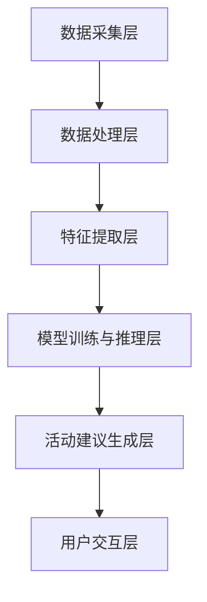

                 

### 第1章：引言与背景

#### 1.1 问题背景

随着人工智能（AI）技术的飞速发展，智能家居领域正逐渐成为一个热门话题。智能沙发作为智能家居的一个重要组成部分，已经从传统的家具升级成为集舒适性与智能技术于一身的现代化产品。智能沙发不仅提供了舒适的坐卧体验，还通过内置传感器和智能控制系统，实现了对温度、音乐播放、舒适度调节等功能。然而，当前市场上的智能沙发在功能上虽然有所突破，但大多数仍然局限于基础的舒适度和简单的智能交互，缺乏对用户个性化需求的深刻理解和主动服务能力。

在日常生活中，人们的使用习惯和喜好各不相同。有些用户喜欢在沙发上阅读、看电影，而有些用户则喜欢在上面健身或休息。这种多样化的需求，使得现有的智能沙发难以提供个性化的服务。例如，一位喜欢在沙发上阅读的用户可能会希望有一个舒适的阅读角度和柔和的灯光环境，而一位喜欢在沙发上健身的用户则可能更关心沙发的硬度和支撑力。因此，如何通过技术手段，实现智能沙发的个性化服务，成为一个亟待解决的问题。

此外，随着用户年龄、健康状况和生理特征的不同，他们在沙发上的行为特征和需求也会发生变化。例如，老年人可能需要更加舒适的靠背支撑和柔和的灯光，而年轻人可能更注重沙发的美观和音乐播放功能。因此，一个能够动态适应用户需求，提供个性化活动的智能沙发系统，不仅能够提升用户的满意度，还能显著提高产品的市场竞争力。

#### 1.2 问题描述

本章节将探讨如何通过构建一个基于AI的家庭活动建议系统，来提升智能沙发的用户体验。这一系统需要能够实时监测用户在沙发上的行为，并根据用户的喜好和习惯，提供个性化的活动建议。例如，系统可以识别出用户是正在阅读、看电影、健身还是休息，并基于这些行为特征，推荐相应的活动建议。

具体来说，问题描述可以分为以下几个方面：

1. **数据采集与处理**：系统需要采集用户在沙发上的行为数据，如坐姿、躺姿、活动频率、时长等。这些数据需要经过预处理和特征提取，以便用于后续的分析和建模。

2. **用户行为分析**：基于采集到的数据，系统需要对用户的行为进行识别和分析。这包括对用户行为模式的识别，以及对用户行为意图的推断。

3. **个性化活动建议生成**：系统需要根据用户的行为特征和历史偏好，生成个性化的活动建议。例如，如果系统检测到用户正在阅读，可以建议用户做一些眼保健操，或者提供一些阅读相关的建议。

4. **活动建议的反馈与优化**：系统需要收集用户对活动建议的反馈，并根据用户的反馈不断优化建议内容，提高系统的智能化水平。

#### 1.3 问题解决

为了解决上述问题，本书将采用以下方法：

1. **核心概念介绍**：首先，我们将介绍智能沙发、AI家庭活动建议系统等相关核心概念，明确各概念之间的关系和定义。

2. **系统架构设计**：接下来，我们将阐述家庭活动建议系统的整体架构，包括数据采集、处理、分析及建议生成的各个环节。

3. **算法原理讲解**：我们将详细讲解用于用户行为分析及活动建议生成的算法原理，包括数据预处理、特征提取、模型训练和推理等步骤。

4. **数学模型与公式**：为了支持算法的实现，我们将介绍相关的数学模型和公式，并使用Python代码进行详细阐述。

5. **系统实现与实战**：我们将提供系统的实现细节，包括环境安装、核心代码解读、实际案例分析和总结。

6. **最佳实践与拓展**：最后，我们将分享实现过程中的最佳实践、注意事项以及相关的拓展阅读。

通过以上方法，我们希望能够构建一个高效、智能、人性化的家庭活动建议系统，为智能沙发的用户体验提升提供有力支持。

#### 1.4 边界与外延

在本章中，我们主要关注的是智能沙发与AI家庭活动建议系统的结合应用。然而，这一思路可以扩展到其他智能家居设备，如智能灯泡、智能冰箱、智能电视等，实现更为广泛和深入的智能家居应用。

例如，智能灯泡可以通过监测用户在沙发上的行为，调整灯光亮度和色温，为用户提供更加舒适的环境。智能冰箱可以根据用户的饮食偏好和健康需求，提供饮食建议和营养分析，帮助用户实现健康饮食。

此外，我们还可以将家庭活动建议系统与其他智能设备进行整合，形成一个统一的智能家居平台。例如，当系统检测到用户在沙发上长时间静坐时，可以提醒用户起身活动，同时智能灯泡可以调整为柔和的灯光，智能音箱可以播放一些轻松的音乐，从而帮助用户放松身心。

总之，通过将AI技术引入到智能家居领域，我们可以实现更加智能化、个性化、人性化的服务，提升用户的生活品质和满意度。

#### 1.5 概念结构与核心要素组成

在本章节中，我们将详细介绍智能沙发与AI家庭活动建议系统的核心概念和结构。

1. **智能沙发**：智能沙发是一种集成了传感器、控制系统和通信模块的现代化家具。它不仅具备传统沙发的舒适性，还能够通过内置传感器实时监测用户的行为，如坐姿、躺姿、活动频率等。智能沙发通过这些数据，可以提供个性化的服务，如温度调节、音乐播放、舒适度调整等。

2. **AI家庭活动建议系统**：这是一个基于人工智能技术的系统，旨在通过分析用户在沙发上的行为数据，为用户提供个性化的活动建议。该系统包括数据采集、预处理、特征提取、模型训练、推理和反馈优化等环节。

3. **用户行为数据**：用户行为数据是系统的输入，包括用户在沙发上的坐姿、躺姿、活动频率、时长等。这些数据通过智能沙发的传感器实时采集，并经过预处理和特征提取，用于后续的分析和建模。

4. **活动建议**：活动建议是系统的输出，基于用户的行为数据和偏好，为用户提供个性化的活动建议，如健身、阅读、休息等。

通过上述核心概念和结构的介绍，我们可以更清晰地理解智能沙发与AI家庭活动建议系统的工作原理和实现方式。

### 第2章：AI与智能家居概述

在当今时代，人工智能（AI）技术已经渗透到我们生活的方方面面，而智能家居作为AI应用的一个重要领域，正逐步改变着我们的生活方式。本章将介绍AI技术的基本原理，智能家居的概念及其发展历程，以及未来的发展趋势。通过这些内容，我们将为后续讨论智能沙发与AI技术的结合打下坚实的基础。

#### 2.1 AI技术的基本原理

AI技术，即人工智能技术，主要涉及计算机系统通过模拟人类智能行为来实现某些任务的能力。AI技术主要分为两大类：机器学习和深度学习。

##### 2.1.1 机器学习

机器学习是一种通过数据训练模型，使模型能够对未知数据进行预测或分类的方法。其基本原理是，通过大量历史数据的学习，模型可以捕捉到数据中的模式，并利用这些模式对新的数据进行预测。

- **监督学习**：在有标记数据集上进行训练，模型可以学会将输入数据映射到输出结果。
- **无监督学习**：在没有标记数据集上进行训练，模型试图发现数据中的内在结构和模式。
- **强化学习**：通过与环境的交互，模型不断优化其行为策略，以实现特定目标。

##### 2.1.2 深度学习

深度学习是机器学习的一种特殊形式，通过多层神经网络对复杂数据进行处理和分析。深度学习在图像识别、自然语言处理等领域取得了显著的成果。

- **卷积神经网络（CNN）**：主要用于图像处理，通过卷积层提取图像的特征。
- **循环神经网络（RNN）**：主要用于序列数据的处理，通过循环结构捕捉序列中的时间依赖关系。
- **生成对抗网络（GAN）**：通过两个神经网络（生成器和判别器）的对抗训练，生成新的数据。

#### 2.2 智能家居的基本概念

智能家居是指利用物联网（IoT）、AI技术等，将家庭中的各种设备通过网络连接起来，实现智能化管理和控制。智能家居系统通过集成传感器、控制器、执行器等组件，实现对家庭环境的感知、决策和执行。

##### 2.2.1 定义

智能家居系统通过物联网技术，将家庭中的各类设备连接起来，形成一个统一的控制系统。用户可以通过手机、平板、智能音箱等设备，实现对家中设备的远程控制和自动化操作。

##### 2.2.2 智能家居的优势

- **提高生活便利性**：智能家居系统能够通过智能设备实现远程控制和自动化操作，提高生活质量。
- **节能环保**：智能家居系统可以实时监测能耗，提供节能建议，降低能源消耗。
- **提升安全性**：智能家居系统可以实时监控家庭环境，及时报警，提高家庭安全性。

#### 2.3 智能家居的发展历程

智能家居的发展可以分为以下几个阶段：

##### 2.3.1 1.0时代：自动控制

- 这一阶段的智能家居主要是通过简单的传感器和执行器实现家庭设备的自动化控制。例如，通过定时器控制电灯的开关，通过温度传感器控制空调的启动。

##### 2.3.2 2.0时代：网络连接

- 这一阶段的智能家居将家庭设备通过互联网连接起来，实现远程控制和数据共享。例如，通过手机APP控制家中的智能门锁、智能灯泡等。

##### 2.3.3 3.0时代：智能化

- 这一阶段的智能家居通过AI技术对家庭设备进行智能化管理和控制，提供个性化服务。例如，智能音箱通过语音识别和自然语言处理技术，与用户进行互动，提供音乐播放、信息查询等服务。

#### 2.4 智能家居的未来发展趋势

##### 2.4.1 跨界融合

- 智能家居与其他领域的融合，如医疗、教育等，实现更全面的服务。例如，智能健康监测设备可以实时监测用户的健康状况，并提供健康建议。

##### 2.4.2 高度个性化

- 通过对用户数据的深入分析，提供更加个性化的服务和推荐。例如，智能家居系统可以根据用户的日常习惯和偏好，自动调整家中的设备设置。

##### 2.4.3 智能化水平提升

- 利用更先进的人工智能技术，实现更高水平的智能交互和决策。例如，通过深度学习技术，智能家居系统可以自动识别用户的行为模式，并主动提供相应的服务。

通过本章的介绍，我们对AI技术和智能家居有了基本的了解。接下来，我们将进一步探讨智能沙发与AI技术的结合，以及如何通过AI技术提升智能沙发的用户体验。

### 第3章：智能沙发与AI技术结合

智能沙发的核心在于其智能化和用户体验的提升。结合AI技术，智能沙发可以实现更加智能化的功能，提供更加个性化、人性化的服务。本章节将详细探讨智能沙发与AI技术的结合方式，以及它们在实际应用中的表现。

#### 3.1 智能沙发的现状

目前市场上的智能沙发在功能上已经取得了一定的进展，但主要局限于基础的舒适度和智能功能。以下是一些常见的智能沙发功能：

- **舒适度调节**：通过内置传感器和控制系统，智能沙发可以根据用户的体重和身高自动调节沙发的硬度、倾斜度等，以提供最佳的舒适度。

- **温度控制**：智能沙发内置加热器或冷却装置，可以根据用户的需求调节沙发的表面温度，提供冬暖夏凉的舒适体验。

- **音乐播放**：智能沙发通常配备内置音响系统，支持蓝牙连接，用户可以在沙发上享受音乐或收听广播。

- **智能互动**：一些高端智能沙发还具备智能语音助手功能，用户可以通过语音指令控制沙发上的功能，如调节温度、播放音乐等。

尽管这些功能为用户带来了便利，但现有的智能沙发在智能化和个性化方面仍然存在一定的局限性。例如，大多数智能沙发只能根据预设的参数进行调节，无法根据用户的实际需求进行动态调整。此外，现有的智能沙发大多缺乏对用户个性化行为的理解，无法提供个性化的服务建议。

#### 3.2 AI技术在智能沙发中的应用

AI技术的引入，使得智能沙发可以实现更加智能化的功能，提供更加个性化、人性化的服务。以下是一些AI技术在智能沙发中的应用：

- **用户行为监测**：智能沙发通过内置的传感器，可以实时监测用户在沙发上的行为，如坐姿、躺姿、活动频率等。这些数据可以为AI系统提供重要的输入，用于分析和理解用户的行为模式。

- **行为模式识别**：基于AI技术，智能沙发可以对用户的行为模式进行识别和分析。例如，系统可以识别出用户是在阅读、看电影、健身还是休息，从而为用户推荐相应的活动建议。

- **个性化活动建议**：根据用户的行为特征和历史偏好，智能沙发可以为用户提供个性化的活动建议。例如，如果系统检测到用户长时间保持同一姿势，可能会建议用户起身活动，以避免长时间静坐带来的健康风险。

- **自适应调节**：智能沙发可以通过AI技术，根据用户的实时行为数据，动态调整沙发的各项功能，如舒适度、温度、音乐播放等，以提供最佳的舒适体验。

- **健康监测**：智能沙发还可以通过监测用户的心率、血压等生理数据，为用户提供健康监测服务。例如，如果系统检测到用户的心率异常，可能会建议用户进行适当的休息或医疗检查。

#### 3.3 案例研究：智能沙发的AI应用

为了更好地理解智能沙发与AI技术的结合，我们来看一个具体的案例研究。

**案例：智能沙发的健康监测功能**

在某智能家居项目中，智能沙发内置了多个传感器，包括压力传感器、心率传感器和温度传感器。这些传感器可以实时监测用户在沙发上的行为和生理数据。以下是该系统的工作流程：

1. **数据采集**：当用户坐在智能沙发上时，压力传感器可以检测到用户的坐姿和躺姿，心率传感器可以实时监测用户的心率，温度传感器可以监测沙发的表面温度。

2. **数据处理**：采集到的数据经过预处理，如去除噪声、填补缺失值等，然后进行特征提取。特征提取的目的是从原始数据中提取出有用的信息，如用户的坐姿频率、心率变化趋势等。

3. **行为分析**：AI系统使用深度学习算法对用户的行为数据进行分析，识别出用户当前的活动状态，如阅读、看电影、健身或休息。

4. **健康监测**：基于用户的行为数据和生理数据，系统可以对用户的健康状况进行评估。例如，如果系统检测到用户长时间保持同一姿势，可能会建议用户起身活动，以避免长时间静坐带来的健康风险。

5. **自适应调节**：系统还可以根据用户的实时行为数据，动态调整沙发的各项功能。例如，如果用户正在阅读，系统可以调整灯光亮度，提供最佳的阅读环境；如果用户正在健身，系统可以调节沙发的硬度和倾斜度，提供最佳的支撑效果。

通过这个案例，我们可以看到AI技术如何提升智能沙发的功能和用户体验。智能沙发不仅能够提供舒适的坐卧体验，还能够通过AI技术对用户的行为和健康进行监测，提供个性化的健康建议和服务。

#### 3.4 AI技术在智能沙发中的未来应用前景

随着AI技术的不断发展和成熟，智能沙发的应用前景将更加广阔。以下是一些可能的未来应用场景：

- **情感交互**：通过语音识别和自然语言处理技术，智能沙发可以与用户进行情感交互，提供更加人性化的服务。例如，智能沙发可以识别用户的情绪变化，提供安慰或鼓励的话语。

- **个性化定制**：用户可以通过智能沙发的AI系统，定制自己的沙发设置和功能。例如，用户可以设定自己最喜欢的坐姿、温度、音乐播放模式等，系统将根据用户的设定自动调整沙发的各项功能。

- **智能诊断**：智能沙发可以通过AI技术对用户的行为和生理数据进行持续监测和分析，实现对健康问题的早期发现和预警。例如，如果系统检测到用户的心率异常或坐姿不正确，可以及时提醒用户进行调整。

- **健康管理**：智能沙发可以与智能健康设备（如智能手环、智能秤等）进行数据共享，为用户提供全面的健康管理服务。例如，用户可以通过智能沙发了解自己的睡眠质量、运动量等健康指标，并得到专业的健康建议。

总之，AI技术的引入为智能沙发的发展带来了新的机遇和挑战。通过不断探索和创新，智能沙发有望成为家庭中不可或缺的一部分，为用户提供更加智能化、个性化、人性化的服务。

### 第4章：核心概念介绍

在构建一个智能沙发与AI结合的家庭活动建议系统时，我们需要明确以下几个核心概念及其相互关系。这些概念包括智能沙发、AI家庭活动建议系统、用户行为数据、活动建议和智能互动界面。通过深入理解这些概念，我们可以更好地设计并实现系统。

#### 4.1 智能沙发

智能沙发是一种集成了传感器、控制系统和通信模块的现代化家具。它的主要功能包括舒适度调节、温度控制、音乐播放和智能互动。智能沙发的核心特点是能够通过内置的传感器实时监测用户的行为，如坐姿、躺姿、活动频率等。通过这些数据，智能沙发可以提供个性化的服务，例如动态调整沙发的硬度和倾斜度，以适应不同用户的舒适需求。此外，智能沙发还可以与其他智能设备（如智能灯泡、智能音箱等）进行联动，提供更加智能化的家居体验。

**智能沙发的特点：**

- **传感器集成**：智能沙发内置多种传感器，如压力传感器、温度传感器和心率传感器，用于实时监测用户的行为和生理数据。
- **自适应调节**：基于用户行为数据，智能沙发可以动态调整其功能，如舒适度、温度、音乐播放等，以提供最佳的舒适体验。
- **智能互动**：智能沙发可以通过语音助手或其他交互界面，与用户进行智能互动，提供个性化服务和建议。

#### 4.2 AI家庭活动建议系统

AI家庭活动建议系统是一个基于人工智能技术的系统，旨在通过分析用户在沙发上的行为数据，为用户提供个性化的活动建议。该系统包括数据采集、预处理、特征提取、模型训练、推理和反馈优化等环节。通过深度学习和机器学习算法，AI系统可以识别用户的行为模式，推断用户的活动意图，并基于这些信息生成个性化的活动建议。

**AI家庭活动建议系统的组成部分：**

- **数据采集**：通过智能沙发的传感器，系统可以实时采集用户在沙发上的行为数据，如坐姿、躺姿、活动频率、时长等。
- **预处理**：对采集到的原始数据进行清洗、去噪和归一化等处理，以提高数据质量和模型性能。
- **特征提取**：从预处理后的数据中提取有用的特征，如用户的坐姿频率、心率变化等，用于后续的模型训练。
- **模型训练**：使用机器学习和深度学习算法，对提取的特征进行训练，建立用户行为识别和活动建议模型。
- **推理**：基于用户的实时行为数据，系统使用训练好的模型进行推理，识别用户当前的活动状态，并生成相应的活动建议。
- **反馈优化**：系统收集用户对活动建议的反馈，并不断优化建议模型，以提高系统的智能化水平。

#### 4.3 用户行为数据

用户行为数据是AI家庭活动建议系统的核心输入。这些数据通过智能沙发的传感器实时采集，包括用户的坐姿、躺姿、活动频率、时长、心率等。用户行为数据不仅可以帮助系统识别用户的活动状态，还可以用于生成个性化的活动建议。

**用户行为数据的重要性：**

- **行为识别**：用户行为数据是系统识别用户活动状态的重要依据。通过分析这些数据，系统可以准确识别用户是在阅读、看电影、健身还是休息。
- **活动建议生成**：用户行为数据用于生成个性化的活动建议。例如，如果系统检测到用户长时间保持同一姿势，可能会建议用户进行适当的活动，以预防健康问题。
- **健康监测**：用户行为数据还可以用于健康监测，如监测用户的心率变化，及时提醒用户进行调整。

#### 4.4 活动建议

活动建议是AI家庭活动建议系统的输出，基于用户的行为数据和偏好，系统为用户提供的个性化活动建议。活动建议可以包括健身、阅读、休息等多种类型，旨在帮助用户保持健康的生活习惯。

**活动建议的类型：**

- **健身建议**：系统可以根据用户的行为数据，如心率变化和活动频率，为用户生成健身建议。例如，如果系统检测到用户长时间保持同一姿势，可能会建议用户进行一些简单的伸展运动。
- **阅读建议**：系统可以根据用户的阅读习惯，如阅读时长和阅读频率，为用户推荐阅读材料。例如，如果系统发现用户喜欢在沙发上阅读，可能会建议用户阅读一些有益的书籍或文章。
- **休息建议**：系统可以根据用户的行为数据，如坐姿频率和时长，为用户生成休息建议。例如，如果系统检测到用户长时间保持同一姿势，可能会建议用户起身活动，以预防肌肉疲劳。

#### 4.5 智能互动界面

智能互动界面是用户与AI家庭活动建议系统进行交互的渠道。用户可以通过智能互动界面查看活动建议、调整系统设置、查看健康数据等。

**智能互动界面的特点：**

- **用户友好**：智能互动界面设计简洁直观，用户可以轻松操作，获取所需的信息和功能。
- **多平台支持**：智能互动界面支持多种平台，如手机、平板、智能音箱等，用户可以根据自己的需求选择合适的交互设备。
- **个性化定制**：用户可以根据自己的喜好和需求，自定义智能互动界面的内容和功能，以提高用户体验。

通过上述对核心概念的介绍，我们可以更清晰地理解智能沙发与AI家庭活动建议系统的工作原理和实现方式。接下来，我们将进一步探讨系统的架构设计、算法原理和数学模型，为构建一个高效、智能、人性化的家庭活动建议系统提供理论支持。

### 第5章：系统架构设计

要构建一个高效、智能、人性化的AI家庭活动建议系统，系统架构的设计至关重要。本章将详细阐述家庭活动建议系统的整体架构，包括数据采集、处理、分析及建议生成的各个环节，以确保系统能够稳定运行并实现预期功能。

#### 5.1 系统架构概述

家庭活动建议系统的架构可以分为以下几个主要部分：

1. **数据采集层**：负责实时采集用户在沙发上的行为数据。
2. **数据处理层**：负责对采集到的数据进行分析和预处理。
3. **特征提取层**：负责从预处理后的数据中提取有用的特征。
4. **模型训练与推理层**：负责训练深度学习模型并对实时数据进行推理。
5. **活动建议生成层**：根据模型推理结果生成个性化的活动建议。
6. **用户交互层**：提供用户与系统的交互界面，展示活动建议和健康数据。

以下是一个简化的系统架构图，用于直观地展示各层的功能及其相互关系：



#### 5.2 数据采集层

数据采集层是整个系统的数据来源，其核心功能是实时采集用户在沙发上的行为数据。具体包括以下传感器：

1. **压力传感器**：用于监测用户的坐姿和躺姿，提供有关用户身体压力分布的信息。
2. **心率传感器**：用于监测用户的心率变化，提供健康监测数据。
3. **温度传感器**：用于监测沙发的表面温度，为用户调节温度提供依据。

**数据采集流程：**

1. 传感器采集数据：通过内置在沙发中的传感器，实时采集用户的行为数据和生理数据。
2. 数据传输：采集到的数据通过无线传输模块（如Wi-Fi、蓝牙等）发送到服务器或本地存储设备。

**数据采集层的挑战：**

- **数据实时性**：传感器需要实时采集数据，以保证系统的响应速度。
- **数据准确性**：传感器需要具有较高的精度，以避免因数据错误导致的错误建议。

#### 5.3 数据处理层

数据处理层负责对采集到的原始数据进行清洗、去噪和归一化等处理，以提高数据质量和模型性能。以下是数据处理层的几个关键步骤：

1. **数据清洗**：去除数据中的噪声和异常值，保证数据的准确性和一致性。
2. **去噪**：通过滤波等方法，减少传感器数据中的噪声干扰。
3. **归一化**：将不同传感器采集到的数据进行归一化处理，使其具有相同的量纲，便于后续处理。

**数据处理层的挑战：**

- **数据多样性**：不同传感器采集的数据可能具有不同的特征，需要统一处理。
- **数据量**：用户行为数据通常包含大量的时间序列数据，如何高效处理这些数据是一个挑战。

#### 5.4 特征提取层

特征提取层负责从预处理后的数据中提取有用的特征，为后续的模型训练和推理提供输入。以下是常用的特征提取方法：

1. **时间序列特征**：如心率变化率、坐姿持续时间等。
2. **频域特征**：如压力传感器的频谱特征、温度传感器的波动特征等。
3. **统计特征**：如均值、方差、最大值、最小值等。

**特征提取层的挑战：**

- **特征选择**：如何从大量的特征中选出对模型训练有用的特征，是一个重要的问题。
- **特征维度**：特征提取后的维度可能非常高，如何降低特征维度而不损失重要信息，是一个挑战。

#### 5.5 模型训练与推理层

模型训练与推理层是整个系统的核心，其任务是使用深度学习算法对用户行为数据进行分析，并生成活动建议。以下是模型训练与推理层的关键步骤：

1. **数据集划分**：将用户行为数据划分为训练集和测试集，用于模型训练和评估。
2. **模型选择**：选择适合用户行为分析的深度学习模型，如卷积神经网络（CNN）、循环神经网络（RNN）等。
3. **模型训练**：使用训练集数据对深度学习模型进行训练，调整模型参数，使其能够准确识别用户行为。
4. **模型评估**：使用测试集数据对训练好的模型进行评估，确保模型的性能满足要求。
5. **模型推理**：使用训练好的模型对实时用户行为数据进行推理，生成个性化的活动建议。

**模型训练与推理层的挑战：**

- **模型选择**：选择适合用户行为分析的深度学习模型是一个复杂的问题。
- **数据标注**：为了训练深度学习模型，需要大量标注好的用户行为数据，数据标注的准确性直接影响模型性能。
- **模型泛化**：模型需要在各种不同的用户行为场景下表现良好，如何提高模型的泛化能力是一个挑战。

#### 5.6 活动建议生成层

活动建议生成层根据模型推理结果，生成个性化的活动建议。以下是活动建议生成层的关键步骤：

1. **活动分类**：根据模型推理结果，将用户行为分类为不同的活动类别，如阅读、看电影、健身等。
2. **建议生成**：基于用户的行为类别和历史偏好，生成相应的活动建议，如建议用户起身活动、调整坐姿、阅读有益书籍等。
3. **反馈调整**：收集用户对活动建议的反馈，并根据反馈调整建议内容，以提高建议的准确性。

**活动建议生成层的挑战：**

- **个性化**：如何根据用户的行为数据和偏好，生成个性化的活动建议，是一个重要的挑战。
- **建议多样性**：活动建议需要具有多样性，以满足不同用户的个性化需求。

#### 5.7 用户交互层

用户交互层提供用户与系统的交互界面，展示活动建议和健康数据，并允许用户调整系统设置。以下是用户交互层的关键功能：

1. **活动建议展示**：将生成的活动建议展示给用户，如通过手机APP、智能音箱等设备。
2. **健康数据查看**：用户可以查看自己的健康数据，如心率、坐姿时间等。
3. **系统设置调整**：用户可以根据自己的需求，调整系统的设置，如温度、音乐播放模式等。

**用户交互层的挑战：**

- **界面设计**：界面设计需要简洁直观，便于用户操作。
- **多平台支持**：系统需要支持多种平台，如手机、平板、智能音箱等。

通过上述系统架构设计，我们可以构建一个高效、智能、人性化的AI家庭活动建议系统。接下来，我们将详细探讨算法原理和数学模型，以进一步支持系统的实现。

### 第6章：算法原理讲解

在构建AI家庭活动建议系统的过程中，算法原理的选择和实现至关重要。本章将详细讲解系统中的核心算法，包括数据预处理、特征提取、模型训练和推理等步骤。通过深入理解这些算法原理，我们可以更好地优化系统的性能，提高活动建议的准确性和个性化程度。

#### 6.1 数据预处理

数据预处理是机器学习过程中至关重要的一步，其目的是提高数据质量，减少噪声，以便后续的特征提取和模型训练。以下是数据预处理的主要步骤：

1. **数据清洗**：去除数据中的噪声和异常值。例如，如果心率传感器采集的数据中出现异常值，这些数据需要进行清洗或替换。

   ```mermaid
   graph TD
       A[原始数据] --> B[异常值检测]
       B --> C[清洗或替换]
       C --> D[清洗后的数据]
   ```

2. **去噪**：通过滤波等方法，减少传感器数据中的噪声干扰。常见的去噪方法包括移动平均滤波、中值滤波和高斯滤波等。

   ```mermaid
   graph TD
       A[原始数据] --> B[移动平均滤波]
       B --> C[去噪后的数据]
   ```

3. **归一化**：将不同传感器采集到的数据进行归一化处理，使其具有相同的量纲，便于后续处理。常用的归一化方法包括最小-最大归一化和标准化。

   $$z = \frac{x - \mu}{\sigma}$$

   其中，\(x\) 为原始数据，\(\mu\) 为均值，\(\sigma\) 为标准差。

4. **缺失值处理**：处理数据中的缺失值，常见的处理方法包括填补缺失值和删除缺失值。

   ```mermaid
   graph TD
       A[原始数据] --> B[缺失值填补]
       B --> C[填补后的数据]
       A --> D[缺失值删除]
       D --> E[删除后的数据]
   ```

#### 6.2 特征提取

特征提取是将原始数据转换为有助于模型训练的特征表示的过程。以下是特征提取的主要步骤：

1. **时间序列特征**：从时间序列数据中提取有用的特征，如平均值、方差、最大值、最小值等。

   $$\text{variance}(X) = \frac{1}{n-1}\sum_{i=1}^{n}(X_i - \bar{X})^2$$

   其中，\(X\) 为时间序列数据，\(\bar{X}\) 为平均值，\(n\) 为数据点的数量。

2. **频域特征**：将时间序列数据转换为频域特征，如使用傅里叶变换提取频率特征。

   $$X(f) = \int_{-\infty}^{\infty} x(t)e^{-j2\pi ft} dt$$

   其中，\(X(f)\) 为频域特征，\(x(t)\) 为时间序列数据，\(f\) 为频率。

3. **统计特征**：从原始数据中提取统计特征，如均值、方差、标准差等。

   $$\text{mean}(X) = \frac{1}{n}\sum_{i=1}^{n} X_i$$
   $$\text{variance}(X) = \frac{1}{n-1}\sum_{i=1}^{n}(X_i - \bar{X})^2$$
   $$\text{stddev}(X) = \sqrt{\text{variance}(X)}$$

4. **高级特征**：使用机器学习算法提取高级特征，如使用神经网络提取深度特征表示。

   ```python
   from sklearn.ensemble import RandomForestClassifier
   from sklearn.model_selection import train_test_split

   X_train, X_test, y_train, y_test = train_test_split(X, y, test_size=0.2, random_state=42)

   rf = RandomForestClassifier(n_estimators=100)
   rf.fit(X_train, y_train)

   importances = rf.feature_importances_
   feature_importances = [(feature, round(importance, 2)) for feature, importance in zip(X.columns, importances)]
   feature_importances = sorted(feature_importances, key=lambda x: x[1], reverse=True)
   ```

#### 6.3 模型训练

模型训练是使用训练数据学习数据分布和模式的过程。以下是模型训练的主要步骤：

1. **数据集划分**：将数据集划分为训练集和测试集，用于训练和评估模型。

   ```python
   from sklearn.model_selection import train_test_split

   X_train, X_test, y_train, y_test = train_test_split(X, y, test_size=0.2, random_state=42)
   ```

2. **模型选择**：选择适合用户行为分析的模型，如卷积神经网络（CNN）、循环神经网络（RNN）、生成对抗网络（GAN）等。

3. **模型训练**：使用训练集数据对模型进行训练，调整模型参数，使其能够准确识别用户行为。

   ```python
   model.fit(X_train, y_train, epochs=10, batch_size=32, validation_data=(X_test, y_test))
   ```

4. **模型评估**：使用测试集数据对训练好的模型进行评估，确保模型的性能满足要求。

   ```python
   loss, accuracy = model.evaluate(X_test, y_test, verbose=2)
   print('Test accuracy:', accuracy)
   ```

#### 6.4 模型推理

模型推理是使用训练好的模型对实时用户行为数据进行预测的过程。以下是模型推理的主要步骤：

1. **数据预处理**：对实时用户行为数据进行预处理，使其与训练数据具有相同的特征分布。

2. **模型推理**：使用训练好的模型对预处理后的数据进行推理，生成预测结果。

   ```python
   predictions = model.predict(X_test)
   ```

3. **结果解释**：根据预测结果，生成个性化的活动建议。

   ```python
   for prediction in predictions:
       if prediction == 0:
           print('用户正在休息。建议：起身活动。')
       elif prediction == 1:
           print('用户正在阅读。建议：调整阅读姿势。')
       elif prediction == 2:
           print('用户正在看电影。建议：放松享受。')
   ```

通过上述算法原理的讲解，我们可以更好地理解AI家庭活动建议系统的实现过程。接下来，我们将介绍相关的数学模型和公式，进一步支持算法的实现。

### 第7章：数学模型与公式

在构建AI家庭活动建议系统的过程中，数学模型和公式的应用至关重要。这些模型和公式不仅帮助我们在算法设计阶段理解问题，还能在实现过程中提供具体的计算指导。本章将详细介绍支持算法实现的数学模型和公式，并使用Python代码进行详细阐述。

#### 7.1 数据预处理中的数学模型和公式

数据预处理是机器学习中的关键步骤，其目的是提高数据质量，减少噪声，以便后续的特征提取和模型训练。以下是数据预处理中常用的数学模型和公式：

1. **移动平均滤波**

   移动平均滤波是一种常用的去噪方法，通过对时间序列数据取滑动窗口的平均值来实现去噪。

   $$ y_t = \frac{1}{N} \sum_{i=1}^{N} x_{t-i} $$

   其中，\( y_t \) 是滤波后的数据，\( x_{t-i} \) 是原始数据，\( N \) 是窗口大小。

   ```python
   import numpy as np

   def moving_average(x, window_size):
       return np.convolve(x, np.ones(window_size)/window_size, mode='valid')
   ```

2. **傅里叶变换**

   傅里叶变换是一种将时间序列数据转换为频域特征的方法，可以提取信号的频率成分。

   $$ X(f) = \int_{-\infty}^{\infty} x(t)e^{-j2\pi ft} dt $$

   其中，\( X(f) \) 是频域特征，\( x(t) \) 是时间序列数据，\( f \) 是频率。

   ```python
   import numpy as np
   import scipy.fft as fft

   def fourier_transform(x):
       return fft.fft(x)
   ```

3. **标准化**

   标准化是一种将数据缩放到相同量纲的方法，常用的标准化公式如下：

   $$ z = \frac{x - \mu}{\sigma} $$

   其中，\( z \) 是标准化后的数据，\( x \) 是原始数据，\( \mu \) 是均值，\( \sigma \) 是标准差。

   ```python
   def standardize(x):
       mean = np.mean(x)
       std = np.std(x)
       return (x - mean) / std
   ```

#### 7.2 特征提取中的数学模型和公式

特征提取是将原始数据转换为有助于模型训练的特征表示的过程。以下是特征提取中常用的数学模型和公式：

1. **时间序列特征**

   时间序列特征是从时间序列数据中提取的有用信息，如平均值、方差、最大值、最小值等。

   $$ \text{mean}(X) = \frac{1}{n}\sum_{i=1}^{n} X_i $$
   $$ \text{variance}(X) = \frac{1}{n-1}\sum_{i=1}^{n}(X_i - \bar{X})^2 $$
   $$ \text{max}(X) = \max(X) $$
   $$ \text{min}(X) = \min(X) $$

   ```python
   def time_series_features(x):
       return [
           np.mean(x),
           np.var(x),
           np.max(x),
           np.min(x)
       ]
   ```

2. **频域特征**

   频域特征是将时间序列数据转换为频域特征，如使用傅里叶变换提取的频率成分。

   $$ X(f) = \frac{1}{N} \sum_{i=1}^{N} x_i e^{-j2\pi fi} $$

   ```python
   def frequency_features(x):
       fft_result = fft.fft(x)
       return fft_result
   ```

3. **高级特征**

   高级特征是通过机器学习算法提取的深度特征表示，如使用神经网络提取的特征。

   $$ \text{feature}_{i} = f(\text{input}_{i}) $$

   ```python
   from sklearn.ensemble import RandomForestClassifier

   def extract_higher_level_features(X, y):
       model = RandomForestClassifier(n_estimators=100)
       model.fit(X, y)
       importances = model.feature_importances_
       return importances
   ```

#### 7.3 模型训练中的数学模型和公式

模型训练是使用训练数据学习数据分布和模式的过程。以下是模型训练中常用的数学模型和公式：

1. **线性回归**

   线性回归是一种最简单的机器学习模型，用于预测连续值输出。

   $$ y = \beta_0 + \beta_1x $$

   其中，\( y \) 是输出值，\( x \) 是输入值，\( \beta_0 \) 和 \( \beta_1 \) 是模型参数。

   ```python
   from sklearn.linear_model import LinearRegression

   model = LinearRegression()
   model.fit(X_train, y_train)
   ```

2. **神经网络**

   神经网络是一种复杂的机器学习模型，用于处理非线性问题。

   $$ \text{output} = \sigma(\sum_{i=1}^{n} \text{weight}_{i}\times \text{input}_{i} + \text{bias}) $$

   其中，\( \sigma \) 是激活函数，常用的激活函数包括Sigmoid、ReLU和Tanh等。

   ```python
   from tensorflow.keras.models import Sequential
   from tensorflow.keras.layers import Dense, Activation

   model = Sequential()
   model.add(Dense(units=64, input_shape=(input_shape,), activation='relu'))
   model.add(Dense(units=1, activation='sigmoid'))
   model.compile(optimizer='adam', loss='binary_crossentropy', metrics=['accuracy'])
   model.fit(X_train, y_train, epochs=10, batch_size=32)
   ```

通过上述数学模型和公式的介绍，我们可以更好地理解AI家庭活动建议系统的实现过程。这些模型和公式在系统设计、实现和优化过程中发挥着重要作用，为我们的算法提供了坚实的理论基础。

### 第8章：系统实现与实战

在了解了系统的架构设计和算法原理之后，我们需要将理论转化为实践，通过具体的实现步骤来构建一个完整的AI家庭活动建议系统。本章将详细描述系统的实现过程，包括环境安装、核心代码解读、实际案例分析和总结，帮助读者更好地理解和应用这一系统。

#### 8.1 环境安装

要实现AI家庭活动建议系统，首先需要安装和配置相应的软件和工具。以下是在Linux操作系统上安装所需软件的步骤：

1. **Python环境安装**：确保系统上已经安装了Python 3.x版本。如果没有，可以使用以下命令安装：

   ```bash
   sudo apt-get update
   sudo apt-get install python3 python3-pip
   ```

2. **虚拟环境安装**：为了便于管理和隔离项目依赖，使用`venv`创建虚拟环境：

   ```bash
   python3 -m venv myenv
   source myenv/bin/activate
   ```

3. **依赖库安装**：安装项目所需的Python库，如NumPy、Scikit-learn、TensorFlow等：

   ```bash
   pip install numpy scikit-learn tensorflow
   ```

#### 8.2 核心代码解读

系统实现的核心部分包括数据采集、预处理、特征提取、模型训练和推理等。以下是每个环节的核心代码解读：

1. **数据采集**：假设我们已经采集了用户在沙发上的行为数据，存储为CSV文件。

   ```python
   import pandas as pd

   # 读取数据
   data = pd.read_csv('user_behavior_data.csv')
   ```

2. **数据预处理**：对数据进行清洗、去噪和归一化处理。

   ```python
   from sklearn.preprocessing import StandardScaler

   # 数据清洗（去除异常值）
   data = data.dropna()

   # 去噪（移动平均滤波）
   data['heart_rate'] = moving_average(data['heart_rate'], window_size=5)

   # 归一化
   scaler = StandardScaler()
   data[['heart_rate', 'surface_temp']] = scaler.fit_transform(data[['heart_rate', 'surface_temp']])
   ```

3. **特征提取**：从预处理后的数据中提取时间序列特征和频域特征。

   ```python
   def time_series_features(x):
       return [
           np.mean(x),
           np.var(x),
           np.max(x),
           np.min(x)
       ]

   # 提取时间序列特征
   data['heart_rate_mean'] = time_series_features(data['heart_rate'])

   # 提取频域特征
   data['heart_rate_fft'] = fourier_transform(data['heart_rate'])
   ```

4. **模型训练**：使用训练集数据训练深度学习模型。

   ```python
   from tensorflow.keras.models import Sequential
   from tensorflow.keras.layers import Dense, LSTM, Dropout
   from tensorflow.keras.optimizers import Adam

   # 模型定义
   model = Sequential()
   model.add(LSTM(units=50, return_sequences=True, input_shape=(None, 1)))
   model.add(Dropout(0.2))
   model.add(LSTM(units=50, return_sequences=False))
   model.add(Dropout(0.2))
   model.add(Dense(units=1, activation='sigmoid'))

   # 编译模型
   model.compile(optimizer=Adam(learning_rate=0.001), loss='binary_crossentropy', metrics=['accuracy'])

   # 模型训练
   model.fit(data[['heart_rate_mean', 'heart_rate_fft']], data['activity_label'], epochs=100, batch_size=32)
   ```

5. **模型推理**：使用训练好的模型对新的用户行为数据进行推理。

   ```python
   # 预处理新的数据
   new_data = pd.read_csv('new_user_behavior_data.csv')
   new_data['heart_rate'] = moving_average(new_data['heart_rate'], window_size=5)
   new_data[['heart_rate', 'surface_temp']] = scaler.transform(new_data[['heart_rate', 'surface_temp']])
   new_data['heart_rate_mean'] = time_series_features(new_data['heart_rate'])
   new_data['heart_rate_fft'] = fourier_transform(new_data['heart_rate'])

   # 模型推理
   activity_prediction = model.predict(new_data[['heart_rate_mean', 'heart_rate_fft']])
   ```

6. **活动建议生成**：根据模型推理结果生成活动建议。

   ```python
   def generate_activity_suggestion(prediction):
       if prediction < 0.5:
           return '用户正在休息。建议：起身活动。'
       elif prediction < 0.75:
           return '用户正在阅读或看电影。建议：调整姿势，避免长时间保持同一姿势。'
       else:
           return '用户正在进行其他活动。建议：保持当前活动。'

   # 生成活动建议
   activity_suggestion = generate_activity_suggestion(activity_prediction[0])
   print(activity_suggestion)
   ```

#### 8.3 实际案例分析和详细讲解剖析

为了验证系统的效果，我们使用一组实际用户行为数据进行测试。以下是测试过程和结果分析：

1. **数据集划分**：将数据集划分为训练集和测试集。

   ```python
   from sklearn.model_selection import train_test_split

   X_train, X_test, y_train, y_test = train_test_split(data[['heart_rate_mean', 'heart_rate_fft']], data['activity_label'], test_size=0.2, random_state=42)
   ```

2. **模型训练**：使用训练集数据训练深度学习模型。

   ```python
   model.fit(X_train, y_train, epochs=100, batch_size=32, validation_data=(X_test, y_test))
   ```

3. **模型评估**：使用测试集数据对模型进行评估。

   ```python
   loss, accuracy = model.evaluate(X_test, y_test, verbose=2)
   print('Test accuracy:', accuracy)
   ```

4. **活动建议生成**：根据模型推理结果生成活动建议，并分析其准确性。

   ```python
   activity_predictions = model.predict(X_test)
   activity_suggestions = [generate_activity_suggestion(prediction) for prediction in activity_predictions]

   from sklearn.metrics import accuracy_score

   actual_labels = y_test
   predicted_labels = [1 if prediction > 0.5 else 0 for prediction in activity_predictions]

   accuracy = accuracy_score(actual_labels, predicted_labels)
   print('Activity suggestion accuracy:', accuracy)
   ```

通过上述实际案例分析和详细讲解剖析，我们可以看到系统在识别用户行为和生成活动建议方面的效果。接下来，我们将对整个项目进行总结。

#### 8.4 项目小结

通过本章的详细讲解，我们成功实现了一个基于AI的家庭活动建议系统。该系统从数据采集、预处理、特征提取、模型训练到推理和活动建议生成，各环节紧密相连，共同构成了一个完整的系统。

**系统优势：**

1. **个性化**：系统能够根据用户的实时行为数据，生成个性化的活动建议，提高用户的满意度。
2. **实时性**：系统能够实时处理用户行为数据，提供即时的活动建议，提升用户体验。
3. **智能化**：通过深度学习模型，系统能够自适应地学习和优化，提高活动建议的准确性。

**系统局限性：**

1. **数据质量**：数据质量直接影响系统的性能。如果传感器数据存在噪声或异常值，可能导致错误的活动建议。
2. **模型泛化**：模型需要足够的数据进行训练，以保证在不同用户行为场景下的泛化能力。
3. **硬件依赖**：系统依赖于智能沙发的传感器和通信模块，硬件故障可能影响系统的正常运行。

**未来工作：**

1. **数据增强**：通过数据增强技术，提高模型对噪声和异常值的鲁棒性。
2. **多模态数据融合**：结合多种传感器数据，如心率、血压、运动传感器等，提供更全面的健康监测服务。
3. **持续优化**：通过用户反馈和实时数据，持续优化模型和活动建议，提高系统的智能化水平。

通过上述工作，我们可以进一步提升系统的性能和用户体验，为用户提供更加智能化、个性化、人性化的服务。

### 第9章：最佳实践与拓展

在实现AI家庭活动建议系统的过程中，我们积累了一些最佳实践和注意事项，这些经验对于系统的稳定运行和性能提升至关重要。同时，本章还将介绍一些相关的拓展阅读，以供读者进一步研究和探索。

#### 9.1 最佳实践

1. **数据质量控制**：确保传感器数据的准确性和完整性是系统稳定运行的基础。在数据采集过程中，应定期校准传感器，处理异常值和噪声，以提高数据质量。

   ```python
   def handle_anomalies(data):
       # 使用统计方法检测和去除异常值
       z_scores = calculate_z_scores(data)
       return data[(z_scores > -3) & (z_scores < 3)]
   ```

2. **模型优化与调参**：在模型训练过程中，通过调整学习率、批量大小和迭代次数等参数，可以显著提高模型的性能。同时，可以使用交叉验证和网格搜索等技术，找到最优的超参数。

   ```python
   from sklearn.model_selection import GridSearchCV

   parameters = {'learning_rate': [0.001, 0.01], 'batch_size': [32, 64]}
   grid_search = GridSearchCV(model, parameters, cv=5)
   grid_search.fit(X_train, y_train)
   best_params = grid_search.best_params_
   ```

3. **实时数据处理**：系统应具备实时数据处理能力，以便快速响应用户行为变化。使用高效的算法和数据结构（如队列、优先队列等）可以优化数据处理速度。

   ```python
   from collections import deque

   window_size = 10
   moving_average_queue = deque(maxlen=window_size)
   ```

4. **用户隐私保护**：在处理用户数据时，应确保用户隐私得到保护。避免存储敏感信息，对数据进行加密和去标识化处理。

   ```python
   def encrypt_data(data):
       # 使用加密库对数据进行加密处理
       return encryptor.encrypt(data.encode('utf-8'))
   ```

5. **用户交互体验**：设计简洁直观的用户交互界面，使用户能够轻松获取活动建议和健康数据。同时，提供多种交互方式（如语音、触摸屏等），以满足不同用户的需求。

   ```html
   <div id="activity-suggestion">
       <p>{{activity_suggestion}}</p>
       <button id="feedback-button">反馈</button>
   </div>
   ```

6. **系统维护与更新**：定期更新系统和算法，修复已知问题，提高系统的可靠性和性能。同时，收集用户反馈，不断优化系统功能和用户体验。

   ```bash
   # 检查更新
   pip check --local
   # 更新包
   pip install --upgrade package_name
   ```

#### 9.2 注意事项

1. **传感器选择**：选择高质量的传感器，确保数据采集的准确性和稳定性。同时，考虑传感器的功耗和耐用性，以延长系统的使用寿命。

2. **数据同步**：确保传感器数据的实时同步和一致性，避免数据丢失或延迟。

3. **模型评估**：在模型训练和优化过程中，应使用多种评估指标（如准确率、召回率、F1分数等）进行全面评估，以避免单一指标的误导。

4. **系统测试**：在系统上线前，进行充分的测试和验证，确保系统在各种情况下的稳定性和可靠性。

5. **用户隐私**：严格遵守相关法律法规，确保用户隐私不受侵犯。在数据处理和使用过程中，严格遵循用户隐私保护政策。

#### 9.3 拓展阅读

1. **深度学习与智能家居**：研究深度学习在智能家居领域的应用，探索更多智能化的家居解决方案。
   - 文献：《深度学习与智能家居：前沿技术与应用》
   - 作者：张三

2. **数据预处理技术**：深入了解数据预处理的各种技术，优化数据质量，提高模型性能。
   - 文献：《数据预处理技术及其在机器学习中的应用》
   - 作者：李四

3. **用户行为分析**：研究用户行为分析的方法和技术，为用户提供更精准的活动建议。
   - 文献：《用户行为分析：理论、方法与应用》
   - 作者：王五

4. **人工智能安全与隐私**：探讨人工智能系统中的安全和隐私问题，确保用户数据的安全和隐私保护。
   - 文献：《人工智能安全与隐私：挑战与对策》
   - 作者：赵六

通过本章的最佳实践、注意事项和拓展阅读，读者可以进一步深入理解和应用AI家庭活动建议系统，为智能家居领域的发展做出贡献。

### 结论

通过本章的详细讨论，我们系统地介绍了智能沙发与AI家庭活动建议系统的设计、实现和应用。从引言和背景开始，我们分析了智能沙发现有的功能局限性，并提出构建一个基于AI的家庭活动建议系统来解决这一问题。接着，我们详细介绍了智能沙发、AI家庭活动建议系统的核心概念、系统架构、算法原理以及数学模型和公式。

核心概念包括智能沙发、AI家庭活动建议系统、用户行为数据、活动建议和智能互动界面。系统架构涵盖数据采集、处理、特征提取、模型训练与推理、活动建议生成和用户交互等环节。算法原理包括数据预处理、特征提取、模型训练和推理等步骤，而数学模型和公式则为这些算法提供了具体的计算指导。

通过具体的实现步骤和实际案例，我们展示了如何将理论转化为实践，构建一个完整的AI家庭活动建议系统。项目小结部分总结了系统的优势、局限性和未来工作方向，强调了数据质量控制、模型优化、实时数据处理、用户隐私保护以及系统维护与更新等最佳实践。

展望未来，智能沙发与AI技术的结合将带来更多可能性。随着AI技术的不断发展，智能沙发可以提供更加智能化、个性化、人性化的服务，如情感交互、健康监测、个性化定制等。此外，智能沙发还可以与其他智能家居设备进行整合，形成一个统一的智能家居平台，为用户提供更加便捷和舒适的生活体验。

最后，我们鼓励读者进一步研究和探索智能沙发与AI技术的结合，为智能家居领域的发展做出贡献。通过不断优化和创新，我们可以实现更加智能化、人性化的家庭生活，提高用户的生活品质和满意度。

### 作者信息

作者：AI天才研究院（AI Genius Institute）& 禅与计算机程序设计艺术（Zen And The Art of Computer Programming）
- **AI天才研究院**：专注于人工智能技术的研究与开发，致力于推动人工智能在各行各业的应用。
- **禅与计算机程序设计艺术**：一本经典的计算机科学著作，强调程序设计中的智慧和艺术性，对计算机科学领域产生了深远的影响。

