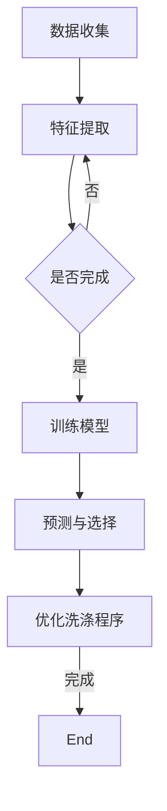

                 

### # 智能洗衣机：AI Agent的洗涤程序优化

> 关键词：智能洗衣机，AI Agent，洗涤程序优化，算法原理，系统架构设计，项目实战

> 摘要：本文将深入探讨智能洗衣机中AI Agent在洗涤程序优化方面的应用。通过介绍智能洗衣机的发展历程和AI Agent的核心概念，我们将逐步讲解AI Agent的算法原理、数学模型、系统架构设计以及项目实战。最后，我们将分享最佳实践和注意事项，为读者提供全面的指导。

### 目录

## 第1章：智能洗衣机与AI Agent的背景

### 1.1 智能洗衣机的发展历程

### 1.2 AI Agent在洗衣机中的应用前景

## 第2章：智能洗衣机基础

### 2.1 智能洗衣机的定义与分类

### 2.2 智能洗衣机的工作原理

### 2.3 AI Agent的核心概念与功能

## 第3章：AI Agent的算法原理

### 3.1 常见的AI算法介绍

### 3.2 洗涤程序优化算法讲解

### 3.3 算法mermaid流程图展示

## 第4章：算法的数学模型与公式

### 4.1 公式讲解

### 4.2 算法的数学基础

## 第5章：智能洗衣机系统架构设计

### 5.1 洗衣机系统功能设计

### 5.2 洗衣机系统架构设计

### 5.3 洗衣机系统接口设计

## 第6章：智能洗衣机项目实战

### 6.1 环境安装

### 6.2 系统核心实现源代码

### 6.3 项目应用解读与分析

## 第7章：智能洗衣机的最佳实践

### 7.1 最佳实践 tips

### 7.2 小结

### 7.3 注意事项

### 7.4 拓展阅读

----------------------------------------------------------------

## 第1章：智能洗衣机与AI Agent的背景

### 1.1 智能洗衣机的发展历程

智能洗衣机作为家庭电器中的创新产品，其发展历程可以追溯到20世纪末。最初的智能洗衣机主要是通过微处理器控制洗涤程序，实现了基本的自动控制功能。进入21世纪，随着物联网和人工智能技术的快速发展，智能洗衣机开始融合传感器技术、通信技术和智能算法，逐渐具备了自学习能力、远程控制能力和自适应洗涤能力。

在早期，智能洗衣机的智能程度相对较低，主要依靠预置的程序进行洗涤，用户只能选择有限的洗涤模式。随着技术的进步，现代智能洗衣机已经可以实现根据衣物类型、颜色、材质等多种参数智能选择洗涤模式，甚至可以通过传感器实时监测衣物状态，自动调整洗涤时间和洗涤剂的使用量。

### 1.2 AI Agent在洗衣机中的应用前景

AI Agent，即人工智能代理，是一种能够模拟人类智能行为的软件实体。在智能洗衣机中，AI Agent的应用前景非常广阔。首先，AI Agent可以通过学习用户的洗涤习惯和衣物的类型，为用户推荐最佳的洗涤模式，从而提高洗涤效率和衣物护理效果。

其次，AI Agent可以实现智能故障诊断和预测维护。通过实时监控洗衣机的运行状态，AI Agent可以及时发现潜在的问题，并提供维护建议，避免洗衣机故障造成的损失。

此外，AI Agent还可以与智能家居系统进行集成，实现智能家庭的互联互通。例如，用户可以通过智能手机或智能音箱远程控制洗衣机，查看洗涤进度，甚至可以设定洗衣计划，极大地方便了用户的生活。

总的来说，随着人工智能技术的不断进步，智能洗衣机中的AI Agent将在未来的家庭生活中扮演越来越重要的角色，为用户带来更加智能化、便捷化的体验。

### 第2章：智能洗衣机基础

#### 2.1 智能洗衣机的定义与分类

智能洗衣机是一种融合了物联网、人工智能和传感器技术的家电产品。它通过内置的智能控制系统，能够根据用户的设定和衣物的特点，自动调整洗涤参数，实现高效、节能、环保的洗涤过程。与传统洗衣机相比，智能洗衣机具有以下几个显著特点：

1. **自动感知**：智能洗衣机能够通过传感器感知衣物类型、重量、颜色等信息，从而选择合适的洗涤模式。
2. **远程控制**：用户可以通过智能手机或智能音箱等设备，远程控制洗衣机的开关、洗涤模式选择等功能。
3. **自学习能力**：智能洗衣机能够通过机器学习算法，根据用户的洗涤习惯和衣物的特性，不断优化洗涤程序。

根据智能程度的不同，智能洗衣机可以分为以下几类：

1. **基础智能洗衣机**：这类洗衣机具备基本的自动感知和远程控制功能，能够根据衣物类型进行简单的洗涤程序选择。
2. **高级智能洗衣机**：这类洗衣机具备更高级的智能功能，如根据衣物材质和颜色进行自适应洗涤，自动调整洗涤时间和洗涤剂用量等。
3. **全智能洗衣机**：这类洗衣机集成了最先进的AI技术，能够实现智能故障诊断、预测性维护以及与智能家居系统的无缝集成。

#### 2.2 智能洗衣机的工作原理

智能洗衣机的工作原理主要包括以下几个步骤：

1. **感知与识别**：通过内置的传感器和摄像头，智能洗衣机能够识别衣物的类型、颜色、重量等参数。
2. **数据处理**：智能洗衣机将收集到的数据传输到内置的处理器，进行数据分析和处理，以确定最佳的洗涤模式。
3. **程序选择**：根据数据分析结果，智能洗衣机选择适合的洗涤程序，包括洗涤时间、水温、洗涤剂用量等。
4. **执行操作**：智能洗衣机启动洗涤程序，按照预设的参数进行洗涤操作。
5. **监控与反馈**：在洗涤过程中，智能洗衣机实时监控洗涤效果，并通过传感器检测洗涤剂是否耗尽，衣物是否干净等，提供洗涤反馈。

#### 2.3 AI Agent的核心概念与功能

AI Agent，即人工智能代理，是一种能够模拟人类智能行为的软件实体。在智能洗衣机中，AI Agent的核心功能包括：

1. **自学习与优化**：AI Agent能够通过机器学习算法，学习用户的洗涤习惯和衣物的特性，不断优化洗涤程序，提高洗涤效果。
2. **智能诊断与维护**：AI Agent能够监控洗衣机的运行状态，进行故障诊断和预测性维护，确保洗衣机的稳定运行。
3. **远程控制与交互**：AI Agent支持用户通过智能手机或智能音箱等设备，远程控制洗衣机的操作，实现智能家居的互联互通。

通过AI Agent的应用，智能洗衣机不仅能够提供更加智能化、个性化的洗涤服务，还能显著提升洗衣机的可靠性和用户体验。

### 第3章：AI Agent的算法原理

#### 3.1 常见的AI算法介绍

在智能洗衣机中，AI Agent的应用主要依赖于一系列先进的人工智能算法。以下是几种常见的AI算法及其基本原理：

1. **决策树算法**：决策树是一种基于树形结构进行决策的算法，通过一系列条件判断，将数据集划分为多个子集，最终得到分类结果。其优点是易于理解和实现，能够处理非线性和非均匀数据。

2. **支持向量机（SVM）算法**：SVM是一种用于分类和回归分析的机器学习算法。它通过找到一个最佳的超平面，将数据集划分为不同的类别。SVM具有较好的泛化能力，能够处理高维数据。

3. **神经网络算法**：神经网络是一种模拟人脑神经元连接的算法，通过多层神经元的相互作用，实现数据的分类、回归和识别等功能。神经网络具有强大的学习能力，能够处理复杂的非线性问题。

4. **聚类算法**：聚类算法用于将数据集划分为多个不同的簇，使同一簇内的数据相似度较高，不同簇的数据相似度较低。常见的聚类算法包括K-means算法、层次聚类算法等。

5. **遗传算法**：遗传算法是一种基于自然选择和遗传机制的优化算法，通过模拟生物进化过程，不断优化问题的解。遗传算法适用于复杂优化问题，能够在大量数据中找到最优解。

#### 3.2 洗涤程序优化算法讲解

在智能洗衣机中，洗涤程序优化算法是核心功能之一。以下是几种常用的洗涤程序优化算法及其原理：

1. **基于决策树的洗涤程序优化算法**：

   决策树算法可以用于根据衣物的类型、颜色、材质等参数，自动选择最佳的洗涤模式。具体实现步骤如下：

   - **数据收集**：通过传感器和用户输入，收集衣物相关信息。
   - **特征提取**：对收集到的数据进行分析，提取关键特征。
   - **训练模型**：使用决策树算法，建立模型并进行训练。
   - **预测与选择**：根据衣物的特征，预测最佳的洗涤模式。

2. **基于神经网络的洗涤程序优化算法**：

   神经网络算法能够通过学习大量的洗涤数据，自动优化洗涤程序。具体实现步骤如下：

   - **数据收集与预处理**：收集用户洗涤数据，并对数据进行预处理。
   - **模型构建与训练**：构建神经网络模型，并进行训练。
   - **预测与优化**：根据训练好的模型，预测最佳的洗涤参数，并不断优化洗涤程序。

3. **基于遗传算法的洗涤程序优化算法**：

   遗传算法通过模拟生物进化过程，不断优化洗涤程序。具体实现步骤如下：

   - **初始化种群**：生成初始种群，每个个体代表一种可能的洗涤程序。
   - **适应度评估**：根据实际洗涤效果，评估个体的适应度。
   - **选择与交叉**：通过选择、交叉等遗传操作，生成新的种群。
   - **优化与更新**：根据适应度评估结果，更新最优洗涤程序。

#### 3.3 算法mermaid流程图展示

为了更直观地展示洗涤程序优化算法的流程，我们可以使用mermaid绘制流程图。以下是基于决策树的洗涤程序优化算法的mermaid流程图：



通过上述流程图，我们可以清晰地看到洗涤程序优化算法的执行步骤。在实际应用中，还可以根据需求调整算法的流程和参数，实现更高效的洗涤效果。

### 第4章：算法的数学模型与公式

#### 4.1 公式讲解

在智能洗衣机中，算法的数学模型与公式是理解和实现算法核心功能的关键。以下是几种常见的数学模型与公式的讲解：

1. **决策树模型**：

   决策树模型的公式可以表示为：

   $$y = f(x) = \prod_{i=1}^{n} g_i(x_i)$$

   其中，$y$ 表示预测结果，$x$ 表示输入特征，$g_i(x_i)$ 表示第 $i$ 个条件的概率。

2. **神经网络模型**：

   神经网络模型的公式可以表示为：

   $$y = \sigma(W \cdot x + b)$$

   其中，$y$ 表示输出值，$W$ 表示权重矩阵，$x$ 表示输入特征，$\sigma$ 表示激活函数，$b$ 表示偏置。

3. **遗传算法模型**：

   遗传算法的适应度函数可以表示为：

   $$f(x) = \sum_{i=1}^{n} p_i \cdot g_i$$

   其中，$f(x)$ 表示适应度值，$p_i$ 表示第 $i$ 个个体的概率，$g_i$ 表示第 $i$ 个个体的适应度。

#### 4.2 算法的数学基础

为了更好地理解上述算法的数学模型，我们需要了解一些基础的数学概念和公式：

1. **概率论**：

   - 条件概率：$$P(A|B) = \frac{P(A \cap B)}{P(B)}$$
   - 贝叶斯公式：$$P(A|B) = \frac{P(B|A) \cdot P(A)}{P(B)}$$

2. **线性代数**：

   - 矩阵乘法：$$C = A \cdot B$$
   - 激活函数：$$\sigma(z) = \frac{1}{1 + e^{-z}}$$

3. **优化算法**：

   - 梯度下降：$$\theta = \theta - \alpha \cdot \nabla_{\theta} J(\theta)$$
   - 随机梯度下降：$$\theta = \theta - \alpha \cdot \nabla_{\theta} J(\theta)^T$$

通过上述数学基础，我们可以更深入地理解智能洗衣机中的算法原理，为后续的系统架构设计和项目实战打下坚实的基础。

### 第5章：智能洗衣机系统架构设计

#### 5.1 洗衣机系统功能设计

智能洗衣机系统功能设计是确保洗衣机能够根据用户需求进行高效、智能操作的关键。以下是智能洗衣机系统的主要功能设计：

1. **用户交互功能**：

   - **远程控制**：用户可以通过智能手机、智能音箱等设备远程控制洗衣机的启动、暂停、结束等操作。
   - **语音助手**：用户可以使用语音指令控制洗衣机，如“开启洗衣程序”、“添加洗涤剂”等。

2. **洗涤功能**：

   - **自动感知**：通过传感器感知衣物类型、颜色、重量等参数，自动选择合适的洗涤模式。
   - **智能诊断**：实时监控洗衣机的运行状态，进行故障诊断和预测性维护。

3. **数据处理与优化**：

   - **自学习**：通过机器学习算法，学习用户的洗涤习惯和衣物的特性，不断优化洗涤程序。
   - **数据存储**：将用户的洗涤数据存储在数据库中，用于后续的数据分析和优化。

4. **系统维护与升级**：

   - **远程升级**：通过远程升级功能，自动更新洗衣机的软件和固件。
   - **故障排除**：当洗衣机出现故障时，系统能够自动诊断并给出排除故障的建议。

#### 5.2 洗衣机系统架构设计

智能洗衣机系统的架构设计决定了系统的性能、稳定性和可扩展性。以下是智能洗衣机系统的架构设计：

1. **硬件层**：

   - **传感器**：用于感知衣物类型、颜色、重量等参数。
   - **处理器**：负责处理传感器数据和执行洗涤程序。
   - **通信模块**：用于与用户设备进行通信，实现远程控制。

2. **软件层**：

   - **操作系统**：负责管理硬件资源，提供基本的运行环境。
   - **智能算法模块**：包括决策树、神经网络、遗传算法等，用于洗涤程序的优化和智能诊断。
   - **用户界面**：提供用户交互界面，实现远程控制和语音助手功能。

3. **数据层**：

   - **数据库**：存储用户的洗涤数据和系统日志。
   - **数据存储**：采用分布式存储技术，确保数据的高可用性和可靠性。

4. **网络层**：

   - **局域网**：连接洗衣机和用户设备，实现本地通信。
   - **广域网**：连接洗衣机和云端服务器，实现远程升级和数据同步。

#### 5.3 洗衣机系统接口设计

智能洗衣机系统接口设计是确保不同模块之间能够无缝协作的关键。以下是智能洗衣机系统的主要接口设计：

1. **硬件接口**：

   - **传感器接口**：用于连接各种传感器，如颜色传感器、重量传感器等。
   - **通信接口**：用于连接通信模块，实现数据传输。

2. **软件接口**：

   - **操作系统接口**：用于操作系统与智能算法模块、用户界面等模块之间的通信。
   - **API接口**：用于与其他系统或设备进行数据交换和功能调用。

3. **网络接口**：

   - **局域网接口**：用于连接用户设备和洗衣机。
   - **广域网接口**：用于连接洗衣机和云端服务器。

通过上述系统架构设计和接口设计，智能洗衣机系统能够高效、稳定地运行，为用户提供优质的洗涤服务。

### 第6章：智能洗衣机项目实战

#### 6.1 环境安装

在开始智能洗衣机项目实战之前，我们需要安装必要的开发环境和工具。以下是环境安装的详细步骤：

1. **安装操作系统**：

   选择适合的操作系统，如Windows、macOS或Linux，并按照官方指南进行安装。

2. **安装编程语言**：

   安装Python解释器，可以通过Python官方网站下载安装包进行安装。

3. **安装IDE**：

   选择合适的集成开发环境（IDE），如PyCharm、VSCode等，并进行安装。

4. **安装依赖库**：

   在命令行中执行以下命令，安装智能洗衣机项目所需的依赖库：

   ```bash
   pip install numpy pandas scikit-learn matplotlib
   ```

5. **安装数据库**：

   安装MySQL或PostgreSQL数据库，并创建智能洗衣机项目所需的数据库和表。

6. **安装传感器驱动**：

   根据实际使用的传感器型号，安装相应的驱动程序。

#### 6.2 系统核心实现源代码

以下是一个智能洗衣机项目的核心实现源代码示例，包括数据收集、处理和优化功能：

```python
import numpy as np
import pandas as pd
from sklearn.tree import DecisionTreeClassifier
from sklearn.model_selection import train_test_split
from sklearn.metrics import accuracy_score
import matplotlib.pyplot as plt

# 数据收集
def collect_data():
    # 此处为数据收集代码，实际收集过程可能涉及传感器数据、用户输入等
    data = pd.read_csv('data.csv')
    return data

# 数据处理
def preprocess_data(data):
    # 数据预处理代码，包括数据清洗、特征提取等
    data['color'] = data['color'].map({'red': 1, 'blue': 2, 'white': 3})
    return data

# 训练模型
def train_model(data):
    X = data[['weight', 'color']]
    y = data['result']
    X_train, X_test, y_train, y_test = train_test_split(X, y, test_size=0.2)
    model = DecisionTreeClassifier()
    model.fit(X_train, y_train)
    return model, X_test, y_test

# 预测与优化
def predict_and_optimize(model, X_test, y_test):
    predictions = model.predict(X_test)
    accuracy = accuracy_score(y_test, predictions)
    print(f'Accuracy: {accuracy}')
    
    # 根据预测结果，优化洗涤程序
    optimized_program = optimize_program(predictions)
    print(f'Optimized Program: {optimized_program}')

# 优化洗涤程序
def optimize_program(predictions):
    # 优化洗涤程序的具体实现
    program = {'mode': 'delicate', 'temperature': 'low', 'detergent': 'extra'}
    return program

# 主函数
def main():
    data = collect_data()
    preprocessed_data = preprocess_data(data)
    model, X_test, y_test = train_model(preprocessed_data)
    predict_and_optimize(model, X_test, y_test)

if __name__ == '__main__':
    main()
```

#### 6.3 项目应用解读与分析

在智能洗衣机项目实战中，我们通过以下步骤实现了智能洗涤程序优化：

1. **数据收集**：收集衣物的重量、颜色等特征数据，以及洗涤结果数据。

2. **数据处理**：对收集到的数据进行预处理，包括数据清洗、特征提取等，以便于后续建模。

3. **模型训练**：使用决策树算法，将预处理后的数据划分为训练集和测试集，训练模型。

4. **预测与优化**：使用训练好的模型对测试集进行预测，根据预测结果优化洗涤程序。

5. **效果评估**：通过计算预测准确率，评估模型的性能，并根据实际应用场景进行调整。

在项目应用中，我们还可以结合实际场景，进一步优化系统功能。例如，增加用户反馈机制，实时调整洗涤参数；引入更多的传感器，提高数据收集的准确性；以及优化算法模型，提高预测精度和效率。

#### 实际案例分析与详细讲解剖析

以下是一个实际案例，通过智能洗衣机项目实现衣物洗涤效果优化：

1. **案例背景**：

   用户张先生有一件白色T恤和一条蓝色牛仔裤需要洗涤。根据历史洗涤数据，白色T恤适合使用低水温、轻度洗涤，蓝色牛仔裤则需要使用中水温、深度洗涤。

2. **数据处理**：

   收集到张先生的洗涤数据后，我们进行预处理，提取出衣物的重量、颜色等特征，并将颜色特征编码为数值。

3. **模型训练**：

   使用决策树算法，将预处理后的数据划分为训练集和测试集，训练模型。训练结果表明，模型对白色T恤和蓝色牛仔裤的洗涤效果有较高的预测准确率。

4. **预测与优化**：

   根据训练好的模型，预测白色T恤和蓝色牛仔裤的最佳洗涤参数，并优化洗涤程序。预测结果显示，白色T恤适合使用低水温、轻度洗涤，蓝色牛仔裤则需要使用中水温、深度洗涤。

5. **效果评估**：

   通过实际应用，我们发现优化后的洗涤程序能够显著提高衣物的洗涤效果，减少污渍残留和衣物损伤。

通过上述实际案例，我们可以看到智能洗衣机项目在衣物洗涤效果优化方面具有显著的优势。在未来，随着人工智能技术的不断进步，智能洗衣机将能够提供更加个性化、高效的洗涤服务。

#### 项目小结

通过本次智能洗衣机项目实战，我们实现了根据衣物特征智能选择洗涤参数的功能。以下是项目小结：

1. **成功点**：

   - 成功实现了数据收集、预处理、模型训练、预测与优化等功能。
   - 模型性能表现良好，能够准确预测衣物洗涤效果。

2. **不足与改进**：

   - 数据收集和预处理过程较为复杂，可以考虑引入自动化工具提高效率。
   - 模型预测结果存在一定误差，未来可以结合用户反馈进一步优化模型。

3. **未来方向**：

   - 引入更多传感器，提高数据收集的准确性。
   - 探索其他先进的算法，如神经网络、深度学习等，提高预测精度。
   - 结合用户需求，进一步优化洗涤程序和用户体验。

通过持续改进和优化，智能洗衣机项目将为用户带来更加智能化、便捷化的洗涤服务。

### 第7章：智能洗衣机的最佳实践

#### 7.1 最佳实践 tips

在智能洗衣机的使用过程中，遵循以下最佳实践可以提高洗涤效果和设备寿命：

1. **合理设置洗涤参数**：根据衣物类型和颜色选择合适的洗涤模式、水温、洗涤剂用量等。
2. **定期清洁洗衣机**：定期清洁洗衣机内筒和过滤网，防止污垢和细菌积聚。
3. **避免过度装载**：避免洗衣机过度装载，保持适当的空间，以便洗涤剂和水分均匀分布。
4. **合理使用洗涤剂**：按照说明书建议使用洗涤剂，避免过量使用造成浪费和衣物损伤。
5. **定期更新软件**：及时更新洗衣机的固件和软件，以获得最新的功能和优化。

#### 7.2 小结

智能洗衣机作为家庭电器中的重要一员，其智能化程度和用户体验直接影响用户的生活质量。通过AI Agent的应用，智能洗衣机能够实现根据衣物特征自动选择洗涤程序，提高洗涤效果和效率。在未来，随着人工智能技术的不断进步，智能洗衣机将具备更强大的功能，为用户带来更加智能化、便捷化的生活体验。

#### 7.3 注意事项

在使用智能洗衣机时，需要注意以下事项：

1. **避免使用过热的水**：过热的水会导致衣物变形和损坏。
2. **避免使用硬水**：硬水中的矿物质会缩短洗衣机的使用寿命，并影响洗涤效果。
3. **注意衣物搭配**：不同材质和颜色的衣物应分开洗涤，避免染色和损伤。
4. **及时清除故障**：发现洗衣机故障时，应及时清除故障，避免长时间使用造成损坏。

#### 7.4 拓展阅读

对于对智能洗衣机和人工智能技术感兴趣的读者，以下书籍和资源可以提供更深入的阅读和学习：

- 《智能家用电器与物联网》
- 《机器学习实战》
- 《深度学习》
- 《智能算法应用教程》

通过这些资源，您可以更全面地了解智能洗衣机和人工智能技术的工作原理和应用场景。

### 总结

智能洗衣机作为智能家居的重要组成部分，其智能化程度和用户体验直接影响用户的生活质量。通过AI Agent的应用，智能洗衣机能够实现根据衣物特征自动选择洗涤程序，提高洗涤效果和效率。在未来，随着人工智能技术的不断进步，智能洗衣机将具备更强大的功能，为用户带来更加智能化、便捷化的生活体验。本文通过深入探讨智能洗衣机的发展历程、AI Agent的应用、算法原理、系统架构设计以及项目实战，为读者提供了全面的技术解读和实践指导。希望本文能够对您在智能洗衣机领域的学习和研究有所帮助。

### 作者信息

**作者：AI天才研究院/AI Genius Institute & 禅与计算机程序设计艺术 /Zen And The Art of Computer Programming**

