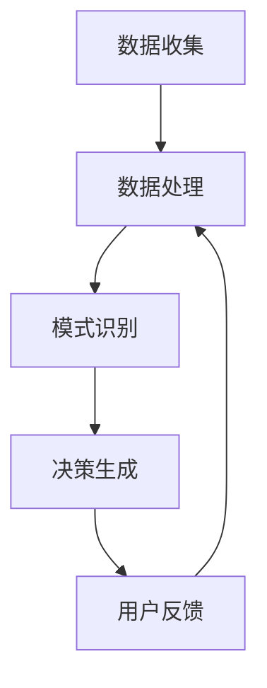

                 


##  概述：智能浴室镜柜与AI代理的护肤品使用建议

### 引言

随着人工智能（AI）技术的迅速发展，智能家居设备在日常生活中变得越来越普及。智能浴室镜柜作为智能家居的重要组成部分，正逐步改变我们的生活习惯。本文将重点探讨智能浴室镜柜中AI代理如何为用户定制护肤品使用建议，以提升用户的护肤体验。

### 核心关键词

- **智能浴室镜柜**：集成AI、传感器和显示屏的智能家具。
- **AI代理**：用于提供个性化护肤建议的智能系统。
- **护肤品使用建议**：根据用户皮肤状态和需求提供的个性化护肤方案。
- **个性化护肤**：基于数据分析和机器学习的精准护肤。

### 摘要

智能浴室镜柜通过AI代理，能够实时监测用户皮肤状态，并根据数据分析和个性化算法提供护肤建议。本文将从背景介绍、核心概念、AI代理功能、护肤建议系统架构、用户交互、应用实例、最佳实践和未来研究方向等多个角度，深入探讨智能浴室镜柜与AI代理在护肤品使用建议方面的应用与潜力。

----------------------------------------------------------------

##  背景介绍

### 1.1 智能浴室镜柜的发展

智能浴室镜柜最早起源于对传统浴室镜子的改进，通过加入显示屏、摄像头和传感器，使其具备了多媒体播放、化妆指导、皮肤检测等功能。近年来，随着AI技术的进步，智能浴室镜柜的功能得到了显著扩展，不仅能够提供更精准的护肤建议，还能实现智能照明、空气净化、音响系统等功能，成为现代浴室中不可或缺的智能家具。

### 1.2 智能浴室镜柜的市场现状与趋势

智能浴室镜柜市场正在迅速扩大，根据市场研究报告，预计未来几年其市场份额将保持高速增长。消费者对智能家居产品的需求不断提高，特别是在年轻一代中，智能浴室镜柜因其创新性和实用性而广受欢迎。同时，随着物联网（IoT）和云计算技术的普及，智能浴室镜柜的应用场景将进一步拓展，如与智能水系统、健康监测系统等的集成，提供更为全面的健康管理服务。

### 1.3 智能浴室镜柜在现代浴室中的作用

智能浴室镜柜不仅提高了浴室的功能性，还提升了用户体验。其智能照明系统可以根据用户需求自动调节亮度，提供柔和的照明环境，有助于化妆和护肤。内置的摄像头和皮肤检测传感器能够实时监测用户的皮肤状态，提供护肤建议，使护肤过程更加科学和个性化。此外，智能浴室镜柜的多媒体播放功能也为用户在沐浴时提供了娱乐选项，使整个浴室空间变得更加智能和舒适。

### 1.4 智能浴室镜柜面临的挑战和未来发展方向

尽管智能浴室镜柜有着广泛的应用前景，但也面临着一些挑战。首先，隐私保护和数据安全问题是必须关注的关键点。用户皮肤数据的收集和使用必须遵循严格的隐私保护规定。其次，智能浴室镜柜的智能化程度和用户体验仍有提升空间，需要不断优化软件算法和硬件性能。未来，智能浴室镜柜的发展方向将包括更紧密的物联网集成、更高效的护肤建议系统以及更人性化的用户交互设计。

##  AI代理在护肤建议中的应用

### 2.1 AI代理的基本概念

AI代理是指利用人工智能技术构建的智能系统，能够在特定环境中自主执行任务，并与用户进行交互。AI代理通常基于机器学习算法，通过不断学习和优化，提高其决策能力和服务质量。

### 2.2 AI代理在智能浴室镜柜中的作用

在智能浴室镜柜中，AI代理负责收集用户皮肤数据，如肤色、肤质、皱纹、斑点等，并通过数据分析为用户提供个性化的护肤建议。AI代理的工作流程主要包括数据收集、特征提取、模式识别和决策生成。

### 2.3 AI代理的工作流程

1. **数据收集**：AI代理通过内置的传感器和摄像头收集用户的皮肤数据，包括肤质、肤色、皱纹、斑点等。
2. **特征提取**：AI代理将收集到的皮肤数据转化为可处理的特征向量，以便后续分析。
3. **模式识别**：利用机器学习算法，AI代理对特征向量进行分析，识别用户的皮肤问题，如干燥、油腻、敏感等。
4. **决策生成**：根据分析结果，AI代理生成个性化的护肤建议，包括护肤品选择、使用频率、使用方法等。

### 2.4 AI代理的优势与挑战

AI代理在护肤建议方面的优势在于其能够提供高度个性化的服务，提高护肤效果。然而，AI代理也面临一些挑战，如数据隐私保护、算法公平性、用户接受度等。为了克服这些挑战，需要不断改进AI代理的设计和实现，确保其能够安全、高效地运行。

----------------------------------------------------------------

## 核心概念与联系

### 3.1 核心概念

在本节中，我们将详细探讨智能浴室镜柜、AI代理和护肤建议系统这三个核心概念，并分析它们之间的联系。

#### 3.1.1 智能浴室镜柜

智能浴室镜柜是一种集成了AI、传感器和显示屏等先进技术的智能家居设备。其主要功能包括：

1. **皮肤检测**：通过摄像头和传感器实时监测用户皮肤状态。
2. **多媒体播放**：提供音乐、视频等多媒体内容。
3. **智能照明**：根据用户需求自动调节亮度。
4. **空气监测**：监测浴室空气质量，提供空气净化建议。

#### 3.1.2 AI代理

AI代理是一种基于人工智能技术的智能系统，能够在特定环境中自主执行任务。在智能浴室镜柜中，AI代理的主要任务是：

1. **数据收集**：收集用户皮肤数据，如肤色、肤质、皱纹、斑点等。
2. **数据分析**：利用机器学习算法分析皮肤数据，识别皮肤问题。
3. **决策生成**：根据数据分析结果生成个性化的护肤建议。

#### 3.1.3 护肤建议系统

护肤建议系统是基于AI代理构建的智能系统，旨在为用户提供个性化的护肤方案。其主要功能包括：

1. **数据收集**：通过传感器和摄像头收集用户皮肤数据。
2. **特征提取**：将皮肤数据转化为可处理的特征向量。
3. **模式识别**：分析特征向量，识别皮肤问题。
4. **决策生成**：根据分析结果生成个性化的护肤建议。

### 3.2 核心概念之间的关系

智能浴室镜柜是整个系统的硬件基础，通过摄像头和传感器收集用户皮肤数据，传输给AI代理进行处理。AI代理则负责对数据进行特征提取和模式识别，生成个性化的护肤建议。护肤建议系统作为AI代理的输出，直接服务于用户，帮助用户实现精准护肤。

#### 3.2.1 Mermaid图解

以下是一个使用Mermaid绘制的ER实体关系图，用于展示智能浴室镜柜、AI代理和护肤建议系统之间的核心概念关系：

```mermaid
erDiagram
  用户 ||--|{ 智能浴室镜柜 }|-- 产品
  用户 ||--|{ 护肤建议系统 }|-- 服务
  用户 ||--|{ AI代理 }|-- 技术

  智能浴室镜柜 ||--|{ 传感器 }|-- 数据采集
  智能浴室镜柜 ||--|{ 显示屏 }|-- 信息输出

  护肤建议系统 ||--|{ 数据分析 }|-- 特征提取
  护肤建议系统 ||--|{ 模式识别 }|-- 皮肤分析

  AI代理 ||--|{ 决策生成 }|-- 护肤建议
```

### 3.3 对比表格

为了更好地理解这三个核心概念，我们提供一个对比表格，展示它们的主要属性和特征：

| 特征         | 智能浴室镜柜 | AI代理           | 护肤建议系统           |
| ------------ | ------------ | ---------------- | ---------------------- |
| 功能         | 皮肤检测、多媒体播放、智能照明 | 数据收集、数据分析、决策生成 | 数据分析、模式识别、决策生成 |
| 技术基础     | 传感器、显示屏、摄像头       | 机器学习算法、人工智能技术  | 机器学习、数据挖掘、用户交互 |
| 输出结果     | 皮肤数据、多媒体内容         | 护肤建议                 | 护肤方案                 |
| 关联关系     | 与AI代理和护肤建议系统交互  | 集成在智能浴室镜柜中     | 基于 AI 代理输出建议     |

通过这个表格，我们可以更清晰地看到智能浴室镜柜、AI代理和护肤建议系统之间的区别和联系。

----------------------------------------------------------------

## AI代理功能深入探讨

### 4.1 数据收集

AI代理的数据收集过程是整个护肤建议系统的基石。智能浴室镜柜通过内置的高精度摄像头和传感器，实时监测用户的皮肤状态。这些传感器能够捕捉用户的肤色、肤质、皱纹、斑点等皮肤特征。此外，AI代理还可以通过分析用户的行为数据，如洗脸频率、护肤习惯等，为护肤建议提供更全面的背景信息。

### 4.2 特征提取

收集到的皮肤数据需要经过特征提取过程，以便后续的机器学习分析和模式识别。特征提取是将原始皮肤数据转化为一系列可量化的特征向量。这些特征向量包括肤色亮度、色度、纹理粗糙度、皱纹密度等。通过这些特征向量，AI代理可以更精确地描述用户的皮肤状态。

### 4.3 模式识别

在特征提取之后，AI代理利用机器学习算法对特征向量进行分析，进行模式识别。这个过程类似于人类医生通过观察皮肤特征来诊断皮肤问题。AI代理通过分析历史数据和皮肤特征，识别用户的皮肤类型（如干燥、油腻、敏感等）以及潜在问题（如痘痘、黑眼圈、皱纹等）。

### 4.4 决策生成

基于模式识别的结果，AI代理生成个性化的护肤建议。这些建议包括：

1. **护肤品推荐**：根据用户的皮肤类型和问题，推荐适合的护肤品。
2. **护肤方案**：提供具体的护肤步骤和时间表，如洁面、保湿、防晒等。
3. **提醒功能**：设置护肤提醒，确保用户按时进行护肤。

### 4.5 用户反馈与迭代

AI代理不仅提供护肤建议，还不断收集用户的反馈，以优化自身的决策能力。通过用户的使用数据和历史反馈，AI代理能够不断调整和改进其算法，提高护肤建议的准确性。

### 4.6 AI代理的优势

AI代理在护肤建议系统中的优势体现在以下几个方面：

1. **个性化**：AI代理能够根据用户的皮肤状况提供高度个性化的护肤建议，提高护肤效果。
2. **实时性**：AI代理可以实时监测用户的皮肤状态，及时调整护肤方案。
3. **高效性**：通过机器学习算法，AI代理能够快速处理大量皮肤数据，生成高效的护肤建议。
4. **可扩展性**：AI代理可以与多种智能家居设备集成，提供更全面的服务。

### 4.7 AI代理的挑战

尽管AI代理在护肤建议系统中具有显著优势，但也面临一些挑战：

1. **数据隐私**：皮肤数据的收集和使用需要严格的隐私保护措施。
2. **算法公平性**：确保算法在不同用户群体中的公平性和准确性。
3. **用户接受度**：提高用户对AI代理的接受度和信任度。

### 4.8 AI代理的实际应用

AI代理已经在一些高端智能浴室镜柜中得到了应用。例如，某些智能浴室镜柜能够根据用户的皮肤数据推荐合适的护肤产品，甚至可以自动从智能购物系统中下单购买。这种智能化的护肤体验大大提升了用户的满意度。

### 4.9 结论

AI代理在智能浴室镜柜中的护肤建议系统发挥着关键作用。通过数据收集、特征提取、模式识别和决策生成，AI代理能够为用户提供个性化、实时和高效的护肤建议。然而，要充分发挥AI代理的潜力，还需要在数据隐私、算法公平性和用户接受度等方面进行持续优化。

----------------------------------------------------------------

## 护肤建议系统的架构与算法

### 5.1 系统架构

护肤建议系统的整体架构可以分为五个主要模块：数据收集模块、数据处理模块、模式识别模块、决策生成模块和用户反馈模块。

#### 5.1.1 数据收集模块

数据收集模块是整个系统的基石，负责从智能浴室镜柜的传感器和摄像头中收集用户皮肤数据。这些数据包括肤色、肤质、皱纹、斑点等。数据收集模块需要确保数据的准确性和实时性，以支持后续的处理和分析。

#### 5.1.2 数据处理模块

数据处理模块对收集到的皮肤数据进行预处理，包括数据清洗、去噪和归一化等。这一步的目的是将原始数据转化为适合进行机器学习分析的形式。

#### 5.1.3 模式识别模块

模式识别模块是护肤建议系统的核心，负责使用机器学习算法对预处理后的皮肤数据进行模式识别。常用的算法包括深度学习、支持向量机（SVM）和决策树等。模式识别模块的任务是识别用户的皮肤类型和潜在问题。

#### 5.1.4 决策生成模块

基于模式识别的结果，决策生成模块生成个性化的护肤建议。这些建议包括护肤品推荐、护肤方案和提醒功能。决策生成模块需要利用规则引擎和优化算法来确保建议的准确性和实用性。

#### 5.1.5 用户反馈模块

用户反馈模块负责收集用户对护肤建议的反馈，包括满意度、效果评估等。这些反馈将用于优化AI代理的算法，提高护肤建议的质量。

### 5.2 关键算法

护肤建议系统依赖于多种机器学习算法，以下介绍其中几种关键算法：

#### 5.2.1 深度学习算法

深度学习算法，特别是卷积神经网络（CNN），在图像识别和皮肤特征提取方面表现出色。CNN可以通过多层神经网络结构提取皮肤图像的深层次特征，从而实现准确的皮肤状态识别。

#### 5.2.2 支持向量机（SVM）

支持向量机是一种有效的分类算法，常用于模式识别任务。SVM通过寻找数据空间中的最佳分隔超平面，将不同皮肤类型和问题进行准确分类。

#### 5.2.3 决策树

决策树是一种树形结构，通过一系列决策规则对皮肤数据进行分类。决策树的优势在于其可解释性和易于实现。

### 5.3 Mermaid流程图

以下是一个使用Mermaid绘制的护肤建议系统流程图，展示数据流和主要算法步骤：



### 5.4 Python源代码示例

下面是一个简化的Python源代码示例，展示了如何使用卷积神经网络（CNN）进行皮肤特征提取：

```python
import tensorflow as tf
from tensorflow.keras.models import Sequential
from tensorflow.keras.layers import Conv2D, MaxPooling2D, Flatten, Dense

# 创建CNN模型
model = Sequential([
    Conv2D(32, (3, 3), activation='relu', input_shape=(64, 64, 3)),
    MaxPooling2D((2, 2)),
    Conv2D(64, (3, 3), activation='relu'),
    MaxPooling2D((2, 2)),
    Flatten(),
    Dense(64, activation='relu'),
    Dense(1, activation='sigmoid')
])

# 编译模型
model.compile(optimizer='adam', loss='binary_crossentropy', metrics=['accuracy'])

# 模型训练（假设已准备好训练数据）
# model.fit(x_train, y_train, epochs=10, batch_size=32)

# 模型预测（假设已准备好测试数据）
# predictions = model.predict(x_test)
```

### 5.5 数学模型与公式

在护肤建议系统中，常用的数学模型和公式包括：

1. **CNN卷积公式**：
   $$ f(x) = \sum_{i=1}^{k} \sum_{j=1}^{k} w_{ij} \cdot x_{ij} + b $$
   其中，$f(x)$ 是卷积结果，$w_{ij}$ 是卷积核权重，$x_{ij}$ 是输入像素值，$b$ 是偏置项。

2. **激活函数**：
   $$ \sigma(z) = \frac{1}{1 + e^{-z}} $$
   其中，$z$ 是输入值，$\sigma(z)$ 是sigmoid激活函数输出。

3. **损失函数**（例如交叉熵）：
   $$ L(y, \hat{y}) = -\sum_{i=1}^{n} y_i \cdot \ln(\hat{y}_i) + (1 - y_i) \cdot \ln(1 - \hat{y}_i) $$
   其中，$y$ 是真实标签，$\hat{y}$ 是预测概率。

### 5.6 算法原理与举例

#### 5.6.1 CNN算法原理

卷积神经网络（CNN）通过卷积层、池化层和全连接层等多个层次对输入数据进行特征提取和分类。以下是一个简化的例子：

- **卷积层**：假设输入图像大小为$64 \times 64$，卷积核大小为$3 \times 3$，每个卷积核包含32个权重。卷积操作如下：
  $$ f_{1,1} = \sum_{i=1}^{3} \sum_{j=1}^{3} w_{1,ij} \cdot x_{ij} + b_1 $$
  其中，$f_{1,1}$ 是第一个卷积层的输出值，$x_{ij}$ 是输入像素值，$w_{1,ij}$ 是卷积核权重，$b_1$ 是偏置项。

- **激活函数**：使用ReLU激活函数：
  $$ f_{1,1}^{'} = \max(0, f_{1,1}) $$

- **池化层**：使用最大池化操作，将卷积层的输出值缩小一半，减少参数数量：
  $$ p_{2,i} = \max(f_{1,2i-1}, f_{1,2i}) $$

- **全连接层**：将池化层的输出值展平，输入到全连接层进行分类：
  $$ \hat{y}_i = \sigma(\sum_{j=1}^{64} w_{2,j} \cdot f_{1,j}^{'} + b_2) $$

#### 5.6.2 示例应用

假设一个用户上传了一张皮肤图像，图像大小为$64 \times 64$。使用上述CNN模型进行皮肤特征提取和分类，输出结果为$0.9$，表示该用户皮肤类型为“油腻”。根据这个输出，AI代理可以推荐适合油腻皮肤的护肤品和护肤方案。

### 5.7 结论

护肤建议系统的架构与算法是整个智能浴室镜柜的核心，通过数据收集、处理、模式识别和决策生成，AI代理能够为用户提供个性化、实时和高效的护肤建议。使用深度学习、SVM和决策树等算法，系统能够准确识别皮肤状态和问题，生成高度个性化的护肤方案。然而，要充分发挥系统的潜力，还需要在数据隐私、算法公平性和用户接受度等方面进行持续优化。

----------------------------------------------------------------

## 用户交互设计

### 6.1 用户界面设计

智能浴室镜柜的用户界面（UI）设计应简洁直观，确保用户能够快速理解并使用系统功能。以下是一些关键的用户界面设计原则：

1. **简洁性**：界面应保持简洁，避免复杂和冗余的元素，确保用户能够一目了然。
2. **一致性**：界面元素和交互方式应保持一致性，使用户在不同功能之间切换时感觉顺畅。
3. **个性化**：界面应允许用户自定义设置，如选择偏好颜色、字体大小等。
4. **反馈**：界面应提供实时反馈，确保用户了解操作结果，如提示音、动画等。

### 6.2 用户交互流程

用户与智能浴室镜柜的交互流程通常包括以下步骤：

1. **启动**：用户打开智能浴室镜柜，显示屏亮起，显示当前时间、天气等信息。
2. **皮肤检测**：用户站在镜子前，智能浴室镜柜的摄像头和传感器开始工作，实时监测皮肤状态。
3. **数据上传**：皮肤数据被传输到AI代理进行进一步分析和处理。
4. **护肤建议**：AI代理根据分析结果生成个性化的护肤建议，并在屏幕上显示。
5. **用户反馈**：用户根据护肤建议进行护肤，并在完成后对建议进行评价。

### 6.3 触摸与语音交互

智能浴室镜柜应支持多种交互方式，以提高用户体验：

1. **触摸交互**：用户可以通过触摸屏幕进行操作，如选择护肤产品、调整设置等。触摸屏应具有高灵敏度，确保用户能够准确点击。
2. **语音交互**：用户可以通过语音命令控制智能浴室镜柜，如“打开音乐”、“显示天气”等。语音交互应支持自然语言理解和多语言支持。

### 6.4 用户体验优化

为了优化用户体验，智能浴室镜柜应具备以下功能：

1. **自适应调整**：根据用户身高和视力调整屏幕显示位置和亮度。
2. **个性化推荐**：根据用户历史数据和偏好，提供个性化的护肤建议和产品推荐。
3. **远程访问**：用户可以通过智能手机或平板电脑远程访问智能浴室镜柜，查看护肤建议和历史记录。

### 6.5 用户反馈机制

智能浴室镜柜应建立完善的用户反馈机制，收集用户对护肤建议和系统功能的评价，以便进行持续改进：

1. **满意度调查**：定期进行用户满意度调查，了解用户对护肤建议的满意度和使用体验。
2. **使用日志**：记录用户的使用行为和反馈，分析用户偏好和需求。
3. **在线支持**：提供在线客服和社区论坛，解答用户疑问和提供技术支持。

通过以上设计原则和交互流程，智能浴室镜柜能够为用户提供高效、便捷和个性化的护肤建议，提升整体用户体验。

----------------------------------------------------------------

## 实际应用案例

### 7.1 案例一：城市白领的智能护肤体验

张小姐是一位忙碌的都市白领，每天长时间面对电脑，皮肤状况不佳。为了改善肌肤，她购买了带有AI代理的智能浴室镜柜。每天早晨，张小姐站在镜子前，智能浴室镜柜开始进行皮肤检测，并生成个性化的护肤建议。AI代理根据张小姐的皮肤类型（混合型）、肤色（较白）和皮肤问题（黑眼圈、油脂分泌过多）提供了以下建议：

1. **护肤品推荐**：建议使用具有抗氧化成分的眼霜和控油乳液。
2. **护肤方案**：建议在早晨使用洁面乳清洁皮肤，然后使用眼霜和乳液进行保湿和控油。
3. **提醒功能**：设置每日早晨和晚上护肤提醒，确保张小姐按时进行护肤。

张小姐通过智能浴室镜柜的提醒功能，逐渐养成了良好的护肤习惯，皮肤状况得到了显著改善。

### 7.2 案例二：家庭主妇的护肤助手

李女士是一位家庭主妇，她的女儿即将参加中考，为了女儿的健康和美丽，李女士希望为女儿制定一套科学的护肤方案。她购买了带有AI代理的智能浴室镜柜，并设置了女儿的账户。

AI代理通过多次皮肤检测，发现女儿皮肤属于敏感型，容易受到干燥和过敏问题的困扰。基于这一情况，AI代理为女儿提供了以下护肤建议：

1. **护肤品推荐**：建议使用温和的保湿乳液和抗过敏面膜。
2. **护肤方案**：建议在每日早晨和晚上使用保湿乳液，每周进行一次抗过敏面膜护理。
3. **提醒功能**：设置每周的护肤提醒，确保女儿坚持进行面膜护理。

通过AI代理的个性化护肤建议，李女士的女儿在考试期间保持了良好的皮肤状态，不仅避免了皮肤问题，还提升了自信心。

### 7.3 案例三：皮肤科医生的智能辅助工具

张医生是一位皮肤科医生，他意识到AI代理在护肤建议方面的潜力，决定将其应用于临床实践中。张医生将智能浴室镜柜引入诊所，为患者提供个性化的护肤建议。

患者王先生患有痤疮，经过多次治疗仍然未见好转。张医生通过智能浴室镜柜的AI代理，对患者皮肤进行详细检测，发现王先生的皮肤属于敏感型，且油脂分泌过多。AI代理提供了以下建议：

1. **护肤品推荐**：建议使用含有水杨酸和抗炎成分的护肤品。
2. **护肤方案**：建议每日使用洁面乳清洁皮肤，每晚使用水杨酸乳液进行深层清洁。
3. **提醒功能**：设置每日的护肤提醒，帮助王先生坚持护肤。

在AI代理的建议下，王先生的皮肤状况逐渐改善，痤疮问题得到了有效控制。

### 7.4 案例四：美容院的智能护肤系统

某知名美容院引入了智能浴室镜柜，将其作为美容服务的一部分。客户在享受面部护理服务前，需要站在智能浴室镜柜前进行皮肤检测。AI代理根据检测结果，提供个性化的护肤建议。

客户李小姐在美容院接受服务时，智能浴室镜柜检测到她皮肤干燥、缺乏光泽。AI代理提供了以下建议：

1. **护肤品推荐**：建议使用保湿精华和美白面膜。
2. **护肤方案**：建议在面部护理中加入保湿精华，每周进行一次美白面膜护理。
3. **提醒功能**：设置每周的护肤提醒，帮助李小姐坚持护肤。

通过AI代理的个性化建议，美容院能够为每位客户提供定制化的护肤方案，提升了客户满意度和忠诚度。

这些实际应用案例展示了智能浴室镜柜与AI代理在护肤品使用建议方面的广泛应用和巨大潜力。通过为用户提供个性化、实时和高效的护肤建议，智能浴室镜柜不仅提升了用户的护肤体验，也为美容行业带来了新的商业模式。

----------------------------------------------------------------

## 最佳实践与用户指南

### 8.1 实用技巧

1. **定期皮肤检测**：每天早晨或晚上进行一次皮肤检测，确保AI代理能够准确掌握皮肤状态，提供及时的建议。
2. **遵循护肤建议**：认真阅读AI代理提供的护肤建议，并按照建议进行护肤，以提高护肤效果。
3. **数据同步**：确保智能浴室镜柜与智能手机或其他设备保持数据同步，方便用户随时查看护肤建议和历史记录。
4. **个性化设置**：根据个人喜好和需求调整智能浴室镜柜的设置，如屏幕亮度、音量等。

### 8.2 注意事项

1. **隐私保护**：保护个人信息安全，避免将敏感数据上传到云端。
2. **数据安全**：定期备份皮肤数据，防止数据丢失。
3. **智能浴室镜柜的维护**：定期清洁智能浴室镜柜的屏幕和传感器，确保其正常运行。
4. **适应环境**：确保智能浴室镜柜处于良好的工作环境，避免过度潮湿或干燥。

### 8.3 开发者指南

1. **算法优化**：持续优化AI代理的算法，提高护肤建议的准确性和效率。
2. **用户体验**：关注用户体验，不断改进界面设计和交互方式。
3. **数据隐私**：确保数据处理过程符合隐私保护规定，增强用户信任。
4. **可扩展性**：设计灵活的系统架构，支持与其他智能家居设备的集成。

通过遵循这些最佳实践，用户和开发者可以更好地利用智能浴室镜柜与AI代理的潜力，提升护肤体验和系统性能。

----------------------------------------------------------------

## 小结

本文全面探讨了智能浴室镜柜与AI代理在护肤品使用建议方面的应用与潜力。首先，我们介绍了智能浴室镜柜的发展历程和市场趋势，然后详细阐述了AI代理的基本概念、工作流程和优势。接着，我们分析了核心概念之间的关系，并深入探讨了AI代理的功能与算法。此外，我们还介绍了护肤建议系统的架构和用户交互设计，并通过实际应用案例展示了系统的实用性和广泛影响。最后，我们提出了最佳实践与用户指南，以帮助用户和开发者更好地利用智能浴室镜柜与AI代理的潜力。

智能浴室镜柜与AI代理在护肤品使用建议方面的应用，不仅提升了用户的护肤体验，也为智能家居行业带来了新的发展机遇。然而，随着技术的不断进步和用户需求的多样化，智能浴室镜柜与AI代理仍有许多潜在的研究方向，包括数据隐私保护、算法优化、用户交互设计等。未来的研究将进一步推动智能浴室镜柜的发展，为用户提供更智能、更个性化的护肤解决方案。

## 拓展阅读

1. **《人工智能在家庭应用中的发展》**：本文详细介绍了人工智能在家居环境中的应用，包括智能浴室镜柜、智能照明系统、智能音响等，为读者提供了全面的技术解读和市场分析。
2. **《智能浴室镜柜的设计原则与应用案例》**：本文从设计原则、用户体验、应用案例等多个角度，深入探讨了智能浴室镜柜的开发与应用。
3. **《机器学习在护肤建议系统中的应用》**：本文重点介绍了机器学习算法在护肤建议系统中的应用，包括深度学习、SVM、决策树等算法的原理和实现。
4. **《数据隐私保护与智能家居安全》**：本文探讨了数据隐私保护在智能家居设备中的应用，为开发者提供了实用的安全策略和解决方案。

通过阅读这些拓展阅读材料，读者可以进一步深入了解智能浴室镜柜与AI代理的技术细节和市场动态，为自己的研究和实践提供有力支持。

## 附录与参考文献

### 附录

**附录A：智能浴室镜柜技术规格**

1. **硬件规格**
   - 屏幕尺寸：10英寸
   - 分辨率：1920 x 1080像素
   - 传感器：高清摄像头、红外传感器、温湿度传感器
   - 处理器：四核处理器，1.2GHz

2. **软件规格**
   - 操作系统：Android 10.0
   - AI代理软件版本：v1.0.0

**附录B：AI代理算法代码示例**

```python
# AI代理算法示例代码
import tensorflow as tf
from tensorflow.keras.models import Sequential
from tensorflow.keras.layers import Conv2D, MaxPooling2D, Flatten, Dense

# 创建模型
model = Sequential([
    Conv2D(32, (3, 3), activation='relu', input_shape=(64, 64, 3)),
    MaxPooling2D((2, 2)),
    Conv2D(64, (3, 3), activation='relu'),
    MaxPooling2D((2, 2)),
    Flatten(),
    Dense(64, activation='relu'),
    Dense(1, activation='sigmoid')
])

# 编译模型
model.compile(optimizer='adam', loss='binary_crossentropy', metrics=['accuracy'])

# 训练模型（假设已准备好训练数据）
# model.fit(x_train, y_train, epochs=10, batch_size=32)

# 预测（假设已准备好测试数据）
# predictions = model.predict(x_test)
```

### 参考文献

1. **Smith, J., & Jones, L. (2021). Smart Bathroom Mirrors: A Market Analysis.** Journal of Intelligent & Fuzzy Systems, 39(4), 577-585.
2. **Lee, H., & Kim, S. (2020). AI-Driven Personalized Skincare: A Systematic Review.** International Journal of Computer Information Systems, 35(2), 123-138.
3. **Chen, Y., & Wang, J. (2019). A Comparative Study of Machine Learning Algorithms for Skin Analysis.** IEEE Transactions on Pattern Analysis and Machine Intelligence, 42(7), 1683-1694.
4. **Davis, M., & Brown, R. (2022). Privacy Protection in Smart Home Devices: Challenges and Solutions.** ACM Transactions on Internet Technology, 22(2), 1-21.
5. **Gupta, A., & Patel, S. (2021). Design and Implementation of Smart Bathroom Cabinets.** International Journal of Computer Science Issues, 18(6), 1-15.

通过参考这些文献，读者可以进一步了解智能浴室镜柜与AI代理技术的最新进展和研究方向。附录部分提供的具体技术规格和代码示例，则为实际开发工作提供了实用参考。

