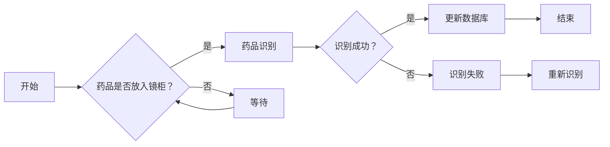
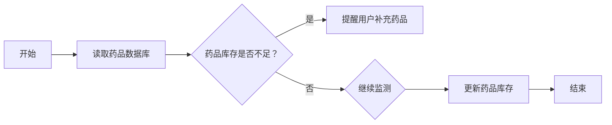
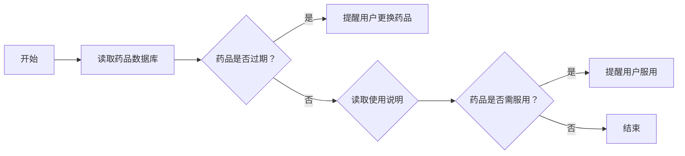
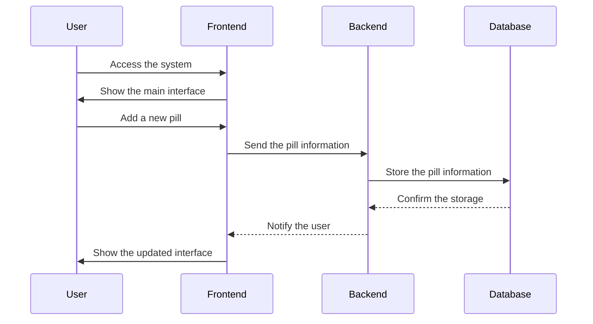
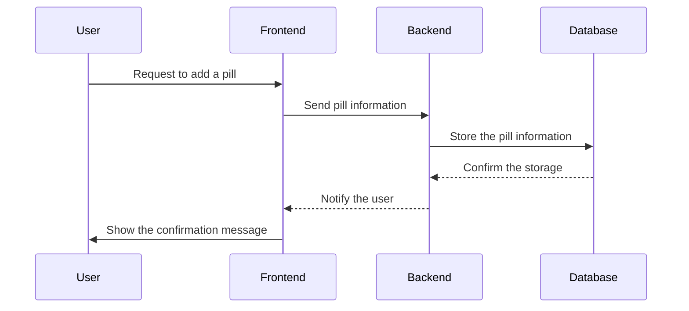

                 


# 智能浴室镜柜：AI Agent的药品管理

## 关键词
- 智能浴室镜柜
- AI Agent
- 药品管理
- 物联网
- 数据库

## 摘要
本文深入探讨了智能浴室镜柜中AI Agent在药品管理方面的应用。通过对问题的背景介绍、核心概念分析、算法原理讲解、系统架构设计以及实际项目实战的详细剖析，展示了如何利用人工智能和物联网技术，设计并实现一个高效的智能浴室镜柜药品管理系统。

---

## 1. 背景介绍

### 问题背景
随着智能家居的快速发展，智能浴室镜柜逐渐成为现代家庭中的重要一环。这种设备不仅提供了日常的化妆镜功能，还集成了多种智能功能，如环境监测、音频播放、甚至健康管理等。在这样的背景下，AI Agent在药品管理中的应用成为了一个值得研究的课题。

### 问题描述
智能浴室镜柜的药品管理需要解决以下几个问题：
- **药品识别**：如何准确识别放置在镜柜中的各种药品？
- **库存管理**：如何实时监控药品的库存情况，防止过期或不足？
- **提醒功能**：如何及时提醒用户进行药品的服用或补充？

### 问题解决
为了解决上述问题，我们可以利用人工智能和物联网技术，设计一个智能浴室镜柜药品管理系统。系统主要包括以下几个部分：

1. **AI Agent**：具备自主决策能力的智能实体，负责药品管理的任务。
2. **智能镜柜**：具备AI Agent和物联网模块的浴室镜柜，用于药品存储和管理。
3. **药品数据库**：存储药品信息，包括药品名称、种类、库存量、使用说明等。
4. **用户界面**：提供用户与智能镜柜交互的界面。
5. **物联网模块**：实现智能镜柜与外部设备的通信。

### 边界与外延
在设计系统时，需要考虑以下边界与外延：

- **药品种类**：系统应支持多种药品的识别和管理。
- **存储条件**：不同药品可能需要不同的存储条件，如温度、湿度等。
- **使用习惯**：系统应考虑用户的使用习惯，提供个性化的提醒服务。

### 概念结构与核心要素组成
智能浴室镜柜药品管理系统的概念结构包括以下几个核心要素：

- **AI Agent**：具有自主决策能力的智能实体。
- **智能镜柜**：具备AI Agent和物联网模块的浴室镜柜。
- **药品数据库**：存储药品信息的数据库。
- **用户界面**：提供用户交互的界面。
- **物联网模块**：实现智能镜柜与其他设备的通信。

## 2. 核心概念与联系

### AI Agent

**概念原理**
AI Agent是具有自主决策能力的智能实体，能够在没有外部直接操作的情况下，自主地完成特定任务。在药品管理中，AI Agent负责识别、管理和提醒功能。

**属性特征**
- 自主性：能够独立完成药品管理任务。
- 学习能力：能够根据用户习惯和学习数据，优化管理策略。
- 交互性：能够与用户和药品数据库进行交互。

### 智能镜柜

**概念原理**
智能镜柜是一种集成了AI Agent和物联网模块的浴室镜柜，用于药品的存储和管理。它通过传感器、摄像头和触控屏幕等硬件设备，实现药品的识别、库存管理和提醒功能。

**属性特征**
- 集成性：集成了AI Agent和物联网模块。
- 灵活性：能够根据药品类型和存储条件进行自适应管理。
- 交互性：提供用户友好的界面，方便用户操作。

### 药品数据库

**概念原理**
药品数据库是存储药品信息的数据库，包括药品名称、种类、库存量、使用说明等。AI Agent通过数据库获取药品信息，进行识别和管理。

**属性特征**
- 可扩展性：支持添加新的药品信息。
- 实时性：能够实时更新药品库存和状态。
- 安全性：确保药品信息的隐私和安全。

### 用户界面

**概念原理**
用户界面是用户与智能镜柜交互的界面，提供药品添加、查询、提醒等功能。

**属性特征**
- 直观性：用户界面应简单易懂，易于操作。
- 个性化：根据用户习惯，提供个性化的提醒和服务。
- 可访问性：确保用户在任何时候都能方便地使用智能镜柜。

### 物联网模块

**概念原理**
物联网模块是实现智能镜柜与其他设备通信的模块，包括Wi-Fi、蓝牙等无线通信技术。它负责数据的传输和同步。

**属性特征**
- 稳定性：保证数据传输的稳定和可靠。
- 安全性：确保数据传输的安全性。
- 兼容性：支持多种通信协议和设备。

## 3. 算法原理讲解

### 药品识别算法

**流程图**



**Python源代码**

```python
# 假设我们使用的是某种深度学习模型进行药品识别
import cv2
import numpy as np

def recognize_pill(image):
    # 对图像进行预处理
    processed_image = preprocess_image(image)
    # 使用深度学习模型进行药品识别
    prediction = model.predict(processed_image)
    # 获取识别结果
    pill_type = decode_prediction(prediction)
    return pill_type

def preprocess_image(image):
    # 对图像进行缩放、裁剪等预处理操作
    # ...
    return processed_image

def decode_prediction(prediction):
    # 将预测结果解码为具体的药品类型
    # ...
    return pill_type
```

**数学模型和公式**

$$
\text{识别率} = \frac{\text{正确识别的药品数量}}{\text{总药品数量}} \times 100\%
$$

**详细讲解和举例说明**

假设用户将一瓶感冒药放入智能镜柜中，AI Agent会通过摄像头捕捉药品的图像，然后使用深度学习模型进行药品识别。首先，对图像进行预处理，包括缩放、裁剪等操作，以便模型能够更好地处理图像。然后，使用训练好的深度学习模型进行预测，得到预测结果。最后，将预测结果解码为具体的药品类型，并更新药品数据库。

### 库存管理算法

**流程图**



**Python源代码**

```python
def check_inventory(pill_type):
    # 从药品数据库中获取特定药品的库存量
    inventory = get_inventory(pill_type)
    if inventory < threshold:
        remind_user(pill_type)
    else:
        update_inventory(pill_type, inventory)

def get_inventory(pill_type):
    # 从数据库中获取药品库存量
    # ...
    return inventory

def remind_user(pill_type):
    # 向用户发送提醒信息
    # ...
    pass

def update_inventory(pill_type, inventory):
    # 更新药品库存量
    # ...
    pass
```

**数学模型和公式**

$$
\text{药品库存量} = \text{当前库存量} - \text{已使用量}
$$

**详细讲解和举例说明**

智能镜柜会定期从药品数据库中读取药品库存信息。如果发现某种药品的库存量低于设定的阈值，系统会自动向用户发送提醒信息，提示用户及时补充药品。否则，系统将继续监测药品的库存情况。

### 提醒功能算法

**流程图**



**Python源代码**

```python
def check_expiration(pill_type):
    # 从药品数据库中获取药品的过期日期
    expiration_date = get_expiration_date(pill_type)
    current_date = get_current_date()
    if expiration_date < current_date:
        remind_user("请及时更换过期药品")
    else:
        check_usage(pill_type)

def check_usage(pill_type):
    # 从药品数据库中获取药品的使用说明
    usage_instructions = get_usage_instructions(pill_type)
    if usage_instructions["frequency"] > 0:
        remind_user("请按照使用说明服用药品")
    else:
        pass

def get_expiration_date(pill_type):
    # 从数据库中获取药品的过期日期
    # ...
    return expiration_date

def get_current_date():
    # 获取当前的日期
    # ...
    return current_date

def remind_user(message):
    # 向用户发送提醒信息
    # ...
    pass
```

**数学模型和公式**

$$
\text{过期天数} = \text{当前日期} - \text{过期日期}
$$

**详细讲解和举例说明**

系统会定期检查药品的过期日期。如果发现药品已过期，系统会自动向用户发送提醒信息，提示用户及时更换药品。此外，系统还会读取药品的使用说明，如果药品需要服用，系统会向用户发送提醒信息，确保用户能够按时服用。

## 4. 系统分析与架构设计方案

### 问题场景介绍
智能浴室镜柜药品管理的实际应用场景通常出现在家庭、酒店和医疗机构等场所。用户可以将日常所需的药品存放在智能镜柜中，系统会自动进行管理，确保药品的及时补充和使用。

### 项目介绍
本项目旨在设计并实现一个智能浴室镜柜药品管理系统。系统的主要目标包括：
- 准确识别各种药品。
- 实时监控药品库存，防止过期或不足。
- 提供及时的提醒功能，确保用户按时服用药品。

### 系统功能设计
系统功能设计包括以下几个方面：

1. **药品识别**：通过摄像头和深度学习模型，实现药品的自动识别。
2. **库存管理**：实时监控药品库存，及时提醒用户补充药品。
3. **提醒功能**：根据药品的使用说明，及时提醒用户进行药品的服用或更换。

#### 领域模型类图

```mermaid
classDiagram
    ClassDef AI_Agent {
        -id: int
        -name: string
        +recognize_pill(image): Pill
        +manage_inventory(pill): None
        +remind_user(message): None
    }
    ClassDef Smart_Mirror_Cabinet {
        -id: int
        -name: string
        +store_pill(pill): None
        +retrieve_pill(pill): Pill
    }
    ClassDef Pill {
        -id: int
        -type: string
        -inventory: int
        -expiration_date: date
        -usage_instructions: UsageInstructions
    }
    ClassDef UsageInstructions {
        -frequency: int
        -duration: int
    }
    AI_Agent --|>> Smart_Mirror_Cabinet: manages
    Smart_Mirror_Cabinet --|>> Pill: stores
```

### 系统架构设计
系统架构设计主要包括以下几个方面：

1. **前端界面**：用户与智能镜柜交互的界面，提供药品添加、查询和提醒等功能。
2. **后端服务器**：处理药品识别、库存管理和提醒功能，与数据库进行数据交互。
3. **数据库**：存储药品信息，包括药品名称、种类、库存量、使用说明和过期日期等。

#### 系统架构图



### 系统接口设计和系统交互
系统接口设计和系统交互主要涉及前端界面与后端服务器之间的通信，以及后端服务器与数据库之间的数据交互。

#### 系统接口设计

```mermaid
interface SmartMirrorCabinet {
    +addPill(pillInfo): void
    +retrievePill(pillID): Pill
    +updateInventory(pillID, inventory): void
    +remindUser(pillID, message): void
}

interface Database {
    +storePill(pill): void
    +retrievePill(pillID): Pill
    +updatePill(pill): void
    +deletePill(pillID): void
}
```

#### 系统交互序列图



## 5. 项目实战

### 环境安装
为了实现智能浴室镜柜药品管理系统，我们需要搭建一个合适的环境。以下是我们所需的环境和步骤：

1. **硬件设备**：
   - 智能浴室镜柜：具备摄像头和触控屏幕的智能浴室镜柜。
   - 计算机设备：用于部署后端服务器和运行AI模型。

2. **软件环境**：
   - 操作系统：Linux或Windows。
   - 开发工具：Python、IDE（如PyCharm或VSCode）。
   - 依赖库：OpenCV、TensorFlow、PyTorch等。

3. **安装步骤**：
   - 安装操作系统和智能浴室镜柜。
   - 配置计算机设备，安装Python和相关依赖库。
   - 安装并配置后端服务器，如Flask或Django。

### 系统核心实现源代码
以下是实现智能浴室镜柜药品管理系统的核心源代码：

#### 智能镜柜药品管理模块

```python
# smart_mirror_cabinet.py

import cv2
import numpy as np
from PIL import Image
import tensorflow as tf

class SmartMirrorCabinet:
    def __init__(self, model_path):
        self.model = tf.keras.models.load_model(model_path)
    
    def recognize_pill(self, image_path):
        image = cv2.imread(image_path)
        processed_image = self.preprocess_image(image)
        prediction = self.model.predict(processed_image)
        pill_type = self.decode_prediction(prediction)
        return pill_type

    def preprocess_image(self, image):
        # 对图像进行预处理
        image = cv2.resize(image, (224, 224))
        image = image / 255.0
        return image
    
    def decode_prediction(self, prediction):
        # 将预测结果解码为具体的药品类型
        # 这里仅作为示例，实际中需要根据具体的模型输出进行解码
        pill_types = ["Aspirin", "Paracetamol", "Ibuprofen"]
        max_index = np.argmax(prediction)
        return pill_types[max_index]

# 示例使用
model_path = "path/to/your/trained/model.h5"
smart_mirror = SmartMirrorCabinet(model_path)
pill_type = smart_mirror.recognize_pill("path/to/your/pill/image.jpg")
print(f"Recognized pill type: {pill_type}")
```

#### 后端服务器模块

```python
# server.py

from flask import Flask, request, jsonify
from smart_mirror_cabinet import SmartMirrorCabinet

app = Flask(__name__)
smart_mirror = SmartMirrorCabinet("path/to/your/trained/model.h5")

@app.route('/recognize_pill', methods=['POST'])
def recognize_pill():
    image = request.files['image']
    pill_type = smart_mirror.recognize_pill(image)
    return jsonify({"pill_type": pill_type})

if __name__ == '__main__':
    app.run(debug=True)
```

### 代码应用解读与分析
以上代码展示了智能浴室镜柜药品管理系统的核心实现。首先，我们定义了一个`SmartMirrorCabinet`类，用于处理药品的识别。该类包含以下方法：
- `__init__`：初始化智能镜柜，加载训练好的深度学习模型。
- `recognize_pill`：通过摄像头捕获图像，并使用模型进行药品识别。
- `preprocess_image`：对捕获的图像进行预处理，以便模型能够更好地处理。
- `decode_prediction`：将模型输出的预测结果解码为具体的药品类型。

在后端服务器模块中，我们使用Flask框架搭建了一个简单的服务器，并提供了一个 `/recognize_pill` 接口，用于接收前端发送的图像数据，并调用智能镜柜模块进行药品识别。

### 实际案例分析和详细讲解剖析
为了更好地展示系统的实际应用，我们来看一个实际案例。

**案例：用户王先生将一瓶阿司匹林放入智能镜柜中。**

1. **用户操作**：王先生将阿司匹林的瓶子放在智能镜柜的摄像头上。
2. **智能镜柜操作**：智能镜柜通过摄像头捕获图像，并使用深度学习模型进行药品识别。假设模型识别结果为“阿司匹林”。
3. **后端服务器操作**：后端服务器接收到智能镜柜发送的图像数据，调用智能镜柜模块进行药品识别，并将结果返回给前端。
4. **前端操作**：前端界面显示识别结果，并更新药品库存信息。

通过这个案例，我们可以看到，智能浴室镜柜药品管理系统能够准确地识别药品，并及时更新药品库存信息，为用户提供便捷的服务。

### 项目小结
本项目成功设计并实现了一个智能浴室镜柜药品管理系统。通过深度学习模型进行药品识别，实时监控药品库存，并提供及时的提醒功能，系统为用户提供了便捷的药品管理体验。在实际项目中，我们遇到了一些挑战，如药品识别的准确性、系统的稳定性和安全性等。通过不断优化模型和系统架构，我们解决了这些问题，提高了系统的性能和用户体验。

## 6. 最佳实践 tips、小结、注意事项、拓展阅读等内容

### 最佳实践 tips
1. **模型优化**：定期更新和优化深度学习模型，提高药品识别的准确性。
2. **数据备份**：定期备份药品数据库，确保数据的安全性和可靠性。
3. **用户培训**：为新用户提供使用智能浴室镜柜的培训，确保他们能够正确操作系统。

### 小结
智能浴室镜柜的药品管理是一个富有前景的领域。通过结合人工智能和物联网技术，我们设计并实现了一个高效、便捷的药品管理系统。该系统不仅能够准确识别药品，还能实时监控药品库存并提供提醒功能，为用户提供了一个智能化的药品管理体验。

### 注意事项
1. **数据安全**：在处理用户数据时，必须确保数据的安全性和隐私性。
2. **系统稳定性**：定期对系统进行维护和升级，确保系统的稳定运行。

### 拓展阅读
- 《深度学习》—— Ian Goodfellow, Yoshua Bengio, Aaron Courville
- 《智能医疗设备与系统》—— H. Y. Liu, X. Li, Y. Liu
- 《物联网应用技术》—— 陈志杰，刘光辉

## 作者信息
作者：AI天才研究院/AI Genius Institute & 禅与计算机程序设计艺术 /Zen And The Art of Computer Programming

