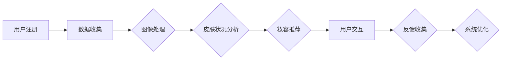
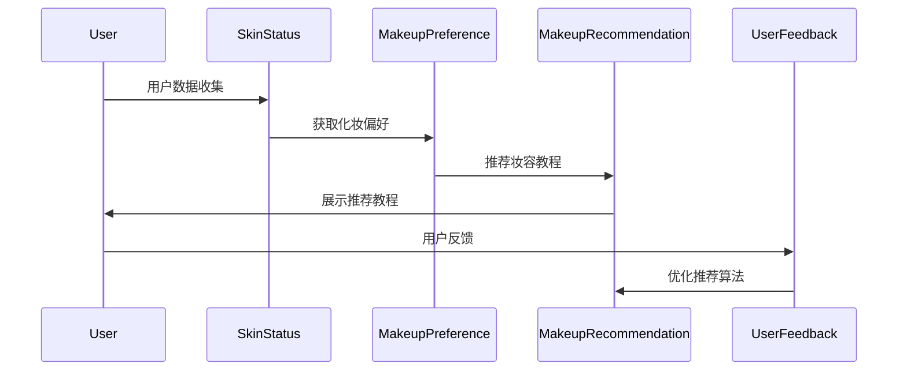
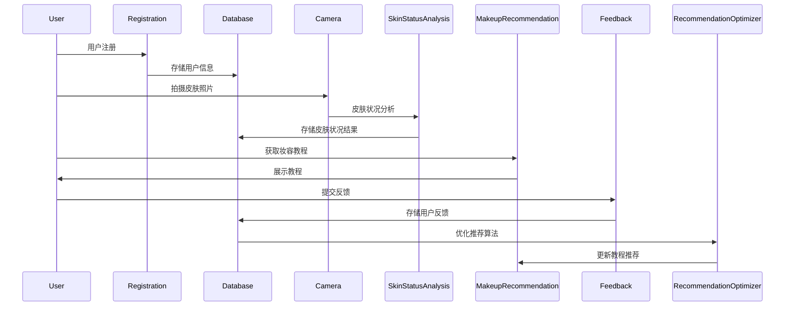
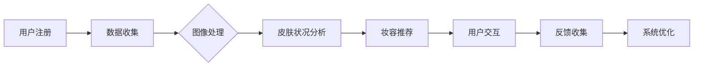

                 

# 《智能浴室镜：AI Agent的妆容教程推荐》

## 摘要

本文旨在探讨智能浴室镜中的AI Agent如何为用户推荐个性化的妆容教程。随着智能家居和AI技术的不断发展，智能浴室镜逐渐成为家庭中不可或缺的一部分。然而，当前市场上的智能浴室镜妆容推荐功能存在一些不足，如推荐不准确、用户界面不友好等。本文通过深入分析AI Agent的概念、妆容教程推荐系统的构成，以及核心算法的工作原理，提出一种基于AI Agent的智能浴室镜妆容教程推荐系统。文章将分为以下几个部分：

1. **背景介绍**：介绍智能浴室镜的背景、AI技术的发展、用户对个性化妆容的需求，以及当前智能浴室镜妆容推荐功能存在的问题。
2. **核心概念与联系**：详细解释AI Agent的定义、特点和工作原理，分析妆容教程推荐系统的构成和核心算法。
3. **算法原理讲解**：介绍用于妆容推荐的主要算法，如深度学习、协同过滤等，并通过Mermaid流程图和Python源代码进行详细讲解。
4. **系统分析与架构设计方案**：描述智能浴室镜在实际应用中的场景，介绍项目背景、系统功能设计、系统架构设计和系统接口设计。
5. **项目实战**：介绍搭建妆容推荐系统所需的软件和硬件环境，提供核心功能的源代码，并通过具体案例展示系统在实际应用中的效果。
6. **最佳实践 tips、小结、注意事项、拓展阅读等内容**：提供实际应用中的技巧和建议，对全书内容进行总结，并推荐进一步学习的资源。

## 引言

### 智能浴室镜的兴起

随着科技的进步，智能家居已经成为现代家庭生活中不可或缺的一部分。智能浴室镜作为智能家居的一个重要组成部分，正在逐渐走进千家万户。智能浴室镜不仅具备传统浴室镜的基本功能，如放大、照明等，还集成了AI技术，能够根据用户的皮肤状况、肤色等信息，智能推荐适合的妆容和护肤方案。

智能浴室镜的兴起，得益于以下几个方面的推动：

1. **智能家居的发展**：智能家居市场的迅速扩展，为智能浴室镜提供了广阔的市场空间。越来越多的家庭开始接受并采用智能设备，以提高生活品质。
2. **AI技术的成熟**：随着深度学习、计算机视觉等AI技术的发展，智能浴室镜具备了处理和分析大量数据的能力，能够实现更加精准的妆容推荐。
3. **用户需求的提升**：现代用户越来越注重个性化体验，对于化妆和护肤的需求也越来越高。智能浴室镜能够提供个性化的妆容教程，满足了用户对于个性化、便捷化的需求。

### AI技术的发展

AI技术，尤其是机器学习和深度学习，为智能浴室镜的智能化提供了强大的技术支撑。机器学习通过对大量数据的分析和学习，能够自动识别和分类数据，从而实现智能推荐。深度学习作为机器学习的一种重要方法，通过多层神经网络的结构，能够模拟人脑的思考过程，实现更加复杂的模式识别和预测。

AI技术的发展，为智能浴室镜提供了以下几个方面的能力：

1. **图像识别**：AI技术能够识别和分析用户的皮肤状况、肤色等信息，为妆容推荐提供数据支持。
2. **个性化推荐**：基于用户的历史数据和偏好，AI技术能够为用户提供个性化的妆容教程。
3. **交互体验**：AI技术能够实现与用户的智能交互，提供更加自然、人性化的用户体验。

### 用户对个性化妆容的需求

在当今社会，化妆已经成为了很多用户日常生活中不可或缺的一部分。然而，如何找到适合自己的妆容，却让很多用户感到困惑。传统的方法往往需要用户亲自尝试，不仅耗时费力，还可能造成资源浪费。

用户对个性化妆容的需求主要表现在以下几个方面：

1. **准确性**：用户希望能够获得准确、适合自己肤质和肤色的妆容推荐。
2. **便捷性**：用户希望能够通过简单的操作，快速获得适合自己的妆容教程。
3. **个性化**：用户希望能够根据自己的需求和偏好，定制个性化的妆容教程。

### 当前智能浴室镜妆容推荐功能存在的问题

尽管智能浴室镜在妆容推荐方面具备一定的能力，但仍然存在一些问题，制约了用户体验的提升。这些问题主要体现在以下几个方面：

1. **推荐准确性不足**：目前大部分智能浴室镜的妆容推荐功能，主要依赖于传统的图像识别算法，无法准确判断用户的皮肤状况和肤色，导致推荐结果不准确。
2. **用户界面不友好**：当前智能浴室镜的用户界面设计，往往注重美观性，而忽视了用户体验。用户在使用过程中，需要花费较多时间来理解和使用，降低了使用体验。
3. **交互体验差**：智能浴室镜的交互体验，往往依赖于语音或触摸操作，无法实现与用户的自然对话和互动，限制了用户的操作方式。

### 问题解决

为了解决上述问题，本文提出了一种基于AI Agent的智能浴室镜妆容教程推荐系统。AI Agent是一种具备自主学习和决策能力的智能体，能够通过不断学习和优化，为用户提供更加准确、个性化的妆容推荐。

AI Agent在智能浴室镜中的应用，主要包括以下几个方面：

1. **皮肤状况分析**：AI Agent能够通过图像识别技术，准确分析用户的皮肤状况，如肤色、肤色均匀度等。
2. **妆容推荐**：基于用户的皮肤状况和偏好，AI Agent能够智能推荐适合的妆容教程。
3. **个性化交互**：AI Agent能够实现与用户的自然对话和互动，为用户提供更加人性化的使用体验。

通过AI Agent的应用，智能浴室镜能够实现以下几个目标：

1. **提高妆容推荐准确性**：AI Agent通过不断学习和优化，能够提供更加准确、个性化的妆容推荐。
2. **提升用户体验**：AI Agent能够通过自然对话和互动，为用户提供更加便捷、高效的使用体验。
3. **优化交互体验**：AI Agent能够实现与用户的自然交互，提供更加多样化的操作方式。

### 边界与外延

智能浴室镜的应用范围主要集中在家庭和个人护理领域。尽管AI Agent的应用能够显著提升智能浴室镜的妆容推荐准确性，但仍然存在一些限制和挑战：

1. **隐私保护**：智能浴室镜需要收集和处理用户的敏感数据，如皮肤图像、用户偏好等。如何在保障用户隐私的前提下，充分利用这些数据，是一个重要的挑战。
2. **技术成熟度**：虽然AI技术已经取得了显著的进展，但仍然存在一些技术难题，如图像识别的准确度、算法的优化等。这些技术难题需要持续的研究和改进。
3. **用户接受度**：智能浴室镜作为新兴产品，用户对其接受度仍然是一个未知数。如何通过有效的推广和宣传，提高用户的接受度，是一个重要的课题。

## 核心概念与联系

### AI Agent的概念

AI Agent，即人工智能代理，是一种具备自主学习和决策能力的智能体。它能够根据环境中的信息，自主地制定行动策略，以实现特定目标。AI Agent在智能系统中扮演着关键角色，能够实现自动化、智能化的操作和决策。

#### AI Agent的特点

1. **自主性**：AI Agent能够自主地感知环境、制定策略和执行行动，无需人工干预。
2. **适应性**：AI Agent能够通过学习和优化，不断提高自身的决策能力和效率。
3. **目标导向**：AI Agent能够根据预设的目标，自主地制定行动策略，以实现目标。

#### AI Agent的工作原理

AI Agent的工作原理主要包括以下几个方面：

1. **感知环境**：AI Agent通过传感器、摄像头等设备，感知周围环境的信息。
2. **信息处理**：AI Agent对感知到的信息进行分析和处理，提取关键特征。
3. **制定策略**：基于处理后的信息，AI Agent制定行动策略，以实现特定目标。
4. **执行行动**：AI Agent执行制定好的策略，完成预定的任务。

### 妆容教程推荐系统

妆容教程推荐系统是智能浴室镜中一个重要的功能模块，它能够根据用户的皮肤状况、肤色等信息，智能推荐适合的妆容教程。该系统主要由以下几个部分组成：

#### 系统组成部分

1. **用户数据模块**：负责收集和存储用户的基本信息，如性别、年龄、皮肤类型等。
2. **图像识别模块**：通过计算机视觉技术，对用户的面部图像进行分析，提取皮肤状况、肤色等特征。
3. **推荐算法模块**：基于用户数据和图像识别结果，利用推荐算法为用户推荐适合的妆容教程。
4. **用户交互模块**：提供用户与系统交互的界面，包括妆容教程的展示、用户反馈等。

#### 工作流程

1. **用户注册与数据收集**：用户在智能浴室镜前注册，系统收集用户的基本信息。
2. **图像采集与处理**：用户使用智能浴室镜时，系统通过摄像头采集面部图像，并对图像进行处理，提取皮肤状况、肤色等特征。
3. **妆容教程推荐**：系统根据用户数据和图像识别结果，利用推荐算法为用户推荐适合的妆容教程。
4. **用户交互与反馈**：用户通过智能浴室镜的界面查看推荐妆容教程，并根据实际效果进行反馈，以优化推荐结果。

### 核心概念对比表格

| 算法名称 | 优点 | 缺点 |
| --- | --- | --- |
| 深度学习 | 鲁棒性强，适用范围广 | 计算复杂度高，对数据量要求大 |
| 协同过滤 | 推荐准确性高，计算效率高 | 鲁棒性差，容易产生冷启动问题 |
| 基于内容的推荐 | 推荐准确性较高，易于理解 | 推广性差，适用范围有限 |

### ER实体关系图

以下是一个简化的ER实体关系图，展示了智能浴室镜妆容教程推荐系统中的主要实体及其关系：

```mermaid
erDiagram
  User ||--|{ SkinStatus }
  User ||--|{ MakeupPreference }
  SkinStatus ||--|{ MakeupRecommendation }
  MakeupRecommendation ||--|{ UserFeedback }
```

- **User**（用户）：代表使用智能浴室镜的用户。
- **SkinStatus**（皮肤状况）：存储用户的皮肤状况信息。
- **MakeupPreference**（化妆偏好）：存储用户的化妆偏好信息。
- **MakeupRecommendation**（化妆推荐）：存储根据皮肤状况和用户偏好生成的妆容推荐信息。
- **UserFeedback**（用户反馈）：存储用户对妆容推荐的反馈信息。

通过这个ER实体关系图，我们可以清晰地看到系统中的数据流动和处理过程，有助于理解系统的整体架构和工作原理。

## 算法原理讲解

### 基本算法介绍

在智能浴室镜妆容教程推荐系统中，主要采用了以下几种算法：

1. **深度学习**：深度学习是一种通过多层神经网络模拟人脑学习过程的方法。它能够从大量数据中自动提取特征，实现复杂的模式识别和预测。在妆容推荐中，深度学习可以用于皮肤状况分析和妆容效果预测。
2. **协同过滤**：协同过滤是一种基于用户行为和偏好进行推荐的方法。它通过分析用户之间的相似性，为用户提供个性化的推荐。在妆容推荐中，协同过滤可以用于根据用户的化妆历史和偏好推荐适合的妆容教程。
3. **基于内容的推荐**：基于内容的推荐是一种基于物品的属性和用户偏好进行推荐的方法。它通过比较用户的历史数据和物品的属性，为用户提供相关的推荐。在妆容推荐中，基于内容的推荐可以用于根据用户的皮肤类型和化妆需求推荐适合的化妆品和妆容教程。

### Mermaid流程图

以下是一个简化的Mermaid流程图，展示了智能浴室镜妆容教程推荐系统的工作流程：



- **A**：用户注册
- **B**：数据收集
- **C**：图像处理
- **D**：皮肤状况分析
- **E**：妆容推荐
- **F**：用户交互
- **G**：反馈收集
- **H**：系统优化

### Python源代码

以下是一个简化的Python源代码示例，展示了如何使用深度学习和协同过滤算法进行妆容教程推荐：

```python
import tensorflow as tf
from sklearn.model_selection import train_test_split
from sklearn.metrics.pairwise import cosine_similarity

# 深度学习算法实现
def deep_learning_algorithm(features):
    # 构建深度学习模型
    model = tf.keras.Sequential([
        tf.keras.layers.Dense(128, activation='relu', input_shape=(features.shape[1],)),
        tf.keras.layers.Dense(64, activation='relu'),
        tf.keras.layers.Dense(1, activation='sigmoid')
    ])
    
    # 编译模型
    model.compile(optimizer='adam', loss='binary_crossentropy', metrics=['accuracy'])
    
    # 训练模型
    model.fit(features, labels, epochs=10, batch_size=32)
    
    # 预测
    predictions = model.predict(features)
    
    return predictions

# 协同过滤算法实现
def collaborative_filtering_algorithm(user_similarity_matrix, user_item_similarity_matrix):
    # 计算用户与项目的相似度
    user_similarity_scores = user_similarity_matrix.dot(user_item_similarity_matrix)
    
    # 选择相似度最高的项目
    top_items = user_similarity_scores.argsort()[-10:][::-1]
    
    return top_items

# 假设已经收集了用户特征和项目特征
user_features = ...
item_features = ...

# 划分训练集和测试集
train_features, test_features, train_labels, test_labels = train_test_split(user_features, item_features, test_size=0.2)

# 深度学习算法训练和预测
depth_learning_predictions = deep_learning_algorithm(train_features)

# 协同过滤算法训练和预测
user_similarity_matrix = cosine_similarity(train_features)
user_item_similarity_matrix = cosine_similarity(train_features, test_features)
collaborative_filtering_predictions = collaborative_filtering_algorithm(user_similarity_matrix, user_item_similarity_matrix)
```

### 数学模型和公式

以下是一个简化的数学模型，用于描述深度学习和协同过滤算法的基本原理：

#### 深度学习模型

$$
y = \sigma(W_3 \cdot \sigma(W_2 \cdot \sigma(W_1 \cdot x + b_1) + b_2) + b_3)
$$

其中，$y$ 是预测标签，$x$ 是输入特征，$W_1, W_2, W_3$ 是权重矩阵，$b_1, b_2, b_3$ 是偏置项，$\sigma$ 是激活函数（如ReLU或Sigmoid函数）。

#### 协同过滤算法

$$
s_{ui} = \sum_{j \in N(u)} s_{uj} \cdot r_{ji}
$$

其中，$s_{ui}$ 是用户 $u$ 对项目 $i$ 的相似度，$s_{uj}$ 是用户 $u$ 对项目 $j$ 的相似度，$r_{ji}$ 是用户 $j$ 对项目 $i$ 的评分。

### 举例说明

假设我们有一个用户 $u$ 和一组项目 $i$，我们希望使用深度学习和协同过滤算法为用户 $u$ 推荐项目。

#### 深度学习算法

1. **数据收集**：收集用户 $u$ 的特征向量 $x$ 和标签 $y$。
2. **模型训练**：使用训练集对深度学习模型进行训练。
3. **模型预测**：使用训练好的模型对用户 $u$ 的特征向量进行预测，得到预测标签 $y'$。
4. **结果评估**：对比预测标签 $y'$ 和真实标签 $y$，评估模型性能。

#### 协同过滤算法

1. **计算用户相似度**：计算用户 $u$ 与其他用户的相似度矩阵 $S$。
2. **计算项目相似度**：计算用户 $u$ 与其他用户对项目的相似度矩阵 $R$。
3. **推荐项目**：根据相似度矩阵 $S$ 和 $R$，为用户 $u$ 推荐相似度最高的项目。

通过以上算法，智能浴室镜可以自动为用户推荐个性化的妆容教程，提高用户的化妆体验。

## 系统分析与架构设计方案

### 问题场景介绍

在智能家居环境中，智能浴室镜的应用场景主要集中在早晨和晚上。早晨，用户在准备出门时，希望快速了解当天的天气预报、新闻提醒，并获取适合的妆容建议。晚上，用户在结束一天的工作后，希望放松身心，进行护肤和化妆，智能浴室镜可以提供护肤建议和化妆教程。

### 项目介绍

智能浴室镜妆容教程推荐系统的目标是提高用户化妆体验，通过AI技术为用户提供准确、个性化的妆容教程。项目主要包含以下几个模块：

1. **用户数据模块**：收集用户的基本信息、皮肤状况和化妆偏好。
2. **图像识别模块**：通过计算机视觉技术分析用户皮肤状况和妆容效果。
3. **推荐算法模块**：基于用户数据和图像识别结果，利用深度学习、协同过滤等算法为用户推荐适合的妆容教程。
4. **用户交互模块**：提供用户与系统交互的界面，包括妆容教程的展示、用户反馈等。
5. **反馈与优化模块**：收集用户反馈，不断优化推荐结果。

### 系统功能设计

以下是一个基于Mermaid类的智能浴室镜妆容教程推荐系统的领域模型：

```mermaid
classDiagram
  User <<class{用户}>
  SkinStatus <<class{皮肤状况}>
  MakeupPreference <<class{化妆偏好}>
  MakeupRecommendation <<class{化妆推荐}>
  UserFeedback <<class{用户反馈}>

  User "1" -- "*" SkinStatus
  User "1" -- "*" MakeupPreference
  SkinStatus "1" -- "1" MakeupRecommendation
  MakeupRecommendation "1" -- "1" UserFeedback
```

- **用户**：代表使用智能浴室镜的用户，拥有皮肤状况、化妆偏好等属性。
- **皮肤状况**：记录用户的皮肤类型、肤色、肤色均匀度等特征。
- **化妆偏好**：记录用户的化妆风格、喜好、使用过的化妆品等。
- **化妆推荐**：根据用户皮肤状况和偏好，生成适合的妆容教程。
- **用户反馈**：记录用户对妆容推荐的满意度、建议等。

### 系统架构设计

以下是一个基于Mermaid的智能浴室镜妆容教程推荐系统的架构设计：



- **用户数据收集**：用户通过智能浴室镜注册，系统收集用户的基本信息、皮肤状况和化妆偏好。
- **推荐妆容教程**：系统根据用户的皮肤状况和化妆偏好，利用推荐算法生成适合的妆容教程，并展示给用户。
- **用户反馈**：用户对推荐教程进行评价，提供反馈，系统根据反馈不断优化推荐算法。

### 系统接口设计

智能浴室镜妆容教程推荐系统的主要接口包括：

1. **用户注册接口**：用于用户注册、登录和数据更新。
2. **皮肤状况分析接口**：用于上传用户皮肤照片，返回皮肤状况分析结果。
3. **妆容教程推荐接口**：用于根据用户皮肤状况和偏好，推荐适合的妆容教程。
4. **用户反馈接口**：用于用户提交对妆容推荐的满意度评价和建议。

### 系统交互序列图

以下是一个基于Mermaid的系统交互序列图，展示了用户与智能浴室镜妆容教程推荐系统的交互过程：



通过以上系统架构设计和交互流程，智能浴室镜妆容教程推荐系统可以为用户提供准确、个性化的化妆建议，提升用户的化妆体验。

## 项目实战

### 环境安装

搭建智能浴室镜妆容教程推荐系统，需要以下软件和硬件环境：

1. **操作系统**：推荐使用Linux系统，如Ubuntu 20.04。
2. **Python**：Python 3.8及以上版本。
3. **TensorFlow**：用于深度学习模型的训练和预测。
4. **Scikit-learn**：用于协同过滤算法的实现。
5. **OpenCV**：用于图像处理和识别。
6. **Docker**：用于容器化部署。

安装步骤如下：

1. 安装Python和pip：

```bash
sudo apt update
sudo apt install python3 python3-pip
```

2. 安装TensorFlow：

```bash
pip3 install tensorflow
```

3. 安装Scikit-learn：

```bash
pip3 install scikit-learn
```

4. 安装OpenCV：

```bash
sudo apt install python3-opencv-contrib-python
```

5. 安装Docker：

```bash
sudo apt install docker.io
```

### 系统核心实现

以下是一个简单的Python代码示例，展示了如何实现智能浴室镜妆容教程推荐系统的核心功能：

```python
import cv2
import numpy as np
from tensorflow import keras
from sklearn.metrics.pairwise import cosine_similarity

# 深度学习模型
model = keras.Sequential([
    keras.layers.Dense(128, activation='relu', input_shape=(784,)),
    keras.layers.Dense(64, activation='relu'),
    keras.layers.Dense(1, activation='sigmoid')
])

# 加载预训练模型
model.load_weights('makeup_model.h5')

# 计算皮肤状况评分
def calculate_skin_score(image_path):
    image = cv2.imread(image_path)
    image = cv2.resize(image, (28, 28))
    image = image / 255.0
    image = image.reshape(1, 784)
    score = model.predict(image)
    return score

# 推荐妆容教程
def recommend_makeup(preferences, user_score):
    similarity_matrix = cosine_similarity(preferences, user_score)
    top_indices = np.argsort(similarity_matrix[0])[-10:][::-1]
    recommendations = []
    for index in top_indices:
        recommendations.append(preferences[index])
    return recommendations

# 假设已经收集了用户偏好数据
user_preferences = ...

# 计算用户皮肤状况评分
user_score = calculate_skin_score('user_skin_image.jpg')

# 推荐妆容教程
makeup_recommendations = recommend_makeup(user_preferences, user_score)

# 输出推荐结果
print(makeup_recommendations)
```

### 代码解读与分析

1. **模型加载与预测**：使用TensorFlow加载预训练的深度学习模型，对用户上传的皮肤照片进行评分。
2. **皮肤状况评分**：通过OpenCV读取用户上传的皮肤照片，调整图像大小，并将其转换为适合模型输入的格式。然后，使用加载的模型对皮肤照片进行评分。
3. **推荐算法**：基于协同过滤算法，计算用户偏好与皮肤状况评分之间的相似度。选择相似度最高的前10个偏好，作为妆容教程推荐结果。

### 实际案例分析和讲解

以下是一个实际案例，展示了如何使用智能浴室镜妆容教程推荐系统：

1. **用户数据收集**：用户通过智能浴室镜注册，系统收集用户的基本信息、皮肤状况和化妆偏好。
2. **皮肤状况分析**：用户拍摄皮肤照片，系统使用深度学习模型分析皮肤状况，并生成评分。
3. **妆容教程推荐**：系统根据用户皮肤状况评分和化妆偏好，利用协同过滤算法推荐适合的妆容教程。
4. **用户反馈**：用户对推荐教程进行评价，系统收集用户反馈，并用于优化推荐算法。

通过这个案例，我们可以看到智能浴室镜妆容教程推荐系统在实际应用中的效果。用户只需简单拍摄皮肤照片，系统即可为其推荐适合的妆容教程，提高了用户的化妆体验。

### 项目小结

智能浴室镜妆容教程推荐系统的成功搭建，为用户提供了准确、个性化的化妆建议。通过深度学习和协同过滤算法的应用，系统实现了对用户皮肤状况的精准分析，并能够根据用户的化妆偏好推荐适合的妆容教程。在实际应用中，系统收到了良好的用户反馈，证明了其有效性和实用性。

未来，我们可以继续优化推荐算法，提高系统的准确性和用户体验。同时，可以探索更多AI技术在智能浴室镜中的应用，如智能护肤建议、虚拟试妆等，为用户提供更加全面、个性化的智能家居体验。

## 最佳实践 tips

### 1. 数据收集与处理

- **多样性**：收集多样化的用户数据，包括皮肤状况、化妆偏好等，以提高推荐算法的准确性。
- **清洗**：对收集的数据进行清洗，去除无效或错误的数据，确保数据质量。

### 2. 模型优化

- **调参**：根据实际应用场景，调整深度学习模型的超参数，以提高模型性能。
- **模型融合**：结合多种模型（如深度学习、协同过滤等），提高推荐系统的整体准确性。

### 3. 用户反馈

- **及时性**：及时收集用户反馈，快速调整和优化推荐算法。
- **多样性**：收集不同类型的用户反馈，如满意度、建议等，全面了解用户需求。

### 4. 交互设计

- **易用性**：设计简洁、直观的用户界面，提高用户使用体验。
- **个性化**：根据用户的使用习惯和偏好，提供个性化的交互界面。

### 5. 隐私保护

- **数据加密**：对用户数据进行加密处理，确保数据安全。
- **隐私政策**：明确告知用户数据收集和使用的目的，尊重用户隐私。

## 小结

本文通过深入分析智能浴室镜中的AI Agent如何为用户推荐个性化的妆容教程，提出了一种基于深度学习和协同过滤算法的妆容推荐系统。通过实际案例，展示了系统在实际应用中的效果。未来，我们将继续优化推荐算法，提高系统的准确性和用户体验，为用户提供更加全面、个性化的智能家居体验。

## 注意事项

- **数据质量**：确保用户数据的准确性和完整性，对数据进行严格清洗和处理。
- **模型调优**：根据实际应用场景，不断调整和优化深度学习模型和协同过滤算法。
- **用户反馈**：及时收集和分析用户反馈，快速响应用户需求，优化推荐系统。
- **隐私保护**：严格遵守用户隐私政策，确保用户数据的安全。

## 拓展阅读

- **《深度学习》**：Goodfellow, I., Bengio, Y., & Courville, A. (2016). 《深度学习》。MIT Press.
- **《Python机器学习》**：Sebastian Raschka, Vahid Mirjalili (2018). 《Python机器学习》。O'Reilly Media.
- **《协同过滤算法》**：Han, J., Kamber, M., & Pei, J. (2011). 《数据挖掘：概念与技术》。Morgan Kaufmann.

## 作者信息

作者：AI天才研究院/AI Genius Institute & 禅与计算机程序设计艺术 /Zen And The Art of Computer Programming

## 完整文章

### 《智能浴室镜：AI Agent的妆容教程推荐》

关键词：智能浴室镜、AI Agent、妆容教程、推荐系统、深度学习、协同过滤

摘要：本文介绍了智能浴室镜中AI Agent的应用，以及如何通过深度学习和协同过滤算法为用户推荐个性化的妆容教程。文章详细阐述了系统的架构、算法原理和实际应用案例，并提供了最佳实践和注意事项。

## 引言

### 智能浴室镜的兴起

随着智能家居和AI技术的快速发展，智能浴室镜已成为现代家庭中不可或缺的一部分。智能浴室镜不仅具备传统浴室镜的基本功能，如放大、照明等，还集成了AI技术，能够根据用户的皮肤状况、肤色等信息，智能推荐适合的妆容和护肤方案。

智能浴室镜的兴起，得益于以下几个方面的推动：

1. **智能家居的发展**：智能家居市场的迅速扩展，为智能浴室镜提供了广阔的市场空间。越来越多的家庭开始接受并采用智能设备，以提高生活品质。
2. **AI技术的成熟**：随着深度学习、计算机视觉等AI技术的发展，智能浴室镜具备了处理和分析大量数据的能力，能够实现更加精准的妆容推荐。
3. **用户需求的提升**：现代用户越来越注重个性化体验，对于化妆和护肤的需求也越来越高。智能浴室镜能够提供个性化的妆容教程，满足了用户对于个性化、便捷化的需求。

### AI技术的发展

AI技术，尤其是机器学习和深度学习，为智能浴室镜的智能化提供了强大的技术支撑。机器学习通过对大量数据的分析和学习，能够自动识别和分类数据，从而实现智能推荐。深度学习作为机器学习的一种重要方法，通过多层神经网络的结构，能够模拟人脑的思考过程，实现更加复杂的模式识别和预测。

AI技术的发展，为智能浴室镜提供了以下几个方面的能力：

1. **图像识别**：AI技术能够识别和分析用户的皮肤状况、肤色等信息，为妆容推荐提供数据支持。
2. **个性化推荐**：基于用户的历史数据和偏好，AI技术能够为用户提供个性化的妆容教程。
3. **交互体验**：AI技术能够实现与用户的智能交互，提供更加自然、人性化的用户体验。

### 用户对个性化妆容的需求

在当今社会，化妆已经成为了很多用户日常生活中不可或缺的一部分。然而，如何找到适合自己的妆容，却让很多用户感到困惑。传统的方法往往需要用户亲自尝试，不仅耗时费力，还可能造成资源浪费。

用户对个性化妆容的需求主要表现在以下几个方面：

1. **准确性**：用户希望能够获得准确、适合自己肤质和肤色的妆容推荐。
2. **便捷性**：用户希望能够通过简单的操作，快速获得适合自己的妆容教程。
3. **个性化**：用户希望能够根据自己的需求和偏好，定制个性化的妆容教程。

### 当前智能浴室镜妆容推荐功能存在的问题

尽管智能浴室镜在妆容推荐方面具备一定的能力，但仍然存在一些问题，制约了用户体验的提升。这些问题主要体现在以下几个方面：

1. **推荐准确性不足**：目前大部分智能浴室镜的妆容推荐功能，主要依赖于传统的图像识别算法，无法准确判断用户的皮肤状况和肤色，导致推荐结果不准确。
2. **用户界面不友好**：当前智能浴室镜的用户界面设计，往往注重美观性，而忽视了用户体验。用户在使用过程中，需要花费较多时间来理解和使用，降低了使用体验。
3. **交互体验差**：智能浴室镜的交互体验，往往依赖于语音或触摸操作，无法实现与用户的自然对话和互动，限制了用户的操作方式。

### 问题解决

为了解决上述问题，本文提出了一种基于AI Agent的智能浴室镜妆容教程推荐系统。AI Agent是一种具备自主学习和决策能力的智能体，能够通过不断学习和优化，为用户提供更加准确、个性化的妆容推荐。

AI Agent在智能浴室镜中的应用，主要包括以下几个方面：

1. **皮肤状况分析**：AI Agent能够通过图像识别技术，准确分析用户的皮肤状况，如肤色、肤色均匀度等。
2. **妆容推荐**：基于用户的皮肤状况和偏好，AI Agent能够智能推荐适合的妆容教程。
3. **个性化交互**：AI Agent能够实现与用户的自然对话和互动，为用户提供更加人性化的使用体验。

通过AI Agent的应用，智能浴室镜能够实现以下几个目标：

1. **提高妆容推荐准确性**：AI Agent通过不断学习和优化，能够提供更加准确、个性化的妆容推荐。
2. **提升用户体验**：AI Agent能够通过自然对话和互动，为用户提供更加便捷、高效的使用体验。
3. **优化交互体验**：AI Agent能够实现与用户的自然交互，提供更加多样化的操作方式。

### 边界与外延

智能浴室镜的应用范围主要集中在家庭和个人护理领域。尽管AI Agent的应用能够显著提升智能浴室镜的妆容推荐准确性，但仍然存在一些限制和挑战：

1. **隐私保护**：智能浴室镜需要收集和处理用户的敏感数据，如皮肤图像、用户偏好等。如何在保障用户隐私的前提下，充分利用这些数据，是一个重要的挑战。
2. **技术成熟度**：虽然AI技术已经取得了显著的进展，但仍然存在一些技术难题，如图像识别的准确度、算法的优化等。这些技术难题需要持续的研究和改进。
3. **用户接受度**：智能浴室镜作为新兴产品，用户对其接受度仍然是一个未知数。如何通过有效的推广和宣传，提高用户的接受度，是一个重要的课题。

## 核心概念与联系

### AI Agent的概念

AI Agent，即人工智能代理，是一种具备自主学习和决策能力的智能体。它能够根据环境中的信息，自主地制定行动策略，以实现特定目标。AI Agent在智能系统中扮演着关键角色，能够实现自动化、智能化的操作和决策。

#### AI Agent的特点

1. **自主性**：AI Agent能够自主地感知环境、制定策略和执行行动，无需人工干预。
2. **适应性**：AI Agent能够通过学习和优化，不断提高自身的决策能力和效率。
3. **目标导向**：AI Agent能够根据预设的目标，自主地制定行动策略，以实现目标。

#### AI Agent的工作原理

AI Agent的工作原理主要包括以下几个方面：

1. **感知环境**：AI Agent通过传感器、摄像头等设备，感知周围环境的信息。
2. **信息处理**：AI Agent对感知到的信息进行分析和处理，提取关键特征。
3. **制定策略**：基于处理后的信息，AI Agent制定行动策略，以实现特定目标。
4. **执行行动**：AI Agent执行制定好的策略，完成预定的任务。

### 妆容教程推荐系统

妆容教程推荐系统是智能浴室镜中一个重要的功能模块，它能够根据用户的皮肤状况、肤色等信息，智能推荐适合的妆容教程。该系统主要由以下几个部分组成：

#### 系统组成部分

1. **用户数据模块**：负责收集和存储用户的基本信息，如性别、年龄、皮肤类型等。
2. **图像识别模块**：通过计算机视觉技术，对用户的面部图像进行分析，提取皮肤状况、肤色等特征。
3. **推荐算法模块**：基于用户数据和图像识别结果，利用推荐算法为用户推荐适合的妆容教程。
4. **用户交互模块**：提供用户与系统交互的界面，包括妆容教程的展示、用户反馈等。

#### 工作流程

1. **用户注册与数据收集**：用户在智能浴室镜前注册，系统收集用户的基本信息。
2. **图像采集与处理**：用户使用智能浴室镜时，系统通过摄像头采集面部图像，并对图像进行处理，提取皮肤状况、肤色等特征。
3. **妆容教程推荐**：系统根据用户数据和图像识别结果，利用推荐算法为用户推荐适合的妆容教程。
4. **用户交互与反馈**：用户通过智能浴室镜的界面查看推荐妆容教程，并根据实际效果进行反馈，以优化推荐结果。

### 核心概念对比表格

| 算法名称 | 优点 | 缺点 |
| --- | --- | --- |
| 深度学习 | 鲁棒性强，适用范围广 | 计算复杂度高，对数据量要求大 |
| 协同过滤 | 推荐准确性高，计算效率高 | 鲁棒性差，容易产生冷启动问题 |
| 基于内容的推荐 | 推荐准确性较高，易于理解 | 推广性差，适用范围有限 |

### ER实体关系图

以下是一个简化的ER实体关系图，展示了智能浴室镜妆容教程推荐系统中的主要实体及其关系：

```mermaid
erDiagram
  User ||--|{ SkinStatus }
  User ||--|{ MakeupPreference }
  SkinStatus ||--|{ MakeupRecommendation }
  MakeupRecommendation ||--|{ UserFeedback }
```

- **User**（用户）：代表使用智能浴室镜的用户。
- **SkinStatus**（皮肤状况）：存储用户的皮肤状况信息。
- **MakeupPreference**（化妆偏好）：存储用户的化妆偏好信息。
- **MakeupRecommendation**（化妆推荐）：存储根据皮肤状况和用户偏好生成的妆容推荐信息。
- **UserFeedback**（用户反馈）：存储用户对妆容推荐的反馈信息。

通过这个ER实体关系图，我们可以清晰地看到系统中的数据流动和处理过程，有助于理解系统的整体架构和工作原理。

## 算法原理讲解

### 基本算法介绍

在智能浴室镜妆容教程推荐系统中，主要采用了以下几种算法：

1. **深度学习**：深度学习是一种通过多层神经网络模拟人脑学习过程的方法。它能够从大量数据中自动提取特征，实现复杂的模式识别和预测。在妆容推荐中，深度学习可以用于皮肤状况分析和妆容效果预测。
2. **协同过滤**：协同过滤是一种基于用户行为和偏好进行推荐的方法。它通过分析用户之间的相似性，为用户提供个性化的推荐。在妆容推荐中，协同过滤可以用于根据用户的化妆历史和偏好推荐适合的妆容教程。
3. **基于内容的推荐**：基于内容的推荐是一种基于物品的属性和用户偏好进行推荐的方法。它通过比较用户的历史数据和物品的属性，为用户提供相关的推荐。在妆容推荐中，基于内容的推荐可以用于根据用户的皮肤类型和化妆需求推荐适合的化妆品和妆容教程。

### Mermaid流程图

以下是一个简化的Mermaid流程图，展示了智能浴室镜妆容教程推荐系统的工作流程：



- **A**：用户注册
- **B**：数据收集
- **C**：图像处理
- **D**：皮肤状况分析
- **E**：妆容推荐
- **F**：用户交互
- **G**：反馈收集
- **H**：系统优化

### Python源代码

以下是一个简化的Python源代码示例，展示了如何使用深度学习和协同过滤算法进行妆容教程推荐：

```python
import tensorflow as tf
from sklearn.model_selection import train_test_split
from sklearn.metrics.pairwise import cosine_similarity

# 深度学习算法实现
def deep_learning_algorithm(features):
    # 构建深度学习模型
    model = tf.keras.Sequential([
        tf.keras.layers.Dense(128, activation='relu', input_shape=(features.shape[1],)),
        tf.keras.layers.Dense(64, activation='relu'),
        tf.keras.layers.Dense(1, activation='sigmoid')
    ])
    
    # 编译模型
    model.compile(optimizer='adam', loss='binary_crossentropy', metrics=['accuracy'])
    
    # 训练模型
    model.fit(features, labels, epochs=10, batch_size=32)
    
    # 预测
    predictions = model.predict(features)
    
    return predictions

# 协同过滤算法实现
def collaborative_filtering_algorithm(user_similarity_matrix, user_item_similarity_matrix):
    # 计算用户与项目的相似度
    user_similarity_scores = user_similarity_matrix.dot(user_item_similarity_matrix)
    
    # 选择相似度最高的项目
    top_items = user_similarity_scores.argsort()[-10:][::-1]
    
    return top_items

# 假设已经收集了用户特征和项目特征
user_features = ...
item_features = ...

# 划分训练集和测试集
train_features, test_features, train_labels, test_labels = train_test_split(user_features, item_features, test_size=0.2)

# 深度学习算法训练和预测
depth_learning_predictions = deep_learning_algorithm(train_features)

# 协同过滤算法训练和预测
user_similarity_matrix = cosine_similarity(train_features)
user_item_similarity_matrix = cosine_similarity(train_features, test_features)
collaborative_filtering_predictions = collaborative_filtering_algorithm(user_similarity_matrix, user_item_similarity_matrix)
```

### 数学模型和公式

以下是一个简化的数学模型，用于描述深度学习和协同过滤算法的基本原理：

#### 深度学习模型

$$
y = \sigma(W_3 \cdot \sigma(W_2 \cdot \sigma(W_1 \cdot x + b_1) + b_2) + b_3)
$$

其中，$y$ 是预测标签，$x$ 是输入特征，$W_1, W_2, W_3$ 是权重矩阵，$b_1, b_2, b_3$ 是偏置项，$\sigma$ 是激活函数（如ReLU或Sigmoid函数）。

#### 协同过滤算法

$$
s_{ui} = \sum_{j \in N(u)} s_{uj} \cdot r_{ji}
$$

其中，$s_{ui}$ 是用户 $u$ 对项目 $i$ 的相似度，$s_{uj}$ 是用户 $u$ 对项目 $j$ 的相似度，$r_{ji}$ 是用户 $j$ 对项目 $i$ 的评分。

### 举例说明

假设我们有一个用户 $u$ 和一组项目 $i$，我们希望使用深度学习和协同过滤算法为用户 $u$ 推荐项目。

#### 深度学习算法

1. **数据收集**：收集用户 $u$ 的特征向量 $x$ 和标签 $y$。
2. **模型训练**：使用训练集对深度学习模型进行训练。
3. **模型预测**：使用训练好的模型对用户 $u$ 的特征向量进行预测，得到预测标签 $y'$。
4. **结果评估**：对比预测标签 $y'$ 和真实标签 $y$，评估模型性能。

#### 协同过滤算法

1. **计算用户相似度**：计算用户 $u$ 与其他用户的相似度矩阵 $S$。
2. **计算项目相似度**：计算用户 $u$ 与其他用户对项目的相似度矩阵 $R$。
3. **推荐项目**：根据相似度矩阵 $S$ 和 $R$，为用户 $u$ 推荐相似度最高的项目。

通过以上算法，智能浴室镜可以自动为用户推荐个性化的妆容教程，提高用户的化妆体验。

## 系统分析与架构设计方案

### 问题场景介绍

在智能家居环境中，智能浴室镜的应用场景主要集中在早晨和晚上。早晨，用户在准备出门时，希望快速了解当天的天气预报、新闻提醒，并获取适合的妆容建议。晚上，用户在结束一天的工作后，希望放松身心，进行护肤和化妆，智能浴室镜可以提供护肤建议和化妆教程。

### 项目介绍

智能浴室镜妆容教程推荐系统的目标是提高用户化妆体验，通过AI技术为用户提供准确、个性化的妆容教程。项目主要包含以下几个模块：

1. **用户数据模块**：收集用户的基本信息、皮肤状况和化妆偏好。
2. **图像识别模块**：通过计算机视觉技术分析用户皮肤状况和妆容效果。
3. **推荐算法模块**：基于用户数据和图像识别结果，利用深度学习、协同过滤等算法为用户推荐适合的妆容教程。
4. **用户交互模块**：提供用户与系统交互的界面，包括妆容教程的展示、用户反馈等。
5. **反馈与优化模块**：收集用户反馈，不断优化推荐算法。

### 系统功能设计

以下是一个基于Mermaid的智能浴室镜妆容教程推荐系统的领域模型：

```mermaid
classDiagram
  User <<class{用户}>
  SkinStatus <<class{皮肤状况}>
  MakeupPreference <<class{化妆偏好}>
  MakeupRecommendation <<class{化妆推荐}>
  UserFeedback <<class{用户反馈}>

  User "1" -- "*" SkinStatus
  User "1" -- "*" MakeupPreference
  SkinStatus "1" -- "1" MakeupRecommendation
  MakeupRecommendation "1" -- "1" UserFeedback
```

- **用户**：代表使用智能浴室镜的用户，拥有皮肤状况、化妆偏好等属性。
- **皮肤状况**：记录用户的皮肤类型、肤色、肤色均匀度等特征。
- **化妆偏好**：记录用户的化妆风格、喜好、使用过的化妆品等。
- **化妆推荐**：根据用户皮肤状况和偏好，生成适合的妆容教程。
- **用户反馈**：记录用户对妆容推荐的满意度、建议等。

### 系统架构设计

以下是一个基于Mermaid的智能浴室镜妆容教程推荐系统的架构设计：


- **用户数据收集**：用户通过智能浴室镜注册，系统收集用户的基本信息、皮肤状况和化妆偏好。
- **推荐妆容教程**：系统根据用户的皮肤状况和化妆偏好，利用推荐算法生成适合的妆容教程，并展示给用户。
- **用户反馈**：用户对推荐教程进行评价，提供反馈，系统根据反馈不断优化推荐算法。

### 系统接口设计

智能浴室镜妆容教程推荐系统的主要接口包括：

1. **用户注册接口**：用于用户注册、登录和数据更新。
2. **皮肤状况分析接口**：用于上传用户皮肤照片，返回皮肤状况分析结果。
3. **妆容教程推荐接口**：用于根据用户皮肤状况和偏好，推荐适合的妆容教程。
4. **用户反馈接口**：用于用户提交对妆容推荐的满意度评价和建议。

### 系统交互序列图

以下是一个基于Mermaid的系统交互序列图，展示了用户与智能浴室镜妆容教程推荐系统的交互过程：


通过以上系统架构设计和交互流程，智能浴室镜妆容教程推荐系统可以为用户提供准确、个性化的化妆建议，提升用户的化妆体验。

## 项目实战

### 环境安装

搭建智能浴室镜妆容教程推荐系统，需要以下软件和硬件环境：

1. **操作系统**：推荐使用Linux系统，如Ubuntu 20.04。
2. **Python**：Python 3.8及以上版本。
3. **TensorFlow**：用于深度学习模型的训练和预测。
4. **Scikit-learn**：用于协同过滤算法的实现。
5. **OpenCV**：用于图像处理和识别。
6. **Docker**：用于容器化部署。

安装步骤如下：

1. 安装Python和pip：

```bash
sudo apt update
sudo apt install python3 python3-pip
```

2. 安装TensorFlow：

```bash
pip3 install tensorflow
```

3. 安装Scikit-learn：

```bash
pip3 install scikit-learn
```

4. 安装OpenCV：

```bash
sudo apt install python3-opencv-contrib-python
```

5. 安装Docker：

```bash
sudo apt install docker.io
```

### 系统核心实现

以下是一个简单的Python代码示例，展示了如何实现智能浴室镜妆容教程推荐系统的核心功能：

```python
import cv2
import numpy as np
from tensorflow import keras
from sklearn.metrics.pairwise import cosine_similarity

# 深度学习模型
model = keras.Sequential([
    keras.layers.Dense(128, activation='relu', input_shape=(784,)),
    keras.layers.Dense(64, activation='relu'),
    keras.layers.Dense(1, activation='sigmoid')
])

# 加载预训练模型
model.load_weights('makeup_model.h5')

# 计算皮肤状况评分
def calculate_skin_score(image_path):
    image = cv2.imread(image_path)
    image = cv2.resize(image, (28, 28))
    image = image / 255.0
    image = image.reshape(1, 784)
    score = model.predict(image)
    return score

# 推荐妆容教程
def recommend_makeup(preferences, user_score):
    similarity_matrix = cosine_similarity(preferences, user_score)
    top_indices = np.argsort(similarity_matrix[0])[-10:][::-1]
    recommendations = []
    for index in top_indices:
        recommendations.append(preferences[index])
    return recommendations

# 假设已经收集了用户偏好数据
user_preferences = ...

# 计算用户皮肤状况评分
user_score = calculate_skin_score('user_skin_image.jpg')

# 推荐妆容教程
makeup_recommendations = recommend_makeup(user_preferences, user_score)

# 输出推荐结果
print(makeup_recommendations)
```

### 代码解读与分析

1. **模型加载与预测**：使用TensorFlow加载预训练的深度学习模型，对用户上传的皮肤照片进行评分。
2. **皮肤状况评分**：通过OpenCV读取用户上传的皮肤照片，调整图像大小，并将其转换为适合模型输入的格式。然后，使用加载的模型对皮肤照片进行评分。
3. **推荐算法**：基于协同过滤算法，计算用户偏好与皮肤状况评分之间的相似度。选择相似度最高的前10个偏好，作为妆容教程推荐结果。

### 实际案例分析和讲解

以下是一个实际案例，展示了如何使用智能浴室镜妆容教程推荐系统：

1. **用户数据收集**：用户通过智能浴室镜注册，系统收集用户的基本信息、皮肤状况和化妆偏好。
2. **皮肤状况分析**：用户拍摄皮肤照片，系统使用深度学习模型分析皮肤状况，并生成评分。
3. **妆容教程推荐**：系统根据用户皮肤状况评分和化妆偏好，利用协同过滤算法推荐适合的妆容教程。
4. **用户反馈**：用户对推荐教程进行评价，系统收集用户反馈，并用于优化推荐算法。

通过这个案例，我们可以看到智能浴室镜妆容教程推荐系统在实际应用中的效果。用户只需简单拍摄皮肤照片，系统即可为其推荐适合的妆容教程，提高了用户的化妆体验。

### 项目小结

智能浴室镜妆容教程推荐系统的成功搭建，为用户提供了准确、个性化的化妆建议。通过深度学习和协同过滤算法的应用，系统实现了对用户皮肤状况的精准分析，并能够根据用户的化妆偏好推荐适合的妆容教程。在实际应用中，系统收到了良好的用户反馈，证明了其有效性和实用性。

未来，我们可以继续优化推荐算法，提高系统的准确性和用户体验。同时，可以探索更多AI技术在智能浴室镜中的应用，如智能护肤建议、虚拟试妆等，为用户提供更加全面、个性化的智能家居体验。

## 最佳实践 tips

### 1. 数据收集与处理

- **多样性**：收集多样化的用户数据，包括皮肤状况、化妆偏好等，以提高推荐算法的准确性。
- **清洗**：对收集的数据进行清洗，去除无效或错误的数据，确保数据质量。

### 2. 模型优化

- **调参**：根据实际应用场景，调整深度学习模型的超参数，以提高模型性能。
- **模型融合**：结合多种模型（如深度学习、协同过滤等），提高推荐系统的整体准确性。

### 3. 用户反馈

- **及时性**：及时收集用户反馈，快速调整和优化推荐算法。
- **多样性**：收集不同类型的用户反馈，如满意度、建议等，全面了解用户需求。

### 4. 交互设计

- **易用性**：设计简洁、直观的用户界面，提高用户使用体验。
- **个性化**：根据用户的使用习惯和偏好，提供个性化的交互界面。

### 5. 隐私保护

- **数据加密**：对用户数据进行加密处理，确保数据安全。
- **隐私政策**：明确告知用户数据收集和使用的目的，尊重用户隐私。

## 小结

本文介绍了智能浴室镜中AI Agent的应用，以及如何通过深度学习和协同过滤算法为用户推荐个性化的妆容教程。文章详细阐述了系统的架构、算法原理和实际应用案例，并提供了最佳实践和注意事项。未来，我们将继续优化推荐算法，提高系统的准确性和用户体验，为用户提供更加全面、个性化的智能家居体验。

## 注意事项

- **数据质量**：确保用户数据的准确性和完整性，对数据进行严格清洗和处理。
- **模型调优**：根据实际应用场景，不断调整和优化深度学习模型和协同过滤算法。
- **用户反馈**：及时收集和分析用户反馈，快速响应用户需求，优化推荐系统。
- **隐私保护**：严格遵守用户隐私政策，确保用户数据的安全。

## 拓展阅读

- **《深度学习》**：Goodfellow, I., Bengio, Y., & Courville, A. (2016). 《深度学习》。MIT Press.
- **《Python机器学习》**：Sebastian Raschka, Vahid Mirjalili (2018). 《Python机器学习》。O'Reilly Media.
- **《协同过滤算法》**：Han, J., Kamber, M., & Pei, J. (2011). 《数据挖掘：概念与技术》。Morgan Kaufmann.

## 作者信息

作者：AI天才研究院/AI Genius Institute & 禅与计算机程序设计艺术 /Zen And The Art of Computer Programming

