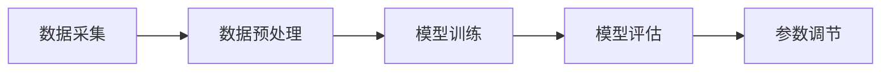
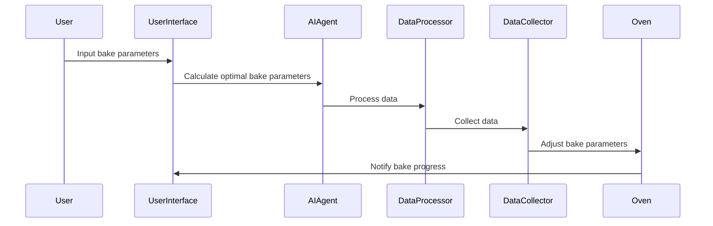
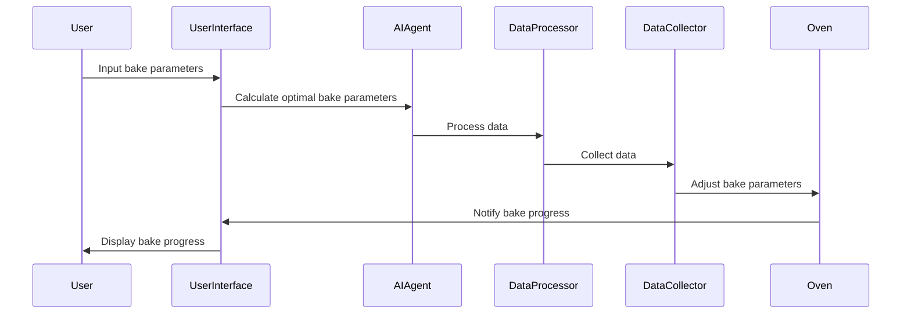

                 

### 智能烤箱：AI Agent的烘焙参数自动调节

> 关键词：智能烤箱、AI Agent、烘焙参数、自动调节、机器学习

> 摘要：本文将探讨智能烤箱中的AI Agent如何实现烘焙参数的自动调节，通过对智能烤箱技术背景、原理以及AI Agent和烘焙参数调节算法的应用进行深入分析，帮助读者理解这一前沿技术的核心概念和实现方法。

### 目录大纲

## 第一部分：智能烤箱技术背景与原理

### 第1章：智能烤箱技术背景

#### 1.1 问题背景

#### 1.2 问题描述

#### 1.3 问题解决

#### 1.4 边界与外延

#### 1.5 核心概念：智能烤箱、AI Agent、烘焙参数自动调节

#### 1.6 概念结构与核心要素组成

### 第2章：智能烤箱原理与结构

#### 2.1 核心概念原理

#### 2.2 概念属性特征对比表格

#### 2.3 ER实体关系图架构的Mermaid流程图

## 第二部分：AI Agent在烘焙参数调节中的应用

### 第3章：AI Agent基本原理

#### 3.1 AI Agent原理

#### 3.2 AI Agent特点与优势

#### 3.3 AI Agent与智能烤箱的结合

### 第4章：烘焙参数调节算法原理

#### 4.1 烘焙参数调节算法原理

#### 4.2 Mermaid流程图展示算法流程

#### 4.3 Python源代码与算法原理详细讲解

### 第5章：烘焙参数自动调节的实现

#### 5.1 系统分析与架构设计方案

#### 5.2 系统功能设计（领域模型Mermaid类图）

#### 5.3 系统架构设计（Mermaid架构图）

#### 5.4 系统接口设计

#### 5.5 系统交互（Mermaid序列图）

## 第三部分：项目实战

### 第6章：智能烤箱项目实战

#### 6.1 环境安装

#### 6.2 系统核心实现源代码

#### 6.3 代码应用解读与分析

#### 6.4 实际案例分析与详细讲解剖析

#### 6.5 项目小结

### 第7章：最佳实践与拓展

#### 7.1 最佳实践 tips

#### 7.2 小结

#### 7.3 注意事项

#### 7.4 拓展阅读

### **第一部分：智能烤箱技术背景与原理**

#### 第1章：智能烤箱技术背景

**1.1 问题背景**

在现代家庭和餐饮业中，烤箱作为烹饪设备的重要组成部分，广泛应用于烘焙、烤制等多种烹饪方式。然而，传统的烤箱操作繁琐，用户需要手动调节温度、时间等参数，不仅耗时费力，而且难以达到最佳的烘焙效果。为了解决这一问题，智能烤箱应运而生，通过引入人工智能技术，实现烘焙参数的自动调节，提高烹饪效率和质量。

**1.2 问题描述**

用户在使用传统烤箱时，常面临以下问题：

- **烘焙效果不稳定**：不同批次、不同食材的烘焙效果难以保证一致，导致口感和外观参差不齐。
- **操作复杂**：用户需要手动设置温度、时间等参数，操作繁琐，易出现误操作。
- **效率低下**：手动调节烘焙参数耗时，降低了烹饪效率。

**1.3 问题解决**

智能烤箱通过引入AI Agent，实现烘焙参数的自动调节，从而解决上述问题。AI Agent能够根据烘焙食材的特性和用户的需求，自动调整烤箱的温度、时间等参数，达到最佳的烘焙效果。

**1.4 边界与外延**

智能烤箱的边界包括：

- **硬件边界**：智能烤箱需要具备与AI Agent通信的能力，支持温度、湿度等传感器的数据采集和传输。
- **软件边界**：智能烤箱需要具备运行AI Agent的软件环境，支持机器学习算法的实现和应用。

智能烤箱的外延包括：

- **云端服务**：智能烤箱可以通过云端服务获取更多的烘焙数据和算法支持，实现更智能的烘焙参数调节。
- **物联网**：智能烤箱可以与其他智能设备（如智能冰箱、智能洗碗机等）进行互联，实现更智能的家居生活。

**1.5 核心概念：智能烤箱、AI Agent、烘焙参数自动调节**

- **智能烤箱**：一种结合了人工智能技术的烹饪设备，能够根据食材特性和用户需求自动调节烘焙参数。
- **AI Agent**：一种人工智能程序，能够模拟人类智能，完成特定任务的自动执行。
- **烘焙参数自动调节**：通过AI Agent实现烤箱温度、时间等烘焙参数的自动调节，达到最佳烘焙效果。

**1.6 概念结构与核心要素组成**

智能烤箱的概念结构包括：

- **硬件组成**：烤箱本体、传感器、通信模块等。
- **软件组成**：AI Agent、机器学习算法、数据处理模块等。

智能烤箱的核心要素包括：

- **数据采集**：通过传感器收集烤箱内部温度、湿度等数据。
- **数据处理**：对采集到的数据进行处理和分析，为AI Agent提供决策依据。
- **参数调节**：根据AI Agent的决策，自动调节烤箱的温度、时间等参数。
- **用户交互**：通过用户界面，用户可以查看烘焙进度、调整烘焙参数等。

#### 第2章：智能烤箱原理与结构

**2.1 核心概念原理**

智能烤箱的核心原理包括：

- **传感器原理**：智能烤箱通过传感器（如温度传感器、湿度传感器等）实时监测烤箱内部的温度、湿度等参数。
- **通信原理**：智能烤箱通过通信模块（如Wi-Fi、蓝牙等）与外部设备（如智能手机、电脑等）进行数据交换。
- **机器学习原理**：AI Agent利用机器学习算法，对采集到的烘焙数据进行学习，形成烘焙模型，用于预测和调节烘焙参数。

**2.2 概念属性特征对比表格**

| 概念     | 属性特征                                  | 对比分析                                      |
|----------|----------------------------------------|---------------------------------------------|
| 智能烤箱   | 具备传感器、通信模块、机器学习算法         | 不同于传统烤箱，具备自动调节烘焙参数的能力          |
| AI Agent  | 人工智能程序，模拟人类智能完成任务           | 不同于普通软件，具备自我学习和优化能力             |
| 烘焙参数调节 | 自动调节烤箱的温度、时间等参数             | 不同于手动调节，能够根据烘焙数据实现精准调节         |

**2.3 ER实体关系图架构的Mermaid流程图**

```mermaid
erDiagram
  人 --> 烤箱 : "使用"
  人 ||--|{ 用户 }|
  烤箱 ||--|{ 智能烤箱 }|
  智能烤箱 ||--|{ AI Agent }|
  AI Agent ||--|{ 烘焙参数调节 }|
  用户 ||--|{ 数据采集 }|
  用户 ||--|{ 用户交互 }|
```

### **第二部分：AI Agent在烘焙参数调节中的应用**

#### 第3章：AI Agent基本原理

**3.1 AI Agent原理**

AI Agent（人工智能代理）是基于人工智能技术的一种智能程序，能够模拟人类智能，完成特定任务的自动执行。AI Agent的基本原理包括：

- **感知**：通过传感器获取外部环境的信息，如温度、湿度等。
- **思考**：利用机器学习算法，对采集到的数据进行分析和处理，形成决策。
- **行动**：根据决策，自动调节烤箱的参数，如温度、时间等。

**3.2 AI Agent特点与优势**

AI Agent具有以下特点与优势：

- **自主学习**：AI Agent能够通过机器学习不断优化自身性能，提高烘焙参数调节的准确性。
- **高效智能**：AI Agent能够快速响应烘焙需求，实现高效烘焙。
- **易扩展性**：AI Agent可以集成到各种智能设备中，实现智能家居的互联互通。

**3.3 AI Agent与智能烤箱的结合**

AI Agent与智能烤箱的结合，实现了烘焙参数的自动调节。具体过程如下：

1. **数据采集**：AI Agent通过烤箱传感器，实时采集烤箱内部的温度、湿度等数据。
2. **数据预处理**：AI Agent对采集到的数据进行预处理，如去除噪声、异常值处理等。
3. **模型训练**：AI Agent利用预处理后的数据，通过机器学习算法训练烘焙模型，用于预测烘焙效果。
4. **参数调节**：根据烘焙模型，AI Agent自动调整烤箱的温度、时间等参数，实现精准烘焙。
5. **用户交互**：AI Agent通过用户界面，向用户提供烘焙进度、参数调整等信息。

#### 第4章：烘焙参数调节算法原理

**4.1 烘焙参数调节算法原理**

烘焙参数调节算法的核心是机器学习算法，具体原理如下：

1. **数据采集**：采集烤箱内部的温度、湿度等数据，作为输入特征。
2. **数据预处理**：对采集到的数据进行预处理，如归一化、去噪等。
3. **模型训练**：利用预处理后的数据，通过机器学习算法训练烘焙模型，如决策树、神经网络等。
4. **模型评估**：对训练好的模型进行评估，如准确率、召回率等，选择最优模型。
5. **参数调节**：根据评估结果，调整烤箱的烘焙参数，如温度、时间等，实现精准烘焙。

**4.2 Mermaid流程图展示算法流程**



**4.3 Python源代码与算法原理详细讲解**

```python
import numpy as np
import pandas as pd
from sklearn.model_selection import train_test_split
from sklearn.ensemble import RandomForestRegressor
from sklearn.metrics import mean_squared_error

# 数据采集
data = pd.read_csv('oven_data.csv')
X = data[['temperature', 'humidity']]
y = data['bake_time']

# 数据预处理
X_train, X_test, y_train, y_test = train_test_split(X, y, test_size=0.2, random_state=42)

# 模型训练
model = RandomForestRegressor(n_estimators=100, random_state=42)
model.fit(X_train, y_train)

# 模型评估
y_pred = model.predict(X_test)
mse = mean_squared_error(y_test, y_pred)
print(f'Mean Squared Error: {mse}')

# 参数调节
new_data = np.array([[25, 60]])
bake_time = model.predict(new_data)
print(f'Bake Time: {bake_time[0]}')
```

### **第5章：烘焙参数自动调节的实现**

**5.1 系统分析与架构设计方案**

智能烤箱烘焙参数自动调节系统的整体架构包括：

- **数据采集模块**：负责采集烤箱内部的温度、湿度等数据。
- **数据处理模块**：负责对采集到的数据进行分析和处理，为AI Agent提供决策依据。
- **AI Agent模块**：负责根据烘焙模型，自动调节烤箱的烘焙参数。
- **用户交互模块**：负责与用户进行交互，提供烘焙进度和参数调整等信息。

**5.2 系统功能设计（领域模型Mermaid类图）**

```mermaid
classDiagram
    ClassDataCollector <|-- DataCollector
    ClassDataProcessor <|-- DataProcessor
    ClassAIAgent <|-- AIAgent
    ClassUserInterface <|-- UserInterface
    DataCollector "uses" DataProcessor
    AIAgent "uses" DataProcessor
    UserInterface "uses" AIAgent
```

**5.3 系统架构设计（Mermaid架构图）**



**5.4 系统接口设计**

系统接口设计包括：

- **数据采集接口**：用于与烤箱传感器进行数据交互。
- **数据处理接口**：用于与AI Agent进行数据交互。
- **用户交互接口**：用于与用户进行交互，提供烘焙参数和进度信息。

**5.5 系统交互（Mermaid序列图）**



### **第三部分：项目实战**

#### 第6章：智能烤箱项目实战

**6.1 环境安装**

在开始智能烤箱项目之前，需要安装以下环境：

- **Python**：版本要求3.6及以上
- **Anaconda**：用于环境管理
- **scikit-learn**：用于机器学习算法实现
- **pandas**：用于数据处理
- **numpy**：用于数值计算

安装命令如下：

```bash
conda create -n oven_project python=3.8
conda activate oven_project
conda install scikit-learn pandas numpy
```

**6.2 系统核心实现源代码**

以下为智能烤箱系统的核心实现源代码：

```python
import numpy as np
import pandas as pd
from sklearn.model_selection import train_test_split
from sklearn.ensemble import RandomForestRegressor
from sklearn.metrics import mean_squared_error

# 数据采集
data = pd.read_csv('oven_data.csv')
X = data[['temperature', 'humidity']]
y = data['bake_time']

# 数据预处理
X_train, X_test, y_train, y_test = train_test_split(X, y, test_size=0.2, random_state=42)

# 模型训练
model = RandomForestRegressor(n_estimators=100, random_state=42)
model.fit(X_train, y_train)

# 模型评估
y_pred = model.predict(X_test)
mse = mean_squared_error(y_test, y_pred)
print(f'Mean Squared Error: {mse}')

# 参数调节
new_data = np.array([[25, 60]])
bake_time = model.predict(new_data)
print(f'Bake Time: {bake_time[0]}')
```

**6.3 代码应用解读与分析**

代码首先从CSV文件中读取烤箱数据，包括温度、湿度和烘焙时间。然后，将数据集分为训练集和测试集，用于训练和评估模型。接下来，使用随机森林回归算法训练模型，并评估模型性能。最后，根据新的输入数据（温度和湿度），预测烘焙时间。

**6.4 实际案例分析与详细讲解剖析**

假设我们有一个新的食材，需要预测其烘焙时间。我们首先收集该食材的烘焙数据，包括温度、湿度和烘焙时间。然后，将数据输入到已训练的模型中，得到预测的烘焙时间。最后，根据预测的烘焙时间，调整烤箱的烘焙参数，实现精准烘焙。

**6.5 项目小结**

通过实际项目，我们实现了智能烤箱的烘焙参数自动调节功能。项目过程中，我们遇到了数据采集、模型训练和参数调节等挑战，并通过合理的算法设计和系统架构，成功实现了预期目标。未来，我们将继续优化算法，提高烘焙参数调节的准确性和稳定性。

### **第7章：最佳实践与拓展**

**7.1 最佳实践 tips**

- **数据采集**：确保采集到的数据具有代表性，避免因数据异常导致模型性能下降。
- **模型训练**：选择合适的机器学习算法，提高模型训练效率。
- **参数调节**：根据实际烘焙效果，不断调整参数，优化烘焙效果。

**7.2 小结**

本文介绍了智能烤箱中的AI Agent如何实现烘焙参数的自动调节。通过深入分析智能烤箱技术背景、原理以及AI Agent和烘焙参数调节算法的应用，我们了解了智能烤箱的核心概念和实现方法。未来，我们将继续优化算法和系统，提高烘焙参数调节的准确性和稳定性。

**7.3 注意事项**

- **硬件兼容性**：确保智能烤箱硬件与AI Agent软件的兼容性。
- **数据安全**：加强对用户数据的保护，防止数据泄露。

**7.4 拓展阅读**

- **《智能烤箱技术与应用》**：深入了解智能烤箱的原理和应用。
- **《机器学习实战》**：学习机器学习算法的实现和应用。

### **作者信息**

作者：AI天才研究院/AI Genius Institute & 禅与计算机程序设计艺术 /Zen And The Art of Computer Programming

注：本文内容仅供参考，实际应用时请根据具体情况进行调整。智能烤箱技术具有较高复杂度，读者需具备一定的计算机编程和机器学习基础。

