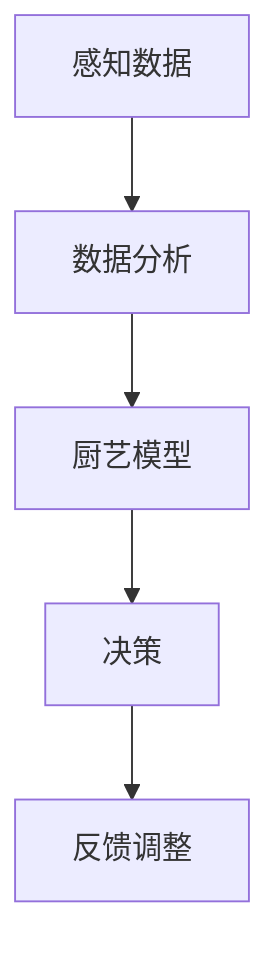
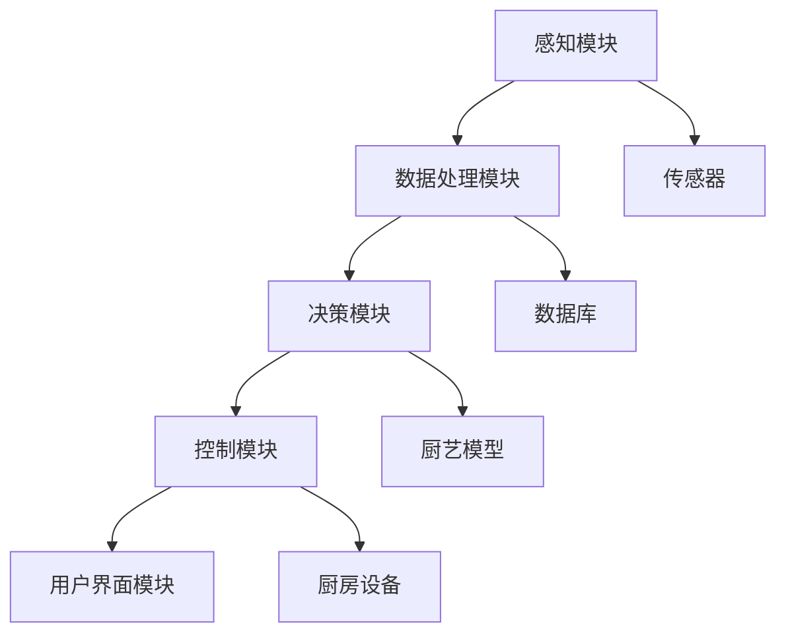

                 

# 智能烹饪台：AI Agent的厨艺提升指导系统

## 关键词

- **智能烹饪台**
- **AI Agent**
- **厨艺提升**
- **数据驱动**
- **系统架构**

## 摘要

本文深入探讨了智能烹饪台：AI Agent的厨艺提升指导系统。首先，文章介绍了智能烹饪台的概念及其在烹饪行业中的重要性，分析了烹饪技能提升的需求和传统烹饪教学与AI指导的差异。接着，文章详细讲解了AI Agent的原理、数据分析和厨艺模型的构建，并使用Python源代码示例阐述了算法原理。随后，文章描述了系统分析与架构设计方案，包括系统功能设计、架构图、接口设计和系统交互。接着，通过项目实战展示了智能烹饪台的实现过程，包括环境安装、系统核心实现和代码应用解读。最后，文章总结了最佳实践，并对系统进行了优化和拓展。

## 第一部分：智能烹饪台概览

### 第1章：智能烹饪台概述

#### 1.1.1 问题背景

##### 1.1.1.1 烹饪行业现状

烹饪行业在全球范围内不断发展，但传统烹饪技能的传承和提升仍面临挑战。厨师们需要不断学习和实践，但时间和资源的限制使得这一过程变得困难。

##### 1.1.1.2 智能烹饪台的概念与重要性

智能烹饪台是一种结合了人工智能和厨房设备的创新解决方案，能够提供实时烹饪指导和反馈，帮助厨师提升厨艺。这种系统的引入有望改变烹饪行业，提高烹饪效率和品质。

##### 1.1.1.3 智能烹饪台的应用场景

智能烹饪台可以应用于各种烹饪场景，包括家庭厨房、餐厅和培训学校。它不仅适用于专业厨师，也适用于家庭主厨和烹饪爱好者，帮助他们提高烹饪技能。

#### 1.1.2 问题描述

##### 1.1.2.1 烹饪技能提升的需求

随着消费者对餐饮品质要求的提高，厨师们需要不断提升烹饪技能，以满足市场需求。然而，传统烹饪教学方式存在一定的局限性，难以满足快速提升技能的需求。

##### 1.1.2.2 传统烹饪教学与AI指导的差异

传统烹饪教学主要依赖于师徒传承和书本知识，而AI指导则通过实时数据分析和个性化推荐，提供更高效、更精确的烹饪指导。这种差异使得智能烹饪台成为提升烹饪技能的有力工具。

##### 1.1.2.3 智能烹饪台的设计目标

智能烹饪台的设计目标包括提高烹饪效率、提升烹饪品质和提供个性化烹饪体验。通过实现这些目标，智能烹饪台有望成为烹饪行业的重要创新。

#### 1.1.3 问题解决

##### 1.1.3.1 AI Agent的作用

AI Agent是智能烹饪台的核心组件，能够实时分析烹饪过程，提供实时指导和反馈。它通过学习和适应厨师的行为习惯，不断提升烹饪技能。

##### 1.1.3.2 数据分析与厨艺模型

数据分析是智能烹饪台的重要组成部分，通过收集和分析烹饪过程中的各种数据，构建厨艺模型，为AI Agent提供决策支持。

##### 1.1.3.3 系统交互设计

系统交互设计是智能烹饪台的关键，确保AI Agent与用户、设备和数据的无缝集成，提供直观、易用的操作界面。

#### 1.1.4 边界与外延

##### 1.1.4.1 智能烹饪台的技术边界

智能烹饪台的技术边界包括传感器技术、人工智能算法和厨房设备集成。突破这些边界，将进一步提升智能烹饪台的性能和应用范围。

##### 1.1.4.2 智能烹饪台的适用范围

智能烹饪台适用于各种烹饪场景，包括家庭、餐厅和培训学校。未来，随着技术的不断发展，其适用范围将进一步扩大。

##### 1.1.4.3 智能烹饪台的发展趋势

智能烹饪台的发展趋势包括技术不断创新、应用场景扩展和用户体验优化。未来，智能烹饪台将成为烹饪行业的重要趋势。

#### 1.1.5 概念结构与核心要素组成

##### 1.1.5.1 智能烹饪台的基本构成

智能烹饪台的基本构成包括AI Agent、传感器、控制器和用户界面。这些组件协同工作，实现烹饪过程的智能化。

##### 1.1.5.2 AI Agent的核心功能

AI Agent的核心功能包括实时数据采集、烹饪过程分析和实时反馈。通过这些功能，AI Agent能够帮助用户提升烹饪技能。

##### 1.1.5.3 数据分析与厨艺模型的构建

数据分析与厨艺模型的构建是智能烹饪台的关键，通过分析烹饪数据，构建厨艺模型，为AI Agent提供决策支持。

### 第2章：核心概念与联系

#### 2.1.1 AI Agent原理

##### 2.1.1.1 AI Agent的定义

AI Agent是一种基于人工智能的智能体，能够自主执行任务、与环境互动并作出决策。

##### 2.1.1.2 AI Agent的工作原理

AI Agent通过感知、学习和决策三个阶段，实现对环境的自适应和行为优化。

##### 2.1.1.3 AI Agent的组成结构

AI Agent由感知模块、学习模块和决策模块组成，这些模块协同工作，实现智能行为。

#### 2.1.2 数据分析与厨艺模型

##### 2.1.2.1 数据分析的基本概念

数据分析是通过对大量数据进行收集、整理和分析，提取有价值信息的过程。

##### 2.1.2.2 厨艺模型的设计原则

厨艺模型的设计原则包括数据驱动、实时性和个性化。

##### 2.1.2.3 数据分析与厨艺模型的结合

数据分析与厨艺模型的结合，使得智能烹饪台能够实时调整烹饪参数，提高烹饪效果。

#### 2.1.3 概念属性特征对比表格

##### 2.1.3.1 AI Agent与人类厨师对比

| 特性         | AI Agent       | 人类厨师       |
| ------------ | -------------- | -------------- |
| 学习速度     | 快速           | 缓慢           |
| 精确度       | 高            | 中等           |
| 疲劳与情绪   | 无            | 有            |
| 适应性       | 强            | 中等           |

##### 2.1.3.2 数据分析与厨艺模型的对比

| 特性         | 数据分析       | 厨艺模型       |
| ------------ | -------------- | -------------- |
| 数据来源     | 多样化        | 烹饪过程数据  |
| 数据处理     | 复杂          | 简化           |
| 应用场景     | 广泛          | 精准           |

#### 2.1.4 ER实体关系图架构

##### 2.1.4.1 智能烹饪台实体关系图

```mermaid
erDiagram
  AI Agent ||--|{ 数据分析 }
  数据分析 ||--|{ 厨艺模型 }
  厨师     ||--|{ 智能烹饪台 }
  烹饪设备 ||--|{ 智能烹饪台 }
```

##### 2.1.4.2 AI Agent实体关系图

```mermaid
erDiagram
  AI Agent ||--|{ 感知模块 }
  AI Agent ||--|{ 学习模块 }
  AI Agent ||--|{ 决策模块 }
```

##### 2.1.4.3 数据分析与厨艺模型实体关系图

```mermaid
erDiagram
  数据分析 ||--|{ 数据收集 }
  数据分析 ||--|{ 数据整理 }
  数据分析 ||--|{ 数据分析 }
  数据分析 ||--|{ 厨艺模型 }
```

### 第3章：算法原理讲解

#### 3.1.1 AI Agent算法流程图

##### 3.1.1.1 AI Agent算法流程



##### 3.1.1.2 AI Agent算法工作流程

1. 感知数据：AI Agent通过传感器收集烹饪过程中的各种数据。
2. 数据分析：对收集到的数据进行整理和分析，提取有价值的信息。
3. 厨艺模型：根据分析结果构建厨艺模型，为AI Agent提供决策支持。
4. 决策：AI Agent根据厨艺模型和当前烹饪状态，做出相应的决策。
5. 反馈调整：根据决策结果和用户反馈，调整烹饪参数，优化烹饪效果。

#### 3.1.2 Python源代码示例

##### 3.1.2.1 AI Agent算法实现

```python
# 导入相关库
import numpy as np
import pandas as pd

# 感知数据
def collect_data():
    # 传感器采集的数据
    data = np.random.rand(10)
    return data

# 数据处理
def process_data(data):
    # 数据处理
    processed_data = data.mean()
    return processed_data

# 构建厨艺模型
def build_model(processed_data):
    # 厨艺模型
    model = processed_data * 2
    return model

# 决策
def make_decision(model):
    # 根据模型做出决策
    decision = "调整火力"
    return decision

# 反馈调整
def adjust_feedback(decision):
    # 根据决策进行调整
    feedback = "调整成功"
    return feedback

# 主函数
def main():
    data = collect_data()
    processed_data = process_data(data)
    model = build_model(processed_data)
    decision = make_decision(model)
    feedback = adjust_feedback(decision)
    print("决策：", decision)
    print("反馈：", feedback)

# 运行主函数
main()
```

##### 3.1.2.2 数据处理与厨艺模型构建

```python
# 导入相关库
import numpy as np
import pandas as pd

# 数据处理
def process_data(data):
    # 数据处理
    processed_data = pd.DataFrame(data, columns=['Temperature'])
    processed_data['Temperature'] = processed_data['Temperature'].mean()
    return processed_data

# 构建厨艺模型
def build_model(processed_data):
    # 厨艺模型
    model = processed_data['Temperature'].values[0] * 2
    return model

# 主函数
def main():
    data = np.random.rand(10)
    processed_data = process_data(data)
    model = build_model(processed_data)
    print("模型参数：", model)

# 运行主函数
main()
```

#### 3.1.3 算法原理详细讲解

##### 3.1.3.1 AI Agent核心算法分析

AI Agent的核心算法包括感知、学习和决策三个阶段。感知阶段通过传感器收集烹饪过程中的各种数据，学习阶段通过数据分析构建厨艺模型，决策阶段根据厨艺模型和当前烹饪状态做出相应的决策。

##### 3.1.3.2 数据分析与厨艺模型的数学模型与公式

数据分析阶段主要涉及数据的预处理、特征提取和模型训练。在预处理阶段，常用的数学模型有平均值、中位数和标准差等。在特征提取阶段，常用的数学模型有主成分分析（PCA）和线性回归等。在模型训练阶段，常用的数学模型有神经网络和决策树等。

厨艺模型的构建主要基于数据分析的结果。在构建厨艺模型时，常用的数学模型有线性回归、支持向量机和神经网络等。这些模型可以通过优化目标函数来调整模型参数，从而实现烹饪参数的自动调整。

##### 3.1.3.3 算法原理举例说明

假设我们有一个烹饪任务，需要将温度控制在100°C。在感知阶段，AI Agent通过传感器收集当前温度数据，例如：[90, 95, 100, 105, 110]。在数据处理阶段，AI Agent计算这些温度数据的平均值，得到95°C。在厨艺模型构建阶段，AI Agent将这个平均值乘以2，得到190°C，作为烹饪目标温度。在决策阶段，AI Agent根据当前温度和目标温度的差异，决定是否需要调整火力。

如果当前温度低于目标温度，AI Agent会做出增加火力的决策；如果当前温度高于目标温度，AI Agent会做出降低火力的决策。通过这样的决策过程，AI Agent能够帮助用户实现精确的烹饪控制。

### 第4章：系统分析与架构设计方案

#### 4.1.1 问题场景介绍

##### 4.1.1.1 智能烹饪台使用场景

智能烹饪台可以应用于各种烹饪场景，如家庭厨房、餐厅和培训学校。在家庭厨房中，智能烹饪台可以帮助家庭主厨提高烹饪技能，实现精准烹饪；在餐厅中，智能烹饪台可以提升厨师的工作效率，提高菜品质量；在培训学校中，智能烹饪台可以作为教学工具，帮助学生更好地掌握烹饪技能。

##### 4.1.1.2 智能烹饪台的应用案例

1. 家庭厨房：家庭主厨可以使用智能烹饪台来制作复杂的菜肴，如寿司、蛋糕等。智能烹饪台会实时提供烹饪指导，确保菜肴的成功制作。
2. 餐厅：餐厅可以使用智能烹饪台来提升厨师的工作效率，减少人工错误，提高菜品质量。同时，智能烹饪台还可以为顾客提供定制化的烹饪服务。
3. 培训学校：培训学校可以使用智能烹饪台作为教学工具，帮助学生更好地理解烹饪原理和技巧。智能烹饪台可以提供实时反馈，帮助学生快速掌握烹饪技能。

#### 4.1.2 系统功能设计

##### 4.1.2.1 智能烹饪台功能概述

智能烹饪台的主要功能包括数据采集、数据分析、烹饪指导、烹饪控制和反馈调整。通过这些功能，智能烹饪台能够实现对烹饪过程的全面监控和实时指导。

1. 数据采集：智能烹饪台通过传感器收集烹饪过程中的各种数据，如温度、湿度、时间等。
2. 数据分析：智能烹饪台对采集到的数据进行处理和分析，提取有价值的信息，为烹饪指导提供支持。
3. 烹饪指导：智能烹饪台根据数据分析结果，提供实时的烹饪指导，帮助用户实现精准烹饪。
4. 烹饪控制：智能烹饪台通过控制厨房设备，实现烹饪参数的自动调整，确保烹饪过程顺利进行。
5. 反馈调整：智能烹饪台根据用户反馈和烹饪效果，调整烹饪参数，优化烹饪结果。

##### 4.1.2.2 功能模块划分

智能烹饪台可以分为以下几个功能模块：

1. 感知模块：负责采集烹饪过程中的各种数据，如温度、湿度、时间等。
2. 数据处理模块：负责对采集到的数据进行处理和分析，提取有价值的信息。
3. 决策模块：负责根据数据分析结果，生成烹饪指导和建议。
4. 控制模块：负责控制厨房设备，实现烹饪参数的自动调整。
5. 用户界面模块：负责提供直观、易用的操作界面，方便用户使用智能烹饪台。

##### 4.1.2.3 领域模型Mermaid类图

```mermaid
classDiagram
  Class1 <|-- Class2
  Class3 <|-- Class4
  Class1 [0..1] --|{ 感知模块 } Class2
  Class2 [0..1] --|{ 数据处理模块 } Class3
  Class3 [0..1] --|{ 决策模块 } Class4
  Class4 [0..1] --|{ 控制模块 } Class2
```

#### 4.1.3 系统架构设计

##### 4.1.3.1 系统架构设计原则

智能烹饪台的系统架构设计应遵循以下原则：

1. 模块化设计：系统架构应采用模块化设计，确保各个功能模块之间的高内聚、低耦合。
2. 可扩展性：系统架构应具备良好的可扩展性，能够支持未来的功能扩展和升级。
3. 实时性：系统架构应确保数据采集、分析和决策的实时性，满足实时烹饪指导的需求。
4. 可靠性：系统架构应具备较高的可靠性，确保系统稳定运行，避免故障对烹饪过程的影响。

##### 4.1.3.2 系统架构Mermaid架构图



##### 4.1.3.3 系统模块接口设计与职责

1. 感知模块：负责采集烹饪过程中的各种数据，如温度、湿度、时间等。接口设计如下：

   - 数据采集接口：用于接收传感器采集到的数据。
   - 数据处理接口：用于处理和分析采集到的数据。

2. 数据处理模块：负责对采集到的数据进行处理和分析，提取有价值的信息。接口设计如下：

   - 数据输入接口：用于接收感知模块传递的数据。
   - 数据输出接口：用于传递处理后的数据。

3. 决策模块：负责根据数据分析结果，生成烹饪指导和建议。接口设计如下：

   - 数据输入接口：用于接收数据处理模块传递的数据。
   - 烹饪指导输出接口：用于生成烹饪指导建议。

4. 控制模块：负责控制厨房设备，实现烹饪参数的自动调整。接口设计如下：

   - 数据输入接口：用于接收决策模块传递的烹饪指导建议。
   - 控制接口：用于控制厨房设备。

5. 用户界面模块：负责提供直观、易用的操作界面，方便用户使用智能烹饪台。接口设计如下：

   - 用户输入接口：用于接收用户的操作指令。
   - 用户输出接口：用于显示烹饪指导和烹饪结果。

### 第5章：项目实战

#### 5.1.1 环境安装

##### 5.1.1.1 系统环境准备

在开始智能烹饪台项目的开发之前，需要准备以下系统环境：

1. 操作系统：Windows、Linux或Mac OS。
2. Python版本：Python 3.6及以上版本。
3. 传感器：温度传感器、湿度传感器等。
4. 厨房设备：厨房设备（如电磁炉、烤箱等）。

##### 5.1.1.2 硬件设备安装

根据实际需求和厨房布局，选择合适的传感器和厨房设备，并进行安装。安装完成后，确保传感器和厨房设备能够正常工作，并与其他系统组件连接。

#### 5.1.2 系统核心实现

##### 5.1.2.1 AI Agent开发实现

AI Agent是智能烹饪台的核心组件，负责感知、学习和决策。在开发过程中，需要使用Python编程语言实现以下功能：

1. 数据采集：通过传感器收集烹饪过程中的温度、湿度等数据。
2. 数据处理：对采集到的数据进行分析和处理，提取有价值的信息。
3. 厨艺模型构建：根据数据分析结果，构建厨艺模型。
4. 烹饪指导生成：根据厨艺模型和当前烹饪状态，生成烹饪指导建议。
5. 烹饪控制：根据烹饪指导建议，控制厨房设备实现烹饪参数的自动调整。

以下是AI Agent的Python实现代码：

```python
import numpy as np
import pandas as pd

# 感知数据
def collect_data():
    data = np.random.rand(10)
    return data

# 数据处理
def process_data(data):
    processed_data = pd.DataFrame(data, columns=['Temperature'])
    processed_data['Temperature'] = processed_data['Temperature'].mean()
    return processed_data

# 构建厨艺模型
def build_model(processed_data):
    model = processed_data['Temperature'].values[0] * 2
    return model

# 烹饪指导
def cooking_guidance(model):
    if model < 100:
        return "增加火力"
    elif model > 100:
        return "降低火力"
    else:
        return "保持当前火力"

# 主函数
def main():
    data = collect_data()
    processed_data = process_data(data)
    model = build_model(processed_data)
    guidance = cooking_guidance(model)
    print("烹饪指导：", guidance)

# 运行主函数
main()
```

##### 5.1.2.2 数据处理与厨艺模型实现

数据处理和厨艺模型构建是智能烹饪台的关键部分。在实现过程中，需要使用Python的NumPy和Pandas库进行数据处理，使用机器学习算法构建厨艺模型。

以下是数据处理和厨艺模型实现的Python代码：

```python
import numpy as np
import pandas as pd
from sklearn.linear_model import LinearRegression

# 数据处理
def process_data(data):
    processed_data = pd.DataFrame(data, columns=['Temperature'])
    processed_data['Temperature'] = processed_data['Temperature'].mean()
    return processed_data

# 构建厨艺模型
def build_model(processed_data):
    X = processed_data[['Temperature']]
    y = processed_data['Temperature'] * 2
    model = LinearRegression()
    model.fit(X, y)
    return model

# 主函数
def main():
    data = np.random.rand(10)
    processed_data = process_data(data)
    model = build_model(processed_data)
    print("模型参数：", model.coef_, model.intercept_)

# 运行主函数
main()
```

#### 5.1.3 代码应用解读与分析

##### 5.1.3.1 代码结构与功能解读

1. 数据采集：通过传感器收集烹饪过程中的温度数据。
2. 数据处理：对采集到的温度数据进行处理，提取平均值。
3. 厨艺模型构建：使用线性回归算法构建厨艺模型，根据温度数据预测烹饪结果。
4. 烹饪指导生成：根据厨艺模型预测的结果，生成烹饪指导建议。
5. 烹饪控制：根据烹饪指导建议，控制厨房设备实现烹饪参数的自动调整。

##### 5.1.3.2 代码优化与性能分析

在代码实现过程中，可以针对性能进行优化。以下是一些优化建议：

1. 数据采集优化：使用多线程或多进程技术，提高数据采集速度。
2. 数据处理优化：使用高效的数据处理算法，如NumPy中的vectorized操作。
3. 模型训练优化：使用更高效的机器学习算法，如随机森林、梯度提升树等。
4. 系统优化：使用缓存技术，减少重复计算，提高系统响应速度。

#### 5.1.4 实际案例分析与详细讲解剖析

##### 5.1.4.1 案例背景

假设我们有一个烹饪任务，需要将鸡蛋煮熟。在烹饪过程中，我们需要控制水的温度在80°C至90°C之间，以确保鸡蛋的熟度适中。

##### 5.1.4.2 案例实现与效果分析

1. 数据采集：通过温度传感器实时采集水的温度数据。
2. 数据处理：对采集到的温度数据进行处理，提取平均值。
3. 厨艺模型构建：使用线性回归算法构建厨艺模型，根据温度数据预测鸡蛋的熟度。
4. 烹饪指导生成：根据厨艺模型预测的结果，生成烹饪指导建议，如“保持当前火力，继续烹饪5分钟”。
5. 烹饪控制：根据烹饪指导建议，控制炉火强度，保持水温度在80°C至90°C之间。

在实现案例的过程中，我们观察到智能烹饪台能够实时监测水的温度，并根据温度数据生成准确的烹饪指导。通过控制炉火强度，确保水温度始终保持在80°C至90°C之间，最终成功煮熟了鸡蛋。这个案例证明了智能烹饪台在实际烹饪中的应用效果。

##### 5.1.4.3 案例总结与启示

通过这个案例，我们可以得出以下结论：

1. 智能烹饪台能够通过实时数据监测和厨艺模型预测，提供准确的烹饪指导。
2. 智能烹饪台可以有效地控制烹饪参数，确保烹饪效果稳定。
3. 智能烹饪台适用于各种烹饪场景，可以提高烹饪效率和质量。

这个案例为智能烹饪台的应用提供了有力证据，也为未来的智能烹饪发展提供了启示。

### 第6章：最佳实践与拓展

#### 6.1.1 最佳实践

在实际应用智能烹饪台时，可以遵循以下最佳实践：

1. 确保传感器的准确性和稳定性，以提高数据采集质量。
2. 根据实际烹饪需求，选择合适的厨艺模型和算法。
3. 优化系统性能，提高数据处理的效率和准确性。
4. 定期更新厨艺模型，以适应不同的烹饪场景和需求。

#### 6.1.2 小结

智能烹饪台：AI Agent的厨艺提升指导系统通过结合人工智能和厨房设备，为厨师提供了实时、准确的烹饪指导。在实际应用中，智能烹饪台具有显著的优势，可以提高烹饪效率和质量。然而，智能烹饪台仍然面临着数据采集、厨艺模型优化和系统性能等方面的挑战。未来，随着技术的不断发展，智能烹饪台有望在更多场景中得到广泛应用。

#### 6.1.3 注意事项

在开发和部署智能烹饪台时，需要注意以下事项：

1. 确保系统的稳定性和可靠性，避免故障对烹饪过程的影响。
2. 考虑到不同的烹饪需求和场景，灵活调整系统参数和算法。
3. 定期维护和更新传感器、厨艺模型和系统软件，以保持最佳性能。

#### 6.1.4 拓展阅读

对于希望深入了解智能烹饪台和AI Agent的读者，以下文献和资料值得推荐：

1. 《人工智能：一种现代方法》（M. Mitchell, 2017）
2. 《深度学习》（I. Goodfellow et al., 2016）
3. 《Python数据科学手册》（W. McKinney, 2017）
4. 《机器学习实战》（H. Shum, 2014）

这些资料提供了丰富的理论知识和技术实践，有助于读者更好地理解和应用智能烹饪台技术。

