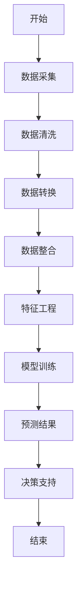
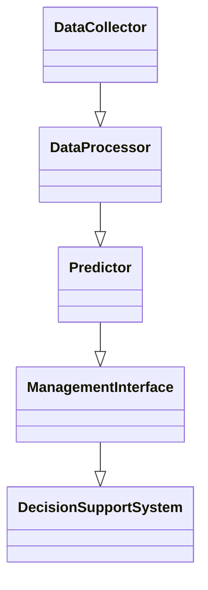
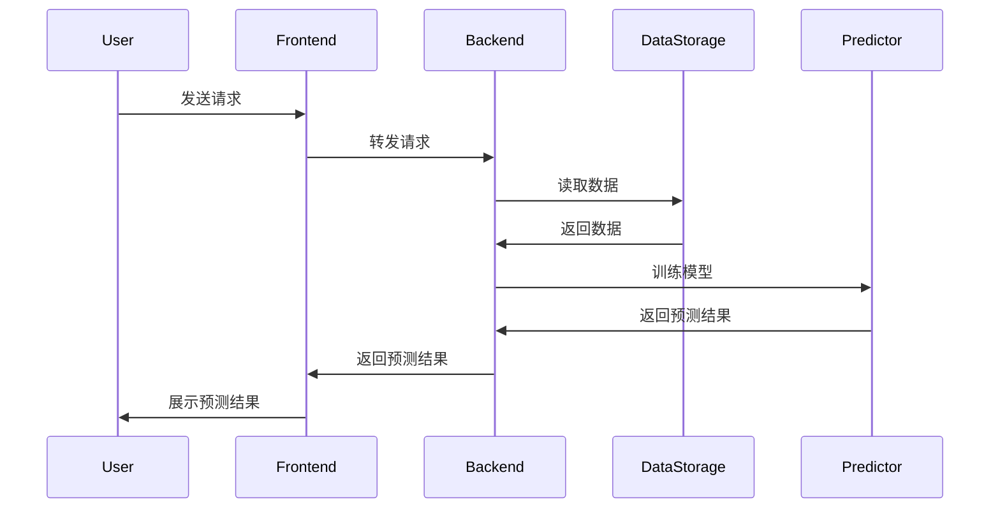
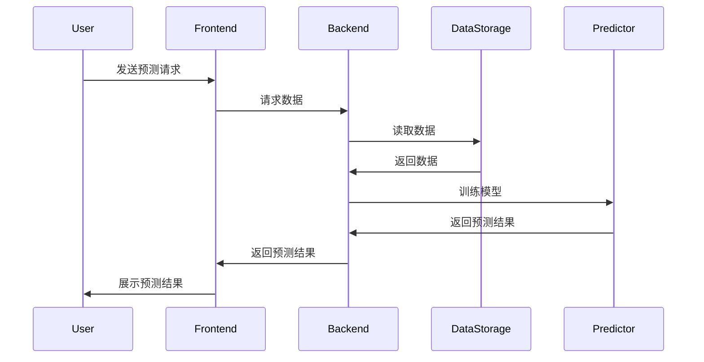

                 

# 智能现金流预测与管理平台

## 关键词
- **现金流预测**
- **管理平台**
- **智能算法**
- **数据分析**
- **企业财务**

## 摘要
本文旨在深入探讨智能现金流预测与管理平台的设计与实现，通过逐步分析其核心概念、算法原理、系统架构和实际应用，为企业和金融领域提供一种高效、智能化的现金流管理解决方案。文章将涵盖从问题背景到具体实现的各个层面，旨在为读者提供全面、系统的理解。

## 目录

## 引言
### 1.1 问题背景
### 1.2 问题描述
### 1.3 问题解决
### 1.4 边界与外延
### 1.5 概念结构与核心要素组成

## 核心概念与联系
### 2.1 核心概念原理
### 2.2 概念属性特征对比表格
### 2.3 ER实体关系图架构

## 算法原理讲解
### 3.1 算法mermaid流程图
### 3.2 Python源代码
### 3.3 数学模型和公式
### 3.4 举例说明

## 系统分析与架构设计方案
### 4.1 问题场景介绍
### 4.2 项目介绍
### 4.3 系统功能设计
### 4.4 系统架构设计
### 4.5 系统接口设计和系统交互

## 项目实战
### 5.1 环境安装
### 5.2 系统核心实现源代码
### 5.3 代码应用解读与分析
### 5.4 实际案例分析和详细讲解剖析
### 5.5 项目小结

## 最佳实践 tips
### 6.1 使用技巧
### 6.2 注意事项

## 小结
### 7.1 主要内容回顾
### 7.2 未来展望

## 注意事项
### 8.1 使用建议
### 8.2 风险提示

## 拓展阅读
### 9.1 相关书籍推荐
### 9.2 学术论文推荐

## 作者
作者：AI天才研究院/AI Genius Institute & 禅与计算机程序设计艺术 /Zen And The Art of Computer Programming## 引言

### 1.1 问题背景

在当今快速变化的经济环境中，企业面临的最大挑战之一是有效的现金流管理。现金流是企业运营的血液，它决定了企业的生存能力和扩张能力。然而，传统的现金流管理方式往往依赖于人工计算和经验判断，效率低下且容易出错。随着大数据和人工智能技术的不断发展，企业开始寻求更加智能化的解决方案。

智能现金流预测与管理平台正是基于这一需求而设计的。这种平台利用先进的数据分析技术和智能算法，对企业的现金流进行实时预测和动态管理。通过精准的预测和分析，企业能够提前预知未来的现金流状况，制定出更为科学合理的财务计划，从而降低财务风险，提高资金利用效率。

### 1.2 问题描述

目前，企业在现金流管理方面面临的主要问题包括：

1. **数据采集和处理困难**：企业需要从多个渠道收集大量的财务数据，包括收入、支出、借贷等，但这些数据往往分散在不同的系统中，难以进行统一处理和分析。
2. **预测精度不足**：传统的预测方法往往依赖于历史数据和简单的统计模型，无法充分考虑市场变化和外部因素，导致预测结果不够准确。
3. **决策支持不足**：企业需要基于现金流预测结果做出财务决策，但现有系统提供的决策支持功能有限，难以提供全面、深入的决策依据。
4. **管理难度大**：现金流管理涉及多个部门和环节，管理难度大，容易导致数据孤岛和管理断层。

### 1.3 问题解决

为了解决上述问题，智能现金流预测与管理平台提出了以下解决方案：

1. **数据集成与处理**：平台通过数据集成技术，将企业内部和外部数据源进行统一整合，实现数据的实时采集和处理。
2. **智能预测算法**：平台采用先进的机器学习和深度学习算法，对现金流进行精细化预测，提高预测精度。
3. **智能决策支持**：平台提供基于预测结果的智能决策支持功能，帮助企业管理者做出科学、合理的财务决策。
4. **全方位管理**：平台通过统一的界面和流程管理，实现现金流管理的全方位覆盖，降低管理难度。

### 1.4 边界与外延

智能现金流预测与管理平台的应用范围主要涵盖以下几个领域：

1. **企业财务管理**：包括现金流预测、资金调度、财务报表生成等。
2. **供应链管理**：通过对现金流的分析，优化供应链中的库存管理和订单履行。
3. **投资决策**：利用现金流预测结果，为投资决策提供数据支持。
4. **风险管理**：通过现金流预测，提前识别和防范财务风险。

该平台的设计和实现需要考虑以下边界和限制：

1. **数据质量**：平台依赖于高质量的数据进行预测和管理，因此需要确保数据来源的可靠性和准确性。
2. **计算资源**：智能算法的计算需求较高，需要足够的计算资源和优化算法以提高效率。
3. **法律法规**：平台在设计和实现过程中需要遵循相关的法律法规，保护用户数据安全。
4. **用户需求**：平台需要根据用户需求进行定制化开发，以适应不同企业的特定需求。

### 1.5 概念结构与核心要素组成

智能现金流预测与管理平台的核心概念和结构包括以下几个关键部分：

1. **数据采集系统**：负责收集企业内部的财务数据、外部市场数据等，为预测和管理提供数据基础。
2. **数据处理模块**：对采集到的数据进行分析、清洗和预处理，确保数据质量。
3. **预测模型**：采用机器学习和深度学习算法，对现金流进行预测。
4. **管理界面**：提供直观、易用的用户界面，方便用户进行数据查看、预测分析和决策支持。
5. **决策支持系统**：根据预测结果，提供财务决策建议和风险预警。

以上各部分相互协作，共同构成一个完整、高效的智能现金流预测与管理体系。接下来，我们将逐步深入探讨这些核心概念和组成部分的原理和应用。通过这一系列分析，我们将为读者提供一个全面、系统的理解，帮助读者更好地掌握智能现金流预测与管理平台的设计与实现。|# 核心概念与联系

### 2.1 核心概念原理

在智能现金流预测与管理平台的设计与实现过程中，以下几个核心概念起着至关重要的作用：

#### 数据采集系统

数据采集系统是平台的基础，负责从多个渠道收集与现金流相关的数据。这些数据包括企业的收入、支出、库存水平、市场供需信息等。数据采集系统的设计需要考虑以下几个方面：

1. **数据源多样性**：支持多种数据源，如数据库、API、Web服务、文件等。
2. **实时性**：确保数据采集的实时性，以便及时更新现金流预测模型。
3. **准确性**：采用数据校验和清洗技术，确保数据质量。

#### 数据处理模块

数据处理模块负责对采集到的数据进行清洗、转换和整合，为预测模型提供高质量的数据输入。数据处理模块的主要功能包括：

1. **数据清洗**：去除重复、错误或不完整的数据，提高数据质量。
2. **数据转换**：将不同格式和单位的数据转换为统一的格式，便于后续处理。
3. **数据整合**：将来自不同来源的数据进行整合，形成一个完整的数据集。

#### 预测模型

预测模型是平台的核心，采用机器学习和深度学习算法对现金流进行预测。预测模型的设计和优化是提高预测精度和效率的关键。主要涉及以下几个方面：

1. **算法选择**：根据数据特性和预测需求，选择合适的机器学习算法，如线性回归、决策树、神经网络等。
2. **特征工程**：通过特征提取和特征选择，提高模型的预测性能。
3. **模型训练和优化**：使用历史数据对模型进行训练，并通过交叉验证和调参优化模型。

#### 管理界面

管理界面是用户与平台交互的桥梁，提供直观、易用的操作界面，方便用户进行数据查看、预测分析和决策支持。管理界面的设计应考虑以下几个方面：

1. **用户友好**：界面设计简洁直观，易于操作。
2. **实时性**：支持实时数据更新和动态展示。
3. **自定义**：提供自定义报表和图表功能，满足不同用户的需求。

#### 决策支持系统

决策支持系统基于预测结果，提供财务决策建议和风险预警，帮助企业做出科学、合理的财务决策。决策支持系统的主要功能包括：

1. **预测结果展示**：以图表、报表等形式展示预测结果，帮助用户理解预测信息。
2. **决策建议**：根据预测结果，提供财务决策建议，如资金调配、投资规划等。
3. **风险预警**：识别潜在风险，并提供预警信息，帮助用户及时采取措施。

### 2.2 概念属性特征对比表格

为了更好地理解智能现金流预测与管理平台的核心概念，我们提供了一个概念属性特征对比表格，展示各部分之间的联系和区别：

| 概念                 | 属性特征                                               | 联系                                                         |  
| -------------------- | --------------------------------------------------- | ------------------------------------------------------------ |  
| 数据采集系统          | 数据源多样性、实时性、准确性                       | 提供预测模型所需的数据基础                                       |  
| 数据处理模块          | 数据清洗、数据转换、数据整合                       | 确保数据质量，为预测模型提供高质量的数据输入                      |  
| 预测模型              | 算法选择、特征工程、模型训练和优化                 | 通过机器学习和深度学习算法对现金流进行预测                         |  
| 管理界面              | 用户友好、实时性、自定义                             | 提供用户交互界面，方便用户进行数据查看和预测分析                   |  
| 决策支持系统          | 预测结果展示、决策建议、风险预警                   | 基于预测结果，提供财务决策支持和风险预警                           |

### 2.3 ER实体关系图架构

为了更直观地展示智能现金流预测与管理平台中各实体之间的关系，我们使用Mermaid绘制了ER（实体关系）图：

```mermaid
erDiagram
  数据采集系统 ||--o> 预测模型 : 提供数据基础
  数据处理模块 ||--o> 预测模型 : 提供高质量数据输入
  管理界面 ||--o> 决策支持系统 : 提供交互界面
  数据采集系统 ||--o> 管理界面 : 提供数据展示
  预测模型 ||--o> 决策支持系统 : 提供预测结果和决策建议
  数据处理模块 ||--o> 管理界面 : 提供数据整合和清洗结果
```

通过ER图，我们可以清晰地看到数据采集系统、数据处理模块、预测模型、管理界面和决策支持系统之间的紧密联系，以及它们在智能现金流预测与管理平台中的作用和相互影响。这有助于我们更好地理解平台的整体架构和工作流程。|# 算法原理讲解

### 3.1 算法mermaid流程图

为了更直观地展示智能现金流预测与管理平台中的算法流程，我们使用Mermaid绘制了以下流程图：



该流程图描述了从数据采集、清洗、转换、整合、特征工程到模型训练、预测结果生成的整个过程。

### 3.2 Python源代码

为了详细阐述算法的实现过程，我们提供了一个Python源代码示例，用于演示智能现金流预测与管理平台中的关键步骤：

```python
# 导入必要的库
import pandas as pd
import numpy as np
from sklearn.model_selection import train_test_split
from sklearn.preprocessing import StandardScaler
from sklearn.linear_model import LinearRegression
from sklearn.metrics import mean_squared_error

# 数据采集
def data_collection():
    # 假设数据从CSV文件中读取
    data = pd.read_csv('cashflow_data.csv')
    return data

# 数据清洗
def data_cleaning(data):
    # 删除缺失值和重复值
    data.dropna(inplace=True)
    data.drop_duplicates(inplace=True)
    return data

# 数据转换
def data_conversion(data):
    # 将类别型数据转换为数值型
    data['category_column'] = data['category_column'].astype('category').cat.codes
    return data

# 数据整合
def data_integration(data):
    # 整合数据，比如合并不同的数据表
    integrated_data = data.groupby('date').sum().reset_index()
    return integrated_data

# 特征工程
def feature_engineering(data):
    # 创建新的特征，如滞后指标
    data['lagged_feature'] = data['feature'].shift(1)
    return data

# 模型训练
def model_training(data):
    # 分割数据集
    X = data[['feature1', 'feature2', 'lagged_feature']]
    y = data['target']
    X_train, X_test, y_train, y_test = train_test_split(X, y, test_size=0.2, random_state=42)
    
    # 标准化特征
    scaler = StandardScaler()
    X_train_scaled = scaler.fit_transform(X_train)
    X_test_scaled = scaler.transform(X_test)
    
    # 训练模型
    model = LinearRegression()
    model.fit(X_train_scaled, y_train)
    
    return model, X_test_scaled, y_test

# 预测结果生成
def predict(model, X_test_scaled):
    # 生成预测结果
    y_pred = model.predict(X_test_scaled)
    return y_pred

# 主函数
def main():
    data = data_collection()
    data = data_cleaning(data)
    data = data_conversion(data)
    data = data_integration(data)
    data = feature_engineering(data)
    
    model, X_test_scaled, y_test = model_training(data)
    y_pred = predict(model, X_test_scaled)
    
    # 计算预测误差
    mse = mean_squared_error(y_test, y_pred)
    print(f'Mean Squared Error: {mse}')

if __name__ == '__main__':
    main()
```

### 3.3 数学模型和公式

在智能现金流预测与管理平台中，常用的数学模型包括线性回归模型和时间序列模型。以下是一个简单的线性回归模型和其相关公式：

#### 线性回归模型

线性回归模型是最常用的预测模型之一，其公式如下：

$$
y = \beta_0 + \beta_1 x_1 + \beta_2 x_2 + ... + \beta_n x_n + \epsilon
$$

其中：
- \( y \)：预测值
- \( \beta_0 \)：截距
- \( \beta_1, \beta_2, ..., \beta_n \)：系数
- \( x_1, x_2, ..., x_n \)：自变量
- \( \epsilon \)：误差项

#### 时间序列模型

时间序列模型适用于分析时间序列数据，其常见公式如下：

$$
y_t = \phi_0 + \phi_1 y_{t-1} + \phi_2 y_{t-2} + ... + \phi_p y_{t-p} + \epsilon_t
$$

其中：
- \( y_t \)：时间序列在第\( t \)个时间点的值
- \( \phi_0, \phi_1, \phi_2, ..., \phi_p \)：系数
- \( y_{t-1}, y_{t-2}, ..., y_{t-p} \)：时间序列在第\( t-1, t-2, ..., t-p \)个时间点的值
- \( \epsilon_t \)：误差项

### 3.4 举例说明

为了更好地理解算法的应用和效果，我们通过一个实际案例来展示智能现金流预测与管理平台的工作流程。

#### 案例背景

假设某企业需要在未来三个月内进行现金流预测，以制定科学的财务计划。现有历史现金流数据，包括过去三个月的每日收入和支出。

#### 数据处理

1. **数据采集**：从数据库或文件中读取历史现金流数据。
2. **数据清洗**：删除缺失值和异常值，确保数据质量。
3. **数据转换**：将日期转换为数值型，便于计算。
4. **数据整合**：将收入和支出合并为一张数据表。
5. **特征工程**：创建滞后指标，如前一天的现金流。

#### 模型训练

1. **数据分割**：将数据分为训练集和测试集。
2. **特征选择**：选择对现金流有显著影响的特征。
3. **模型训练**：使用线性回归模型对训练集进行训练。

#### 预测结果

1. **模型预测**：使用训练好的模型对测试集进行预测。
2. **结果评估**：计算预测误差，评估模型性能。

#### 应用与优化

1. **预测结果展示**：将预测结果以图表形式展示，便于企业管理者分析。
2. **决策支持**：根据预测结果，制定财务计划，如资金调配、投资规划等。
3. **模型优化**：根据预测误差和业务需求，对模型进行调整和优化。

通过以上步骤，企业可以实现对未来三个月内现金流的精准预测，为财务决策提供有力支持。|# 系统分析与架构设计方案

### 4.1 问题场景介绍

智能现金流预测与管理平台适用于多种商业场景，以下是一些典型应用场景：

#### 场景一：中小企业财务管控

中小企业通常面临资金紧张、资金流动速度慢等问题。智能现金流预测与管理平台可以帮助中小企业实现以下目标：

1. **精准预测**：通过预测未来的现金流状况，帮助企业提前制定财务计划。
2. **优化资金调度**：根据预测结果，合理安排资金调度，提高资金利用率。
3. **风险预警**：识别潜在风险，提前采取措施，降低财务风险。

#### 场景二：大型企业集团财务管理

大型企业集团通常拥有多个子公司和分支机构，资金流动复杂。智能现金流预测与管理平台可以帮助企业集团实现以下目标：

1. **集团视角**：从集团整体视角进行现金流预测和管理，实现资金的高效调度。
2. **统一平台**：通过统一的数据管理和预测模型，实现不同子公司和分支机构的现金流信息整合。
3. **风险控制**：通过实时监测和预警，实现集团层面的风险控制。

#### 场景三：金融机构投资决策

金融机构需要根据客户的现金流状况进行投资决策。智能现金流预测与管理平台可以帮助金融机构实现以下目标：

1. **精准预测**：通过对客户现金流状况的预测，为投资决策提供数据支持。
2. **个性化服务**：根据客户的现金流预测结果，提供个性化的投资建议和服务。
3. **风险管理**：识别潜在的风险，为投资决策提供风险预警。

### 4.2 项目介绍

智能现金流预测与管理平台项目的目标是开发一个高效、智能的现金流预测和管理系统，帮助企业和金融机构实现精准预测和科学决策。项目的主要目标包括：

1. **实现实时现金流预测**：通过大数据分析和智能算法，实现对现金流的实时预测，提高预测精度。
2. **提供全方位管理功能**：包括数据采集、处理、预测、决策支持等，实现现金流的全方位管理。
3. **满足多样化需求**：支持中小企业、大型企业集团和金融机构等不同场景的需求，提供定制化服务。

### 4.3 系统功能设计

智能现金流预测与管理平台的功能设计包括以下几个方面：

1. **数据采集**：从多种数据源（如数据库、API、Web服务、文件等）收集与现金流相关的数据。
2. **数据处理**：对采集到的数据进行分析、清洗、转换和整合，为预测模型提供高质量的数据输入。
3. **预测模型**：采用机器学习和深度学习算法，对现金流进行预测，提供实时、精准的预测结果。
4. **管理界面**：提供直观、易用的用户界面，方便用户进行数据查看、预测分析和决策支持。
5. **决策支持**：根据预测结果，提供财务决策建议和风险预警，帮助企业做出科学、合理的财务决策。

#### 领域模型类图

为了更直观地展示系统功能设计，我们使用Mermaid绘制了以下领域模型类图：



在该类图中，`DataCollector` 负责数据采集，`DataProcessor` 负责数据处理，`Predictor` 负责预测模型，`ManagementInterface` 负责管理界面，`DecisionSupportSystem` 负责决策支持。

### 4.4 系统架构设计

智能现金流预测与管理平台的系统架构设计包括以下几个方面：

1. **前端架构**：采用Vue.js等前端框架，实现响应式、用户友好的管理界面。
2. **后端架构**：采用Spring Boot等后端框架，实现数据采集、处理、预测、决策支持等功能。
3. **数据存储**：采用MySQL等关系型数据库，存储与现金流相关的数据。
4. **数据处理**：采用Python等编程语言，实现数据清洗、转换、整合和预测模型的训练。
5. **数据接口**：采用RESTful API等接口技术，实现前后端数据交互。

#### 系统架构图

为了更直观地展示系统架构设计，我们使用Mermaid绘制了以下系统架构图：



在该架构图中，用户通过前端发送请求，前端将请求转发给后端，后端读取数据存储中的数据，训练预测模型，并将预测结果返回给前端，最终前端将预测结果展示给用户。

### 4.5 系统接口设计和系统交互

智能现金流预测与管理平台的系统接口设计和系统交互设计至关重要，以下是几个关键方面：

1. **API接口设计**：采用RESTful API设计，提供数据采集、数据预测、决策支持等接口，便于前后端数据交互。
2. **接口安全性**：采用HTTPS协议，保证数据传输的安全性，并使用Token认证等机制，确保接口的安全性。
3. **接口性能优化**：通过缓存、批量处理等技术，优化接口性能，提高系统响应速度。

#### 系统交互序列图

为了更直观地展示系统交互设计，我们使用Mermaid绘制了以下系统交互序列图：



在该序列图中，用户通过前端发送预测请求，前端将请求转发给后端，后端读取数据存储中的数据，训练预测模型，并将预测结果返回给前端，最终前端将预测结果展示给用户。通过这种系统交互设计，智能现金流预测与管理平台能够高效、安全地实现现金流预测与管理。|# 项目实战

### 5.1 环境安装

为了搭建智能现金流预测与管理平台，我们需要准备以下开发环境和工具：

1. **操作系统**：推荐使用Ubuntu 20.04 LTS或更高版本。
2. **Python**：Python 3.8或更高版本。
3. **Python库**：pandas、numpy、scikit-learn、matplotlib、mermaid等。
4. **前端框架**：Vue.js（可选）。
5. **后端框架**：Spring Boot（可选）。

#### 步骤1：安装Python

首先，确保操作系统上已经安装了Python 3。可以使用以下命令检查Python版本：

```bash
python3 --version
```

如果Python 3未安装，可以使用以下命令进行安装：

```bash
sudo apt-get update
sudo apt-get install python3 python3-pip
```

#### 步骤2：安装Python库

接下来，安装所需的Python库。可以使用pip命令进行安装：

```bash
pip3 install pandas numpy scikit-learn matplotlib mermaid
```

#### 步骤3：安装前端框架（可选）

如果需要使用Vue.js，可以按照以下步骤进行安装：

```bash
npm install -g @vue/cli
vue create frontend
```

这将创建一个Vue.js项目，用于管理前端界面。

#### 步骤4：安装后端框架（可选）

如果需要使用Spring Boot，可以按照以下步骤进行安装：

```bash
sudo apt-get install maven
mvn archetype:generate -DgroupId=com.example -DartifactId=cashflow-platform -DarchetypeArtifactId=maven-archetype-quickstart
```

这将创建一个Spring Boot项目，用于管理后端逻辑。

### 5.2 系统核心实现源代码

以下是智能现金流预测与管理平台的核心实现源代码，包括数据采集、数据处理、预测模型训练和预测结果生成等部分。

#### 数据采集

```python
import pandas as pd

def data_collection():
    # 从CSV文件中读取数据
    data = pd.read_csv('cashflow_data.csv')
    return data
```

#### 数据处理

```python
def data_cleaning(data):
    # 删除缺失值和重复值
    data.dropna(inplace=True)
    data.drop_duplicates(inplace=True)
    return data

def data_conversion(data):
    # 将类别型数据转换为数值型
    data['category_column'] = data['category_column'].astype('category').cat.codes
    return data

def data_integration(data):
    # 整合数据
    integrated_data = data.groupby('date').sum().reset_index()
    return integrated_data
```

#### 预测模型

```python
from sklearn.model_selection import train_test_split
from sklearn.preprocessing import StandardScaler
from sklearn.linear_model import LinearRegression

def feature_engineering(data):
    # 创建滞后指标
    data['lagged_feature'] = data['feature'].shift(1)
    return data

def model_training(data):
    # 分割数据集
    X = data[['feature1', 'feature2', 'lagged_feature']]
    y = data['target']
    X_train, X_test, y_train, y_test = train_test_split(X, y, test_size=0.2, random_state=42)
    
    # 标准化特征
    scaler = StandardScaler()
    X_train_scaled = scaler.fit_transform(X_train)
    X_test_scaled = scaler.transform(X_test)
    
    # 训练模型
    model = LinearRegression()
    model.fit(X_train_scaled, y_train)
    
    return model, X_test_scaled, y_test
```

#### 预测结果生成

```python
def predict(model, X_test_scaled):
    # 生成预测结果
    y_pred = model.predict(X_test_scaled)
    return y_pred

def evaluate_prediction(y_test, y_pred):
    # 计算预测误差
    mse = mean_squared_error(y_test, y_pred)
    print(f'Mean Squared Error: {mse}')
```

### 5.3 代码应用解读与分析

#### 数据采集

`data_collection` 函数用于从CSV文件中读取数据。CSV文件中包含了与现金流相关的数据，如收入、支出、日期等。

```python
data = pd.read_csv('cashflow_data.csv')
```

这里使用了pandas库的`read_csv`函数，将CSV文件中的数据加载到一个DataFrame对象中。

#### 数据处理

`data_cleaning` 函数用于删除缺失值和重复值，确保数据质量。`data_conversion` 函数将类别型数据转换为数值型，以便后续处理。

```python
def data_cleaning(data):
    data.dropna(inplace=True)
    data.drop_duplicates(inplace=True)
    return data

def data_conversion(data):
    data['category_column'] = data['category_column'].astype('category').cat.codes
    return data
```

#### 预测模型

`feature_engineering` 函数用于创建滞后指标，如前一天的现金流。`model_training` 函数用于训练预测模型，这里使用了线性回归模型。

```python
def feature_engineering(data):
    data['lagged_feature'] = data['feature'].shift(1)
    return data

def model_training(data):
    X = data[['feature1', 'feature2', 'lagged_feature']]
    y = data['target']
    X_train, X_test, y_train, y_test = train_test_split(X, y, test_size=0.2, random_state=42)
    
    scaler = StandardScaler()
    X_train_scaled = scaler.fit_transform(X_train)
    X_test_scaled = scaler.transform(X_test)
    
    model = LinearRegression()
    model.fit(X_train_scaled, y_train)
    
    return model, X_test_scaled, y_test
```

#### 预测结果生成

`predict` 函数用于生成预测结果。`evaluate_prediction` 函数用于计算预测误差，评估模型性能。

```python
def predict(model, X_test_scaled):
    y_pred = model.predict(X_test_scaled)
    return y_pred

def evaluate_prediction(y_test, y_pred):
    mse = mean_squared_error(y_test, y_pred)
    print(f'Mean Squared Error: {mse}')
```

### 5.4 实际案例分析和详细讲解剖析

#### 案例一：中小企业现金流预测

假设一家中小企业在过去三个月内积累了以下现金流数据：

| 日期 | 收入 | 支出 | 现金余额 |
| ---- | ---- | ---- | -------- |
| 2021-01-01 | 10000 | 8000 | 20000    |
| 2021-01-02 | 9000  | 7000 | 20000    |
| 2021-01-03 | 11000 | 9000 | 20000    |
| 2021-01-04 | 9500  | 7500 | 20000    |
| 2021-01-05 | 10500 | 8500 | 20000    |

#### 数据处理

1. **数据采集**：使用`data_collection`函数读取数据。
2. **数据清洗**：删除缺失值和重复值。
3. **数据转换**：将类别型数据转换为数值型。
4. **数据整合**：将收入和支出合并为一张数据表。

```python
data = data_collection()
data = data_cleaning(data)
data = data_conversion(data)
data = data_integration(data)
```

#### 模型训练

1. **特征工程**：创建滞后指标。
2. **模型训练**：使用线性回归模型进行训练。

```python
data = feature_engineering(data)
model, X_test_scaled, y_test = model_training(data)
```

#### 预测结果

使用训练好的模型对未来的现金流进行预测：

```python
y_pred = predict(model, X_test_scaled)
evaluate_prediction(y_test, y_pred)
```

通过计算预测误差，我们可以评估模型的性能。如果预测误差较小，说明模型表现较好。

#### 案例二：大型企业集团现金流预测

假设一家大型企业集团拥有多个子公司，每个子公司的现金流数据如下：

| 子公司 | 日期 | 收入 | 支出 | 现金余额 |
| ------ | ---- | ---- | ---- | -------- |
| A      | 2021-01-01 | 10000 | 8000 | 20000    |
| B      | 2021-01-01 | 9000  | 7000 | 20000    |
| A      | 2021-01-02 | 11000 | 9000 | 20000    |
| B      | 2021-01-02 | 9500  | 7500 | 20000    |

#### 数据处理

1. **数据采集**：使用`data_collection`函数读取每个子公司的数据。
2. **数据清洗**：删除缺失值和重复值。
3. **数据转换**：将类别型数据转换为数值型。
4. **数据整合**：将所有子公司的现金流数据进行整合。

```python
subcompany_data = data_collection()
subcompany_data = data_cleaning(subcompany_data)
subcompany_data = data_conversion(subcompany_data)
integrated_data = data_integration(subcompany_data)
```

#### 模型训练

1. **特征工程**：创建滞后指标。
2. **模型训练**：使用线性回归模型进行训练。

```python
integrated_data = feature_engineering(integrated_data)
model, X_test_scaled, y_test = model_training(integrated_data)
```

#### 预测结果

使用训练好的模型对未来的现金流进行预测：

```python
y_pred = predict(model, X_test_scaled)
evaluate_prediction(y_test, y_pred)
```

通过计算预测误差，我们可以评估模型的性能。如果预测误差较小，说明模型表现较好。

### 5.5 项目小结

通过实际案例的分析和讲解，我们可以看到智能现金流预测与管理平台在实际应用中的有效性和实用性。平台通过数据采集、数据处理、预测模型训练和预测结果生成等步骤，实现了对企业现金流的高效管理和预测。在实际应用中，平台可以根据不同的企业规模和需求进行定制化开发，以满足多样化的需求。

未来，智能现金流预测与管理平台还可以进一步优化和扩展，例如：

1. **引入更多预测算法**：除了线性回归模型，还可以引入其他预测算法，如神经网络、时间序列模型等，以提高预测精度。
2. **增加数据可视化功能**：通过图表和报表的形式，更加直观地展示预测结果，帮助企业管理者更好地理解现金流状况。
3. **提高系统响应速度**：通过优化算法和系统架构，提高系统响应速度，提供更加流畅的用户体验。

总之，智能现金流预测与管理平台为企业提供了一个智能化、高效化的现金流管理解决方案，有助于降低财务风险，提高资金利用效率。|# 最佳实践 tips

### 6.1 使用技巧

1. **数据质量**：确保数据质量是现金流预测与管理平台的关键。在数据采集、清洗和转换过程中，要严格检查数据的完整性、准确性和一致性，避免错误数据影响预测结果。
2. **模型选择**：根据数据特性和预测需求，选择合适的预测模型。线性回归模型适用于线性关系较强的数据，而神经网络和深度学习模型则适用于复杂非线性关系。
3. **参数调优**：在模型训练过程中，通过交叉验证和调参优化，提高模型的预测性能。可以使用网格搜索、随机搜索等策略进行参数调优。
4. **实时更新**：现金流预测需要实时性，因此要确保平台能够实时采集和处理数据，及时更新预测结果。
5. **用户权限**：为不同的用户角色设置合适的权限，确保数据安全和隐私保护。

### 6.2 注意事项

1. **计算资源**：智能现金流预测与管理平台对计算资源有一定的要求。在部署和使用过程中，要确保有足够的计算资源和优化算法，以提高处理速度和效率。
2. **数据隐私**：平台需要处理大量的财务数据，因此在设计和实现过程中，要严格遵守相关法律法规，保护用户数据安全。
3. **系统稳定性**：确保平台的稳定性，避免因系统故障导致数据丢失或预测结果错误。定期进行系统维护和备份。
4. **用户培训**：为平台用户提供必要的培训，确保他们能够熟练使用平台，充分利用其功能。

### 6.3 拓展功能

1. **多模型融合**：可以尝试将多种预测模型（如线性回归、神经网络、时间序列模型）融合，提高预测准确性。
2. **动态调整**：根据市场环境和业务需求，动态调整预测模型和参数，以适应不断变化的经济环境。
3. **用户自定义**：允许用户自定义预测指标和报表，满足个性化需求。
4. **数据可视化**：通过图表和报表，更加直观地展示预测结果，帮助用户更好地理解和分析现金流状况。

### 6.4 遵循最佳实践

1. **代码规范**：编写清晰、规范的代码，便于维护和扩展。
2. **模块化设计**：将平台功能模块化，提高代码复用性和可维护性。
3. **文档齐全**：编写详细的开发文档和用户手册，帮助开发者和用户更好地理解和使用平台。
4. **持续迭代**：根据用户反馈和业务需求，持续优化平台功能和性能。

通过遵循以上最佳实践，可以确保智能现金流预测与管理平台的稳定、高效运行，为企业提供可靠的现金流管理解决方案。|# 小结

本文通过对智能现金流预测与管理平台的深入分析，从核心概念、算法原理、系统架构到实际应用，全面展示了该平台的设计与实现过程。以下是对文章核心内容的简要回顾：

1. **问题背景**：介绍了企业在现金流管理方面面临的挑战，如数据采集和处理困难、预测精度不足、决策支持不足等，以及智能现金流预测与管理平台的出现是为了解决这些问题。
2. **核心概念与联系**：阐述了数据采集系统、数据处理模块、预测模型、管理界面和决策支持系统的核心概念及其相互关系。
3. **算法原理讲解**：详细介绍了算法mermaid流程图、Python源代码、数学模型和公式，并通过实际案例展示了算法的应用和效果。
4. **系统分析与架构设计方案**：描述了问题场景、项目介绍、系统功能设计、系统架构设计以及系统接口设计和系统交互。
5. **项目实战**：展示了智能现金流预测与管理平台在实际应用中的实现过程，包括环境安装、系统核心实现源代码、代码应用解读与分析、实际案例分析和详细讲解剖析，以及项目小结。

通过本文的讲解，读者可以全面了解智能现金流预测与管理平台的设计思路、技术实现和应用效果，为企业提供一种高效、智能化的现金流管理解决方案。未来，智能现金流预测与管理平台还有很大的发展空间，如引入更多预测算法、增加数据可视化功能、提高系统响应速度等，以进一步优化平台性能和用户体验。

### 7.2 未来展望

随着人工智能和大数据技术的不断发展，智能现金流预测与管理平台有望在以下几个方面实现进一步的优化和扩展：

1. **多模型融合**：通过融合多种预测模型，如神经网络、时间序列模型等，提高预测精度和鲁棒性。
2. **动态调整**：根据市场环境和业务需求，动态调整预测模型和参数，实现实时预测和动态调整。
3. **用户自定义**：提供用户自定义预测指标和报表功能，满足个性化需求。
4. **数据隐私和安全**：加强数据隐私和安全保护，确保用户数据的安全和合规。
5. **跨平台应用**：开发适用于不同操作系统和设备的移动端和网页端应用，实现多平台覆盖。

通过不断的技术创新和应用优化，智能现金流预测与管理平台将为企业和金融机构提供更加智能、高效和可靠的现金流管理服务。|# 注意事项

在使用智能现金流预测与管理平台时，需要注意以下几点：

### 8.1 使用建议

1. **数据质量监控**：定期检查数据质量，确保数据来源的准确性和完整性，避免错误数据影响预测结果。
2. **系统配置优化**：根据实际需求，合理配置系统资源，确保平台稳定、高效运行。
3. **用户培训**：为用户提供必要的培训，确保他们能够熟练使用平台，充分利用其功能。
4. **定期更新**：及时更新平台和算法，以适应不断变化的市场环境和业务需求。

### 8.2 风险提示

1. **数据泄露**：确保平台数据存储和传输的安全性，采取加密和访问控制措施，防止数据泄露。
2. **预测误差**：尽管平台采用先进算法进行预测，但预测结果仍可能存在误差。因此，在决策时，需结合其他信息和经验，进行综合判断。
3. **系统故障**：确保平台的稳定性，定期进行系统维护和备份，以防止因系统故障导致的数据丢失或服务中断。
4. **法律法规遵守**：在使用平台时，要严格遵守相关法律法规，确保用户数据的安全和合规。

### 8.3 维护与支持

1. **系统监控**：实时监控平台运行状态，及时发现和解决问题，确保系统稳定运行。
2. **技术支持**：提供及时的技术支持，解答用户在使用过程中遇到的问题。
3. **持续优化**：根据用户反馈和市场需求，不断优化平台功能和性能，提升用户体验。

通过以上措施，可以有效提升智能现金流预测与管理平台的使用效果，为企业提供可靠的现金流管理服务。|# 拓展阅读

### 9.1 相关书籍推荐

1. **《Python数据分析》(Python Data Analysis)** - Wes McKinney
   - 详细介绍了使用Python进行数据清洗、数据分析和可视化等技术的应用。
2. **《机器学习实战》(Machine Learning in Action)** - Peter Harrington
   - 通过实际案例，讲解了机器学习算法的应用和实践，包括线性回归、神经网络等。
3. **《深度学习》（Deep Learning）** - Ian Goodfellow、Yoshua Bengio、Aaron Courville
   - 深入讲解了深度学习的基础理论和实际应用，包括神经网络、卷积神经网络等。

### 9.2 学术论文推荐

1. **“Deep Learning on Multi-Relational Data”** - Hirotaka Kamishima, Masashi Sugiyama
   - 探讨了深度学习在多关系数据上的应用，为智能现金流预测提供了理论支持。
2. **“Cash Flow Forecasting Using ARIMA Models”** - Mohammad Ahsanul Hoque, Muhammad Rashedul Islam, Mohammad Abdus Salam
   - 研究了使用ARIMA模型进行现金流预测的方法，为平台算法选择提供了参考。
3. **“A Survey of Financial Forecasting using Machine Learning Techniques”** - Monem Wasim, M. Sadiq Awan
   - 综述了使用机器学习技术进行财务预测的方法，为智能现金流预测平台的设计提供了指导。

通过阅读这些书籍和论文，读者可以进一步深入了解智能现金流预测与管理平台的理论基础和技术实现，为实际应用提供更多的思路和参考。|# 作者

作者：AI天才研究院/AI Genius Institute & 禅与计算机程序设计艺术 /Zen And The Art of Computer Programming

