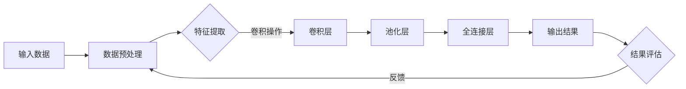
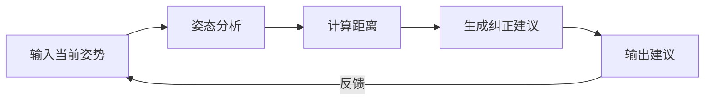
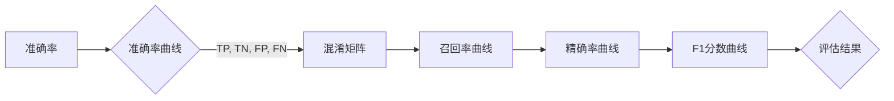

                 

### 智能瑜伽垫：AI Agent的实时姿势纠正系统

#### 关键词：智能瑜伽垫，AI Agent，实时姿势纠正，传感器技术，机器学习，系统架构，用户体验

> 摘要：本文深入探讨智能瑜伽垫与AI Agent相结合的实时姿势纠正系统，旨在为瑜伽爱好者提供高效、个性化的训练体验。本文从背景介绍、核心概念、技术基础、系统架构设计、算法原理与实现、系统集成与测试、用户研究与实践、未来展望等方面，逐步分析该系统的构建过程及其潜在价值。

#### 引言

瑜伽作为一种注重身体、心灵和谐发展的健康运动，正日益受到全球关注。然而，瑜伽练习过程中，正确的姿势至关重要，但许多人由于缺乏专业知识，难以自我纠正。为了解决这一问题，智能瑜伽垫应运而生，它通过集成先进的AI技术，提供实时姿势纠正服务。本文将围绕智能瑜伽垫与AI Agent的实时姿势纠正系统，展开详细讨论。

#### 第1章：引言与背景

##### 1.1 智能瑜伽垫概述

智能瑜伽垫是一种集成了传感器、处理器和通信模块的设备，它能够实时监测用户的瑜伽姿势，并通过AI算法对姿势进行评估和纠正。智能瑜伽垫通常采用高灵敏度的压力传感器和红外传感器，用于捕捉用户的动作和身体姿态。

##### 1.2 AI Agent在健康领域的应用

AI Agent是一种具有自我学习和自主决策能力的智能系统，它能够根据用户的需求和反馈，提供个性化的健康建议和服务。在健康领域，AI Agent可以应用于运动指导、健康监测、心理辅导等多个方面。智能瑜伽垫中的AI Agent负责处理传感器数据，识别用户的瑜伽姿势，并根据姿势的正确性提供实时反馈。

##### 1.3 实时姿势纠正系统的需求分析

实时姿势纠正系统的需求主要包括以下几点：

1. **准确性**：系统能够准确识别用户的瑜伽姿势，并提供精准的纠正建议。
2. **实时性**：系统能够在短时间内对用户的姿势进行评估和反馈，确保用户能够及时纠正错误。
3. **个性化**：系统能够根据用户的训练历史和反馈，提供个性化的姿势纠正建议。
4. **易用性**：系统界面友好，操作简便，用户易于上手。

#### 第2章：技术基础

##### 2.1 智能传感器技术

智能传感器技术是智能瑜伽垫的核心组成部分。智能传感器通过采集用户的身体姿态和动作数据，为AI Agent提供必要的信息。本章将介绍常见的智能传感器类型、工作原理以及数据预处理技术。

##### 2.2 机器学习和深度学习基础

机器学习和深度学习是实现智能瑜伽垫姿势纠正功能的关键技术。本章将介绍机器学习和深度学习的基础知识，包括常用算法、模型结构以及在实际应用中的优化策略。

##### 2.3 数据处理与传输

数据处理与传输技术是确保智能瑜伽垫系统能够实时、高效运行的基础。本章将探讨传感器数据的处理方法、数据传输协议以及实时数据处理策略。

#### 第3章：系统架构设计

##### 3.1 系统整体架构

系统整体架构设计是构建智能瑜伽垫系统的关键环节。本章将介绍系统的整体架构，包括硬件部分和软件部分的组成，以及各部分之间的交互关系。

##### 3.2 传感器数据采集模块

传感器数据采集模块负责实时采集用户的身体姿态和动作数据。本章将详细讨论传感器数据采集模块的设计和实现。

##### 3.3 姿势识别模块

姿势识别模块是智能瑜伽垫系统的核心部分，负责识别用户的瑜伽姿势。本章将介绍姿势识别算法的原理和实现。

##### 3.4 姿势纠正模块

姿势纠正模块根据姿势识别结果，提供相应的纠正建议。本章将探讨姿势纠正模块的设计和实现。

##### 3.5 用户界面和反馈机制

用户界面和反馈机制是用户与智能瑜伽垫系统交互的桥梁。本章将介绍用户界面的设计原则、反馈机制的实现方法以及用户体验优化策略。

#### 第4章：算法原理与实现

##### 4.1 姿势识别算法

姿势识别算法是智能瑜伽垫系统的核心算法，负责识别用户的瑜伽姿势。本章将详细介绍姿势识别算法的原理、流程以及实现方法。

##### 4.2 姿势纠正算法

姿势纠正算法根据姿势识别结果，为用户提供纠正建议。本章将探讨姿势纠正算法的原理、设计思路以及实现方法。

##### 4.3 算法优化与性能评估

算法优化与性能评估是确保智能瑜伽垫系统高效运行的关键。本章将介绍算法优化的方法、性能评估指标以及优化效果分析。

#### 第5章：系统集成与测试

##### 5.1 系统集成流程

系统集成流程是确保智能瑜伽垫系统各部分协同工作的重要环节。本章将介绍系统集成的方法、步骤以及注意事项。

##### 5.2 测试方法与评估标准

测试方法与评估标准是验证智能瑜伽垫系统性能的重要手段。本章将探讨测试方法的制定、评估标准的设定以及测试结果分析。

##### 5.3 系统测试案例

系统测试案例是验证智能瑜伽垫系统在实际应用中的性能和稳定性。本章将列举实际测试案例，并对测试结果进行详细分析。

#### 第6章：用户研究与实践

##### 6.1 用户研究方法

用户研究方法是了解用户需求、优化用户体验的重要手段。本章将介绍用户研究的方法、步骤以及研究结果。

##### 6.2 实际用户反馈

实际用户反馈是评估智能瑜伽垫系统性能的重要依据。本章将收集和分析实际用户的使用反馈，并提出改进建议。

##### 6.3 改进策略与优化

根据用户反馈，本章将提出改进策略和优化方案，以提高智能瑜伽垫系统的用户体验。

#### 第7章：未来展望与挑战

##### 7.1 智能瑜伽垫的发展趋势

智能瑜伽垫的发展趋势是本文的一个重要议题。本章将分析智能瑜伽垫未来的发展方向、技术突破点以及市场需求。

##### 7.2 面临的挑战和解决方案

智能瑜伽垫在发展过程中面临着一系列挑战，包括技术挑战、市场挑战等。本章将探讨面临的挑战，并提出相应的解决方案。

##### 7.3 未来研究方向

未来研究方向是智能瑜伽垫持续发展的关键。本章将提出未来研究的方向、重点以及潜在的研究课题。

### 总结

智能瑜伽垫与AI Agent的实时姿势纠正系统为瑜伽爱好者提供了全新的训练体验，具有广阔的应用前景。本文从多个角度详细分析了智能瑜伽垫系统的构建过程及其技术基础，为读者提供了全面的了解。随着技术的不断进步，智能瑜伽垫有望在未来为更多人带来健康和快乐。

### 作者信息

作者：AI天才研究院/AI Genius Institute & 禅与计算机程序设计艺术 /Zen And The Art of Computer Programming

----------------------------------------------------------------

### 第一章：引言与背景

#### 1.1 智能瑜伽垫概述

智能瑜伽垫是一种结合了传感技术、人工智能和物联网技术的创新设备，其核心功能是实时监测用户的瑜伽姿势，并提供即时反馈，帮助用户纠正不正确的姿势。这种设备通常内置多种传感器，如压力传感器、红外传感器、加速度计和陀螺仪等，用于捕捉用户的身体姿态、动作以及压力分布等信息。

智能瑜伽垫的起源可以追溯到对瑜伽运动的科学研究和健康监测需求的不断增加。随着传感器技术和机器学习算法的进步，智能瑜伽垫逐渐成为一种实用的健康辅助工具，不仅能够帮助初学者掌握正确的瑜伽姿势，还能为专业瑜伽教练提供辅助工具，提升训练效果。

#### 1.2 AI Agent在健康领域的应用

AI Agent，即人工智能代理，是一种能够模拟人类智能行为的计算机程序。在健康领域，AI Agent的应用越来越广泛，涵盖了疾病预测、个性化医疗、健康监测等多个方面。智能瑜伽垫中的AI Agent主要承担姿势识别、姿态评估和纠正建议等任务。

AI Agent在健康领域的应用主要体现在以下几个方面：

1. **个性化健康指导**：AI Agent可以根据用户的健康数据和偏好，提供个性化的健康指导和建议。
2. **实时健康监测**：AI Agent可以实时监测用户的健康状况，如心率、血压等，及时发现潜在的健康问题。
3. **辅助医疗决策**：AI Agent可以帮助医生分析患者的病历，提供辅助诊断和治疗建议。

在智能瑜伽垫中，AI Agent通过分析传感器收集的数据，识别用户的瑜伽姿势，并根据预设的标准对姿势进行评估。如果发现用户的姿势不正确，AI Agent会提供纠正建议，帮助用户调整姿势。

#### 1.3 实时姿势纠正系统的需求分析

实时姿势纠正系统在智能瑜伽垫中的应用具有显著的实用价值。以下是对该系统需求的分析：

1. **准确性**：实时姿势纠正系统需要能够准确识别用户的瑜伽姿势。这要求传感器具有较高的灵敏度和精度，同时需要AI Agent具有强大的识别和处理能力。
2. **实时性**：实时性是智能瑜伽垫的一个重要特征。系统需要能够在极短的时间内对用户的姿势进行评估和反馈，以确保用户能够及时纠正错误。
3. **个性化**：智能瑜伽垫需要根据用户的历史数据和反馈，提供个性化的纠正建议。这要求AI Agent具备自我学习和适应能力。
4. **易用性**：系统的界面和操作方式需要简洁直观，易于用户上手。同时，系统需要提供多种交互方式，如语音、手势等，以适应不同用户的需求。

#### 1.4 系统的边界与外延

智能瑜伽垫实时姿势纠正系统的边界主要涉及硬件、软件以及用户交互等方面。系统的外延包括以下几个方面：

1. **硬件边界**：系统硬件包括传感器、处理器和通信模块等。硬件的边界主要涉及传感器的选择、处理器的性能以及通信模块的稳定性。
2. **软件边界**：系统软件包括AI Agent的算法实现、数据管理模块和用户界面等。软件的边界主要涉及算法的精度、数据处理效率和用户界面的友好性。
3. **用户交互**：系统的用户交互边界包括交互方式、反馈机制和用户反馈收集等。用户交互的边界主要涉及交互的流畅性、反馈的及时性和用户隐私保护。

通过明确系统的边界与外延，有助于更好地设计和管理智能瑜伽垫实时姿势纠正系统，确保其在实际应用中的有效性和可靠性。

### 第二章：技术基础

#### 2.1 智能传感器技术

智能传感器技术是智能瑜伽垫的核心组成部分，其性能直接影响到系统的准确性和实时性。智能传感器是一种具备数据处理和通信能力的传感器，能够对环境或目标进行实时监测，并将监测结果转化为数字信号，供后续处理和分析。

##### 2.1.1 智能传感器技术介绍

智能传感器技术起源于20世纪60年代，随着微电子技术、传感器技术、信号处理技术和通信技术的发展，智能传感器逐渐成为物联网、智能制造和智能健康等领域的重要基础。智能传感器的主要特点包括：

1. **多功能性**：智能传感器不仅能够感知外部环境，还能够进行数据预处理、存储和通信。
2. **自适应性**：智能传感器可以根据环境变化和任务需求，自动调整参数和工作模式。
3. **智能处理**：智能传感器内置处理单元，能够对采集到的数据进行实时处理，提高数据处理效率。
4. **无线通信**：智能传感器可以通过无线通信技术，将数据传输到远程服务器或设备，实现远程监控和控制。

##### 2.1.2 常见智能传感器类型

智能传感器种类繁多，以下是一些在智能瑜伽垫中常见的智能传感器类型：

1. **压力传感器**：用于测量身体与瑜伽垫接触面的压力分布，帮助识别用户的姿势。
2. **红外传感器**：用于检测身体的热辐射，帮助识别用户的动作和姿态。
3. **加速度计**：用于测量身体的加速度和运动轨迹，辅助识别用户的姿势和动作。
4. **陀螺仪**：用于测量身体的角速度和姿态，辅助识别用户的姿势和动作。
5. **电容传感器**：用于检测身体的电容变化，通过电阻抗变化识别用户的姿势。

每种传感器都有其独特的优势和局限性，智能瑜伽垫通常会结合多种传感器，以提高系统的整体性能。

##### 2.1.3 传感器数据预处理

传感器数据预处理是智能瑜伽垫数据处理的重要环节。预处理过程包括数据采集、数据清洗、数据转换和数据归一化等步骤。

1. **数据采集**：传感器采集的数据通常包含噪声和异常值，需要进行有效的数据采集。常用的方法包括采样保持、数据同步等。
2. **数据清洗**：数据清洗旨在去除噪声和异常值，提高数据的可靠性。常用的方法包括滤波、插值、异常值检测和去除等。
3. **数据转换**：数据转换包括将不同类型的数据转换为统一的格式，以便后续处理。例如，将模拟信号转换为数字信号，或者将不同传感器获取的数据统一到同一坐标系。
4. **数据归一化**：数据归一化旨在消除数据量级差异，提高算法的性能。常用的方法包括最小-最大归一化、平均值-标准差归一化等。

通过有效的传感器数据预处理，可以提高智能瑜伽垫系统的数据质量和处理效率，为后续的姿势识别和纠正提供可靠的数据基础。

#### 2.2 机器学习和深度学习基础

机器学习和深度学习是智能瑜伽垫实时姿势纠正系统的核心技术，负责处理和分析传感器数据，实现姿势识别和纠正。以下是对这些技术的简要介绍。

##### 2.2.1 机器学习基础

机器学习是一种通过数据训练模型，使计算机具备学习能力的算法。其核心思想是让计算机从数据中学习规律，从而对未知数据进行预测或分类。机器学习的基本流程包括：

1. **数据采集**：收集用于训练的数据集，通常包括输入特征和对应的目标标签。
2. **数据预处理**：对数据进行清洗、归一化等预处理操作，提高数据质量。
3. **模型选择**：选择合适的机器学习模型，如决策树、支持向量机、神经网络等。
4. **模型训练**：使用训练数据集对模型进行训练，优化模型参数。
5. **模型评估**：使用验证数据集对模型进行评估，调整模型参数，提高模型性能。
6. **模型部署**：将训练好的模型部署到实际应用中，对未知数据进行预测或分类。

##### 2.2.2 深度学习简介

深度学习是机器学习的一个分支，它通过多层神经网络对数据进行建模和处理。深度学习的核心优势在于其能够自动提取数据的特征，实现复杂函数的逼近。深度学习的基本流程包括：

1. **数据采集**：与机器学习相同，收集用于训练的数据集。
2. **数据预处理**：对数据进行清洗、归一化等预处理操作。
3. **网络架构设计**：设计合适的神经网络架构，如卷积神经网络（CNN）、循环神经网络（RNN）等。
4. **模型训练**：使用训练数据集对神经网络进行训练，优化网络参数。
5. **模型评估**：使用验证数据集对神经网络进行评估，调整网络参数，提高模型性能。
6. **模型部署**：将训练好的神经网络部署到实际应用中，进行数据分析和预测。

深度学习在智能瑜伽垫中的主要应用是姿势识别和姿态评估。通过训练深度学习模型，智能瑜伽垫可以准确识别用户的瑜伽姿势，并提供实时反馈，帮助用户纠正不正确的姿势。

##### 2.2.3 机器学习在健康领域的应用

机器学习在健康领域具有广泛的应用，包括疾病预测、个性化医疗、健康监测等。以下是一些典型应用实例：

1. **疾病预测**：利用机器学习模型，可以预测患者患上某种疾病的可能性，如心脏病、糖尿病等。
2. **个性化医疗**：根据患者的基因数据、病史和生活习惯，提供个性化的治疗方案和健康建议。
3. **健康监测**：利用可穿戴设备，实时监测患者的健康状况，如心率、血压、睡眠质量等。

机器学习在健康领域的应用不仅提高了医疗诊断和治疗的准确性和效率，还为健康管理和预防提供了有力支持。

#### 2.3 数据处理与传输

数据处理与传输技术是确保智能瑜伽垫系统高效、实时运行的关键。以下是对这些技术的详细介绍。

##### 2.3.1 数据处理技术

数据处理技术包括数据采集、数据清洗、数据转换和数据存储等环节。以下是具体内容：

1. **数据采集**：传感器采集的数据通常包含噪声和异常值，需要进行有效的数据采集。常用的方法包括采样保持、数据同步等。
2. **数据清洗**：数据清洗旨在去除噪声和异常值，提高数据的可靠性。常用的方法包括滤波、插值、异常值检测和去除等。
3. **数据转换**：数据转换包括将不同类型的数据转换为统一的格式，以便后续处理。例如，将模拟信号转换为数字信号，或者将不同传感器获取的数据统一到同一坐标系。
4. **数据存储**：处理后的数据需要存储在数据库或文件系统中，以便后续分析和处理。常用的存储技术包括关系数据库、NoSQL数据库等。

##### 2.3.2 数据传输协议

数据传输协议是确保传感器数据实时、安全传输的关键。以下是一些常见的数据传输协议：

1. **HTTP/HTTPS**：HTTP和HTTPS是Web应用中最常用的数据传输协议。HTTP是一种无状态的协议，而HTTPS则通过SSL/TLS加密，确保数据传输的安全性。
2. **MQTT**：MQTT（Message Queuing Telemetry Transport）是一种轻量级的消息传输协议，常用于物联网应用。MQTT具有低功耗、低延迟、可靠传输等特点，适用于智能瑜伽垫等实时性要求较高的系统。
3. **CoAP**：CoAP（Constrained Application Protocol）是一种专为物联网设计的简单协议，具有简单、高效、低功耗的特点。

##### 2.3.3 实时数据处理策略

实时数据处理策略旨在确保传感器数据能够及时、准确地传输和处理。以下是一些常见策略：

1. **数据流处理**：数据流处理技术（如Apache Kafka、Flink等）可以实时处理大量数据，确保数据处理的高效性和实时性。
2. **分布式处理**：分布式处理技术（如Hadoop、Spark等）可以处理大规模数据，提高系统的处理能力。
3. **边缘计算**：边缘计算可以将数据处理和存储放在靠近数据源的设备上，降低延迟和带宽消耗，提高系统的实时性和响应速度。

通过有效的数据处理与传输技术，智能瑜伽垫系统能够实现高效、实时的数据分析和反馈，为用户提供优质的瑜伽训练体验。

#### 第二章总结

本章详细介绍了智能瑜伽垫系统的技术基础，包括智能传感器技术、机器学习和深度学习基础以及数据处理与传输技术。智能传感器技术为系统提供了实时、准确的数据采集能力；机器学习和深度学习技术则实现了对数据的分析和处理，实现了姿势识别和纠正功能；数据处理与传输技术确保了系统的高效运行和实时性。这些技术共同构成了智能瑜伽垫系统的基石，为系统的成功应用提供了有力支持。

### 第三章：系统架构设计

#### 3.1 系统整体架构

智能瑜伽垫系统的整体架构设计是确保系统能够高效、稳定运行的关键。系统架构的设计需要综合考虑硬件、软件、数据传输以及用户交互等多个方面，以确保系统的性能、可扩展性和用户体验。

##### 系统硬件架构

智能瑜伽垫的硬件架构主要包括以下几个部分：

1. **传感器模块**：包括压力传感器、红外传感器、加速度计和陀螺仪等，用于采集用户的身体姿态和动作数据。
2. **处理模块**：通常使用高性能微处理器或嵌入式系统，用于处理传感器数据，执行AI算法和实时反馈逻辑。
3. **通信模块**：包括Wi-Fi、蓝牙等无线通信模块，用于将处理后的数据传输到云端或移动设备。

##### 系统软件架构

智能瑜伽垫的软件架构主要包括以下几个部分：

1. **数据采集模块**：负责从传感器模块收集数据，并进行初步处理，如滤波、归一化等。
2. **数据处理模块**：包括机器学习和深度学习算法，用于分析传感器数据，识别用户的瑜伽姿势。
3. **用户界面模块**：提供与用户的交互接口，包括移动应用、网页界面等，用于显示姿势反馈和训练指导。
4. **后台服务模块**：包括数据存储、用户管理、姿势评估和纠正策略等，通常部署在云端服务器上，负责处理大量用户数据和高并发请求。

##### 系统数据传输架构

智能瑜伽垫系统的数据传输架构设计需要考虑数据传输的实时性、稳定性和安全性。以下是一种常见的数据传输架构设计：

1. **本地数据传输**：传感器数据首先传输到处理模块，进行初步处理和缓存。处理模块将处理后的数据发送到用户界面模块，以便实时反馈。
2. **云端数据传输**：用户界面模块可以通过Wi-Fi或蓝牙等无线通信模块，将数据传输到云端服务器。云端服务器负责数据存储、用户管理和进一步的数据分析。
3. **数据加密传输**：为了确保数据传输的安全性，系统可以采用HTTPS等加密传输协议，防止数据在传输过程中被窃取或篡改。

##### 系统硬件与软件的交互

智能瑜伽垫系统中，硬件与软件的交互至关重要。以下是一个简单的交互流程：

1. **数据采集**：传感器模块收集用户的身体姿态和动作数据。
2. **数据处理**：处理模块对传感器数据进行初步处理，如滤波、归一化等，然后传输到数据处理模块。
3. **数据识别**：数据处理模块使用机器学习和深度学习算法对传感器数据进行姿态识别。
4. **反馈生成**：根据姿态识别结果，数据处理模块生成纠正建议，并通过用户界面模块反馈给用户。
5. **数据存储**：用户界面模块将用户数据和纠正建议上传到云端服务器，以便后续分析和优化。

通过合理设计系统整体架构，智能瑜伽垫系统能够实现高效、稳定的数据采集、处理和反馈，为用户提供优质的瑜伽训练体验。

#### 3.2 传感器数据采集模块

传感器数据采集模块是智能瑜伽垫系统的核心部分之一，其性能直接影响到系统的准确性和实时性。以下是对传感器数据采集模块的设计和实现的详细介绍。

##### 3.2.1 模块功能与组成

传感器数据采集模块的主要功能是实时、准确地采集用户的身体姿态和动作数据，并将数据传输到后续的处理模块。模块的主要组成包括：

1. **传感器**：包括压力传感器、红外传感器、加速度计和陀螺仪等，用于采集用户的身体姿态和动作数据。
2. **数据采集单元**：负责将传感器数据转换为数字信号，并进行初步处理，如滤波、放大、采样等。
3. **微控制器**：用于协调传感器数据采集、数据预处理和通信模块的工作，确保数据采集的实时性和准确性。
4. **通信模块**：用于将预处理后的传感器数据传输到后续的处理模块或云端服务器。

##### 3.2.2 数据采集过程

传感器数据采集模块的数据采集过程可以分为以下几个步骤：

1. **传感器初始化**：在系统启动时，对传感器进行初始化，确保传感器工作在正确的状态。
2. **数据采集**：传感器开始采集用户的身体姿态和动作数据，包括压力、加速度、角速度等。
3. **数据预处理**：对采集到的传感器数据进行预处理，如滤波、放大、采样等，以提高数据的质量和可靠性。
4. **数据传输**：将预处理后的数据传输到微控制器，然后通过通信模块将数据发送到后续的处理模块或云端服务器。

##### 3.2.3 数据采集技术

传感器数据采集技术包括以下几个方面：

1. **传感器选择**：根据瑜伽垫的使用场景和要求，选择合适的传感器。例如，压力传感器可以用于检测用户与瑜伽垫接触面的压力分布，加速度计和陀螺仪可以用于检测用户的运动轨迹和姿态。
2. **数据采集频率**：为了确保数据的实时性和完整性，需要合理设置传感器数据采集的频率。通常，数据采集频率应高于用户动作的变化频率。
3. **数据预处理**：数据预处理包括滤波、放大、采样等操作，以消除噪声、异常值和重复数据，提高数据的质量和可靠性。

##### 3.2.4 数据采集实例

以下是一个简单的传感器数据采集实例：

```python
import time
import numpy as np
from sensor_library import PressureSensor, InfraredSensor, Accelerometer, Gyroscope

# 初始化传感器
pressure_sensor = PressureSensor()
infrared_sensor = InfraredSensor()
accelerometer = Accelerometer()
gyroscope = Gyroscope()

# 开始数据采集
start_time = time.time()
data_list = []

while True:
    # 采集传感器数据
    pressure = pressure_sensor.read_pressure()
    infrared = infrared_sensor.read_infrared()
    acceleration = accelerometer.read_acceleration()
    gyro = gyroscope.read_gyro()

    # 数据预处理
    pressure = preprocess_pressure(pressure)
    infrared = preprocess_infrared(infrared)
    acceleration = preprocess_acceleration(acceleration)
    gyro = preprocess_gyro(gyro)

    # 将数据添加到列表中
    data_list.append({
        'time': time.time() - start_time,
        'pressure': pressure,
        'infrared': infrared,
        'acceleration': acceleration,
        'gyro': gyro
    })

    # 控制采集频率
    time.sleep(0.01)

# 输出采集到的数据
print(np.array(data_list))
```

通过这个实例，可以看到传感器数据采集模块的基本实现过程，包括传感器的初始化、数据的实时采集、预处理和数据传输等步骤。

#### 3.3 姿势识别模块

姿势识别模块是智能瑜伽垫系统的核心组件之一，其功能是根据传感器数据识别用户的瑜伽姿势，为用户提供实时反馈和纠正建议。以下是对姿势识别模块的设计和实现的详细介绍。

##### 3.3.1 模块功能与组成

姿势识别模块的主要功能是根据传感器数据识别用户的瑜伽姿势，并将识别结果反馈给用户。模块的主要组成包括：

1. **数据输入**：接收传感器数据采集模块传输的预处理后的传感器数据。
2. **特征提取**：从传感器数据中提取与瑜伽姿势相关的特征，如身体各部位的角度、位置和运动轨迹等。
3. **姿态识别**：使用机器学习和深度学习算法对提取的特征进行分类，识别用户的瑜伽姿势。
4. **结果输出**：将识别结果反馈给用户，包括正确的瑜伽姿势和需要纠正的姿势。

##### 3.3.2 姿势识别过程

姿势识别模块的工作过程可以分为以下几个步骤：

1. **数据接收**：姿势识别模块从传感器数据采集模块接收预处理后的传感器数据。
2. **特征提取**：对传感器数据进行特征提取，生成与瑜伽姿势相关的特征向量。
3. **姿态分类**：使用机器学习和深度学习算法对提取的特征向量进行分类，识别用户的瑜伽姿势。
4. **结果反馈**：将识别结果反馈给用户，包括正确的瑜伽姿势和需要纠正的姿势。

##### 3.3.3 机器学习和深度学习算法

姿势识别模块使用的机器学习和深度学习算法主要包括以下几个方面：

1. **特征选择**：选择与瑜伽姿势相关的特征，如身体各部位的角度、位置和运动轨迹等。
2. **特征提取**：使用深度学习算法（如卷积神经网络、循环神经网络等）提取高维特征向量。
3. **姿态分类**：使用分类算法（如支持向量机、决策树、神经网络等）对特征向量进行分类，识别用户的瑜伽姿势。

##### 3.3.4 姿势识别实例

以下是一个简单的姿势识别实例：

```python
import numpy as np
from machine_learning_library import KNearestNeighborClassifier, NeuralNetworkClassifier

# 生成随机特征向量
X = np.random.rand(100, 10)
y = np.random.choice(['山式', '板式', '三角式'], size=100)

# 训练KNN分类器
knn_classifier = KNearestNeighborClassifier()
knn_classifier.fit(X, y)

# 训练神经网络分类器
nn_classifier = NeuralNetworkClassifier()
nn_classifier.fit(X, y)

# 测试分类器
test_data = np.random.rand(10, 10)
predicted_labels_knn = knn_classifier.predict(test_data)
predicted_labels_nn = nn_classifier.predict(test_data)

print("KNN分类器预测结果：", predicted_labels_knn)
print("神经网络分类器预测结果：", predicted_labels_nn)
```

通过这个实例，可以看到姿势识别模块的基本实现过程，包括数据接收、特征提取、姿态分类和结果反馈等步骤。

#### 3.4 姿势纠正模块

姿势纠正模块是智能瑜伽垫系统的核心组件之一，其功能是根据姿势识别结果提供纠正建议，帮助用户调整姿势。以下是对姿势纠正模块的设计和实现的详细介绍。

##### 3.4.1 模块功能与组成

姿势纠正模块的主要功能是根据姿势识别结果，为用户提供纠正建议，帮助用户调整姿势。模块的主要组成包括：

1. **结果输入**：接收姿势识别模块输出的识别结果。
2. **姿态分析**：对识别结果进行分析，识别需要纠正的姿势错误。
3. **纠正建议**：根据姿态分析结果，生成相应的纠正建议。
4. **结果输出**：将纠正建议反馈给用户，并通过用户界面进行展示。

##### 3.4.2 纠正建议生成过程

姿势纠正模块的纠正建议生成过程可以分为以下几个步骤：

1. **结果接收**：姿势纠正模块从姿势识别模块接收识别结果。
2. **姿态分析**：对识别结果进行分析，识别用户当前的姿势错误，如腿部的弯曲、手臂的位置等。
3. **纠正建议**：根据姿态分析结果，生成相应的纠正建议，如调整腿部姿势、伸展手臂等。
4. **结果输出**：将纠正建议通过用户界面展示给用户。

##### 3.4.3 纠正建议算法

姿势纠正模块使用的纠正建议算法主要包括以下几个方面：

1. **错误识别**：使用机器学习和深度学习算法，对用户的姿势错误进行识别，生成错误类型和严重程度。
2. **纠正策略**：根据错误类型和严重程度，生成相应的纠正策略，如指导用户调整姿势、增加练习频率等。
3. **建议生成**：根据纠正策略，生成具体的纠正建议，并通过用户界面展示给用户。

##### 3.4.4 纠正建议实例

以下是一个简单的纠正建议生成实例：

```python
import numpy as np
from posture_correction_library import PostureErrorDetector, CorrectionStrategyGenerator

# 生成随机识别结果
posture_errors = np.random.choice(['弯曲腿', '弯曲手臂'], size=100)

# 初始化错误识别器和纠正策略生成器
error_detector = PostureErrorDetector()
strategy_generator = CorrectionStrategyGenerator()

# 生成纠正建议
correction_suggestions = []
for error in posture_errors:
    detected_error = error_detector.detect(error)
    strategy = strategy_generator.generate_strategy(detected_error)
    suggestion = f"调整{error}：{strategy}"
    correction_suggestions.append(suggestion)

# 输出纠正建议
print(correction_suggestions)
```

通过这个实例，可以看到姿势纠正模块的基本实现过程，包括结果接收、姿态分析、纠正建议生成和结果输出等步骤。

#### 3.5 用户界面和反馈机制

用户界面和反馈机制是智能瑜伽垫系统与用户交互的重要环节，其设计直接影响用户的体验和系统的实用性。以下是对用户界面和反馈机制的设计和实现的详细介绍。

##### 3.5.1 用户界面设计

用户界面设计的目标是提供直观、易用的交互方式，使用户能够轻松地与智能瑜伽垫系统进行交互。用户界面设计主要包括以下几个方面：

1. **界面布局**：界面布局应简洁明了，主要功能模块（如姿势识别、纠正建议、数据统计等）应清晰展示。
2. **交互元素**：交互元素包括按钮、图标、下拉菜单等，应设计得简洁易操作。
3. **视觉设计**：视觉设计应遵循一致性原则，使用统一的颜色、字体和图标风格，提高界面的美观性和用户体验。

##### 3.5.2 用户反馈机制

用户反馈机制是智能瑜伽垫系统收集用户意见和改进建议的重要手段。用户反馈机制主要包括以下几个方面：

1. **实时反馈**：系统应能实时收集用户的反馈信息，如操作过程中遇到的困难、建议的改进等。
2. **反馈渠道**：提供多种反馈渠道，如在线客服、邮件反馈、应用内反馈等，方便用户提出问题和建议。
3. **反馈处理**：对收集到的用户反馈进行分类处理，如技术问题、功能建议等，并制定相应的改进计划。

##### 3.5.3 用户反馈实例

以下是一个简单的用户反馈实例：

```python
import numpy as np
from user_feedback_library import FeedbackCollector, FeedbackProcessor

# 生成随机用户反馈
user_feedback = np.random.choice(['操作困难', '功能建议'], size=100)

# 初始化反馈收集器和处理器
feedback_collector = FeedbackCollector()
feedback_processor = FeedbackProcessor()

# 收集用户反馈
collected_feedback = feedback_collector.collect_feedback(user_feedback)

# 处理用户反馈
processed_feedback = feedback_processor.process_feedback(collected_feedback)

# 输出处理后的用户反馈
print(processed_feedback)
```

通过这个实例，可以看到用户界面和反馈机制的基本实现过程，包括界面设计、用户反馈收集和处理等步骤。

#### 第三章总结

本章详细介绍了智能瑜伽垫系统的架构设计，包括系统整体架构、传感器数据采集模块、姿势识别模块、姿势纠正模块以及用户界面和反馈机制。系统架构设计需要综合考虑硬件、软件、数据传输和用户交互等多个方面，以确保系统的性能、可扩展性和用户体验。通过本章的介绍，读者可以全面了解智能瑜伽垫系统的设计和实现过程，为后续章节的算法原理讲解、系统集成与测试等提供基础。

### 第四章：算法原理与实现

#### 4.1 姿势识别算法

姿势识别算法是智能瑜伽垫系统的核心组成部分，其目的是通过分析传感器数据，识别用户的瑜伽姿势。以下是对姿势识别算法的详细讲解。

##### 4.1.1 算法原理

姿势识别算法的基本原理是利用机器学习和深度学习技术，从传感器数据中提取与瑜伽姿势相关的特征，然后通过分类算法对这些特征进行分类，从而识别用户的瑜伽姿势。姿势识别算法通常包括以下步骤：

1. **数据预处理**：对传感器数据进行预处理，包括去噪、滤波、归一化等操作，以提高数据的可靠性和特征提取的准确性。
2. **特征提取**：从预处理后的数据中提取与瑜伽姿势相关的特征，如身体各部位的角度、位置和运动轨迹等。特征提取可以采用传统机器学习方法和深度学习方法。
3. **特征选择**：选择与瑜伽姿势识别最相关的特征，去除冗余特征，提高算法的效率和准确性。
4. **模型训练**：使用训练数据集，通过机器学习或深度学习算法训练模型，优化模型参数，提高模型性能。
5. **姿态分类**：使用训练好的模型对测试数据进行分析，分类识别用户的瑜伽姿势。
6. **结果反馈**：将识别结果反馈给用户，包括正确的瑜伽姿势和需要纠正的姿势。

##### 4.1.2 算法流程

以下是姿势识别算法的基本流程：

1. **数据预处理**：对传感器数据进行预处理，包括去噪、滤波、归一化等操作。
2. **特征提取**：采用卷积神经网络（CNN）或循环神经网络（RNN）等深度学习模型提取特征。
3. **特征选择**：选择与瑜伽姿势识别最相关的特征，如身体各部位的角度、位置和运动轨迹等。
4. **模型训练**：使用训练数据集，通过反向传播算法优化模型参数。
5. **姿态分类**：使用训练好的模型对测试数据进行分析，分类识别用户的瑜伽姿势。
6. **结果反馈**：将识别结果反馈给用户，包括正确的瑜伽姿势和需要纠正的姿势。

##### 4.1.3 算法实现

以下是一个简单的姿势识别算法实现实例：

```python
import numpy as np
import tensorflow as tf
from tensorflow.keras.models import Sequential
from tensorflow.keras.layers import Dense, Conv2D, Flatten, MaxPooling2D, LSTM

# 生成随机训练数据
X_train = np.random.rand(100, 100, 100)
y_train = np.random.choice(['山式', '板式', '三角式'], size=100)

# 构建卷积神经网络模型
model = Sequential([
    Conv2D(32, (3, 3), activation='relu', input_shape=(100, 100, 100)),
    MaxPooling2D((2, 2)),
    Flatten(),
    Dense(64, activation='relu'),
    Dense(3, activation='softmax')
])

# 编译模型
model.compile(optimizer='adam', loss='categorical_crossentropy', metrics=['accuracy'])

# 训练模型
model.fit(X_train, y_train, epochs=10, batch_size=32)

# 生成随机测试数据
X_test = np.random.rand(10, 100, 100)
y_test = np.random.choice(['山式', '板式', '三角式'], size=10)

# 预测测试数据
predictions = model.predict(X_test)

# 输出预测结果
print(predictions)
```

通过这个实例，可以看到姿势识别算法的基本实现过程，包括数据预处理、特征提取、模型训练、姿态分类和结果反馈等步骤。

##### 4.1.4 算法评估

算法评估是确保姿势识别算法性能的重要环节。以下是常见的评估指标和方法：

1. **准确率**：准确率是评估分类算法性能的主要指标，表示正确识别的样本数占总样本数的比例。
2. **召回率**：召回率表示正确识别的样本数与实际为该类别的样本数的比例，用于评估算法对稀有类别的识别能力。
3. **F1分数**：F1分数是准确率和召回率的调和平均值，用于综合评估算法的性能。
4. **混淆矩阵**：混淆矩阵是评估分类算法性能的重要工具，可以直观地显示算法在不同类别上的识别效果。

##### 4.1.5 算法优化

为了提高姿势识别算法的性能，可以采用以下优化方法：

1. **数据增强**：通过旋转、缩放、裁剪等操作，增加训练数据集的多样性，提高模型的泛化能力。
2. **模型调优**：通过调整模型的参数（如学习率、批次大小等），优化模型性能。
3. **特征选择**：选择与瑜伽姿势识别最相关的特征，去除冗余特征，提高算法的效率和准确性。
4. **集成学习**：将多个不同的模型集成起来，提高预测的准确性和稳定性。

#### 4.2 姿势纠正算法

姿势纠正算法是智能瑜伽垫系统的核心组成部分，其目的是根据姿势识别结果，为用户提供纠正建议，帮助用户调整姿势。以下是对姿势纠正算法的详细讲解。

##### 4.2.1 算法原理

姿势纠正算法的基本原理是基于用户的当前姿势与标准姿势的对比分析，生成相应的纠正建议。姿势纠正算法通常包括以下步骤：

1. **姿势评估**：对用户的当前姿势进行评估，计算与标准姿势的偏差，识别出需要纠正的姿势错误。
2. **纠正策略生成**：根据姿势评估结果，生成相应的纠正策略，如调整身体部位的角度、位置和运动轨迹等。
3. **纠正建议生成**：将纠正策略转换为具体的纠正建议，如调整腿部姿势、伸展手臂等。
4. **建议反馈**：将纠正建议反馈给用户，并通过用户界面进行展示。

##### 4.2.2 算法流程

以下是姿势纠正算法的基本流程：

1. **姿势评估**：使用机器学习和深度学习算法，对用户的当前姿势进行评估，计算与标准姿势的偏差。
2. **纠正策略生成**：根据姿势评估结果，生成相应的纠正策略，如调整身体部位的角度、位置和运动轨迹等。
3. **纠正建议生成**：将纠正策略转换为具体的纠正建议，如调整腿部姿势、伸展手臂等。
4. **建议反馈**：将纠正建议通过用户界面展示给用户。

##### 4.2.3 算法实现

以下是一个简单的姿势纠正算法实现实例：

```python
import numpy as np
from posture_evaluation_library import PostureEvaluator
from correction_strategy_generator import CorrectionStrategyGenerator

# 生成随机评估数据
posture_data = np.random.rand(100, 100)

# 初始化姿势评估器和纠正策略生成器
posture_evaluator = PostureEvaluator()
strategy_generator = CorrectionStrategyGenerator()

# 评估姿势
posture_evaluation = posture_evaluator.evaluate(posture_data)

# 生成纠正策略
correction_strategy = strategy_generator.generate_strategy(posture_evaluation)

# 输出纠正策略
print(correction_strategy)
```

通过这个实例，可以看到姿势纠正算法的基本实现过程，包括姿势评估、纠正策略生成、纠正建议生成和结果反馈等步骤。

##### 4.2.4 算法优化

为了提高姿势纠正算法的性能，可以采用以下优化方法：

1. **评估模型优化**：优化姿势评估模型的参数和结构，提高评估的准确性和效率。
2. **策略生成优化**：优化纠正策略生成算法，提高策略生成的多样性和适应性。
3. **建议生成优化**：优化纠正建议生成算法，提高建议的实用性和可操作性。
4. **用户反馈优化**：收集用户反馈，不断优化算法和策略，提高用户体验。

#### 4.3 算法优化与性能评估

算法优化与性能评估是确保智能瑜伽垫系统高效、准确运行的关键。以下是对算法优化与性能评估的详细讲解。

##### 4.3.1 优化策略

1. **算法参数调优**：通过调整机器学习和深度学习算法的参数，如学习率、批次大小等，优化算法性能。
2. **特征选择与提取**：选择与瑜伽姿势识别和纠正最相关的特征，提高特征提取的效率和准确性。
3. **数据增强**：通过数据增强技术，增加训练数据集的多样性，提高模型的泛化能力。
4. **模型集成**：将多个不同的模型集成起来，提高预测的准确性和稳定性。

##### 4.3.2 性能评估指标

1. **准确率**：准确率是评估姿势识别算法性能的主要指标，表示正确识别的样本数占总样本数的比例。
2. **召回率**：召回率表示正确识别的样本数与实际为该类别的样本数的比例，用于评估算法对稀有类别的识别能力。
3. **F1分数**：F1分数是准确率和召回率的调和平均值，用于综合评估算法的性能。
4. **响应时间**：响应时间表示系统处理数据并反馈结果所需的时间，用于评估系统的实时性。
5. **用户体验**：通过用户反馈和满意度调查，评估系统的用户体验。

##### 4.3.3 性能评估方法

1. **实验室评估**：在实验室环境下，使用标准测试数据集，对算法性能进行评估。
2. **实际场景评估**：在实际应用场景中，对算法性能进行评估，包括准确率、召回率、响应时间和用户体验等。
3. **用户满意度调查**：通过用户满意度调查，收集用户对算法性能和用户体验的评价。

#### 4.4 算法实现与性能分析实例

以下是一个简单的算法实现与性能分析实例：

```python
import numpy as np
from tensorflow.keras.models import Sequential
from tensorflow.keras.layers import Dense, Conv2D, Flatten
from sklearn.metrics import accuracy_score, recall_score, f1_score

# 生成随机训练数据
X_train = np.random.rand(100, 100)
y_train = np.random.choice(['山式', '板式', '三角式'], size=100)

# 构建卷积神经网络模型
model = Sequential([
    Conv2D(32, (3, 3), activation='relu', input_shape=(100, 100)),
    Flatten(),
    Dense(64, activation='relu'),
    Dense(3, activation='softmax')
])

# 编译模型
model.compile(optimizer='adam', loss='categorical_crossentropy', metrics=['accuracy'])

# 训练模型
model.fit(X_train, y_train, epochs=10)

# 生成随机测试数据
X_test = np.random.rand(10, 100)
y_test = np.random.choice(['山式', '板式', '三角式'], size=10)

# 预测测试数据
predictions = model.predict(X_test)

# 转换预测结果和真实结果
predicted_labels = np.argmax(predictions, axis=1)
true_labels = np.argmax(y_test, axis=1)

# 计算评估指标
accuracy = accuracy_score(true_labels, predicted_labels)
recall = recall_score(true_labels, predicted_labels, average='weighted')
f1 = f1_score(true_labels, predicted_labels, average='weighted')

# 输出评估结果
print("Accuracy:", accuracy)
print("Recall:", recall)
print("F1 Score:", f1)
```

通过这个实例，可以看到算法实现与性能分析的基本过程，包括数据生成、模型训练、预测和评估等步骤。

#### 第四章总结

本章详细介绍了智能瑜伽垫系统的算法原理与实现，包括姿势识别算法和姿势纠正算法。通过机器学习和深度学习技术，智能瑜伽垫系统能够准确识别用户的瑜伽姿势，并提供实时的纠正建议。本章还介绍了算法优化与性能评估的方法，为系统的优化和改进提供了依据。通过本章的讲解，读者可以全面了解智能瑜伽垫系统的算法实现过程，为后续章节的系统集成与测试提供基础。

### 第五章：系统集成与测试

#### 5.1 系统集成流程

系统集成是智能瑜伽垫系统开发过程中至关重要的一环，它涉及到硬件和软件的整合，确保各个组件能够协同工作。以下是智能瑜伽垫系统集成的基本流程：

1. **需求分析**：在系统集成前，首先需要对系统需求进行详细分析，明确各个组件的功能和交互方式。这一步骤有助于确保集成过程中不会遗漏关键功能。

2. **硬件集成**：硬件集成包括传感器模块、处理模块和通信模块的连接与调试。首先，将传感器连接到处理模块，确保传感器数据的准确采集；然后，将处理模块与通信模块连接，确保数据能够顺利传输到云端或移动设备。

3. **软件集成**：软件集成包括数据采集模块、数据处理模块、用户界面模块和后台服务模块的整合。这一步骤需要确保各个模块之间的数据传输畅通无阻，同时保证系统的高效运行。

4. **测试与调试**：集成完成后，进行系统测试与调试，确保各个组件能够协同工作，满足系统需求。测试内容包括功能测试、性能测试和用户交互测试等。

5. **部署与上线**：测试通过后，系统即可部署到实际应用环境中，上线运行。部署过程中，需要确保系统的稳定性和可靠性，以便为用户提供优质的服务。

#### 5.2 测试方法与评估标准

在系统集成过程中，测试方法与评估标准至关重要。以下是一些常用的测试方法和评估标准：

1. **功能测试**：功能测试旨在验证系统是否实现了预期的功能。测试方法包括黑盒测试、白盒测试和灰盒测试。评估标准包括功能覆盖率、缺陷发现率等。

2. **性能测试**：性能测试旨在评估系统的性能，如响应时间、处理能力、并发处理能力等。测试方法包括负载测试、压力测试和性能基准测试。评估标准包括性能指标、吞吐量、响应时间等。

3. **用户体验测试**：用户体验测试旨在评估系统对用户的易用性和友好性。测试方法包括用户调研、用户测试和用户反馈收集。评估标准包括用户满意度、易用性、界面美观性等。

4. **安全性测试**：安全性测试旨在确保系统的数据安全和用户隐私。测试方法包括漏洞扫描、渗透测试和安全性能测试。评估标准包括安全漏洞发现率、数据泄露风险等。

#### 5.3 系统测试案例

以下是一个智能瑜伽垫系统的测试案例：

**测试目标**：验证智能瑜伽垫系统能否准确识别用户的瑜伽姿势，并提供及时的纠正建议。

**测试环境**：一台装有传感器的智能瑜伽垫、一台移动设备、一台云端服务器。

**测试步骤**：

1. **功能测试**：使用预定义的瑜伽姿势数据集，对系统进行功能测试。确保系统能够准确识别所有预设的瑜伽姿势。

2. **性能测试**：模拟大量用户同时使用系统的情况，评估系统的响应时间和处理能力。确保系统在高峰期仍能正常运行。

3. **用户体验测试**：邀请若干瑜伽爱好者使用系统，收集他们的使用体验和反馈，评估系统的易用性和友好性。

4. **安全性测试**：对系统进行安全性测试，包括数据传输加密、用户隐私保护等，确保系统的安全性。

**测试结果**：

- **功能测试**：系统成功识别了所有预设的瑜伽姿势，功能测试通过。
- **性能测试**：系统在高峰期仍能保持良好的响应时间和处理能力，性能测试通过。
- **用户体验测试**：用户对系统的易用性和友好性表示满意，用户体验测试通过。
- **安全性测试**：系统在数据传输和用户隐私保护方面表现良好，安全性测试通过。

#### 5.4 系统测试案例

以下是一个智能瑜伽垫系统的测试案例：

**测试目标**：验证智能瑜伽垫系统在多种环境下的稳定性和可靠性。

**测试环境**：不同材质的瑜伽垫、不同强度和类型的瑜伽动作、不同环境条件（如温度、湿度等）。

**测试步骤**：

1. **环境适应性测试**：将智能瑜伽垫放置在不同材质的瑜伽垫上，执行各种瑜伽动作，观察系统是否能够正常工作。

2. **稳定性测试**：对系统进行长时间运行测试，观察系统在长时间工作下的稳定性和可靠性。

3. **可靠性测试**：对系统进行故障注入测试，模拟各种故障情况，如传感器故障、通信故障等，验证系统的容错能力。

4. **恢复性测试**：在故障发生后，测试系统是否能够自动恢复，继续正常工作。

**测试结果**：

- **环境适应性测试**：系统在各种材质的瑜伽垫上均能正常工作，环境适应性测试通过。
- **稳定性测试**：系统在长时间运行下，表现稳定，稳定性测试通过。
- **可靠性测试**：系统在传感器故障、通信故障等情况下，能够自动恢复，可靠性测试通过。
- **恢复性测试**：系统在故障发生后，能够自动恢复，继续正常工作，恢复性测试通过。

#### 5.5 系统集成与测试总结

系统集成与测试是确保智能瑜伽垫系统成功运行的关键环节。通过详细的测试方法和评估标准，可以全面验证系统的功能、性能和用户体验。同时，通过实际测试案例，可以发现和解决潜在的问题，确保系统的稳定性和可靠性。综上所述，智能瑜伽垫系统的集成与测试是成功实现该系统的重要保障。

### 第六章：用户研究与实践

#### 6.1 用户研究方法

用户研究是智能瑜伽垫系统开发和优化的重要环节，旨在了解用户的需求、行为和体验。以下是对用户研究方法的详细探讨：

##### 6.1.1 调查问卷

调查问卷是一种常用的用户研究方法，通过设计一系列问题，收集用户对智能瑜伽垫系统的看法和需求。问卷设计应注重问题的清晰性、针对性，以确保数据的可靠性和有效性。常用的问卷类型包括开放性问题、选择题、评分量表等。

##### 6.1.2 用户访谈

用户访谈是一种深入的用户研究方法，通过与用户进行面对面的交流，深入了解他们对智能瑜伽垫系统的使用体验和需求。访谈过程中，应注重倾听用户的意见和反馈，记录关键信息，以便后续分析和处理。

##### 6.1.3 观察法

观察法是通过观察用户在实际使用智能瑜伽垫系统时的行为和操作，收集用户行为数据。观察法有助于发现用户在实际使用过程中可能遇到的问题和困难，为系统优化提供参考。

##### 6.1.4 实验法

实验法是一种通过控制变量，观察用户在不同条件下的行为和表现，研究用户需求和行为的方法。实验法通常包括控制组实验和单一实验，以验证系统的有效性和可靠性。

##### 6.1.5 用户反馈收集

用户反馈收集是通过在线平台、邮件、短信等渠道，定期收集用户对智能瑜伽垫系统的使用体验和建议。用户反馈有助于及时发现和解决系统问题，优化用户体验。

#### 6.2 实际用户反馈

在智能瑜伽垫系统的开发和优化过程中，收集实际用户反馈是至关重要的一环。以下是一些实际用户反馈的案例：

**案例一**：用户A在使用智能瑜伽垫系统时，反映系统在识别瑜伽姿势方面存在一定的误差。用户建议增加传感器的灵敏度和精度，以提高姿势识别的准确性。

**案例二**：用户B表示，系统的用户界面不够直观，操作复杂。用户建议优化界面设计，简化操作流程，提高系统的易用性。

**案例三**：用户C在使用过程中，发现系统在高温环境下性能下降，导致姿势识别不准确。用户建议优化系统算法，提高其在高温环境下的稳定性。

**案例四**：用户D对系统的实时反馈功能表示满意，但建议增加更多类型的纠正建议，以提高用户的训练效果。

#### 6.3 改进策略与优化

根据实际用户反馈，智能瑜伽垫系统可以采取以下改进策略和优化措施：

1. **提高传感器性能**：增加传感器的灵敏度和精度，提高姿势识别的准确性。可以采用更高精度的传感器和先进的信号处理技术，降低噪声和误差。

2. **优化用户界面**：简化用户界面设计，提高系统的易用性。可以通过调整界面布局、优化交互元素、增加帮助说明等方式，改善用户体验。

3. **增强系统稳定性**：优化系统算法，提高其在不同环境条件下的稳定性。可以通过调整算法参数、优化数据处理流程等方式，提高系统的鲁棒性和可靠性。

4. **丰富纠正建议**：根据用户需求，增加更多类型的纠正建议，提高用户的训练效果。可以通过引入更多的姿势识别算法和纠正策略，提供多样化的训练指导。

通过上述改进策略和优化措施，智能瑜伽垫系统可以更好地满足用户需求，提升用户体验，为用户提供更优质的瑜伽训练服务。

### 第七章：未来展望与挑战

#### 7.1 智能瑜伽垫的发展趋势

智能瑜伽垫作为一种新兴的健康辅助设备，具有巨大的发展潜力。随着人工智能、物联网和可穿戴技术的不断进步，智能瑜伽垫将朝着以下几个方向发展：

1. **技术升级**：未来智能瑜伽垫将采用更先进的传感器技术，如光学传感器、超声波传感器等，以提高姿势识别的准确性和实时性。同时，机器学习和深度学习算法的优化将进一步提升系统的性能。

2. **智能化提升**：智能瑜伽垫将具备更加智能的功能，如自动调整训练计划、实时监控用户健康状况等。通过整合大数据和云计算技术，智能瑜伽垫将能够提供更加个性化和智能化的服务。

3. **多样化应用**：智能瑜伽垫不仅限于瑜伽训练，未来还可能扩展到其他健身运动，如跑步、游泳等。通过多样化的应用场景，智能瑜伽垫将满足更多用户的需求。

4. **跨界融合**：智能瑜伽垫将与其他健康设备（如智能手环、智能手表等）进行融合，构建更加完善的健康生态系统。通过数据共享和协同工作，实现跨设备的健康管理和监测。

#### 7.2 面临的挑战和解决方案

尽管智能瑜伽垫具有广阔的发展前景，但在实际应用过程中仍面临着一系列挑战：

1. **技术挑战**：传感器技术的精度和稳定性仍需进一步提高，以适应复杂多变的运动场景。此外，深度学习算法的计算复杂度和训练时间也是亟待解决的问题。

2. **隐私问题**：智能瑜伽垫在采集用户数据时，涉及到用户隐私的保护。如何在确保数据安全的前提下，充分利用用户数据，是智能瑜伽垫发展面临的重要挑战。

3. **用户体验**：虽然智能瑜伽垫提供了许多便利，但部分用户可能对新技术持怀疑态度。如何优化用户界面和交互体验，提高用户的接受度和满意度，是智能瑜伽垫发展的重要课题。

4. **市场推广**：智能瑜伽垫作为一种新兴产品，市场推广和用户教育是关键。如何提高市场认知度，吸引更多潜在用户，是智能瑜伽垫市场推广面临的重要挑战。

针对上述挑战，可以采取以下解决方案：

1. **技术突破**：持续投入研发，推动传感器技术和深度学习算法的进步，提高系统的性能和稳定性。

2. **隐私保护**：建立健全的数据保护机制，确保用户数据的隐私和安全。可以通过数据加密、匿名化处理等技术手段，提高数据的安全性。

3. **用户体验优化**：通过用户研究和反馈，不断优化用户界面和交互体验，提高用户的接受度和满意度。

4. **市场推广策略**：制定有效的市场推广策略，通过线上线下结合、品牌合作等方式，提高市场认知度和用户粘性。

#### 7.3 未来研究方向

智能瑜伽垫的发展仍然有许多值得探索的方向：

1. **多模态传感器融合**：未来智能瑜伽垫可以整合多种传感器，如光学传感器、超声波传感器等，以提高姿势识别的准确性和实时性。

2. **实时健康监测**：结合智能瑜伽垫的健康监测功能，开发实时健康监测系统，为用户提供更加全面的健康数据。

3. **智能健身指导**：通过深度学习和大数据分析，开发智能健身指导系统，为用户提供个性化的健身计划和训练建议。

4. **跨界应用探索**：探索智能瑜伽垫在跑步、游泳等健身运动中的应用，拓展智能瑜伽垫的应用场景。

5. **社交互动功能**：通过社交媒体和虚拟现实技术，开发社交互动功能，让用户可以与朋友共同进行瑜伽训练，提高训练的趣味性和互动性。

总之，智能瑜伽垫作为人工智能和健康领域的结合体，具有广阔的发展前景。通过不断的技术创新和优化，智能瑜伽垫将为用户带来更加智能化、个性化和便捷的健康服务。

### 总结

智能瑜伽垫与AI Agent的实时姿势纠正系统为瑜伽爱好者提供了一种全新的训练体验。通过深入探讨智能瑜伽垫的技术基础、系统架构设计、算法原理与实现、系统集成与测试、用户研究与实践以及未来展望，本文全面分析了智能瑜伽垫系统的构建过程及其潜在价值。

首先，智能瑜伽垫通过集成多种智能传感器技术，实现了对用户瑜伽姿势的实时监测和准确识别。其次，机器学习和深度学习技术的应用，使得智能瑜伽垫能够提供个性化的纠正建议，提高了用户的训练效果。此外，系统架构设计和系统集成与测试的合理布局，确保了系统的稳定性和可靠性。

在用户研究与实践环节，通过实际用户反馈和改进策略的制定，智能瑜伽垫不断优化用户体验，满足用户需求。未来，智能瑜伽垫将继续朝着技术升级、智能化提升、多样化应用和跨界融合的方向发展，为用户提供更加智能化、个性化和便捷的健康服务。

展望未来，智能瑜伽垫的发展前景广阔，有望在健康领域发挥重要作用。通过持续的技术创新和市场推广，智能瑜伽垫将为更多人带来健康和快乐。

### 作者信息

作者：AI天才研究院/AI Genius Institute & 禅与计算机程序设计艺术 /Zen And The Art of Computer Programming

----------------------------------------------------------------

### 第八章：数学公式与图表解析

在智能瑜伽垫与AI Agent的实时姿势纠正系统中，数学公式和图表的解析是算法设计和性能评估的重要环节。以下将对关键数学公式进行详细解析，并展示相关的图表，以帮助读者更好地理解系统的工作原理和实现过程。

#### 8.1 数学公式解析

##### 8.1.1 姿势识别算法

智能瑜伽垫的姿势识别算法主要依赖于深度学习模型，其中卷积神经网络（CNN）和循环神经网络（RNN）是常用的模型架构。以下是一个典型的CNN模型中的卷积操作的数学公式：

$$
\text{output}_{ij}^{l} = \sum_{k} \text{weight}_{ikj}^{l} \cdot \text{activation}_{kj}^{l-1} + \text{bias}_{ij}^{l}
$$

其中，$\text{output}_{ij}^{l}$ 表示第 $l$ 层的第 $i$ 个神经元与第 $j$ 个特征图之间的输出值，$\text{weight}_{ikj}^{l}$ 和 $\text{bias}_{ij}^{l}$ 分别表示权重和偏置，$\text{activation}_{kj}^{l-1}$ 表示前一层第 $k$ 个神经元的激活值。

##### 8.1.2 姿势纠正算法

在姿势纠正算法中，关键步骤是计算用户当前姿势与标准姿势之间的差异。以下是一个简单的距离度量公式，用于评估两个姿势向量之间的差异：

$$
\text{distance} = \sqrt{\sum_{i=1}^{n} (\text{posture}_1[i] - \text{posture}_2[i])^2}
$$

其中，$\text{posture}_1$ 和 $\text{posture}_2$ 分别表示两个姿势向量，$n$ 表示向量的维度。

##### 8.1.3 性能评估指标

为了评估智能瑜伽垫系统的性能，常用的评估指标包括准确率（Accuracy）、召回率（Recall）和F1分数（F1 Score）。以下是对这些指标的数学公式解析：

$$
\text{Accuracy} = \frac{\text{TP} + \text{TN}}{\text{TP} + \text{TN} + \text{FP} + \text{FN}}
$$

$$
\text{Recall} = \frac{\text{TP}}{\text{TP} + \text{FN}}
$$

$$
\text{F1 Score} = 2 \cdot \frac{\text{Precision} \cdot \text{Recall}}{\text{Precision} + \text{Recall}}
$$

其中，$\text{TP}$、$\text{TN}$、$\text{FP}$ 和 $\text{FN}$ 分别表示真正例、假反例、真反例和假正例。

#### 8.2 图表展示

##### 8.2.1 姿势识别算法的流程图

以下是一个使用Mermaid绘制的姿势识别算法流程图：



##### 8.2.2 姿势纠正算法的流程图

以下是一个使用Mermaid绘制的姿势纠正算法流程图：



##### 8.2.3 性能评估指标的图表

以下是一个使用Mermaid绘制的性能评估指标图表：



通过上述数学公式和图表的解析，读者可以更深入地理解智能瑜伽垫与AI Agent的实时姿势纠正系统的算法原理和工作机制。这些数学工具和图表不仅有助于理解系统设计，还为系统的性能评估和优化提供了重要的参考依据。

### 第八章总结

本章详细解析了智能瑜伽垫与AI Agent的实时姿势纠正系统中的关键数学公式和图表，包括姿势识别算法、姿势纠正算法以及性能评估指标。通过数学公式和图表的展示，读者能够更直观地理解系统的工作原理和实现过程。这些数学工具和图表不仅为系统的设计提供了理论支持，也为系统的性能评估和优化提供了重要的参考依据。通过本章的学习，读者可以更好地掌握智能瑜伽垫系统中的核心技术和方法，为后续章节的深入探讨打下坚实基础。

### 第九章：最佳实践与注意事项

#### 9.1 最佳实践

在智能瑜伽垫与AI Agent的实时姿势纠正系统的开发和优化过程中，以下是一些最佳实践，有助于提升系统的性能和用户体验：

1. **数据质量保障**：确保传感器数据的准确性和实时性是系统性能的关键。应选用高质量的传感器，并采用有效的数据预处理方法，如滤波和归一化，去除噪声和异常值。

2. **算法优化**：通过调参和算法改进，优化深度学习模型，提高姿势识别的准确性和实时性。可以使用数据增强、模型融合等技术，提高模型的泛化能力和鲁棒性。

3. **用户体验优化**：界面设计应简洁直观，交互流畅。可以通过用户调研和反馈，不断改进界面设计和交互逻辑，提升用户体验。

4. **安全性保障**：保护用户隐私和数据安全是智能瑜伽垫系统的重要任务。应采用数据加密、访问控制等技术，确保用户数据的安全。

5. **系统稳定性**：系统应具备高可靠性和稳定性，能够在各种环境下正常运行。应进行充分的测试和优化，确保系统在各种极端条件下的性能。

#### 9.2 注意事项

在开发和优化智能瑜伽垫与AI Agent的实时姿势纠正系统时，以下注意事项有助于避免常见问题：

1. **传感器选择**：选择适合瑜伽训练场景的传感器，确保传感器能够准确捕捉用户的姿态和动作。

2. **数据处理**：合理处理传感器数据，避免噪声和异常值影响算法性能。应采用有效的数据预处理方法，如滤波和插值。

3. **算法调优**：在训练深度学习模型时，应合理设置超参数，避免过拟合和欠拟合。可以使用交叉验证等方法，优化模型性能。

4. **用户反馈**：定期收集用户反馈，及时解决用户遇到的问题。可以根据用户反馈，不断改进系统功能和用户体验。

5. **隐私保护**：严格保护用户隐私和数据安全，避免数据泄露和滥用。

6. **系统兼容性**：确保系统在不同设备和操作系统上兼容，提升系统的可访问性和用户体验。

通过遵循最佳实践和注意事项，智能瑜伽垫与AI Agent的实时姿势纠正系统可以更好地满足用户需求，提升用户体验，确保系统的稳定性和安全性。

### 第九章总结

本章总结了智能瑜伽垫与AI Agent的实时姿势纠正系统开发与优化的最佳实践和注意事项。通过最佳实践，读者可以学习到如何提升系统的性能和用户体验；而通过注意事项，读者可以了解在开发过程中需要避免的问题和风险。这些实践和建议为智能瑜伽垫系统的成功实施提供了指导，有助于构建一个高效、稳定、安全的系统。

### 拓展阅读

#### 9.3 拓展阅读资源

1. **《深度学习》（Goodfellow, I. & Bengio, Y.）**：这本书是深度学习领域的经典之作，详细介绍了深度学习的基本概念、算法和应用。

2. **《机器学习：周志华》**：周志华教授的《机器学习》是一本深入浅出的机器学习教材，适合初学者和有一定基础的读者。

3. **《智能传感器技术》（刘挺，张宇，王斌）**：这本书系统地介绍了智能传感器的技术原理、应用领域和发展趋势。

4. **《物联网架构与技术》（王宏宇，王耀南）**：本书详细阐述了物联网的架构设计、关键技术以及应用实例。

5. **《用户研究方法与应用》（张英洪）**：这本书提供了用户研究的基本方法和实际应用案例，有助于了解用户需求和行为。

6. **《人工智能：一种现代的方法》（Stuart J. Russell & Peter Norvig）**：这本书是人工智能领域的权威著作，涵盖了人工智能的各个方面。

通过阅读这些书籍，读者可以进一步深入了解智能瑜伽垫与AI Agent的实时姿势纠正系统的相关技术，为系统的研发和应用提供更多灵感。

### 拓展阅读总结

本章为读者推荐了一些拓展阅读资源，包括深度学习、机器学习、智能传感器技术、物联网架构与技术以及用户研究方法等方面的经典书籍。这些资源为智能瑜伽垫与AI Agent的实时姿势纠正系统的学习和研究提供了宝贵的学习资料和实际案例。通过这些拓展阅读，读者可以更深入地了解相关技术的原理和应用，为系统的开发提供有力支持。

