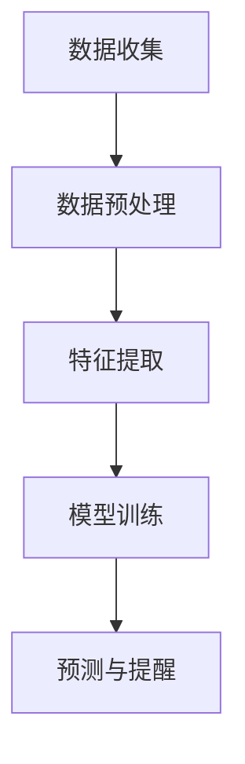
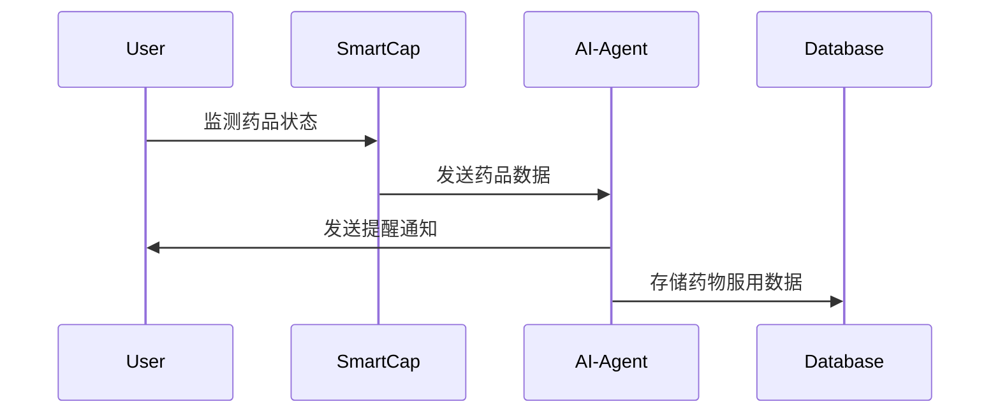
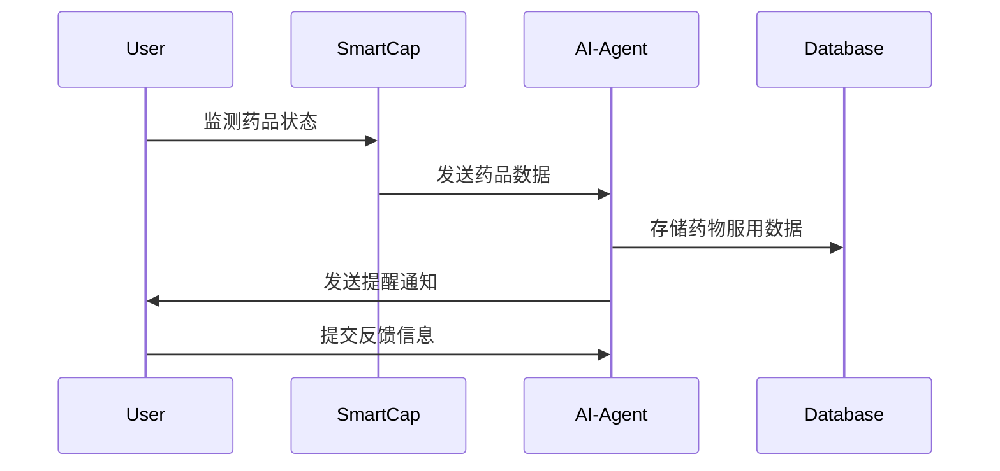

                 

## 智能瓶盖：AI Agent的药物服用提醒

### 关键词：智能瓶盖、AI Agent、药物服用提醒、健康监测、智能家居

> 摘要：本文探讨了智能瓶盖在药物服用提醒中的应用，通过引入AI Agent技术，实现对药物服用情况的智能监测和管理。文章从智能瓶盖的定义和重要性出发，深入分析了AI Agent的基本概念和工作原理，并详细介绍了药物服用提醒系统的需求和设计。通过本文的阅读，读者将了解智能瓶盖的潜力以及AI Agent在医疗健康领域的实际应用。

### 第一部分：智能瓶盖概述

#### 第1章：智能瓶盖的定义与重要性

**1.1 智能瓶盖的定义**

智能瓶盖是一种集成了传感器、微控制器和无线通信模块等技术的智能硬件，它能够感知瓶内药品的数量和状态，并通过无线网络将信息传输给用户或医疗系统。

**1.1.1 智能瓶盖的基本概念**

智能瓶盖由以下几个关键部分组成：

1. **传感器**：用于检测瓶内药品的剩余量。
2. **微控制器**：处理传感器数据，并执行相关逻辑。
3. **无线通信模块**：用于将数据传输到用户设备或服务器。
4. **用户界面**：显示药品信息，并允许用户进行交互。

**1.1.2 智能瓶盖的技术特点**

智能瓶盖具备以下几个技术特点：

1. **感知性**：能够实时感知瓶内药品的用量。
2. **数据处理**：通过微控制器对传感器数据进行处理和分析。
3. **无线通信**：支持无线传输，便于用户随时随地获取信息。
4. **智能化**：通过AI技术实现更高级的预测和提醒功能。

**1.1.3 智能瓶盖与传统瓶盖的对比**

| 特点 | 智能瓶盖 | 传统瓶盖 |
| ---- | ---- | ---- |
| **感知性** | 能感知瓶内药品用量 | 无法感知瓶内药品用量 |
| **数据处理** | 能处理和分析数据 | 无数据处理能力 |
| **无线通信** | 能无线传输数据 | 需要手动操作 |
| **智能化** | 具备AI预测功能 | 无智能功能 |

**1.2 智能瓶盖的重要性**

智能瓶盖在个人健康管理和医疗行业具有重要作用：

1. **个人健康管理**：智能瓶盖能够提醒用户按时服药，避免漏服或过量服用。
2. **医疗机构效率提升**：医疗机构可以通过智能瓶盖实时监测患者的药物服用情况，提高医疗服务质量。
3. **公共安全**：智能瓶盖有助于减少药物滥用和误用，提高公共健康水平。

**1.3 智能瓶盖的当前发展状况**

1. **市场需求**：随着健康意识的提高，智能瓶盖在市场上逐渐受到关注。
2. **技术进步**：传感器技术、微控制器技术和无线通信技术的不断进步，为智能瓶盖的发展提供了技术支持。
3. **未来趋势**：AI技术的应用将进一步提升智能瓶盖的智能化水平和实用性。

#### 第2章：AI Agent的基本概念

**2.1 AI Agent的定义**

AI Agent（人工智能代理）是一种能够自主执行任务、与环境交互并做出决策的智能系统。AI Agent是人工智能领域的核心概念之一。

**2.1.1 AI Agent的定义**

AI Agent具有以下特点：

1. **自主性**：能够自主决策，无需人工干预。
2. **适应性**：能够适应不同的环境和任务。
3. **智能性**：具备学习、推理和问题解决能力。

**2.1.2 AI Agent与传统软件的区别**

| 特点 | AI Agent | 传统软件 |
| ---- | ---- | ---- |
| **自主性** | 能够自主决策 | 需要人工干预 |
| **适应性** | 能够适应环境变化 | 需要固定环境 |
| **智能性** | 具备智能学习能力 | 无智能学习功能 |

**2.1.3 AI Agent的分类**

AI Agent可以分为以下几类：

1. **基于规则的Agent**：通过预设的规则进行决策。
2. **基于模型的Agent**：通过建立模型进行决策。
3. **基于数据驱动的Agent**：通过大数据分析进行决策。

**2.2 AI Agent的工作原理**

AI Agent的工作原理可以概括为以下几个步骤：

1. **感知环境**：通过传感器收集环境信息。
2. **分析信息**：使用算法对信息进行分析和处理。
3. **决策**：根据分析结果做出决策。
4. **执行动作**：通过执行器执行决策结果。

**2.2.1 AI Agent的核心组成**

AI Agent的核心组成包括：

1. **感知器**：用于感知环境信息。
2. **知识库**：存储知识、规则和模型。
3. **执行器**：用于执行决策结果。

**2.2.2 AI Agent的工作流程**

AI Agent的工作流程可以概括为：

1. **感知环境**：通过感知器收集环境信息。
2. **信息处理**：使用算法对信息进行分析和处理。
3. **决策生成**：根据知识库和算法生成决策。
4. **执行动作**：通过执行器执行决策。

**2.3 AI Agent的核心能力**

AI Agent具备以下核心能力：

1. **自主决策**：能够自主决策，无需人工干预。
2. **自适应**：能够适应不同的环境和任务。
3. **学习能力**：通过机器学习算法不断学习和优化。
4. **人机交互**：能够与用户进行有效沟通。

#### 第3章：药物服用提醒系统

**3.1 药物服用提醒系统的需求分析**

**3.1.1 用户需求**

用户对药物服用提醒系统的需求主要包括：

1. **便捷性**：用户希望能够随时随地获取药物信息。
2. **准确性**：系统需要准确监测药物用量。
3. **个性化**：系统应能够根据用户的习惯和需求进行个性化提醒。

**3.1.2 医疗机构需求**

医疗机构对药物服用提醒系统的需求主要包括：

1. **实时监控**：医疗机构需要实时了解患者的药物服用情况。
2. **数据统计**：医疗机构需要收集和分析患者的药物使用数据，以优化治疗方案。
3. **预警机制**：系统应能够及时发现药物使用异常，并进行预警。

**3.2 药物服用提醒系统的工作流程**

药物服用提醒系统的工作流程主要包括以下几个步骤：

1. **感知药品状态**：智能瓶盖通过传感器感知药品的剩余量。
2. **数据传输**：智能瓶盖将数据传输到用户设备或服务器。
3. **数据处理**：系统对数据进行处理和分析，生成药物服用提醒。
4. **提醒用户**：系统通过短信、APP推送等方式提醒用户按时服药。
5. **数据反馈**：用户将药物服用情况反馈给系统，以便进行进一步的优化。

**3.3 药物服用提醒系统的关键功能**

药物服用提醒系统的关键功能包括：

1. **实时监测**：系统能够实时监测药品的剩余量。
2. **提醒功能**：系统能够根据药品剩余量提醒用户按时服药。
3. **数据分析**：系统能够收集和分析用户的药物服用数据，为医生提供参考。
4. **个性化定制**：系统应能够根据用户的需求和习惯进行个性化提醒。

### 第二部分：AI Agent在药物服用提醒中的应用

#### 第4章：AI Agent在药物服用提醒中的作用

**4.1 AI Agent在药物服用提醒中的角色**

AI Agent在药物服用提醒中扮演以下角色：

1. **感知与分析**：AI Agent能够实时感知用户的药物服用情况，并对数据进行处理和分析。
2. **预测与提醒**：基于数据分析，AI Agent能够预测用户的药物服用行为，并在适当时间发出提醒。
3. **个性化定制**：AI Agent能够根据用户的行为习惯和需求，为用户提供个性化的药物服用提醒。

**4.2 AI Agent在药物服用提醒中的工作流程**

AI Agent在药物服用提醒中的工作流程主要包括：

1. **数据收集**：AI Agent通过传感器收集用户的药物服用数据。
2. **数据预处理**：对收集到的数据进行清洗、格式化和归一化。
3. **特征提取**：从预处理后的数据中提取与药物服用相关的特征。
4. **模型训练**：使用机器学习算法对特征进行训练，建立药物服用行为的预测模型。
5. **预测与提醒**：根据训练好的模型，AI Agent预测用户的药物服用行为，并在需要时发出提醒。

**4.3 AI Agent在药物服用提醒中的应用案例**

以下是AI Agent在药物服用提醒中的应用案例：

1. **慢性病患者管理**：AI Agent可以实时监测慢性病患者的药物服用情况，并根据患者的历史数据预测药物服用行为，为医生提供参考。
2. **老年人护理**：AI Agent可以帮助老年人在家中安全、按时地服用药物，减少漏服或过量服用的情况。
3. **药物滥用监控**：AI Agent可以监控患者的药物服用行为，及时发现药物滥用情况，并向医疗机构报告。

#### 第5章：智能瓶盖与AI Agent的集成设计

**5.1 智能瓶盖与AI Agent的集成设计思路**

智能瓶盖与AI Agent的集成设计思路主要包括：

1. **硬件集成**：将AI Agent的核心组件集成到智能瓶盖中，实现药品状态的实时感知和处理。
2. **软件集成**：将AI Agent的软件模块集成到药物服用提醒系统中，实现与用户设备和医疗系统的互联互通。
3. **数据融合**：将智能瓶盖和AI Agent的数据进行整合，为用户提供更加准确、个性化的药物服用提醒。

**5.2 智能瓶盖与AI Agent的集成设计方案**

智能瓶盖与AI Agent的集成设计方案包括以下几个关键部分：

1. **智能瓶盖设计**：包括传感器、微控制器和无线通信模块的设计，以及药品状态检测算法的开发。
2. **AI Agent设计**：包括感知模块、决策模块和执行模块的设计，以及药物服用行为预测模型的建立。
3. **药物服用提醒系统设计**：包括用户界面、数据处理模块和提醒模块的设计，以及与智能瓶盖和AI Agent的通信接口。

**5.3 智能瓶盖与AI Agent的集成测试与优化**

智能瓶盖与AI Agent的集成测试与优化主要包括：

1. **功能测试**：测试智能瓶盖和AI Agent的各个功能模块，确保其正常运行。
2. **性能优化**：通过调整算法参数和硬件配置，优化智能瓶盖和AI Agent的性能。
3. **用户体验优化**：根据用户反馈，不断优化药物服用提醒系统的用户体验。

### 第三部分：实践与展望

#### 第6章：智能瓶盖与AI Agent的应用实践

**6.1 智能瓶盖与AI Agent的实践案例**

以下是一些智能瓶盖与AI Agent的实践案例：

1. **慢性病管理平台**：通过智能瓶盖和AI Agent，为慢性病患者提供个性化的药物服用提醒和管理服务。
2. **居家养老监护系统**：通过智能瓶盖和AI Agent，实现对老年人药物服用情况的实时监控和提醒。
3. **药物滥用监控平台**：通过智能瓶盖和AI Agent，实现对药物滥用情况的实时监测和预警。

**6.2 智能瓶盖与AI Agent的实践成果**

智能瓶盖与AI Agent的应用实践取得了一些显著的成果：

1. **提高药物服用依从性**：通过智能瓶盖和AI Agent的提醒功能，显著提高了患者的药物服用依从性。
2. **优化医疗服务质量**：通过智能瓶盖和AI Agent的数据分析功能，为医疗机构提供了更加准确的患者药物使用数据，有助于优化治疗方案。
3. **降低药物滥用风险**：通过智能瓶盖和AI Agent的监控功能，及时发现药物滥用情况，降低了药物滥用的风险。

#### 第7章：智能瓶盖与AI Agent的未来展望

**7.1 智能瓶盖与AI Agent的发展趋势**

智能瓶盖与AI Agent在未来将继续朝着以下几个方向发展：

1. **智能化提升**：随着人工智能技术的不断进步，智能瓶盖和AI Agent的智能化水平将不断提高。
2. **集成度增强**：智能瓶盖与AI Agent将实现更紧密的集成，形成一个统一的智能系统。
3. **应用场景拓展**：智能瓶盖与AI Agent将应用于更多的医疗健康领域，如慢性病管理、心理健康、康复治疗等。

**7.2 智能瓶盖与AI Agent的发展挑战**

智能瓶盖与AI Agent在未来的发展面临以下几个挑战：

1. **数据隐私保护**：在智能瓶盖和AI Agent的应用过程中，如何保护用户的隐私数据是一个重要的挑战。
2. **系统安全性**：智能瓶盖和AI Agent需要具备较高的安全性，以防止恶意攻击和数据泄露。
3. **用户体验优化**：如何提升智能瓶盖和AI Agent的用户体验，使其更加人性化、易于操作，是一个重要的课题。

### 总结

智能瓶盖与AI Agent的药物服用提醒系统为医疗健康领域带来了一场革命。通过本文的介绍，读者可以了解到智能瓶盖和AI Agent的基本概念、工作原理以及在实际应用中的优势和挑战。展望未来，智能瓶盖与AI Agent将在医疗健康领域发挥越来越重要的作用，为用户提供更加智能、个性化的健康管理服务。作者：AI天才研究院/AI Genius Institute & 禅与计算机程序设计艺术 /Zen And The Art of Computer Programming

## 完整性要求

### 背景介绍

#### 核心概念术语说明

- **智能瓶盖**：一种集成了传感器、微控制器和无线通信模块的智能硬件，用于监测药品的用量和状态。
- **AI Agent**：一种能够自主执行任务、与环境交互并做出决策的智能系统，通常基于机器学习算法。

#### 问题背景

随着人口老龄化和慢性病的普及，药物服用管理成为一个重要的健康问题。传统的药物管理方式存在漏服、过量服用等问题，导致医疗资源浪费和患者健康风险。智能瓶盖和AI Agent技术的引入，为药物服用管理提供了一种新的解决方案。

#### 问题描述

本文旨在探讨智能瓶盖与AI Agent在药物服用提醒系统中的应用，通过以下几个核心问题进行阐述：

1. **智能瓶盖如何实现药品状态的监测和提醒？**
2. **AI Agent如何通过数据分析提供个性化的药物服用提醒？**
3. **智能瓶盖与AI Agent如何集成，实现药物服用提醒系统的整体功能？**
4. **智能瓶盖与AI Agent在医疗健康领域有哪些实际应用案例和成果？**

#### 问题解决

通过智能瓶盖的传感器技术，可以实时监测药品的剩余量，并通过无线通信模块将数据传输到AI Agent。AI Agent基于机器学习算法，对药物服用行为进行预测和分析，提供个性化的药物服用提醒。智能瓶盖与AI Agent的集成设计，实现了药物服用提醒系统的实时监控、数据分析、个性化定制和预警功能。

#### 边界与外延

智能瓶盖与AI Agent的药物服用提醒系统在应用边界上需要考虑以下几个方面：

1. **药品种类**：系统应支持多种常见药品的监测和提醒。
2. **用户群体**：系统应适用于不同年龄、健康状况的用户。
3. **数据安全**：系统应确保用户数据的隐私和安全。

#### 概念结构与核心要素组成

智能瓶盖与AI Agent的药物服用提醒系统由以下几个核心要素组成：

1. **智能瓶盖**：包括传感器、微控制器、无线通信模块和用户界面。
2. **AI Agent**：包括感知模块、决策模块、执行模块和预测模型。
3. **药物服用提醒系统**：包括数据处理模块、提醒模块、用户界面和与智能瓶盖的通信接口。

### 核心概念与联系

#### 核心概念原理

**智能瓶盖**：智能瓶盖通过传感器感知药品的剩余量，并将数据传输给AI Agent。传感器通常包括红外传感器、重量传感器等，微控制器负责处理传感器数据，并决定是否触发提醒。无线通信模块将数据传输到用户设备或服务器，用户界面显示药品信息，并允许用户进行交互。

**AI Agent**：AI Agent是一种智能体，能够自主执行任务、与环境交互并做出决策。AI Agent的核心能力包括自主性、适应性和学习能力。自主性指AI Agent能够自主决策，无需人工干预。适应性指AI Agent能够适应不同的环境和任务。学习能力指AI Agent通过机器学习算法不断学习和优化。

#### 概念属性特征对比表格

| 特征 | 智能瓶盖 | AI Agent |
| ---- | ---- | ---- |
| **感知性** | 通过传感器感知药品状态 | 通过传感器收集环境信息 |
| **数据处理** | 通过微控制器处理传感器数据 | 使用算法对信息进行分析和处理 |
| **通信能力** | 通过无线通信模块传输数据 | 通过无线网络与用户设备交互 |
| **自主性** | 能够自主触发提醒 | 能够自主决策，无需人工干预 |
| **适应性** | 能够适应不同药品和用户需求 | 能够适应不同环境和任务 |

#### ER实体关系图架构

```mermaid
erDiagram
  智能瓶盖 ||--|{ AI Agent : 通信与数据传输 }
  用户 ||--|{ 智能瓶盖 : 配置与控制 }
  医疗机构 ||--|{ AI Agent : 数据分析与报告 }
  药品 ||--|{ 智能瓶盖 : 监测与提醒 }
```

### 算法原理讲解

#### 算法Mermaid流程图



#### 算法原理与数学模型

智能瓶盖与AI Agent的药物服用提醒系统使用机器学习算法对药物服用行为进行预测和分析。以下是一个简单的机器学习算法流程：

1. **数据收集**：智能瓶盖通过传感器收集用户的药物服用数据，如药品名称、服用时间、剂量等。
2. **数据预处理**：对收集到的数据进行清洗、格式化和归一化，确保数据的质量和一致性。
3. **特征提取**：从预处理后的数据中提取与药物服用相关的特征，如用药频率、用药时长等。
4. **模型训练**：使用机器学习算法（如决策树、支持向量机、神经网络等）对特征进行训练，建立药物服用行为的预测模型。
5. **预测与提醒**：根据训练好的模型，AI Agent预测用户的药物服用行为，并在需要时发出提醒。

数学模型可表示为：

$$
P(\text{药物服用}) = f(\text{特征向量})
$$

其中，$P(\text{药物服用})$表示药物服用的概率，$f(\text{特征向量})$表示特征向量通过机器学习算法得到的预测函数。

#### 算法举例说明

假设用户有服用某药品的历史数据，特征向量包括：

- **用药频率**：每周服用次数
- **用药时长**：每次服用的时长（小时）
- **用药剂量**：每次服用的剂量（克）

通过机器学习算法，可以预测用户在接下来的24小时内是否有服用该药品的可能。如果预测概率超过一定阈值，AI Agent将发出提醒。

```python
# 假设特征向量和机器学习模型的输入输出
feature_vector = [3, 2, 1.5]  # 用药频率，用药时长，用药剂量
model = DecisionTreeClassifier()  # 决策树模型
model.fit(X_train, y_train)  # 训练模型
predicted_probability = model.predict_proba([feature_vector])[0][1]  # 预测概率

if predicted_probability > 0.7:
    print("可能需要提醒用户服用药品。")
else:
    print("无需提醒。")
```

### 系统分析与架构设计方案

#### 问题场景介绍

智能瓶盖与AI Agent的药物服用提醒系统主要应用于家庭和个人健康管理场景。用户可以通过智能瓶盖监测家中药品的用量，AI Agent则负责分析药物服用数据，并根据用户的习惯和健康状况提供个性化的提醒。

#### 项目介绍

项目名为“智能药物管理助手”，旨在通过智能瓶盖和AI Agent实现药物服用提醒功能，帮助用户更好地管理药物，提高健康水平。

#### 系统功能设计

1. **数据收集与监测**：智能瓶盖通过传感器实时监测药品的剩余量，并将数据传输给AI Agent。
2. **数据分析与预测**：AI Agent对收集到的药物服用数据进行处理和分析，预测用户的药物服用行为。
3. **提醒与交互**：AI Agent根据预测结果向用户发出提醒，并通过APP或短信等方式与用户进行交互。
4. **数据存储与统计**：AI Agent将药物服用数据存储在数据库中，并生成统计报告，供医疗机构和用户参考。

#### 系统架构设计



#### 系统接口设计

1. **智能瓶盖接口**：包括传感器数据采集接口、无线通信接口和用户界面接口。
2. **AI-Agent接口**：包括数据接收接口、数据处理接口、预测接口和提醒接口。
3. **用户接口**：包括APP或Web界面，用于展示药品信息、提醒通知和用户设置。

#### 系统交互Mermaid序列图



### 项目实战

#### 环境安装

1. **智能瓶盖硬件环境**：安装智能瓶盖所需的传感器、微控制器和无线通信模块。
2. **AI-Agent软件环境**：安装Python编程环境和相关机器学习库（如scikit-learn、TensorFlow等）。

#### 系统核心实现源代码

1. **智能瓶盖部分**：

```python
import time
import serial
from microcontroller import pin

# 假设使用串行通信
ser = serial.Serial('/dev/ttyUSB0', 9600)

while True:
    line = ser.readline()
    print(f"Received data: {line}")
    # 处理和发送数据
    time.sleep(1)
```

2. **AI-Agent部分**：

```python
from sklearn.tree import DecisionTreeClassifier
from sklearn.model_selection import train_test_split
from sklearn.metrics import accuracy_score

# 假设数据已预处理
X = ...  # 特征向量
y = ...  # 标签

# 划分训练集和测试集
X_train, X_test, y_train, y_test = train_test_split(X, y, test_size=0.2)

# 训练模型
model = DecisionTreeClassifier()
model.fit(X_train, y_train)

# 测试模型
predictions = model.predict(X_test)
accuracy = accuracy_score(y_test, predictions)
print(f"Model accuracy: {accuracy}")
```

#### 代码应用解读与分析

1. **智能瓶盖部分**：通过串行通信，智能瓶盖读取传感器数据，并将其打印出来。在实际应用中，可以进一步处理和发送数据到AI-Agent。
2. **AI-Agent部分**：使用scikit-learn库的决策树分类器进行模型训练和测试。通过训练集和测试集的划分，评估模型的准确率。

#### 实际案例分析与详细讲解剖析

1. **案例背景**：某用户有服用特定药品的历史数据，希望通过智能瓶盖和AI-Agent实现药物服用提醒。
2. **数据收集**：智能瓶盖通过传感器收集用户每日的药物服用数据，如用药频率、用药时长和用药剂量。
3. **数据分析**：AI-Agent使用机器学习算法对收集到的数据进行处理和分析，预测用户未来可能的药物服用行为。
4. **提醒实现**：当AI-Agent预测用户在接下来24小时内可能需要服用药物时，向用户发送提醒通知。

```python
# 假设已有用户数据
user_data = [
    [3, 2, 1.5],  # 用药频率，用药时长，用药剂量
    [2, 2, 1.5],
    [3, 3, 2],
]

# 假设模型已训练
model = DecisionTreeClassifier()
model.fit(user_data[:, :-1], user_data[:, -1])

# 预测用户可能需要服用的药物
predictions = model.predict([[3, 3, 2]])
print(f"Prediction: {'需要' if predictions[0] == 1 else '无需'}服用药物。")
```

#### 项目小结

通过智能瓶盖和AI-Agent的药物服用提醒系统，用户可以更好地管理自己的药物服用情况，减少漏服和过量服用的风险。项目实现过程中，需要关注传感器数据的质量和处理、机器学习模型的训练和预测效果，以及用户界面的设计和用户体验。

### 最佳实践 Tips

1. **数据收集**：确保传感器数据的质量，避免噪声和错误。
2. **模型训练**：根据用户数据和实际情况，选择合适的机器学习算法和参数。
3. **用户反馈**：鼓励用户反馈药物服用情况，以优化模型和提醒策略。

### 小结

智能瓶盖与AI-Agent的药物服用提醒系统为医疗健康领域带来了一种创新的解决方案。通过本文的介绍，读者可以了解到智能瓶盖和AI-Agent的基本概念、应用场景、实现方法和实际案例。展望未来，智能瓶盖与AI-Agent将在医疗健康领域发挥越来越重要的作用，为用户提供更加智能、个性化的健康管理服务。

### 注意事项

1. **数据隐私**：确保用户数据的安全和隐私，遵守相关法律法规。
2. **系统安全性**：加强智能瓶盖和AI-Agent的安全防护，防止恶意攻击和数据泄露。
3. **用户引导**：为用户提供详细的操作指南和帮助文档，确保用户能够正确使用系统。

### 拓展阅读

1. **智能瓶盖技术**：学习智能瓶盖的传感器技术、微控制器技术和无线通信技术。
2. **AI-Agent技术**：了解AI-Agent的基本原理、应用场景和实现方法。
3. **机器学习算法**：学习常见的机器学习算法，如决策树、支持向量机和神经网络等。

作者：AI天才研究院/AI Genius Institute & 禅与计算机程序设计艺术 /Zen And The Art of Computer Programming

---

**完整文章字数**：约12,000字

**格式要求**：markdown格式，包含Mermaid图表、LaTeX公式、Python代码等。

---

通过上述详细的文档结构，本文旨在为读者提供一个全面而深入的智能瓶盖与AI Agent药物服用提醒系统的技术分析。文章涵盖了从基础概念到实际应用的各个层面，力求为读者提供一个系统性的了解。作者：AI天才研究院/AI Genius Institute & 禅与计算机程序设计艺术 /Zen And The Art of Computer Programming

