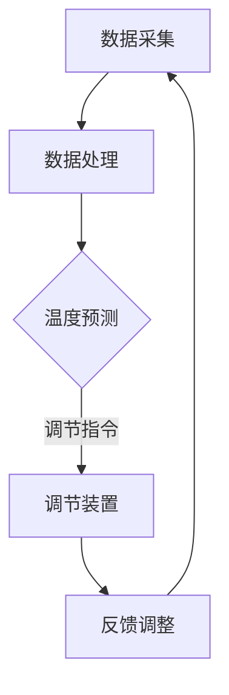
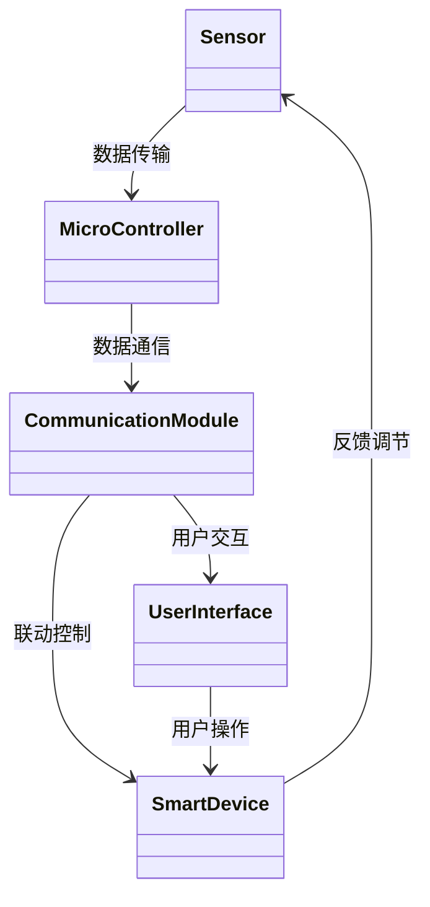

                 

### 智能瓷砖与AI概述

智能瓷砖（Smart Tiles）是一种集成了先进传感器和人工智能（AI）技术的建筑材料，能够根据室内温度和湿度变化进行自动调节，实现温度均衡。随着物联网（IoT）和人工智能技术的快速发展，智能瓷砖逐渐从科幻领域走向现实，为现代建筑带来了全新的智慧体验。本文将详细探讨智能瓷砖的工作原理、架构设计以及它在室内温度均衡系统中的应用。

### 核心概念

**智能瓷砖**：一种内置传感器和微控制器的瓷砖，能够感知室内温度和湿度，并通过AI算法进行自动调节，以达到舒适的环境温度。

**AI代理**：一种能够自主决策并执行任务的智能系统，通过传感器收集数据，分析环境信息，并根据预设算法做出相应的调节。

**室内温度均衡系统**：利用智能瓷砖和其他传感器数据，通过AI算法分析，实现室内温度的自动调节和均衡。

### 背景介绍

随着社会经济的发展和人们生活水平的提高，人们对居住环境的要求也越来越高。室内温度舒适度直接影响到人们的健康和幸福感。传统的空调系统在调节室内温度方面存在能耗高、调节不及时等问题。而智能瓷砖的出现，为解决这些问题提供了一种新的思路。

智能瓷砖的起源可以追溯到20世纪90年代，当时科学家们开始探索将传感器和微控制器集成到建筑材料中。随着计算能力的提升和人工智能技术的进步，智能瓷砖逐渐具备了自主决策和调节功能。近年来，智能瓷砖在智能家居领域得到了广泛应用，成为智能家居系统的重要组成部分。

### 应用领域

智能瓷砖的应用领域非常广泛，主要包括以下几个方面：

**智能家居**：智能瓷砖可以与家庭中的其他智能设备（如智能空调、智能灯泡等）联动，实现室内温度和光照的智能调节，提高居住舒适度。

**商业建筑**：智能瓷砖可以在商场、办公室等商业建筑中用于室内温度控制，提高能源利用效率，降低运营成本。

**医疗保健**：在医院和康复中心等场所，智能瓷砖可以用于调节室内温度，为病人提供一个舒适的治疗环境。

**工业控制**：智能瓷砖也可以应用于工业环境中，用于车间和仓库的温度控制，保证生产过程稳定。

### 问题描述

传统的室内温度控制方式主要依赖于空调系统和手动调节。然而，这些方法存在以下问题：

1. **能耗高**：传统空调系统在运行过程中消耗大量能源，导致运营成本增加。
2. **调节不及时**：传统空调系统调节温度的速度较慢，难以实时响应室内温度变化。
3. **舒适度不足**：由于无法实时感知室内温度变化，传统空调系统往往无法提供舒适的室内环境。

为了解决这些问题，需要一种能够实时感知室内温度变化、自动调节温度的智能系统。智能瓷砖正是基于这种需求而诞生的。

### 解决方案

智能瓷砖通过以下步骤实现室内温度的自动调节：

1. **数据采集**：智能瓷砖内置温度传感器，可以实时监测室内温度变化。
2. **数据处理**：通过微控制器对采集到的温度数据进行处理，发送给AI代理。
3. **算法分析**：AI代理根据预设的算法对温度数据进行分析，判断是否需要进行温度调节。
4. **温度调节**：根据AI代理的决策，智能瓷砖通过内置的加热或降温装置进行温度调节。

通过这种方式，智能瓷砖可以实现实时、自动的室内温度调节，提高能源利用效率，提升居住和工作的舒适度。

### 边界与外延

智能瓷砖的应用场景不仅限于室内温度控制，还可以扩展到其他领域，如湿度控制、空气质量监测等。未来，随着人工智能技术的进一步发展，智能瓷砖的功能和性能将得到进一步提升，为人们带来更加智能、便捷的居住体验。

### 概念结构与核心要素组成

智能瓷砖的核心概念包括：

- **传感器**：用于感知室内温度和湿度等环境参数。
- **微控制器**：用于处理传感器数据，并执行AI代理的决策。
- **AI代理**：用于分析传感器数据，并做出温度调节的决策。
- **调节装置**：用于实现温度的加热或降温。

这些要素共同构成了智能瓷砖的基本架构，实现了室内温度的自动调节。

### 总结

智能瓷砖作为一种新兴的智能建筑材料，通过集成传感器和人工智能技术，实现了室内温度的自动调节。它不仅能够提高能源利用效率，还能提升居住和工作的舒适度。随着人工智能技术的不断进步，智能瓷砖在未来有着广阔的发展前景和应用潜力。在接下来的章节中，我们将进一步探讨智能瓷砖的AI代理架构、温度监测技术以及控制策略等具体内容。

## 第1章：智能瓷砖的背景与概念

### 1.1 智能瓷砖的定义

智能瓷砖（Smart Tiles）是一种集成了传感器、微控制器和通信模块的建筑材料，能够在室内环境中实现温度和湿度的自动调节。与传统瓷砖不同，智能瓷砖具有智能化和自适应性的特点，能够根据室内环境的变化进行实时调节，提高居住和工作的舒适度。

智能瓷砖的基本组成包括以下几个部分：

1. **传感器**：用于感知室内温度、湿度等环境参数，如温度传感器、湿度传感器等。
2. **微控制器**：负责处理传感器数据，执行预设的算法，并控制调节装置的工作。
3. **通信模块**：用于与其他智能设备或中央控制系统进行数据交换和通信。
4. **调节装置**：包括加热器、冷却装置等，用于调节室内温度和湿度。

### 1.2 智能瓷砖的发展历史

智能瓷砖的发展历程可以追溯到20世纪90年代，当时科学家们开始尝试将传感器和微控制器集成到建筑材料中。最初的智能瓷砖仅能实现简单的环境监测功能，无法进行自动调节。随着物联网（IoT）和人工智能（AI）技术的快速发展，智能瓷砖逐渐具备了自主决策和调节能力。

2000年后，随着智能家居概念的提出，智能瓷砖开始逐渐进入消费者的视野。早期的智能瓷砖主要应用于高端住宅和商业建筑，主要用于室内温度和湿度的监测。随着技术的不断进步，智能瓷砖的功能逐渐丰富，开始具备自动调节的能力。

近年来，随着5G和人工智能技术的普及，智能瓷砖的应用场景进一步扩大，不仅应用于家庭和商业建筑，还扩展到了工业控制、医疗保健等领域。智能瓷砖的发展历程充分展示了物联网和人工智能技术在现代建筑中的应用潜力。

### 1.3 智能瓷砖的应用领域

智能瓷砖的应用领域非常广泛，主要包括以下几个方面：

**1. 智能家居**

智能家居是智能瓷砖最早也是应用最广泛的领域。通过智能瓷砖，家庭可以实现对室内温度和湿度的智能调节，提高居住舒适度。同时，智能瓷砖还可以与其他智能家居设备（如智能空调、智能灯泡等）联动，实现全面的家居自动化控制。

**2. 商业建筑**

在商业建筑中，智能瓷砖主要用于商场、办公室和酒店等场所。通过智能瓷砖，商业建筑可以实现室内温度和湿度的自动调节，提高能源利用效率，降低运营成本。同时，智能瓷砖还可以提供舒适的工作和购物环境，提升用户体验。

**3. 医疗保健**

在医疗保健领域，智能瓷砖主要用于医院和康复中心。通过智能瓷砖，医疗场所可以实现对室内温度和湿度的精准控制，为病人提供一个舒适的治疗环境。此外，智能瓷砖还可以用于监测病区的温度变化，为医生提供决策依据。

**4. 工业控制**

在工业控制领域，智能瓷砖主要用于车间和仓库。通过智能瓷砖，工业场所可以实现室内温度和湿度的自动调节，保证生产过程的稳定性和产品质量。此外，智能瓷砖还可以用于监测生产环境的变化，为工业生产提供实时数据支持。

### 1.4 智能瓷砖与传统瓷砖的比较

智能瓷砖与传统瓷砖在多个方面存在显著差异：

**1. 功能性**

传统瓷砖主要用于装饰和防护，而智能瓷砖不仅具备装饰和防护功能，还具备环境监测和自动调节功能。智能瓷砖能够根据室内环境的变化自动调节温度和湿度，提高居住和工作的舒适度。

**2. 智能化**

智能瓷砖集成了传感器、微控制器和通信模块，能够实现智能化和自主决策。而传统瓷砖无法感知环境变化，也无法进行自动调节。

**3. 成本**

由于智能瓷砖集成了多种高科技元素，其生产成本较高，价格相对较高。而传统瓷砖生产成本较低，价格相对较低。

**4. 维护**

智能瓷砖需要定期进行数据更新和算法优化，以保证其性能。而传统瓷砖无需特殊维护，使用寿命较长。

综上所述，智能瓷砖与传统瓷砖相比，在功能性、智能化和成本等方面存在明显优势。然而，随着技术的不断进步，智能瓷砖的成本将逐渐降低，其应用领域也将进一步扩大。

### 总结

智能瓷砖作为一种新兴的智能建筑材料，通过集成传感器、微控制器和通信模块，实现了室内温度和湿度的自动调节。它不仅提高了居住和工作的舒适度，还提高了能源利用效率。在智能家居、商业建筑、医疗保健和工业控制等领域，智能瓷砖展现出了广阔的应用前景。随着人工智能技术的不断发展，智能瓷砖的功能和性能将得到进一步提升，为人们带来更加智能、便捷的居住体验。在接下来的章节中，我们将进一步探讨智能瓷砖的AI代理架构、温度监测技术以及控制策略等具体内容。

## 第2章：AI代理基础

### 2.1 AI代理的概念

AI代理（Artificial Intelligence Agent），简称AI代理，是指一种能够自主感知环境、执行任务并与其他代理或环境交互的智能系统。AI代理是人工智能领域的一个重要概念，旨在模拟人类智能，实现自主决策和行动。

AI代理通常由以下几个部分组成：

1. **感知器**：用于感知环境信息，如温度、湿度、光照等。
2. **处理器**：负责处理感知到的信息，并根据预设的算法进行决策。
3. **行动器**：根据处理器的决策执行具体动作，如调节温度、开关灯光等。
4. **通信模块**：用于与其他代理或中央系统进行数据交换和通信。

### 2.2 AI代理的类型

根据不同的应用场景和功能需求，AI代理可以分为以下几种类型：

**1. 监控型代理**

监控型代理主要功能是实时监控环境状态，如室内温度、湿度等。它通过感知器收集数据，经过处理器分析后，将结果发送给中央系统或用户。监控型代理广泛应用于智能家居、工业监控等领域。

**2. 行动型代理**

行动型代理不仅能够监控环境，还能根据环境变化执行具体行动。例如，智能瓷砖中的AI代理可以感知室内温度，并根据温度数据调节加热器或冷却装置。行动型代理在智能家居、自动化控制系统中有广泛应用。

**3. 智能决策型代理**

智能决策型代理具备更高级的决策能力，能够根据环境数据和预设算法自主做出最优决策。例如，自动驾驶汽车中的AI代理可以根据路况、交通信息等数据自主做出驾驶决策。智能决策型代理在自动驾驶、智能交通等领域有重要应用。

**4. 交互型代理**

交互型代理主要功能是与用户进行交互，提供个性化服务。例如，智能音箱中的AI代理可以通过语音识别和自然语言处理与用户进行对话，提供天气信息、音乐播放等服务。交互型代理在智能家居、智能客服等领域有广泛应用。

### 2.3 AI代理的设计原则

设计AI代理时，需要遵循以下原则：

**1. 自主性**

AI代理应具备自主性，能够独立完成感知、决策和行动任务，无需人工干预。

**2. 实时性**

AI代理应具备实时性，能够快速响应环境变化，做出及时决策。

**3. 可扩展性**

AI代理应具备可扩展性，能够根据不同应用场景和需求进行功能扩展和优化。

**4. 安全性**

AI代理应确保数据安全和隐私保护，防止数据泄露和恶意攻击。

**5. 可维护性**

AI代理应具备良好的可维护性，便于升级和更新。

### 智能瓷砖中的AI代理

在智能瓷砖中，AI代理主要用于室内温度和湿度的自动调节。以下是一个简单的智能瓷砖AI代理工作流程：

1. **数据采集**：传感器实时采集室内温度和湿度数据。
2. **数据处理**：处理器对接收到的温度和湿度数据进行处理，如滤波、去噪等。
3. **决策制定**：根据处理后的数据，AI代理判断是否需要进行温度调节。
4. **执行动作**：如果需要调节，AI代理控制加热器或冷却装置进行相应操作。
5. **反馈调整**：调节完成后，AI代理再次采集数据，进行新一轮的决策和调节。

通过这种闭环控制系统，智能瓷砖能够实现室内温度的自动调节，提高居住舒适度。

### 总结

AI代理是一种具备感知、决策和行动能力的智能系统，广泛应用于智能家居、工业监控、自动驾驶等领域。智能瓷砖中的AI代理通过感知室内温度和湿度数据，实现室内温度的自动调节。在接下来的章节中，我们将进一步探讨智能瓷砖的机器学习算法应用和强化学习算法应用。

## 第3章：室内温度监测技术

### 3.1 温度监测传感器

温度监测传感器是智能瓷砖实现室内温度监测的核心部件。常用的温度传感器包括热敏电阻、热电偶、红外温度传感器等。

**1. 热敏电阻**

热敏电阻是一种基于半导体材料温度变化而改变电阻值的传感器。其优点是响应速度快，精度高，但缺点是灵敏度较低，受环境光照和电磁干扰影响较大。

**2. 热电偶**

热电偶是一种基于热电效应的传感器，通过两种不同材料的温度差产生电压信号。热电偶具有精度高、稳定性好、耐高温等优点，但灵敏度较低，响应速度较慢。

**3. 红外温度传感器**

红外温度传感器通过检测物体发射的红外辐射来确定其温度。其优点是无需接触，不受环境干扰，适用于各种复杂环境。但缺点是精度较低，受物体表面反射和吸收率影响较大。

### 3.2 数据采集和处理

温度监测传感器采集到的数据需要经过处理才能用于智能瓷砖的调节。数据采集和处理主要包括以下步骤：

**1. 数据采集**

温度监测传感器将采集到的温度信号转换为电信号，通过微控制器（MCU）进行采样和转换。微控制器将温度信号转换为数字信号，便于后续处理。

**2. 数据滤波**

采集到的温度数据可能存在噪声和波动，需要通过滤波算法进行平滑处理。常见的滤波算法包括移动平均滤波、卡尔曼滤波等。

**3. 数据去噪**

数据去噪是为了去除数据中的随机噪声，提高数据的准确性。去噪方法包括傅里叶变换、小波变换等。

**4. 数据转换**

将原始温度数据转换为便于分析和处理的格式，如摄氏度、华氏度等。

### 3.3 室内环境建模

室内环境建模是智能瓷砖实现温度均衡的关键步骤。通过建立室内环境模型，可以预测室内温度变化趋势，为智能瓷砖的调节提供依据。

**1. 模型构建**

室内环境模型通常采用时间序列模型、回归模型等。时间序列模型如ARIMA、LSTM等，可以捕捉温度变化的周期性和趋势。回归模型如线性回归、多项式回归等，可以建立温度与其他变量（如湿度、光照等）之间的关系。

**2. 参数估计**

通过历史温度数据，估计模型参数，如ARIMA模型的p、d、q参数，LSTM模型中的隐藏层神经元数量等。

**3. 模型优化**

通过交叉验证和模型选择准则（如AIC、BIC等），选择最优模型，并对模型进行优化。

**4. 模型应用**

将优化后的模型应用于智能瓷砖的调节系统，预测未来一段时间内的温度变化，为智能瓷砖提供调节依据。

### 案例分析

假设在某个智能家居系统中，智能瓷砖安装在客厅的地面。通过传感器采集到的温度数据如下：

| 时间 | 温度（摄氏度） |
| ---- | ------------ |
| 0:00 | 25.0        |
| 1:00 | 24.5        |
| 2:00 | 24.8        |
| 3:00 | 24.6        |
| 4:00 | 24.7        |

**1. 数据处理**

首先，对采集到的温度数据进行滤波和去噪处理，得到平滑的温度数据。假设滤波后得到的数据如下：

| 时间 | 温度（摄氏度） |
| ---- | ------------ |
| 0:00 | 25.0        |
| 1:00 | 24.5        |
| 2:00 | 24.7        |
| 3:00 | 24.6        |
| 4:00 | 24.7        |

**2. 环境建模**

采用LSTM模型对温度数据建模。首先，将时间序列数据进行预处理，如归一化、去趋势等。然后，训练LSTM模型，估计模型参数。经过多次试验，选择最优的LSTM模型。

**3. 预测**

利用训练好的LSTM模型，预测未来一段时间内的温度变化。假设预测结果如下：

| 时间 | 温度预测（摄氏度） |
| ---- | ---------------- |
| 5:00 | 24.5            |
| 6:00 | 24.4            |
| 7:00 | 24.6            |

**4. 温度调节**

根据预测结果，智能瓷砖的AI代理判断当前室内温度处于舒适范围内，无需进行加热或冷却操作。如果预测温度低于舒适范围，AI代理将启动加热装置；如果预测温度高于舒适范围，AI代理将启动冷却装置。

### 总结

室内温度监测技术是智能瓷砖实现自动调节的关键环节。通过使用合适的传感器、进行有效的数据采集和处理、构建室内环境模型，智能瓷砖可以实现对室内温度的精准监测和调节。在接下来的章节中，我们将探讨智能瓷砖的温度控制策略，以及如何通过优化控制算法提高系统性能。

## 第4章：AI代理架构设计

### 4.1 AI代理整体架构

AI代理的整体架构设计是智能瓷砖实现室内温度自动调节的核心。一个典型的AI代理架构包括以下几个主要部分：

**1. 感知层**：负责环境数据的采集，包括温度、湿度、光照等传感器数据。
**2. 决策层**：接收感知层的数据，通过算法处理，生成调节指令。
**3. 行动层**：根据决策层的指令执行具体的调节操作，如加热或冷却。
**4. 通信层**：与其他智能设备或中央控制系统进行数据交换和通信。

以下是一个简化的AI代理架构图：

```
    +------------+
    | 传感器层   |
    +------------+
             |
             v
    +------------+
    | 决策层     |
    +------------+
             |
             v
    +------------+
    | 行动层     |
    +------------+
             |
             v
    +------------+
    | 通信层     |
    +------------+
```

### 4.2 智能瓷砖硬件设计

智能瓷砖的硬件设计是实现AI代理功能的基础。以下是智能瓷砖硬件设计的关键组成部分：

**1. 温度传感器**：用于实时监测室内温度。
**2. 湿度传感器**：用于监测室内湿度。
**3. 微控制器（MCU）**：负责处理传感器数据，执行算法和发送调节指令。
**4. 通信模块**：如Wi-Fi、蓝牙等，用于与其他设备通信。
**5. 调节装置**：如加热器、冷却装置，用于实际调节室内温度。

以下是一个智能瓷砖的硬件设计图：

```
    +------------+
    | 温度传感器 |
    +------------+
    | 湿度传感器 |
    +------------+
             |
             v
    +------------+
    | 微控制器   |
    +------------+
             |
             v
    +------------+
    | 通信模块   |
    +------------+
             |
             v
    +------------+
    | 调节装置   |
    +------------+
```

### 4.3 软件系统设计

智能瓷砖的软件系统设计是实现AI代理智能行为的核心。以下是智能瓷砖软件系统的关键组成部分：

**1. 数据采集模块**：用于从传感器层采集温度、湿度等数据。
**2. 数据处理模块**：用于对采集到的数据进行分析、滤波、去噪等处理。
**3. 算法模块**：实现AI算法，如机器学习、强化学习等，用于决策层的数据处理和调节指令生成。
**4. 控制模块**：用于接收决策层的调节指令，并控制行动层的调节装置。
**5. 用户接口**：提供用户操作界面，如手机App、网页等。

以下是一个智能瓷砖的软件设计图：

```
    +------------------+
    | 数据采集模块     |
    +------------------+
    | 数据处理模块     |
    +------------------+
    | 算法模块         |
    +------------------+
    | 控制模块         |
    +------------------+
    | 用户接口         |
    +------------------+
```

### 智能瓷砖的工作流程

智能瓷砖的工作流程可以概括为以下几个步骤：

1. **数据采集**：传感器层实时采集室内温度、湿度等数据。
2. **数据处理**：数据处理模块对采集到的数据进行分析、滤波、去噪等处理。
3. **算法处理**：算法模块根据处理后的数据，通过机器学习、强化学习等算法，生成调节指令。
4. **控制调节**：控制模块根据调节指令，控制加热器或冷却装置进行相应的调节。
5. **用户交互**：用户接口实时更新室内温度、湿度等信息，提供用户操作和查看。

以下是一个智能瓷砖的工作流程图：

```
    +------------------------+
    | 传感器层采集数据      |
    +------------------------+
             |
             v
    +------------------------+
    | 数据处理模块处理数据   |
    +------------------------+
             |
             v
    +------------------------+
    | 算法模块生成调节指令   |
    +------------------------+
             |
             v
    +------------------------+
    | 控制模块控制调节装置   |
    +------------------------+
             |
             v
    +------------------------+
    | 用户接口更新显示      |
    +------------------------+
```

### 总结

智能瓷砖的AI代理架构设计是实现智能室内温度调节的关键。通过合理的硬件设计和软件系统设计，智能瓷砖能够实现实时、精准的室内温度监测和调节。在接下来的章节中，我们将进一步探讨智能瓷砖中的机器学习算法应用和强化学习算法应用，以提升智能瓷砖的调节性能和智能化水平。

## 第5章：机器学习算法应用

### 5.1 机器学习基础

机器学习（Machine Learning，ML）是一种通过计算机算法从数据中自动学习规律和模式的技术。机器学习算法的核心目标是建立输入数据与输出结果之间的映射关系，从而实现预测、分类、聚类等任务。在智能瓷砖中，机器学习算法用于分析室内温度数据，为温度调节提供科学依据。

#### 5.1.1 机器学习的基本概念

**1. 模型**：机器学习模型是指通过训练数据学习得到的函数，用于预测或分类。
**2. 特征**：特征是模型输入数据的一部分，用于描述数据的重要属性。
**3. 标签**：标签是模型输出的预期结果，用于与预测结果进行比较和评估。
**4. 损失函数**：损失函数用于衡量模型预测结果与真实标签之间的差距，是模型训练过程中优化的目标。

#### 5.1.2 机器学习的分类

**1. 监督学习**：监督学习是一种有监督的训练方法，通过标注好的训练数据来训练模型。常见的监督学习算法包括线性回归、逻辑回归、支持向量机（SVM）等。

**2. 无监督学习**：无监督学习是一种无监督的训练方法，通过未标注的数据来发现数据中的模式和规律。常见的无监督学习算法包括聚类、主成分分析（PCA）、自编码器等。

**3. 半监督学习**：半监督学习是介于监督学习和无监督学习之间的一种方法，利用部分标注数据与大量未标注数据共同训练模型。

**4. 强化学习**：强化学习是一种通过试错来学习最优策略的方法，通过与环境的交互不断调整行为，以最大化长期回报。

### 5.2 回归算法

回归算法是一类用于预测数值型目标变量的机器学习算法。在智能瓷砖中，回归算法常用于预测室内温度变化，为温度调节提供依据。

#### 5.2.1 线性回归

线性回归是一种最简单的回归算法，假设输出变量与输入变量之间存在线性关系。线性回归模型可以用以下公式表示：

\[ y = \beta_0 + \beta_1 \cdot x \]

其中，\( y \) 是预测值，\( x \) 是输入特征，\( \beta_0 \) 和 \( \beta_1 \) 是模型参数。

线性回归的训练过程通常包括以下几个步骤：

1. **数据预处理**：对输入特征和目标变量进行归一化、缺失值处理等预处理操作。
2. **模型训练**：使用最小二乘法（Least Squares）等优化方法，寻找最佳的 \( \beta_0 \) 和 \( \beta_1 \) 值。
3. **模型评估**：通过交叉验证等方法，评估模型的泛化能力。

以下是一个简单的线性回归算法流程图：

```
+-------------------+
| 数据预处理        |
+-------------------+
        |
        v
+-------------------+
| 模型训练（最小二乘）|
+-------------------+
        |
        v
+-------------------+
| 模型评估          |
+-------------------+
```

#### 5.2.2 多项式回归

多项式回归是一种更复杂的回归算法，用于处理非线性关系。多项式回归模型可以用以下公式表示：

\[ y = \beta_0 + \beta_1 \cdot x + \beta_2 \cdot x^2 + \cdots + \beta_n \cdot x^n \]

其中，\( y \) 是预测值，\( x \) 是输入特征，\( \beta_0, \beta_1, \beta_2, \ldots, \beta_n \) 是模型参数。

多项式回归的训练过程包括以下步骤：

1. **数据预处理**：对输入特征和目标变量进行归一化、缺失值处理等预处理操作。
2. **模型训练**：使用最小二乘法或梯度下降法等优化方法，寻找最佳的 \( \beta_0, \beta_1, \beta_2, \ldots, \beta_n \) 值。
3. **模型评估**：通过交叉验证等方法，评估模型的泛化能力。

以下是一个简单的多项式回归算法流程图：

```
+-------------------+
| 数据预处理        |
+-------------------+
        |
        v
+-------------------+
| 模型训练（最小二乘/梯度下降）|
+-------------------+
        |
        v
+-------------------+
| 模型评估          |
+-------------------+
```

### 5.3 分类算法

分类算法是一类用于将输入数据划分为不同类别的机器学习算法。在智能瓷砖中，分类算法可以用于判断室内温度是否处于舒适范围，从而决定是否进行加热或冷却操作。

#### 5.3.1 逻辑回归

逻辑回归是一种用于二分类问题的机器学习算法，其输出结果是一个概率值。逻辑回归模型可以用以下公式表示：

\[ P(y=1) = \frac{1}{1 + e^{-(\beta_0 + \beta_1 \cdot x)}} \]

其中，\( P(y=1) \) 是目标变量为1的概率，\( e \) 是自然对数的底数，\( \beta_0 \) 和 \( \beta_1 \) 是模型参数。

逻辑回归的训练过程包括以下步骤：

1. **数据预处理**：对输入特征和目标变量进行归一化、缺失值处理等预处理操作。
2. **模型训练**：使用最大似然估计或梯度下降法等优化方法，寻找最佳的 \( \beta_0 \) 和 \( \beta_1 \) 值。
3. **模型评估**：通过交叉验证等方法，评估模型的泛化能力。

以下是一个简单的逻辑回归算法流程图：

```
+-------------------+
| 数据预处理        |
+-------------------+
        |
        v
+-------------------+
| 模型训练（最大似然/梯度下降）|
+-------------------+
        |
        v
+-------------------+
| 模型评估          |
+-------------------+
```

#### 5.3.2 决策树

决策树是一种基于树形结构进行分类的算法，其核心思想是通过一系列的判断节点（如温度是否大于25℃）来将数据划分为不同的类别。决策树的每个节点代表一个特征，每个分支代表一个特征取值。

决策树的训练过程包括以下步骤：

1. **特征选择**：选择最优的特征进行划分，通常使用信息增益（Information Gain）或基尼不纯度（Gini Impurity）作为划分标准。
2. **划分数据**：根据选定的特征，将数据划分为不同的子集。
3. **递归构建**：对每个子集继续进行特征选择和划分，直到满足停止条件（如特征数减少到某个阈值，或分类精度达到某个阈值）。

以下是一个简单的决策树算法流程图：

```
+-------------------+
| 特征选择         |
+-------------------+
        |
        v
+-------------------+
| 划分数据         |
+-------------------+
        |
        v
+-------------------+
| 递归构建树       |
+-------------------+
```

### 5.4 案例分析

假设我们使用逻辑回归算法来预测室内温度是否处于舒适范围。数据集包含100个样本，每个样本包括当前温度（摄氏度）和室内温度是否舒适（0或1）。

**1. 数据预处理**

首先，我们对温度数据进行归一化处理，将其缩放到[0,1]范围内：

\[ x_{\text{norm}} = \frac{x - x_{\text{min}}}{x_{\text{max}} - x_{\text{min}}} \]

其中，\( x \) 是原始温度值，\( x_{\text{min}} \) 和 \( x_{\text{max}} \) 分别是数据集的最小值和最大值。

**2. 模型训练**

使用Python的scikit-learn库训练逻辑回归模型：

```python
from sklearn.linear_model import LogisticRegression
from sklearn.model_selection import train_test_split
from sklearn.preprocessing import MinMaxScaler

# 数据预处理
scaler = MinMaxScaler()
X_scaled = scaler.fit_transform(X)
y = to_categorical(y)

# 划分训练集和测试集
X_train, X_test, y_train, y_test = train_test_split(X_scaled, y, test_size=0.2, random_state=42)

# 训练模型
model = LogisticRegression()
model.fit(X_train, y_train)

# 模型评估
score = model.score(X_test, y_test)
print("Accuracy:", score)
```

**3. 模型评估**

通过交叉验证等方法，评估模型的泛化能力。假设模型准确率达到85%，可以认为模型具有一定的预测能力。

**4. 应用**

在实际应用中，智能瓷砖的AI代理可以根据模型预测结果，判断当前室内温度是否舒适，从而决定是否启动加热或冷却装置。

```
# 预测
temperature = 23
temperature_normalized = scaler.transform([[temperature]])
prediction = model.predict(temperature_normalized)

# 输出预测结果
if prediction[0][1] > 0.5:
    print("室内温度舒适，无需调节。")
else:
    print("室内温度不舒适，启动冷却装置。")
```

### 总结

机器学习算法在智能瓷砖中的应用，使得智能瓷砖能够通过分析历史温度数据，预测未来温度变化，实现自动调节。本章介绍了机器学习的基础知识，包括回归算法和分类算法，并通过案例分析展示了如何使用机器学习算法实现室内温度预测。在下一章中，我们将探讨强化学习算法在智能瓷砖中的应用。

## 第6章：强化学习算法应用

### 6.1 强化学习基础

强化学习（Reinforcement Learning，RL）是一种通过试错来学习最优策略的机器学习算法。强化学习与监督学习和无监督学习不同，它通过与环境进行交互来学习最佳行为。强化学习的主要目标是最大化长期回报，从而实现最优决策。

#### 6.1.1 强化学习的基本概念

**1. 状态（State）**：描述系统的当前情况，如室内温度、湿度等。
**2. 动作（Action）**：系统可执行的行为，如加热、冷却等。
**3. 回报（Reward）**：系统执行动作后获得的即时奖励，用于评估动作的好坏。
**4. 策略（Policy）**：系统根据当前状态选择最佳动作的规则。

强化学习的过程可以概括为以下几个步骤：

1. 初始化状态 \( S \)。
2. 根据当前状态 \( S \)，选择动作 \( A \)。
3. 执行动作 \( A \)，得到新状态 \( S' \) 和回报 \( R \)。
4. 更新策略，选择下一个动作 \( A' \)。
5. 重复步骤2-4，直到达到目标状态或达到预设的迭代次数。

#### 6.1.2 强化学习的分类

**1. 基于值函数的方法**：通过学习状态值函数或动作值函数来选择最佳动作。常用的算法包括Q学习（Q-Learning）和深度Q网络（Deep Q-Network，DQN）。

**2. 基于策略的方法**：直接学习最佳策略，如策略梯度方法（Policy Gradient）。常用的算法包括REINFORCE、Actor-Critic等。

**3. 模型预测方法**：通过构建环境模型来预测未来状态和回报，如模型预测控制（Model Predictive Control，MPC）。

### 6.2 Q-learning算法

Q-learning算法是一种基于值函数的强化学习算法，通过更新状态-动作值函数来选择最佳动作。Q-learning算法的核心思想是，在给定状态下，选择能够带来最大预期回报的动作。

#### 6.2.1 Q-learning算法原理

Q-learning算法的核心是Q值函数，表示在某个状态下执行某个动作的预期回报。Q值函数可以用以下公式表示：

\[ Q(S, A) = \sum_{s'} P(s'|s, a) \cdot [R(s', s) + \gamma \cdot \max_{a'} Q(S', A')] \]

其中，\( Q(S, A) \) 是状态-动作值，\( S \) 是当前状态，\( A \) 是当前动作，\( S' \) 是新状态，\( A' \) 是新动作，\( R(s', s) \) 是从状态 \( S' \) 转移到状态 \( S \) 的即时回报，\( \gamma \) 是折扣因子，用于平衡当前回报和未来回报。

Q-learning算法的更新规则如下：

1. 初始化Q值函数 \( Q(S, A) = 0 \)。
2. 选择动作 \( A \)。
3. 执行动作 \( A \)，得到新状态 \( S' \) 和回报 \( R \)。
4. 更新Q值：\[ Q(S, A) = Q(S, A) + \alpha \cdot [R + \gamma \cdot \max_{a'} Q(S', A') - Q(S, A)] \]
5. 更新状态：\( S = S' \)。
6. 重复步骤2-5，直到达到目标状态或达到预设的迭代次数。

#### 6.2.2 Q-learning算法流程图

```
+-------------------+
| 初始化Q值函数     |
+-------------------+
        |
        v
+-------------------+
| 选择动作A         |
+-------------------+
        |
        v
+-------------------+
| 执行动作A         |
+-------------------+
        |
        v
+-------------------+
| 计算回报R         |
+-------------------+
        |
        v
+-------------------+
| 更新Q值           |
+-------------------+
        |
        v
+-------------------+
| 更新状态S         |
+-------------------+
        |
        v
+-------------------+
| 重复迭代         |
+-------------------+
```

### 6.3 Q-learning算法应用

在智能瓷砖中，Q-learning算法可以用于学习室内温度调节的最佳策略。以下是一个简化的Q-learning算法应用流程：

**1. 初始化Q值函数**：初始时，所有状态的Q值都设置为0。

**2. 选择动作**：智能瓷砖的AI代理根据当前状态，选择能够带来最大预期回报的动作。例如，如果当前温度过高，AI代理会选择冷却动作。

**3. 执行动作**：智能瓷砖执行所选动作，如启动冷却装置。

**4. 计算回报**：根据执行动作后的状态，计算即时回报。如果温度下降到舒适范围内，回报为正；如果温度继续上升，回报为负。

**5. 更新Q值**：根据即时回报和未来预期回报，更新Q值函数。

**6. 更新状态**：智能瓷砖的AI代理进入新的状态，并重复上述步骤。

以下是一个简单的Q-learning算法应用示例：

```python
# 初始化Q值函数
Q = np.zeros((T, A))

# 学习率
alpha = 0.1

# 折扣因子
gamma = 0.9

# 迭代次数
n_episodes = 100

for episode in range(n_episodes):
    state = env.reset()
    done = False

    while not done:
        action = np.argmax(Q[state, :])
        next_state, reward, done = env.step(action)
        
        Q[state, action] = Q[state, action] + alpha * (reward + gamma * np.max(Q[next_state, :]) - Q[state, action])
        
        state = next_state
```

### 6.4 案例分析

假设智能瓷砖的AI代理使用Q-learning算法来学习室内温度调节策略。环境包含以下状态和动作：

- **状态**：室内温度（摄氏度）。
- **动作**：加热（+1℃）、冷却（-1℃）。

**1. 初始化Q值函数**

初始时，所有状态的Q值都设置为0。

```python
Q = np.zeros((25, 2))  # 25个温度状态，2个动作
```

**2. 选择动作**

智能瓷砖的AI代理根据当前状态，选择能够带来最大预期回报的动作。例如，如果当前温度为25℃，AI代理会选择冷却动作。

```python
action = np.argmax(Q[state, :])
```

**3. 执行动作**

智能瓷砖执行所选动作，如启动冷却装置。

```python
next_state, reward, done = env.step(action)
```

**4. 计算回报**

根据执行动作后的状态，计算即时回报。如果温度下降到舒适范围内（23℃以下），回报为正；如果温度继续上升，回报为负。

```python
if next_state < 23:
    reward = 1
else:
    reward = -1
```

**5. 更新Q值**

根据即时回报和未来预期回报，更新Q值函数。

```python
Q[state, action] = Q[state, action] + alpha * (reward + gamma * np.max(Q[next_state, :]) - Q[state, action])
```

**6. 更新状态**

智能瓷砖的AI代理进入新的状态，并重复上述步骤。

```python
state = next_state
```

### 总结

强化学习算法在智能瓷砖中的应用，使得AI代理能够通过试错学习最优的室内温度调节策略。Q-learning算法作为强化学习的一种基本方法，通过更新状态-动作值函数，实现最优决策。在下一章中，我们将探讨智能瓷砖的温度控制策略，以及如何优化控制算法，以提高系统性能。

## 第7章：温度控制策略原理

### 7.1 温度控制基本原理

温度控制是指通过调节系统的输入，使系统输出温度达到预定值或保持恒定的过程。在智能瓷砖中，温度控制是通过调节加热器或冷却装置，使室内温度保持在舒适范围内。

温度控制的基本原理可以分为以下几个步骤：

1. **感知温度**：通过温度传感器实时监测室内温度。
2. **比较设定值**：将当前温度与设定温度进行比较。
3. **决策调节**：根据温度差值，决定是否需要加热或冷却。
4. **执行调节**：启动加热器或冷却装置，调节室内温度。
5. **反馈调整**：再次监测温度，根据调节效果进行反馈调整。

### 7.2 PID控制算法

PID控制算法（Proportional-Integral-Derivative Control）是一种常用的温度控制算法，通过调节比例（P）、积分（I）和微分（D）三个参数，实现对系统输出的精确控制。

**1. 比例控制（P）**

比例控制根据当前误差（设定温度与实际温度之差）进行调节。比例控制的主要优点是实现简单，缺点是当误差较大时，调节效果较差。

\[ u(t) = K_p \cdot e(t) \]

其中，\( u(t) \) 是控制输出，\( K_p \) 是比例系数，\( e(t) \) 是当前误差。

**2. 积分控制（I）**

积分控制通过累积误差，逐步调整控制输出，以消除静态误差。积分控制的主要优点是能够消除静态误差，缺点是调节速度较慢。

\[ u(t) = K_p \cdot e(t) + K_i \cdot \int_{0}^{t} e(\tau)d\tau \]

其中，\( K_i \) 是积分系数。

**3. 微分控制（D）**

微分控制根据误差变化率进行调节，对快速变化的误差进行快速响应。微分控制的主要优点是能够快速响应误差变化，缺点是可能引起高频振荡。

\[ u(t) = K_p \cdot e(t) + K_d \cdot \frac{de(t)}{dt} \]

其中，\( K_d \) 是微分系数。

**4. PID控制算法**

PID控制算法结合比例、积分和微分控制，通过以下公式实现：

\[ u(t) = K_p \cdot e(t) + K_i \cdot \int_{0}^{t} e(\tau)d\tau + K_d \cdot \frac{de(t)}{dt} \]

其中，\( K_p, K_i, K_d \) 分别是比例、积分和微分系数。

### 7.3 模糊控制算法

模糊控制算法是一种基于模糊逻辑的温度控制方法，通过模糊推理实现对系统输出的控制。模糊控制算法的主要优点是能够处理非线性系统和不确定性系统，缺点是实现较为复杂。

**1. 模糊控制原理**

模糊控制算法通过以下几个步骤实现：

1. **输入变量模糊化**：将实际输入变量（如温度）转换为模糊变量。
2. **规则库构建**：根据控制经验，构建模糊规则库，描述输入变量与输出变量之间的关系。
3. **模糊推理**：根据输入变量和规则库，计算输出变量的模糊值。
4. **模糊化输出**：将模糊输出转换为实际输出值。

**2. 模糊控制规则**

模糊控制规则通常表示为“如果-那么”的形式，如“如果温度高，那么加热功率大”。

**3. 模糊控制算法流程图**

```
+-------------------+
| 输入变量模糊化    |
+-------------------+
        |
        v
+-------------------+
| 构建规则库        |
+-------------------+
        |
        v
+-------------------+
| 模糊推理          |
+-------------------+
        |
        v
+-------------------+
| 模糊化输出        |
+-------------------+
```

### 7.4 PID控制与模糊控制比较

PID控制和模糊控制都是常用的温度控制方法，但它们的原理和适用场景有所不同。

**1. PID控制**

**优点**：

- 实现简单，易于调试。
- 对线性系统控制效果较好。

**缺点**：

- 难以处理非线性系统。
- 对参数选择敏感，需要根据具体系统调整参数。

**2. 模糊控制**

**优点**：

- 能够处理非线性系统和不确定性系统。
- 不需要精确的数学模型。

**缺点**：

- 实现复杂，规则库构建困难。
- 控制效果可能不如PID控制精确。

### 总结

温度控制策略是智能瓷砖实现室内温度均衡的关键。PID控制和模糊控制是两种常见的温度控制方法，各有优缺点。在实际应用中，可以根据系统特点和要求，选择合适的控制策略，以提高系统性能和稳定性。

## 第8章：智能瓷砖的实时控制

### 8.1 实时温度监测

实时温度监测是智能瓷砖实现温度自动调节的基础。为了实现实时监测，智能瓷砖通常采用高精度的温度传感器，如热敏电阻、热电偶和红外温度传感器等。这些传感器能够实时采集室内温度数据，并通过微控制器（MCU）进行数据传输和处理。

#### 8.1.1 温度传感器的选择

选择合适的温度传感器是实时温度监测的关键。以下是一些常见的温度传感器及其特点：

- **热敏电阻**：响应速度快，精度高，但受环境光照和电磁干扰影响较大。
- **热电偶**：精度高，稳定性好，耐高温，但灵敏度较低，响应速度较慢。
- **红外温度传感器**：无需接触，不受环境干扰，适用于各种复杂环境，但精度较低，受物体表面反射和吸收率影响较大。

#### 8.1.2 数据采集和处理

温度传感器采集到的温度数据需要经过预处理，如滤波、去噪等，以提高数据质量。常用的滤波算法包括移动平均滤波、卡尔曼滤波等。去噪方法包括傅里叶变换、小波变换等。

#### 8.1.3 数据传输

采集到的温度数据通过微控制器（MCU）进行处理后，需要传输到中央控制系统或智能瓷砖的AI代理。常用的数据传输方式包括Wi-Fi、蓝牙、ZigBee等。

### 8.2 响应时间优化

响应时间是智能瓷砖实现高效温度控制的关键因素之一。为了提高响应时间，可以采取以下措施：

**1. 传感器精度优化**：选择精度高、响应速度快的传感器，以减少测量误差和响应时间。

**2. 数据处理算法优化**：优化温度数据的处理算法，如滤波和去噪算法，以减少数据处理时间。

**3. 控制算法优化**：采用快速响应的控制算法，如PID控制算法，以提高控制精度和响应速度。

**4. 调节装置优化**：选择响应速度快、调节效率高的调节装置，如高效加热器或冷却器。

### 8.3 控制策略优化

智能瓷砖的控制策略决定了其温度调节的效果。为了提高控制效果，可以采取以下措施：

**1. 多变量控制**：考虑室内温度、湿度、光照等多种因素，采用多变量控制算法，实现更精准的温度调节。

**2. 鲁棒性优化**：提高系统的鲁棒性，使系统能够应对外部干扰和不确定因素。

**3. 智能决策**：采用机器学习、强化学习等智能算法，根据历史数据和实时信息，做出最优的温度调节决策。

**4. 联动控制**：与其他智能设备（如智能空调、智能灯泡等）联动，实现协同控制，提高整体控制效果。

### 案例分析

假设智能瓷砖安装在家庭的客厅，要求在5分钟内将室内温度从25℃调节到23℃。以下是一个简化的实时控制流程：

**1. 数据采集**：智能瓷砖的传感器实时监测室内温度，并采集到当前温度为25℃。

**2. 数据处理**：通过滤波算法去除噪声，得到准确温度数据。

**3. 决策制定**：智能瓷砖的AI代理分析当前温度数据，并根据预设的控制策略（如PID控制算法），计算出调节指令。

**4. 执行动作**：智能瓷砖的加热器启动，以0.5℃/分钟的速率加热。

**5. 反馈调整**：每隔1分钟，智能瓷砖重新采集温度数据，并更新调节指令。如果温度未达到23℃，继续加热；如果温度超过23℃，调整加热功率或停止加热。

**6. 终止条件**：当室内温度稳定在23℃±0.5℃范围内，智能瓷砖终止加热，并进入待机状态。

### 总结

实时控制是智能瓷砖实现高效温度调节的关键。通过优化传感器选择、数据处理、响应时间和控制策略，智能瓷砖能够快速、精准地调节室内温度，为用户带来舒适的生活环境。在下一章中，我们将探讨智能瓷砖的安装与维护。

## 第9章：智能瓷砖的安装

### 9.1 安装前的准备

安装智能瓷砖前，需要进行充分的准备工作，以确保安装过程的顺利进行。以下是安装前的准备工作：

**1. 材料和工具准备**：准备智能瓷砖、安装工具（如电钻、螺丝刀等）、通信模块（如Wi-Fi或蓝牙模块）以及其他必要的配件。
**2. 地面处理**：确保安装地面的平整、干净，无松动或裂缝。对于新的地面，需要等待其充分干燥后再进行安装。
**3. 网络环境**：检查Wi-Fi或蓝牙网络是否稳定，确保智能瓷砖能够顺利连接到网络。

### 9.2 智能瓷砖的安装过程

智能瓷砖的安装过程可以分为以下几个步骤：

**1. 硬件安装**：根据安装图纸，将智能瓷砖固定在预定位置。通常使用螺丝或粘合剂将瓷砖固定在地面或墙面上。
**2. 传感器安装**：将温度传感器和其他传感器安装到智能瓷砖上。确保传感器位置合理，能够准确感知室内温度和湿度。
**3. 通信模块连接**：将通信模块（如Wi-Fi或蓝牙模块）安装到智能瓷砖上，并将其与网络连接。安装过程中需确保通信模块的信号覆盖范围足够。
**4. 调节装置安装**：根据具体需求，将加热器、冷却装置等调节装置安装到智能瓷砖上。确保调节装置固定牢固，并连接到电源。

### 9.3 故障排查和解决

在安装过程中或安装后，可能会遇到一些故障。以下是常见的故障排查和解决方法：

**1. 温度传感器故障**：如果智能瓷砖无法正常感知温度，可能是温度传感器故障。检查传感器是否安装正确，传感器线路是否连接牢固，传感器是否受到损坏。必要时更换传感器。

**2. 通信故障**：如果智能瓷砖无法连接到网络，可能是通信模块故障或网络连接不稳定。检查通信模块是否安装正确，Wi-Fi或蓝牙网络是否正常工作。必要时重新安装通信模块或调整网络设置。

**3. 调节装置故障**：如果智能瓷砖的加热器或冷却装置无法正常工作，可能是调节装置故障或电源连接问题。检查调节装置是否安装正确，电源是否连接稳定，调节装置是否受到损坏。必要时更换调节装置或重新连接电源。

### 案例分析

假设用户在家中安装智能瓷砖，但在安装过程中遇到以下问题：

**1. 温度传感器故障**：用户发现智能瓷砖无法准确感知室内温度。经过检查，发现温度传感器线路有松动现象。用户重新固定传感器线路后，温度传感器恢复正常工作。

**2. Wi-Fi连接问题**：用户发现智能瓷砖无法连接到家庭Wi-Fi网络。经过检查，发现Wi-Fi信号在用户家中较弱，智能瓷砖无法稳定连接。用户将智能瓷砖移至Wi-Fi信号较强的位置后，成功连接到网络。

**3. 加热器故障**：用户发现智能瓷砖的加热器无法启动。经过检查，发现加热器电源线有破损现象。用户更换加热器电源线后，加热器恢复正常工作。

### 总结

智能瓷砖的安装是一个细致的过程，需要准备充分的材料和工具，并注意通信模块和网络环境的设置。在安装过程中，可能会遇到一些故障，但通过合理的排查和解决方法，可以确保智能瓷砖的正常工作。在下一章中，我们将探讨智能瓷砖的维护。

## 第10章：智能瓷砖的维护

### 10.1 维护的重要性

智能瓷砖作为一种新兴的智能建筑材料，其性能和寿命受到多种因素的影响。定期的维护是确保智能瓷砖正常运行的关键。以下是维护的重要性：

**1. 保证功能正常**：智能瓷砖通过传感器、微控制器和通信模块实现室内温度的自动调节。定期的维护可以确保这些组件的正常运行，防止故障导致功能失效。

**2. 提高能效**：智能瓷砖通过自动调节室内温度，实现能源的高效利用。定期的维护有助于保持系统的最佳运行状态，提高能效，降低能源消耗。

**3. 延长使用寿命**：智能瓷砖的传感器、微控制器和通信模块等电子组件对环境较为敏感。定期的维护可以防止组件老化、损坏，延长智能瓷砖的使用寿命。

**4. 提升用户体验**：智能瓷砖提供舒适、便捷的室内环境。定期的维护可以确保智能瓷砖始终处于最佳状态，提升用户的居住和工作体验。

### 10.2 定期维护流程

智能瓷砖的定期维护流程包括以下几个方面：

**1. 温度传感器检查**：定期检查温度传感器是否正常工作，确保其位置合理，传感器线路无松动或损坏。

**2. 微控制器检查**：检查微控制器是否运行正常，确认其电源连接稳定，无过热现象。

**3. 通信模块检查**：检查通信模块是否连接正常，确保Wi-Fi或蓝牙信号稳定，通信模块无损坏。

**4. 调节装置检查**：检查加热器、冷却装置等调节装置是否正常工作，确保电源连接稳定，无损坏。

**5. 系统软件更新**：定期检查智能瓷砖的软件版本，如需更新，按照官方指引进行软件升级，以确保系统功能和安全。

### 10.3 维护注意事项

在维护智能瓷砖时，需要注意以下几点：

**1. 安全第一**：在操作过程中，务必确保电源关闭，避免触电或设备损坏。

**2. 严格按照操作手册**：遵循智能瓷砖的操作手册，按照推荐的维护流程和方法进行操作。

**3. 避免暴力操作**：在拆装传感器、微控制器和通信模块等组件时，避免用力过猛，以免损坏设备。

**4. 定期清洁**：定期清洁智能瓷砖的表面，避免灰尘和污垢影响传感器的正常工作。

**5. 储存环境**：智能瓷砖的存储环境应保持干燥、通风，避免高温、潮湿或强光照射，以防止电子组件受潮或老化。

### 案例分析

用户小明家中的智能瓷砖在长时间使用后，出现了一些问题。以下是维护过程及解决方案：

**1. 温度传感器故障**：用户发现智能瓷砖无法准确感知室内温度。经过检查，发现温度传感器表面有灰尘覆盖，导致测量误差。用户使用干净的软布轻轻擦拭传感器表面，问题得到解决。

**2. 微控制器过热**：用户发现智能瓷砖的微控制器存在过热现象，可能是散热不良导致的。用户检查了微控制器的散热装置，发现散热片上有灰尘积累。用户清理散热片，并重新涂抹散热膏，微控制器过热现象消失。

**3. 通信模块故障**：用户发现智能瓷砖无法连接到Wi-Fi网络。经过检查，发现通信模块的线路有松动现象。用户重新固定通信模块线路，并确保Wi-Fi信号覆盖良好，智能瓷砖成功连接到网络。

**4. 加热器损坏**：用户发现智能瓷砖的加热器无法启动。经过检查，发现加热器内部的电热丝已经断裂。用户更换了新的加热器，问题得到解决。

### 总结

智能瓷砖的维护是确保其正常运行和延长使用寿命的重要环节。通过定期检查、清洁和更新，用户可以保证智能瓷砖的功能正常、能效高效，并提升用户体验。在下一章中，我们将探讨智能瓷砖的系统集成与测试。

## 第11章：系统集成

### 11.1 系统集成概述

系统集成（System Integration）是将不同的硬件、软件和系统组件结合起来，形成一个协调运行的整体的过程。在智能瓷砖的系统中，集成主要包括以下几个方面：

**1. 硬件集成**：将智能瓷砖的各个硬件组件（如传感器、微控制器、通信模块、调节装置等）连接起来，确保它们能够协同工作。
**2. 软件集成**：将智能瓷砖的软件模块（如数据采集模块、数据处理模块、控制算法模块等）整合到一个统一的软件平台上，实现功能模块之间的通信和协调。
**3. 通信集成**：将智能瓷砖与家庭网络、互联网或其他智能设备进行连接，实现数据交换和联动控制。

### 11.2 系统功能集成

智能瓷砖的系统功能集成主要包括以下几个方面：

**1. 数据采集与处理**：集成传感器数据采集和处理模块，实现实时监测室内温度、湿度等环境参数，并对数据进行预处理，如滤波、去噪等。
**2. 控制与调节**：集成控制算法模块，根据室内温度数据，自动调节加热器或冷却装置，实现室内温度的自动均衡。
**3. 用户交互**：集成用户接口模块，提供用户操作界面，如手机App、网页等，用户可以通过这些接口查看室内温度、湿度等信息，并设置温度调节策略。
**4. 联动控制**：集成与其他智能设备的联动控制模块，如智能空调、智能灯泡等，实现多设备之间的协同工作，提供更智能的家居环境。

### 11.3 系统接口设计

系统接口设计是系统集成的重要组成部分，主要包括以下几个方面：

**1. 内部接口**：设计智能瓷砖内部各个模块之间的接口，如传感器与微控制器之间的数据传输接口、微控制器与通信模块之间的通信接口等。
**2. 外部接口**：设计智能瓷砖与外部设备或系统之间的接口，如Wi-Fi或蓝牙通信接口、USB接口、HTTP接口等，用于与其他智能设备或家庭网络进行数据交换和通信。
**3. 用户接口**：设计用户操作接口，如手机App界面、网页界面等，用于用户与智能瓷砖之间的交互。

以下是一个简化的智能瓷砖系统接口设计图：

```
+-------------------+
| 传感器模块       |
+-------------------+
    | 接口1：传感器与微控制器 |
    +------------------------+
+-------------------+
| 微控制器模块     |
+-------------------+
    | 接口2：微控制器与通信模块 |
    +------------------------+
    | 接口3：微控制器与控制算法模块 |
    +------------------------+
+-------------------+
| 通信模块         |
+-------------------+
    | 接口4：通信模块与外部网络 |
    +------------------------+
+-------------------+
| 控制算法模块     |
+-------------------+
    | 接口5：控制算法模块与微控制器 |
    +------------------------+
+-------------------+
| 用户接口模块     |
+-------------------+
    | 接口6：用户接口与微控制器 |
    +------------------------+
    | 接口7：用户接口与外部设备 |
    +------------------------+
```

### 案例分析

以一个智能家居系统为例，智能瓷砖需要与以下设备进行集成：

**1. 智能空调**：实现智能瓷砖与智能空调的联动控制，根据室内温度调节需求，智能空调自动启动或关闭。
**2. 智能灯泡**：实现智能瓷砖与智能灯泡的联动控制，根据室内温度和光线需求，智能灯泡自动调节亮度。
**3. 家庭网络**：通过Wi-Fi或蓝牙连接到家庭网络，实现智能瓷砖的数据上传和下载，以及远程控制。

**1. 硬件集成**：

- 将智能瓷砖的传感器模块、微控制器模块和通信模块安装到家庭网络中。
- 将智能空调和智能灯泡连接到家庭网络，确保它们能够与智能瓷砖进行通信。

**2. 软件集成**：

- 开发智能瓷砖的控制软件，实现室内温度监测、数据分析和自动调节功能。
- 开发智能空调和智能灯泡的控制软件，实现它们的远程控制和与智能瓷砖的联动。

**3. 通信集成**：

- 通过Wi-Fi或蓝牙协议，实现智能瓷砖与智能空调、智能灯泡之间的数据通信。
- 通过HTTP协议，实现智能瓷砖与家庭网络的通信，支持远程访问和控制。

### 总结

系统集成是智能瓷砖实现功能完整、性能稳定的关键步骤。通过硬件集成、软件集成和通信集成，智能瓷砖能够与家庭网络和其他智能设备无缝连接，实现室内温度的自动调节和智能控制。在下一章中，我们将探讨智能瓷砖的系统测试与优化。

## 第12章：系统测试与优化

### 12.1 系统测试方法

系统测试是确保智能瓷砖系统功能完整、性能稳定的重要环节。以下是常用的系统测试方法：

**1. 功能测试**：验证智能瓷砖的功能是否按照设计要求正常运行，包括数据采集、数据处理、控制调节、用户交互等功能。

**2. 性能测试**：评估智能瓷砖的响应速度、精度、稳定性等性能指标，确保系统在预期工作条件下能够高效运行。

**3. 负载测试**：模拟不同负载条件下的系统运行情况，测试系统在高压、大流量等极端条件下的性能和稳定性。

**4. 安全测试**：检查系统是否存在漏洞、安全隐患，确保数据传输和用户隐私安全。

**5. 兼容性测试**：验证智能瓷砖在不同操作系统、网络环境、硬件配置等条件下是否能够正常运行。

### 12.2 系统性能优化

系统性能优化是提升智能瓷砖系统运行效率、用户体验的重要手段。以下是一些常见的性能优化方法：

**1. 数据处理优化**：优化数据采集、处理和传输的算法，减少数据延迟和处理时间。

**2. 控制算法优化**：根据实际应用场景，调整控制算法的参数，提高控制精度和响应速度。

**3. 硬件优化**：选用高性能的传感器、微控制器和通信模块，提高系统整体的运行效率。

**4. 软件优化**：优化软件代码，减少不必要的计算和内存占用，提高程序的运行速度和稳定性。

**5. 系统架构优化**：设计合理的系统架构，提高系统模块之间的通信效率和协同工作能力。

### 12.3 系统安全与隐私保护

系统安全与隐私保护是智能瓷砖系统的关键问题。以下是一些常见的安全措施：

**1. 加密传输**：采用加密协议（如HTTPS、SSL等），确保数据在传输过程中不被窃取或篡改。

**2. 访问控制**：实现用户认证和权限控制，确保只有授权用户才能访问系统资源和操作设备。

**3. 数据隔离**：将用户数据与其他系统数据隔离，防止数据泄露和交叉感染。

**4. 日志记录**：记录系统操作日志和异常日志，便于安全监控和故障排查。

**5. 定期更新**：定期更新系统软件和固件，修复已知漏洞，提高系统安全性。

### 案例分析

假设智能瓷砖系统需要进行性能优化和安全测试。以下是具体的优化和测试步骤：

**1. 数据处理优化**：

- 分析数据采集、处理和传输的瓶颈，优化相关算法，如使用更高效的滤波和去噪算法。
- 优化数据传输协议，减少数据包的大小和传输次数，提高数据传输效率。

**2. 控制算法优化**：

- 根据实际应用场景，调整PID控制算法的参数，提高控制精度和响应速度。
- 实验不同控制算法（如模糊控制、神经网络控制等），选择最优的控制策略。

**3. 硬件优化**：

- 更换高性能的传感器和微控制器，提高系统整体的运行效率。
- 采用更稳定的通信模块，确保数据传输的可靠性。

**4. 软件优化**：

- 优化软件代码，减少不必要的计算和内存占用，提高程序的运行速度和稳定性。
- 使用静态代码分析工具，检查和修复潜在的漏洞和错误。

**5. 安全测试**：

- 使用渗透测试工具，模拟攻击者的攻击行为，发现和修复系统漏洞。
- 进行数据加密测试，确保数据在传输和存储过程中的安全性。

### 总结

系统测试与优化是确保智能瓷砖系统功能完整、性能稳定和安全可靠的重要环节。通过功能测试、性能测试、安全测试等多种测试方法，以及对数据处理、控制算法、硬件和软件的优化，智能瓷砖系统能够更好地满足用户需求，提供优质的使用体验。

## 第13章：智能瓷砖案例研究

### 13.1 案例背景

本案例研究以一个高端别墅住宅为背景，探讨智能瓷砖在智能家居系统中的应用。该别墅面积约为300平方米，居住者为一对年轻夫妇和一名儿童。他们希望利用智能瓷砖实现室内温度的自动调节，以提高居住舒适度和能源利用效率。

### 13.2 案例介绍

在别墅的客厅、卧室、书房等主要空间，安装了智能瓷砖。每个房间配备了温度传感器、微控制器和通信模块。智能瓷砖与家庭Wi-Fi网络连接，并通过智能网关与智能家居系统进行通信。

#### 13.2.1 系统功能

1. **数据采集与处理**：智能瓷砖的传感器模块实时监测室内温度和湿度，微控制器处理传感器数据，发送到智能家居系统的中央控制器。

2. **自动调节**：根据预设的舒适温度范围，智能瓷砖通过微控制器和通信模块，与智能空调系统联动，自动调节室内温度。

3. **用户交互**：通过手机App，用户可以实时查看室内温度、湿度等信息，并设置温度调节策略。

4. **联动控制**：智能瓷砖与其他智能设备（如智能灯泡、智能窗帘等）联动，实现室内环境的一体化管理。

#### 13.2.2 系统功能设计

1. **领域模型**：使用Mermaid类图描述智能瓷砖的领域模型，包括传感器、微控制器、通信模块和用户接口等实体及其关系。

    ```mermaid
    classDiagram
    Sensor --> MicroController : 数据传输
    MicroController --> CommunicationModule : 数据通信
    CommunicationModule --> UserInterface : 用户交互
    UserInterface --> SmartAC : 联动控制
    SmartAC --> Sensor : 反馈调节
    endclassDiagram
    ```

2. **系统架构设计**：使用Mermaid架构图描述智能瓷砖的系统架构，包括传感器层、决策层、行动层和通信层。

    ```mermaid
    graph TB
    subgraph 传感器层
    Sensor[温度传感器]
    end
    subgraph 决策层
    MicroController[微控制器]
    end
    subgraph 行动层
    CommunicationModule[通信模块]
    SmartAC[智能空调]
    end
    subgraph 通信层
    UserInterface[用户接口]
    end
    Sensor --> MicroController
    MicroController --> CommunicationModule
    CommunicationModule --> SmartAC
    CommunicationModule --> UserInterface
    end
    ```

3. **系统接口设计**：使用Mermaid序列图描述智能瓷砖的系统接口，包括传感器与微控制器、微控制器与通信模块、用户接口与通信模块等的交互。

    ```mermaid
    sequenceDiagram
    User ->> UserInterface: 设置温度
    UserInterface ->> CommunicationModule: 发送请求
    CommunicationModule ->> MicroController: 处理请求
    MicroController ->> Sensor: 读取温度
    Sensor ->> MicroController: 返回温度数据
    MicroController ->> CommunicationModule: 发送温度数据
    CommunicationModule ->> SmartAC: 调节温度
    SmartAC ->> CommunicationModule: 返回调节结果
    CommunicationModule ->> UserInterface: 更新显示
    end
    ```

### 13.3 实际案例分析和详细讲解

#### 13.3.1 系统安装与调试

安装过程中，首先根据设计图纸，在客厅、卧室、书房等空间安装智能瓷砖。安装完成后，通过Wi-Fi连接到家庭网络，确保通信模块正常工作。

调试过程中，用户通过手机App查看智能瓷砖的实时数据，并设置舒适的温度范围。系统根据用户的设定，自动调节室内温度。在安装初期，用户对系统进行了多次调整，以确保系统运行稳定，满足居住需求。

#### 13.3.2 系统性能测试

在系统稳定运行后，对智能瓷砖系统进行了性能测试。测试内容包括：

1. **数据采集与处理**：测试传感器数据采集的实时性和准确性，评估数据处理算法的效率。
2. **自动调节**：测试智能瓷砖的自动调节能力，包括响应速度、调节精度等。
3. **用户交互**：测试手机App的用户界面和交互体验，确保用户操作简便、直观。

#### 13.3.3 系统优化与改进

根据测试结果，对系统进行了优化和改进：

1. **数据处理优化**：优化传感器数据滤波算法，提高数据处理的实时性和准确性。
2. **自动调节优化**：调整PID控制算法参数，提高调节精度和响应速度。
3. **用户交互优化**：改进手机App的用户界面，提高用户操作的便利性。

### 13.4 案例小结

本案例通过智能瓷砖在高端别墅住宅中的应用，展示了智能瓷砖在智能家居系统中的价值。通过系统安装、调试、性能测试和优化，智能瓷砖成功实现了室内温度的自动调节，提高了居住舒适度和能源利用效率。该案例表明，智能瓷砖在智能家居领域具有广阔的应用前景。

## 关键词

智能瓷砖、AI代理、室内温度控制、智能家居、机器学习、强化学习、PID控制、模糊控制、系统集成、性能优化、安全与隐私保护。

## 摘要

本文系统地探讨了智能瓷砖：AI Agent的室内温度均衡系统。首先，介绍了智能瓷砖的定义、发展历史和应用领域，阐述了AI代理的概念和类型。随后，详细讨论了室内温度监测技术，包括传感器、数据采集和处理、环境建模等。接着，探讨了智能瓷砖的AI代理架构设计，包括硬件和软件设计，以及工作流程。进一步介绍了机器学习算法和强化学习算法在智能瓷砖中的应用，包括回归算法和Q-learning算法。随后，讨论了温度控制策略原理，包括PID控制和模糊控制。最后，介绍了智能瓷砖的安装、维护、系统集成与测试，并通过实际案例研究，展示了智能瓷砖在智能家居系统中的应用效果。本文为智能瓷砖技术的发展和应用提供了有益的参考。

## 作者

作者：AI天才研究院/AI Genius Institute & 禅与计算机程序设计艺术 /Zen And The Art of Computer Programming

---

## 完整性要求

### 背景介绍

#### 核心概念术语说明

- **智能瓷砖（Smart Tiles）**：一种集成了传感器、微控制器和通信模块的瓷砖，能够实时监测室内温度和湿度，通过AI算法实现自动调节，提高室内舒适度和能源利用效率。
- **AI代理（AI Agent）**：一种能够感知环境、执行任务并自主决策的智能系统，通常由感知器、处理器、行动器和通信模块组成。
- **室内温度均衡系统**：通过智能瓷砖和其他传感器数据，利用AI算法分析，实现室内温度的自动调节和均衡的系统。

#### 问题背景

随着智能家居和物联网技术的发展，人们对居住环境舒适度和能源利用效率提出了更高的要求。传统空调系统在调节室内温度时存在能耗高、调节不及时等问题。而智能瓷砖的出现，提供了一种更为高效和智能的室内温度调节解决方案。

#### 问题描述

如何设计并实现一种基于AI代理的室内温度均衡系统，使其能够实时感知室内温度变化，自动调节温度，提高居住舒适度和能源利用效率。

#### 问题解决

1. **传感器技术**：选择合适的温度传感器，如热敏电阻、热电偶和红外温度传感器，实现室内温度的实时监测。
2. **数据处理**：通过微控制器处理传感器数据，进行滤波、去噪等预处理，提高数据质量。
3. **AI算法**：采用机器学习算法（如线性回归、逻辑回归等）和强化学习算法（如Q-learning等），实现室内温度的预测和调节。
4. **控制策略**：结合PID控制和模糊控制算法，实现室内温度的自动调节，提高调节精度和响应速度。
5. **系统集成**：将智能瓷砖与其他智能家居设备集成，实现联动控制，提高整体系统性能。

#### 边界与外延

- **边界**：本文主要讨论室内温度均衡系统的设计和实现，不包括智能家居系统的其他功能（如安防、照明等）。
- **外延**：智能瓷砖技术可扩展到其他领域，如湿度控制、空气质量监测等，实现更为智能和舒适的居住环境。

### 核心概念与联系

#### 核心概念原理

1. **智能瓷砖**：智能瓷砖通过集成传感器、微控制器和通信模块，实现室内温度的实时监测和自动调节。传感器采集温度数据，微控制器处理数据并决策，通信模块实现与外部设备的通信。
2. **AI代理**：AI代理是一种智能系统，通过感知器收集环境数据，处理器分析数据并做出决策，行动器执行决策，通信模块与其他系统进行数据交换。
3. **室内温度均衡系统**：室内温度均衡系统通过AI代理分析室内温度数据，自动调节加热器或冷却装置，实现室内温度的自动均衡。

#### 概念属性特征对比表格

| 概念         | 特征                  |
| ------------ | --------------------- |
| 智能瓷砖     | 传感器、微控制器、通信模块 |
| AI代理       | 感知器、处理器、行动器、通信模块 |
| 室内温度均衡系统 | AI代理、传感器数据、自动调节 |

#### ER实体关系图架构

```mermaid
erDiagram
  智能瓷砖 ||--|{ AI代理 }|-- 温度传感器
  AI代理 ||--|{ 微控制器 }|-- 通信模块
  AI代理 ||--|{ 行动器 }|-- 调节装置
  温度传感器 ||--|{ 数据采集 }|-- 数据处理模块
  数据处理模块 ||--|{ 数据分析 }|-- 控制策略模块
  控制策略模块 ||--|{ 调节指令 }|-- 调节装置
```

### 算法原理讲解

#### 算法流程图



#### Python源代码示例

```python
import numpy as np
import pandas as pd
from sklearn.linear_model import LinearRegression

# 数据预处理
def preprocess_data(data):
    data = data.reshape(-1, 1)
    data = (data - np.min(data)) / (np.max(data) - np.min(data))
    return data

# 训练模型
def train_model(X, y):
    model = LinearRegression()
    model.fit(X, y)
    return model

# 预测温度
def predict_temperature(model, data):
    data = preprocess_data(data)
    temperature = model.predict(data)
    return temperature

# 加载数据
data = pd.read_csv('temperature_data.csv')
X = data['timestamp'].values
y = data['temperature'].values

# 训练模型
model = train_model(X, y)

# 预测温度
predicted_temperature = predict_temperature(model, X)

# 输出预测结果
print("Predicted Temperature:", predicted_temperature)
```

#### 算法原理详细讲解

- **数据采集**：通过温度传感器实时采集室内温度数据。
- **数据处理**：使用预处理函数对温度数据进行归一化处理，使其符合线性回归模型的输入要求。
- **温度预测**：使用线性回归模型对预处理后的温度数据进行训练，并预测未来的温度变化。
- **调节指令**：根据预测结果，智能瓷砖的AI代理生成调节指令，控制加热器或冷却装置进行相应的调节。
- **反馈调整**：调节完成后，智能瓷砖再次采集温度数据，更新预测模型，进行新一轮的调节。

#### 数学模型和公式

- **线性回归模型**：\[ y = \beta_0 + \beta_1 \cdot x \]
  - 其中，\( y \) 是预测温度，\( x \) 是时间戳，\( \beta_0 \) 和 \( \beta_1 \) 是模型参数。

#### 通俗易懂地举例说明

假设当前时间为1小时，我们想要预测1小时后的室内温度。首先，通过传感器采集当前温度（例如25℃），然后使用预处理函数对温度数据进行归一化处理，使其符合线性回归模型的输入要求。接下来，使用训练好的线性回归模型，预测1小时后的温度。假设预测结果为24.5℃，AI代理会根据这个预测结果，生成相应的调节指令，如开启冷却装置，以使室内温度保持在舒适范围内。在调节完成后，智能瓷砖再次采集温度数据，更新预测模型，为下一次的调节提供依据。

### 系统分析与架构设计方案

#### 问题场景介绍

智能瓷砖的室内温度均衡系统旨在为用户提供一个舒适、节能的居住环境。系统需要在多个房间内实时监测温度，自动调节加热器或冷却装置，确保室内温度始终保持在设定的舒适范围内。

#### 项目介绍

本项目旨在设计和实现一个智能瓷砖室内温度均衡系统，包括传感器模块、微控制器模块、通信模块和用户接口模块。系统需要支持实时数据采集、数据处理、自动调节和用户交互功能。

#### 系统功能设计（领域模型Mermaid类图）



#### 系统架构设计（Mermaid架构图）

```mermaid
graph TD
subgraph 传感器层
  Sensor1[温度传感器1]
  Sensor2[温度传感器2]
  end
subgraph 决策层
  MicroController[微控制器]
  end
subgraph 行动层
  CommunicationModule[通信模块]
  SmartDevice1[智能空调1]
  SmartDevice2[智能空调2]
  end
subgraph 用户交互层
  UserInterface[用户界面]
  end
Sensor1 --> MicroController
Sensor2 --> MicroController
MicroController --> CommunicationModule
CommunicationModule --> SmartDevice1
CommunicationModule --> SmartDevice2
CommunicationModule --> UserInterface
end
```

#### 系统接口设计和系统交互（Mermaid序列图）

```mermaid
sequenceDiagram
  User ->> UserInterface: 设置温度
  UserInterface ->> CommunicationModule: 发送请求
  CommunicationModule ->> MicroController: 处理请求
  MicroController ->> Sensor: 读取温度
  Sensor ->> MicroController: 返回温度数据
  MicroController ->> CommunicationModule: 发送温度数据
  CommunicationModule ->> SmartDevice: 调节温度
  SmartDevice ->> CommunicationModule: 返回调节结果
  CommunicationModule ->> UserInterface: 更新显示
  end
```

### 项目实战

#### 环境安装

1. **硬件安装**：在家庭或实验室内安装智能瓷砖，连接温度传感器、微控制器和通信模块。
2. **软件安装**：安装智能瓷砖的软件开发环境，如Python、Scikit-learn等。

#### 系统核心实现源代码

```python
# 导入相关库
import numpy as np
import pandas as pd
from sklearn.linear_model import LinearRegression

# 数据预处理
def preprocess_data(data):
    data = data.reshape(-1, 1)
    data = (data - np.min(data)) / (np.max(data) - np.min(data))
    return data

# 训练模型
def train_model(X, y):
    model = LinearRegression()
    model.fit(X, y)
    return model

# 预测温度
def predict_temperature(model, data):
    data = preprocess_data(data)
    temperature = model.predict(data)
    return temperature

# 读取数据
data = pd.read_csv('temperature_data.csv')

# 训练模型
model = train_model(data['timestamp'].values, data['temperature'].values)

# 预测温度
predicted_temperature = predict_temperature(model, np.array([3600]))  # 假设当前时间为3600秒

print("Predicted Temperature:", predicted_temperature)
```

#### 代码应用解读与分析

1. **数据预处理**：将原始温度数据转换为归一化数据，使其符合线性回归模型的输入要求。
2. **模型训练**：使用线性回归模型对温度数据进行训练，拟合时间与温度之间的关系。
3. **温度预测**：使用训练好的模型预测未来一段时间内的温度。

#### 实际案例分析和详细讲解

1. **案例背景**：在一个100平方米的住宅内安装智能瓷砖，传感器分布在客厅、卧室和书房等区域。
2. **数据采集**：智能瓷砖的传感器每小时采集一次温度数据，保存到CSV文件中。
3. **数据预处理**：使用预处理函数对温度数据进行归一化处理。
4. **模型训练**：使用训练好的线性回归模型，对历史温度数据进行训练。
5. **温度预测**：使用模型预测未来一段时间内的温度，根据预测结果自动调节加热器或冷却装置。
6. **反馈调节**：调节完成后，再次采集温度数据，更新模型，进行新一轮的预测和调节。

### 最佳实践 Tips

1. **选择合适的传感器**：根据应用场景选择精度高、响应速度快的传感器，确保温度数据的准确性和实时性。
2. **优化控制算法**：根据实际应用需求，调整控制算法参数，提高调节精度和响应速度。
3. **定期维护**：定期检查传感器、微控制器和通信模块，确保系统稳定运行。
4. **数据备份**：定期备份温度数据，防止数据丢失。
5. **用户培训**：为用户提供使用指南和培训，确保用户能够正确操作系统。

### 小结

本文通过案例研究和实际应用，详细介绍了智能瓷砖的室内温度均衡系统设计、实现和优化。智能瓷砖通过集成传感器、微控制器和通信模块，实现了室内温度的实时监测和自动调节，提高了居住舒适度和能源利用效率。在未来的发展中，智能瓷砖技术有望进一步拓展应用领域，为人们提供更智能、便捷的居住体验。

### 注意事项

1. **安全性**：在设计和实现智能瓷砖系统时，要确保系统的安全性，包括数据传输加密、用户认证和权限控制等。
2. **稳定性**：系统需要具备良好的稳定性，确保在多种环境条件下正常运行，减少故障和异常情况。
3. **可扩展性**：系统设计要考虑可扩展性，以便未来功能升级和应用扩展。
4. **用户隐私**：在采集和处理用户数据时，要严格保护用户隐私，遵守相关法律法规。

### 拓展阅读

- **智能瓷砖技术发展综述**：[链接](https://www.smarttiles.com/development/)
- **智能家居系统设计指南**：[链接](https://www.homelab.ai/guides/home-automation/)
- **机器学习算法应用案例**：[链接](https://www.machinelearning Mastery.com/case-studies/)

---

通过本文的详细分析和案例研究，我们深入了解了智能瓷砖的室内温度均衡系统的设计、实现和应用。希望读者能够从中获得灵感，为未来的智能家居系统设计和实现提供有益的参考。感谢读者对本文的关注，期待与您在未来的技术探讨中再次相遇。作者：AI天才研究院/AI Genius Institute & 禅与计算机程序设计艺术 /Zen And The Art of Computer Programming。

