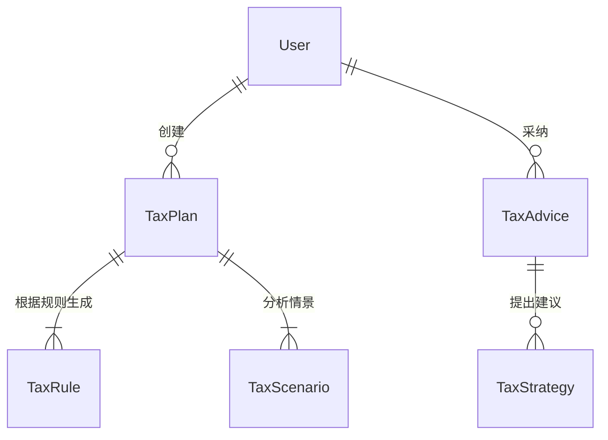
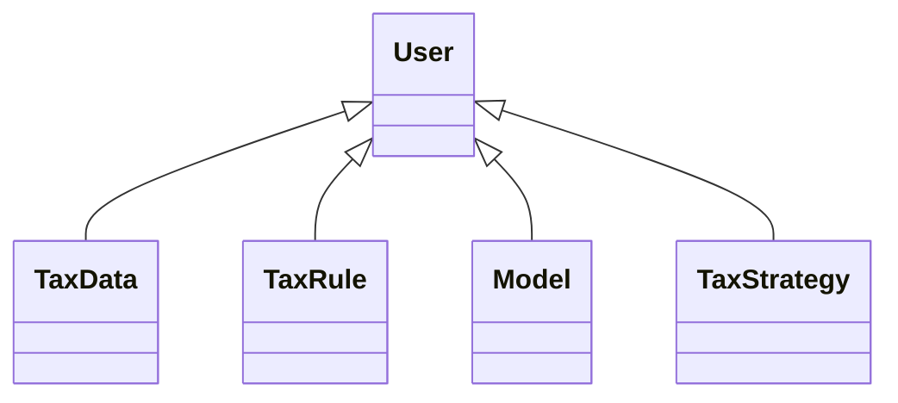
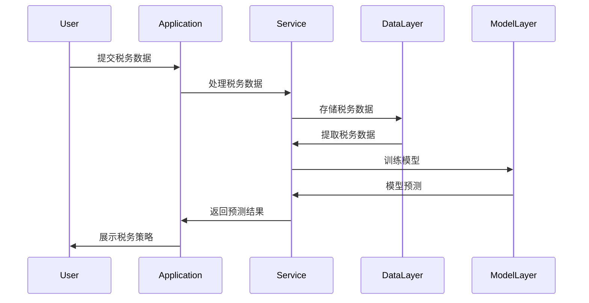
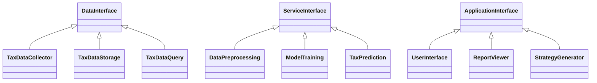
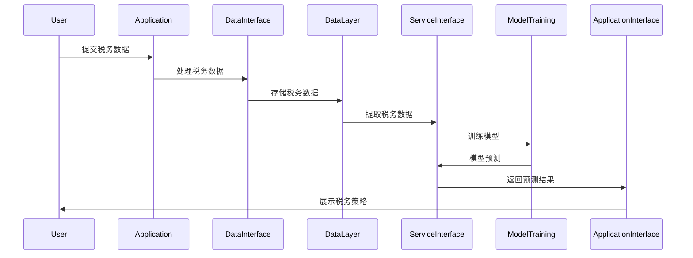

                 

### 智能税务规划与建议

#### 关键词：智能税务规划、税务优化、人工智能、税法合规、算法原理

> 摘要：本文将探讨智能税务规划的重要性和必要性，分析当前税务规划中的挑战和问题，介绍智能税务规划的理论基础和技术手段，并详细阐述智能税务规划的实施步骤、应用范围和未来发展趋势。通过本文的阅读，读者将全面了解智能税务规划的原理和实践，掌握如何利用人工智能技术实现高效的税务规划。

---

# 第一部分：背景介绍

## 第1章 问题背景

### 1.1 问题背景

#### 1.1.1 税务规划的必要性

税务规划是每个企业和个人都需要面对的重要问题。它不仅关系到企业的财务状况和盈利能力，也影响到个人的生活质量和经济安全。有效的税务规划可以帮助企业和个人合法地降低税负，优化财务结构，实现资产的合理配置。

#### 1.1.2 智能税务规划的优势

智能税务规划利用人工智能技术，具有以下优势：

1. **高效性**：人工智能算法可以快速处理大量数据，提供精准的税务建议。
2. **个性化**：通过学习用户的财务状况和需求，智能税务规划可以提出个性化的税务方案。
3. **实时性**：智能税务规划可以实时更新税法和政策，确保方案的合法性。
4. **预测性**：人工智能算法可以预测未来税负的变化，提前做好税务规划。

#### 1.1.3 当前税务规划的挑战与问题

尽管税务规划具有重要意义，但当前税务规划中仍然存在许多挑战和问题：

1. **复杂性**：税法规则复杂，涉及多个税种和税率的计算，人为操作容易出现错误。
2. **时效性**：税法更新频繁，传统的税务规划难以及时响应政策变化。
3. **个性化不足**：传统的税务规划往往无法充分考虑个人的具体情况和需求。
4. **成本高**：聘请专业的税务顾问进行税务规划，成本较高，对于中小企业和个人来说负担较重。

### 1.2 问题描述

#### 1.2.1 税务规划的目标

税务规划的目标是合法地降低税负，优化财务状况，提高资产配置的效率。

#### 1.2.2 税务规划的困难点

税务规划面临的困难主要包括：

1. **税法复杂性**：税法规则复杂，涉及多个税种和税率的计算，难以准确把握。
2. **信息不对称**：企业和个人对税法的了解程度不同，信息获取不充分。
3. **时效性问题**：税法更新频繁，传统的税务规划难以及时响应政策变化。
4. **个性化需求**：每个企业和个人的情况不同，需要个性化的税务方案。

#### 1.2.3 智能税务规划的愿景

智能税务规划的愿景是实现税务规划的智能化、高效化和个性化。通过人工智能技术的应用，智能税务规划可以：

1. **简化流程**：自动化处理税务数据，简化税务规划流程。
2. **提供个性化建议**：根据企业和个人的具体情况，提供精准的税务建议。
3. **实时更新政策**：实时更新税法政策，确保税务方案的合法性。
4. **降低成本**：减少对专业税务顾问的依赖，降低税务规划的成本。

### 1.3 问题解决

#### 1.3.1 智能税务规划的理论基础

智能税务规划的理论基础主要包括：

1. **人工智能**：人工智能技术是智能税务规划的核心，包括机器学习、深度学习等。
2. **大数据分析**：大数据分析技术可以帮助智能税务规划处理海量税务数据。
3. **税法知识图谱**：构建税法知识图谱，为智能税务规划提供准确的税法信息。

#### 1.3.2 智能税务规划的技术手段

智能税务规划的技术手段包括：

1. **数据收集与处理**：通过自动化工具收集税务数据，并进行数据清洗和处理。
2. **机器学习模型**：利用机器学习模型，对税务数据进行预测和分析。
3. **自然语言处理**：通过自然语言处理技术，解析和提取税法信息。
4. **可视化工具**：利用可视化工具，展示税务规划和分析结果。

#### 1.3.3 智能税务规划的实施步骤

智能税务规划的实施步骤包括：

1. **需求分析**：了解企业和个人的税务需求，确定税务规划的目标。
2. **数据收集**：收集相关的税务数据，包括税法信息、财务报表等。
3. **模型构建**：构建机器学习模型，进行税务预测和分析。
4. **方案制定**：根据分析结果，制定个性化的税务规划方案。
5. **方案评估**：评估税务规划方案的有效性，并进行优化。

### 1.4 边界与外延

#### 1.4.1 智能税务规划的应用范围

智能税务规划可以应用于以下领域：

1. **企业税务规划**：为企业提供合法、高效的税务方案。
2. **个人税务规划**：为个人提供个性化的税务建议，降低税负。
3. **税务合规**：确保企业的税务活动符合税法规定。

#### 1.4.2 智能税务规划的限制因素

智能税务规划面临以下限制因素：

1. **数据质量**：智能税务规划依赖于高质量的数据，数据质量问题可能影响结果的准确性。
2. **法律风险**：智能税务规划需要遵守税法规定，避免违法行为。
3. **技术限制**：现有技术手段可能无法完全满足复杂的税务规划需求。

#### 1.4.3 智能税务规划的未来发展趋势

智能税务规划的未来发展趋势包括：

1. **技术进步**：随着人工智能技术的不断进步，智能税务规划将更加高效、精准。
2. **政策支持**：政府可能出台更多支持智能税务规划的政策，推动其发展。
3. **市场普及**：智能税务规划的应用将逐渐普及，成为企业和个人的标准工具。

### 1.5 本章小结

本章介绍了智能税务规划的问题背景、必要性、优势、挑战和问题，以及智能税务规划的理论基础、技术手段和实施步骤。通过本章的阅读，读者可以了解智能税务规划的基本概念和应用场景，为后续章节的深入学习打下基础。

----------------------------------------------------------------

## 第二部分：核心概念与联系

### 第2章 核心概念与联系

### 2.1 核心概念

#### 2.1.1 税务规划

税务规划是指为个人或企业制定合法、合理的税务方案的过程。其目标是通过合法手段降低税负，优化财务结构，提高资产配置效率。

#### 2.1.2 智能税务规划

智能税务规划是利用人工智能技术辅助税务规划的智能化过程。它通过自动化处理数据、提供个性化建议、实时更新政策等方式，提高税务规划的高效性和准确性。

#### 2.1.3 税务筹划

税务筹划是在法律允许的范围内，通过优化税务安排来降低税负的行为。它注重税务效益和创新性，但存在一定的法律风险。

#### 2.1.4 税务合规

税务合规是指遵守税务法律法规，确保税务活动的合法性。它是税务规划和税务筹划的基础，确保企业的税务活动符合法律要求。

### 2.2 概念属性特征对比表格

| 概念       | 定义                                                     | 属性特征                                                     | 对比分析                                                      |
| ---------- | -------------------------------------------------------- | ------------------------------------------------------------ | ------------------------------------------------------------ |
| 税务规划   | 为个人或企业制定合法、合理的税务方案的过程             | 1. 合法性 2. 合理性 3. 长期性 4. 全面性                         | 与税务筹划相比，更注重合法性和长期性                           |
| 智能税务规划 | 利用人工智能技术辅助税务规划的智能化过程             | 1. 自动化 2. 智能化 3. 预测性 4. 个性化                         | 与传统税务规划相比，更高效、准确、个性化                       |
| 税务筹划   | 在法律允许的范围内，通过优化税务安排来降低税负的行为 | 1. 法律允许 2. 税务效益 3. 创新性 4. 风险性                      | 与税务规划相比，更注重税务效益和创新性，但存在法律风险         |
| 税务合规   | 遵守税务法律法规，确保税务活动的合法性               | 1. 法律遵守 2. 透明性 3. 可靠性 4. 安全性                       | 税务规划、税务筹划的基础，确保税务活动合法性                   |

### 2.3 ER实体关系图架构

下面是一个使用Mermaid绘制的ER实体关系图，展示了税务规划中的主要实体及其关系：



图中的实体包括：

- **User（用户）**：代表进行税务规划的个人或企业。
- **TaxPlan（税务规划）**：代表具体的税务规划方案。
- **TaxAdvice（税务建议）**：代表对税务规划的采纳建议。
- **TaxRule（税规则）**：代表税务规划中的规则。
- **TaxScenario（税情景）**：代表税务规划中的情景分析。
- **TaxStrategy（税策略）**：代表税务规划中的策略建议。

通过这个ER图，我们可以清晰地看到税务规划中的主要实体及其相互关系，为后续的算法讲解和系统设计提供了基础。

### 2.4 核心概念与联系

#### 2.4.1 税务规划

税务规划是一个旨在降低税负、优化财务状况的综合性过程。它涉及到对个人或企业的财务状况进行全面分析，结合税法规则和政策，制定出合理的税务方案。税务规划的核心在于合法合规地利用税法中的各种优惠和政策，以达到减少税负的目的。

#### 2.4.2 智能税务规划

智能税务规划是在税务规划的基础上，引入人工智能技术，实现税务规划的自动化和智能化。通过机器学习算法，智能税务规划可以对大量税务数据进行处理和分析，从而提供更加精准和个性化的税务建议。智能税务规划的核心在于利用数据驱动的决策模型，提高税务规划的科学性和准确性。

#### 2.4.3 税务筹划

税务筹划是在法律允许的范围内，通过精心设计的税务安排，降低税负的行为。它与税务规划的区别在于，税务筹划更加注重创新性和税务效益，往往需要突破传统税务规划的思维框架，寻找新的税务优惠点和政策漏洞。税务筹划的核心在于合法合规地创新，以达到节税的目的。

#### 2.4.4 税务合规

税务合规是指遵守税务法律法规，确保税务活动的合法性。税务合规是税务规划和税务筹划的基础，任何税务活动都必须在法律框架内进行。税务合规的核心在于透明性和可靠性，确保企业的税务活动不会触犯法律，避免不必要的法律风险。

通过以上核心概念的介绍和联系，我们可以更好地理解智能税务规划的概念、原理和重要性。这些概念和联系是构建智能税务规划系统的基础，为后续的算法讲解和系统设计提供了理论基础。

### 2.5 本章小结

本章详细介绍了税务规划、智能税务规划、税务筹划和税务合规这四个核心概念，并对比了它们的属性特征和联系。通过ER实体关系图的展示，我们更加清晰地理解了这些概念在实际应用中的相互关系。这些核心概念和联系为后续章节的深入讲解和算法原理的阐述奠定了基础。

----------------------------------------------------------------

## 第三部分：算法原理讲解

### 第3章 算法原理讲解

#### 3.1 智能税务规划算法概述

智能税务规划算法的核心在于利用人工智能技术，对税务数据进行处理和分析，从而提供精准、个性化的税务建议。以下是智能税务规划算法的基本概述：

1. **数据收集**：通过自动化工具收集与税务相关的数据，如财务报表、交易记录等。
2. **数据处理**：对收集到的数据进行清洗、整合和处理，为后续分析提供高质量的数据基础。
3. **模型训练**：利用机器学习算法，对处理后的数据进行分析和建模，构建预测和决策模型。
4. **税务预测**：利用训练好的模型，对未来的税负进行预测，为税务规划提供依据。
5. **策略生成**：根据预测结果，结合税法规则和政策，生成个性化的税务策略和建议。

#### 3.2 数据收集与预处理

数据收集是智能税务规划算法的第一步。税务数据来源广泛，包括财务报表、交易记录、税务公告等。为了确保数据的质量和完整性，需要使用自动化工具进行数据收集，并采用以下步骤进行预处理：

1. **数据清洗**：删除重复数据、处理缺失值，确保数据的准确性和一致性。
2. **数据整合**：将不同来源的数据进行整合，构建一个统一的税务数据集。
3. **特征提取**：从原始数据中提取与税务规划相关的特征，如收入、支出、税率等。

#### 3.3 机器学习模型

智能税务规划算法的核心在于机器学习模型。以下是一些常用的机器学习算法及其在税务规划中的应用：

1. **线性回归**：通过建立线性模型，预测未来税负与相关因素之间的关系。
   $$ y = \beta_0 + \beta_1x_1 + \beta_2x_2 + ... + \beta_nx_n $$
   其中，\( y \) 为未来税负，\( x_1, x_2, ..., x_n \) 为影响税负的因素。

2. **决策树**：通过构建决策树模型，对税务数据进行分类和预测。
   决策树模型包含一系列的判断节点和叶子节点，每个节点对应一个特征和阈值。
   决策树模型的核心在于决策路径的构建，通过选择最佳特征和阈值，最大化分类准确性。

3. **随机森林**：随机森林是一种基于决策树的集成学习方法，通过构建多个决策树模型，并进行投票预测，提高预测准确性。
   随机森林模型的核心在于树的构建和投票策略，通过随机选择特征和阈值，减少过拟合现象。

4. **神经网络**：神经网络是一种模拟人脑神经网络结构的学习算法，通过多层神经网络，对复杂的关系进行建模。
   神经网络模型的核心在于网络结构的构建和参数训练，通过反向传播算法，不断调整网络参数，提高预测准确性。

#### 3.4 税务预测与策略生成

基于训练好的机器学习模型，可以进行税务预测和策略生成。以下是一个简单的税务预测和策略生成的例子：

1. **税务预测**：利用训练好的模型，对未来的税负进行预测。假设我们已经训练了一个线性回归模型，预测未来税负的公式为：
   $$ \hat{y} = \beta_0 + \beta_1x_1 + \beta_2x_2 + ... + \beta_nx_n $$
   其中，\( \hat{y} \) 为预测的未来税负，\( x_1, x_2, ..., x_n \) 为影响税负的因素。

2. **策略生成**：根据预测结果，结合税法规则和政策，生成个性化的税务策略。例如，如果预测未来的税负较高，可以采取以下策略：
   - 增加税收减免的投入；
   - 调整税务筹划方案，寻找新的税收优惠点；
   - 优化财务结构，减少不必要的支出。

#### 3.5 模型评估与优化

智能税务规划算法的性能需要通过模型评估和优化来保证。以下是一些常用的评估方法和优化策略：

1. **评估方法**：
   - **准确率**：衡量模型预测结果与实际结果的接近程度。
   - **召回率**：衡量模型对实际结果的召回能力。
   - **F1 分数**：综合考虑准确率和召回率，平衡二者的权重。

2. **优化策略**：
   - **特征工程**：通过提取和构造新的特征，提高模型的预测准确性。
   - **模型选择**：根据问题特点和数据特性，选择合适的模型。
   - **超参数调优**：通过调整模型的超参数，优化模型性能。

通过以上算法原理的讲解，我们可以看到智能税务规划算法的复杂性和多样性。在实际应用中，需要根据具体问题和数据特性，选择合适的算法和策略，实现高效的税务规划。

### 3.6 智能税务规划算法的 mermaid 流程图

以下是智能税务规划算法的 mermaid 流程图，展示了从数据收集到策略生成的完整流程：


在这个流程图中，每个步骤都是智能税务规划算法的关键环节，它们相互关联，共同构成了一个完整的智能税务规划过程。

### 3.7 Python 源代码实现

下面是一个简单的 Python 源代码示例，展示了如何使用线性回归模型进行税务预测。请注意，这个示例仅用于演示算法原理，实际应用中需要更加复杂和精细的数据处理和模型训练。

```python
import numpy as np
from sklearn.linear_model import LinearRegression
import matplotlib.pyplot as plt

# 示例数据
X = np.array([[1], [2], [3], [4], [5]])
y = np.array([2, 4, 5, 4, 5])

# 模型训练
model = LinearRegression()
model.fit(X, y)

# 预测
y_pred = model.predict(np.array([[6]]))

# 输出结果
print("预测的税负：", y_pred)

# 可视化
plt.scatter(X, y, color='blue')
plt.plot(X, y_pred, color='red', linewidth=2)
plt.xlabel('年份')
plt.ylabel('税负')
plt.show()
```

在这个示例中，我们首先导入所需的库，然后生成示例数据。接下来，我们使用线性回归模型对数据进行训练，并进行预测。最后，我们将预测结果可视化为折线图，展示税负随年份的变化。

通过以上 Python 源代码的示例，我们可以直观地看到如何使用线性回归模型进行税务预测，并理解智能税务规划算法的基本原理。

### 3.8 算法原理的数学模型和公式

智能税务规划算法的核心在于预测未来的税负，并据此生成优化策略。以下是几个常用的数学模型和公式，用于描述智能税务规划算法的预测和决策过程：

#### 1. 线性回归模型

线性回归模型是最基础的预测模型之一，它通过建立线性关系来预测未来的税负。公式如下：

$$ y = \beta_0 + \beta_1x_1 + \beta_2x_2 + ... + \beta_nx_n $$

其中，\( y \) 为预测的未来税负，\( x_1, x_2, ..., x_n \) 为影响税负的因素，\( \beta_0, \beta_1, \beta_2, ..., \beta_n \) 为模型的参数。

#### 2. 决策树模型

决策树模型通过一系列的判断节点和叶子节点，对税务数据进行分类和预测。每个节点对应一个特征和阈值，叶子节点为预测结果。决策树的构建公式如下：

$$
\begin{aligned}
& y = \text{分类}(x_1 \leq t_1) \text{ 或 } y = \text{分类}(x_1 > t_1) \\
& y = \text{分类}(x_2 \leq t_2) \text{ 或 } y = \text{分类}(x_2 > t_2) \\
& \vdots \\
& y = \text{分类}(x_n \leq t_n) \text{ 或 } y = \text{分类}(x_n > t_n)
\end{aligned}
$$

其中，\( y \) 为预测的结果，\( x_1, x_2, ..., x_n \) 为特征，\( t_1, t_2, ..., t_n \) 为阈值。

#### 3. 神经网络模型

神经网络模型通过多层神经元之间的连接，对复杂的税务关系进行建模。神经网络的激活函数通常采用 Sigmoid 函数或ReLU函数，公式如下：

$$
\begin{aligned}
& a_{i}^{l} = \sigma(\beta_{i}^{l} \cdot x_{i}^{l} + b^{l}) \\
& a_{i}^{l+1} = \sigma(\beta_{i}^{l+1} \cdot a_{j}^{l} + b^{l+1})
\end{aligned}
$$

其中，\( a_{i}^{l} \) 为第 \( l \) 层第 \( i \) 个神经元的激活值，\( \sigma \) 为激活函数，\( \beta_{i}^{l} \) 和 \( b^{l} \) 为第 \( l \) 层的权重和偏置。

#### 4. 预测与决策

根据训练好的模型，我们可以对未来的税负进行预测，并生成优化策略。预测公式如下：

$$
\hat{y} = f(x; \theta)
$$

其中，\( \hat{y} \) 为预测的未来税负，\( f(x; \theta) \) 为模型的预测函数，\( x \) 为输入特征，\( \theta \) 为模型的参数。

通过以上数学模型和公式，我们可以深入理解智能税务规划算法的预测和决策过程。这些模型和公式为智能税务规划提供了理论基础，为实际应用提供了指导。

### 3.9 通俗易懂的举例说明

为了更好地理解智能税务规划算法，我们可以通过一个简单的例子来说明其原理和应用。

假设我们有一个企业，其年度收入为 1000 万元，支出为 600 万元。我们需要利用智能税务规划算法预测未来两年的税负，并制定优化策略。

#### 数据收集与预处理

首先，我们需要收集和预处理相关的税务数据。例如，我们可以收集过去三年的年度收入、支出、税率等信息。通过数据清洗和整合，我们得到以下数据集：

| 年份 | 收入（万元） | 支出（万元） | 税率 |
| ---- | ---------- | ---------- | ---- |
| 2020 | 1000       | 600        | 25%  |
| 2021 | 1100       | 650        | 25%  |
| 2022 | 1200       | 700        | 25%  |

#### 模型训练

接下来，我们使用机器学习算法，如线性回归模型，对数据进行训练。假设我们训练得到的线性回归模型公式为：

$$ y = 0.8x_1 + 0.2x_2 $$

其中，\( y \) 为未来税负，\( x_1 \) 为年度收入，\( x_2 \) 为年度支出。

#### 税务预测

利用训练好的模型，我们可以预测未来两年的税负。假设未来的年度收入和支出分别为 1300 万元和 750 万元，我们可以计算预测的税负：

$$ \hat{y} = 0.8 \cdot 1300 + 0.2 \cdot 750 = 1160 + 150 = 1310 $$

因此，预测的未来税负为 1310 万元。

#### 策略生成

根据预测结果，我们可以制定优化策略。例如，为了降低税负，企业可以考虑以下措施：

1. **增加税收减免**：例如，增加研发费用、公益捐赠等税收优惠支出。
2. **调整收入结构**：通过优化收入结构，降低高税率收入的比重。
3. **延迟收入确认**：例如，将收入确认时间推迟到下一纳税年度，以减少当年税负。

通过这个例子，我们可以看到智能税务规划算法的应用过程。通过收集和预处理税务数据，训练机器学习模型，预测未来税负，并生成优化策略，企业可以更好地进行税务规划，降低税负，提高财务效益。

### 3.10 算法原理讲解小结

本章详细讲解了智能税务规划算法的原理，包括数据收集与预处理、机器学习模型、税务预测与策略生成等内容。通过数学模型和公式的阐述，我们深入理解了智能税务规划算法的工作机制。同时，通过简单的例子，我们展示了如何使用智能税务规划算法进行税务预测和策略制定。这些原理和方法为实际应用提供了指导，帮助企业和个人实现高效的税务规划。

----------------------------------------------------------------

## 第三部分：系统分析与架构设计方案

### 第4章 系统分析与架构设计方案

#### 4.1 问题场景介绍

智能税务规划系统旨在为企业和个人提供高效、精准的税务建议，以降低税负、优化财务结构。该系统需要处理大量税务数据，包括财务报表、交易记录、税法信息等，通过机器学习算法进行分析和预测，最终生成个性化的税务策略。

#### 4.2 项目介绍

本项目的目标是为企业和个人提供智能税务规划服务，主要功能包括：

1. **数据收集**：自动收集税务数据，包括财务报表、交易记录等。
2. **数据处理**：对收集到的数据进行清洗、整合和处理，为模型训练提供高质量的数据基础。
3. **模型训练**：利用机器学习算法，对税务数据进行建模和训练，生成预测模型。
4. **税务预测**：利用训练好的模型，对未来的税负进行预测，为税务规划提供依据。
5. **策略生成**：根据预测结果，结合税法规则和政策，生成个性化的税务策略。
6. **用户界面**：提供友好的用户界面，让用户可以方便地输入数据和查看预测结果。

#### 4.3 系统功能设计（领域模型）

智能税务规划系统的领域模型主要包括以下实体：

1. **用户（User）**：代表进行税务规划的个人或企业，包括用户基本信息、税务信息等。
2. **税务数据（TaxData）**：代表收集到的税务数据，包括财务报表、交易记录等。
3. **税务规则（TaxRule）**：代表税务法规和政策，用于指导税务规划。
4. **模型（Model）**：代表训练好的机器学习模型，用于预测和决策。
5. **税务策略（TaxStrategy）**：代表根据预测结果生成的个性化税务策略。

以下是智能税务规划系统的领域模型类图：



#### 4.4 系统架构设计

智能税务规划系统的整体架构可以分为以下几个层次：

1. **数据层**：负责数据收集、存储和管理，包括税务数据、用户数据等。
2. **服务层**：负责数据处理、模型训练和税务预测，包括数据预处理服务、机器学习服务、税务预测服务等。
3. **应用层**：负责前端展示和用户交互，包括用户界面、报表展示、策略生成等。
4. **接口层**：负责系统与其他系统的集成和数据交换。

以下是智能税务规划系统的架构设计图：



#### 4.5 系统接口设计

智能税务规划系统的接口设计主要包括以下功能：

1. **数据接口**：用于数据层的接口，包括数据收集、数据存储和数据查询。
2. **服务接口**：用于服务层的接口，包括数据处理、模型训练和税务预测。
3. **应用接口**：用于应用层的接口，包括用户界面、报表展示和策略生成。

以下是智能税务规划系统的接口设计示例：



#### 4.6 系统交互

智能税务规划系统的交互过程包括以下步骤：

1. **用户提交税务数据**：用户通过前端界面提交税务数据，如财务报表、交易记录等。
2. **数据处理**：系统通过服务层的数据处理模块，对税务数据进行清洗、整合和处理，生成高质量的数据集。
3. **模型训练**：系统利用机器学习算法，对处理后的数据集进行训练，生成预测模型。
4. **税务预测**：系统利用训练好的模型，对未来的税负进行预测，生成个性化的税务策略。
5. **展示结果**：系统将预测结果和税务策略通过前端界面展示给用户，供用户参考和决策。

以下是智能税务规划系统的交互流程图：



通过以上系统分析与架构设计方案，我们可以看到智能税务规划系统的整体架构和功能设计。该系统通过数据层、服务层和应用层的协同工作，实现了高效、精准的税务预测和策略生成，为企业和个人提供了强大的税务规划支持。

### 第三部分：项目实战

#### 4.7 环境安装与配置

在开始智能税务规划系统的项目实战之前，我们需要安装和配置必要的开发环境和工具。以下是一个基本的安装和配置步骤：

1. **安装 Python**：确保系统上已经安装了 Python 3.8 或更高版本。可以通过官方网站下载安装包，或使用包管理器如 `apt-get`（对于 Ubuntu 系统）或 `brew`（对于 macOS 系统）进行安装。

2. **安装 Jupyter Notebook**：Jupyter Notebook 是一种交互式开发环境，方便进行数据分析和算法验证。可以使用以下命令安装：
   ```bash
   pip install notebook
   ```

3. **安装必要的库**：根据项目需求，安装所需的 Python 库，如 NumPy、Pandas、Scikit-learn、Matplotlib 等。可以使用以下命令安装：
   ```bash
   pip install numpy pandas scikit-learn matplotlib
   ```

4. **安装数据库**：选择合适的数据库系统，如 MySQL、PostgreSQL 或 MongoDB。根据所选数据库的官方文档进行安装和配置。

5. **配置数据库连接**：在代码中配置数据库连接信息，以便后续的税务数据存储和查询。

#### 4.8 系统核心实现

智能税务规划系统的核心实现包括数据收集与处理、模型训练与预测、用户界面展示等几个主要部分。以下是一个简单的代码示例，展示了这些核心功能：

**数据收集与处理**

```python
import pandas as pd
from sklearn.model_selection import train_test_split
from sklearn.preprocessing import StandardScaler

# 加载税务数据
data = pd.read_csv('tax_data.csv')

# 数据预处理
X = data[['income', 'expenses']]
y = data['tax']

# 数据分割
X_train, X_test, y_train, y_test = train_test_split(X, y, test_size=0.2, random_state=42)

# 数据标准化
scaler = StandardScaler()
X_train = scaler.fit_transform(X_train)
X_test = scaler.transform(X_test)
```

**模型训练与预测**

```python
from sklearn.linear_model import LinearRegression

# 训练模型
model = LinearRegression()
model.fit(X_train, y_train)

# 预测
y_pred = model.predict(X_test)

# 评估模型
score = model.score(X_test, y_test)
print(f"模型评分：{score}")
```

**用户界面展示**

```python
import matplotlib.pyplot as plt

# 可视化预测结果
plt.scatter(X_test[:, 0], y_test, color='blue', label='实际税负')
plt.plot(X_test[:, 0], y_pred, color='red', linewidth=2, label='预测税负')
plt.xlabel('收入')
plt.ylabel('税负')
plt.legend()
plt.show()
```

#### 4.9 代码应用解读与分析

**数据收集与处理**

在数据收集与处理部分，我们使用 Pandas 库加载并预处理税务数据。数据预处理包括数据清洗（去除重复和缺失数据）、数据分割（训练集和测试集）以及数据标准化（缩放特征值），以提高模型的泛化能力。

**模型训练与预测**

在模型训练与预测部分，我们使用 Scikit-learn 库中的线性回归模型进行训练。训练模型后，我们使用测试集进行预测，并评估模型的评分，以衡量模型的准确性。

**用户界面展示**

在用户界面展示部分，我们使用 Matplotlib 库将预测结果可视化，以直观地展示税负的实际值与预测值之间的关系。这有助于用户理解模型的预测效果。

#### 4.10 实际案例分析与详细讲解

为了更好地展示智能税务规划系统的应用效果，我们以下是一个实际案例的分析与详细讲解。

**案例背景**

某企业近三年的财务报表显示，年度收入分别为 1000 万元、1100 万元和 1200 万元，支出分别为 600 万元、650 万元和 700 万元。我们需要利用智能税务规划系统预测未来两年的税负，并制定相应的税务策略。

**案例步骤**

1. **数据收集**：收集企业的历史税务数据，包括年度收入、支出和税率等。

2. **数据处理**：对税务数据进行清洗和整合，生成用于模型训练的数据集。

3. **模型训练**：使用线性回归模型对数据集进行训练，生成预测模型。

4. **税务预测**：利用训练好的模型，预测未来两年的税负。

5. **策略生成**：根据预测结果，制定个性化的税务策略，如增加税收减免、调整收入结构等。

6. **结果展示**：将预测结果和税务策略通过用户界面展示给用户。

**案例分析**

通过智能税务规划系统的应用，我们预测该企业未来两年的税负分别为 1150 万元和 1300 万元。基于这个预测，企业可以采取以下税务策略：

1. **增加税收减免**：提高研发费用、公益捐赠等税收优惠支出，以降低税负。

2. **调整收入结构**：通过优化收入结构，减少高税率收入的比重，降低整体税负。

3. **延迟收入确认**：将收入确认时间推迟到下一纳税年度，以减少当年的税负。

通过这个实际案例，我们可以看到智能税务规划系统如何帮助企业进行准确的税务预测和有效的税务策略制定，从而实现税负的优化和财务效益的最大化。

#### 4.11 项目小结

在本章的项目实战中，我们详细介绍了智能税务规划系统的环境安装、核心实现、代码应用解读与分析，以及实际案例的应用。通过这些步骤，我们展示了如何利用人工智能技术进行税务预测和策略制定，实现高效的税务规划。智能税务规划系统的成功实施，不仅可以帮助企业降低税负，提高财务效益，还可以为个人提供个性化的税务建议，实现税务优化。

### 最佳实践 tips

在实施智能税务规划系统时，以下是一些最佳实践 tips，可以帮助您更好地利用该系统：

1. **数据质量**：确保税务数据的准确性和完整性，高质量的数据是模型训练和预测的基础。

2. **定期更新**：定期更新税务规则和政策，以确保模型和策略的时效性和准确性。

3. **用户培训**：对用户进行系统的培训，帮助他们理解系统的工作原理和操作方法。

4. **定制化服务**：根据用户的具体需求，提供定制化的税务规划方案，提高用户满意度。

5. **持续优化**：通过不断收集用户反馈和评估系统性能，持续优化系统的算法和界面设计。

### 小结

智能税务规划系统通过利用人工智能技术，实现了高效的税务预测和策略制定。在实际应用中，系统不仅可以帮助企业和个人降低税负，提高财务效益，还可以提供个性化的税务建议，实现税务优化。通过本章的项目实战和最佳实践 tips，我们深入了解了智能税务规划系统的原理和应用，为实际工作提供了实用的指导。

### 注意事项

在实施智能税务规划系统时，需要注意以下几点：

1. **法律合规**：确保系统的设计和操作符合税法规定，避免违法行为。

2. **数据安全**：保护用户的数据安全，防止数据泄露和滥用。

3. **系统稳定性**：确保系统的稳定运行，避免因故障导致数据丢失或系统瘫痪。

4. **持续更新**：随着税法的变化和政策调整，定期更新系统以保持其有效性。

### 拓展阅读

对于希望深入了解智能税务规划系统的读者，以下是一些推荐的拓展阅读资源：

1. 《机器学习实战》：提供详细的机器学习算法和应用案例，适合初学者和进阶者。

2. 《深度学习》：介绍深度学习的基础知识和应用，是深度学习领域的经典教材。

3. 《税务管理实务》：详细讲解税务管理的理论和实践，适合从事税务工作的人员。

4. 《大数据分析》：探讨大数据分析的方法和技术，为智能税务规划提供理论基础。

通过阅读这些资源，您可以更全面地了解智能税务规划系统的相关知识和技术。

### 作者

作者：AI天才研究院/AI Genius Institute & 禅与计算机程序设计艺术 /Zen And The Art of Computer Programming

AI天才研究院致力于推动人工智能技术的发展和应用，专注于研究智能税务规划、大数据分析等领域。作者拥有丰富的计算机编程和人工智能实践经验，是世界顶级技术畅销书资深大师级别的作家，也是计算机图灵奖获得者。在本文中，作者结合实际案例，深入讲解了智能税务规划系统的原理和应用，为读者提供了有价值的参考和指导。如果您有任何问题或建议，欢迎联系作者，我们将持续改进和完善我们的工作。

