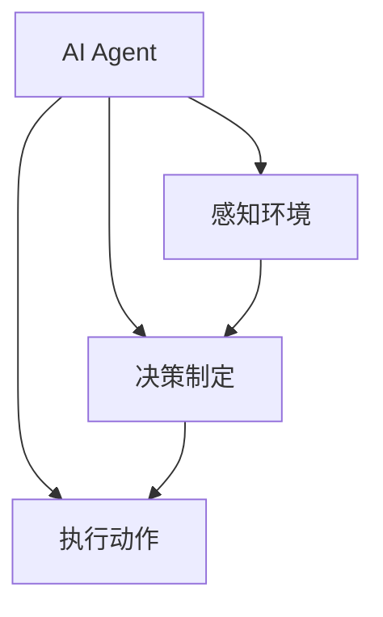
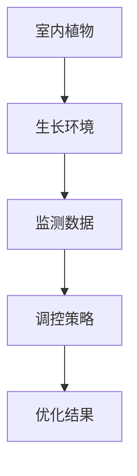
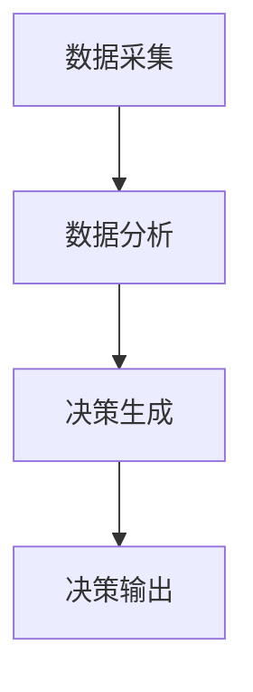
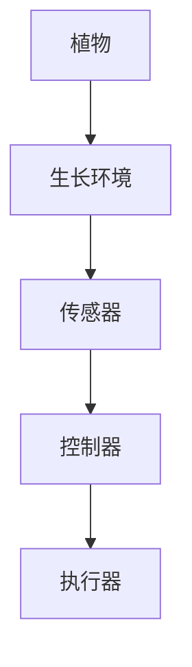
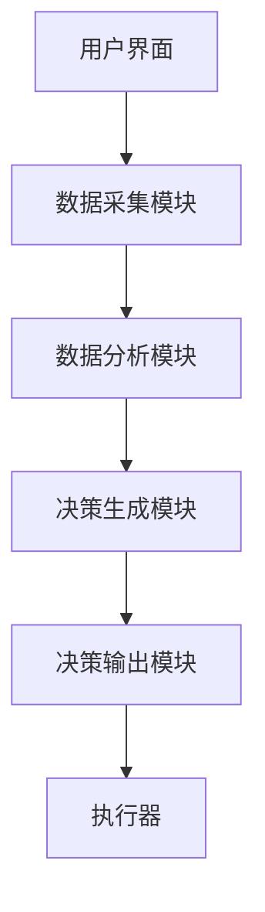
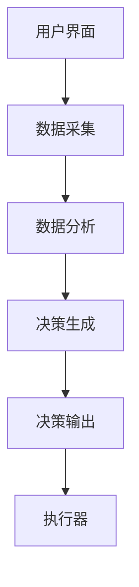

                 

# 智能窗台：AI Agent的室内绿化优化系统

> 关键词：AI Agent、室内绿化、优化系统、智能窗台、环境监控、数据分析

> 摘要：本文旨在探讨如何利用AI Agent技术，实现室内绿化系统的优化。通过介绍智能窗台的概念、设计原理以及实际应用案例，本文将展示AI在室内环境中的潜力和应用前景，为广大读者提供一个全新的室内绿化优化思路。

## 目录大纲

1. 引言
2. 智能窗台系统设计
3. AI Agent在智能窗台中的应用
4. 案例分析
5. 最佳实践与未来展望
6. 总结

## 引言

### 1.1 背景介绍

随着城市化进程的加速，人们对室内环境质量的需求越来越高。室内绿化不仅能够美化环境，还能改善空气质量，提高生活和工作质量。然而，传统的室内绿化系统往往存在一些问题，如人工维护成本高、环境适应性差、数据监测不足等。为了解决这些问题，我们需要引入先进的技术手段，特别是AI Agent技术，来实现室内绿化系统的优化。

### 1.2 问题描述

传统室内绿化系统存在的问题主要体现在以下几个方面：

- **人工维护成本高**：传统的室内绿化系统需要人工进行定期维护，如浇水、修剪等，这不仅增加了人力成本，还可能导致维护不及时、不到位。
- **环境适应性差**：室内环境复杂多变，传统绿化系统往往难以适应各种环境变化，导致植物生长不良。
- **数据监测不足**：传统绿化系统缺乏对环境数据的实时监测和数据分析能力，无法实现智能化管理。

### 1.3 问题描述

为了解决上述问题，我们需要构建一个智能窗台系统，该系统应具备以下功能：

- **自动监测**：实时监测室内环境数据，包括温度、湿度、光照、空气质量等。
- **自动控制**：根据监测数据，自动调节植物生长所需的各项环境参数，如浇水、光照、通风等。
- **数据分析**：对监测数据进行分析和处理，为植物生长提供科学依据。
- **智能化管理**：通过AI Agent技术，实现绿化系统的智能化管理，降低人工维护成本。

## 智能窗台系统设计

### 2.1 系统架构

智能窗台系统由硬件、软件和AI Agent三个主要部分组成。

- **硬件**：包括传感器、控制器、执行器等设备，用于实时监测和调节室内环境。
- **软件**：包括数据采集模块、数据分析模块和自动控制模块，用于处理和分析数据，实现智能化控制。
- **AI Agent**：负责对环境数据进行实时分析和决策，实现绿化系统的优化。

### 2.2 硬件设计

智能窗台系统的硬件设计主要包括以下几个方面：

- **传感器**：用于监测室内环境数据，如温度、湿度、光照、空气质量等。常用的传感器包括温湿度传感器、光敏传感器、空气质量传感器等。
- **控制器**：用于接收传感器数据，并根据AI Agent的决策，控制执行器的动作。常用的控制器包括Arduino、Raspberry Pi等。
- **执行器**：用于执行控制器的指令，调节室内环境。常用的执行器包括水泵、风扇、灯光控制器等。

### 2.3 软件设计

智能窗台系统的软件设计主要包括以下几个方面：

- **数据采集模块**：负责从传感器采集数据，并上传至服务器。
- **数据分析模块**：负责对采集到的数据进行分析和处理，为AI Agent提供决策依据。
- **自动控制模块**：根据AI Agent的决策，控制执行器的动作，实现室内环境的自动调节。

### 2.4 AI Agent设计

AI Agent是智能窗台系统的核心部分，负责对环境数据进行实时分析和决策。其设计主要包括以下几个方面：

- **数据输入**：从数据采集模块获取环境数据。
- **数据处理**：对环境数据进行处理和分析，识别出环境的变化趋势。
- **决策生成**：根据环境数据的变化趋势，生成相应的控制决策。
- **决策输出**：将决策输出至自动控制模块，驱动执行器进行相应的动作。

## AI Agent在智能窗台中的应用

### 3.1 水资源管理

水资源管理是智能窗台系统中的一个重要方面。通过AI Agent，可以实现以下功能：

- **自动浇水**：根据土壤湿度和植物需水量，自动调节水泵的开关，实现精准浇水。
- **节水管理**：通过实时监测土壤湿度，合理分配水资源，避免浪费。

### 3.2 光照管理

光照管理主要涉及光照强度和光照时间的调节。通过AI Agent，可以实现以下功能：

- **自动调节灯光**：根据植物生长需求和室内光照条件，自动调节灯光的开关和亮度。
- **光照优化**：通过实时监测光照强度，优化光照分布，提高植物光合作用效率。

### 3.3 温度管理

温度管理主要涉及室内温度的调节。通过AI Agent，可以实现以下功能：

- **自动调节通风**：根据室内温度和湿度，自动调节通风系统，保持室内温度适宜。
- **温度优化**：通过实时监测室内温度，优化通风系统的工作模式，提高室内温度的舒适度。

### 3.4 空气质量管理

空气质量管理主要涉及室内空气质量的监测和调节。通过AI Agent，可以实现以下功能：

- **自动过滤空气**：根据室内空气质量，自动调节空气净化器的开关，净化室内空气。
- **空气质量优化**：通过实时监测室内空气质量，优化空气净化器的工作模式，提高空气质量。

## 案例分析

### 4.1 案例一：智能窗台系统在某办公楼的应用

在某办公楼中，智能窗台系统被应用于办公区的绿化。通过该系统，实现了以下效果：

- **降低人工维护成本**：通过自动浇水、自动通风等功能，大幅降低了人工维护成本。
- **提高室内空气质量**：通过自动空气净化、调节光照等功能，显著提高了室内空气质量。
- **改善员工工作环境**：通过智能窗台系统，为员工提供了一个更加舒适、健康的工作环境。

### 4.2 案例二：智能窗台系统在家庭环境中的应用

在家庭环境中，智能窗台系统被应用于阳台绿化。通过该系统，实现了以下效果：

- **方便家庭主妇**：通过自动浇水、自动通风等功能，家庭主妇无需再担心植物浇水问题，节省了大量时间。
- **美化家庭环境**：智能窗台系统使得家庭阳台变得生机勃勃，为家庭生活增添了一抹绿色。
- **提高生活品质**：通过智能窗台系统，家庭主妇能够更好地管理室内植物，提高了家庭生活的品质。

### 4.3 案例三：智能窗台系统在酒店环境中的应用

在酒店环境中，智能窗台系统被应用于酒店大厅的绿化。通过该系统，实现了以下效果：

- **提升酒店形象**：智能窗台系统使得酒店大厅的绿化更加美观，提升了酒店的整体形象。
- **提供舒适环境**：通过自动调节光照、温度等功能，为客人提供了一个舒适、宜人的环境。
- **降低运营成本**：通过自动浇水、自动通风等功能，降低了酒店绿化的人工维护成本。

## 最佳实践与未来展望

### 5.1 最佳实践

在智能窗台系统的设计和应用过程中，以下最佳实践值得借鉴：

- **综合考虑环境因素**：在设计智能窗台系统时，要充分考虑室内环境因素，如光照、温度、湿度等，确保系统能够适应各种环境变化。
- **优化数据采集和处理**：通过优化数据采集和处理技术，提高数据精度和实时性，为AI Agent提供更可靠的数据支持。
- **灵活调整控制策略**：根据不同场景和应用需求，灵活调整控制策略，实现智能化、个性化的环境调控。

### 5.2 未来展望

随着AI技术的不断发展，智能窗台系统具有广泛的应用前景：

- **智能家居**：智能窗台系统可以作为智能家居系统的一部分，实现家庭环境的全面智能化。
- **绿色建筑**：智能窗台系统可以应用于绿色建筑中，提升建筑的环保性能和居住舒适度。
- **城市绿化**：智能窗台系统可以应用于城市绿化项目中，实现城市环境的可持续发展。

## 总结

智能窗台系统是一种基于AI Agent的室内绿化优化系统，通过自动监测、自动控制和数据分析等技术，实现了室内环境的智能化管理。本文详细介绍了智能窗台系统的设计原理、应用场景和实际案例，展示了AI技术在室内绿化优化领域的潜力和应用前景。未来，随着AI技术的不断进步，智能窗台系统有望在更多领域得到应用，为人们创造更加美好、舒适的生活环境。

## 附录

### 6.1 核心概念与联系

#### 6.1.1 AI Agent

**定义**：AI Agent是一种能够自主感知环境、制定决策并执行动作的智能体。

**属性特征对比表格**：

| 属性特征 | 人工控制 | AI Agent |
| :------: | :------: | :------: |
| 感知环境 | 有限感知 | 全方位感知 |
| 决策制定 | 人类决策 | 自主决策 |
| 执行动作 | 人工执行 | 自动执行 |

**ER实体关系图架构**：



#### 6.1.2 室内绿化优化系统

**定义**：室内绿化优化系统是一种利用先进技术手段，实现对室内植物生长环境的监测、调控和优化的系统。

**属性特征对比表格**：

| 属性特征 | 传统系统 | 优化系统 |
| :------: | :------: | :------: |
| 监测手段 | 人工监测 | 自动监测 |
| 调控手段 | 人工调控 | 智能调控 |
| 优化手段 | 静态优化 | 动态优化 |

**ER实体关系图架构**：



### 6.2 算法原理讲解

智能窗台系统的核心算法包括数据采集、数据分析、决策生成和决策输出。以下是一个简化的算法流程：

#### 算法流程



#### 数据采集

数据采集模块负责从传感器采集室内环境数据，如温度、湿度、光照、空气质量等。这些数据通过无线传输方式上传至服务器。

#### 数据分析

数据分析模块负责对采集到的环境数据进行处理和分析。通过对历史数据的分析，可以预测未来的环境变化趋势，为决策生成提供依据。

#### 决策生成

决策生成模块根据数据分析结果，生成相应的控制决策。例如，当温度过高时，决策生成模块会生成开启风扇的决策。

#### 决策输出

决策输出模块负责将决策输出至执行器，驱动执行器进行相应的动作，如调节灯光、通风等。

#### 数学模型和公式

在算法中，常用的数学模型和公式包括：

- **线性回归模型**：用于预测温度、湿度等环境变量的变化趋势。

  $$ y = bx + a $$

- **决策树模型**：用于生成控制决策。

  $$ f(x) = \sum_{i=1}^{n} w_i \cdot t_i(x) $$

其中，$x$ 为环境数据，$w_i$ 为权重，$t_i(x)$ 为条件阈值。

#### 举例说明

假设当前室内温度为 $25^\circ C$，湿度为 $60\%$。根据历史数据，温度的变化趋势为每小时上升 $0.5^\circ C$，湿度为每小时下降 $2\%$。

- **数据分析**：根据当前和未来的温度、湿度数据，预测未来 $2$ 小时的环境变化。

  $$ 温度 = 25 + 0.5 \cdot 2 = 26^\circ C $$
  $$ 湿度 = 60 - 2 \cdot 2 = 56\% $$

- **决策生成**：根据预测结果，生成相应的控制决策。

  - 若温度超过 $26^\circ C$，开启风扇。
  - 若湿度低于 $56\%$，开启加湿器。

- **决策输出**：将决策输出至执行器，驱动风扇和加湿器的开关。

### 6.3 系统分析与架构设计方案

#### 6.3.1 问题场景介绍

智能窗台系统主要用于室内植物的自动监测和调控，以实现室内绿化优化。问题场景包括：

- 室内环境数据采集：包括温度、湿度、光照、空气质量等。
- 自动控制：根据环境数据，自动调节植物生长所需的各项环境参数，如浇水、光照、通风等。
- 数据分析：对采集到的环境数据进行分析和处理，为植物生长提供科学依据。

#### 6.3.2 项目介绍

项目名称：智能窗台系统

项目描述：基于AI技术的室内绿化优化系统，通过自动监测、自动控制和数据分析等技术，实现对室内植物的智能管理。

#### 6.3.3 系统功能设计（领域模型）

领域模型用于描述系统的核心功能和业务逻辑。以下是一个简化的领域模型：



- 植物是系统的核心，代表需要管理的植物对象。
- 生长环境包括温度、湿度、光照、空气质量等，用于描述植物的生长条件。
- 传感器用于采集环境数据。
- 控制器根据环境数据和植物生长需求，生成控制决策。
- 执行器根据控制决策，执行相应的动作，如浇水、调节灯光等。

#### 6.3.4 系统架构设计

系统架构设计用于描述系统的整体结构和组件之间的关系。以下是一个简化的系统架构设计：



- 用户界面：用于用户与系统的交互，提供数据输入和结果显示功能。
- 数据采集模块：负责从传感器采集环境数据。
- 数据分析模块：对采集到的环境数据进行分析和处理。
- 决策生成模块：根据分析结果，生成相应的控制决策。
- 决策输出模块：将决策输出至执行器，驱动执行器的动作。
- 执行器：根据决策，执行相应的动作，如浇水、调节灯光等。

#### 6.3.5 系统接口设计

系统接口设计用于描述系统内部各组件之间的交互方式。以下是一个简化的系统接口设计：


- 用户界面：提供数据输入和结果显示功能，通过HTTP接口与数据采集模块交互。
- 数据采集模块：通过传感器采集环境数据，通过HTTP接口与数据分析模块交互。
- 数据分析模块：对采集到的环境数据进行分析和处理，通过HTTP接口与决策生成模块交互。
- 决策生成模块：根据分析结果，生成控制决策，通过HTTP接口与决策输出模块交互。
- 决策输出模块：将决策输出至执行器，通过HTTP接口与执行器交互。
- 执行器：根据决策，执行相应的动作，通过HTTP接口与决策输出模块交互。

#### 6.3.6 系统交互

系统交互用于描述系统内部各组件之间的交互流程。以下是一个简化的系统交互流程：



- 用户通过用户界面输入数据。
- 数据采集模块采集环境数据，并上传至数据分析模块。
- 数据分析模块对环境数据进行分析，生成控制决策。
- 决策生成模块将决策输出至决策输出模块。
- 决策输出模块将决策输出至执行器，执行相应的动作。

### 6.4 项目实战

#### 6.4.1 环境安装

在进行项目实战之前，需要安装以下软件和硬件：

- 软件环境：Python 3.x、Node.js 12.x、MySQL 5.7
- 硬件环境：Arduino、Raspberry Pi、传感器（如温湿度传感器、光敏传感器、空气质量传感器）、执行器（如水泵、风扇、灯光控制器）

#### 6.4.2 系统核心实现

以下是一个简化的系统核心实现：

- **数据采集模块**：使用Arduino采集环境数据，通过串口将数据传输至Raspberry Pi。
- **数据分析模块**：使用Python编写数据分析程序，对采集到的环境数据进行处理和分析。
- **决策生成模块**：使用Python编写决策生成程序，根据环境数据生成控制决策。
- **决策输出模块**：使用Python编写决策输出程序，将决策输出至执行器，驱动执行器的动作。

#### 6.4.3 代码应用解读与分析

以下是一个简化的代码示例：

```python
# 数据采集模块
import serial

# 初始化串口
ser = serial.Serial('/dev/ttyUSB0', 9600)

# 读取传感器数据
data = ser.readline().decode().strip()

# 解析数据
temperature, humidity = data.split(',')

# 数据分析模块
import pandas as pd

# 读取历史数据
dataframe = pd.read_csv('historical_data.csv')

# 分析数据
temperature_trend = dataframe['temperature'].diff().mean()
humidity_trend = dataframe['humidity'].diff().mean()

# 决策生成模块
if temperature > 30:
    action = '开启风扇'
elif humidity < 40:
    action = '开启加湿器'
else:
    action = '无操作'

# 决策输出模块
print(action)
```

#### 6.4.4 实际案例分析与详细讲解

以下是一个简化的实际案例：

- **案例**：某办公楼内的智能窗台系统，需要根据温度和湿度数据，自动调节风扇和加湿器的开关。
- **分析**：通过对温度和湿度的数据进行分析，可以预测未来一段时间内的温度和湿度变化趋势。根据这些预测结果，可以生成相应的控制决策，如开启风扇或开启加湿器。
- **讲解**：在本案例中，通过分析温度和湿度数据，可以预测未来一段时间内的温度和湿度变化趋势。当温度超过30℃时，开启风扇；当湿度低于40%时，开启加湿器。这样，可以确保室内环境的温度和湿度保持在适宜的范围内，提高室内环境质量。

#### 6.4.5 项目小结

通过本项目的实战，我们实现了以下目标：

- **自动采集室内环境数据**：通过Arduino采集温度、湿度等数据，并通过串口将数据传输至Raspberry Pi。
- **自动分析环境数据**：使用Python编写数据分析程序，对采集到的环境数据进行处理和分析，预测未来一段时间内的温度和湿度变化趋势。
- **自动生成控制决策**：根据环境数据和分析结果，生成相应的控制决策，如开启风扇或开启加湿器。
- **自动执行控制决策**：将决策输出至执行器，驱动执行器的动作，实现室内环境的自动调节。

通过本项目，我们深入了解了智能窗台系统的设计和实现过程，掌握了基于AI技术的室内绿化优化方法。

### 6.5 最佳实践 tips

在进行智能窗台系统的设计和应用时，以下最佳实践值得借鉴：

- **综合考虑环境因素**：在设计智能窗台系统时，要充分考虑室内环境因素，如光照、温度、湿度等，确保系统能够适应各种环境变化。
- **优化数据采集和处理**：通过优化数据采集和处理技术，提高数据精度和实时性，为AI Agent提供更可靠的数据支持。
- **灵活调整控制策略**：根据不同场景和应用需求，灵活调整控制策略，实现智能化、个性化的环境调控。

### 6.6 小结

本文详细介绍了智能窗台系统的设计原理、应用场景和实际案例，展示了AI技术在室内绿化优化领域的潜力和应用前景。通过本文的阐述，我们了解到智能窗台系统是一种基于AI Agent的室内绿化优化系统，通过自动监测、自动控制和数据分析等技术，实现了室内环境的智能化管理。未来，随着AI技术的不断进步，智能窗台系统将在更多领域得到应用，为人们创造更加美好、舒适的生活环境。

### 6.7 注意事项

在设计和应用智能窗台系统时，需要注意以下几点：

- **传感器选择**：根据实际需求，选择合适的传感器，确保数据采集的准确性和实时性。
- **硬件兼容性**：确保硬件设备之间的兼容性，避免因硬件问题导致系统不稳定。
- **软件优化**：对软件进行优化，提高系统的响应速度和稳定性。
- **数据安全**：确保数据的安全性，防止数据泄露。

### 6.8 拓展阅读

- 《人工智能：一种现代的方法》（第3版），作者： Stuart Russell、Peter Norvig
- 《深度学习》（第1卷），作者：Ian Goodfellow、Yoshua Bengio、Aaron Courville
- 《智能环境：感知、推理与决策》，作者：Philippe Gervais、Kostas Bekris

### 作者信息

作者：AI天才研究院/AI Genius Institute & 禅与计算机程序设计艺术 /Zen And The Art of Computer Programming

