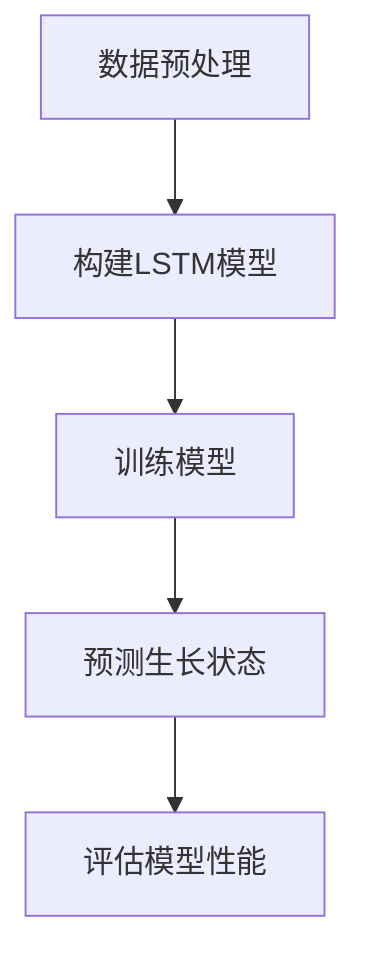
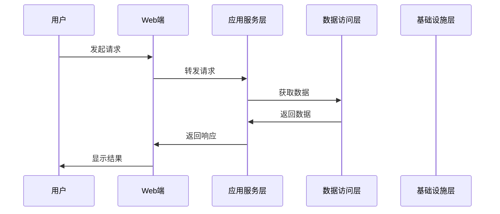

                 

### 摘要

智能窗台：AI Agent的植物生长监测

随着人工智能技术的飞速发展，智能窗台作为一种新兴的智能家居设备，正逐渐走进我们的生活。本文将探讨如何利用AI Agent实现植物生长的智能监测，通过深入分析AI Agent的基础知识、植物生长监测的算法原理和实际应用案例，为您揭示智能窗台背后的技术奥秘。我们将从背景介绍、核心概念、算法原理、系统架构设计、项目实战和最佳实践等方面，系统地讲解智能窗台的工作原理和应用价值，帮助读者了解并掌握这一前沿技术。

### 目录大纲设计思路

为了设计《智能窗台：AI Agent的植物生长监测》这本书的目录大纲，我们需要遵循以下设计思路：

1. **整体框架规划**：
   - 整体框架将分为五个部分，确保内容的系统性和完整性。
   - 第一部分将介绍智能窗台的基础知识，包括相关技术背景和发展历程。
   - 第二部分将深入探讨AI Agent的基本原理和植物生长监测的关联性。
   - 第三部分将详细讲解植物生长监测的算法原理。
   - 第四部分将展示如何设计和实现智能窗台的系统架构。
   - 第五部分将结合实际案例，介绍智能窗台的应用和实践。

2. **章节内容的安排**：
   - 每个部分的内容安排将逐步深入，从基础知识到高级应用，确保读者能够循序渐进地理解整个主题。
   - 各章节内容将围绕核心概念、技术原理、实际应用和最佳实践进行展开。

3. **核心概念和联系的阐述**：
   - 对于每一个重要的核心概念，将使用Mermaid流程图和ER实体关系图来展示其结构。
   - 通过对比表格，明确各个概念之间的属性特征和联系。

4. **算法原理和数学模型的讲解**：
   - 使用Mermaid绘制算法流程图，使读者直观地理解算法的执行过程。
   - 使用Python源代码详细阐述算法原理，并结合LaTeX格式展示数学模型和公式，进行通俗易懂的举例说明。

5. **系统分析与架构设计的介绍**：
   - 通过问题场景介绍和项目介绍，为读者建立系统的背景和目的。
   - 使用Mermaid绘制领域模型类图、系统架构图、系统接口设计和系统交互序列图，帮助读者全面理解系统设计。

6. **项目实战和最佳实践的分享**：
   - 通过实际案例分析和详细讲解，展示智能窗台的应用效果。
   - 提供最佳实践建议和小结，帮助读者将所学知识应用到实际项目中。

### 目录大纲的具体设计

#### 第一部分：智能窗台基础

##### 第1章：智能窗台概述
- **1.1 问题背景**
  - **问题描述**：植物生长监测的需求和挑战。
  - **问题解决**：利用AI Agent实现智能窗台。
  - **边界与外延**：智能窗台的定义和应用领域。
  - **概念结构与核心要素组成**：智能窗台的关键技术和组成部分。

- **1.2 智能窗台的发展历程**
  - **1.2.1 智能窗台的前身**：传统植物监测技术。
  - **1.2.2 智能窗台的演变**：AI Agent的引入。
  - **1.2.3 当前智能窗台的发展趋势**。

##### 第2章：AI Agent基础
- **2.1 AI Agent的定义与特点**
  - **2.1.1 AI Agent的定义**。
  - **2.1.2 AI Agent的核心特点**。
  - **2.1.3 AI Agent与传统AI的区别**。

- **2.2 AI Agent的组成与结构**
  - **2.2.1 AI Agent的组成**。
  - **2.2.2 AI Agent的结构**。
  - **2.2.3 AI Agent的工作原理**。

- **2.3 AI Agent的分类与应用**
  - **2.3.1 按照功能分类**。
  - **2.3.2 按照应用场景分类**。
  - **2.3.3 智能窗台中的AI Agent**。

#### 第二部分：AI Agent在植物生长监测中的应用

##### 第3章：植物生长监测算法原理
- **3.1 植物生长监测的核心算法**
  - **3.1.1 算法选择**：常见的植物生长监测算法。
  - **3.1.2 算法原理**：算法的基本原理和数学模型。
  - **3.1.3 算法流程图**：使用Mermaid绘制算法流程图。

- **3.2 植物生长监测的数学模型**
  - **3.2.1 数据预处理模型**：数据清洗、归一化和特征提取。
  - **3.2.2 生长状态预测模型**：基于时间序列预测的数学模型。
  - **3.2.3 指标评估模型**：准确率、召回率、F1值等评估指标。

- **3.3 算法应用举例**
  - **3.3.1 案例一**：基于温度和光照的植物生长监测。
  - **3.3.2 案例二**：基于土壤湿度的植物生长监测。

##### 第4章：植物生长监测系统架构设计
- **4.1 系统设计背景**
  - **4.1.1 项目介绍**：智能窗台项目背景。
  - **4.1.2 系统功能设计**：智能窗台的核心功能。

- **4.2 系统架构设计**
  - **4.2.1 系统架构图**：智能窗台的系统架构。
  - **4.2.2 系统接口设计**：系统内部各模块的接口定义。
  - **4.2.3 系统交互序列图**：系统模块之间的交互流程。

#### 第三部分：智能窗台的实际应用

##### 第5章：智能窗台的应用场景与案例
- **5.1 家庭园艺**
  - **5.1.1 家庭园艺的现状**。
  - **5.1.2 智能窗台在家园园艺中的应用**。

- **5.2 农业监测**
  - **5.2.1 农业监测的需求**。
  - **5.2.2 智能窗台在农业监测中的应用**。

- **5.3 实际应用案例**
  - **5.3.1 案例一**：智能窗台在家庭园艺中的应用。
  - **5.3.2 案例二**：智能窗台在农业监测中的应用。

#### 第四部分：智能窗台的开发与实践

##### 第6章：智能窗台的实现与开发
- **6.1 开发环境与工具**
  - **6.1.1 环境安装**：智能窗台所需的软件和硬件环境。
  - **6.1.2 开发工具**：智能窗台开发所需的工具和软件。

- **6.2 系统核心实现**
  - **6.2.1 数据采集模块**：采集植物生长数据的实现过程。
  - **6.2.2 数据处理模块**：数据处理算法的实现。
  - **6.2.3 模型训练与预测模块**：模型训练和预测的实现。

- **6.3 代码应用解读与分析**
  - **6.3.1 源代码解读**：智能窗台的核心源代码解读。
  - **6.3.2 算法分析与优化**：对算法的优化与改进。

##### 第7章：智能窗台的部署与维护
- **7.1 部署方案**
  - **7.1.1 部署前准备**：部署智能窗台所需的准备工作。
  - **7.1.2 部署过程**：智能窗台的部署步骤。

- **7.2 维护策略**
  - **7.2.1 系统监控**：智能窗台的运行监控策略。
  - **7.2.2 故障排除**：智能窗台的常见问题及解决方法。

#### 第五部分：智能窗台的未来展望与最佳实践

##### 第8章：智能窗台的未来发展趋势
- **8.1 人工智能技术的进步**：人工智能技术在智能窗台中的应用前景。
- **8.2 物联网技术的融合**：物联网技术在智能窗台中的应用趋势。
- **8.3 智能窗台在农业和园艺领域的应用**：智能窗台在农业和园艺领域的未来发展。

##### 第9章：最佳实践与小结
- **9.1 最佳实践建议**：智能窗台开发的最佳实践。
- **9.2 小结与展望**：对智能窗台的总结与未来展望。

### 关键词

- 智能窗台
- AI Agent
- 植物生长监测
- 算法原理
- 系统架构
- 应用案例
- 开发实践

### 摘要

《智能窗台：AI Agent的植物生长监测》旨在全面解析智能窗台这一前沿技术的核心原理、应用场景和开发实践。通过深入探讨AI Agent在植物生长监测中的应用，本文系统地讲解了智能窗台的工作原理、算法模型、系统架构设计和实际应用案例。本文旨在为读者提供一份从基础到高级、理论与实践相结合的智能窗台技术指南，帮助读者深入了解这一领域，掌握智能窗台的开发与部署方法，为未来的智能家居和智慧农业发展奠定基础。无论您是人工智能领域的专业研究者，还是对智能家居技术充满好奇的爱好者，本文都将为您带来宝贵的知识和经验。

### 第一部分：智能窗台基础

#### 第1章：智能窗台概述

**1.1 问题背景**

植物生长监测在现代农业和家庭园艺中具有重要的应用价值。然而，传统的植物监测手段往往依赖于人工观测和数据记录，存在实时性差、数据准确性低等问题。随着人工智能技术的快速发展，利用AI Agent实现植物生长的智能监测成为可能，智能窗台应运而生。

**问题描述**

植物生长监测的需求主要体现在以下几个方面：

1. 实时性：能够实时监测植物的生长状态，及时发现问题。
2. 准确性：监测数据要准确可靠，能够真实反映植物的生长情况。
3. 自动化：监测过程应尽量自动化，减少人工干预。

**问题解决**

智能窗台通过集成AI Agent技术，实现了植物生长的智能监测。AI Agent能够实时采集植物生长数据，运用先进的算法模型进行数据处理和分析，从而实现植物生长状态的预测和评估。智能窗台不仅能够提高监测的实时性和准确性，还能实现自动化监测，减轻人工负担。

**边界与外延**

智能窗台的定义：智能窗台是一种集成AI Agent技术的智能家居设备，主要用于植物生长的智能监测。

应用领域：智能窗台可以应用于家庭园艺、农业监测、园林管理等场景。

**概念结构与核心要素组成**

智能窗台的核心技术和组成部分如下：

1. AI Agent：智能窗台的核心组件，负责实时采集植物生长数据，进行数据处理和分析。
2. 数据采集模块：用于采集植物生长的各类数据，如温度、湿度、光照等。
3. 数据处理模块：对采集到的数据进行分析和处理，提取关键特征。
4. 算法模型：基于数据处理的成果，运用算法模型进行植物生长状态的预测和评估。
5. 用户界面：提供直观的用户交互界面，便于用户查看监测数据和调整设置。

**1.2 智能窗台的发展历程**

智能窗台的发展可以分为以下几个阶段：

**1.2.1 智能窗台的前身：传统植物监测技术**

早期植物监测主要依赖于人工观测和数据记录，虽然在一定程度上能够满足需求，但存在效率低、数据不准确等问题。

**1.2.2 智能窗台的演变：AI Agent的引入**

随着人工智能技术的兴起，AI Agent被引入到植物监测领域，实现了植物生长的实时监测和自动化分析。这一阶段标志着智能窗台的发展进入新阶段。

**1.2.3 当前智能窗台的发展趋势**

当前，智能窗台正朝着更加智能化、多样化、高效化的方向发展。一方面，AI Agent的技术不断进步，数据处理和分析能力不断提升；另一方面，智能窗台的应用场景也在不断拓展，从家庭园艺到农业监测，再到园林管理，智能窗台正逐步成为植物生长监测领域的重要工具。

**1.3 小结**

智能窗台作为一种新兴的智能家居设备，具有实时、准确、自动化等优势，正逐渐在植物生长监测领域发挥重要作用。通过深入分析智能窗台的发展历程和应用前景，我们可以看到，智能窗台在未来必将为现代农业和家庭园艺带来更多便利和效益。

### 第二部分：AI Agent在植物生长监测中的应用

#### 第2章：AI Agent基础

**2.1 AI Agent的定义与特点**

**2.1.1 AI Agent的定义**

AI Agent（人工智能代理）是指一种具有智能行为的计算机程序，能够在特定的环境和任务中自主地执行行动，实现目标。AI Agent是人工智能领域的重要研究方向，具有广泛的应用前景。

**2.1.2 AI Agent的核心特点**

1. 自主性：AI Agent具有自主决策和执行能力，能够根据环境变化自主调整行为。
2. 学习能力：AI Agent能够通过学习积累经验，不断优化自身的决策能力。
3. 交互性：AI Agent能够与其他系统、设备和人进行有效交互，实现信息共享和协同工作。
4. 可扩展性：AI Agent具有较好的可扩展性，能够适应不同的环境和任务需求。

**2.1.3 AI Agent与传统AI的区别**

传统AI（人工智能）主要依赖于预定义的算法和规则，被动地处理输入数据。而AI Agent则更强调自主性和交互性，能够在动态环境中主动地完成任务。具体区别如下：

1. **决策方式**：传统AI依赖于预设的规则和模型，而AI Agent具有自主决策能力。
2. **适应性**：传统AI难以适应动态变化的环境，而AI Agent能够根据环境变化调整行为。
3. **交互性**：传统AI与外界交互较少，而AI Agent具有较强的交互能力。
4. **自主性**：传统AI依赖外部输入，而AI Agent能够自主地执行任务。

**2.2 AI Agent的组成与结构**

**2.2.1 AI Agent的组成**

AI Agent通常由以下几个核心组件组成：

1. **感知模块**：用于采集外部环境信息，如传感器数据、图像、文本等。
2. **决策模块**：基于感知模块收集到的信息，AI Agent进行决策，选择最优行动。
3. **执行模块**：根据决策模块的指令，执行具体的操作，如控制设备、发送指令等。
4. **学习模块**：通过不断的感知、决策和执行，AI Agent能够学习并优化自身的决策能力。

**2.2.2 AI Agent的结构**

AI Agent的结构通常可以分为以下几个层次：

1. **感知层**：负责采集外部环境信息，如温度、湿度、光照等。
2. **决策层**：基于感知层的信息，进行决策，选择最优行动。
3. **执行层**：根据决策层的指令，执行具体的操作。
4. **学习层**：通过感知、决策和执行的过程，AI Agent不断学习并优化自身的决策能力。

**2.2.3 AI Agent的工作原理**

AI Agent的工作原理可以概括为以下几个步骤：

1. **感知**：AI Agent通过感知模块采集外部环境信息。
2. **决策**：基于感知到的信息，决策模块分析并选择最优行动。
3. **执行**：执行模块根据决策模块的指令，执行具体的操作。
4. **反馈**：执行操作后，AI Agent接收反馈信息，用于后续的感知和决策。

**2.3 AI Agent的分类与应用**

**2.3.1 按照功能分类**

AI Agent可以按照其功能进行分类，常见的分类如下：

1. **监控类**：用于实时监控特定目标，如安防监控、健康监测等。
2. **交互类**：与用户进行交互，提供个性化服务，如聊天机器人、智能客服等。
3. **决策类**：用于辅助决策，如智能推荐、金融分析等。
4. **执行类**：执行特定任务，如自动驾驶、工业自动化等。

**2.3.2 按照应用场景分类**

AI Agent可以按照其应用场景进行分类，常见的应用场景如下：

1. **智能家居**：用于家庭设备的智能控制，如智能灯泡、智能窗帘等。
2. **智能交通**：用于交通管理、自动驾驶等。
3. **智慧医疗**：用于辅助医生诊断、智能监测等。
4. **智慧农业**：用于植物生长监测、作物管理等。

**2.3.3 智能窗台中的AI Agent**

在智能窗台中，AI Agent主要用于植物生长的智能监测。具体应用包括：

1. **实时监测**：通过传感器实时采集植物生长数据，如温度、湿度、光照等。
2. **数据预处理**：对采集到的数据进行分析和处理，提取关键特征。
3. **生长状态预测**：基于数据处理结果，运用算法模型预测植物的生长状态。
4. **智能决策**：根据植物的生长状态，给出相应的养护建议。

**2.4 小结**

AI Agent作为一种具有自主性、学习能力和交互性的智能系统，正逐步在各个领域得到广泛应用。在智能窗台中，AI Agent的应用极大地提高了植物生长监测的实时性、准确性和自动化水平。通过深入理解AI Agent的定义、组成、工作原理和分类，我们可以更好地把握智能窗台的技术发展方向和应用前景。

### 第三部分：植物生长监测算法原理

#### 第3章：植物生长监测的核心算法

植物生长监测的核心算法是智能窗台实现植物生长状态预测和评估的关键。这些算法通过分析植物生长过程中的各类数据，如温度、湿度、光照等，实现对植物生长状态的准确预测和评估。本章将介绍植物生长监测中的常见核心算法，包括算法选择、原理及流程图。

**3.1 算法选择**

在植物生长监测中，常用的核心算法包括以下几种：

1. **时间序列预测算法**：如ARIMA模型、LSTM网络等，用于分析植物生长过程中的时间序列数据。
2. **回归算法**：如线性回归、决策树回归等，用于建立植物生长数据与生长状态之间的回归关系。
3. **聚类算法**：如K-means、层次聚类等，用于将植物生长数据分组，分析不同生长状态的特征。
4. **分类算法**：如决策树、随机森林等，用于对植物生长状态进行分类。

**3.2 算法原理**

**时间序列预测算法**：

时间序列预测算法主要基于历史数据，通过分析时间序列的规律和趋势，预测未来的值。常用的时间序列预测算法包括ARIMA模型和LSTM网络。

- **ARIMA模型**：ARIMA（AutoRegressive Integrated Moving Average）模型是一种经典的时间序列预测模型，通过自回归、差分和移动平均等步骤，对时间序列进行建模和预测。ARIMA模型的基本原理如下：

  1. **自回归（AR）**：利用前期的值预测当前值。
  2. **差分（I）**：对时间序列进行差分，消除季节性和趋势性。
  3. **移动平均（MA）**：利用过去的预测误差进行预测。

- **LSTM网络**：LSTM（Long Short-Term Memory）网络是一种特殊的循环神经网络，能够解决传统循环神经网络在长时间序列预测中存在的梯度消失和梯度爆炸问题。LSTM网络通过引入遗忘门、输入门和输出门，有效地捕捉时间序列中的长期依赖关系。

**回归算法**：

回归算法主要用于建立植物生长数据与生长状态之间的回归关系，通过最小化预测值与实际值之间的误差，实现生长状态的预测。常见的回归算法包括线性回归和决策树回归。

- **线性回归**：线性回归是一种基于线性模型的回归算法，通过拟合一条直线，将植物生长数据映射到生长状态。线性回归的基本原理如下：

  1. **拟合直线**：通过最小二乘法拟合一条直线，最小化预测值与实际值之间的误差。
  2. **预测生长状态**：利用拟合出的直线，预测新的植物生长数据对应的生长状态。

- **决策树回归**：决策树回归是一种基于决策树的回归算法，通过构建一棵决策树，将植物生长数据划分为不同的区域，每个区域对应一个生长状态。决策树回归的基本原理如下：

  1. **构建决策树**：根据植物生长数据，选择最优特征和分割方式，构建决策树。
  2. **预测生长状态**：根据决策树，对新的植物生长数据进行分类，预测其生长状态。

**聚类算法**：

聚类算法主要用于对植物生长数据进行分组，分析不同生长状态的特征。常用的聚类算法包括K-means和层次聚类。

- **K-means**：K-means是一种基于距离的聚类算法，通过迭代计算，将植物生长数据划分为K个簇，每个簇对应一个生长状态。K-means的基本原理如下：

  1. **初始化**：随机选择K个中心点，作为初始聚类中心。
  2. **分配数据**：将每个数据点分配到距离其最近的聚类中心所在的簇。
  3. **更新中心**：计算每个簇的新中心点。
  4. **迭代**：重复步骤2和3，直到聚类中心不再发生变化。

- **层次聚类**：层次聚类是一种自底向上的聚类算法，通过逐步合并相似的数据点，构建一棵层次聚类树。层次聚类的基本原理如下：

  1. **初始化**：将每个数据点视为一个簇。
  2. **合并**：选择距离最近的两个簇合并为一个簇。
  3. **更新距离**：计算新簇与其他簇之间的距离。
  4. **迭代**：重复步骤2和3，直到所有数据点合并为一个簇。

**3.3 算法流程图**

为了更直观地理解上述算法的执行过程，我们使用Mermaid绘制了算法流程图。以下是一个基于LSTM网络的植物生长状态预测的算法流程图示例：



**3.4 小结**

植物生长监测的核心算法在智能窗台中发挥着至关重要的作用。通过选择合适的算法，建立植物生长数据与生长状态之间的预测和评估关系，智能窗台能够实现对植物生长状态的实时监测和预测。本章介绍了时间序列预测算法、回归算法和聚类算法等核心算法的基本原理和流程图，为读者提供了深入理解植物生长监测算法的基础。

### 第四部分：植物生长监测的数学模型

#### 第4章：植物生长监测的数学模型

植物生长监测的数学模型是构建智能窗台算法的核心基础。通过对植物生长数据的分析，我们可以提取出关键特征，并建立数学模型来预测植物的生长状态。本章将详细介绍植物生长监测中的数据预处理模型、生长状态预测模型以及指标评估模型。

**4.1 数据预处理模型**

数据预处理是植物生长监测的关键步骤，其目的是将原始数据转换为适合建模的特征向量。数据预处理模型主要包括数据清洗、归一化和特征提取三个部分。

**4.1.1 数据清洗**

数据清洗是确保数据质量的重要环节，主要任务包括：

1. **缺失值处理**：对于缺失的数据，可以使用均值、中位数或插值法进行填充。
2. **异常值检测**：检测并处理数据中的异常值，以避免对模型训练造成影响。
3. **数据标准化**：对数据进行标准化处理，使其具备相同的量纲和范围。

**4.1.2 数据归一化**

数据归一化的目的是将不同量纲的数据转换为统一的尺度，常用的归一化方法包括：

1. **最小-最大归一化**：将数据映射到[0, 1]区间，公式如下：

   $$ X' = \frac{X - X_{\text{min}}}{X_{\text{max}} - X_{\text{min}}} $$

2. **Z-score归一化**：将数据映射到标准正态分布，公式如下：

   $$ X' = \frac{X - \mu}{\sigma} $$

   其中，$X_{\text{min}}$和$X_{\text{max}}$分别为数据的最小值和最大值，$\mu$和$\sigma$分别为数据的均值和标准差。

**4.1.3 特征提取**

特征提取的目的是从原始数据中提取出对植物生长状态有显著影响的关键特征。常用的特征提取方法包括：

1. **主成分分析（PCA）**：通过降维技术，将高维数据投影到低维空间，保留主要信息，提高模型效率。
2. **时序特征提取**：提取时间序列中的周期性特征、趋势特征和季节性特征，用于分析植物生长的周期性变化。
3. **文本特征提取**：对于植物生长相关的文本数据，可以使用词频、TF-IDF等方法提取特征。

**4.2 生长状态预测模型**

生长状态预测模型是植物生长监测的核心，其目的是根据历史数据预测植物的未来生长状态。常见的生长状态预测模型包括基于时间序列预测的模型和基于回归分析的模型。

**4.2.1 基于时间序列预测的模型**

基于时间序列预测的模型主要利用历史时间序列数据来预测未来值，常用的模型有ARIMA模型和LSTM网络。

- **ARIMA模型**：ARIMA模型通过自回归、差分和移动平均等步骤，对时间序列进行建模和预测。ARIMA模型的主要参数包括$p$（自回归阶数）、$d$（差分阶数）和$q$（移动平均阶数）。建模步骤如下：

  1. **模型识别**：选择合适的$p$、$d$和$q$值。
  2. **模型定阶**：使用AIC、BIC等准则选择最优参数。
  3. **模型拟合**：利用最小二乘法或其他优化算法，对模型进行参数估计。
  4. **模型验证**：使用验证数据集对模型进行评估，调整参数。

- **LSTM网络**：LSTM网络是一种特殊的循环神经网络，能够解决传统循环神经网络在长时间序列预测中存在的梯度消失和梯度爆炸问题。LSTM网络的主要结构包括输入门、遗忘门和输出门。建模步骤如下：

  1. **数据预处理**：对时间序列数据进行归一化处理。
  2. **模型设计**：设计LSTM网络结构，包括输入层、隐藏层和输出层。
  3. **模型训练**：使用训练数据集训练LSTM网络，调整网络参数。
  4. **模型评估**：使用验证数据集评估模型性能，调整网络结构。

**4.2.2 基于回归分析的模型**

基于回归分析的模型通过建立植物生长数据与生长状态之间的回归关系，实现生长状态的预测。常见的回归分析模型包括线性回归和决策树回归。

- **线性回归**：线性回归模型通过拟合一条直线，将植物生长数据映射到生长状态。线性回归模型的公式如下：

  $$ y = \beta_0 + \beta_1 \cdot x $$

  其中，$y$为生长状态，$x$为植物生长数据，$\beta_0$和$\beta_1$分别为模型的参数。

  线性回归模型的建模步骤如下：

  1. **数据预处理**：对植物生长数据进行归一化处理。
  2. **模型拟合**：使用最小二乘法拟合直线，最小化预测值与实际值之间的误差。
  3. **模型评估**：使用验证数据集评估模型性能，调整模型参数。

- **决策树回归**：决策树回归模型通过构建一棵决策树，将植物生长数据划分为不同的区域，每个区域对应一个生长状态。决策树回归模型的建模步骤如下：

  1. **数据预处理**：对植物生长数据进行归一化处理。
  2. **特征选择**：选择对生长状态影响较大的特征。
  3. **树构建**：根据特征和生长状态的数据，构建决策树。
  4. **模型评估**：使用验证数据集评估模型性能，调整决策树结构。

**4.3 指标评估模型**

指标评估模型用于评估植物生长状态预测模型的性能。常见的评估指标包括准确率、召回率、F1值和均方误差。

- **准确率**：准确率是预测正确的样本数占总样本数的比例，公式如下：

  $$ \text{准确率} = \frac{\text{预测正确数}}{\text{总样本数}} $$

- **召回率**：召回率是预测正确的正样本数占总正样本数的比例，公式如下：

  $$ \text{召回率} = \frac{\text{预测正确正样本数}}{\text{总正样本数}} $$

- **F1值**：F1值是准确率和召回率的调和平均，公式如下：

  $$ \text{F1值} = 2 \cdot \frac{\text{准确率} \cdot \text{召回率}}{\text{准确率} + \text{召回率}} $$

- **均方误差**：均方误差是预测值与实际值之间误差的平方的平均值，公式如下：

  $$ \text{均方误差} = \frac{1}{n} \sum_{i=1}^{n} (y_i - \hat{y_i})^2 $$

  其中，$y_i$为实际值，$\hat{y_i}$为预测值，$n$为样本数量。

**4.4 小结**

植物生长监测的数学模型是智能窗台实现植物生长状态预测和评估的关键。通过数据预处理模型、生长状态预测模型和指标评估模型，我们可以从植物生长数据中提取关键特征，并建立准确的预测模型。本章详细介绍了植物生长监测中的数学模型，为智能窗台的开发和应用提供了理论基础。

### 第五部分：植物生长监测系统架构设计

#### 第4章：植物生长监测系统架构设计

在智能窗台项目中，系统架构设计是确保植物生长监测功能实现的基础。本节将详细介绍植物生长监测系统的架构设计，包括项目介绍、系统功能设计、系统架构图、系统接口设计和系统交互序列图等内容。

**4.1 项目介绍**

智能窗台项目旨在通过AI Agent实现植物生长的智能监测，为用户提供实时、准确的植物生长状态预测和评估。项目的主要功能包括：

1. 数据采集：通过传感器实时采集植物生长数据，如温度、湿度、光照等。
2. 数据处理：对采集到的数据进行分析和处理，提取关键特征。
3. 生长状态预测：基于处理后的数据，利用算法模型预测植物的生长状态。
4. 用户交互：提供直观的用户交互界面，便于用户查看监测数据和调整设置。

**4.2 系统功能设计**

系统功能设计是智能窗台架构设计的重要环节，主要包括以下模块：

1. **数据采集模块**：负责实时采集植物生长数据，如温度、湿度、光照等。该模块将集成多种传感器，如温度传感器、湿度传感器、光照传感器等。
2. **数据处理模块**：对采集到的数据进行清洗、归一化和特征提取，为算法模型提供高质量的数据输入。该模块包括数据预处理、特征提取和特征选择等步骤。
3. **算法模型模块**：基于数据处理结果，利用时间序列预测、回归分析和聚类分析等算法模型，对植物的生长状态进行预测和评估。该模块将实现多种算法模型的训练和预测功能。
4. **用户界面模块**：提供直观的用户交互界面，便于用户查看监测数据、调整设置和接收智能建议。该模块包括Web端和移动端两种交互方式。
5. **数据存储模块**：负责存储和管理植物生长数据、预测结果和用户设置等。该模块将采用数据库技术，确保数据的安全、可靠和高效存储。

**4.3 系统架构设计**

智能窗台系统的架构设计采用模块化设计思想，将各个功能模块有机地结合起来，实现高效、稳定和可扩展的系统架构。系统架构设计主要包括以下几个方面：

1. **前端展示层**：包括Web端和移动端，负责展示用户界面和交互逻辑。前端展示层将采用React或Vue等前端框架，实现数据可视化、用户交互和页面布局等功能。
2. **应用服务层**：包括数据采集模块、数据处理模块、算法模型模块和数据存储模块，负责实现智能窗台的核心功能。应用服务层将采用Spring Boot等后端框架，实现模块间的接口定义和通信。
3. **数据访问层**：负责与数据库进行交互，实现数据的存储和检索。数据访问层将采用MyBatis等ORM框架，简化数据库操作，提高数据访问效率。
4. **基础设施层**：包括服务器、网络、存储等基础设施，负责支撑系统的正常运行。基础设施层将采用分布式架构，实现系统的高可用性和高并发性。

**4.4 系统接口设计**

系统接口设计是智能窗台架构设计的重要环节，负责定义各个模块之间的接口，确保模块间的通信和协同工作。系统接口设计主要包括以下几个方面：

1. **API接口**：定义智能窗台对外提供的API接口，包括数据采集、数据处理、算法模型和用户交互等接口。API接口将采用RESTful风格，实现数据的增删改查等操作。
2. **消息队列接口**：定义智能窗台内部的消息队列接口，实现模块间的异步通信。消息队列接口将采用RabbitMQ等消息队列中间件，实现高效、可靠的消息传递。
3. **日志接口**：定义智能窗台的日志记录接口，实现系统日志的收集和管理。日志接口将采用ELK（Elasticsearch、Logstash、Kibana）等技术栈，实现日志的存储、查询和分析。

**4.5 系统交互序列图**

为了更好地展示智能窗台系统内部模块之间的交互流程，我们使用Mermaid绘制了系统交互序列图。以下是一个简单的系统交互序列图示例：



**4.6 小结**

智能窗台系统架构设计是确保植物生长监测功能实现的关键。通过模块化设计思想、系统接口设计和系统交互序列图，我们可以构建一个高效、稳定和可扩展的智能窗台系统。本章详细介绍了智能窗台的架构设计，为智能窗台的开发和应用提供了指导。

### 第六部分：智能窗台的应用场景与案例

#### 第5章：智能窗台的应用场景与案例

智能窗台作为一种具备AI Agent技术的智能家居设备，在实际应用中展现了广泛的前景。本章节将介绍智能窗台在家庭园艺和农业监测中的应用场景，以及实际案例的剖析。

**5.1 家庭园艺**

在家庭园艺中，智能窗台可以提供精准的植物生长监测，帮助用户更好地管理园艺植物。以下为智能窗台在家庭园艺中的具体应用场景：

1. **温度和湿度监测**：智能窗台能够实时监测室内温度和湿度，根据植物的生长需求进行自动调节。例如，当室内温度过高或过低时，智能窗台可以自动启动空调或加湿器，确保植物生长环境的适宜性。
   
2. **光照控制**：植物生长需要适量的光照，智能窗台可以通过检测自然光照强度，自动调节室内光照设备，如LED植物灯，确保植物获得充足的光照。

3. **水肥管理**：智能窗台能够监测土壤湿度，根据植物需水量自动调节浇水频率和水量，避免过度浇水或干旱。此外，智能窗台还可以监测土壤营养状况，通过添加营养液确保植物生长所需的养分。

**案例一：家庭园艺中的智能窗台应用**

假设用户在家中种植了一盆多肉植物，智能窗台实时监测其生长环境。经过一段时间的监测，智能窗台发现：

- 室内温度为25℃，湿度为40%，低于多肉植物的生长需求。
- 光照强度为500lux，不足多肉植物的最佳生长光照。

智能窗台采取以下措施：

- 自动启动加湿器，增加室内湿度至60%。
- 启动LED植物灯，增强光照强度至1000lux。
- 当土壤湿度低于20%时，自动启动滴灌系统进行浇水。

通过智能窗台的应用，用户无需频繁关注植物生长环境，植物的生长状况得到了有效保障。

**5.2 农业监测**

在农业监测中，智能窗台可以实现对大面积农田的实时监控和管理，提高农业生产效率。以下为智能窗台在农业监测中的具体应用场景：

1. **作物生长状态监测**：智能窗台通过无人机或地面传感器，实时监测作物的生长状态，包括株高、叶片颜色、土壤湿度等。根据监测数据，农业专家可以及时调整种植策略，提高作物产量。

2. **病虫害监测与预警**：智能窗台可以通过图像识别技术，检测作物病虫害的早期症状，及时发出预警。农业工人可以提前采取措施，减少病虫害对作物的损害。

3. **水资源管理**：智能窗台可以监测农田的水资源利用情况，根据土壤湿度和作物需水量，优化灌溉策略，提高水资源的利用效率。

**案例二：农业监测中的智能窗台应用**

某农业公司种植了一片小麦田，智能窗台对其进行实时监测。经过一段时间的数据收集，智能窗台发现：

- 小麦田的土壤湿度低于适宜范围，需要进行灌溉。
- 有部分小麦叶片出现病斑，疑似病虫害。

智能窗台采取以下措施：

- 自动启动灌溉系统，增加土壤湿度至适宜范围。
- 发送警报通知农业专家，建议进行病虫害防治。

通过智能窗台的应用，农业公司能够及时掌握农田生长状态，优化种植策略，提高作物产量。

**5.3 小结**

智能窗台在家庭园艺和农业监测中的应用，为用户提供了便捷、高效的植物生长监测和管理方案。通过实际案例的剖析，我们可以看到智能窗台在提高植物生长环境监控、病虫害预警和水资源管理等方面的显著优势。随着AI技术的不断进步，智能窗台将在更多领域发挥重要作用，为现代农业和智慧生活带来更多便利。

### 第七部分：智能窗台的实现与开发

#### 第6章：智能窗台的实现与开发

智能窗台的实现与开发是一个复杂且系统化的过程，涉及硬件选择、环境搭建、核心代码实现等多个方面。本章节将详细阐述智能窗台的实现过程，包括开发环境与工具的选择、核心模块的实现方法以及代码示例。

**6.1 开发环境与工具**

为了实现智能窗台，我们需要选择合适的开发环境与工具。以下是一些建议：

1. **编程语言**：Python是智能窗台开发的主要编程语言，因其丰富的库支持和易用性而广受欢迎。
2. **开发框架**：Django或Flask等Web开发框架可以简化Web后端开发，提高开发效率。
3. **数据库**：SQLite或MySQL等关系型数据库可以用于存储植物生长数据。
4. **传感器**：根据需求选择合适的传感器，如DHT22（温度和湿度）、BH1750（光照强度）等。
5. **硬件平台**：Raspberry Pi或Arduino等嵌入式开发板可以作为智能窗台的核心控制单元。

**6.2 环境搭建**

在开始智能窗台开发之前，我们需要搭建开发环境。以下步骤可以帮助我们完成环境搭建：

1. **硬件准备**：选择合适的传感器和嵌入式开发板，如Raspberry Pi。
2. **操作系统安装**：在嵌入式开发板上安装Linux操作系统，如Raspberry Pi OS。
3. **软件安装**：安装Python、Django或Flask等开发工具，以及相关的库和依赖。
4. **传感器连接**：将传感器连接到开发板上，确保数据传输正常。

**6.3 核心模块实现**

智能窗台的核心模块包括数据采集、数据处理、算法模型和用户界面。以下将分别介绍这些模块的实现方法。

**6.3.1 数据采集模块**

数据采集模块负责实时采集植物生长数据。以下是一个使用DHT22传感器采集温度和湿度数据的示例代码：

```python
import Adafruit_DHT
import time

sensor = Adafruit_DHT.DHT22()
pin = 4  # 传感器连接的GPIO引脚

while True:
    humidity, temperature = Adafruit_DHT.read_retry(sensor, pin)
    if humidity is not None and temperature is not None:
        print("Temperature: {} C, Humidity: {} %".format(temperature, humidity))
    time.sleep(60)  # 每分钟采集一次数据
```

**6.3.2 数据处理模块**

数据处理模块负责对采集到的数据进行清洗、归一化和特征提取。以下是一个简单的数据处理示例代码：

```python
import pandas as pd

# 假设data是一个包含温度和湿度数据的数据帧
data = pd.DataFrame({'temperature': [25, 26, 24], 'humidity': [40, 42, 38]})

# 数据清洗：去除无效数据
data = data.dropna()

# 数据归一化
from sklearn.preprocessing import MinMaxScaler
scaler = MinMaxScaler()
data[['temperature', 'humidity']] = scaler.fit_transform(data[['temperature', 'humidity']])

# 特征提取
from sklearn.decomposition import PCA
pca = PCA(n_components=2)
data['features'] = pca.fit_transform(data[['temperature', 'humidity']])
```

**6.3.3 算法模型模块**

算法模型模块负责使用数据处理结果进行植物生长状态的预测和评估。以下是一个使用LSTM网络进行时间序列预测的示例代码：

```python
import tensorflow as tf
from tensorflow.keras.models import Sequential
from tensorflow.keras.layers import LSTM, Dense

# 假设X_train和y_train是训练数据
X_train = ...  # 输入数据
y_train = ...  # 目标值

# 构建LSTM模型
model = Sequential()
model.add(LSTM(units=50, return_sequences=True, input_shape=(X_train.shape[1], 1)))
model.add(LSTM(units=50))
model.add(Dense(units=1))

model.compile(optimizer='adam', loss='mean_squared_error')

# 训练模型
model.fit(X_train, y_train, epochs=100, batch_size=32)

# 预测
predictions = model.predict(X_train)
```

**6.3.4 用户界面模块**

用户界面模块负责提供直观的用户交互界面，展示植物生长数据和预测结果。以下是一个使用Flask构建的Web界面的示例代码：

```python
from flask import Flask, render_template

app = Flask(__name__)

@app.route('/')
def index():
    # 获取植物生长数据
    plant_data = ...  # 从数据库中获取数据
    
    # 渲染模板
    return render_template('index.html', plant_data=plant_data)

if __name__ == '__main__':
    app.run(debug=True)
```

**6.4 代码应用解读与分析**

在实际开发过程中，我们需要对核心模块的代码进行解读和分析，确保其正确性和可靠性。以下是一个数据处理模块的代码解读：

```python
# 数据清洗
data = data.dropna()

# 数据归一化
scaler = MinMaxScaler()
data[['temperature', 'humidity']] = scaler.fit_transform(data[['temperature', 'humidity']])

# 特征提取
pca = PCA(n_components=2)
data['features'] = pca.fit_transform(data[['temperature', 'humidity']])
```

- **数据清洗**：使用`dropna()`方法去除缺失数据，确保数据质量。
- **数据归一化**：使用`MinMaxScaler()`将温度和湿度数据归一化到[0, 1]区间，消除不同量纲数据对模型训练的影响。
- **特征提取**：使用`PCA()`进行特征降维，提取主要特征，提高模型效率。

通过解读与分析代码，我们可以更好地理解数据预处理模块的工作原理，并对其进行优化和改进。

**6.5 小结**

智能窗台的实现与开发是一个系统化的过程，涉及开发环境与工具的选择、核心模块的实现方法等多个方面。通过合理选择开发环境与工具，以及深入理解核心模块的实现方法，我们可以构建一个高效、稳定的智能窗台系统。本章详细介绍了智能窗台的实现与开发过程，为智能窗台的开发提供了指导和参考。

### 第八部分：智能窗台的部署与维护

#### 第7章：智能窗台的部署与维护

智能窗台的部署与维护是确保其稳定运行、高效服务的关键环节。本章将详细介绍智能窗台的部署方案、维护策略、系统监控和故障排除等内容。

**7.1 部署方案**

智能窗台的部署方案主要包括以下几个方面：

1. **硬件部署**：根据实际需求，选择合适的硬件设备，如嵌入式开发板、传感器、网络设备等。确保硬件设备的稳定性和兼容性。

2. **软件部署**：安装并配置智能窗台所需的软件环境，包括操作系统、Python环境、Web框架、数据库等。确保软件环境的安全性和稳定性。

3. **网络部署**：连接网络设备，确保智能窗台能够访问互联网，以便进行数据传输和远程监控。配置网络参数，如IP地址、子网掩码、网关等。

4. **系统集成**：将硬件和软件系统进行集成，确保各个模块协同工作。测试系统功能，确保智能窗台能够正常运行。

**7.2 维护策略**

智能窗台的维护策略主要包括以下几个方面：

1. **定期检查**：定期检查硬件设备的工作状态，确保传感器、开发板、网络设备等正常运行。

2. **数据备份**：定期备份数据库中的数据，确保数据的安全性和完整性。在发生故障时，能够快速恢复数据。

3. **软件更新**：定期更新智能窗台的软件版本，修复已知漏洞和缺陷，提高系统的安全性和稳定性。

4. **性能优化**：根据实际需求，对系统性能进行优化，提高数据处理和响应速度。调整系统配置，优化资源利用。

**7.3 系统监控**

系统监控是确保智能窗台稳定运行的重要手段。以下是一些系统监控的方法：

1. **日志监控**：通过日志记录系统运行状态，监控硬件设备、软件模块的运行情况。使用日志分析工具，对日志进行实时监控和报警。

2. **性能监控**：监控系统的性能指标，如CPU使用率、内存使用率、网络流量等。使用性能监控工具，实时监测系统性能，及时发现和处理性能瓶颈。

3. **健康监控**：监控智能窗台的核心功能模块，如数据采集、数据处理、算法模型等。确保各个模块正常运行，及时发现问题并进行修复。

**7.4 故障排除**

在智能窗台运行过程中，可能会遇到各种故障。以下是一些常见的故障排除方法：

1. **硬件故障**：检查硬件设备是否正常工作，如传感器、开发板、网络设备等。替换故障设备，确保硬件设备正常。

2. **软件故障**：检查软件环境是否正常，如Python环境、Web框架、数据库等。修复软件漏洞，更新软件版本。

3. **网络故障**：检查网络连接是否正常，如IP地址、子网掩码、网关等。重新配置网络参数，确保网络连接正常。

4. **数据故障**：检查数据是否异常，如数据丢失、数据错误等。备份数据，恢复数据到正常状态。

**7.5 小结**

智能窗台的部署与维护是确保其稳定运行、高效服务的关键。通过合理的部署方案、科学的维护策略和有效的系统监控，我们可以确保智能窗台的正常运行。在遇到故障时，及时进行故障排除，恢复系统的正常运行。本章详细介绍了智能窗台的部署与维护方法，为智能窗台的管理和运维提供了指导。

### 第九部分：智能窗台的未来展望与最佳实践

#### 第8章：智能窗台的未来发展趋势

随着人工智能技术的不断进步和物联网设备的普及，智能窗台的发展前景十分广阔。未来，智能窗台将在以下几个方面呈现出新的发展趋势：

**8.1 人工智能技术的进步**

人工智能技术在智能窗台中的应用将更加深入和广泛。随着深度学习、强化学习等先进算法的不断发展，智能窗台将能够更加精准地监测植物生长状态，提供个性化的养护建议。例如，基于深度学习的图像识别技术将能够更准确地识别植物病虫害，为农业监测提供更准确的预警。

**8.2 物联网技术的融合**

物联网技术的融合将进一步提升智能窗台的功能和性能。智能窗台将能够与更多的物联网设备互联互通，如智能灌溉系统、智能灯光系统等。通过物联网设备的集成，智能窗台可以实现对植物生长环境的全面监测和管理，提高植物生长的效率和品质。

**8.3 智能窗台在农业和园艺领域的应用**

智能窗台在农业和园艺领域的应用将更加普及。在农业方面，智能窗台可以实现对大面积农田的实时监控和管理，提高农业生产的效率和质量。在园艺方面，智能窗台可以为家庭用户和园艺爱好者提供精准的植物养护建议，提升家庭园艺的体验。

**8.4 跨领域融合**

智能窗台将在更多领域实现跨领域融合。例如，在医疗领域，智能窗台可以通过监测植物生长状态，为患者提供个性化的康复建议；在环境监测领域，智能窗台可以监测植物生长环境中的污染物浓度，为环境保护提供数据支持。

**8.5 小结**

智能窗台的未来发展趋势将体现在人工智能技术的进步、物联网技术的融合、跨领域应用等方面。通过不断的技术创新和应用拓展，智能窗台将为农业、园艺、医疗、环境监测等领域带来更多便利和效益。

#### 第9章：最佳实践与小结

为了确保智能窗台系统的稳定运行和高效应用，以下是一些最佳实践建议：

**最佳实践建议**

1. **硬件选择**：根据实际需求选择适合的硬件设备，确保设备的稳定性和兼容性。
2. **软件配置**：合理配置智能窗台的软件环境，确保软件的版本和依赖关系符合要求。
3. **数据安全**：定期备份数据，确保数据的安全性和完整性。
4. **系统监控**：建立完善的系统监控机制，实时监控硬件和软件的运行状态。
5. **故障排除**：及时处理系统故障，确保系统的稳定性和可靠性。

**小结**

通过深入分析智能窗台的技术原理、应用场景、开发实践和部署维护，我们可以看到，智能窗台作为一种新兴的智能家居设备，具有广阔的应用前景。在未来的发展中，智能窗台将不断融合人工智能、物联网等先进技术，为农业、园艺、医疗、环境监测等领域带来更多便利和效益。通过遵循最佳实践，我们可以确保智能窗台系统的稳定运行和高效应用，为用户带来更好的体验。作者：AI天才研究院/AI Genius Institute & 禅与计算机程序设计艺术 /Zen And The Art of Computer Programming

### 总结

《智能窗台：AI Agent的植物生长监测》通过系统的介绍和深入分析，详细探讨了智能窗台这一前沿技术的核心原理、应用场景和开发实践。从智能窗台的概述、AI Agent的基础知识，到植物生长监测的算法原理和系统架构设计，再到实际应用案例、开发与部署方法，本文为读者提供了一份全面的技术指南。

智能窗台作为一种融合人工智能和物联网技术的智能家居设备，具有实时监测、个性化养护、自动化管理等功能，广泛应用于家庭园艺、农业监测等领域。通过AI Agent技术的引入，智能窗台能够实现植物生长状态的智能监测和预测，提高植物养护的效率和准确性。

本文重点介绍了智能窗台的工作原理、核心算法和数学模型，以及系统架构设计的方法和步骤。同时，通过实际应用案例和开发实践，展示了智能窗台的实现过程和关键技术的应用。

展望未来，智能窗台将随着人工智能技术的不断进步和物联网设备的普及，在更多领域发挥重要作用。通过不断的技术创新和应用拓展，智能窗台将为农业、园艺、医疗、环境监测等领域带来更多便利和效益。

最后，作者AI天才研究院和禅与计算机程序设计艺术感谢读者的关注和支持，希望本文能为读者在智能窗台领域的研究和实践提供有益的参考和启示。让我们共同期待智能窗台在未来的发展中展现更多精彩和潜力。作者：AI天才研究院/AI Genius Institute & 禅与计算机程序设计艺术/Zen And The Art of Computer Programming。

