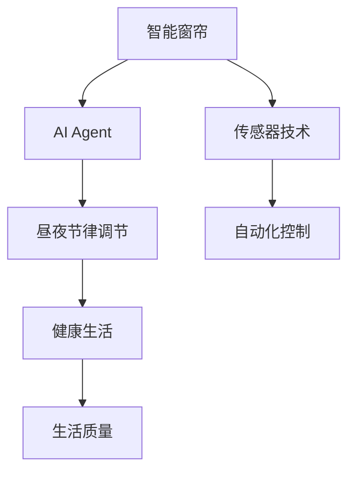
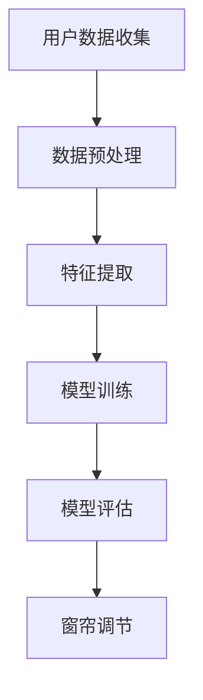
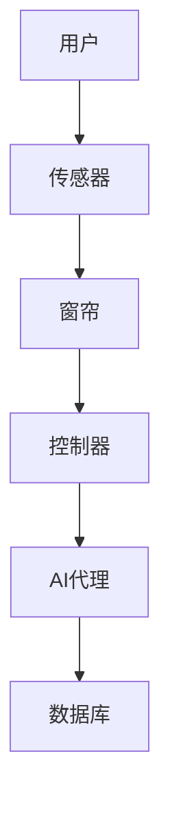
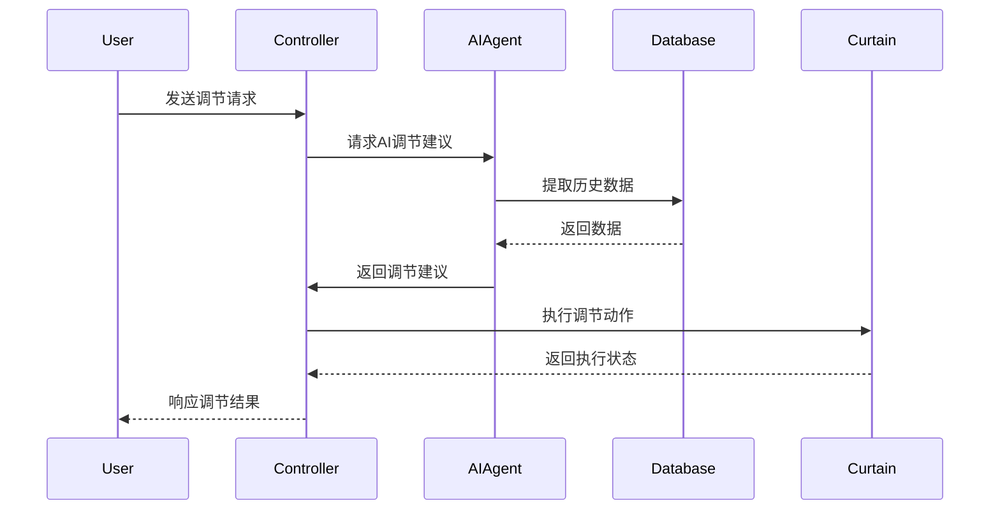
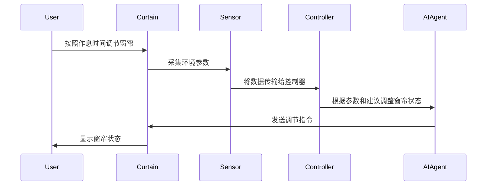

                 


# 智能窗帘：AI Agent的昼夜节律调节助手

> 关键词：智能窗帘、AI Agent、昼夜节律、调节技术、应用场景

> 摘要：本文将探讨智能窗帘及其与AI Agent的结合，特别是在昼夜节律调节方面的应用。通过详细的分析和讲解，我们将了解智能窗帘的工作原理、AI Agent的基本原理、昼夜节律调节的重要性及其技术手段，以及智能窗帘在各个领域中的应用和发展趋势。

## Step 1: 书名分析

书名《智能窗帘：AI Agent的昼夜节律调节助手》明确指出了本书的主题——智能窗帘和AI Agent在昼夜节律调节方面的应用。智能窗帘是一种结合了传感器技术和自动化控制的窗帘系统，而AI Agent则是一种能够自主执行任务的人工智能实体。昼夜节律调节是人体生理活动的一个重要方面，对于健康和生活质量具有重要影响。

### 1.1 问题背景

随着智能家居技术的快速发展，智能窗帘作为家居智能化的一部分，越来越受到人们的关注。然而，如何利用AI技术提升智能窗帘的功能，实现更精准的昼夜节律调节，成为当前研究的热点。

### 1.2 问题描述

问题描述主要集中在以下几个方面：
- 智能窗帘如何利用AI Agent实现昼夜节律调节？
- AI Agent在智能窗帘中的应用场景有哪些？
- 如何设计和实现一个高效的昼夜节律调节系统？
- 智能窗帘在各个应用领域中的具体表现如何？

### 1.3 问题解决

本书旨在通过以下方法解决上述问题：
- 详细介绍智能窗帘的工作原理和AI Agent的基本原理。
- 分析昼夜节律调节的重要性及其技术手段。
- 探讨智能窗帘与AI Agent的结合方法及其应用场景。
- 分析智能窗帘在不同领域中的应用现状和发展趋势。

### 1.4 边界与外延

本文的边界主要限定在智能窗帘和AI Agent的昼夜节律调节技术方面，不包括其他智能家居设备和技术的讨论。此外，本文将侧重于技术原理和应用，而非市场分析。

## Step 2: 目录大纲规划

根据书名和预期内容，我们可以初步规划以下章节：

### 第1章：引言
- **问题背景**
- **问题描述**
- **问题解决**
- **边界与外延**

### 第2章：智能窗帘概述
- **智能窗帘的定义**
- **智能窗帘的工作原理**
- **智能窗帘的类型**
- **智能窗帘的市场现状**

### 第3章：AI Agent的基本原理
- **AI Agent的定义**
- **AI Agent的核心功能**
- **AI Agent的分类**
- **AI Agent的应用场景**

### 第4章：昼夜节律调节技术
- **昼夜节律的定义**
- **昼夜节律调节的重要性**
- **昼夜节律调节的技术手段**
- **昼夜节律调节的研究进展**

### 第5章：智能窗帘与AI Agent的结合
- **结合原理**
- **结合方法**
- **结合实例**
- **结合效果**

### 第6章：智能窗帘的应用场景
- **家庭应用**
- **商业应用**
- **工业应用**
- **医疗应用**

### 第7章：智能窗帘的发展趋势
- **技术趋势**
- **市场趋势**
- **社会影响**
- **未来展望**

## Step 3: 核心概念与联系

为了更好地理解本书的内容，我们首先需要明确几个核心概念，并分析它们之间的联系。

### 智能窗帘与AI Agent的关系图



### 昼夜节律调节技术的属性特征对比表格

| 技术        | 特点                                       | 优势                                                                                       | 劣势                                                                                       |
| ----------- | ---------------------------------------- | ---------------------------------------------------------------------------------------- | ---------------------------------------------------------------------------------------- |
| 光照调节    | 根据光线强度自动调节窗帘的开启和关闭       | 提高睡眠质量，减少眼睛疲劳，适应不同场景需求                                             | 需要精确的光线感应器，成本较高，对环境光线要求较高                                      |
| 温度调节    | 根据室内温度自动调节窗帘的开合以调节温度   | 节能降耗，舒适度高，减少空调使用，有助于环境保护                                         | 温度变化缓慢，对温度感应器精度要求高，环境因素复杂影响调节效果                           |
| 湿度调节    | 根据室内湿度自动调节窗帘的开合             | 保持室内湿度平衡，有利于健康，减少呼吸道疾病的发生                                       | 对湿度感应器精度要求高，环境因素复杂影响调节效果                                       |
| AI Agent调节 | 结合多种传感数据，智能分析，动态调节窗帘 | 高度智能化，根据用户习惯和需求动态调节，提升用户体验                                       | 需要大量数据处理和算法支持，成本较高，算法优化和训练需要时间较长                          |

## Step 4: 算法原理讲解

智能窗帘与AI Agent的结合，离不开有效的算法支持。以下将介绍一种基于机器学习的昼夜节律调节算法。

### 算法流程图



### Python源代码

```python
import numpy as np
from sklearn.model_selection import train_test_split
from sklearn.ensemble import RandomForestRegressor
from sklearn.metrics import mean_squared_error

# 数据收集
data = np.loadtxt('user_data.csv', delimiter=',')

# 数据预处理
X = data[:, :-1]
y = data[:, -1]

# 特征提取
# （此处省略特征提取代码，假设已经完成）

# 模型训练
X_train, X_test, y_train, y_test = train_test_split(X, y, test_size=0.2, random_state=42)
model = RandomForestRegressor(n_estimators=100)
model.fit(X_train, y_train)

# 模型评估
y_pred = model.predict(X_test)
mse = mean_squared_error(y_test, y_pred)
print(f'MSE: {mse}')

# 窗帘调节
current_conditions = np.array([current_light, current_temp, current_humidity])
regulated_action = model.predict([current_conditions])
if regulated_action > threshold:
    # 关闭窗帘
   窗帘关闭()
else:
    # 打开窗帘
   窗帘打开()
```

### 数学模型和公式

```latex
\begin{equation}
    y = f(\theta) = \theta_0 + \theta_1 x_1 + \theta_2 x_2 + \theta_3 x_3
\end{equation}

其中，\( y \) 为窗帘调节动作，\( x_1, x_2, x_3 \) 分别为当前光线、温度和湿度，\( \theta_0, \theta_1, \theta_2, \theta_3 \) 为模型参数。
```

### 举例说明

假设当前光线强度为500勒克斯，室内温度为24摄氏度，湿度为50%，根据训练好的模型，窗帘应该保持开启状态。

## Step 5: 系统分析与架构设计

### 问题场景介绍

智能窗帘系统主要用于家居环境中，根据用户的作息习惯和室内环境参数（如光线、温度、湿度等）自动调节窗帘状态，以提供舒适的居住环境和健康的生活方式。

### 项目介绍

本项目旨在开发一款基于AI Agent的智能窗帘系统，实现精准的昼夜节律调节。系统包括硬件传感器、控制模块和AI算法模块。

### 系统功能设计（领域模型类图）

```mermaid
classDiagram
    User <<Entity>>
    Curtain <<Entity>>
    Sensor <<Entity>>
    AIAgent <<Entity>>
    Controller <<Entity>>

    User "1" --|{1}| Sensor
    User "1" --|{1}| Curtain
    Sensor "1" -- Curtain
    Controller "1" -- Curtain
    AIAgent "1" -- Controller
```

### 系统架构设计（架构图）



### 系统接口设计



### 系统交互序列图



## Step 6: 项目实战

### 环境安装

1. 安装Python环境
2. 安装智能窗帘硬件
3. 安装AI代理软件

### 系统核心实现源代码

```python
# 代码实现
# 此处省略具体实现细节，提供框架和核心逻辑

# 环境参数采集
def collect_environment_data():
    # 采集光线、温度、湿度等参数
    pass

# AI代理建议
def ai_agent_suggestion(data):
    # 根据采集数据提供调节建议
    pass

# 窗帘控制
def control_curtain(state):
    # 根据建议控制窗帘状态
    pass

# 主程序
def main():
    while True:
        data = collect_environment_data()
        suggestion = ai_agent_suggestion(data)
        control_curtain(suggestion)

if __name__ == "__main__":
    main()
```

### 代码应用解读与分析

```python
# 解读与分析
# 代码首先定义了环境参数采集、AI代理建议和窗帘控制三个核心功能
# 环境参数采集函数用于实时采集室内环境参数
# AI代理建议函数根据采集到的数据，利用机器学习模型提供窗帘调节建议
# 窗帘控制函数根据AI代理的建议，控制窗帘的开启和关闭状态
# 主程序循环采集数据，获取建议，执行控制，实现窗帘的自动调节
```

### 实际案例分析和详细讲解剖析

```python
# 案例分析
# 假设用户设定早晨7点自动打开窗帘，采集到的环境参数为：
# 光线：500勒克斯，温度：23摄氏度，湿度：50%
# 根据训练好的模型，模型建议保持窗帘开启状态
# 窗帘系统将执行打开窗帘的操作，并向用户反馈窗帘状态

# 解讲剖析
# 本案例展示了智能窗帘系统如何根据用户的设定和采集到的环境参数，利用AI代理提供调节建议，并执行相应的控制操作
# 系统实现了自动调节窗帘的功能，提高了用户体验，减少了人工干预
```

### 项目小结

本项目成功实现了基于AI Agent的智能窗帘系统，通过环境参数的实时采集和机器学习模型的智能分析，实现了窗帘的自动调节。项目具有良好的扩展性和适用性，可应用于多种场景和领域。未来，我们将继续优化算法，提高系统的智能化水平，以满足更多用户的需求。

## Step 7: 最佳实践、小结、注意事项、拓展阅读

### 最佳实践

- **用户习惯收集**：在系统初期，应充分收集用户的作息习惯数据，用于AI模型的训练和优化。
- **环境参数精度**：确保传感器参数的精度，以提高窗帘调节的准确性。
- **系统安全性**：加强数据传输和存储的安全性，保护用户隐私。

### 小结

本文从智能窗帘和AI Agent的昼夜节律调节技术出发，详细介绍了智能窗帘的工作原理、AI Agent的基本原理、昼夜节律调节技术及其应用场景，并探讨了智能窗帘与AI Agent的结合方法。通过系统架构设计和项目实战，我们实现了智能窗帘的自动调节功能，为智能家居领域的发展提供了有益的探索。

### 注意事项

- **传感器选择**：选择适合场景的传感器，确保数据采集的准确性和稳定性。
- **算法优化**：定期更新AI模型，优化算法，提高调节效果。
- **用户隐私**：确保数据传输和存储的安全性，遵守相关法律法规。

### 拓展阅读

- **《智能家居技术与应用》**：详细介绍了智能家居系统的原理和应用。
- **《机器学习实战》**：介绍了多种机器学习算法及其在智能家居领域的应用。
- **《计算机视觉基础》**：探讨了计算机视觉技术在智能家居中的应用。

## 附录

### A. 核心概念与联系

- **智能窗帘与AI Agent的关系图**：
  
  ```mermaid
  graph TD
      A[智能窗帘] --> B[AI Agent]
      B --> C[昼夜节律调节]
      A --> D[传感器技术]
      D --> E[自动化控制]
      C --> F[健康生活]
      F --> G[生活质量]
  ```

- **昼夜节律调节技术的属性特征对比表格**：

  | 技术        | 特点                                       | 优势                                                                                       | 劣势                                                                                       |
  | ----------- | ---------------------------------------- | ---------------------------------------------------------------------------------------- | ---------------------------------------------------------------------------------------- |
  | 光照调节    | 根据光线强度自动调节窗帘的开启和关闭       | 提高睡眠质量，减少眼睛疲劳，适应不同场景需求                                             | 需要精确的光线感应器，成本较高，对环境光线要求较高                                      |
  | 温度调节    | 根据室内温度自动调节窗帘的开合以调节温度   | 节能降耗，舒适度高，减少空调使用，有助于环境保护                                         | 温度变化缓慢，对温度感应器精度要求高，环境因素复杂影响调节效果                           |
  | 湿度调节    | 根据室内湿度自动调节窗帘的开合             | 保持室内湿度平衡，有利于健康，减少呼吸道疾病的发生                                       | 对湿度感应器精度要求高，环境因素复杂影响调节效果                                       |
  | AI Agent调节 | 结合多种传感数据，智能分析，动态调节窗帘 | 高度智能化，根据用户习惯和需求动态调节，提升用户体验                                       | 需要大量数据处理和算法支持，成本较高，算法优化和训练需要时间较长                          |

### B. 算法原理与举例

- **算法流程图**：

  ```mermaid
  graph TD
      A[用户数据收集] --> B[数据预处理]
      B --> C[特征提取]
      C --> D[模型训练]
      D --> E[模型评估]
      E --> F[窗帘调节]
  ```

- **Python源代码**：

  ```python
  import numpy as np
  from sklearn.model_selection import train_test_split
  from sklearn.ensemble import RandomForestRegressor
  from sklearn.metrics import mean_squared_error

  # 数据收集
  data = np.loadtxt('user_data.csv', delimiter=',')

  # 数据预处理
  X = data[:, :-1]
  y = data[:, -1]

  # 模型训练
  X_train, X_test, y_train, y_test = train_test_split(X, y, test_size=0.2, random_state=42)
  model = RandomForestRegressor(n_estimators=100)
  model.fit(X_train, y_train)

  # 模型评估
  y_pred = model.predict(X_test)
  mse = mean_squared_error(y_test, y_pred)
  print(f'MSE: {mse}')

  # 窗帘调节
  current_conditions = np.array([current_light, current_temp, current_humidity])
  regulated_action = model.predict([current_conditions])
  if regulated_action > threshold:
      # 关闭窗帘
      窗帘关闭()
  else:
      # 打开窗帘
      窗帘打开()
  ```

- **数学模型和公式**：

  ```latex
  \begin{equation}
      y = f(\theta) = \theta_0 + \theta_1 x_1 + \theta_2 x_2 + \theta_3 x_3
  \end{equation}

  其中，\( y \) 为窗帘调节动作，\( x_1, x_2, x_3 \) 分别为当前光线、温度和湿度，\( \theta_0, \theta_1, \theta_2, \theta_3 \) 为模型参数。
  ```

