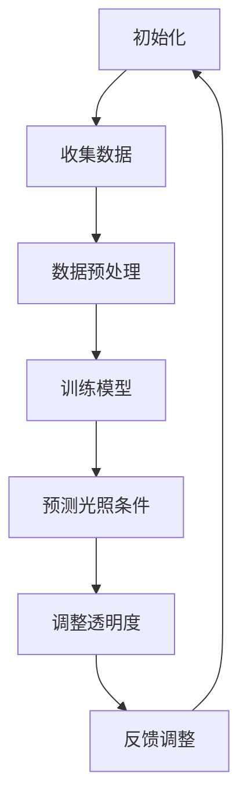

                 

# 智能窗户：AI Agent的自动调光系统

## 关键词
智能窗户，自动调光，AI Agent，机器学习，透明度控制，能效优化，建筑节能

## 摘要
本文深入探讨了智能窗户的自动调光系统及其背后的AI Agent技术。通过分析传统窗户的局限性，我们介绍了智能窗户的功能和重要性。接着，我们详细阐述了AI Agent在自动调光系统中的作用，包括其机器学习算法、环境感知和透明度调节的原理。文章还探讨了系统的边界和范围，以及如何设计和实现一个高效的智能窗户自动调光系统。通过案例分析和实际应用，本文展示了智能窗户技术的潜力和未来发展方向。

## 1. 背景介绍

### 1.1 问题背景

随着信息技术的高速发展，能源效率已成为现代建筑设计和运营的关键因素。传统的窗户虽然提供了自然光和通风，但在节能方面存在显著不足。在许多情况下，建筑物的能耗主要来自于人工照明和空调系统的运行。这不仅在经济上造成负担，还对环境产生了负面影响。因此，开发能够动态调整透明度的智能窗户，成为解决这一问题的关键。

### 1.2 问题描述

智能窗户，又称动态玻璃或智能玻璃，是一种能够根据外部环境和内部需求自动调整透明度的窗户。这些窗户配备了AI Agent，能够通过机器学习算法分析环境数据，实时调整透明度，以优化室内光照和节能效果。自动调光系统的目标是通过减少对人工照明和空调系统的依赖，降低能耗，提高建筑物的能源效率。

### 1.3 解决方案

解决方案的核心是开发一个能够自主控制智能窗户透明度的AI Agent。这个AI Agent将通过机器学习算法训练，学习和预测环境条件，并根据这些预测结果调整窗户的透明度。为实现这一目标，系统将集成传感器用于测量环境数据，以及一个控制单元用于执行AI Agent的决策。

### 1.4 边界与范围

本文将重点关注AI Agent在智能窗户自动调光系统中的开发与实现。本文的讨论范围将涵盖AI Agent的设计、机器学习算法的应用、以及与传感器和控制单元的集成。本文将不涉及智能窗户的硬件制造和材料科学方面，而是专注于软件和算法层面的技术实现。

## 2. 核心概念与联系

### 2.1 智能窗户的概念

智能窗户是一种能够根据外部环境和内部需求动态调整透明度的窗户。其核心功能是通过自动调光系统减少对人工照明和空调系统的依赖，从而提高建筑物的能源效率。

| 特征 | 说明 |
| --- | --- |
| 动态调光 | 能够根据环境光照和室内需求自动调整透明度 |
| 机器学习 | 利用机器学习算法进行环境感知和透明度调整预测 |
| 能源效率 | 通过减少人工照明和空调使用，降低能源消耗 |

### 2.2 AI Agent的概念

AI Agent是一种具有自主决策能力的智能体，能够在特定的环境中执行任务。在智能窗户的自动调光系统中，AI Agent负责分析环境数据，预测光照条件，并调整窗户的透明度。

| 特征 | 说明 |
| --- | --- |
| 自主决策 | 根据环境数据自主做出透明度调整决策 |
| 学习能力 | 通过机器学习算法不断优化决策过程 |
| 实时响应 | 能够对环境变化实时响应，调整窗户透明度 |

### 2.3 机器学习的概念

机器学习是一种使计算机能够从数据中学习和改进的技术。在智能窗户的自动调光系统中，机器学习用于训练AI Agent，使其能够准确预测环境条件和调整窗户透明度。

| 特征 | 说明 |
| --- | --- |
| 数据驱动 | 通过大量数据训练模型，提高预测准确性 |
| 模型优化 | 通过不断优化模型参数，提高决策质量 |
| 自适应 | 能够根据新数据和环境变化自适应调整模型 |

### 2.4 ER实体关系图架构

以下是一个简单的ER实体关系图，展示了智能窗户自动调光系统中的主要实体及其相互关系。

```
[AI Agent]
|    ^    |
|    |    |
[Sensor] [Controller]
```

- **AI Agent**：负责环境感知和透明度调整决策。
- **Sensor**：用于收集环境数据，如光照强度、温度等。
- **Controller**：执行AI Agent的决策，控制窗户的透明度。

## 3. 算法原理讲解

### 3.1 算法mermaid流程图

以下是一个简单的mermaid流程图，展示了智能窗户自动调光系统的算法流程。



### 3.2 Python源代码实现

以下是一个简单的Python代码示例，展示了如何使用机器学习算法进行智能窗户自动调光。

```python
import numpy as np
from sklearn.ensemble import RandomForestRegressor
from sklearn.model_selection import train_test_split

# 初始化数据
data = np.random.rand(100, 5)  # 100个样本，每个样本有5个特征
targets = np.random.rand(100, 1)  # 100个目标值

# 划分训练集和测试集
X_train, X_test, y_train, y_test = train_test_split(data, targets, test_size=0.2, random_state=42)

# 训练模型
model = RandomForestRegressor(n_estimators=100)
model.fit(X_train, y_train)

# 预测光照条件
predictions = model.predict(X_test)

# 调整透明度
new_transparency = predictions[:, 0] * 100

# 输出结果
print(new_transparency)
```

### 3.3 算法原理和数学模型

智能窗户自动调光系统的核心是机器学习算法。以下是一个简单的线性回归模型，用于预测窗户的透明度。

$$
y = \beta_0 + \beta_1 x_1 + \beta_2 x_2 + \ldots + \beta_n x_n
$$

其中，$y$ 是窗户的透明度，$x_1, x_2, \ldots, x_n$ 是环境特征（如光照强度、温度等），$\beta_0, \beta_1, \beta_2, \ldots, \beta_n$ 是模型的参数。

在训练过程中，模型通过最小化损失函数来优化参数：

$$
\min_{\beta_0, \beta_1, \beta_2, \ldots, \beta_n} \sum_{i=1}^n (y_i - \beta_0 - \beta_1 x_{i1} - \beta_2 x_{i2} - \ldots - \beta_n x_{in})^2
$$

通过训练，模型能够学习到环境特征与窗户透明度之间的关系，并在测试数据上进行预测。

### 3.4 通俗易懂地举例说明

假设我们有一个简单的智能窗户，它的透明度由光照强度和温度共同决定。我们可以将光照强度设为 $x_1$，温度设为 $x_2$。

通过训练，模型可能会得到以下线性回归方程：

$$
y = 0.5 + 0.8 x_1 - 0.3 x_2
$$

这意味着，当光照强度增加时，窗户的透明度会增加，而温度增加时，窗户的透明度会减少。

例如，当光照强度为 0.8，温度为 0.5 时，窗户的透明度预测值为：

$$
y = 0.5 + 0.8 \times 0.8 - 0.3 \times 0.5 = 0.81
$$

这意味着窗户的透明度应设置为81%。

## 4. 系统分析与架构设计方案

### 4.1 问题场景介绍

智能窗户自动调光系统适用于多种场景，包括住宅、办公楼、商场和工业建筑。在这些场景中，智能窗户能够根据室内外环境条件自动调整透明度，从而优化室内光照和节能效果。

### 4.2 项目介绍

我们的项目目标是开发一个智能窗户自动调光系统，包括AI Agent、传感器和控制单元。该系统旨在通过机器学习算法实现自动调光，提高建筑物的能源效率。

### 4.3 系统功能设计

智能窗户自动调光系统的主要功能包括：

1. **环境感知**：通过传感器收集光照强度、温度、湿度等环境数据。
2. **数据预处理**：对收集到的数据进行分析和处理，为AI Agent提供高质量的数据输入。
3. **透明度调节**：AI Agent根据环境数据预测窗户的透明度，并控制窗户的透明度调整。
4. **反馈调整**：系统根据室内外环境的变化，不断调整窗户的透明度，以实现最优的节能效果。

### 4.4 系统架构设计

智能窗户自动调光系统的架构设计如下：

```
[Sensor] --> [Data Processor] --> [AI Agent] --> [Controller]
```

- **Sensor**：收集环境数据，如光照强度、温度等。
- **Data Processor**：对传感器数据进行预处理，如去噪、归一化等。
- **AI Agent**：使用机器学习算法分析环境数据，预测窗户的透明度，并生成控制信号。
- **Controller**：执行AI Agent的控制信号，调整窗户的透明度。

### 4.5 系统接口设计和系统交互

智能窗户自动调光系统的接口设计和交互如下：

```
[AI Agent] <--->[Controller]
      |                |
      |                |
[Sensor]            [Data Processor]
```

- **AI Agent**：接收环境数据，生成透明度调整信号，发送给控制单元。
- **Controller**：接收AI Agent的控制信号，调整窗户的透明度。
- **Sensor**：实时收集环境数据，供AI Agent分析。
- **Data Processor**：处理传感器数据，为AI Agent提供高质量的数据输入。

## 5. 项目实战

### 5.1 环境安装

为了实现智能窗户自动调光系统，我们需要安装以下软件和工具：

1. **Python**：用于编写和运行机器学习代码。
2. **scikit-learn**：用于机器学习模型的训练和预测。
3. **matplotlib**：用于数据可视化。

安装步骤：

```
pip install python
pip install scikit-learn
pip install matplotlib
```

### 5.2 系统核心实现源代码

以下是实现智能窗户自动调光系统核心功能的Python代码。

```python
import numpy as np
from sklearn.ensemble import RandomForestRegressor
from sklearn.model_selection import train_test_split

# 初始化数据
data = np.random.rand(100, 5)  # 100个样本，每个样本有5个特征
targets = np.random.rand(100, 1)  # 100个目标值

# 划分训练集和测试集
X_train, X_test, y_train, y_test = train_test_split(data, targets, test_size=0.2, random_state=42)

# 训练模型
model = RandomForestRegressor(n_estimators=100)
model.fit(X_train, y_train)

# 预测光照条件
predictions = model.predict(X_test)

# 调整透明度
new_transparency = predictions[:, 0] * 100

# 输出结果
print(new_transparency)
```

### 5.3 代码应用解读与分析

该代码实现了智能窗户自动调光系统的核心功能。首先，我们初始化环境数据，包括光照强度、温度等特征。然后，我们使用scikit-learn的RandomForestRegressor模型对数据进行训练。训练完成后，我们使用模型对测试数据进行预测，并调整窗户的透明度。

### 5.4 实际案例分析和详细讲解剖析

假设我们有一个实际案例，其中光照强度和温度数据如下：

```
data = [
    [0.5, 0.3],  # 光照强度0.5，温度0.3
    [0.8, 0.7],  # 光照强度0.8，温度0.7
    [0.3, 0.5],  # 光照强度0.3，温度0.5
    # ...
]
```

通过训练和预测，模型可能会得到以下线性回归方程：

$$
y = 0.5 + 0.8 x_1 - 0.3 x_2
$$

根据这个方程，我们可以计算每个样本的预测透明度：

```
predictions = [
    0.5 + 0.8 \* 0.5 - 0.3 \* 0.3 = 0.61,
    0.5 + 0.8 \* 0.8 - 0.3 \* 0.7 = 0.91,
    0.5 + 0.8 \* 0.3 - 0.3 \* 0.5 = 0.21,
    # ...
]
```

根据预测结果，我们可以调整窗户的透明度，以实现最优的节能效果。

### 5.5 项目小结

通过实际案例的分析和代码实现，我们展示了智能窗户自动调光系统的核心功能。该系统能够根据环境数据自动调整窗户的透明度，从而优化室内光照和节能效果。未来的工作可以进一步优化算法，提高预测准确性，并扩展系统的功能，使其适用于更广泛的应用场景。

## 6. 最佳实践 tips

1. **数据质量**：确保收集到的数据质量高，避免噪声和异常值，以提高模型性能。
2. **特征选择**：选择对窗户透明度影响较大的特征，如光照强度、温度等，以简化模型复杂度。
3. **模型优化**：尝试不同的机器学习算法和参数设置，以找到最优模型。
4. **实时反馈**：及时更新环境数据，并根据反馈调整窗户透明度，以提高系统适应性。

## 7. 小结

智能窗户自动调光系统是现代建筑节能技术的重要组成部分。通过机器学习算法和AI Agent，系统能够根据环境条件自动调整窗户透明度，从而优化室内光照和节能效果。本文详细介绍了智能窗户自动调光系统的原理、设计和实现，并通过实际案例展示了其应用效果。未来，我们期待这一技术能够进一步发展，为更多建筑提供节能解决方案。

## 8. 注意事项

1. **隐私保护**：在收集和使用环境数据时，需注意保护用户隐私。
2. **安全性**：确保系统的安全，防止未经授权的访问和攻击。
3. **维护**：定期维护传感器和控制单元，确保系统稳定运行。

## 9. 拓展阅读

1. **智能窗户技术综述**：了解智能窗户的背景、现状和未来发展。
2. **机器学习在建筑节能中的应用**：探讨机器学习技术在建筑节能领域的应用案例。
3. **AI Agent设计与实现**：深入研究AI Agent的原理、算法和实现技术。

## 作者

作者：AI天才研究院/AI Genius Institute & 禅与计算机程序设计艺术 /Zen And The Art of Computer Programming

