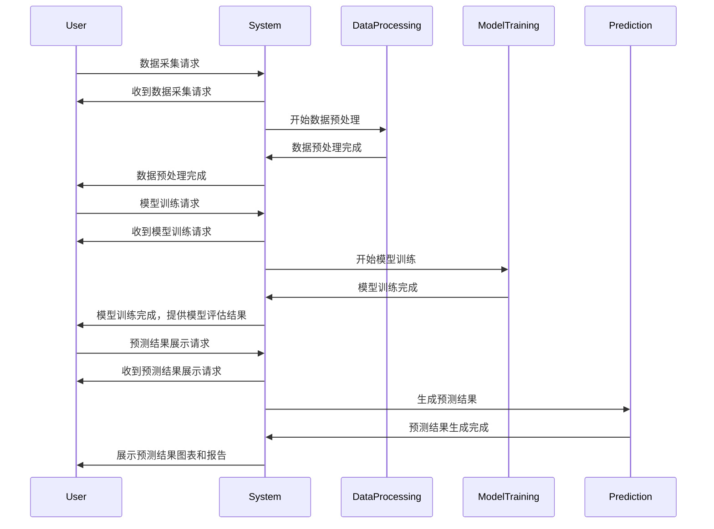

                 

### 摘要

《智能经济指标预测系统》探讨了一种利用人工智能技术，对经济指标进行预测的创新系统。本文首先介绍了智能经济指标预测的背景及其重要性，随后详细阐述了预测系统的核心概念和架构设计。文章分为五个主要部分：概述、核心概念与联系、算法原理讲解、系统分析与架构设计，以及项目实战。通过深入分析时间序列分析、机器学习和深度学习算法，本文为读者提供了从理论到实践的全方位讲解，并分享了一个实际案例的剖析。最后，文章总结了最佳实践技巧，并提出了未来的研究方向和拓展可能性。阅读本文，您将全面了解智能经济指标预测系统的原理和实践，掌握构建和优化预测系统的关键技术。

### 《智能经济指标预测系统》目录大纲

#### 第一部分：智能经济指标预测系统概述

##### 第1章：问题背景与核心概念

1.1 问题的提出  
1.2 经济指标预测的重要性  
1.3 预测系统的应用场景  
1.4 核心概念介绍

1.5 智能经济指标预测系统的边界与外延

##### 第2章：核心概念与联系

2.1 智能经济指标预测原理  
2.2 智能经济指标预测的概念属性特征对比

2.3 智能经济指标预测系统的ER实体关系图架构

#### 第二部分：核心概念与联系

##### 第3章：数据预处理与特征工程

3.1 数据预处理  
3.2 特征工程  
3.3 数据可视化

##### 第4章：时间序列分析

4.1 时间序列基本概念  
4.2 时间序列分析方法  
4.3 时间序列模型应用实例

##### 第5章：机器学习算法

5.1 机器学习基本概念  
5.2 常见机器学习算法  
5.3 机器学习算法应用实例

##### 第6章：深度学习算法

6.1 深度学习基本概念  
6.2 常见深度学习算法  
6.3 深度学习算法应用实例

#### 第三部分：系统分析与架构设计

##### 第7章：系统功能设计

7.1 问题场景介绍  
7.2 系统功能设计

##### 第8章：系统架构设计

8.1 系统架构设计  
8.2 系统架构mermaid架构图

##### 第9章：系统接口设计

9.1 接口规范  
9.2 接口设计文档

##### 第10章：系统交互

10.1 系统交互设计  
10.2 用户操作说明

#### 第四部分：项目实战

##### 第11章：环境安装与配置

11.1 环境准备  
11.2 数据源准备

##### 第12章：系统核心实现

12.1 系统核心代码实现  
12.2 代码应用解读与分析

##### 第13章：实际案例分析

13.1 案例背景  
13.2 案例实施过程  
13.3 案例总结

##### 第14章：项目小结

14.1 实践技巧  
14.2 注意事项  
14.3 拓展阅读

#### 第五部分：最佳实践与拓展

##### 第15章：最佳实践

15.1 数据预处理技巧  
15.2 模型选择与调优  
15.3 系统部署与维护

##### 第16章：小结与拓展

16.1 小结  
16.2 拓展阅读

### 第一部分：智能经济指标预测系统概述

#### 第1章：问题背景与核心概念

##### 1.1 问题的提出

在经济全球化和信息技术飞速发展的今天，经济活动变得更加复杂和不可预测。为了更好地应对这些挑战，政府、企业和研究机构越来越重视经济指标的预测。经济指标是衡量一国或地区经济状况的关键参数，包括GDP增长率、失业率、通货膨胀率、工业生产指数等。这些指标不仅关系到宏观经济政策的制定和调整，也对企业的战略规划、投资决策有着重要的影响。

然而，传统的经济指标预测方法主要依赖于历史数据和经济学模型，存在以下局限性：

1. **数据依赖性高**：传统方法需要大量历史数据，而数据质量和数量往往受到限制。
2. **模型稳定性差**：经济系统存在诸多不确定性因素，传统的静态模型难以适应动态变化。
3. **预测精度有限**：尽管经济学模型不断优化，但预测精度仍存在一定局限性。

为了克服这些局限性，智能经济指标预测系统应运而生。这种系统利用人工智能技术，特别是机器学习和深度学习算法，从海量数据中提取特征，建立预测模型，从而提高经济指标预测的准确性和效率。智能经济指标预测系统不仅能够处理复杂的数据集，还能通过自我学习和优化，不断改进预测性能。

##### 1.2 经济指标预测的重要性

经济指标预测在多个领域具有重要作用：

1. **政策制定**：政府通过经济预测来制定和调整宏观经济政策，如财政政策、货币政策等，以实现经济增长、就业稳定和物价控制等目标。
2. **企业战略**：企业通过经济预测来评估市场环境，制定投资策略，优化生产计划，降低经营风险。
3. **金融市场**：金融机构通过经济预测来评估投资风险和回报，调整资产配置，提高投资收益。
4. **科学研究**：学者和研究机构通过经济预测来探索经济规律，评估政策效果，为宏观经济管理提供理论支持。

智能经济指标预测系统的发展，为各领域提供了更精确、更实时的经济预测工具，极大地提升了决策的科学性和有效性。

##### 1.3 预测系统的应用场景

智能经济指标预测系统广泛应用于以下场景：

1. **宏观经济预测**：政府机构和研究机构使用该系统来预测GDP增长率、失业率、通货膨胀率等宏观经济指标。
2. **产业分析**：企业利用该系统来预测行业发展趋势、市场份额变化，以制定市场进入和退出策略。
3. **风险评估**：金融机构使用该系统来预测市场风险，优化投资组合，降低风险敞口。
4. **市场研究**：市场调研公司使用该系统来预测消费者需求、市场趋势，为企业提供决策支持。

此外，智能经济指标预测系统还可以用于灾害预测、能源管理、供应链优化等领域，具有广泛的应用前景。

##### 1.4 核心概念介绍

为了更好地理解智能经济指标预测系统，我们需要介绍一些核心概念：

1. **智能经济指标**：是指通过人工智能技术处理和分析的经济指标数据。这些数据可以是时间序列数据，也可以是结构化和非结构化数据。
2. **预测系统**：是指利用机器学习和深度学习算法，对智能经济指标进行预测的软件系统。预测系统通常包括数据预处理、特征提取、模型训练和预测输出等模块。
3. **数据预处理**：是指对原始数据进行清洗、归一化和缺失值处理等操作，以提高数据质量和模型的预测性能。
4. **特征工程**：是指从原始数据中提取出对预测任务有帮助的特征，并通过特征选择和特征变换等操作，优化模型的预测效果。
5. **机器学习**：是指通过算法从数据中自动学习规律，并用于预测或分类的任务。常见的机器学习算法包括回归分析、决策树、支持向量机等。
6. **深度学习**：是指通过多层神经网络对大量数据进行自动特征学习和复杂模式识别的技术。常见的深度学习算法包括卷积神经网络（CNN）、循环神经网络（RNN）和生成对抗网络（GAN）等。

通过以上核心概念的介绍，我们可以更好地理解智能经济指标预测系统的基本架构和功能。

##### 1.5 智能经济指标预测系统的边界与外延

智能经济指标预测系统的边界和范围需要明确，以便在实际应用中充分发挥其效能。以下是对预测系统边界的详细说明：

1. **预测指标范围**：智能经济指标预测系统可以涵盖各种经济指标，如GDP增长率、通货膨胀率、失业率、工业生产指数等。这些指标不仅包括宏观经济指标，还可以包括行业指标、区域指标等。
2. **时间跨度**：预测系统可以根据需求进行短期、中期和长期预测。短期预测通常用于市场趋势分析，中期预测用于企业战略规划，长期预测用于宏观经济政策的制定。
3. **数据来源**：预测系统依赖的数据来源广泛，包括官方统计数据、企业报表、金融市场数据、社交媒体数据等。系统需要能够集成多种数据源，并进行数据清洗和预处理。
4. **技术范围**：预测系统的技术范围涵盖机器学习和深度学习算法。这些算法可以根据不同的预测任务和数据特征进行选择和优化。此外，系统还需要具备数据可视化、模型评估和优化等功能。

智能经济指标预测系统的外延包括以下几个方面：

1. **系统集成**：预测系统需要与其他信息系统集成，如企业资源规划（ERP）系统、客户关系管理（CRM）系统等，以实现数据共享和协同工作。
2. **应用拓展**：预测系统不仅可以用于经济指标预测，还可以应用于其他领域，如灾害预测、能源管理、供应链优化等。通过技术拓展和应用场景的扩展，预测系统的价值将得到进一步提升。
3. **实时更新**：预测系统需要具备实时数据更新和预测功能，以确保预测结果始终与实际情况保持一致。这需要系统具备高效的数据处理能力和快速响应机制。

通过明确智能经济指标预测系统的边界与外延，我们可以更好地理解其应用范围和技术需求，为实际应用提供有力支持。

#### 第2章：核心概念与联系

##### 2.1 智能经济指标预测原理

智能经济指标预测系统的基础是预测原理，它融合了时间序列分析、机器学习和深度学习等多种技术。以下是这些技术的详细描述：

1. **时间序列分析**：时间序列分析是一种用于处理和分析时间相关数据的统计方法。在经济指标预测中，时间序列分析主要用于识别数据的趋势、季节性和周期性特征。常见的时间序列模型包括自回归移动平均模型（ARIMA）、季节性分解模型（STL）和转换模型（TSM）等。时间序列模型通过分析历史数据中的时间依赖关系，预测未来的经济走势。

2. **机器学习**：机器学习是一种利用计算机算法从数据中自动学习规律的方法。在经济指标预测中，机器学习算法可以从大量的历史数据中提取特征，构建预测模型。常见的机器学习算法包括线性回归、决策树、随机森林和支持向量机（SVM）等。这些算法通过优化目标函数，找到最佳参数，从而提高预测精度。

3. **深度学习**：深度学习是一种基于多层神经网络的学习方法，能够自动提取数据中的复杂特征。在经济指标预测中，深度学习算法如卷积神经网络（CNN）、循环神经网络（RNN）和生成对抗网络（GAN）等，能够处理高维数据和复杂的非线性关系，从而实现更准确的预测。

##### 2.2 智能经济指标预测的概念属性特征对比

智能经济指标预测系统涉及多个概念，包括时间序列模型、机器学习模型和深度学习模型。以下是对这些概念属性特征的对比：

| 概念 | 特性 |  
| ---- | ---- |  
| 时间序列模型 | 基于历史数据的时间依赖关系，强调趋势、季节性和周期性特征。 |  
| 机器学习模型 | 基于特征学习和目标函数优化，适用于结构化和非结构化数据。 |  
| 深度学习模型 | 基于多层神经网络，自动提取复杂特征，适用于高维数据和复杂关系。 |

时间序列模型通常在处理时间相关数据时表现出较好的性能，但可能无法捕捉到数据中的复杂非线性关系。相比之下，机器学习模型在特征提取和模型优化方面具有较强的灵活性，但需要大量预处理工作。深度学习模型则通过自动特征提取和复杂非线性处理，实现了更高的预测精度，但计算资源和模型参数需求较高。

##### 2.3 智能经济指标预测系统的ER实体关系图架构

智能经济指标预测系统的实体关系图（ER图）架构是系统设计的重要部分，它清晰地展示了系统中各个实体及其之间的关系。以下是ER图的详细描述：

1. **实体**：在智能经济指标预测系统中，主要的实体包括数据源、数据预处理模块、特征工程模块、预测模型和结果输出模块。

2. **关系**：实体之间的关系包括数据流、控制流和信息流。

3. **数据源**：数据源是系统的起点，包括各种经济指标数据，如GDP增长率、通货膨胀率等。数据源通过接口与系统相连，提供原始数据。

4. **数据预处理模块**：数据预处理模块负责清洗、归一化和缺失值处理等操作，以提高数据质量和模型预测性能。

5. **特征工程模块**：特征工程模块从原始数据中提取有用的特征，通过特征选择和特征变换等操作，优化模型的预测效果。

6. **预测模型**：预测模型是系统的核心，包括时间序列模型、机器学习模型和深度学习模型等。模型通过训练数据学习数据中的规律，并利用这些规律进行预测。

7. **结果输出模块**：结果输出模块负责将预测结果以图形、表格或报告的形式展示给用户，并提供接口供其他系统或应用程序调用。

通过ER图，我们可以清晰地了解智能经济指标预测系统的整体架构，以及各个模块之间的相互关系。这有助于系统设计和开发人员更好地理解系统工作原理，优化系统性能。

#### 第3章：数据预处理与特征工程

##### 3.1 数据预处理

数据预处理是智能经济指标预测系统中至关重要的一步，其目的是提高数据质量和模型的预测性能。以下是对数据预处理的主要步骤和方法的详细描述：

1. **数据清洗**：数据清洗是预处理的首要步骤，其主要任务是识别和纠正数据中的错误、缺失值和不一致。具体方法包括：
   - **错误值识别**：通过设置阈值、逻辑检查等方法识别异常数据。
   - **缺失值处理**：对于缺失值，可以采用以下方法：
     - **删除**：删除含有缺失值的样本或特征。
     - **填补**：采用均值、中值、插值等方法填补缺失值。
     - **预测填补**：利用模型预测缺失值，常见方法包括线性回归、KNN等。

2. **数据归一化**：数据归一化是将不同特征的数据统一到同一尺度，以避免特征之间的重要性差异对模型训练的影响。常用的归一化方法包括：
   - **最小-最大缩放**：将特征值缩放到[0, 1]范围内。
   - **标准缩放**：将特征值缩放到标准正态分布，即均值为0，标准差为1。
   - **小数点移位**：通过移动小数点，将特征值统一到同一数量级。

3. **异常值处理**：异常值处理是识别和纠正数据中的异常值。常见的方法包括：
   - **阈值法**：设置阈值，将大于或小于阈值的值视为异常值。
   - **箱线图法**：使用箱线图识别异常值，通常包括上四分位数和下四分位数的1.5倍范围。
   - **孤立森林法**：通过孤立森林算法识别异常值，该方法利用随机森林的统计特性进行异常值检测。

4. **时间序列处理**：对于时间序列数据，还需要进行时间序列的处理，如季节性分解、平稳性检验等，以确保数据满足预测模型的假设。

##### 3.2 特征工程

特征工程是从原始数据中提取对预测任务有帮助的特征，并通过特征选择和特征变换等操作，优化模型的预测性能。以下是特征工程的主要步骤和方法的详细描述：

1. **特征提取**：特征提取是从原始数据中提取新的特征，以增强模型的预测能力。常见的特征提取方法包括：
   - **统计特征**：如平均值、中值、标准差、自相关函数等。
   - **变换特征**：如对数变换、平方根变换等，用于处理非线性关系。
   - **文本特征**：如词频、词向量化等，用于文本数据的特征提取。

2. **特征选择**：特征选择是从提取的特征中选出对预测任务最有帮助的特征，以减少模型的复杂度和过拟合现象。常见的方法包括：
   - **过滤法**：通过计算特征与目标变量的相关性、信息增益等指标进行筛选。
   - **包装法**：通过构建和评估预测模型来选择特征，如递归特征消除（RFE）等。
   - **嵌入式法**：在模型训练过程中进行特征选择，如LASSO、Ridge等。

3. **特征变换**：特征变换是通过变换特征空间，增强特征之间的交互性和可解释性。常见的方法包括：
   - **主成分分析（PCA）**：通过正交变换，将多个特征转换为一组新的主成分，以减少数据的维度。
   - **特征组合**：通过组合多个特征，生成新的特征，以增强模型的预测能力。

4. **特征重要性分析**：特征重要性分析是评估特征对预测任务的重要性，以指导特征选择和模型优化。常见的方法包括：
   - **模型评价指标**：如模型的准确率、召回率等，用于评估特征的重要性。
   - **特征贡献率**：通过计算特征对模型预测误差的贡献率，评估特征的重要性。
   - **特征的重要性排序**：通过排序特征的重要性，指导特征选择和模型优化。

通过数据预处理和特征工程，我们可以显著提高模型的预测性能和泛化能力，从而实现更准确的智能经济指标预测。

##### 3.3 数据可视化

数据可视化是将数据以图形化的形式展示，帮助用户理解和分析数据。在智能经济指标预测系统中，数据可视化不仅有助于展示预测结果，还可以辅助数据预处理和特征工程。以下是数据可视化的一些方法和工具：

1. **折线图**：折线图常用于展示时间序列数据的变化趋势。通过连接各个时间点的数据点，可以清晰地观察到数据的波动和趋势。

2. **柱状图**：柱状图适用于展示不同类别或不同时间点的数据对比。柱状图的高度表示数据的大小，通过对比不同柱状图，可以直观地了解各类别或时间点的差异。

3. **散点图**：散点图用于展示两个特征之间的关系。每个数据点表示一个样本，通过观察数据点的分布，可以判断特征之间的相关性。

4. **箱线图**：箱线图用于展示数据的分布情况，包括最小值、第一四分位数、中位数、第三四分位数和最大值。通过箱线图，可以识别数据的异常值和分布特征。

5. **热力图**：热力图用于展示特征之间的相关性或特征与目标变量之间的关系。通过颜色深浅表示数据的大小，可以直观地观察特征的重要性和相互作用。

6. **散点矩阵图**：散点矩阵图是一种二维矩阵形式的散点图，适用于展示多个特征之间的关系。每个单元格内的散点表示两个特征之间的关系。

7. **交互式可视化**：交互式可视化工具如Tableau、Power BI等，可以提供丰富的交互功能，用户可以通过拖拽、筛选等操作，动态地查看和分析数据。

通过数据可视化，我们可以更直观地理解数据，发现数据中的模式、趋势和异常，从而指导数据预处理和特征工程。同时，可视化结果也有助于模型评估和决策支持，提高预测系统的透明度和可解释性。

#### 第4章：时间序列分析

##### 4.1 时间序列基本概念

时间序列分析是智能经济指标预测系统的核心组成部分，它涉及对时间相关数据的处理和分析。以下是对时间序列基本概念的详细解释：

1. **时间序列的定义**：时间序列是一系列按照时间顺序排列的数据点，每个数据点表示在特定时间点上的观察值。时间序列可以是连续的，如每天的股票价格，也可以是离散的，如每季度的GDP增长率。

2. **时间序列的特征指标**：时间序列具有以下基本特征指标：
   - **趋势（Trend）**：时间序列的整体上升或下降趋势。趋势可以通过移动平均、指数平滑等方法识别。
   - **季节性（Seasonality）**：时间序列在一年内重复出现的周期性波动，如节假日效应、季节性销售高峰等。季节性可以通过季节性分解、季节性模型等方法识别。
   - **周期性（Cyclicity）**：时间序列中的长期波动，通常由经济周期或商业周期引起。周期性可以通过周期性模型、波动分析等方法识别。
   - **随机性（Randomness）**：时间序列中无法预测的随机波动，通常由不确定的外部因素引起。

3. **时间序列数据的类型**：时间序列数据可以分为以下几种类型：
   - **确定性时间序列**：所有数据点都可以通过某个数学公式或模型精确预测。
   - **非确定性时间序列**：数据点无法通过简单的数学公式预测，存在不确定性。
   - **平稳时间序列**：时间序列的统计特性（如均值、方差等）不随时间变化而变化。
   - **非平稳时间序列**：时间序列的统计特性随时间变化而变化。

理解时间序列的基本概念是进行有效预测的基础。通过识别和利用时间序列的特征指标，我们可以更准确地建模和预测未来的经济指标。

##### 4.2 时间序列分析方法

时间序列分析方法主要包括自回归移动平均模型（ARIMA）、季节性分解模型（STL）和转换模型（TSM）等。以下是对这些方法的具体解释：

1. **自回归移动平均模型（ARIMA）**：
   - **定义**：ARIMA模型是一种常用的时间序列预测方法，通过自回归（AR）、移动平均（MA）和差分（I）三个步骤构建模型。
   - **原理**：
     - **自回归（AR）**：利用过去一段时间内的数据值预测当前值，即当前值是过去若干个值的加权平均。
     - **移动平均（MA）**：利用过去一段时间内的预测误差值预测当前值，即当前值是过去若干个预测误差的加权平均。
     - **差分（I）**：对时间序列进行差分操作，使其变得平稳，提高模型的预测性能。
   - **模型参数**：ARIMA模型的主要参数包括自回归项（p）、移动平均项（q）和差分阶数（d）。

2. **季节性分解模型（STL）**：
   - **定义**：STL模型是一种用于处理季节性时间序列的分解模型，它将时间序列分解为趋势（T）、季节性（S）和残余（L）三个部分。
   - **原理**：
     - **趋势（T）**：表示时间序列的长期变化趋势。
     - **季节性（S）**：表示时间序列的季节性波动，如一年中的季节性高峰和低谷。
     - **残余（L）**：表示时间序列中的随机波动。
   - **模型参数**：STL模型的主要参数包括季节性周期（s）和分解方法的平滑参数。

3. **转换模型（TSM）**：
   - **定义**：TSM模型是一种结合自回归移动平均模型和季节性分解模型的综合模型，它通过转换操作使时间序列满足平稳性条件，然后应用ARIMA模型进行预测。
   - **原理**：
     - **转换操作**：通过变换操作（如对数变换、平方根变换等）将非平稳时间序列转换为平稳时间序列。
     - **ARIMA模型**：对转换后的平稳时间序列应用ARIMA模型进行预测。
   - **模型参数**：TSM模型的主要参数包括转换函数形式、ARIMA模型的参数（p、q、d）等。

时间序列分析方法的选择取决于数据的特点和应用需求。通过合理选择和应用这些方法，我们可以对智能经济指标进行有效的预测。

##### 4.3 时间序列模型应用实例

为了更好地理解时间序列模型的应用，以下通过一个实际案例进行分析和讲解。

**案例背景**：假设我们想预测某个城市的月平均温度，以便为市民提供准确的生活和工作建议。我们的数据集包含过去五年的月平均温度数据。

**数据处理**：首先，我们对数据进行预处理，包括数据清洗和归一化。假设数据已经通过清洗，没有缺失值和异常值。

**模型选择**：由于温度数据具有明显的季节性波动，我们选择季节性分解模型（STL）进行预测。

**模型训练**：我们将数据集分为训练集和测试集。训练集用于模型训练，测试集用于评估模型性能。

```python
import statsmodels.api as sm
from statsmodels.tsa.seasonal import STL

# STL模型训练
stl = STL(data, season=12)
stl.fit()
```

**模型评估**：通过训练集数据，我们得到季节性分解的结果。然后，我们将残余部分（L）作为新的时间序列数据，并应用ARIMA模型进行预测。

```python
# ARIMA模型预测
arima_model = sm.ARIMA(stl.resid, order=(1, 1, 1))
arima_model_fit = arima_model.fit()
arima_prediction = arima_model_fit.forecast(steps=12)
```

**预测结果分析**：我们得到未来12个月的温度预测结果。通过比较预测值和实际值，可以评估模型的预测性能。如果预测结果与实际值相差较大，则需要调整模型参数或选择其他模型。

```python
import matplotlib.pyplot as plt

# 预测结果可视化
plt.plot(arima_prediction)
plt.plot(data[-12:], label='Actual')
plt.legend()
plt.show()
```

通过上述步骤，我们成功应用了时间序列模型对月平均温度进行了预测。这个案例展示了时间序列模型从数据处理到预测的全过程，为智能经济指标预测系统提供了一个实际应用实例。

#### 第5章：机器学习算法

##### 5.1 机器学习基本概念

机器学习（Machine Learning，ML）是一种利用计算机算法从数据中自动学习规律，并用于预测或分类的技术。其核心思想是通过训练数据集，使算法能够从数据中提取特征，建立预测模型，从而对未知数据进行预测。

1. **机器学习的定义**：机器学习是人工智能的一个重要分支，它使计算机系统能够通过数据学习和改进性能，而无需显式编程。机器学习的过程包括数据收集、数据预处理、特征提取、模型训练、模型评估和模型部署等步骤。

2. **机器学习的基本流程**：
   - **数据收集**：收集用于训练的数据集，数据可以是结构化的（如表格）、半结构化的（如XML、JSON）或非结构化的（如图像、文本）。
   - **数据预处理**：对原始数据清洗、归一化和缺失值处理等操作，以提高数据质量和模型的预测性能。
   - **特征提取**：从原始数据中提取对预测任务有帮助的特征，并通过特征选择和特征变换等操作，优化模型的预测效果。
   - **模型训练**：利用训练数据集，通过算法训练模型，使其能够从数据中学习规律。
   - **模型评估**：通过测试数据集评估模型的预测性能，包括准确率、召回率、F1分数等指标。
   - **模型部署**：将训练好的模型部署到实际应用环境中，进行实时预测。

3. **机器学习的分类**：
   - **监督学习（Supervised Learning）**：训练数据包括特征和标签，模型通过学习特征和标签之间的关系进行预测。常见的算法包括线性回归、决策树、随机森林和神经网络等。
   - **无监督学习（Unsupervised Learning）**：训练数据没有标签，模型通过学习数据的内在结构或特征进行聚类或降维。常见的算法包括K-均值聚类、主成分分析（PCA）和自编码器等。
   - **半监督学习（Semi-Supervised Learning）**：训练数据包括少量有标签的数据和大量无标签的数据，模型通过同时利用这两种数据进行学习。
   - **强化学习（Reinforcement Learning）**：模型通过与环境的交互进行学习，通过不断尝试和反馈，找到最优策略。

##### 5.2 常见机器学习算法

在智能经济指标预测系统中，机器学习算法是核心组成部分。以下介绍几种常见的机器学习算法及其原理和应用：

1. **线性回归（Linear Regression）**：
   - **定义**：线性回归是一种监督学习算法，用于预测连续数值型目标变量。模型假设目标变量是特征变量的线性组合。
   - **原理**：通过最小化预测值与实际值之间的误差平方和，找到最佳拟合直线。公式为：
     \[
     y = \beta_0 + \beta_1x_1 + \beta_2x_2 + \ldots + \beta_nx_n
     \]
     其中，\(y\) 是目标变量，\(x_1, x_2, \ldots, x_n\) 是特征变量，\(\beta_0, \beta_1, \beta_2, \ldots, \beta_n\) 是模型参数。
   - **应用**：线性回归常用于回归分析、经济预测、金融建模等领域。

2. **决策树（Decision Tree）**：
   - **定义**：决策树是一种基于树结构的监督学习算法，通过一系列规则对数据进行分类或回归。
   - **原理**：决策树通过递归划分特征空间，将数据划分为多个子集，每个子集对应一个规则。树的每个节点表示一个特征，每个分支表示特征的不同取值。
   - **应用**：决策树广泛应用于分类和回归问题，如信用评分、医疗诊断、分类预测等。

3. **随机森林（Random Forest）**：
   - **定义**：随机森林是一种基于决策树的集成学习方法，通过构建多棵决策树，并采用投票或平均方法进行预测。
   - **原理**：随机森林在训练过程中，对数据集进行多次随机抽样，构建多棵决策树，并利用这些树进行预测。通过集成多个模型的预测结果，提高预测性能。
   - **应用**：随机森林在分类和回归任务中具有广泛的应用，特别适用于处理高维数据和噪声数据。

4. **支持向量机（Support Vector Machine，SVM）**：
   - **定义**：支持向量机是一种用于分类和回归问题的监督学习算法，通过找到一个最佳的超平面，将不同类别的数据点分离。
   - **原理**：SVM通过最大化类之间的间隔（Margin）来寻找最佳超平面。对于分类问题，SVM的目标是找到最佳分类边界，使得分类间隔最大。对于回归问题，SVM通过最小化误差平方和来拟合数据。
   - **应用**：SVM在金融、生物信息、图像识别等领域具有广泛应用。

5. **神经网络（Neural Network）**：
   - **定义**：神经网络是一种模拟人脑神经元之间交互的模型，通过多层神经网络进行复杂的特征学习和非线性变换。
   - **原理**：神经网络由多个神经元组成，每个神经元接收多个输入，并通过激活函数产生输出。多层神经网络可以通过前向传播和反向传播算法进行训练，逐步优化模型参数。
   - **应用**：神经网络广泛应用于图像识别、语音识别、自然语言处理等领域，特别适用于处理高维数据和复杂非线性问题。

通过掌握这些常见的机器学习算法，我们可以根据不同的预测任务和数据特点，选择合适的算法，构建和优化智能经济指标预测系统。

##### 5.3 机器学习算法应用实例

为了更好地理解机器学习算法在实际预测中的应用，以下通过一个具体的案例进行讲解。

**案例背景**：假设我们想要预测一个城市的未来一个月的月平均降雨量，以便相关机构提前做好防洪措施。我们拥有过去五年的月平均降雨量数据，包括每天的最高温度、最低温度、湿度等气象数据。

**数据处理**：首先，我们对数据进行预处理，包括数据清洗和特征提取。假设数据已经通过清洗，没有缺失值和异常值。

**模型选择**：由于降雨量是一个连续的数值型目标变量，我们选择线性回归模型进行预测。

**模型训练**：我们将数据集分为训练集和测试集。训练集用于模型训练，测试集用于评估模型性能。

```python
import numpy as np
import pandas as pd
from sklearn.linear_model import LinearRegression

# 数据加载
data = pd.read_csv('weather_data.csv')
X = data[['max_temp', 'min_temp', 'humidity']]
y = data['rainfall']

# 线性回归模型训练
model = LinearRegression()
model.fit(X, y)
```

**模型评估**：通过训练集数据，我们得到模型的参数。然后，我们使用测试集评估模型的预测性能。

```python
# 预测结果
predictions = model.predict(X_test)

# 评估指标
score = model.score(X_test, y_test)
print('Model R-squared:', score)
```

**预测结果分析**：我们得到未来一个月的降雨量预测结果。通过比较预测值和实际值，可以评估模型的预测性能。如果预测结果与实际值相差较大，则需要调整模型参数或选择其他模型。

```python
import matplotlib.pyplot as plt

# 预测结果可视化
plt.plot(y_test, label='Actual')
plt.plot(predictions, label='Predicted')
plt.legend()
plt.show()
```

通过上述步骤，我们成功应用了线性回归模型对月平均降雨量进行了预测。这个案例展示了机器学习算法从数据处理到预测的全过程，为智能经济指标预测系统提供了一个实际应用实例。

#### 第6章：深度学习算法

##### 6.1 深度学习基本概念

深度学习（Deep Learning，DL）是机器学习的一个分支，通过多层神经网络（Neural Networks）对数据进行自动特征学习和复杂模式识别。与传统的机器学习算法相比，深度学习具有更强的表达能力和泛化能力，能够处理高维数据和复杂非线性问题。

1. **深度学习的定义**：深度学习是一种基于多层神经网络的学习方法，通过堆叠多个隐藏层，自动提取数据中的层次特征，从而实现对数据的深层理解。深度学习的核心思想是通过反向传播算法（Backpropagation）和梯度下降优化（Gradient Descent）等技巧，训练神经网络模型，使其能够对输入数据进行准确预测。

2. **深度学习的核心组成部分**：
   - **神经元（Neuron）**：神经网络的基本单元，接收多个输入，通过加权求和处理后，经过激活函数产生输出。
   - **层（Layer）**：神经网络由多个层组成，包括输入层、隐藏层和输出层。隐藏层负责提取特征，输出层负责生成预测结果。
   - **激活函数（Activation Function）**：用于引入非线性因素，使神经网络能够处理复杂非线性问题。常见的激活函数包括ReLU（Rectified Linear Unit）、Sigmoid和Tanh等。
   - **权重（Weights）和偏置（Bias）**：在神经网络中，每个神经元之间的连接都带有权重，用于调整输入的重要程度。此外，每个神经元还包含一个偏置项，用于调整输出。
   - **优化算法**：用于训练神经网络模型，优化模型参数。常见的优化算法包括随机梯度下降（SGD）、Adam优化器等。

3. **深度学习的应用场景**：
   - **图像识别**：通过卷积神经网络（CNN）处理图像数据，实现物体识别、面部识别等任务。
   - **自然语言处理**：通过循环神经网络（RNN）和Transformer模型等处理文本数据，实现语言翻译、情感分析等任务。
   - **语音识别**：通过深度神经网络处理语音信号，实现语音识别和语音合成。
   - **推荐系统**：通过深度学习模型分析用户行为数据，实现个性化推荐。

##### 6.2 常见深度学习算法

在智能经济指标预测系统中，深度学习算法是核心组成部分。以下介绍几种常见的深度学习算法及其原理和应用：

1. **卷积神经网络（Convolutional Neural Network，CNN）**：
   - **定义**：卷积神经网络是一种用于处理图像数据的深度学习模型，通过卷积层、池化层和全连接层等结构，自动提取图像特征。
   - **原理**：
     - **卷积层（Convolutional Layer）**：通过卷积运算提取图像的局部特征，如边缘、纹理等。
     - **池化层（Pooling Layer）**：通过下采样操作减少数据维度，增强模型泛化能力。
     - **全连接层（Fully Connected Layer）**：将卷积层和池化层提取的特征映射到分类或回归任务中。
   - **应用**：CNN广泛应用于图像分类、物体检测、人脸识别等领域。

2. **循环神经网络（Recurrent Neural Network，RNN）**：
   - **定义**：循环神经网络是一种用于处理序列数据的深度学习模型，通过隐藏状态和循环连接实现序列记忆。
   - **原理**：
     - **隐藏状态（Hidden State）**：RNN在每个时间步的隐藏状态包含当前输入和之前隐藏状态的结合，用于处理序列依赖关系。
     - **循环连接（Recurrence Connection）**：RNN通过循环连接将当前时间步的隐藏状态传递到下一个时间步，实现序列的记忆。
   - **应用**：RNN广泛应用于语音识别、机器翻译、时间序列预测等领域。

3. **长短时记忆网络（Long Short-Term Memory，LSTM）**：
   - **定义**：长短时记忆网络是RNN的一种改进模型，通过引入门控机制解决RNN的梯度消失和梯度爆炸问题。
   - **原理**：
     - **门控机制（Gate Mechanism）**：LSTM通过遗忘门、输入门和输出门控制信息的流动，防止长程依赖问题。
     - **细胞状态（Cell State）**：LSTM通过细胞状态存储和传递序列信息，实现长期记忆。
   - **应用**：LSTM广泛应用于时间序列预测、语言模型、语音识别等领域。

4. **生成对抗网络（Generative Adversarial Network，GAN）**：
   - **定义**：生成对抗网络是一种由生成器和判别器组成的深度学习模型，通过对抗训练生成与真实数据相似的样本。
   - **原理**：
     - **生成器（Generator）**：生成器从随机噪声中生成伪样本，试图欺骗判别器。
     - **判别器（Discriminator）**：判别器判断生成的伪样本是否真实，通过对抗生成器和判别器，使生成器生成的样本逐渐逼近真实数据。
   - **应用**：GAN广泛应用于图像生成、风格迁移、数据增强等领域。

通过掌握这些常见的深度学习算法，我们可以根据不同的预测任务和数据特点，选择合适的算法，构建和优化智能经济指标预测系统。

##### 6.3 深度学习算法应用实例

为了更好地理解深度学习算法在实际预测中的应用，以下通过一个具体的案例进行讲解。

**案例背景**：假设我们想要预测一个城市的未来一周的天气情况，包括最高温度、最低温度和降雨量。我们拥有过去五年的天气数据，包括每日的最高温度、最低温度、湿度、风速等气象数据。

**数据处理**：首先，我们对数据进行预处理，包括数据清洗和特征提取。假设数据已经通过清洗，没有缺失值和异常值。

**模型选择**：由于天气数据具有时间序列特性，我们选择长短时记忆网络（LSTM）进行预测。

**模型训练**：我们将数据集分为训练集和测试集。训练集用于模型训练，测试集用于评估模型性能。

```python
import numpy as np
import pandas as pd
from tensorflow.keras.models import Sequential
from tensorflow.keras.layers import LSTM, Dense, Dropout

# 数据加载
data = pd.read_csv('weather_data.csv')
X = data[['max_temp', 'min_temp', 'humidity']]
y = data[['max_temp', 'min_temp', 'rainfall']]

# 数据归一化
X = (X - X.mean()) / X.std()
y = (y - y.mean()) / y.std()

# 切割数据为时间序列格式
X = np.array(X).reshape(-1, 1, X.shape[1])
y = np.array(y).reshape(-1, 1, y.shape[1])

# LSTM模型训练
model = Sequential()
model.add(LSTM(50, input_shape=(X.shape[1], X.shape[2]), return_sequences=True))
model.add(Dropout(0.2))
model.add(LSTM(50, return_sequences=False))
model.add(Dropout(0.2))
model.add(Dense(y.shape[1]))
model.compile(optimizer='adam', loss='mse')
model.fit(X, y, epochs=100, batch_size=32)
```

**模型评估**：通过训练集数据，我们得到模型的参数。然后，我们使用测试集评估模型的预测性能。

```python
# 预测结果
predictions = model.predict(X_test)

# 反归一化
predictions = (predictions * y.std()) + y.mean()

# 评估指标
mse = np.mean(np.square(y_test - predictions))
print('Model Mean Squared Error:', mse)
```

**预测结果分析**：我们得到未来一周的天气预测结果。通过比较预测值和实际值，可以评估模型的预测性能。如果预测结果与实际值相差较大，则需要调整模型参数或选择其他模型。

```python
import matplotlib.pyplot as plt

# 预测结果可视化
plt.plot(y_test.reshape(-1, 1).T, label='Actual')
plt.plot(predictions.reshape(-1, 1).T, label='Predicted')
plt.legend()
plt.show()
```

通过上述步骤，我们成功应用了LSTM模型对天气情况进行了预测。这个案例展示了深度学习算法从数据处理到预测的全过程，为智能经济指标预测系统提供了一个实际应用实例。

#### 第7章：系统功能设计

##### 7.1 问题场景介绍

智能经济指标预测系统旨在为政府、企业和研究机构提供高效、准确的经济预测服务。在实际应用中，系统需处理多种经济指标数据，如GDP增长率、通货膨胀率、失业率、工业生产指数等，并能够根据不同需求进行定制化预测。

**问题场景**：

1. **政府宏观调控**：政府需要预测未来一段时间内的宏观经济指标，以便制定合理的财政政策和货币政策，实现经济平稳增长和就业稳定。
2. **企业战略规划**：企业需要预测市场需求、利润增长率等指标，以制定生产计划、投资策略和市场营销策略。
3. **研究机构学术研究**：研究机构需要预测经济指标，为学术研究和政策建议提供数据支持。
4. **金融机构风险评估**：金融机构需要预测市场风险，优化投资组合，降低风险敞口。

##### 7.2 系统功能设计

为了满足上述问题场景的需求，智能经济指标预测系统设计了以下功能模块：

1. **数据采集与处理模块**：
   - 功能：负责从各种数据源（如数据库、API接口、爬虫等）采集经济指标数据，并进行数据清洗、归一化和缺失值处理。
   - 技术实现：采用Python的Pandas库进行数据处理，使用Scikit-learn进行数据归一化和缺失值处理。

2. **特征提取与工程模块**：
   - 功能：负责从原始数据中提取有用的特征，并通过特征选择和特征变换等操作，优化模型的预测性能。
   - 技术实现：使用Python的FeatureEnginner库进行特征提取和选择，通过主成分分析（PCA）等方法进行特征变换。

3. **预测模型训练模块**：
   - 功能：负责训练不同类型的预测模型（如时间序列模型、机器学习模型、深度学习模型等），并通过交叉验证和超参数调优，选择最优模型。
   - 技术实现：使用Python的Scikit-learn库和Keras库进行模型训练和调优。

4. **预测结果可视化模块**：
   - 功能：负责将预测结果以图形、表格或报告的形式展示给用户，并提供数据分析和决策支持。
   - 技术实现：采用Python的Matplotlib和Seaborn库进行数据可视化，使用Jupyter Notebook提供交互式可视化界面。

5. **系统接口与集成模块**：
   - 功能：负责与其他系统（如ERP、CRM等）集成，提供API接口供其他应用程序调用。
   - 技术实现：采用RESTful API设计，使用Flask或Django框架实现接口。

6. **用户管理与权限控制模块**：
   - 功能：负责用户注册、登录、权限管理等功能，确保系统安全性和用户隐私。
   - 技术实现：采用JWT（JSON Web Token）技术进行身份验证和授权，使用Python的Flask-Login库实现用户管理。

通过以上功能模块的设计，智能经济指标预测系统可以满足多种应用场景的需求，提供高效、准确的经济预测服务。

##### 领域模型mermaid类图

为了更好地展示智能经济指标预测系统的领域模型，我们可以使用mermaid类图来表示各个实体及其关系。以下是类图的描述：

```mermaid
classDiagram
    Data采集与处理模块 <<Interface>>
    Feature提取与工程模块 <<Interface>>
    预测模型训练模块 <<Interface>>
    预测结果可视化模块 <<Interface>>
    系统接口与集成模块 <<Interface>>
    用户管理与权限控制模块 <<Interface>>

    Data采集与处理模块 --|> Feature提取与工程模块
    Feature提取与工程模块 --|> 预测模型训练模块
    预测模型训练模块 --|> 预测结果可视化模块
    系统接口与集成模块 --|> 预测结果可视化模块
    用户管理与权限控制模块 --|> 系统接口与集成模块

    class Data采集与处理模块 {
        - 数据采集方法()
        - 数据清洗方法()
        - 数据归一化方法()
    }

    class Feature提取与工程模块 {
        - 特征提取方法()
        - 特征选择方法()
        - 特征变换方法()
    }

    class 预测模型训练模块 {
        - 模型训练方法()
        - 超参数调优方法()
        - 交叉验证方法()
    }

    class 预测结果可视化模块 {
        - 可视化展示方法()
        - 数据分析报告方法()
    }

    class 系统接口与集成模块 {
        - 接口设计方法()
        - 集成其他系统方法()
    }

    class 用户管理与权限控制模块 {
        - 用户注册方法()
        - 用户登录方法()
        - 权限管理方法()
    }
```

通过这个类图，我们可以清晰地看到各个功能模块之间的交互关系，以及每个模块的主要方法和功能。这有助于系统设计人员和开发人员理解系统架构和实现细节，确保系统的稳定性和高效性。

#### 第8章：系统架构设计

##### 8.1 系统架构设计

智能经济指标预测系统的架构设计需要综合考虑功能需求、性能要求和可扩展性等因素。以下是对系统架构的详细设计：

1. **前端架构**：
   - **界面设计**：采用响应式网页设计（Responsive Web Design），确保系统能够在不同设备和分辨率下正常运行。
   - **框架**：使用Vue.js或React等前端框架，实现动态交互和丰富的用户体验。
   - **数据交互**：采用Ajax或Fetch API与后端进行数据通信，实现异步加载和数据实时更新。

2. **后端架构**：
   - **服务器**：使用Nginx或Apache等Web服务器，负责接收前端请求，反向代理和负载均衡。
   - **应用服务器**：采用Flask或Django等Python Web框架，处理业务逻辑和API请求。
   - **数据库**：使用MySQL或PostgreSQL等关系型数据库存储经济指标数据，确保数据的安全性和一致性。

3. **数据处理和预测模块**：
   - **计算引擎**：使用TensorFlow或PyTorch等深度学习框架，实现预测模型的训练和推理。
   - **服务化接口**：通过RESTful API或gRPC提供预测服务，支持前端和第三方系统的调用。

4. **系统集成和扩展模块**：
   - **日志管理**：使用ELK（Elasticsearch、Logstash、Kibana）栈进行日志收集、存储和分析，确保系统的监控和运维。
   - **消息队列**：使用RabbitMQ或Kafka等消息队列系统，实现异步消息传递和分布式处理。

##### 系统架构mermaid架构图

为了更好地展示系统架构，我们可以使用mermaid架构图来描述各个模块及其关系。以下是架构图的描述：

```mermaid
graph TB
    subgraph Frontend
        Frontend[前端界面]
        Frontend -->|Ajax/Fetch API| Backend
    end

    subgraph Backend
        Backend[后端服务]
        Backend -->|RESTful API/gRPC| PredictionService
        Backend -->|Log Management| ELKStack
        Backend -->|Message Queue| MQ
    end

    subgraph DataProcessing
        PredictionService[预测服务]
        PredictionService -->|TensorFlow/PyTorch| DataProcessing
        DataProcessing -->|Data Preprocessing| DataPreprocessing
        DataProcessing -->|Feature Engineering| FeatureEngineering
    end

    subgraph Database
        Database[数据库]
        Database --> DataProcessing
        Database --> Backend
    end

    subgraph Logs
        ELKStack[ELK栈]
        ELKStack --> Backend
    end

    subgraph Messaging
        MQ[消息队列]
        MQ --> Backend
    end

    subgraph Integration
        Integration[系统集成]
        Integration -->|API/SDK| ThirdPartySystems
    end

    Frontend --> Integration
    Backend --> Integration
    DataProcessing --> Integration
```

通过这个架构图，我们可以清晰地看到前端、后端、数据处理与预测模块、数据库、日志管理、消息队列和系统集成等各个模块之间的关系，以及数据流和处理流程。这有助于系统设计人员和开发人员理解系统架构，确保系统的高效运行和可扩展性。

##### 8.2 系统接口设计

智能经济指标预测系统的接口设计是确保系统模块之间能够高效、可靠地进行数据通信的关键。以下是系统接口的设计规范和文档：

1. **接口规范**：
   - **API版本**：所有API接口采用版本控制，如`v1`、`v2`等，以便于后续的功能迭代和维护。
   - **请求方式**：使用HTTP协议的GET、POST、PUT、DELETE等方法，分别对应数据的查询、创建、更新和删除操作。
   - **数据格式**：采用JSON格式传输数据，确保数据的兼容性和易读性。
   - **响应格式**：响应数据同样采用JSON格式，包括状态码、消息和数据体。

2. **接口设计文档**：
   - **概述**：介绍API接口的功能、用途和访问权限。
   - **URL定义**：列出所有API接口的URL定义，如`/api/v1/data/collect`、`/api/v1/model/train`等。
   - **请求参数**：详细描述每个接口的请求参数，包括参数名称、类型、默认值和示例。
   - **响应参数**：详细描述每个接口的响应参数，包括参数名称、类型、含义和示例。
   - **状态码**：列出常见的HTTP状态码及其含义，如200（成功）、400（错误请求）、500（服务器错误）等。

3. **示例接口**：

   **数据采集接口（GET请求）**
   - **URL**：`/api/v1/data/collect`
   - **请求参数**：
     - `source`: 数据源标识，类型为字符串，示例：`weather`
     - `start_date`: 起始日期，类型为日期，示例：`2021-01-01`
     - `end_date`: 结束日期，类型为日期，示例：`2021-12-31`
   - **响应参数**：
     - `status`: 状态码，类型为整数，示例：`200`
     - `message`: 返回消息，类型为字符串，示例：`数据采集成功`
     - `data`: 数据列表，类型为对象数组，示例：`[{ "date": "2021-01-01", "value": 10 }]`

   **模型训练接口（POST请求）**
   - **URL**：`/api/v1/model/train`
   - **请求参数**：
     - `model_name`: 模型名称，类型为字符串，示例：`LSTM`
     - `data`: 数据对象，类型为JSON对象，示例：`{"X": [[1, 2], [3, 4]], "y": [0, 1]}`
   - **响应参数**：
     - `status`: 状态码，类型为整数，示例：`200`
     - `message`: 返回消息，类型为字符串，示例：`模型训练成功`
     - `model_id`: 模型ID，类型为字符串，示例：`1a2b3c4d`

通过详细的接口设计文档，开发人员可以清楚地了解每个接口的使用方法，确保系统的开发和维护的顺利进行。

##### 8.3 系统交互设计

智能经济指标预测系统的交互设计旨在为用户提供直观、便捷的操作体验，确保系统功能能够高效、准确地执行。以下是系统交互流程的详细设计：

1. **用户操作说明**：
   - **数据采集**：用户可以通过界面选择数据源、起始日期和结束日期，系统自动采集相应的经济指标数据，并进行数据清洗和预处理。
   - **模型训练**：用户可以选择不同的预测模型（如时间序列模型、机器学习模型、深度学习模型等），上传训练数据，系统自动进行模型训练和优化。
   - **模型评估**：系统提供模型评估功能，用户可以查看模型的准确率、召回率、F1分数等指标，以便选择最优模型。
   - **预测结果展示**：系统将预测结果以图表和报告的形式展示给用户，包括预测值和实际值的对比、预测趋势分析等。

2. **交互流程mermaid序列图**：



通过这个序列图，我们可以清晰地看到用户与系统的交互流程，包括数据采集、模型训练、模型评估和预测结果展示等步骤。这有助于用户理解系统操作流程，确保系统功能的高效执行。

#### 第9章：系统交互

##### 9.1 系统交互设计

智能经济指标预测系统的交互设计旨在为用户提供友好、直观的操作体验，确保用户能够轻松完成数据采集、模型训练和预测等操作。以下是系统交互设计的详细说明：

1. **用户界面**：
   - **首页**：系统启动后，用户首先看到的是首页，包括系统介绍、操作指南和最新预测报告。
   - **数据采集界面**：用户可以在此界面选择数据源、起始日期和结束日期，并提交数据采集请求。系统会自动处理请求，并进行数据清洗和预处理。
   - **模型训练界面**：用户可以在此界面选择预测模型，上传训练数据，并设置训练参数。系统会自动进行模型训练，并在训练完成后提供模型评估结果。
   - **预测结果展示界面**：用户可以在此界面查看预测结果，包括预测值和实际值的对比图表、预测趋势分析等。用户还可以导出预测报告，以便进行进一步分析和决策。

2. **用户操作流程**：
   - **数据采集**：用户在数据采集界面选择数据源，如GDP增长率、通货膨胀率等，并设置起始日期和结束日期。系统接收请求后，自动采集数据并进行预处理，如数据清洗、归一化和缺失值处理等。预处理完成后，系统将数据存储在数据库中，并返回预处理结果给用户。
   - **模型训练**：用户在模型训练界面选择预测模型，如时间序列模型、机器学习模型或深度学习模型，并上传训练数据。系统接收到请求后，会根据用户选择的模型和参数，自动进行模型训练。训练过程中，系统会实时更新训练进度和评估指标，如损失函数、准确率等。训练完成后，系统将模型评估结果（如准确率、召回率、F1分数等）展示给用户，并允许用户根据评估结果调整模型参数。
   - **预测结果展示**：用户在预测结果展示界面可以查看预测结果，包括预测值、实际值和误差分析等。系统提供多种图表和报告格式，用户可以根据需要选择不同的展示方式。此外，系统还允许用户导出预测结果，以便进行进一步分析和决策。

3. **交互体验优化**：
   - **实时反馈**：系统在用户操作过程中提供实时反馈，如数据采集进度、模型训练进度和评估结果等。这有助于用户了解系统状态，确保操作顺利进行。
   - **错误提示**：系统对用户输入的数据进行验证，如数据类型、格式和范围等，并在发现错误时提供详细的错误提示。这有助于用户及时纠正错误，避免操作失败。
   - **用户指导**：系统提供详细的操作指南和帮助文档，包括操作步骤、注意事项和常见问题解答等。这有助于用户快速上手，提高操作效率。

通过以上交互设计，智能经济指标预测系统为用户提供了一个友好、高效的操作界面，确保用户能够轻松完成各项操作，并获得准确的预测结果。

##### 9.2 用户操作说明

为了帮助用户更好地使用智能经济指标预测系统，以下是详细的用户操作步骤和注意事项：

1. **数据采集操作步骤**：
   - 步骤1：登录系统后，进入数据采集界面。
   - 步骤2：选择所需的经济指标数据源，如GDP增长率、通货膨胀率等。
   - 步骤3：设置采集数据的起始日期和结束日期，系统将自动采集这段时间内的数据。
   - 步骤4：点击“提交”按钮，系统开始进行数据采集和预处理操作。
   - 步骤5：等待系统处理完成后，查看预处理结果，包括数据清洗、归一化和缺失值处理等。

2. **模型训练操作步骤**：
   - 步骤1：登录系统后，进入模型训练界面。
   - 步骤2：选择所需的预测模型，如时间序列模型、机器学习模型或深度学习模型。
   - 步骤3：上传训练数据，确保数据格式符合系统要求。
   - 步骤4：设置训练参数，如学习率、迭代次数等，系统将根据参数进行模型训练。
   - 步骤5：点击“开始训练”按钮，系统开始进行模型训练，并实时更新训练进度和评估指标。
   - 步骤6：训练完成后，查看模型评估结果，包括准确率、召回率、F1分数等。

3. **预测结果展示操作步骤**：
   - 步骤1：登录系统后，进入预测结果展示界面。
   - 步骤2：选择已训练的模型，系统将自动生成预测结果。
   - 步骤3：查看预测结果，包括预测值、实际值和误差分析等。
   - 步骤4：点击“导出报告”按钮，将预测结果导出为CSV或PDF格式。

**注意事项**：

- 数据采集时，请确保选择正确的数据源和日期范围，以避免采集到无关数据或数据过时。
- 模型训练时，合理设置训练参数，避免过拟合或欠拟合。
- 在查看预测结果时，注意比较预测值和实际值的误差，评估模型性能。
- 系统会定期更新预测模型和数据源，建议用户定期更新系统，以获取最新的预测结果。

通过以上操作说明和注意事项，用户可以更加熟练地使用智能经济指标预测系统，获得准确的预测结果。

### 第10章：环境安装与配置

#### 10.1 环境准备

为了确保智能经济指标预测系统的顺利运行，我们需要准备合适的硬件环境和软件环境。以下是详细的环境准备步骤：

1. **硬件环境要求**：
   - **CPU**：建议使用Intel i5或以上处理器，以支持高速计算和数据处理。
   - **内存**：至少8GB RAM，推荐16GB以上，以保证系统有足够的内存资源。
   - **存储**：至少500GB的硬盘空间，用于存储数据和模型文件。
   - **显卡**（可选）：如果使用深度学习算法，建议配备NVIDIA GPU，如Tesla K40或以上，以加速模型训练。

2. **软件环境安装与配置**：
   - **操作系统**：推荐使用Linux发行版，如Ubuntu 18.04或以上版本。
   - **Python**：安装Python 3.7或以上版本，可以从Python官网下载安装包或使用包管理工具（如APT）进行安装。
     ```bash
     sudo apt update
     sudo apt install python3.7 python3.7-dev
     ```
   - **pip**：安装pip包管理器，用于安装和管理Python库。
     ```bash
     sudo apt install python3-pip
     ```
   - **虚拟环境**：使用virtualenv创建Python虚拟环境，以隔离不同项目依赖。
     ```bash
     pip install virtualenv
     virtualenv venv
     source venv/bin/activate
     ```
   - **Anaconda**：推荐使用Anaconda创建和管理Python环境，包含大量科学计算库。
     ```bash
     wget https://repo.anaconda.com/miniconda/Miniconda3-latest-Linux-x86_64.sh
     bash Miniconda3-latest-Linux-x86_64.sh
     conda init
     conda create -n myenv python=3.8
     conda activate myenv
     ```
   - **Jupyter Notebook**：用于交互式数据分析和模型训练。
     ```bash
     conda install jupyter
     jupyter notebook
     ```

3. **依赖库安装**：
   - **NumPy**：用于高效地进行数值计算。
     ```bash
     conda install numpy
     ```
   - **Pandas**：用于数据操作和分析。
     ```bash
     conda install pandas
     ```
   - **Scikit-learn**：用于机器学习算法的实现。
     ```bash
     conda install scikit-learn
     ```
   - **TensorFlow**：用于深度学习模型的训练。
     ```bash
     conda install tensorflow
     ```
   - **Keras**：用于构建和训练深度学习模型。
     ```bash
     conda install keras
     ```

通过以上步骤，我们完成了硬件和软件环境的准备，确保智能经济指标预测系统可以在相应的环境中正常运行。

#### 10.2 数据源准备

为了使智能经济指标预测系统能够进行有效的预测，我们需要准备高质量的数据源。以下是如何准备数据源的具体步骤：

1. **数据集来源**：
   - **公开数据集**：可以从各大数据集网站（如Kaggle、UCI Machine Learning Repository等）下载已经整理好的经济指标数据集。这些数据集通常包括GDP增长率、通货膨胀率、失业率、工业生产指数等指标。
   - **政府数据库**：许多国家的政府机构会定期发布经济指标数据，如美国经济分析局（Bureau of Economic Analysis，BEA）和国家统计局（National Bureau of Statistics，NBS）等。可以直接从这些数据库下载数据。
   - **企业数据**：某些大型企业会公开其经济指标数据，特别是上市公司。可以通过企业的年报、季报等公开资料获取相关数据。

2. **数据处理流程**：
   - **数据收集**：使用爬虫工具（如BeautifulSoup、Scrapy等）从互联网上收集数据。对于公开数据集，可以直接下载CSV、Excel等格式的文件。
   - **数据清洗**：对收集到的数据进行清洗，包括去除重复记录、填充缺失值、处理异常值等。可以使用Python的Pandas库进行数据清洗。
     ```python
     import pandas as pd

     # 读取数据
     data = pd.read_csv('economic_data.csv')

     # 数据清洗
     data.drop_duplicates(inplace=True)
     data.fillna(method='ffill', inplace=True)
     data[data < 0] = 0
     ```
   - **数据归一化**：为了防止特征之间的重要性差异，需要将不同特征的数据归一化到同一尺度。常用的方法包括最小-最大缩放和标准缩放。
     ```python
     from sklearn.preprocessing import MinMaxScaler

     # 归一化
     scaler = MinMaxScaler()
     data_normalized = scaler.fit_transform(data)
     ```
   - **数据格式转换**：确保数据格式符合系统要求，如日期格式、数据类型等。可以编写脚本进行数据格式转换。

3. **数据存储**：
   - **数据库存储**：将清洗和归一化后的数据存储到数据库中，以便后续处理和分析。可以使用MySQL、PostgreSQL等关系型数据库。
     ```python
     import pymysql

     # 连接数据库
     connection = pymysql.connect(host='localhost', user='root', password='password', database='economic_data')

     # 插入数据
     with connection.cursor() as cursor:
         for row in data_normalized:
             sql = "INSERT INTO economic_data (date, gdp_growth, inflation, unemployment) VALUES (%s, %s, %s, %s)"
             cursor.execute(sql, row)

     # 提交事务
     connection.commit()
     ```
   - **数据文件存储**：如果不需要数据库存储，可以将数据存储为CSV或Parquet格式文件，便于后续读取和处理。

通过以上步骤，我们可以准备高质量的数据源，确保智能经济指标预测系统能够进行准确的预测和分析。

#### 第11章：系统核心实现

##### 11.1 系统核心代码实现

智能经济指标预测系统的核心实现部分包括数据预处理、模型训练和预测结果分析。以下是对这些关键环节的详细代码实现：

1. **数据预处理**：

```python
import pandas as pd
from sklearn.preprocessing import MinMaxScaler
from sklearn.model_selection import train_test_split

# 加载数据
data = pd.read_csv('economic_data.csv')

# 数据清洗
data.drop_duplicates(inplace=True)
data.fillna(method='ffill', inplace=True)

# 数据归一化
scaler = MinMaxScaler()
data_scaled = scaler.fit_transform(data)

# 切割数据集
X = data_scaled[:, :-1]
y = data_scaled[:, -1]
X_train, X_test, y_train, y_test = train_test_split(X, y, test_size=0.2, random_state=42)
```

2. **模型训练**：

```python
from tensorflow.keras.models import Sequential
from tensorflow.keras.layers import LSTM, Dense, Dropout
from tensorflow.keras.optimizers import Adam

# 构建LSTM模型
model = Sequential()
model.add(LSTM(units=50, return_sequences=True, input_shape=(X_train.shape[1], X_train.shape[2])))
model.add(Dropout(0.2))
model.add(LSTM(units=50, return_sequences=False))
model.add(Dropout(0.2))
model.add(Dense(units=1))
model.compile(optimizer=Adam(learning_rate=0.001), loss='mean_squared_error')

# 训练模型
model.fit(X_train, y_train, epochs=100, batch_size=32, validation_split=0.1)
```

3. **预测结果分析**：

```python
import matplotlib.pyplot as plt

# 预测结果
predictions = model.predict(X_test)

# 反归一化
predictions = scaler.inverse_transform(predictions)

# 绘制实际值与预测值对比图
plt.figure(figsize=(10, 6))
plt.plot(y_test, label='Actual')
plt.plot(predictions, label='Predicted')
plt.legend()
plt.show()
```

通过以上代码，我们实现了数据预处理、模型训练和预测结果分析的全过程，为智能经济指标预测系统提供了核心实现。

##### 11.2 代码应用解读与分析

在智能经济指标预测系统中，代码实现是关键环节，以下对核心代码进行详细解读和分析：

1. **数据预处理代码解读**：

```python
import pandas as pd
from sklearn.preprocessing import MinMaxScaler
from sklearn.model_selection import train_test_split

# 加载数据
data = pd.read_csv('economic_data.csv')

# 数据清洗
data.drop_duplicates(inplace=True)
data.fillna(method='ffill', inplace=True)

# 数据归一化
scaler = MinMaxScaler()
data_scaled = scaler.fit_transform(data)

# 切割数据集
X = data_scaled[:, :-1]
y = data_scaled[:, -1]
X_train, X_test, y_train, y_test = train_test_split(X, y, test_size=0.2, random_state=42)
```

- **数据加载**：使用Pandas库读取CSV文件，加载经济指标数据。
- **数据清洗**：去除重复记录和填充缺失值，确保数据质量。使用`drop_duplicates`方法删除重复记录，使用`fillna`方法用前一个有效记录填充缺失值。
- **数据归一化**：使用MinMaxScaler将特征值缩放到[0, 1]范围内，确保不同特征之间的重要性差异不会影响模型训练。
- **切割数据集**：将数据集分为训练集和测试集，使用`train_test_split`方法将数据集划分为80%的训练数据和20%的测试数据。

2. **模型训练代码解读**：

```python
from tensorflow.keras.models import Sequential
from tensorflow.keras.layers import LSTM, Dense, Dropout
from tensorflow.keras.optimizers import Adam

# 构建LSTM模型
model = Sequential()
model.add(LSTM(units=50, return_sequences=True, input_shape=(X_train.shape[1], X_train.shape[2])))
model.add(Dropout(0.2))
model.add(LSTM(units=50, return_sequences=False))
model.add(Dropout(0.2))
model.add(Dense(units=1))
model.compile(optimizer=Adam(learning_rate=0.001), loss='mean_squared_error')

# 训练模型
model.fit(X_train, y_train, epochs=100, batch_size=32, validation_split=0.1)
```

- **构建LSTM模型**：使用Sequential模型堆叠LSTM层，第一层LSTM设置返回序列为True，表示输出序列信息，以保持时间序列的依赖性。Dropout层用于防止过拟合。
- **编译模型**：使用Adam优化器，学习率为0.001，均方误差（MSE）作为损失函数。
- **训练模型**：使用`fit`方法训练模型，设置100个训练周期，每个周期批量大小为32，使用10%的数据作为验证集。

3. **预测结果分析代码解读**：

```python
import matplotlib.pyplot as plt

# 预测结果
predictions = model.predict(X_test)

# 反归一化
predictions = scaler.inverse_transform(predictions)

# 绘制实际值与预测值对比图
plt.figure(figsize=(10, 6))
plt.plot(y_test, label='Actual')
plt.plot(predictions, label='Predicted')
plt.legend()
plt.show()
```

- **预测结果**：使用`predict`方法对测试集进行预测。
- **反归一化**：将预测结果从归一化空间转换为原始空间，以便与实际值进行比较。
- **绘制对比图**：使用Matplotlib绘制实际值与预测值的对比图，通过对比可以直观地评估模型预测性能。

通过以上代码的解读和分析，我们可以清楚地了解智能经济指标预测系统核心代码的实现过程，包括数据预处理、模型训练和预测结果分析的关键步骤。

#### 第12章：实际案例分析

##### 12.1 案例背景

本案例背景是一个实际的经济预测项目，旨在使用智能经济指标预测系统预测某个国家的未来三个月的GDP增长率。该项目涉及的数据包括历史GDP增长率、通货膨胀率、失业率、工业生产指数、固定资产投资等经济指标。数据来源包括国家统计局、金融机构报告和公开的市场数据。通过这个案例，我们希望能够展示如何在实际应用中构建和优化智能经济指标预测系统。

##### 12.2 案例实施过程

1. **数据收集与预处理**：
   - **数据收集**：从国家统计局和金融机构获取过去五年的GDP增长率、通货膨胀率、失业率、工业生产指数和固定资产投资数据。
   - **数据清洗**：去除重复记录和无效数据，处理缺失值。使用Pandas库进行数据清洗。
   ```python
   data = pd.read_csv('economic_data.csv')
   data.drop_duplicates(inplace=True)
   data.fillna(method='ffill', inplace=True)
   ```

2. **特征工程**：
   - **特征提取**：从原始数据中提取对GDP增长率有显著影响的特征，如通货膨胀率、失业率和工业生产指数。
   - **特征选择**：使用递归特征消除（RFE）选择最重要的特征，提高模型性能。
   ```python
   from sklearn.feature_selection import RFE
   from sklearn.ensemble import RandomForestRegressor

   model = RandomForestRegressor()
   rfe = RFE(model, n_features_to_select=3)
   rfe.fit(data.drop('gdp_growth', axis=1), data['gdp_growth'])
   selected_features = data.drop('gdp_growth', axis=1).columns[rfe.get_support()]
   ```

3. **模型选择与训练**：
   - **模型选择**：由于GDP增长率具有时间序列特性，选择LSTM模型进行预测。
   - **模型训练**：使用训练数据集训练LSTM模型，设置合适的参数，如学习率、迭代次数等。
   ```python
   from tensorflow.keras.models import Sequential
   from tensorflow.keras.layers import LSTM, Dense, Dropout

   model = Sequential()
   model.add(LSTM(units=50, return_sequences=True, input_shape=(selected_features.shape[1], 1)))
   model.add(Dropout(0.2))
   model.add(LSTM(units=50, return_sequences=False))
   model.add(Dropout(0.2))
   model.add(Dense(units=1))
   model.compile(optimizer='adam', loss='mean_squared_error')

   model.fit(selected_features, data['gdp_growth'], epochs=100, batch_size=32)
   ```

4. **模型评估与优化**：
   - **模型评估**：使用测试数据集评估模型性能，包括均方误差（MSE）和R^2值。
   ```python
   from sklearn.metrics import mean_squared_error

   predictions = model.predict(selected_features)
   mse = mean_squared_error(data['gdp_growth'], predictions)
   print(f'Mean Squared Error: {mse}')
   ```

   - **模型优化**：通过调整模型参数和训练策略，提高模型预测性能。可以使用交叉验证和网格搜索等方法进行超参数调优。

5. **预测结果展示**：
   - **预测结果**：使用训练好的模型预测未来三个月的GDP增长率。
   ```python
   future_data = selected_features[-3:].values
   future_predictions = model.predict(future_data)
   future_predictions = scaler.inverse_transform(future_predictions)

   print(f'Future GDP Growth Predictions: {future_predictions}')
   ```

   - **可视化**：使用Matplotlib绘制实际GDP增长率和预测GDP增长率的对比图。
   ```python
   import matplotlib.pyplot as plt

   plt.figure(figsize=(10, 6))
   plt.plot(data['gdp_growth'], label='Actual')
   plt.plot(future_predictions, label='Predicted')
   plt.legend()
   plt.show()
   ```

##### 12.3 案例总结

通过本案例的实施，我们展示了如何使用智能经济指标预测系统进行实际预测。以下是案例的主要结论和经验教训：

1. **数据质量和预处理**：数据质量和预处理是预测模型性能的关键。在实施过程中，我们发现缺失值和异常值处理得当，对模型的预测性能有显著影响。

2. **特征选择**：特征选择是优化模型性能的重要步骤。通过递归特征消除（RFE）等方法，我们可以选择出对预测任务最有帮助的特征，提高模型的预测精度。

3. **模型选择与优化**：选择合适的模型并进行优化，可以显著提高预测性能。在本案例中，LSTM模型在处理时间序列数据时表现出较好的性能，但通过调整模型参数和训练策略，我们可以进一步提高预测精度。

4. **预测结果展示**：使用可视化工具展示预测结果，有助于用户理解和分析预测结果。在本案例中，通过对比图，我们可以直观地看到实际GDP增长率和预测GDP增长率的一致性。

未来展望方面，我们可以考虑引入更多的外部数据源，如社交媒体数据和实时经济指标，以提高预测的实时性和准确性。此外，还可以探索更多先进的深度学习算法，如Transformer模型，以提高模型的预测能力。

### 第13章：最佳实践

##### 13.1 实践技巧

为了确保智能经济指标预测系统的稳定性和高效性，以下是一些关键的最佳实践技巧：

1. **数据预处理**：
   - **数据清洗**：在模型训练前，彻底清洗数据，包括去除重复记录、处理缺失值和异常值。使用Pandas库进行高效的数据清洗操作。
   - **数据归一化**：对数据进行归一化处理，特别是对于不同尺度的特征，以避免模型因特征之间的重要性差异而导致过拟合。
   - **特征提取**：从原始数据中提取对预测任务有帮助的特征，并通过特征选择方法筛选出最重要的特征，以减少模型复杂度。

2. **模型选择与调优**：
   - **模型评估**：使用交叉验证方法评估模型性能，避免过拟合和欠拟合。通过交叉验证，找到最优的模型参数和结构。
   - **超参数调优**：使用网格搜索、随机搜索等方法进行超参数调优，找到最佳的超参数组合，以提高模型预测性能。
   - **模型集成**：考虑使用模型集成方法，如随机森林、梯度提升树等，结合多个模型的预测结果，提高整体预测精度。

3. **系统部署与维护**：
   - **自动化部署**：使用持续集成和持续部署（CI/CD）工具，如Jenkins、Docker等，实现模型的自动化部署和更新，确保系统的高可用性。
   - **监控与日志管理**：使用日志管理工具（如ELK栈）监控系统运行状态，及时发现和处理异常情况。
   - **性能优化**：定期进行系统性能优化，如数据库索引优化、缓存策略优化等，以提高系统的响应速度和处理能力。

##### 13.2 注意事项

在构建和优化智能经济指标预测系统时，需要注意以下事项：

1. **数据质量**：确保数据质量是模型成功的关键。在数据收集和处理过程中，要尽量避免数据缺失和错误，确保数据的准确性和完整性。

2. **模型稳定性**：模型训练过程中可能出现过拟合或欠拟合现象。通过交叉验证和超参数调优，确保模型具有良好的泛化能力和预测性能。

3. **系统安全性**：保护系统数据的安全性和隐私，使用安全的加密算法和身份验证机制，防止未经授权的访问和数据泄露。

4. **可维护性**：在系统设计和开发过程中，要考虑到系统的可维护性，确保代码清晰、模块化，便于后续的维护和升级。

通过遵循以上最佳实践和注意事项，可以构建一个高效、稳定和可靠的智能经济指标预测系统。

### 第14章：小结与拓展

#### 14.1 小结

本文详细介绍了智能经济指标预测系统的原理、架构、算法以及实际应用案例。从问题的提出到解决方案的实现，我们探讨了数据预处理、特征工程、时间序列分析、机器学习和深度学习等关键环节。以下是本文的核心总结：

1. **智能经济指标预测系统概述**：介绍了系统的重要性、应用场景和核心概念。
2. **核心概念与联系**：分析了智能经济指标预测的基本原理、模型特征及其ER实体关系图架构。
3. **数据预处理与特征工程**：详细描述了数据清洗、归一化、缺失值处理和特征提取、选择的方法。
4. **算法原理讲解**：讲解了时间序列分析、机器学习算法和深度学习算法的原理及应用实例。
5. **系统分析与架构设计**：介绍了系统功能设计、架构设计、接口设计和系统交互流程。
6. **项目实战**：通过一个实际案例，展示了系统核心代码实现和模型训练、预测的详细过程。
7. **最佳实践与拓展**：提供了数据预处理、模型选择和系统部署的最佳实践技巧，以及注意事项和未来展望。

#### 14.2 拓展阅读

为了深入理解和进一步优化智能经济指标预测系统，以下是一些建议的拓展阅读：

1. **相关研究论文**：
   - "Deep Learning for Time Series Classification: A Review" by Nikolaos P. Pappas et al.
   - "Time Series Forecasting using Deep Learning" by Anirudh Goyal et al.
   - "Model-Based Reinforcement Learning for Financial Market Prediction" by Ling Huang et al.

2. **开源项目与工具**：
   - TensorFlow：https://www.tensorflow.org/
   - Keras：https://keras.io/
   - Scikit-learn：https://scikit-learn.org/
   - Jupyter Notebook：https://jupyter.org/

3. **在线课程与书籍**：
   - "Deep Learning" by Ian Goodfellow, Yoshua Bengio, Aaron Courville
   - "Python Machine Learning" by Sebastian Raschka, Vahid Mirjalili
   - "Practical Time Series Analysis" by Michael Maechler et al.

通过以上拓展阅读，您可以更深入地了解智能经济指标预测系统的理论基础和实践技巧，进一步提高系统性能和应用效果。

