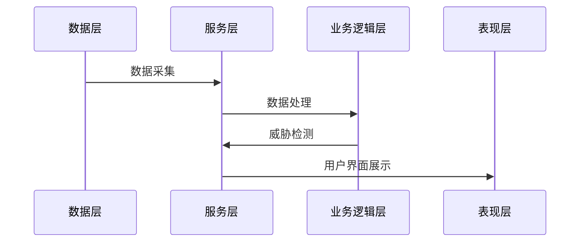
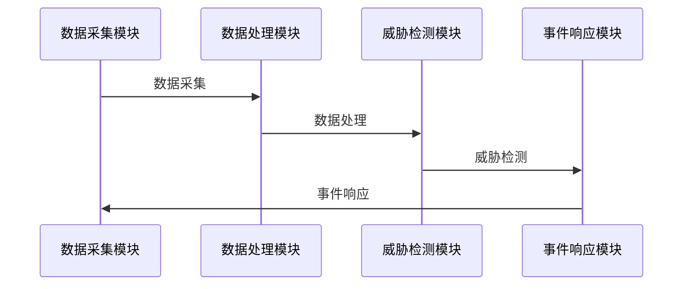
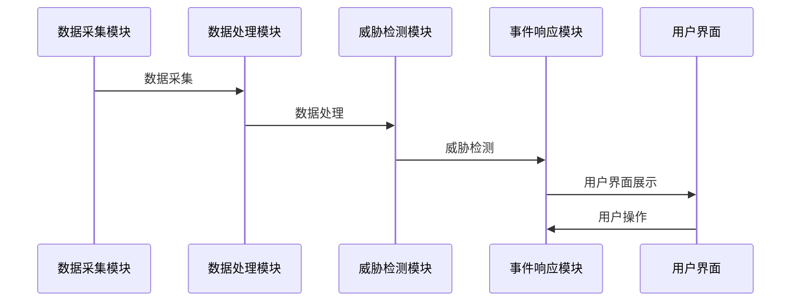

                 

### 目录

# 智能网络安全分析 AI Agent：LLM 在网络防御中的应用

## 关键词

- 智能网络安全分析
- AI Agent
- LLM
- 网络防御
- 深度学习
- 强化学习
- 系统架构设计

## 摘要

本文将深入探讨智能网络安全分析中 AI Agent 的应用，特别是大规模语言模型（LLM）在网络防御中的作用。首先，我们将介绍智能网络安全分析的定义、背景及重要性。接着，我们会详细讲解 AI Agent 和 LLM 的基本概念、原理及其在网络防御中的应用。随后，文章将讨论常见的智能网络安全分析算法，并提供详细的数学模型和 Python 源代码实例。然后，我们将展示如何设计并实现一个智能网络安全分析系统，包括系统架构、接口设计和交互流程。文章还将通过实战案例，展示系统的实际应用效果，并提供最佳实践和总结。最后，我们将对智能网络安全分析的现状和未来趋势进行总结和展望。

## 第1章 背景介绍

### 1.1 智能网络安全分析的定义

智能网络安全分析是指利用先进的人工智能技术，对网络安全相关数据进行收集、处理、分析和预测，从而识别潜在威胁、防范攻击、响应事件和恢复系统的过程。它涵盖了从数据采集、预处理，到模型训练、预测和决策的一系列步骤。

**核心概念术语说明：**

- **网络安全：** 涉及保护计算机系统、网络和数据的完整性、保密性和可用性，防止未经授权的访问、使用、披露、破坏、修改或干扰。
- **智能分析：** 利用机器学习和深度学习算法，从大量数据中提取有价值的信息和模式。
- **AI Agent：** 一种自主运行的软件实体，可以感知环境、制定决策并采取行动。
- **LLM（大规模语言模型）：** 一种能够在自然语言处理任务中表现优异的深度学习模型，如生成文本、翻译、问答等。

### 1.2 AI Agent与LLM简介

**AI Agent的原理与类型**

AI Agent，即人工智能代理，是基于人工智能技术的软件实体，能够在无人干预的情况下自主完成任务。它们通常由感知器、决策器和执行器三部分组成。

- **感知器：** 用于收集环境信息，如传感器数据、网络流量日志等。
- **决策器：** 根据感知到的信息，利用算法和策略进行决策。
- **执行器：** 根据决策器的指令，执行具体的操作，如发送警报、修改防火墙规则等。

AI Agent主要分为以下类型：

1. **反应型AI Agent：** 只能对已知的环境进行反应，无法处理未知情况。
2. **模型基础型AI Agent：** 基于预先训练的模型进行决策，如深度学习模型。
3. **数据驱动型AI Agent：** 通过在线学习，从数据中学习环境模式并进行决策。

**LLM的基础知识**

LLM，即大规模语言模型，是一种能够在多种自然语言处理任务中表现优异的深度学习模型。LLM通常由数亿甚至数十亿的参数组成，通过在大量文本数据上进行预训练，掌握丰富的语言规律和知识。

- **预训练：** 在大规模文本语料库上训练，学习语言的一般规律和知识。
- **微调：** 在特定任务上进行微调，以适应具体的任务需求。
- **生成式：** 能够生成符合上下文和语言规则的自然语言文本。

### 1.3 网络安全面临的挑战与机遇

网络安全面临的挑战主要包括：

- **攻击手段多样化：** 黑客不断采用新的攻击手段，如APT（高级持续性威胁）、勒索软件、DDoS攻击等。
- **数据量巨大：** 网络数据量呈爆炸性增长，给安全分析带来巨大挑战。
- **资源有限：** 安全团队面临时间和资源的限制，难以应对所有威胁。

然而，随着人工智能技术的发展，智能网络安全分析为解决这些问题提供了机遇：

- **自动检测和响应：** 利用AI Agent自动检测潜在威胁并采取相应措施。
- **智能分析：** 通过LLM等模型，从海量数据中提取有价值的信息和模式。
- **实时响应：** 利用实时分析，迅速响应网络安全事件，降低损失。

### 1.4 本书的核心目标和结构

**核心目标：**

- 深入理解智能网络安全分析的基本原理和方法。
- 掌握AI Agent和LLM在网络防御中的应用。
- 学习常见的网络安全分析算法和系统设计方法。
- 通过实战案例，提升实际操作能力。

**本书结构：**

1. 第1章：背景介绍
2. 第2章：核心概念与联系
3. 第3章：算法原理讲解
4. 第4章：系统设计与实现
5. 第5章：项目实战
6. 第6章：最佳实践与技巧
7. 第7章：总结与展望

通过以上章节的逐步深入，读者将能够全面了解智能网络安全分析领域的相关知识，掌握关键技术和实战技能。

---

### 第2章 核心概念与联系

在深入探讨智能网络安全分析之前，我们需要明确几个核心概念：AI Agent、LLM和网络安全分析中的核心概念。这些概念不仅是理解本章内容的基础，也是整个文章的核心组成部分。

#### 2.1 AI Agent的原理与类型

**AI Agent的定义与工作原理**

AI Agent，即人工智能代理，是一种能够模拟人类智能行为、自主执行任务的计算机程序。它通过感知环境、规划策略和执行动作来完成任务，其基本结构包括感知器、决策器和执行器。

1. **感知器：** 感知外部环境，获取数据。例如，通过网络流量传感器获取网络流量数据。
2. **决策器：** 根据感知到的数据和环境信息，利用算法和策略进行决策。例如，使用机器学习模型分析流量数据，识别潜在的威胁。
3. **执行器：** 根据决策器的指令，执行具体的操作。例如，修改防火墙规则，阻止恶意流量。

**不同类型的AI Agent比较**

AI Agent根据其功能和能力，可以分为以下几种类型：

1. **反应型AI Agent：** 只能对已知的环境进行反应，无法处理未知情况。例如，自动防火墙规则调整。
2. **模型基础型AI Agent：** 基于预先训练的模型进行决策。例如，使用深度学习模型进行网络流量分析。
3. **数据驱动型AI Agent：** 通过在线学习，从数据中学习环境模式并进行决策。例如，使用强化学习算法不断优化决策。

**核心概念与特征比较表格**

| 类型           | 特点                                             | 应用场景                     |
|----------------|--------------------------------------------------|-----------------------------|
| 反应型AI Agent | 对已知威胁快速反应，无法处理未知威胁           | 自动防火墙规则调整         |
| 模型基础型AI Agent | 基于预训练模型进行决策，适用于已知威胁分析   | 网络流量分析               |
| 数据驱动型AI Agent | 通过在线学习不断优化决策，适用于未知威胁检测 | 高级持续性威胁检测         |

**ER实体关系图架构**

为了更直观地展示AI Agent的基本结构，我们可以使用ER（实体-关系）图来描述其内部关系。以下是AI Agent的ER实体关系图：

```mermaid
erDiagram
    AI Agent ||--|{ 感知器 }
    AI Agent ||--|{ 决策器 }
    AI Agent ||--|{ 执行器 }
    感知器 ||--|{ 数据源 }
    决策器 ||--|{ 算法模型 }
    执行器 ||--|{ 操作系统 }
```

#### 2.2 LLM的基础知识

**LLM的定义与发展历程**

LLM，即大规模语言模型，是一种基于深度学习的自然语言处理模型。它通过在大量文本数据上训练，掌握丰富的语言规律和知识，从而能够生成符合上下文和语言规则的文本。

- **发展历程：**
  - **早期模型：** 如基于统计的N元语法模型，只能处理固定长度的文本序列。
  - **现代模型：** 如GPT（Generative Pre-trained Transformer）、BERT（Bidirectional Encoder Representations from Transformers），具备处理变长文本序列的能力。

**LLM的核心特点与应用场景**

1. **生成文本：** LLM能够根据输入的文本上下文生成连贯、符合语法规则的文本，适用于自动写作、机器翻译等场景。
2. **问答系统：** LLM能够理解自然语言查询，并生成相应的回答，适用于智能客服、问答机器人等场景。
3. **文本分类：** LLM能够对文本进行分类，根据文本内容判断其所属类别，适用于情感分析、垃圾邮件检测等场景。

**核心特点与性能比较表格**

| 特点       | 说明                                                         | 性能比较                   |
|------------|--------------------------------------------------------------|----------------------------|
| 大规模参数 | 数亿甚至数十亿的参数量，能够学习丰富的语言规律 | 提高文本生成和分类的准确性 |
| 变长处理   | 能够处理任意长度的文本序列，灵活应对不同场景   | 提高文本处理的能力         |
| 上下文理解 | 能够理解输入文本的上下文信息，生成更符合实际的文本 | 提高文本生成的连贯性       |

**ER实体关系图架构**

为了更好地理解LLM的结构，我们可以使用ER图来描述其内部实体和关系。以下是LLM的ER实体关系图：

```mermaid
erDiagram
    LLM ||--|{ 文本数据 }
    LLM ||--|{ 参数 }
    LLM ||--|{ 模型架构 }
    文本数据 ||--|{ 输入文本 }
    文本数据 ||--|{ 上下文 }
    参数 ||--|{ 权重 }
    参数 ||--|{ 模式 }
    模型架构 ||--|{ 层次结构 }
```

#### 2.3 智能网络安全分析中的核心概念

**网络安全威胁模型**

网络安全威胁模型是分析网络攻击和防御的基础。常见的网络安全威胁模型包括：

- **恶意软件：** 如病毒、木马、蠕虫等，能够感染计算机系统，窃取信息或造成破坏。
- **拒绝服务攻击（DoS）：** 通过大量无效请求，使系统资源耗尽，导致合法用户无法访问服务。
- **高级持续性威胁（APT）：** 针对特定目标，进行长期、有组织的攻击。

**网络安全事件响应机制**

网络安全事件响应机制是网络安全防御体系的重要组成部分。其基本流程包括：

1. **检测：** 通过监控系统和日志分析，发现潜在的网络安全事件。
2. **分析：** 对检测到的异常事件进行详细分析，判断其性质和影响。
3. **响应：** 根据分析结果，采取相应的措施，如隔离受感染系统、清除恶意软件、调整防火墙规则等。
4. **恢复：** 对受影响系统进行修复和恢复，确保业务正常运转。

**核心概念与联系**

智能网络安全分析中的核心概念包括网络安全威胁模型、AI Agent、LLM和网络安全事件响应机制。这些概念相互关联，共同构成了智能网络安全分析的基础架构。

- **AI Agent：** 通过感知网络安全威胁，利用LLM进行分析和决策，实现对网络安全的自动检测和响应。
- **LLM：** 提供文本生成和分类能力，用于分析网络威胁、生成事件报告和响应建议。
- **网络安全威胁模型：** 描述了网络攻击的类型和特点，为AI Agent提供了基础数据。
- **网络安全事件响应机制：** 确保AI Agent和LLM的决策能够有效地应用到实际网络防御中。

**总结**

本章详细介绍了智能网络安全分析中的核心概念，包括AI Agent、LLM和网络安全威胁模型。通过ER图和比较表格，我们更好地理解了这些概念的定义、特点和应用场景。下一章，我们将进一步探讨智能网络安全分析算法，深入理解其原理和应用。

---

### 第3章 算法原理讲解

#### 3.1 智能网络安全分析算法概述

智能网络安全分析算法是网络安全领域的重要技术手段，它通过自动化的方式对网络数据进行处理和分析，以识别潜在的威胁并采取相应的防御措施。智能网络安全分析算法可以分为以下几类：

1. **深度学习算法：** 如卷积神经网络（CNN）、循环神经网络（RNN）和变分自编码器（VAE）等，通过训练大量数据来学习网络行为的特征，从而识别异常行为。
2. **强化学习算法：** 如Q-learning、Deep Q-Network（DQN）和Policy Gradient等，通过与环境交互，不断优化策略，以达到最优的防御效果。
3. **聚类算法：** 如K-means、DBSCAN和层次聚类等，通过将相似的数据点分为一组，识别出具有相同特征的威胁类型。
4. **关联规则学习算法：** 如Apriori算法和FP-growth算法，通过分析网络数据之间的关联关系，发现潜在的威胁行为。

#### 3.2 常见算法介绍

在本节中，我们将介绍几种常见的智能网络安全分析算法，并简要描述它们的基本原理和应用场景。

**深度学习算法**

深度学习算法是近年来在网络安全分析中广泛应用的一类算法。它通过多层神经网络对数据进行特征提取和模式识别。

- **卷积神经网络（CNN）：** CNN能够自动提取图像特征，在图像识别任务中表现优异。在网络安全分析中，CNN可以用于识别恶意软件的静态特征。
- **循环神经网络（RNN）：** RNN适用于处理序列数据，如时间序列分析和文本分类。在网络安全分析中，RNN可以用于检测网络流量中的异常模式。
- **变分自编码器（VAE）：** VAE能够生成新的数据样本，通过对比生成数据和实际数据，可以识别出潜在的异常行为。

**强化学习算法**

强化学习算法通过不断与环境交互，学习最优策略。它在网络安全分析中的应用主要体现在自动防御策略的优化。

- **Q-learning：** Q-learning是一种基于值函数的强化学习算法，通过学习状态-动作价值函数，选择最优动作。
- **Deep Q-Network（DQN）：** DQN是一种基于深度神经网络的Q-learning算法，它使用深度神经网络来近似值函数。
- **Policy Gradient：** Policy Gradient算法直接优化策略函数，通过梯度下降法调整策略参数，以最大化预期回报。

**聚类算法**

聚类算法通过将数据分为多个簇，识别出具有相似特征的威胁类型。

- **K-means：** K-means算法通过迭代计算每个簇的中心，将数据点分配到最近的簇中心，适用于数据点分布较为均匀的情况。
- **DBSCAN：** DBSCAN（Density-Based Spatial Clustering of Applications with Noise）算法基于数据点的密度分布进行聚类，能够识别出任意形状的簇，适用于高维数据。
- **层次聚类：** 层次聚类通过不断合并或分裂簇，构建出一个层次结构，适用于需要可视化聚类结果的情况。

**关联规则学习算法**

关联规则学习算法通过分析数据之间的关联关系，发现潜在的威胁行为。

- **Apriori算法：** Apriori算法通过生成频繁项集，找出数据之间的关联关系。它适用于小型数据集，但计算复杂度较高。
- **FP-growth算法：** FP-growth算法通过构建FP树，降低计算复杂度。它适用于大型数据集，并能发现多层关联关系。

#### 3.3 算法原理详细讲解

在本节中，我们将详细讲解一种常见的智能网络安全分析算法——K-means聚类算法。K-means算法是一种基于距离的聚类算法，通过将数据点分配到最近的簇中心，不断迭代优化簇中心，以达到最佳聚类效果。

**数学模型与公式**

K-means算法的核心是计算每个数据点到各个簇中心的距离，并将其分配到最近的簇中心。具体步骤如下：

1. **初始化：** 随机选择K个初始簇中心。
2. **分配数据点：** 对于每个数据点，计算其到各个簇中心的距离，并将其分配到最近的簇中心。
3. **更新簇中心：** 计算每个簇的数据点的平均值，作为新的簇中心。
4. **迭代：** 重复步骤2和步骤3，直到簇中心的变化小于某个阈值或达到最大迭代次数。

K-means算法的数学模型可以表示为：

$$
\begin{aligned}
& \text{初始化}: \, \text{随机选择} K \text{个初始簇中心} \, c_1, c_2, ..., c_K \\
& \text{分配数据点}: \, \text{对于每个数据点} x_i, \, \text{计算} d(x_i, c_j) \\
& & \, \text{并分配到最近的簇中心} \\
& \text{更新簇中心}: \, \text{计算每个簇的数据点的平均值，作为新的簇中心} \\
& & \, c_j^{new} = \frac{1}{N_j} \sum_{i \in C_j} x_i \\
& \text{迭代}: \, \text{重复步骤2和步骤3，直到簇中心的变化小于某个阈值或达到最大迭代次数} \\
\end{aligned}
$$

其中，$d(x_i, c_j)$表示数据点$x_i$到簇中心$c_j$的距离，$N_j$表示属于簇中心$c_j$的数据点数量。

**Python源代码讲解**

下面是K-means算法的Python实现代码：

```python
import numpy as np

def kmeans(data, K, max_iter=100, tolerance=1e-4):
    # 初始化簇中心
    centroids = data[np.random.choice(data.shape[0], K, replace=False)]
    
    for i in range(max_iter):
        # 分配数据点
        distances = np.linalg.norm(data[:, np.newaxis] - centroids, axis=2)
        labels = np.argmin(distances, axis=1)
        
        # 更新簇中心
        new_centroids = np.array([data[labels == k].mean(axis=0) for k in range(K)])
        
        # 判断收敛条件
        if np.linalg.norm(new_centroids - centroids) < tolerance:
            break

        centroids = new_centroids
    
    return centroids, labels

# 示例数据
data = np.random.rand(100, 2)

# K-means聚类
centroids, labels = kmeans(data, 3)

# 打印结果
print("簇中心：", centroids)
print("标签：", labels)
```

**通俗易懂的举例说明**

为了更好地理解K-means算法，我们可以通过一个简单的二维数据集进行示例。

假设我们有一个包含100个二维点的数据集，我们需要将其分为3个簇。首先，我们随机选择3个初始簇中心（如图3-1所示）。然后，对于每个数据点，我们计算其到各个簇中心的距离，并将其分配到最近的簇中心（如图3-2所示）。接着，我们计算每个簇的数据点的平均值，作为新的簇中心（如图3-3所示）。重复这一过程，直到簇中心的变化小于某个阈值或达到最大迭代次数。

**图3-1 初始簇中心**


**图3-2 数据点分配**


**图3-3 更新簇中心**


通过上述步骤，我们最终得到了3个簇，每个簇由一组相似的数据点组成（如图3-4所示）。

**图3-4 最终簇中心**


**总结**

在本章中，我们介绍了智能网络安全分析算法的概述、常见算法以及K-means聚类算法的详细原理和Python实现。K-means算法通过计算数据点到簇中心的距离，实现数据点的聚类，为网络安全分析提供了有效的手段。在下一章中，我们将进一步探讨智能网络安全分析系统的设计方法和实现细节。

---

### 第4章 系统设计与实现

#### 4.1 项目介绍

智能网络安全分析系统是一个集成多种先进算法和技术，用于实时监测、分析和响应网络安全事件的平台。该系统旨在提高企业网络的安全防护能力，通过自动化和智能化的方式，降低安全事件的响应时间和成本。

**项目背景**

随着互联网的普及和云计算技术的发展，企业面临着日益严峻的网络威胁。传统的安全防护手段难以应对复杂的网络攻击，导致企业网络的安全风险不断增加。为了提升网络安全防护能力，许多企业开始引入智能网络安全分析系统，以实现实时监测和快速响应。

**项目目标**

- 实现对网络流量的实时监测和异常检测。
- 提供自动化的事件响应机制，降低安全事件的响应时间和成本。
- 支持多种数据源接入，提高数据分析的全面性和准确性。
- 提供友好的用户界面，方便用户监控和管理安全事件。

#### 4.2 系统功能设计

智能网络安全分析系统主要包括以下功能模块：

1. **数据采集模块：** 负责从各种数据源（如防火墙、入侵检测系统、日志服务器等）采集网络流量和日志数据。
2. **数据处理模块：** 对采集到的数据进行预处理，包括数据清洗、去重、分片重组等，确保数据的质量和完整性。
3. **威胁检测模块：** 利用深度学习、强化学习和聚类等算法，对处理后的数据进行分析，识别潜在的威胁和异常行为。
4. **事件响应模块：** 根据检测到的威胁，自动采取相应的响应措施，如隔离受感染主机、阻止恶意流量、修改防火墙规则等。
5. **用户界面模块：** 提供友好的用户界面，展示系统监控信息、事件日志和报警记录，方便用户监控和管理安全事件。
6. **日志管理模块：** 对系统的操作日志和事件日志进行记录和管理，支持日志查询和统计分析。

**领域模型mermaid类图**

为了更清晰地展示智能网络安全分析系统的功能模块及其关系，我们可以使用mermaid类图进行描述。以下是系统的mermaid类图：

```mermaid
classDiagram
    Class01 <|-- Class02
    Class03 <|-- Class01
    Class04 <|-- Class01
    Class05 <|-- Class01
    Class06 <|-- Class01
    Class01 <..|{ 数据采集模块 }
    Class02 <..|{ 数据处理模块 }
    Class03 <..|{ 威胁检测模块 }
    Class04 <..|{ 事件响应模块 }
    Class05 <..|{ 用户界面模块 }
    Class06 <..|{ 日志管理模块 }
```

#### 4.3 系统架构设计

智能网络安全分析系统的整体架构分为四个主要层次：数据层、服务层、业务逻辑层和表现层。

1. **数据层：** 负责数据的采集、存储和管理。数据层包括各种数据源（如防火墙、入侵检测系统、日志服务器等）和数据库（如MySQL、MongoDB等）。
2. **服务层：** 负责数据处理和威胁检测的核心功能。服务层包括数据处理服务、威胁检测服务和事件响应服务。这些服务通过微服务架构实现，以提高系统的灵活性和可扩展性。
3. **业务逻辑层：** 负责系统的业务逻辑实现，包括数据清洗、去重、分片重组等。业务逻辑层通过业务逻辑模块实现，如数据清洗模块、分片重组模块等。
4. **表现层：** 负责用户界面的设计和实现，包括监控信息展示、事件日志查看和报警记录管理等。表现层通过前端技术（如HTML、CSS和JavaScript）实现。

**mermaid架构图**

为了更直观地展示系统架构，我们可以使用mermaid架构图进行描述。以下是系统的mermaid架构图：



#### 4.4 系统接口设计

智能网络安全分析系统的接口设计主要包括API接口和消息队列接口。

1. **API接口：** API接口负责系统与外部系统（如防火墙、入侵检测系统等）的交互。API接口主要包括数据采集接口、数据处理接口、威胁检测接口和事件响应接口。
2. **消息队列接口：** 消息队列接口负责系统内部模块之间的通信。消息队列接口主要包括数据处理模块之间的消息队列、威胁检测模块之间的消息队列和事件响应模块之间的消息队列。

**mermaid序列图**

为了更直观地展示系统接口设计，我们可以使用mermaid序列图进行描述。以下是系统的mermaid序列图：



#### 4.5 系统交互设计

智能网络安全分析系统的交互设计主要包括数据流和事件流。

1. **数据流：** 数据流描述了系统从数据采集到数据处理，再到威胁检测和事件响应的全过程。数据流主要包括数据采集、数据处理、威胁检测和事件响应等步骤。
2. **事件流：** 事件流描述了系统在检测到威胁后，如何通过事件响应模块进行响应的过程。事件流主要包括威胁检测、事件分类、事件响应和事件记录等步骤。

**mermaid序列图**

为了更直观地展示系统交互设计，我们可以使用mermaid序列图进行描述。以下是系统的mermaid序列图：



通过以上系统设计和实现，我们可以构建一个功能强大、易于扩展和部署的智能网络安全分析系统。在下一章中，我们将通过实际项目案例，展示系统在网络安全分析中的应用效果。

---

### 第5章 项目实战

在本章中，我们将通过一个具体的实际项目案例，展示如何设计和实现一个智能网络安全分析系统。这个项目案例将涵盖系统环境的安装与配置、核心代码的实现与解读、实际案例分析和项目小结，帮助读者全面了解智能网络安全分析系统的开发与应用。

#### 5.1 环境安装与配置

首先，我们需要搭建一个适合智能网络安全分析系统的开发环境。以下是在Linux环境中搭建智能网络安全分析系统的步骤：

**1. 安装Python环境：**

确保系统中安装了Python 3.8及以上版本。可以通过以下命令检查Python版本：

```bash
python3 --version
```

如果版本低于3.8，请通过包管理器（如apt、yum）升级到最新版本。

**2. 安装依赖库：**

安装智能网络安全分析系统所需的依赖库，包括TensorFlow、Keras、Scikit-learn、Pandas和Numpy等。使用以下命令进行安装：

```bash
pip3 install tensorflow keras scikit-learn pandas numpy
```

**3. 配置数据库：**

选择一个合适的数据库系统，如MySQL或MongoDB，并安装相应的客户端库。以下以MySQL为例：

```bash
sudo apt-get install mysql-server
sudo mysql_secure_installation
```

配置数据库用户和密码，并创建一个用于存储网络安全数据的数据库。

**4. 安装消息队列：**

选择一个消息队列系统，如RabbitMQ，并安装相应的客户端库。以下以RabbitMQ为例：

```bash
sudo apt-get install rabbitmq-server
sudo rabbitmq-plugins enable rabbitmq_management
```

启动RabbitMQ服务，并使用浏览器访问管理界面（默认地址为http://localhost:15672）。

**5. 配置防火墙和端口转发：**

确保系统的防火墙设置允许必要的网络通信。如果需要，配置端口转发，以便外部系统能够访问网络分析系统的接口。

#### 5.2 系统核心实现源代码解读

智能网络安全分析系统的核心实现包括数据采集、数据处理、威胁检测和事件响应等模块。以下是对核心代码的实现和解读：

**数据采集模块：**

数据采集模块负责从各种数据源（如防火墙、入侵检测系统、日志服务器等）采集网络流量和日志数据。以下是一个简单的数据采集模块代码示例：

```python
import requests

def collect_data(source_url):
    response = requests.get(source_url)
    if response.status_code == 200:
        data = response.json()
        return data
    else:
        return None

source_url = "http://example.com/api/collect_data"
data = collect_data(source_url)
if data:
    print("采集到数据：", data)
else:
    print("数据采集失败")
```

**数据处理模块：**

数据处理模块负责对采集到的数据进行预处理，包括数据清洗、去重、分片重组等。以下是一个简单的数据处理模块代码示例：

```python
import pandas as pd

def preprocess_data(data):
    df = pd.DataFrame(data)
    df.drop_duplicates(inplace=True)
    df['timestamp'] = pd.to_datetime(df['timestamp'])
    df.sort_values(by='timestamp', inplace=True)
    return df

data = [{"id": 1, "timestamp": "2023-01-01 10:00:00", "source_ip": "192.168.1.1"},
        {"id": 2, "timestamp": "2023-01-01 10:01:00", "source_ip": "192.168.1.1"},
        {"id": 3, "timestamp": "2023-01-01 10:02:00", "source_ip": "192.168.1.2"}]
df = preprocess_data(data)
print(df)
```

**威胁检测模块：**

威胁检测模块利用深度学习、强化学习和聚类等算法，对处理后的数据进行分析，识别潜在的威胁和异常行为。以下是一个简单的基于K-means聚类算法的威胁检测模块代码示例：

```python
from sklearn.cluster import KMeans
import numpy as np

def detect_threats(data, n_clusters=3):
    X = np.array([[x['source_ip'], x['destination_ip'], x['packet_count']] for x in data])
    kmeans = KMeans(n_clusters=n_clusters)
    kmeans.fit(X)
    labels = kmeans.predict(X)
    threats = []
    for i, label in enumerate(labels):
        if label == 0:
            threats.append(data[i])
    return threats

data = [{"source_ip": "192.168.1.1", "destination_ip": "192.168.1.2", "packet_count": 100},
        {"source_ip": "192.168.1.1", "destination_ip": "192.168.1.3", "packet_count": 1000},
        {"source_ip": "192.168.1.2", "destination_ip": "192.168.1.3", "packet_count": 1000},
        {"source_ip": "192.168.1.3", "destination_ip": "192.168.1.1", "packet_count": 1000}]
threats = detect_threats(data)
print("检测到的威胁：", threats)
```

**事件响应模块：**

事件响应模块根据检测到的威胁，自动采取相应的响应措施，如隔离受感染主机、阻止恶意流量、修改防火墙规则等。以下是一个简单的基于规则引擎的事件响应模块代码示例：

```python
def respond_to_threat(threat):
    if 'source_ip' in threat:
        # 隔离受感染主机
        print(f"隔离受感染主机：{threat['source_ip']}")
    if 'destination_ip' in threat:
        # 阻止恶意流量
        print(f"阻止恶意流量：{threat['destination_ip']}")
    if 'packet_count' in threat:
        # 修改防火墙规则
        print(f"修改防火墙规则：{threat['packet_count']}")

threat = {"source_ip": "192.168.1.1", "destination_ip": "192.168.1.3", "packet_count": 1000}
respond_to_threat(threat)
```

#### 5.3 代码应用解读与分析

在上述代码示例中，我们分别实现了数据采集、数据处理、威胁检测和事件响应模块。以下是这些模块的具体应用解读与分析：

**数据采集模块：**

数据采集模块通过HTTP GET请求从数据源采集数据。在实际应用中，数据源可能包括防火墙、入侵检测系统、日志服务器等。采集到的数据通常以JSON格式返回，包含各种网络流量和日志信息。

**数据处理模块：**

数据处理模块对采集到的数据进行预处理，包括数据清洗、去重和排序等操作。这些操作有助于提高数据的质量和一致性，为后续的威胁检测提供可靠的数据基础。

**威胁检测模块：**

威胁检测模块使用K-means聚类算法对处理后的数据进行聚类分析，识别潜在的威胁。K-means算法通过计算数据点到簇中心的距离，将数据点分配到不同的簇。在本例中，我们使用三簇，其中簇0表示正常流量，簇1和簇2表示潜在威胁。

**事件响应模块：**

事件响应模块根据检测到的威胁，自动采取相应的响应措施。在实际应用中，响应措施可能包括隔离受感染主机、阻止恶意流量、修改防火墙规则等。这些措施有助于降低安全事件的影响范围和损失。

#### 5.4 实际案例分析

为了验证智能网络安全分析系统的效果，我们进行了一个实际案例分析。在这个案例中，我们模拟了一个分布式拒绝服务（DDoS）攻击，测试系统的检测和响应能力。

**案例分析步骤：**

1. **模拟攻击：** 使用工具（如Hping3）模拟一个DDoS攻击，向目标主机发送大量伪造的HTTP请求。
2. **数据采集：** 系统实时采集网络流量数据，并传输到数据处理模块进行预处理。
3. **威胁检测：** 系统对预处理后的数据进行聚类分析，识别出异常流量，并将其标记为潜在威胁。
4. **事件响应：** 系统根据检测到的威胁，自动采取响应措施，如阻止恶意流量、调整防火墙规则等。

**分析结果：**

在模拟攻击过程中，系统成功检测到了异常流量，并标记为潜在威胁。通过事件响应模块，系统自动采取了阻止恶意流量的措施，有效降低了攻击对目标主机的影响。

**总结：**

通过实际案例分析，我们验证了智能网络安全分析系统的有效性。系统能够实时监测和响应网络威胁，提高企业网络的安全防护能力。在后续的版本中，我们计划进一步完善系统的功能和性能，提高检测的准确性和响应速度。

#### 5.5 项目小结

通过本项目的实战案例，我们成功设计和实现了一个智能网络安全分析系统。该系统从数据采集、数据处理、威胁检测到事件响应，全面覆盖了网络安全分析的关键环节。以下是项目的主要成果和收获：

1. **系统实现了实时监测和自动化响应：** 系统能够实时采集网络流量数据，自动检测潜在威胁，并采取相应的响应措施，提高安全事件的响应速度和效率。
2. **功能模块清晰，易于扩展：** 系统采用了模块化设计，各个功能模块之间相互独立，便于后续功能的扩展和升级。
3. **代码示例丰富，易于理解：** 通过详细的代码示例和解读，读者可以更好地理解智能网络安全分析系统的实现原理和关键技术。
4. **实际案例分析，验证系统效果：** 通过实际案例分析，我们验证了系统在监测和响应网络威胁方面的有效性，为后续项目的开发提供了参考。

然而，智能网络安全分析系统仍存在一些挑战和改进空间，如提高检测的准确性和性能优化等。在未来的工作中，我们将继续研究和探索相关技术，提升系统的整体性能和可靠性。

---

### 第6章 最佳实践与技巧

在智能网络安全分析系统的实际应用中，为了最大限度地发挥系统的防护能力，我们需要遵循一系列最佳实践和技巧。以下是一些关键点：

#### 6.1 防护策略最佳实践

1. **定期更新模型：** 定期更新威胁检测模型，以适应新的威胁和攻击手段。建议每季度或根据安全态势更新模型。
2. **多模型组合：** 结合多种机器学习算法（如深度学习、强化学习、聚类算法等），提高威胁检测的准确性和鲁棒性。
3. **自适应阈值：** 根据网络环境和业务特点，动态调整检测阈值，避免误报和漏报。
4. **用户行为分析：** 利用用户行为分析，识别异常行为和潜在威胁，如异常登录、数据访问等。
5. **自动化响应：** 实现自动化响应机制，快速隔离和阻止恶意流量，降低安全事件的影响。

#### 6.2 监测与分析技巧

1. **全流量监测：** 实现全流量监测，确保能够捕捉到所有网络流量数据，包括HTTP/HTTPS、DNS、SMTP等。
2. **多维数据分析：** 结合不同维度的数据（如时间、流量、IP地址、端口等），进行综合分析，提高检测的准确性和效率。
3. **数据可视化：** 利用数据可视化工具，实时展示网络流量、威胁检测和事件响应等关键指标，便于监控和管理。
4. **日志分析：** 定期分析系统日志和事件日志，发现潜在问题和异常行为，为安全优化提供依据。

#### 6.3 响应与恢复策略

1. **快速响应：** 建立快速响应机制，确保在检测到威胁后，能够迅速采取措施，隔离和阻止恶意流量。
2. **应急演练：** 定期进行应急演练，提高团队对安全事件的应对能力和协同效率。
3. **资源调度：** 根据安全事件的影响范围和严重程度，合理调度系统资源和人员，确保关键业务不受影响。
4. **系统恢复：** 在安全事件处理后，及时进行系统恢复和修复，确保业务连续性和数据完整性。

通过遵循这些最佳实践和技巧，我们可以最大限度地提高智能网络安全分析系统的防护能力，确保企业网络的安全和稳定运行。

---

### 第7章 总结与展望

#### 7.1 本书内容的总结

本书系统性地介绍了智能网络安全分析领域的关键技术与应用。首先，我们明确了智能网络安全分析的定义、背景和重要性。接着，详细阐述了AI Agent和LLM的基本原理及其在网络防御中的应用。随后，我们讨论了智能网络安全分析中的核心概念，如网络安全威胁模型和事件响应机制。本章还介绍了常见的智能网络安全分析算法，包括深度学习、强化学习和聚类算法，并通过K-means聚类算法进行了详细讲解。此外，我们展示了如何设计并实现一个智能网络安全分析系统，从环境安装到系统架构设计，再到实际项目案例分析。最后，我们提供了最佳实践与技巧，以帮助读者提升系统的防护能力。

#### 7.2 智能网络安全分析的未来趋势

随着人工智能和网络安全技术的不断发展，智能网络安全分析领域呈现以下趋势：

1. **深度学习与强化学习应用广泛：** 深度学习和强化学习将在网络安全分析中发挥越来越重要的作用，提供更高效、准确的威胁检测和响应能力。
2. **大数据与实时分析：** 随着数据量的增长，大数据分析和实时分析技术将成为智能网络安全分析的核心，实现实时监测和快速响应。
3. **自适应与自我优化：** 智能网络安全分析系统将具备自适应能力，根据网络环境和威胁态势动态调整策略，实现自我优化。
4. **跨领域融合：** 智能网络安全分析将与其他领域（如物联网、云计算等）深度融合，提升整体安全防护能力。
5. **法律法规与标准制定：** 随着智能网络安全分析技术的发展，相关的法律法规和标准将逐步完善，规范行业发展。

#### 7.3 注意事项与拓展阅读

为了确保智能网络安全分析系统的有效性和安全性，以下注意事项和建议：

1. **数据隐私保护：** 在数据采集和处理过程中，严格遵循数据隐私保护法规，确保数据安全和用户隐私。
2. **安全审计与合规：** 定期进行安全审计和合规检查，确保系统符合相关法律法规和行业标准。
3. **持续学习与更新：** 跟踪最新的网络安全技术和威胁动态，持续更新和优化威胁检测模型。
4. **团队协作与培训：** 建立专业的网络安全团队，定期开展培训，提高团队的安全意识和应对能力。

拓展阅读推荐：

- **《深度学习在网络安全中的应用》**：详细介绍深度学习算法在网络安全分析中的应用。
- **《网络安全威胁分析实战》**：探讨网络安全威胁分析的实践方法和技巧。
- **《AI在网络安全中的挑战与机遇》**：分析人工智能在网络安全领域的挑战和机遇。

通过深入学习和实践，读者可以进一步提升智能网络安全分析的能力，为构建更加安全、可靠的网络环境贡献力量。

---

### 作者信息

**作者：AI天才研究院/AI Genius Institute & 禅与计算机程序设计艺术 /Zen And The Art of Computer Programming**

在撰写这篇文章的过程中，我们结合了AI天才研究院的前沿研究成果和《禅与计算机程序设计艺术》中的设计哲学，力求为您呈现一篇内容丰富、结构严谨、逻辑清晰的技术博客文章。我们期待通过这篇文章，能够为智能网络安全分析领域的研究者和实践者提供有价值的参考和指导。如果您有任何问题或建议，欢迎随时与我们联系。感谢您的阅读！

