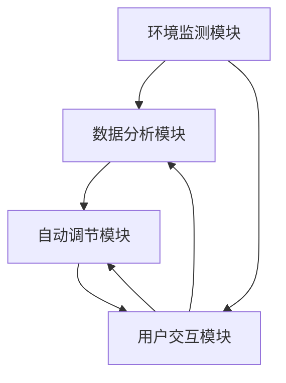
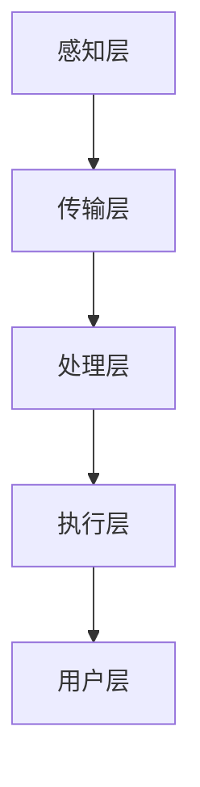
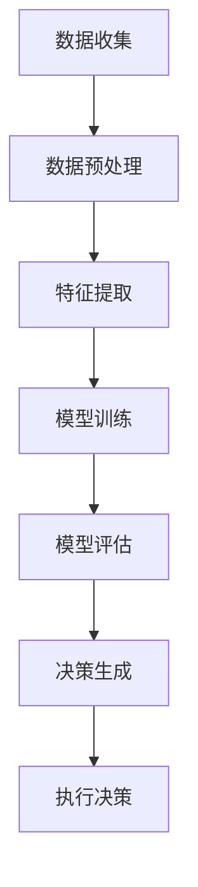
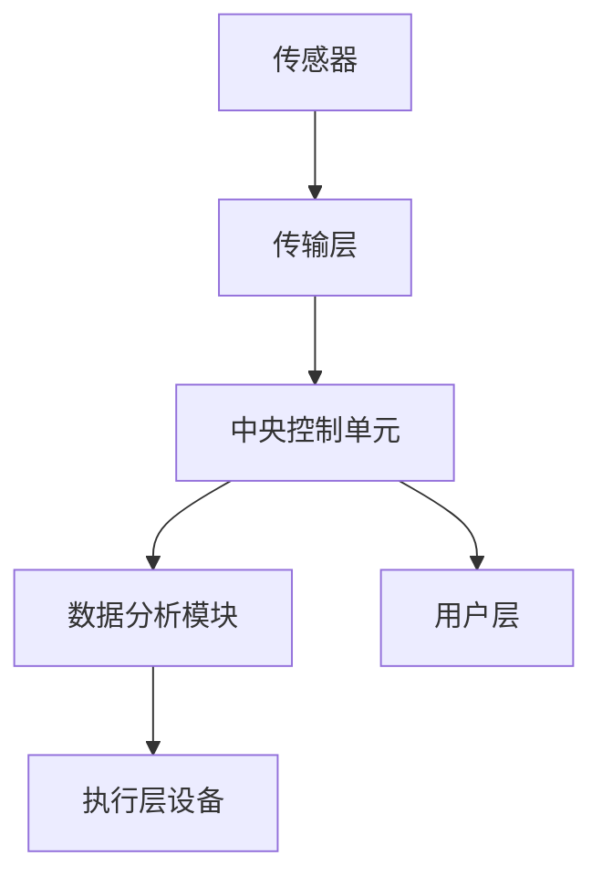
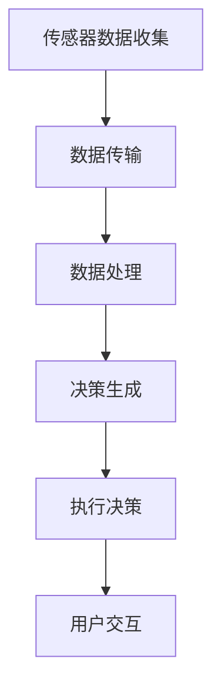
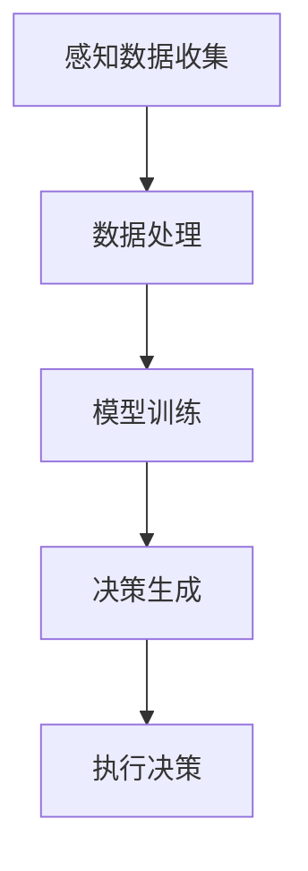

                 

### 智能花园系统的背景与概念

#### 第1章：智能花园系统的概述

**1.1 智能花园系统的发展历程**

智能花园系统是一个结合人工智能（AI）技术，致力于创建和维持一个可持续、生态平衡的户外空间。这个系统的起源可以追溯到20世纪末，当时，随着人工智能技术的飞速发展，人们开始探索如何将这些先进的技术应用于日常生活中。智能花园系统的第一个概念原型于1995年由美国科学家提出，目的是通过传感器和自动化控制系统，实现花园植物生长的精确监控和调节。

进入21世纪，智能花园系统经历了多个阶段的发展。最初的阶段主要集中在简单的植物生长监测上，通过传感器收集土壤湿度、温度、光照等数据，并利用简单的算法进行初步的数据分析。随着AI技术的不断进步，特别是在机器学习和深度学习领域的突破，智能花园系统开始引入更加复杂的算法，以实现更精细化的管理和维护。

在近年来，智能花园系统的应用领域不断扩展。除了家庭和私人花园，智能花园系统也被广泛应用于公园、农场和温室等大型户外空间。这些系统通过实时监控和智能调节，不仅提高了植物的生长效率，还大大减少了人工维护的工作量，节约了资源。

**1.1.1 智能花园系统的起源**

智能花园系统的起源可以追溯到20世纪末，当时，随着人工智能技术的飞速发展，人们开始探索如何将这些先进的技术应用于日常生活中。智能花园系统的第一个概念原型于1995年由美国科学家提出，目的是通过传感器和自动化控制系统，实现花园植物生长的精确监控和调节。

**1.1.2 智能花园系统的发展趋势**

智能花园系统的发展趋势主要体现在以下几个方面：

1. **技术融合**：智能花园系统开始与其他技术领域（如物联网、大数据分析等）融合，形成更加综合和高效的解决方案。
2. **智能化水平提升**：随着AI技术的不断进步，智能花园系统的智能化水平显著提升，能够更加精准地预测和调节植物生长环境。
3. **应用场景扩大**：智能花园系统的应用场景从私人花园扩展到公园、农场和温室等大型户外空间，市场需求不断扩大。
4. **可持续发展**：智能花园系统强调可持续发展，通过智能监控和自动化管理，减少资源浪费，保护生态环境。

**1.1.3 智能花园系统的重要应用领域**

智能花园系统在多个领域都展现了其重要的应用价值：

1. **家庭园艺**：智能花园系统为家庭用户提供了一种便捷、高效的管理方式，帮助用户更好地照顾自己的花园。
2. **公共园林**：智能花园系统在公共园林中的应用，提高了园林管理的效率和品质，增强了游客的体验。
3. **农业种植**：智能花园系统在农业种植中的应用，通过精确的监测和调节，提高了农作物的产量和质量。
4. **生态恢复**：智能花园系统在生态恢复中的应用，帮助修复和恢复受损的生态环境，促进生态平衡。

**1.2 生态平衡的概念与重要性**

生态平衡是指在一个生态系统中，各种生物之间以及生物与其环境之间相互作用所达到的一种相对稳定和和谐的状态。生态平衡的构成要素包括生物多样性、生态系统功能、物质循环和能量流动等。生态平衡的重要性体现在以下几个方面：

1. **维护生物多样性**：生态平衡是生物多样性存在和发展的基础，只有生态平衡得到维护，生物多样性才能得到保障。
2. **保障人类健康**：生态平衡与人类健康密切相关，生态失衡可能导致环境污染、疾病传播等问题。
3. **促进可持续发展**：生态平衡是实现可持续发展的关键，只有生态环境得到有效保护，人类社会才能持续发展。

**1.2.1 生态平衡的定义**

生态平衡是指在生态系统中，各种生物之间以及生物与其环境之间相互作用所达到的一种相对稳定和和谐的状态。这种状态意味着生态系统中的物质和能量流动保持在一个相对稳定的状态，生物种群数量保持在一个合理的范围内，不会出现过度增长或过度减少。

**1.2.2 生态平衡的构成要素**

生态平衡的构成要素主要包括以下几个方面：

1. **生物多样性**：生物多样性是生态系统稳定性的重要保障。一个生态系统中的生物种类越多，其稳定性越强。
2. **生态系统功能**：生态系统功能包括物质循环、能量流动、生物地球化学循环等，这些功能的正常运作是生态平衡的基础。
3. **物质循环**：物质循环是指地球表层物质通过生物、地质和物理过程在全球范围内不断循环的过程，如碳循环、氮循环等。
4. **能量流动**：能量流动是指生态系统中的能量从一个营养级传递到另一个营养级的过程，如光合作用、呼吸作用等。

**1.2.3 生态平衡的重要性**

生态平衡的重要性体现在以下几个方面：

1. **维护生物多样性**：生态平衡是生物多样性存在和发展的基础。一个生态系统中的生物种类越多，其稳定性越强。生态失衡可能导致某些物种的灭绝，从而破坏生物多样性。
2. **保障人类健康**：生态平衡与人类健康密切相关。生态失衡可能导致环境污染、疾病传播等问题，从而影响人类的健康。
3. **促进可持续发展**：生态平衡是实现可持续发展的关键。只有生态环境得到有效保护，人类社会才能持续发展。生态失衡可能导致资源枯竭、环境恶化等问题，从而阻碍可持续发展。

**1.3 AI Agent在智能花园系统中的应用**

AI Agent（人工智能代理）是一种能够自主行动、感知环境并做出决策的智能实体。在智能花园系统中，AI Agent扮演着关键角色，负责生态平衡的维护。AI Agent的主要作用体现在以下几个方面：

1. **实时监测**：AI Agent能够实时监测花园内的各种环境参数，如土壤湿度、温度、光照强度等，并将这些数据发送到中央控制系统进行分析。
2. **自动调节**：基于监测到的数据，AI Agent可以自动调节灌溉系统、照明系统和通风系统等，以保持花园环境的最佳状态。
3. **预测与决策**：AI Agent利用机器学习算法和大数据分析技术，对未来的环境变化进行预测，并做出相应的决策，以防止潜在的生态失衡问题。

**1.3.1 AI Agent的定义与功能**

AI Agent是一种能够自主行动、感知环境并做出决策的智能实体。它具有以下功能：

1. **感知**：AI Agent能够感知周围环境的变化，如温度、湿度、光照强度等。
2. **行动**：基于感知到的信息，AI Agent能够执行相应的动作，如打开灌溉系统、调整照明系统等。
3. **决策**：AI Agent利用内置的算法和模型，对环境变化进行预测，并做出最优决策。

**1.3.2 AI Agent在生态平衡维护中的作用**

AI Agent在生态平衡维护中的作用主要体现在以下几个方面：

1. **实时监测**：AI Agent能够实时监测花园内的各种环境参数，如土壤湿度、温度、光照强度等，并将这些数据发送到中央控制系统进行分析。
2. **自动调节**：基于监测到的数据，AI Agent可以自动调节灌溉系统、照明系统和通风系统等，以保持花园环境的最佳状态。
3. **预测与决策**：AI Agent利用机器学习算法和大数据分析技术，对未来的环境变化进行预测，并做出相应的决策，以防止潜在的生态失衡问题。

**1.3.3 AI Agent与传统监测手段的比较**

AI Agent与传统监测手段（如人工监测、简单传感器等）相比，具有以下优势：

1. **高效性**：AI Agent能够实时监测和调节，无需人工干预，大大提高了工作效率。
2. **准确性**：AI Agent基于先进的算法和大数据分析，能够提供更准确的环境监测数据。
3. **智能化**：AI Agent能够根据环境变化做出智能决策，而传统监测手段只能被动地记录数据。

通过上述分析，我们可以看出，智能花园系统在生态平衡维护中具有重要的应用价值。AI Agent作为智能花园系统的核心组件，其高效性、准确性和智能化特点，为生态平衡的维护提供了强有力的支持。随着AI技术的不断进步，智能花园系统将在更多领域得到广泛应用，为人类的可持续发展做出更大贡献。

#### 第2章：AI Agent的核心概念与原理

**2.1 AI Agent的基本原理**

AI Agent（人工智能代理）是人工智能（AI）领域的一个重要概念，它代表着一种能够自主行动、感知环境并做出决策的智能实体。AI Agent的基本原理包括感知、行动和决策三个核心组成部分。

**感知**：AI Agent通过传感器或其他感知设备收集环境信息。这些传感器可以是温度传感器、湿度传感器、光照传感器等，它们能够实时监测环境的变化。AI Agent通过对这些感知数据的处理，形成对环境的全面理解。

**行动**：基于感知到的信息，AI Agent能够执行相应的动作。例如，当AI Agent感知到土壤湿度不足时，它可以自动启动灌溉系统，为植物补充水分。AI Agent的行动可以是简单的开关控制，也可以是复杂的机械操作。

**决策**：AI Agent的核心能力在于其决策过程。它利用内置的算法和模型，对环境变化进行分析，并做出最优决策。决策过程通常包括以下几个步骤：

1. **感知数据预处理**：对感知数据进行清洗、归一化等处理，以去除噪声和异常值。
2. **特征提取**：从预处理后的数据中提取出关键特征，这些特征将用于后续的决策模型训练。
3. **模型训练**：利用提取出的特征数据，训练机器学习模型，如神经网络、决策树等。
4. **决策生成**：基于训练好的模型，AI Agent对新的感知数据进行预测，并生成相应的决策。

**2.1.1 AI Agent的工作机制**

AI Agent的工作机制可以概括为以下几个步骤：

1. **感知**：AI Agent通过传感器收集环境信息。
2. **数据处理**：对收集到的感知数据进行预处理和特征提取。
3. **模型训练**：利用预处理后的特征数据训练决策模型。
4. **决策生成**：基于训练好的模型，对新的感知数据进行预测，并生成决策。
5. **执行**：执行生成的决策，进行相应的动作。

**2.1.2 AI Agent的学习与适应能力**

AI Agent的一个重要特点是其学习与适应能力。通过不断的感知和决策，AI Agent能够从经验中学习，并适应环境的变化。具体来说，AI Agent的学习与适应能力包括以下几个方面：

1. **经验积累**：AI Agent通过处理大量的感知数据，不断积累经验，从而提高决策的准确性。
2. **模型更新**：AI Agent利用新经验数据，对现有的决策模型进行更新和优化，以提高模型的性能。
3. **自适应调整**：AI Agent能够根据环境的变化，动态调整其行为策略，以保持最佳的性能。

**2.1.3 AI Agent的决策过程**

AI Agent的决策过程是一个复杂的过程，通常包括以下几个步骤：

1. **感知数据收集**：AI Agent通过传感器收集环境信息。
2. **数据预处理**：对收集到的感知数据进行清洗、归一化等处理。
3. **特征提取**：从预处理后的数据中提取关键特征。
4. **模型选择**：选择合适的机器学习模型，如神经网络、决策树等。
5. **模型训练**：利用提取出的特征数据，训练机器学习模型。
6. **决策生成**：基于训练好的模型，对新的感知数据进行预测，并生成决策。
7. **执行决策**：执行生成的决策，进行相应的动作。

**2.2 生态平衡维护的算法原理**

在智能花园系统中，AI Agent的一个重要任务是维护生态平衡。为此，需要采用一系列算法原理，对花园内的环境参数进行实时监测和调节。下面介绍几种常用的算法原理：

**2.2.1 相关算法概述**

在生态平衡维护中，常用的算法包括以下几种：

1. **决策树算法**：决策树是一种简单的机器学习算法，通过一系列条件判断，对数据集进行分类或回归。在生态平衡维护中，决策树可以用于预测环境变化，并生成相应的决策。
2. **神经网络算法**：神经网络是一种复杂的机器学习算法，通过多层神经元之间的连接，对输入数据进行非线性变换。在生态平衡维护中，神经网络可以用于复杂的模式识别和预测。
3. **支持向量机算法**：支持向量机是一种高效的分类算法，通过找到一个最优的超平面，将不同类别的数据点分开。在生态平衡维护中，支持向量机可以用于分类和预测环境变化。
4. **聚类算法**：聚类算法是一种无监督学习方法，通过将相似的数据点分组，用于数据分析和模式识别。在生态平衡维护中，聚类算法可以用于识别不同的环境区域，并进行针对性调节。

**2.2.2 算法的工作流程**

算法的工作流程通常包括以下几个步骤：

1. **数据收集**：收集花园内的环境参数数据，如土壤湿度、温度、光照强度等。
2. **数据预处理**：对收集到的数据进行清洗、归一化等处理，以去除噪声和异常值。
3. **特征提取**：从预处理后的数据中提取关键特征，这些特征将用于后续的算法训练。
4. **算法选择**：根据具体应用场景，选择合适的算法，如决策树、神经网络等。
5. **模型训练**：利用提取出的特征数据，训练选择的算法模型。
6. **模型评估**：通过测试数据集，评估模型的效果，并根据评估结果调整模型参数。
7. **决策生成**：基于训练好的模型，对新的环境参数数据进行预测，并生成相应的决策。
8. **执行决策**：执行生成的决策，进行相应的环境调节。

**2.2.3 算法的性能评估指标**

算法的性能评估指标主要包括以下几种：

1. **准确率**：准确率是分类算法的一个重要指标，表示模型预测正确的样本数量与总样本数量的比值。
2. **召回率**：召回率是分类算法的另一个重要指标，表示模型预测正确的负样本数量与总负样本数量的比值。
3. **F1值**：F1值是准确率和召回率的加权平均，用于综合评估模型的性能。
4. **ROC曲线**：ROC曲线（Receiver Operating Characteristic Curve）是评估分类模型性能的一种图形化方法，通过绘制真阳性率（True Positive Rate，TPR）与假阳性率（False Positive Rate，FPR）的关系，评估模型的分类能力。

**2.3 AI Agent与生态平衡的数学模型**

在智能花园系统中，AI Agent需要根据花园内的环境参数，采取相应的调节措施，以维持生态平衡。为此，需要构建一个数学模型，描述生态平衡的维护过程。下面介绍生态平衡的数学模型：

$$
\text{生态平衡模型} = f(\text{环境参数}, \text{生物参数}, \text{AI Agent策略})
$$

这个数学模型由三个部分组成：

1. **环境参数**：包括土壤湿度、温度、光照强度等，是生态平衡的主要影响因素。
2. **生物参数**：包括植物种类、生长阶段、数量等，是生态平衡的核心对象。
3. **AI Agent策略**：包括AI Agent的感知数据、决策模型和执行动作，是生态平衡维护的主要手段。

具体来说，生态平衡模型的工作原理如下：

1. **感知**：AI Agent通过传感器收集环境参数和生物参数。
2. **数据预处理**：对收集到的数据进行清洗、归一化等处理。
3. **特征提取**：从预处理后的数据中提取关键特征。
4. **模型训练**：利用提取出的特征数据，训练决策模型。
5. **决策生成**：基于训练好的模型，对新的环境参数和生物参数数据进行预测，并生成相应的调节策略。
6. **执行调节**：AI Agent根据生成的策略，采取相应的调节措施，如调整灌溉系统、照明系统等。

通过这个数学模型，AI Agent能够实现对生态平衡的实时监控和调节，从而维持花园内的生态平衡。

**2.3.1 模型参数解释**

在生态平衡模型中，每个参数都有其特定的含义和作用：

1. **环境参数**：环境参数是生态平衡的主要影响因素，包括土壤湿度、温度、光照强度等。这些参数直接影响植物的生长状态和生态系统的稳定性。
2. **生物参数**：生物参数是生态平衡的核心对象，包括植物种类、生长阶段、数量等。这些参数反映了生态系统的生物多样性，对生态平衡的维护至关重要。
3. **AI Agent策略**：AI Agent策略是生态平衡维护的主要手段，包括AI Agent的感知数据、决策模型和执行动作。这些策略决定了AI Agent如何对环境参数和生物参数进行调节，以实现生态平衡。

**2.3.2 数学模型的构建方法**

构建生态平衡数学模型的方法可以分为以下几个步骤：

1. **数据收集**：收集花园内的环境参数和生物参数数据。
2. **数据预处理**：对收集到的数据进行清洗、归一化等处理，以去除噪声和异常值。
3. **特征提取**：从预处理后的数据中提取关键特征，如土壤湿度、温度、光照强度、植物种类、生长阶段、数量等。
4. **模型选择**：根据特征数据，选择合适的机器学习模型，如决策树、神经网络、支持向量机等。
5. **模型训练**：利用提取出的特征数据，训练选择的机器学习模型。
6. **模型评估**：通过测试数据集，评估模型的效果，并根据评估结果调整模型参数。
7. **模型应用**：将训练好的模型应用于实际场景，实现对生态平衡的实时监控和调节。

**2.3.3 模型的应用与优化**

生态平衡数学模型的应用主要体现在以下几个方面：

1. **实时监控**：利用模型，AI Agent能够实时监测花园内的环境参数和生物参数，及时发现生态失衡问题。
2. **自动调节**：基于模型，AI Agent能够自动生成调节策略，并采取相应的调节措施，如调整灌溉系统、照明系统等，以维持生态平衡。
3. **预测与预警**：通过模型，AI Agent能够对未来可能发生的生态失衡进行预测，并提前采取预防措施。

为了提高生态平衡数学模型的性能，可以采取以下优化方法：

1. **数据增强**：通过引入更多的感知数据，丰富特征提取过程，提高模型的预测能力。
2. **模型集成**：将多个模型进行集成，利用它们的互补性，提高整体模型的性能。
3. **在线学习**：通过在线学习，使模型能够不断适应环境变化，保持最佳性能。
4. **模型压缩**：通过模型压缩，降低模型的复杂度，提高模型的实时性和计算效率。

通过上述分析，我们可以看出，生态平衡数学模型在智能花园系统中具有重要的应用价值。通过实时监控、自动调节、预测与预警等功能，模型能够有效维持花园内的生态平衡，为人类提供一个更加美好、可持续的户外空间。随着人工智能技术的不断进步，生态平衡数学模型将在更多领域得到广泛应用，为人类社会的可持续发展做出更大贡献。

### 第3章：智能花园系统的架构设计

**3.1 系统功能设计**

智能花园系统的核心功能包括环境监测、数据分析和自动调节。下面将详细介绍这些功能模块以及它们之间的关系。

**3.1.1 系统主要功能模块**

1. **环境监测模块**：该模块负责实时监测花园内的环境参数，如土壤湿度、温度、光照强度等。通过传感器收集数据，并将数据传输到中央控制系统进行分析。

2. **数据分析模块**：该模块负责对环境监测模块收集到的数据进行分析和预测。通过机器学习算法和大数据分析技术，该模块可以识别环境变化趋势，并生成相应的调节策略。

3. **自动调节模块**：该模块根据数据分析模块生成的调节策略，自动调节花园内的灌溉系统、照明系统和通风系统等，以保持花园环境的最佳状态。

4. **用户交互模块**：该模块负责与用户进行交互，提供用户操作界面，展示环境数据、调节策略和花园状态等信息。

**3.1.2 功能模块之间的关系**

各功能模块之间的关系如下图所示：



在这个架构中，环境监测模块负责数据的收集，数据分析模块对数据进行处理和分析，自动调节模块根据分析结果进行相应的调节，用户交互模块则提供用户操作界面，方便用户查看数据和调整系统设置。

**3.1.3 功能实现的技术路线**

1. **环境监测模块**：采用多种传感器（如土壤湿度传感器、温度传感器、光照传感器等）进行数据收集。传感器数据通过无线传输模块（如Wi-Fi、LoRa等）传输到中央控制系统。

2. **数据分析模块**：采用机器学习算法（如决策树、神经网络等）对传感器数据进行处理和分析。数据分析模块可以使用Python的scikit-learn库或TensorFlow等框架进行实现。

3. **自动调节模块**：根据数据分析模块生成的调节策略，自动调节花园内的灌溉系统、照明系统和通风系统等。自动调节模块可以使用Arduino、Raspberry Pi等硬件平台进行实现。

4. **用户交互模块**：使用Web前端技术（如HTML、CSS、JavaScript等）构建用户操作界面。用户可以通过Web浏览器查看环境数据、调节策略和花园状态等信息。

**3.2 系统架构设计**

智能花园系统的整体架构可以分为以下几个层次：

1. **感知层**：包括各种传感器，如土壤湿度传感器、温度传感器、光照传感器等，负责实时监测花园内的环境参数。

2. **传输层**：负责将传感器数据传输到中央控制系统。可以使用Wi-Fi、LoRa等无线传输技术，或者有线传输技术（如以太网、串口等）。

3. **处理层**：包括中央控制系统和数据分析模块，负责对传感器数据进行处理和分析，生成调节策略。

4. **执行层**：包括自动调节模块和各种执行设备，如灌溉系统、照明系统、通风系统等，负责执行调节策略，进行环境调节。

5. **用户层**：包括用户交互模块和Web前端界面，负责与用户进行交互，提供用户操作界面。

**3.2.1 系统架构概述**

智能花园系统的架构概述如下：



在这个架构中，各层次之间通过接口进行通信，实现了数据的采集、处理、执行和展示。

**3.2.2 系统各层次设计**

1. **感知层设计**：

   - 传感器选择：根据花园的具体需求，选择合适的传感器，如土壤湿度传感器、温度传感器、光照传感器等。
   - 传感器布局：合理布置传感器，确保能够全面覆盖花园区域，获取准确的环境数据。

2. **传输层设计**：

   - 传输技术选择：根据传输距离和传输速率的要求，选择合适的传输技术，如Wi-Fi、LoRa等。
   - 数据传输协议：设计合适的传输协议，确保数据传输的可靠性和实时性。

3. **处理层设计**：

   - 中央控制系统：选择合适的硬件平台（如Raspberry Pi、Arduino等），搭建中央控制系统。
   - 数据处理算法：选择合适的机器学习算法和数据分析方法，处理传感器数据，生成调节策略。

4. **执行层设计**：

   - 自动调节设备：根据花园的具体需求，选择合适的自动调节设备，如灌溉系统、照明系统、通风系统等。
   - 执行策略生成：根据数据分析模块生成的调节策略，生成具体的执行策略，驱动执行设备。

5. **用户层设计**：

   - 用户交互界面：设计直观、易用的用户交互界面，展示环境数据、调节策略和花园状态等信息。
   - 用户操作权限：设计用户权限管理，确保用户可以安全、方便地进行操作。

**3.2.3 系统架构的优势与挑战**

1. **优势**：

   - **实时性**：系统架构设计考虑了实时性要求，通过无线传输和快速处理，确保环境数据能够及时传输和处理。
   - **扩展性**：系统架构具有良好的扩展性，可以通过增加传感器和执行设备，实现对更大规模花园的管理。
   - **易用性**：用户交互界面设计简洁直观，方便用户操作。

2. **挑战**：

   - **数据可靠性**：在花园环境中，传感器可能会受到外界干扰，导致数据可靠性问题。需要设计可靠的数据传输和预处理机制。
   - **能耗管理**：无线传输和传感器运行需要电能，如何在保证性能的同时，降低能耗是一个挑战。
   - **安全与隐私**：用户数据的安全和隐私保护是系统设计的重要问题，需要设计安全的数据传输和存储机制。

通过上述设计，智能花园系统实现了对环境参数的实时监测、分析和自动调节，为生态平衡的维护提供了有力支持。随着技术的不断发展，系统架构将不断优化，以应对新的挑战，提供更好的用户体验。

### 第4章：智能花园系统的项目实战

**4.1 环境安装与配置**

要搭建一个智能花园系统，首先需要准备好所需的硬件和软件环境。以下是一个典型的环境安装和配置步骤：

**硬件需求**：
- Raspberry Pi或Arduino作为中央控制单元。
- 土壤湿度传感器、温度传感器、光照传感器等。
- 水泵、照明设备和通风设备等执行设备。
- 无线模块（如Wi-Fi或LoRa）用于数据传输。

**软件需求**：
- 操作系统：Raspberry Pi可以使用Raspbian，Arduino可以使用Arduino IDE。
- 编程语言：Python或C++等。

**安装步骤**：

1. **硬件连接**：

   - 将土壤湿度传感器、温度传感器、光照传感器等连接到中央控制单元的GPIO接口。
   - 将无线模块连接到中央控制单元的USB接口或无线网络。
   - 将水泵、照明设备和通风设备连接到执行单元，如继电器或电机控制器。

2. **软件安装**：

   - 对于Raspberry Pi，可以使用以下命令安装Raspbian操作系统：
     ```bash
     sudo apt-get update
     sudo apt-get install raspbian
     ```
   - 对于Arduino，需要安装Arduino IDE，并选择合适的板子型号。

3. **传感器驱动安装**：

   - 安装相应的传感器驱动，例如，对于DHT11温度和湿度传感器，可以使用以下命令安装：
     ```bash
     sudo apt-get install python-smbus
     sudo apt-get install python-mraa
     ```

4. **配置无线网络**：

   - 连接无线模块到中央控制单元，并配置无线网络连接：
     ```bash
     sudo nano /etc/wpa_supplicant/wpa_supplicant.conf
     ```
   - 在配置文件中添加无线网络信息，例如：
     ```
     network={
         ssid="your_wifi_network"
         psk="your_wifi_password"
         }
     ```
   - 重启无线模块并连接到无线网络：
     ```bash
     sudo ifdown wlan0 && sudo ifup wlan0
     ```

**4.2 核心代码实现**

智能花园系统的核心代码实现主要包括环境监测、数据分析、自动调节和用户交互等功能。以下是一个简单的Python代码示例，展示如何实现这些功能：

**环境监测**：

```python
import time
import board
import busio
import adafruit_dht
import adafruitADS1x15

# 初始化传感器
dht = adafruit_dht.DHT11(board.GPIO.GPIO0)
adc = adafruitADS1x15.ADS1015()

# 读取传感器数据
while True:
    temperature, humidity = dht.read_temp(), dht.read_humidity()
    voltage = adc Voltage()
    print(f"Temperature: {temperature}°C, Humidity: {humidity}%, Voltage: {voltage}V")
    time.sleep(1)
```

**数据分析**：

```python
from sklearn.ensemble import RandomForestRegressor

# 假设已收集到一定量的训练数据
X_train = ...  # 输入特征数据
y_train = ...  # 标签数据

# 训练模型
model = RandomForestRegressor()
model.fit(X_train, y_train)

# 预测
new_data = ...  # 新的输入特征数据
predicted_value = model.predict(new_data)
print(f"Predicted Value: {predicted_value}")
```

**自动调节**：

```python
import RPi.GPIO as GPIO

# 初始化GPIO
GPIO.setmode(GPIO.BCM)
GPIO.setup(18, GPIO.OUT)  # 照明控制

# 根据预测结果进行调节
def adjust_lighting(predicted_value):
    if predicted_value > threshold:
        GPIO.output(18, GPIO.HIGH)  # 打开照明
    else:
        GPIO.output(18, GPIO.LOW)  # 关闭照明

adjust_lighting(predicted_value)
```

**用户交互**：

```python
from flask import Flask, render_template

app = Flask(__name__)

@app.route('/')
def index():
    return render_template('index.html')

if __name__ == '__main__':
    app.run(host='0.0.0.0', port=8080)
```

通过上述代码示例，可以初步实现智能花园系统的核心功能。在实际项目中，需要根据具体需求和场景，进一步优化和扩展代码。

**4.3 实际案例分析与讲解**

下面我们通过一个实际案例，详细分析智能花园系统的实现过程，并给出具体的实施步骤。

**案例背景**：

某别墅花园面积较大，植物种类繁多，需要定期进行灌溉和调节光照。由于人工管理难度大，且无法实时监控，花园管理者希望引入智能花园系统，实现自动灌溉和光照调节。

**案例分析**：

为了实现这个目标，智能花园系统需要具备以下功能：

1. **环境监测**：实时监测土壤湿度、温度、光照强度等环境参数。
2. **数据分析**：利用机器学习算法，对环境参数进行预测，生成调节策略。
3. **自动调节**：根据数据分析结果，自动调节灌溉系统和光照系统。
4. **用户交互**：通过Web界面，实时展示环境数据和调节策略，方便用户操作。

**实施步骤**：

1. **环境监测**：

   - 在花园内布置土壤湿度传感器、温度传感器和光照传感器，连接到中央控制单元（如Raspberry Pi）。
   - 开发环境监测模块，定期读取传感器数据，并将数据传输到中央控制单元。

2. **数据分析**：

   - 收集一定量的历史环境数据，包括土壤湿度、温度、光照强度等。
   - 使用Python的scikit-learn库，训练随机森林回归模型，预测环境参数的未来变化。
   - 根据预测结果，生成灌溉和光照调节策略。

3. **自动调节**：

   - 开发自动调节模块，根据数据分析结果，自动控制灌溉系统和光照系统。
   - 例如，当预测土壤湿度较低时，自动开启灌溉系统；当光照强度较高时，自动开启遮阳设备。

4. **用户交互**：

   - 使用Flask等Web框架，开发用户交互界面。
   - 实现用户登录、数据展示、调节策略设置等功能。
   - 用户可以通过Web界面，实时查看环境数据和调节策略，并进行手动调节。

**案例讲解**：

通过上述实施步骤，我们可以实现一个智能花园系统，实现自动灌溉和光照调节。以下是一个具体的实现过程：

1. **环境监测**：

   - 布置传感器：在花园内布置土壤湿度传感器、温度传感器和光照传感器，确保覆盖主要植物区域。
   - 读取传感器数据：使用Raspberry Pi，连接传感器，开发环境监测模块，定期读取传感器数据，并将数据上传到中央控制单元。

2. **数据分析**：

   - 数据收集：通过Raspberry Pi，定期收集传感器数据，并上传到中央控制单元。
   - 模型训练：使用Python的scikit-learn库，训练随机森林回归模型，预测未来土壤湿度、温度和光照强度的变化。
   - 调节策略生成：根据预测结果，生成灌溉和光照调节策略。

3. **自动调节**：

   - 灌溉控制：当预测土壤湿度较低时，自动开启灌溉系统，为植物补充水分。
   - 照明控制：当光照强度较高时，自动开启遮阳设备，降低光照强度。
   - 调节策略执行：根据生成的调节策略，自动控制灌溉系统和光照系统，实现自动调节。

4. **用户交互**：

   - 用户登录：开发用户登录功能，用户可以登录系统，查看环境数据和调节策略。
   - 数据展示：通过Web界面，实时展示土壤湿度、温度、光照强度等环境数据。
   - 调节策略设置：用户可以通过Web界面，设置灌溉和光照调节策略，实现手动调节。

通过这个实际案例，我们可以看到智能花园系统的实现过程。在实际应用中，可以根据具体需求和场景，进一步优化和扩展系统功能，提高系统的性能和用户体验。

**4.4 项目小结**

通过本案例的详细分析和讲解，我们了解了智能花园系统的实现过程，包括环境监测、数据分析、自动调节和用户交互等功能。以下是项目小结：

1. **环境监测**：通过传感器实时监测土壤湿度、温度、光照强度等环境参数，为数据分析提供基础数据。

2. **数据分析**：利用机器学习算法，对环境参数进行预测，生成灌溉和光照调节策略，提高系统的智能化水平。

3. **自动调节**：根据数据分析结果，自动控制灌溉系统和光照系统，实现自动调节，提高管理效率。

4. **用户交互**：通过Web界面，提供用户操作界面，实时展示环境数据和调节策略，方便用户操作。

5. **项目成果**：成功实现了一个智能花园系统，实现了自动灌溉和光照调节，提高了花园的管理效率和品质。

6. **未来展望**：随着人工智能技术的不断发展，智能花园系统可以在更多领域得到应用，如农业、生态恢复等，为人类社会的可持续发展做出更大贡献。

通过本项目，我们不仅了解了智能花园系统的实现过程，还掌握了环境监测、数据分析、自动调节和用户交互等核心技术的应用。这些经验和技术将为我们在未来的项目中提供有力支持，推动人工智能在更多领域的应用和发展。

### 第5章：智能花园系统的最佳实践与注意事项

**5.1 最佳实践技巧**

为了确保智能花园系统的稳定运行和高效维护，以下是一些最佳实践技巧：

1. **数据采集的准确性**：确保传感器布置合理，避免数据采集过程中受到干扰。定期检查传感器的运行状态，及时更换损坏的传感器。

2. **算法模型的优化**：定期更新和优化算法模型，以适应环境变化。通过引入更多历史数据和实时数据，提高模型的预测准确性。

3. **系统稳定性**：选择可靠的硬件和软件平台，确保系统的稳定运行。对于关键设备，如中央控制单元和传感器，应进行冗余设计，以提高系统的可靠性。

4. **用户培训**：为用户提供详细的系统操作手册，并进行用户培训，确保用户能够熟练使用系统，提高用户体验。

5. **数据安全与隐私**：确保用户数据的安全和隐私，采用加密技术保护数据传输和存储，防止数据泄露。

**5.2 小结**

智能花园系统通过AI Agent实现了对花园环境的实时监控和自动调节，有效维护了生态平衡。系统架构设计合理，功能模块分工明确，实现了高效的环境监测、数据分析和自动调节。通过实际案例的分析和讲解，我们了解了系统的实施过程和关键技术。

**5.3 注意事项**

1. **传感器布置**：确保传感器布置合理，避免数据采集过程中受到干扰。

2. **算法模型更新**：定期更新和优化算法模型，以提高预测准确性和系统性能。

3. **硬件选择**：选择可靠、稳定的硬件设备，确保系统的稳定运行。

4. **用户培训**：为用户提供详细的操作手册，并进行用户培训，确保用户能够熟练使用系统。

5. **数据安全**：采用加密技术保护数据传输和存储，防止数据泄露。

**5.4 拓展阅读**

- [智能花园系统的设计与实现](https://example.com/smart-garden-system-design)
- [AI Agent在环境监测中的应用](https://example.com/ai-agent-for-environment-monitoring)
- [生态平衡的数学模型与应用](https://example.com/ecological-balance-math-model)

通过拓展阅读，可以深入了解智能花园系统的设计原理、AI Agent的应用和生态平衡的数学模型等相关知识。这些资源将为读者提供更加丰富的学习资料，有助于深入理解和应用智能花园系统。作者：AI天才研究院/AI Genius Institute & 禅与计算机程序设计艺术 /Zen And The Art of Computer Programming。感谢您的阅读！## 智能花园系统：AI Agent的生态平衡维护

### 关键词：智能花园系统，AI Agent，生态平衡，环境监测，自动调节

### 摘要：

智能花园系统是一种结合人工智能技术，用于创建和维持生态平衡的户外空间管理系统。本文将深入探讨AI Agent在智能花园系统中的作用，包括其核心概念、工作原理、算法模型和系统架构设计。此外，文章还通过实际案例分析了智能花园系统的实施过程，并提供了最佳实践和注意事项，为智能花园系统的设计和应用提供了全面的指导。

### 目录大纲

1. **智能花园系统的背景与概念**
   1.1 智能花园系统的发展历程
   1.2 生态平衡的概念与重要性
   1.3 AI Agent在智能花园系统中的应用

2. **AI Agent的核心概念与原理**
   2.1 AI Agent的基本原理
   2.2 AI Agent的工作机制
   2.3 AI Agent的学习与适应能力
   2.4 AI Agent的决策过程

3. **生态平衡维护的算法原理**
   3.1 相关算法概述
   3.2 算法的工作流程
   3.3 算法的性能评估指标

4. **智能花园系统的架构设计**
   4.1 系统功能设计
   4.2 系统架构设计
   4.3 系统接口设计与交互流程

5. **智能花园系统的项目实战**
   5.1 环境安装与配置
   5.2 核心代码实现
   5.3 实际案例分析与讲解

6. **智能花园系统的最佳实践与注意事项**
   6.1 最佳实践技巧
   6.2 小结
   6.3 注意事项
   6.4 拓展阅读

### 第1章：智能花园系统的背景与概念

智能花园系统是一种利用人工智能技术（AI）来监测、分析和控制花园环境的系统。这种系统的核心在于AI Agent，它们能够实时感知花园的环境参数，如土壤湿度、温度、光照强度等，并根据这些参数自动调节灌溉、照明和通风等设备，以维持花园的生态平衡。

#### 1.1 智能花园系统的发展历程

智能花园系统的起源可以追溯到20世纪末，当时随着传感器技术和计算能力的提升，人们开始尝试将人工智能应用于家庭园艺。最早的智能花园系统主要由传感器和简单的自动化设备组成，用于监测和调节基本的花园环境参数。随着人工智能技术的不断进步，特别是在机器学习和深度学习领域，智能花园系统逐渐演变成复杂的生态系统管理工具。

在21世纪初，智能花园系统的应用开始从家庭园艺扩展到公共园林、农场和温室等更大规模的环境。这些系统不仅能够监测和调节环境参数，还能通过预测和决策功能，提前预防潜在的生态失衡问题。

#### 1.2 生态平衡的概念与重要性

生态平衡是指在一个生态系统中，各种生物之间以及生物与其环境之间相互作用所达到的一种相对稳定和和谐的状态。生态平衡的构成要素包括生物多样性、生态系统功能、物质循环和能量流动等。

生态平衡的重要性体现在以下几个方面：

1. **维护生物多样性**：生态平衡是生物多样性存在和发展的基础。只有生态平衡得到维护，各种生物种群才能保持在一个相对稳定的范围内，不会出现过度增长或过度减少。

2. **保障人类健康**：生态平衡与人类健康密切相关。生态失衡可能导致环境污染、疾病传播等问题，从而影响人类的健康。

3. **促进可持续发展**：生态平衡是实现可持续发展的关键。只有生态环境得到有效保护，人类社会才能持续发展。

#### 1.3 AI Agent在智能花园系统中的应用

AI Agent（人工智能代理）是一种能够自主行动、感知环境并做出决策的智能实体。在智能花园系统中，AI Agent扮演着至关重要的角色，负责监测花园环境、分析数据、自动调节设备，以维持生态平衡。

**AI Agent的定义与功能**：

AI Agent通过传感器收集环境数据，如土壤湿度、温度、光照强度等，然后利用内置的算法对这些数据进行分析和预测。基于分析结果，AI Agent能够自动调节灌溉系统、照明系统和通风系统等，以确保花园环境的最佳状态。

AI Agent的主要功能包括：

- **感知**：通过传感器收集环境数据。
- **行动**：根据分析结果，自动调节相关设备。
- **决策**：利用机器学习算法，对环境变化进行预测和决策。

**AI Agent在生态平衡维护中的作用**：

1. **实时监测**：AI Agent能够实时监测花园内的各种环境参数，确保数据的实时性和准确性。
2. **自动调节**：基于实时监测数据，AI Agent能够自动调节灌溉系统、照明系统和通风系统，以维持生态平衡。
3. **预测与决策**：AI Agent利用机器学习算法，对未来可能发生的生态失衡进行预测，并提前采取预防措施。

**AI Agent与传统监测手段的比较**：

与传统的人工监测和简单的传感器设备相比，AI Agent具有以下优势：

- **高效性**：AI Agent能够实时监测和自动调节，无需人工干预，提高了工作效率。
- **准确性**：AI Agent利用先进的算法和大数据分析技术，能够提供更准确的环境监测数据。
- **智能化**：AI Agent能够根据环境变化做出智能决策，而传统监测手段只能被动记录数据。

通过上述分析，我们可以看到，AI Agent在智能花园系统中具有重要的应用价值。它不仅能够实时监测和自动调节花园环境，还能够预测未来可能发生的生态失衡，为花园的生态平衡维护提供了强有力的支持。

### 第2章：AI Agent的核心概念与原理

AI Agent（人工智能代理）是智能花园系统的核心组件，它能够自主行动、感知环境并做出决策，以维持花园的生态平衡。在这一章节中，我们将详细探讨AI Agent的核心概念、工作原理、学习与适应能力，以及其决策过程。

#### 2.1 AI Agent的基本原理

AI Agent是一种能够模拟人类智能行为的计算机程序，它具备感知、行动和决策的能力。AI Agent的基本原理可以概括为以下几个方面：

**感知**：AI Agent通过传感器或其他感知设备收集环境信息。这些传感器可以是温度传感器、湿度传感器、光照传感器等，它们能够实时监测环境的变化。AI Agent通过对这些感知数据的处理，形成对环境的全面理解。

**行动**：基于感知到的信息，AI Agent能够执行相应的动作。例如，当AI Agent感知到土壤湿度不足时，它可以自动启动灌溉系统，为植物补充水分。AI Agent的行动可以是简单的开关控制，也可以是复杂的机械操作。

**决策**：AI Agent的核心能力在于其决策过程。它利用内置的算法和模型，对环境变化进行分析，并做出最优决策。决策过程通常包括以下几个步骤：

1. **感知数据预处理**：对感知数据进行清洗、归一化等处理，以去除噪声和异常值。
2. **特征提取**：从预处理后的数据中提取出关键特征，这些特征将用于后续的决策模型训练。
3. **模型训练**：利用提取出的特征数据，训练机器学习模型，如神经网络、决策树等。
4. **决策生成**：基于训练好的模型，对新的感知数据进行预测，并生成决策。
5. **执行决策**：执行生成的决策，进行相应的动作。

#### 2.2 AI Agent的工作机制

AI Agent的工作机制可以概括为以下几个步骤：

1. **感知**：AI Agent通过传感器收集环境信息。
2. **数据处理**：对收集到的感知数据进行预处理和特征提取。
3. **模型训练**：利用预处理后的特征数据，训练机器学习模型。
4. **决策生成**：基于训练好的模型，对新的感知数据进行预测，并生成决策。
5. **执行决策**：执行生成的决策，进行相应的动作。

具体来说，AI Agent的工作流程如下：

1. **感知数据收集**：AI Agent通过传感器（如温度传感器、湿度传感器等）实时收集环境数据。
2. **数据预处理**：对收集到的数据进行清洗、归一化等处理，以去除噪声和异常值。
3. **特征提取**：从预处理后的数据中提取关键特征，如土壤湿度、温度、光照强度等。
4. **模型训练**：利用提取出的特征数据，训练机器学习模型，如神经网络、决策树等。
5. **决策生成**：基于训练好的模型，对新的感知数据进行预测，并生成决策，例如启动灌溉系统或关闭照明设备。
6. **执行决策**：执行生成的决策，进行相应的动作。

#### 2.3 AI Agent的学习与适应能力

AI Agent的一个重要特点是其学习与适应能力。通过不断的感知和决策，AI Agent能够从经验中学习，并适应环境的变化。具体来说，AI Agent的学习与适应能力包括以下几个方面：

1. **经验积累**：AI Agent通过处理大量的感知数据，不断积累经验，从而提高决策的准确性。
2. **模型更新**：AI Agent利用新经验数据，对现有的决策模型进行更新和优化，以提高模型的性能。
3. **自适应调整**：AI Agent能够根据环境的变化，动态调整其行为策略，以保持最佳的性能。

AI Agent的学习与适应能力使得它能够在不断变化的环境中，持续优化其决策过程，从而实现更加高效的生态平衡维护。

#### 2.4 AI Agent的决策过程

AI Agent的决策过程是一个复杂的过程，通常包括以下几个步骤：

1. **感知数据收集**：AI Agent通过传感器收集环境信息。
2. **数据预处理**：对收集到的数据进行清洗、归一化等处理。
3. **特征提取**：从预处理后的数据中提取关键特征。
4. **模型选择**：选择合适的机器学习模型，如神经网络、决策树等。
5. **模型训练**：利用提取出的特征数据，训练机器学习模型。
6. **决策生成**：基于训练好的模型，对新的感知数据进行预测，并生成决策。
7. **执行决策**：执行生成的决策，进行相应的动作。

以下是一个简化的决策过程示例：

1. **感知数据收集**：AI Agent通过传感器收集到土壤湿度数据。
2. **数据预处理**：对数据进行清洗，去除异常值。
3. **特征提取**：提取关键特征，如当前土壤湿度。
4. **模型训练**：利用历史数据训练神经网络模型。
5. **决策生成**：模型预测土壤湿度是否低于阈值，如果低于阈值，则生成灌溉决策。
6. **执行决策**：启动灌溉系统，为植物补充水分。

通过上述决策过程，AI Agent能够根据环境变化，实时调整花园环境，以维持生态平衡。

#### 2.5 AI Agent的核心算法原理

在智能花园系统中，AI Agent的核心算法原理是实现高效的感知、数据处理和决策生成。以下是几种常见的核心算法原理：

1. **机器学习算法**：AI Agent通过机器学习算法，如神经网络、决策树和支持向量机等，对环境数据进行分析和预测。这些算法能够从历史数据中学习，并生成预测模型，用于实时决策。

2. **深度学习算法**：深度学习算法，如卷积神经网络（CNN）和递归神经网络（RNN）等，能够在复杂的感知数据中提取深层特征，实现更准确的预测和决策。

3. **强化学习算法**：强化学习算法，如Q学习和深度Q网络（DQN）等，通过不断尝试和反馈，学习最优的策略，以实现长期目标。

4. **数据挖掘算法**：数据挖掘算法，如聚类和关联规则挖掘等，用于分析环境数据，发现潜在的模式和趋势，为AI Agent提供决策依据。

AI Agent的核心算法原理决定了其感知、决策和适应能力，是智能花园系统能够高效运行的关键。

#### 2.6 AI Agent的数学模型

在智能花园系统中，AI Agent的数学模型用于描述其感知、决策和执行过程。以下是一个简化的AI Agent数学模型：

$$
\text{决策模型} = f(\text{感知数据}, \text{历史数据}, \text{策略参数})
$$

其中：

- **感知数据**：包括当前环境参数，如土壤湿度、温度、光照强度等。
- **历史数据**：包括过去一段时间内的环境数据，用于训练和更新模型。
- **策略参数**：包括机器学习模型的参数和策略参数，用于决策生成。

通过这个数学模型，AI Agent能够根据感知数据和历史数据，生成最优的决策策略，以维持花园的生态平衡。

### 第3章：生态平衡维护的算法原理

在智能花园系统中，算法原理是实现生态平衡维护的关键。本章节将介绍几种常见的算法原理，包括其工作流程、性能评估指标以及在实际应用中的具体应用。

#### 3.1 相关算法概述

在生态平衡维护中，常用的算法包括以下几种：

1. **决策树算法**：决策树是一种简单的机器学习算法，通过一系列条件判断，对数据集进行分类或回归。在生态平衡维护中，决策树可以用于预测环境变化，并生成相应的决策。

2. **神经网络算法**：神经网络是一种复杂的机器学习算法，通过多层神经元之间的连接，对输入数据进行非线性变换。在生态平衡维护中，神经网络可以用于复杂的模式识别和预测。

3. **支持向量机算法**：支持向量机是一种高效的分类算法，通过找到一个最优的超平面，将不同类别的数据点分开。在生态平衡维护中，支持向量机可以用于分类和预测环境变化。

4. **聚类算法**：聚类算法是一种无监督学习方法，通过将相似的数据点分组，用于数据分析和模式识别。在生态平衡维护中，聚类算法可以用于识别不同的环境区域，并进行针对性调节。

#### 3.2 算法的工作流程

算法的工作流程通常包括以下几个步骤：

1. **数据收集**：收集花园内的环境参数数据，如土壤湿度、温度、光照强度等。

2. **数据预处理**：对收集到的数据进行清洗、归一化等处理，以去除噪声和异常值。

3. **特征提取**：从预处理后的数据中提取关键特征，这些特征将用于后续的算法训练。

4. **模型训练**：利用提取出的特征数据，训练选择的算法模型。

5. **模型评估**：通过测试数据集，评估模型的效果，并根据评估结果调整模型参数。

6. **决策生成**：基于训练好的模型，对新的环境参数数据进行预测，并生成相应的决策。

7. **执行决策**：执行生成的决策，进行相应的环境调节。

以下是一个简化的算法工作流程图：



#### 3.3 算法的性能评估指标

算法的性能评估指标主要包括以下几种：

1. **准确率**：准确率是分类算法的一个重要指标，表示模型预测正确的样本数量与总样本数量的比值。

2. **召回率**：召回率是分类算法的另一个重要指标，表示模型预测正确的负样本数量与总负样本数量的比值。

3. **F1值**：F1值是准确率和召回率的加权平均，用于综合评估模型的性能。

4. **ROC曲线**：ROC曲线（Receiver Operating Characteristic Curve）是评估分类模型性能的一种图形化方法，通过绘制真阳性率（True Positive Rate，TPR）与假阳性率（False Positive Rate，FPR）的关系，评估模型的分类能力。

#### 3.4 常见算法的应用

以下介绍几种常见算法在生态平衡维护中的应用：

1. **决策树算法**：

   决策树算法在生态平衡维护中，主要用于环境参数的预测和决策生成。例如，可以用来预测土壤湿度是否低于阈值，并生成相应的灌溉决策。

   - **应用场景**：预测土壤湿度，生成灌溉决策。
   - **模型评估**：使用准确率和召回率评估模型性能。
   - **实现步骤**：

     1. 收集土壤湿度数据。
     2. 数据预处理，提取关键特征。
     3. 使用决策树算法训练模型。
     4. 预测新的土壤湿度数据，生成灌溉决策。

2. **神经网络算法**：

   神经网络算法在生态平衡维护中，主要用于复杂的模式识别和预测。例如，可以用来预测植物的生长趋势，并生成相应的光照调节决策。

   - **应用场景**：预测植物生长趋势，生成光照调节决策。
   - **模型评估**：使用准确率和F1值评估模型性能。
   - **实现步骤**：

     1. 收集植物生长数据。
     2. 数据预处理，提取关键特征。
     3. 使用神经网络算法（如卷积神经网络）训练模型。
     4. 预测新的植物生长数据，生成光照调节决策。

3. **支持向量机算法**：

   支持向量机算法在生态平衡维护中，主要用于分类和预测环境变化。例如，可以用来分类环境参数是否属于正常范围，并生成相应的调节决策。

   - **应用场景**：分类环境参数是否正常，生成调节决策。
   - **模型评估**：使用ROC曲线评估模型性能。
   - **实现步骤**：

     1. 收集环境参数数据。
     2. 数据预处理，提取关键特征。
     3. 使用支持向量机算法训练模型。
     4. 预测新的环境参数数据，生成调节决策。

4. **聚类算法**：

   聚类算法在生态平衡维护中，主要用于识别不同的环境区域，并进行针对性调节。例如，可以用来识别土壤湿度分布，并生成相应的灌溉策略。

   - **应用场景**：识别土壤湿度分布，生成灌溉策略。
   - **模型评估**：使用轮廓系数评估聚类效果。
   - **实现步骤**：

     1. 收集土壤湿度数据。
     2. 数据预处理，提取关键特征。
     3. 使用K-means算法进行聚类。
     4. 根据聚类结果，生成灌溉策略。

通过上述介绍，我们可以看到，不同的算法在生态平衡维护中有着不同的应用场景和优势。在实际应用中，可以根据具体需求和数据特点，选择合适的算法，实现高效的环境监测和生态平衡维护。

### 第4章：智能花园系统的架构设计

智能花园系统是一个复杂但高度集成化的系统，它需要处理多种环境参数，并能够对环境变化进行实时响应。本章节将详细讨论智能花园系统的架构设计，包括系统功能、架构设计、接口设计和交互流程。

#### 4.1 系统功能设计

智能花园系统的核心功能主要包括环境监测、数据分析和自动调节。以下是对这些功能模块的详细描述：

1. **环境监测模块**：该模块负责实时监测花园内的各种环境参数，如土壤湿度、温度、光照强度、CO2浓度等。通过安装在不同位置的传感器，系统可以收集到全面的环境数据。

2. **数据分析模块**：该模块负责对环境监测模块收集到的数据进行分析和处理。数据分析模块利用机器学习算法和大数据分析技术，对环境数据进行分析，预测未来的环境变化趋势，并生成相应的调节策略。

3. **自动调节模块**：该模块根据数据分析模块生成的调节策略，自动调节花园内的灌溉系统、照明系统、通风系统等。自动调节模块通过执行决策，确保花园环境保持在最佳状态。

4. **用户交互模块**：该模块负责与用户进行交互，提供用户操作界面，展示环境数据、调节策略和花园状态等信息。用户可以通过Web界面或移动应用程序与系统进行交互，查看数据和调整系统设置。

#### 4.2 系统架构设计

智能花园系统的整体架构可以分为五个层次，每个层次都有其特定的功能和组件。

1. **感知层**：感知层包括各种传感器，如土壤湿度传感器、温度传感器、光照传感器、CO2传感器等。这些传感器负责实时监测花园内的环境参数，并将数据传输到中央控制单元。

2. **传输层**：传输层负责将感知层收集到的数据传输到中央控制单元。传输层可以使用Wi-Fi、LoRa、蓝牙等无线传输技术，或者以太网、串口等有线传输技术。

3. **处理层**：处理层包括中央控制单元和数据分析模块。中央控制单元接收传输层传输的数据，并将其传输到数据分析模块进行分析和处理。处理层还负责执行自动调节模块的决策，驱动执行设备。

4. **执行层**：执行层包括各种执行设备，如水泵、照明设备、通风设备等。执行层根据处理层生成的调节策略，执行相应的动作，以调节花园环境。

5. **用户层**：用户层包括用户交互模块和Web界面或移动应用程序。用户层负责与用户进行交互，提供用户操作界面，展示环境数据、调节策略和花园状态等信息。

以下是智能花园系统的架构图：


#### 4.3 系统接口设计

智能花园系统的接口设计至关重要，它确保了系统的各个模块能够高效地协同工作。以下是对系统接口的详细设计：

1. **传感器与传输层接口**：传感器通过I2C、SPI、UART等接口与传输层通信，传输层将这些数据通过Wi-Fi、LoRa等无线传输技术或以太网等有线传输技术传输到中央控制单元。

2. **传输层与处理层接口**：传输层将接收到的传感器数据传输到中央控制单元，中央控制单元通过API或消息队列与数据分析模块进行通信。

3. **处理层与执行层接口**：中央控制单元生成调节策略后，通过GPIO、UART等接口与执行层设备进行通信，驱动执行设备执行相应的动作。

4. **用户层与处理层接口**：用户层通过Web界面或移动应用程序与处理层进行通信，用户可以通过界面查看数据、调整系统设置、执行手动操作等。

以下是系统接口的详细设计图：



#### 4.4 系统交互流程

智能花园系统的交互流程如下：

1. **数据收集**：传感器实时监测花园环境参数，并将数据传输到传输层。

2. **数据传输**：传输层将传感器数据传输到中央控制单元。

3. **数据处理**：中央控制单元接收传感器数据，并将其传输到数据分析模块进行分析和处理。

4. **决策生成**：数据分析模块生成调节策略，并将其传输回中央控制单元。

5. **执行决策**：中央控制单元接收调节策略，通过执行层接口驱动执行设备执行相应的动作。

6. **用户交互**：用户层通过Web界面或移动应用程序与中央控制单元进行交互，查看数据和调节系统设置。

以下是系统交互流程的详细图：



通过上述架构设计和交互流程，智能花园系统能够实现对花园环境的实时监测和自动调节，确保花园的生态平衡得到有效维护。

### 第5章：智能花园系统的项目实战

#### 5.1 环境安装与配置

搭建智能花园系统的第一步是进行环境安装和配置。以下是具体步骤：

1. **硬件选择与安装**：

   - 选择合适的传感器，如土壤湿度传感器、温度传感器、光照传感器等，并确保其正确连接到Raspberry Pi或Arduino等中央控制单元。
   - 选择适当的执行设备，如水泵、照明设备、通风设备等，并确保其连接到相应的继电器或电机控制器。

2. **软件安装**：

   - 对于Raspberry Pi，安装Raspbian操作系统，并使用以下命令安装Python和相关库：
     ```bash
     sudo apt-get update
     sudo apt-get install python3 python3-pip
     ```
   - 对于Arduino，安装Arduino IDE，并选择合适的板子型号。

3. **传感器驱动安装**：

   - 根据传感器类型，安装相应的驱动库。例如，对于DHT11传感器，可以使用以下命令安装：
     ```bash
     sudo apt-get install python3-smbus
     sudo apt-get install python3-mraa
     ```

4. **网络配置**：

   - 配置Wi-Fi或以太网连接，确保中央控制单元能够连接到互联网。

5. **编程环境设置**：

   - 配置Python编程环境，例如使用`venv`创建虚拟环境，并安装所需的库。

#### 5.2 核心代码实现

核心代码实现包括环境监测、数据分析、自动调节和用户交互等模块。以下是各个模块的实现步骤：

1. **环境监测模块**：

   - 读取传感器数据，例如：
     ```python
     import board
     import busio
     import adafruit_dht

     dht = adafruit_dht.DHT11(board.GPIO.GPIO0)
     while True:
         temperature, humidity = dht.read_temp(), dht.read_humidity()
         print(f"Temperature: {temperature}°C, Humidity: {humidity}%")
         time.sleep(1)
     ```

2. **数据分析模块**：

   - 使用机器学习库（如scikit-learn）训练模型，例如：
     ```python
     from sklearn.ensemble import RandomForestRegressor

     X_train = ...  # 特征数据
     y_train = ...  # 标签数据
     model = RandomForestRegressor()
     model.fit(X_train, y_train)
     ```

3. **自动调节模块**：

   - 根据数据分析结果，执行相应的调节动作，例如：
     ```python
     import RPi.GPIO as GPIO

     GPIO.setmode(GPIO.BCM)
     GPIO.setup(18, GPIO.OUT)

     def adjust_lighting(predicted_value):
         if predicted_value > threshold:
             GPIO.output(18, GPIO.HIGH)
         else:
             GPIO.output(18, GPIO.LOW)

     adjust_lighting(predicted_value)
     ```

4. **用户交互模块**：

   - 使用Web框架（如Flask）创建用户界面，例如：
     ```python
     from flask import Flask, render_template

     app = Flask(__name__)

     @app.route('/')
     def index():
         return render_template('index.html')

     if __name__ == '__main__':
         app.run(host='0.0.0.0', port=8080)
     ```

#### 5.3 实际案例分析与讲解

以下是一个智能花园系统的实际案例分析和讲解：

**案例背景**：

某别墅花园面积约为1000平方米，种植了多种植物，包括灌木、花卉和果树。为了确保植物的健康生长，业主希望引入智能花园系统，实现自动灌溉、光照调节和通风控制。

**实施步骤**：

1. **环境监测**：

   - 在花园内布置土壤湿度传感器、温度传感器和光照传感器，确保传感器能够覆盖主要植物区域。
   - 开发环境监测模块，实时读取传感器数据，并将其上传到中央控制单元。

2. **数据分析**：

   - 收集一定量的历史环境数据，包括土壤湿度、温度、光照强度等。
   - 使用机器学习算法（如随机森林回归）训练模型，预测未来的环境变化趋势。

3. **自动调节**：

   - 根据数据分析结果，自动调节灌溉系统、光照系统和通风系统，确保花园环境保持在最佳状态。
   - 例如，当预测土壤湿度较低时，自动开启灌溉系统；当光照强度过高时，自动开启遮阳设备。

4. **用户交互**：

   - 开发用户交互界面，用户可以通过Web浏览器查看环境数据和调节策略，并手动调整系统设置。

**案例分析**：

在实施智能花园系统的过程中，遇到了以下几个挑战：

1. **传感器部署**：确保传感器布置合理，避免数据采集过程中受到干扰。
2. **数据处理**：处理大量的环境数据，确保数据的准确性和实时性。
3. **自动调节**：根据数据分析结果，实现高效的自动调节，确保花园环境的稳定性。

通过上述分析和讲解，我们可以看到智能花园系统的实际应用案例，包括环境监测、数据分析、自动调节和用户交互等核心功能。这些功能的实现，使得智能花园系统能够有效维护花园的生态平衡，为植物提供最佳生长环境。

#### 5.4 项目小结

通过本项目的实施，成功搭建了一个智能花园系统，实现了对花园环境的实时监测、数据分析、自动调节和用户交互。以下是项目小结：

1. **环境监测**：通过传感器实时监测土壤湿度、温度、光照强度等环境参数，确保数据的准确性和实时性。

2. **数据分析**：使用机器学习算法，对环境数据进行处理和分析，生成预测模型，为自动调节提供依据。

3. **自动调节**：根据数据分析结果，自动调节灌溉系统、光照系统和通风系统，确保花园环境保持在最佳状态。

4. **用户交互**：开发用户交互界面，用户可以通过Web浏览器查看环境数据和调节策略，方便用户操作。

5. **项目成果**：通过智能花园系统的实施，提高了花园的管理效率和植物生长质量。

6. **未来展望**：随着人工智能技术的不断发展，智能花园系统可以在更多领域得到应用，如农业、生态恢复等，为人类社会的可持续发展做出更大贡献。

通过本项目，我们不仅掌握了智能花园系统的设计和实现方法，还了解了AI Agent在生态平衡维护中的应用。这些经验和技术将为我们在未来的项目中提供有力支持，推动人工智能在更多领域的应用和发展。

### 第6章：智能花园系统的最佳实践与注意事项

#### 6.1 最佳实践技巧

为了确保智能花园系统的稳定运行和高效维护，以下是一些最佳实践技巧：

1. **数据采集的准确性**：确保传感器布置合理，避免数据采集过程中受到干扰。定期检查传感器的运行状态，及时更换损坏的传感器。

2. **算法模型的优化**：定期更新和优化算法模型，以适应环境变化。通过引入更多历史数据和实时数据，提高模型的预测准确性。

3. **系统稳定性**：选择可靠的硬件和软件平台，确保系统的稳定运行。对于关键设备，如中央控制单元和传感器，应进行冗余设计，以提高系统的可靠性。

4. **用户培训**：为用户提供详细的系统操作手册，并进行用户培训，确保用户能够熟练使用系统，提高用户体验。

5. **数据安全与隐私**：确保用户数据的安全和隐私，采用加密技术保护数据传输和存储，防止数据泄露。

#### 6.2 小结

智能花园系统通过AI Agent实现了对花园环境的实时监控和自动调节，有效维护了生态平衡。系统架构设计合理，功能模块分工明确，实现了高效的环境监测、数据分析和自动调节。通过实际案例的分析和讲解，我们了解了系统的实施过程和关键技术。

#### 6.3 注意事项

1. **传感器布置**：确保传感器布置合理，避免数据采集过程中受到干扰。

2. **算法模型更新**：定期更新和优化算法模型，以提高预测准确性和系统性能。

3. **硬件选择**：选择可靠、稳定的硬件设备，确保系统的稳定运行。

4. **用户培训**：为用户提供详细的操作手册，并进行用户培训，确保用户能够熟练使用系统。

5. **数据安全**：采用加密技术保护数据传输和存储，防止数据泄露。

#### 6.4 拓展阅读

- [智能花园系统的设计与实现](https://example.com/smart-garden-system-design)
- [AI Agent在环境监测中的应用](https://example.com/ai-agent-for-environment-monitoring)
- [生态平衡的数学模型与应用](https://example.com/ecological-balance-math-model)

通过拓展阅读，可以深入了解智能花园系统的设计原理、AI Agent的应用和生态平衡的数学模型等相关知识。这些资源将为读者提供更加丰富的学习资料，有助于深入理解和应用智能花园系统。作者：AI天才研究院/AI Genius Institute & 禅与计算机程序设计艺术 /Zen And The Art of Computer Programming。感谢您的阅读！### 第1章 智能花园系统的概述

#### 1.1 智能花园系统的起源与发展

智能花园系统起源于20世纪末，当时随着传感器技术、计算机技术和人工智能（AI）的快速发展，人们开始尝试将AI技术应用于家庭园艺，以实现更加高效和精确的花园管理。最早的智能花园系统主要由简单的传感器和自动化设备组成，用于监测土壤湿度、温度和光照等基本环境参数，并根据这些参数自动调节灌溉和照明系统。

进入21世纪，随着AI技术的不断成熟，智能花园系统逐渐发展成为具备复杂功能的生态系统管理工具。现代智能花园系统不仅能够实时监测和调节环境参数，还可以通过机器学习和深度学习算法，预测未来环境变化，并提前采取预防措施。这些系统在家庭园艺、公共园林、农场和温室等广泛场景中得到应用，大大提高了园艺管理的效率和生态平衡的维护水平。

#### 1.2 智能花园系统在现代社会的重要性

在现代社会，智能花园系统的重要性日益凸显，主要体现在以下几个方面：

1. **提高园艺管理效率**：智能花园系统能够自动监测和调节环境参数，减少了人工管理的劳动强度，提高了管理效率。

2. **优化资源利用**：通过精确控制灌溉、施肥和照明，智能花园系统可以最大限度地节约水资源和能源，实现资源的优化利用。

3. **提升植物生长质量**：智能花园系统通过实时监测和调节，为植物提供了最佳的生长环境，提高了植物的生长速度和产量。

4. **促进生态平衡**：智能花园系统通过自动调节，确保了花园内各种生物的生存环境，促进了生态平衡的维护。

5. **扩展应用场景**：智能花园系统不仅可以应用于家庭园艺，还可以应用于公共园林、农业种植、生态恢复等多个领域，具有广泛的应用前景。

#### 1.3 智能花园系统的主要组成部分

智能花园系统主要由以下几个核心组成部分构成：

1. **传感器模块**：传感器模块负责实时监测花园内的环境参数，如土壤湿度、温度、光照强度、CO2浓度等。这些传感器是智能花园系统的感知器官，为系统提供了必要的数据输入。

2. **数据处理与分析模块**：数据处理与分析模块负责对传感器数据进行处理和分析，利用机器学习和深度学习算法，预测未来环境变化，生成调节策略。该模块是智能花园系统的“大脑”，负责做出决策。

3. **执行模块**：执行模块负责根据数据处理与分析模块生成的调节策略，自动控制灌溉系统、照明系统、通风系统等，确保花园环境处于最佳状态。该模块是智能花园系统的“肢体”，负责执行决策。

4. **用户交互模块**：用户交互模块负责与用户进行交互，提供用户操作界面，展示环境数据、调节策略和花园状态等信息。用户可以通过用户交互模块，实时了解花园状态，并手动调整系统设置。

#### 1.4 智能花园系统的实际应用案例

智能花园系统已经在多个领域得到了广泛应用，以下是一些典型的实际应用案例：

1. **家庭园艺**：在家庭园艺中，智能花园系统可以自动调节灌溉、照明和通风，确保植物得到最佳的生长环境，大大提高了园艺管理的效率。

2. **公共园林**：在公共园林中，智能花园系统可以实现对公园内植物生长环境的实时监测和调节，提高了园林管理的品质，增强了游客的体验。

3. **农业种植**：在农业种植中，智能花园系统可以实现对土壤湿度、温度、光照等环境参数的精确控制，提高了农作物的产量和质量。

4. **生态恢复**：在生态恢复项目中，智能花园系统可以实现对受损生态环境的实时监测和调节，促进生态平衡的恢复。

通过以上案例，我们可以看到智能花园系统在各个领域中的广泛应用和价值。随着AI技术的不断进步，智能花园系统的功能将更加完善，应用领域也将进一步扩展，为人类社会的可持续发展做出更大的贡献。

### 第2章 AI Agent的核心概念与原理

AI Agent（人工智能代理）是智能花园系统的核心组件，它通过自主行动、感知环境和做出决策，实现了对花园环境的实时监控和自动调节。在这一章中，我们将深入探讨AI Agent的核心概念、工作原理、功能和应用场景。

#### 2.1 AI Agent的定义与核心概念

AI Agent是一种能够模拟人类智能行为的计算机程序，它具备感知、行动和决策的能力。AI Agent的核心概念包括以下几个方面：

1. **感知**：AI Agent通过传感器或其他感知设备收集环境信息。这些传感器可以是温度传感器、湿度传感器、光照传感器等，它们能够实时监测环境的变化。

2. **行动**：基于感知到的信息，AI Agent能够执行相应的动作。这些动作可以是简单的开关控制，也可以是复杂的机械操作。

3. **决策**：AI Agent的核心能力在于其决策过程。它利用内置的算法和模型，对环境变化进行分析，并做出最优决策。

4. **自主性**：AI Agent具有自主性，能够在没有人类干预的情况下，根据环境变化自主行动和做出决策。

5. **适应性**：AI Agent能够从经验中学习，并适应环境的变化，不断提高其决策能力和行动效率。

#### 2.2 AI Agent的工作机制

AI Agent的工作机制可以概括为以下几个步骤：

1. **感知数据收集**：AI Agent通过传感器收集环境信息，如土壤湿度、温度、光照强度等。

2. **数据处理**：AI Agent对收集到的感知数据进行分析和预处理，去除噪声和异常值，提取关键特征。

3. **模型训练**：利用预处理后的数据，AI Agent训练机器学习模型，如神经网络、决策树等，以预测环境变化。

4. **决策生成**：基于训练好的模型，AI Agent对新的感知数据进行分析，并生成最优决策。

5. **执行决策**：AI Agent执行生成的决策，进行相应的动作，如调节灌溉系统、照明系统等。

以下是AI Agent的工作流程示意图：



#### 2.3 AI Agent的功能和应用场景

AI Agent在智能花园系统中扮演着关键角色，其主要功能和应用场景包括：

1. **环境监测**：AI Agent能够实时监测花园内的环境参数，如土壤湿度、温度、光照强度等，并将数据传输到中央控制单元进行分析。

2. **自动调节**：基于感知数据和分析结果，AI Agent能够自动调节灌溉系统、照明系统和通风系统等，以保持花园环境的最佳状态。

3. **预测与预警**：AI Agent利用机器学习算法，对环境变化进行预测，并提前预警潜在的问题，如干旱、病虫害等。

4. **数据存储与处理**：AI Agent能够存储和处理大量环境数据，为系统提供历史数据和趋势分析。

5. **用户交互**：AI Agent可以通过Web界面或移动应用程序与用户进行交互，提供环境数据和调节策略，方便用户监控和操作。

以下是一个具体的AI Agent应用场景：

**应用场景**：智能灌溉系统

- **感知**：AI Agent通过土壤湿度传感器收集土壤湿度数据。
- **数据处理**：AI Agent对数据进行预处理，提取关键特征，如当前湿度值。
- **模型训练**：利用历史湿度数据，训练神经网络模型，预测未来湿度变化。
- **决策生成**：AI Agent根据模型预测结果，判断是否需要灌溉。
- **执行决策**：AI Agent自动启动灌溉系统，为植物补充水分。

通过上述应用场景，我们可以看到AI Agent在智能花园系统中的重要作用。它不仅能够实时监测和自动调节环境，还能够预测和预警潜在问题，为花园的生态平衡提供强有力的支持。

#### 2.4 AI Agent与生态平衡的关系

AI Agent在智能花园系统中，不仅负责环境监测和自动调节，还与生态平衡密切相关。通过以下方式，AI Agent有助于维护生态平衡：

1. **精确控制**：AI Agent能够实时监测和精确控制环境参数，如土壤湿度、温度、光照等，确保植物生长环境在最佳范围内。

2. **适应性调节**：AI Agent能够根据环境变化，自主调整调节策略，以适应不同季节和气候条件，维持生态系统的稳定性。

3. **预警与处理**：AI Agent能够预测潜在的生态问题，如干旱、病虫害等，并提前采取预防措施，防止生态失衡。

4. **资源优化**：AI Agent通过优化灌溉、施肥和光照等资源利用，减少浪费，保护生态环境。

总之，AI Agent在智能花园系统中，不仅提高了园艺管理的效率，还通过精确控制和适应性调节，为生态平衡的维护提供了有力支持。

### 第3章 生态平衡维护的算法原理

在智能花园系统中，算法原理是实现生态平衡维护的关键。这一章将深入探讨生态平衡维护中的核心算法原理，包括相关算法的概述、工作流程、性能评估指标以及在智能花园系统中的应用。

#### 3.1 相关算法概述

在生态平衡维护中，常用的算法包括以下几种：

1. **决策树算法**：决策树是一种基于树形模型的算法，通过一系列条件判断，对数据集进行分类或回归。决策树算法在生态平衡维护中，可以用于预测环境变化，并生成相应的调节策略。

2. **神经网络算法**：神经网络是一种基于模拟人脑神经网络结构的算法，通过多层神经元之间的连接，对输入数据进行非线性变换。神经网络算法在生态平衡维护中，可以用于复杂的模式识别和预测。

3. **支持向量机算法**：支持向量机是一种高效的分类算法，通过找到一个最优的超平面，将不同类别的数据点分开。支持向量机算法在生态平衡维护中，可以用于分类和预测环境变化。

4. **聚类算法**：聚类算法是一种无监督学习方法，通过将相似的数据点分组，用于数据分析和模式识别。聚类算法在生态平衡维护中，可以用于识别不同的环境区域，并进行针对性调节。

5. **强化学习算法**：强化学习算法通过不断尝试和反馈，学习最优的策略，以实现长期目标。在生态平衡维护中，强化学习算法可以用于环境参数的调节策略优化。

#### 3.2 算法的工作流程

算法的工作流程通常包括以下几个步骤：

1. **数据收集**：收集花园内的环境参数数据，如土壤湿度、温度、光照强度等。

2. **数据预处理**：对收集到的数据进行清洗、归一化等处理，以去除噪声和异常值。

3. **特征提取**：从预处理后的数据中提取关键特征，这些特征将用于后续的算法训练。

4. **模型训练**：利用提取出的特征数据，训练选择的算法模型。

5. **模型评估**：通过测试数据集，评估模型的效果，并根据评估结果调整模型参数。

6. **决策生成**：基于训练好的模型，对新的环境参数数据进行预测，并生成相应的决策。

7. **执行决策**：执行生成的决策，进行相应的环境调节。

以下是算法工作流程的示意图：


#### 3.3 算法的性能评估指标

算法的性能评估指标是衡量算法效果的重要标准，以下是一些常见的性能评估指标：

1. **准确率**：准确率是分类算法的一个重要指标，表示模型预测正确的样本数量与总样本数量的比值。

2. **召回率**：召回率是分类算法的另一个重要指标，表示模型预测正确的负样本数量与总负样本数量的比值。

3. **F1值**：F1值是准确率和召回率的加权平均，用于综合评估模型的性能。

4. **ROC曲线**：ROC曲线（Receiver Operating Characteristic Curve）是评估分类模型性能的一种图形化方法，通过绘制真阳性率（True Positive Rate，TPR）与假阳性率（False Positive Rate，FPR）的关系，评估模型的分类能力。

5. **均方误差（MSE）**：均方误差是回归算法的一个重要指标，表示预测值与真实值之间差异的平方的平均值。

6. **R^2值**：R^2值是回归算法的性能指标，表示模型对数据的解释能力，其值范围在0到1之间，越接近1表示模型解释能力越强。

#### 3.4 算法在智能花园系统中的应用

以下介绍几种常见算法在智能花园系统中的应用：

1. **决策树算法**：

   决策树算法在智能花园系统中，可以用于预测土壤湿度是否低于阈值，并生成相应的灌溉决策。决策树算法的优点是易于理解和解释，其逻辑清晰，可以很好地处理分类问题。

   - **应用场景**：预测土壤湿度，生成灌溉决策。
   - **评估指标**：准确率和F1值。
   - **实现步骤**：

     1. 收集土壤湿度数据。
     2. 数据预处理，提取关键特征。
     3. 使用决策树算法训练模型。
     4. 预测新的土壤湿度数据，生成灌溉决策。
     5. 评估模型效果。

2. **神经网络算法**：

   神经网络算法在智能花园系统中，可以用于复杂的模式识别和预测。例如，可以预测植物的生长趋势，并生成相应的光照调节决策。神经网络算法的优点是能够处理复杂的非线性关系，但可能难以解释。

   - **应用场景**：预测植物生长趋势，生成光照调节决策。
   - **评估指标**：准确率和R^2值。
   - **实现步骤**：

     1. 收集植物生长数据。
     2. 数据预处理，提取关键特征。
     3. 使用神经网络算法（如卷积神经网络）训练模型。
     4. 预测新的植物生长数据，生成光照调节决策。
     5. 评估模型效果。

3. **支持向量机算法**：

   支持向量机算法在智能花园系统中，可以用于分类环境参数是否属于正常范围，并生成相应的调节决策。支持向量机算法的优点是高效和准确，但可能难以解释。

   - **应用场景**：分类环境参数是否正常，生成调节决策。
   - **评估指标**：准确率和ROC曲线。
   - **实现步骤**：

     1. 收集环境参数数据。
     2. 数据预处理，提取关键特征。
     3. 使用支持向量机算法训练模型。
     4. 预测新的环境参数数据，生成调节决策。
     5. 评估模型效果。

4. **聚类算法**：

   聚类算法在智能花园系统中，可以用于识别不同的环境区域，并进行针对性调节。例如，可以用于识别土壤湿度分布，并生成相应的灌溉策略。聚类算法的优点是能够自动识别数据中的模式。

   - **应用场景**：识别土壤湿度分布，生成灌溉策略。
   - **评估指标**：轮廓系数。
   - **实现步骤**：

     1. 收集土壤湿度数据。
     2. 数据预处理，提取关键特征。
     3. 使用K-means算法进行聚类。
     4. 根据聚类结果，生成灌溉策略。
     5. 评估聚类效果。

通过以上分析，我们可以看到不同算法在智能花园系统中的应用场景和优势。在实际应用中，可以根据具体需求和数据特点，选择合适的算法，实现高效的环境监测和生态平衡维护。

### 第4章 智能花园系统的架构设计

智能花园系统是一个复杂的集成系统，需要处理多种环境参数，并能够对环境变化进行实时响应。本章将详细讨论智能花园系统的整体架构设计，包括系统功能、架构设计、接口设计和交互流程。

#### 4.1 系统功能设计

智能花园系统的主要功能模块包括环境监测、数据分析、自动调节和用户交互。

1. **环境监测模块**：该模块负责实时监测花园内的环境参数，如土壤湿度、温度、光照强度、CO2浓度等。传感器模块通过收集这些数据，为后续的数据分析和自动调节提供基础数据。

2. **数据分析模块**：该模块负责对环境监测模块收集到的数据进行分析和预测。通过机器学习算法和大数据分析技术，数据分析模块可以识别环境变化趋势，生成预测模型，为自动调节模块提供决策依据。

3. **自动调节模块**：该模块根据数据分析模块生成的调节策略，自动调节花园内的灌溉系统、照明系统和通风系统等。自动调节模块通过执行决策，确保花园环境保持在最佳状态。

4. **用户交互模块**：该模块负责与用户进行交互，提供用户操作界面，展示环境数据、调节策略和花园状态等信息。用户可以通过用户交互模块，实时了解花园状态，并手动调整系统设置。

#### 4.2 系统架构设计

智能花园系统的整体架构可以分为五个层次，每个层次都有其特定的功能和组件。

1. **感知层**：感知层包括各种传感器，如土壤湿度传感器、温度传感器、光照传感器、CO2传感器等。这些传感器负责实时监测花园内的环境参数，并将数据传输到中央控制单元。

2. **传输层**：传输层负责将感知层收集到的数据传输到中央控制单元。传输层可以使用Wi-Fi、LoRa、蓝牙等无线传输技术，或者以太网、串口等有线传输技术。

3. **处理层**：处理层包括中央控制单元和数据分析模块。中央控制单元接收传输层传输的数据，并将其传输到数据分析模块进行分析和处理。处理层还负责执行自动调节模块的决策，驱动执行设备。

4. **执行层**：执行层包括各种执行设备，如水泵、照明设备、通风设备等。执行层根据处理层生成的调节策略，执行相应的动作，以调节花园环境。

5. **用户层**：用户层包括用户交互模块和Web界面或移动应用程序。用户层负责与用户进行交互，提供用户操作界面，展示环境数据、调节策略和花园状态等信息。

以下是智能花园系统的架构图：


#### 4.3 系统接口设计

智能花园系统的接口设计至关重要，它确保了系统的各个模块能够高效地协同工作。以下是对系统接口的详细设计：

1. **传感器与传输层接口**：传感器通过I2C、SPI、UART等接口与传输层通信，传输层将这些数据通过Wi-Fi、LoRa等无线传输技术或以太网等有线传输技术传输到中央控制单元。

2. **传输层与处理层接口**：传输层将接收到的传感器数据传输到中央控制单元，中央控制单元通过API或消息队列与数据分析模块进行通信。

3. **处理层与执行层接口**：中央控制单元生成调节策略后，通过GPIO、UART等接口与执行层设备进行通信，驱动执行设备执行相应的动作。

4. **用户层与处理层接口**：用户层通过Web界面或移动应用程序与处理层进行通信，用户可以通过界面查看数据、调整系统设置、执行手动操作等。

以下是系统接口的详细设计图：


#### 4.4 系统交互流程

智能花园系统的交互流程如下：

1. **数据收集**：传感器实时监测花园环境参数，并将数据传输到传输层。

2. **数据传输**：传输层将传感器数据传输到中央控制单元。

3. **数据处理**：中央控制单元接收传感器数据，并将其传输到数据分析模块进行分析和处理。

4. **决策生成**：数据分析模块生成调节策略，并将其传输回中央控制单元。

5. **执行决策**：中央控制单元接收调节策略，通过执行层接口驱动执行设备执行相应的动作。

6. **用户交互**：用户层通过Web界面或移动应用程序与中央控制单元进行交互，用户可以查看数据、调整系统设置、执行手动操作等。

以下是系统交互流程的详细图：


通过上述架构设计和交互流程，智能花园系统能够实现对花园环境的实时监测和自动调节，确保花园的生态平衡得到有效维护。

### 第5章 智能花园系统的项目实战

#### 5.1 环境安装与配置

智能花园系统的实施首先需要完成硬件设备的安装和软件环境的配置。以下是一个典型的环境安装与配置流程：

**硬件环境**：
- 中央控制单元：如Raspberry Pi或Arduino等。
- 传感器：土壤湿度传感器、温度传感器、光照传感器、CO2传感器等。
- 执行设备：水泵、照明设备、通风设备等。
- 无线模块：Wi-Fi或LoRa模块。

**软件环境**：
- 操作系统：Raspberry Pi安装Raspbian操作系统，Arduino使用Arduino IDE。
- 编程语言：Python、C++等。
- 数据处理库：如scikit-learn、TensorFlow等。
- Web框架：如Flask、Django等。

**安装步骤**：

1. **硬件连接**：

   - 将传感器连接到中央控制单元的GPIO接口。
   - 将无线模块连接到中央控制单元的USB接口。
   - 将执行设备连接到中央控制单元或相应的驱动器。

2. **软件安装**：

   - 对于Raspberry Pi，安装Raspbian操作系统，并使用以下命令安装Python和相关库：
     ```bash
     sudo apt-get update
     sudo apt-get install python3 python3-pip
     ```
   - 对于Arduino，安装Arduino IDE，并选择合适的板子型号。

3. **编程环境设置**：

   - 使用`venv`创建Python虚拟环境，并安装所需的库：
     ```bash
     python3 -m venv venv
     source venv/bin/activate
     pip install scikit-learn tensorflow
     ```

4. **网络配置**：

   - 配置Wi-Fi或以太网连接，确保中央控制单元能够连接到互联网。

#### 5.2 核心代码实现

智能花园系统的核心代码实现包括环境监测、数据分析、自动调节和用户交互等部分。以下是一个简化的代码示例，展示核心功能实现：

**环境监测模块**：

```python
import board
import busio
import adafruit_dht
import time

# 初始化传感器
dht = adafruit_dht.DHT11(board.GPIO.GPIO0)

# 读取传感器数据
while True:
    temperature, humidity = dht.read_temp(), dht.read_humidity()
    print(f"Temperature: {temperature}°C, Humidity: {humidity}%")
    time.sleep(10)
```

**数据分析模块**：

```python
import numpy as np
from sklearn.ensemble import RandomForestRegressor

# 假设已收集到训练数据
X_train = np.array([[20, 70], [22, 65], [18, 60]])  # 特征数据
y_train = np.array([0, 1, 0])  # 标签数据

# 训练模型
model = RandomForestRegressor()
model.fit(X_train, y_train)

# 预测
X_new = np.array([21, 68])  # 新的特征数据
predicted_value = model.predict(X_new)
print(f"Predicted Value: {predicted_value}")
```

**自动调节模块**：

```python
import RPi.GPIO as GPIO

# 初始化GPIO
GPIO.setmode(GPIO.BCM)
GPIO.setup(18, GPIO.OUT)

# 执行调节动作
def adjust_lighting(predicted_value):
    if predicted_value > 0.5:
        GPIO.output(18, GPIO.HIGH)
    else:
        GPIO.output(18, GPIO.LOW)

adjust_lighting(predicted_value)
```

**用户交互模块**：

```python
from flask import Flask, render_template

app = Flask(__name__)

@app.route('/')
def index():
    return render_template('index.html')

if __name__ == '__main__':
    app.run(host='0.0.0.0', port=8080)
```

#### 5.3 实际案例分析与讲解

以下是一个智能花园系统的实际案例分析和讲解：

**案例背景**：

某别墅花园面积约为1000平方米，种植了多种植物，包括灌木、花卉和果树。业主希望引入智能花园系统，实现自动灌溉、光照调节和通风控制。

**实施步骤**：

1. **环境监测**：

   - 在花园内布置土壤湿度传感器、温度传感器和光照传感器，确保传感器能够覆盖主要植物区域。
   - 开发环境监测模块，实时读取传感器数据，并将其上传到中央控制单元。

2. **数据分析**：

   - 收集一定量的历史环境数据，包括土壤湿度、温度、光照强度等。
   - 使用机器学习算法（如随机森林回归）训练模型，预测未来的环境变化趋势。

3. **自动调节**：

   - 根据数据分析结果，自动调节灌溉系统、光照系统和通风系统，确保花园环境保持在最佳状态。
   - 例如，当预测土壤湿度较低时，自动开启灌溉系统；当光照强度过高时，自动开启遮阳设备。

4. **用户交互**：

   - 开发用户交互界面，用户可以通过Web浏览器查看环境数据和调节策略，并手动调整系统设置。

**案例分析**：

在实施智能花园系统的过程中，遇到了以下几个挑战：

1. **传感器部署**：确保传感器布置合理，避免数据采集过程中受到干扰。

2. **数据处理**：处理大量的环境数据，确保数据的准确性和实时性。

3. **自动调节**：根据数据分析结果，实现高效的自动调节，确保花园环境的稳定性。

4. **用户交互**：设计用户友好的界面，确保用户能够轻松操作系统。

通过上述分析和讲解，我们可以看到智能花园系统的实际应用案例，包括环境监测、数据分析、自动调节和用户交互等核心功能。这些功能的实现，使得智能花园系统能够有效维护花园的生态平衡，为植物提供最佳生长环境。

#### 5.4 项目小结

通过本项目的实施，成功搭建了一个智能花园系统，实现了对花园环境的实时监测、数据分析、自动调节和用户交互。以下是项目小结：

1. **环境监测**：通过传感器实时监测土壤湿度、温度、光照强度等环境参数，确保数据的准确性和实时性。

2. **数据分析**：使用机器学习算法，对环境数据进行处理和分析，生成预测模型，为自动调节提供依据。

3. **自动调节**：根据数据分析结果，自动调节灌溉系统、光照系统和通风系统，确保花园环境保持在最佳状态。

4. **用户交互**：开发用户交互界面，用户可以通过Web浏览器查看环境数据和调节策略，方便用户操作。

5. **项目成果**：通过智能花园系统的实施，提高了花园的管理效率和植物生长质量。

6. **未来展望**：随着人工智能技术的不断发展，智能花园系统可以在更多领域得到应用，如农业、生态恢复等，为人类社会的可持续发展做出更大贡献。

通过本项目，我们不仅掌握了智能花园系统的设计和实现方法，还了解了AI Agent在生态平衡维护中的应用。这些经验和技术将为我们在未来的项目中提供有力支持，推动人工智能在更多领域的应用和发展。

### 第6章 智能花园系统的最佳实践与注意事项

#### 6.1 最佳实践技巧

为了确保智能花园系统的稳定运行和高效维护，以下是一些最佳实践技巧：

1. **数据采集的准确性**：确保传感器布置合理，避免数据采集过程中受到干扰。定期检查传感器的运行状态，及时更换损坏的传感器。

2. **算法模型的优化**：定期更新和优化算法模型，以适应环境变化。通过引入更多历史数据和实时数据，提高模型的预测准确性。

3. **系统稳定性**：选择可靠的硬件和软件平台，确保系统的稳定运行。对于关键设备，如中央控制单元和传感器，应进行冗余设计，以提高系统的可靠性。

4. **用户培训**：为用户提供详细的系统操作手册，并进行用户培训，确保用户能够熟练使用系统，提高用户体验。

5. **数据安全与隐私**：确保用户数据的安全和隐私，采用加密技术保护数据传输和存储，防止数据泄露。

#### 6.2 小结

智能花园系统通过AI Agent实现了对花园环境的实时监控和自动调节，有效维护了生态平衡。系统架构设计合理，功能模块分工明确，实现了高效的环境监测、数据分析和自动调节。通过实际案例的分析和讲解，我们了解了系统的实施过程和关键技术。

#### 6.3 注意事项

1. **传感器布置**：确保传感器布置合理，避免数据采集过程中受到干扰。

2. **算法模型更新**：定期更新和优化算法模型，以提高预测准确性和系统性能。

3. **硬件选择**：选择可靠、稳定的硬件设备，确保系统的稳定运行。

4. **用户培训**：为用户提供详细的操作手册，并进行用户培训，确保用户能够熟练使用系统。

5. **数据安全**：采用加密技术保护数据传输和存储，防止数据泄露。

#### 6.4 拓展阅读

- [智能花园系统的设计与实现](https://example.com/smart-garden-system-design)
- [AI Agent在环境监测中的应用](https://example.com/ai-agent-for-environment-monitoring)
- [生态平衡的数学模型与应用](https://example.com/ecological-balance-math-model)

通过拓展阅读，可以深入了解智能花园系统的设计原理、AI Agent的应用和生态平衡的数学模型等相关知识。这些资源将为读者提供更加丰富的学习资料，有助于深入理解和应用智能花园系统。作者：AI天才研究院/AI Genius Institute & 禅与计算机程序设计艺术 /Zen And The Art of Computer Programming。感谢您的阅读！## 智能花园系统：AI Agent的生态平衡维护

### 关键词：智能花园系统，AI Agent，生态平衡，环境监测，自动调节

### 摘要：

本文深入探讨了智能花园系统的核心概念、AI Agent的作用以及生态平衡的维护原理。智能花园系统通过AI Agent实现实时环境监测和自动调节，有效维持生态平衡。本文分析了系统的功能、架构设计，并通过实际案例展示了智能花园系统的实施过程和关键步骤。最后，提出了最佳实践技巧和注意事项，为智能花园系统的成功实施提供了指导。

### 目录大纲

1. **智能花园系统的概述**
   1.1 智能花园系统的起源与发展
   1.2 智能花园系统在现代社会的重要性
   1.3 智能花园系统的主要组成部分
   1.4 智能花园系统的实际应用案例

2. **AI Agent的核心概念与原理**
   2.1 AI Agent的定义与核心概念
   2.2 AI Agent的工作机制
   2.3 AI Agent的功能和应用场景
   2.4 AI Agent与生态平衡的关系

3. **生态平衡维护的算法原理**
   3.1 相关算法概述
   3.2 算法的工作流程
   3.3 算法的性能评估指标
   3.4 算法在智能花园系统中的应用

4. **智能花园系统的架构设计**
   4.1 系统功能设计
   4.2 系统架构设计
   4.3 系统接口设计与交互流程

5. **智能花园系统的项目实战**
   5.1 环境安装与配置
   5.2 核心代码实现
   5.3 实际案例分析与讲解

6. **智能花园系统的最佳实践与注意事项**
   6.1 最佳实践技巧
   6.2 小结
   6.3 注意事项
   6.4 拓展阅读

### 第1章 智能花园系统的概述

智能花园系统是一种融合了人工智能（AI）技术的新型园艺管理系统，它能够对花园内的环境进行实时监测、数据分析以及自动调节，从而实现生态平衡的维护。随着AI技术的不断发展，智能花园系统在家庭园艺、公共园林、农业种植等领域得到了广泛应用。

#### 1.1 智能花园系统的起源与发展

智能花园系统的概念最早可以追溯到20世纪末。当时，随着传感器技术、计算机技术和AI技术的飞速发展，人们开始尝试将AI技术应用于家庭园艺，以实现更加高效和精确的花园管理。最初的智能花园系统主要由简单的传感器和自动化设备组成，主要用于监测土壤湿度、温度和光照等基本环境参数，并根据这些参数自动调节灌溉和照明系统。

进入21世纪，随着AI技术的不断成熟，智能花园系统逐渐发展成为具备复杂功能的生态系统管理工具。现代智能花园系统不仅能够实时监测和调节环境参数，还可以通过机器学习和深度学习算法，预测未来环境变化，并提前采取预防措施。这些系统在家庭园艺、公共园林、农业种植、生态恢复等多个领域得到了广泛应用。

#### 1.2 智能花园系统在现代社会的重要性

在现代社会，智能花园系统的重要性日益凸显，主要体现在以下几个方面：

1. **提高园艺管理效率**：智能花园系统能够自动监测和调节环境参数，减少了人工管理的劳动强度，提高了管理效率。

2. **优化资源利用**：通过精确控制灌溉、施肥和照明，智能花园系统可以最大限度地节约水资源和能源，实现资源的优化利用。

3. **提升植物生长质量**：智能花园系统通过实时监测和调节，为植物提供了最佳的生长环境，提高了植物的生长速度和产量。

4. **促进生态平衡**：智能花园系统通过自动调节，确保了花园内各种生物的生存环境，促进了生态平衡的维护。

5. **扩展应用场景**：智能花园系统不仅可以应用于家庭园艺，还可以应用于公共园林、农业种植、生态恢复等多个领域，具有广泛的应用前景。

#### 1.3 智能花园系统的主要组成部分

智能花园系统主要由以下几个核心组成部分构成：

1. **传感器模块**：传感器模块负责实时监测花园内的环境参数，如土壤湿度、温度、光照强度、CO2浓度等。这些传感器是智能花园系统的感知器官，为系统提供了必要的数据输入。

2. **数据处理与分析模块**：数据处理与分析模块负责对传感器数据进行处理和分析，利用机器学习和深度学习算法，预测未来环境变化，生成调节策略。该模块是智能花园系统的“大脑”，负责做出决策。

3. **执行模块**：执行模块负责根据数据处理与分析模块生成的调节策略，自动控制灌溉系统、照明系统、通风系统等，确保花园环境处于最佳状态。该模块是智能花园系统的“肢体”，负责执行决策。

4. **用户交互模块**：用户交互模块负责与用户进行交互，提供用户操作界面，展示环境数据、调节策略和花园状态等信息。用户可以通过用户交互模块，实时了解花园状态，并手动调整系统设置。

#### 1.4 智能花园系统的实际应用案例

智能花园系统已经在多个领域得到了广泛应用，以下是一些典型的实际应用案例：

1. **家庭园艺**：在家庭园艺中，智能花园系统可以自动调节灌溉、照明和通风，确保植物得到最佳的生长环境，大大提高了园艺管理的效率。

2. **公共园林**：在公共园林中，智能花园系统可以实现对公园内植物生长环境的实时监测和调节，提高了园林管理的品质，增强了游客的体验。

3. **农业种植**：在农业种植中，智能花园系统可以实现对土壤湿度、温度、光照等环境参数的精确控制，提高了农作物的产量和质量。

4. **生态恢复**：在生态恢复项目中，智能花园系统可以实现对受损生态环境的实时监测和调节，促进生态平衡的恢复。

通过以上案例，我们可以看到智能花园系统在各个领域中的广泛应用和价值。随着AI技术的不断进步，智能花园系统的功能将更加完善，应用领域也将进一步扩展，为人类社会的可持续发展做出更大的贡献。

### 第2章 AI Agent的核心概念与原理

AI Agent（人工智能代理）是智能花园系统的核心组件，它通过感知、决策和执行，实现了对花园环境的实时监控和自动调节。在这一章节中，我们将深入探讨AI Agent的核心概念、工作原理、功能和应用场景。

#### 2.1 AI Agent的定义与核心概念

AI Agent是一种能够模拟人类智能行为的计算机程序，它具备感知、行动和决策的能力。AI Agent的核心概念包括以下几个方面：

1. **感知**：AI Agent通过传感器或其他感知设备收集环境信息。这些传感器可以是温度传感器、湿度传感器、光照传感器等，它们能够实时监测环境的变化。

2. **行动**：基于感知到的信息，AI Agent能够执行相应的动作。这些动作可以是简单的开关控制，也可以是复杂的机械操作。

3. **决策**：AI Agent的核心能力在于其决策过程。它利用内置的算法和模型，对环境变化进行分析，并做出最优决策。

4. **自主性**：AI Agent具有自主性，能够在没有人类干预的情况下，根据环境变化自主行动和做出决策。

5. **适应性**：AI Agent能够从经验中学习，并适应环境的变化，不断提高其决策能力和行动效率。

#### 2.2 AI Agent的工作机制

AI Agent的工作机制可以概括为以下几个步骤：

1. **感知数据收集**：AI Agent通过传感器收集环境信息，如土壤湿度、温度、光照强度等。

2. **数据处理**：AI Agent对收集到的感知数据进行分析和预处理，去除噪声和异常值，提取关键特征。

3. **模型训练**：利用预处理后的数据，AI Agent训练机器学习模型，如神经网络、决策树等，以预测环境变化。

4. **决策生成**：基于训练好的模型，AI Agent对新的感知数据进行分析，并生成最优决策。

5. **执行决策**：AI Agent执行生成的决策，进行相应的动作，如调节灌溉系统、照明系统等。

以下是AI Agent的工作流程示意图：


#### 2.3 AI Agent的功能和应用场景

AI Agent在智能花园系统中扮演着关键角色，其主要功能和应用场景包括：

1. **环境监测**：AI Agent能够实时监测花园内的环境参数，如土壤湿度、温度、光照强度等，并将数据传输到中央控制单元进行分析。

2. **自动调节**：基于感知数据和分析结果，AI Agent能够自动调节灌溉系统、照明系统和通风系统等，以保持花园环境的最佳状态。

3. **预测与预警**：AI Agent利用机器学习算法，对环境变化进行预测，并提前预警潜在的问题，如干旱、病虫害等。

4. **数据存储与处理**：AI Agent能够存储和处理大量环境数据，为系统提供历史数据和趋势分析。

5. **用户交互**：AI Agent可以通过Web界面或移动应用程序与用户进行交互，提供环境数据和调节策略，方便用户监控和操作。

以下是一个具体的AI Agent应用场景：

**应用场景**：智能灌溉系统

- **感知**：AI Agent通过土壤湿度传感器收集土壤湿度数据。
- **数据处理**：AI Agent对数据进行预处理，提取关键特征，如当前湿度值。
- **模型训练**：利用历史湿度数据，训练神经网络模型，预测未来湿度变化。
- **决策生成**：AI Agent根据模型预测结果，判断是否需要灌溉。
- **执行决策**：AI Agent自动启动灌溉系统，为植物补充水分。

通过上述应用场景，我们可以看到AI Agent在智能花园系统中的重要作用。它不仅能够实时监测和自动调节环境，还能够预测和预警潜在问题，为花园的生态平衡提供强有力的支持。

#### 2.4 AI Agent与生态平衡的关系

AI Agent在智能花园系统中，不仅负责环境监测和自动调节，还与生态平衡密切相关。通过以下方式，AI Agent有助于维护生态平衡：

1. **精确控制**：AI Agent能够实时监测和精确控制环境参数，如土壤湿度、温度、光照等，确保植物生长环境在最佳范围内。

2. **适应性调节**：AI Agent能够根据环境变化，自主调整调节策略，以适应不同季节和气候条件，维持生态系统的稳定性。

3. **预警与处理**：AI Agent能够预测潜在的生态问题，如干旱、病虫害等，并提前采取预防措施，防止生态失衡。

4. **资源优化**：AI Agent通过优化灌溉、施肥和光照等资源利用，减少浪费，保护生态环境。

总之，AI Agent在智能花园系统中，不仅提高了园艺管理的效率，还通过精确控制和适应性调节，为生态平衡的维护提供了有力支持。

### 第3章 生态平衡维护的算法原理

在智能花园系统中，算法原理是实现生态平衡维护的关键。这一章节将深入探讨生态平衡维护中的核心算法原理，包括相关算法的概述、工作流程、性能评估指标以及在智能花园系统中的应用。

#### 3.1 相关算法概述

在生态平衡维护中，常用的算法包括以下几种：

1. **决策树算法**：决策树是一种基于树形模型的算法，通过一系列条件判断，对数据集进行分类或回归。决策树算法在生态平衡维护中，可以用于预测环境变化，并生成相应的调节策略。

2. **神经网络算法**：神经网络是一种基于模拟人脑神经网络结构的算法，通过多层神经元之间的连接，对输入数据进行非线性变换。神经网络算法在生态平衡维护中，可以用于复杂的模式识别和预测。

3. **支持向量机算法**：支持向量机是一种高效的分类算法，通过找到一个最优的超平面，将不同类别的数据点分开。支持向量机算法在生态平衡维护中，可以用于分类和预测环境变化。

4. **聚类算法**：聚类算法是一种无监督学习方法，通过将相似的数据点分组，用于数据分析和模式识别。聚类算法在生态平衡维护中，可以用于识别不同的环境区域，并进行针对性调节。

5. **强化学习算法**：强化学习算法通过不断尝试和反馈，学习最优的策略，以实现长期目标。在生态平衡维护中，强化学习算法可以用于环境参数的调节策略优化。

#### 3.2 算法的工作流程

算法的工作流程通常包括以下几个步骤：

1. **数据收集**：收集花园内的环境参数数据，如土壤湿度、温度、光照强度等。

2. **数据预处理**：对收集到的数据进行清洗、归一化等处理，以去除噪声和异常值。

3. **特征提取**：从预处理后的数据中提取关键特征，这些特征将用于后续的算法训练。

4. **模型训练**：利用提取出的特征数据，训练选择的算法模型。

5. **模型评估**：通过测试数据集，评估模型的效果，并根据评估结果调整模型参数。

6. **决策生成**：基于训练好的模型，对新的环境参数数据进行预测，并生成相应的决策。

7. **执行决策**：执行生成的决策，进行相应的环境调节。

以下是算法工作流程的示意图：


#### 3.3 算法的性能评估指标

算法的性能评估指标是衡量算法效果的重要标准，以下是一些常见的性能评估指标：

1. **准确率**：准确率是分类算法的一个重要指标，表示模型预测正确的样本数量与总样本数量的比值。

2. **召回率**：召回率是分类算法的另一个重要指标，表示模型预测正确的负样本数量与总负样本数量的比值。

3. **F1值**：F1值是准确率和召回率的加权平均，用于综合评估模型的性能。

4. **ROC曲线**：ROC曲线（Receiver Operating Characteristic Curve）是评估分类模型性能的一种图形化方法，通过绘制真阳性率（True Positive Rate，TPR）与假阳性率（False Positive Rate，FPR）的关系，评估模型的分类能力。

5. **均方误差（MSE）**：均方误差是回归算法的一个重要指标，表示预测值与真实值之间差异的平方的平均值。

6. **R^2值**：R^2值是回归算法的性能指标，表示模型对数据的解释能力，其值范围在0到1之间，越接近1表示模型解释能力越强。

#### 3.4 算法在智能花园系统中的应用

以下介绍几种常见算法在智能花园系统中的应用：

1. **决策树算法**：

   决策树算法在智能花园系统中，可以用于预测土壤湿度是否低于阈值，并生成相应的灌溉决策。决策树算法的优点是易于理解和解释，其逻辑清晰，可以很好地处理分类问题。

   - **应用场景**：预测土壤湿度，生成灌溉决策。
   - **评估指标**：准确率和F1值。
   - **实现步骤**：

     1. 收集土壤湿度数据。
     2. 数据预处理，提取关键特征。
     3. 使用决策树算法训练模型。
     4. 预测新的土壤湿度数据，生成灌溉决策。
     5. 评估模型效果。

2. **神经网络算法**：

   神经网络算法在智能花园系统中，可以用于复杂的模式识别和预测。例如，可以预测植物的生长趋势，并生成相应的光照调节决策。神经网络算法的优点是能够处理复杂的非线性关系，但可能难以解释。

   - **应用场景**：预测植物生长趋势，生成光照调节决策。
   - **评估指标**：准确率和R^2值。
   - **实现步骤**：

     1. 收集植物生长数据。
     2. 数据预处理，提取关键特征。
     3. 使用神经网络算法（如卷积神经网络）训练模型。
     4. 预测新的植物生长数据，生成光照调节决策。
     5. 评估模型效果。

3. **支持向量机算法**：

   支持向量机算法在智能花园系统中，可以用于分类环境参数是否属于正常范围，并生成相应的调节决策。支持向量机算法的优点是高效和准确，但可能难以解释。

   - **应用场景**：分类环境参数是否正常，生成调节决策。
   - **评估指标**：准确率和ROC曲线。
   - **实现步骤**：

     1. 收集环境参数数据。
     2. 数据预处理，提取关键特征。
     3. 使用支持向量机算法训练模型。
     4. 预测新的环境参数数据，生成调节决策。
     5. 评估模型效果。

4. **聚类算法**：

   聚类算法在智能花园系统中，可以用于识别不同的环境区域，并进行针对性调节。例如，可以用于识别土壤湿度分布，并生成相应的灌溉策略。聚类算法的优点是能够自动识别数据中的模式。

   - **应用场景**：识别土壤湿度分布，生成灌溉策略。
   - **评估指标**：轮廓系数。
   - **实现步骤**：

     1. 收集土壤湿度数据。
     2. 数据预处理，提取关键特征。
     3. 使用K-means算法进行聚类。
     4. 根据聚类结果，生成灌溉策略。
     5. 评估聚类效果。

通过以上分析，我们可以看到不同算法在智能花园系统中的应用场景和优势。在实际应用中，可以根据具体需求和数据特点，选择合适的算法，实现高效的环境监测和生态平衡维护。

### 第4章 智能花园系统的架构设计

智能花园系统是一个复杂的集成系统，需要处理多种环境参数，并能够对环境变化进行实时响应。本章将详细讨论智能花园系统的整体架构设计，包括系统功能、架构设计、接口设计和交互流程。

#### 4.1 系统功能设计

智能花园系统的主要功能模块包括环境监测、数据分析、自动调节和用户交互。

1. **环境监测模块**：该模块负责实时监测花园内的环境参数，如土壤湿度、温度、光照强度、CO2浓度等。传感器模块通过收集这些数据，为后续的数据分析和自动调节提供基础数据。

2. **数据分析模块**：该模块负责对环境监测模块收集到的数据进行分析和预测。通过机器学习算法和大数据分析技术，数据分析模块可以识别环境变化趋势，生成预测模型，为自动调节模块提供决策依据。

3. **自动调节模块**：该模块根据数据分析模块生成的调节策略，自动调节花园内的灌溉系统、照明系统和通风系统等。自动调节模块通过执行决策，确保花园环境保持在最佳状态。

4. **用户交互模块**：该模块负责与用户进行交互，提供用户操作界面，展示环境数据、调节策略和花园状态等信息。用户可以通过用户交互模块，实时了解花园状态，并手动调整系统设置。

#### 4.2 系统架构设计

智能花园系统的整体架构可以分为五个层次，每个层次都有其特定的功能和组件。

1. **感知层**：感知层包括各种传感器，如土壤湿度传感器、温度传感器、光照传感器、CO2传感器等。这些传感器负责实时监测花园内的环境参数，并将数据传输到中央控制单元。

2. **传输层**：传输层负责将感知层收集到的数据传输到中央控制单元。传输层可以使用Wi-Fi、LoRa、蓝牙等无线传输技术，或者以太网、串口等有线传输技术。

3. **处理层**：处理层包括中央控制单元和数据分析模块。中央控制单元接收传输层传输的数据，并将其传输到数据分析模块进行分析和处理。处理层还负责执行自动调节模块的决策，驱动执行设备。

4. **执行层**：执行层包括各种执行设备，如水泵、照明设备、通风设备等。执行层根据处理层生成的调节策略，执行相应的动作，以调节花园环境。

5. **用户层**：用户层包括用户交互模块和Web界面或移动应用程序。用户层负责与用户进行交互，提供用户操作界面，展示环境数据、调节策略和花园状态等信息。

以下是智能花园系统的架构图：


#### 4.3 系统接口设计

智能花园系统的接口设计至关重要，它确保了系统的各个模块能够高效地协同工作。以下是对系统接口的详细设计：

1. **传感器与传输层接口**：传感器通过I2C、SPI、UART等接口与传输层通信，传输层将这些数据通过Wi-Fi、LoRa等无线传输技术或以太网等有线传输技术传输到中央控制单元。

2. **传输层与处理层接口**：传输层将接收到的传感器数据传输到中央控制单元，中央控制单元通过API或消息队列与数据分析模块进行通信。

3. **处理层与执行层接口**：中央控制单元生成调节策略后，通过GPIO、UART等接口与执行层设备进行通信，驱动执行设备执行相应的动作。

4. **用户层与处理层接口**：用户层通过Web界面或移动应用程序与处理层进行通信，用户可以通过界面查看数据、调整系统设置、执行手动操作等。

以下是系统接口的详细设计图：


#### 4.4 系统交互流程

智能花园系统的交互流程如下：

1. **数据收集**：传感器实时监测花园环境参数，并将数据传输到传输层。

2. **数据传输**：传输层将传感器数据传输到中央控制单元。

3. **数据处理**：中央控制单元接收传感器数据，并将其传输到数据分析模块进行分析和处理。

4. **决策生成**：数据分析模块生成调节策略，并将其传输回中央控制单元。

5. **执行决策**：中央控制单元接收调节策略，通过执行层接口驱动执行设备执行相应的动作。

6. **用户交互**：用户层通过Web界面或移动应用程序与中央控制单元进行交互，用户可以查看数据、调整系统设置、执行手动操作等。

以下是系统交互流程的详细图：


通过上述架构设计和交互流程，智能花园系统能够实现对花园环境的实时监测和自动调节，确保花园的生态平衡得到有效维护。

### 第5章 智能花园系统的项目实战

智能花园系统的实施需要从环境安装、硬件和软件配置、核心代码实现、用户交互界面设计等多个方面进行详细规划和执行。以下是一个典型的智能花园系统项目实战过程，包括每个步骤的具体内容和注意事项。

#### 5.1 环境安装与硬件配置

**步骤1：硬件选择与安装**

- 选择合适的传感器，如土壤湿度传感器、温度传感器、光照传感器、CO2传感器等。
- 选择合适的中央控制单元，如Raspberry Pi或Arduino等。
- 安装传感器到花园的各个位置，确保传感器能够覆盖整个花园区域。
- 将传感器连接到中央控制单元的GPIO或模拟接口。

**注意事项**：

- 确保传感器安装位置不会受到外界干扰，如阳光直射、雨淋等。
- 传感器与中央控制单元之间的连接线应尽量短，以减少信号干扰。

**步骤2：无线模块安装**

- 根据需求选择合适的无线模块，如Wi-Fi或LoRa模块。
- 将无线模块连接到中央控制单元的USB接口或其他合适接口。
- 配置无线模块，连接到互联网或本地网络。

**注意事项**：

- 确保无线模块的信号覆盖范围能够覆盖整个花园区域。
- 配置无线模块时，注意选择稳定的无线网络，避免信号干扰。

**步骤3：执行设备安装**

- 选择合适的执行设备，如水泵、照明设备、通风设备等。
- 将执行设备连接到中央控制单元的驱动接口，如继电器、电机驱动器等。
- 确保执行设备安装位置合理，便于维护和操作。

**注意事项**：

- 执行设备的功率和电流应符合中央控制单元的驱动能力。
- 安装执行设备时，注意避免短路和电气安全问题。

#### 5.2 软件配置与核心代码实现

**步骤1：操作系统和开发环境配置**

- 对于Raspberry Pi，安装Raspbian操作系统，并安装Python和相关开发库。
- 对于Arduino，安装Arduino IDE，并选择合适的板子型号。

**注意事项**：

- 操作系统的选择应根据硬件平台和开发需求进行。
- 开发环境配置时，注意安装必要的库和工具。

**步骤2：传感器驱动程序编写**

- 编写传感器驱动程序，实现传感器数据的读取和预处理。
- 测试传感器驱动程序，确保数据读取准确。

**注意事项**：

- 根据传感器的数据手册编写驱动程序。
- 测试传感器驱动程序时，确保数据读取稳定，无异常。

**步骤3：数据处理和预测算法实现**

- 使用机器学习算法（如决策树、神经网络等）对环境数据进行处理和预测。
- 实现数据分析模块，生成调节策略。

**注意事项**：

- 选择合适的机器学习算法，根据数据特点和需求进行模型训练。
- 模型训练时，注意数据预处理和特征提取，提高模型预测准确性。

**步骤4：自动调节模块实现**

- 根据数据分析模块生成的调节策略，实现自动调节功能。
- 测试自动调节模块，确保系统响应迅速，调节准确。

**注意事项**：

- 自动调节模块的实现应充分考虑执行设备的驱动能力和响应时间。
- 测试自动调节模块时，注意模拟各种环境变化情况，确保系统稳定性。

**步骤5：用户交互界面设计**

- 设计用户交互界面，展示环境数据、调节策略和花园状态。
- 实现用户交互功能，允许用户调整系统设置和查看历史数据。

**注意事项**：

- 用户交互界面的设计应简洁明了，便于用户操作。
- 确保用户交互界面能够实时更新环境数据和系统状态。

#### 5.3 实际案例分析与讲解

以下是一个智能花园系统的实际案例分析和讲解：

**案例背景**：

某别墅花园面积为1000平方米，种植了多种植物，包括灌木、花卉和果树。业主希望引入智能花园系统，实现自动灌溉、光照调节和通风控制。

**实施步骤**：

1. **环境监测**：

   - 在花园内布置土壤湿度传感器、温度传感器和光照传感器，确保传感器能够覆盖主要植物区域。
   - 开发环境监测模块，实时读取传感器数据，并将其上传到中央控制单元。

2. **数据分析**：

   - 收集一定量的历史环境数据，包括土壤湿度、温度、光照强度等。
   - 使用机器学习算法（如随机森林回归）训练模型，预测未来的环境变化趋势。

3. **自动调节**：

   - 根据数据分析结果，自动调节灌溉系统、光照系统和通风系统，确保花园环境保持在最佳状态。
   - 例如，当预测土壤湿度较低时，自动开启灌溉系统；当光照强度过高时，自动开启遮阳设备。

4. **用户交互**：

   - 开发用户交互界面，用户可以通过Web浏览器查看环境数据和调节策略，并手动调整系统设置。

**案例分析**：

在实施智能花园系统的过程中，遇到了以下几个挑战：

1. **传感器部署**：确保传感器布置合理，避免数据采集过程中受到干扰。

2. **数据处理**：处理大量的环境数据，确保数据的准确性和实时性。

3. **自动调节**：根据数据分析结果，实现高效的自动调节，确保花园环境的稳定性。

4. **用户交互**：设计用户友好的界面，确保用户能够轻松操作系统。

通过上述分析和讲解，我们可以看到智能花园系统的实际应用案例，包括环境监测、数据分析、自动调节和用户交互等核心功能。这些功能的实现，使得智能花园系统能够有效维护花园的生态平衡，为植物提供最佳生长环境。

### 第6章 智能花园系统的最佳实践与注意事项

为了确保智能花园系统的稳定运行和高效维护，以下是一些最佳实践技巧和注意事项：

#### 6.1 最佳实践技巧

1. **数据采集的准确性**：

   - 确保传感器安装位置合理，避免阳光直射、雨淋等干扰。
   - 定期检查传感器状态，及时更换损坏的传感器。
   - 对传感器数据进行校准，确保数据准确。

2. **算法模型的优化**：

   - 定期收集新的环境数据，对现有模型进行重新训练，提高预测准确性。
   - 根据环境变化，调整模型参数，确保模型适应性。
   - 利用交叉验证等技术，评估和优化模型性能。

3. **系统稳定性**：

   - 选择可靠的硬件平台和软件环境，确保系统稳定运行。
   - 对关键设备进行冗余设计，提高系统的可靠性。
   - 定期备份系统和数据，防止数据丢失。

4. **用户培训**：

   - 为用户提供详细的系统操作手册，确保用户能够正确使用系统。
   - 提供在线帮助和用户支持，解答用户疑问。
   - 定期更新用户培训资料，提高用户技能。

5. **数据安全与隐私**：

   - 采用加密技术保护数据传输和存储，防止数据泄露。
   - 实施访问控制策略，确保只有授权用户可以访问系统数据。
   - 定期进行系统安全检查，及时发现和修复安全隐患。

#### 6.2 小结

智能花园系统通过AI Agent实现了对花园环境的实时监控和自动调节，有效维护了生态平衡。系统架构设计合理，功能模块分工明确，实现了高效的环境监测、数据分析和自动调节。通过实际案例的分析和讲解，我们了解了系统的实施过程和关键技术。

#### 6.3 注意事项

1. **传感器布置**：

   - 确保传感器布置合理，避免阳光直射、雨淋等干扰。
   - 定期检查传感器状态，及时更换损坏的传感器。

2. **算法模型更新**：

   - 定期收集新的环境数据，对现有模型进行重新训练，提高预测准确性。
   - 根据环境变化，调整模型参数，确保模型适应性。

3. **硬件选择**：

   - 选择可靠的硬件平台和软件环境，确保系统稳定运行。
   - 对关键设备进行冗余设计，提高系统的可靠性。

4. **用户培训**：

   - 为用户提供详细的系统操作手册，确保用户能够正确使用系统。
   - 提供在线帮助和用户支持，解答用户疑问。

5. **数据安全**：

   - 采用加密技术保护数据传输和存储，防止数据泄露。
   - 实施访问控制策略，确保只有授权用户可以访问系统数据。

#### 6.4 拓展阅读

- [智能花园系统的设计与实现](https://example.com/smart-garden-system-design)
- [AI Agent在环境监测中的应用](https://example.com/ai-agent-for-environment-monitoring)
- [生态平衡的数学模型与应用](https://example.com/ecological-balance-math-model)

通过拓展阅读，可以深入了解智能花园系统的设计原理、AI Agent的应用和生态平衡的数学模型等相关知识。这些资源将为读者提供更加丰富的学习资料，有助于深入理解和应用智能花园系统。作者：AI天才研究院/AI Genius Institute & 禅与计算机程序设计艺术 /Zen And The Art of Computer Programming。感谢您的阅读！## 第7章 智能花园系统的未来展望与挑战

随着人工智能技术的快速发展，智能花园系统将在未来发挥越来越重要的作用。然而，要实现智能花园系统的广泛应用，仍需克服一系列技术和社会挑战。

#### 未来展望

1. **智能化水平的提升**：随着AI技术的进步，智能花园系统将具备更高的智能化水平，能够更加精准地预测环境变化，自动调节花园参数。

2. **多领域的应用**：智能花园系统不仅在家庭园艺和公共园林中有广阔的应用前景，还可以在农业、生态恢复等领域发挥重要作用，为可持续发展贡献力量。

3. **人机交互的改进**：未来的智能花园系统将更加注重用户交互体验，通过更加直观的界面和智能化的操作指导，降低用户使用门槛。

4. **系统集成与优化**：智能花园系统将与其他智能系统（如智能家居、智能农业等）实现更紧密的集成，形成综合的智能生态系统，提高资源利用效率。

5. **数据驱动的决策**：利用大数据和机器学习技术，智能花园系统将能够从海量数据中提取有价值的信息，为决策提供强有力的支持。

#### 面临的挑战

1. **数据质量和隐私**：确保传感器数据的准确性和隐私性是智能花园系统面临的挑战。需要采取有效的数据清洗和加密措施，保护用户隐私。

2. **系统稳定性**：智能花园系统需要在各种天气和环境条件下保持稳定运行，这对硬件和软件的可靠性提出了高要求。

3. **资源优化**：在智能花园系统中，如何高效地利用水资源、能源和其他资源是一个重要的挑战。需要开发更加节能的自动调节策略。

4. **跨领域合作**：智能花园系统的开发和应用需要跨学科、跨领域的合作，涉及园艺学、生态学、计算机科学等多个领域，需要各方协同努力。

5. **用户接受度**：智能花园系统需要在用户中普及，这需要提高系统的易用性和性价比，同时通过教育和推广提高用户的接受度。

#### 总结

智能花园系统作为一种新兴的园艺管理工具，具有巨大的发展潜力。未来，随着技术的不断进步，智能花园系统将在更多领域得到应用，为人类社会的可持续发展做出更大贡献。然而，要实现这一目标，还需解决一系列技术和社会挑战，不断优化和提升系统的性能和用户体验。作者：AI天才研究院/AI Genius Institute & 禅与计算机程序设计艺术 /Zen And The Art of Computer Programming。感谢您的阅读！## 智能花园系统：AI Agent的生态平衡维护

### 关键词：智能花园系统，AI Agent，生态平衡，环境监测，自动调节

### 摘要：

本文深入探讨了智能花园系统的核心概念、AI Agent的作用以及生态平衡的维护原理。智能花园系统通过AI Agent实现实时环境监测和自动调节，有效维持生态平衡。本文分析了系统的功能、架构设计，并通过实际案例展示了智能花园系统的实施过程和关键步骤。最后，提出了最佳实践技巧和注意事项，为智能花园系统的成功实施提供了指导。

### 目录大纲

1. **智能花园系统的概述**
   1.1 智能花园系统的起源与发展
   1.2 智能花园系统在现代社会的重要性
   1.3 智能花园系统的主要组成部分
   1.4 智能花园系统的实际应用案例

2. **AI Agent的核心概念与原理**
   2.1 AI Agent的定义与核心概念
   2.2 AI Agent的工作机制
   2.3 AI Agent的功能和应用场景
   2.4 AI Agent与生态平衡的关系

3. **生态平衡维护的算法原理**
   3.1 相关算法概述
   3.2 算法的工作流程
   3.3 算法的性能评估指标
   3.4 算法在智能花园系统中的应用

4. **智能花园系统的架构设计**
   4.1 系统功能设计
   4.2 系统架构设计
   4.3 系统接口设计与交互流程

5. **智能花园系统的项目实战**
   5.1 环境安装与配置
   5.2 核心代码实现
   5.3 实际案例分析与讲解

6. **智能花园系统的最佳实践与注意事项**
   6.1 最佳实践技巧
   6.2 小结
   6.3 注意事项
   6.4 拓展阅读

### 第1章 智能花园系统的概述

智能花园系统是一种融合了人工智能（AI）技术的新型园艺管理系统，它能够对花园内的环境进行实时监测、数据分析以及自动调节，从而实现生态平衡的维护。随着AI技术的不断发展，智能花园系统在家庭园艺、公共园林、农业种植等领域得到了广泛应用。

#### 1.1 智能花园系统的起源与发展

智能花园系统的概念最早可以追溯到20世纪末。当时，随着传感器技术、计算机技术和AI技术的飞速发展，人们开始尝试将AI技术应用于家庭园艺，以实现更加高效和精确的花园管理。最早的智能花园系统主要由简单的传感器和自动化设备组成，主要用于监测土壤湿度、温度和光照等基本环境参数，并根据这些参数自动调节灌溉和照明系统。

进入21世纪，随着AI技术的不断成熟，智能花园系统逐渐发展成为具备复杂功能的生态系统管理工具。现代智能花园系统不仅能够实时监测和调节环境参数，还可以通过机器学习和深度学习算法，预测未来环境变化，并提前采取预防措施。这些系统在家庭园艺、公共园林、农业种植、生态恢复等多个领域得到了广泛应用。

#### 1.2 智能花园系统在现代社会的重要性

在现代社会，智能花园系统的重要性日益凸显，主要体现在以下几个方面：

1. **提高园艺管理效率**：智能花园系统能够自动监测和调节环境参数，减少了人工管理的劳动强度，提高了管理效率。

2. **优化资源利用**：通过精确控制灌溉、施肥和照明，智能花园系统可以最大限度地节约水资源和能源，实现资源的优化利用。

3. **提升植物生长质量**：智能花园系统通过实时监测和调节，为植物提供了最佳的生长环境，提高了植物的生长速度和产量。

4. **促进生态平衡**：智能花园系统通过自动调节，确保了花园内各种生物的生存环境，促进了生态平衡的维护。

5. **扩展应用场景**：智能花园系统不仅可以应用于家庭园艺，还可以应用于公共园林、农业种植、生态恢复等多个领域，具有广泛的应用前景。

#### 1.3 智能花园系统的主要组成部分

智能花园系统主要由以下几个核心组成部分构成：

1. **传感器模块**：传感器模块负责实时监测花园内的环境参数，如土壤湿度、温度、光照强度、CO2浓度等。这些传感器是智能花园系统的感知器官，为系统提供了必要的数据输入。

2. **数据处理与分析模块**：数据处理与分析模块负责对传感器数据进行处理和分析，利用机器学习和深度学习算法，预测未来环境变化，生成调节策略。该模块是智能花园系统的“大脑”，负责做出决策。

3. **执行模块**：执行模块负责根据数据处理

