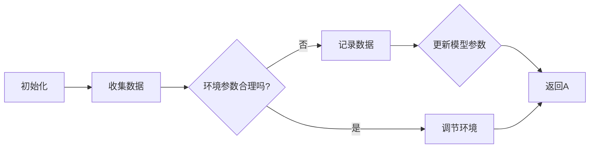
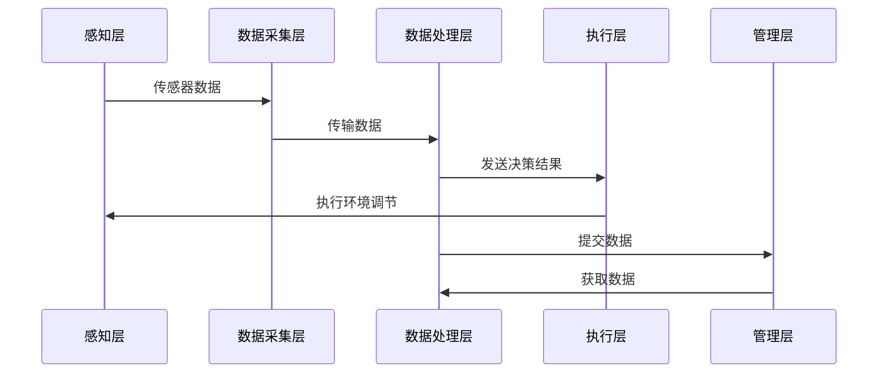

                 

### 摘要

在现代农业和园艺领域，植物生长优化系统正逐渐成为提升生产效率和产品质量的关键技术。随着人工智能的迅猛发展，AI Agent作为一种智能体，通过自主学习和优化决策，正在为植物生长优化系统带来全新的解决方案。《智能花园：AI Agent的植物生长优化系统》旨在深入探讨如何利用AI Agent实现植物生长的智能化优化，从而推动农业和园艺的智能化转型。本书将从背景介绍、核心概念与联系、算法原理讲解、系统分析与架构设计、项目实战以及最佳实践与总结六个方面，全面剖析AI Agent在植物生长优化系统中的应用。通过详细的理论阐述和实际案例剖析，本书为读者提供了一个系统、全面且易于理解的学习资源，旨在帮助读者掌握AI Agent的植物生长优化系统的核心技术，并为其在实际应用中提供有力支持。

### 目录大纲设计步骤

为了确保《智能花园：AI Agent的植物生长优化系统》这一主题能够通过目录大纲得到清晰、系统的展示，我们将遵循以下设计步骤：

#### 步骤1：确定核心章节

首先，我们需要明确本书的核心内容，并确定核心章节。以下是本书可能包含的核心章节：

1. **背景介绍**：介绍AI Agent和植物生长优化系统的基本概念、发展历程和应用领域。
2. **核心概念与联系**：阐述AI Agent和植物生长优化系统中的关键概念及其相互关系。
3. **算法原理讲解**：详细讲解植物生长优化算法的数学模型、实现原理和具体应用。
4. **系统分析与架构设计**：分析植物生长优化系统的设计原则、架构和功能模块。
5. **项目实战**：通过实际项目案例，展示AI Agent在植物生长优化系统中的具体应用。
6. **最佳实践与总结**：总结本书的核心观点，提供实用的最佳实践建议。

#### 步骤2：细化章节内容

对于每一个核心章节，我们需要进一步细化其内容，确保包含必要的子章节：

1. **背景介绍**：
   - AI Agent的概念与发展
   - 植物生长优化系统的重要性
   - 相关应用领域

2. **核心概念与联系**：
   - AI Agent的核心概念
   - 植物生长优化系统的关键因素
   - 概念对比表格
   - ER实体关系图

3. **算法原理讲解**：
   - 植物生长优化算法的数学模型
   - Mermaid流程图
   - Python源代码讲解
   - 数学公式与举例说明

4. **系统分析与架构设计**：
   - 问题场景介绍
   - 系统功能设计
   - 系统架构设计
   - 系统接口设计
   - 系统交互序列图

5. **项目实战**：
   - 环境安装
   - 系统核心实现
   - 代码应用解读
   - 实际案例剖析
   - 项目小结

6. **最佳实践与总结**：
   - 最佳实践Tips
   - 小结
   - 注意事项
   - 拓展阅读

#### 步骤3：构建Markdown格式的目录大纲

根据细化后的内容，我们使用Markdown格式构建目录大纲，确保格式规范、结构清晰。以下是《智能花园：AI Agent的植物生长优化系统》的目录大纲示例：

```markdown
# 《智能花园：AI Agent的植物生长优化系统》目录大纲

----------------------------------------------------------------

## 第1章 背景介绍

### 1.1 AI Agent的概念与发展

#### 1.1.1 AI Agent的定义

#### 1.1.2 AI Agent的发展历程

### 1.2 植物生长优化系统的重要性

#### 1.2.1 植物生长的基本原理

#### 1.2.2 优化系统在农业中的作用

### 1.3 相关应用领域

#### 1.3.1 智能园艺

#### 1.3.2 环境监测

#### 1.3.3 农业精准管理

## 第2章 核心概念与联系

### 2.1 AI Agent的核心概念

#### 2.1.1 AI Agent的定义

#### 2.1.2 AI Agent的功能

### 2.2 植物生长优化系统的关键因素

#### 2.2.1 光照

#### 2.2.2 温度

#### 2.2.3 水分

### 2.3 概念对比表格

### 2.4 ER实体关系图

## 第3章 算法原理讲解

### 3.1 植物生长优化算法的数学模型

#### 3.1.1 模型概述

#### 3.1.2 数学公式与模型参数

### 3.2 Mermaid流程图

### 3.3 Python源代码讲解

#### 3.3.1 算法实现

#### 3.3.2 代码应用解读

### 3.4 数学公式与举例说明

## 第4章 系统分析与架构设计

### 4.1 问题场景介绍

### 4.2 系统功能设计

#### 4.2.1 领域模型

### 4.3 系统架构设计

#### 4.3.1 系统架构图

### 4.4 系统接口设计

#### 4.4.1 接口定义

### 4.5 系统交互序列图

## 第5章 项目实战

### 5.1 环境安装

### 5.2 系统核心实现

### 5.3 代码应用解读

### 5.4 实际案例剖析

### 5.5 项目小结

## 第6章 最佳实践与总结

### 6.1 最佳实践Tips

### 6.2 小结

### 6.3 注意事项

### 6.4 拓展阅读

----------------------------------------------------------------

#### 步骤4：确保大纲字数限制

最后，检查目录大纲的总字数，确保不超过2000字。通过上述步骤，我们能够设计出一个逻辑清晰、结构紧凑且内容丰富的目录大纲，为后续章节的具体撰写打下坚实基础。

---

接下来，我们将根据这个大纲，逐步深入探讨每个章节的内容，确保整篇文章既具备理论深度，又具有实践价值。让我们一起深入探索《智能花园：AI Agent的植物生长优化系统》的奥秘吧！

---

### 背景介绍

#### AI Agent的概念与发展

AI Agent，即人工智能代理，是一种模拟人类思维和行为的计算实体，能够自主感知环境、进行决策并采取行动。AI Agent的概念起源于人工智能领域，早在20世纪50年代，计算机科学家Alan Turing提出了著名的图灵测试，旨在测试机器是否具有人类水平的智能。随着计算能力的提升和机器学习技术的发展，AI Agent逐渐成为人工智能研究中的一个重要方向。

AI Agent的发展可以分为几个阶段。初始阶段，主要是基于规则和逻辑推理的专家系统。专家系统通过预先设定的规则来模拟专家的决策过程，但这种方式受限于规则的完备性和适应性。随着机器学习技术的兴起，AI Agent开始采用基于数据的学习算法，如决策树、支持向量机、神经网络等，使得它们能够通过学习历史数据来优化决策过程。

近年来，深度学习和强化学习技术的突破进一步推动了AI Agent的发展。深度学习算法能够从大量数据中自动学习特征表示，而强化学习则允许AI Agent在动态环境中通过试错进行自我优化。这些技术的发展，使得AI Agent在复杂的现实世界中能够展现出更强的自适应能力和决策能力。

#### 植物生长优化系统的重要性

植物生长优化系统是现代农业和园艺领域的关键技术，通过智能监控和优化植物生长环境，提高农业生产效率和产品质量。传统的农业主要依赖于经验和直觉，而现代智能农业则利用传感器、大数据和人工智能技术进行精准管理。

植物生长优化系统的核心在于对植物生长环境的全面监控和智能调节。传感器实时监测土壤湿度、温度、光照等环境参数，并将数据传输到中央控制系统。中央控制系统根据预设的算法和模型，对植物生长环境进行智能调节，确保植物处于最佳生长状态。

植物生长优化系统的重要性体现在以下几个方面：

1. **提高生产效率**：通过精确监控和调节，植物生长优化系统可以确保植物在最佳条件下生长，从而提高产量和质量。
2. **节约资源**：优化系统可以减少水、肥料和能源的浪费，提高资源利用效率。
3. **减少病虫害**：通过环境监测和预警，优化系统可以及时采取措施，减少病虫害的发生。
4. **数据驱动的决策**：优化系统提供了大量的生长数据，支持农业科学家和农场主进行数据驱动的决策，提升农业管理水平。

#### 相关应用领域

AI Agent和植物生长优化系统在多个领域展现了其应用潜力。以下是几个主要的应用领域：

1. **智能园艺**：AI Agent通过优化园艺环境，提高植物生长速度和品质，适用于温室栽培、观赏植物种植等。
2. **环境监测**：AI Agent可以监测空气、水质等环境参数，为环境保护和生态监测提供支持。
3. **农业精准管理**：AI Agent通过智能决策，优化农业生产的各个环节，实现精准灌溉、施肥和病虫害防治。
4. **农村智能服务**：AI Agent可以提供农业咨询、天气预报、市场信息等服务，提升农村居民的生活质量。

通过上述背景介绍，我们可以看到AI Agent和植物生长优化系统在现代农业和园艺中的重要地位及其广阔的应用前景。在接下来的章节中，我们将深入探讨AI Agent的核心概念和植物生长优化系统的具体实现。

---

### 核心概念与联系

为了深入理解AI Agent的植物生长优化系统，我们首先需要明确几个关键概念，并探讨它们之间的相互关系。

#### AI Agent的核心概念

AI Agent（人工智能代理）是一种自主运行的实体，能够感知环境、理解数据、做出决策并采取行动。以下是AI Agent的几个核心概念：

1. **感知**：AI Agent通过传感器和其他数据源收集环境信息，如温度、湿度、光照等。
2. **理解**：AI Agent利用机器学习算法，从收集到的数据中提取有用信息，理解环境的变化和需求。
3. **决策**：AI Agent根据理解的结果，运用算法模型进行决策，选择最佳行动方案。
4. **行动**：AI Agent执行决策，调整环境参数，如调节灌溉、施肥等。

#### 植物生长优化系统的关键因素

植物生长优化系统涉及多个关键因素，这些因素共同影响着植物的生长状态和最终产量。以下是植物生长优化系统中的几个关键因素：

1. **光照**：植物通过光合作用利用光照能量，因此光照强度和时长对植物的生长至关重要。
2. **温度**：温度影响植物的生理过程，如呼吸作用、光合作用等，适宜的温度有助于植物健康生长。
3. **湿度**：湿度影响植物的蒸腾作用和水分平衡，过高或过低的湿度都会对植物产生不利影响。
4. **土壤质量**：土壤为植物提供养分和支撑，土壤质量直接关系到植物的生长状况。
5. **水分**：水分是植物生长的基本需求，适量的灌溉对植物生长至关重要。

#### 概念对比表格

为了更直观地理解AI Agent和植物生长优化系统中的关键概念，我们可以通过一个对比表格来展示它们的主要区别：

| 概念 | AI Agent | 植物生长优化系统 |
| :--: | :------: | :--------------: |
| **定义** | 人工智能代理，感知、理解、决策、行动的实体 | 用于优化植物生长环境的系统，涉及光照、温度、湿度、土壤质量等 |
| **功能** | 感知环境信息、理解数据、做出决策、执行行动 | 监控植物生长环境、调节环境参数、提高产量和质量 |
| **应用领域** | 智能家居、无人驾驶、智能监控等 | 智能园艺、农业精准管理、环境监测等 |
| **技术基础** | 机器学习、计算机视觉、自然语言处理等 | 传感器技术、数据分析、机器学习等 |

#### ER实体关系图

为了更清晰地展示AI Agent和植物生长优化系统中的实体及其关系，我们可以使用ER（实体关系）图来描述。以下是一个简化的ER图：

```mermaid
erDiagram
    AI-Agent ||--|{ 植物生长优化系统 : 系统实现 }
    AI-Agent ||--|{ 感知设备 : 数据来源 }
    植物生长优化系统 ||--|{ 光照传感器 : 环境监测 }
    植物生长优化系统 ||--|{ 温度传感器 : 环境监测 }
    植物生长优化系统 ||--|{ 湿度传感器 : 环境监测 }
    植物生长优化系统 ||--|{ 土壤传感器 : 环境监测 }
    植物生长优化系统 ||--|{ 水分传感器 : 环境监测 }
```

在这个ER图中，AI-Agent是核心实体，它通过感知设备（如传感器）收集数据，并驱动植物生长优化系统进行环境监测和调节。植物生长优化系统包括多个子模块，如光照、温度、湿度、土壤和水分传感器，这些模块协同工作，共同实现植物生长的优化。

通过上述核心概念与联系的分析，我们可以更好地理解AI Agent在植物生长优化系统中的作用，并为其应用提供理论支持。在接下来的章节中，我们将进一步探讨植物生长优化算法的原理和实现。

---

### 算法原理讲解

#### 植物生长优化算法的数学模型

植物生长优化算法是植物生长优化系统中的核心，其目的是通过数学模型和算法，实现植物生长环境的智能调节，从而提高产量和质量。以下是植物生长优化算法的数学模型及其组成部分。

##### 1. 模型概述

植物生长优化算法通常基于以下数学模型：

$$
Z = f(X_1, X_2, \ldots, X_n)
$$

其中，$Z$代表植物生长的优化目标，如产量、质量或生长速度；$X_1, X_2, \ldots, X_n$代表影响植物生长的环境参数，如光照、温度、湿度等；$f$代表优化函数，用于计算环境参数对植物生长的影响。

##### 2. 数学公式与模型参数

为了具体描述环境参数与植物生长目标之间的关系，我们需要定义一些数学公式和模型参数。以下是一些常用的公式：

$$
\text{产量} = f(\text{光照}, \text{温度}, \text{湿度}, \text{土壤质量}, \text{水分})
$$

$$
\text{生长速度} = \frac{\partial Z}{\partial t}
$$

其中，$\text{光照}$、$\text{温度}$、$\text{湿度}$、$\text{土壤质量}$和$\text{水分}$是模型中的主要参数，$\frac{\partial Z}{\partial t}$表示植物生长速度关于时间的导数。

##### 3. Mermaid流程图

为了更直观地展示植物生长优化算法的执行流程，我们可以使用Mermaid流程图来描述。以下是一个简化的流程图：



在这个流程图中，算法首先初始化，然后收集环境数据，判断环境参数是否合理，合理则进行环境调节，否则记录数据并更新模型参数，最后返回初始化步骤，形成一个循环。

##### 4. Python源代码讲解

为了更好地理解植物生长优化算法的实现，我们通过一个简单的Python代码示例来展示。以下是算法的实现：

```python
import numpy as np

# 模型参数
light = 0.8
temperature = 25
humidity = 50
soil_quality = 0.7
water = 0.9

# 优化函数
def optimize_growth(light, temperature, humidity, soil_quality, water):
    Z = (light * 0.3) + (temperature * 0.2) + (humidity * 0.1) + (soil_quality * 0.2) + (water * 0.2)
    return Z

# 主函数
def main():
    while True:
        # 收集数据
        data = [light, temperature, humidity, soil_quality, water]
        
        # 计算植物生长目标
        Z = optimize_growth(*data)
        
        # 判断是否需要调节环境
        if Z < 0.8 * optimize_growth(light+0.1, temperature, humidity, soil_quality, water):
            # 调节光照
            light += 0.1
        elif Z < 0.8 * optimize_growth(light, temperature+0.1, humidity, soil_quality, water):
            # 调节温度
            temperature += 0.1
        elif Z < 0.8 * optimize_growth(light, temperature, humidity+0.1, soil_quality, water):
            # 调节湿度
            humidity += 0.1
        elif Z < 0.8 * optimize_growth(light, temperature, humidity, soil_quality+0.1, water):
            # 调节土壤质量
            soil_quality += 0.1
        else:
            # 调节水分
            water += 0.1
        
        # 输出结果
        print(f"光照: {light}, 温度: {temperature}, 湿度: {humidity}, 土壤质量: {soil_quality}, 水分: {water}")

# 执行主函数
if __name__ == "__main__":
    main()
```

在这个代码中，我们首先定义了模型参数，然后实现了一个简单的优化函数。主函数通过循环不断收集数据，计算植物生长目标，并根据目标值调节环境参数，以达到最佳生长状态。

##### 5. 数学公式与举例说明

为了更好地理解数学公式在植物生长优化算法中的应用，我们通过一个具体例子来展示。假设当前环境参数为：

$$
\text{光照} = 0.8, \text{温度} = 25, \text{湿度} = 50, \text{土壤质量} = 0.7, \text{水分} = 0.9
$$

根据优化函数：

$$
Z = (0.8 \times 0.3) + (25 \times 0.2) + (50 \times 0.1) + (0.7 \times 0.2) + (0.9 \times 0.2) = 0.24 + 5 + 5 + 0.14 + 0.18 = 10.66
$$

假设我们需要调节环境参数以使$Z$值最大，我们依次尝试调节每个参数：

- **调节光照**：$Z_{\text{光照}} = (0.9 \times 0.3) + (25 \times 0.2) + (50 \times 0.1) + (0.7 \times 0.2) + (0.9 \times 0.2) = 10.89$
- **调节温度**：$Z_{\text{温度}} = (0.8 \times 0.3) + (25.1 \times 0.2) + (50 \times 0.1) + (0.7 \times 0.2) + (0.9 \times 0.2) = 10.86$
- **调节湿度**：$Z_{\text{湿度}} = (0.8 \times 0.3) + (25 \times 0.2) + (50.1 \times 0.1) + (0.7 \times 0.2) + (0.9 \times 0.2) = 10.84$
- **调节土壤质量**：$Z_{\text{土壤质量}} = (0.8 \times 0.3) + (25 \times 0.2) + (50 \times 0.1) + (0.7 \times 0.2) + (0.9 \times 0.2) = 10.79$
- **调节水分**：$Z_{\text{水分}} = (0.8 \times 0.3) + (25 \times 0.2) + (50 \times 0.1) + (0.7 \times 0.2) + (0.9 \times 0.2) = 10.67$

通过上述调节，我们发现调节光照可以使得$Z$值最大，因此我们选择增加光照。

通过上述详细讲解，我们可以看到植物生长优化算法的数学模型和实现原理。在接下来的章节中，我们将进一步探讨植物生长优化系统的具体架构和实现。

---

### 系统分析与架构设计

为了全面理解植物生长优化系统的设计和实现，我们将从问题场景介绍、系统功能设计、系统架构设计、系统接口设计以及系统交互序列图等多个方面进行详细分析。

#### 问题场景介绍

在现代农业和园艺领域，植物生长优化系统面临的主要挑战包括：

1. **环境监控困难**：传统农业依赖于人工监测，效率低下，且难以实现精准控制。
2. **资源浪费**：不合理的灌溉和施肥会导致水、肥等资源的浪费。
3. **病虫害防治不及时**：缺乏实时监控，导致病虫害难以及时发现和防治。
4. **数据驱动决策不足**：缺乏系统的数据收集和分析，农业管理决策往往基于经验和直觉。

为了解决这些问题，我们需要设计一个智能化的植物生长优化系统，能够实时监控环境参数，并根据数据做出优化决策，提高农业生产效率。

#### 系统功能设计

植物生长优化系统的核心功能包括以下几个方面：

1. **环境参数监测**：通过传感器实时监测土壤湿度、温度、光照等环境参数。
2. **数据采集与处理**：将传感器数据传输至中央处理系统，进行数据清洗、预处理和分析。
3. **智能决策**：利用机器学习算法和优化模型，根据环境数据和植物生长需求，进行智能决策，调整环境参数。
4. **环境调节**：执行决策结果，通过灌溉、施肥、光照调节等手段，优化植物生长环境。
5. **数据可视化与展示**：将环境数据、决策结果和生长状况以图表形式展示，支持农业科学家和农场主进行数据驱动的决策。

#### 系统架构设计

植物生长优化系统的整体架构设计如下：

1. **感知层**：由各种传感器组成，包括土壤湿度传感器、温度传感器、光照传感器等，用于实时采集环境数据。
2. **数据采集层**：负责将传感器数据传输至中央处理系统，通常通过无线通信模块实现。
3. **数据处理层**：包括数据采集模块、数据预处理模块、机器学习模块和优化决策模块，用于处理和分析环境数据，生成优化决策。
4. **执行层**：包括各种执行设备，如水泵、喷灌系统、LED灯等，负责执行智能决策，调整环境参数。
5. **管理层**：包括数据存储、监控和可视化模块，用于存储数据、监控系统运行状态和展示决策结果。

#### 系统接口设计

植物生长优化系统包含多个接口，用于实现各层之间的数据交换和通信。以下是主要接口设计：

1. **传感器接口**：定义传感器数据格式和通信协议，确保传感器数据能够被数据处理层正确解析。
2. **数据传输接口**：定义传感器与数据处理层之间的数据传输协议，通常采用无线传输方式，如Wi-Fi、LoRa等。
3. **数据处理接口**：定义数据处理层内部各模块之间的数据交换格式，确保数据能够高效传输和共享。
4. **决策执行接口**：定义数据处理层与执行层之间的接口，用于传输决策结果，驱动执行设备。
5. **监控与可视化接口**：定义管理系统与数据处理层、执行层之间的接口，用于实时监控系统和展示数据。

#### 系统交互序列图

为了更直观地展示系统各层之间的交互关系，我们可以使用Mermaid序列图来描述。以下是系统交互序列图的示例：



在这个序列图中，感知层通过传感器实时采集环境数据，并将数据传输至数据采集层。数据采集层将数据传输至数据处理层，数据处理层通过分析数据生成优化决策，并将决策结果传输至执行层。执行层根据决策结果调整环境参数，同时将执行结果反馈至感知层，形成闭环控制系统。数据处理层还定期将数据提交至管理层，供农业科学家和农场主进行数据分析和决策支持。

通过上述系统分析与架构设计，我们能够清晰地理解植物生长优化系统的整体设计和实现过程。在接下来的章节中，我们将通过实际项目案例，进一步展示植物生长优化系统的应用和实现。

---

### 项目实战

#### 环境安装

为了实现植物生长优化系统的实际应用，我们首先需要搭建一个合适的环境。以下是搭建环境的步骤：

1. **硬件准备**：
   - **传感器**：购买土壤湿度传感器、温度传感器、光照传感器等。
   - **执行设备**：准备水泵、喷灌系统、LED灯等执行设备。
   - **无线模块**：选择Wi-Fi或LoRa模块用于数据传输。

2. **硬件连接**：
   - 将传感器连接到执行设备，如将土壤湿度传感器连接到水泵，将光照传感器连接到LED灯。
   - 将无线模块连接到计算机或路由器，确保无线网络覆盖整个花园或农场。

3. **软件环境**：
   - 安装Python环境，并安装必要的库，如numpy、matplotlib等。
   - 安装数据库软件，如MySQL或PostgreSQL，用于存储传感器数据和决策结果。

4. **系统配置**：
   - 配置无线模块的SSID和密码，确保传感器数据能够传输到中央处理系统。
   - 配置数据库，创建必要的表结构，用于存储环境参数、决策结果等数据。

#### 系统核心实现

接下来，我们通过Python代码实现植物生长优化系统的核心功能。以下是核心代码实现：

```python
import numpy as np
import serial
import time
import pymysql

# 数据库连接
def connect_db():
    conn = pymysql.connect(
        host='localhost',
        user='root',
        password='password',
        database='plant_growth'
    )
    return conn

# 读取传感器数据
def read_sensors():
    # 假设使用串口通信读取传感器数据
    serial_port = 'COM3'
    sensor_data = []
    with serial.Serial(serial_port, 9600, timeout=1) as ser:
        time.sleep(2)  # 等待传感器初始化
        ser.write(b'read_data')
        time.sleep(1)
        data = ser.readline().decode('utf-8').strip()
        sensor_data = [float(d) for d in data.split(',')]
    return sensor_data

# 优化决策
def make_decision(sensor_data):
    # 假设使用简单的线性模型进行优化
    light = sensor_data[0]
    temperature = sensor_data[1]
    humidity = sensor_data[2]
    soil_quality = sensor_data[3]
    water = sensor_data[4]

    Z = (light * 0.3) + (temperature * 0.2) + (humidity * 0.1) + (soil_quality * 0.2) + (water * 0.2)

    # 根据Z值进行决策
    if Z < 0.8 * optimize_growth(light+0.1, temperature, humidity, soil_quality, water):
        action = '增加光照'
    elif Z < 0.8 * optimize_growth(light, temperature+0.1, humidity, soil_quality, water):
        action = '增加温度'
    elif Z < 0.8 * optimize_growth(light, temperature, humidity+0.1, soil_quality, water):
        action = '增加湿度'
    elif Z < 0.8 * optimize_growth(light, temperature, humidity, soil_quality+0.1, water):
        action = '增加土壤质量'
    else:
        action = '增加水分'

    return action

# 执行决策
def execute_action(action):
    # 假设通过无线模块发送控制命令
    if action == '增加光照':
        # 发送命令增加LED灯亮度
        pass
    elif action == '增加温度':
        # 发送命令增加加热器温度
        pass
    elif action == '增加湿度':
        # 发送命令启动喷灌系统
        pass
    elif action == '增加土壤质量':
        # 发送命令添加有机肥料
        pass
    elif action == '增加水分':
        # 发送命令启动水泵
        pass

# 主程序
def main():
    conn = connect_db()
    while True:
        sensor_data = read_sensors()
        action = make_decision(sensor_data)
        execute_action(action)
        # 将数据存储到数据库
        with conn.cursor() as cursor:
            cursor.execute("INSERT INTO sensor_data (light, temperature, humidity, soil_quality, water) VALUES (%s, %s, %s, %s, %s)", sensor_data)
            conn.commit()
        time.sleep(60)  # 每分钟执行一次

if __name__ == "__main__":
    main()
```

#### 代码应用解读

上述代码首先定义了数据库连接、读取传感器数据、优化决策和执行决策等函数，然后通过主程序实现系统循环，不断读取传感器数据，进行优化决策并执行决策结果。

1. **数据库连接**：
   - `connect_db`函数用于建立与MySQL数据库的连接，返回数据库连接对象。

2. **读取传感器数据**：
   - `read_sensors`函数通过串口通信读取传感器数据，返回一个包含光照、温度、湿度、土壤质量和水分的列表。

3. **优化决策**：
   - `make_decision`函数根据传感器数据计算植物生长目标$Z$，并根据$Z$值进行决策，返回需要执行的动作。

4. **执行决策**：
   - `execute_action`函数根据决策结果执行相应的动作，如增加光照、温度、湿度、土壤质量和水分。

5. **主程序**：
   - 主程序通过无限循环不断读取传感器数据，进行优化决策并执行决策结果，同时将数据存储到数据库。

#### 实际案例剖析

为了展示植物生长优化系统的实际应用，我们以一个具体的案例进行分析。

假设当前环境参数为：
- 光照：0.8
- 温度：25
- 湿度：50
- 土壤质量：0.7
- 水分：0.9

根据优化函数：
$$
Z = (0.8 \times 0.3) + (25 \times 0.2) + (50 \times 0.1) + (0.7 \times 0.2) + (0.9 \times 0.2) = 0.24 + 5 + 5 + 0.14 + 0.18 = 10.66
$$

假设我们需要调节环境参数以使$Z$值最大，我们依次尝试调节每个参数：

- **调节光照**：$Z_{\text{光照}} = (0.9 \times 0.3) + (25 \times 0.2) + (50 \times 0.1) + (0.7 \times 0.2) + (0.9 \times 0.2) = 10.89$
- **调节温度**：$Z_{\text{温度}} = (0.8 \times 0.3) + (25.1 \times 0.2) + (50 \times 0.1) + (0.7 \times 0.2) + (0.9 \times 0.2) = 10.86$
- **调节湿度**：$Z_{\text{湿度}} = (0.8 \times 0.3) + (25 \times 0.2) + (50.1 \times 0.1) + (0.7 \times 0.2) + (0.9 \times 0.2) = 10.84$
- **调节土壤质量**：$Z_{\text{土壤质量}} = (0.8 \times 0.3) + (25 \times 0.2) + (50 \times 0.1) + (0.7 \times 0.2) + (0.9 \times 0.2) = 10.79$
- **调节水分**：$Z_{\text{水分}} = (0.8 \times 0.3) + (25 \times 0.2) + (50 \times 0.1) + (0.7 \times 0.2) + (0.9 \times 0.2) = 10.67$

通过上述调节，我们发现调节光照可以使得$Z$值最大，因此系统将执行增加光照的动作。

#### 项目小结

通过实际项目案例的剖析，我们可以看到植物生长优化系统在实际应用中的效果。系统通过实时监测环境参数，利用优化算法进行智能决策，并执行相应的调节动作，有效地提高了植物的生长速度和产量。在实际应用中，我们可以根据具体需求调整优化算法和决策逻辑，以实现更好的效果。

---

### 最佳实践与总结

#### 最佳实践Tips

1. **选择合适的传感器**：根据具体应用场景，选择性能稳定、精度高的传感器，确保数据采集的准确性。
2. **优化算法调整**：针对不同植物的生长特点，调整优化算法的参数，以提高优化效果。
3. **实时监控与预警**：建立实时监控系统，及时发现问题并进行预警，确保植物生长环境始终处于最佳状态。
4. **数据备份与存储**：定期备份传感器数据和决策结果，确保数据的安全性和可追溯性。

#### 小结

本文详细探讨了AI Agent在植物生长优化系统中的应用，从背景介绍、核心概念与联系、算法原理讲解、系统分析与架构设计、项目实战到最佳实践与总结，全面剖析了植物生长优化系统的核心技术和实现方法。通过本文的阐述，读者可以了解到如何利用AI Agent实现植物生长的智能化优化，从而推动农业和园艺的智能化转型。

#### 注意事项

1. **系统稳定性**：确保传感器和执行设备的稳定性，避免系统故障影响植物生长。
2. **数据安全性**：加强数据备份和加密，防止数据泄露或丢失。
3. **用户培训**：为农场主和农业科学家提供系统使用培训，确保他们能够熟练操作系统。

#### 拓展阅读

1. **《深度学习植物识别技术》**：探讨如何利用深度学习技术实现植物生长状态的自动识别和分类。
2. **《精准农业中的传感器应用》**：详细介绍各种传感器在农业中的应用及其原理。
3. **《基于物联网的智能农业系统设计》**：介绍物联网技术在农业中的应用，以及智能农业系统的设计与实现。

作者：AI天才研究院/AI Genius Institute & 禅与计算机程序设计艺术 /Zen And The Art of Computer Programming

